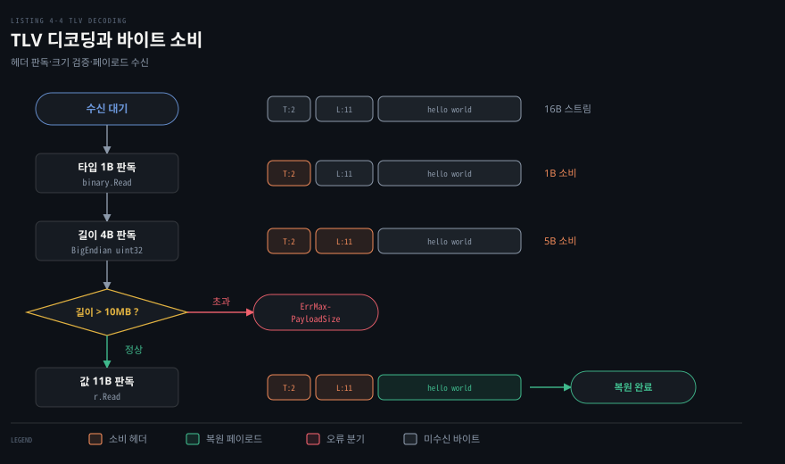

# TCP 는 경계 없는 바이트 흐름이라 읽는 쪽이 메시지를 자른다

---

> 4장 앞부분은 TCP 소켓을 통해 데이터를 읽고 쓸 때 맞닥뜨리는 가장 근본적인 문제, 곧 메시지 경계의 부재를 해결하는 방법을 다룹니다. Go 의 `net.Conn` 은 파일처럼 단순한 입출력 인터페이스를 제공하지만, 연속된 바이트 흐름에서 온전한 의미 단위를 복원하는 책임은 애플리케이션에 있습니다.

## 핵심 요약

> 이 편이 매달린 하나의 생각은, TCP 가 패킷이나 레코드의 경계를 보존하지 않는 연속 바이트 스트림이므로 수신 측 애플리케이션이 고정 버퍼·구분자·길이 헤더 중 한 가지 방식을 택해 메시지 경계를 스스로 복원해야 한다는 사실입니다.

Go 의 `net.Conn` 인터페이스는 `io.Reader` 와 `io.Writer` 를 구현하므로 일반 파일이나 메모리 버퍼를 다루듯 네트워크 데이터를 읽고 쓸 수 있습니다. 하지만 하위 TCP 프로토콜은 송신 측이 호출한 `Write` 의 크기나 횟수를 기억하지 않고 네트워크 세그먼트와 수신 윈도 크기에 맞춰 바이트를 쪼개어 전달합니다. 따라서 수신 측의 `Read` 호출은 송신 측의 단일 메시지와 일대일로 대응하지 않습니다.

원문은 스트림을 의미 있는 메시지로 자르는 세 가지 실전 기법을 차례로 제시합니다. 단순 고정 버퍼 읽기, `bufio.Scanner` 를 활용한 구분자 기반 읽기, 그리고 타입과 길이를 명시하는 TLV(Type-Length-Value) 동적 프레이밍입니다. 여기에 일시적인 네트워크 전송 결함에 대처하는 오류 처리 루프를 더해 튼튼한 송수신 기반을 다집니다.


## 학습 목표

> 이 편을 읽고 나면 아래 다섯 가지를 스스로 해낼 수 있습니다.

1. `net.TCPConn` 구체 타입 대신 `net.Conn` 인터페이스를 기본으로 사용하는 이유와 `io.ReadWriteCloser` 호환성의 이점을 설명할 수 있습니다.
2. `conn.Read()` 가 버퍼 용량을 채우지 않고 즉시 반환하는 조건과 `io.EOF` 도달 시점을 원서의 수치 예제로 재현할 수 있습니다.
3. 바이트 스트림에 자체 문장부호가 없는 이유를 짚고, `bufio.Scanner` 와 `ScanWords` 로 구분자 경계를 끊어내는 원리를 말할 수 있습니다.
4. TLV 구조에서 타입·길이 헤더의 크기와 바이트 순서를 설계하고, 최대 페이로드 한도가 방어하는 보안 위험을 설명할 수 있습니다.
5. 일시적 전송 오류에 대해 `Timeout()` 판별과 대기를 결합한 재시도 루프를 구성할 수 있습니다.


## 1. net.Conn 은 파일처럼 읽고 쓴다

> `net.Conn` 은 운영체제별 세부를 가리는 추상화 인터페이스이며, 표준 입출력 인터페이스인 `io.ReadWriteCloser` 를 구현하여 방대한 Go 표준 라이브러리 생태계와 자연스럽게 결합합니다.

### 인터페이스 기반 프로그래밍의 실익

원문은 책 전반의 예제에서 구체 구조체인 `net.TCPConn` 대신 `net.Conn` 인터페이스를 일관되게 사용합니다. 구체 타입에 종속되지 않으면 코드가 특정 운영체제의 시스템 콜에 얽매이지 않아 이식성이 높아집니다.

단위 테스트 작성에서도 결정적인 이점을 얻습니다. 구체 타입은 실제 네트워크 소켓을 생성해야 하지만, `net.Conn` 인터페이스는 메모리 버퍼(`bytes.Buffer`)나 가상 파이프(`net.Pipe`)로 손쉽게 대체할 수 있습니다. 복잡한 네트워크 통신 코드를 가벼운 단위 테스트로 검증할 수 있는 이유가 여기에 있습니다. 구체적인 TCP 소켓 옵션 제어가 필요한 예외적인 상황에 대해서는 [04-03](./04-03.TCPConn%20손잡이와%20흔한%20버그%20—%20keepalive·linger·버퍼·zero%20window·CLOSE_WAIT.md)에서 `net.TCPConn` 을 꺼내는 방법을 다룹니다.

### 파일 입출력과의 동일성

Go 애플리케이션 관점에서 네트워크 소켓 입출력은 디스크 파일 입출력과 다르지 않습니다. `net.Conn` 이 아래 세 표준 인터페이스를 모두 내장하는 `io.ReadWriteCloser` 인터페이스를 온전히 구현하기 때문입니다.

1. `Read(b []byte) (n int, err error)`: 데이터를 바이트 슬라이스로 읽어 들입니다(`io.Reader`).
2. `Write(b []byte) (n int, err error)`: 바이트 슬라이스의 데이터를 대상 소켓으로 전송합니다(`io.Writer`).
3. `Close() error`: 네트워크 연결을 닫고 관련 자원을 운영체제에 반환합니다(`io.Closer`).

이 호환성 덕분에 Go 개발자는 `io.Copy`, `bufio.NewReader`, `crypto/tls`, `compress/gzip` 처럼 표준 입출력 인터페이스를 기대하는 수많은 고성능 유틸리티를 네트워크 코드에 수정 없이 그대로 붙여 쓸 수 있습니다.

연결의 유휴 상태를 방지하고 이상을 감지하기 위한 수단으로는 `SetDeadline`, `SetReadDeadline`, `SetWriteDeadline` 메서드가 제공됩니다. 이 메서드들은 절대 시간(`time.Time`)을 받아 동작하며, 구체적인 데드라인 동작 방식은 앞선 [03-03](./03-03.타임아웃은%20Dialer·context%20로,%20유휴%20감지는%20데드라인과%20하트비트로%20건다.md)에서 다룬 원리와 같습니다.


## 2. 고정 버퍼로 읽으면 메시지 경계는 내 몫이다

> `conn.Read()` 는 수신 소켓 버퍼에 도착한 만큼만 사용자 버퍼에 채우고 즉시 반환하므로, 고정 크기 버퍼로 읽을 때는 애플리케이션이 직접 바이트 조각들을 이어붙여야 합니다.

### Read 가 버퍼를 채우는 규칙

원문은 `conn.Read()` 를 호출할 때 가장 흔히 저지르는 착각을 짚습니다. 전달한 바이트 슬라이스의 용량이 가득 찰 때까지 `Read` 가 블로킹될 것이라는 기대입니다.

실제 동작은 다릅니다. 소켓의 수신 버퍼에 전달받은 바이트 슬라이스 용량보다 적은 양의 데이터만 들어 있다면, `Read` 는 더 많은 데이터가 도착하기를 기다리지 않고 수신 버퍼에 있는 만큼만 슬라이스에 복사한 뒤 곧바로 반환합니다. 즉, `Read` 는 반환 시점에 버퍼를 끝까지 채운다고 보장하지 않습니다.

### 16MB 송신과 512KB 버퍼 수신 실습

원문 Listing 4-1 은 16MB(`1 << 24` 바이트)의 무작위 페이로드를 전송하는 서버와 512KB(`1 << 19` 바이트) 고정 버퍼로 이를 수신하는 클라이언트의 테스트(`read_test.go`)를 제시합니다.

```go
// Listing 4-1 발췌: 고정 버퍼를 통한 수신 루프
buf := make([]byte, 1<<19) // 512 KB
for {
    n, err := conn.Read(buf)
    if err != nil {
        if err != io.EOF {
            t.Error(err)
        }
        break
    }
    t.Logf("read %d bytes", n) // buf[:n] 구간만 실제 수신 데이터
}
```

클라이언트는 `conn.Read(buf)` 를 반복 호출하며 수신된 바이트 수 `n` 을 로깅합니다. 이때 유효한 데이터는 `buf` 전체가 아니라 슬라이싱된 `buf[:n]` 구간뿐입니다.

서버가 16MB 전체를 전송하고 연결을 닫으면, 수신 측은 마지막 데이터 조각을 읽어낸 뒤 다음 `Read` 호출에서 `io.EOF` 를 수신합니다. `io.EOF` 는 전송 오류가 아니라 정상적인 스트림 종료 신호이므로 별도로 분기하여 루프를 탈출해야 합니다. 정상 종료와 `io.EOF` 의 패킷 수준 매커니즘은 [03-02 §2](./03-02.Go%20의%20TCP%20연결은%20Listen·Accept·Dial%20세%20호출로%20맺는다.md)에서 살펴본 바와 같습니다.

이 방식은 수신한 데이터의 경계가 오직 버퍼 크기나 TCP 세그먼트 도착 타이밍에 종속됩니다. 텍스트 문서나 구조화된 객체를 주고받는다면 수신 측 코드가 바이트 스트림 안에서 메시지의 시작과 끝을 구분해 내는 로직을 추가로 구현해야 합니다.


## 3. 구분자가 있으면 bufio.Scanner 로 자른다

> 스트림 데이터에 문장부호 같은 자체 경계가 없을 때, 특정 구분자를 기준으로 스트림을 분리해 토큰화하는 가장 간결한 도구가 `bufio.Scanner` 입니다.

### 자체 문장부호가 없는 바이너리 스트림

일상 언어의 문장은 마침표나 쉼표 같은 문장부호로 끝을 알립니다. 하지만 네트워크를 통해 흐르는 원시 바이너리 스트림에는 어디서 메시지가 시작하고 끝나는지 알려 주는 내재적 표식이 없습니다.

만약 이메일 메시지처럼 특정 구분자(예: 빈 줄 `\r\n\r\n` 이나 널 바이트)를 기준으로 메시지를 나누려 한다면 엣지 케이스가 급증합니다. 한 번의 `Read` 호출로 읽은 1KB 데이터 안에 구분자가 두 개 들어있을 수도 있고, 구분자가 전혀 포함되지 않아 다음 `Read` 결과와 이어붙여야 할 수도 있습니다. 심지어 1KB 전체가 구분자 바이트로만 채워진 극단적인 상황도 처리해야 합니다.

이러한 수동 버퍼링과 인덱스 탐색의 복잡성을 흡수해 주는 표준 패키지 도구가 `bufio.Scanner` 입니다.

### bufio.Scanner 와 Split 함수의 결합

`bufio.Scanner` 는 `io.Reader` 를 입력으로 받습니다. `net.Conn` 이 `io.Reader` 를 구현하므로 소켓 연결을 그대로 넘겨줄 수 있습니다.

원문 Listing 4-2 와 4-3 은 구분자를 이용해 소켓 데이터를 읽는 전형적인 테스트(`scanner_test.go`)를 보여줍니다. 서버는 `"The bigger the interface, the weaker the abstraction."` 문자열을 소켓에 씁니다.

```go
// Listing 4-3 발췌: bufio.Scanner 를 이용한 단어 분리 수신
scanner := bufio.NewScanner(conn)
scanner.Split(bufio.ScanWords) // 공백 및 문장부호 경계 분리

var words []string
for scanner.Scan() {
    words = append(words, scanner.Text())
}
if err := scanner.Err(); err != nil {
    t.Error(err)
}
```

스캐너의 기본 분할 함수(`SplitFunc`)는 개행 문자(`\n`)를 기준으로 자르는 `bufio.ScanLines` 입니다. 위 예제에서는 `scanner.Split(bufio.ScanWords)` 를 지정하여 공백 문자와 인접 문장부호를 기준으로 단어 단위 토큰을 추출하도록 변경했습니다.

`scanner.Scan()` 메서드를 한 번 부를 때마다 스캐너 내부에서는 구분자를 찾을 때까지 네트워크 연결의 `Read` 를 필요한 만큼 여러 번 호출합니다. 개발자는 여러 패킷에 걸쳐 분할 도착하는 저수준 읽기 작업을 신경 쓰지 않고, `scanner.Text()` 나 `scanner.Bytes()` 를 호출해 온전한 토큰 단위로 데이터를 취할 수 있습니다. 스트림이 끝나 `io.EOF` 가 오면 `Scan()` 은 `false` 를 돌려주며 루프가 종료됩니다. 루프 탈출 후 `scanner.Err()` 를 검사하여 정상 종료인지 통신 오류인지를 확인합니다.


## 4. TLV 로 길이를 먼저 보내 버퍼를 알맞게 잡는다

> TLV(Type-Length-Value) 프로토콜은 고정 길이 헤더로 데이터 종류와 페이로드 크기를 먼저 알림으로써 수신 측이 필요한 크기만큼 버퍼를 할당하여 안전하게 읽을 수 있게 합니다.

### 5바이트 고정 헤더와 가변 페이로드

바이너리 통신이나 구조화된 객체를 주고받을 때는 문자열 구분자를 쓰는 방식보다 길이를 숫자로 명시하는 방식이 훨씬 안정적입니다. 원문은 단순하면서도 실무에서 널리 쓰이는 TLV 인코딩 방식을 채택합니다.

원문의 TLV 명세는 5바이트 고정 헤더로 구성됩니다.
1. **Type (1바이트)**: 페이로드의 데이터 형식을 나타내는 `uint8` 값입니다. 원문 Listing 4-4 에 따라 `BinaryType` 은 1, `StringType` 은 2로 정의됩니다.
2. **Length (4바이트)**: 뒤따라올 페이로드의 바이트 수를 나타내는 `uint32` 값입니다. 네트워크 표준인 빅엔디언(`binary.BigEndian`) 바이트 순서로 기록됩니다. 바이트 순서와 네트워크 바이트 오더의 구체적인 개념은 [gonet-lab 03-01 DNS 질의 한 장을 바이트로](../../project/gonet-lab/03-01.DNS%20질의%20한%20장을%20바이트로%20-%20헤더·라벨·압축%20포인터·TC.md)를 참고할 수 있습니다.
3. **Value (가변 길이)**: 실제 데이터 바이트(페이로드)입니다.

아래 도식은 Listing 4-7·4-8 의 String 타입 페이로드 `"hello world"` 문자열(11바이트)을 TLV 로 전송할 때 네트워크에 실리는 16바이트의 실제 메모리 배치를 나타냅니다.



### 메모리 고갈 공격 방어와 MaxPayloadSize

원문 Listing 4-4 는 보안 목적의 핵심 상수로 `MaxPayloadSize` 를 선언합니다.

```go
const (
    BinaryType uint8 = iota + 1
    StringType
    MaxPayloadSize uint32 = 10 << 20 // 10 MB
)
var ErrMaxPayloadSize = errors.New("maximum payload size exceeded")
```

길이를 표현하는 `uint32` 필드는 최대 4,294,967,295(약 4GB)까지 담을 수 있습니다. 수신 측이 이 길이를 검증 없이 신뢰하면 치명적인 문제가 생깁니다. 공격자가 4GB 를 적어 보내는 순간 수신 노드의 메모리가 고갈되어 OOM 으로 프로세스가 강제 종료되는 서비스 거부 공격이 성립하기 때문입니다.

원문 Listing 4-6 과 4-12 는 `size > MaxPayloadSize` 를 검사하여 한도를 넘는 즉시 `ErrMaxPayloadSize` 오류를 반환하고 연결을 끊어 시스템 자원을 보호합니다.

### io.MultiReader 를 이용한 스트림 재합성

원문 Listing 4-9 의 `decode` 함수는 소켓 리더(`io.Reader`)에서 임의의 페이로드를 복원하는 일반화 로직을 보여줍니다.

```go
// Listing 4-9 발췌: 타입 선별 및 스트림 재합성
func decode(r io.Reader) (Payload, error) {
    var typ uint8
    err := binary.Read(r, binary.BigEndian, &typ)
    if err != nil {
        return nil, err
    }

    var payload Payload
    switch typ {
    case BinaryType:
        payload = new(Binary)
    case StringType:
        payload = new(String)
    default:
        return nil, errors.New("unknown type")
    }

    _, err = payload.ReadFrom(
        io.MultiReader(bytes.NewReader([]byte{typ}), r))
    if err != nil {
        return nil, err
    }
    return payload, nil
}
```

이 구현에서 눈여겨볼 트릭은 `io.MultiReader` 의 활용입니다. `decode` 함수는 타입을 판별하기 위해 소켓에서 이미 1바이트를 읽었습니다. 그런데 타입별 `ReadFrom` 메서드 역시 첫 바이트에서 타입을 다시 확인하도록 설계되어 있습니다. 소켓에서 이미 소비해 버린 1바이트를 되돌려놓기 위해, 원문은 이미 읽은 1바이트를 담은 `bytes.NewReader` 와 원본 소켓 `r` 을 `io.MultiReader` 로 결합하여 마치 아무것도 읽지 않은 스트림인 것처럼 `ReadFrom` 에 건넵니다.

원문도 스스로 지적하듯, 이는 `io.MultiReader` 의 활용법을 보여주기 위한 기교일 뿐 이상적인 설계는 아닙니다. 가장 깔끔한 해법은 `ReadFrom` 메서드가 타입 바이트를 다시 읽지 않고 4바이트 길이와 본문만 읽도록 리팩토링하는 것입니다.

페이로드를 읽는 쪽에도 함정이 하나 있습니다. `ReadFrom` 은 `*m = make([]byte, size)` 로 버퍼를 잡은 뒤 `r.Read(*m)` 를 한 번만 부릅니다. 그런데 §2 에서 본 대로 `Read` 는 버퍼를 끝까지 채운다고 보장하지 않습니다. 페이로드가 여러 세그먼트로 나뉘어 도착하면 앞부분만 읽고 돌아옵니다. `size` 바이트를 빠짐없이 받아야 하는 자리에서는 [`io.ReadFull(r, *m)`](https://pkg.go.dev/io#ReadFull) 을 써야 합니다. `io.ReadFull` 은 버퍼가 찰 때까지 `Read` 를 반복합니다.


## 5. 읽기·쓰기 오류는 일시적일 수 있다

> 디스크 파일 쓰기와 달리 네트워크 쓰기는 일시적 통신 장애로 실패할 수 있으므로, 에러의 종류를 판별하여 복구 가능한 지연인지 영구적 단절인지 가려내야 합니다.

### 일시적 오류와 영구적 단절의 차이

로컬 디스크 파일에 데이터를 쓸 때는 쓰기 도중 에러가 발생하는 일이 드뭅니다. 하지만 물리 케이블, 스위치, 라우터를 거치는 네트워크 소켓 쓰기는 수시로 불안정해집니다.

수신 측 노드가 갑자기 전원이 꺼지거나 프로세스가 죽으면 연결 자체가 완전히 파괴되는 영구적 오류가 일어납니다. 반면 케이블이 잠시 헐거워졌거나 일시적인 네트워크 폭주로 상대방의 ACK 수신이 지연되어 타임아웃이 발생한 경우라면, 소켓 세션 자체는 여전히 살아있으므로 잠시 대기한 뒤 재시도하면 전송에 성공할 수 있습니다.

### 재시도 루프와 일시적 오류 판별

원문 Listing 4-13 은 `"hello world"` 문자열을 소켓에 쓰면서 일시적 오류를 감지하고 최대 7회까지 재시도하는 로직을 보여줍니다.

```go
// Listing 4-13 발췌: 타임아웃 오류에 대한 재시도 루프
var (
    err error
    n int
    i = 7 // 최대 재시도 횟수
)
for ; i > 0; i-- {
    n, err = conn.Write([]byte("hello world"))
    if err != nil {
        if nErr, ok := err.(net.Error); ok && nErr.Timeout() {
            log.Println("timeout error:", nErr)
            time.Sleep(10 * time.Second)
            continue
        }
        return err // 복구 불가능한 영구 오류
    }
    break
}
```

에러가 발생하면 타입 단언을 통해 `net.Error` 인터페이스를 구현했는지 확인하고 타임아웃 오류라면 로그를 남긴 뒤 10초간 대기하고 루프를 다시 돕니다. 일시적 오류는 경계가 모호하여 공식 문서([pkg.go.dev/net#Error](https://pkg.go.dev/net#Error))의 안내대로 `Temporary()` 대신 `nErr.Timeout()` 으로 타임아웃 여부를 확인해 재시도합니다. 소켓이 이미 닫혔는지 여부는 [`errors.Is(err, net.ErrClosed)`](https://pkg.go.dev/net#ErrClosed) 로 판별하며 복구 불가능한 영구 오류라면 즉시 에러를 반환합니다.


## 면접 대비

> 아래 질문에 답하면서 TCP 스트림의 경계 처리 메커니즘과 Go 소켓 API 의 동작 원리를 함께 설명해 보세요.

1. Go 의 `conn.Read(buf)` 호출이 512KB 버퍼를 전달받았음에도 1KB 만 채우고 즉시 반환될 수 있는 이유는 무엇인가요?
2. `bufio.Scanner` 는 여러 세그먼트로 나뉘어 들어오는 네트워크 바이트 스트림에서 어떻게 토큰 경계를 식별하고 추출하나요?
3. TLV 프로토콜 설계에서 길이 필드에 상한(`MaxPayloadSize`)을 두지 않으면 어떤 보안 취약점이 발생할 수 있나요?
4. NPG 원문의 TLV `ReadFrom` 구현에서 단일 `r.Read(buf)` 호출이 가진 잠재적 결손과 올바른 표준 라이브러리 대안은 무엇인가요?
5. 네트워크 쓰기 작업 중 오류가 발생했을 때 타임아웃 여부를 판별하여 재시도 루프를 구성하는 방법은 무엇인가요?


## 정답 (자답 후 펼치기)

> 위 §면접 대비의 질문에 먼저 스스로 답한 뒤 읽으세요.

### 정답 1 — 소켓 수신 버퍼의 즉시 반환 특성

`conn.Read()` 는 전달받은 사용자 버퍼를 가득 채울 때까지 블로킹되지 않고, 운영체제 소켓의 수신 버퍼에 현재 준비되어 있는 데이터만큼만 복사한 뒤 즉시 반환합니다. 송신 측이 데이터를 잘게 쪼개 보냈거나 네트워크 지연으로 인해 수신 버퍼에 1KB 만 도착해 있는 상태라면, `Read` 는 1KB 를 채우고 읽은 바이트 수 `n=1024` 와 `err=nil` 을 반환합니다.

### 정답 2 — 내부 버퍼링과 SplitFunc 의 반복 호출

`bufio.Scanner` 는 내부 버퍼를 유지하며 소켓에서 데이터를 읽어 들입니다. 한 번의 네트워크 읽기로 구분자를 찾지 못하면 구분자가 발견될 때까지 하위 `io.Reader` 의 `Read` 를 반복 호출합니다. 구분자가 발견되면 `SplitFunc`(예: `ScanWords`)가 구분자 앞부분을 잘라 토큰으로 반환하고 구분자를 소비합니다. 이를 통해 애플리케이션은 분할 도착하는 저수준 바이트 스트림을 깔끔한 메시지 단위로 소비할 수 있습니다.

### 정답 3 — 메모리 고갈을 노린 서비스 거부(DoS) 공격

길이를 나타내는 4바이트 정수는 최대 약 4GB 까지의 숫자를 담을 수 있습니다. 길이 상한 검사가 없다면 공격자가 헤더에 4GB 길이를 조작해 보냈을 때 수신 서버가 거대한 슬라이스를 즉시 할당(`make([]byte, size)`)하려 시도하게 됩니다. 이는 메모리 부족(OOM)으로 이어져 서버 프로세스를 강제 종료시키는 치명적인 서비스 거부(DoS) 공격 통로가 됩니다.

### 정답 4 — 불완전 수신 버그와 io.ReadFull 의 필요성

TCP 는 스트림 프로토콜이므로 `size` 만큼의 큰 페이로드가 단일 패킷으로 도착하지 않을 수 있습니다. `r.Read(buf)` 를 단 한 번만 호출하면 첫 번째 도착 조각만 버퍼에 채워지고 나머지 데이터가 소켓 버퍼에 남겨져 페이로드가 깨지거나 잘리게 됩니다. 버퍼가 완전히 채워질 때까지 반복해서 읽는 `io.ReadFull(r, buf)` 을 사용해야만 지정된 바이트 수를 온전히 수신할 수 있습니다.

### 정답 5 — Timeout 판별과 재시도 루프

`net.Error` 타입 단언 후 공식 문서([pkg.go.dev/net#Error](https://pkg.go.dev/net#Error))가 권장하는 `Timeout()` 메서드를 검사하여 타임아웃 오류인지 확인합니다. 타임아웃이면 일정 시간 대기 후 쓰기를 재시도하고, 이미 닫힌 소켓([`net.ErrClosed`](https://pkg.go.dev/net#ErrClosed))이거나 복구 불가능한 영구 오류라면 재시도를 중단하고 즉시 반환합니다.


## 참고 자료

- 《Network Programming with Go》 (Adam Woodbeck, No Starch Press, 2021) Ch.4 Sending TCP Data (Listing 4-1~4-13).
- Go 공식 패키지 문서: [`net.Conn`](https://pkg.go.dev/net#Conn), [`net.Error`](https://pkg.go.dev/net#Error), [`io.ReadFull`](https://pkg.go.dev/io#ReadFull).
- Go 1.18 Release Notes: [Deprecation of net.Error.Temporary](https://go.dev/doc/go1.18#net).


## 관련 문서

- [03-01 TCP 세션은 핸드셰이크로 열고 창으로 속도를 맞추고 FIN·RST 로 끝난다](./03-01.TCP%20세션은%20핸드셰이크로%20열고%20창으로%20속도를%20맞추고%20FIN·RST%20로%20끝난다.md): 3-way handshake 와 수신 버퍼 윈도 크기 메커니즘을 다룹니다.
- [03-02 Go 의 TCP 연결은 Listen·Accept·Dial 세 호출로 맺는다](./03-02.Go%20의%20TCP%20연결은%20Listen·Accept·Dial%20세%20호출로%20맺는다.md): 소켓 리스너와 연결 수립, `io.EOF` 의 의미를 다룹니다.
- [03-03 타임아웃은 Dialer·context 로, 유휴 감지는 데드라인과 하트비트로 건다](./03-03.타임아웃은%20Dialer·context%20로,%20유휴%20감지는%20데드라인과%20하트비트로%20건다.md): 네트워크 데드라인과 일시적 오류 처리의 배경을 다룹니다.
- [04-02 io 의 Copy·MultiWriter·TeeReader 로 연결을 잇고 엿본다](./04-02.io%20의%20Copy·MultiWriter·TeeReader%20로%20연결을%20잇고%20엿본다.md): 네트워크 연결 사이를 프록시하고 트래픽을 관측하는 다음 편입니다.
- [04-03 TCPConn 손잡이와 흔한 버그 — keepalive·linger·버퍼·zero window·CLOSE_WAIT](./04-03.TCPConn%20손잡이와%20흔한%20버그%20—%20keepalive·linger·버퍼·zero%20window·CLOSE_WAIT.md): 구체 구조체 `net.TCPConn` 의 저수준 옵션과 흔한 소켓 버그를 다룹니다.
- [gonet-lab 03-01 DNS 질의 한 장을 바이트로](../../project/gonet-lab/03-01.DNS%20질의%20한%20장을%20바이트로%20-%20헤더·라벨·압축%20포인터·TC.md): 빅엔디언 바이트 순서와 원시 바이트 패킷 조립을 다룹니다.
- [TII 12-01 TCP 의 신뢰성은 재전송·번호·창으로 만든다](../tii_tcp-ip-illustrated/12-01.TCP%20의%20신뢰성은%20재전송·번호·창으로%20만든다.md): TCP 신뢰성의 패킷 수준 기반을 다룹니다.
