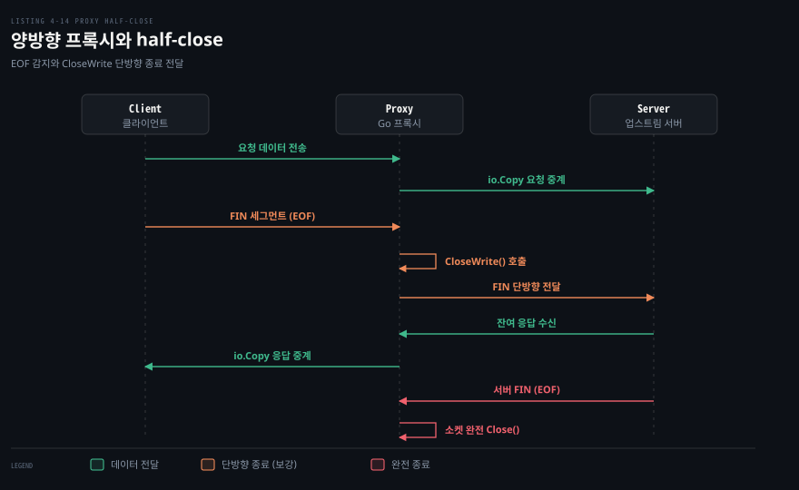
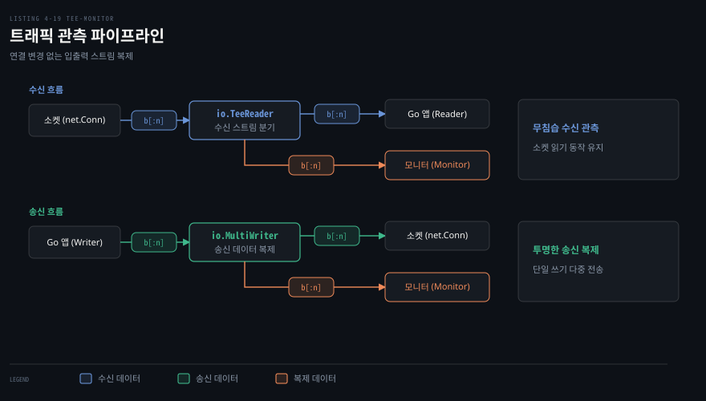

# io 의 Copy·MultiWriter·TeeReader 로 연결을 잇고 엿본다

---

> 4장 중간부는 Go 의 표준 `io` 패키지를 네트워크 소켓과 결합하여 강력한 인프라 도구를 만드는 방법을 다룹니다. `io.Copy` 로 양방향 통신 프록시를 직관적으로 엮고 `io.TeeReader` 와 `io.MultiWriter` 로 소켓 수정 없이 트래픽을 관측하며 ICMP 가 차단된 방화벽 환경에서 TCP 핸드셰이크를 이용해 호스트 가용성을 측정합니다.

## 핵심 요약

> 이 편이 매달린 하나의 생각은, Go 의 `io` 패키지가 네트워크 연결을 범용 입출력 스트림으로 다루는 추상화를 제공하므로 방향마다 고루틴을 엮어 양방향 프록시를 구축하고 바이트 스트림을 투명하게 가로채 관측할 수 있다는 사실입니다.

네트워크 프록시는 두 종단 사이에서 데이터를 중계하는 핵심 컴포넌트입니다. `net.Conn` 이 `io.Reader` 와 `io.Writer` 를 동시에 구현하므로, `io.Copy` 호출 두 개를 양방향으로 배치하면 송신과 수신을 독립적인 고루틴에서 비동기 중계하는 프록시를 손쉽게 구축할 수 있습니다. 한쪽 연결이 닫히면 반대편 복사 루프도 자연스럽게 종료되어 고루틴 누수를 방지합니다.

트래픽 관측 역시 소켓 코드를 수정하지 않고 해결할 수 있습니다. `io.TeeReader` 로 읽기 스트림을 로거로 복제하고 `io.MultiWriter` 로 쓰기 스트림을 다중 목적지로 분기합니다. 나아가 보안 정책으로 ICMP 핑이 차단된 서버에 대해서는 TCP 3-way handshake 수립 시간을 실측하여 서비스 포트 수준의 생존 여부와 지연 시간을 측정합니다.




## 학습 목표

> 이 편을 읽고 나면 아래 다섯 가지를 스스로 해낼 수 있습니다.

1. 양방향 네트워크 프록시에서 방향마다 독립된 고루틴이 필요한 이유와 `io.Copy` 종료 전이를 설명할 수 있습니다.
2. Go 1.11 이후 리눅스 환경에서 `*net.TCPConn` 간 `io.Copy` 가 달성하는 제로 카피 최적화의 원리를 말할 수 있습니다.
3. 원문의 일괄 종료 방식이 가진 한계를 짚고 Go 표준 라이브러리의 `net.TCPConn.CloseWrite` 로 half-close 를 보강할 수 있습니다.
4. `io.TeeReader` 와 `io.MultiWriter` 로 네트워크 트래픽을 모니터링할 때 발생하는 블로킹 지연과 전송 중단 위험을 방어할 수 있습니다.
5. ICMP 필터링 환경에서 TCP 연결 수립 시간으로 핑을 대신하는 원리를 이해하고 이 방식이 드러내는 정보와 한계를 구분할 수 있습니다.


## 1. io.Copy 두 개로 양방향 프록시를 만든다

> `io.Copy` 는 리더에서 읽은 바이트를 라이터로 전달하는 표준 복사 함수이며 요청과 응답 방향에 각각 독립된 고루틴을 할당하여 완전한 양방향 네트워크 프록시를 구성합니다.

### 양방향 통신과 고루틴 분리의 이유

네트워크 통신은 전이중(Full-Duplex) 방식입니다. 클라이언트가 서버로 요청을 보내는 흐름과 서버가 클라이언트로 응답을 돌려주는 흐름은 서로 간섭 없이 동시에 진행될 수 있어야 합니다.

단일 고루틴 안에서 순차적으로 복사하면 어느 한쪽의 `Read` 가 블로킹되는 순간 반대 방향의 데이터 전달까지 완전히 멈춰버립니다. 따라서 원문 Listing 4-14 는 방향마다 별도의 고루틴을 배정합니다.

```go
// Listing 4-14 발췌: 양방향 프록시 구현
func proxyConn(source, destination string) error {
    connSource, err := net.Dial("tcp", source)
    if err != nil {
        return err
    }
    defer connSource.Close()

    connDestination, err := net.Dial("tcp", destination)
    if err != nil {
        return err
    }
    defer connDestination.Close()

    // connDestination 응답을 connSource 로 전달 (고루틴)
    go func() {
        _, _ = io.Copy(connSource, connDestination)
    }()

    // connSource 메시지를 connDestination 으로 전달 (메인)
    _, err = io.Copy(connDestination, connSource)
    return err
}
```

`io.Copy` 가 `io.Reader` 와 `io.Writer` 를 어떻게 잇는지는 [Learning Go 13-01](../../../01_language/book/lgo_learning-go/13-01.io.Reader%20는%20버퍼를%20받아%20채우고%20작은%20인터페이스를%20겹쳐%20기능을%20더합니다.md)이 다룹니다.

### 연결 종료와 고루틴 누수 방지

비동기 고루틴을 띄울 때 가장 주의해야 할 문제는 고루틴 누수(Goroutine Leak)입니다. 위 코드에서 `go func()` 로 띄운 복사 고루틴이 영원히 대기 상태에 빠질 염려는 없습니다.

클라이언트가 전송을 마치거나 연결을 닫으면 메인 고루틴의 `io.Copy(connDestination, connSource)` 가 `io.EOF` 를 수신하고 반환됩니다. 함수가 반환되면서 `defer` 로 등록된 `connSource.Close()` 와 `connDestination.Close()` 가 차례로 실행됩니다. 소켓이 닫히면 반대편 고루틴의 `io.Copy` 역시 소켓 닫힘 에러를 반환하며 즉시 종료됩니다.

원문은 Go 1.11 이후 도입된 커널 수준 최적화도 함께 언급합니다. 양쪽 소켓이 모두 구체 타입 `*net.TCPConn` 인 경우, 리눅스 환경에서 데이터가 사용자 공간(Userspace) 메모리를 거치지 않고 커널 내부에서 소켓 간 직접 전송(splice 시스템 콜)됩니다. 이로 인해 메모리 복사 비용이 제거되어 대용량 트래픽 중계 효율이 극대화됩니다.

### 인터페이스 추상화와 테스트

원문 Listing 4-15 는 구체적인 소켓 주소 대신 `io.Reader` 와 `io.Writer` 를 직접 받는 범용 `proxy(from, to)` 함수로 리팩토링합니다.

이 추상화를 통해 프록시 대상은 네트워크 소켓뿐만 아니라 `os.Stdout`, `bytes.Buffer`, 파일 객체 등으로 자유롭게 확장됩니다. Listing 4-16~4-18 은 로컬 리스너와 목적지 에코 서버를 띄워 두고, 중간에 프록시 서버를 둔 뒤 `ping` 메시지를 보내 `pong` 응답이 올바르게 왕복 중계되는지 검증합니다.

### Go 표준 라이브러리 보강 — CloseWrite 를 통한 half-close 완성

원문의 프록시 구현은 실무 관점에서 중요한 엣지 케이스 하나를 다루지 않습니다. 바로 단방향 종료(half-close) 상황입니다.

원문 Listing 4-14 에서는 클라이언트가 데이터 전송을 끝내고 `io.EOF` 가 감지되면 메인 함수가 반환되면서 양쪽 소켓 전체를 `Close()` 해버립니다. 하지만 클라이언트가 요청 송신을 마친 뒤 연결의 쓰기 방향만 닫고(FIN 전송), 서버의 최종 연산 응답을 계속 기다리고 있는 상태라면 어떻게 될까요? 프록시가 양쪽 소켓을 통째로 닫아버리면 서버가 뒤늦게 보낸 응답이 클라이언트에 도달하기 전에 증발합니다.

Go 표준 라이브러리의 [`net.TCPConn.CloseWrite`](https://pkg.go.dev/net#TCPConn.CloseWrite) 는 한쪽 쓰기 방향만 닫는 메서드를 제공합니다. 이 메서드는 연결을 완전히 파괴하지 않고 대상 소켓에 TCP FIN 세그먼트만 전송합니다. half-close 의 패킷 수준 규격과 4단계 종료 절차는 [TII 13-01 §3](../tii_tcp-ip-illustrated/13-01.TCP%20연결은%20세%20세그먼트로%20열고%20네%20세그먼트로%20닫는다.md)을 참고할 수 있습니다.

```go
// 책 밖 보강 스니펫: half-close 를 지원하는 프록시 전이
// 클라이언트의 EOF 를 확인했을 때 쓰기 채널만 선택적으로 종료
if tcpDst, ok := connDestination.(*net.TCPConn); ok {
    _ = tcpDst.CloseWrite() // 서버에 FIN 만 전달하고 수신은 유지
}
```

한쪽의 `io.Copy` 가 끝났을 때 소켓 전체를 닫는 대신 `CloseWrite()` 로 쓰기 채널만 닫는 기법이 안전합니다. 상대에게 "더 보낼 데이터가 없음"만 전달하고, 반대 방향 응답 수신 고루틴이 `io.EOF` 를 만날 때까지 기다린 뒤 완전히 닫는 것이 프로덕션 프록시의 올바른 동작입니다.


## 2. TeeReader·MultiWriter 로 지나가는 바이트를 엿본다

> `io.TeeReader` 와 `io.MultiWriter` 는 기존 네트워크 연결 코드를 전혀 수정하지 않고도 입출력 스트림의 복사본을 외부 관측 시스템으로 흘려보내는 무침습 관측 파이프라인을 만듭니다.

### 네트워크 트래픽 가로채기

운영 중인 서비스에서 소켓으로 오가는 원시 바이트를 파일에 기록하거나 메트릭 수집기로 보내고 싶을 때가 있습니다. 소켓을 직접 래핑하여 매번 로깅 코드를 덧붙이는 방식은 비즈니스 로직을 오염시킵니다.

원문 Listing 4-19 는 표준 패키지의 두 장치를 결합하여 깔끔한 모니터링을 구성합니다.



```go
// Listing 4-19 발췌: TeeReader 와 MultiWriter 트래픽 모니터링
type Monitor struct {
    *log.Logger
}
func (m *Monitor) Write(p []byte) (int, error) {
    return len(p), m.Output(2, string(p))
}

// 수신 스트림 모니터링
b := make([]byte, 1024)
r := io.TeeReader(conn, monitor)
n, err := r.Read(b) // conn 에서 읽으며 monitor 에 자동 기록

// 송신 스트림 모니터링
w := io.MultiWriter(conn, monitor)
_, err = w.Write(b[:n]) // conn 과 monitor 양쪽에 동시 기록
```

1. **수신 감시 (`io.TeeReader`)**: `io.TeeReader(r, w)` 는 `r` 에서 데이터를 읽을 때마다 읽어낸 바이트를 `w` 로 즉시 복사한 뒤 호출자에게 반환합니다. 클라이언트 요청이 소켓에서 퍼 올려지는 순간 모니터 로거에 자동으로 찍힙니다.
2. **송신 감시 (`io.MultiWriter`)**: `io.MultiWriter(w1, w2)` 는 쓰기 호출 한 번을 여러 라이터에 차례로 복제합니다. 서버가 클라이언트로 데이터를 보낼 때 소켓과 모니터에 나란히 전송됩니다.

Listing 4-20 에서는 `"Test\n"` 메시지를 전송했을 때 모니터 로거에 수신 시점과 에코 송신 시점에 각각 한 번씩 총 두 번의 로그가 찍히는 실행 결과를 보여줍니다.

### 블로킹 지연과 전송 중단 방어

원문은 이 기법을 실무에 적용할 때 반드시 경계해야 할 두 가지 위험을 지적합니다.

첫째는 **블로킹 지연**입니다. `io.TeeReader` 와 `io.MultiWriter` 는 모니터 라이터에 데이터를 기록할 때 동기적으로 호출을 블로킹합니다. 만약 모니터 라이터가 디스크 쓰기 병목이나 원격 로깅 서버 통신 장애로 멈추면 본래의 네트워크 소켓 통신 지연시간(Latency)이 덩달아 폭증합니다.

둘째는 **오류 전파로 인한 연결 중단**입니다. 모니터 라이터의 `Write` 가 에러를 반환하면 `TeeReader` 나 `MultiWriter` 는 즉시 실패로 판정하고 호출자에게 에러를 넘깁니다. 관측 도구의 결함 때문에 핵심 비즈니스 통신이 끊어지는 사태가 벌어집니다.

원문은 이를 방어하기 위해 모니터의 `Write` 메서드가 로깅 실패 시 기본 로거에만 오류를 남기고 호출자에게는 항상 `nil` 에러를 반환하도록 감쌀 것을 권고합니다.

```go
// 원문 권고: 에러를 격리하는 모니터 Write 구현
func (m *Monitor) Write(p []byte) (int, error) {
    if err := m.Output(2, string(p)); err != nil {
        log.Println("logging failure:", err)
    }
    return len(p), nil // 네트워크 흐름 단절 방지
}
```


## 3. ICMP 가 막힌 곳에서는 TCP 연결 시간으로 ping 한다

> 인터넷 방화벽이 ICMP 패킷을 차단할 때, 열려 있는 TCP 서비스 포트로 3-way handshake 를 맺는 시간을 측정하여 호스트 가용성과 네트워크 지연을 판단할 수 있습니다.

### ICMP 차단과 TCP 핸드셰이크 측정

운영체제의 기본 `ping` 명령은 ICMP Echo Request 를 보내고 Echo Reply 를 수신하여 왕복 지연을 측정합니다. 하지만 많은 인터넷 호스트와 클라우드 방화벽은 보안 위험(스캔 방지, DoS 공격 완화)을 이유로 ICMP 에코 응답을 차단합니다. 핑이 실패하더라도 실제 웹 서비스나 데이터베이스 서버는 정상 동작 중일 수 있습니다.

원문 Listing 4-21 과 4-22 는 대상 서버의 열린 TCP 포트(예: 80, 443)로 `net.DialTimeout` 을 호출하여 TCP 연결을 수립하는 데 걸리는 시간을 측정하는 CLI 유틸리티(`ping.go`)를 제시합니다.

```go
// Listing 4-22 발췌: TCP 수립 시간 측정을 통한 가용성 확인
start := time.Now()
c, err := net.DialTimeout("tcp", target, *timeout)
dur := time.Since(start)

if err != nil {
    fmt.Printf("fail in %s: %v\n", dur, err)
    if nErr, ok := err.(net.Error); !ok || !nErr.Timeout() {
        os.Exit(1)
    }
} else {
    _ = c.Close()
    fmt.Println(dur)
}
```

핸드셰이크가 성공하면 소켓을 즉시 닫고 소요된 시간 `dur` 을 출력합니다. 호스트가 살아있고 포트 리스너가 동작해야만 핸드셰이크가 완결되므로 호스트 가용성을 확실히 입증할 수 있습니다. 일시적 오류는 경계가 모호해 [net.Error](https://pkg.go.dev/net#Error) 의 `Temporary()` 가 폐기(deprecated)되었으므로 지금은 `Timeout()` 으로 가릅니다.

### 무엇을 알려 주고 무엇을 못 알려 주나

이 방식이 측정하는 시간은 단순한 네트워크 선로 지연(RTT)에 국한되지 않습니다.
- **알려 주는 정보**: 대상 호스트의 물리적 생존 여부, 라우팅 경로의 도달 가능성, 해당 포트에서 TCP 데몬이 동작하고 있다는 사실입니다. 서비스 재시작 직후 모니터링할 때 유용합니다.
- **못 알려 주는 정보**: 순수한 네트워크 전송 지연 외에 대상 서버의 커널 `accept` 백로그 큐 부하와 TCP 스택 처리 지연이 측정값에 섞여 들어갑니다. 또한 특정 포트가 닫혀 있어 서버가 RST 를 돌려준다면 호스트가 멀쩡히 살아있음에도 연결 실패로 판정됩니다.

방화벽의 포트 필터링과 무응답 상태에 대한 패킷 수준 해석은 [gonet-lab 04-01 무응답은 증거가 아니다](../../project/gonet-lab/04-01.무응답은%20증거가%20아니다%20-%20CONNECT·SYN·UDP%20포트%20스캔.md)에서 심도 있게 다룹니다.

원문은 이 기법이 시스템 관리자에게 남용이나 공격으로 간주될 수 있음을 강하게 경고합니다. 가벼운 ICMP 데이터그램과 달리 매 간격마다 운영체제의 완전한 TCP 소켓을 생성하고 핸드셰이크를 맺은 뒤 해제하므로 대상 시스템에 상당한 자원 부하를 줍니다. 핑 횟수가 너무 많거나 주기가 짧으면 방화벽의 침입 탐지 시스템(IDS)에 의해 포트 스캔 공격으로 탐지되어 IP 가 차단될 수 있습니다.


## 면접 대비

> 아래 질문에 답하면서 Go 표준 라이브러리를 활용한 프록시 설계와 네트워크 관측 기법을 함께 설명해 보세요.

1. 양방향 네트워크 프록시에서 단일 고루틴 대신 방향마다 독립된 고루틴을 배치해야 하는 이유는 무엇인가요?
2. Go 1.11 이후 리눅스에서 두 `*net.TCPConn` 소켓 사이의 `io.Copy` 가 달성하는 성능상 이점은 무엇인가요?
3. 클라이언트가 송신 종료(FIN)를 보냈을 때 프록시가 양쪽 소켓을 일괄 `Close` 하면 어떤 문제가 생기며 `net.TCPConn.CloseWrite` 로 이를 어떻게 해결하나요?
4. `io.TeeReader` 와 `io.MultiWriter` 로 트래픽 모니터링을 구성할 때, 모니터 로거의 지연과 오류가 네트워크 데이터 전송을 방해하지 않게 만드는 방법은 무엇인가요?
5. ICMP 가 차단된 환경에서 `net.DialTimeout` 으로 핑을 대신할 때 얻을 수 있는 정보와 순수 ICMP 대비 왜곡될 수 있는 요인은 무엇인가요?


## 정답 (자답 후 펼치기)

> 위 §면접 대비의 질문에 먼저 스스로 답한 뒤 읽으세요.

### 정답 1 — 전이중 통신의 동시성과 블로킹 회피

TCP 는 양방향 전이중 통신이므로 클라이언트의 요청 송신과 서버의 응답 수신이 동시에 일어날 수 있어야 합니다. 단일 고루틴으로 직렬 처리하면 어느 한쪽 소켓의 `Read` 가 블로킹되는 동안 반대편 데이터 전달이 완전히 멈춰버립니다. 따라서 방향마다 별도의 고루틴을 두고 각자 `io.Copy` 를 실행해야만 지연 없는 실시간 중계가 가능합니다.

### 정답 2 — 커널 splice 시스템 콜을 통한 제로 카피

Go 1.11 부터 소켓 간 복사에서 출발지와 목적지가 모두 `*net.TCPConn` 인 경우 리눅스의 `splice` 시스템 콜이 적용됩니다. 데이터가 소켓 수신 버퍼에서 Go 런타임 사용자 메모리 버퍼로 복사되지 않고 커널 파이프 버퍼를 통해 대상 소켓의 송신 버퍼로 직접 전송됩니다. 이로써 사용자-커널 공간 간 컨텍스트 스위칭과 메모리 복사 비용이 절감됩니다.

### 정답 3 — 잔여 응답 유실 방지와 half-close 전달

클라이언트가 요청 전송을 마치고 FIN 을 보냈더라도(half-close), 서버는 요청을 처리하고 응답을 보내는 중일 수 있습니다. 프록시가 양쪽 소켓을 즉시 전체 닫기(`Close`)해 버리면 서버의 잔여 응답이 클라이언트에 도달하기 전에 연결이 끊어집니다. `net.TCPConn.CloseWrite()` 를 사용하면 서버 방향으로만 FIN 세그먼트를 전달하여 송신 종료를 알리고 읽기 채널은 유지하여 서버의 최종 응답을 끝까지 수신해 클라이언트로 넘겨줄 수 있습니다.

### 정답 4 — 에러 격리와 비차단 모니터 래핑

`io.TeeReader` 와 `io.MultiWriter` 는 보조 라이터의 `Write` 메서드를 동기적으로 호출합니다. 로깅이 블로킹되거나 실패하면 네트워크 전송 전체가 멈춥니다. 이를 방지하려면 모니터의 `Write` 메서드 내부에서 로깅 실패 에러를 자체 격리하여 기록하고 호출자에게는 항상 `len(p)` 와 `nil` 에러를 반환해야 합니다. 필요에 따라 채널이나 버퍼를 두어 로깅을 비동기 고루틴으로 분리해야 합니다.

### 정답 5 — 호스트·포트 생존 확인과 커널 큐 지연의 혼입

TCP 핸드셰이크 시간 측정은 해당 서비스 포트의 리스너가 살아있고 정상 통신이 가능하다는 확실한 증거를 제공합니다. 반면 측정된 시간은 단순 네트워크 전선 왕복 시간(RTT)뿐만 아니라 대상 호스트 커널의 `accept` 백로그 큐 적체 지연과 스케줄링 오버헤드가 누적된 값입니다. 또한 특정 포트가 닫혀 RST 가 반환되면 호스트 자체의 생존 여부를 단정할 수 없다는 한계가 있습니다.


## 참고 자료

- 《Network Programming with Go》 (Adam Woodbeck, No Starch Press, 2021) Ch.4 Sending TCP Data (Listing 4-14~4-22).
- Go 공식 문서: [`net.TCPConn.CloseWrite`](https://pkg.go.dev/net#TCPConn.CloseWrite), [`io.Copy`](https://pkg.go.dev/io#Copy), [`io.TeeReader`](https://pkg.go.dev/io#TeeReader), [`io.MultiWriter`](https://pkg.go.dev/io#MultiWriter).
- Linux man pages: [`splice(2)`](https://man7.org/linux/man-pages/man2/splice.2.html) — zero-copy data transfer.


## 관련 문서

- [04-01 TCP 는 경계 없는 바이트 흐름이라 읽는 쪽이 메시지를 자른다](./04-01.TCP%20는%20경계%20없는%20바이트%20흐름이라%20읽는%20쪽이%20메시지를%20자른다.md): `net.Conn` 의 `io.Reader` 특성과 TLV 프레이밍을 다룹니다.
- [04-03 TCPConn 손잡이와 흔한 버그 — keepalive·linger·버퍼·zero window·CLOSE_WAIT](./04-03.TCPConn%20손잡이와%20흔한%20버그%20—%20keepalive·linger·버퍼·zero%20window·CLOSE_WAIT.md): `net.TCPConn` 의 저수준 옵션과 CLOSE_WAIT 버그를 다룹니다.
- [TII 13-01 TCP 연결은 세 세그먼트로 열고 네 세그먼트로 닫는다](../tii_tcp-ip-illustrated/13-01.TCP%20연결은%20세%20세그먼트로%20열고%20네%20세그먼트로%20닫는다.md): §3 에서 half-close 메커니즘을 상세히 다룹니다.
- [gonet-lab 00-03 Go 문법 — goroutine·io.Copy·context·WaitGroup](../../project/gonet-lab/00-03.Go%20문법%20-%20goroutine·io.Copy·context·WaitGroup.md): 고루틴 동시성과 `io.Copy` 동작 원리를 다룹니다.
- [gonet-lab 04-01 무응답은 증거가 아니다 — CONNECT·SYN·UDP 포트 스캔](../../project/gonet-lab/04-01.무응답은%20증거가%20아니다%20-%20CONNECT·SYN·UDP%20포트%20스캔.md): TCP 포트 스캔과 방화벽 필터링 해석을 다룹니다.
