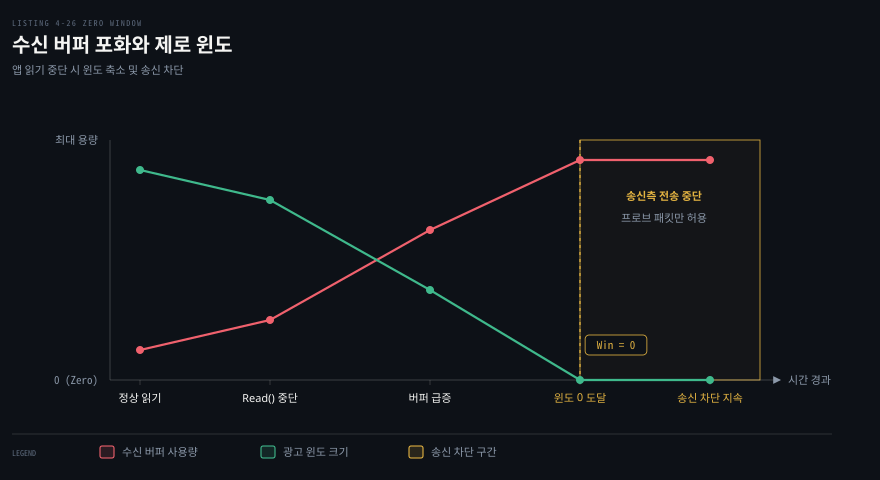
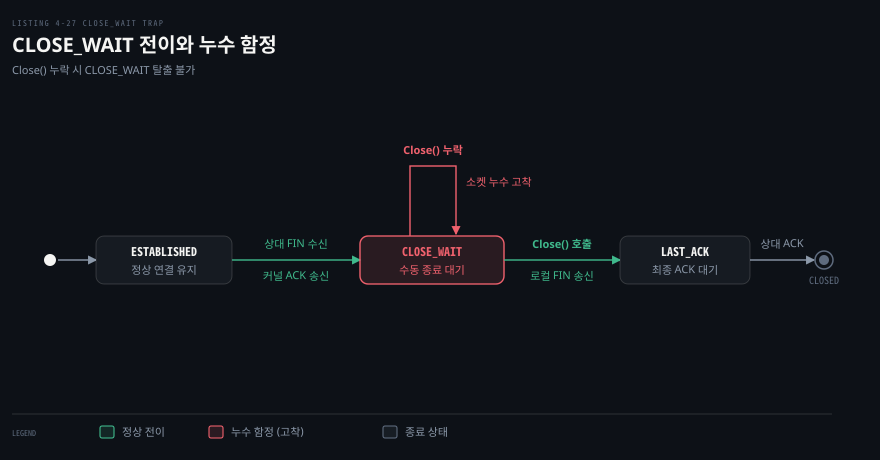

# TCPConn 손잡이와 흔한 버그 — keepalive·linger·버퍼·zero window·CLOSE_WAIT

---

> 4장 뒷부분은 범용 인터페이스 `net.Conn` 의 장막을 걷어내고 구체 구조체인 `net.TCPConn` 을 직접 다룹니다. 운영체제 TCP 스택의 저수준 손잡이인 keepalive, linger, 소켓 버퍼를 조정하는 기법을 배우고 실무에서 서비스 장애를 일으키는 두 가지 대표적 버그인 제로 윈도와 `CLOSE_WAIT` 누수를 추적합니다.

## 핵심 요약

> 이 편이 매달린 하나의 생각은, `net.Conn` 추상화 아래의 구체 타입 `net.TCPConn` 이 운영체제 소켓 세부 옵션을 직접 다루는 제어 손잡이를 제공하지만 잘못된 설정과 닫기 누락은 제로 윈도 교착이나 `CLOSE_WAIT` 고착 같은 소켓 누수로 이어진다는 사실입니다.

대부분의 네트워크 코드는 `net.Conn` 인터페이스만으로 충분하지만 고성능 튜닝이나 엄격한 연결 관리가 필요할 때는 구체 타입 `net.TCPConn` 을 꺼내야 합니다. 타입 단언이나 전용 생성 함수를 통해 keepalive 탐침 주기, 연결 종료 시 잔여 데이터 처리 방식(linger), 운영체제 송수신 소켓 버퍼 크기를 변경할 수 있습니다.

하지만 저수준 손잡이를 건드리는 데는 대가가 따릅니다. 운영체제 자동 튜닝이 꺼져 성능이 역주행하거나 플랫폼 종속성이 생깁니다. 나아가 수신 고루틴이 무거운 처리에 가로막히면 수신 버퍼가 차올라 송신 측을 멈춰 세우는 제로 윈도가 발생합니다. 상대방 FIN 수신 후 `conn.Close()` 호출을 빠뜨리면 소켓이 `CLOSE_WAIT` 상태에 영구 고착되어 파일 디스크립터가 고갈됩니다.


## 학습 목표

> 이 편을 읽고 나면 아래 다섯 가지를 스스로 해낼 수 있습니다.

1. `net.Conn` 에서 `net.TCPConn` 구체 타입을 추출하는 두 가지 방법과 그에 따르는 이식성 대가를 설명할 수 있습니다.
2. 운영체제 L4 keepalive 의 동작 원리와 실패 판정 기준을 짚고 Go 1.23 `KeepAliveConfig` 와 앱 수준 하트비트의 차이를 비교할 수 있습니다.
3. `SetLinger` 에 전달하는 음수·0·양수 인자가 연결 종료 시점에 미치는 영향과 0 일 때 RST 가 방출되는 이유를 설명할 수 있습니다.
4. `SetReadBuffer` 와 `SetWriteBuffer` 에 지정하는 원문 수치(212992)가 리눅스 커널의 어떤 기본 한도와 맞닿아 있는지 말할 수 있습니다.
5. `handle()` 블로킹으로 인한 제로 윈도 전개 과정과 `defer c.Close()` 누락으로 소켓이 `CLOSE_WAIT` 에 갇히는 결함을 코드로 분석하고 해결할 수 있습니다.


## 1. net.Conn 아래의 TCPConn 을 꺼낸다

> `net.TCPConn` 은 `net.Conn` 인터페이스를 구현하는 실제 구조체이며 운영체제의 저수준 소켓 옵션 제어 손잡이를 외부에 노출합니다.

### 구체 타입을 꺼내는 두 가지 경로

원문은 `net.TCPConn` 객체를 얻는 두 가지 방법을 제시합니다.

첫 번째는 가장 간단한 **타입 단언(Type Assertion)**입니다. 하위 프로토콜이 TCP 로 열린 연결이라면 인터페이스 변수를 구체 타입 포인터로 단언하여 즉시 꺼낼 수 있습니다.

```go
// 방법 1: net.Conn 에서 타입 단언
tcpConn, ok := conn.(*net.TCPConn)
if !ok {
    // TCP 연결이 아닌 경우 처리
}
```

두 번째는 리스너와 다이얼러에서 **TCP 전용 함수**를 사용하는 방법입니다. 원문 Listing 4-23 과 4-24 는 서버와 클라이언트 양쪽에서 구체 타입을 직접 다루는 예제를 보여줍니다.

```go
// Listing 4-23 발췌: 서버 측 AcceptTCP
addr, err := net.ResolveTCPAddr("tcp", "127.0.0.1:")
listener, err := net.ListenTCP("tcp", addr)
tcpConn, err := listener.AcceptTCP() // *net.TCPConn 직접 반환

// Listing 4-24 발췌: 클라이언트 측 DialTCP
raddr, err := net.ResolveTCPAddr("tcp", "www.google.com:http")
tcpConn, err := net.DialTCP("tcp", nil, raddr) // *net.TCPConn 직접 반환
```

### 구체 타입 제어의 대가

구체 타입을 꺼내 쓰면 강력한 옵션을 만질 수 있지만 명확한 대가를 치러야 합니다.

첫째는 **이식성(Portability)의 훼손**입니다. `net.TCPConn` 이 제공하는 저수준 소켓 옵션 중 일부는 대상 운영체제 커널의 지원 여부에 따라 동작이 달라지거나 무시될 수 있습니다.

둘째는 **테스트 용이성의 저하**입니다. `net.Conn` 은 가상 파이프나 목(Mock) 객체로 쉽게 대체할 수 있지만 `*net.TCPConn` 구체 타입은 실제 네트워크 소켓 파일 디스크립터를 요구하므로 격리된 단위 테스트 작성이 훨씬 까다로워집니다. 따라서 원문은 저수준 튜닝이 불가피한 특수한 경우가 아니라면 `net.Conn` 추상화를 유지하라고 조언합니다.


## 2. keepalive 로 죽은 연결을 OS 가 찾게 한다

> TCP keepalive 는 유휴 연결에 주기적으로 탐침 패킷을 띄워 연결 건전성을 검사하는 커널 메커니즘이며 응답이 없으면 운영체제가 소켓을 강제로 정리합니다.

### keepalive 의 동작 원리와 한계

TCP 는 데이터를 주고받지 않을 때 네트워크에 패킷을 일절 보내지 않는 유휴(Idle) 프로토콜입니다. 중간 라우터나 NAT 장비가 연결 상태 테이블을 조용히 지워버렸거나 원격 호스트가 비정상 종료된 경우, 로컬 호스트는 다음 쓰기나 읽기 시도 전까지 연결이 죽었다는 사실을 전혀 눈치채지 못합니다.

TCP keepalive 는 일정 시간 데이터 송수신이 없을 때 커널이 상대방에게 빈 ACK 탐침(Probe) 패킷을 보내어 확인응답을 유도합니다. 운영체제가 정한 횟수만큼 탐침을 보냈음에도 ACK 가 오지 않으면 커널이 연결을 끊고 소켓을 닫습니다.

리눅스 커널의 기본 설정값은 실무 웹 환경에 비해 대단히 깁니다.
- `tcp_keepalive_time`: 첫 탐침까지의 유휴 대기 시간으로 기본값은 7,200초(2시간)입니다.
- `tcp_keepalive_intvl`: 탐침 실패 시 재전송 간격으로 기본값은 75초입니다.
- `tcp_keepalive_probes`: 연결 파기 전 최대 탐침 횟수로 기본값은 9회입니다.

### keepalive 설정 방식과 언제 무엇을 쓰나

Go 표준 라이브러리에서 keepalive 를 설정하는 방식은 목적에 따라 크게 두 가지로 나뉩니다.

- **단순 활성화와 단일 주기 지정**: [`tcpConn.SetKeepAlive(true)`](https://pkg.go.dev/net#TCPConn.SetKeepAlive) 로 활성화하고 [`tcpConn.SetKeepAlivePeriod(d)`](https://pkg.go.dev/net#TCPConn.SetKeepAlivePeriod) 로 유휴 대기 시간을 설정합니다. 추가 튜닝 없이 단순 활성화하거나 단일 주기로 충분할 때 적합합니다. 다만 탐침 간격(Interval)과 최대 시도 횟수(Count)를 세밀하게 나누어 제어할 수는 없습니다.
- **세부 파라미터 정밀 제어**: 첫 탐침 유휴 시간(Idle), 탐침 간격(Interval), 최대 탐침 횟수(Count)를 플랫폼 독립적으로 정밀하게 제어합니다. Go 1.23 에 도입된 [`net.KeepAliveConfig`](https://pkg.go.dev/net#KeepAliveConfig) 구조체와 [`tcpConn.SetKeepAliveConfig`](https://pkg.go.dev/net#TCPConn.SetKeepAliveConfig) 메서드를 사용합니다.

```go
// Go 1.23+ KeepAliveConfig 정밀 제어
cfg := net.KeepAliveConfig{
    Enable:   true,
    Idle:     30 * time.Second, // 첫 탐침 전 유휴 시간
    Interval: 10 * time.Second, // 탐침 재전송 간격
    Count:    5,                // 연결 종료 전 최대 실패 횟수
}
err := tcpConn.SetKeepAliveConfig(cfg)
```

연결 수립 단계에서 미리 지정하려면 [`net.Dialer.KeepAliveConfig`](https://pkg.go.dev/net#Dialer) 나 [`net.ListenConfig.KeepAliveConfig`](https://pkg.go.dev/net#ListenConfig) 를 사용합니다. 기본 설정값은 `Idle: 15초`, `Interval: 15초`, `Count: 9` 로 작동합니다.

### 애플리케이션 하트비트와의 차이

원문은 L4 TCP keepalive 보다 앞선 [03-03](./03-03.타임아웃은%20Dialer·context%20로,%20유휴%20감지는%20데드라인과%20하트비트로%20건다.md)에서 다룬 애플리케이션 수준의 하트비트와 데드라인 결합을 더 권장합니다.

가장 결정적인 차이는 **감지 범위**입니다. TCP keepalive 는 OS 커널 스택이 처리합니다. 따라서 상대방 프로세스의 Go 고루틴이 데드락이나 무한 루프에 빠져 먹통이 되었더라도 커널은 keepalive ACK 를 정상적으로 회신합니다. 송신 측은 상대 프로세스가 멈췄다는 사실을 영원히 알 수 없습니다. 반면 애플리케이션 하트비트는 L7 메시지를 주고받으므로 프로세스 수준의 결함까지 확실하게 적발합니다.


## 3. Close 뒤에 남은 데이터는 linger 가 정한다

> `SetLinger` 는 소켓을 닫을 때 아직 송신 버퍼에 남아 있거나 ACK 를 받지 못한 미전송 데이터를 어떻게 처리할지 운영체제에 지시하는 손잡이입니다.

### SetLinger 의 세 가지 동작 모드

일반적으로 `conn.Close()` 를 호출하면 즉시 반환되며 소켓 송신 버퍼에 남은 잔여 데이터는 운영체제 커널이 백그라운드에서 정상 전송을 마친 뒤 FIN 을 보냅니다. `SetLinger` 메서드는 이 종료 대기 동작을 세 가지 모드로 변경합니다.

```go
// 모드 1: 기본 동작 유지 (음수)
_ = tcpConn.SetLinger(-1)

// 모드 2: 강제 즉시 폐기 및 RST 전송 (0)
_ = tcpConn.SetLinger(0)

// 모드 3: 지정된 초 동안 대기 후 폐기 (양수)
_ = tcpConn.SetLinger(10)
```

1. **음수 (`SetLinger(-1)`)**: 기본값입니다. `Close` 호출은 블로킹되지 않고 즉시 반환되며 커널이 백그라운드에서 정상적인 4-way FIN 핸드셰이크를 진행합니다.
2. **0 (`SetLinger(0)`)**: **강제 즉시 종료(Abortive Close)**입니다. 커널 송신 버퍼에 남아 있는 모든 미전송 데이터를 즉시 내버리고 정상적인 FIN 절차를 건너뛴 채 상대방에게 TCP RST 패킷을 던집니다. 소켓은 즉시 파괴되며 상대방은 `connection reset by peer` 오류를 만납니다.
3. **양수 (`SetLinger(sec)`)**: 커널은 `Close()` 호출을 최대 `sec` 초 동안 블로킹하며 버퍼의 남은 데이터가 전송되고 상대방의 ACK 가 올 때까지 기다립니다. 제한 시간 안에 전송이 완료되지 못하면 남은 데이터는 버려집니다.

### linger 0 과 RST 전송의 의미

`SetLinger(0)` 을 걸고 닫으면 왜 FIN 이 아니라 RST 가 방출될까요?

정상적인 FIN 은 "내 쓰기 방향을 질서정연하게 마친다"는 우아한 종료(Graceful Shutdown) 신호입니다. 반면 linger 가 0 이면 버퍼에 쌓인 바이트를 상대에게 알리지도 않고 일방적으로 폐기합니다. 만약 이 상태에서 FIN 을 보내면 상대방은 앞선 데이터가 정상적으로 전달되었다고 오인하게 됩니다. 따라서 TCP 규격은 데이터 유실을 수반하는 강제 종료 시 반드시 RST 세그먼트를 쏘아 연결의 파기를 즉시 통보하도록 규정합니다. RST 세그먼트의 역할과 패킷 의미는 [03-01 §4](./03-01.TCP%20세션은%20핸드셰이크로%20열고%20창으로%20속도를%20맞추고%20FIN·RST%20로%20끝난다.md)에서 살펴본 바와 같습니다.


## 4. 수신·송신 버퍼 크기를 바꾼다

> `SetReadBuffer` 와 `SetWriteBuffer` 는 소켓별 커널 버퍼 크기를 수동 지정하지만 운영체제의 자동 윈도 조절 기능을 무력화할 수 있어 극히 신중해야 합니다.

### 원문 수치 212992 의 배경

원문 Listing 4-25 는 소켓의 수신 및 송신 버퍼를 수동으로 지정하는 코드를 보여줍니다.

```go
// Listing 4-25 발췌: 소켓 버퍼 크기 재정의
if err := tcpConn.SetReadBuffer(212992); err != nil {
    return err
}
if err := tcpConn.SetWriteBuffer(212992); err != nil {
    return err
}
```

원문이 예제로 사용한 `212992` 바이트(약 208 KB)는 임의의 숫자가 아닙니다. 책의 실험 환경인 리눅스(Ubuntu 20.04 시절 커널)의 소켓 기본 버퍼 크기인 `/proc/sys/net/core/rmem_default` 및 `wmem_default` 의 전형적인 기본값입니다.

리눅스 커널의 소켓 옵션(`SO_RCVBUF`, `SO_SNDBUF`) 구현에는 중요한 내부 메커니즘이 있습니다. 리눅스는 애플리케이션이 지정한 버퍼 크기에 패킷 제어 블록(`sk_buff`)의 메타데이터 오버헤드를 감안하여 내부적으로 전달받은 값의 **2배**를 실제 소켓 버퍼 한도로 할당합니다. 또한 이 값은 시스템 전역 상한인 `/proc/sys/net/core/rmem_max` 및 `wmem_max` 를 초과할 수 없습니다.

### 수동 버퍼 튜닝의 위험성

현대 운영체제 커널은 대역폭-지연 곱(BDP, Bandwidth-Delay Product)에 따라 TCP 윈도 크기를 동적으로 최적화하는 **자동 튜닝(Auto-Tuning)** 기능을 내장하고 있습니다.

애플리케이션이 `SetReadBuffer` 나 `SetWriteBuffer` 를 호출하여 크기를 고정하는 순간, 리눅스 커널은 해당 소켓의 수신 윈도 자동 조절을 즉시 꺼버립니다. 만약 고속 네트워크 환경에서 버퍼를 너무 작게 고정하면 대역폭을 충분히 활용하지 못해 처리량이 곤두박질치고 예기치 않은 제로 윈도 장애가 발생합니다. 반대로 너무 크게 잡으면 대량의 동시 연결이 몰렸을 때 시스템 전체 메모리가 빠르게 고갈됩니다.


## 5. 흔한 버그 둘 — zero window 와 CLOSE_WAIT

> 비즈니스 로직의 블로킹으로 인한 제로 윈도와 닫기 누락으로 인한 `CLOSE_WAIT` 고착은 Go TCP 서비스에서 가장 빈번하게 발생하는 자원 고갈 버그입니다.

### 버그 1: 읽기를 멈춰 발생하는 제로 윈도 (Zero Window)

TCP 연결에서 수신 측은 자신이 처리할 수 있는 버퍼 여유 공간을 ACK 패킷의 윈도 크기(Window Size)로 송신 측에 알립니다.

원문 Listing 4-26 은 수신 버퍼가 고갈되는 전형적인 안티패턴을 보여줍니다.

```go
// Listing 4-26 발췌: handle() 블로킹으로 인한 수신 중단
buf := make([]byte, 1024)
for {
    n, err := conn.Read(buf)
    if err != nil {
        return err
    }
    handle(buf[:n]) // 블로킹 연산 발생!
}
```



`conn.Read()` 를 호출하면 커널 소켓 수신 버퍼에서 데이터를 퍼 올려 버퍼 공간을 확보합니다. 그런데 `handle(buf[:n])` 에서 무거운 데이터베이스 쿼리를 실행하거나 외부 API 통신으로 장시간 블로킹되면 애플리케이션이 다음 `Read` 를 부르지 못합니다.

원격 송신자가 계속 데이터를 밀어 넣으면 커널 수신 버퍼는 순식간에 포화됩니다. 버퍼가 꽉 차면 수신 측 TCP 는 윈도 크기가 0 인 ACK 를 송신 측에 통보합니다(Zero Window). 송신 측은 즉시 데이터 전송을 멈추고 제로 윈도 탐침을 보내며 대기 상태로 전락합니다. 슬라이딩 윈도와 수신 버퍼의 세부 상호작용은 앞선 [03-01 §3](./03-01.TCP%20세션은%20핸드셰이크로%20열고%20창으로%20속도를%20맞추고%20FIN·RST%20로%20끝난다.md)에서 살펴본 바와 같습니다.

이를 방지하려면 수신 고루틴은 소켓에서 바이트를 퍼 담아 인메모리 큐(Go 채널)로 넘기는 작업만 전담하고 실제 무거운 비즈니스 로직은 별도의 워커 고루틴 풀에서 비동기로 처리해야 합니다.

### 버그 2: Close 누락으로 인한 CLOSE_WAIT 고착

원문 Listing 4-27 은 운영 환경에서 파일 디스크립터를 전부 말려버리는 치명적인 소켓 누수 코드를 제시합니다.

```go
// Listing 4-27 발췌: c.Close() 누락 버그
for {
    // c.Close() 가 누락된 고루틴
    go func(c net.Conn) {
        buf := make([]byte, 1024)
        for {
            n, err := c.Read(buf)
            if err != nil {
                return // 에러 시 소켓을 닫지 않고 반환!
            }
            handle(buf[:n])
        }
    }(conn)
}
```



원격 클라이언트가 연결을 닫으면 서버 측으로 TCP FIN 세그먼트가 도착합니다. 로컬 커널은 이 FIN 을 받자마자 스스로 ACK 를 전송하고 소켓 상태를 `ESTABLISHED` 에서 `CLOSE_WAIT` 로 전이시킵니다. 그리고 애플리케이션의 `Read` 호출에 `io.EOF` 에러를 반환합니다.

`CLOSE_WAIT` 의 의미는 명확합니다. "상대방은 송신을 마쳤으니, 이제 당신의 애플리케이션이 로컬 소켓을 닫아 자체 FIN 을 전송할 차례입니다." 커널은 애플리케이션이 직접 `c.Close()` 를 호출하기 전까지는 상대방에게 FIN 세그먼트를 절대 먼저 보내지 않습니다.

그런데 위 코드처럼 `Read` 가 에러나 `io.EOF` 를 만났을 때 `c.Close()` 호출 없이 단순 `return` 해버리면 어떻게 될까요? 고루틴은 종료되지만 운영체제 커널의 소켓은 `CLOSE_WAIT` 상태로 영원히 방치됩니다. 상태 전이의 패킷 수준 흐름은 [TII 13-03 TCP 상태 전이](../tii_tcp-ip-illustrated/13-03.TCP%20상태는%20연결의%20과거를%20기억하고%20RST는%20그%20기억을%20끊는다.md)를 참고할 수 있습니다.

이러한 소켓이 수천 개 쌓이면 운영체제의 파일 디스크립터 한도(`ulimit -n`)를 초과하여 새 연결을 전혀 수락하지 못하는 먹통 장애로 이어집니다. 해결 방법은 지극히 단순합니다. 연결을 다루는 고루틴을 띄우자마자 반드시 `defer c.Close()` 를 선언하여 어떤 경로로 함수를 빠져나가든 소켓이 회수되도록 강제하는 것입니다.


## 결정 치트시트

> 저수준 TCPConn 손잡이와 3장의 애플리케이션 수준 제어 도구를 비교한 판단 기준입니다.

| 도구 / 손잡이 | 무엇을 감지·통제하나 | 누가 보내고 처리하나 | 언제 선택하나 |
|---|---|---|---|
| **L4 TCP keepalive** | 비정상 단절된 유휴 소켓 감지 | 운영체제 L4 커널 스택 (빈 ACK 탐침) | 장시간 연결 유지 시 유휴 NAT 세션 증발 방지 |
| **L7 앱 하트비트** | 애플리케이션 프로세스 락업 감지 | Go 애플리케이션 고루틴 (L7 페이로드) | 프록시 통과 및 고루틴 교착 상태의 확실한 검증 |
| **SetDeadline** | 읽기·쓰기 블로킹 최대 허용 시간 | Go 네트워크 런타임 폴러 | 단일 입출력 지연 감지 및 무한 대기 방지 |
| **SetLinger(0)** | 즉시 강제 종료 및 잔여 데이터 폐기 | 커널 TCP 스택 (RST 세그먼트 전송) | 악성 클라이언트 즉시 차단 및 TIME_WAIT 회피 |
| **CloseWrite** | 한쪽 쓰기 채널만 선택적 종료 | 커널 TCP 스택 (단방향 FIN 전송) | 요청 전송 완료 후 서버의 잔여 응답 대기 (프록시) |
| **소켓 버퍼 수동 지정** | 소켓별 송수신 큐 크기 고정 | 커널 소켓 버퍼 (`SO_RCVBUF`) | 전용 고속 회선 등 특수 환경 (일반 환경 비권장) |


## 면접 대비

> 아래 질문에 답하면서 `net.TCPConn` 의 저수준 옵션과 흔한 소켓 누수 버그의 발생 원리를 함께 설명해 보세요.

1. `net.Conn` 인터페이스에서 구체 타입 `net.TCPConn` 을 꺼내 쓸 때 치러야 하는 트레이드오프는 무엇인가요?
2. 운영체제의 L4 TCP keepalive 가 정상 동작함에도 애플리케이션 프로세스의 정지(Hang)를 잡아내지 못하는 이유는 무엇인가요?
3. `SetLinger(0)` 을 설정하고 연결을 닫을 때 FIN 세그먼트 대신 RST 패킷이 나가는 이유는 무엇인가요?
4. 고성능 통신을 목적으로 `SetReadBuffer` 를 임의로 호출할 때 오히려 처리량이 저하될 수 있는 원인은 무엇인가요?
5. 서버의 네트워크 연결이 `CLOSE_WAIT` 상태로 장시간 누적되는 근본적인 코드 원인과 해결 방안을 설명해 보세요.


## 정답 (자답 후 펼치기)

> 위 §면접 대비의 질문에 먼저 스스로 답한 뒤 읽으세요.

### 정답 1 — 운영체제 종속성과 테스트 용이성 저하

`net.TCPConn` 구체 타입은 실제 네트워크 소켓의 파일 디스크립터에 묶여 있습니다. 이를 직접 다루면 운영체제 커널별 소켓 옵션 지원 차이로 인해 이식성이 떨어지며 메모리 버퍼나 파이프를 이용한 가벼운 단위 테스트 모킹이 불가능해집니다.

### 정답 2 — 커널 스택과 사용자 공간 프로세스의 분리

TCP keepalive 는 운영체제 커널의 L4 네트워크 스택이 자동으로 탐침 패킷을 처리하고 ACK 로 응답합니다. 따라서 애플리케이션 레벨의 고루틴이 데드락이나 무한 루프에 빠져 완전히 멈춰 있더라도 커널은 keepalive 응답을 정상 회신하므로 프로세스 수준의 장애를 감지할 수 없습니다.

### 정답 3 — 미전송 데이터 폐기와 강제 리셋 신호

`SetLinger(0)` 은 소켓 송신 버퍼에 남아 있는 모든 미전송 데이터를 즉시 폐기합니다. 이 상태에서 정상적인 FIN 을 보내면 상대방은 데이터가 온전히 도착한 것으로 오인할 수 있으므로, TCP 규격에 따라 데이터가 강제 유실되었음을 알리는 RST 패킷을 방출하여 연결을 즉각 파기합니다.

### 정답 4 — 커널 TCP 윈도 자동 튜닝(Auto-Tuning)의 무력화

현대 커널은 네트워크 대역폭과 지연 시간에 맞춰 소켓 버퍼와 윈도 크기를 동적으로 최적화하는 자동 튜닝을 수행합니다. 애플리케이션이 버퍼 크기를 수동 지정하면 자동 튜닝이 비활성화되어 BDP 가 큰 고속망에서 윈도가 작게 묶여 대역폭을 제대로 활용하지 못하는 성능 저하가 발생합니다.

### 정답 5 — c.Close() 누락과 커널 FIN 미전송

상대방이 FIN 을 보내면 로컬 커널은 즉시 ACK 를 응답하고 소켓을 `CLOSE_WAIT` 로 전이시킵니다. 커널은 애플리케이션이 직접 `c.Close()` 를 호출하기 전까지는 자체 FIN 을 보내지 않습니다. 에러 처리나 조기 반환 분기에서 `Close()` 를 빠뜨리면 소켓이 영구 고착되므로 고루틴 시작 시점에 `defer c.Close()` 를 등록해야 합니다.


## 참고 자료

- 《Network Programming with Go》 (Adam Woodbeck, No Starch Press, 2021) Ch.4 Sending TCP Data (Listing 4-23~4-27).
- Go 공식 패키지 문서: [`net.TCPConn`](https://pkg.go.dev/net#TCPConn), [`net.KeepAliveConfig`](https://pkg.go.dev/net#KeepAliveConfig).
- Go 1.23 Release Notes: [TCP KeepAliveConfig](https://go.dev/doc/go1.23#net).
- Linux kernel documentation: [`ip-sysctl.txt`](https://www.kernel.org/doc/Documentation/networking/ip-sysctl.txt) — tcp_keepalive_time, tcp_rmem.


## 관련 문서

- [03-01 TCP 세션은 핸드셰이크로 열고 창으로 속도를 맞추고 FIN·RST 로 끝난다](./03-01.TCP%20세션은%20핸드셰이크로%20열고%20창으로%20속도를%20맞추고%20FIN·RST%20로%20끝난다.md): TCP 윈도 제어와 세그먼트 종료 플래그를 다룹니다.
- [03-03 타임아웃은 Dialer·context 로, 유휴 감지는 데드라인과 하트비트로 건다](./03-03.타임아웃은%20Dialer·context%20로,%20유휴%20감지는%20데드라인과%20하트비트로%20건다.md): 애플리케이션 하트비트와 소켓 데드라인을 다룹니다.
- [04-01 TCP 는 경계 없는 바이트 흐름이라 읽는 쪽이 메시지를 자른다](./04-01.TCP%20는%20경계%20없는%20바이트%20흐름이라%20읽는%20쪽이%20메시지를%20자른다.md): `net.Conn` 의 기초 입출력과 고정 버퍼 수신 특성을 다룹니다.
- [04-02 io 의 Copy·MultiWriter·TeeReader 로 연결을 잇고 엿본다](./04-02.io%20의%20Copy·MultiWriter·TeeReader%20로%20연결을%20잇고%20엿본다.md): 양방향 프록시와 `CloseWrite` 를 통한 half-close 를 다룹니다.
- [TII 13-03 TCP 상태는 연결의 과거를 기억하고 RST는 그 기억을 끊는다](../tii_tcp-ip-illustrated/13-03.TCP%20상태는%20연결의%20과거를%20기억하고%20RST는%20그%20기억을%20끊는다.md): TCP 상태 머신(CLOSE_WAIT, LAST_ACK)을 상세히 다룹니다.
