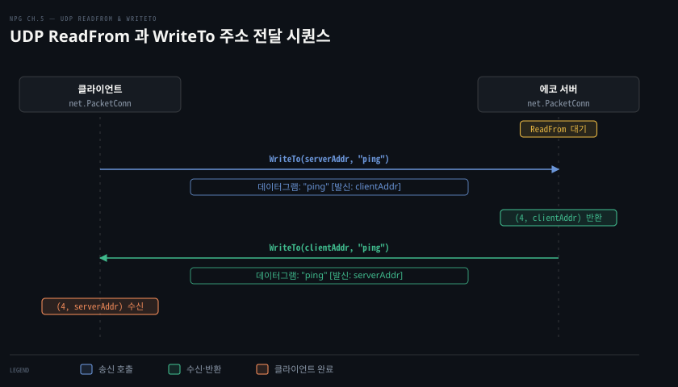
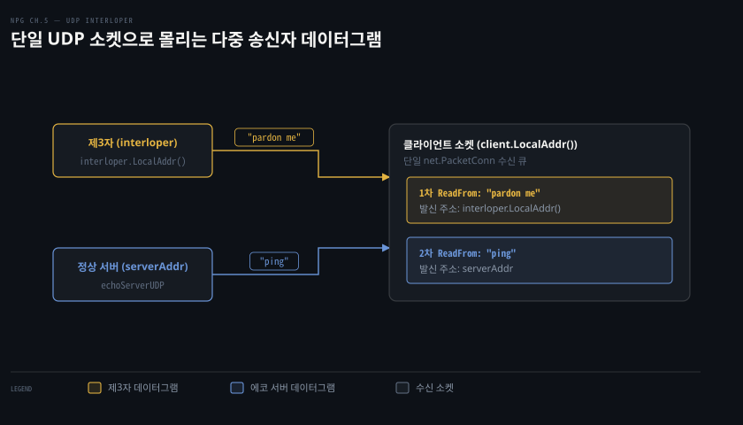

# UDP 는 연결 없이 보내고, 소켓 하나가 누구에게서든 받는다

---

> UDP 는 핸드셰이크와 세션 없이 동작하므로, Go 의 `net.PacketConn` 소켓 하나가 임의의 송신자로부터 패킷을 받고 매 호출마다 발신 주소를 확인해야 합니다.

## 핵심 요약

> 이 편이 매달린 하나의 생각은, UDP 통신에서는 연결이라는 상태가 존재하지 않아서 모든 소켓이 리스너로 동작하며 송수신마다 패킷 단위로 상대 주소를 직접 확인해야 한다는 점입니다.

TCP 가 3-way 핸드셰이크로 세션을 맺고 일대일 바이트 스트림을 보장하는 반면, UDP 는 소켓 주소(IP 와 포트)만 얹어 패킷을 네트워크로 곧장 던집니다. Go 표준 라이브러리는 이를 위해 스트림용 `net.Conn` 대신 패킷 지향 인터페이스인 `net.PacketConn` 을 제공합니다.

`net.ListenPacket` 으로 연 소켓은 별도의 `Accept` 과정 없이 곧바로 `ReadFrom` 과 `WriteTo` 를 호출합니다. 수신 소켓은 상대방과의 독점 연결을 유지하지 않으므로, 제3자(interloper)가 보낸 데이터그램도 동일한 큐로 들어옵니다. 애플리케이션은 반환된 `net.Addr` 를 직접 검증해야 합니다.


## 학습 목표

> 이 편을 읽고 나면 아래 다섯 가지를 스스로 해낼 수 있습니다.

1. TCP 와 대비되는 UDP 의 8바이트 헤더 구조와 신뢰성 부재의 원인을 설명할 수 있습니다.
2. 기상 데이터나 DNS 질의처럼 최신성이 우선되는 도메인에서 UDP 가 유리한 이유를 말할 수 있습니다.
3. `net.ListenPacket` 으로 얻은 `net.PacketConn` 인터페이스에서 왜 `Accept` 메서드가 없는지 설명할 수 있습니다.
4. `ReadFrom` 이 돌려주는 발신자 주소(`net.Addr`)를 사용해 에코 응답을 작성하는 패턴을 구현할 수 있습니다.
5. 단일 UDP 클라이언트 소켓에 제3자 패킷이 섞여 들어오는 현상을 방지하기 위해 발신 주소를 검증하는 코드를 작성할 수 있습니다.


## 1. UDP 는 단순하고 믿을 수 없다

> 전송 신뢰성과 흐름 제어를 과감히 생략한 8바이트 헤더 덕분에, UDP 는 지연 없이 패킷을 방출하고 멀티캐스트와 브로드캐스트를 지원합니다.

### 8바이트 헤더와 세션의 부재

네트워크 애플리케이션의 대다수는 TCP 의 신뢰성과 흐름 제어에 의존하지만, 모든 서비스가 핸드셰이크와 세션 유지 비용을 감당할 필요는 없습니다. 도메인 네임 해석(DNS)처럼 요청과 응답 한 쌍으로 끝나는 작업에는 UDP 가 훨씬 적합합니다.

UDP 는 RFC 768 에 단 세 쪽으로 명세되어 있을 만큼 단순합니다. 소켓 주소(IP 주소와 포트) 외에는 부가 기능을 거의 두지 않습니다. TCP 와 달리 UDP 는 목적지가 통신 가능한 상태인지 사전에 확인하지 않고 최선형(best-effort) 전송만 시도합니다.

- **확인 응답(ACK) 없음**: 수신 노드가 패킷을 받아도 확인 응답을 자동으로 돌려보내지 않으므로 발신 노드는 전달 성공 여부를 알 수 없습니다.
- **혼잡 및 흐름 제어 부재**: 네트워크 상태에 맞춰 전송률을 조절하거나 슬라이딩 윈도로 수신 버퍼 넘침을 방지하지 않습니다.
- **재전송 없음**: 패킷이 중간 라우터에서 버려져도 전송 계층 수준에서 재전송하지 않습니다.
- **순서 미보장**: 송신자가 보낸 순서대로 수신자에게 도착한다는 보장이 전혀 없습니다.

UDP 패킷 구조는 8바이트 헤더와 페이로드로 구성됩니다. 헤더 필드는 다음 네 가지뿐입니다.

1. **발신지 포트 (Source Port)**: 2바이트 (16비트)
2. **목적지 포트 (Destination Port)**: 2바이트 (16비트)
3. **패킷 길이 (Length)**: 2바이트 (헤더 8바이트를 포함한 패킷 전체 바이트 수)
4. **체크섬 (Checksum)**: 2바이트 (오류 검출용)

헤더 자체 크기가 8바이트이므로 UDP 데이터그램의 최소 길이는 빈 페이로드를 포함해 8바이트입니다. 이론상 패킷의 최대 길이는 65,535바이트이지만, 실제로는 IP 단편화를 피하기 위해 애플리케이션 계층에서 크기를 엄격히 제한합니다.

전송 계층의 기본 역할과 UDP 데이터그램 경계에 대한 깊은 논의는 [CNTD 03-01 트랜스포트는 무엇을 더하는가](../cntd_computer-networking-top-down/03-01.트랜스포트는%20무엇을%20더하는가.md)와 [gonet-lab 02-01 경계를 지키는 UDP, 대신 떠안는 것](../../project/gonet-lab/02-01.경계를%20지키는%20UDP,%20대신%20떠안는%20것%20-%20데이터그램·손실·순서.md)을 참고할 수 있습니다.

### 언제 UDP 를 선택해야 하는가

원문은 TCP 와 UDP 의 차이를 파이 배달 비유로 설명합니다. TCP 통신은 이웃집 창문(소켓 주소)을 향해 인사를 건네고 상대방이 응답하는 핸드셰이크를 거친 뒤 파이를 건네받고 감사 인사를 교환하며 정중하게 작별하는 과정과 같습니다. 반면 UDP 는 창문이 열려 있든 닫혀 있든 상관없이 파이를 불쑥 던져버리고 뒤도 돌아보지 않는 투박한 방식입니다.

이러한 무례함에도 불구하고 UDP 가 강력한 이유는 명확합니다.

- **멀티캐스트와 브로드캐스트 지원**: TCP 는 통신에 참여하는 개별 노드마다 일대일 세션을 맺어야 하므로 그룹 전송 시 패킷을 중복 복사해야 합니다. 반면 UDP 는 사전 세션 수립이 필요 없어 패킷 복사 없이 동일 서브넷의 모든 노드(브로드캐스트)나 특정 그룹(멀티캐스트)으로 한 번에 패킷을 쏠 수 있습니다.
- **최신 데이터가 과거 데이터를 대체하는 도메인**: 패킷 손실이 전체 서비스에 치명적이지 않고 최신 패킷이 이전 패킷을 자연스럽게 덮어쓰는 환경에 알맞습니다. 원문은 토네이도 기상 관측 스트리밍을 예로 듭니다. 지금 내 머리 위로 다가오는 토네이도의 현재 위치가 긴급한 상황에서는 2분 전에 누락된 과거 위치 패킷을 재전송받느라 지연을 겪는 것보다 최신 패킷을 즉시 받아보는 것이 훨씬 유리합니다.


## 2. 에코 서버는 ReadFrom 이 돌려준 주소로 WriteTo 한다

> 세션이 없는 UDP 서버는 `Accept` 호출 없이 `net.ListenPacket` 으로 소켓을 열고, `ReadFrom` 이 반환한 송신자 주소를 사용해 `WriteTo` 로 응답을 보냅니다.



### net.PacketConn 인터페이스와 Accept 의 부재

TCP 에서는 `net.Listen` 으로 리스너를 열고 `Accept` 를 통해 연결 객체(`net.Conn`)를 얻었습니다. 하지만 UDP 는 스트림 프로토콜이 아니며 세션이나 핸드셰이크 개념이 없습니다.

따라서 Go 표준 라이브러리에서는 스트림 지향 인터페이스인 `net.Conn` 대신 패킷 지향 인터페이스인 `net.PacketConn` 을 주로 사용합니다.

```go
type PacketConn interface {
	ReadFrom(p []byte) (n int, addr Addr, err error)
	WriteTo(p []byte, addr Addr) (n int, err error)
	Close() error
	LocalAddr() Addr
	SetDeadline(t time.Time) error
	SetReadDeadline(t time.Time) error
	SetWriteDeadline(t time.Time) error
}
```

`net.PacketConn` 에는 `Accept` 메서드가 존재하지 않습니다. 포트에 바인딩된 소켓 하나를 열어두면 외부에서 날아오는 모든 데이터그램이 곧바로 해당 소켓의 수신 큐에 쌓이기 때문입니다.

TCP 의 연결 수립 과정과 비교하려면 [03-02 Go 의 TCP 연결은 Listen·Accept·Dial 세 호출로 맺는다](./03-02.Go%20의%20TCP%20연결은%20Listen·Accept·Dial%20세%20호출로%20맺는다.md)를 함께 살펴보시기 바랍니다.

### UDP 에코 서버 구현

Listing 5-1 은 수신한 패킷을 발신자에게 그대로 돌려주는 UDP 에코 서버 코드입니다.

```go
package echo

import (
	"context"
	"fmt"
	"net"
)

func echoServerUDP(ctx context.Context, addr string) (net.Addr, error) {
	s, err := net.ListenPacket("udp", addr) // (1) net.PacketConn 소켓 생성
	if err != nil {
		return nil, fmt.Errorf("binding to udp %s: %w", addr, err)
	}

	go func() {
		go func() {
			<-ctx.Done() // (2) 컨텍스트 취소 시 소켓 닫기
			_ = s.Close()
		}()

		buf := make([]byte, 1024)
		for {
			n, clientAddr, err := s.ReadFrom(buf) // (3) 패킷 수신 및 발신자 주소 획득
			if err != nil {
				return
			}

			_, err = s.WriteTo(buf[:n], clientAddr) // (4) 발신자 주소로 에코 전송
			if err != nil {
				return
			}
		}
	}()

	return s.LocalAddr(), nil
}
```

이 코드의 핵심 동작은 다음과 같습니다.

1. **`net.ListenPacket("udp", addr)`**: 네트워크 종류 `"udp"` 와 주소를 넘겨 소켓을 생성합니다. TCP 의 `net.Listen` 과 유사하지만 `net.PacketConn` 인터페이스를 단독 반환합니다.
2. **비동기 종료 처리**: 부모 고루틴이 에코 루프를 돌고 별도의 자식 고루틴이 `ctx.Done()` 채널을 감시합니다. 호출자가 컨텍스트를 취소하면 `s.Close()` 가 호출되어 블로킹되어 있던 `ReadFrom` 이 에러를 내며 두 고루틴이 모두 정상 회수됩니다.
3. **`s.ReadFrom(buf)`**: 버퍼 슬라이스를 전달받아 읽은 바이트 수 `n`, 보낸 노드의 주소 `clientAddr`, 그리고 에러를 반환합니다. 연결 세션이 없기 때문에 반환된 주소를 통해 누가 보낸 메시지인지 식별해야 합니다.
4. **`s.WriteTo(buf[:n], clientAddr)`**: 전달할 데이터 슬라이스와 목적지 주소를 명시합니다. 에코 서버는 원본 송신자에게 답장하지만 원한다면 기존 소켓 객체를 재사용해 제3의 노드로 메시지를 전달(forwarding)할 수도 있습니다. TCP 처럼 새 연결을 맺을 필요가 없습니다.

### 클라이언트의 에코 응답 검증

Listing 5-2 는 에코 서버를 실행하고 패킷을 전송한 뒤 응답을 검증하는 테스트 코드입니다.

```go
package echo

import (
	"bytes"
	"context"
	"net"
	"testing"
)

func TestEchoServerUDP(t *testing.T) {
	ctx, cancel := context.WithCancel(context.Background())
	serverAddr, err := echoServerUDP(ctx, "127.0.0.1:") // (1) 서버 구동
	if err != nil {
		t.Fatal(err)
	}
	defer cancel()

	client, err := net.ListenPacket("udp", "127.0.0.1:") // (2) 클라이언트 소켓 생성
	if err != nil {
		t.Fatal(err)
	}
	defer func() { _ = client.Close() }()

	msg := []byte("ping")
	_, err = client.WriteTo(msg, serverAddr) // (3) 서버 주소로 데이터그램 전송
	if err != nil {
		t.Fatal(err)
	}

	buf := make([]byte, 1024)
	n, addr, err := client.ReadFrom(buf) // (4) 응답 대기 및 발신자 확인
	if err != nil {
		t.Fatal(err)
	}

	if addr.String() != serverAddr.String() { // (5) 서버 응답 여부 검증
		t.Fatalf("received reply from %q instead of %q", addr, serverAddr)
	}
	if !bytes.Equal(msg, buf[:n]) {
		t.Errorf("expected reply %q; actual reply %q", msg, buf[:n])
	}
}
```

클라이언트 역시 서버와 동일하게 `net.ListenPacket` 을 호출해 `net.PacketConn` 객체를 생성합니다. `WriteTo` 를 호출할 때마다 목적지 주소(`serverAddr`)를 지정해야 하며, 응답을 읽을 때도 `ReadFrom` 이 반환한 `addr` 이 서버의 주소와 일치하는지 확인합니다.

로컬 네트워크 스택(127.0.0.1) 상에서 테스트를 수행하더라도 UDP 본연의 불안정성은 여전히 존재합니다. 운영체제의 송수신 버퍼 고갈, 가용 메모리 부족, 멀티스레드 패킷 처리로 인한 순서 뒤바뀜이 발생하면 단위 테스트에서도 패킷이 유실될 수 있습니다.


## 3. UDP 소켓은 모두 리스너다

> UDP 에는 전용 리스너 객체가 따로 없으므로, 열려 있는 단일 소켓으로 제3자가 보낸 패킷이 언제든 섞여 들어올 수 있습니다.



### 리스너와 연결 소켓의 구분이 없는 세계

TCP 에서는 연결 요청을 수신하는 전용 소켓(`TCPListener`)과 개별 클라이언트와 독점 통신하는 연결 소켓(`TCPConn`)이 엄격하게 분리되었습니다.

반면 UDP 에는 `TCPListener` 에 해당하는 전용 객체가 없습니다. 세션이 존재하지 않으므로 모든 `net.PacketConn` 소켓은 들어오는 데이터그램을 맞이하는 리스너로 동작합니다. 따라서 특정 서버와 통신할 목적으로 소켓을 열었더라도 그 소켓은 네트워크상의 누구에게서든 패킷을 수신할 수 있습니다.

수신된 패킷이 반드시 내가 대화하려던 상대방의 것이라고 믿어서는 안 되며, 매 패킷마다 발신 주소를 확인하는 수신 측 회계(accounting) 작업이 필수적입니다.

### 제3자(Interloper)의 패킷 끼어들기

Listing 5-3, 5-4, 5-5 는 하나의 UDP 클라이언트 소켓에 둘 이상의 송신자가 패킷을 보낼 때 어떤 현상이 벌어지는지 증명하는 테스트입니다.

```go
// Listing 5-3: 에코 서버와 클라이언트 소켓 준비
ctx, cancel := context.WithCancel(context.Background())
serverAddr, err := echoServerUDP(ctx, "127.0.0.1:")
if err != nil {
	t.Fatal(err)
}
defer cancel()

client, err := net.ListenPacket("udp", "127.0.0.1:")
if err != nil {
	t.Fatal(err)
}
defer func() { _ = client.Close() }()
```

클라이언트가 생성된 뒤, 제3자의 소켓(interloper)이 클라이언트의 로컬 주소로 예기치 않은 메시지를 끼워 넣습니다.

```go
// Listing 5-4: 제3자 소켓 생성 및 클라이언트에 방해 패킷 전송
interloper, err := net.ListenPacket("udp", "127.0.0.1:")
if err != nil {
	t.Fatal(err)
}

interrupt := []byte("pardon me")
n, err := interloper.WriteTo(interrupt, client.LocalAddr()) // (1) 클라이언트로 직접 전송
if err != nil {
	t.Fatal(err)
}
_ = interloper.Close()
if l := len(interrupt); l != n {
	t.Fatalf("wrote %d bytes of %d", n, l)
}
```

그 직후 클라이언트는 에코 서버로 본래의 `"ping"` 메시지를 전송하고 수신을 시도합니다.

```go
// Listing 5-5: 다중 송신자로부터의 수신 순서 처리
ping := []byte("ping")
_, err = client.WriteTo(ping, serverAddr) // (1) 정상 서버로 ping 전송
if err != nil {
	t.Fatal(err)
}

buf := make([]byte, 1024)

// (2) 첫 번째 ReadFrom 호출
n, addr, err := client.ReadFrom(buf)
if err != nil {
	t.Fatal(err)
}
// 제3자가 보낸 "pardon me" 가 먼저 읽힙니다
if !bytes.Equal(interrupt, buf[:n]) {
	t.Errorf("expected reply %q; actual reply %q", interrupt, buf[:n])
}
if addr.String() != interloper.LocalAddr().String() {
	t.Errorf("expected message from %q; actual sender is %q",
		interloper.LocalAddr(), addr)
}

// (3) 두 번째 ReadFrom 호출
n, addr, err = client.ReadFrom(buf)
if err != nil {
	t.Fatal(err)
}
// 그 뒤에야 에코 서버의 "ping" 응답이 읽힙니다
if !bytes.Equal(ping, buf[:n]) {
	t.Errorf("expected reply %q; actual reply %q", ping, buf[:n])
}
if addr.String() != serverAddr.String() {
	t.Errorf("expected message from %q; actual sender is %q",
		serverAddr, addr)
}
```

클라이언트 소켓 수신 버퍼에는 interloper 가 먼저 전송한 `"pardon me"` 패킷이 먼저 쌓여 있었습니다. 따라서 클라이언트가 에코 서버의 응답을 기대하며 `ReadFrom` 을 호출했을 때 서버의 응답이 아니라 제3자의 패킷이 먼저 튀어나옵니다.

TCP 연결 소켓이었다면 운영체제 커널이 사전에 수립된 세션 외의 패킷을 모두 걸러내므로 이런 일이 발생하지 않습니다. 하지만 순수 UDP `net.PacketConn` 을 사용할 때는 애플리케이션 코드가 `ReadFrom` 의 두 번째 반환값인 발신자 주소를 매번 확인하여 원치 않는 송신자의 패킷을 식별하고 걸러내야 합니다.


## 결정 치트시트

> 전송 계층 선택과 인터페이스 구성 시 고려할 핵심 트레이드오프입니다.

| 요구 조건 | 권장 프로토콜 및 인터페이스 | 판단 이유 |
|---|---|---|
| 엄격한 전송 신뢰성, 데이터 순서 보장, 흐름 제어 | TCP (`net.Conn`, `net.Listener`) | 손실 패킷 자동 재전송과 슬라이딩 윈도 버퍼 보호가 필요합니다 |
| 지연 최소화, 단일 패킷 요청/응답 (DNS 등) | UDP (`net.PacketConn`) | 3-way 핸드셰이크 왕복 지연(RTT)과 세션 관리 오버헤드를 제거합니다 |
| 1:N 브로드캐스트 또는 멀티캐스트 전송 | UDP (`net.PacketConn`) | TCP 는 일대일 세션만 지원하므로 다중 노드 동시 방출이 불가능합니다 |
| 실시간 미디어 스트리밍, 기상 센서 브로드캐스트 | UDP (`net.PacketConn`) | 지연된 과거 패킷 재전송보다 최신 패킷을 즉시 받아 처리하는 편이 낫습니다 |
| 다중 발신자로부터 무작위 패킷 수신 처리 | UDP (`net.PacketConn`) | 수신 소켓 하나로 임의 송신자의 패킷을 받고 `ReadFrom` 주소로 분기합니다 |


## 면접 대비

> 아래 질문에 답하면서 UDP 의 설계 철학과 Go 소켓 API 의 특성을 정리해 보세요.

1. TCP 헤더(최소 20바이트)와 비교했을 때 UDP 헤더가 8바이트로 극단적으로 단순해진 기술적 이유는 무엇인가요?
2. 토네이도 추적과 같은 기상 관측 스트리밍 시스템에서 TCP 대신 UDP 를 사용하는 것이 왜 유리한가요?
3. Go 표준 라이브러리에서 `net.Listen` 과 `net.ListenPacket` 의 반환 타입 및 사용 방식의 차이는 무엇인가요?
4. `net.PacketConn` 소켓을 사용할 때 제3자(interloper)가 보낸 데이터그램이 수신 큐에 끼어드는 원인과 이를 방어하는 방법을 설명해 주세요?


## 정답 (자답 후 펼치기)

> 위 §면접 대비의 질문에 먼저 스스로 답한 뒤 읽으세요.

### 정답 1 — 전송 계층 부가 기능의 제거와 단순 통로 역할

UDP 는 연결 수립, 순서 보장, 확인 응답 ACK, 흐름 제어, 혼잡 제어 같은 신뢰성 메커니즘을 모두 배제했습니다. 전송 계층이 애플리케이션과 IP 계층 사이에서 프로세스 포트 식별과 체크섬 손상 검출만 수행하는 최소한의 통로 역할만 하도록 설계되었기 때문에 8바이트 헤더만으로 동작할 수 있습니다.

### 정답 2 — 재전송 지연 방지와 최신 데이터 우선 처리

기상 관측이나 실시간 추적 시스템에서는 과거 데이터보다 방금 들어온 현재 데이터의 가치가 훨씬 큽니다. TCP 를 사용하면 중간 패킷이 유실되었을 때 재전송과 순서 재조립이 끝날 때까지 후속 패킷이 애플리케이션에 전달되지 못하는 헤드오브라인 블로킹(HOLB)이 발생합니다. 반면 UDP 는 누락된 과거 패킷을 과감히 버리고 방금 수신된 최신 위치 패킷을 즉시 반영할 수 있어 실시간성이 보장됩니다.

### 정답 3 — 스트림 지향 세션 리스너와 패킷 지향 단일 소켓 인터페이스

`net.Listen` 은 스트림 지향 TCP 리스너인 `net.Listener` 를 반환하며 `Accept()` 메서드를 통해 개별 클라이언트와의 세션 소켓인 `net.Conn` 을 하나씩 뽑아냅니다. 반면 `net.ListenPacket` 은 패킷 지향 인터페이스인 `net.PacketConn` 을 반환합니다. UDP 에는 세션이나 핸드셰이크가 없으므로 `Accept()` 가 없고, 단일 소켓에서 `ReadFrom` 과 `WriteTo` 로 데이터그램과 주소를 직접 주고받습니다.

### 정답 4 — 연결 상태 부재와 수신 주소 기반 검증

UDP 소켓은 특정 원격 노드와 독점적으로 결합된 상태가 아니라 단순히 로컬 IP 와 포트에 바인딩된 열린 창구입니다. 따라서 해당 로컬 주소로 패킷을 쏘는 모든 송신자의 데이터그램이 동일한 수신 버퍼 큐에 차례대로 들어옵니다. 이를 방어하려면 `ReadFrom` 호출 시 반환되는 발신자 주소(`net.Addr`)를 신뢰할 수 있는 서버의 주소와 반드시 비교 검증하여 일치하지 않는 제3자의 패킷은 무시하거나 폐기해야 합니다.


## 참고 자료

- 《Network Programming with Go》 Adam Woodbeck, 2021. ISBN 978-1-7185-0088-4.
  Ch.5 Unreliable UDP Communication (p.107–113, Figure 5-1, Listing 5-1~5-5).
- [RFC 768 - User Datagram Protocol](https://datatracker.ietf.org/doc/html/rfc768): J. Postel, 1980. UDP 명세 원문.
- [Go 표준 패키지 net 문서](https://pkg.go.dev/net): `PacketConn`, `ListenPacket`, `Addr` 인터페이스 명세.


## 관련 문서

- [03-02 Go 의 TCP 연결은 Listen·Accept·Dial 세 호출로 맺는다](./03-02.Go%20의%20TCP%20연결은%20Listen·Accept·Dial%20세%20호출로%20맺는다.md): TCP 리스너와 핸드셰이크 기반의 연결 수립 패턴을 다룹니다.
- [05-02 net.Conn 으로 상대를 고정하고 MTU 아래로 보내 단편화를 피한다](./05-02.net.Conn%20으로%20상대를%20고정하고%20MTU%20아래로%20보내%20단편화를%20피한다.md): UDP 에서 `net.Dial` 을 활용해 상대를 고정하고 IP 단편화를 방지하는 기법을 배웁니다.
- [gonet-lab 02-01 경계를 지키는 UDP, 대신 떠안는 것 - 데이터그램·손실·순서](../../project/gonet-lab/02-01.경계를%20지키는%20UDP,%20대신%20떠안는%20것%20-%20데이터그램·손실·순서.md): UDP 의 데이터그램 경계 보존과 패킷 유실 실습을 정리합니다.
- [CNTD 03-01 트랜스포트는 무엇을 더하는가](../cntd_computer-networking-top-down/03-01.트랜스포트는%20무엇을%20더하는가.md): 네트워크 계층 위에서 전송 계층이 제공하는 다중화와 추상화의 기본 모델을 다룹니다.
- [이 책의 정독 인덱스](./README.md): 전체 챕터 구성과 학습 진행 상황.
