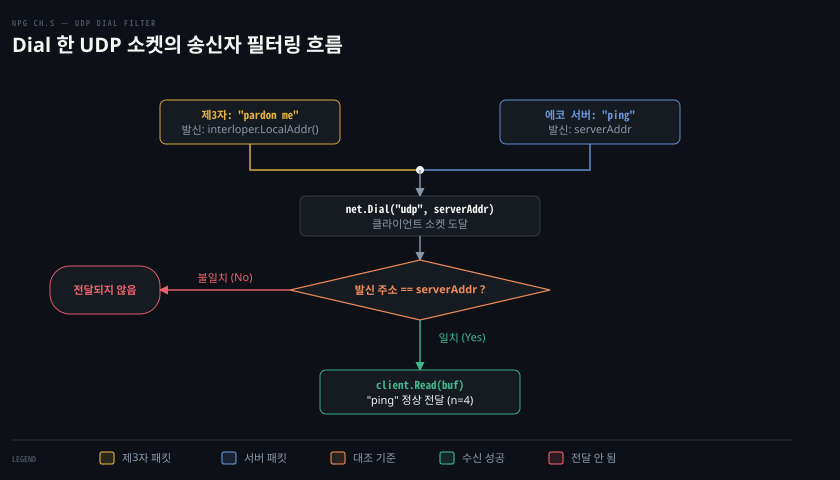
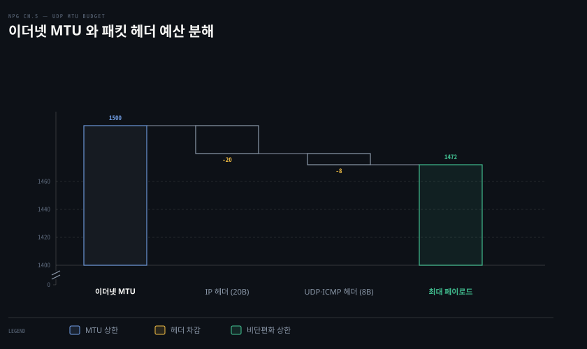

# net.Conn 으로 상대를 고정하고 MTU 아래로 보내 단편화를 피한다

---

> `net.Dial` 로 UDP 소켓의 원격 주소를 고정하면 제3자의 패킷을 자동으로 거를 수 있고, 데이터그램 페이로드를 1,472바이트 아래로 유지해야 치명적인 IP 단편화 손실을 방지합니다.

## 핵심 요약

> 이 편이 매달린 하나의 생각은, UDP 클라이언트는 `net.Dial` 로 상대를 묶어 불필요한 송신자 검증 코드를 줄이고 페이로드를 경로 MTU 예산 안에 가두어 조각 유실에 따른 재전송 파탄을 막아야 한다는 점입니다.

`net.Dial("udp", addr)` 은 네트워크 트래픽을 전혀 일으키지 않은 채 로컬 소켓의 기본 송수신 상대를 지정하여 `net.Conn` 인터페이스를 제공합니다. 이를 통해 `Write` 와 `Read` 만으로 통신할 수 있으며, 고정된 원격 주소가 아닌 제3자가 보낸 패킷은 수신 큐에서 걸러집니다.

동시에 UDP 는 패킷 하나가 손실되었을 때 부분 복구가 불가능하므로 IP 단편화(fragmentation)를 반드시 피해야 합니다. 표준 이더넷 MTU 1,500바이트에서 IP 헤더 20바이트와 UDP 헤더 8바이트를 차감한 1,472바이트를 초과하지 않도록 페이로드를 설계해야 안전합니다.


## 학습 목표

> 이 편을 읽고 나면 아래 다섯 가지를 스스로 해낼 수 있습니다.

1. `net.Dial("udp", addr)` 호출이 왜 실제 네트워크 핸드셰이크 트래픽을 생성하지 않는지 설명할 수 있습니다.
2. UDP 에서 `net.Conn` 을 사용했을 때 제3자 패킷이 `Read` 호출로 전달되지 않는 동작 방식을 설명할 수 있습니다.
3. UDP 기반 `net.Conn` 의 `Write` 호출이 상대방 도달 실패 시에도 에러를 반환하지 않는 이유를 설명할 수 있습니다.
4. IP 단편화가 발생했을 때 조각 하나만 유실되어도 전체 데이터그램이 폐기되는 위험을 분석할 수 있습니다.
5. `ping` 도구의 단편화 금지 플래그를 사용해 경로 MTU 를 실측하고 1,472바이트의 페이로드 상한을 도출할 수 있습니다.


## 1. Dial 한 UDP 연결은 상대 하나만 받는다

> `net.Dial` 을 사용하면 핸드셰이크 없이도 원격 대상을 고정하여, 제3자의 간섭 패킷을 배제하고 주소 명시가 필요 없는 `net.Conn` 스트림 인터페이스를 활용할 수 있습니다.



### net.Dial 의 UDP 동작 특성

[05-01 UDP 는 연결 없이 보내고, 소켓 하나가 누구에게서든 받는다](./05-01.UDP%20는%20연결%20없이%20보내고,%20소켓%20하나가%20누구에게서든%20받는다.md)에서 살펴본 것처럼, 순수 UDP 리스너 소켓은 모든 송신자의 패킷을 차별 없이 수신하므로 매번 발신자 주소를 확인해야 했습니다.

이러한 주소 확인 회계 부담을 줄이려면 `net.Dial` 함수를 사용할 수 있습니다. 첫 번째 인자로 `"udp"` 를 전달하면 Go 런타임은 TCP 에서 다루었던 것과 동일한 `net.Conn` 인터페이스를 반환합니다.

```go
package echo

import (
	"context"
	"net"
	"testing"
)

func TestDialUDP(t *testing.T) {
	ctx, cancel := context.WithCancel(context.Background())
	serverAddr, err := echoServerUDP(ctx, "127.0.0.1:")
	if err != nil {
		t.Fatal(err)
	}
	defer cancel()

	// (1) UDP 서버 주소를 지정하여 다이얼
	client, err := net.Dial("udp", serverAddr.String())
	if err != nil {
		t.Fatal(err)
	}
	defer func() { _ = client.Close() }()
```

TCP 에서 `net.Dial` 은 원격 서버와 3-way 핸드셰이크를 주고받았습니다. 하지만 UDP 에서 `net.Dial` 을 호출할 때는 원격 서버로 어떠한 패킷도 전송되지 않습니다. 네트워크 트래픽 없이 운영체제 소켓 수준에서 기본 목적지 주소만 등록할 뿐입니다.

### 제3자 패킷 배제와 Read/Write 단순화

Listing 5-7 과 5-8 은 `net.Dial` 로 생성한 UDP 소켓에 제3자가 끼어들었을 때 어떤 결과가 나타나는지 보여줍니다.

```go
// Listing 5-7: 제3자가 다이얼된 클라이언트로 패킷 전송 시도
interloper, err := net.ListenPacket("udp", "127.0.0.1:")
if err != nil {
	t.Fatal(err)
}

interrupt := []byte("pardon me")
n, err := interloper.WriteTo(interrupt, client.LocalAddr())
if err != nil {
	t.Fatal(err)
}
_ = interloper.Close()
if l := len(interrupt); l != n {
	t.Fatalf("wrote %d bytes of %d", n, l)
}
```

제3자가 클라이언트의 로컬 소켓 주소로 방해 메시지 `"pardon me"` 를 직접 보냈습니다. 이제 클라이언트가 서버로 `"ping"` 을 전송하고 데이터를 읽습니다.

```go
// Listing 5-8: net.Conn 을 통한 안전한 송수신
ping := []byte("ping")
_, err = client.Write(ping) // (1) 목적지 주소 없이 Write 호출
if err != nil {
	t.Fatal(err)
}

buf := make([]byte, 1024)
n, err = client.Read(buf) // (2) 발신자 주소 반환 없이 Read 호출
if err != nil {
	t.Fatal(err)
}

// 제3자의 메시지가 아니라 에코 서버의 응답만 읽힙니다
if !bytes.Equal(ping, buf[:n]) {
	t.Errorf("expected reply %q; actual reply %q", ping, buf[:n])
}

// (3) 1초 데드라인 설정 후 추가 패킷 수신 시도
err = client.SetDeadline(time.Now().Add(time.Second))
if err != nil {
	t.Fatal(err)
}

_, err = client.Read(buf) // (4) 추가 패킷 대기
if err == nil {
	t.Fatal("unexpected packet") // 제3자의 패킷이 읽히지 않고 타임아웃되어야 성공입니다
}
```

이 테스트의 실행 결과는 명확합니다.

1. **`Write` 와 `Read` 인터페이스 활용**: 송신 시 목적지 주소를 지정할 필요 없이 `client.Write(ping)` 을 호출합니다. 수신 시에도 발신 주소를 돌려받지 않는 `client.Read(buf)` 를 사용합니다.
2. **제3자 패킷 차단**: 클라이언트는 다이얼 시 지정했던 `serverAddr` 발신 패킷만 받아들입니다. 제3자가 보낸 `"pardon me"` 데이터그램은 클라이언트 애플리케이션에 전달되지 않고 폐기됩니다.
3. **타임아웃 확인**: 1초의 데드라인을 걸고 후속 `Read` 를 시도했을 때, 제3자의 패킷이 남아있지 않아 정상적으로 읽기 타임아웃 에러가 발생합니다.

### net.Conn 활용 시의 트레이드오프

UDP 에 `net.Conn` 을 적용하면 코드가 깔끔해지고 발신자 주소 확인 루프가 사라집니다. 하지만 TCP 의 `net.Conn` 과 동일한 기능을 기대해서는 안 됩니다.

- **전송 실패 미감지**: 목적지 서버가 다운되었거나 네트워크가 단절되어 있어도 `client.Write()` 는 정상적으로 성공을 반환합니다. 수신 확인 메커니즘이 전혀 없기 때문입니다.
- **애플리케이션 계층 확인 필수**: 데이터가 상대방에게 도달했는지 보장하려면 여전히 애플리케이션 프로토콜 수준에서 자체 확인 응답을 구현해야 합니다.


## 2. MTU 를 넘는 데이터그램은 조각나고, 조각 하나만 잃어도 전부 잃는다

> IP 단편화는 패킷 유실률을 기하급수적으로 높이므로, `ping` 실측을 통해 경로 MTU 를 파악하고 헤더를 제외한 1,472바이트 이내로 페이로드를 제한해야 합니다.



### IP 단편화의 메커니즘과 UDP 에 미치는 치명성

단편화(fragmentation)는 3계층 IP 프로토콜이 대형 패킷을 전송 매체의 최대 전송 단위(MTU)에 맞추어 여러 개의 작은 조각으로 쪼개는 과정입니다. 모든 네트워크 링크는 한 번에 전송할 수 있는 프레임 크기 한계를 지닙니다. 목적지 노드의 운영체제는 쪼개진 조각들을 수신 버퍼에서 다시 조립하여 상위 애플리케이션에 전달합니다.

IP 계층의 패킷 분할과 주소 체계에 대한 원리는 [CNTD 04-03 IP — 데이터그램과 주소](../cntd_computer-networking-top-down/04-03.IP%20—%20데이터그램과%20주소.md)에서 자세히 다룹니다.

단편화는 UDP 애플리케이션에 치명적인 성능 저하를 초래합니다.

- **부분 복구 불가능**: TCP 는 세그먼트 단위로 순서 번호와 재전송을 관리합니다. 반면 UDP 는 데이터그램 전체를 하나의 단위로 취급합니다. 조각 중 단 하나라도 유실되거나 손상되면 수신 측 커널은 나머지 조각들을 모두 버리고 데이터그램 전체를 폐기합니다.
- **비효율적인 전체 재전송**: 4KB 크기의 UDP 패킷이 3개 조각으로 나뉘어 전송되다가 마지막 1개가 유실되면 송신자는 4KB 전체를 다시 전송해야 합니다. 네트워크 혼잡 상황에서 이는 대역폭 낭비를 극대화합니다.
- **소켓 버퍼 잘림 문제**: 단편화되지 않더라도 수신 버퍼 크기가 데이터그램보다 작으면 초과 바이트가 잘려 유실됩니다. 관련 커널 동작은 [gonet-lab 02-03 UDP 실습 기록](../../project/gonet-lab/02-03.UDP%20실습%20기록%20-%20경계·잘림·소켓·netem%20손실과%20순서.md)에서 관측할 수 있습니다.

### ping 명령으로 경로 MTU 실측하기

단편화를 원천 차단하는 가장 단순한 방법은 목적지까지의 경로 MTU(Path MTU)를 측정한 뒤 그 크기보다 작은 데이터그램만 방출하는 것입니다. 운영체제의 `ping` 명령어를 활용하면 단편화 금지 플래그를 세팅한 ICMP 패킷으로 MTU 를 탐색할 수 있습니다.

표준 이더넷의 MTU 상한은 1,500바이트입니다. 리눅스 환경에서 단편화 방지 옵션(`-M do`)과 1,500바이트 페이로드(`-s 1500`)를 지정하여 1.1.1.1 로 핑을 전송한 결과가 Listing 5-9 입니다.

```bash
ping -M do -s 1500 1.1.1.1
PING 1.1.1.1 (1.1.1.1) 1500(1528) bytes of data.
ping: sendmsg: Message too long
```

패킷 전송이 즉시 실패하며 `Message too long` 에러가 발생합니다. 출력문을 보면 1,500바이트 페이로드 뒤에 `(1528)` 바이트라는 전체 패킷 크기가 표시됩니다.

원문은 추가된 28바이트의 구성을 다음과 같이 설명합니다.

1. **IP 헤더**: 20바이트 (RFC 791 IPv4 기본 헤더)
2. **ICMP 헤더**: 8바이트 (RFC 792 ICMP 헤더)

합계 28바이트의 헤더 오버헤드를 고려하지 않고 1,500바이트 페이로드를 지정했기 때문에 전체 프레임 크기가 1,528바이트가 되어 이더넷 상한(1,500)을 초과한 것입니다.

### 1,472바이트 페이로드 상한 도출

이제 헤더 합계 28바이트를 뺀 1,472바이트로 페이로드를 조절하여 다시 시도합니다(Listing 5-10).

```bash
ping -M do -s 1472 1.1.1.1
PING 1.1.1.1 (1.1.1.1) 1472(1500) bytes of data.
1480 bytes from 1.1.1.1: icmp_seq=1 ttl=59 time=11.8 ms
```

전체 데이터 크기가 정확히 1,500바이트(`1472 + 28`)로 맞춰지면서 에러 없이 성공적인 ICMP 응답을 돌려받았습니다.

원문은 여기서 핵심 규칙을 도출합니다. ICMP 헤더 크기(8바이트)는 UDP 헤더 크기(8바이트)와 완전히 동일합니다. 따라서 `ping` 으로 찾아낸 안전 페이로드 임계값은 UDP 애플리케이션의 최대 페이로드 크기와 정확히 일치합니다.

이더넷 환경에서 단편화를 완벽히 회피하기 위한 공식은 다음과 같습니다.

$$ \text{최대 UDP 페이로드} = 1500 - 20(\text{IP}) - 8(\text{UDP}) = 1472 \text{ 바이트} $$

운영체제별 단편화 방지 핑 명령어 옵션은 다음과 같습니다.

- **리눅스 (Linux)**: `ping -M do -s 1472 <호스트>`
- **윈도우 (Windows)**: `ping -f -l 1472 <호스트>` (`-f` 단편화 금지, `-l` 버퍼 크기)
- **macOS**: `ping -D -s 1472 <호스트>` (`-D` 단편화 금지 플래그)

가정용 PPPoE 회선은 MTU 가 1,492바이트이고 VPN 터널링은 캡슐화 헤더로 인해 1,400바이트 안팎으로 떨어집니다. 반대로 데이터센터 점보 프레임은 9,000바이트까지 지원합니다. 이처럼 경로마다 MTU 가 다르므로 안전한 UDP 서비스를 개발할 때는 경로 MTU 를 보수적으로 측정하고 페이로드를 1,472바이트 이하로 유지해야 합니다.


## 결정 치트시트

> 통신 목적과 네트워크 제약에 따른 최적의 소켓 패턴 및 크기 결정 가이드입니다.

| 상황 및 요구 조건 | 권장 인터페이스 및 설정 | 판단 근거 |
|---|---|---|
| 특정 원격 서버와 일대일 UDP 통신 | `net.Dial("udp", addr)` (`net.Conn`) | 제3자 패킷을 커널에서 걸러내고 `Write`/`Read` 호출을 단순화합니다 |
| 다수의 클라이언트 요청을 수신하는 서버 | `net.ListenPacket("udp", addr)` (`net.PacketConn`) | 단일 소켓으로 모든 송신자의 패킷을 받고 `ReadFrom` 주소로 분기합니다 |
| 인터넷 공중망을 통한 UDP 패킷 전송 | 페이로드 크기 ≤ 1,472바이트 | 표준 이더넷 MTU 1,500바이트 내에서 IP 단편화를 방지합니다 |
| VPN 또는 터널링 네트워크 경유 통신 | 페이로드 크기 ≤ 1,280~1,400바이트 | 터널 캡슐화 헤더 오버헤드를 고려하여 더 보수적인 상한을 적용합니다 |
| 단편화 발생 가능성이 높은 대용량 전송 | 애플리케이션 계층 청크 분할 및 ACK 설계 | 조각 유실 시 전체 데이터그램 폐기 위험을 막기 위해 자체 분할을 수행합니다 |


## 면접 대비

> 아래 질문에 답하면서 UDP 소켓 필터링과 MTU 예산 계산의 핵심 원리를 설명해 보세요.

1. `net.Dial("udp", addr)` 로 연결을 생성했을 때 네트워크 패킷이 발생하지 않는 이유와 내부 소켓 동작은 무엇인가요?
2. `net.ListenPacket` 으로 생성한 소켓과 `net.Dial` 로 생성한 소켓이 제3자 패킷을 다루는 방식의 차이는 무엇인가요?
3. IP 단편화가 발생했을 때 TCP 보다 UDP 에서 패킷 유실의 영향이 훨씬 치명적인 기술적 이유는 무엇인가요?
4. 표준 이더넷 MTU 가 1,500바이트일 때 왜 UDP 최대 안전 페이로드가 1,472바이트로 계산되는지 헤더 구성을 포함해 설명해 주세요?


## 정답 (자답 후 펼치기)

> 위 §면접 대비의 질문에 먼저 스스로 답한 뒤 읽으세요.

### 정답 1 — 무핸드셰이크 주소 바인딩과 로컬 소켓 필터 설정

UDP 는 세션 수립을 위한 3-way 핸드셰이크 프로토콜이 없습니다. `net.Dial("udp", addr)` 은 네트워크로 패킷을 쏘는 것이 아니라 운영체제 커널 소켓에 기본 목적지 주소를 등록하는 시스템 콜만 수행합니다. 이로 인해 트래픽 발생 없이 즉시 `net.Conn` 인터페이스가 반환됩니다.

### 정답 2 — 무제한 수신 큐와 송신자 일치 필터링

`net.ListenPacket` 은 열린 단일 수신 큐로 모든 송신자의 패킷을 무차별 수신하므로 제3자의 패킷이 그대로 `ReadFrom` 으로 전달됩니다. 반면 `net.Dial` 로 맺은 소켓은 커널 수준에서 발신자 IP 와 포트가 다이얼된 원격 주소와 일치하는 패킷만 통과시킵니다. 따라서 제3자의 패킷은 애플리케이션 `Read` 로 전달되지 않고 폐기됩니다.

### 정답 3 — 전송 계층 재전송 부재와 데이터그램 전체 폐기 메커니즘

TCP 는 단편화된 세그먼트가 유실되어도 자체 타이머와 순서 번호로 해당 조각만 재전송할 수 있습니다. 하지만 UDP 에는 자체 복구 메커니즘이 없습니다. IP 조각 중 단 하나라도 누락되면 수신 운영체제는 재조립에 실패하여 데이터그램 전체를 통째로 폐기합니다. 결과적으로 전체 패킷을 처음부터 다시 보내야 하므로 전송 효율이 급격히 무너집니다.

### 정답 4 — IP 기본 헤더와 UDP 헤더 오버헤드 차감

이더넷 2계층 프레임이 수용할 수 있는 최대 페이로드인 MTU 는 1,500바이트입니다. 이 공간 안에 3계층 IPv4 헤더(기본 20바이트)와 4계층 UDP 헤더(8바이트)가 반드시 포함되어야 합니다. 헤더 합계 28바이트를 차감하면 순수하게 애플리케이션 데이터를 실을 수 있는 최대 공간은 1,472바이트(`1500 - 28`)가 됩니다.


## 참고 자료

- 《Network Programming with Go》 Adam Woodbeck, 2021. ISBN 978-1-7185-0088-4.
  Ch.5 Unreliable UDP Communication (p.113–116, Listing 5-6~5-10).
- [RFC 791 - Internet Protocol](https://datatracker.ietf.org/doc/html/rfc791): J. Postel, 1981. IP 헤더 형식 및 단편화 명세.
- [RFC 792 - Internet Control Message Protocol](https://datatracker.ietf.org/doc/html/rfc792): J. Postel, 1981. ICMP 헤더 명세.
- [Go 표준 패키지 net 문서](https://pkg.go.dev/net): `Dial`, `Conn`, `PacketConn` 함수 및 인터페이스 명세.


## 관련 문서

- [05-01 UDP 는 연결 없이 보내고, 소켓 하나가 누구에게서든 받는다](./05-01.UDP%20는%20연결%20없이%20보내고,%20소켓%20하나가%20누구에게서든%20받는다.md): `net.PacketConn` 과 제3자 패킷 수신 문제의 원인을 다룹니다.
- [06-01 TFTP 패킷 네 종을 바이트로 짠다](./06-01.TFTP%20패킷%20네%20종을%20바이트로%20짠다.md): MTU 내 안전 페이로드를 활용한 TFTP 프로토콜 패킷 인코딩을 다룹니다.
- [06-02 TFTP 서버는 블록마다 ACK 를 기다리고 재전송해 UDP 위에 신뢰성을 올린다](./06-02.TFTP%20서버는%20블록마다%20ACK%20를%20기다리고%20재전송해%20UDP%20위에%20신뢰성을%20올린다.md): UDP 위에서 재전송과 확인 응답을 직접 구현하는 기법을 배웁니다.
- [CNTD 04-03 IP — 데이터그램과 주소](../cntd_computer-networking-top-down/04-03.IP%20—%20데이터그램과%20주소.md): IP 계층의 단편화와 조립 메커니즘을 상세히 다룹니다.
- [gonet-lab 02-03 UDP 실습 기록 - 경계·잘림·소켓·netem 손실과 순서](../../project/gonet-lab/02-03.UDP%20실습%20기록%20-%20경계·잘림·소켓·netem%20손실과%20순서.md): UDP 버퍼 부족에 따른 데이터 잘림과 패킷 유실 실습을 정리합니다.
- [이 책의 정독 인덱스](./README.md): 전체 챕터 구성과 학습 진행 상황.
