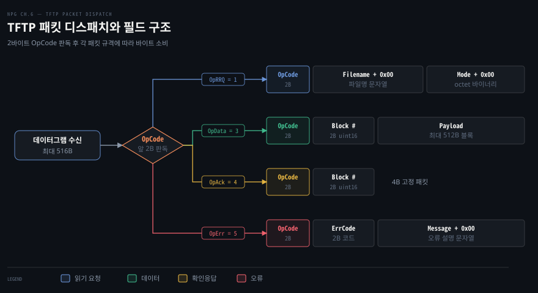
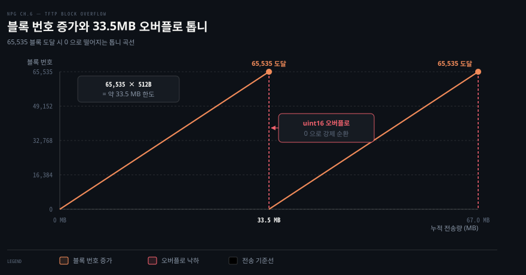

# TFTP 패킷 네 종을 바이트로 짠다

---

> 6장 앞부분은 신뢰성이 없는 UDP 위에서 파일 전송의 완결성을 보장하기 위해 애플리케이션 계층이 직접 구현해야 하는 패킷 규격과 직렬화 기법을 다룹니다. TFTP(RFC 1350)의 단순한 프로토콜 모델을 빌려, Go 표준 인터페이스인 `encoding.BinaryMarshaler` 와 `encoding.BinaryUnmarshaler` 로 네 가지 패킷을 바이트 슬라이스로 직렬화하고 복원하는 기반을 다집니다.

## 핵심 요약

> 이 편이 매달린 하나의 생각은, UDP 데이터그램의 손실과 순서 뒤바뀜을 극복하는 신뢰성 프로토콜의 출발점은 각 역할에 맞춰 정밀하게 바이트 단위로 설계된 패킷 타입 시스템이라는 사실입니다.

TFTP 는 TCP 가 커널에서 제공하는 복잡한 신뢰성 기능 중 순서 보장, 확인응답, 타임아웃 재전송의 핵심 서브셋만 애플리케이션 계층으로 가져와 구현합니다. 네트워크 MTU 단편화를 원천 차단하기 위해 데이터그램 최대 크기를 516바이트로 제한하고 헤더 4바이트를 뺀 512바이트 단위로 페이로드를 잘라 전송합니다.

수신 소켓에 도달한 데이터그램은 앞선 2바이트 OpCode 값에 따라 읽기 요청 RRQ, 데이터 DATA, 확인응답 ACK, 오류 ERROR 중 하나로 분기합니다. Go 의 타입 시스템을 활용해 각 패킷 구조체마다 표준 바이너리 직렬화·역직렬화 메서드를 캡슐화해 두면 네트워크 소켓은 단순 바이트 파이프로 동작하고 프로토콜 제어 로직은 각 타입 안에서 깔끔하게 정리됩니다.




## 학습 목표

> 이 편을 읽고 나면 아래 다섯 가지를 스스로 해낼 수 있습니다.

1. 원문이 UDP 신뢰성 구현 예제로 TFTP 를 선정한 이유와 RFC 1350 에서 제한한 구현 범위를 설명할 수 있습니다.
2. `DatagramSize(516)` 와 `BlockSize(512)` 상수가 도출된 배경과 IP 단편화 방지 원리를 짚을 수 있습니다.
3. 읽기 요청(RRQ)의 널 바이트 구분자 구조를 파악하고 Go 의 `bytes.Buffer` 및 `binary.Read` 로 직렬화·역직렬화할 수 있습니다.
4. 데이터(DATA) 패킷의 블록 번호 증가 방식과 33.5MB 전송 시 발생하는 uint16 정수 오버플로 문제를 계산할 수 있습니다.
5. ACK 와 ERROR 패킷의 바이트 레이아웃을 비교하고 비정상 상황에서 전송을 즉시 중단하는 흐름을 설명할 수 있습니다.


## 1. TFTP 는 UDP 위의 작은 파일 전송 규약이다

> TFTP 는 연결 설정이나 혼잡 제어 같은 TCP 의 무거운 오버헤드를 걷어내고, UDP 위에서 순서 번호와 1:1 확인응답만으로 데이터의 신뢰 전송을 달성하는 단순한 응용 규약입니다.

### UDP 신뢰성 예제로 TFTP 를 고른 이유

UDP 는 데이터그램의 도달이나 순서를 보장하지 않으므로 신뢰성이 필요한 서비스라면 애플리케이션이 손수 전송 규약을 설계해야 합니다. 원문은 TCP 전체를 바닥부터 흉내 내는 대신 TCP 신뢰성의 핵심 요소인 순서 번호, 확인응답 ACK, 재전송만을 간결하게 뽑아낸 실전 사례로 TFTP(Trivial File Transfer Protocol)를 채택합니다.

TFTP 는 PXE 부팅 이미지 전송이나 라우터 펌웨어 업데이트처럼 메모리가 극도로 제한된 임베디드 환경에서 널리 쓰여 왔습니다. 원문 예제는 학습의 핵심에 집중하기 위해 RFC 1350 규격 중 클라이언트의 파일 다운로드 기능만 구현합니다. 쓰기 요청 WRQ, netascii 텍스트 변환 모드, RFC 2347 후속 확장은 과감히 생략하고 octet 바이너리 읽기 전송만 다룹니다. 보안 암호화나 인증 기능이 없으므로 실제 운영망 통신에는 WireGuard 같은 보안 계층이 권장된다는 한계도 함께 짚습니다.

### 516바이트와 512바이트 상수의 배경

원문 Listing 6-1 은 프로토콜의 뼈대를 이루는 크기 상수와 열거형 코드를 정의합니다.

```go
// Listing 6-1 발췌: TFTP 크기 상수와 코드 정의 (types.go)
package tftp

const (
	DatagramSize = 516              // (1) 지원하는 최대 데이터그램 크기
	BlockSize    = DatagramSize - 4 // (2) 4바이트 헤더를 뺀 순수 데이터 크기 (512)
)

type OpCode uint16 // (3) 2바이트 작업 코드

const (
	OpRRQ  OpCode = iota + 1 // 1: 읽기 요청
	_                        // 2: 쓰기 요청 미지원 (생략)
	OpData                   // 3: 데이터 블록
	OpAck                    // 4: 확인응답
	OpErr                    // 5: 오류
)

type ErrCode uint16 // (4) 2바이트 오류 코드

const (
	ErrUnknown ErrCode = iota
	ErrNotFound
	ErrAccessViolation
	ErrDiskFull
	ErrIllegalOp
	ErrUnknownID
	ErrFileExists
	ErrNoUser
)
```

상수 `DatagramSize` 가 516바이트로 정해진 이유는 네트워크 단편화(fragmentation)를 회피하기 위함입니다. [05-02 §2](./05-02.net.Conn%20으로%20상대를%20고정하고%20MTU%20아래로%20보내%20단편화를%20피한다.md)에서 살펴보았듯 IP 계층에서 패킷이 쪼개지면 조각 하나만 유실되어도 전체 데이터그램이 폐기됩니다. IPv4 표준이 보장하는 최소 재조립 버퍼 크기인 576바이트 안에 안전하게 들어가도록 패킷 전체 크기를 516바이트로 못박았습니다.

데이터 패킷 헤더인 2바이트 OpCode 와 2바이트 블록 번호의 합 4바이트를 빼면 순수 페이로드 한도인 512바이트 `BlockSize` 가 남습니다. TFTP 는 하위 네트워크의 전송 제약을 감안하여 보수적인 고정 크기를 택합니다.


## 2. 읽기 요청은 opcode·파일명·모드를 0 바이트로 끊는다

> 읽기 요청(RRQ) 패킷은 2바이트 작업 코드 뒤에 파일명과 전송 모드 문자열을 널 바이트(0x00)로 구분하여 직렬화합니다.

### RRQ 패킷 구조와 구분자 배치

클라이언트가 파일 다운로드를 시작할 때 처음 서버로 쏘는 패킷이 읽기 요청(RRQ)입니다. [04-01](./04-01.TCP%20는%20경계%20없는%20바이트%20흐름이라%20읽는%20쪽이%20메시지를%20자른다.md)에서 다룬 길이 기반 TLV 프레이밍과 달리 RRQ 는 고정 2바이트 헤더 뒤에 가변 길이 문자열들을 0 바이트(`\x00`) 종단자로 끊어내는 방식을 취합니다.

원문 Figure 6-1 에 제시된 필드 배치는 다음과 같습니다.

1. **OpCode**: 2바이트 빅엔디언 부호 없는 정수 (값: `1`)
2. **Filename**: 전송받을 파일 이름 문자열
3. **Null Byte**: 1바이트 널 종단자 (`0x00`)
4. **Mode**: 전송 모드 문자열 (`"octet"` 또는 `"netascii"`)
5. **Null Byte**: 패킷의 끝을 닫는 1바이트 널 종단자 (`0x00`)

원문 예제는 바이너리 모드인 `"octet"` 만 허용합니다. 만약 `"netascii"` 가 들어오면 클라이언트 운영체제에 맞춰 개행 문자 변환을 거쳐야 하므로 구현 복잡도를 줄이기 위해 거부합니다.

### 직렬화와 역직렬화 구현

원문 Listing 6-2 와 6-3 은 `ReadReq` 구조체에 `encoding.BinaryMarshaler` 와 `encoding.BinaryUnmarshaler` 인터페이스를 구현합니다.

```go
// Listing 6-2 발췌: ReadReq 구조체와 직렬화 메서드 (types.go)
type ReadReq struct { // (1)
	Filename string
	Mode     string
}

func (q ReadReq) MarshalBinary() ([]byte, error) {
	mode := "octet"
	if q.Mode != "" {
		mode = q.Mode
	}
	// OpCode 2B + 파일명 + 0x00 + 모드 + 0x00
	cap := 2 + len(q.Filename) + 1 + len(mode) + 1
	b := new(bytes.Buffer)
	b.Grow(cap)

	err := binary.Write(b, binary.BigEndian, OpRRQ) // (2) OpCode 쓰기
	if err != nil {
		return nil, err
	}
	_, err = b.WriteString(q.Filename)
	if err != nil {
		return nil, err
	}
	err = b.WriteByte(0) // (3) 0x00 구분자 쓰기
	if err != nil {
		return nil, err
	}
	_, err = b.WriteString(mode)
	if err != nil {
		return nil, err
	}
	err = b.WriteByte(0)
	if err != nil {
		return nil, err
	}
	return b.Bytes(), nil
}
```

역직렬화 메서드는 네트워크에서 읽어 들인 바이트 슬라이스에서 OpCode 를 확인하고 `bytes.Buffer.ReadString(0)` 을 호출하여 널 바이트 단위로 문자열을 파싱합니다.

```go
// Listing 6-3 발췌: ReadReq 역직렬화 메서드 (types.go)
func (q *ReadReq) UnmarshalBinary(p []byte) error { // (1)
	r := bytes.NewBuffer(p)
	var code OpCode
	err := binary.Read(r, binary.BigEndian, &code) // (2) OpCode 읽기
	if err != nil {
		return err
	}
	if code != OpRRQ {
		return errors.New("invalid RRQ")
	}

	q.Filename, err = r.ReadString(0) // (3) 널 바이트까지 읽기
	if err != nil {
		return errors.New("invalid RRQ")
	}
	q.Filename = strings.TrimRight(q.Filename, "\x00") // (4) 널 종단자 제거
	if len(q.Filename) == 0 {
		return errors.New("invalid RRQ")
	}

	q.Mode, err = r.ReadString(0)
	if err != nil {
		return errors.New("invalid RRQ")
	}
	q.Mode = strings.TrimRight(q.Mode, "\x00")
	if len(q.Mode) == 0 {
		return errors.New("invalid RRQ")
	}

	actual := strings.ToLower(q.Mode)
	if actual != "octet" {
		return errors.New("only binary transfers supported")
	}
	return nil
}
```

패킷 타입을 판별할 때 별도의 파서 함수를 외부에 두지 않고 수신 버퍼 슬라이스를 `rrq.UnmarshalBinary(buf)` 에 넘겨 nil 이 반환되는지로 유효성을 가려냅니다.


## 3. 데이터 패킷은 블록 번호와 최대 512바이트를 싣는다

> 데이터(DATA) 패킷은 2바이트 작업 코드, 2바이트 순서 번호, 최대 512바이트의 페이로드로 구성되며 패킷 크기가 516바이트 미만이면 파일 전송이 끝났음을 알립니다.

### Data 구조체와 io.Reader 기반 설계

서버가 클라이언트의 읽기 요청에 응답하여 실제 파일 내용을 실어 나르는 그릇이 `Data` 타입입니다. 원문 Listing 6-4 는 페이로드 필드의 타입으로 바이트 슬라이스 대신 `io.Reader` 를 선택합니다.

```go
// Listing 6-4 발췌: Data 구조체와 직렬화 메서드 (types.go)
type Data struct { // (1)
	Block   uint16
	Payload io.Reader
}

func (d *Data) MarshalBinary() ([]byte, error) { // (2)
	b := new(bytes.Buffer)
	b.Grow(DatagramSize)

	d.Block++ // 블록 번호는 1부터 순차 증가
	err := binary.Write(b, binary.BigEndian, OpData)
	if err != nil {
		return nil, err
	}
	err = binary.Write(b, binary.BigEndian, d.Block)
	if err != nil {
		return nil, err
	}

	_, err = io.CopyN(b, d.Payload, BlockSize) // (3) 최대 512바이트 복사
	if err != nil && err != io.EOF {
		return nil, err
	}
	return b.Bytes(), nil
}
```

페이로드를 `io.Reader` 로 두면 로컬 디스크 파일(`*os.File`), 인메모리 버퍼(`bytes.Reader`), 또는 다른 네트워크 소켓(`net.Conn`) 등 어떤 소스라도 수정 없이 연결할 수 있습니다. `io.CopyN` 함수가 남은 바이트 읽기와 위치 이동을 알아서 관리하므로 서버 측의 오프셋 계산 코드가 대폭 줄어듭니다.

`MarshalBinary` 메서드가 값 수신자가 아닌 포인터 수신자(`*Data`)로 선언된 점도 중요합니다. 메서드를 부를 때마다 `d.Block++` 로 내부 상태를 전진시켜 다음 순서 번호를 자동으로 부여하기 때문입니다.

### 전송 종료 판단과 33.5MB 오버플로 톱니

TFTP 에는 파일의 전체 크기를 사전에 알리는 헤더 필드가 없습니다. 수신 측은 어떻게 전송이 끝났음을 알 수 있을까요?

규칙은 단순합니다. 모든 일반 데이터 패킷은 헤더 4바이트와 페이로드 512바이트를 꽉 채워 정확히 516바이트를 유지합니다. 파일의 마지막 조각에 도달하여 페이로드가 512바이트 미만이 되면 완성된 데이터그램의 전체 크기는 516바이트 미만이 됩니다. 클라이언트와 서버는 패킷 크기가 516바이트보다 작아지는 순간을 전송 완료의 신호로 인식합니다. 만약 파일 크기가 512바이트의 정확한 배수라면 파일 끝에서 페이로드가 0바이트인 빈 데이터 패킷(총 4바이트)을 한 번 더 전송하여 종료를 알립니다.

여기서 16비트 부호 없는 정수(`uint16`)인 블록 번호의 한계가 드러납니다. 블록 번호는 1부터 65,535까지만 표현할 수 있습니다.



전송 데이터량이 약 33.5MB(`65,535 × 512바이트 = 33,553,920바이트`)에 도달하면 다음 블록 번호는 `65535 + 1 = 0` 으로 오버플로되어 톱니처럼 바닥으로 떨어집니다. 서버 코드는 0번 블록을 계속 전송하지만 클라이언트 구현에 따라 번호 역전을 오류로 판단하고 전송을 강제 종료할 위험이 있습니다. 원문은 이 문제를 피하려면 파일 크기를 33.5MB 이하로 제한하거나 다른 프로토콜을 택해야 한다고 지적합니다.

### Data 역직렬화 구현

원문 Listing 6-5 의 `UnmarshalBinary` 메서드는 수신 데이터그램의 기본 크기를 검증하고 페이로드를 복원합니다.

```go
// Listing 6-5 발췌: Data 역직렬화 메서드 (types.go)
func (d *Data) UnmarshalBinary(p []byte) error {
	if l := len(p); l < 4 || l > DatagramSize { // (1) 기본 크기 범위 검증
		return errors.New("invalid DATA")
	}
	var opcode OpCode
	err := binary.Read(bytes.NewReader(p[:2]), binary.BigEndian, &opcode) // (2) OpCode 확인
	if err != nil || opcode != OpData {
		return errors.New("invalid DATA")
	}
	err = binary.Read(bytes.NewReader(p[2:4]), binary.BigEndian, &d.Block) // (3) 블록 번호 복원
	if err != nil {
		return errors.New("invalid DATA")
	}
	d.Payload = bytes.NewBuffer(p[4:]) // (4) 잔여 페이로드 슬라이스 적재
	return nil
}
```

패킷 길이가 헤더 최소 크기인 4바이트보다 작거나 최대 데이터그램 크기인 516바이트를 넘기면 즉시 거부합니다. 유효한 패킷이면 앞 4바이트를 떼어내 작업 코드와 블록 번호를 채우고 4번째 바이트 이후의 슬라이스를 새 버퍼(`bytes.NewBuffer(p[4:])`)로 감싸 `Payload` 에 할당합니다.


## 4. ACK 와 ERROR 패킷이 대화를 닫는다

> 확인응답(ACK)은 4바이트 고정 크기로 수신 블록을 확인하며, 오류(ERROR) 패킷은 2바이트 에러 코드와 설명 메시지를 싣고 통신을 즉시 폭파합니다.

### 고정 4바이트 ACK 패킷

클라이언트는 데이터 블록을 하나 받을 때마다 그 블록 번호를 담은 확인응답(ACK) 패킷을 서버로 돌려보냅니다. 원문 Figure 6-4 에 나타난 ACK 패킷의 구조는 단순합니다.

1. **OpCode**: 2바이트 빅엔디언 정수 (값: `4`)
2. **Block**: 2바이트 빅엔디언 블록 번호

부가 데이터가 없으므로 전체 패킷 크기는 항상 4바이트로 고정됩니다. Listing 6-6 은 `Ack` 타입을 `uint16` 기본 타입으로 선언하여 불필요한 구조체 메모리 오버헤드를 없앱니다.

```go
// Listing 6-6 발췌: Ack 타입과 직렬화·역직렬화 (types.go)
type Ack uint16 // (1) 수신 확인된 블록 번호

func (a Ack) MarshalBinary() ([]byte, error) {
	cap := 2 + 2 // OpCode(2B) + Block(2B)
	b := new(bytes.Buffer)
	b.Grow(cap)
	err := binary.Write(b, binary.BigEndian, OpAck)
	if err != nil {
		return nil, err
	}
	err = binary.Write(b, binary.BigEndian, a)
	if err != nil {
		return nil, err
	}
	return b.Bytes(), nil
}

func (a *Ack) UnmarshalBinary(p []byte) error {
	var code OpCode
	r := bytes.NewReader(p)
	err := binary.Read(r, binary.BigEndian, &code)
	if err != nil {
		return err
	}
	if code != OpAck {
		return errors.New("invalid ACK")
	}
	return binary.Read(r, binary.BigEndian, a)
}
```

### ERROR 패킷과 예외 종료

전송 중 파일이 없거나 접근 권한이 없는 등 문제가 발생하면 양 끝점은 오류(ERROR) 패킷을 보내 대화를 즉시 중단합니다. Figure 6-5 와 Listing 6-7, 6-8 은 ERROR 패킷의 배치와 코드를 보여줍니다.

```go
// Listing 6-7 및 6-8 발췌: Err 타입 정의 및 직렬화·역직렬화 (types.go)
type Err struct { // (1)
	Error   ErrCode
	Message string
}

func (e Err) MarshalBinary() ([]byte, error) {
	cap := 2 + 2 + len(e.Message) + 1 // OpCode + ErrCode + Message + 0x00
	b := new(bytes.Buffer)
	b.Grow(cap)
	_ = binary.Write(b, binary.BigEndian, OpErr)
	_ = binary.Write(b, binary.BigEndian, e.Error)
	_, _ = b.WriteString(e.Message)
	_ = b.WriteByte(0)
	return b.Bytes(), nil
}

func (e *Err) UnmarshalBinary(p []byte) error {
	r := bytes.NewBuffer(p)
	var code OpCode
	err := binary.Read(r, binary.BigEndian, &code) // (2)
	if err != nil {
		return err
	}
	if code != OpErr {
		return errors.New("invalid ERROR")
	}
	err = binary.Read(r, binary.BigEndian, &e.Error) // (3)
	if err != nil {
		return err
	}
	e.Message, err = r.ReadString(0) // (4)
	e.Message = strings.TrimRight(e.Message, "\x00")
	return err
}
```

ERROR 패킷은 2바이트 작업 코드(`OpErr = 5`), 2바이트 정수 오류 코드(`ErrCode`), 가변 길이 오류 설명 문자열, 1바이트 널 종단자로 이뤄집니다. RFC 1350 은 0(미정의)부터 7(사용자 없음)까지 8가지 표준 에러 코드를 규정합니다.

TFTP 대화에서 ERROR 패킷은 일종의 치명적 예외 통보입니다. ERROR 패킷을 수신한 노드는 재전송이나 복구를 시도하지 않고 즉시 현재 세션을 폐기합니다. 수신 소켓에 도착한 알 수 없는 데이터그램은 이처럼 정형화된 네 가지 패킷 타입의 메서드를 차례로 통과하면서 엄격하게 분류됩니다.


## 면접 대비

> 아래 질문에 답하면서 UDP 기반 응용 프로토콜의 패킷 설계 원리와 Go 직렬화 인터페이스의 활용법을 점검해 보세요.

1. TFTP 가 데이터그램 최대 크기를 516바이트로 제한하고 페이로드를 512바이트로 자르는 네트워크 수준의 이유는 무엇인가요?
2. TFTP 읽기 요청(RRQ)에서 파일명과 모드 문자열을 구분하기 위해 선택한 방식과 TLV 방식의 차이점을 설명해 주세요.
3. TFTP 데이터 전송에서 송수신 양측이 전체 전송의 완료 시점을 감지하는 원리는 무엇인가요?
4. 16비트 블록 번호 체계를 사용하는 TFTP 에서 약 33.5MB 이상의 파일을 전송할 때 어떤 문제가 발생하나요?
5. Go 의 `encoding.BinaryMarshaler` 와 `encoding.BinaryUnmarshaler` 인터페이스를 네트워크 패킷 구현에 활용할 때 얻는 구조적 이점은 무엇인가요?


## 정답 (자답 후 펼치기)

> 위 §면접 대비의 질문에 먼저 스스로 답한 뒤 읽으세요.

### 정답 1 — IP 단편화 방지와 576바이트 버퍼 안전선

하위 IP 계층에서 패킷이 MTU 한도를 초과하여 여러 조각으로 단편화되면 조각 중 단 하나만 손실되어도 전체 데이터그램이 폐기되어 손실률이 급증합니다. RFC 791 규격은 모든 인터넷 호스트가 최소 576바이트 크기의 데이터그램을 재조립 없이 처리할 수 있도록 규정합니다. TFTP 는 IP 헤더 20바이트와 UDP 헤더 8바이트를 더해도 544바이트 수준에 머물도록 전체 데이터그램 크기를 516바이트로 제한했습니다. 패킷 헤더 4바이트를 뺀 512바이트가 순수 데이터 페이로드 한도가 됩니다.

### 정답 2 — 널 바이트 구분자 방식 vs TLV 길이 명시 방식

RRQ 패킷은 가변 길이 문자열의 끝을 널 바이트(`\x00`) 종단자로 표시하는 구분자 기반 프레이밍을 사용합니다. 수신 측은 `ReadString(0)` 처럼 0 바이트가 나타날 때까지 바이트 스트림을 순차 스캔해야 합니다. 반면 TLV(Type-Length-Value) 방식은 값 앞에 데이터의 길이를 고정 바이트 정수로 명시하므로 수신 측이 지정된 바이트 수만큼 단번에 읽어 들이고 버퍼를 미리 할당할 수 있습니다. 널 구분자 방식은 패킷 파싱 시 문자열 내부에 의도치 않은 0 바이트가 포함되지 않도록 추가 검증이 필요합니다.

### 정답 3 — 516바이트 미만 패킷 수신 감지

TFTP 는 별도의 파일 크기 메타데이터를 사전에 주고받지 않습니다. 데이터 패킷은 항상 512바이트 페이로드를 꽉 채워 516바이트로 전송되다가 파일의 마지막 블록에 도달하면 512바이트보다 적은 데이터가 실리게 됩니다. 따라서 패킷의 전체 길이가 516바이트 미만이 되는 순간 송수신 양측은 마지막 블록임을 알아채고 전송을 마칩니다. 만약 파일 크기가 정확히 512의 배수라면 데이터가 0바이트인 4바이트짜리 빈 패킷을 마지막에 전송하여 완료를 알립니다.

### 정답 4 — uint16 블록 번호의 랩어라운드(Wrap-around)

데이터 패킷의 블록 번호는 2바이트 부호 없는 정수(`uint16`)로 최대 65,535까지만 증가할 수 있습니다. 한 블록이 512바이트이므로 `65,535 × 512 = 33,553,920` 바이트(약 33.5MB)를 초과하면 블록 번호가 0으로 오버플로되어 다시 1부터 순환합니다. 순서 번호 역전을 허용하지 않거나 중복 패킷으로 오인하는 보수적인 클라이언트 구현체와 통신할 경우 전송이 비정상 중단될 수 있습니다.

### 정답 5 — 비즈니스 로직과 네트워크 입출력의 관심사 분리

각 패킷 타입이 `MarshalBinary` 와 `UnmarshalBinary` 메서드를 구현하면 패킷 내부의 필드 순서, 엔디언 변환, 널 바이트 종단자 처리 같은 바이트 조작 세부사항이 타입 내부로 캡슐화됩니다. 네트워크 소켓 계층은 단순히 패킷을 읽어 바이트 슬라이스를 역직렬화 메서드에 전달하고 결과 객체의 유효성만 확인하면 되므로 코드가 간결해집니다. 또한 단위 테스트 작성 시 실제 UDP 네트워크를 띄우지 않고도 메모리 슬라이스만으로 패킷 인코딩과 디코딩의 정합성을 완벽하게 검증할 수 있습니다.


## 참고 자료

- 《Network Programming with Go》 Adam Woodbeck, No Starch Press, 2021. ISBN 978-1-7185-0088-4. Chapter 6 Ensuring UDP Reliability (p.1–14).
- [RFC 1350 — The TFTP Protocol (Revision 2)](https://www.rfc-editor.org/rfc/rfc1350): TFTP 패킷 포맷 및 상태 교환 표준 규격.
- [Go encoding 패키지 공식 문서](https://pkg.go.dev/encoding): `BinaryMarshaler` 및 `BinaryUnmarshaler` 인터페이스 정의.
- [RFC 791 — Internet Protocol](https://www.rfc-editor.org/rfc/rfc791): 최소 재조립 버퍼 576바이트 규정.


## 관련 문서

- [05-01 UDP 는 연결 없이 보내고, 소켓 하나가 누구에게서든 받는다](./05-01.UDP%20는%20연결%20없이%20보내고,%20소켓%20하나가%20누구에게서든%20받는다.md): 비연결형 UDP 소켓의 기본 동작을 다룹니다.
- [05-02 net.Conn 으로 상대를 고정하고 MTU 아래로 보내 단편화를 피한다](./05-02.net.Conn%20으로%20상대를%20고정하고%20MTU%20아래로%20보내%20단편화를%20피한다.md): IP 단편화의 위험과 MTU 제한 원리를 다룹니다.
- [04-01 TCP 는 경계 없는 바이트 흐름이라 읽는 쪽이 메시지를 자른다](./04-01.TCP%20는%20경계%20없는%20바이트%20흐름이라%20읽는%20쪽이%20메시지를%20자른다.md): TLV 프레이밍과 구분자 기반 프레이밍의 장단점을 비교합니다.
- [06-02 TFTP 서버는 블록마다 ACK 를 기다리고 재전송해 UDP 위에 신뢰성을 올린다](./06-02.TFTP%20서버는%20블록마다%20ACK%20를%20기다리고%20재전송해%20UDP%20위에%20신뢰성을%20올린다.md): 이 패킷 타입들을 조합하여 실제 신뢰 전송을 수행하는 서버 루프를 다룹니다.
- [이 책의 정독 인덱스](./README.md): NPG 전반의 구성과 학습 로드맵.
