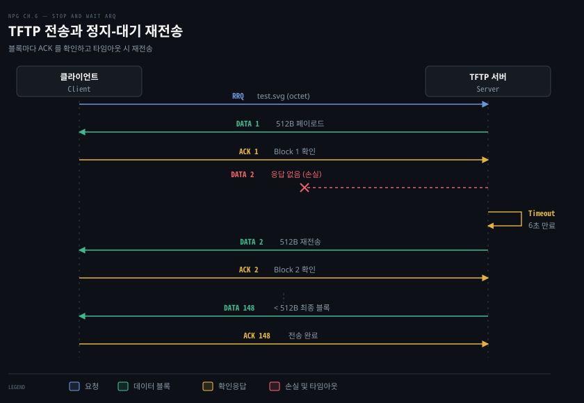
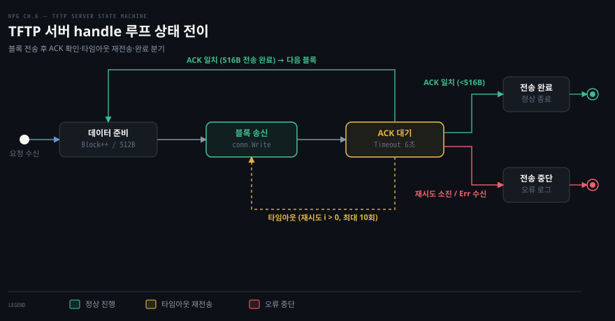

# TFTP 서버는 블록마다 ACK 를 기다리고 재전송해 UDP 위에 신뢰성을 올린다

---

> 6장 뒷부분은 앞서 설계한 패킷 타입을 조립하여 실제 동작하는 TFTP 서버를 구축하고 무결성을 검증하는 과정을 다룹니다. 요청마다 고루틴과 전용 소켓을 분리하고 블록 단위 확인응답과 타임아웃 재전송 루프를 결합하여 UDP 통신 위에서 정지-대기 방식의 신뢰 전송을 완성합니다.

## 핵심 요약

> 이 편이 매달린 하나의 생각은, UDP 위의 신뢰성은 연결 분리를 통한 다중화와 블록 단위 정지-대기 재전송 루프라는 두 축으로 애플리케이션 계층에서 완성된다는 사실입니다.

서버는 69번 웰노운 포트에서 `net.PacketConn` 으로 진입 요청을 감청하다가 유효한 읽기 요청(RRQ)을 받으면 새 고루틴을 띄웁니다. 핸들러 고루틴은 `net.Dial` 로 클라이언트와 1:1 연결을 맺어 메인 수신 소켓을 즉시 해방하고 송수신 주소 필터링 오버헤드를 걷어냅니다.

실제 데이터 전송은 512바이트 블록 하나를 보내고 확인응답을 받을 때까지 멈추어 기다리는 정지-대기 방식을 따릅니다. 데드라인 기반 타임아웃이 발생하면 현재 블록을 최대 10회까지 재전송하며 패킷 손실을 복구합니다. 최종 블록 크기가 516바이트 미만임을 감지하여 전송을 안전하게 닫고 고속 64비트 해시인 SHA512/256 으로 전송 파일의 바이트 단위 무결성을 최종 확인합니다.


## 학습 목표

> 이 편을 읽고 나면 아래 다섯 가지를 스스로 해낼 수 있습니다.

1. `Server` 구조체의 기본 필드와 69번 포트 리스너의 역할을 설명할 수 있습니다.
2. 읽기 요청 수신 시 별도 고루틴과 `net.Dial` 연결을 여는 구조적 이유를 밝힐 수 있습니다.
3. 정지-대기 전송 흐름과 타임아웃 재전송 루프의 탈출 조건을 순서대로 재현할 수 있습니다.
4. TCP 슬라이딩 윈도와 TFTP 정지-대기 메커니즘의 성능상 차이를 비교할 수 있습니다.
5. SHA512/256 체크섬이 64비트 CPU 에서 갖는 속도 및 보안상 이점을 설명할 수 있습니다.


## 1. 서버는 요청마다 새 연결로 따로 응답한다

> 서버는 공용 수신 소켓에서 읽기 요청을 받아 전용 고루틴으로 넘기고, 클라이언트 주소로 다이얼을 걸어 독립된 전송 소켓을 확보합니다.

### Server 타입의 필드와 기본값

원문 Listing 6-9 는 TFTP 서버 구조체와 진입점 메서드를 선언합니다.

```go
// Listing 6-9 발췌: Server 타입과 Serve 루프 (server.go)
package tftp

import (
	"errors"
	"log"
	"net"
	"time"
)

type Server struct {
	Payload []byte        // (1) 모든 읽기 요청에 응답할 파일 페이로드
	Retries uint8         // (2) 실패한 전송의 재시도 횟수
	Timeout time.Duration // (3) ACK 대기 타임아웃 시간
}

func (s Server) ListenAndServe(addr string) error {
	conn, err := net.ListenPacket("udp", addr)
	if err != nil {
		return err
	}
	defer func() { _ = conn.Close() }()
	log.Printf("Listening on %s ...\n", conn.LocalAddr())
	return s.Serve(conn)
}

func (s *Server) Serve(conn net.PacketConn) error {
	if conn == nil {
		return errors.New("nil connection")
	}
	if s.Payload == nil {
		return errors.New("payload is required")
	}
	if s.Retries == 0 {
		s.Retries = 10 // (4) 기본 재시도 횟수 10회
	}
	if s.Timeout == 0 {
		s.Timeout = 6 * time.Second // (5) 기본 타임아웃 6초
	}

	var rrq ReadReq
	for {
		buf := make([]byte, DatagramSize)
		_, addr, err := conn.ReadFrom(buf)
		if err != nil {
			return err
		}
		err = rrq.UnmarshalBinary(buf)
		if err != nil {
			log.Printf("[%s] bad request: %v", addr, err)
			continue
		}
		// (6) 독립 고루틴으로 분기
		go s.handle(addr.String(), rrq);
	}
}
```

`Server` 구조체는 세 가지 필드를 갖습니다. 클라이언트에게 돌려줄 데이터 원본인 `Payload`, 전송 실패 시 패킷을 다시 보낼 최대 횟수 `Retries`, 확인응답을 기다리는 제한 시간 `Timeout` 입니다. 사용자가 값을 비워 두면 `Serve` 메서드가 각각 10회와 6초를 기본값으로 채웁니다.

`ListenAndServe` 메서드는 `net.ListenPacket("udp", addr)` 로 UDP 패킷 연결을 엽니다. [05-01 §2](./05-01.UDP%20는%20연결%20없이%20보내고,%20소켓%20하나가%20누구에게서든%20받는다.md)에서 다루었듯 `net.PacketConn` 은 누구에게서든 도착하는 데이터그램을 `ReadFrom` 으로 받아내는 열린 소켓입니다.

### 요청마다 고루틴과 net.Dial 을 분리하는 이유

수신한 패킷이 유효한 `ReadReq` 로 파싱되면 서버는 고루틴을 띄워 핸들러를 실행합니다. 메인 리스너가 직접 파일 데이터를 전송하지 않고 별도 고루틴을 띄우는 이유는 셋입니다.

첫째, 동시 다중 요청 처리입니다. 메인 루프에서 전송을 직접 수행하면 한 클라이언트에게 512바이트씩 수백 개 블록을 다 보낼 때까지 69번 포트가 블로킹되어 다른 클라이언트의 요청을 받을 수 없습니다.

둘째, RFC 1350 의 TID(전송 식별자) 규약 준수입니다. 표준 TFTP 는 69번 포트를 최초 요청 수신용으로만 쓰고 실제 데이터 교환은 서버가 임의로 선택한 임시 포트로 옮겨 진행하도록 규정합니다.

셋째, 소켓 레벨의 상대 고정입니다. 뒤이어 볼 핸들러는 `net.Dial("udp", clientAddr)` 로 소켓을 엽니다. [05-02 §1](./05-02.net.Conn%20으로%20상대를%20고정하고%20MTU%20아래로%20보내%20단편화를%20피한다.md)에서 배웠듯 UDP 소켓에 다이얼을 걸면 운영체제 커널이 해당 목적지 주소로 소켓을 고정합니다. 이제 핸들러는 매번 송신자 IP 와 포트를 대조할 필요 없이 일반 `conn.Read` 와 `conn.Write` 로 데이터를 편하게 주고받습니다.


## 2. 블록 하나를 보내고 ACK 를 받을 때까지 기다린다

> 핸들러는 512바이트 블록을 보내고 ACK 가 올 때까지 대기하며, 6초 데드라인 만료 시 최대 10회까지 같은 블록을 재전송합니다.

### 정지-대기(Stop-and-Wait) 흐름

TFTP 는 가장 단순한 신뢰 전송 모델인 정지-대기(Stop-and-Wait ARQ) 규약을 따릅니다. 송신 측은 한 번에 하나의 패킷만 보내고 수신 측이 잘 받았다는 확인응답 ACK 를 돌려줄 때까지 다음 블록을 보내지 않고 대기합니다.

원문 Figure 6-3 이 묘사하는 클라이언트와 서버 사이의 통신 과정을 도식으로 따라가 봅니다.



1. 클라이언트가 읽기 요청 RRQ 를 전송합니다.
2. 서버는 1번 블록 DATA 1(512바이트)로 응답합니다.
3. 클라이언트는 수신을 확인하는 ACK 1 을 반환합니다.
4. 서버는 2번 블록 DATA 2 를 전송합니다. 네트워크에서 패킷이 손실되거나 지연되어 응답이 오지 않습니다.
5. 서버의 대기 타이머가 만료(Timeout 6초)됩니다.
6. 서버는 직전에 보냈던 DATA 2 를 다시 전송합니다.
7. 클라이언트가 DATA 2 를 받고 ACK 2 를 회신합니다.
8. 이 왕복이 이어지다가 페이로드가 512바이트 미만인 마지막 블록(DATA 148)을 전송하고 최종 ACK 를 받으면 전송이 종료됩니다. 도식의 'DATA 148'은 원문 서버 로그 "sent 148 blocks"에서 가져온 값이고, 클라이언트 출력 "75352 bytes"(75,352 = 147×512 + 88)와도 맞아떨어집니다.

### 이중 루프로 구현된 handle 제어문

원문 Listing 6-10 은 이 정지-대기 논리를 정교한 이중 레이블 루프로 풀어냅니다.

```go
// Listing 6-10 발췌: handle 메서드의 이중 전송 루프 (server.go)
func (s Server) handle(clientAddr string, rrq ReadReq) {
	log.Printf("[%s] requested file: %s", clientAddr, rrq.Filename)
	conn, err := net.Dial("udp", clientAddr) // (1) 클라이언트 고정 UDP 연결
	if err != nil {
		log.Printf("[%s] dial: %v", clientAddr, err)
		return
	}
	defer func() { _ = conn.Close() }()

	var (
		ackPkt  Ack
		errPkt  Err
		dataPkt = Data{Payload: bytes.NewReader(s.Payload)} // (2)
		buf     = make([]byte, DatagramSize)
	)

NEXTPACKET:
	for n := DatagramSize; n == DatagramSize; { // (3) 다음 블록 진행 루프
		data, err := dataPkt.MarshalBinary()
		if err != nil {
			log.Printf("[%s] preparing data packet: %v", clientAddr, err)
			return
		}

RETRY:
		for i := s.Retries; i > 0; i-- { // (4) 재전송 루프 (최대 10회)
			n, err = conn.Write(data)    // 패킷 송신
			if err != nil {
				log.Printf("[%s] write: %v", clientAddr, err)
				return
			}

			_ = conn.SetReadDeadline(time.Now().Add(s.Timeout)) // (5) 6초 데드라인 설정
			_, err = conn.Read(buf)
			if err != nil {
				if nErr, ok := err.(net.Error); ok && nErr.Timeout() {
					continue RETRY // 타임아웃 발생 시 재전송
				}
				log.Printf("[%s] waiting for ACK: %v", clientAddr, err)
				return
			}

			switch {
			case ackPkt.UnmarshalBinary(buf) == nil:
				if uint16(ackPkt) == dataPkt.Block { // (6) 블록 번호 일치 확인
					continue NEXTPACKET              // 다음 블록으로 이동
				}
			case errPkt.UnmarshalBinary(buf) == nil: // (7) 오류 패킷 수신
				log.Printf("[%s] received error: %v", clientAddr, errPkt.Message)
				return
			default:
				log.Printf("[%s] bad packet", clientAddr)
			}
		}
		log.Printf("[%s] exhausted retries", clientAddr) // (8) 재시도 소진
		return
	}
	log.Printf("[%s] sent %d blocks", clientAddr, dataPkt.Block)
}
```

핸들러의 상태 전이도를 통해 각 탈출 및 순환 조건을 한눈에 볼 수 있습니다.



제어 흐름은 세 갈래로 나뉩니다.

1. **정상 전진**: 수신한 ACK 의 블록 번호가 `dataPkt.Block` 과 일치하면 내부 루프를 벗어나 `continue NEXTPACKET` 을 탑니다. 이때 마지막 블록이어서 전송 바이트 `n` 이 516보다 작았다면 외부 루프 조건 `n == DatagramSize` 가 거짓이 되며 루프 전체를 빠져나와 성공 종료합니다.
2. **손실 복구**: 6초 동안 응답이 없어 `conn.Read` 에서 타임아웃 오류가 발생하거나 지연된 옛 블록의 ACK 가 들어오면 내부 루프 `continue RETRY` 로 돌아가 같은 데이터를 다시 쏩니다. 재시도 횟수 `i` 가 0이 될 때까지 응답을 받지 못하면 전송을 포기하고 빠져나옵니다.
3. **치명적 오류**: 클라이언트가 ERROR 패킷을 보내오면 즉시 함수를 반환하여 세션을 닫습니다.

### TCP 슬라이딩 윈도와의 대비

이 메커니즘을 TCP 의 신뢰성과 대조해 보면 흥미로운 트레이드오프가 보입니다. [03-01 §3](./03-01.TCP%20세션은%20핸드셰이크로%20열고%20창으로%20속도를%20맞추고%20FIN·RST%20로%20끝난다.md)과 [TII 12-01](../tii_tcp-ip-illustrated/12-01.TCP%20의%20신뢰성은%20재전송·번호·창으로%20만든다.md)에서 다루었듯 TCP 는 슬라이딩 윈도를 이용해 확인응답을 기다리지 않고도 윈도 크기만큼 여러 패킷을 쉼 없이 파이프라인에 밀어 넣습니다.

반면 TFTP 의 정지-대기는 한 번에 한 블록만 보내므로 왕복 시간(RTT)이 긴 네트워크에서는 대역폭이 아무리 넓어도 전송 속도가 극도로 떨어집니다. [CNTD 03-02 신뢰성은 어떻게 만들어지는가](../cntd_computer-networking-top-down/03-02.신뢰성은%20어떻게%20만들어지는가.md)에서 분석한 rdt 3.0 프로토콜과 완전히 동일한 한계를 가집니다. 단순성을 대가로 높은 전송률을 포기한 전형적인 설계입니다.


## 3. 받은 파일은 체크섬으로 확인한다

> 서버를 띄워 파일을 다운로드하고, 64비트 연산에 최적화된 SHA512/256 해시를 계산하여 원본과 100% 동일한지 검증합니다.

### 서버 구동과 클라이언트 다운로드

원문 Listing 6-11 은 명령줄에서 서버를 띄우는 실행 프로그램(`tftp.go`)입니다.

```go
// Listing 6-11 발췌: 명령줄 TFTP 서버 구동 (tftp.go)
package main

import (
	"flag"
	"log"
	"os"

	"github.com/awoodbeck/gnp/ch06/tftp"
)

var (
	address = flag.String("a", "127.0.0.1:69", "listen address")
	payload = flag.String("p", "payload.svg", "file to serve to clients")
)

func main() {
	flag.Parse()
	p, err := os.ReadFile(*payload) // (1) 페이로드 로드
	if err != nil {
		log.Fatal(err)
	}
	s := tftp.Server{Payload: p}
	log.Fatal(s.ListenAndServe(*address)) // (2) 리스너 구동
}
```

파일을 통째로 읽어 페이로드로 준비할 때는 Go 표준 라이브러리의 [`os.ReadFile`](https://pkg.go.dev/os#ReadFile) 을 사용합니다.

포트 69는 1024 미만의 특권 포트(privileged port)이므로 Linux 나 macOS 에서는 루트 권한(`sudo`)이 필요합니다.

원문은 Windows 10 환경에서 기본 내장된 TFTP 클라이언트를 사용하여 전송을 테스트합니다. 원서의 실행 화면 기록은 다음과 같습니다.

```powershell
Microsoft Windows [Version 10.0.18362.449]
(c) 2019 Microsoft Corporation. All rights reserved.
C:\Users\User\gnp\ch06\tftp\tftp>go run tftp.go
2006/01/02 15:04:05 Listening on 127.0.0.1:69 ...
```

다른 터미널 창에서 클라이언트를 실행하여 바이너리 모드(`-i`)로 다운로드를 요청합니다.

```powershell
C:\Users\User>tftp -i 127.0.0.1 GET test.svg
Transfer successful: 75352 bytes in 1 second(s), 75352 bytes/s
```

서버 콘솔에는 클라이언트 접속과 전송 블록 수가 찍힙니다.

```powershell
2006/01/02 15:04:05 [127.0.0.1:57944] requested file: test.svg
2006/01/02 15:04:05 [127.0.0.1:57944] sent 148 blocks
```

총 75,352바이트가 전송되었고 블록 수는 148개입니다. 512바이트 블록 147개(75,264바이트)와 마지막 148번째 블록 88바이트가 전송되어 정확히 맞아떨어집니다.

> 책 밖 보강: macOS 나 Linux 환경에서 재현할 때는 터미널에서 `tftp 127.0.0.1` 을 입력해 대화형 프롬프트로 진입한 뒤 `binary` 명령으로 모드를 바꾸고 `get test.svg` 를 실행하면 동일하게 다운로드할 수 있습니다.

### 무결성 검증과 SHA512/256 해시의 선택 이유

다운로드한 `test.svg` 가 서버의 원본 `payload.svg` 와 한 바이트도 틀림없이 같은지 어떻게 확인할까요? 원문은 순수 Go 코드로 작성된 SHA512/256 해시 생성기(Listing 6-12)를 제시합니다.

```go
// Listing 6-12 발췌: SHA512/256 체크섬 도구 (sha512-256sum.go)
package main

import (
	"crypto/sha512"
	"flag"
	"fmt"
	"os"
)

func main() {
	flag.Parse()
	for _, file := range flag.Args() {
		fmt.Printf("%s  %s\n", checksum(file), file)
	}
}

func checksum(file string) string {
	b, err := os.ReadFile(file)
	if err != nil {
		return err.Error()
	}
	return fmt.Sprintf("%x", sha512.Sum512_256(b)) // (1) 256비트 해시 생성
}
```

흔히 쓰이는 SHA-256 대신 왜 굳이 SHA512/256 을 사용할까요? 두 가지 명확한 기술적 이유가 있습니다.

1. **64비트 아키텍처 연산 속도**: SHA-256 은 32비트 워드 연산을 기반으로 하지만 SHA-512 는 64비트 워드를 사용합니다. 오늘날의 64비트 CPU 에서는 한 클록에 64비트씩 계산하는 SHA-512 가 SHA-256 보다 월등히 빠르게 처리됩니다.
2. **길이 확장 공격(Length Extension Attack) 방어**: 순수 SHA-512 는 해시 출력 길이가 내부 상태 크기와 같아 뒤에 악의적인 데이터를 덧붙이는 길이 확장 공격에 취약합니다. SHA512/256 은 512비트 계산 결과를 256비트로 잘라내어(truncation) 내부 상태가 외부에 노출되지 않으므로 이 공격을 원천 방어합니다.

원문 Listing 6-13 처럼 두 파일의 체크섬을 대조하면 완벽한 일치를 볼 수 있습니다.

```powershell
C:\Users\User\dev\gnp\ch06>sha512-256sum \Users\User\test.svg
\Users\User\test.svg => 3f5794c522e83b827054183658ce63cb701dc49f4e59335f08b5c79c56873969

C:\Users\User\dev\gnp\ch06>sha512-256sum tftp\tftp\payload.svg
tftp\tftp\payload.svg => 3f5794c522e83b827054183658ce63cb701dc49f4e59335f08b5c79c56873969
```

해시값이 일치함으로써 UDP 가 가진 본질적인 패킷 유실 위험 속에서도 애플리케이션 계층이 구축한 순서 번호와 재전송 메커니즘이 데이터의 완벽한 신뢰 전송을 달성했음이 증명됩니다.


## 면접 대비

> 아래 질문에 답하면서 UDP 기반 정지-대기 전송 서버의 설계 구조와 장애 극복 기법을 점검해 보세요.

1. TFTP 서버가 69번 포트로 수신한 읽기 요청을 직접 처리하지 않고 `net.Dial` 로 별도 소켓을 여는 이유를 설명해 주세요.
2. TFTP 서버의 `handle` 루프에서 마지막 데이터 블록임을 감지하고 루프를 빠져나오는 조건을 설명해 주세요.
3. 데이터 패킷에 대한 클라이언트의 ACK 가 중간에 유실되었을 때 서버와 클라이언트가 각각 어떻게 대처하는지 과정을 짚어 주세요.
4. TCP 파이프라이닝 전송과 비교할 때 TFTP 정지-대기(Stop-and-Wait) 방식이 갖는 근본적인 성능 한계는 무엇인가요?
5. 체크섬 생성에 SHA-256 대신 SHA512/256 알고리즘을 선택했을 때 얻는 성능과 보안상 실익은 무엇인가요?


## 정답 (자답 후 펼치기)

> 위 §면접 대비의 질문에 먼저 스스로 답한 뒤 읽으세요.

### 정답 1 — 동시성 확보와 커널 수준의 송수신자 필터링

메인 69번 소켓에서 직접 블록 전송을 수행하면 파일 하나를 다 보낼 때까지 다른 클라이언트의 새로운 연결 요청을 수신할 수 없습니다. 별도 고루틴을 띄우고 `net.Dial("udp", clientAddr)` 로 전용 소켓을 열면 첫째, 공용 69번 포트를 즉시 비워 다중 클라이언트를 동시에 수용할 수 있습니다. 둘째, 표준 TFTP 규약(RFC 1350)에 따라 새로운 임시 포트를 할당해 전송을 격리합니다. 셋째, 커널이 소켓의 수신 대상을 해당 클라이언트로만 고정하므로 매 수신마다 발신자 주소를 대조하는 번거로움 없이 안전하게 `Read` 와 `Write` 를 호출할 수 있습니다.

### 정답 2 — 516바이트 미만 전송과 외부 레이블 루프 조건

TFTP 에서 일반 데이터 패킷은 항상 헤더 4바이트와 페이로드 512바이트를 합쳐 516바이트(`DatagramSize`) 크기를 갖습니다. 파일의 마지막 조각을 전송할 때 `io.CopyN` 은 512바이트 미만을 읽어 `conn.Write` 가 전송한 총 바이트 수 `n` 이 516 미만이 됩니다. 이 마지막 블록에 대해 클라이언트로부터 올바른 ACK 가 도착하면 `continue NEXTPACKET` 을 수행하게 되고, 이때 외부 루프의 지속 조건인 `n == DatagramSize` 가 거짓이 되면서 루프를 정상 탈출합니다.

### 정답 3 — 송신 측 타임아웃 재전송과 수신 측 중복 ACK 응답

클라이언트의 ACK 패킷이 네트워크에서 유실되면 서버는 확인응답을 받지 못한 채 6초 데드라인 만료에 도달합니다. 타임아웃 에러를 감지한 서버는 `RETRY` 레이블을 통해 직전에 보냈던 데이터 블록을 그대로 재전송합니다. 이미 해당 블록을 받았던 클라이언트는 동일한 블록이 다시 도착하더라도 당황하지 않고 해당 블록 번호에 대한 ACK 를 다시 회신하여 서버의 상태를 다음 단계로 전진시킵니다.

### 정답 4 — RTT 지연에 묶이는 파이프라인 부재

TCP 는 슬라이딩 윈도 프로토콜을 사용해 확인응답을 기다리지 않고도 수신 윈도 용량만큼 여러 패킷을 네트워크 파이프라인에 연속해서 쏟아붓습니다. 반면 TFTP 의 정지-대기 방식은 512바이트 블록 하나를 보낼 때마다 반드시 상대방의 왕복 시간(RTT)만큼 대기해야 합니다. 따라서 대역폭이 넓은 초고속 망이라도 지연 시간이 길면 초당 전송할 수 있는 블록 수가 엄격히 제한되어 네트워크 자원을 온전히 활용하지 못합니다.

### 정답 5 — 64비트 하드웨어 가속과 길이 확장 공격 차단

SHA512/256 은 내부적으로 64비트 워드 연산을 수행하므로 현대 64비트 CPU 에서 32비트 기반의 순수 SHA-256 보다 빠른 처리 속도를 발휘합니다. 또한 순수 SHA-512 와 달리 계산 결과의 상위 256비트만 잘라내어 출력하므로 암호학적 해시 함수의 내부 레지스터 상태가 외부에 드러나지 않습니다. 따라서 뒤에 임의 데이터를 덧붙여 위조하는 길이 확장 공격(Length Extension Attack)을 수학적으로 원천 차단합니다.


## 참고 자료

- 《Network Programming with Go》 Adam Woodbeck, No Starch Press, 2021. ISBN 978-1-7185-0088-4. Chapter 6 Ensuring UDP Reliability (p.15–25).
- [RFC 1350 — The TFTP Protocol (Revision 2)](https://www.rfc-editor.org/rfc/rfc1350): TFTP 서버의 TID 및 전송 흐름 규약.
- [Go net 패키지 공식 문서](https://pkg.go.dev/net): `PacketConn`, `Dial`, `SetReadDeadline` 상세.
- [Go crypto/sha512 패키지 공식 문서](https://pkg.go.dev/crypto/sha512): `Sum512_256` 해시 함수 규격.


## 관련 문서

- [06-01 TFTP 패킷 네 종을 바이트로 짠다](./06-01.TFTP%20패킷%20네%20종을%20바이트로%20짠다.md): TFTP 의 4가지 패킷 바이너리 구조와 직렬화 메서드를 다룹니다.
- [05-01 UDP 는 연결 없이 보내고, 소켓 하나가 누구에게서든 받는다](./05-01.UDP%20는%20연결%20없이%20보내고,%20소켓%20하나가%20누구에게서든%20받는다.md): `ListenPacket` 과 `PacketConn` 의 다자간 수신 구조를 다룹니다.
- [05-02 net.Conn 으로 상대를 고정하고 MTU 아래로 보내 단편화를 피한다](./05-02.net.Conn%20으로%20상대를%20고정하고%20MTU%20아래로%20보내%20단편화를%20피한다.md): UDP 다이얼로 소켓을 고정하는 원리를 다룹니다.
- [03-01 TCP 세션은 핸드셰이크로 열고 창으로 속도를 맞추고 FIN·RST 로 끝난다](./03-01.TCP%20세션은%20핸드셰이크로%20열고%20창으로%20속도를%20맞추고%20FIN·RST%20로%20끝난다.md): TCP 슬라이딩 윈도와 파이프라이닝 신뢰성을 비교합니다.
- [CNTD 03-02 신뢰성은 어떻게 만들어지는가](../cntd_computer-networking-top-down/03-02.신뢰성은%20어떻게%20만들어지는가.md): rdt 3.0 정지-대기 프로토콜의 이론적 한계를 다룹니다.
- [TII 12-01 TCP 의 신뢰성은 재전송·번호·창으로 만든다](../tii_tcp-ip-illustrated/12-01.TCP%20의%20신뢰성은%20재전송·번호·창으로%20만든다.md): TCP 의 누적 ACK 와 재전송 타이머 설계를 다룹니다.
- [이 책의 정독 인덱스](./README.md): NPG 전반의 구성과 학습 로드맵.
