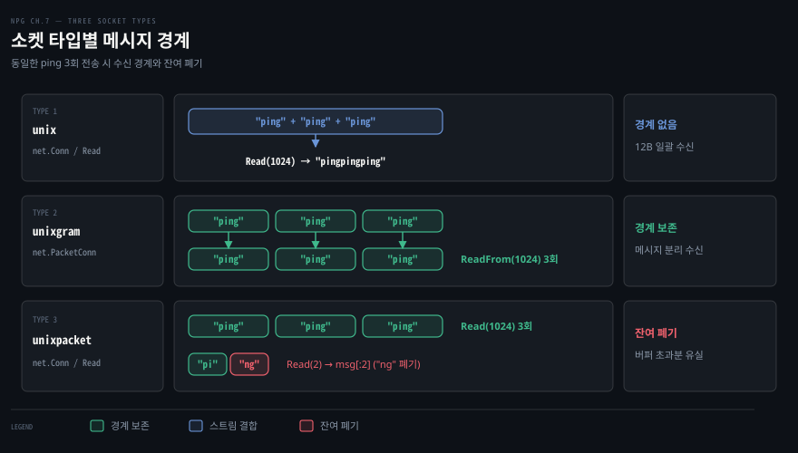
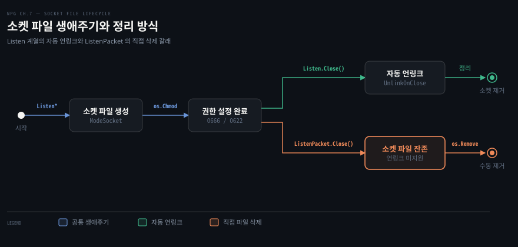
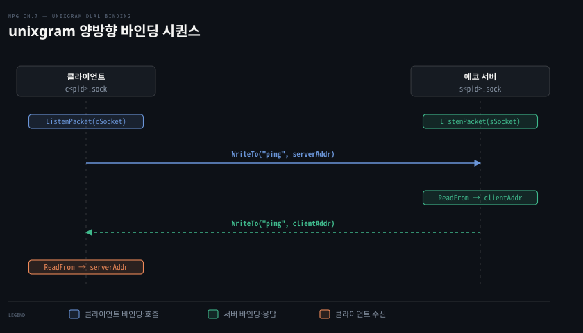

# Unix 도메인 소켓은 파일 경로로 묶이고 세 가지 타입이 경계를 다르게 다룬다

---

> Unix 도메인 소켓은 파일시스템 경로를 주소로 삼아 OS 네트워크 스택 오버헤드를 건너뛰며, `unix`·`unixgram`·`unixpacket` 세 타입에 따라 스트림 결합·데이터그램 보존·잔여 바이트 폐기로 메시지 경계를 다르게 다룹니다.

## 핵심 요약

> 이 편이 매달린 하나의 생각은, 단일 노드 내부 통신에서는 IP 주소와 포트 대신 파일 경로로 소켓을 바인딩하여 네트워크 스택 비용을 없애고 파일 권한으로 접근을 통제하되 전송 목적에 맞춰 세 가지 소켓 타입 중 하나를 선택해야 한다는 점입니다.

TCP 루프백(`127.0.0.1`) 통신은 운영체제의 패킷 체크섬 계산, 흐름 제어, 가상 라우팅 계층을 거치며 불필요한 연산 비용을 소모합니다. 반면 Unix 도메인 소켓(UDS)은 커널 메모리 버퍼를 통해 데이터를 즉시 교환하므로 지연 시간이 극히 짧고 단편화나 패킷 역전 현상이 일어나지 않습니다. 소켓 주소가 파일시스템 경로로 표현되므로 파일의 소유자(`os.Chown`)와 접근 권한(`os.Chmod`)을 이용해 인가되지 않은 프로세스의 접속을 운영체제 수준에서 차단할 수 있습니다.

Go 의 `net` 패키지는 UDS 통신을 위해 스트림 지향 `unix`, 데이터그램 지향 `unixgram`, 시퀀스 패킷 지향 `unixpacket` 세 가지 네트워크 타입을 지원합니다. 세 타입은 연결 수립 방식과 읽기 호출 시 메시지 경계를 다루는 규칙이 서로 다릅니다.




## 학습 목표

> 이 편을 읽고 나면 아래 다섯 가지를 스스로 해낼 수 있습니다.

1. TCP 루프백 소켓과 Unix 도메인 소켓의 동작 차이 및 성능·보안 트레이드오프를 설명할 수 있습니다.
2. `net.Listen` 계열과 `net.ListenPacket` 에서 소켓 파일 자동 삭제 여부(`UnlinkOnClose`)의 차이를 이해하고 정리 코드를 작성할 수 있습니다.
3. 스트림 지향 `unix` 네트워크 타입으로 에코 서버를 구현하고, 다중 쓰기 데이터가 단일 읽기 호출로 결합되는 현상을 확인할 수 있습니다.
4. `unixgram` 데이터그램 통신에서 클라이언트 소켓 파일 바인딩이 필수인 이유를 설명하고 양방향 주소 교환을 구현할 수 있습니다.
5. `unixpacket` 소켓의 연결 지향성 및 버퍼 크기 미달 시 커널이 잔여 바이트를 폐기하는 특성을 코드로 검증할 수 있습니다.


## 1. Unix 도메인 소켓은 같은 노드 안의 통신을 파일 경로로 묶는다

> 단일 호스트 내부 프로세스 통신(IPC)에서 Unix 도메인 소켓은 네트워크 라우팅 계층을 우회해 커널 메모리로 직통하며 파일 권한으로 접근을 보호합니다.

### TCP 루프백과 Unix 도메인 소켓의 차이

데이터베이스나 인메모리 캐시처럼 애플리케이션과 동일한 노드에서 실행되는 서비스와 통신할 때, 가장 흔히 쓰이는 방식은 `127.0.0.1` 같은 로컬 루프백 IP 주소와 포트 번호로 TCP 소켓을 여는 것입니다. 하지만 로컬 루프백 통신이라 하더라도 TCP 프로토콜 스택을 타면 핸드셰이크, 확인 응답(ACK), 시퀀스 번호 추적, 체크섬 검증, 윈도 크기 조절과 같은 전송 계층의 모든 오버헤드가 그대로 발생합니다.

Unix 도메인 소켓은 네트워크 프로토콜 스택을 완전히 건너뜁니다. 네트워크 소켓이 IP 주소와 포트 번호의 쌍으로 서비스를 식별하듯, Unix 도메인 소켓은 **파일시스템 경로**를 소켓 주소로 삼습니다. 마치 사내 대표 전화번호로 전화를 걸어 내선 번호로 각 직원을 연결하듯, 호스트의 파일시스템 안에 소켓 파일을 두고 해당 경로를 매개로 프로세스 간 통신(IPC, Inter-Process Communication)을 연결합니다.

커널 내부 구조와 소켓 인터페이스에 대한 일반적인 배경은 [networking-and-kubernetes 02-01 커널이 패킷을 주고받는 자리 — 소켓·인터페이스·veth·브리지](../../../08_cloud/book/networking-and-kubernetes/02-01.커널이%20패킷을%20주고받는%20자리%20—%20소켓·인터페이스·veth·브리지.md)를 참고할 수 있습니다.

### 성능과 보안의 트레이드오프

Unix 도메인 소켓을 채택할 때 얻는 기술적 이점은 명확합니다.

1. **프로토콜 스택 우회와 제로 라우팅**: 데이터가 네트워크 인터페이스 카드(NIC)나 소프트웨어 루프백 장치의 패킷 큐를 거치지 않고 커널 메모리 버퍼 복사만으로 상대 프로세스에 전달됩니다. IP 단편화나 패킷 순서 뒤바뀜 현상도 구조적으로 일어나지 않습니다.
2. **파일시스템 기반 접근 통제**: 로컬 호스트의 TCP 포트는 포트 스캐닝이나 임의 로컬 프로세스의 접속 시도에 취약합니다. 반면 Unix 도메인 소켓은 표준 파일시스템 권한(읽기/쓰기 비트)과 소유권(UID/GID)을 따릅니다. 특정 사용자 그룹에 속하지 않은 프로세스는 소켓 파일 자체를 열 수 없습니다.

반면 분명한 제약도 따릅니다. Unix 도메인 소켓은 태생적으로 **단일 노드 내부 통신 전용**입니다. 서비스 규모가 커져 데이터베이스나 캐시를 별도 원격 서버로 분리해야 하거나 여러 머신 간 분산 배치가 필요해지면, Unix 도메인 소켓 코드는 사용할 수 없고 TCP 네트워크 소켓으로 마이그레이션해야 합니다.


## 2. 소켓 파일의 생성·권한·정리

> 소켓 파일은 바인딩 시점에 생성되며, 리스너 종류에 따라 Go 런타임의 자동 삭제 지원 여부가 달라지므로 종료 시 수명 주기를 정확히 관리해야 합니다.



### 소켓 파일의 생성과 바인딩 충돌

코드에서 `net.Listen`, `net.ListenUnix`, 또는 `net.ListenPacket` 함수에 Unix 도메인 소켓 경로를 전달하여 호출하면, 파일시스템에 지정한 이름의 소켓 특수 파일이 생성됩니다. `ls -l` 명령으로 살펴보면 파일 타입 첫 글자가 `s`(`srwxr-xr-x`)로 표시되는 소켓 노드입니다.

만약 해당 경로에 파일이 이미 존재한다면 운영체제는 `bind: address already in use` 에러를 반환합니다. 따라서 바인딩 시도 전에 해당 파일이 실제로 살아 있는 다른 프로세스가 점유 중인 소켓인지 확인해야 합니다. 이전 프로세스가 비정상 종료되면서 남겨진 고아(stale) 소켓 파일이라면 해당 파일을 삭제(`os.Remove`)해야 바인딩이 성공합니다. 기존 소켓 파일을 닫지 않고 파일 디스크립터 수준에서 재사용하려는 특수한 경우에는 [net.FileListener 공식 문서](https://pkg.go.dev/net#FileListener)를 활용할 수 있습니다.

### 파일 소유권과 권한 제어

소켓 파일이 생성된 직후 프로세스는 Go 의 `os` 패키지 함수를 호출해 파일의 소유자와 권한을 변경할 수 있습니다.

```go
// 사용자 ID 는 유지(-1)하고 그룹 ID 만 100 으로 변경
err := os.Chown("/path/to/socket/file", -1, 100)
```

[os.Chown 공식 문서](https://pkg.go.dev/os#Chown)에 정의된 `os.Chown` 은 파일 경로, 소유자 UID, 그룹 GID 를 인수로 받습니다. `-1` 을 전달하면 현재 소유자나 그룹 설정을 그대로 유지합니다. 시스템 그룹명을 GID 로 변환하려면 [os/user 공식 문서](https://pkg.go.dev/os/user)의 `user.LookupGroup` 함수를 사용합니다.

소켓 파일의 접근 권한은 `os.Chmod` 함수로 설정합니다.

```go
// 소켓 파일 타입 비트(os.ModeSocket)와 8진수 권한(0660)을 비트 OR 로 결합
err := os.Chmod("/path/to/socket/file", os.ModeSocket|0660)
```

[os.FileMode 공식 문서](https://pkg.go.dev/os#FileMode)에 명시된 대로 소켓 파일에 권한을 부여할 때는 반드시 `os.ModeSocket` 비트 플래그를 8진수 권한 표기와 비트 OR(`|`) 연산으로 함께 전달해야 합니다. `0660` 은 소유자와 소속 그룹에 읽기 및 쓰기 권한을 허용하고 그 외 사용자의 접근을 완전히 차단합니다.

### 리스너별 소켓 파일 정리 규칙

소켓 파일이 닫힐 때 파일이 디스크에서 자동으로 삭제되는지는 어떤 API 로 리스너를 생성했는지에 따라 갈립니다.

1. **`net.Listen` 및 `net.ListenUnix`**: 스트림 리스너가 종료(`Close()`)될 때 Go 런타임이 파일시스템에서 해당 소켓 파일을 자동으로 제거(unlink)합니다. 이 동작은 [net.UnixListener.SetUnlinkOnClose 공식 문서](https://pkg.go.dev/net#UnixListener.SetUnlinkOnClose)의 `SetUnlinkOnClose(true)` 기본값 덕분입니다.
2. **`net.ListenPacket`**: 데이터그램 지향 소켓 인터페이스인 `net.PacketConn` 은 종료 시 소켓 파일을 자동으로 지워주지 않습니다. 애플리케이션 코드가 소켓을 닫은 뒤 `os.Remove(addr)` 를 명시적으로 호출해야 합니다. 수동 정리를 빠뜨리면 다음번 바인딩 시 `address already in use` 실패가 발생합니다.


## 3. 스트림 타입 unix 로 에코 서버를 짠다

> Go 의 net.Conn 추상화 덕분에 네트워크 문자열을 unix 로 교체하기만 하면 TCP 와 동일한 스트림 에코 서버를 구성할 수 있습니다.

### 스트림 에코 서버 구현

Go 표준 라이브러리의 `net.Conn` 과 `net.Listener` 인터페이스는 네트워크 구현 세부 사항을 감추도록 설계되어 있습니다. 네트워크 타입을 `"tcp"` 대신 `"unix"` 로 넘기고 주소를 IP:Port 대신 파일 경로로 건네면 동일한 서버 로직이 Unix 도메인 소켓 위에서 동작합니다.

```go
package echo

import (
	"context"
	"net"
)

func streamingEchoServer(ctx context.Context, network string, addr string) (net.Addr, error) {
	s, err := net.Listen(network, addr)
	if err != nil {
		return nil, err
	}

	go func() {
		go func() {
			<-ctx.Done()
			_ = s.Close()
		}()

		for {
			conn, err := s.Accept()
			if err != nil {
				return
			}

			go func() {
				defer func() { _ = conn.Close() }()
				for {
					buf := make([]byte, 1024)
					n, err := conn.Read(buf)
					if err != nil {
						return
					}
					_, err = conn.Write(buf[:n])
					if err != nil {
						return
					}
				}
			}()
		}
	}()

	return s.Addr(), nil
}
```

이 함수는 `network` 파라미터로 `"tcp"`, `"unix"`, `"unixpacket"` 같은 스트림 지원 타입을 모두 수용합니다. 컨텍스트가 취소되면 리스너가 닫히고, 앞서 다룬 대로 `net.Listen` 으로 연 소켓 파일은 리스너 종료 시 파일시스템에서 자동으로 지워집니다.

플랫폼 지원 측면에서 `unix` 스트림 네트워크 타입은 Linux, macOS, Windows(최신 Windows 10/Server 2019 이후) 모두에서 지원됩니다.

### 스트림 에코 클라이언트와 바이트 결합 검증

클라이언트가 `unix` 스트림 소켓으로 접속하여 세 번 연속 데이터를 보냈을 때 수신 버퍼에서 어떻게 읽히는지 테스트합니다. 파일 경로 생성에는 [os.MkdirTemp 공식 문서](https://pkg.go.dev/os#MkdirTemp)를 사용합니다.

```go
package echo

import (
	"bytes"
	"context"
	"fmt"
	"net"
	"os"
	"path/filepath"
	"testing"
)

func TestEchoServerUnix(t *testing.T) {
	dir, err := os.MkdirTemp("", "echo_unix")
	if err != nil {
		t.Fatal(err)
	}
	defer func() {
		if rErr := os.RemoveAll(dir); rErr != nil {
			t.Error(rErr)
		}
	}()

	ctx, cancel := context.WithCancel(context.Background())
	socket := filepath.Join(dir, fmt.Sprintf("%d.sock", os.Getpid()))
	rAddr, err := streamingEchoServer(ctx, "unix", socket)
	if err != nil {
		t.Fatal(err)
	}
	defer cancel()

	err = os.Chmod(socket, os.ModeSocket|0666)
	if err != nil {
		t.Fatal(err)
	}

	conn, err := net.Dial("unix", rAddr.String())
	if err != nil {
		t.Fatal(err)
	}
	defer func() { _ = conn.Close() }()

	msg := []byte("ping")
	for i := 0; i < 3; i++ {
		_, err = conn.Write(msg)
		if err != nil {
			t.Fatal(err)
		}
	}

	buf := make([]byte, 1024)
	n, err := conn.Read(buf)
	if err != nil {
		t.Fatal(err)
	}

	expected := bytes.Repeat(msg, 3)
	if !bytes.Equal(expected, buf[:n]) {
		t.Fatalf("expected reply %q; actual reply %q", expected, buf[:n])
	}
}
```

클라이언트는 `"ping"`(4바이트) 메시지를 세 번 나누어 `Write` 했습니다. 하지만 수신 측에서 1024바이트 버퍼로 단 한 번 `Read` 를 호출했을 때 수신된 바이트 열은 정확히 세 개가 합쳐진 `"pingpingping"`(12바이트)입니다.

스트림 소켓은 애플리케이션 계층의 메시지 경계를 보존하지 않습니다. 송신자가 세 번에 걸쳐 나누어 썼더라도 수신 버퍼에는 하나의 바이트 흐름으로 누적되므로, 어디서 메시지가 시작하고 끝나는지 구분하는 작업은 읽는 쪽의 책임입니다. 스트림 지향 소켓의 프레이밍 기법에 대한 상세한 논의는 [04-01 TCP 는 경계 없는 바이트 흐름이라 읽는 쪽이 메시지를 자른다](./04-01.TCP%20는%20경계%20없는%20바이트%20흐름이라%20읽는%20쪽이%20메시지를%20자른다.md)에서 다룹니다.


## 4. unixgram 은 데이터그램 경계를 지키고 양쪽 모두 소켓 파일이 필요하다

> unixgram 은 데이터그램 경계를 보존하며, 서버가 회신을 보내려면 클라이언트 역시 고유한 소켓 파일을 열고 바인딩해야 합니다.



### 데이터그램 에코 서버 구현

`unixgram` 은 UDP 처럼 연결 세션 없이 독립적인 데이터그램을 전송하는 네트워크 타입입니다. Go 에서는 `net.ListenPacket` 을 사용해 `net.PacketConn` 소켓을 생성합니다.

```go
package echo

import (
	"context"
	"net"
	"os"
)

func datagramEchoServer(ctx context.Context, network string, addr string) (net.Addr, error) {
	s, err := net.ListenPacket(network, addr)
	if err != nil {
		return nil, err
	}

	go func() {
		go func() {
			<-ctx.Done()
			_ = s.Close()
			if network == "unixgram" {
				_ = os.Remove(addr)
			}
		}()

		buf := make([]byte, 1024)
		for {
			n, clientAddr, err := s.ReadFrom(buf)
			if err != nil {
				return
			}
			_, err = s.WriteTo(buf[:n], clientAddr)
			if err != nil {
				return
			}
		}
	}()

	return s.LocalAddr(), nil
}
```

앞서 강조한 대로 `net.ListenPacket` 으로 연 소켓은 `s.Close()` 시 파일이 지워지지 않으므로 `network == "unixgram"` 일 때 `os.Remove(addr)` 를 직접 호출하여 파일시스템을 정리합니다.

### 플랫폼 제약과 빌드 제약

`unixgram` 은 모든 플랫폼에서 작동하지 않습니다. **Windows 및 WSL(Windows Subsystem for Linux)은 `unixgram` 도메인 소켓을 지원하지 않습니다.**

따라서 POSIX 호환 시스템인 macOS 와 Linux 에서만 컴파일되고 테스트되도록 Go 표준 빌드 제약을 선언해야 합니다. [Go 빌드 제약 공식 문서](https://pkg.go.dev/cmd/go#hdr-Build_constraints)에 따라 파일 최상단에 `//go:build` 지시문을 명시합니다.

```go
//go:build darwin || linux

package echo
```

### 클라이언트 소켓 파일 바인딩의 필수성

UDP 네트워크 소켓의 경우 클라이언트가 `net.Dial` 이나 익명 소켓으로 패킷을 전송하면 커널이 임의의 에페머럴 포트를 배정하여 발신지 정보를 패킷 헤더에 채워줍니다.

하지만 `unixgram` 도메인 소켓에서는 파일시스템 경로가 곧 주소입니다. 클라이언트가 자신만의 소켓 파일을 바인딩하지 않은 채 일방적으로 서버 파일로 패킷을 쏘면, 서버의 `ReadFrom` 은 클라이언트 주소(`clientAddr`)를 얻지 못하거나 회신할 수 있는 경로가 존재하지 않게 됩니다.

따라서 클라이언트 역시 `net.ListenPacket("unixgram", cSocket)` 을 호출하여 자신만의 소켓 파일을 반드시 생성해야 합니다. 또한 서버 프로세스가 응답을 기록할 수 있도록 클라이언트 소켓 파일의 쓰기 권한(`0622`)을 개방해 두어야 합니다.

```go
// 클라이언트 소켓 파일 준비 및 권한 부여
cSocket := filepath.Join(dir, fmt.Sprintf("c%d.sock", os.Getpid()))
client, err := net.ListenPacket("unixgram", cSocket)
if err != nil {
	t.Fatal(err)
}
defer func() { _ = client.Close() }()

err = os.Chmod(cSocket, os.ModeSocket|0622)
if err != nil {
	t.Fatal(err)
}
```

### 데이터그램 경계 보존 검증

서버와 클라이언트가 각자의 소켓 파일에 바인딩된 상태에서 데이터그램 전송 테스트를 진행합니다.

```go
// 3회 "ping" 전송
msg := []byte("ping")
for i := 0; i < 3; i++ {
	_, err = client.WriteTo(msg, serverAddr)
	if err != nil {
		t.Fatal(err)
	}
}

// 1024바이트 버퍼로 3회 수신
buf := make([]byte, 1024)
for i := 0; i < 3; i++ {
	n, addr, err := client.ReadFrom(buf)
	if err != nil {
		t.Fatal(err)
	}
	if addr.String() != serverAddr.String() {
		t.Fatalf("received reply from %q instead of %q", addr, serverAddr)
	}
	if !bytes.Equal(msg, buf[:n]) {
		t.Fatalf("expected reply %q; actual reply %q", msg, buf[:n])
	}
}
```

수신 버퍼 크기가 1024바이트로 충분히 크지만, `unix` 스트림 소켓처럼 12바이트로 합쳐지지 않습니다. 첫 번째 `ReadFrom` 호출은 정확히 첫 번째 `"ping"`(4바이트)만을 돌려주고 반환합니다. 송신자가 세 번 보냈다면 수신자도 반드시 세 번의 `ReadFrom` 을 호출해야 세 메시지를 온전히 읽을 수 있습니다.

이처럼 `unixgram` 은 데이터그램의 물리적 경계를 완벽하게 보존합니다. 데이터그램 경계의 특성에 대한 추가 개념은 [05-01 UDP 는 연결 없이 보내고, 소켓 하나가 누구에게서든 받는다](./05-01.UDP%20는%20연결%20없이%20보내고,%20소켓%20하나가%20누구에게서든%20받는다.md)를 참고할 수 있습니다.


## 5. unixpacket 은 연결형이면서 메시지 경계를 지킨다

> unixpacket 은 TCP 의 연결 지향성과 UDP 의 메시지 경계 보존을 결합한 하이브리드 타입이지만 버퍼 초과 데이터를 버리는 독특한 성질을 가집니다.

### 시퀀스 패킷 소켓의 정의와 플랫폼 한계

시퀀스 패킷 소켓(`unixpacket`)은 전송 계층의 두 가지 장점을 융합한 독특한 소켓 타입입니다.

- **연결 지향성**: 클라이언트는 `net.Dial` 을 호출하여 서버와 1:1 전용 세션을 맺습니다. `net.PacketConn` 대신 스트림과 동일한 `net.Conn` 인터페이스를 사용합니다.
- **메시지 경계 보존**: 세션 위에서 데이터를 주고받지만 바이트 스트림으로 뭉개지지 않고 패킷(데이터그램) 단위의 경계가 그대로 유지됩니다.

하지만 이 타입은 세 가지 Unix 도메인 소켓 중 이식성이 가장 떨어집니다. **Windows, WSL, macOS 모두 `unixpacket` 을 지원하지 않으며 오직 Linux 운영체제에서만 지원됩니다.** 따라서 테스트 파일명에 `_linux_test.go` 접미사를 두거나 `//go:build linux` 빌드 태그를 붙여 Linux 환경으로 대상을 한정해야 합니다.

### 버퍼 초과 바이트 폐기 동작

`unixpacket` 소켓의 가장 치명적인 동작 특성은 **수신자가 요청하지 않은 초과 데이터를 커널이 즉시 폐기(discard)한다는 점**입니다.

스트림 소켓(`tcp`, `unix`)에서는 4바이트짜리 메시지 `"ping"` 이 도착했을 때 2바이트 크기의 버퍼로 `Read` 를 호출하면 앞부분 `"pi"` 만 수신되고 나머지 `"ng"` 는 수신 버퍼에 남아 다음 `Read` 호출 때 정상적으로 반환됩니다. 하지만 `unixpacket` 은 데이터그램 단위로 동작하므로 한 번의 읽기 호출에서 버퍼에 담지 못한 남은 바이트를 그 자리에서 영구히 폐기합니다.

이를 입증하는 테스트 코드는 다음과 같습니다.

```go
//go:build linux

package echo

import (
	"bytes"
	"context"
	"fmt"
	"net"
	"os"
	"path/filepath"
	"testing"
)

func TestEchoServerUnixPacket(t *testing.T) {
	dir, err := os.MkdirTemp("", "echo_unixpacket")
	if err != nil {
		t.Fatal(err)
	}
	defer func() {
		if rErr := os.RemoveAll(dir); rErr != nil {
			t.Error(rErr)
		}
	}()

	ctx, cancel := context.WithCancel(context.Background())
	socket := filepath.Join(dir, fmt.Sprintf("%d.sock", os.Getpid()))
	rAddr, err := streamingEchoServer(ctx, "unixpacket", socket)
	if err != nil {
		t.Fatal(err)
	}
	defer cancel()

	err = os.Chmod(socket, os.ModeSocket|0666)
	if err != nil {
		t.Fatal(err)
	}

	conn, err := net.Dial("unixpacket", rAddr.String())
	if err != nil {
		t.Fatal(err)
	}
	defer func() { _ = conn.Close() }()

	msg := []byte("ping")
	for i := 0; i < 3; i++ {
		_, err = conn.Write(msg)
		if err != nil {
			t.Fatal(err)
		}
	}

	// 1024바이트 버퍼: 3회 Read 로 4바이트 ping 메시지가 3번 각각 읽힙니다
	buf := make([]byte, 1024)
	for i := 0; i < 3; i++ {
		n, err := conn.Read(buf)
		if err != nil {
			t.Fatal(err)
		}
		if !bytes.Equal(msg, buf[:n]) {
			t.Errorf("expected reply %q; actual reply %q", msg, buf[:n])
		}
	}

	// 다시 3회 "ping" 전송
	for i := 0; i < 3; i++ {
		_, err = conn.Write(msg)
		if err != nil {
			t.Fatal(err)
		}
	}

	// 2바이트 버퍼로 읽기: 첫 2바이트 "pi" 만 읽히고 나머지 "ng" 는 폐기됩니다
	buf = make([]byte, 2)
	for i := 0; i < 3; i++ {
		n, err := conn.Read(buf)
		if err != nil {
			t.Fatal(err)
		}
		if !bytes.Equal(msg[:2], buf[:n]) {
			t.Errorf("expected reply %q; actual reply %q", msg[:2], buf[:n])
		}
	}
}
```

만약 스트림 소켓이었다면 두 번째 3회 반복 읽기에서 첫 번째 호출에 `"pi"`, 두 번째 호출에 `"ng"`, 세 번째 호출에 다시 `"pi"` 가 반환되었을 것입니다. 그러나 `unixpacket` 에서는 세 번의 `Read` 호출 모두에서 정확히 `"pi"` 만 수신됩니다. 각 데이터그램의 뒷부분 `"ng"` 가 첫 번째 읽기 직후 커널에 의해 통째로 버려졌기 때문입니다.

이러한 제한과 플랫폼 비호환성 때문에 현대 애플리케이션에서는 `unixpacket` 대신 `unix`(스트림)나 `unixgram`(데이터그램)을 주로 선택합니다.

Linux Unix 도메인 소켓 환경에서 피어 프로세스의 자격 증명을 커널로부터 조회해 특정 사용자나 그룹에 속한 프로세스만 접속을 허용하는 실전 서비스 구현은 [07-02 피어 자격 증명으로 접속한 프로세스를 인증하는 서비스](./07-02.피어%20자격%20증명으로%20접속한%20프로세스를%20인증하는%20서비스.md)에서 이어 다룹니다.


## 결정 치트시트

> 통신 범위와 전송 특성에 따른 도메인 소켓 및 프로토콜 선택 기준입니다.

| 통신 유형 | 프로토콜 타입 | 통신 모델 | 메시지 경계 | 파일 자동 언링크 | 플랫폼 지원 |
|---|---|---|---|---|---|
| 호스트 내부 고성능 스트림 통신 (DB, 캐시) | `unix` | 연결 지향 (`net.Conn`, `Listen`) | 미보존 (바이트 스트림 결합) | 지원 (`UnlinkOnClose: true`) | Linux, macOS, Windows |
| 호스트 내부 단발성 메시지/로그 수신 (syslog 등) | `unixgram` | 비연결형 (`net.PacketConn`) | 보존 (데이터그램 단위) | 미지원 (`os.Remove` 직접 호출) | Linux, macOS (Windows 미지원) |
| 연결 세션 기반 순차 패킷 교환 (특수 레거시) | `unixpacket` | 연결 지향 (`net.Conn`, `Listen`) | 보존 (버퍼 초과분 커널 폐기) | 지원 (`UnlinkOnClose: true`) | Linux 전용 (macOS, Windows 미지원) |
| 서로 다른 노드 간 원격 네트워크 통신 | `tcp` | 연결 지향 (`net.Conn`, `Listen`) | 미보존 (프레이밍 필요) | 해당 없음 (포트 바인딩) | 전체 플랫폼 지원 |


## 면접 대비

> 아래 질문에 답하면서 Unix 도메인 소켓의 커널 수준 동작과 타입별 특성을 정리해 보세요.

1. 동일 머신 내부에서 TCP 루프백(`127.0.0.1`) 대신 Unix 도메인 소켓을 사용하는 것이 성능과 보안 관점에서 왜 더 유리한가요?
2. Go 의 `net.Listen("unix", path)` 리스너와 `net.ListenPacket("unixgram", path)` 소켓이 종료될 때 소켓 파일 정리 과정의 차이점은 무엇인가요?
3. `unixgram` 도메인 소켓을 사용할 때 왜 클라이언트 프로세스 역시 파일시스템에 소켓 파일을 생성하고 바인딩해야 하나요?
4. `unixpacket` 소켓에서 버퍼 크기보다 큰 메시지를 `Read` 로 수신했을 때 일반 스트림(`unix`) 소켓과 동작이 어떻게 달라지나요?


## 정답 (자답 후 펼치기)

> 위 §면접 대비의 질문에 먼저 스스로 답한 뒤 읽으세요.

### 정답 1 — 프로토콜 스택 우회와 파일 권한 제어

TCP 루프백 통신은 로컬 네트워크 인터페이스를 거치면서 패킷 분할, 시퀀스 번호 관리, 확인 응답 ACK 교환, 체크섬 계산, 윈도 버퍼 관리 등 전송 계층의 모든 연산 비용을 지불해야 합니다. 반면 Unix 도메인 소켓은 운영체제의 네트워크 스택을 완전히 우회하여 커널 메모리 버퍼 복사만으로 데이터를 주고받으므로 CPU 소모와 왕복 지연 시간이 대폭 줄어듭니다.

보안 측면에서도 네트워크 포트는 로컬의 모든 프로세스가 스캐닝하고 연결을 시도할 수 있습니다. 반면 Unix 도메인 소켓은 파일시스템의 소유자(UID/GID) 및 권한 비트(`chmod`)를 통해 특정 권한을 가진 프로세스만 소켓을 열 수 있도록 접근을 엄격히 통제할 수 있습니다.

### 정답 2 — UnlinkOnClose 자동 삭제와 수동 삭제 책임

`net.Listen` 또는 `net.ListenUnix` 로 생성된 스트림 리스너는 내부적으로 `UnixListener` 타입을 사용하며 기본적으로 `SetUnlinkOnClose(true)` 가 활성화되어 있습니다. 따라서 리스너의 `Close()` 메서드가 호출되면 Go 런타임이 파일시스템에서 해당 소켓 파일을 자동으로 언링크하여 제거합니다.

반면 `net.ListenPacket` 으로 생성된 `net.PacketConn` 소켓은 `Close()` 를 호출하더라도 소켓 파일이 디스크에 그대로 남습니다. 따라서 애플리케이션 코드가 소켓을 닫은 뒤 반드시 `os.Remove(addr)` 를 명시적으로 호출해 주어야 다음번 실행 시 `address already in use` 충돌을 방지할 수 있습니다.

### 정답 3 — 회신 주소 매핑을 위한 파일 경로 필요성

UDP 네트워크 소켓의 경우 송신자가 별도로 바인딩하지 않아도 운영체제 커널이 임의의 에페머럴 포트를 배정하여 발신지 IP 및 포트 정보를 패킷 헤더에 넣어줍니다.

하지만 Unix 도메인 소켓 통신에서는 IP 와 포트가 존재하지 않으며 오직 파일시스템 경로만이 소켓 주소로 동작합니다. 따라서 클라이언트가 고유 소켓 파일에 바인딩하지 않으면 서버가 `ReadFrom` 호출을 통해 클라이언트의 회신 주소를 식별할 수 없습니다. 서버가 에코 응답을 돌려보내려면 클라이언트가 생성한 소켓 파일 경로로 `WriteTo` 를 수행해야 하므로, 클라이언트 역시 자신의 소켓 파일을 바인딩하고 서버가 쓸 수 있는 권한을 열어두어야 합니다.

### 정답 4 — 버퍼 초과 미요청 데이터의 커널 즉시 폐기

`unix` 스트림 소켓에서는 4바이트 메시지 `"ping"` 을 수신할 때 2바이트 버퍼로 `Read` 를 호출하면 앞의 `"pi"` 만 수신되고 남은 `"ng"` 는 수신 버퍼 큐에 유지되어 후속 `Read` 호출 시 이어서 읽힙니다.

반면 `unixpacket` 소켓은 패킷(데이터그램) 경계를 강제하므로, 2바이트 버퍼로 읽기를 수행하면 첫 2바이트 `"pi"` 만 반환되고 해당 데이터그램의 나머지 2바이트 `"ng"` 는 커널에 의해 그 자리에서 영구히 폐기됩니다. 따라서 다음번 `Read` 를 호출하면 이전 메시지의 잔여 데이터가 아니라 그 뒤에 도착한 새로운 패킷 데이터가 읽히게 됩니다.


## 참고 자료

- 《Network Programming with Go》 Adam Woodbeck, 2021. ISBN 978-1-7185-0088-4.
  Ch.7 Unix Domain Sockets — What Are Unix Domain Sockets? ~ The unixpacket Sequence Packet Socket (p.137–152, Listing 7-1~7-12).
- [Go 표준 net 패키지 문서](https://pkg.go.dev/net): `Listen`, `Dial`, `ListenPacket`, `UnixListener`, `PacketConn` 인터페이스 명세.
- [Go 표준 os 패키지 문서](https://pkg.go.dev/os): `Chmod`, `Chown`, `FileMode`, `MkdirTemp`, `Remove` 함수 명세.
- [Go 빌드 제약 지시문 명세](https://pkg.go.dev/cmd/go#hdr-Build_constraints): `//go:build` 표준 문법 가이드.


## 관련 문서

- [07-02 피어 자격 증명으로 접속한 프로세스를 인증하는 서비스](./07-02.피어%20자격%20증명으로%20접속한%20프로세스를%20인증하는%20서비스.md): Linux 환경에서 UDS 소켓의 SO_PEERCRED 자격 증명을 조회해 클라이언트 그룹 기반 인가를 구현합니다.
- [04-01 TCP 는 경계 없는 바이트 흐름이라 읽는 쪽이 메시지를 자른다](./04-01.TCP%20는%20경계%20없는%20바이트%20흐름이라%20읽는%20쪽이%20메시지를%20자른다.md): 스트림 지향 통신에서 메시지 경계를 분리하기 위한 세 가지 프레이밍 기법을 다룹니다.
- [05-01 UDP 는 연결 없이 보내고, 소켓 하나가 누구에게서든 받는다](./05-01.UDP%20는%20연결%20없이%20보내고,%20소켓%20하나가%20누구에게서든%20받는다.md): 데이터그램 지향 소켓의 패킷 경계 보존과 무연결성 모델을 비교합니다.
- [networking-and-kubernetes 02-01 커널이 패킷을 주고받는 자리 — 소켓·인터페이스·veth·브리지](../../../08_cloud/book/networking-and-kubernetes/02-01.커널이%20패킷을%20주고받는%20자리%20—%20소켓·인터페이스·veth·브리지.md): 운영체제 커널 내부의 소켓 버퍼 구조와 통신 경로를 학습합니다.
- [이 책의 정독 인덱스](./README.md): 전체 챕터 구성과 학습 진행 상황.
