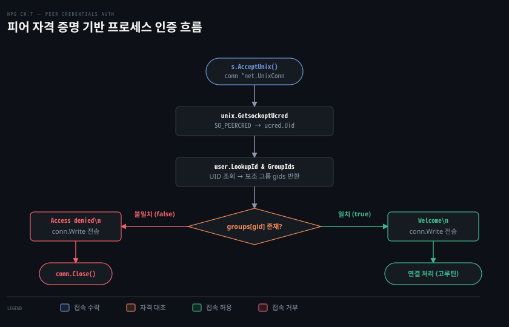

# 피어 자격 증명으로 접속한 프로세스를 인증하는 서비스

---

> 7장 뒷부분은 Unix 도메인 소켓에서 운영체제 커널이 보증하는 피어 자격 증명(SO_PEERCRED)을 조회하여 접속한 프로세스의 신원을 검증하고 권한을 판정하는 인증 서비스를 구축합니다. 파일 시스템 권한을 넘어 프로세스 실행 사용자의 보조 그룹까지 식별해 무단 접근을 차단하는 기법을 다룹니다.


## 핵심 요약

> 이 편이 매달린 하나의 생각은, Unix 도메인 소켓 통신에서 커널이 직접 보증하는 피어 자격 증명을 조회하면 클라이언트가 위조할 수 없는 프로세스 신원 기반의 강력한 접근 제어를 구현할 수 있다는 사실입니다.

네트워크 소켓과 달리 Unix 도메인 소켓은 동일한 호스트의 단일 커널 안에서 실행되므로, 커널이 상대 프로세스의 PID, UID, GID 정보를 직접 추적하고 보증합니다. Go 표준 라이브러리의 `net.Conn` 인터페이스는 플랫폼 중립적 추상화이므로 저수준 소켓 옵션을 다루지 못합니다. 따라서 구체 타입인 `*net.UnixConn` 의 `File()` 메서드로 파일 디스크립터를 얻은 뒤 `golang.org/x/sys/unix` 패키지의 `GetsockoptUcred` 시스템 호출을 실행해야 합니다.

서비스는 실행 시 인가할 그룹 이름을 명령줄 인자로 받아 [`os/user.LookupGroup`](https://pkg.go.dev/os/user#LookupGroup) 으로 숫자 GID 집합(`map[string]struct{}`)을 미리 구축합니다. 접속이 수락될 때마다 커널로부터 얻은 UID 로 사용자의 모든 보조 그룹 목록을 조회하고 허용 목록과 대조하여 인가된 프로세스에는 환영 메시지를 보내며 미인가 프로세스는 통보 후 즉시 연결을 종료합니다.


## 학습 목표

> 이 편을 읽고 나면 아래 다섯 가지를 스스로 해낼 수 있습니다.

1. 피어 자격 증명(SO_PEERCRED)이 네트워크 소켓과 달리 위조 불가능한 이유와 플랫폼별 제약을 설명할 수 있습니다.
2. `net.Conn` 대신 `*net.UnixConn` 과 `File()` 메서드를 사용해 파일 디스크립터를 추출하는 이유를 밝힐 수 있습니다.
3. `user.LookupGroup` 과 `map[string]struct{}` 를 활용해 그룹 이름 기반의 인가 목록을 구성할 수 있습니다.
4. 접속한 피어의 UID 로부터 보조 그룹 목록을 조회해 다중 그룹 멤버십을 검증하는 인증 로직을 구현할 수 있습니다.
5. 인터럽트 시그널 수신 시 리스너를 닫아 파일 시스템의 소켓 파일을 안전하게 회수하는 절차를 설명할 수 있습니다.


## 1. 커널이 접속한 프로세스의 신원을 알려 준다

> 원격 네트워크 소켓은 상대방의 OS 사용자나 프로세스 신원을 검증할 수 없지만, 동일 커널에서 동작하는 Unix 도메인 소켓은 커널이 상대방 프로세스의 자격 증명을 직접 보증합니다.

### 네트워크 소켓의 신원 확인 한계와 피어 자격 증명

TCP 나 UDP 기반의 네트워크 통신에서는 IP 주소와 포트 번호만 패킷 헤더에 실려 전달됩니다. 패킷을 보낸 원격 호스트 내부에서 어떤 사용자가 어떤 프로세스 ID 로 소켓을 열었는지는 네트워크 프로토콜 계층에서 전혀 알 수 없습니다. 따라서 원격 클라이언트를 식별하려면 토큰, 패스워드, 상호 TLS(mTLS) 인증서 같은 애플리케이션 수준의 인증 메커니즘을 별도로 구축해야 합니다.

반면 [Unix 도메인 소켓](./07-01.Unix%20도메인%20소켓은%20파일%20경로로%20묶이고%20세%20가지%20타입이%20경계를%20다르게%20다룬다.md)은 동일한 머신 내부의 프로세스끼리 통신합니다. 두 프로세스 모두 하나의 운영체제 커널 통제 아래에 놓여 있으므로, [커널 소켓 버퍼](../../../08_cloud/book/networking-and-kubernetes/02-01.커널이%20패킷을%20주고받는%20자리%20—%20소켓·인터페이스·veth·브리지.md)를 거쳐 데이터를 주고받을 때 커널은 연결 양 끝단 프로세스의 소유자와 프로세스 ID 를 명확히 알고 있습니다.

이렇게 커널이 보관하는 상대 프로세스의 신원 정보를 **피어 자격 증명(Peer Credentials)** 이라고 부릅니다. 클라이언트가 자발적으로 보낸 값이 아니라 커널이 연결 수립 시점에 직접 채워 넣은 값이므로, 클라이언트 프로세스가 자신의 UID 나 PID 를 속이거나 위조할 수 없습니다.

### 플랫폼별 제약 사항

피어 자격 증명을 다루는 시스템 호출 인터페이스는 운영체제마다 다릅니다.

* **Linux**: 소켓 레벨 옵션인 [`SO_PEERCRED`](https://man7.org/linux/man-pages/man7/unix.7.html) 를 지원합니다. 시스템 호출 결과로 프로세스 ID(`Pid`), 사용자 ID(`Uid`), 기본 그룹 ID(`Gid`)를 담은 `ucred` 구조체를 돌려줍니다.
* **macOS (Darwin) 및 BSD**: `SO_PEERCRED` 대신 `LOCAL_PEERCRED` 소켓 옵션을 사용하며 반환 구조체 역시 `xucred` 로 다릅니다.
* **Windows**: Unix 도메인 소켓(`AF_UNIX`) 주소 체계는 지원하지만 피어 자격 증명을 조회하는 표준 소켓 옵션은 지원하지 않습니다.

따라서 Linux 전용 시스템 호출인 `unix.GetsockoptUcred` 를 사용할 때는 Go 파일 상단에 빌드 제약 지시자 [`//go:build linux`](https://pkg.go.dev/cmd/go#hdr-Build_constraints) 를 명시하거나 파일명을 `allowed_linux.go` 처럼 OS 접미사로 분리해야 합니다.

### net.Conn 대신 *net.UnixConn 과 File() 이 필요한 이유

Go 의 `net.Conn` 인터페이스는 플랫폼 독립적인 최소 입출력 계약만을 정의합니다. 운영체제 고유의 소켓 옵션을 제어하는 메서드는 `net.Conn` 에 포함되어 있지 않습니다. 따라서 피어 자격 증명을 추출하려면 리스너에서 구체 타입인 `*net.UnixConn` 포인터를 받아야 합니다.

운영체제 커널의 소켓 옵션 조회 함수를 부르려면 기본 파일 디스크립터(fd) 번호가 필요합니다. `conn.File()` 메서드를 호출하면 소켓과 연결된 [`*os.File`](https://pkg.go.dev/net#UnixConn.File) 객체를 얻을 수 있고 `int(file.Fd())` 로 파일 디스크립터 정수값을 꺼냅니다.

여기서 주의할 점이 있습니다. `conn.File()` 은 내부적으로 `dup` 시스템 호출을 사용하여 기존 소켓 디스크립터를 복제한 새로운 파일 객체를 반환합니다. 복제된 파일 디스크립터는 자동으로 닫히지 않으므로, 사용이 끝난 직후 `defer func() { _ = file.Close() }()` 로 명시적으로 닫지 않으면 파일 디스크립터 누수가 발생합니다.

### 자격 증명 조회와 보조 그룹 검증 함수

아래 코드는 클라이언트의 Unix 도메인 소켓 연결을 받아 커널로부터 피어 자격 증명을 조회하고 허용 그룹에 속하는지 판별하는 함수입니다.

```go
//go:build linux

package auth

import (
	"log"
	"net"
	"os/user"
	"strconv"

	"golang.org/x/sys/unix"
)

func Allowed(conn *net.UnixConn, groups map[string]struct{}) bool {
	if conn == nil || groups == nil || len(groups) == 0 {
		return false
	}

	file, err := conn.File() // (1) underlying *os.File 복제 획득
	if err != nil {
		log.Println(err)
		return false
	}
	defer func() { _ = file.Close() }() // (2) 복제된 파일 디스크립터 누수 방지

	var ucred *unix.Ucred

	for {
		// (3) Linux 커널에 SO_PEERCRED 소켓 옵션 질의
		ucred, err = unix.GetsockoptUcred(int(file.Fd()), unix.SOL_SOCKET, unix.SO_PEERCRED)
		if err == unix.EINTR {
			continue // 시스템 호출이 시그널에 의해 인터럽트되면 재시도
		}
		if err != nil {
			log.Println(err)
			return false
		}
		break
	}

	// (4) UID 숫자를 10진수 문자열로 변환하여 사용자 정보 조회
	u, err := user.LookupId(strconv.Itoa(int(ucred.Uid)))
	if err != nil {
		log.Println(err)
		return false
	}

	// (5) 사용자가 속한 모든 보조 그룹 ID 목록 조회
	gids, err := u.GroupIds()
	if err != nil {
		log.Println(err)
		return false
	}

	// (6) 허용 그룹 맵과 대조
	for _, gid := range gids {
		if _, ok := groups[gid]; ok {
			return true
		}
	}

	return false
}
```

시스템 호출 [`unix.GetsockoptUcred`](https://pkg.go.dev/golang.org/x/sys/unix#GetsockoptUcred) 는 소켓 레벨 상수 `unix.SOL_SOCKET` 과 옵션 이름 `unix.SO_PEERCRED` 를 받습니다. 만약 호출 도중 OS 시그널이 전달되어 `unix.EINTR` 오류가 발생하면 루프를 통해 안전하게 재시도합니다.

반환된 `ucred.Uid` 는 `uint32` 타입입니다. Go 표준 라이브러리의 [`os/user.LookupId`](https://pkg.go.dev/os/user#LookupId) 함수는 문자열 형태의 UID 를 요구하므로 `strconv.Itoa(int(ucred.Uid))` 로 10진수 문자열로 변환하여 넘깁니다.

조회된 `*user.User` 객체에서 `u.GroupIds()` 를 호출하면 해당 사용자가 속한 기본 그룹뿐만 아니라 보조 그룹들의 GID 목록(`[]string`)을 모두 얻을 수 있습니다. 사용자의 그룹 중 하나라도 허용 목록에 포함되어 있으면 `true` 를 반환하여 인증을 통과시킵니다.


## 2. 그룹 이름을 그룹 ID 로 바꿔 허용 목록을 만든다

> 관리자가 읽고 지정하기 편한 텍스트 그룹 이름을 시스템 데이터베이스에서 조회하여 빠른 멤버십 판정이 가능한 숫자 GID 집합으로 변환합니다.

### 그룹 이름과 그룹 ID 의 대응 관계

Linux 시스템 관리자는 통상 `users`, `staff`, `admin` 같은 사람이 읽기 쉬운 문자열 그룹 이름을 사용합니다. 그러나 커널 내부와 프로세스 자격 증명 체계에서는 모든 권한을 정수 형태의 그룹 ID(GID)로 식별합니다.

이 둘 사이의 매핑 정보는 전통적으로 `/etc/group` 파일이나 NSS(Name Service Switch)를 통한 중앙 디렉터리 서비스에 저장됩니다. 서비스 시작 시 명령줄 인자로 전달받은 문자열 그룹 이름을 미리 숫자 GID 로 변환해 두면 접속마다 불필요한 시스템 조회 비용을 치르지 않고 효율적으로 대조할 수 있습니다.

### LookupGroup 과 map[string]struct{} 집합 자료구조

Go 표준 라이브러리의 [`os/user.LookupGroup`](https://pkg.go.dev/os/user#LookupGroup) 함수는 그룹 이름을 인자로 받아 시스템 데이터베이스를 조회하고 `*user.Group` 객체를 반환합니다. 이 객체의 `Gid` 필드에 해당 그룹의 숫자 ID 문자열이 담겨 있습니다.

조회한 GID 들은 인가 목록으로 관리해야 합니다. Go 에서는 별도의 Set 자료형을 기본 제공하지 않으므로, 맵의 값(value) 타입을 빈 구조체 `struct{}` 로 지정한 `map[string]struct{}` 패턴을 사용합니다. `struct{}` 는 메모리를 0바이트 소비하므로 불필요한 메모리 할당 없이 $O(1)$ 시간 복잡도로 키 존재 여부를 검사할 수 있습니다.

### 플래그 안내와 그룹 이름 파싱 구현

아래 코드는 서비스 실행 시 명령줄 인자를 파싱하고 사용법을 안내하는 `init()` 함수와 그룹 이름 목록을 GID 집합으로 변환하는 `parseGroupNames` 함수입니다.

```go
package main

import (
	"flag"
	"fmt"
	"log"
	"net"
	"os"
	"os/signal"
	"os/user"
	"path/filepath"

	"github.com/awoodbeck/gnp/ch07/creds/auth"
)

func init() {
	// (1) 사용자가 올바른 인자를 전달하지 않았을 때 출력할 사용법 정의
	flag.Usage = func() {
		_, _ = fmt.Fprintf(flag.CommandLine.Output(),
			"Usage:\n\t%s <group names>\n", filepath.Base(os.Args[0]))
		flag.PrintDefaults()
	}
}

// (2) 그룹 이름 슬라이스를 받아 GID 를 키로 갖는 맵으로 변환
func parseGroupNames(args []string) map[string]struct{} {
	groups := make(map[string]struct{})
	for _, arg := range args {
		grp, err := user.LookupGroup(arg)
		if err != nil {
			log.Println(err) // 존재하지 않는 그룹 이름은 로깅 후 건너뜀
			continue
		}
		groups[grp.Gid] = struct{}{} // GID 를 집합 맵에 등록
	}
	return groups
}
```

`parseGroupNames` 함수는 전달된 각 인자마다 `user.LookupGroup` 을 호출합니다. 만약 시스템에 등록되지 않은 그룹 이름이 들어오면 에러를 출력하고 해당 항목을 건너뜁니다. 유효한 그룹이면 `grp.Gid` 를 추출하여 `groups` 맵에 키로 등록하고 완성된 맵을 반환합니다.


## 3. 접속마다 자격 증명을 보고 허용하거나 끊는다

> 소켓 리스너에서 새 연결을 받아 피어 자격 증명을 대조하고 허용 여부에 따라 맞춤형 응답을 전송한 뒤 미인가 연결을 단호하게 차단합니다.



### 서비스 메인 함수와 소켓 생애주기 관리

Unix 도메인 소켓 서비스는 파일 시스템에 실제 소켓 파일 노드를 생성합니다. 만약 서비스 프로세스가 비정상 종료되거나 Ctrl+C 같은 인터럽트 시그널을 받고 소켓 파일을 지우지 못한 채 죽으면, 다음번 실행 시 `bind: address already in use` 오류가 발생합니다.

따라서 서비스는 `os.Interrupt` 시그널을 비동기 채널로 등록하고 전용 고루틴에서 감청해야 합니다. 시그널이 도착했을 때 리스너 객체의 `s.Close()` 를 명시적으로 호출해야 Go 런타임이 파일 시스템에 남아 있는 소켓 파일을 안전하게 삭제(unlink)합니다.

### 접속 수락 및 인증 분기 구현

아래 코드는 리스너를 열고 들어오는 클라이언트 접속마다 피어 자격 증명을 검증하는 메인 서버 루프입니다.

```go
func main() {
	flag.Parse()

	// (1) 명령줄 인자로 전달된 그룹 이름들을 GID 집합으로 변환
	groups := parseGroupNames(flag.Args())
	socket := filepath.Join(os.TempDir(), "creds.sock")
	addr, err := net.ResolveUnixAddr("unix", socket)
	if err != nil {
		log.Fatal(err)
	}

	// (2) Unix 도메인 소켓 리스너 개설
	s, err := net.ListenUnix("unix", addr)
	if err != nil {
		log.Fatal(err)
	}

	// (3) 인터럽트 시그널(Ctrl+C) 감청 채널 준비
	c := make(chan os.Signal, 1)
	signal.Notify(c, os.Interrupt)

	// (4) 시그널 수신 시 리스너를 닫아 소켓 파일을 정상 정리하는 고루틴
	go func() {
		<-c
		_ = s.Close()
	}()

	fmt.Printf("Listening on %s ...\n", socket)

	for {
		// (5) net.Conn 대신 *net.UnixConn 을 얻기 위해 AcceptUnix 호출
		conn, err := s.AcceptUnix()
		if err != nil {
			break
		}

		// (6) 피어 자격 증명 기반 인가 검증
		if auth.Allowed(conn, groups) {
			_, err = conn.Write([]byte("Welcome\n"))
			if err == nil {
				// 인증 성공 시 독립 고루틴을 띄워 연결을 처리하고 루프 유지
				continue
			}
		} else {
			// 미인가 클라이언트에게 거부 메시지 전송
			_, err = conn.Write([]byte("Access denied\n"))
		}

		if err != nil {
			log.Println(err)
		}
		_ = conn.Close() // (7) 미인가 클라이언트 또는 전송 실패 연결 종료
	}
}
```

메인 루프는 일반적인 `Accept()` 대신 `s.AcceptUnix()` 를 호출하여 구체 타입 `*net.UnixConn` 을 얻습니다. 그 후 앞서 작성한 `auth.Allowed(conn, groups)` 함수를 호출하여 접속한 프로세스의 자격 증명을 검증합니다.

인가된 클라이언트에게는 `"Welcome\n"` 메시지를 전송합니다. 실제 서비스라면 여기서 독립 고루틴을 띄워 비즈니스 로직을 수행하도록 연결을 넘기고 `continue` 문을 통해 소켓 닫기를 건너뜁니다. 반대로 허용 목록에 없는 클라이언트에게는 `"Access denied\n"` 메시지를 보낸 뒤 즉시 `conn.Close()` 를 호출하여 연결을 단호하게 끊어 버립니다.


## 4. netcat 으로 서비스를 시험한다

> 범용 네트워킹 유틸리티 netcat 을 사용하여 Unix 도메인 소켓에 접속하고 프로세스 실행 그룹을 전환하며 정상 접속과 접근 거부 동작을 직접 관측합니다.

### netcat 도구 준비와 소켓 접속 플래그

[TCP 바이트 스트림](./04-01.TCP%20는%20경계%20없는%20바이트%20흐름이라%20읽는%20쪽이%20메시지를%20자른다.md)이나 [UDP 데이터그램](./05-01.UDP%20는%20연결%20없이%20보내고,%20소켓%20하나가%20누구에게서든%20받는다.md)을 테스트할 때 널리 쓰이는 `netcat`(`nc`)은 Unix 도메인 소켓 연결도 기본 지원합니다. Linux 배포판에 따라 패키지 관리자로 쉽게 설치할 수 있습니다.

* Debian 및 Ubuntu: `sudo apt install netcat-openbsd`
* CentOS 및 RHEL: `sudo dnf install nmap-ncat`

설치가 완료되면 `nc` 명령에 `-U` 플래그를 넘겨 Unix 도메인 소켓 파일 경로로 접속할 수 있습니다.

### 서비스 기동과 허용 그룹 등록

먼저 서비스 바이너리를 빌드하거나 `go run` 으로 실행하면서 허용할 그룹 이름을 인자로 넘깁니다.

```bash
go run . -- users staff
```

명령을 실행하면 `Listening on /tmp/creds.sock ...` 로그가 출력되며 서버가 대기 상태에 들어갑니다. 이 예제에서는 `users` 또는 `staff` 그룹에 속한 사용자 프로세스만 연결을 허용하도록 설정했습니다. 만약 해당 환경에 이 그룹들이 없다면 시스템의 `/etc/group` 에 등록된 임의의 유효한 그룹 이름을 지정할 수 있습니다. 리스너는 `/tmp/creds.sock` 파일에 정상적으로 바인딩되어 연결을 대기합니다.

### sudo -g 를 이용한 그룹 전환과 인증 검증

현재 사용자가 실행한 셸에서 그대로 접속하면 자신의 기본 그룹으로 접속하게 됩니다. 서비스를 테스트하기 위해 서로 다른 그룹 권한을 시뮬레이션할 때는 `sudo` 명령의 `-g` 플래그를 활용합니다. `-g` 플래그는 프로세스를 실행할 때 명시적으로 특정 보조 그룹 ID 를 부여합니다.

먼저 허용 목록에 등록된 `staff` 그룹으로 접속을 시도합니다.

```bash
sudo -g staff -- nc -U /tmp/creds.sock
```

`staff` 그룹으로 접속했을 때 커널은 이 소켓에 연결된 클라이언트의 GID 에 `staff` 가 포함되어 있음을 서버에 정확히 전달합니다. 서버의 `auth.Allowed` 함수가 이를 확인하고 인증을 통과시켜 `Welcome` 응답이 터미널에 출력됩니다. 테스트 후 Ctrl+C 로 연결을 마칩니다.

이번에는 허용 목록에 없는 `nogroup` 그룹으로 전환하여 접속해 봅니다.

```bash
sudo -g nogroup -- nc -U /tmp/creds.sock
```

서버는 전달받은 피어 자격 증명에 허용된 그룹이 단 하나도 없음을 즉시 감지합니다. 클라이언트에게 `Access denied` 메시지를 전송한 직후 서버 측에서 소켓을 닫아 버리므로 클라이언트의 `nc` 프로세스 역시 즉시 종료됩니다.

### 파일 시스템 권한과 피어 자격 증명의 차이

소켓 파일에 파일 시스템 권한(`chmod 0660`, `chown`)을 부여하는 방식은 클라이언트가 커널에 `connect()` 시스템 호출을 날리는 진입 시점에 커널이 1차로 통제합니다. 소켓 파일에 대한 쓰기 권한이 없는 사용자는 연결 수립 자체가 거부됩니다.

반면 피어 자격 증명(SO_PEERCRED)은 연결이 일단 수립된 이후 애플리케이션 계층에서 상대방 프로세스의 신원을 세밀하게 검증합니다. 이를 활용하면 단일 소켓 파일 하나를 열어 두고도 접속한 사용자의 보조 그룹이나 특정 역할에 따라 동적으로 세부 접근 권한을 분기하거나 감사 로그에 정확한 호출자 프로세스 ID 를 남기는 고급 보안 아키텍처를 유연하게 구축할 수 있습니다.


## 참고 자료

- 《Network Programming with Go》 Adam Woodbeck, 2021. ISBN 978-1-7185-0088-4. Ch.7 Writing a Service That Authenticates Clients (p.18–27).
- [Go golang.org/x/sys/unix 패키지 공식 문서](https://pkg.go.dev/golang.org/x/sys/unix): `GetsockoptUcred`, `Ucred`, `SOL_SOCKET`, `SO_PEERCRED` 시스템 호출 명세.
- [Go os/user 패키지 공식 문서](https://pkg.go.dev/os/user): `LookupId`, `LookupGroup`, `User.GroupIds` 명세.
- [Go net 패키지 공식 문서](https://pkg.go.dev/net): `UnixConn.File`, `UnixListener.AcceptUnix` 명세.
- [Linux 매뉴얼 페이지 unix(7)](https://man7.org/linux/man-pages/man7/unix.7.html): Unix 도메인 소켓과 `SO_PEERCRED` 소켓 옵션 커널 명세.


## 관련 문서

- [07-01 Unix 도메인 소켓은 파일 경로로 묶이고 세 가지 타입이 경계를 다르게 다룬다](./07-01.Unix%20도메인%20소켓은%20파일%20경로로%20묶이고%20세%20가지%20타입이%20경계를%20다르게%20다룬다.md): 소켓 파일 바인딩과 unix·unixgram·unixpacket 세 가지 소켓 타입을 다룹니다.
- [04-01 TCP 는 경계 없는 바이트 흐름이라 읽는 쪽이 메시지를 자른다](./04-01.TCP%20는%20경계%20없는%20바이트%20흐름이라%20읽는%20쪽이%20메시지를%20자른다.md): 스트림 소켓의 경계 특성과 메시지 프레이밍 기법을 다룹니다.
- [05-01 UDP 는 연결 없이 보내고, 소켓 하나가 누구에게서든 받는다](./05-01.UDP%20는%20연결%20없이%20보내고,%20소켓%20하나가%20누구에게서든%20받는다.md): 비연결형 데이터그램 소켓의 다자간 주소 지정 방식을 다룹니다.
- [커널이 패킷을 주고받는 자리 — 소켓·인터페이스·veth·브리지](../../../08_cloud/book/networking-and-kubernetes/02-01.커널이%20패킷을%20주고받는%20자리%20—%20소켓·인터페이스·veth·브리지.md): 커널 소켓 버퍼와 네트워크 네임스페이스 통신 구조를 다룹니다.
- [이 책의 정독 인덱스](./README.md): NPG 정독 노트 전체 목차와 학습 진행 현황.
