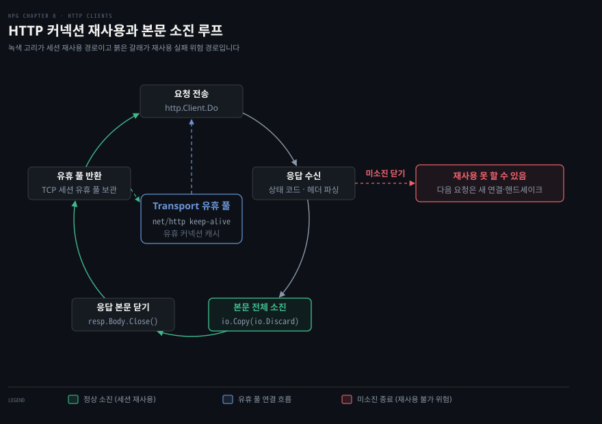
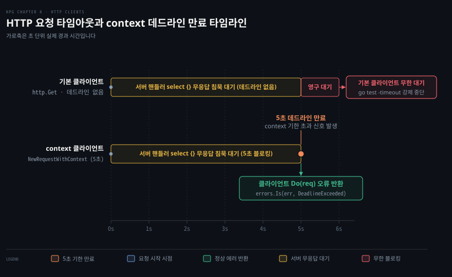

# Go HTTP 클라이언트는 응답 본문을 닫아야 연결을 재사용하고 context 로 요청을 끊는다

---

> Go 의 `net/http` 클라이언트는 응답 본문(`resp.Body`)을 끝까지 읽고 닫아야 기본 전송 계층의 TCP 연결을 유휴 풀로 회수해 재사용하며, 서버의 무응답 침묵에 갇히지 않으려면 요청마다 context 데드라인이나 타이머 취소를 명시해야 합니다.

## 핵심 요약

> 이 편이 매달린 하나의 생각은 Go HTTP 클라이언트의 자원 회수와 안정성이 응답 본문 완전 소진과 명시적 닫기, 그리고 context 를 통한 수명 제어라는 두 규약에 달려 있다는 사실입니다.

클라이언트는 요청을 보낸 뒤 상태 코드와 헤더를 즉시 파싱하지만 본문 스트림은 자동으로 비워주지 않습니다. `resp.Body` 를 닫지 않으면 소켓 파일 디스크립터가 누수되고, 본문을 `io.EOF` 까지 다 읽지 않고 닫으면 전송 계층(`Transport`)이 TCP 세션을 유휴 풀로 돌려보내지 못해 연결을 재사용하지 못할 수 있습니다. 불필요한 본문도 `io.Copy(io.Discard, resp.Body)` 로 완전히 비우고 닫아야 다음 요청이 3-way 핸드셰이크 없이 기존 TCP 연결을 안전하게 재사용합니다.

`http.DefaultClient` 와 패키지 수준 편의 함수는 기본 타임아웃이 없어 침묵하는 서버에 요청을 보내면 고루틴이 무한정 블로킹됩니다. 운영 환경에서는 `http.NewRequestWithContext` 로 context 데드라인을 걸어 요청 생애주기 전체에 시간 상한을 두거나, 타이머 리셋으로 단계별 지연을 방어해야 합니다. 다수의 외부 호스트로 일회성 요청을 쏘는 경우에는 `req.Close = true` 로 불필요한 유휴 소켓 누적을 방지합니다.


## 학습 목표

> 이 편을 읽고 나면 아래 다섯 가지를 스스로 해낼 수 있습니다.

1. `http.Head` 와 `http.Get` 의 차이를 이해하고, 응답 헤더의 `Date` 필드로 시스템 시각 오차를 비교하는 원리를 설명할 수 있습니다.
2. `resp.Body` 를 닫지 않았을 때 발생하는 자원 누수와, 본문을 끝까지 읽지 않고 닫았을 때 TCP 세션을 재사용하지 못할 수 있는 인과관계를 말할 수 있습니다.
3. `io.Copy(io.Discard, resp.Body)` 로 불필요한 본문을 안전하게 소진하고 `resp.Body.Close()` 로 정리하는 표준 절차를 구현할 수 있습니다.
4. `http.NewRequestWithContext` 로 context 타임아웃과 취소를 요청에 바인딩하여 무응답 서버에 클라이언트가 영구 블로킹되는 현상을 방지할 수 있습니다.
5. 단일 요청 단위의 지속 연결 종료(`req.Close = true`)와 클라이언트 전역의 지속 연결 비활성화(`Transport.DisableKeepAlives`)의 차이를 설명하고, `mime/multipart` 로 폼 데이터와 파일을 조립해 전송할 수 있습니다.


## 1. 기본 클라이언트로 요청하고 응답을 읽는다

> Go 의 기본 HTTP 클라이언트는 간결한 헬퍼 함수로 요청을 보내고 헤더와 상태 코드를 파싱해 돌려주지만, 기본 타임아웃이 없으므로 운영 환경에서는 동작 특성을 정확히 이해하고 써야 합니다.

### http.Get 과 http.Head 편의 함수

`net/http` 패키지는 일회성 웹 요청을 손쉽게 보낼 수 있도록 패키지 수준 편의 함수인 `http.Get`, `http.Head`, `http.Post` 를 제공합니다.

- `http.Get(url)`: 지정한 URL 로 GET 요청을 전송하고 `*http.Response` 포인터와 `error` 를 반환합니다.
- `http.Head(url)`: 대상 서버에 HEAD 메서드를 보냅니다. 서버는 본문 페이로드를 제외하고 헤더만 돌려주므로 자원의 존재 여부나 메타데이터만 확인할 때 네트워크 대역폭을 아낄 수 있습니다.

두 함수가 반환하는 `*http.Response` 구조체에는 응답 상태 코드(`StatusCode`), 헤더 맵(`Header`), 그리고 본문 스트림인 `Body`(`io.ReadCloser`)가 포함됩니다.

이 편의 함수들은 내부적으로 전역 공유 인스턴스인 `http.DefaultClient` 를 사용합니다. `DefaultClient` 는 기본 타임아웃이 0초(`0s`), 즉 무한 대기로 설정되어 있습니다. 따라서 신뢰할 수 없는 원격 서버와 통신할 때 기본 클라이언트를 그대로 쓰면 장애에 취약해집니다. 기본 클라이언트의 타임아웃 부재와 운영상 위험은 [Learning Go 13-04 §1 클라이언트 — DefaultClient 대신 타임아웃을 정한 Client](../../../01_language/book/lgo_learning-go/13-04.net-http%20는%20타임아웃을%20직접%20정하고%20미들웨어는%20Handler%20를%20감싸며%20slog%20로%20구조화%20로그를%20남깁니다.md#1-클라이언트--defaultclient-대신-타임아웃을-정한-client)에서 자세히 다룹니다.

### time.gov 의 Date 헤더로 로컬 시각 오차 측정하기

공인된 표준시 제공 서버인 `time.gov` 에 HEAD 요청을 보내어 응답 헤더의 `Date` 필드와 로컬 컴퓨터의 시스템 시각을 대조하는 예제입니다.

```go
package main

import (
	"net/http"
	"testing"
	"time"
)

func TestHeadTime(t *testing.T) {
	// (1) time.gov 서버에 본문 없는 HEAD 요청 전송
	resp, err := http.Head("https://www.time.gov/")
	if err != nil {
		t.Fatal(err)
	}

	// (2) 응답 본문은 예외 없이 즉시 닫기
	_ = resp.Body.Close()

	// (3) 로컬 현재 시각을 초 단위로 반올림
	now := time.Now().Round(time.Second)

	// (4) 서버가 돌려준 Date 응답 헤더 추출
	date := resp.Header.Get("Date")
	if date == "" {
		t.Fatal("no Date header received from time.gov")
	}

	// (5) RFC1123 포맷으로 시간 문자열 파싱
	dt, err := time.Parse(time.RFC1123, date)
	if err != nil {
		t.Fatal(err)
	}

	// (6) 서버 시각과 로컬 시각의 오차(skew) 로깅
	t.Logf("time.gov: %s (skew %s)", dt, now.Sub(dt))
}
```

이 테스트는 다음과 같은 이유로 설계되었습니다.

첫째, HEAD 메서드를 사용하여 본문 다운로드 없이 HTTP 헤더만 가져왔습니다. 본문 전송 시간이 배제되므로 네트워크 왕복 지연을 최소화하여 시각 정보를 빠르게 획득할 수 있습니다.

둘째, HEAD 응답이라도 `resp.Body.Close()` 를 반드시 호출했습니다. HEAD 요청은 본문 길이가 0이지만 Go 런타임 규약상 `resp.Body` 는 항상 유효한 `io.ReadCloser` 로 반환되므로 소켓 자원 회수를 위해 무조건 닫아야 합니다.

셋째, HTTP 표준 시각 규격인 `time.RFC1123`(`"Mon, 02 Jan 2006 15:04:05 MST"`)으로 헤더 문자열을 파싱한 뒤 `now.Sub(dt)` 로 로컬 클록 왜곡을 계산했습니다. 엄밀한 포렌식 동기화 용도로는 부족하지만, 대략적인 시간 편차를 검증하는 데 유용합니다.


## 2. 응답 본문을 끝까지 읽고 닫아야 연결이 재사용된다

> Go 의 전송 계층은 응답 본문을 끝까지 읽고 닫지 않으면 TCP 연결을 재사용하지 못할 수 있으므로, 불필요한 본문도 `io.Discard` 로 비워내야 커넥션을 재사용할 수 있습니다.



### 소켓 디스크립터 누수와 응답 본문 닫기 의무

클라이언트가 HTTP 응답을 받으면 상태 라인과 헤더는 전송 계층에 의해 소켓 버퍼에서 즉시 파싱되어 `*http.Response` 구조체로 채워집니다. 하지만 응답 본문(`resp.Body`)은 애플리케이션 코드가 직접 읽어갈 때까지 소켓 위에 소비되지 않은 상태로 대기합니다.

만약 `resp.Body.Close()` 호출을 누락하면 커널 소켓 파일 디스크립터(FD)가 반환되지 않고, 소켓 수신 고루틴이 백그라운드에 남게 됩니다. 요청이 누적되면 운영체제의 파일 디스크립터 한도에 걸려 `too many open files` 에러가 발생하며 프로세스가 마비됩니다. 따라서 요청이 성공(`err == nil`)했다면 본문을 읽든 읽지 않든 반드시 `resp.Body.Close()` 를 실행해야 합니다.

### 본문 미소진 상태의 Close 와 TCP 세션을 재사용하지 못할 가능성

응답 본문을 닫는 것만으로는 충분하지 않습니다. 핵심은 **본문이 끝까지 소진되었는가**입니다.

[Go net/http 패키지 Response 공식 문서](https://pkg.go.dev/net/http#Response)는 다음과 같이 규정합니다.

> "The default HTTP client's Transport may not reuse HTTP/1.x 'keep-alive' TCP connections if the Body is not read to completion and closed."
> (기본 HTTP 클라이언트의 Transport 는 Body 를 끝까지 읽고 닫지 않으면 HTTP/1.x 'keep-alive' TCP 연결을 재사용하지 않을 수 있습니다.)

TCP 스트림은 경계가 없는 바이트 흐름입니다. 이전 HTTP 응답의 본문 바이트가 소켓 스트림에 아직 남아 있는 상태에서 연결을 유휴 풀에 넣어두면, 다음 요청을 보낼 때 이전 응답의 잔여 데이터와 뒤섞여 프로토콜 동기화가 완전히 파괴됩니다.

따라서 Go 의 `Transport` 는 본문이 `io.EOF` 에 도달하지 않은 상태에서 `Close()` 가 호출되면, 해당 TCP 소켓을 유휴 풀로 회수하지 않고 연결을 닫아버려 재사용하지 못할 수 있습니다. 그 결과 다음 HTTP 요청은 기존 세션을 활용하지 못하고 새로운 TCP 3-way 핸드셰이크를 처음부터 다시 수행해야 하므로 상당한 지연이 추가될 수 있습니다.

대용량 파일을 GET 으로 요청한 뒤 헤더의 `Content-Length` 만 보고 너무 커서 취소하려고 할 때도 주의해야 합니다. 본문을 그냥 닫으면 Go 내부적으로 소켓을 비우는 과정에 오버헤드가 들거나 세션이 파기되므로, 헤더만 확인할 때는 애초에 HEAD 메서드를 써야 합니다.

### io.Copy 와 io.Discard 를 통한 안전한 본문 배출

응답 본문 데이터가 실제 비즈니스 로직에는 필요 없지만, 하위 TCP 연결을 계속 재사용하고 싶다면 명시적으로 본문을 비워내야 합니다.

```go
// (1) 응답 본문의 잔여 바이트를 끝까지 읽어 폐기 버퍼로 흘려보냄
_, _ = io.Copy(io.Discard, response.Body)

// (2) 본문 소진 완료 후 소켓 리소스를 해방하여 유휴 풀로 반환
_ = response.Body.Close()
```

이 코드가 작성된 근거는 명확합니다.

첫째, `io.Discard` 는 `io.Writer` 인터페이스를 구현하는 특수 객체로, 여기에 쓰인 모든 바이트를 메모리 할당 없이 즉시 버립니다. 불필요한 메모리 복사 비용을 치르지 않고 소켓 버퍼를 비울 수 있습니다.

둘째, `io.Copy` 는 `response.Body` 로부터 `io.EOF` 를 만날 때까지 바이트를 계속 읽어 `io.Discard` 에 씁니다. 이를 통해 본문이 끝까지 소진되었음이 보장됩니다.

셋째, 소진 직후 `response.Body.Close()` 를 호출하면 `Transport` 가 해당 소켓을 정상 유휴 커넥션으로 인식하고 내부 풀에 보관합니다. 이어지는 다음 HTTP 요청은 핸드셰이크 비용 없이 이 연결을 즉시 재사용합니다. 반환값을 `_, _` 로 명시적 무시한 것은 에러 처리를 실수로 빠뜨린 것이 아니라 의도적으로 건너뛰었음을 동료 개발자에게 알리는 규약입니다.


## 3. 타임아웃과 취소로 요청이 영원히 막히지 않게 한다

> 원격 서버가 응답을 주지 않고 침묵할 때 클라이언트가 영구 블로킹에 빠지는 참사를 막으려면 context 데드라인을 주입하거나 타이머 취소를 명시해야 합니다.



### 무응답 서버와 영구 블로킹 문제

Go 의 기본 HTTP 클라이언트와 편의 함수는 타임아웃이 없습니다. 원격 서비스에 네트워크 장애가 발생하거나 악의적인 서버가 TCP 연결만 맺어두고 응답을 일절 보내지 않으면, 클라이언트 고루틴은 오류도 내지 못한 채 영원히 대기 상태에 갇힙니다.

이 문제를 드러내는 테스트 코드입니다.

```go
package main

import (
	"net/http"
	"net/http/httptest"
	"testing"
)

// (1) 요청을 받으면 아무 응답도 쓰지 않고 영구 블로킹되는 핸들러
func blockIndefinitely(w http.ResponseWriter, r *http.Request) {
	select {}
}

func TestBlockIndefinitely(t *testing.T) {
	// (2) 침묵하는 핸들러를 바인딩한 로컬 테스트 서버 구동
	ts := httptest.NewServer(http.HandlerFunc(blockIndefinitely))
	defer ts.Close()

	// (3) 기본 클라이언트로 요청 시 반환되지 않고 영구 블로킹 발생
	_, _ = http.Get(ts.URL)
	t.Fatal("client did not indefinitely block")
}
```

`httptest.NewServer` 는 실제 TCP 포트를 열고 로컬 서버를 구동합니다. 핸들러 함수가 빈 `select {}` 로 멈춰 서면 응답 헤더조차 전송하지 않습니다. 기본 클라이언트의 `http.Get` 은 무한 대기에 빠지며, `go test` 명령에 `-timeout 5s` 같은 플래그를 넘겨두지 않았다면 테스트 프로세스 전체가 멈추게 됩니다.

### http.NewRequestWithContext 와 context.DeadlineExceeded

이 문제를 방지하는 표준 해법은 요청 객체를 만들 때 context 를 주입하는 것입니다.

```go
func TestBlockIndefinitelyWithTimeout(t *testing.T) {
	ts := httptest.NewServer(http.HandlerFunc(blockIndefinitely))
	defer ts.Close()

	// (1) 5초 제한 시간을 가진 context 생성
	ctx, cancel := context.WithTimeout(context.Background(), 5*time.Second)
	defer cancel()

	// (2) context 를 바인딩한 신규 GET 요청 생성
	req, err := http.NewRequestWithContext(ctx, http.MethodGet, ts.URL, nil)
	if err != nil {
		t.Fatal(err)
	}

	// (3) 요청 실행: 5초 동안 응답이 없으면 즉시 에러 반환
	resp, err := http.DefaultClient.Do(req)
	if err != nil {
		// (4) 만료 에러가 context.DeadlineExceeded 인지 확인
		if !errors.Is(err, context.DeadlineExceeded) {
			t.Fatal(err)
		}
		return
	}
	_ = resp.Body.Close()
}
```

이 코드는 다음과 같은 원리로 안정성을 확보합니다.

첫째, `context.WithTimeout` 으로 5초의 명시적 시한을 부여했습니다. `http.NewRequestWithContext` 는 이 context 를 요청 객체에 등록합니다.

둘째, 5초 동안 서버가 응답하지 않으면 context 가 취소 신호를 방출하고, 내부 소켓 작업이 강제로 중단되면서 `Do(req)` 는 즉시 깨어납니다.

셋째, 반환된 에러를 `errors.Is(err, context.DeadlineExceeded)` 로 검사해 정상 취소임을 확인했습니다. context 데드라인의 전파는 [03-03 §3 다이얼에 기한을 건다](./03-03.타임아웃은%20Dialer·context%20로,%20유휴%20감지는%20데드라인과%20하트비트로%20건다.md#3-다이얼에-기한을-건다)가 다룹니다. 부모·자식 취소 규칙은 [Learning Go 14-03](../../../01_language/book/lgo_learning-go/14-03.WithTimeout%20은%20요청%20시간을%20제한하고%20자식은%20부모%20기한을%20넘지%20못하며%20긴%20계산은%20스스로%20취소를%20확인합니다.md)에서 다룹니다.

주의할 점은 context 의 타이머가 생성 즉시 작동한다는 점입니다. 이 타이머는 TCP 연결 수립, 요청 전송, 응답 헤더 수신뿐만 아니라 응답 본문을 읽는 시간까지 전체 생애주기를 지배합니다. 본문을 읽는 도중 5초가 지나면 다음 `Read` 호출도 즉시 데드라인 초과 에러를 반환합니다.

### time.Timer 리셋을 통한 동적 유휴 시한 관리

고정 데드라인 대신 수신 단계마다 시간을 연장하고 싶다면, `context.WithCancel` 과 `time.AfterFunc` 를 결합합니다.

```go
// (1) 취소 가능한 기본 context 생성
ctx, cancel := context.WithCancel(context.Background())
defer cancel()

// (2) 5초 뒤 cancel 을 부르는 타이머 등록
timer := time.AfterFunc(5*time.Second, cancel)

// HTTP 요청을 전송하고 응답 헤더를 수신하는 작업 진행...
// ...

// (3) 헤더 수신 후 본문 다운로드를 위해 5초의 시간을 추가 부여
timer.Reset(5 * time.Second)
```

이 패턴은 정적 데드라인의 한계를 보완합니다. 헤더를 받는 데 3초가 걸렸더라도, 본문 스트림을 읽기 직전에 `timer.Reset(5*time.Second)` 를 호출하면 다시 5초의 유예 시간을 벌 수 있습니다. 대용량 파일 스트리밍처럼 유휴 침묵만 감지하고 전체 전송 시간은 길게 열어두어야 할 때 유용합니다.


## 4. 지속 연결을 끄는 것은 요청 하나 또는 클라이언트 전체에서 정한다

> 지속 연결이 오히려 소켓 자원을 고갈시키는 특수 상황에서는 요청 단위의 `req.Close = true` 나 클라이언트 전역의 `Transport.DisableKeepAlives` 로 세션 재사용을 차단합니다.

### 요청 단위 종료: req.Close = true

HTTP/1.1 은 기본적으로 연결을 유지(Keep-Alive)합니다. 하지만 수많은 서로 다른 호스트로 단발성 요청을 쏘는 웹 크롤러나 스캐너 같은 애플리케이션에서는 이 세션 재사용이 독이 될 수 있습니다. 수천 대의 원격 서버와 맺은 유휴 TCP 연결이 풀에 남아 있으면 시스템의 가용 포트와 소켓 디스크립터가 빠르게 고갈됩니다.

이때 가장 유연한 해결책은 요청 단위로 소켓 종료를 지시하는 것입니다.

```go
req, err := http.NewRequestWithContext(ctx, http.MethodGet, ts.URL, nil)
if err != nil {
	t.Fatal(err)
}

// (1) 응답 수신 후 하위 TCP 연결을 즉시 닫도록 클라이언트에 지시
req.Close = true
```

`req.Close = true` 로 설정하면 두 가지 작업이 수행됩니다.

첫째, 원격 서버에 `Connection: close` 헤더를 전송하여 서버 측에서도 응답 전송 후 연결을 정리하도록 알립니다.

둘째, 클라이언트의 `Transport` 도 응답을 다 읽은 직후 해당 TCP 소켓을 유휴 풀에 넣지 않고 즉시 닫습니다.

예를 들어 특정 서버에 총 4번의 요청만 보낼 계획이라면, 앞선 3번의 요청은 기존 TCP 세션을 재사용하고 마지막 4번째 요청에만 `req.Close = true` 를 설정하여 작업을 마친 뒤 소켓을 깔끔하게 정리할 수 있습니다.

### 클라이언트 전역 종료: Transport.DisableKeepAlives

애플리케이션 전체에서 지속 연결을 일절 쓰지 않아야 하는 배치 환경이라면 클라이언트 단위로 기능을 끌 수 있습니다.

[Go net/http 패키지 Transport 공식 문서](https://pkg.go.dev/net/http#Transport)는 `DisableKeepAlives` 설정을 지원합니다.

```go
tr := &http.Transport{
	// (1) 모든 요청에 대해 TCP 지속 연결을 끄고 유휴 풀링 비활성화
	DisableKeepAlives: true,
}
client := &http.Client{Transport: tr}
```

`DisableKeepAlives` 가 참이면 이 클라이언트를 통해 전송되는 모든 요청은 응답 완료 후 소켓이 닫히며 유휴 풀에 보관되지 않습니다. 단일 요청 단위의 세밀한 제어가 필요할 때는 `req.Close = true` 가 적합하고, 전역적인 일회성 통신 배치에서는 `Transport.DisableKeepAlives` 가 편리합니다.


## 5. JSON 과 multipart 폼으로 데이터를 보낸다

> POST 요청 페이로드는 `io.Reader` 로 전달되며, JSON 스트림 인코딩이나 `mime/multipart` 경계선(boundary) 작성을 통해 정형 데이터와 다중 첨부 파일을 표준 포맷으로 전송합니다.

### JSON 인코딩과 POST 요청 흐름

REST API 통신에서는 구조체를 JSON 으로 직렬화하여 본문에 싣는 작업이 빈번합니다.

```go
type User struct {
	First string
	Last  string
}

func TestPostUser(t *testing.T) {
	ts := httptest.NewServer(http.HandlerFunc(handlePostUser(t)))
	defer ts.Close()

	// (1) User 구조체 인스턴스 준비
	buf := new(bytes.Buffer)
	u := User{First: "Adam", Last: "Woodbeck"}

	// (2) 버퍼 스트림으로 JSON 직렬화
	err := json.NewEncoder(buf).Encode(&u)
	if err != nil {
		t.Fatal(err)
	}

	// (3) Content-Type 헤더와 함께 POST 전송
	resp, err := http.Post(ts.URL, "application/json", buf)
	if err != nil {
		t.Fatal(err)
	}
	defer resp.Body.Close()

	if resp.StatusCode != http.StatusAccepted {
		t.Fatalf("expected status %d; actual status %d",
			http.StatusAccepted, resp.StatusCode)
	}
}
```

이 흐름의 설계 이유입니다.

첫째, `json.Marshal` 로 바이트 슬라이스를 통째로 만들지 않고 `json.NewEncoder(buf).Encode(&u)` 를 사용했습니다. 버퍼로 직접 스트리밍하여 메모리 할당을 줄입니다. 구조체 태그와 JSON 스트림 처리는 [Learning Go 13-03 encoding/json 은 구조체 태그로 이름을 정하고 Decoder 와 Encoder 로 스트림을 다룹니다](../../../01_language/book/lgo_learning-go/13-03.encoding-json%20은%20구조체%20태그로%20이름을%20정하고%20Decoder%20와%20Encoder%20로%20스트림을%20다룹니다.md)에서 다룹니다.

둘째, `http.Post` 는 세 번째 인자로 `io.Reader` 를 받으므로 `*bytes.Buffer` 를 그대로 넘깁니다. 두 번째 인자인 `"application/json"` 은 요청 헤더의 `Content-Type` 으로 자동 설정되어 서버에 페이로드 규격을 알립니다.

셋째, 수신 서버 핸들러는 `r.Method != http.MethodPost` 로 메서드를 제한합니다. 이어 `json.NewDecoder(r.Body).Decode(&u)` 로 객체를 복원한 뒤 202(`http.StatusAccepted`)로 응답합니다. 서버 역시 본문을 다 읽은 뒤 `io.Copy(io.Discard, r.Body)` 로 완전히 비우고 닫는 것이 정석입니다.

### multipart.Writer 로 필드와 파일 조립하기

문자열 폼 필드와 파일을 단일 POST 요청에 한꺼번에 담아 전송할 때는 `mime/multipart` 패키지를 활용합니다.

```go
func TestMultipartPost(t *testing.T) {
	reqBody := new(bytes.Buffer)
	// (1) 요청 본문 버퍼를 감싸는 멀티파트 작성기 생성 (난수 boundary 자동 생성)
	w := multipart.NewWriter(reqBody)

	// (2) 일반 텍스트 폼 필드 작성
	for k, v := range map[string]string{
		"date":        time.Now().Format(time.RFC3339),
		"description": "Form values with attached files",
	} {
		err := w.WriteField(k, v)
		if err != nil {
			t.Fatal(err)
		}
	}

	// (3) 첨부 파일 파트 작성 및 복사
	for i, file := range []string{
		"./files/hello.txt",
		"./files/goodbye.txt",
	} {
		filePart, err := w.CreateFormFile(fmt.Sprintf("file%d", i+1), filepath.Base(file))
		if err != nil {
			t.Fatal(err)
		}

		f, err := os.Open(file)
		if err != nil {
			t.Fatal(err)
		}

		_, err = io.Copy(filePart, f)
		_ = f.Close()
		if err != nil {
			t.Fatal(err)
		}
	}

	// (4) 멀티파트 작성기를 닫아 종결 boundary 기록
	err := w.Close()
	if err != nil {
		t.Fatal(err)
	}

	// (5) context 와 Content-Type 헤더를 설정하여 httpbin.org 에 전송
	ctx, cancel := context.WithTimeout(context.Background(), 60*time.Second)
	defer cancel()

	req, err := http.NewRequestWithContext(ctx, http.MethodPost, "https://httpbin.org/post", reqBody)
	if err != nil {
		t.Fatal(err)
	}
	req.Header.Set("Content-Type", w.FormDataContentType())

	resp, err := http.DefaultClient.Do(req)
	if err != nil {
		t.Fatal(err)
	}
	defer resp.Body.Close()

	b, err := io.ReadAll(resp.Body)
	if err != nil {
		t.Fatal(err)
	}
	t.Logf("\n%s", b)
}
```

이 과정의 주요 메커니즘입니다.

첫째, `multipart.NewWriter` 는 초기화 시 무작위 경계선 문자열(boundary)을 생성합니다.

둘째, `w.WriteField(k, v)` 는 개별 폼 필드마다 MIME 파트를 만들고 헤더와 값을 버퍼에 씁니다.

셋째, `w.CreateFormFile(fieldname, filename)` 은 파일 전송 전용 MIME 파트 작성기(`io.Writer`)를 반환합니다. `os.Open` 으로 연 파일 스트림을 `io.Copy(filePart, f)` 로 밀어 넣으면 파일 본문이 파트에 기록됩니다.

넷째, 모든 파트를 추가한 뒤 반드시 `w.Close()` 를 호출해야 합니다. 이 호출이 누락되면 버퍼 끝에 최종 종결 바운더리(`--boundary--`)가 붙지 않아 수신 서버가 요청이 중단된 것으로 판단합니다.

### Content-Type 의 Boundary 와 httpbin.org 검증

멀티파트 요청 전송 시 헤더의 `Content-Type` 은 반드시 `w.FormDataContentType()` 가 반환한 문자열로 지정해야 합니다.

이 메서드는 다음과 같은 형식의 문자열을 반환합니다.

```http
Content-Type: multipart/form-data; boundary=e9ad4b62e0dfc8d7dc57ccfa8ba62244342f1884
```

수신 서버는 이 헤더의 `boundary` 값을 기준으로 본문 스트림을 읽으며 각 파트의 시작과 끝을 구분합니다. 필요하다면 `w.SetBoundary(customBoundary)` 로 직접 경계선 값을 지정할 수도 있습니다.

위 테스트를 실행하여 `httpbin.org` 가 반환한 실제 응답 JSON 출력입니다.

```json
{
  "args": {},
  "data": "",
  "files": {
    "file1": "Hello, world!\n",
    "file2": "Goodbye, world!\n"
  },
  "form": {
    "date": "2006-01-02T15:04:05-07:00",
    "description": "Form values with attached files"
  },
  "headers": {
    "Accept-Encoding": "gzip",
    "Content-Length": "739",
    "Content-Type": "multipart/form-data; boundary=e9ad4b62e0dfc8d7dc57ccfa8ba62244342f1884...",
    "Host": "httpbin.org",
    "User-Agent": "Go-http-client/1.1"
  },
  "json": null,
  "origin": "192.168.0.1",
  "url": "https://httpbin.org/post"
}
```

서버 응답의 `"files"` 맵에 첨부한 두 텍스트 파일의 내용이 온전히 수신되었고, `"form"` 맵에 폼 필드가 정확히 역직렬화되었음을 확인할 수 있습니다.


## 결정 치트시트

> HTTP 클라이언트의 연결 관리와 전송 요구사항에 따라 선택할 API 조합입니다.

| 상황 | 적용할 API 및 설정 | 핵심 이유 |
|---|---|---|
| 응답 본문이 불필요한 GET 요청 | `io.Copy(io.Discard, resp.Body)` 후 `Close()` | 본문을 끝까지 소진해야 하위 TCP 연결이 유휴 풀로 회수되어 재사용됨 |
| 자원 메타데이터·존재 여부만 확인 | `http.Head(url)` | 본문 페이로드 전송 없이 헤더만 조회하여 네트워크 대역폭과 소진 비용 절약 |
| 신뢰할 수 없거나 느린 원격 서버 호출 | `http.NewRequestWithContext(ctx, ...)` | 침묵하는 서버에 의해 클라이언트 고루틴이 영구 블로킹되는 장애 방지 |
| 대용량 스트리밍 단계별 시한 제어 | `time.AfterFunc` 타이머와 `timer.Reset()` | 헤더 수신 후 본문 수신 시간을 동적으로 연장하여 유연한 유휴 감지 유지 |
| 수많은 호스트로 단발성 요청 전송 | `req.Close = true` | 요청 완료 후 즉시 TCP 연결을 닫아 로컬 소켓 FD 및 가용 포트 고갈 방지 |
| 정형 데이터 및 파일 동시 전송 | `mime/multipart.Writer` 및 `FormDataContentType()` | 고유 boundary 를 자동 생성해 단일 POST 요청 안에 다중 파트 패키징 |


## 면접 대비

> 아래 질문에 답하면서 Go HTTP 클라이언트의 자원 회수 규칙과 연결 풀링 동작을 점검해 보세요.

1. `resp.Body.Close()` 를 호출하지 않았을 때와, 본문을 다 읽지 않고 `Close()` 만 불렀을 때 발생하는 문제의 차이를 설명해 주세요.
2. `http.DefaultClient` 와 `http.Get` 을 실무 프로덕션 환경에서 그대로 사용하면 위험한 이유를 설명해 주세요.
3. `http.NewRequestWithContext` 에 전달한 context 타임아웃이 HTTP 요청의 어느 단계까지 적용되는지 설명해 주세요.
4. `req.Close = true` 와 `Transport.DisableKeepAlives = true` 의 동작 차이와 각각을 적용하기 적합한 상황을 비교해 주세요.
5. `multipart.Writer` 로 폼 데이터를 전송할 때 `w.Close()` 호출과 `w.FormDataContentType()` 헤더 설정이 필수적인 이유를 설명해 주세요.


## 정답 (자답 후 펼치기)

> 위 §면접 대비의 질문에 먼저 스스로 답한 뒤 읽으세요.

### 정답 1 — 소켓 파일 디스크립터 누수와 TCP 지속 연결 재사용 실패 가능성

`resp.Body.Close()` 를 아예 호출하지 않으면 커널 소켓 파일 디스크립터와 내부 수신 고루틴이 해방되지 않아 시스템 자원이 누수되고 `too many open files` 에러로 이어집니다. 반면 본문을 다 읽지 않은 상태에서 `Close()` 만 부르면 자원은 해방되지만, 소켓 버퍼에 이전 응답의 잔여 바이트가 남아 있어 `Transport` 가 해당 TCP 소켓을 유휴 풀로 회수하지 못하고 연결을 닫아버려 재사용하지 못할 수 있습니다. 이로 인해 다음 요청 시 기존 TCP 세션을 재사용하지 못하고 3-way 핸드셰이크를 새로 맺어야 하는 지연이 발생할 수 있습니다.

### 정답 2 — 무한 대기로 인한 고루틴 영구 블로킹 위험

`http.DefaultClient` 와 `http.Get` 편의 함수는 기본 타임아웃이 `0s`(무한대)로 설정되어 있습니다. 네트워크 단선이나 원격 서버의 행(hang) 현상으로 인해 서버가 TCP 연결 수립 후 응답을 일절 보내지 않으면, 클라이언트 요청 고루틴은 에러를 내지 못한 채 영원히 대기 상태에 갇힙니다. 이러한 요청이 누적되면 서비스 전체 고루틴이 고갈되어 프로세스가 응답 불능에 빠집니다. 따라서 운영 코드에서는 반드시 타임아웃이 명시된 `http.Client` 나 context 를 써야 합니다.

### 정답 3 — 연결 수립부터 본문 전체 수신까지 전체 생애주기 지배

`http.NewRequestWithContext` 에 바인딩된 context 데드라인은 TCP 연결 수립부터 본문 전체 수신까지 전 과정에 걸쳐 유효합니다. 다이얼, TLS 핸드셰이크, 헤더 송수신, 본문 읽기가 모두 이 시한 안에 끝나야 합니다. 따라서 `Do(req)` 가 반환된 뒤라도 본문을 읽는 도중 기한이 지나면 다음 `Read` 호출은 즉시 `context.DeadlineExceeded` 에러를 반환합니다.

### 정답 4 — 요청 단위 소켓 폐기와 전역 연결 풀 비활성화

`req.Close = true` 는 단일 요청에 적용되며, `Connection: close` 헤더를 보내고 해당 응답 수신 직후 하위 TCP 연결을 종료합니다. 수많은 서버 중 특정 서버와의 통신만 마치고 세션을 닫고자 할 때 유연하게 쓰입니다. 반면 `Transport.DisableKeepAlives = true` 는 클라이언트 전역에 적용되어 모든 HTTP 요청에 대해 TCP keep-alive 유휴 풀링을 비활성화합니다. 크롤러처럼 대규모 무작위 호스트로 일회성 요청을 쏟아내는 배치 프로그램에서 로컬 소켓 자원 고갈을 방지할 때 적합합니다.

### 정답 5 — 종결 경계선 삽입과 파트 식별 메타데이터 제공

`w.Close()` 는 멀티파트 버퍼 끝에 종결 바운더리(`--boundary--`)를 덧붙입니다. 이 호출이 누락되면 서버는 전송이 중간에 끊긴 것으로 판단합니다. 또한 `w.FormDataContentType()` 는 생성된 고유 boundary 문자열을 포함한 `"multipart/form-data; boundary=..."` 헤더 값을 반환합니다. 서버가 각 MIME 파트의 경계를 올바르게 파싱하려면 이 값을 반드시 `Content-Type` 요청 헤더에 지정해야 합니다.


## 참고 자료

- 《Network Programming with Go》 Adam Woodbeck, 2021. ISBN 978-1-7185-0088-4. Chapter 8 Writing HTTP Clients.
- [Go 표준 net/http 패키지 Response 문서](https://pkg.go.dev/net/http#Response): `Body` 스트림 규약 및 TCP 지속 연결 재사용 조건 명세.
- [Go 표준 net/http 패키지 Transport 문서](https://pkg.go.dev/net/http#Transport): `DisableKeepAlives` 및 커넥션 풀링 옵션.
- [Go 표준 mime/multipart 패키지 문서](https://pkg.go.dev/mime/multipart): `Writer` 생성 및 `FormDataContentType` 명세.


## 관련 문서

- [08-01 HTTP 는 URL 로 자원을 가리키고 메서드로 요청하며 상태 코드로 답한다](./08-01.HTTP%20는%20URL%20로%20자원을%20가리키고%20메서드로%20요청하며%20상태%20코드로%20답한다.md): HTTP 프로토콜 기초와 메서드·상태 코드 체계를 다룹니다.
- [09-01 Go HTTP 서버는 타임아웃을 정하고 핸들러에 의존성을 주입하며 httptest 로 시험한다](./09-01.Go%20HTTP%20서버는%20타임아웃을%20정하고%20핸들러에%20의존성을%20주입하며%20httptest%20로%20시험한다.md): 서버 측 타임아웃 설정과 핸들러 구현 원리를 다룹니다.
- [03-03 타임아웃은 Dialer·context 로, 유휴 감지는 데드라인과 하트비트로 건다](./03-03.타임아웃은%20Dialer·context%20로,%20유휴%20감지는%20데드라인과%20하트비트로%20건다.md): 네트워크 소켓과 context 데드라인의 상호작용 원리를 다룹니다.
- [Learning Go 13-04 net/http 는 타임아웃을 직접 정하고 미들웨어는 Handler 를 감싸며 slog 로 구조화 로그를 남깁니다](../../../01_language/book/lgo_learning-go/13-04.net-http%20는%20타임아웃을%20직접%20정하고%20미들웨어는%20Handler%20를%20감싸며%20slog%20로%20구조화%20로그를%20남깁니다.md): 표준 라이브러리의 `http.Client` 와 서버 타임아웃 모범 사례를 다룹니다.
- [Learning Go 14-03 WithTimeout 은 요청 시간을 제한하고 자식은 부모 기한을 넘지 못하며 긴 계산은 스스로 취소를 확인합니다](../../../01_language/book/lgo_learning-go/14-03.WithTimeout%20은%20요청%20시간을%20제한하고%20자식은%20부모%20기한을%20넘지%20못하며%20긴%20계산은%20스스로%20취소를%20확인합니다.md): context 의 타임아웃과 계층적 취소 모델을 다룹니다.
- [Learning Go 13-03 encoding/json 은 구조체 태그로 이름을 정하고 Decoder 와 Encoder 로 스트림을 다룹니다](../../../01_language/book/lgo_learning-go/13-03.encoding-json%20은%20구조체%20태그로%20이름을%20정하고%20Decoder%20와%20Encoder%20로%20스트림을%20다룹니다.md): JSON 직렬화와 스트리밍 입출력 원리를 다룹니다.
- [이 책의 정독 인덱스](./README.md): 전체 챕터 구성과 학습 진행 상황.
