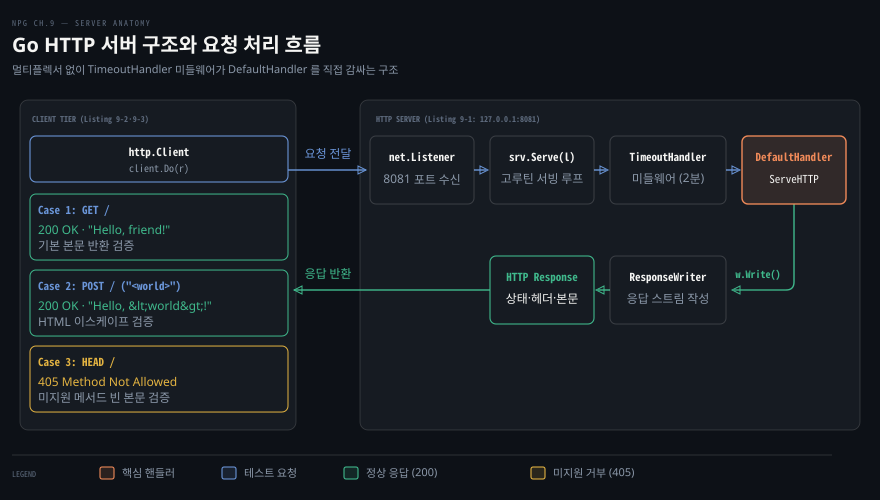
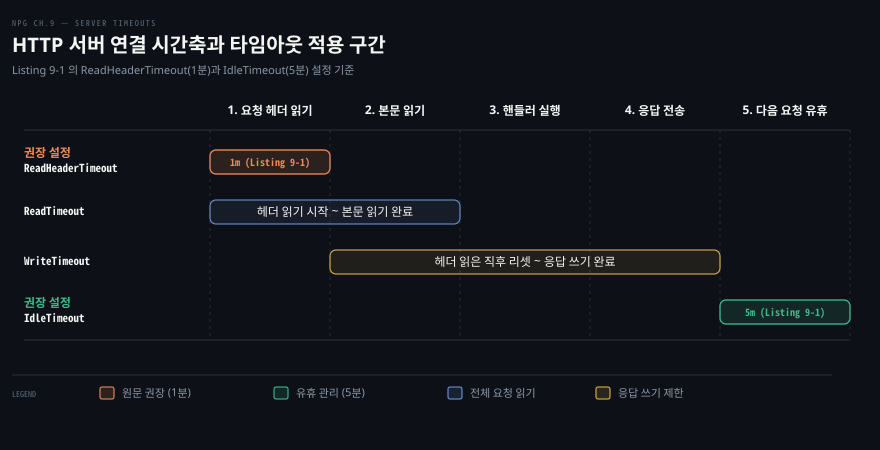

# Go HTTP 서버는 타임아웃을 정하고 핸들러에 의존성을 주입하며 httptest 로 시험한다

---

> Go 표준 라이브러리의 `net/http` 는 리스너와 라우터, 미들웨어와 핸들러를 간결한 인터페이스로 조립하고 소켓 연결 없이도 `net/http/httptest` 로 격리 검증할 수 있는 서버 기반을 제공합니다.

## 핵심 요약

> Go HTTP 서버의 안정성은 느린 클라이언트에 휘둘리지 않도록 헤더와 유휴 타임아웃을 엄격히 묶고 핸들러 동작을 가벼운 어댑터와 의존성 주입으로 독립시키는 설계에서 비롯됩니다.

서버는 `http.Server` 구조체로 리스너 주소와 타임아웃을 선언한 뒤 `srv.Serve(listener)` 로 다중 연결을 받습니다. 수신된 요청은 멀티플렉서와 미들웨어를 거쳐 최종 목적지인 핸들러에 전달됩니다. 멀티플렉서 또한 내부적으로 `http.Handler` 인터페이스를 만족하므로 계층적인 라우팅 조합이 가능합니다.

클라이언트가 전송 속도를 지연시켜 서버 자원을 고갈시키지 못하도록 `ReadHeaderTimeout` 과 `IdleTimeout` 을 명시적으로 지정해야 합니다. 핸들러 구현에서는 `ResponseWriter` 의 상태 코드를 본문 쓰기 전에 먼저 기록해야 하며 클로저나 구조체 필드를 활용해 로거와 데이터베이스 같은 외부 자원을 주입합니다. 이러한 핸들러 로직은 실제 TCP 포트를 점유하지 않고도 `httptest.NewRequest` 와 `httptest.NewRecorder` 로 빠르게 단위 시험할 수 있습니다.




## 학습 목표

> 이 편을 읽고 나면 아래 다섯 가지를 스스로 해낼 수 있습니다.

1. `http.Server` 와 멀티플렉서, 미들웨어, 핸들러 사이의 요청 전달 구조와 인터페이스 관계를 설명할 수 있습니다.
2. `ReadHeaderTimeout`, `ReadTimeout`, `WriteTimeout`, `IdleTimeout` 이 감시하는 소켓 생애주기 구간을 구분하고 선별 적용할 수 있습니다.
3. `ServeTLS` 메서드와 인증서·개인키 파일을 결합해 HTTPS 서비스를 구성할 수 있습니다.
4. `httptest` 패키지를 사용해 운영체제 네트워크 소켓 없이 핸들러 입출력과 상태 코드를 단위 검증할 수 있습니다.
5. 핸들러에 필요한 외부 의존성을 클로저와 구조체 메서드 패턴으로 주입하고 상황에 맞춰 선택할 수 있습니다.


## 1. 요청은 서버·멀티플렉서·미들웨어를 지나 핸들러에 닿는다

> 클라이언트 요청은 `net.Listener` 소켓으로 수신되어 `http.Server` 를 거친 뒤, 경로를 판별하는 멀티플렉서와 보조 기능을 수행하는 미들웨어를 통과해 비즈니스 로직을 담은 핸들러에 도달합니다.

### 서버·멀티플렉서·미들웨어·핸들러의 네 단계 여정

Go 웹 서비스는 유기적으로 맞물리는 네 가지 구성 요소 위에 세워집니다. 가장 바깥에서는 `http.Server` 가 운영체제 TCP 리스너 소켓을 쥐고 클라이언트 연결을 수락합니다. 연결이 수립되면 서버는 HTTP 요청 헤더와 본문을 파싱해 `*http.Request` 객체를 구성합니다.

이 요청 객체는 멀티플렉서(multiplexer, 라우터)로 넘어갑니다. 멀티플렉서는 요청 URL 경로와 HTTP 메서드를 확인해 어떤 객체가 이 요청을 처리할지 행선지를 결정합니다. 목적지 핸들러에 도달하기 직전, 요청은 하나 이상의 미들웨어(middleware) 함수를 통과할 수 있습니다. 미들웨어는 로깅, 인증, 타임아웃 제한처럼 여러 핸들러가 공유하는 횡단 관심사를 덧붙입니다.

### 멀티플렉서도 Handler 인터페이스를 만족하는 핸들러입니다

Go 표준 라이브러리 설계의 우아함은 단순한 인터페이스 수렴에 있습니다. 요청을 분기하는 멀티플렉서나 요청 흐름을 감싸는 미들웨어 모두 본질적으로 `http.Handler` 인터페이스를 구현합니다.

```go
type Handler interface {
	ServeHTTP(http.ResponseWriter, *http.Request)
}
```

멀티플렉서 자신이 `ServeHTTP` 메서드를 갖추고 있으므로, `http.Server` 의 `Handler` 필드에는 단일 핸들러뿐만 아니라 복잡한 라우터 객체도 그대로 대입할 수 있습니다. 멀티플렉서의 구체적인 등록 규칙과 표준 라우터의 특징은 [LGO 13-04 §2](../../../01_language/book/lgo_learning-go/13-04.net-http%20는%20타임아웃을%20직접%20정하고%20미들웨어는%20Handler%20를%20감싸며%20slog%20로%20구조화%20로그를%20남깁니다.md#2-서버--httpserver-와-handler-servemux) 에서 다룹니다.

### 단위 테스트로 서버 기동부터 검증과 종료까지 완결하기

네 단계 구성 요소가 실제로 어떻게 맞물려 구동되는지는 테스트 코드로 확인하는 편이 가장 분명합니다. 아래 코드는 서버 생성과 리스너 바인딩, 그리고 비동기 서빙 루프를 구성합니다.

```go
// (1) 서버 인스턴스 생성 및 타임아웃 선언
srv := &http.Server{
	Addr: "127.0.0.1:8081",
	Handler: http.TimeoutHandler(
		handlers.DefaultHandler(), 2*time.Minute, ""),
	IdleTimeout:       5 * time.Minute,
	ReadHeaderTimeout: time.Minute,
}

// (2) 지정 주소로 TCP 리스너 바인딩
l, err := net.Listen("tcp", srv.Addr)
if err != nil {
	t.Fatal(err)
}

// (3) 독립 고루틴에서 요청 수신 루프 실행
go func() {
	err := srv.Serve(l)
	if err != http.ErrServerClosed {
		t.Error(err)
	}
}()
```

이 구현은 몇 가지 핵심적인 초기화 원칙을 보여줍니다. 첫째, `http.Server` 구조체 리터럴로 리스너 주소와 핸들러, 타임아웃을 한 번에 정의했습니다. 이 예제의 실제 구성에는 별도의 멀티플렉서(`ServeMux`)를 두지 않고 미들웨어인 `http.TimeoutHandler` 가 기본 핸들러 `handlers.DefaultHandler()` 를 직접 감싸 2분 제한을 부여합니다.

둘째, 리스너 바인딩과 요청 서빙을 분리했습니다. `srv.ListenAndServe()` 대신 `net.Listen` 으로 리스너 `l` 을 먼저 확보한 뒤 `srv.Serve(l)` 에 전달했습니다. 이렇게 분리하면 운영체제가 실제 할당한 포트를 즉시 확인할 수 있고 동적 포트 바인딩 테스트에서도 경합을 피할 수 있습니다.

셋째, `srv.Serve(l)` 는 클라이언트 연결을 대기하는 블로킹 호출이므로 별도 고루틴으로 띄웠습니다. 서버가 정상 종료될 때 반환하는 `http.ErrServerClosed` 오류는 실패가 아니므로 패닉 없이 안전하게 통과시킵니다.

구동된 서버를 검증하기 위해 클라이언트는 테이블 주도 테스트(table-driven test) 방식으로 요청을 전송합니다.

```go
testCases := []struct {
	method   string
	body     io.Reader
	code     int
	response string
}{
	// (1) 단순 GET 요청 검증
	{http.MethodGet, nil, http.StatusOK, "Hello, friend!"},
	// (2) 특수문자 포함 POST 요청의 HTML 이스케이프 검증
	{http.MethodPost, bytes.NewBufferString("<world>"), http.StatusOK, "Hello, &lt;world&gt;!"},
	// (3) 미지원 HEAD 메서드에 대한 405 상태 코드 검증
	{http.MethodHead, nil, http.StatusMethodNotAllowed, ""},
}

client := http.Client{}
path := fmt.Sprintf("http://%s/", srv.Addr)

for i, c := range testCases {
	r, err := http.NewRequest(c.method, path, c.body)
	if err != nil {
		t.Errorf("%d: %v", i, err)
		continue
	}

	resp, err := client.Do(r)
	if err != nil {
		t.Errorf("%d: %v", i, err)
		continue
	}

	if resp.StatusCode != c.code {
		t.Errorf("%d: 예상 상태 코드 %d, 수신 코드 %d", i, c.code, resp.StatusCode)
	}

	b, err := io.ReadAll(resp.Body)
	if err != nil {
		t.Errorf("%d: %v", i, err)
		continue
	}
	_ = resp.Body.Close()

	if c.response != string(b) {
		t.Errorf("%d: 예상 본문 %q, 수신 본문 %q", i, c.response, b)
	}
}

// (4) 테스트 완료 후 서버 소켓 즉시 종료
if err := srv.Close(); err != nil {
	t.Fatal(err)
}
```

이 테스트 실행 흐름은 클라이언트와 서버 사이의 통신 규약을 명확히 드러냅니다. 두 번째 테스트 케이스는 본문에 `<world>` 를 담아 `POST` 로 보냅니다. 서버는 사용자 입력을 그대로 반사하지 않고 HTML 특수문자를 이스케이프하여 `Hello, &lt;world&gt;!` 로 응답합니다. XSS(Cross-Site Scripting) 취약점을 막기 위한 조치입니다.

세 번째 테스트 케이스는 `HEAD` 메서드를 보냅니다. 해당 핸들러가 이를 처리하도록 구현되지 않았으므로 서버는 `405 Method Not Allowed` 상태 코드와 빈 본문을 반환합니다.

모든 시험이 끝나면 `srv.Close()` 를 호출합니다. 리스너 소켓이 닫히며 백그라운드 고루틴의 `srv.Serve(l)` 호출이 `http.ErrServerClosed` 를 반환하고 종료됩니다. 클라이언트 측에서 응답 검증 직후 `resp.Body.Close()` 를 호출한 습관은 [08-02 Go HTTP 클라이언트](./08-02.Go%20HTTP%20클라이언트는%20응답%20본문을%20닫아야%20연결을%20재사용하고%20context%20로%20요청을%20끊는다.md) 에서 다룬 기본 연결 재사용 원칙과 일치합니다.


## 2. 느린 클라이언트가 서버 자원을 붙잡지 못하게 타임아웃을 정한다

> 클라이언트가 요청 송신과 응답 수신 속도를 일방적으로 늦추면 서버의 소켓과 고루틴이 고갈되므로, `http.Server` 의 시간 감시 필드로 연결 수명을 직접 통제해야 합니다.

### 클라이언트에게 시간을 맡기면 서버 소켓이 묶입니다

HTTP 통신에서 클라이언트는 언제나 선의로만 행동하지 않습니다. 모바일 네트워크가 극도로 불안정하여 바이트가 몇 초 간격으로 끊겨 들어올 수도 있고 악의적인 공격자가 의도적으로 1바이트씩 쪼개어 보내는 슬로로리스(Slowloris) 공격을 감행할 수도 있습니다.

서버가 클라이언트의 속도에 무제한으로 맞춰 주면, 완전한 요청을 수신할 때까지 연결 소켓과 고루틴, 수신 버퍼 메모리가 반납되지 못하고 잠깁니다. 응답을 보낼 때도 마찬가지입니다. 클라이언트가 TCP 윈도우 크기를 극단적으로 좁히거나 데이터를 읽어 가지 않으면 서버는 TCP 소켓 송신 버퍼에 묶인 채 대기하게 됩니다. 따라서 서버 관리자는 연결 생애주기의 각 단계마다 명확한 마감 시한을 그어 두어야 합니다.

### 네 가지 타임아웃 필드가 감시하는 소켓 생애주기 구간

Go 표준 라이브러리의 `http.Server` 는 연결 생애주기를 나누어 감시할 수 있도록 네 가지 주요 타임아웃 필드를 제공합니다. 공식 패키지 문서(`go doc net/http.Server`)에 명시된 각 필드의 정확한 감시 구간은 아래와 같습니다.



1. **`ReadHeaderTimeout`**: 요청 헤더를 모두 읽어 들이는 데 허용되는 최대 시간입니다. 연결 수립 직후 또는 이전 요청이 끝난 시점부터 측정을 시작해 헤더 읽기가 끝나는 즉시 마감됩니다. 헤더를 모두 읽고 나면 소켓의 읽기 데드라인이 리셋되어, 이후 본문 처리 속도는 핸들러나 미들웨어가 유연하게 판단할 수 있습니다.
2. **`ReadTimeout`**: 요청 헤더뿐만 아니라 요청 본문(body)까지 전체를 완전히 읽는 데 허용되는 총시간입니다. 값이 0 이하이면 전체 요청 읽기 타임아웃이 작동하지 않습니다.
3. **`WriteTimeout`**: 응답 쓰기를 완료할 때까지 허용되는 최대 시간입니다. 새 요청의 헤더를 다 읽은 직후 타이머가 리셋되며 이후 본문 읽기 구간과 핸들러 실행, 응답 쓰기 완료까지의 전 과정을 포괄합니다.
4. **`IdleTimeout`**: HTTP Keep-Alive 가 활성화된 연결에서, 현재 응답 전송이 완전히 끝난 뒤 다음 새로운 요청이 들어올 때까지 대기하는 최대 유휴 시간입니다. 이 값이 0 이면 `ReadTimeout` 값을 대신 사용합니다.

### 일괄 타임아웃 대신 ReadHeaderTimeout 과 미들웨어를 조합하는 이유

`http.Server` 구조체 수준에서 `ReadTimeout` 과 `WriteTimeout` 을 설정하면 운영체제 TCP 소켓의 `SetReadDeadline` 과 `SetWriteDeadline` 호출로 직결됩니다. 이는 해당 서버가 수신하는 모든 엔드포인트에 획일적인 제한 시간을 강제함을 뜻합니다.

이러한 일괄 제한은 유연성을 해칩니다. 예를 들어 수백 메가바이트의 파일을 업로드받는 `/upload` 엔드포인트나, 서버 센트 이벤트(SSE)처럼 클라이언트에게 반영구적으로 데이터를 스트리밍해야 하는 엔드포인트가 같은 서버에 공존할 수 있습니다. 소켓 수준에 30초짜리 `ReadTimeout` 이나 `WriteTimeout` 이 걸려 있으면 정상적인 대용량 업로드나 스트리밍 연결마저 중간에 뚝 끊어지고 맙니다.

따라서 현장에서는 `http.Server` 수준에서는 슬로로리스 공격을 차단하는 `ReadHeaderTimeout`(예: 1분)과 유휴 소켓을 정리하는 `IdleTimeout`(예: 5분)만 선별 지정하는 방식을 권장합니다. 요청 본문을 읽는 시간과 응답을 쓰는 시간은 엔드포인트의 특성에 따라 `http.TimeoutHandler` 같은 미들웨어나 핸들러 내부의 `context.WithTimeout` 으로 개별 제어하는 편이 훨씬 안전하고 정교합니다.


## 3. TLS 는 인증서와 키를 주고 ServeTLS 로 켠다

> 평문 HTTP 통신에 암호화와 상호 인증을 입히려면 X.509 공개키 인증서와 개인키 파일을 준비한 뒤, `srv.ServeTLS` 메서드로 TLS 리스너를 가동합니다.

### 포트 8443 과 ServeTLS 호출로 암호화 채널 열기

기본 HTTP 트래픽은 암호화되지 않은 평문으로 오갑니다. 네트워크 도청이나 위변조를 막으려면 TLS 암호화 계층 위에서 동작하는 HTTPS 로 전환해야 합니다. Go 표준 `http.Server` 는 TLS 가 켜진 환경에서 자동으로 HTTP/2 프로토콜 협상(ALPN)까지 지원합니다.

일반 서버 코드에서 HTTPS 를 활성화하는 작업은 포트 번호 변경과 메서드 교체 두 줄로 끝납니다.

```go
srv := &http.Server{
	// (1) 관례에 따라 HTTPS 개발 포트 8443 지정
	Addr: "127.0.0.1:8443",
	Handler: mux,
	IdleTimeout: 5 * time.Minute,
	ReadHeaderTimeout: time.Minute,
}

l, err := net.Listen("tcp", srv.Addr)
if err != nil {
	t.Fatal(err)
}

go func() {
	// (2) 인증서와 개인키 경로를 넘겨 TLS 서빙 가동
	err := srv.ServeTLS(l, "cert.pem", "key.pem")
	if err != http.ErrServerClosed {
		t.Error(err)
	}
}()
```

표준 HTTPS 포트는 443 이며 로컬 개발 환경에서는 루트 권한 없이 바인딩할 수 있는 8443 포트를 쓰는 것이 오랜 관례입니다. `srv.Serve(l)` 대신 `srv.ServeTLS(l, certFile, keyFile)` 을 호출하면, 서버는 전달받은 인증서와 키를 기반으로 들어오는 TCP 연결과 TLS 핸드셰이크를 먼저 완결한 뒤 암호화된 스트림을 HTTP 엔진에 전달합니다. TLS 핸드셰이크 세부 원리와 암호 스위트 구성은 11장에서 깊이 다룹니다.

### 개발용 자체 서명 인증서와 mkcert·generate_cert.go 도구

`ServeTLS` 를 실행하려면 서버의 도메인 이름이 명시된 X.509 인증서(`cert.pem`)와 그에 대응하는 개인키(`key.pem`)가 파일시스템에 존재해야 합니다.

로컬 개발 환경에서는 공인 인증기관(CA)의 서명을 받기 어렵기 때문에 로컬 신뢰 루트를 생성해 주는 `mkcert` 오픈소스 도구를 널리 사용합니다. 별도 외부 도구 설치 없이 Go 표준 배포본에 포함된 유틸리티를 활용할 수도 있습니다. 현재 로컬 Go 설치 디렉터리의 `$(go env GOROOT)/src/crypto/tls/generate_cert.go` 스크립트를 실행하면 개발용 자체 서명(self-signed) 인증서 쌍을 즉시 발급할 수 있습니다.

```bash
go run $(go env GOROOT)/src/crypto/tls/generate_cert.go --host 127.0.0.1
```

실제 상용 서비스에서는 렛츠인크립트(Let's Encrypt)와 같은 공인 무료 CA 를 쓰거나, Go 의 `golang.org/x/crypto/acme/autocert` 패키지를 연동해 인증서 자동 발급 및 갱신 파이프라인을 구축합니다.


## 4. 핸들러는 ServeHTTP 하나이고 httptest 로 서버 없이 시험한다

> `http.Handler` 인터페이스는 `ServeHTTP` 메서드 단 하나로 정의되며 단위 시험 시에는 실제 포트를 열지 않고 `net/http/httptest` 패키지로 메모리 내에서 직접 호출합니다.

### ServeHTTP 메서드 하나와 HandlerFunc 어댑터

Go 에서 클라이언트 요청을 읽고 응답을 작성하는 모든 주체는 `http.Handler` 인터페이스 규약을 따릅니다.

매번 새 구조체를 선언하고 메서드를 붙이는 작업이 번거로울 때를 위해 표준 라이브러리는 `http.HandlerFunc` 함수 타입을 제공합니다. 동일한 시그니처 `func(http.ResponseWriter, *http.Request)` 를 가진 일반 함수를 `http.HandlerFunc(fn)` 형태로 타입 변환하기만 하면 `http.Handler` 로 동작합니다. `HandlerFunc` 타입 자체가 자신의 내부 함수를 실행하는 `ServeHTTP` 메서드를 구현하고 있기 때문입니다.

### 요청 본문 비우기와 html/template 을 통한 XSS 방어

표준적인 핸들러 구현에는 연결 자원 관리와 보안을 위한 두 가지 필수 처리가 들어갑니다. 아래는 기본 핸들러 구현입니다.

```go
package handlers

import (
	"html/template"
	"io"
	"net/http"
)

var t = template.Must(template.New("hello").Parse("Hello, {{.}}!"))

func DefaultHandler() http.Handler {
	return http.HandlerFunc(
		func(w http.ResponseWriter, r *http.Request) {
			// (1) 요청 종료 시 잔여 본문을 모두 읽어 비우고 소켓 정리
			defer func(r io.ReadCloser) {
				_, _ = io.Copy(io.Discard, r)
				_ = r.Close()
			}(r.Body)

			// (2) GET 메서드 처리
			if r.Method == http.MethodGet {
				_, _ = w.Write([]byte("Hello, friend!"))
				return
			}

			// (3) POST 메서드 처리: 본문 전체 수신 후 템플릿 렌더링
			if r.Method == http.MethodPost {
				b, err := io.ReadAll(r.Body)
				if err != nil {
					http.Error(w, "Internal server error", http.StatusInternalServerError)
					return
				}
				_ = t.Execute(w, string(b))
				return
			}

			// (4) 그 외 메서드는 405 응답
			http.Error(w, "Method not allowed", http.StatusMethodNotAllowed)
		},
	)
}
```

이 코드에서 주의 깊게 보아야 할 첫 번째 대목은 요청 본문 정리입니다. 클라이언트 응답과 마찬가지로, 서버 측에서도 HTTP Keep-Alive 세션을 온전히 재사용하려면 클라이언트가 보낸 요청 본문의 남은 바이트를 완전히 비워내야 합니다. `http.Server` 가 함수 종료 후 소켓을 닫아 주기는 하지만, 읽지 않고 남겨둔 본문 바이트를 자동으로 드레인(drain)해 주지는 않습니다. 따라서 `io.Copy(io.Discard, r.Body)` 로 잔여 데이터를 버퍼에서 털어내는 처리가 안전합니다.

두 번째 대목은 사용자 입력의 이스케이프입니다. POST 요청으로 들어온 클라이언트 본문을 응답에 그대로 이어 붙이면 악의적인 자바스크립트 코드가 실행되는 XSS 공격 통로가 열립니다. `html/template` 패키지는 템플릿 변수 치환 시 따옴표와 꺾쇠괄호(`<`, `>`)를 HTML 엔티티로 자동 변환하므로 브라우저가 스크립트로 오독하지 않도록 막아 줍니다.

### httptest 로 TCP 소켓 없이 핸들러 입출력 검증하기

핸들러의 단위 시험을 작성할 때마다 매번 `net.Listen` 으로 포트를 열고 HTTP 클라이언트로 네트워크 패킷을 쏘는 것은 비효율적입니다. 포트 충돌 위험이 있고 테스트 실행 시간도 늘어납니다.

Go 표준 `net/http/httptest` 패키지는 네트워크 소켓 없이 핸들러 함수를 메모리에서 직접 구동할 수 있는 두 가지 핵심 도구를 제공합니다.

- **`httptest.NewRequest`**: 메서드와 대상 URI, 본문 리더를 받아 테스트용 `*http.Request` 객체를 만듭니다. 일반 `http.NewRequest` 와 달리 오류 발생 시 에러를 반환하지 않고 즉시 패닉을 일으키므로, 테스트 코드의 에러 검사 보일러플레이트를 줄여 줍니다.
- **`httptest.NewRecorder`**: `http.ResponseWriter` 인터페이스를 구현한 `*httptest.ResponseRecorder` 객체를 생성합니다. 핸들러가 기록한 헤더와 상태 코드, 본문 바이트를 메모리 버퍼에 담아 둡니다.

```go
func TestDefaultHandlerWithHTTPTest(t *testing.T) {
	// (1) 테스트용 가상 요청과 응답 기록기 생성
	r := httptest.NewRequest(http.MethodGet, "http://test/", nil)
	w := httptest.NewRecorder()

	// (2) 소켓 없이 핸들러를 직접 함수로 호출
	handler := DefaultHandler()
	handler.ServeHTTP(w, r)

	// (3) 결과 응답 객체 획득 및 검증
	resp := w.Result()
	defer resp.Body.Close()

	if resp.StatusCode != http.StatusOK {
		t.Fatalf("예상 상태 코드 200, 수신 코드 %d", resp.StatusCode)
	}

	body, err := io.ReadAll(resp.Body)
	if err != nil {
		t.Fatal(err)
	}

	if string(body) != "Hello, friend!" {
		t.Errorf("예상 본문 %q, 수신 본문 %q", "Hello, friend!", body)
	}
}
```

응답 기록기의 내부 필드를 직접 꺼내 보는 대신 `w.Result()` 메서드를 호출하는 것이 모범적인 관례입니다. `w.Result()` 는 핸들러 실행이 완료된 시점의 최종 스냅샷을 표준 `*http.Response` 객체로 돌려주므로, 일반 HTTP 클라이언트로 받은 응답을 검증할 때와 완전히 동일한 코드로 상태 코드와 헤더, 본문을 검사할 수 있습니다.


## 5. 상태 코드는 본문보다 먼저 써야 한다

> `http.ResponseWriter` 에 본문 데이터를 먼저 쓰면 내부적으로 `200 OK` 헤더가 즉시 방출되므로, 변경할 상태 코드는 반드시 첫 `Write` 호출 전에 지정해야 합니다.

### Write 가 암묵적으로 200 OK 를 먼저 보냅니다

HTTP 응답 스트림의 유선(wire) 규격은 반드시 상태 코드와 헤더가 먼저 전송되고 그 뒤에 본문 바이트가 이어지는 구조입니다. Go 의 `http.ResponseWriter` 는 본문 작성 메서드 `Write` 가 호출되는 순간, 아직 헤더가 나가지 않았다면 상태 코드를 `200 OK` 로 확정해 클라이언트 소켓으로 즉시 밀어냅니다.

상태 코드를 본문 뒤에 적었을 때 어떤 오류가 벌어지는지 아래 시험 코드로 확인할 수 있습니다.

```go
func TestHandlerWriteHeaderPitfall(t *testing.T) {
	// (1) 잘못된 순서: 본문을 먼저 쓰고 뒤에 상태 코드를 기록함
	handlerBad := func(w http.ResponseWriter, r *http.Request) {
		_, _ = w.Write([]byte("Bad request"))
		w.WriteHeader(http.StatusBadRequest) // 무시됨
	}

	r := httptest.NewRequest(http.MethodGet, "http://test", nil)
	w := httptest.NewRecorder()
	handlerBad(w, r)
	t.Logf("잘못된 핸들러 결과 상태: %q", w.Result().Status) // "200 OK" 출력

	// (2) 올바른 순서: 상태 코드를 먼저 쓰고 본문을 기록함
	handlerGood := func(w http.ResponseWriter, r *http.Request) {
		w.WriteHeader(http.StatusBadRequest)
		_, _ = w.Write([]byte("Bad request"))
	}

	r = httptest.NewRequest(http.MethodGet, "http://test", nil)
	w = httptest.NewRecorder()
	handlerGood(w, r)
	t.Logf("올바른 핸들러 결과 상태: %q", w.Result().Status) // "400 Bad Request" 출력
}
```

첫 번째 핸들러처럼 `w.Write` 를 먼저 부르고 뒤이어 `w.WriteHeader(400)` 을 호출하면, 응답 상태는 400 이 아니라 `200 OK` 가 됩니다. 실제 서버 환경에서는 표준 에러 로그에 `http: superfluous response.WriteHeader call` 경고가 찍힙니다. 이미 200 상태 코드가 유선상으로 전송되어 돌이킬 수 없기 때문입니다.

### Header·WriteHeader·Write 의 엄격한 호출 순서

이러한 특성 때문에 `ResponseWriter` 의 세 메서드는 호출 순서의 엄격한 인과율을 따릅니다.

1. **`Header()`**: 커스텀 응답 헤더나 `Content-Type` 을 조작하려면 가장 먼저 호출해야 합니다.
2. **`WriteHeader(code)`**: HTTP 상태 코드가 200 이 아닌 경우(404, 500, 400 등), 본문 쓰기 전에 명시적으로 호출합니다. 상태 코드가 200 이라면 호출을 생략해도 무방합니다.
3. **`Write([]byte)`**: 마지막으로 본문 데이터를 스트림에 작성합니다.

한 번 `WriteHeader` 나 `Write` 가 실행되어 상태 코드가 확정되면, 이후의 상태 코드 수정 시도는 조용히 무시되거나 에러 로그만 남깁니다. 에러 핸들링 분기에서는 에러 메시지 본문을 작성하기 전에 반드시 `http.Error(w, msg, code)` 함수나 `w.WriteHeader(code)` 를 먼저 실행해야 의도한 실패 코드가 전달됩니다.


## 6. 어떤 타입이든 ServeHTTP 를 가지면 핸들러가 되고 의존성은 클로저나 구조체로 넣는다

> `ServeHTTP` 메서드 규약만 충족하면 맵이나 사용자 정의 타입도 독립 핸들러가 될 수 있으며 핸들러가 필요로 하는 외부 자원은 팩토리 클로저나 구조체 수신자로 주입합니다.

### Methods 맵 타입으로 구현하는 메서드 라우팅과 OPTIONS 응답

Go 의 핸들러는 반드시 함수일 필요가 없습니다. HTTP 메서드 문자열을 키로 하고 자식 `http.Handler` 를 값으로 가지는 맵 타입 `Methods` 를 선언해 라우팅 엔진을 직접 만들 수 있습니다.

```go
package handlers

import (
	"fmt"
	"html"
	"io"
	"net/http"
	"sort"
	"strings"
)

// (1) HTTP 메서드별 핸들러를 보관하는 커스텀 맵 타입 정의
type Methods map[string]http.Handler

// (2) 맵 타입 자체가 http.Handler 인터페이스를 구현함
func (h Methods) ServeHTTP(w http.ResponseWriter, r *http.Request) {
	defer func(r io.ReadCloser) {
		_, _ = io.Copy(io.Discard, r)
		_ = r.Close()
	}(r.Body)

	// (3) 등록된 메서드 핸들러가 있으면 위임
	if handler, ok := h[r.Method]; ok {
		if handler == nil {
			http.Error(w, "Internal server error", http.StatusInternalServerError)
		} else {
			handler.ServeHTTP(w, r)
		}
		return
	}

	// (4) 미지원 메서드 시 Allow 헤더 추가 및 OPTIONS 처리
	w.Header().Add("Allow", h.allowedMethods())
	if r.Method != http.MethodOptions {
		http.Error(w, "Method not allowed", http.StatusMethodNotAllowed)
	}
}

func (h Methods) allowedMethods() string {
	a := make([]string, 0, len(h))
	for k := range h {
		a = append(a, k)
	}
	sort.Strings(a)
	return strings.Join(a, ", ")
}
```

이 `Methods` 타입은 강력한 자율성을 가집니다. 첫째, 맵 탐색을 통해 들어온 요청 메서드에 맞는 자식 핸들러를 찾아 `handler.ServeHTTP(w, r)` 로 처리를 위임합니다.

둘째, 맵에 없는 메서드가 들어왔을 때 HTTP RFC 표준에 부합하도록 허용된 메서드 목록을 정렬해 `Allow` 헤더에 심어 줍니다. 만약 클라이언트가 보낸 요청이 `OPTIONS` 라면 405 에러 대신 빈 본문과 200 상태 코드로 허용 메서드만 알려주고 정상 종료합니다. 다른 메서드라면 `405 Method Not Allowed` 를 내보냅니다.

```go
func DefaultMethodsHandler() http.Handler {
	return Methods{
		http.MethodGet: http.HandlerFunc(
			func(w http.ResponseWriter, r *http.Request) {
				_, _ = w.Write([]byte("Hello, friend!"))
			},
		),
		http.MethodPost: http.HandlerFunc(
			func(w http.ResponseWriter, r *http.Request) {
				b, err := io.ReadAll(r.Body)
				if err != nil {
					http.Error(w, "Internal server error", http.StatusInternalServerError)
					return
				}
				_, _ = fmt.Fprintf(w, "Hello, %s!", html.EscapeString(string(b)))
			},
		),
	}
}
```

`DefaultMethodsHandler` 는 `GET` 과 `POST` 핸들러만 등록한 `Methods` 인스턴스를 반환합니다. `OPTIONS` 와 미지원 메서드 거부 로직은 `Methods.ServeHTTP` 가 도맡아 처리하므로 개별 핸들러는 자신의 비즈니스 로직에만 전념할 수 있습니다.

Go 1.22 이전에는 `ServeMux` 가 HTTP 메서드 분기를 지원하지 않아 위와 같은 맵 기반 디스패처가 긴요했습니다. Go 1.22 부터는 표준 `http.ServeMux` 패턴에 `"GET /path"` 처럼 메서드를 직접 적을 수 있으며 일치하지 않는 메서드에 대한 405 응답과 `Allow` 헤더도 자동 생성됩니다. 표준 멀티플렉서의 발전된 패턴 문법은 [09-02 미들웨어와 ServeMux](./09-02.미들웨어는%20핸들러를%20감싸고%20ServeMux%20는%20경로를%20나누며%20HTTP2%20서버%20푸시는%20브라우저가%20걷어냈다.md) 및 [LGO 13-04 §2](../../../01_language/book/lgo_learning-go/13-04.net-http%20는%20타임아웃을%20직접%20정하고%20미들웨어는%20Handler%20를%20감싸며%20slog%20로%20구조화%20로그를%20남깁니다.md#2-서버--httpserver-와-handler-servemux) 에서 이어집니다.

### 클로저를 활용한 가벼운 의존성 주입

핸들러가 로거, 캐시, 데이터베이스 연결 풀 같은 외부 자원에 접근해야 할 때 전역 변수를 쓰면 동시성 경합과 테스트 격리 실패를 부릅니다. 가장 가벼운 해결책은 클로저(closure)를 반환하는 팩토리 함수입니다.

```go
// (1) 외부 의존성을 매개변수로 받아 핸들러를 반환하는 클로저 팩토리
dbHandler := func(db *sql.DB) http.Handler {
	return http.HandlerFunc(
		func(w http.ResponseWriter, r *http.Request) {
			err := db.Ping()
			if err != nil {
				http.Error(w, "Database unavailable", http.StatusServiceUnavailable)
				return
			}
			_, _ = w.Write([]byte("Database connected"))
		},
	)
}

// (2) 생성 시점에 의존성을 캡처해 라우터에 등록
http.Handle("/health", dbHandler(db))
```

`dbHandler` 함수는 `*sql.DB` 인스턴스를 인자로 받아 내부 익명 함수로 닫아둡니다(close over). 반환된 핸들러는 고루틴 스코프 안에서 캡처된 `db` 변수를 자유롭게 참조합니다. 주입할 의존성이 한두 개로 적고 핸들러가 독립적일 때 빠르고 직관적인 방식입니다.

### 구조체 필드와 메서드로 엮는 확장 가능한 의존성 주입

서비스 규모가 커져 여러 핸들러가 동일한 데이터베이스, 로거, 메트릭 클라이언트를 공유해야 한다면 클로저 방식은 매개변수 중복으로 번잡해집니다. 이때는 공통 의존성을 구조체 필드로 선언하고 핸들러들을 구조체의 메서드로 정의하는 구조체 수신자 패턴이 적합합니다.

```go
// (1) 핸들러들이 공유할 외부 자원을 구조체 필드로 묶음
type Handlers struct {
	db  *sql.DB
	log *log.Logger
}

// (2) 첫 번째 엔드포인트 핸들러 메서드
func (h *Handlers) HealthCheck() http.Handler {
	return http.HandlerFunc(
		func(w http.ResponseWriter, r *http.Request) {
			err := h.db.Ping()
			if err != nil {
				h.log.Printf("데이터베이스 연결 실패: %v", err)
				http.Error(w, "Service Unavailable", http.StatusServiceUnavailable)
				return
			}
			_, _ = w.Write([]byte("OK"))
		},
	)
}

// (3) 두 번째 엔드포인트 핸들러 메서드
func (h *Handlers) UserProfile() http.Handler {
	return http.HandlerFunc(
		func(w http.ResponseWriter, r *http.Request) {
			// h.db 와 h.log 를 동일하게 활용한 비즈니스 로직 수행
		},
	)
}
```

이 패턴의 사용부는 구조체 생성과 라우터 바인딩으로 깔끔하게 정리됩니다.

```go
// (4) 의존성을 구조체 생성 시점에 단 한 번 주입
h := &Handlers{
	db:  db,
	log: log.New(os.Stderr, "handlers: ", log.Lshortfile),
}

// (5) 구조체 메서드를 라우터에 매핑
http.Handle("/health", h.HealthCheck())
http.Handle("/profile", h.UserProfile())
```

새로운 공통 의존성(예: 분산 추적 Tracer)이 추가되더라도 개별 핸들러 함수의 시그니처를 수정할 필요 없이 `Handlers` 구조체에 필드를 하나 더하고 생성부만 갱신하면 됩니다. 테스트 시에도 모의(mock) 객체가 담긴 `Handlers` 인스턴스를 통째로 만들어 여러 메서드를 일관되게 검증할 수 있습니다.


## 면접 대비

> 아래 질문에 답하면서 Go HTTP 서버의 아키텍처와 타임아웃 방어 전략, 그리고 핸들러 격리 시험 기법을 점검해 보세요.

1. `http.Server` 의 `ReadTimeout` 과 `ReadHeaderTimeout` 은 어떻게 다르며 대용량 파일 업로드나 스트리밍 환경에서 `ReadHeaderTimeout` 을 선별 적용하는 이유는 무엇인가요?
2. `http.ResponseWriter` 에서 `Write` 호출 후 `WriteHeader` 를 호출했을 때 발생하는 현상과 그 설계적 배경을 설명해 주세요.
3. `http.Handler` 인터페이스와 `http.HandlerFunc` 타입의 관계는 무엇이며 일반 함수가 핸들러로 동작할 수 있는 원리는 무엇인가요?
4. `net/http/httptest` 패키지의 `ResponseRecorder` 와 `w.Result()` 를 사용할 때 실제 네트워크 소켓 바인딩 시험 대비 어떤 이점이 있나요?


## 정답 (자답 후 펼치기)

> 위 §면접 대비의 질문에 먼저 스스로 답한 뒤 읽으세요.

### 정답 1 — 타임아웃 감시 구간의 차이와 엔드포인트별 유연성 확보

`ReadHeaderTimeout` 은 요청 헤더를 읽는 구간만 감시하며 헤더 수신이 끝나면 소켓의 읽기 마감 시간을 초기화합니다. 반면 `ReadTimeout` 은 헤더와 요청 본문 전체를 읽는 시간을 하나의 마감 시한으로 묶습니다.

`ReadTimeout` 을 서버 수준에 낮게 잡으면 수백 메가바이트의 대용량 파일을 전송하는 정상 요청이나 실시간 스트리밍 연결이 도중에 끊어집니다. 따라서 서버 수준에서는 슬로로리스 공격을 막을 수 있도록 `ReadHeaderTimeout` 만 걸어두고 본문 읽기와 응답 처리는 엔드포인트별 미들웨어나 컨텍스트 타임아웃으로 위임하는 설계가 안전합니다.

### 정답 2 — 암묵적 200 OK 전송과 HTTP 유선 규약

`http.ResponseWriter` 의 `Write` 메서드가 호출되면 내부 버퍼에 본문이 기록되기 전에 상태 코드가 이미 확정되었는지 확인합니다. 아직 지정되지 않았다면 Go 런타임은 상태 코드를 `200 OK` 로 간주하고 헤더를 유선상으로 즉시 방출합니다.

그 이후에 호출된 `WriteHeader` 는 이미 헤더가 전송된 뒤이므로 효력이 없으며 표준 에러 로그에 불필요한 호출 경고(`superfluous response.WriteHeader call`)를 남깁니다. HTTP 프로토콜은 본문보다 헤더가 먼저 전달되어야 하므로, 200 이외의 상태 코드를 보낼 때는 반드시 첫 번째 `Write` 호출 전에 `WriteHeader` 를 실행해야 합니다.

### 정답 3 — 인터페이스 단일 메서드 수렴과 어댑터 패턴

`http.Handler` 는 `ServeHTTP(ResponseWriter, *Request)` 메서드 하나만을 요구하는 인터페이스입니다. `http.HandlerFunc` 는 동일한 시그니처를 가진 함수 타입으로 정의되어 있으며 자기 자신 타입에 대해 `ServeHTTP` 메서드를 구현하고 있습니다.

따라서 임의의 함수 `fn` 을 `http.HandlerFunc(fn)` 으로 타입 변환하면, `ServeHTTP` 가 호출될 때 내부에서 원래의 `fn(w, r)` 을 실행하게 됩니다. 이 어댑터 패턴 덕분에 Go 에서는 별도의 구조체 선언 없이도 일반 함수나 클로저를 즉시 `http.Handler` 를 요구하는 모든 API 에 전달할 수 있습니다.

### 정답 4 — 포트 경합 회피와 메모리 기반 고속 격리 시험

실제 TCP 포트를 열어 테스트하면 운영체제 소켓 바인딩 지연이 발생하고 병렬 테스트 실행 시 포트 충돌 위험이 생기며 방화벽이나 네트워크 환경의 영향을 받습니다.

`httptest.ResponseRecorder` 는 `http.ResponseWriter` 인터페이스를 메모리 버퍼로 구현하므로 소켓 바인딩 없이 핸들러의 `ServeHTTP` 메서드를 직접 실행할 수 있습니다. 시험 완료 후 `w.Result()` 를 호출하면 핸들러가 기록한 최종 상태 코드와 헤더, 본문을 표준 `*http.Response` 객체 형태로 반환받아 실서버 통신 결과와 동일한 방식으로 빠르고 격리된 검증을 수행할 수 있습니다.


## 참고 자료

- 《Network Programming with Go》 Adam Woodbeck, 2021. ISBN 978-1-7185-0088-4. Chapter 9 Building HTTP Services (Listing 9-1~9-10).
- [Go 표준 패키지 net/http 문서](https://pkg.go.dev/net/http): `Server`, `Handler`, `HandlerFunc`, `ResponseWriter` 공식 명세.
- [Go 표준 패키지 net/http/httptest 문서](https://pkg.go.dev/net/http/httptest): `NewRequest`, `NewRecorder`, `ResponseRecorder` 명세.


## 관련 문서

- [08-02 Go HTTP 클라이언트는 응답 본문을 닫아야 연결을 재사용하고 context 로 요청을 끊는다](./08-02.Go%20HTTP%20클라이언트는%20응답%20본문을%20닫아야%20연결을%20재사용하고%20context%20로%20요청을%20끊는다.md): 클라이언트의 본문 드레인과 리소스 반납 원리를 다룹니다.
- [09-02 미들웨어는 핸들러를 감싸고 ServeMux 는 경로를 나누며 HTTP/2 서버 푸시는 브라우저가 걷어냈다](./09-02.미들웨어는%20핸들러를%20감싸고%20ServeMux%20는%20경로를%20나누며%20HTTP2%20서버%20푸시는%20브라우저가%20걷어냈다.md): 체이닝 미들웨어와 ServeMux 패턴을 상세히 이어갑니다.
- [LGO 13-04 net/http 는 타임아웃을 직접 정하고 미들웨어는 Handler 를 감싸며 slog 로 구조화 로그를 남깁니다](../../../01_language/book/lgo_learning-go/13-04.net-http%20는%20타임아웃을%20직접%20정하고%20미들웨어는%20Handler%20를%20감싸며%20slog%20로%20구조화%20로그를%20남깁니다.md): 언어 관점의 HTTP 서버 기본기와 ResponseController 패턴을 다룹니다.
- [이 책의 정독 인덱스](./README.md): 전체 챕터 구성과 네트워크 프로그래밍 학습 진행 상황.
