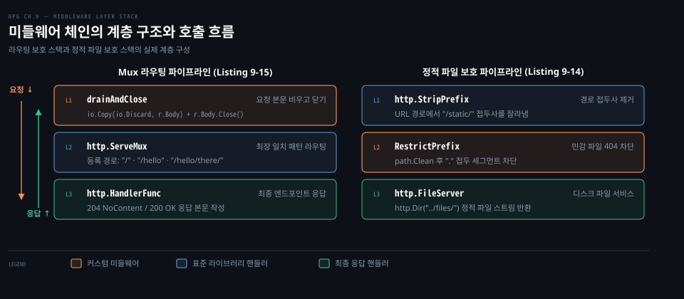
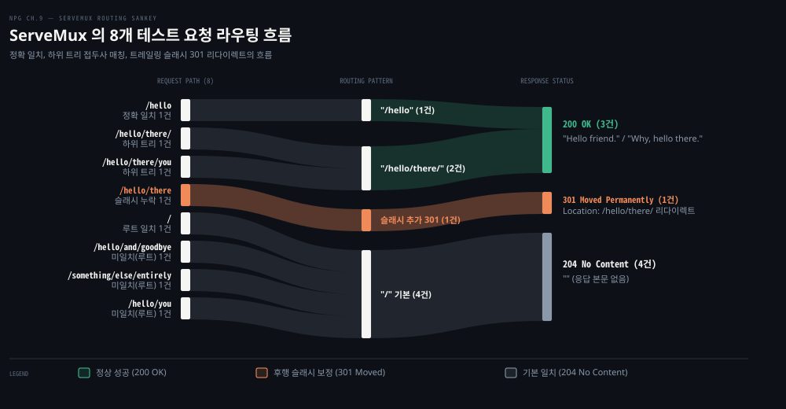
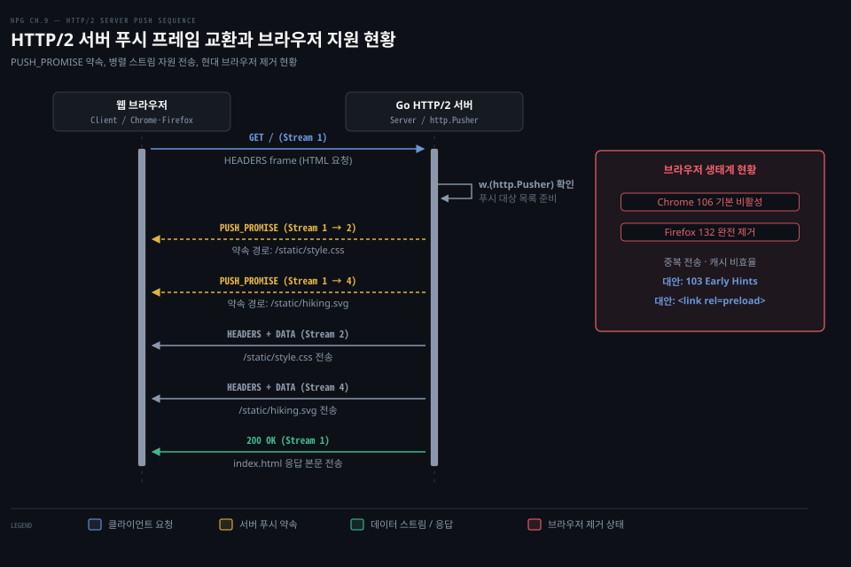

# 미들웨어는 핸들러를 감싸고 ServeMux 는 경로를 나누며 HTTP/2 서버 푸시는 브라우저가 걷어냈다

---

> Go 웹 서버는 핸들러를 감싸는 미들웨어 체인으로 횡단 관심사를 격리하고 ServeMux 로 가장 구체적인 경로를 찾아 분기합니다. 한때 대역폭 단축을 약속했던 HTTP/2 서버 푸시는 복잡성과 캐시 비효율로 브라우저 생태계에서 퇴출되었습니다.

## 핵심 요약

> 이 편이 매달린 하나의 생각은, Go 의 HTTP 요청 파이프라인은 단일 인터페이스를 양파 껍질처럼 감싸는 미들웨어와 접두사 트리로 수렴하지만 프로토콜 차원의 성급한 최적화였던 서버 푸시는 단순한 힌트 메커니즘으로 회귀했다는 점입니다.

미들웨어는 `func(http.Handler) http.Handler` 단일 함수 시그니처로 요청 전처리, 단락, 후처리를 모두 감당합니다. `http.TimeoutHandler` 로 느린 응답을 503 으로 끊고 `RestrictPrefix` 로 숨김 파일을 은닉하며 `drainAndClose` 로 요청 본문을 안전하게 회수합니다.

`http.ServeMux` 는 정확 일치 패턴과 슬래시(`/`)로 끝나는 하위 트리 접두사 패턴을 지원합니다. 후행 슬래시가 누락된 요청은 301 영구 이동으로 안전하게 보정하여 일관된 URL 구조를 유지합니다.

반면 HTTP/2 서버 푸시는 브라우저 요청 전에 자원을 미리 밀어 넣으려 했지만 브라우저 로컬 캐시와의 불일치와 연결 대역폭 경합 문제로 실효성을 잃었습니다. 결국 Chrome 106 기본 비활성화와 Firefox 132 완전 제거로 이어지며 웹 생태계에서 퇴출되었습니다.




## 학습 목표

> 이 편을 읽고 나면 아래 다섯 가지를 스스로 해낼 수 있습니다.

1. `func(http.Handler) http.Handler` 형태의 미들웨어에서 다음 핸들러 호출 전후 작업을 배치하고 조건부로 요청을 조기 차단할 수 있습니다.
2. `http.TimeoutHandler` 가 지정된 시간을 초과한 핸들러에 대해 반환하는 상태 코드와 후속 쓰기 차단 동작을 설명할 수 있습니다.
3. `http.StripPrefix` 와 `RestrictPrefix`, `http.FileServer` 를 조합하여 정적 파일 경로의 숨김 요소를 차단하는 파이프라인을 구성할 수 있습니다.
4. `http.ServeMux` 에서 정확 일치 패턴과 하위 트리 패턴의 라우팅 우선순위를 구분하고 트레일링 슬래시 리다이렉트가 발생하는 이유를 설명할 수 있습니다.
5. `http.Pusher` 를 통한 HTTP/2 서버 푸시의 동작 메커니즘과 현대 브라우저 생태계에서 폐기된 원인 및 대안 기술을 설명할 수 있습니다.


## 1. 미들웨어는 핸들러를 받아 핸들러를 돌려준다

> 미들웨어는 `http.Handler` 를 받아 `http.Handler` 를 반환하는 재사용 함수이며 다음 핸들러를 호출하기 전에 요청을 검증하거나 응답 헤더를 주입하고 필요할 때 직접 응답하여 실행을 단락합니다.

웹 서버에서 인증이나 접근 제어, 로깅, 실행 시간 측정을 핸들러마다 일일이 구현하면 중복 코드가 늘어나고 누락하기 쉬운 문제가 발생합니다. Go 는 이런 공통 횡단 관심사를 격리하기 위해 미들웨어 패턴을 사용합니다. 미들웨어의 기본 모양과 바깥부터 안으로 들어갔다 나오는 실행 순서는 [Learning Go 13-04 §3](../../../01_language/book/lgo_learning-go/13-04.net-http%20는%20타임아웃을%20직접%20정하고%20미들웨어는%20Handler%20를%20감싸며%20slog%20로%20구조화%20로그를%20남깁니다.md) 에서 다루었습니다. Go 표준 라이브러리에서 미들웨어는 별도의 전용 타입을 두지 않고 함수 시그니처 하나로 정의됩니다.

```go
func(http.Handler) http.Handler
```

미들웨어는 다음 핸들러를 실행하기 전에 요청 메서드나 헤더를 검사할 수 있습니다. 허용되지 않은 조건이라면 다음 핸들러를 부르지 않고 오류 응답을 작성하여 실행을 중단합니다. 검사를 통과하면 공통 응답 헤더를 설정한 뒤 `next.ServeHTTP(w, r)` 로 제어를 넘깁니다. 다음 핸들러가 반환된 후에는 경과 시간을 측정하거나 자원을 정리하는 후처리 작업을 수행합니다.

```go
func Middleware(next http.Handler) http.Handler {
	return http.HandlerFunc(
		func(w http.ResponseWriter, r *http.Request) {
			// (1) 허용되지 않은 메서드는 다음 핸들러를 부르지 않고 즉시 차단합니다
			if r.Method == http.MethodTrace {
				http.Error(w, "Method not allowed", http.StatusMethodNotAllowed)
				return
			}

			// (2) 모든 응답에 공통 보안 헤더를 주입합니다
			w.Header().Set("X-Content-Type-Options", "nosniff")

			start := time.Now()
			// (3) 다음 핸들러를 호출합니다
			next.ServeHTTP(w, r)
			// (4) 다음 핸들러 실행이 완료된 후 처리 시간을 기록합니다
			log.Printf("Next handler duration %v", time.Since(start))
		},
	)
}
```

이 예제는 하나의 미들웨어 안에서 검증, 헤더 추가, 로깅을 모두 처리합니다. 하지만 실제 운영 환경에서는 Unix 철학에 따라 단일 책임을 갖는 작은 함수들로 쪼개어 체인 형태로 조립하는 구성이 권장됩니다. 요청 메서드 검증 미들웨어, 보안 헤더 주입 미들웨어, 지표 수집 미들웨어를 각각 독립시켜 필요한 핸들러에만 선택적으로 감싸야 유지보수가 수월해집니다.


## 2. TimeoutHandler 는 느린 클라이언트에게 응답 시간의 끝을 정한다

> 표준 라이브러리의 `http.TimeoutHandler` 는 핸들러 실행이 지정된 제한 시간을 넘기면 503 Service Unavailable 과 안내 메시지를 클라이언트에 반환하고 지연된 핸들러의 후속 쓰기를 차단합니다.

서버 전체에 설정하는 `ReadTimeout` 이나 `WriteTimeout` 은 모든 연결에 일괄 적용됩니다. 대용량 파일 스트리밍처럼 시간이 오래 걸리는 엔드포인트와 빠른 응답이 필수인 API 엔드포인트가 공존할 때는 서버 수준의 타임아웃만으로 대응하기 어렵습니다. 핸들러 단위로 정밀한 시간 한도를 부여할 때는 [`http.TimeoutHandler`](https://pkg.go.dev/net/http#TimeoutHandler) 미들웨어를 적용합니다.

```go
func TestTimeoutMiddleware(t *testing.T) {
	// (1) 1초 제한 시간과 503 반환 메시지를 설정하여 핸들러를 감쌉니다
	handler := http.TimeoutHandler(
		http.HandlerFunc(func(w http.ResponseWriter, r *http.Request) {
			w.WriteHeader(http.StatusNoContent)
			// (2) 1분 동안 잠들어 응답 지연 상황을 유도합니다
			time.Sleep(time.Minute)
		}),
		time.Second,
		"Timed out while reading response",
	)

	r := httptest.NewRequest(http.MethodGet, "http://test/", nil)
	w := httptest.NewRecorder()
	handler.ServeHTTP(w, r)

	resp := w.Result()
	// (3) 제한 시간이 초과되면 503 Service Unavailable 상태 코드가 돌아옵니다
	if resp.StatusCode != http.StatusServiceUnavailable {
		t.Fatalf("unexpected status code: %q", resp.Status)
	}

	b, err := io.ReadAll(resp.Body)
	if err != nil {
		t.Fatal(err)
	}
	_ = resp.Body.Close()

	// (4) 응답 본문에는 지정한 타임아웃 메시지가 담깁니다
	if actual := string(b); actual != "Timed out while reading response" {
		t.Logf("unexpected body: %q", actual)
	}
}
```

내부 핸들러는 1분 동안 잠들지만 http.TimeoutHandler 가 1초의 시간 한도를 감시합니다. 1초가 경과하면 `TimeoutHandler` 가 응답 제어권을 회수하여 클라이언트에게 즉시 503 상태 코드와 지정된 문자열을 돌려보냅니다.

타임아웃이 발생한 뒤 내부 핸들러의 잠이 깨어 뒤늦게 `ResponseWriter` 에 쓰기를 시도하면 `http.ErrHandlerTimeout` 오류가 반환됩니다. 이미 클라이언트에게 503 응답이 나간 상태이므로 뒤늦은 데이터 쓰기가 안전하게 차단됩니다.


## 3. 접두어로 민감한 파일을 가린다

> `http.FileServer` 는 디렉터리 내의 모든 파일에 접근을 허용하므로, 경로 조각을 검사하는 `RestrictPrefix` 미들웨어와 `http.StripPrefix` 를 엮어 숨김 파일 노출을 차단합니다.

Unix 계열 운영체제는 마침표(`.`)로 시작하는 파일과 디렉터리를 설정이나 기밀 정보로 취급하고 숨깁니다. 하지만 Go 의 `http.FileServer` 는 파일시스템의 모든 파일을 그대로 제공하므로 숨김 파일이나 상위 디렉터리 탐색을 기본적으로 가리지 않습니다.

이 위험을 방지하기 위해 URL 경로 세그먼트를 검사하는 `RestrictPrefix` 미들웨어를 작성합니다.

```go
func RestrictPrefix(prefix string, next http.Handler) http.Handler {
	return http.HandlerFunc(
		func(w http.ResponseWriter, r *http.Request) {
			// (1) 경로를 정규화하고 슬래시 단위로 분리하여 각 요소를 검사합니다
			for _, p := range strings.Split(path.Clean(r.URL.Path), "/") {
				if strings.HasPrefix(p, prefix) {
					// (2) 제한된 접두사로 시작하는 세그먼트가 발견되면 404 로 차단합니다
					http.Error(w, "Not Found", http.StatusNotFound)
					return
				}
			}
			// (3) 검사를 통과한 안전한 경로만 파일 서버로 넘깁니다
			next.ServeHTTP(w, r)
		},
	)
}
```

`path.Clean` 으로 경로를 정규화하여 `../` 같은 상대 경로 조작을 걷어낸 뒤 각 경로 요소를 검사합니다. 금지된 접두사가 발견되면 403 Forbidden 대신 404 Not Found 를 반환합니다. 공격자에게 해당 파일이 실제로 존재하는지조차 알려주지 않는 것이 보안상 바람직하기 때문입니다.

이 미들웨어는 정적 자원 라우팅에서 `http.StripPrefix` 와 `http.FileServer` 사이에 배치됩니다.

```go
func TestRestrictPrefix(t *testing.T) {
	// (1) URL 접두사 /static/ 을 잘라내고 . 접두사를 막은 뒤 파일 서버로 연결합니다
	handler := http.StripPrefix(
		"/static/",
		RestrictPrefix(
			".",
			http.FileServer(http.Dir("../files/")),
		),
	)

	testCases := []struct {
		path string
		code int
	}{
		{"http://test/static/sage.svg", http.StatusOK},
		{"http://test/static/.secret", http.StatusNotFound},
		{"http://test/static/.dir/secret", http.StatusNotFound},
	}

	for i, c := range testCases {
		r := httptest.NewRequest(http.MethodGet, c.path, nil)
		w := httptest.NewRecorder()
		handler.ServeHTTP(w, r)

		if actual := w.Result().StatusCode; c.code != actual {
			t.Errorf("%d: expected %d; actual %d", i, c.code, actual)
		}
	}
}
```

클라이언트가 `/static/sage.svg` 를 요청하면 `http.StripPrefix` 가 앞부분을 잘라내어 경로를 `sage.svg` 로 바꿉니다. `RestrictPrefix` 는 접두사 마침표가 없음을 확인하고 요청을 통과시키며 `http.FileServer` 가 실제 파일을 찾아 200 OK 로 응답합니다.

반면 `/static/.secret` 과 `/static/.dir/secret` 은 각각 파일명과 디렉터리 세그먼트에 `.` 접두사가 포함되어 있습니다. `RestrictPrefix` 가 파일 서버에 닿기도 전에 즉시 404 오류를 반환하여 기밀 파일 접근을 원천 봉쇄합니다.


## 4. ServeMux 는 가장 구체적인 패턴으로 보낸다

> `http.ServeMux` 는 등록된 경로 중 가장 긴 일치 패턴을 선택하며 슬래시로 끝나는 하위 트리 패턴에 슬래시 없이 접근한 요청은 301 영구 이동으로 정규화합니다.

웹 서비스의 규모가 커지면 엔드포인트가 늘어나면서 서로 다른 요청 URL 을 충돌 없이 분기해야 하는 문제가 생깁니다. Go 의 기본 멀티플렉서인 `http.ServeMux` 는 등록된 패턴 중 요청 URL 과 가장 구체적으로 일치하는 핸들러를 찾아 연결합니다. Go 1.22 의 메서드 및 와일드카드 패턴(`GET /items/{id}`)과 우선순위 충돌 규칙은 [`http.ServeMux` 공식 문서](https://pkg.go.dev/net/http#ServeMux)와 [Learning Go 13-04 §2](../../../01_language/book/lgo_learning-go/13-04.net-http%20는%20타임아웃을%20직접%20정하고%20미들웨어는%20Handler%20를%20감싸며%20slog%20로%20구조화%20로그를%20남깁니다.md)에 상세히 정리되어 있습니다.

`ServeMux` 경로 매칭의 근본 원칙은 정확 일치와 하위 트리 매칭의 구분입니다.

- **정확 일치 패턴**: 슬래시 없이 끝나는 경로(예: `/hello`)는 오직 그 경로와 완전히 일치할 때만 선택됩니다. `/hello/there` 나 `/hello/you` 에는 일치하지 않습니다.
- **하위 트리 패턴**: 슬래시로 끝나는 경로(예: `/hello/there/`)는 해당 경로로 시작하는 모든 하위 경로를 포괄합니다. 등록된 패턴 중 접두사가 가장 긴 핸들러가 우선권을 갖습니다.
- **기본 루트 패턴**: 단일 슬래시(`/`)는 모든 요청의 최후 보루 역할을 맡아, 다른 어떤 패턴에도 일치하지 않는 요청을 모두 흡수합니다.

클라이언트가 하위 트리 패턴의 루트 경로를 슬래시 없이(예: `/hello/there`) 요청하면 특수한 동작이 일어납니다. 일치하는 정확 경로가 없다면 `ServeMux` 는 끝에 슬래시를 덧붙여 `/hello/there/` 패턴이 등록되어 있는지 확인합니다. 등록되어 있다면 클라이언트에게 `301 Moved Permanently` 응답과 함께 새 경로 링크를 전송하여 URL 정규화를 유도합니다.

요청 본문을 안전하게 정리하기 위해 멀티플렉서 전체를 감싸는 `drainAndClose` 미들웨어를 함께 배치합니다. 핸들러가 요청 본문을 끝까지 읽지 않고 종료하면 연결 재사용이 불가능해지거나 자원이 누수될 수 있으므로, 미들웨어에서 남은 본문을 비우고 닫습니다.

```go
func drainAndClose(next http.Handler) http.Handler {
	return http.HandlerFunc(
		func(w http.ResponseWriter, r *http.Request) {
			// (1) 다음 핸들러를 먼저 호출합니다
			next.ServeHTTP(w, r)
			// (2) 핸들러가 미처 읽지 않은 요청 본문을 버리고 닫습니다
			_, _ = io.Copy(io.Discard, r.Body)
			_ = r.Body.Close()
		},
	)
}

func TestSimpleMux(t *testing.T) {
	serveMux := http.NewServeMux()
	// (1) 루트 기본 경로: 다른 곳에 맞지 않으면 204 No Content
	serveMux.HandleFunc("/", func(w http.ResponseWriter, r *http.Request) {
		w.WriteHeader(http.StatusNoContent)
	})
	// (2) 정확 일치 경로: /hello 에만 200 OK
	serveMux.HandleFunc("/hello", func(w http.ResponseWriter, r *http.Request) {
		_, _ = fmt.Fprint(w, "Hello friend.")
	})
	// (3) 하위 트리 경로: /hello/there/ 하위 요청에 200 OK
	serveMux.HandleFunc("/hello/there/", func(w http.ResponseWriter, r *http.Request) {
		_, _ = fmt.Fprint(w, "Why, hello there.")
	})
	mux := drainAndClose(serveMux)

	testCases := []struct {
		path     string
		response string
		code     int
	}{
		{"http://test/", "", http.StatusNoContent},
		{"http://test/hello", "Hello friend.", http.StatusOK},
		{"http://test/hello/there/", "Why, hello there.", http.StatusOK},
		{"http://test/hello/there",
			"<a href=\"/hello/there/\">Moved Permanently</a>.\n\n",
			http.StatusMovedPermanently},
		{"http://test/hello/there/you", "Why, hello there.", http.StatusOK},
		{"http://test/hello/and/goodbye", "", http.StatusNoContent},
		{"http://test/something/else/entirely", "", http.StatusNoContent},
		{"http://test/hello/you", "", http.StatusNoContent},
	}

	for i, c := range testCases {
		r := httptest.NewRequest(http.MethodGet, c.path, nil)
		w := httptest.NewRecorder()
		mux.ServeHTTP(w, r)
		resp := w.Result()

		if actual := resp.StatusCode; c.code != actual {
			t.Errorf("%d: expected code %d; actual %d", i, c.code, actual)
		}

		b, err := io.ReadAll(resp.Body)
		if err != nil {
			t.Fatal(err)
		}
		_ = resp.Body.Close()

		if actual := string(b); c.response != actual {
			t.Errorf("%d: expected response %q; actual %q", i, c.response, actual)
		}
	}
}
```

이 테스트를 로컬 go1.25.1 환경에서 직접 실행하여 8개 경로의 라우팅 매칭 결과를 확인했습니다. 8개 테스트 케이스가 모두 정상 통과했으며 각 경로의 상태 코드와 본문은 다음과 같이 확정됩니다.

- `http://test/` 는 기본 경로 `/` 에 일치하여 204 No Content 를 돌려받습니다.
- `http://test/hello` 는 정확 일치 패턴 `/hello` 에 맞아 `"Hello friend."` 본문과 200 OK 를 받습니다.
- `http://test/hello/there/` 는 하위 트리 패턴 `/hello/there/` 에 일치하여 200 OK 를 받습니다.
- `http://test/hello/there` 는 정확 일치가 없어 끝에 슬래시를 붙여 매칭된 결과 301 Moved Permanently 로 리다이렉트됩니다.
- `http://test/hello/there/you` 는 하위 트리 패턴의 접두사와 일치하여 200 OK 를 받습니다.
- `http://test/hello/and/goodbye` 와 `http://test/hello/you` 는 `/hello` 가 하위 트리가 아닌 정확 패턴이므로 일치하지 않고 기본 루트 `/` 로 흡수되어 204 No Content 를 받습니다.
- `http://test/something/else/entirely` 역시 등록된 패턴이 없으므로 기본 루트 `/` 로 흘러가 204 No Content 를 받습니다.




## 5. HTTP/2 서버 푸시는 요청 전에 자원을 보내지만 브라우저가 걷어냈다

> HTTP/2 서버 푸시는 클라이언트의 추가 왕복을 줄이려 도입되었으나 브라우저 캐시 중복과 대역폭 낭비 문제로 인해 Chrome 106 에서 기본 비활성화되고 Firefox 132 에서 완전히 제거되었습니다.

웹 페이지를 처음 로드할 때 브라우저는 HTML 을 먼저 받아 파싱한 뒤에야 필요한 CSS 와 이미지를 파악하므로, 추가 왕복 지연이 발생하는 성능 문제가 생깁니다. HTTP/2 서버 푸시는 이 지연을 줄이기 위해 고안되었습니다. HTTP/2 의 바이너리 프레이밍과 다중화 원리는 [컴퓨터 네트워킹: 하향식 접근 02-02 §6](../cntd_computer-networking-top-down/02-02.웹은%20어떻게%20주고받는가.md) 에 기술되어 있습니다. 하나의 TCP 연결 위에서 여러 독립 스트림이 프레임 단위로 교차 전송됩니다.

서버 푸시는 이 다중화 특성을 활용하여 왕복 시간을 줄이려 한 시도였습니다. 클라이언트가 웹 페이지의 HTML 을 요청하면, 서버는 브라우저가 HTML 을 파싱한 뒤 CSS 나 이미지를 다시 요청할 것임을 미리 알고 있습니다. 서버가 그 자원들을 요청받기도 전에 선제적으로 전송하면 클라이언트가 별도의 GET 요청을 보내는 1 RTT 의 지연을 아낄 수 있다고 보았습니다.

Go 표준 라이브러리는 `http.ResponseWriter` 가 [`http.Pusher`](https://pkg.go.dev/net/http#Pusher) 인터페이스를 만족하는지 검사하여 서버 푸시를 실행합니다.

```go
type Pusher interface {
	Push(target string, opts *PushOptions) error
}
```

서버 핸들러에서 타입 단언으로 지원 여부를 확인한 뒤 연관 자원을 푸시합니다.

```go
mux.Handle("/",
	handlers.Methods{
		http.MethodGet: http.HandlerFunc(
			func(w http.ResponseWriter, r *http.Request) {
				// (1) ResponseWriter 가 Pusher 인터페이스를 지원하는지 확인합니다
				if pusher, ok := w.(http.Pusher); ok {
					targets := []string{
						"/static/style.css",
						"/static/hiking.svg",
					}
					// (2) HTML 응답을 보내기 전에 연관 정적 자원을 미리 푸시합니다
					for _, target := range targets {
						if err := pusher.Push(target, nil); err != nil {
							log.Printf("%s push failed: %v", target, err)
						}
					}
				}
				// (3) 메인 HTML 파일을 응답합니다
				http.ServeFile(w, r, filepath.Join(files, "index.html"))
			},
		),
	},
)
```

서버는 메인 스트림(스트림 1)을 통해 클라이언트에게 `PUSH_PROMISE` 프레임을 보냅니다. 이 프레임은 "새 스트림(예: 스트림 2)을 열어 `/static/style.css` 를 보낼 테니 중복 요청하지 말라"고 브라우저에게 알립니다. 그 뒤 해당 스트림으로 헤더와 본문 데이터를 실어 나르고 마지막으로 스트림 1 의 `index.html` 본문을 완성합니다.



하지만 서버 푸시는 이론적 기대와 달리 현장에서 심각한 문제를 드러냈습니다.

브라우저는 푸시된 자원을 해당 연결 동안 별도의 푸시 캐시에 보관합니다. 만약 클라이언트가 이전 방문에서 이미 해당 CSS 나 이미지를 로컬 HTTP 캐시에 저장해 두었다면, 서버가 보낸 푸시 데이터는 쓸모없는 중복 전송이 됩니다. 더 큰 문제는 제한된 연결 대역폭을 푸시 데이터가 선점하여 정작 사용자가 즉시 렌더링해야 할 메인 HTML 의 전송이 뒤로 밀리는 성능 역전(regression) 현상이 일어난다는 점입니다.

결국 현대 주요 웹 브라우저는 HTTP/2 서버 푸시를 걷어냈습니다.

- [Chrome 106 공식 블로그](https://developer.chrome.com/blog/removing-push)에 따르면, HTTP/2 사이트 중 서버 푸시를 사용하는 곳은 1.25% (이후 0.7%)에 불과했고 뚜렷한 순 성능 향상 없이 성능 저하를 유발하는 경우가 많아 Chrome 106 부터 서버 푸시가 기본 비활성화되었습니다.
- [Firefox 132 릴리스 노트](https://www.mozilla.org/en-US/firefox/132.0/releasenotes/)는 다양한 웹사이트와의 호환성 문제를 이유로 HTTP/2 Push 지원을 완전히 제거했다고 밝혔고 이 기능은 현재 어떤 주요 브라우저에서도 지원되지 않는다고 명시했습니다.

공식 출처가 서버 푸시의 대안으로 권장하는 표준 기술은 두 가지입니다.

첫째는 **103 Early Hints** ([RFC 8297](https://www.rfc-editor.org/rfc/rfc8297))입니다. 서버가 메인 응답 본문을 준비하는 동안 103 상태 코드와 `Link: </static/style.css>; rel=preload` 헤더를 먼저 전송합니다. 브라우저는 자체 캐시를 확인한 뒤 자원이 없을 때만 능동적으로 요청을 보내므로 불필요한 중복 전송을 원천 차단합니다.

둘째는 HTML 의 **Preload (`<link rel="preload">`)** 태그입니다. 브라우저 렌더링 엔진에게 중요 자원의 다운로드 우선순위를 명시적으로 부여하여 조기 로딩을 유도합니다.


## 면접 대비

> 아래 질문에 답하면서 Go HTTP 서비스의 미들웨어 구성, 라우팅 규칙, 그리고 HTTP/2 서버 푸시의 한계를 설명해 보세요.

1. `func(http.Handler) http.Handler` 형태의 미들웨어에서 다음 핸들러 호출 전과 후에 수행할 수 있는 작업의 차이를 설명하고 조기 반환이 필요한 사례를 들어주세요.
2. `http.TimeoutHandler` 가 동작하는 방식과, 타임아웃 이후 내부 핸들러가 `ResponseWriter` 에 쓰기를 시도할 때 어떤 일이 발생하는지 설명해 주세요.
3. `http.ServeMux` 에서 정확 일치 패턴과 하위 트리 패턴의 매칭 방식 차이를 설명하고 하위 트리 루트에 슬래시 없이 요청했을 때 301 리다이렉트가 발생하는 이유를 말씀해 주세요.
4. HTTP/2 서버 푸시가 당초 의도와 달리 브라우저 생태계에서 퇴출된 기술적 이유와, 이를 대체하는 최신 표준 기술을 설명해 주세요.


## 정답 (자답 후 펼치기)

> 위 §면접 대비의 질문에 먼저 스스로 답한 뒤 읽으세요.

### 정답 1 — 전처리·후처리 분리와 조기 차단

다음 핸들러 호출 전에는 요청 검증, 인증 토큰 파싱, 보안 응답 헤더 설정처럼 핸들러 실행의 전제 조건을 구성합니다. 다음 핸들러가 반환된 후에는 실행 시간 측정, 로깅, 요청 본문 드레인 같은 자원 정리를 수행합니다. 인증 실패나 허용되지 않은 HTTP 메서드 탐지처럼 요청을 더 이상 진행하면 안 되는 경우, 다음 핸들러를 호출하지 않고 `http.Error` 등으로 즉시 응답을 완료하여 실행을 단락합니다.

### 정답 2 — 503 상태 코드 반환과 ErrHandlerTimeout 차단

`http.TimeoutHandler` 는 고루틴과 타이머를 사용하여 내부 핸들러의 실행 시간을 감시합니다. 지정된 시간을 초과하면 클라이언트에게 503 Service Unavailable 상태 코드와 설정된 안내 메시지를 즉시 반환합니다. 타임아웃 이후 내부 핸들러가 뒤늦게 `ResponseWriter.Write` 를 호출하면 `http.ErrHandlerTimeout` 오류가 반환되어 이미 종료된 응답에 대한 추가 데이터 오염을 방지합니다.

### 정답 3 — 최장 일치 규칙과 트레일링 슬래시 정규화

슬래시 없이 끝나는 정확 일치 패턴은 해당 경로와 완벽히 동일할 때만 매칭됩니다. 반면 슬래시로 끝나는 하위 트리 패턴은 등록된 패턴을 접두사로 갖는 모든 하위 경로에 매칭되며 가장 구체적인 최장 패턴이 우선권을 갖습니다. 하위 트리 패턴의 루트 경로를 후행 슬래시 없이 요청하면, `ServeMux` 가 끝에 슬래시를 덧붙여 매칭을 확인한 뒤 일관된 URL 표준화를 위해 301 Moved Permanently 로 리다이렉트합니다.

### 정답 4 — 브라우저 캐시 불일치·대역폭 낭비와 103 Early Hints

서버 푸시는 클라이언트의 로컬 캐시 상태를 서버가 알지 못하여 이미 캐시된 자원까지 중복 전송하는 문제를 낳았습니다. 이로 인해 정작 급한 메인 HTML 응답의 대역폭을 잠식하여 렌더링 성능이 저하되었고 Chrome 106 기본 비활성화와 Firefox 132 완전 제거로 이어졌습니다. 현재는 서버가 캐시 확인 권한을 브라우저에 남겨둔 채 조기 힌트만 제공하는 `103 Early Hints` 와 HTML `<link rel="preload">` 가 공식 표준 대안으로 사용됩니다.


## 참고 자료

- 《Network Programming with Go》 Adam Woodbeck, 2021. ISBN 978-1-7185-0088-4. Chapter 9 Building HTTP Services (Listing 9-11~9-20).
- [Go 표준 패키지 net/http 문서](https://pkg.go.dev/net/http): `Handler`, `TimeoutHandler`, `ServeMux`, `Pusher` 인터페이스 명세.
- [Chrome for Developers: Remove HTTP/2 Server Push from Chrome](https://developer.chrome.com/blog/removing-push): Chrome 106 서버 푸시 기본 비활성화 배경 및 실측 데이터.
- [Mozilla Firefox 132.0 Release Notes](https://www.mozilla.org/en-US/firefox/132.0/releasenotes/): Firefox 132 HTTP/2 Push 완전 제거 명세.
- [RFC 8297: An HTTP Status Code for Indicating Hints](https://www.rfc-editor.org/rfc/rfc8297): 103 Early Hints 표준 규격.


## 관련 문서

- [09-01 Go HTTP 서버는 타임아웃을 정하고 핸들러에 의존성을 주입하며 httptest 로 시험한다](./09-01.Go%20HTTP%20서버는%20타임아웃을%20정하고%20핸들러에%20의존성을%20주입하며%20httptest%20로%20시험한다.md): 서버 생성, 의존성 주입 핸들러, httptest 단위 테스트 기본 구조를 다룹니다.
- [08-02 Go HTTP 클라이언트는 응답 본문을 닫아야 연결을 재사용하고 context 로 요청을 끊는다](./08-02.Go%20HTTP%20클라이언트는%20응답%20본문을%20닫아야%20연결을%20재사용하고%20context%20로%20요청을%20끊는다.md): 클라이언트 수준의 연결 재사용과 context 취소 패턴을 다룹니다.
- [Learning Go 13-04 net/http 는 타임아웃을 직접 정하고 미들웨어는 Handler 를 감싸며 slog 로 구조화 로그를 남깁니다](../../../01_language/book/lgo_learning-go/13-04.net-http%20는%20타임아웃을%20직접%20정하고%20미들웨어는%20Handler%20를%20감싸며%20slog%20로%20구조화%20로그를%20남깁니다.md): ServeMux 의 Go 1.22 와일드카드 패턴과 미들웨어 양파 구조를 정리합니다.
- [컴퓨터 네트워킹: 하향식 접근 02-02 웹은 어떻게 주고받는가](../cntd_computer-networking-top-down/02-02.웹은%20어떻게%20주고받는가.md): HTTP/2 바이너리 프레이밍과 다중화 스트림의 네트워크 계층 원리를 다룹니다.
- [Network Programming with Go 정독 인덱스](./README.md): 전체 챕터 구성과 학습 진행 상황.
