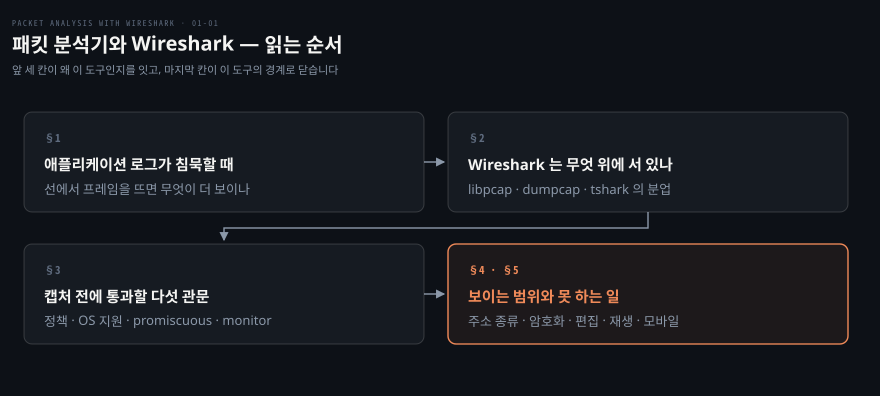
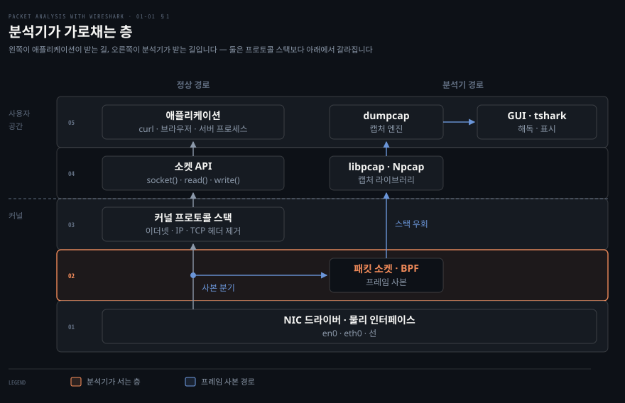
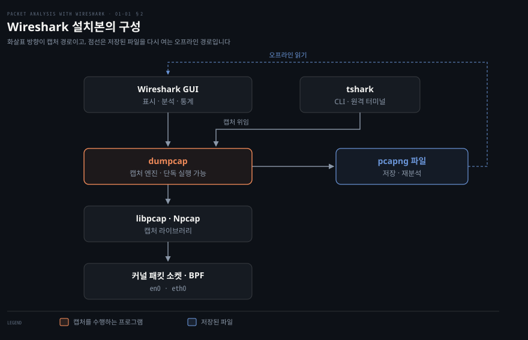
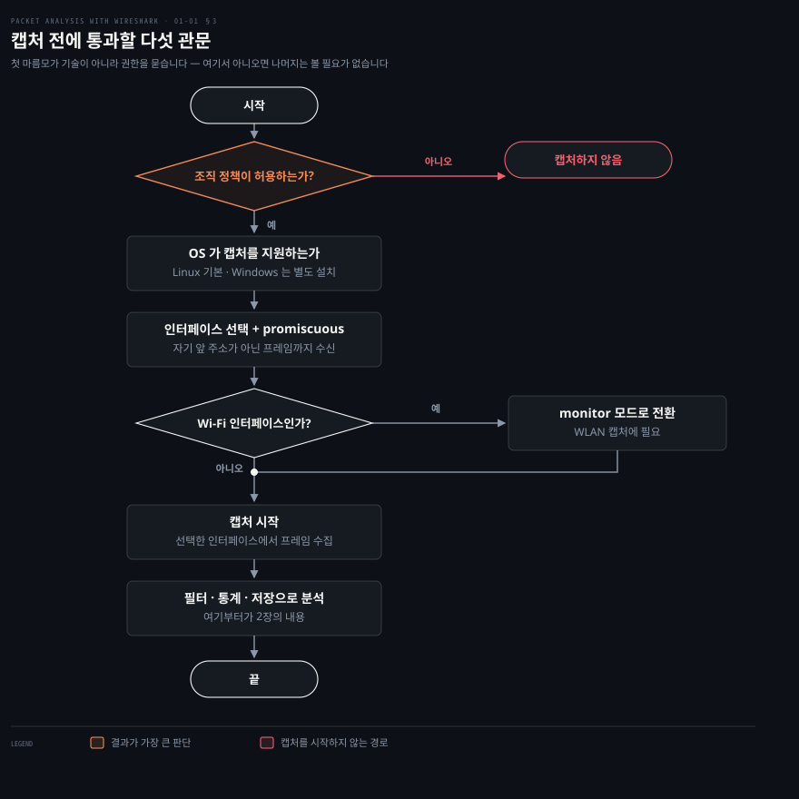

# 패킷 분석기와 Wireshark

---

> 1장은 Wireshark 사용법을 가르치기 전에 왜 이 부류의 도구가 따로 있어야 하는지를 먼저 답합니다. 애플리케이션을 거치지 않고 선에서 원본 프레임을 뜬다는 한 문장이 이 장 전체를 지탱하고, 나머지는 그 문장이 요구하는 것들 — 어느 층에 서야 하는지, 무엇을 설치해야 하는지, 무엇을 먼저 허락받아야 하는지 — 을 채웁니다.

## 핵심 요약

> 이 편이 매달린 하나의 생각은 **패킷 분석기가 애플리케이션 아래 층에서 프레임 사본을 가로채기 때문에, 애플리케이션이 아무 말도 해 주지 않는 문제까지 볼 수 있다**는 것입니다.

원문은 분석기를 "패킷 스니퍼" 또는 "네트워크 프로토콜 분석기"라고도 부른다고 적으면서, 그 능력을 한 문장으로 못박습니다. 유선·무선·블루투스·VLAN·PPP 를 비롯한 여러 네트워크 종류에서 원본 패킷을 잡아내되 "애플리케이션에 의해 처리되지 않은 채"로 잡는다는 것입니다. 이 단서절이 핵심입니다. 애플리케이션이 손대기 전의 바이트를 보기 때문에, 애플리케이션이 잘못 해석했거나 아예 받지 못한 것까지 드러납니다.

Wireshark 는 그 원본 프레임을 `libpcap` 으로 가져와 프로토콜별로 해독해 보여줍니다. 다만 설치본은 프로그램 하나가 아닙니다. 화면을 그리는 GUI, 터미널용 `tshark`, 그리고 캡처 자체를 맡는 `dumpcap` 이 역할을 나눠 갖습니다.

그리고 이 도구는 기술적 준비보다 먼저 통과해야 할 관문이 있습니다. 원문이 캡처 절차 다섯 단계 중 첫 자리에 둔 것은 인터페이스 선택도 드라이버 설치도 아니라 "조직 정책이 허용하는지 확인하라"입니다. 남의 트래픽을 보는 도구이므로 권한 문제가 기술 문제보다 앞선다는 순서입니다.


## 학습 목표

> 이 편을 읽고 나면 아래 다섯 가지를 스스로 해낼 수 있습니다.

1. 패킷 분석기가 네트워크 스택의 어느 층에서 동작하고, 그 위치 때문에 애플리케이션 로그로는 못 보는 무엇을 볼 수 있는지 설명할 수 있습니다.
2. 네트워크 관리자·보안 담당자·프로토콜 개발자가 같은 도구를 서로 다른 목적으로 쓰는 방식을 구분해 말할 수 있습니다.
3. Wireshark GUI·`tshark`·`dumpcap`·`libpcap` 이 각각 무엇을 맡는지, 캡처를 실제로 수행하는 것이 무엇인지 설명할 수 있습니다.
4. 캡처를 시작하기 전에 확인할 다섯 가지를 순서대로 짚고, promiscuous 모드와 monitor 모드가 왜 다른 관문인지 구분할 수 있습니다.
5. Wireshark 가 하지 않는 일(패킷 편집·재생·모바일 직접 캡처)을 지목하고, 그 자리를 어떤 도구가 메우는지 고를 수 있습니다.

아래는 이 편 전체를 네 물음의 순서로 이은 지도입니다. 왜 이 도구인가, 무엇으로 이루어졌나, 쓰기 전에 무엇을 확인하나, 어디까지가 경계인가입니다. 칸 옆의 절 번호가 본문에서 그 부분을 다루는 곳입니다.




## 1. 애플리케이션 로그가 침묵할 때

> 애플리케이션 로그는 애플리케이션이 받은 것만 말해 줍니다. 받지 못한 것과 받았지만 다르게 해석한 것은 그 아래 층에서 프레임을 직접 떠야 보입니다.



위 그림의 다섯 층 가운데 분석기가 서는 곳은 아래에서 두 번째, 커널의 패킷 소켓 층입니다. 그 위의 프로토콜 스택은 이더넷 헤더와 IP 헤더를 벗겨 내고 페이로드만 소켓 API 로 올려 보내므로, 애플리케이션에는 이미 여러 겹이 사라진 뒤의 데이터만 도착합니다.

### 여기서 막힙니다

장애 조사가 멈추는 지점은 대체로 비슷합니다. 애플리케이션 로그에는 타임아웃 한 줄만 남아 있고, 상대 서버의 로그에는 그 요청이 아예 찍히지 않았습니다. 두 로그를 아무리 겹쳐 봐도 요청이 나갔는지, 나갔는데 중간에서 버려졌는지, 도착했는데 응답이 안 돌아왔는지를 가를 수 없습니다. 양쪽 애플리케이션이 모두 "나는 모른다"고 말하는 상태이기 때문입니다.

### 그래서 아래 층을 봅니다

이 물음에 답하려면 애플리케이션이 아니라 선을 봐야 합니다. 원문의 표현으로는 "애플리케이션에 의해 처리되지 않은" 원본 패킷을 잡는 일입니다. SYN 이 나갔는지, 나갔다면 SYN-ACK 이 돌아왔는지, RST 가 어느 쪽에서 왔는지는 프레임에 그대로 남아 있습니다. 애플리케이션이 침묵해도 선은 침묵하지 않습니다.

그 자리에 설 수 있는 이유는 커널이 패킷 소켓이라는 별도의 통로를 열어 두기 때문입니다. 원문도 캡처 전 확인 사항에서 "Linux 는 패킷 소켓 지원이 커널에 기본으로 활성화되어 있다"고 적습니다. 프로토콜 스택으로 올라가는 정상 경로와 별개로, 프레임 사본을 그대로 받아 가는 경로가 하나 더 있는 셈입니다.

### 같은 도구, 네 가지 목적

원문은 분석기의 쓰임을 네 부류로 나눕니다. 도구는 하나인데 보는 대상이 다릅니다.

| 누가 | 무엇을 하는가 | 무엇을 보는가 |
|------|--------------|--------------|
| 네트워크 관리자 | 네트워크 문제를 진단합니다 | 재전송·지연·경로 이상 |
| 보안 설계자 | 패킷 단위로 보안 감사를 수행합니다 | 평문 노출·비정상 흐름 |
| 프로토콜 개발자 | 프로토콜 관련 문제를 진단하거나 학습합니다 | 실제 바이트와 명세의 차이 |
| 화이트햇 해커 | 블랙햇보다 먼저 애플리케이션의 취약점을 찾아 고칩니다 | 공격에 쓰일 수 있는 응답 |

원문은 이 넷이 전부가 아니며 이 분야에서 새 도구와 시도가 계속 나오고 있다고 덧붙입니다. 목록을 닫힌 분류로 읽지 말라는 단서입니다.


## 2. Wireshark 는 무엇 위에 서 있나

> Wireshark 설치본은 프로그램 하나가 아니라 역할을 나눠 가진 여러 실행 파일입니다. 화면을 그리는 쪽과 실제로 프레임을 잡는 쪽이 갈라져 있습니다.



### 아이콘 하나 뒤에 무엇이 있는지 모르면 막히는 자리

Wireshark 를 설치하면 아이콘 하나가 생깁니다. 그래서 "GUI 프로그램 하나"로 보이지만, 원격 서버에 붙어 캡처를 떠야 하는 순간 이 인식이 깨집니다. 화면이 없는 곳에서는 무엇을 실행해야 하는지, 캡처만 하고 분석은 노트북으로 가져와 하려면 무엇이 필요한지가 곧장 문제가 됩니다.

### 앞단과 캡처 엔진이 갈라져 있습니다

원문은 설치본이 `dumpcap` 과 `tshark` 같은 명령줄 도구를 함께 제공한다고 적고, 그 관계를 이렇게 정리합니다. **Wireshark 와 `tshark` 는 트래픽을 잡을 때 `dumpcap` 에 기댑니다. 더 고급 기능은 `tshark` 가 수행합니다. 그리고 `dumpcap` 은 그 자체로 단독 실행할 수 있습니다.** `tshark` 는 Wireshark 의 명령줄 판이라 원격 터미널에서 쓸 수 있습니다.

이 분업이 실무에서 갖는 뜻은 분명합니다. 캡처만 필요한 자리에는 가장 작은 프로그램 하나만 두면 됩니다. `dumpcap` 은 그 자체로 네트워크 트래픽 덤프 도구이고, 잡은 패킷을 파일로 씁니다.[^dumpcap-man] 파일로 남긴 다음에는 어디서 열든 상관없습니다.

> **노트의 읽기**: 원문은 "Wireshark 와 tshark 가 dumpcap 에 기댄다"고 단정하지만, 공식 man page 에는 그 의존 관계가 직접 적혀 있지 않습니다. 다만 `tshark` man page 의 `-F` 항목이 "라이브 캡처의 경우 `dumpcap`(1) 이 지원하는 파일 형식만 지정할 수 있다"고 적어, 라이브 캡처를 `dumpcap` 이 담당한다는 사실을 간접으로 드러냅니다.[^tshark-man] 이 노트는 원문의 서술을 그대로 옮기되, 근거의 강도가 다르다는 점을 남겨 둡니다.

### 온라인과 오프라인

원문은 Wireshark 가 `libpcap` 을 써서 패킷을 잡는다고 적고, 그 결과 두 가지 모드가 생긴다고 설명합니다. 잡아 둔 패킷을 열어 보는 오프라인 모드와, 살아 있는 트래픽을 잡아 화면에 바로 뿌리는 온라인 모드입니다. 그림의 점선이 오프라인 경로입니다. 한 번 파일로 남긴 캡처는 캡처한 장비와 분석하는 장비가 달라도 됩니다.

### 원문이 꼽은 기능 여덟

원문은 Wireshark 의 내장 기능을 여덟 가지로 나열합니다.

- UNIX 와 Windows 양쪽에서 쓸 수 있습니다.
- 여러 종류의 인터페이스에서 라이브 패킷을 잡을 수 있습니다.
- 다양한 기준으로 패킷을 걸러 냅니다.
- 큰 규모의 프로토콜 집합을 해독할 수 있습니다.
- 잡은 패킷을 저장하고 병합할 수 있습니다.
- 여러 가지 통계를 만들 수 있습니다.
- GUI 와 명령줄 인터페이스를 함께 제공합니다.
- 활발한 커뮤니티가 뒷받침합니다.

같은 절의 도해는 여기에 세 가지를 더 얹습니다. GNU 오픈소스 소프트웨어라는 점, 사용자 정의 프로토콜을 직접 작성하는 플러그인 기능, 그리고 조건에 따라 패킷에 색을 입히는 컬러링 규칙입니다. 컬러링 규칙은 2장에서 다시 나옵니다.


## 3. 캡처를 시작하기 전에 통과할 다섯 관문

> 원문이 캡처 절차의 첫 자리에 둔 것은 기술 확인이 아니라 권한 확인입니다. 남의 트래픽이 지나가는 선에 계측기를 대는 일이기 때문입니다.



### Start 를 누르기 전에 걸리는 것들

인터페이스를 고르고 시작 버튼을 누르면 될 것 같습니다. 실제로는 그 앞에서 막히는 경우가 더 많습니다. 자주 나오는 증상이 셋입니다.

- 권한이 없어 인터페이스 목록 자체가 비어 있습니다.
- 목록은 보이는데 자기 장비가 주고받는 패킷만 잡힙니다.
- Wi-Fi 인데 다른 단말의 프레임이 하나도 안 잡힙니다.

세 증상은 원인이 서로 다릅니다. 원문의 다섯 단계가 그 원인들을 순서대로 걸러 냅니다.

### 첫째, 허락받았는지 확인합니다

원문의 1번은 "하려는 일이 허용되는지 확인하라. 패킷을 잡기 전에 회사 정책을 확인하라"입니다. 기술적 조건이 아니라 조직의 규칙이 첫 관문입니다.

앞선 문단에서 원문은 그 이유를 밝힙니다. 사용자는 Wireshark 가 어디에 설치되어 있는지 알아야 하고, TAP(Test Access Point) 이나 SPAN(Switch Port Analyzer) 포트에서 캡처를 시작하기 전에 조직 정책을 따라야 한다는 것입니다. TAP 과 SPAN 은 스위치를 지나는 트래픽을 통째로 복사해 주는 장치이므로, 여기에 붙으면 자기 것이 아닌 통신까지 전부 들어옵니다. 원문은 그래서 개발자가 보통은 자기 노트북에 설치해 자기 장비를 드나드는 패킷만 잡는다고 덧붙입니다.

### 둘째, 운영체제가 캡처를 지원해야 합니다

원문의 2번은 운영체제가 패킷 캡처를 지원해야 한다는 조건이고, 두 갈래로 갈립니다. Linux 는 패킷 소켓 지원이 커널에 기본으로 활성화되어 있습니다. Windows 는 WinPcap 을 설치해야 합니다.

> **지금은 다릅니다 (4.6)**: Windows 쪽 드라이버는 WinPcap 이 아니라 **Npcap** 입니다. WinPcap 은 개발이 멈췄고 현행 Wireshark 설치 프로그램이 함께 설치하는 것은 Npcap 입니다. 공식 `dumpcap` man page 도 캡처 라이브러리를 "libpcap 또는 Npcap"으로 적습니다.[^dumpcap-man] Linux 쪽 서술은 그대로 유효합니다.

### 셋째, 인터페이스를 고르고 promiscuous 모드를 켭니다

원문의 3번입니다. promiscuous 모드는 "인터페이스 앞으로 온 것이든 아니든 모든 패킷을 받아들"입니다. 이 모드가 꺼져 있으면 NIC 가 목적지 MAC 주소를 보고 자기 것이 아닌 프레임을 버립니다. 자기 장비가 주고받는 패킷만 잡히는 증상의 원인이 대개 여기입니다.

다만 이 모드를 켠다고 남의 트래픽이 저절로 들어오지는 않습니다. 스위치 환경에서는 스위치가 애초에 다른 포트의 프레임을 이쪽으로 보내지 않기 때문입니다. 그래서 앞 단락의 TAP 과 SPAN 이 필요해집니다. promiscuous 모드는 "온 것을 버리지 않는" 설정이지 "안 오는 것을 오게 하는" 설정이 아닙니다.

### 넷째, Wi-Fi 라면 monitor 모드가 하나 더 있습니다

원문의 4번은 Wi-Fi 인터페이스를 쓴다면 WLAN 캡처를 위해 monitor 모드를 켜라는 조건입니다. promiscuous 모드와 이름이 비슷해 헷갈리지만 층이 다릅니다. 이 축은 6장 WLAN Capturing 에서 본격적으로 다뤄집니다.

### 다섯째, 잡은 다음이 본론입니다

원문의 5번은 캡처를 시작하고 필터·통계·IO·저장 같은 기능으로 분석을 이어 가라는 것입니다. 이 다섯 번째 단계가 2장 전체에 해당합니다.


## 4. Wireshark 가 못 하는 일

> Wireshark 는 선 위의 프레임을 읽는 도구입니다. 만들어 넣거나 다시 흘려보내는 일은 하지 않으므로, 그 자리는 다른 도구가 메웁니다.

### 읽는 도구와 쓰는 도구는 다릅니다

패킷을 볼 수 있으면 고쳐서 다시 보내는 것도 될 듯합니다. 그렇지 않습니다. 재현이 필요한 상황에서 Wireshark 를 열어 놓고 방법을 찾다가 막히게 됩니다. 잡아 둔 트래픽을 테스트 환경에 다시 흘려보내는 일, 헤더 한 필드만 바꿔 서버 반응을 보는 일이 그런 상황입니다.

> **노트의 읽기**: 이 절의 첫 문장은 "Wireshark is a packet analysis tool to use features such as packet editing/replaying, performing MITM, ARPspoof, IDS, and HTTP proxy, and there are other packet analyzer tools available and can be used as well" 입니다. 앞부분만 떼어 읽으면 Wireshark 가 패킷 편집·재생·MITM·IDS 기능을 가진 것처럼 보이지만, 바로 뒤의 표는 그 기능들을 *다른 도구들*의 열로 세우고 Wireshark 를 아예 넣지 않습니다. 문장이 한 번에 두 가지를 말하려다 접속이 엉킨 자리이지 사실을 틀리게 적은 자리는 아닙니다. **표가 이 절의 논지이므로 "그런 기능이 필요하면 다른 도구를 쓴다"로 읽습니다.**

### 원문이 꼽은 대안 도구 일곱

원문은 시장에 나와 있는 주목할 만한 도구를 다섯 가지 기능 축으로 갈라 표로 세웁니다. 아래는 그 표를 그대로 옮긴 것입니다.

| 도구 | 패킷 편집 | 패킷 재생 | ARPspoof/MITM | 비밀번호 스니핑 | 침입 탐지 |
|------|:---:|:---:|:---:|:---:|:---:|
| [WireEdit](https://wireedit.com/) | Y | N | N | N | N |
| [Scapy](http://www.secdev.org/) | Y | Y | Y | Y | N |
| [Ettercap](https://ettercap.github.io/ettercap/) | Y | N | Y | Y | N |
| [Tcpreplay](http://tcpreplay.synfin.net/) | N | Y | N | N | N |
| [Bit-Twist](http://bittwist.sourceforge.net/) | Y | N | N | N | N |
| [Cain](http://www.oxid.it/cain.html) | N | N | Y | Y | N |
| [Snort](https://www.snort.org/) | N | N | N | N | Y |

표를 세로로 읽으면 고르는 기준이 나옵니다. **편집만 필요하면 WireEdit 이나 Bit-Twist, 재생만 필요하면 Tcpreplay, 둘 다에 더해 직접 만들어 쏘는 것까지 필요하면 Scapy 입니다.** 다섯 축을 모두 채우는 도구는 없고, 축을 가장 넓게 덮는 Scapy 도 침입 탐지는 하지 않습니다. Snort 는 반대로 침입 탐지 한 축만 채웁니다.

그러면 왜 Wireshark 가 여전히 기본 도구일까요. 표의 다섯 축이 전부 **패킷을 만들거나 바꾸는** 일이기 때문입니다. 조사의 첫 단계는 대개 만드는 일이 아니라 **이미 일어난 일을 읽는** 일입니다. 그 축에서는 이 표의 어느 도구도 Wireshark 만큼 넓게 프로토콜을 해독하지 않습니다.

도구를 바꾼다고 해석의 부담이 사라지지도 않습니다. Scapy 로 패킷을 만들려면 만들려는 프로토콜을 이미 알고 있어야 합니다. 그 앎은 대개 Wireshark 로 남의 정상 통신을 읽으며 얻습니다.

전제도 서로 다릅니다. Ettercap 과 Cain 은 같은 브로드캐스트 도메인에 있어야 하고, Snort 는 룰셋을 관리하는 운영 부담이 따라옵니다. 성능 수치보다 이런 조건이 실제 선택을 먼저 가릅니다.

### 모바일은 아예 다른 경로입니다

원문은 Wireshark 가 Android·iOS·Windows 같은 모바일 플랫폼에서는 쓸 수 없다고 못박고, 플랫폼별 대체 도구를 제시합니다.

| 플랫폼 | 캡처 도구 |
|--------|----------|
| Windows | Microsoft Network Analyzers |
| iOS | Paros |
| Android | Shark for Root |
| Android | Kismet Android PCAP |

원문이 함께 제시하는 우회 경로가 실무에서는 더 자주 쓰입니다. **노트북에 Wi-Fi 핫스팟을 만들어 휴대폰이 그 Wi-Fi 를 쓰게 하고, 노트북의 Wi-Fi 인터페이스에서 Wireshark 로 트래픽을 잡는 방법입니다.** 단말에 도구를 심지 않아도 되므로 루팅이나 탈옥이 필요 없습니다.

> **노트의 읽기**: 표의 링크는 모두 2015년 시점 주소입니다. 각 도구의 현재 유지보수 상태는 이 노트에서 확인하지 않았으므로, 실제로 쓰기 전에 개별 확인이 필요합니다. Windows 항목의 "Microsoft Network Analyzers"도 원문 표기 그대로이며, 마이크로소프트의 해당 제품군은 이후 이름이 여러 번 바뀌었습니다.


## 심화 학습

> 원문은 2015년판이고 화면은 Wireshark 1.12.6 입니다. 1장에서 판본을 타는 것은 Windows 드라이버 이름 하나뿐이며, 나머지 개념은 현행 4.6 에서도 그대로 성립합니다.

| 원문(1.12, 2015) | 현행(4.6, 2026) | 성격 |
|------------------|-----------------|------|
| Windows 는 WinPcap 설치 | Windows 는 **Npcap** 설치 | 바뀜 — 설치 프로그램이 함께 넣습니다 |
| `libpcap` 으로 캡처 | 그대로. man page 표기는 "libpcap 또는 Npcap"[^dumpcap-man] | 유지 |
| `dumpcap` 은 단독 실행 가능 | 그대로[^dumpcap-man] | 유지 |
| `tshark` 는 Wireshark 의 명령줄 판 | 그대로 | 유지 |
| Linux 패킷 소켓 기본 활성 | 그대로 | 유지 |
| promiscuous 모드 · monitor 모드 | 그대로 | 유지 |

현행 판에서 새로 알아 두면 좋은 것 하나는 인터페이스 목록을 얻는 명령입니다. 원문 2장의 도해는 `ifconfig` 를 제시합니다. 그런데 Wireshark 계열 도구 자체가 자기가 캡처할 수 있는 인터페이스를 나열해 줍니다. `dumpcap -D` 는 캡처 가능한 인터페이스를 번호와 이름으로 출력하며, 그 번호나 이름을 그대로 `-i` 에 넘길 수 있습니다.[^dumpcap-man]

`ifconfig` 보다 나은 지점이 여기입니다. 시스템의 모든 인터페이스가 아니라 **캡처 권한이 실제로 있는 인터페이스**만 나오므로, 권한 문제인지 아닌지가 목록 하나로 갈립니다.

```bash
dumpcap -D          # 캡처 가능한 인터페이스만 번호·이름으로 나열
dumpcap -i 1 -w /tmp/cap.pcapng   # 1번 인터페이스에서 잡아 파일로
```

파일 형식도 바뀌었습니다. 원문은 `.pcap` 을 전제하지만 현행 `dumpcap` 의 기본 출력 형식은 **pcapng** 이고, `.pcap` 으로 쓰려면 `-F` 옵션을 줘야 합니다.[^dumpcap-man]


## 면접 대비

### 한 줄 정의

"패킷 분석기란 애플리케이션이 처리하기 전의 원본 프레임을 커널의 패킷 소켓 층에서 복사해, 프로토콜별로 해독해 보여주는 도구입니다."

### 핵심 포인트 세 가지

1. **동작 층이 능력을 정합니다.** 소켓 API 아래·드라이버 위에서 프레임 사본을 받기 때문에, 애플리케이션 로그가 침묵하는 문제 — 요청이 나갔는지, 어디서 끊겼는지 — 를 가를 수 있습니다.
2. **설치본은 프로그램 여럿입니다.** GUI 와 `tshark` 는 앞단이고 캡처는 `dumpcap` 이 맡습니다. 그래서 화면 없는 서버에서는 `dumpcap` 으로 잡아 파일로 남기고 분석은 다른 곳에서 하는 분업이 가능합니다.
3. **promiscuous 는 버리지 않게 하는 설정입니다.** 안 오는 트래픽을 오게 하지는 않습니다. 스위치 환경에서 남의 트래픽까지 보려면 TAP 이나 SPAN 포트가 따로 필요합니다.

### 자주 묻는 질문

Q: 애플리케이션 로그와 APM 이 있는데 왜 패킷까지 봐야 합니까?
A: 둘은 애플리케이션이 스스로 내보내는 기록이라 애플리케이션이 인지하지 못한 일은 남지 않습니다. 요청이 커널을 떠나기 전에 버려졌거나, 상대가 RST 로 끊었거나, 재전송이 반복되어 지연이 생긴 경우는 프레임에만 흔적이 남습니다.

Q: promiscuous 모드를 켰는데도 다른 장비의 트래픽이 안 보입니다.
A: 그 설정은 NIC 가 자기 MAC 주소가 아닌 프레임을 버리지 않게 할 뿐입니다. 스위치는 애초에 다른 포트의 프레임을 그 포트로 보내지 않습니다. 남의 트래픽까지 보려면 TAP 이나 SPAN 포트가 필요하며, 그 전에 조직 정책 확인이 먼저입니다.

Q: 원격 리눅스 서버에 GUI 가 없는데 어떻게 캡처합니까?
A: `dumpcap` 이나 `tshark` 로 잡아 파일로 남기고, 그 파일을 가져와 Wireshark 로 엽니다. 원문이 말하는 오프라인 모드가 이 경우입니다.


## 핵심 개념 체크리스트

- [ ] 패킷 분석기가 네트워크 스택의 어느 층에 서는지, 그 위치 때문에 무엇을 더 볼 수 있는지 한 문장으로 설명할 수 있습니까?
- [ ] Wireshark GUI·`tshark`·`dumpcap`·`libpcap` 의 역할을 각각 말하고, 캡처를 실제로 수행하는 것이 무엇인지 지목할 수 있습니까?
- [ ] 캡처 전 다섯 단계를 순서대로 말하고, 왜 정책 확인이 첫 자리인지 설명할 수 있습니까?
- [ ] promiscuous 모드와 monitor 모드가 각각 무엇을 바꾸는지, 왜 둘이 별개의 관문인지 구분할 수 있습니까?
- [ ] 패킷을 편집하거나 재생해야 할 때 Wireshark 대신 무엇을 고를지, 그 근거를 댈 수 있습니까?


## 관련 문서

- [02-01 패킷을 잡는 법](./02-01.패킷을 잡는 법.md) — 이 편의 다섯 번째 관문 이후. 인터페이스 선택부터 캡처 필터까지
- [Packet Analysis with Wireshark — 정독 인덱스](./README.md) — 7개 장 전체 지도
- [02_os/networking](../../networking/README.md) — 패킷이 지나가는 길 쪽. 이 책이 계측기를 대는 대상


## 참고 자료

- 원본: 《Packet Analysis with Wireshark》 (Anish Nath, Packt Publishing, 2015) ISBN 978-1-78588-781-9 — Chapter 1. Packet Analyzers
- [Wireshark User's Guide](https://www.wireshark.org/docs/wsug_html_chunked/) — 현행 4.6 기준 공식 문서
- [Wireshark Q&A](https://ask.wireshark.org/) — 원문이 커뮤니티 지원처로 제시하는 곳

[^dumpcap-man]: dumpcap(1) man page — "Dumpcap is a network traffic dump tool. It lets you capture packet data from a live network and write the packets to a file." · "Without any options set it will use the libpcap or Npcap library to capture traffic from the first available network interface" · `-D|--list-interfaces` "Print a list of the interfaces on which Dumpcap can capture, and exit." <https://www.wireshark.org/docs/man-pages/dumpcap.html> (2026-09-05 조회)

[^tshark-man]: tshark(1) man page, `-F` 항목 — "for a live capture, you can only specify a file format supported by dumpcap(1), viz. pcapng or pcap." <https://www.wireshark.org/docs/man-pages/tshark.html> (2026-09-05 조회)
