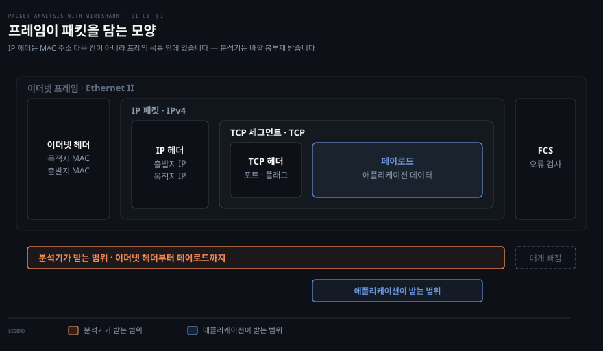
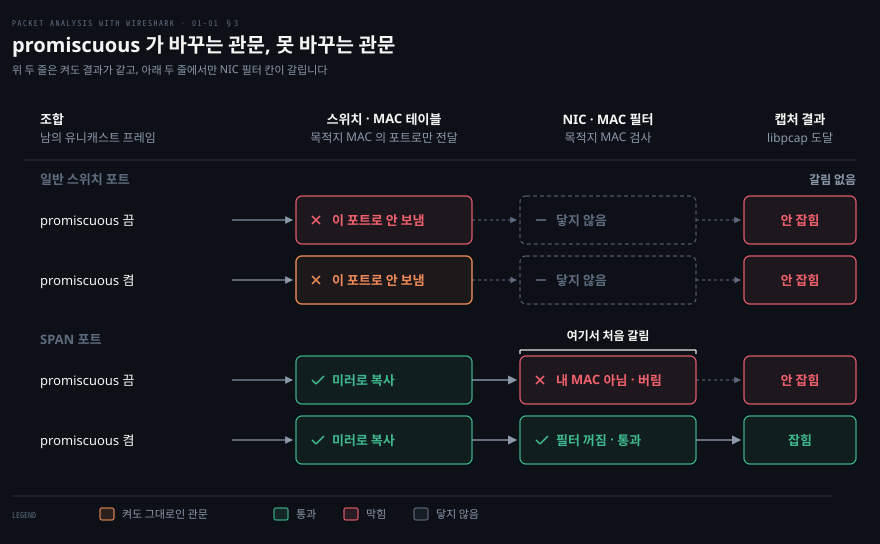
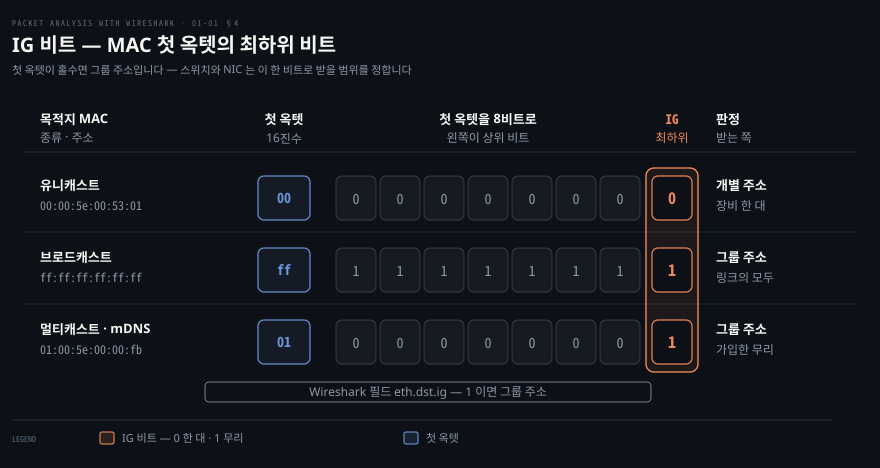
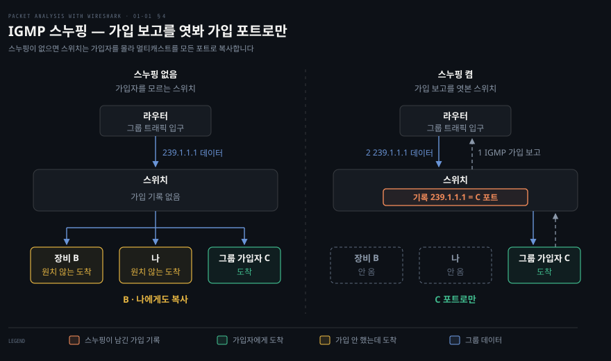
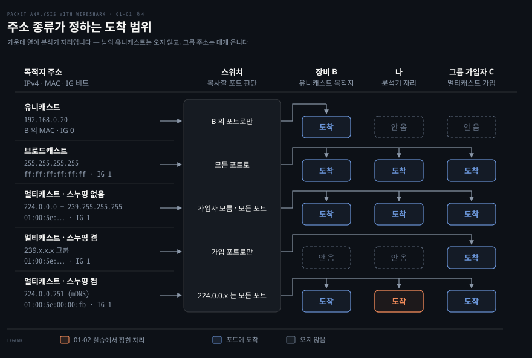

# 패킷 분석기와 Wireshark

---

## 핵심 요약

> 패킷 분석기는 애플리케이션 아래에서 프레임 사본을 받기 때문에, 로그가 말하지 못하는 일을 네트워크 쪽에서 보여 줍니다. 다만 보이는 것은 그 캡처 지점에 도착한 프레임뿐이라, 캡처 하나로 확정되는 사실과 다른 자리를 더 봐야 하는 추정이 갈립니다.

Wireshark 설치본은 역할이 나뉜 여러 프로그램입니다. 캡처는 `dumpcap` 이 `libpcap`(Windows 는 Npcap)을 통해 맡고 해석과 표시는 Wireshark GUI 와 `tshark` 가 맡습니다. 그래서 화면 없는 서버에서 잡아 파일로 남기고 다른 장비에서 읽는 분업이 됩니다.

무엇이 보이는지는 세 가지가 정합니다. 분석기를 어디에 세웠는지, NIC 가 무엇을 받아 올리는지, 내용이 암호화됐는지입니다. 원서가 캡처 절차의 첫 단계로 조직 정책 확인을 둔 것도 이 도구가 자기 것이 아닌 통신까지 볼 수 있기 때문입니다.


## 학습 목표

> 이 편을 읽고 나면 아래 일곱 가지를 설명하고 간단한 상황에 적용할 수 있습니다. 괄호 안이 설명하는 절과 이해 확인 문항입니다.

1. 애플리케이션 로그로는 가를 수 없는 장애를 패킷 분석기가 어떻게 가르는지 설명할 수 있습니다. (§1 · 문항 1)
2. GUI·`tshark`·`dumpcap`·`libpcap`/Npcap 의 역할을 가르고 라이브 캡처와 저장 파일 분석을 서로 다른 장비에 나눠 맡길 수 있습니다. (§2 · 문항 2)
3. 캡처 절차 다섯 단계를 짚고 promiscuous 모드와 monitor 모드를 관찰 대상·적용 환경·지원 조건으로 구분할 수 있습니다. (§3 · 문항 3·4)
4. 캡처 위치와 목적지 주소 종류로 어떤 프레임이 도착하는지 가르고 다른 기기의 mDNS 가 보인 사실에서 어디까지 결론낼 수 있는지 판단할 수 있습니다. (§4 · 문항 5)
5. HTTPS 연결에서 도메인이 보이는 조건과 보이지 않는 조건을 구분할 수 있습니다. (§4 · 문항 6)
6. 캡처에서 확인한 사실과 추가 확인이 필요한 추정을 가르고 다음에 캡처할 위치를 고를 수 있습니다. (§1 · §4 · 문항 7)
7. Wireshark 가 맡지 않는 일(패킷 생성·편집·재생·중간자 시험·탐지)을 목적별로 가를 수 있습니다. (§5 · 문항 8)

이 편에서 새로 만나는 낱말입니다. `어디서` 는 그 낱말이 실제로 설명되는 절입니다.

| 키워드 | 뜻 | 학습 포인트 | 어디서 |
|---|---|---|---|
| 패킷 분석기 (packet analyzer) | 네트워크를 지나는 프레임의 사본을 받아 해석하는 도구 | 패킷 스니퍼라고도 부름 · 앱 로그가 침묵해도 프레임은 남음 | §1 |
| 캡처 지점 (capture point) | 프레임 사본을 떼어 받는 자리 | 그 자리에 도착한 것만 보임 · 한 지점으로 원인을 확정하지 않음 | §1 · §4 |
| 링크 계층 형식 (link-layer header type) | 캡처 파일에 기록되는 바깥 헤더의 종류 | Wi-Fi 를 monitor 모드 없이 잡으면 이더넷 헤더로 기록됨 | §1 |
| `dumpcap` | Wireshark 설치본의 캡처 엔진 | GUI·`tshark` 가 라이브 캡처를 맡김 · 파일을 읽지는 않음 | §2 |
| promiscuous 모드 | 포트에 도착한 남의 프레임도 NIC 가 올리게 하는 설정 | 도착 여부는 못 바꿈 · Wireshark 기본값은 켬 | §3 |
| monitor 모드 | 무선 NIC 가 채널의 802.11 프레임을 헤더째 받는 설정 | Wi-Fi 캡처에 늘 필요한 것은 아님 · 지원은 OS·드라이버마다 다름 | §3 |
| TAP · SPAN | 회선 하나를 복사하는 장치 · 지정한 포트를 복사하는 스위치 기능 | 스위치의 모든 트래픽이 아님 · 쓰기 전에 정책 확인 | §3 |
| IG 비트 (Individual/Group bit) | MAC 첫 옥텟의 최하위 비트 | 0 이면 장비 한 대 · 1 이면 그룹 · `eth.dst.ig` | §4 |
| IGMP 스누핑 | 가입 보고를 엿보는 스위치 기능 | 없으면 멀티캐스트가 모든 포트로 · `224.0.0.x` 는 예외 | §4 |
| mDNS (Multicast DNS) | 서버 없이 링크에서 이름을 묻는 방식 | `224.0.0.251` UDP 5353 · 남의 기기 이름이 보임 | §4 |
| SNI · ECH | ClientHello 에 담는 접속 도메인 · 그 부분까지 암호화하는 TLS 확장 | 표준 TLS 에서는 평문 · ECH 면 바깥에 공개 이름만 | §4 |

아래는 이 편 전체를 네 물음의 순서로 이은 지도입니다. 왜 이 도구인가, 무엇으로 이루어졌나, 쓰기 전에 무엇을 확인하나, 어디까지가 경계인가입니다. 칸 옆의 절 번호가 본문에서 그 부분을 다루는 곳입니다.


## 1. 애플리케이션 로그가 침묵할 때 — 프레임을 떠서 가르는 것

> 애플리케이션 로그는 애플리케이션이 받은 것만 말해 줍니다. 받지 못한 것과 받기 전에 사라진 것은 그 아래에서 프레임 사본을 떠야 가려집니다.

### 풀려는 문제 — 타임아웃 한 줄로는 요청이 어디서 멈췄는지 모릅니다

클라이언트 애플리케이션 로그에 연결 타임아웃이 한 줄 남았고 서버 로그에는 그 요청이 찍히지 않았다고 합시다. 가능성은 셋입니다. 요청이 클라이언트를 떠나지 못한 경우, 중간에서 버려진 경우, 서버에 닿았지만 응답이 돌아오지 못한 경우입니다. 두 로그로는 이 셋을 가르지 못합니다. 연결이 맺어지지 않았으니 양쪽 애플리케이션 모두 그 요청을 받은 적이 없기 때문입니다.

이 편은 이 장애를 공통 사례로 삼아 끝까지 따라갑니다. 클라이언트에서 캡처해 보니 SYN 이 간격을 두고 되풀이되고 SYN-ACK 은 한 번도 보이지 않았다는 장면입니다.

### 분석기는 프로토콜 스택 아래에서 프레임 사본을 받습니다


위 그림에서 왼쪽 열이 애플리케이션이 받는 정상 경로, 오른쪽 열이 패킷 분석기(패킷 스니퍼라고도 부릅니다)가 받는 경로입니다. 두 경로는 드라이버 바로 위에서 갈라집니다. 

- 정상 경로의 프로토콜 스택은 이더넷·IP·TCP 헤더를 벗기고 페이로드만 소켓으로 올리므로, 애플리케이션은 맺어지지 못한 연결을 알 길이 없습니다. 
- 분석기 쪽 사본은 스택을 거치지 않고 사용자 공간의 캡처 프로그램으로 올라가서 SYN·SYN-ACK·RST 같은 연결 과정의 프레임까지 남깁니다.

커널이 사본을 떼어 주는 자리의 이름은 운영체제마다 다릅니다. Linux 에서는 패킷 소켓이고 macOS 를 포함한 BSD 계열에서는 `/dev/bpf*` 장치입니다.[^pcap-man]



분석기가 받는 것은 겹겹이 싼 봉투입니다. IP 패킷 전체가 이더넷 프레임의 몸통에 들어 있고 TCP 세그먼트는 다시 IP 패킷의 몸통에 들어 있습니다. 애플리케이션에 올라가는 것은 가장 안쪽의 페이로드뿐입니다. [01-02 실습](./01-02.%EC%8B%A4%EC%8A%B5%20%E2%80%94%20%EC%BA%A1%EC%B2%98%20%ED%99%98%EA%B2%BD%EA%B3%BC%20%EC%B2%AB%20%ED%94%84%EB%A0%88%EC%9E%84.md) §2 에서 `tshark -V` 출력 맨 위에 `Ethernet II` 가 먼저 찍힌 것이 이 바깥 봉투입니다. 캡처가 이 봉투를 선 위의 모습 그대로 담지는 않는데, 그 차이는 절 끝 「캡처에 남는 프레임은 캡처 지점에서 본 모습입니다」에서 봅니다.

### 공통 사례 읽기 — 확인한 사실과 아직 확정할 수 없는 것

클라이언트 캡처에 SYN 이 간격을 두고 되풀이되고 SYN-ACK 은 없습니다. 이 한 장면에서 말할 수 있는 것과 없는 것을 나누면 다음과 같습니다.

| 확인한 사실 | 아직 확정할 수 없는 것 | 다음 확인 위치 |
|---|---|---|
| 클라이언트 커널이 SYN 을 만들어 캡처 지점을 지나 NIC 로 넘겼다 | SYN 이 서버까지 갔는가 | 서버 쪽 캡처에서 SYN 이 들어오는가 |
| 응답을 받지 못한 클라이언트 TCP 가 SYN 을 재전송했다 | 서버가 SYN-ACK 을 보냈는가 | 서버 쪽 캡처에서 SYN-ACK 이 나가는가 |
| 이 캡처 지점에는 SYN-ACK 이 도착하지 않았다(캡처 손실과 캡처 필터가 없을 때) | 어디서 사라졌는가, 원인이 방화벽·경로·서버 상태 중 무엇인가 | 경로 중간의 방화벽 기록이나 중간 지점 캡처, 서버의 리슨 상태 |

한 지점의 캡처는 그 지점을 지난 것에 대해서만 사실을 말해 줍니다. 원인의 범위는 두 번째 캡처 지점이 좁힙니다. 서버 쪽 캡처에 SYN 이 들어오지 않으면 가는 경로를 봅니다. SYN 은 들어오는데 SYN-ACK 이 나가지 않으면 서버 호스트 안쪽(호스트 방화벽·리슨 상태·백로그)을 봅니다. SYN-ACK 이 나갔는데 클라이언트에 없으면 돌아오는 경로를 봅니다. "안 보인다"가 왜 "없다"와 다른지는 §4 에서 다룹니다.

### 같은 도구, 네 가지 목적

원서는 분석기의 쓰임을 네 부류로 나눕니다.[^book-analyzer] 도구는 하나인데 보는 대상이 다릅니다.

| 누가 | 무엇을 하는가 | 무엇을 보는가 |
|------|--------------|--------------|
| 네트워크 관리자 | 네트워크 문제를 진단합니다 | 재전송·지연·경로 이상 |
| 보안 설계자 | 패킷 단위로 보안 감사를 수행합니다 | 평문 노출·비정상 흐름 |
| 프로토콜 개발자 | 프로토콜 관련 문제를 진단하거나 학습합니다 | 실제 바이트와 명세의 차이 |
| 화이트햇 해커 | 블랙햇보다 먼저 애플리케이션의 취약점을 찾아 고칩니다 | 공격에 쓰일 수 있는 응답 |

공통 사례는 첫째 줄에 해당합니다. 원서는 이 넷이 전부가 아니라고 덧붙이므로 닫힌 분류로 읽지 않습니다.

### 캡처에 남는 프레임은 캡처 지점에서 본 모습입니다

공통 사례의 판단은 여기까지로 충분합니다. 캡처를 "선 위의 원본 프레임 그대로"라고 부르기 쉽지만 정확히는 캡처 지점에서 본 모습입니다. 입문 단계에서는 네 가지 차이만 알아 두면 됩니다.

- 보내는 패킷은 NIC 에 넘어가기 전에 잡힙니다. 체크섬 계산을 NIC 가 맡는 장비에서는 체크섬이 틀린 것처럼 보입니다. 세그먼트를 NIC 가 나누거나 합치는(분할 오프로드) 장비에서는 MTU 보다 큰 패킷이 찍히기도 합니다.[^offload]
- 바깥 헤더의 형식은 인터페이스와 모드가 정합니다. 캡처 파일에 기록되는 이 형식을 **링크 계층 형식**이라 부릅니다. Wi-Fi 를 monitor 모드(무선 NIC 가 채널의 802.11 프레임을 헤더째 받는 설정, §3 넷째 단계) 없이 잡으면 드라이버가 802.11 헤더를 이더넷 헤더로 바꿔 넘기고, Linux 의 `any` 장치는 이더넷 대신 전용 헤더를 붙입니다.[^linktype]
- 받는 쪽 NIC 는 CRC 가 틀린 프레임을 버리고 프레임 끝의 FCS 도 대개 넘기지 않습니다. 선 위에서 깨진 프레임은 보통 캡처에 나타나지 않습니다.[^ws-ethernet]
- 캡처 길이(snaplen)를 줄이면 프레임 뒷부분이 잘립니다. Wireshark 의 캡처 엔진 `dumpcap`(§2)의 기본값은 262144바이트라 보통은 통째로 남습니다.[^snaplen]

01-02 실습은 Wi-Fi 인터페이스 `en0` 에서 잡았는데도 `Ethernet II` 가 찍혔습니다. 둘째 항목이 그 이유입니다. 링크 계층 형식은 `dumpcap -L` 로 도구에게 직접 물을 수 있습니다. 같은 인터페이스에서 monitor 모드가 아닐 때는 `EN10MB (Ethernet)` 를 비롯한 형식이, `-I` 를 더해 monitor 모드일 때를 물으면 `IEEE802_11_RADIO` 가 나옵니다.[^local-linktype]

```bash
dumpcap -L -i en0                   # 이 인터페이스의 링크 계층 형식
dumpcap -L -I -i en0                # monitor 모드일 때의 형식
```


## 2. Wireshark 는 무엇 위에 서 있나 — 캡처와 해석의 분업

> Wireshark 설치본은 캡처를 맡는 `dumpcap` 과 해석을 맡는 GUI·`tshark` 로 나뉩니다. 이 분업 덕분에 라이브로 잡으면서 볼 수도 있고, 파일로 남겨 다른 장비에서 읽을 수도 있습니다.


### 풀려는 문제 — 화면 없는 서버에서는 무엇을 실행합니까

공통 사례의 다음 확인 위치는 서버입니다. 그런데 서버에는 대개 GUI 가 없습니다. Wireshark 를 아이콘 하나짜리 GUI 프로그램으로만 알고 있으면, 서버에서 무엇을 실행해야 하는지와 잡은 것을 어떻게 노트북에서 읽을지가 곧장 막힙니다.

### 구성요소마다 맡는 일

설치본의 네 구성요소는 라이브 캡처와 저장 파일 분석에서 하는 일이 다릅니다.

| 구성요소 | 맡는 일 | 라이브 캡처에서 | 저장 파일 분석에서 |
|---|---|---|---|
| Wireshark GUI | 프로토콜 해석·표시·통계 | 캡처는 `dumpcap` 에 맡기고 결과를 화면에 띄움 | 파일을 열어 해석 |
| `tshark` | GUI 와 같은 해석을 터미널에서 | 캡처는 `dumpcap` 에 맡김(`-i`) | `-r` 로 파일을 읽음 |
| `dumpcap` | 캡처 엔진·파일 쓰기 | 인터페이스에서 받아 pcapng 파일로 씀 | 하지 않음(파일 읽기 옵션이 없음) |
| `libpcap` · Npcap | 커널의 캡처 장치를 여는 라이브러리 | `dumpcap` 이 이것으로 프레임 사본을 받음 | 라이브 캡처용. Windows 에서 Npcap 이 없어도 저장 파일은 열림 |

Wireshark 와 `tshark` 가 캡처를 `dumpcap` 에 맡긴다는 것은 원서의 설명입니다.[^book-dumpcap] 현행 `tshark` 설명서도 라이브 캡처로 쓸 수 있는 파일 형식을 "`dumpcap` 이 지원하는 형식"으로 한정해, 라이브 캡처를 `dumpcap` 이 맡는다는 것을 간접으로 보여 줍니다.[^tshark-man] Windows 설치 프로그램은 Npcap 을 함께 설치하고, Npcap 이 없으면 라이브 캡처는 못 하지만 저장된 파일은 열 수 있다고 적습니다.[^ws-wininstall]

### 라이브 캡처와 저장 파일 분석은 경로가 다릅니다

라이브 캡처는 잡는 일과 보는 일이 한 장비에서 동시에 일어납니다. 저장 파일 분석은 둘을 시간과 장비로 떼어 놓습니다.

```bash
# 라이브 캡처 — 잡으면서 본다
인터페이스 → 커널 캡처 장치 → libpcap/Npcap → dumpcap → Wireshark GUI 또는 tshark 화면

# 저장 파일 분석 — 잡는 장비와 읽는 장비를 나눈다
[서버]   dumpcap -i eth0 -w case.pcapng       # 잡아서 파일로 (GUI 필요 없음)
[노트북] Wireshark 로 case.pcapng 열기         # 또는 tshark -r case.pcapng
```

공통 사례의 서버 쪽 캡처가 아래 경로입니다. 서버에는 `dumpcap` 과 캡처 권한만 있으면 되고 해석은 노트북에서 합니다. `dumpcap` 은 잡은 패킷을 파일로 쓰는 도구이고 기본 형식은 pcapng 입니다.[^dumpcap-man] 원서는 `.pcap` 파일을 전제하는데 `.pcap` 으로 쓰려면 `-F pcap` 을 줍니다. 01-02 실습 §3 이 같은 분업을 한 장비 안에서 해 봤습니다. `dumpcap -c 20 -w` 로 스무 장을 잡아 파일로 남기고 `tshark -r` 로 읽었습니다.

원서가 꼽은 Wireshark 의 기능 여덟 가지는 이 편의 판단에 쓰지 않으므로 [부록 A](#a-원서가-꼽은-wireshark-기능) 에 두었습니다.


## 3. 캡처 절차 다섯 단계 — 권한·OS 지원·수신 모드를 먼저 확인합니다

> 원서의 캡처 절차는 다섯 단계이고, 앞의 넷이 시작 전에 확인할 것, 다섯째가 시작과 분석입니다. 첫 단계가 기술이 아니라 조직 정책인 것은 이 도구가 자기 것이 아닌 통신까지 볼 수 있기 때문입니다.

### 풀려는 문제 — Start 를 누르기 전후에 막히는 세 증상

인터페이스를 고르고 시작 버튼을 누르면 될 것 같지만 그 앞뒤에서 막히는 경우가 많습니다. 자주 나오는 증상이 셋입니다.

- 인터페이스 목록이 비어 있거나, 목록은 있는데 시작하면 권한 오류가 납니다.
- 캡처는 되는데 자기 장비가 주고받는 패킷과 브로드캐스트·멀티캐스트만 보입니다.
- Wi-Fi 에서 다른 단말끼리 주고받는 프레임이나 무선 관리 프레임이 보이지 않습니다.

세 증상은 원인이 서로 다르고 아래 단계가 그 원인을 순서대로 가립니다. 첫째 증상은 둘째 단계가, 둘째 증상은 셋째 단계와 §4 가, 셋째 증상은 넷째 단계가 다룹니다.


그림에서 첫 판단이 "아니오"면 나머지는 볼 필요가 없습니다. 그림의 Wi-Fi 분기는 원서 4번을 옮긴 것이라, Wi-Fi 라면 늘 monitor 모드로 가는 것처럼 보입니다. 실제로는 무선 프레임 자체가 필요할 때만 해당합니다(넷째 단계).

### 첫째, 허락받았는지 확인합니다

원서의 1번은 "하려는 일이 허용되는지 확인하라. 패킷을 잡기 전에 회사 정책을 확인하라"입니다.[^book-steps] 원서는 특히 TAP 이나 SPAN 포트에서 캡처하기 전에 조직 정책을 따라야 한다고 적습니다. 두 방법은 다른 장비의 통신을 분석 포트로 복사해 주는데 복사하는 범위가 다릅니다.

회선 하나에 끼워 그 회선의 양방향 신호를 복사하는 장치가 **TAP**(Test Access Point)입니다. 스위치가 관리자가 지정한 포트의 트래픽을 분석 포트로 복사하는 기능이 **SPAN**(Switch Port Analyzer), 곧 포트 미러링입니다. 스위치에 따라 VLAN 단위로 지정하기도 합니다. 둘 다 "스위치를 지나는 모든 트래픽"을 뜻하지 않습니다. 분석 포트가 감시 대상 포트보다 느리면 SPAN 은 패킷을 잃고, 스위치 전체 트래픽을 복사하지 못하는 스위치도 있습니다.[^tap-span]

어느 쪽이든 자기 것이 아닌 통신이 들어오므로 정책 확인이 먼저입니다. 원서도 개발자는 보통 자기 노트북에 설치해 그 장비를 드나드는 패킷만 잡는다고 덧붙입니다. 01-02 실습에서는 TAP·SPAN 없이 노트북만으로 옆 사람 기기 이름이 mDNS(링크 안에서 이름을 알리는 멀티캐스트, §4)로 들어왔습니다. 기술적으로 아무것도 뚫지 않아도 남의 정보가 보일 수 있습니다. 공통 사례의 서버 쪽 캡처도 이 단계를 거칩니다. 그 서버를 운영하는 조직의 허가가 먼저입니다.

### 둘째, 운영체제가 캡처를 지원하고 권한이 있어야 합니다

Linux 는 패킷 소켓 지원이 커널에 기본으로 켜져 있습니다. Windows 는 캡처 드라이버가 따로 필요한데, 원서가 적은 WinPcap 대신 지금은 Wireshark 설치 프로그램에 들어 있는 Npcap 을 씁니다.[^ws-wininstall] macOS 는 `/dev/bpf*` 를 읽을 권한이 있어야 합니다.[^pcap-man] 01-02 실습의 맥북에서는 Wireshark 와 함께 설치된 ChmodBPF 가 그 권한을 열어 두었습니다.

공통 사례의 서버처럼 Linux 라면 원서가 다루지 않는 권한 설정이 하나 더 있습니다. Wireshark 는 GUI·`tshark` 를 일반 사용자로 돌리고 `dumpcap` 만 높은 권한으로 돌리게 나뉘어 있어, `dumpcap` 에 `cap_net_raw`·`cap_net_admin` capability 를 주거나 root 로 돌립니다. 배포판 패키지는 이 권한을 `wireshark` 그룹에 묶어 두기도 합니다.[^capture-priv]

권한은 인터페이스 목록과 따로 확인합니다. `dumpcap -D` 는 "캡처할 수 있는 인터페이스"를 나열한다고 설명되지만 목록에 보이는 것이 캡처를 시작할 권한까지 보장하지는 않습니다. 현행 libpcap 1.11.0 설명서는 목록을 만드는 데 대개 특별한 권한이 필요 없다고 적습니다. 목록에 있던 장치도 시작할 때 권한 거부로 막힐 수 있다는 뜻입니다. 반대로 Wireshark 사용 설명서와 libpcap 1.10 설명서는 권한이 없으면 목록에 나오지 않는다고 적습니다. 판마다 설명이 다른 셈입니다.[^findalldevs]

목록 확인과 실제 캡처 시작을 따로 점검합니다. 01-02 실습에서 `dumpcap -D` 와 `ifconfig` 가 26 대 26 으로 같았던 것도 권한이 모두 열린 맥북이라 이 차이를 가르지 못한 결과입니다. `dumpcap -D` 가 보여 준 번호나 이름은 그대로 `-i` 에 넘길 수 있으니, 목록을 본 뒤 몇 장만 실제로 잡아 봅니다.[^dumpcap-man]

```bash
dumpcap -D                          # 캡처 후보 인터페이스를 번호·이름으로 나열
dumpcap -i 1 -c 5 -w /tmp/t.pcapng  # 1번에서 다섯 장만 잡아 권한까지 확인
```

### 셋째, 인터페이스를 고르고 promiscuous 모드를 정합니다

프레임이 캡처에 닿으려면 두 가지를 통과해야 합니다. 먼저 프레임이 이 포트까지 도착해야 합니다. 다음으로 NIC 가 그 프레임을 버리지 않고 올려야 합니다. **promiscuous 모드**가 바꾸는 것은 둘째뿐입니다. 이 모드가 꺼져 있으면 NIC 는 목적지 MAC 이 자기 것이 아닌 프레임을 버리고(브로드캐스트와 받기로 한 멀티캐스트는 예외, §4), 켜면 도착한 프레임을 주소와 상관없이 올립니다. 원서는 이 모드를 "인터페이스 앞으로 온 것이든 아니든 모든 패킷을 받아들인다"고 정의합니다.



그림에서 캡처 결과가 모드에 따라 갈리는 것은 SPAN 포트의 두 줄뿐입니다. 일반 스위치 포트에서는 스위치가 남의 유니캐스트를 이 포트로 보내지 않으므로 모드를 켜도 결과가 같습니다.[^switch]

그래서 "자기 트래픽만 보인다"는 증상에서 먼저 볼 것은 promiscuous 설정이 아니라 캡처 위치입니다. Wireshark·`dumpcap`·`tshark` 는 따로 끄지 않으면 promiscuous 모드로 캡처하고 끄는 옵션이 `-p` 입니다.[^promisc-default] 스위치 포트에 선 분석기에는 남의 유니캐스트가 원래 오지 않습니다. 위치를 확인한 다음에 `-p` 를 줬는지, 설정에서 모드를 껐는지, 무선 인터페이스인지를 봅니다.

### 넷째, 무선 프레임 자체가 필요할 때 monitor 모드를 켭니다

원서의 4번은 "Wi-Fi 인터페이스를 쓴다면 WLAN 캡처를 위해 monitor 모드를 켜라"입니다. 이 문장만 보면 Wi-Fi 캡처에는 늘 monitor 모드가 필요한 것 같지만 그렇지 않습니다. 자기 장비와 다른 장비 사이의 일반 데이터만 볼 때는 특별한 설정 없이 Wi-Fi 인터페이스에서 잡으면 됩니다.[^wlan] 01-02 실습이 monitor 모드 없이 `en0` 에서 프레임을 잡은 것이 이 경우입니다.

**monitor 모드**는 무선 NIC 가 AP 에 연결된 단말로서 프레임을 받는 대신, 지금 채널에 오가는 802.11 프레임을 헤더째 받게 하는 설정입니다. 다른 단말끼리의 프레임, 비컨 같은 관리·제어 프레임, 신호 세기 같은 무선 정보가 필요할 때 켭니다. 두 모드를 나란히 놓으면 다음과 같습니다.

| 구분 | promiscuous 모드 | monitor 모드 |
|---|---|---|
| 바꾸는 것 | NIC 가 자기 주소가 아닌 프레임도 올림 | 무선 NIC 가 채널의 802.11 프레임을 헤더째 받음 |
| 관찰 대상 | 이 포트에 도착한 프레임 | 한 채널에서 받은 모든 SSID 의 프레임, 관리·제어 프레임 |
| 적용 환경 | 주로 유선 이더넷. 무선에서는 잘 되지 않는 경우가 많음 | 무선 전용 |
| 지원 조건 | 많은 NIC 가 지원하고 Wireshark 기본값은 켬 | OS·드라이버·어댑터마다 다르고, 켜면 무선 연결이 끊길 수 있음 |
| 바꾸지 못하는 것 | 스위치가 이 포트로 보내지 않은 프레임 | 다른 채널의 트래픽, 키 없이 암호화된 내용 |

무선에서 promiscuous 모드를 켜려는 시도는 실패하거나 자기 트래픽만 잡히는 경우가 많습니다. 보호된 네트워크에서는 다른 단말의 패킷을 어댑터가 풀지 못해 아예 올리지 않습니다.[^wlan]

monitor 모드로 남의 프레임을 받아도 암호화된 데이터를 읽는 길은 좁습니다. Wireshark 가 풀 수 있는 것은 미리 나눈 비밀번호를 쓰는 personal(PSK) 모드이고, WPA·WPA2 라면 비밀번호와 접속 때의 4-way 핸드셰이크가 있어야 합니다.[^wpa] Enterprise 방식과 WPA3 는 연결마다 쓰는 키(PMK)를 단말이나 AP 에서 따로 꺼내야 합니다.[^wpa-modes] 무선 캡처의 세부는 [06-01 무선에서 잡기](./06-01.%EB%AC%B4%EC%84%A0%EC%97%90%EC%84%9C%20%EC%9E%A1%EA%B8%B0.md)가 다룹니다.

### 다섯째, 캡처를 시작하고 필터·통계·저장으로 분석합니다

원서의 5번은 "캡처를 시작하고 필터·통계·IO·저장 같은 Wireshark 기능으로 분석하라"입니다.[^book-steps] 앞의 넷이 무엇이 보일지를 정했다면 이 단계부터 본 것을 읽습니다. 필터와 통계는 2장이 본격적으로 다룹니다.

캡처를 멈추면 먼저 받은 프레임 수와 떨어뜨린 프레임 수를 봅니다. 캡처 쪽에서 떨어뜨린 프레임이 있으면 "안 보인다"를 "도착하지 않았다"로 읽을 수 없기 때문입니다. 다만 `dumpcap` 이 떨어뜨린 수에 함께 세는 `flushed` 는 멈추기로 한 뒤 들어와 저장하지 않은 프레임이라 캡처 손실과는 다릅니다.[^flushed]


## 4. 무엇이 보이고 무엇이 안 보이는가 — 위치·주소·암호화

> 분석기는 자기 캡처 지점에 도착한 프레임만 봅니다. 무엇이 도착하는지는 목적지 주소의 종류와 스위치 설정이 정하고, 도착한 프레임에서 무엇을 읽을 수 있는지는 암호화가 정합니다.

### 보이지 않는 것과 존재하지 않는 것은 다릅니다

공통 사례에서 SYN-ACK 이 캡처에 없다는 것은 "이 캡처 지점까지 오지 않았다"는 뜻이지 "서버가 보내지 않았다"는 뜻이 아닙니다. 캡처에 보이지 않는 프레임에는 이런 경우가 섞여 있습니다.

- 네트워크 어딘가에서 버려져 이 지점까지 오지 않았습니다.
- 다른 인터페이스로 들어와서 지금 잡는 인터페이스를 지나지 않았습니다.
- 캡처가 떨어뜨렸거나 캡처 필터가 걸렀습니다.
- 스위치가 이 포트로 보내지 않는 프레임이라 원래 올 수 없었습니다.

둘째와 셋째는 캡처 쪽 사정(인터페이스 선택, 캡처 손실·필터)이고 첫째와 넷째는 네트워크 쪽 사정입니다. 넷째는 자기 장비에서 자기 연결을 잡을 때는 걸리지 않지만 남의 통신을 보려 하면 가장 먼저 걸립니다.

### 유니캐스트·브로드캐스트·멀티캐스트 — 목적지 주소가 받을 장비의 범위를 정합니다

넷째 경우는 프레임이 누구 앞으로 가는지가 가릅니다. 스위치 하나에 장비 세 대가 꽂혀 있다고 합시다. 장비 B 는 유니캐스트를 받을 목적지, 나는 Wireshark 를 켠 노트북, 그룹 가입자 C 는 어떤 멀티캐스트 그룹을 받겠다고 알려 둔 장비입니다. 목적지 주소는 이 가운데 누가 받을지를 적은 것이고 종류는 셋입니다.

| 종류 | 주소가 가리키는 것 | IPv4 주소 | MAC 주소 | 스위치가 보내는 곳 |
|---|---|---|---|---|
| 유니캐스트 | 장비 한 대 | B 의 주소 (예: `192.168.0.20`) | B 의 MAC | B 의 포트로만 |
| 브로드캐스트 | 이 링크의 모든 장비 | `255.255.255.255` 또는 서브넷의 마지막 주소 | `ff:ff:ff:ff:ff:ff` | 모든 포트. `255.255.255.255` 는 라우터를 넘지 않음[^rfc1122-bcast] |
| 멀티캐스트 | 그룹에 가입한 장비들 | `224.0.0.0` ~ `239.255.255.255`[^rfc5771] | `01:00:5e` 뒤에 IP 주소의 하위 23비트[^rfc1112-map] | 스위치 설정에 따라 다름 (아래 IG 비트 다음의 IGMP 스누핑) |

첫 행이 남의 유니캐스트가 안 보이는 이유입니다. 남의 통신을 보려면 캡처 위치를 옮기거나 TAP·SPAN 이 필요합니다. 브로드캐스트는 DHCP 가 서버를 찾을 때 쓰는 갈래이고 그 과정은 [05-01 주소를 받아 오는 프로토콜](./05-01.%EC%A3%BC%EC%86%8C%EB%A5%BC%20%EB%B0%9B%EC%95%84%20%EC%98%A4%EB%8A%94%20%ED%94%84%EB%A1%9C%ED%86%A0%EC%BD%9C.md)이 다룹니다. 멀티캐스트 MAC 의 예로, mDNS 가 쓰는 `224.0.0.251` 은 하위 23비트 `0.0.251`(16진수 `00:00:fb`)이 옮겨 가 `01:00:5e:00:00:fb` 가 됩니다.

### IG 비트(Individual/Group bit) — MAC 첫 옥텟의 최하위 비트가 한 대인지 무리인지 가릅니다

스위치와 NIC 는 IP 헤더를 열기 전에 목적지 MAC 만 보고 프레임을 한 포트로 보낼지 퍼뜨릴지, 받을지 버릴지 정합니다. 이때 보는 것이 **IG 비트**(Individual/Group bit)입니다. MAC 주소 첫 옥텟의 가장 낮은 비트로, 0 이면 장비 한 대를 가리키는 개별 주소이고 1 이면 멀티캐스트나 브로드캐스트를 가리키는 그룹 주소입니다.[^rfc9542] 그래서 첫 옥텟이 홀수면 그룹 주소입니다.



01-02 실습 출력의 `IG bit: Group address (multicast/broadcast)` 줄이 이 비트이고 필터로는 `eth.dst.ig` 를 씁니다. promiscuous 모드를 꺼도 NIC 는 내 유니캐스트와 브로드캐스트, 이 장비가 받기로 한 멀티캐스트는 올립니다.[^tshark-p] 01-02 실습의 첫 프레임이 멀티캐스트였던 것도 이 갈래입니다.

### IGMP 스누핑 — 스위치가 가입 보고를 엿봐 멀티캐스트를 가입 포트로만 보냅니다

유니캐스트는 받을 장비가 한 대라 스위치가 그 포트로만 보냅니다. 그룹 주소는 가입자가 어느 포트에 있는지 스위치가 알 길이 없어서 목적지 MAC 이 멀티캐스트인 프레임을 들어온 포트를 뺀 모든 포트로 복사합니다. 가입하지 않은 B 와 나에게도 그룹 트래픽이 가서 그 구간의 대역폭을 씁니다.[^rfc4541]

이 낭비를 줄이는 기능이 **IGMP 스누핑**입니다. IGMP(Internet Group Management Protocol)는 호스트가 이웃 멀티캐스트 라우터에게 이 그룹을 받겠다고 알리는 프로토콜입니다.[^rfc3376] 스누핑하는 스위치는 라우터 앞으로 가는 이 가입 보고를 수신자가 아닌데도 엿봅니다(snoop). 가입자가 있는 포트를 기록하고 그 뒤로는 그룹 프레임을 그 포트로만 보냅니다. 2계층 장비가 윗계층 헤더를 들여다보는 일이라, RFC 4541 은 계층을 엄격히 나누는 모델에서 벗어난 기능이라고 적습니다.[^rfc4541]



두 패널에서 달라진 것은 스위치 칸의 기록 한 줄뿐이고 그 기록 덕에 B 와 나의 포트로는 그룹 트래픽이 가지 않습니다.

### mDNS(Multicast DNS) — 남의 기기 이름이 들어오는 멀티캐스트

01-02 실습에서는 TAP·SPAN 없이도 옆 사람 기기 이름이 캡처에 들어왔습니다. 그 프레임이 **mDNS**(Multicast DNS)입니다. mDNS 는 DNS 서버 없이 같은 링크 안에서 `.local` 로 끝나는 이름을 묻고 답하는 방식입니다. 질의는 `224.0.0.251` 의 UDP 5353 포트로 멀티캐스트하고, 기기는 켜질 때 누가 묻지 않아도 자기 이름을 담은 응답을 보내 알립니다.[^rfc6762] 같은 링크의 장비들이 이 질문과 알림을 함께 받습니다.

IGMP 스누핑을 켠 스위치에서도 mDNS 는 보통 모든 포트로 갑니다. `224.0.0.x` 대역은 가입 보고 없이 쓰는 장비가 많아 모든 포트로 내보내도록 권고되기 때문입니다.[^rfc4541] 이 대역은 링크 밖으로 전달되지 않는 제어용 대역이고,[^rfc5771] mDNS 의 `224.0.0.251` 이 여기에 속합니다.[^rfc6762] 01-02 실습은 Wi-Fi 에서 했는데 무선에서는 멀티캐스트 프레임을 셀 안의 모든 단말이 받도록 보냅니다.[^rfc9119]

지금까지의 다섯 경우를 세 포트 기준으로 모으면 아래 그림이 됩니다. 유니캐스트, 브로드캐스트, 스누핑 없는 멀티캐스트, 스누핑을 켠 멀티캐스트, 그리고 mDNS 입니다. 가운데 열이 내 노트북이고 주황 칸이 01-02 실습에서 잡힌 mDNS 입니다.



그래서 다른 기기의 mDNS 가 보였다는 사실로 결론낼 수 있는 것은 좁습니다. 그 기기가 같은 링크에 있거나 어떤 장비가 그 링크로 mDNS 를 옮겨 준다는 것, 그리고 이 캡처 지점까지 링크 로컬 멀티캐스트가 전달된다는 것까지입니다. promiscuous 모드가 동작한다거나 남의 유니캐스트도 보인다는 결론은 나오지 않습니다. mDNS 는 promiscuous 모드 없이도 올라오는 멀티캐스트이기 때문입니다.

### 암호화돼도 드러나는 것은 조건에 따라 달라집니다

HTTPS 라면 키 없는 캡처로는 어느 사이트에 접속했는지 모를 것 같지만 복호화 키 없이 선만 지켜봐도 목적지가 드러나는 자리가 둘 있습니다. 연결을 열기 전의 DNS 질의와 TLS 연결을 여는 첫 메시지입니다. 키로 내용까지 여는 방법은 4장이 다룹니다.

하나는 DNS 질의입니다. 암호화하지 않은 DNS 는 선을 보는 사람에게 다른 트래픽과 똑같이 읽힙니다.[^rfc9076] 다른 하나는 TLS ClientHello 의 SNI(Server Name Indication) 확장입니다. 클라이언트는 접속할 서버의 도메인 이름을 여기에 담고,[^rfc6066] 서버는 이 이름으로 내밀 인증서를 고릅니다.[^rfc9846] 키를 나누기 전의 첫 메시지라 표준 TLS 에서는 평문입니다.

두 자리 모두 가릴 수 있습니다. DoT·DoH 는 DNS 를 TLS 나 HTTPS 로 감싸 질의 내용을 숨깁니다.[^dns-enc] TLS Encrypted Client Hello(ECH)를 쓰면 진짜 서버 이름은 암호화된 안쪽 ClientHello 로 들어가고, 바깥 SNI 에는 앞단 서버의 공개 이름만 남습니다.[^rfc9849] 다만 ECH 를 써도 평문 DNS 질의나 서버 IP 주소로 목적지가 드러날 수 있습니다.

| 항목 | 보이는 조건 | 보이지 않는 조건 | 드러나는 자리 |
|------|------|------|------|
| 목적지 IP 와 포트 | 대부분 | VPN·터널 밖에서 잡을 때(터널 끝점만 보임) | `ip.dst` · `tcp.dstport` |
| DNS 로 물은 도메인 | 평문 DNS 로 물을 때 | DoT·DoH 로 DNS 를 암호화할 때 | `dns.qry.name` |
| SNI 에 담긴 도메인 | 표준 TLS ClientHello | ECH 를 쓸 때(바깥에는 공개 이름만) | `tls.handshake.extensions_server_name` |
| 주고받은 크기와 시각 | 항상 | 없음 | TLS 레코드 길이와 프레임 시각 |
| URL 경로·HTTP 헤더·본문 | 키로 복호화할 때만(4장) | 키 없는 수동 관찰 | 암호화된 `Application Data` |

연결이 선 뒤에 오가는 데이터는 두 끝점만 봅니다. 다만 TLS 는 데이터 길이를 숨기지 않으므로 오간 크기와 시각은 남습니다.[^rfc9846] 목적지 IP 가 보인다고 도메인이 확정되지는 않습니다. 한 IP 주소에 여러 사이트를 올리는 서버가 있고 SNI 가 필요한 이유가 바로 그것입니다.[^rfc6066] ClientHello 의 나머지 필드는 [04-01 TLS 핸드셰이크 읽기](./04-01.TLS%20%ED%95%B8%EB%93%9C%EC%85%B0%EC%9D%B4%ED%81%AC%20%EC%9D%BD%EA%B8%B0.md)가, DNS 질의의 구조와 DoT·DoH 는 [05-02 이름과 요청](./05-02.%EC%9D%B4%EB%A6%84%EA%B3%BC%20%EC%9A%94%EC%B2%AD.md)이 다룹니다.


## 5. Wireshark 가 맡지 않는 일 — 목적별 도구

> Wireshark 는 이미 오간 패킷을 읽어 해석하는 도구입니다. 패킷을 만들거나 고쳐 보내는 일, 저장한 트래픽을 다시 흘려보내는 일, 규칙으로 감시하며 경보를 내는 일은 다른 도구가 맡습니다.

### 읽는 도구와 만들어 보내는 도구는 다릅니다

장애를 재현하려고 잡아 둔 트래픽을 테스트 서버로 다시 흘려보내거나, 헤더 한 필드만 바꾼 패킷으로 서버 반응을 보려 할 때 Wireshark 에는 그 기능이 없습니다. 원서의 대안 도구 절은 이 기능들을 다른 도구의 칸으로 세운 표를 제시합니다.[^book-tools]

원서 표의 다섯 축은 성격이 둘로 갈립니다. 패킷 편집·재생·ARP 스푸핑(MITM)은 패킷을 만들거나 바꾸거나 경로에 끼어드는 일입니다. 비밀번호 스니핑과 침입 탐지는 읽는 일이지만 특정 정보를 뽑아내거나 규칙에 맞춰 경보를 낸다는 목적이 범용 해석과 다릅니다. 공통 사례처럼 조사의 첫 단계가 이미 일어난 일을 읽는 것이라면 그 자리는 Wireshark 가 맡습니다.

### 목적별로 고르는 도구

원서 표를 목적 기준으로 다시 묶으면 다음과 같습니다. 도구 이름은 원서 표에서 가져온 예이고 각 도구의 현재 유지보수 상태는 이 편에서 다시 확인하지 않았습니다.

| 목적 | 하는 일 | 원서 표의 예 |
|---|---|---|
| 분석 | 잡은 패킷을 프로토콜별로 해석 | Wireshark · `tshark`(2장의 `tcpdump` 도 같은 축) |
| 생성·편집 | 패킷을 새로 만들거나 필드를 고침 | Scapy · WireEdit · Bit-Twist 의 편집기 `bittwiste` |
| 재생 | 저장한 트래픽을 네트워크로 다시 보냄 | Tcpreplay · Scapy · Bit-Twist 의 송신기 `bittwist` |
| 중간자 시험 | ARP 스푸핑으로 경로에 끼어들어 가로채기를 시험 | Ettercap · Cain |
| 탐지 | 규칙으로 트래픽을 감시해 경보 | Snort |

원서 표는 Bit-Twist 의 재생 칸을 `N` 으로 적었지만 당시에도 송신기가 있었습니다(부록 B). 중간자 시험 도구는 첫째 단계의 정책 확인 위에서, 허가된 시험 환경에서만 씁니다. 2015년 원서 표와 지난 조사 기록은 [부록 B·C](#b-원서의-대안-도구-표-2015) 에 두었습니다.

### 모바일 트래픽은 노트북을 지나게 해서 잡습니다

원서는 Wireshark 가 Android·iOS·Windows(모바일) 같은 모바일 플랫폼에서는 쓸 수 없다고 적고 플랫폼별 도구 목록을 제시합니다. 그 목록은 2015년의 것이라 지금의 추천으로 읽으면 안 되므로 [부록 D](#d-원서의-모바일-캡처-도구-2015--현재-추천이-아님) 로 옮겼습니다.

본문에는 원서가 함께 제시한 우회 경로만 남깁니다. 노트북에 Wi-Fi 핫스팟을 만들어 휴대폰을 붙인 뒤 노트북의 그 인터페이스에서 Wireshark 로 잡는 방법입니다.[^book-mobile] 휴대폰의 트래픽이 노트북을 지나가므로 캡처 지점이 노트북이 되고 단말에 도구를 설치할 필요가 없습니다.


## 이해 확인 퀴즈

> 먼저 답을 적은 뒤 아래 해설과 맞춰 봅니다. 괄호 안이 대응하는 학습 목표입니다.

1. (목표 1) 클라이언트 로그에는 연결 타임아웃, 서버 로그에는 아무것도 없습니다. 패킷 캡처는 두 로그로 못 하는 무엇을 해 줍니까? 그리고 캡처 하나로도 여전히 못 하는 것은 무엇입니까?
2. (목표 2) GUI 가 없는 리눅스 서버에서 공통 사례의 서버 쪽 캡처를 뜨고 분석은 노트북에서 하려고 합니다. 어느 도구를 어디서 실행하고 무엇을 옮깁니까?
3. (목표 3·4) 스위치에 연결된 노트북에서 캡처하는데 같은 스위치의 다른 서버가 주고받는 유니캐스트가 보이지 않습니다. 무엇부터 확인합니까?
4. (목표 3) 노트북의 Wi-Fi 로 자기 브라우저의 HTTPS 연결을 보려고 합니다. monitor 모드가 필요합니까? 같은 AP 에 붙은 다른 휴대폰의 트래픽이라면 어떻습니까?
5. (목표 4) Wi-Fi 캡처에 다른 사람 휴대폰의 mDNS 응답이 보였습니다. 이 사실로 무엇까지 결론낼 수 있고 무엇은 결론낼 수 없습니까?
6. (목표 5) 키 없이 캡처한 HTTPS 연결에서 접속한 도메인이 보이는 조건과 보이지 않는 조건은 무엇입니까?
7. (목표 6) 클라이언트 캡처에 SYN 만 되풀이되고 SYN-ACK 은 없습니다. 이 캡처로 무엇을 확정할 수 없고 다음에 어디를 봅니까?
8. (목표 7) 장애 재현을 위해 잡아 둔 트래픽을 테스트 서버로 다시 흘려보내고 따로 TCP 헤더 한 필드를 바꾼 패킷도 보내 보려 합니다. 각각 어떤 종류의 도구를 고릅니까?


## 정답과 해설

> 답을 떠올리려 애쓴 뒤에 읽어야 막힌 자리가 드러납니다. 해설은 판정, 핵심 이유, 대표 오해 순서입니다.

### 문항 1 — 캡처가 로그보다 더 보는 것

캡처는 요청이 네트워크에서 어디까지 갔는지를 프레임으로 보여 줍니다. 두 로그는 애플리케이션이 받은 것만 기록하는데, 맺어지지 못한 연결은 어느 애플리케이션에도 도착하지 않습니다. 분석기는 스택 아래에서 SYN 같은 연결 과정의 프레임까지 받으므로 이 공백을 메웁니다. 여전히 못 하는 것은 캡처 지점 밖의 일을 확정하는 것입니다. 흔한 오해는 캡처 하나면 원인까지 나온다고 보는 것입니다.

### 문항 2 — GUI 없는 서버에서 나누는 법

서버에서는 `dumpcap -i <인터페이스> -w <파일>` 로 잡고 그 파일을 노트북으로 옮겨 Wireshark 로 엽니다. 서버에 필요한 것은 캡처 엔진과 캡처 권한뿐입니다. 해석은 파일만 있으면 어디서든 됩니다. `tshark -r` 로 서버에서 대강 훑어볼 수도 있습니다. 서버 쪽 캡처도 운영 조직의 허가가 먼저입니다. 파일에 남의 데이터가 담기므로 옮기고 지우는 과정까지 정책을 따릅니다. 서버에 Wireshark GUI 를 설치해야 한다는 오해가 흔합니다.

### 문항 3 — 남의 유니캐스트가 안 보일 때

캡처 위치부터 확인합니다. 일반 스위치 포트에는 남의 유니캐스트가 원래 오지 않으므로 그 서버의 포트를 SPAN 으로 복사받거나 TAP 을 달거나 그 서버에서 직접 잡아야 합니다. 어느 쪽이든 정책 확인이 먼저입니다. promiscuous 모드는 Wireshark 기본값이 켬이라 첫 의심 대상이 아니고 `-p` 를 줬는지 정도만 확인합니다. 흔한 오해는 promiscuous 모드를 켜면 남의 트래픽이 들어온다고 보는 것입니다. 이 모드는 도착한 프레임을 버리지 않게 할 뿐입니다.

### 문항 4 — Wi-Fi 에서 monitor 모드가 필요한 때

자기 브라우저의 연결은 monitor 모드 없이 Wi-Fi 인터페이스에서 그대로 잡힙니다. 다른 휴대폰의 트래픽을 보려면 monitor 모드가 필요하고 그 인터페이스가 monitor 모드를 지원해야 합니다. 받아도 WPA2 로 암호화돼 있으면 키와 그 휴대폰의 4-way 핸드셰이크 없이는 내용을 읽지 못합니다. 흔한 오해는 Wi-Fi 캡처라면 늘 monitor 모드가 필요하다는 생각입니다.

### 문항 5 — mDNS 가 보였다는 사실의 범위

결론낼 수 있는 것은 두 가지입니다. 그 휴대폰이 같은 링크에 있다는 것(mDNS 를 옮겨 주는 장비가 없다면)과, 이 캡처 지점까지 링크 로컬 멀티캐스트가 전달된다는 것입니다. promiscuous 모드가 동작한다, 남의 유니캐스트도 보인다, 스위치에 IGMP 스누핑이 꺼져 있다는 결론은 나오지 않습니다. mDNS 는 promiscuous 모드 없이도 NIC 가 올리는 멀티캐스트입니다. 게다가 `224.0.0.x` 는 스누핑을 켠 스위치에서도 모든 포트로 가도록 권고되는 대역입니다.

### 문항 6 — HTTPS 에서 도메인이 보이는 조건

보이는 조건은 평문 DNS 로 이름을 물었을 때와, ECH 없이 표준 TLS ClientHello 의 SNI 에 이름이 실렸을 때입니다. 보이지 않는 조건은 DNS 를 DoT·DoH 로 암호화하고 ECH 로 진짜 이름을 안쪽 ClientHello 에 넣었을 때입니다. 이때도 바깥 SNI 의 공개 이름, 목적지 IP, 크기와 시각은 남습니다. 흔한 오해는 두 가지입니다. 하나는 HTTPS 면 도메인이 절대 안 보인다고 보는 것이고, 다른 하나는 IP 가 보이면 도메인도 확정된다고 보는 것입니다.

### 문항 7 — SYN 만 되풀이될 때 확정할 수 없는 것

확정할 수 없는 것은 SYN 이 서버에 도착했는지, 서버가 SYN-ACK 을 보냈는지, 어디서 사라졌는지, 원인이 무엇인지입니다. 확인한 사실은 클라이언트가 SYN 을 내보내고 재전송했다는 것과, 이 캡처 지점에 SYN-ACK 이 오지 않았다는 것입니다. 이 둘째 사실도 캡처 손실과 캡처 필터가 없을 때만 성립합니다. 다음으로 볼 곳은 서버 쪽 캡처입니다. SYN 이 들어오는지와 SYN-ACK 이 나가는지에 따라 가는 경로, 서버 안쪽, 돌아오는 경로 가운데 하나로 좁혀집니다. 흔한 오해는 "SYN-ACK 이 없으니 서버가 죽었다"고 단정하는 것입니다.

### 문항 8 — 재생과 편집은 다른 축

잡아 둔 트래픽을 다시 흘려보내는 일은 재생 도구(Tcpreplay, Bit-Twist 의 `bittwist`)가 맡습니다. 필드 하나를 바꾼 패킷을 만드는 일은 생성·편집 도구(Scapy, Bit-Twist 의 `bittwiste`)가 맡습니다. Wireshark 는 두 경우 모두 결과를 읽어 확인하는 쪽에 섭니다. 흔한 오해는 패킷을 볼 수 있는 도구면 고쳐서 보낼 수도 있다고 보는 것입니다.


## 핵심 개념 체크리스트

- [ ] 애플리케이션 로그가 침묵하는 장애에서 캡처가 무엇을 더 보여 주고, 캡처 하나로 무엇은 여전히 확정하지 못하는지 말할 수 있습니까?
- [ ] GUI·`tshark`·`dumpcap`·`libpcap`/Npcap 의 역할을 가르고, 화면 없는 서버에서 잡아 노트북에서 읽는 경로를 설명할 수 있습니까?
- [ ] 캡처 절차 다섯 단계를 순서대로 말하고, promiscuous 모드와 monitor 모드를 관찰 대상·적용 환경·지원 조건으로 구분할 수 있습니까?
- [ ] 남의 유니캐스트가 안 보일 때 promiscuous 설정보다 캡처 위치를 먼저 보는 이유를 말할 수 있습니까?
- [ ] 유니캐스트·브로드캐스트·멀티캐스트를 IG 비트로 가르고, 스위치 포트에 도착하는 범위와 IGMP 스누핑이 바꾸는 것, mDNS 관찰에서 결론낼 수 있는 범위를 말할 수 있습니까?
- [ ] HTTPS 연결에서 도메인이 보이는 조건과 보이지 않는 조건을 DNS·SNI·ECH 로 설명할 수 있습니까?
- [ ] 패킷을 재생하거나 편집해야 할 때 Wireshark 대신 어떤 종류의 도구를 고를지 말할 수 있습니까?


## 관련 문서

- [01-02 실습 — 캡처 환경과 첫 프레임](./01-02.%EC%8B%A4%EC%8A%B5%20%E2%80%94%20%EC%BA%A1%EC%B2%98%20%ED%99%98%EA%B2%BD%EA%B3%BC%20%EC%B2%AB%20%ED%94%84%EB%A0%88%EC%9E%84.md) — 이 편의 개념을 맥북에서 확인한 실습
- [02-01 패킷을 잡는 법](./02-01.%ED%8C%A8%ED%82%B7%EC%9D%84%20%EC%9E%A1%EB%8A%94%20%EB%B2%95.md) — 캡처를 시작한 뒤. 인터페이스 선택부터 캡처 필터까지
- [06-01 무선에서 잡기](./06-01.%EB%AC%B4%EC%84%A0%EC%97%90%EC%84%9C%20%EC%9E%A1%EA%B8%B0.md) — monitor 모드와 무선 캡처
- [Packet Analysis with Wireshark — 정독 인덱스](./README.md) — 7개 장 전체 지도
- [N&K 질문별 정본](../../../08_cloud/book/networking-and-kubernetes/README.md#%EC%A7%88%EB%AC%B8%EB%B3%84-%EC%A0%95%EB%B3%B8) — 패킷이 지나가는 길 쪽. 이 책이 계측기를 대는 대상


## 부록 — 2015년 원서 자료와 지난 조사 기록

> 본문의 판단에 쓰지 않는 원서의 목록과 지난 조사 기록을 모았습니다. 날짜가 붙은 값은 그날의 사진이라 쓰기 전에 다시 확인해야 합니다.

### A. 원서가 꼽은 Wireshark 기능

원서는 Wireshark 의 내장 기능을 여덟 가지로 나열합니다. UNIX 와 Windows 지원, 여러 종류의 인터페이스에서 라이브 캡처, 다양한 기준의 필터, 넓은 프로토콜 해독, 저장과 병합, 통계, GUI 와 명령줄 인터페이스, 활발한 커뮤니티입니다. 같은 절의 도해는 GNU 오픈소스, 사용자 정의 프로토콜 플러그인, 조건별 컬러링 규칙을 더합니다. 컬러링 규칙은 2장에서 다시 나옵니다.

### B. 원서의 대안 도구 표 (2015)

원서 표를 그대로 옮겼습니다. 링크는 2015년 주소입니다.

| 도구 | 패킷 편집 | 패킷 재생 | ARPspoof/MITM | 비밀번호 스니핑 | 침입 탐지 |
|------|:---:|:---:|:---:|:---:|:---:|
| [WireEdit](https://wireedit.com/) | Y | N | N | N | N |
| [Scapy](http://www.secdev.org/) | Y | Y | Y | Y | N |
| [Ettercap](https://ettercap.github.io/ettercap/) | Y | N | Y | Y | N |
| [Tcpreplay](http://tcpreplay.synfin.net/) | N | Y | N | N | N |
| [Bit-Twist](http://bittwist.sourceforge.net/) | Y | N | N | N | N |
| [Cain](http://www.oxid.it/cain.html) | N | N | Y | Y | N |
| [Snort](https://www.snort.org/) | N | N | N | N | Y |

Bit-Twist 의 재생 칸 `N` 은 당시에도 사실과 맞지 않습니다. 2008년과 2013년 사이트 스냅숏이 모두 "잡아 둔 트래픽을 라이브 네트워크로 다시 만들어 낸다"는 문장을 싣고 있고, 2007년 배포본의 `bittwist(1)` 은 인터페이스로 pcap 파일을 내보내는 `-i` 옵션을 설명합니다. 원서는 "재생"을 따로 정의하지 않으므로, 표가 이 말을 더 좁은 뜻으로 썼을 가능성은 남습니다.[^bittwist-history]

### C. 2026-09-14 조사 기록 — 이번 개정에서 다시 확인하지 않음

이전 판이 GitHub Releases API 와 각 사이트 응답으로 조사한 기록입니다. 2026-09-21 개정에서는 이 값을 다시 확인하지 않았으므로 근거로 쓰기 전에 재조회해야 합니다.

| 도구 | 원서(2015) 주소 | 2026-09-14 조사 결과 |
|------|----------------|---------------------|
| Scapy | secdev.org | v2.7.0 (2025-12-26 공개)[^tool-check-2026] |
| Tcpreplay | tcpreplay.synfin.net | v4.6.1 (2026-08-15 공개)[^tool-check-2026] |
| Ettercap | ettercap.github.io | v0.8.4.1 (2026-04-07 공개)[^tool-check-2026] |
| Bit-Twist | bittwist.sourceforge.net | 4.7. 주소가 `bittwist.sourceforge.io` 로 옮겨짐 |
| WireEdit | wireedit.com | `omnipacket.com/wireedit` 로 이전 |
| Snort | snort.org | Snort 3.12.2.0 (2026-04-23 공개)[^tool-check-2026] |
| Cain | oxid.it | 본문 없이 HTTP 204 를 돌려줌 |

같은 조사는 침입 탐지 축에 Suricata 와 Zeek, 중간자 축에 bettercap 이 있다고 적었습니다. 셋 다 원서 표에 없고 이번 개정에서 상태를 다시 확인하지 않았습니다.

### D. 원서의 모바일 캡처 도구 (2015) — 현재 추천이 아님

원서가 플랫폼별로 제시한 목록입니다. 2026-09-21 에 각 원서 주소를 확인한 결과를 함께 적습니다.[^mobile-2026]

| 플랫폼 | 원서의 도구 이름 | 원서 주소의 현재 상태 |
|--------|----------|----------|
| Windows | Microsoft Network Analyzers | 다운로드 페이지가 404. 2015년 스냅숏의 제목은 Windows Mobile Network Analyzer PowerToy |
| iOS | Paros | SourceForge 페이지는 남아 있으나 마지막 갱신이 2013-08-14 |
| Android | Shark for Root | Google Play 페이지가 404 |
| Android | Kismet Android PCAP | 사이트와 Google Play 페이지 모두 404 |


## 참고 자료

- 원본: 《Packet Analysis with Wireshark》 (Anish Nath, Packt Publishing, 2015) ISBN 978-1-78588-781-9 — Chapter 1. Packet Analyzers
- [Wireshark User's Guide](https://www.wireshark.org/docs/wsug_html_chunked/) — 2026-09-21 조회 시 표지는 4.7.4 개발판
- [Wireshark Wiki — CaptureSetup](https://wiki.wireshark.org/CaptureSetup) — Ethernet·WLAN·Offloading·CapturePrivileges 하위 페이지
- [Wireshark Q&A](https://ask.wireshark.org/) — 원서가 커뮤니티 지원처로 제시하는 곳

[^book-analyzer]: 원서 Ch.1 "Packet Analyzers" 절 PDF — "A packet analyzer is also known as a packet sniffer or a network protocol analyzer. Packet analyzer has the ability to grab the raw packet from the wire, wireless, Bluetooth, VLAN, PPP, and other network types, without getting processed by the application." · 쓰임 네 가지 뒤 "The use is not limited to these bullet point, there are lots of new tools and innovations happening in this area." 원서의 "raw packet from the wire" 는 캡처 지점에서 본 모습이라는 §1 의 네 가지 단서를 달아 읽습니다.

[^book-steps]: 원서 Ch.1 "Introducing Wireshark" 절 PDF, "The Wireshark packet capture process" — "1. Make sure you're allowed to do what you're going to do; check your corporate policies before capturing a packet. 2. The operating system must support packet capturing: Linux packet socket support is enabled in the kernel by default / Windows requires WinPCap to be installed 3. Choose the interface and enable the promiscuous mode on it. Promiscuous mode accepts all packets whether they are addressed to the interface or not. 4. If using a Wi-Fi interface, enable the monitor mode for WLAN capturing. 5. Start capturing and use Wireshark's different features like (filters/statistics/IO/save) for further analysis" · 앞 문단 "it should be obliged with your organization policy before start capturing on the TAP (Test Access Point) or Switch Port Analyzer (SPAN) port. Usually developers install Wireshark on their personal laptop/desktop and capture packets, which goes in-out from the box."

[^book-dumpcap]: 원서 Ch.1 "Wireshark's dumpcap and tshark" — "Wireshark and tshark rely on dumpcap to capture traffic; more advanced functionality is performed by tshark. Also note that dumpcap can be run as its own standalone utility. tshark is a command-line version of Wireshark and can be used in the remote terminal." 공식 설명서에서 이 의존 관계를 직접 적은 문장은 찾지 못했고, [^tshark-man] 의 문장이 간접 근거입니다.

[^book-tools]: 원서 Ch.1 "Other packet analyzer tools" 첫 문장 — "Wireshark is a packet analysis tool to use features such as packet editing/replaying, performing MITM, ARPspoof, IDS, and HTTP proxy, and there are other packet analyzer tools available and can be used as well." 앞부분만 떼어 읽으면 Wireshark 가 편집·재생·MITM·IDS 기능을 가진 것처럼 읽힙니다. 바로 뒤의 표는 이 기능들을 다른 도구의 칸으로 세우고 Wireshark 를 넣지 않으므로, "그런 기능이 필요하면 다른 도구를 쓴다"로 읽었습니다.

[^book-mobile]: 원서 Ch.1 "Mobile packet capture" — "Wireshark is not available on mobile platforms such as Android, iOS, or Windows." · "One such technique is creating a Wi-Fi hotspot on the laptop, allowing the mobile phone to use this Wi-Fi, and sniffing traffic on your Wi-Fi interface using Wireshark."

[^tshark-p]: tshark(1) `-p|--no-promiscuous-mode` — "Don’t put the interface into promiscuous mode. Note that the interface might be in promiscuous mode for some other reason; hence, -p cannot be used to ensure that the only traffic that is captured is traffic sent to or from the machine on which TShark is running, broadcast traffic, and multicast traffic to addresses received by that machine." `dumpcap`(1) 의 같은 항목도 같은 문장입니다. <https://www.wireshark.org/docs/man-pages/tshark.html> (4.6.8, 2026-09-21 조회)

[^pcap-man]: pcap(3PCAP) — "Under BSD (this includes macOS): You must have read access to /dev/bpf* on systems that don't have a cloning BPF device, or to /dev/bpf on systems that do." <https://www.tcpdump.org/manpages/pcap.3pcap.html> (libpcap 1.11.1-PRE-GIT 판, 2026-09-21 조회)

[^offload]: Wireshark User's Guide 7.10.2 — "Checksum offloading often causes confusion as network packets to be transmitted are given to Wireshark before they are handed over to the hardware." · "This only applies to packets that are locally generated by the capture point." <https://www.wireshark.org/docs/wsug_html_chunked/ChAdvChecksums.html> · Wireshark Wiki, Offloading — "Some cards can reassemble traffic. This will manifest itself in Wireshark as packets that are larger than expected, such as a 2900-byte packet on a network with a 1500-byte MTU." <https://wiki.wireshark.org/CaptureSetup/Offloading> (둘 다 2026-09-21 조회). Wiki 는 카드가 트래픽을 다시 합치는 경우만 적고, 보내는 쪽 분할(TSO·GSO)에서도 같은 모양이 찍힌다는 공식 문장은 찾지 못했습니다.

[^linktype]: pcap-linktype(7) — "This is not necessarily the type of link-layer header that the packets being captured have on the network from which they're being captured; for example, packets from an IEEE 802.11 network might be provided by libpcap with Ethernet headers that the network adapter or the network adapter driver generates from the 802.11 headers." <https://www.tcpdump.org/manpages/pcap-linktype.7.html> · pcap(3PCAP) — "the "any" device on Linux will have a link-layer header type of DLT_LINUX_SLL or DLT_LINUX_SLL2" <https://www.tcpdump.org/manpages/pcap.3pcap.html> · Wireshark Wiki, WLAN — "the 802.11 packet headers are "translated" by the network driver to "fake" Ethernet packet headers." <https://wiki.wireshark.org/CaptureSetup/WLAN> (모두 2026-09-21 조회)

[^ws-ethernet]: Wireshark Wiki, Ethernet — "Most Ethernet interfaces also either don't supply the FCS to Wireshark or other applications, or aren't configured by their driver to do so; therefore, Wireshark will typically only be given the green fields, although on some platforms, with some interfaces, the FCS will be supplied on incoming packets." <https://wiki.wireshark.org/Ethernet> · User's Guide 7.10.2 — "If the received checksum is wrong Wireshark won't even see the packet, as the Ethernet hardware internally throws away the packet." <https://www.wireshark.org/docs/wsug_html_chunked/ChAdvChecksums.html> (둘 다 2026-09-21 조회)

[^snaplen]: dumpcap(1) `-s` — "A value of 0 specifies a snapshot length of 262144, so that the full packet is captured; this is the default." <https://www.wireshark.org/docs/man-pages/dumpcap.html> (4.6.8, 2026-09-21 조회)

[^local-linktype]: 2026-09-21 macOS(Apple Silicon)·Wireshark 4.6.8 에서 `dumpcap -L -i en0` 을 실행한 결과 — "Data link types of interface en0 when not in monitor mode" 아래 `EN10MB (Ethernet)`·`RAW (Raw IP)`, `-I` 를 더하면 "when in monitor mode" 아래 `IEEE802_11_RADIO (802.11 plus radiotap header)`. 캡처는 하지 않았습니다.

[^dumpcap-man]: dumpcap(1) — "Dumpcap is a network traffic dump tool. It lets you capture packet data from a live network and write the packets to a file." · "Dumpcap's default capture file format is pcapng format. The -F option can be specified to write the output file in the pcap format instead." · `-D` "Print a list of the interfaces on which Dumpcap can capture, and exit." <https://www.wireshark.org/docs/man-pages/dumpcap.html> (4.6.8, 2026-09-21 조회). 파일을 읽는 `-r` 옵션은 `dumpcap -h` 에 없고 `tshark -h` 에는 있습니다(같은 날 로컬 확인).

[^tshark-man]: tshark(1) DESCRIPTION — "for a live capture, you can only specify a file format supported by dumpcap(1), viz. pcapng or pcap." · `-r|--read-file <infile>` "Read packet data from infile, can be any supported capture file format (including compressed files)." <https://www.wireshark.org/docs/man-pages/tshark.html> (4.6.8, 2026-09-21 조회).

[^ws-wininstall]: Wireshark User's Guide 2.3 — "The Wireshark installer includes Npcap which is required for packet capture." · "If you don't have Npcap installed you won't be able to capture live network traffic but you will still be able to open saved capture files." · "The silent installer will not install Npcap." <https://www.wireshark.org/docs/wsug_html_chunked/ChBuildInstallWinInstall.html> (2026-09-21 조회)

[^findalldevs]: pcap_findalldevs(3PCAP), libpcap 1.11.0 — "For most capture device types enumeration of devices does not require special privileges or a specific device state (i.e. being "up" or ready in any other sense). However, capturing of packets on a device usually depends on some conditions, so pcap_findalldevs() may list devices that a subsequent call to pcap_activate() would reject" <https://www.tcpdump.org/manpages/libpcap-1.11.0/pcap_findalldevs.3pcap.html> · libpcap 1.10.7 — "that process does not have sufficient privileges to open them for capturing; if so, those devices will not appear on the list." <https://www.tcpdump.org/manpages/libpcap-1.10.7/pcap_findalldevs.3pcap.html> · Wireshark User's Guide 11.2 — "Note that "can capture" means that Wireshark was able to open that device to do a live capture." <https://www.wireshark.org/docs/wsug_html_chunked/ChCustCommandLine.html> (모두 2026-09-21 조회). Linux 에서 어느 libpcap 판부터 권한 없이 목록이 나오는지를 적은 공식 문장은 찾지 못했습니다.

[^promisc-default]: dumpcap(1) `-p` — "Don't put the interface into promiscuous mode." <https://www.wireshark.org/docs/man-pages/dumpcap.html> · 기본값을 직접 적은 설명서 문장은 찾지 못해 소스로 확인했습니다. `capture_opts->default_options.promisc_mode = true;` <https://gitlab.com/wireshark/wireshark/-/raw/release-4.6/ui/capture_opts.c> (둘 다 2026-09-21 조회)

[^switch]: Wireshark Wiki, Ethernet 캡처 설정 — "As Unicast packets not sent to that host will not be put on the switch port to which that host's adapter is connected, that adapter will not have those packets, so putting the adapter into promiscuous mode can't cause it to deliver packets to that host" <https://wiki.wireshark.org/CaptureSetup/Ethernet> · Switch Reference — "An individual switch port will receive broadcast, multicast, and unicast traffic destined for that particular port." <https://wiki.wireshark.org/SwitchReference> (둘 다 2026-09-21 조회)

[^tap-span]: Wireshark Wiki, Ethernet 캡처 설정 — TAP: "Several vendors offer network taps, which can be plugged into a line." · "two outputs for both directions of the EthernetFullDuplex traffic" · 포트 미러링: "Caution: the monitoring port must be at least as fast as the monitored port, or you will certainly lose packets." · "Note that some switches might not support monitoring all traffic passing through the switch, only traffic on a particular port." <https://wiki.wireshark.org/CaptureSetup/Ethernet> (2026-09-21 조회). pcap(3PCAP) 의 "a "mirror port" on a switch to which all packets passing through the switch are sent" 는 그런 미러 포트라면이라는 조건절이지 모든 SPAN 의 성질이 아닙니다.

[^wlan]: Wireshark Wiki, WLAN — "If you are only trying to capture network traffic between the machine running Wireshark or TShark and other machines on the network, are only interested in regular network data, rather than 802.11 management or control packets, and are not interested in radio-layer information about packets such as signal strength and data rates, you should be able to do this by capturing on the network interface through which the packets will be transmitted and received; no special setup should be necessary." · "Promiscuous mode is, in theory, possible on many 802.11 adapters, but often does not work in practice" · "on a "protected" network, packets from or to other hosts will not be able to be decrypted by the adapter, and will not be captured" · "Monitor mode is supported by Npcap for some wireless cards on Windows" <https://wiki.wireshark.org/CaptureSetup/WLAN> · User's Guide 4.5 Monitor Mode — "Support depends on the interface type, hardware, driver, and OS. Note that enabling this might disconnect you from your wireless network." <https://www.wireshark.org/docs/wsug_html_chunked/ChCapCaptureOptions.html> (둘 다 2026-09-21 조회)

[^wpa]: Wireshark User's Guide 11.10.2.1 — "Unless all four handshake packets are present for the session you're trying to decrypt, Wireshark won't be able to decrypt the traffic." <https://www.wireshark.org/docs/wsug_html/#_capturing_the_4_way_handshake> (2026-09-21 조회)

[^capture-priv]: Wireshark Wiki, CapturePrivileges — "Wireshark has implemented Privilege Separation which means that the Wireshark GUI (or the tshark CLI) can run as a normal user while the dumpcap capture utility runs as root." · "sudo setcap cap_net_raw,cap_net_admin+eip /usr/sbin/dumpcap" · "The Fedora Linux official packages add a wireshark group." <https://wiki.wireshark.org/CaptureSetup/CapturePrivileges> (2026-09-26 조회)

[^wpa-modes]: Wireshark Wiki, HowToDecrypt802.11 — "Wireshark can decrypt WEP and WPA/WPA2/WPA3 in pre-shared (or personal) mode." · "WPA/WPA2 Enterprise/Rekeys As long as you can somehow extract the PMK from either the client or the Radius Server and configure the key (as PSK) all supported Wireshark versions will decode the traffic just fine up to the first eapol rekey." · "In WPA3, a different PMK is used for each connection in order to achieve forward secrecy." · "Capturing the 4-way handshake and knowing the network password is not enough to decrypt packets; you must obtain the PMK from either the client or access point" <https://wiki.wireshark.org/HowToDecrypt802.11> (2026-09-26 조회)

[^flushed]: `dumpcap.c`(release-4.6) — 멈춤 표시가 선 뒤 들어온 패킷에 대해 "ignore this packet, as we're not supposed to be saving any more packets." 라는 주석과 함께 `pcap_src->flushed++` 를 하고, 요약 줄의 떨어뜨린 수는 `pcap_drops + drops + flushed` 입니다. <https://gitlab.com/wireshark/wireshark/-/raw/release-4.6/dumpcap.c> (2026-09-21 조회)

[^rfc1122-bcast]: RFC 1122 §3.2.1.3 — "{ -1, -1 } Limited broadcast. It MUST NOT be used as a source address. A datagram with this destination address will be received by every host on the connected physical network but will not be forwarded outside that network." <https://www.rfc-editor.org/rfc/rfc1122> (2026-09-21 조회)

[^rfc5771]: RFC 5771 §3 할당 표의 첫 행과 끝 행 — "224.0.0.0 - 224.0.0.255 (/24) Local Network Control Block" · "239.0.0.0 - 239.255.255.255 (/8) Administratively Scoped Block" · §4 — "Addresses in the Local Network Control Block are used for protocol control traffic that is not forwarded off link." <https://www.rfc-editor.org/rfc/rfc5771> (2026-09-21 조회)

[^rfc1112-map]: RFC 1112 §6.4 — "An IP host group address is mapped to an Ethernet multicast address by placing the low-order 23-bits of the IP address into the low-order 23 bits of the Ethernet multicast address 01-00-5E-00-00-00 (hex)." <https://www.rfc-editor.org/rfc/rfc1112> (2026-09-21 조회)

[^rfc9542]: RFC 9542 §2.1.1(RFC 7042 를 대체, 2024-04) — "M bit - This bit is frequently referred to as the "group" or "multicast" bit. If it is zero, the MAC address is unicast. If it is a one, the address is groupcast (multicast or broadcast)." · 자리는 §2.3.1 — "the Group bit (the bottom bit of the first octet)" · 도식의 유니캐스트 예시는 §2.1.4 의 문서용 값 "00-00-5E-00-53-00 through 00-00-5E-00-53-FF for unicast" 에서 골랐습니다. Wireshark 는 이 비트를 `eth.dst.ig`(IG bit) 필드로 보여 줍니다. <https://www.rfc-editor.org/rfc/rfc9542> · <https://www.wireshark.org/docs/dfref/e/eth.html> (2026-09-21 조회)

[^rfc3376]: RFC 3376(IGMPv3) §1 — "The Internet Group Management Protocol (IGMP) is used by IPv4 systems (hosts and routers) to report their IP multicast group memberships to any neighboring multicast routers." <https://www.rfc-editor.org/rfc/rfc3376> (2026-09-21 조회)

[^rfc4541]: RFC 4541(Informational — 표준이 아니라 IETF 정보성 문서의 권고) §1 — "In general, significant bandwidth can be wasted by flooding." · "These devices do not adhere to the conceptual model that provides the strict separation of functionality between different communications layers in the ISO model, and instead utilize information in the upper level protocol headers as factors to be considered in processing at the lower levels." · "When processing a packet whose destination MAC address is a multicast address, the switch will forward a copy of the packet into each of the remaining network interfaces that are in the forwarding state in accordance with [BRIDGE]." · §2.1.2 — "Packets with a destination IP (DIP) address in the 224.0.0.X range which are not IGMP must be forwarded on all ports. This recommendation is based on the fact that many host systems do not send Join IP multicast addresses in this range before sending or listening to IP multicast packets." <https://www.rfc-editor.org/rfc/rfc4541> (2026-09-21 조회)

[^rfc6762]: RFC 6762 §3 — "Any DNS query for a name ending with ".local." MUST be sent to the mDNS IPv4 link-local multicast address 224.0.0.251 (or its IPv6 equivalent FF02::FB)." · §2 — "sending DNS-like UDP query and response messages over IP Multicast to UDP port 5353" · §8.3 — "the Multicast DNS responder MUST send an unsolicited Multicast DNS response containing, in the Answer Section, all of its newly registered resource records" <https://www.rfc-editor.org/rfc/rfc6762> (2026-09-21 조회)

[^rfc9119]: RFC 9119 §1 — "lower modulations are used to transmit multicast frames so that these can be received by all stations in the cell" · §4.6 "Using Unicast Instead of Multicast" 는 단말마다 유니캐스트로 바꿔 보내는 최적화도 적어 두어, AP 설정에 따라 결과가 달라질 수 있습니다. <https://www.rfc-editor.org/rfc/rfc9119> (2026-09-21 조회)

[^rfc9076]: RFC 9076 §5.1 — "For unencrypted transports, DNS traffic can be seen by an eavesdropper like any other traffic." <https://www.rfc-editor.org/rfc/rfc9076> (2026-09-21 조회). 같은 문서 §1 의 "almost all this DNS traffic is currently sent unencrypted" 는 2021년 발행 시점의 서술입니다.

[^rfc6066]: RFC 6066 §3 — "It may be desirable for clients to provide this information to facilitate secure connections to servers that host multiple 'virtual' servers at a single underlying network address. In order to provide any of the server names, clients MAY include an extension of type "server_name" in the (extended) client hello." <https://www.rfc-editor.org/rfc/rfc6066> (2026-09-21 조회)

[^rfc9846]: RFC 9846(TLS 1.3, RFC 8446 을 대체, 2026-07) §4.5.1.2 — "The "server_name" [RFC6066] extension is used to guide certificate selection." · §1 — "Confidentiality: Data sent over the channel after establishment is only visible to the endpoints. TLS does not hide the length of the data it transmits, though endpoints are able to pad TLS records to obscure lengths and improve protection against traffic analysis techniques." <https://www.rfc-editor.org/rfc/rfc9846> (2026-09-21 조회)

[^dns-enc]: RFC 7858 "Specification for DNS over Transport Layer Security (TLS)" · RFC 8484 "DNS Queries over HTTPS (DoH)" <https://www.rfc-editor.org/rfc/rfc7858> · <https://www.rfc-editor.org/rfc/rfc8484> (2026-09-21 조회)

[^rfc9849]: RFC 9849 "TLS Encrypted Client Hello"(Standards Track, 2026-03) §1 — "This protects the SNI and other potentially sensitive fields" · §6.1 — "It SHOULD place the value of ECHConfig.contents.public_name in the "server_name" extension." · §1 — "ECH is not in itself sufficient to protect the identity of the server. The target domain may also be visible through other channels, such as plaintext client DNS queries or visible server IP addresses." <https://www.rfc-editor.org/rfc/rfc9849> (2026-09-21 조회)

[^bittwist-history]: Wayback 스냅숏 2008-05-11 — "With Bit-Twist, you can now regenerate your captured traffic onto a live network! Packets are generated from tcpdump trace file (.pcap file). Bit-Twist also comes with a comprehensive trace file editor" <https://web.archive.org/web/20080511165625id_/http://bittwist.sourceforge.net/> · 2013-05-16 스냅숏도 같은 문장 <https://web.archive.org/web/20130516012603id_/http://bittwist.sourceforge.net/> · Bit-Twist 1.0 배포본(2007-10-27)의 `doc/bittwist.1` — "bittwist -- pcap based ethernet packet generator" · "-i interface: Send pcap-file(s) out onto the network through interface." <https://downloads.sourceforge.net/project/bittwist/Linux/Bit-Twist%201.0/bittwist-linux-1.0.tar.gz> · 변경 이력 "Version 0.1 25/01/2006 ... options: -D, -V, -i interface, -l loop" <https://bittwist.sourceforge.io/news.html> (모두 2026-09-21 조회).

[^tool-check-2026]: 2026-09-14 GitHub Releases API 조회 기록(이번 개정에서 재조회하지 않음) — `secdev/scapy` v2.7.0(`published_at` 2025-12-26), `appneta/tcpreplay` v4.6.1(2026-08-15), `Ettercap/ettercap` v0.8.4.1(2026-04-07), `snort3/snort3` 3.12.2.0(2026-04-23), `OISF/suricata` suricata-8.0.6(2026-07-07), `zeek/zeek` v8.0.10(2026-08-19), `bettercap/bettercap` v2.41.7(2026-05-11). <https://docs.github.com/en/rest/releases/releases>

[^mobile-2026]: 2026-09-21 조회 — `microsoft.com/en-us/download/details.aspx?id=19484` 는 404 로 이어지고, 2015-07-12 스냅숏의 제목은 "Download Windows Mobile Network Analyzer PowerToy from Official Microsoft Download Center" <https://web.archive.org/web/20150712202133id_/http://www.microsoft.com/en-us/download/details.aspx?id=19484> · `sourceforge.net/projects/paros/` 는 "Last Update: 2013-08-14" · Google Play `lv.n3o.shark` 와 `net.kismetwireless.android.pcapcapture`, `kismetwireless.net/android-pcap/` 는 404.
