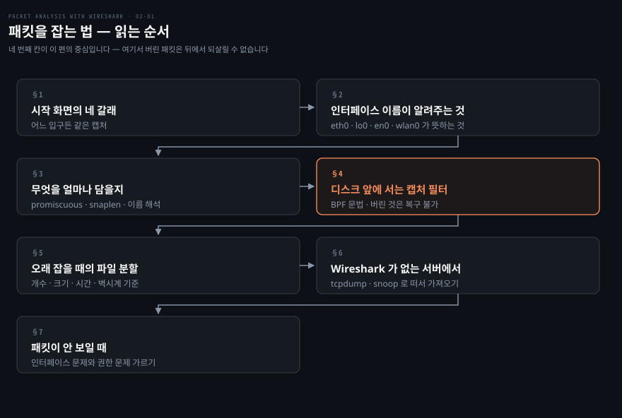
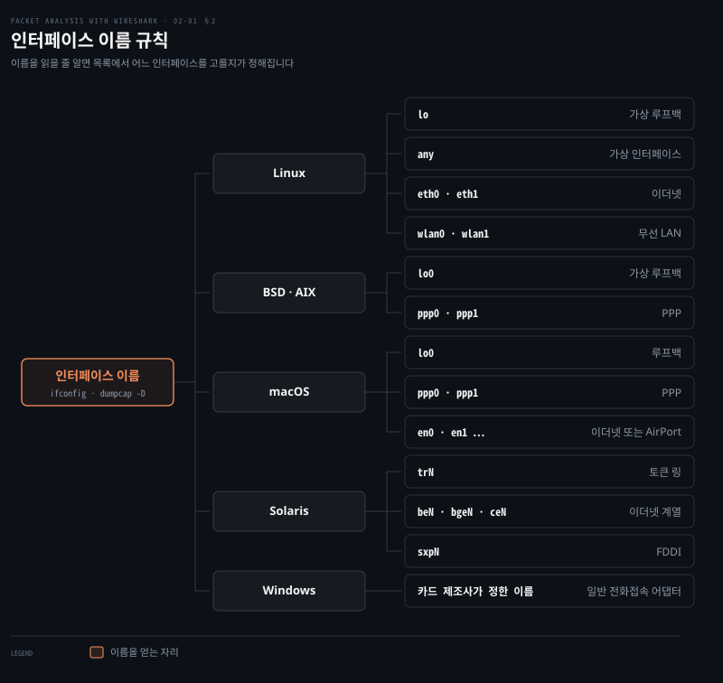
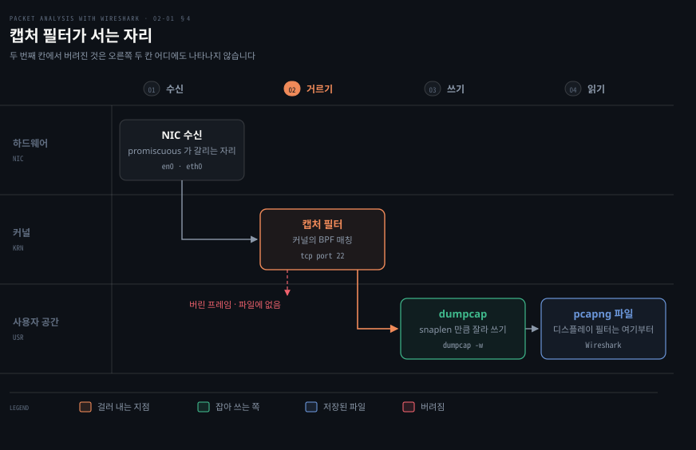
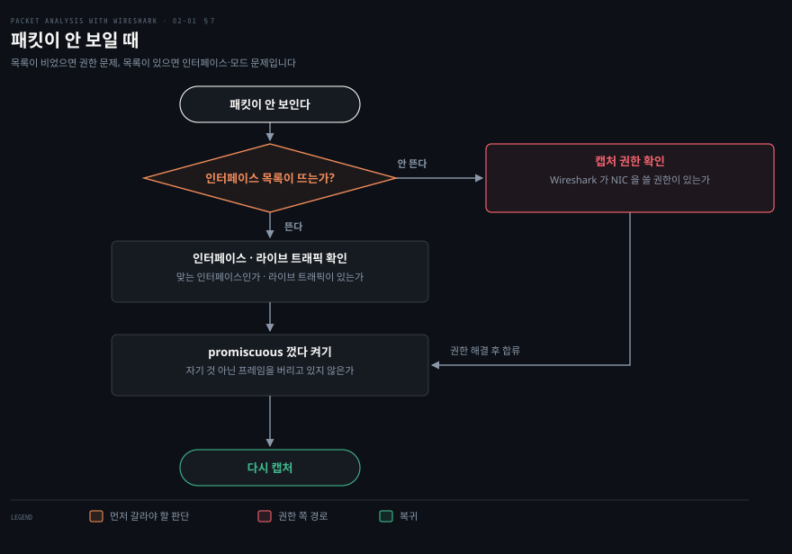

# 패킷을 잡는 법

---

> 2장의 앞쪽 절반은 캡처를 시작하기까지의 모든 선택을 다룹니다. 어느 인터페이스에서 잡을지, 프레임의 몇 바이트까지 담을지, 무엇을 아예 디스크에 쓰지 않을지가 여기서 정해지고, 그 선택은 나중에 되돌릴 수 없습니다.

## 핵심 요약

> 이 편이 매달린 하나의 생각은 **무엇을 디스크에 담을지가 캡처 시점에 결정되며, 그때 버린 패킷은 나중에 어떤 필터로도 되살아나지 않는다**는 것입니다.

Wireshark 의 필터는 두 종류이고 서 있는 자리가 다릅니다. 캡처 필터는 커널에서 매칭해 통과한 프레임만 디스크로 보냅니다. 디스플레이 필터는 이미 파일에 들어온 것 중에서 보여 줄 것만 고릅니다.

이 편이 다루는 것은 앞쪽입니다. 원문의 표현으로는 "어떤 패킷을 디스크에 저장할지 결정"하는 옵션이며, 그래서 "긴 시간에 걸쳐 패킷을 잡을 때 유용"합니다.

되돌릴 수 없다는 성질 때문에 그 앞의 선택들도 같은 무게를 갖습니다. promiscuous 모드를 끈 채로 잡았다면 남의 프레임은 애초에 파일에 없고, snaplen 을 작게 잡았다면 페이로드는 잘려 나간 뒤입니다. 이름 해석을 켜 두었다면 캡처 파일에 내가 만든 DNS 질의가 섞여 들어옵니다.

Wireshark 를 설치할 수 없는 운영 환경이 남습니다. 원문은 그럴 때 `tcpdump`(Linux)와 `snoop`(Solaris 기본)으로 떠서 그 파일을 Wireshark 로 가져와 분석하라고 안내합니다. 캡처와 분석을 다른 장비에서 하는 이 분업이 실무에서는 오히려 기본에 가깝습니다.


## 학습 목표

> 이 편을 읽고 나면 아래 다섯 가지를 스스로 해낼 수 있습니다.

1. 캡처 필터와 디스플레이 필터가 파이프라인의 어느 지점에서 작동하는지 구분하고, 왜 캡처 필터의 선택만 되돌릴 수 없는지 설명할 수 있습니다.
2. 인터페이스 이름만 보고 그것이 어떤 매체·어떤 종류의 인터페이스인지 판단할 수 있습니다.
3. promiscuous 모드·snaplen·이름 해석이 각각 캡처 결과를 어떻게 바꾸는지 말하고, 이름 해석의 두 가지 대가를 댈 수 있습니다.
4. 오래 도는 캡처를 파일 여러 개로 자동 분할하는 조건을 고르고, 생성되는 파일명을 읽을 수 있습니다.
5. Wireshark 가 없는 서버에서 `tcpdump` 로 필요한 캡처를 떠 파일로 남기고 가져올 수 있습니다.

아래는 이 편 전체를 캡처가 실제로 진행되는 순서로 이은 지도입니다. 칸 옆의 절 번호가 본문에서 그 부분을 다루는 곳입니다.




## 1. 시작 화면의 네 갈래

> 원문의 시작 화면은 캡처로 가는 입구를 네 개 제공합니다. 넷은 서로 다른 기능이 아니라 같은 캡처에 이르는 서로 다른 깊이의 진입로입니다.

### 어느 버튼을 눌러야 하는지 모르는 상태

Wireshark 를 처음 열면 버튼이 여럿 보이는데 무엇이 무엇의 상위인지가 드러나지 않습니다. 인터페이스 목록을 먼저 봐야 하는지, 그냥 시작하면 되는지, 옵션부터 열어야 하는지가 화면만 봐서는 정해지지 않습니다.

### 넷의 차이는 "얼마나 정하고 시작하느냐"입니다

원문은 시작 화면의 선택지를 표로 정리합니다.

| 항목 | 원문의 설명 |
|------|------------|
| Interface List | 캡처 인터페이스의 실시간 목록을 열고, 들고 나는 패킷 수를 셉니다 |
| Start | 목록에서 인터페이스를 골라 캡처를 시작할 수 있습니다 |
| Capture Options | 패킷을 잡고 표시하는 여러 옵션을 제공합니다 |
| Open Recent | 최근에 사용한 패킷을 표시합니다 |

Interface List 는 어느 인터페이스가 살아 있는지를 패킷 수로 보여 줍니다. 원문은 그 화면에서 "올바른(살아 있는) 인터페이스를 골라 Start 버튼을 눌러 캡처를 시작"하라고 안내하고, 루프백(`127.0.0.1`)을 잡고 싶으면 `lo0` 을 고르라고 덧붙입니다.

Start 옵션은 목록에서 인터페이스를 여러 개 고르거나 하나를 골라 바로 시작하는 경로입니다. 원문은 여기에 단서를 답니다. **"이 방법은 어느 인터페이스에서 패킷이 활발한지 볼 수 있는 유연성을 주지 않습니다."** 활성 여부를 눈으로 확인하려면 Interface List 를 거쳐야 한다는 뜻입니다. 더 세밀하게 정하려면 인터페이스를 더블클릭하거나 Capture Options 를 엽니다.

> **지금은 다릅니다 (4.6)**: 이 네 갈래 구성은 1.12 의 시작 화면입니다. 현행 판의 환영 화면은 인터페이스 목록 하나로 통합되어 있고 각 인터페이스 옆에 트래픽 스파크라인이 붙습니다. 공식 문서가 적는 캡처 시작 경로는 넷입니다 — 환영 화면에서 인터페이스를 더블클릭하거나, 인터페이스를 고른 뒤 `Capture → Start` 또는 툴바 첫 버튼을 누르거나, `Capture → Options…` 로 들어가거나, 명령줄에서 `wireshark -i eth0 -k` 로 바로 시작하는 방법입니다.[^wsug-capture] 원문의 Interface List 와 Start 가 하나로 합쳐졌다고 읽으면 대응됩니다.


## 2. 인터페이스 이름이 알려주는 것

> 인터페이스 이름은 임의의 문자열이 아니라 매체 종류를 가리키는 규칙입니다. 목록에서 무엇을 고를지가 이름만으로 상당 부분 갈립니다.



### 목록은 떴는데 무엇을 고를지 모르는 상태

인터페이스 목록에는 대개 예닐곱 개가 뜹니다. macOS 라면 `en0`·`awdl0`·`bridge0`·`en1`·`en2`·`p2p0`·`lo0` 같은 식입니다. 이 중 어느 것이 지금 조사하려는 통신을 나르는지는 이름을 읽을 줄 알아야 정해집니다.

### 이름은 매체를 가리킵니다

원문은 그 규칙을 이렇게 못박습니다. **"인터페이스 이름은 네트워크 종류를 알려줍니다. 이름을 보고 사용자는 그 캡처 설정이 어떤 네트워크와 연결되어 있는지 이해해야 합니다."** 그 예로 `eth0` 이 이더넷(Ethernet)을 뜻한다고 듭니다.

위 그림이 원문의 도해를 같은 정보로 옮긴 것입니다. 규칙을 세 갈래로 요약하면 이렇습니다. **`lo`·`lo0` 로 시작하면 루프백이라 그 장비 안에서만 도는 통신입니다. `eth`·`en`·`be`·`bge`·`ce` 계열이면 이더넷입니다. `wlan` 이면 무선이고 이때는 monitor 모드가 따로 필요합니다.** macOS 의 `en0` 이 이더넷과 AirPort 를 모두 가리킨다는 점은 헷갈리기 쉬운 자리입니다.

원문은 UNIX·Linux 에서 인터페이스 목록을 얻는 명령으로 `ifconfig` 와 `ifconfig -a` 를 제시하고, Windows 는 이름을 카드 제조사가 정한다고 적습니다.

> **지금은 다릅니다 (4.6)**: `ifconfig` 는 현행 Linux 배포판에서 기본 설치가 아닌 경우가 많고 `ip link` 로 대체됐습니다. 캡처 목적이라면 `dumpcap -D` 가 더 낫습니다. 시스템의 모든 인터페이스가 아니라 **캡처할 수 있는 인터페이스만** 번호와 이름으로 출력하고, 그 번호나 이름을 그대로 `-i` 에 넘길 수 있기 때문입니다.[^dumpcap-man] 권한 문제인지 이름 문제인지가 이 목록 하나로 갈립니다.


## 3. 무엇을 얼마나 담을지

> Capture Options 는 어떤 프레임을 받아들일지, 프레임의 몇 바이트를 담을지, 주소를 이름으로 바꿔 보여줄지 세 가지를 정합니다.

### 기본값으로 잡았다가 다시 잡게 되는 자리

옵션을 건드리지 않고 잡으면 대체로 돌아갑니다. 문제는 나중에 파일을 열었을 때 드러납니다. 필요한 페이로드가 잘려 있거나, 남의 통신이 통째로 빠져 있거나, 캡처 파일에 조사 대상과 무관한 DNS 질의가 잔뜩 섞여 있습니다. 셋 다 다시 잡는 것 말고는 방법이 없습니다.

세 증상이 각각 위 세 설정에 대응합니다. 이 셋은 표시 설정이 아니라 캡처 결과 자체를 바꾸기 때문입니다. promiscuous 모드는 무엇이 파일에 들어올지를 정합니다. snaplen 은 각 프레임이 어디까지 담길지를 정합니다. 이름 해석은 파일에 없던 패킷이 생겨날지를 정합니다.

### 원문이 제시하는 기본 설정 절차

원문은 Capture Options 로 시작할 때의 기본 설정을 여섯 단계로 적습니다.

1. 패킷이 들고 나는 살아 있는 인터페이스를 고릅니다.
2. Capture Options 를 눌러 대화상자를 엽니다.
3. promiscuous 모드를 켭니다. 네트워크 인터페이스가 모든 패킷을 받게 하는 설정입니다.
4. snaplength 크기를 확인합니다.
5. Name Resolution 에서 이름 해석 범위를 정합니다.
6. 외부 네트워크 이름 해석기로 역방향 DNS 조회를 수행할지 정합니다.

### snaplen — 프레임의 앞부분만 담기

원문은 snaplength 를 "Wireshark 가 각 프레임에서 잡아야 할 데이터의 크기"로 설명하고, 쓰임을 둘로 듭니다. **헤더 프레임만 잡을 때, 그리고 패킷 크기를 작게 유지하고 싶을 때입니다.**

두 번째 쓰임이 실무에서 더 큽니다. 오래 도는 캡처에서 파일 크기는 대체로 페이로드가 결정하는데, 헤더만 필요한 조사라면 앞 100바이트 남짓만 담아도 충분합니다. 다만 잘라 낸 뒤에는 되돌릴 수 없으므로, 페이로드를 볼 가능성이 조금이라도 있으면 자르지 않는 편이 낫습니다.

### 이름 해석 — 숫자를 사람 말로, 대가를 치르고

원문은 이름 해석을 "숫자 주소(MAC 주소·IP 주소·포트 등)를 대응하는 이름으로 바꾸려 시도"하는 기능으로 설명하고 네 갈래를 듭니다.

| 대상 | 무엇이 무엇으로 |
|------|----------------|
| MAC 주소 | MAC 주소를 사람이 읽을 수 있는 형태로 |
| 네트워크 계층 이름 | IP 주소를 호스트명으로. 원문 예시는 `216.58.220.46` → `google.com` |
| 전송 계층 이름 | 잘 알려진 포트를 이름으로. 원문 예시는 `443` → `https` |
| 외부 이름 해석기 | 고유 IP 마다 역방향 DNS 조회. 원문 예시는 `216.58.196.14` → `ns4.google.com` |

같은 설정을 View 메뉴에서도 켤 수 있습니다. 원문이 적는 경로는 `View | Name Resolution` 아래의 넷입니다.

- `Use External Network Name Resolver`
- `Enable for MAC Layer`
- `Enable for Transport Layer`
- `Enable for Network Layer`

> **노트의 읽기**: 원문은 MAC 이름 해석의 예로 `28:cf:e9:1e:df:a9` 가 `192.168.1.101` 로 번역된다고 적습니다. 이것은 틀린 서술이 아닙니다. 공식 User's Guide 도 첫 갈래로 "Wireshark 가 운영체제에 이더넷 주소를 대응하는 IP 주소로 바꿔 달라고 요청한다"를 듭니다. 다만 원문이 적지 않은 갈래가 둘 더 있고, 실제 화면에서 더 자주 보이는 것은 그 둘입니다. 사용자가 `ethers` 파일로 지정한 장비 이름으로 바꾸는 갈래, 그리고 앞 3바이트를 IEEE 가 할당한 제조사 약칭으로 바꾸는 갈래입니다. 후자의 결과가 `Netgear_01:02:03` 같은 표기입니다.[^wsug-nameres]

원문은 이름 해석의 대가를 둘로 정리합니다. **첫째, 트래픽이 많고 고유 IP 가 많으면 이름을 얻으려는 추가 패킷이 생겨 Wireshark 가 크게 느려집니다. 둘째, 해석된 DNS 이름을 캐시하므로 네임서버 정보가 바뀌면 수동으로 다시 읽어야 합니다.**

첫 번째가 조사 자체를 망칠 수 있다는 점이 중요합니다. 내가 만든 DNS 질의가 캡처 파일에 섞여 들어오기 때문입니다. 공식 문서도 같은 위험을 지적하며, DNS 가 캡처 파일에 패킷을 더한다는 점과 그 질의 자체가 문제 해결을 방해하는 관측자 효과를 경고합니다.[^wsug-nameres] 조사 대상이 DNS 이거나 트래픽 패턴 자체일 때는 꺼 두는 편이 안전합니다.

> **지금은 다릅니다 (4.6)**: Capture Options 대화상자가 Input·Output·Options 세 탭으로 나뉘었습니다. promiscuous 모드와 Snaplen 은 Input 탭에, 파일 자동 분할은 Output 탭에 있습니다.[^wsug-capopts] 항목 자체는 원문과 같으므로 이름으로 찾으면 됩니다.


## 4. 캡처 필터는 디스크 앞에 섭니다

> 캡처 필터는 커널에서 매칭하므로 통과하지 못한 프레임은 파일에 남지 않습니다. 그래서 이 선택만은 나중에 되돌릴 수 없습니다.



### 다 잡아 놓고 나중에 걸러도 되지 않나

필터를 캡처 시점에 거는 것은 손해처럼 보입니다. 다 잡아 두고 나중에 화면에서 걸러 보면 될 것 같기 때문입니다. 실제로 짧은 조사에서는 그 편이 낫습니다. 문제는 오래 도는 캡처입니다. 몇 시간을 잡으면 파일이 수 기가바이트가 되고, 그 파일은 열기도 느리고 옮기기도 부담스럽습니다.

### 그래서 커널에서 미리 자릅니다

원문은 캡처 필터를 "어떤 패킷을 디스크에 저장할지 결정"하는 옵션으로 설명하고, 쓰임을 "긴 시간에 걸쳐 패킷을 잡을 때 유용"하다고 적습니다. 디스크 공간을 아낀다는 효과도 함께 듭니다.

문법은 디스플레이 필터와 다릅니다. 원문이 못박듯 **Wireshark 는 이 목적에 Berkeley Packet Filter(BPF) 문법을 씁니다.** 원문이 드는 예가 `tcp src port 22` 입니다. 위 그림의 두 번째 칸이 그 자리이고, 여기서 걸러진 프레임은 오른쪽 두 칸 어디에도 나타나지 않습니다.

두 필터의 문법이 다르다는 사실이 초심자가 가장 자주 걸리는 자리입니다. **캡처 필터에는 `tcp port 443` 처럼 띄어쓰기로 쓰고, 디스플레이 필터에는 `tcp.port == 443` 처럼 점과 등호로 씁니다.** 같은 뜻인데 표기가 다른 것이 아니라 문법 체계 자체가 다릅니다.

원문이 제시하는 TCP 만 잡는 절차는 이렇습니다.

1. Capture Options 를 눌러 대화상자를 엽니다.
2. 활성 인터페이스를 고르고 promiscuous 모드를 켜거나 끕니다.
3. Capture Filter 를 눌러 대화상자가 나오면 TCP only 필터를 고르고 OK 를 누릅니다.
4. Start 를 눌러 TCP 패킷만 잡기 시작합니다.

```bash
# 캡처 필터(BPF) — 커널에서 걸러지고, 통과 못 한 프레임은 파일에 없습니다
tcp src port 22
tcp port 443
host 10.0.0.221
not arp

# 디스플레이 필터 — 파일이 생긴 뒤에 보여줄 것만 고릅니다 (02-02 에서 다룹니다)
tcp.srcport == 22
tcp.port == 443
```


## 5. 오래 잡을 때 파일을 자릅니다

> 며칠에 걸친 캡처를 파일 하나로 두면 열 수도 옮길 수도 없게 됩니다. Wireshark 는 조건을 걸어 파일을 자동으로 갈아 끼웁니다.

### 재현이 드문 문제를 기다릴 때

하루에 한두 번 나는 문제를 잡으려면 캡처를 계속 켜 두는 수밖에 없습니다. 그런데 파일 하나로 계속 쌓으면 정작 문제가 났을 때 그 파일을 열지 못합니다.

### 조건을 걸어 갈아 끼웁니다

원문은 `Capture Options | Capture Files` 에서 주기적 자동 캡처를 설정할 수 있다고 적고, 생성되는 파일의 예를 듭니다.

```bash
test_00001_20150623001728.pcap
test_00002_20150623001818.pcap
```

원문이 밝히는 파일명 형식은 네 조각입니다.

| 조각 | 뜻 |
|------|-----|
| `test` | 파일명 |
| `00001` | 파일 번호 |
| `20150623001728` | 날짜와 시각 |
| `pcap` | 확장자 |

두 파일의 시각을 빼 보면 이 설정이 무엇을 하는지 드러납니다. `001728` 과 `001818` 이므로 50초 간격입니다.

> **지금은 다릅니다 (4.6)**: 새 파일로 넘어가는 조건이 네 가지로 명시됩니다. 캡처 파일의 패킷 수, 파일 크기, 캡처 지속 시간, 그리고 벽시계 시각입니다. 여기에 링 버퍼를 함께 걸어 "주어진 개수의 파일로 순환"하게 할 수 있습니다.[^wsug-capopts] 링 버퍼가 실무에서 중요합니다. 조건만 걸면 디스크가 찰 때까지 파일이 늘지만, 링 버퍼를 걸면 오래된 파일부터 덮어쓰므로 무한정 켜 둘 수 있습니다. 기본 저장 형식도 `.pcap` 에서 **pcapng** 로 바뀌었습니다.[^dumpcap-man]


## 6. Wireshark 가 없는 서버에서

> 운영 장비에는 GUI 도구를 설치하지 않는 것이 보통입니다. 그럴 때는 기본 도구로 떠서 파일만 가져옵니다.

### 설치 권한이 없는 곳에서 조사가 필요할 때

문제가 나는 곳은 대개 운영 서버인데, 그곳에 Wireshark 를 설치하는 일은 대부분 허용되지 않습니다. 원문도 같은 전제에서 출발합니다. **"운영 환경에는 Wireshark 같은 패킷 캡처 도구가 대개 설치되어 있지 않습니다."**

### 기본으로 깔린 도구로 떠서 가져옵니다

원문이 제시하는 답은 그 OS 에 이미 있는 도구를 쓰는 것입니다. Linux 는 `tcpdump`, Solaris 는 기본 도구인 `snoop` 입니다. 잡은 파일은 나중에 Wireshark 로 열어 분석합니다.

원문은 두 도구를 이렇게 소개합니다. `snoop` 은 네트워크 패킷을 잡아 들여다보는 도구로 Sun Microsystems 의 CLI 에서 돌고, `tcpdump` 는 네트워크의 트래픽을 덤프하며 Windows·OS X·Linux 에서 돕니다.

아래는 원문의 대조표를 그대로 옮긴 것입니다.

| 하려는 일 | Solaris (`snoop`) | Linux (`tcpdump`) |
|-----------|-------------------|-------------------|
| 모든 인터페이스에서 패킷 확인 | `snoop` | `tcpdump -nS` |
| 호스트명으로 캡처 | `snoop hostname` | `tcpdump host hostname` |
| 잡은 것을 파일로 쓰기 | `snoop -o filename` | `tcpdump -w filename` |
| host1 과 host2 사이를 잡아 파일로 | `snoop -o capture_file.pcap host1 host2` | `tcpdump -w capture_file.pcap src host1 and dst host2` |
| 화면에 상세 출력 | `snoop -v -d eth0` · `snoop -d eth0 -v port 80` | `tcpdump -i eth0` · `tcpdump -i eth0 -v port 80` · `tcpdump -i eth0 -vv port 80` |
| snaplength 지정 | `snoop -s 500` | `tcpdump -s 500` |
| 전체 바이트 잡기 | `snoop -s0` | `tcpdump -s0` |
| IPv6 트래픽 | `snoop ip6` | `tcpdump ip6` |
| 프로토콜별 | `snoop multicast` · `snoop broadcast` · `snoop bootp` · `snoop dhcp` · `snoop dhcp6` · `snoop pppoe` · `snoop ldap` | `tcpdump -n "broadcast or multicast"` · `tcpdump udp` · `tcpdump tcp` · `tcpdump port 67` · `tcpdump port 546` · `tcpdump port 389` |

> **원문 정오**: 첫 행의 `tcpdump -nS` 는 "모든 인터페이스에서 패킷 확인"이 아닙니다. 공식 man page 에 따르면 `-n` 은 "주소를 이름으로 변환하지 않음"이고 `-S` 는 "상대 TCP 시퀀스 번호 대신 절대 번호를 출력"입니다. 인터페이스 선택과는 무관합니다. 게다가 `-i` 를 생략하면 tcpdump 는 "시스템 인터페이스 목록에서 가장 낮은 번호의 설정된 up 인터페이스(루프백 제외)"**하나**를 고릅니다. 모든 인터페이스를 잡으려면 `tcpdump -i any` 를 써야 하며, 이것은 "OS 의 모든 일반 네트워크 인터페이스에서 패킷을 잡는 특수 의사 인터페이스"입니다.[^tcpdump-man]

> **원문 정오**: 상세 출력 행의 `snoop -d eth0` 는 같은 책의 다른 도해와 어긋납니다. 앞 절의 인터페이스 이름 도해가 Solaris 의 이름을 `trN`·`beN`·`bgeN`·`ceN`·`sxpN` 으로 적었는데, `eth0` 은 그 목록에 없는 Linux 계열 이름입니다. Solaris 예제에 Linux 인터페이스 이름이 들어간 것으로 보입니다.

> **노트의 읽기**: 마지막 행은 두 열이 1:1 로 짝지어지지 않습니다. `snoop` 쪽에 일곱 개, `tcpdump` 쪽에 여섯 개가 있어 어느 것이 어느 것의 대응인지 표만 봐서는 정해지지 않습니다. 포트 번호로 짚으면 `snoop dhcp` ↔ `tcpdump port 67`, `snoop dhcp6` ↔ `tcpdump port 546`, `snoop ldap` ↔ `tcpdump port 389` 이고, `snoop pppoe` 의 대응이 비어 있습니다.

원문의 표에서 실무에 가장 자주 쓰이는 조합은 마지막 두 가지의 결합입니다. 조건을 걸어 필요한 것만 파일로 남긴 뒤 그 파일만 가져오는 형태입니다.

```bash
# 운영 서버에서 — 필요한 것만 떠서 파일로
tcpdump -i any -s 0 -w /tmp/issue.pcap 'tcp port 8080 and host 10.0.0.221'

# 노트북으로 가져와 Wireshark 로 엽니다
scp server:/tmp/issue.pcap .
```

> **지금은 다릅니다**: `-s0` 은 여전히 "전체 바이트"를 뜻하지만, 현행 tcpdump 의 기본 snaplen 은 이미 262,144바이트라 대부분의 경우 `-s0` 을 따로 주지 않아도 프레임이 잘리지 않습니다.[^tcpdump-man] 원문이 쓰던 시절의 기본값(65,535바이트)과 달라진 지점입니다.


## 7. 패킷이 안 보일 때

> 증상은 하나인데 원인은 둘로 갈립니다. 인터페이스 목록이 뜨는지부터 확인하면 두 갈래가 나뉩니다.



### 아무것도 안 잡히는데 어디부터 봐야 하는지

캡처를 시작했는데 화면이 비어 있으면 손댈 곳이 여럿으로 보입니다. 원문은 그 상황을 두 경우로 갈라 각각의 확인 사항을 줍니다.

### 목록이 뜨는가로 먼저 가릅니다

원문의 첫 경우는 **패킷이 메인 창에 나타나지 않을 때**입니다. 확인할 것이 둘입니다. 올바른 네트워크 인터페이스인지 확인하고 라이브 트래픽이 있는지 확인하는 것, 그리고 promiscuous 모드를 껐다 켜 보는 것입니다.

두 번째 경우는 **캡처를 수행할 인터페이스가 아예 하나도 나타나지 않을 때**입니다. 이때는 Wireshark 가 네트워크 카드를 써서 데이터를 잡을 충분한 권한을 가졌는지 확인하고, 캡처 권한 문서로 검증하라고 안내합니다.

두 경우를 가르는 기준이 목록의 유무라는 점이 실무적으로 유용합니다. **목록이 비어 있으면 권한 문제이고, 목록이 보이는데 패킷이 없으면 인터페이스 선택이나 모드 문제입니다.** 원문은 해결되지 않으면 Wireshark 커뮤니티에 물으라고 덧붙입니다.


## 심화 학습

> 2장 캡처 축에서 판본을 타는 것은 화면 구성과 파일 형식입니다. 무엇을 정하는지, 그 선택이 무엇을 바꾸는지는 그대로입니다.

| 원문(1.12, 2015) | 현행(4.6, 2026) | 성격 |
|------------------|-----------------|------|
| 시작 화면 = Interface List · Start · Capture Options · Open Recent | 인터페이스 목록 하나로 통합. 시작 경로 넷[^wsug-capture] | 바뀜 |
| Capture Options 단일 대화상자 | Input · Output · Options 세 탭[^wsug-capopts] | 바뀜 — 항목 이름은 유지 |
| 파일 자동 분할 = `Capture Files` | Output 탭. 조건 넷(패킷 수·크기·지속 시간·벽시계) + 링 버퍼[^wsug-capopts] | 확장 |
| 기본 저장 형식 `.pcap` | **pcapng**. `.pcap` 은 `-F` 로 지정[^dumpcap-man] | 바뀜 |
| 인터페이스 목록은 `ifconfig` | `ip link` 또는 `dumpcap -D`[^dumpcap-man] | 바뀜 |
| `tcpdump` 기본 snaplen 65,535 | 262,144[^tcpdump-man] | 바뀜 |
| 캡처 필터 = BPF 문법 | 그대로 | 유지 |
| promiscuous · snaplen · 이름 해석 | 그대로 | 유지 |
| 이름 해석의 두 대가(느려짐·캐시) | 그대로. 공식 문서는 관측자 효과로도 설명[^wsug-nameres] | 유지 |

원문이 다루지 않는 축이 하나 있습니다. **원격 장비에서 잡은 것을 파일로 옮기지 않고 바로 보는 방법**입니다. `ssh` 로 원격에서 `tcpdump` 를 돌리고 표준 출력을 그대로 로컬 Wireshark 에 물리면, 파일을 주고받지 않고도 라이브로 볼 수 있습니다. 원문이 전제하는 "떠서 가져오기"보다 반복 조사에서 빠릅니다.

```bash
ssh user@server 'tcpdump -i any -U -s 0 -w - "tcp port 8080"' | wireshark -k -i -
```

`-U` 는 패킷마다 즉시 내보내라는 뜻이고, `-w -` 는 표준 출력으로 쓰라는 뜻입니다.[^tcpdump-man] 받는 쪽 `-k` 는 즉시 캡처를 시작하라는 뜻이고 `-i -` 는 표준 입력에서 읽으라는 뜻입니다. 다만 이 방법은 원격 장비에 캡처 권한이 있어야 하고, 앞 절의 정책 확인이 여기에도 그대로 적용됩니다.


## 결정 치트시트

> 캡처를 시작하기 전에 정할 것들과 그 판단 기준입니다.

| 상황 | 선택 | 왜 |
|------|------|-----|
| 조사 시간이 몇 분 이내 | 캡처 필터 없이 다 잡습니다 | 나중에 디스플레이 필터로 어떤 방향으로든 파고들 수 있습니다 |
| 조사 시간이 몇 시간 이상 | 캡처 필터로 대상을 좁힙니다 | 파일 크기가 열 수 없는 수준이 됩니다 |
| 재현이 하루 한두 번 | 캡처 필터 + 파일 분할 + 링 버퍼 | 계속 켜 두어도 디스크가 차지 않습니다 |
| 헤더만 보면 되는 조사 | snaplen 을 줄입니다 | 파일 크기를 줄이는 가장 큰 지렛대가 페이로드입니다 |
| 페이로드를 볼 가능성이 있음 | snaplen 을 건드리지 않습니다 | 잘라 낸 뒤에는 되돌릴 수 없습니다 |
| 조사 대상이 DNS 이거나 트래픽 패턴 | 이름 해석을 끕니다 | 내가 만든 질의가 캡처에 섞입니다 |
| 남의 통신을 봐야 함 | promiscuous + TAP 또는 SPAN | promiscuous 만으로는 스위치가 프레임을 보내 주지 않습니다 |
| 운영 서버 | `tcpdump -w` 로 떠서 가져옵니다 | GUI 도구를 설치하지 않는 것이 보통입니다 |


## 면접 대비

### 한 줄 정의

"캡처 필터는 커널에서 매칭해 디스크에 무엇을 쓸지 정하는 BPF 필터이고, 디스플레이 필터는 이미 저장된 것 중 무엇을 보여줄지 정하는 별개 문법의 필터입니다."

### 핵심 포인트 세 가지

1. **두 필터는 서 있는 자리가 다릅니다.** 캡처 필터는 파일이 생기기 전이라 선택이 되돌릴 수 없고, 디스플레이 필터는 파일이 생긴 뒤라 얼마든지 바꿔 볼 수 있습니다. 문법도 `tcp port 443` 과 `tcp.port == 443` 으로 서로 다릅니다.
2. **이름 해석은 조사를 오염시킬 수 있습니다.** 켜 두면 Wireshark 가 DNS 질의를 만들어 내고, 그 질의가 같은 캡처 파일에 들어옵니다. 트래픽이 많고 고유 IP 가 많으면 도구 자체가 느려집니다.
3. **운영 환경에서는 캡처와 분석을 분리합니다.** 서버에서는 `tcpdump -w` 로 파일만 남기고, 분석은 파일을 가져와 Wireshark 로 합니다.

### 자주 묻는 질문

Q: 캡처 필터와 디스플레이 필터 중 무엇을 써야 합니까?
A: 조사 시간으로 가릅니다. 몇 분짜리면 필터 없이 다 잡고 나중에 디스플레이 필터로 파고드는 편이 낫습니다. 몇 시간 이상이면 파일 크기 때문에 캡처 필터가 필요하고, 그때는 무엇을 버리는지 알고 걸어야 합니다.

Q: `tcpdump` 로 모든 인터페이스를 잡으려면 어떻게 합니까?
A: `-i any` 를 씁니다. 옵션 없이 `tcpdump` 만 실행하면 가장 낮은 번호의 활성 인터페이스 하나만 잡습니다.

Q: snaplen 을 줄이면 무엇이 안 보이게 됩니까?
A: 지정한 바이트 뒤가 잘립니다. 헤더는 남고 페이로드가 사라지므로, HTTP 본문이나 TLS 레코드 내용을 봐야 하는 조사에서는 다시 잡아야 합니다.


## 핵심 개념 체크리스트

- [ ] 캡처 필터와 디스플레이 필터가 각각 파이프라인의 어디에 서는지 그림으로 그릴 수 있습니까?
- [ ] 두 필터의 문법 차이를 같은 조건(포트 443)으로 각각 써 볼 수 있습니까?
- [ ] promiscuous 모드가 무엇을 바꾸고 무엇은 바꾸지 못하는지 구분할 수 있습니까?
- [ ] 이름 해석을 켰을 때 치르는 대가 두 가지를 댈 수 있습니까?
- [ ] 인터페이스 이름 `lo0`·`en0`·`wlan0`·`bge0` 을 보고 각각 어떤 매체인지 말할 수 있습니까?
- [ ] 운영 서버에서 특정 호스트·포트만 파일로 떠 오는 `tcpdump` 명령을 쓸 수 있습니까?


## 관련 문서

- [01-01 패킷 분석기와 Wireshark](./01-01.패킷 분석기와 Wireshark.md) — 이 편의 앞. 캡처 전 다섯 관문과 도구 구성
- [02-02 잡은 패킷을 읽는 법](./02-02.잡은 패킷을 읽는 법.md) — 이 편의 뒤. 파일이 생긴 다음의 디스플레이 필터와 네 개 창
- [Packet Analysis with Wireshark — 정독 인덱스](./README.md) — 7개 장 전체 지도


## 참고 자료

- 원본: 《Packet Analysis with Wireshark》 (Anish Nath, Packt Publishing, 2015) ISBN 978-1-78588-781-9
- 다룬 범위: Chapter 2 의 Capturing Packets · Tcpdump and snoop · Troubleshooting 절
- [Wireshark User's Guide — Capturing Live Network Data](https://www.wireshark.org/docs/wsug_html_chunked/ChapterCapture.html) — 현행 4.6 기준 캡처 문서
- [tcpdump(1) man page](https://www.tcpdump.org/manpages/tcpdump.1.html) — BPF 캡처 필터 문법 포함
- [Wireshark CaptureSetup/CapturePrivileges](https://wiki.wireshark.org/CaptureSetup/CapturePrivileges) — 원문이 권한 문제에서 가리키는 문서

[^wsug-capture]: Wireshark User's Guide, Start Capturing — "You can double-click on an interface in the welcome screen" · "You can select an interface in the welcome screen, then select Capture → Start or click the first toolbar button" · `Capture → Options…` · "wireshark -i eth0 -k". <https://www.wireshark.org/docs/wsug_html_chunked/ChCapCapturingSection.html> (2026-09-05 조회)

[^wsug-capopts]: Wireshark User's Guide, The "Capture Options" Dialog Box — Input·Output·Options 세 탭. Promiscuous mode "Lets you put this interface in promiscuous mode while capturing." · Snaplen "The snapshot length, or the number of bytes to capture for each packet." · Output 탭 "Sets the conditions for switching to a new capture file. A new capture file can be created based on the following conditions: The number of packets in the capture file. The size of the capture file. The duration of the capture file. The wall clock time." · Ring buffer "Form a ring buffer of the capture files with the given number of files." <https://www.wireshark.org/docs/wsug_html_chunked/ChCapCaptureOptions.html> (2026-09-05 조회)

[^wsug-nameres]: Wireshark User's Guide, Name Resolution — Ethernet 이름 해석 세 갈래: "Wireshark will ask the operating system to convert an Ethernet address to the corresponding IP address (e.g. 00:09:5b:01:02:03 → 192.168.0.1)" · "Wireshark tries to convert the Ethernet address to a known device name, which has been assigned by the user using an ethers file" · "Wireshark tries to convert the first 3 bytes of an ethernet address to an abbreviated manufacturer name, which has been assigned by the IEEE (e.g. 00:09:5b:01:02:03 → Netgear_01:02:03)". DNS 경고: "DNS may add additional packets to your capture file". <https://www.wireshark.org/docs/wsug_html_chunked/ChAdvNameResolutionSection.html> (2026-09-05 조회)

[^tcpdump-man]: tcpdump(1) man page — `-S` "Print absolute, rather than relative, TCP sequence numbers." · `-n` "Don't convert addresses (i.e., host addresses, port numbers, etc.) to names." · `-i` "If unspecified and if the -d flag is not given, tcpdump searches the system interface list for the lowest numbered, configured up interface (excluding loopback)." · "an interface argument of 'any' means a special pseudo-interface, which captures packets from all regular network interfaces of the OS." · `-s` "Snarf snaplen bytes of data from each packet rather than the default of 262144 bytes." · `-w` "Write the raw packets to file rather than parsing and printing them out... Standard output is used if file is '-'." <https://www.tcpdump.org/manpages/tcpdump.1.html> (2026-09-05 조회)

[^dumpcap-man]: dumpcap(1) man page — "Dumpcap's native capture file format is pcapng" · `-D|--list-interfaces` "Print a list of the interfaces on which Dumpcap can capture, and exit." <https://www.wireshark.org/docs/man-pages/dumpcap.html> (2026-09-05 조회)
