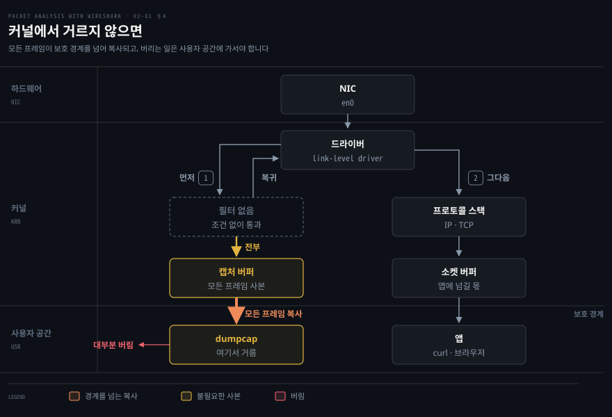
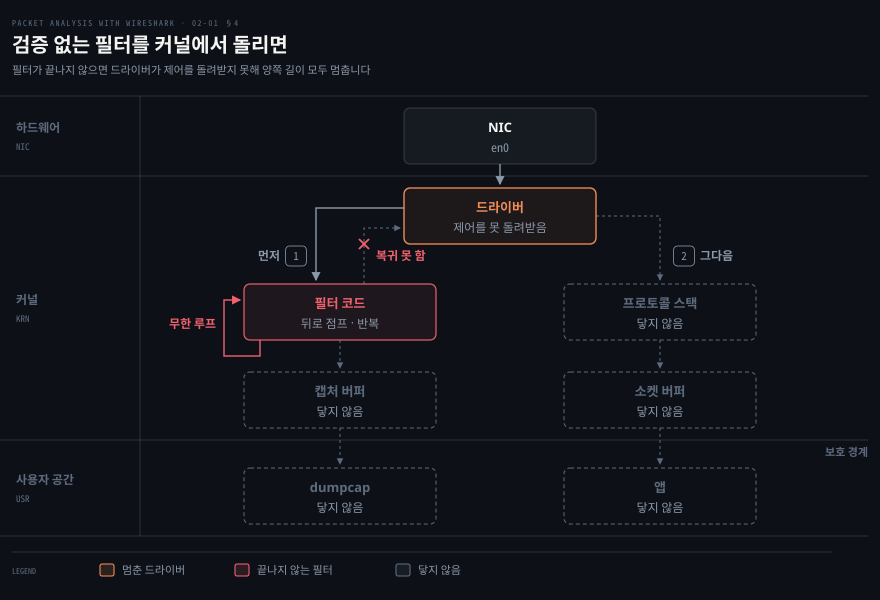
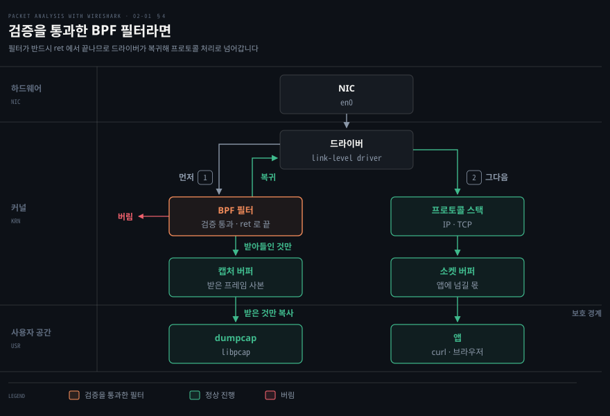
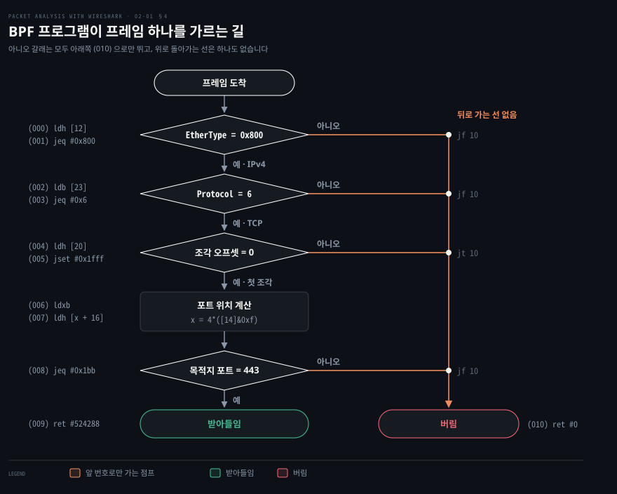

# 패킷을 잡는 법

---

> 2장의 앞쪽 절반은 캡처를 시작하기까지의 모든 선택을 다룹니다. 어느 인터페이스에서 잡을지, 프레임의 몇 바이트까지 담을지, 무엇을 아예 디스크에 쓰지 않을지가 여기서 정해지고, 그 선택은 나중에 되돌릴 수 없습니다.

## 핵심 요약

> 이 편이 매달린 하나의 생각은 **무엇을 디스크에 담을지가 캡처 시점에 결정되며, 그때 버린 패킷은 나중에 어떤 필터로도 되살아나지 않는다**는 것입니다.

Wireshark 의 필터는 두 종류이고 서 있는 자리가 다릅니다. 캡처 필터는 커널에서 매칭해 통과한 프레임만 디스크로 보냅니다. 디스플레이 필터는 이미 파일에 들어온 것 중에서 보여 줄 것만 고릅니다.

이 편이 다루는 것은 앞쪽입니다. 원문의 표현으로는 "어떤 패킷을 디스크에 저장할지 결정"하는 옵션입니다. 그래서 "긴 시간에 걸쳐 패킷을 잡을 때 유용"합니다.

되돌릴 수 없다는 성질 때문에 그 앞의 선택들도 같은 무게를 갖습니다. promiscuous 모드를 끈 채로 잡았다면 남의 프레임은 애초에 파일에 없습니다. snaplen 을 작게 잡았다면 페이로드는 잘려 나간 뒤입니다. 이름 해석을 켜 두었다면 캡처 파일에 내가 만든 DNS 질의가 섞여 들어옵니다.

Wireshark 를 설치할 수 없는 운영 환경이 남습니다. 원문은 그럴 때 `tcpdump`(Linux)와 `snoop`(Solaris 기본)으로 떠서 그 파일을 Wireshark 로 가져와 분석하라고 안내합니다. 캡처와 분석을 다른 장비에서 하는 이 분업이 실무에서는 오히려 기본에 가깝습니다.


## 학습 목표

> 이 편을 읽고 나면 아래 다섯 가지를 스스로 해낼 수 있습니다.

1. 캡처 필터와 디스플레이 필터가 파이프라인의 어느 지점에서 작동하는지 구분하고 왜 캡처 필터의 선택만 되돌릴 수 없는지 설명할 수 있습니다.
2. 인터페이스 이름만 보고 그것이 어떤 매체·어떤 종류의 인터페이스인지 판단할 수 있습니다.
3. promiscuous 모드·snaplen·이름 해석이 각각 캡처 결과를 어떻게 바꾸는지 말하고 이름 해석의 두 가지 대가를 댈 수 있습니다.
4. 오래 도는 캡처를 파일 여러 개로 자동 분할하는 조건을 고르고 생성되는 파일명을 읽을 수 있습니다.
5. Wireshark 가 없는 서버에서 `tcpdump` 로 필요한 캡처를 떠 파일로 남기고 가져올 수 있습니다.

이 편에서 새로 만나는 낱말입니다. `어디서` 는 그 낱말이 실제로 설명되는 절입니다.

| 키워드 | 뜻 | 학습 포인트·연결 개념 | 어디서 |
|---|---|---|---|
| 캡처 필터 (capture filter) | 디스크에 쓰기 전 커널이 거름 | 버린 것은 못 되살림 · BPF 문법 | §4 |
| 디스플레이 필터 (display filter) | 저장된 것에서 시야만 좁힘 | 지우지 않음 · 되돌릴 수 있음 · 02-02 로 이어짐 | §4 |
| BPF (Berkeley Packet Filter) | 커널 안의 작은 필터 가상머신 | 매칭을 커널에서 끝냄 · macOS 는 이미 내장 | §4 |
| snaplen | 프레임당 담을 앞부분 바이트 수 | 줄이면 헤더만 남음 · 잘린 뒤는 복구 불가 | §3 |
| 캡처 위치 | 분석기를 어느 인터페이스에 세우는가 | 안 오는 트래픽은 못 잡음 · 목록이 뜨는지로 가름 | §3 |
| `tcpdump` | 서버에 기본으로 깔린 캡처 도구 | GUI 없는 곳에서 떠서 가져옴 · `libpcap` 공유 | §4 · §6 |

아래는 이 편 전체를 캡처가 실제로 진행되는 순서로 이은 지도입니다. 칸 옆의 절 번호가 본문에서 그 부분을 다루는 곳입니다.


## 1. 시작 화면의 네 갈래

> 원문의 시작 화면은 캡처로 가는 입구를 네 개 제공합니다. 넷은 서로 다른 기능이 아니라 같은 캡처에 이르는 서로 다른 깊이의 진입로이고, 현행 판에서는 인터페이스 목록 한 화면으로 합쳐졌습니다.

### 어느 버튼을 눌러야 하는지 모르는 상태

Wireshark 를 처음 열면 버튼이 여럿 보이는데 무엇이 무엇의 상위인지가 드러나지 않습니다. 인터페이스 목록을 먼저 봐야 하는지, 그냥 시작하면 되는지, 옵션부터 열어야 하는지가 화면만 봐서는 정해지지 않습니다.

### 넷의 차이는 "얼마나 정하고 시작하느냐"입니다

원문은 시작 화면의 선택지를 표로 정리합니다.

| 항목 | 원문의 설명 |
|------|------------|
| Interface List | 캡처 인터페이스의 실시간 목록을 열고, 들고 나는 패킷 수를 셉니다 |
| Start | 목록에서 인터페이스를 골라 캡처를 시작할 수 있습니다 |
| Capture Options | 패킷을 잡고 표시하는 여러 옵션을 제공합니다 |
| Open Recent | 최근에 사용한 패킷을 표시합니다 |

Interface List 는 어느 인터페이스가 살아 있는지를 패킷 수로 보여 줍니다. 원문은 그 화면에서 "올바른(살아 있는) 인터페이스를 골라 Start 버튼을 눌러 캡처를 시작"하라고 안내하고 루프백(`127.0.0.1`)을 잡고 싶으면 `lo0` 을 고르라고 덧붙입니다.

Start 옵션은 목록에서 인터페이스를 여러 개 고르거나 하나를 골라 바로 시작하는 경로입니다. 원문은 여기에 단서를 답니다. **"이 방법은 어느 인터페이스에서 패킷이 활발한지 볼 수 있는 유연성을 주지 않습니다."** 활성 여부를 눈으로 확인하려면 Interface List 를 거쳐야 한다는 뜻입니다. 더 세밀하게 정하려면 인터페이스를 더블클릭하거나 Capture Options 를 엽니다.

현행 판의 환영 화면은 이 네 갈래를 인터페이스 목록 하나로 합쳤습니다. 인터페이스마다 옆에 트래픽 스파크라인이 붙습니다. 위 표는 원문이 적은 1.12 의 시작 화면입니다. 원문의 Interface List 와 Start 가 한 화면으로 합쳐졌다고 읽으면 대응됩니다.

공식 문서가 적는 캡처 시작 경로는 넷입니다.[^wsug-capture]

1. 환영 화면에서 인터페이스를 더블클릭합니다.
2. 인터페이스를 고른 뒤 `Capture → Start` 또는 툴바 첫 버튼을 누릅니다.
3. `Capture → Options…` 로 들어갑니다.
4. 명령줄에서 `wireshark -i eth0 -k` 로 바로 시작합니다.

두 목록은 짝이 맞지 않습니다. 원문의 넷은 시작 화면의 버튼이고 공식 문서의 넷은 캡처를 시작하는 조작입니다.

고르는 기준은 하나로 정리됩니다. 어느 인터페이스가 살아 있는지 보려면 인터페이스 목록에서 시작합니다. 캡처 전에 옵션을 정하려면 Capture Options 로 들어갑니다.


## 2. 인터페이스 이름이 알려주는 것

> 인터페이스 이름은 임의의 문자열이 아니라 매체 종류를 가리키는 규칙입니다. 목록에서 무엇을 고를지가 이름만으로 상당 부분 갈립니다.


### 목록은 떴는데 무엇을 고를지 모르는 상태

인터페이스 목록에는 대개 예닐곱 개가 뜹니다. macOS 라면 `en0`·`awdl0`·`bridge0`·`en1`·`en2`·`p2p0`·`lo0` 같은 식입니다. 이 중 어느 것이 지금 조사하려는 통신을 나르는지는 이름을 읽을 줄 알아야 정해집니다.

### 이름은 매체를 가리킵니다

원문은 그 규칙을 이렇게 못박습니다. **"인터페이스 이름은 네트워크 종류를 알려줍니다. 이름을 보고 사용자는 그 캡처 설정이 어떤 네트워크와 연결되어 있는지 이해해야 합니다."** 그 예로 `eth0` 이 이더넷(Ethernet)을 뜻한다고 듭니다.

위 그림이 원문의 도해를 같은 정보로 옮긴 것입니다. 규칙을 세 갈래로 요약하면 이렇습니다. **`lo`·`lo0` 로 시작하면 루프백이라 그 장비 안에서만 도는 통신입니다. `eth`·`en`·`be`·`bge`·`ce` 계열이면 이더넷입니다. `wlan` 이면 무선이고 이때는 monitor 모드가 따로 필요합니다.** monitor 모드는 무선 NIC 가 한 채널의 802.11 프레임을 헤더째 받게 하는 모드이고, promiscuous 모드와의 차이는 [01-01 패킷 분석기와 Wireshark](./01-01.패킷 분석기와 Wireshark.md) §3 이 표로 정리합니다. macOS 의 `en0` 이 이더넷과 AirPort 를 모두 가리킨다는 것도 헷갈리기 쉽습니다.

현행 Linux 배포판에서 인터페이스 목록을 얻는 명령은 `ip link` 입니다. 원문은 UNIX·Linux 의 명령으로 `ifconfig` 와 `ifconfig -a` 를 적었지만 `ifconfig` 는 현행 배포판에서 기본 설치가 아닌 경우가 많습니다. Windows 는 이름을 카드 제조사가 정한다고 원문은 적습니다.

캡처 목적이라면 `dumpcap -D` 가 더 낫습니다. `dumpcap` 은 Wireshark 와 함께 설치되는 명령줄 캡처 프로그램입니다. 도구 구성은 [01-01 패킷 분석기와 Wireshark](./01-01.패킷 분석기와 Wireshark.md) 가 다룹니다.

이 명령은 시스템의 모든 인터페이스가 아니라 **캡처할 수 있는 인터페이스만** 번호와 이름으로 출력합니다. 그 번호나 이름은 그대로 `-i` 에 넘길 수 있습니다.[^dumpcap-man] 목록이 비면 권한 문제라는 판단은 §7 에서 다시 씁니다.


## 3. 무엇을 얼마나 담을지

> Capture Options 는 어떤 프레임을 받아들일지, 프레임의 몇 바이트를 담을지, 주소를 이름으로 바꿔 보여줄지 세 가지를 정합니다.

### 기본값으로 잡았다가 다시 잡게 되는 자리

옵션을 건드리지 않고 잡으면 대체로 돌아갑니다. 문제는 나중에 파일을 열었을 때 드러납니다. 필요한 페이로드가 잘려 있거나, 남의 통신이 통째로 빠져 있거나, 캡처 파일에 조사 대상과 무관한 DNS 질의가 잔뜩 섞여 있습니다. 셋 다 다시 잡는 것 말고는 방법이 없습니다.

세 증상이 각각 위 세 설정에 대응합니다. 이 셋은 표시 설정이 아니라 캡처 결과 자체를 바꾸기 때문입니다. promiscuous 모드는 무엇이 파일에 들어올지를 정합니다. snaplen 은 각 프레임이 어디까지 담길지를 정합니다. 이름 해석은 파일에 없던 패킷이 생겨날지를 정합니다.

### 원문이 제시하는 기본 설정 절차

원문은 Capture Options 로 시작할 때의 기본 설정을 여섯 단계로 적습니다.

1. 패킷이 들고 나는 살아 있는 인터페이스를 고릅니다.
2. Capture Options 를 눌러 대화상자를 엽니다.
3. promiscuous 모드를 켭니다. 네트워크 인터페이스가 모든 패킷을 받게 하는 설정입니다.
4. snaplength 크기를 확인합니다.
5. Name Resolution 에서 이름 해석 범위를 정합니다.
6. 외부 네트워크 이름 해석기로 역방향 DNS 조회를 수행할지 정합니다.

현행 판의 Capture Options 는 Input·Output·Options 세 탭으로 나뉩니다. promiscuous 모드와 Snaplen 은 Input 탭에, 파일 자동 분할은 Output 탭에 있습니다(§5).[^wsug-capopts] 원문은 대화상자 하나로 적었지만 항목 이름은 같습니다. 그래서 위 절차는 이름으로 찾아가면 그대로 따라 할 수 있습니다.

### promiscuous 모드 — 도착한 프레임을 버리지 않게

세 설정 가운데 가장 자주 오해받는 것이 promiscuous 모드입니다. 켜면 남의 통신이 보일 것 같습니다. 실제로 이 모드가 바꾸는 것은 이미 이 포트에 도착한 프레임을 NIC 가 버리느냐뿐입니다. 꺼져 있으면 목적지 MAC 이 내 것이 아닌 프레임을 버리고 켜면 주소와 상관없이 올립니다.

공식 문서의 설명도 캡처하는 동안 인터페이스를 이 모드로 두게 해 준다는 데서 그칩니다. 다른 애플리케이션이 이 설정을 덮어쓸 수 있다는 단서도 붙어 있습니다.[^wsug-capopts]

일반 스위치 포트에는 남의 유니캐스트가 애초에 오지 않으므로 이 모드를 켜도 캡처 결과가 같습니다. 남의 통신을 보려면 캡처 위치를 옮기거나 회선을 복사하는 TAP, 지정한 포트를 복사해 주는 스위치 기능 SPAN 이 필요합니다. 두 장치의 복사 범위와 쓰기 전 정책 확인은 [01-01 패킷 분석기와 Wireshark](./01-01.패킷 분석기와 Wireshark.md) §3 이 다룹니다.

### snaplen — 프레임의 앞부분만 담기

원문은 snaplength 를 "Wireshark 가 각 프레임에서 잡아야 할 데이터의 크기"로 설명하고 쓰임을 둘로 듭니다. **헤더 프레임만 잡을 때, 그리고 패킷 크기를 작게 유지하고 싶을 때입니다.**

두 번째 쓰임이 실무에서 더 큽니다. 오래 도는 캡처에서 파일 크기는 대체로 페이로드가 결정합니다. 헤더만 필요한 조사라면 앞 100바이트 남짓만 담아도 충분합니다. 다만 잘라 낸 뒤에는 되돌릴 수 없으므로 페이로드를 볼 가능성이 조금이라도 있으면 자르지 않는 편이 낫습니다.

### 이름 해석 — 숫자를 사람 말로, 대가를 치르고

원문은 이름 해석을 "숫자 주소(MAC 주소·IP 주소·포트 등)를 대응하는 이름으로 바꾸려 시도"하는 기능으로 설명하고 네 갈래를 듭니다.

| 대상 | 무엇이 무엇으로 |
|------|----------------|
| MAC 주소 | MAC 주소를 사람이 읽을 수 있는 형태로 |
| 네트워크 계층 이름 | IP 주소를 호스트명으로. 원문 예시는 `216.58.220.46` → `google.com` |
| 전송 계층 이름 | 잘 알려진 포트를 이름으로. 원문 예시는 `443` → `https` |
| 외부 이름 해석기 | 고유 IP 마다 역방향 DNS 조회. 원문 예시는 `216.58.196.14` → `ns4.google.com` |

원문은 이름 해석의 대가를 둘로 정리합니다. **첫째, 트래픽이 많고 고유 IP 가 많으면 이름을 얻으려는 추가 패킷이 생겨 Wireshark 가 크게 느려집니다. 둘째, 해석된 DNS 이름을 캐시하므로 네임서버 정보가 바뀌면 수동으로 다시 읽어야 합니다.**

내가 만든 DNS 질의가 캡처 파일에 섞여 들어오므로 첫 번째 대가는 조사 자체를 망칠 수 있습니다. 공식 문서도 같은 위험을 지적하며 DNS 가 캡처 파일에 패킷을 더한다는 점과 그 질의 자체가 문제 해결을 방해하는 관측자 효과를 경고합니다.[^wsug-nameres] 조사 대상이 DNS 이거나 트래픽 패턴 자체일 때는 꺼 두는 편이 안전합니다.

같은 설정을 View 메뉴에서도 켤 수 있습니다. 원문이 적는 경로는 `View | Name Resolution` 아래의 넷입니다.

- `Use External Network Name Resolver`
- `Enable for MAC Layer`
- `Enable for Transport Layer`
- `Enable for Network Layer`

> **노트의 읽기**: 원문은 MAC 이름 해석의 예로 `28:cf:e9:1e:df:a9` 가 `192.168.1.101` 로 번역된다고 적습니다. 이것은 틀린 서술이 아닙니다. 
>
> 공식 User's Guide 도 첫 갈래로 "Wireshark 가 운영체제에 이더넷 주소를 대응하는 IP 주소로 바꿔 달라고 요청한다"를 듭니다. 다만 원문이 적지 않은 갈래가 둘 더 있고, 실제 화면에서 더 자주 보이는 것은 그 둘입니다. 사용자가 `ethers` 파일로 지정한 장비 이름으로 바꾸는 갈래, 그리고 앞 3바이트를 IEEE 가 할당한 제조사 약칭으로 바꾸는 갈래입니다. 후자의 결과가 `Netgear_01:02:03` 같은 표기입니다.[^wsug-nameres]

### 포트로 붙인 이름은 구간마다 믿을 정도가 다릅니다

전송 계층 이름 해석이 `443` 을 `https` 로 보여 준다고 해서 그 연결이 실제로 HTTPS 인 것은 아닙니다. 이 이름은 오간 바이트를 확인한 결과가 아니라 번호를 보고 붙인 짐작입니다. 짐작이 얼마나 맞을지는 번호가 어느 구간에 있느냐에 따라 달라집니다.

IANA 는 포트 번호를 세 구간으로 나눕니다.[^rfc6335]

| 구간 | 범위 | 할당 | 번호로 붙인 이름 |
|------|------|------|----------------|
| System Ports (Well Known) | 0–1023 | IETF Review 나 IESG Approval 로만 새로 내줍니다 | 가장 좁고 촘촘히 할당된 구간이라 비교적 맞습니다 |
| User Ports (Registered) | 1024–49151 | IANA 가 등록합니다 | 할당 없이 가져다 쓰는 서비스가 널리 퍼져 있어 번호만으로는 확신하기 어렵습니다[^rfc7605] |
| Dynamic Ports (Private·Ephemeral) | 49152–65535 | 할당하지 않습니다 | 임시로 쓰라고 비워 둔 구간이라 이름을 붙일 근거가 없습니다 |

흔히 1024 아래 번호는 믿을 만하고 그 위는 확신하기 어렵다고 말합니다. 이 기준은 위 표와 맞습니다. 다만 아래 구간에도 보장은 없습니다. RFC 7605 는 System Ports 에 기대하는 권한 제한조차 늘 강제되지는 않는다고 적습니다.[^rfc7605] 번호와 실제 프로토콜이 어긋날 때 해석을 바로잡는 기능은 [02-03 분석을 돕는 기능들](./02-03.분석을 돕는 기능들.md) §1 의 Decode As 입니다.


## 4. 캡처 필터는 디스크 앞에 섭니다

> 캡처 필터는 커널에서 매칭하므로 통과하지 못한 프레임은 파일에 남지 않습니다. 그래서 이 선택만은 나중에 되돌릴 수 없습니다.


### 다 잡아 놓고 나중에 걸러도 되지 않나

필터를 캡처 시점에 거는 것은 손해처럼 보입니다. 다 잡아 두고 나중에 화면에서 걸러 보면 될 것 같기 때문입니다. 실제로 짧은 조사에서는 그 편이 낫습니다. 문제는 오래 도는 캡처입니다. 몇 시간을 잡으면 파일이 수 기가바이트가 됩니다. 그런 파일은 열기도 느리고 옮기기도 부담스럽습니다.

### 그래서 커널에서 미리 자릅니다

원문은 캡처 필터를 "어떤 패킷을 디스크에 저장할지 결정"하는 옵션으로 설명하고 쓰임을 "긴 시간에 걸쳐 패킷을 잡을 때 유용"하다고 적습니다. 디스크 공간을 아낀다는 효과도 함께 듭니다.

문법은 디스플레이 필터와 다릅니다. 원문이 못박듯 **Wireshark 는 이 목적에 Berkeley Packet Filter(BPF) 문법을 씁니다.** 원문이 드는 예가 `tcp src port 22` 입니다. 위 그림의 두 번째 칸이 그 위치입니다. 여기서 걸러진 프레임은 오른쪽 두 칸 어디에도 나타나지 않습니다.

초심자가 가장 자주 걸리는 곳은 두 필터의 문법이 다르다는 점입니다. **캡처 필터에는 `tcp port 443` 처럼 띄어쓰기로 쓰고, 디스플레이 필터에는 `tcp.port == 443` 처럼 점과 등호로 씁니다.** 같은 뜻인데 표기가 다른 것이 아니라 문법 체계 자체가 다릅니다.

```bash
# 캡처 필터(BPF) — 커널에서 걸러지고, 통과 못 한 프레임은 파일에 없습니다
tcp src port 22
tcp port 443
host 10.0.0.221
not arp

# 디스플레이 필터 — 파일이 생긴 뒤에 보여줄 것만 고릅니다 (02-02 에서 다룹니다)
tcp.srcport == 22
tcp.port == 443
```

원문이 제시하는 TCP 만 잡는 절차는 이렇습니다.

1. Capture Options 를 눌러 대화상자를 엽니다.
2. 활성 인터페이스를 고르고 promiscuous 모드를 켜거나 끕니다.
3. Capture Filter 를 눌러 대화상자가 나오면 TCP only 필터를 고르고 OK 를 누릅니다.
4. Start 를 눌러 TCP 패킷만 잡기 시작합니다.

### 커널에서 거르면 오히려 비싸지 않나



필터를 커널에서 돌린다고 하면 비용이 늘 것 같습니다. 모든 프레임마다 조건 검사를 하나 더 얹는 셈이기 때문입니다. 실제로는 반대입니다. 거르지 않으면 모든 프레임이 커널과 사용자 공간의 경계를 넘어 복사됩니다. BPF 를 설계한 원 논문은 바로 이 복사를 줄이려고 원치 않는 패킷을 되도록 일찍 버리는 필터를 커널에 둔다고 적습니다.[^bpf93]

같은 논문은 메모리 이동을 당시 워크스테이션의 가장 큰 병목으로 꼽습니다.[^bpf93] 바이트 몇 개를 비교하는 일보다 프레임을 통째로 옮기는 일이 비싸다는 뜻입니다. macOS 의 bpf(4) 도 같은 구조를 적습니다. 인터페이스에 프레임이 들어오면 필터가 먼저 판단합니다. 받아들인 쪽만 사본을 받습니다.[^bpf4] 통과하지 못한 프레임은 사용자 공간으로 복사조차 되지 않습니다.

그 필터는 드라이버 바로 옆에 섭니다. 원 논문의 구조로는 드라이버가 프레임을 받으면 BPF 를 먼저 부릅니다. 그리고 필터가 끝나 제어를 돌려받은 뒤에야 프로토콜 처리로 넘깁니다.[^bpf93]

### BPF 는 커널 안의 작은 가상머신입니다

필터 식은 사용자가 쓴 것입니다. 사용자가 준 코드를 커널에서 그대로 돌리면 무한 루프에 빠지거나 엉뚱한 메모리를 건드려 시스템 전체를 멈출 수 있습니다. macOS 커널 소스도 검증이 없으면 잘못된 프로그램이 시스템을 쉽게 무너뜨린다고 적어 둡니다.[^xnu-validate]

앞 절의 호출 순서 때문에 필터가 끝나지 않으면 드라이버도 제어를 돌려받지 못합니다. 캡처 쪽도 프로토콜 쪽도 프레임이 넘어가지 않습니다.



BPF 는 이 위험을 명령어를 일부러 빈약하게 만들어 막습니다. 필터 프로그램은 누산기와 인덱스 레지스터, 작은 임시 저장소만 다루는 가상 기계의 명령어 배열입니다. 모든 분기는 앞으로만 가고 반드시 return 명령으로 끝납니다.[^bpf4] 뒤로 가는 분기가 없으니 루프를 만들 수 없습니다. 커널은 프로그램을 붙이기 전에 점프가 앞으로만 가는지, 메모리 접근이 유효한 범위인지를 검사합니다.[^xnu-validate]



컴파일 결과는 `tcpdump -d` 로 볼 수 있습니다. 필터를 바이트 코드로 바꿔 사람이 읽을 수 있게 출력하고 멈춥니다.[^tcpdump-macos] 아래는 macOS 15.7(tcpdump 4.99.1)에서 IPv4 TCP 목적지 포트 443 필터를 컴파일한 명령입니다.

```bash
tcpdump -i en0 -d 'ip and tcp dst port 443'
```

2026-09-14 에 실제로 나온 출력입니다.

```bash
(000) ldh      [12]
(001) jeq      #0x800           jt 2	jf 10
(002) ldb      [23]
(003) jeq      #0x6             jt 4	jf 10
(004) ldh      [20]
(005) jset     #0x1fff          jt 10	jf 6
(006) ldxb     4*([14]&0xf)
(007) ldh      [x + 16]
(008) jeq      #0x1bb           jt 9	jf 10
(009) ret      #524288
(010) ret      #0
```

출력을 읽으려면 프레임 안의 배치 하나만 알면 됩니다. 이더넷 헤더 14바이트 뒤에 IP 헤더가 오고 그 뒤에 TCP 헤더가 옵니다. 이더넷 헤더는 끝의 2바이트(EtherType)로 다음 계층을 알립니다. IP 헤더는 옵션 때문에 길이가 패킷마다 다를 수 있습니다. 헤더 필드는 [02-02 잡은 패킷을 읽는 법](./02-02.잡은 패킷을 읽는 법.md) §5 에서 다시 봅니다.

대괄호 안 숫자는 프레임 맨 앞을 0 으로 센 바이트 오프셋입니다. `ldh [12]` 는 오프셋 12부터 2바이트인 EtherType 을 읽어 `0x800`(IPv4)인지 봅니다. `ldb [23]` 은 이더넷 14바이트를 건너뛴 IP 헤더의 오프셋 9, 곧 Protocol 필드이며 `6` 이 TCP 입니다.

`4*([14]&0xf)` 는 IP 헤더 첫 바이트의 하위 4비트에 4를 곱해 가변 길이인 IP 헤더 길이를 구합니다. 그 값을 인덱스 레지스터에 두고 `[x + 16]` 에서 TCP 목적지 포트를 읽어 `0x1bb`(443)과 비교합니다. `(004)`·`(005)` 는 조각난 IP 패킷의 뒷조각을 걸러 냅니다. `ret #0` 이 버림이고 0이 아닌 `ret` 은 받아들일 바이트 수입니다.[^bpf4]



이 출력에서 볼 요지는 둘입니다. 필터는 헤더 구조를 바이트 오프셋이라는 숫자로만 압니다. 그리고 앞 프레임을 기억할 자리가 없습니다. macOS 커널의 필터 실행 함수는 임시 저장소를 호출마다 새로 잡으므로,[^xnu-validate] 필터는 프레임 하나씩만 보고 판단합니다.

macOS 에서는 `-d` 를 쓸 때 `-i` 를 빼면 안 됩니다. 인터페이스를 지정하지 않으면 tcpdump 는 커널이 정한 여러 인터페이스를 가상 인터페이스(pktap) 하나로 묶어 엽니다.[^tcpdump-macos] 2026-09-14 같은 맥에서 `-i` 없이 `-d` 를 주었더니 `tcpdump: ioctl(SIOCSIFDESC): Operation not permitted` 로 멈췄습니다.

### macOS 의 BPF 는 커널에 이미 있습니다

macOS 에서 인터페이스 목록이 비거나 권한 오류가 나면 BPF 를 따로 설치해야 하나 싶어집니다. 그럴 필요는 없습니다. macOS 의 `/dev/bpf*` 는 커널이 제공하는 장치입니다.[^bpf4] Wireshark 설치 때 함께 넣는 ChmodBPF 는 캡처에 필요한 launch daemon 인데,[^wsug-macos] 하는 일은 이 장치 파일의 읽기 권한을 열어 주는 것입니다.[^ws-privileges] 장치 자체를 새로 까는 것이 아닙니다. 그래서 목록이 비었을 때 먼저 볼 것은 이 권한입니다. 그 판단 순서는 §7 에 있습니다.

이름이 비슷해 헷갈리는 것이 리눅스의 eBPF 입니다. eBPF 는 Linux 커널이 고전 BPF 를 바탕으로 새로 설계한 명령어 집합입니다.[^linux-filter] macOS bpf(4) 가 적는 명령어는 고전 BPF 의 여덟 갈래뿐입니다.[^bpf4]


## 5. 오래 잡을 때 파일을 자릅니다

> 며칠에 걸친 캡처를 파일 하나로 두면 열 수도 옮길 수도 없게 됩니다. Wireshark 는 조건을 걸어 파일을 자동으로 갈아 끼웁니다.

### 재현이 드문 문제를 기다릴 때

하루에 한두 번 나는 문제를 잡으려면 캡처를 계속 켜 두는 수밖에 없습니다. 그런데 파일 하나로 계속 쌓으면 정작 문제가 났을 때 그 파일을 열지 못합니다.

### 조건을 걸어 갈아 끼웁니다

현행 판에서 파일 자동 분할은 Capture Options 의 Output 탭에 있습니다.[^wsug-capopts] 새 파일로 넘어가는 조건은 네 가지입니다. 캡처 파일의 패킷 수, 파일 크기, 캡처 지속 시간, 그리고 벽시계 시각입니다. 여기에 링 버퍼를 함께 걸어 "주어진 개수의 파일로 순환"하게 할 수 있습니다.[^wsug-capopts]

조건만 걸면 디스크가 찰 때까지 파일이 늘어납니다. 링 버퍼를 걸면 오래된 파일부터 덮어쓰므로 무한정 켜 둘 수 있습니다. 링 버퍼가 실무에서 중요한 이유입니다.

원문은 이 위치를 `Capture Options | Capture Files` 로 적고 생성되는 파일의 예를 듭니다.

```bash
test_00001_20150623001728.pcap
test_00002_20150623001818.pcap
```

원문이 밝히는 파일명 형식은 네 조각입니다.

| 조각 | 뜻 |
|------|-----|
| `test` | 파일명 |
| `00001` | 파일 번호 |
| `20150623001728` | 날짜와 시각 |
| `pcap` | 확장자 |

두 파일의 시각을 빼 보면 이 설정이 무엇을 하는지 드러납니다. `001728` 과 `001818` 이므로 50초 간격입니다.

저장 형식도 달라졌습니다. 원문의 예제 파일은 `.pcap` 이지만 현행 판의 기본 저장 형식은 **pcapng** 입니다. `.pcap` 으로 쓰려면 `-F` 로 형식을 지정합니다.[^dumpcap-man]

### 명령줄에서는 `-a` 가 멈추고 `-b` 가 갈아 끼웁니다

GUI 의 Output 탭 조건을 명령줄로 옮기면 `dumpcap` 의 `-a` 와 `-b` 가 됩니다. 둘 다 `duration:60` 같은 조건을 받아 헷갈리기 쉽지만 조건이 채워졌을 때 하는 일이 다릅니다.[^dumpcap-ab]

| 옵션 | 조건이 채워지면 | 받는 조건 | 쓰는 자리 |
|------|---------------|----------|----------|
| `-a` (autostop) | 파일 쓰기를 멈춥니다 | `duration`·`files`·`filesize`·`packets` | 정해진 만큼만 잡고 끝낼 때 |
| `-b` (ring buffer) | 다음 파일로 넘어갑니다. `files` 를 주면 그 개수를 채운 뒤 첫 파일부터 다시 씁니다 | `duration`·`files`·`filesize`·`interval`·`packets` | 오래 켜 두고 기다릴 때 |

둘이 겹치는 경우가 하나 있습니다. `-a filesize` 를 `-b` 와 함께 쓰면 멈추지 않고 다음 파일로 넘어갑니다.[^dumpcap-ab]

문법에서 걸리는 대목도 하나 있습니다. `-b` 하나에는 조건을 딱 하나만 줄 수 있어서 조건 두 개를 걸려면 조건마다 `-b` 를 반복해야 합니다.[^dumpcap-ab]

```bash
# 60초마다 새 파일로 넘어가고, 10개를 채우면 첫 파일부터 다시 씁니다
dumpcap -i en0 -w ring.pcapng -b duration:60 -b files:10

# filesize 는 kB 단위입니다 — 약 100 MB 를 쓰고 멈춥니다
dumpcap -i en0 -w once.pcapng -a filesize:100000
```


## 6. Wireshark 가 없는 서버에서

> 운영 장비에는 GUI 도구를 설치하지 않는 것이 보통입니다. 그럴 때는 기본 도구로 떠서 파일만 가져옵니다.

### 설치 권한이 없는 곳에서 조사가 필요할 때

문제가 나는 곳은 대개 운영 서버입니다. 그런데 그곳에 Wireshark 를 설치하는 일은 대부분 허용되지 않습니다. 원문도 같은 전제에서 출발합니다. **"운영 환경에는 Wireshark 같은 패킷 캡처 도구가 대개 설치되어 있지 않습니다."**

### 기본으로 깔린 도구로 떠서 가져옵니다

원문이 제시하는 답은 그 OS 에 이미 있는 도구를 쓰는 것입니다. Linux 는 `tcpdump`, Solaris 는 기본 도구인 `snoop` 입니다. 잡은 파일은 나중에 Wireshark 로 열어 분석합니다.

원문은 두 도구를 이렇게 소개합니다. `snoop` 은 네트워크 패킷을 잡아 들여다보는 도구로 Sun Microsystems 의 CLI 에서 돕니다. `tcpdump` 는 네트워크의 트래픽을 덤프하며 Windows·OS X·Linux 에서 돕니다.

아래는 두 도구의 명령을 하려는 일별로 맞댄 표입니다.

| 하려는 일 | Solaris (`snoop`) | Linux (`tcpdump`) |
|-----------|-------------------|-------------------|
| 모든 인터페이스에서 패킷 확인 | `snoop` | `tcpdump -i any` |
| 호스트명으로 캡처 | `snoop hostname` | `tcpdump host hostname` |
| 잡은 것을 파일로 쓰기 | `snoop -o filename` | `tcpdump -w filename` |
| host1 과 host2 사이를 잡아 파일로 | `snoop -o capture_file.pcap host1 host2` | `tcpdump -w capture_file.pcap src host1 and dst host2` |
| 화면에 상세 출력 | `snoop -v -d bge0` · `snoop -d bge0 -v port 80` | `tcpdump -i eth0` · `tcpdump -i eth0 -v port 80` · `tcpdump -i eth0 -vv port 80` |
| snaplength 지정 | `snoop -s 500` | `tcpdump -s 500` |
| 전체 바이트 잡기 | `snoop -s0` | `tcpdump -s0` |
| IPv6 트래픽 | `snoop ip6` | `tcpdump ip6` |
| 멀티캐스트 · 브로드캐스트 | `snoop multicast` · `snoop broadcast` | `tcpdump -n "broadcast or multicast"` |
| UDP · TCP | — | `tcpdump udp` · `tcpdump tcp` |
| BOOTP · DHCP (포트 67) | `snoop bootp` · `snoop dhcp` | `tcpdump port 67` |
| DHCPv6 (포트 546) | `snoop dhcp6` | `tcpdump port 546` |
| LDAP (포트 389) | `snoop ldap` | `tcpdump port 389` |
| PPPoE | `snoop pppoe` | — |

원문 표의 host1 과 host2 행은 두 칸이 잡는 방향이 다릅니다. tcpdump 칸의 `src host1 and dst host2` 는 host1 에서 host2 로 가는 한 방향만 잡습니다. `host` 는 출발지나 목적지 가운데 하나가 그 주소면 참이고 `src` · `dst` 를 붙이면 그 방향으로 좁혀지기 때문입니다.[^pcap-filter] 두 호스트 사이의 대화를 양방향으로 잡으려면 `host host1 and host host2` 로 씁니다.

`-i` 를 빼면 tcpdump 는 루프백을 뺀 up 인터페이스 가운데 번호가 가장 낮은 것 하나만 고릅니다. 모든 인터페이스는 의사 인터페이스 `any` 로 잡습니다.[^tcpdump-man]

원문의 표에서 실무에 가장 자주 쓰이는 조합은 "잡은 것을 파일로 쓰기" 행과 "host1 과 host2 사이를 잡아 파일로" 행을 합친 것입니다. 조건을 걸어 필요한 것만 파일로 남긴 뒤 그 파일만 가져오는 형태입니다.

```bash
# 운영 서버에서 — 필요한 것만 떠서 파일로
tcpdump -i any -s 0 -w /tmp/issue.pcap 'tcp port 8080 and host 10.0.0.221'

# 노트북으로 가져와 Wireshark 로 엽니다
scp server:/tmp/issue.pcap .
```

`-s0` 은 "전체 바이트"를 뜻합니다. 다만 현행 tcpdump 의 기본 snaplen 은 262,144바이트라 대부분의 경우 `-s0` 을 따로 주지 않아도 프레임이 잘리지 않습니다.[^tcpdump-man] 원문이 쓰던 시절의 기본값은 65,535바이트였습니다.

같은 일을 반복해야 한다면 파일을 옮기는 단계부터 줄일 수 있습니다. 원격에서 잡은 패킷을 파일 없이 로컬 Wireshark 로 바로 보는 방법은 아래 「심화 학습」에 있습니다.


## 7. 패킷이 안 보일 때

> 증상은 하나인데 원인은 둘로 갈립니다. 인터페이스 목록이 뜨는지부터 확인하면 두 갈래가 나뉩니다.


### 아무것도 안 잡히는데 어디부터 봐야 하는지

캡처를 시작했는데 화면이 비어 있으면 손댈 곳이 여럿으로 보입니다. 원문은 그 상황을 두 경우로 갈라 각각의 확인 사항을 줍니다.

### 목록이 뜨는가로 먼저 가릅니다

원문의 첫 경우는 **패킷이 메인 창에 나타나지 않을 때**입니다. 확인할 것이 둘입니다. 올바른 네트워크 인터페이스인지 확인하고 라이브 트래픽이 있는지 확인하는 것, 그리고 promiscuous 모드를 껐다 켜 보는 것입니다.

두 번째 경우는 **캡처를 수행할 인터페이스가 아예 하나도 나타나지 않을 때**입니다. 이때는 Wireshark 가 네트워크 카드를 써서 데이터를 잡을 권한이 충분한지 확인하고 캡처 권한 문서로 검증하라고 안내합니다.

두 경우를 목록의 유무로 가를 수 있다는 점이 쓸모 있습니다. **목록이 비어 있으면 권한 문제이고, 목록이 보이는데 패킷이 없으면 인터페이스 선택이나 모드 문제입니다.** 원문은 해결되지 않으면 Wireshark 커뮤니티에 물으라고 덧붙입니다.


## 심화 학습

> 원문이 전제하는 "떠서 가져오기" 대신, 원격 장비에서 잡는 패킷을 파일 없이 로컬 Wireshark 로 바로 보는 방법입니다.

원문이 다루지 않는 축이 하나 있습니다. **원격 장비에서 잡은 것을 파일로 옮기지 않고 바로 보는 방법**입니다. `ssh` 로 원격에서 `tcpdump` 를 돌리고 표준 출력을 그대로 로컬 Wireshark 에 물리면 파일을 주고받지 않고도 라이브로 볼 수 있습니다. 원문이 전제하는 "떠서 가져오기"보다 반복 조사에서 빠릅니다.

```bash
ssh user@server 'tcpdump -i any -U -s 0 -w - "tcp port 8080"' | wireshark -k -i -
```

`-U` 는 패킷마다 즉시 내보내라는 뜻입니다. `-w -` 는 표준 출력으로 쓰라는 뜻입니다.[^tcpdump-man] 받는 쪽 `-k` 는 즉시 캡처를 시작하라는 뜻이고 `-i -` 는 표준 입력에서 읽으라는 뜻입니다.

다만 이 방법은 원격 장비에 캡처 권한이 있어야 합니다. [01-01 패킷 분석기와 Wireshark](./01-01.패킷 분석기와 Wireshark.md) §3 의 정책 확인이 여기에도 그대로 적용됩니다.


## 결정 치트시트

> 캡처를 시작하기 전에 정할 것들과 그 판단 기준입니다.

| 상황 | 선택 | 왜 |
|------|------|-----|
| 조사 시간이 몇 분 이내 | 캡처 필터 없이 다 잡습니다 | 나중에 디스플레이 필터로 어떤 방향으로든 파고들 수 있습니다 |
| 조사 시간이 몇 시간 이상 | 캡처 필터로 대상을 좁힙니다 | 파일 크기가 열 수 없는 수준이 됩니다 |
| 재현이 하루 한두 번 | 캡처 필터 + 파일 분할 + 링 버퍼 | 계속 켜 두어도 디스크가 차지 않습니다 |
| 헤더만 보면 되는 조사 | snaplen 을 줄입니다 | 파일 크기를 줄이는 가장 큰 지렛대가 페이로드입니다 |
| 페이로드를 볼 가능성이 있음 | snaplen 을 건드리지 않습니다 | 잘라 낸 뒤에는 되돌릴 수 없습니다 |
| 조사 대상이 DNS 이거나 트래픽 패턴 | 이름 해석을 끕니다 | 내가 만든 질의가 캡처에 섞입니다 |
| 남의 통신을 봐야 함 | promiscuous + TAP 또는 SPAN | promiscuous 만으로는 스위치가 프레임을 보내 주지 않습니다 |
| 운영 서버 | `tcpdump -w` 로 떠서 가져옵니다 | GUI 도구를 설치하지 않는 것이 보통입니다 |


## 면접 대비

### 한 줄 정의

"캡처 필터는 커널에서 매칭해 디스크에 무엇을 쓸지 정하는 BPF 필터이고, 디스플레이 필터는 이미 저장된 것 중 무엇을 보여줄지 정하는 별개 문법의 필터입니다."

### 핵심 포인트 세 가지

1. **두 필터는 서 있는 자리가 다릅니다.** 캡처 필터는 파일이 생기기 전이라 선택이 되돌릴 수 없습니다. 디스플레이 필터는 파일이 생긴 뒤라 얼마든지 바꿔 볼 수 있습니다. 문법도 `tcp port 443` 과 `tcp.port == 443` 으로 서로 다릅니다.
2. **이름 해석은 조사를 오염시킬 수 있습니다.** 켜 두면 Wireshark 가 DNS 질의를 만들어 내고 그 질의가 같은 캡처 파일에 들어옵니다. 트래픽이 많고 고유 IP 가 많으면 도구 자체가 느려집니다.
3. **운영 환경에서는 캡처와 분석을 분리합니다.** 서버에서는 `tcpdump -w` 로 파일만 남깁니다. 분석은 파일을 가져와 Wireshark 로 합니다.

### 자주 묻는 질문

Q: 캡처 필터와 디스플레이 필터 중 무엇을 써야 합니까?
A: 조사 시간으로 가릅니다. 몇 분짜리면 필터 없이 다 잡고 나중에 디스플레이 필터로 파고드는 편이 낫습니다. 몇 시간 이상이면 파일 크기 때문에 캡처 필터가 필요합니다. 그때는 무엇을 버리는지 알고 걸어야 합니다.

Q: `tcpdump` 로 모든 인터페이스를 잡으려면 어떻게 합니까?
A: `-i any` 를 씁니다. Linux 에서 옵션 없이 `tcpdump` 만 실행하면 가장 낮은 번호의 활성 인터페이스 하나만 잡습니다. macOS 는 인터페이스를 주지 않으면 커널이 고른 여러 인터페이스를 pktap 으로 묶어 엽니다.[^tcpdump-macos]

Q: snaplen 을 줄이면 무엇이 안 보이게 됩니까?
A: 지정한 바이트 뒤가 잘립니다. 헤더는 남고 페이로드가 사라지므로 HTTP 본문이나 TLS 레코드 내용을 봐야 하는 조사에서는 다시 잡아야 합니다.


## 핵심 개념 체크리스트

- [ ] 캡처 필터와 디스플레이 필터가 각각 파이프라인의 어디에 서는지 그림으로 그릴 수 있습니까?
- [ ] 두 필터의 문법 차이를 같은 조건(포트 443)으로 각각 써 볼 수 있습니까?
- [ ] promiscuous 모드가 무엇을 바꾸고 무엇은 바꾸지 못하는지 구분할 수 있습니까?
- [ ] 이름 해석을 켰을 때 치르는 대가 두 가지를 댈 수 있습니까?
- [ ] 인터페이스 이름 `lo0`·`en0`·`wlan0`·`bge0` 을 보고 각각 어떤 매체인지 말할 수 있습니까?
- [ ] 운영 서버에서 특정 호스트·포트만 파일로 떠 오는 `tcpdump` 명령을 쓸 수 있습니까?
- [ ] 캡처 필터를 커널에서 거는 쪽이 왜 CPU 를 덜 쓰는지, BPF 가 왜 앞으로만 분기하는 가상머신으로 설계됐는지 설명할 수 있습니까?
- [ ] `-a` 와 `-b` 가 조건이 채워졌을 때 각각 무엇을 하는지 구분하고 조건 두 개를 거는 `-b` 문법을 쓸 수 있습니까?
- [ ] 포트 번호의 세 구간을 대고 번호로 붙인 서비스 이름을 구간마다 얼마나 믿을지 말할 수 있습니까?


## 관련 문서

- [01-01 패킷 분석기와 Wireshark](./01-01.패킷 분석기와 Wireshark.md) — 이 편의 앞. 캡처 전 다섯 관문과 도구 구성
- [02-02 잡은 패킷을 읽는 법](./02-02.잡은 패킷을 읽는 법.md) — 이 편의 뒤. 파일이 생긴 다음의 디스플레이 필터와 네 개 창
- [Packet Analysis with Wireshark — 정독 인덱스](./README.md) — 7개 장 전체 지도


## 참고 자료

- 원본: 《Packet Analysis with Wireshark》 (Anish Nath, Packt Publishing, 2015) ISBN 978-1-78588-781-9
- 다룬 범위: Chapter 2 의 Capturing Packets · Tcpdump and snoop · Troubleshooting 절
- [Wireshark User's Guide — Capturing Live Network Data](https://www.wireshark.org/docs/wsug_html_chunked/ChapterCapture.html) — 현행 4.6 기준 캡처 문서
- [tcpdump(1) man page](https://www.tcpdump.org/manpages/tcpdump.1.html) — BPF 캡처 필터 문법 포함
- [Wireshark CaptureSetup/CapturePrivileges](https://wiki.wireshark.org/CaptureSetup/CapturePrivileges) — 원문이 권한 문제에서 가리키는 문서

[^wsug-capture]: Wireshark User's Guide, Start Capturing — "You can double-click on an interface in the welcome screen" · "You can select an interface in the welcome screen, then select Capture → Start or click the first toolbar button" · `Capture → Options…` · "wireshark -i eth0 -k". <https://www.wireshark.org/docs/wsug_html_chunked/ChCapCapturingSection.html> (2026-09-05 조회)

[^wsug-capopts]: Wireshark User's Guide, The "Capture Options" Dialog Box — Input·Output·Options 세 탭. Promiscuous mode "Lets you put this interface in promiscuous mode while capturing. Note that another application might override this setting." · Snaplen "The snapshot length, or the number of bytes to capture for each packet." · Output 탭 "Sets the conditions for switching to a new capture file. A new capture file can be created based on the following conditions: The number of packets in the capture file. The size of the capture file. The duration of the capture file. The wall clock time." · Ring buffer "Form a ring buffer of the capture files with the given number of files." <https://www.wireshark.org/docs/wsug_html_chunked/ChCapCaptureOptions.html> (2026-09-05 조회)

[^wsug-nameres]: Wireshark User's Guide, Name Resolution — Ethernet 이름 해석 세 갈래: "Wireshark will ask the operating system to convert an Ethernet address to the corresponding IP address (e.g. 00:09:5b:01:02:03 → 192.168.0.1)" · "Wireshark tries to convert the Ethernet address to a known device name, which has been assigned by the user using an ethers file" · "Wireshark tries to convert the first 3 bytes of an ethernet address to an abbreviated manufacturer name, which has been assigned by the IEEE (e.g. 00:09:5b:01:02:03 → Netgear_01:02:03)". DNS 경고: "DNS may add additional packets to your capture file. You might run into the observer effect if the extra traffic from Wireshark’s DNS queries and responses affects the problem you’re trying to troubleshoot or any subsequent analysis." <https://www.wireshark.org/docs/wsug_html_chunked/ChAdvNameResolutionSection.html> (2026-09-05 조회)

[^tcpdump-man]: tcpdump(1) man page — `-S` "Print absolute, rather than relative, TCP sequence numbers." · `-n` "Don't convert addresses (i.e., host addresses, port numbers, etc.) to names." · `-i` "If unspecified and if the -d flag is not given, tcpdump searches the system interface list for the lowest numbered, configured up interface (excluding loopback)." · "an interface argument of 'any' means a special pseudo-interface, which captures packets from all regular network interfaces of the OS." · `-s` "Snarf snaplen bytes of data from each packet rather than the default of 262144 bytes." · `-w` "Write the raw packets to file rather than parsing and printing them out... Standard output is used if file is '-'." <https://www.tcpdump.org/manpages/tcpdump.1.html> (2026-09-05 조회)

[^dumpcap-man]: dumpcap(1) man page — "Dumpcap's native capture file format is pcapng" · `-D|--list-interfaces` "Print a list of the interfaces on which Dumpcap can capture, and exit." <https://www.wireshark.org/docs/man-pages/dumpcap.html> (2026-09-05 조회)

[^rfc6335]: RFC 6335 §6 — "the System Ports, also known as the Well Known Ports, from 0-1023 (assigned by IANA)" · "the User Ports, also known as the Registered Ports, from 1024-49151 (assigned by IANA)" · "the Dynamic Ports, also known as the Private or Ephemeral Ports, from 49152-65535 (never assigned)" · §8.1.2 — "Because the System Ports range is both the smallest and the most densely assigned, the requirements for new assignments are more strict than those for the User Ports range, and will only be granted under the "IETF Review" or "IESG Approval" procedures". <https://www.rfc-editor.org/rfc/rfc6335> (2026-09-14 조회)

[^rfc7605]: RFC 7605 §7.3 — "Developers SHOULD NOT apply for System port number assignments because the increased privilege they are intended to provide is not always enforced." · §7.8 — "Squatting" describes the use of a number from the assignable range in deployed software without IANA assignment for that use, regardless of whether the number has been assigned or remains available for assignment." · "there are numerous services that have squatted on such numbers that are in widespread use." <https://www.rfc-editor.org/rfc/rfc7605> (2026-09-14 조회)

[^bpf93]: Steven McCanne · Van Jacobson, "The BSD Packet Filter: A New Architecture for User-level Packet Capture" (1992-12-19 판, tcpdump.org 배포) — "Because network monitors run as user-level processes, packets must be copied across the kernel/user-space protection boundary. This copying can be minimized by deploying a kernel agent called a packet filter, which discards unwanted packets as early as possible." · "To minimize memory traffic, the major bottleneck in most modern workstations, the packet should be filtered ‘in place’ (e.g., where the network interface DMA engine put it) rather than copied to some other kernel buffer before filtering." · §2.1 "when BPF is listening on this interface, the driver first calls BPF. BPF feeds the packet to each participating process’ filter. ... For each filter that accepts the packet, BPF copies the requested amount of data to the buffer associated with that filter. The device driver then regains control. If the packet was not addressed to the local host, the driver returns from the interrupt. Otherwise, normal protocol processing proceeds." <https://www.tcpdump.org/papers/bpf-usenix93.pdf> (2026-09-14 조회 · §2.1 인용은 2026-09-15 추가)

[^bpf4]: macOS 15.7.9 bpf(4) man page (`man 4 bpf`) — SYNOPSIS "pseudo-device bpf" · "The packet filter appears as a character special device, /dev/bpf0, /dev/bpf1, etc." · "Whenever a packet is received by an interface, all file descriptors listening on that interface apply their filter. Each descriptor that accepts the packet receives its own copy." · "A filter program is an array of instructions, with all branches forwardly directed, terminated by a return instruction. Each instruction performs some action on the pseudo-machine state, which consists of an accumulator, index register, scratch memory store, and implicit program counter." · "There are eight classes of instructions: BPF_LD, BPF_LDX, BPF_ST, BPF_STX, BPF_ALU, BPF_JMP, BPF_RET, and BPF_MISC." · BPF_RET "specify the amount of packet to accept (i.e., they return the truncation amount). A return value of zero indicates that the packet should be ignored." (2026-09-14 조회)

[^xnu-validate]: apple-oss-distributions/xnu `bsd/net/bpf_filter.c` — `bpf_validate()` 주석 "The constraints are that each jump be forward and to a valid code, that memory accesses are within valid ranges (to the extent that this can be checked statically; loads of packet data have to be, and are, also checked at run time), and that the code terminates with either an accept or reject. The kernel needs to be able to verify an application's filter code. Otherwise, a bogus program could easily crash the system." · 필터 실행 함수 `bpf_filter()` 는 임시 저장소를 지역 변수 `int32_t mem[BPF_MEMWORDS];` 로 선언합니다. <https://github.com/apple-oss-distributions/xnu/blob/main/bsd/net/bpf_filter.c> (2026-09-14 조회)

[^tcpdump-macos]: macOS 15.7.9 내장 tcpdump(1) man page (tcpdump 4.99.1, Apple version 148) — `-d` "Dump the compiled packet-matching code in a human readable form to standard output and stop." · `-i` "On Darwin systems version 13 or later, when the interface is unspecified, tcpdump will use a pseudo interface to capture packets on a set of interfaces determined by the kernel (excludes by default loopback and tunnel interfaces)." · "A pktap pseudo interface provides for packet metadata using the default PKTAP data link type" (2026-09-14 조회)

[^wsug-macos]: Wireshark User's Guide, Installing the binaries under macOS — "In order to capture packets, you must install the “ChmodBPF” launch daemon." <https://www.wireshark.org/docs/wsug_html_chunked/ChBuildInstallOSXInstall.html> (2026-09-14 조회)

[^ws-privileges]: Wireshark Wiki, CaptureSetup/CapturePrivileges — BSD (including macOS) "In order to capture packets, you must have read access to the BPF devices in /dev/bpf*." · "a startup item or launchd launch daemon in macOS; see the ChmodBPF directory in libpcap 0.9.1 or later for such a launch daemon." <https://wiki.wireshark.org/CaptureSetup/CapturePrivileges> (2026-09-14 조회)

[^linux-filter]: Linux kernel documentation, Linux Socket Filtering aka Berkeley Packet Filter (BPF) — "Linux Socket Filtering (LSF) is derived from the Berkeley Packet Filter." · "Internally, for the kernel interpreter, a different instruction set format with similar underlying principles from BPF described in previous paragraphs is being used." · "This new ISA is called eBPF." <https://github.com/torvalds/linux/blob/master/Documentation/networking/filter.rst> (2026-09-14 조회)

[^pcap-filter]: pcap-filter(7) man page — `host hostnameaddr` "True if the source or the destination ARP/IPv4/IPv6/RARP address of the packet is hostnameaddr. May be qualified with a specific protocol (arp, ip, ip6, rarp) and/or a different direction (src, dst, src and dst), in the latter case the host keyword is optional." <https://www.tcpdump.org/manpages/pcap-filter.7.html> (2026-09-26 조회)

[^dumpcap-ab]: dumpcap(1) man page — `-a|--autostop` "Specify a criterion that specifies when Dumpcap is to stop writing to a capture file." · `filesize` "If this option is used together with the -b option, dumpcap will stop writing to the current capture file and switch to the next one if filesize is reached." · `-b|--ring-buffer` "Cause Dumpcap to run in "multiple files" mode." · `files` "begin again with the first file after value number of files were written (form a ring buffer)." · "each -b parameter takes exactly one criterion; to specify two criterion, each must be preceded by the -b option." <https://www.wireshark.org/docs/man-pages/dumpcap.html> (2026-09-14 조회)
