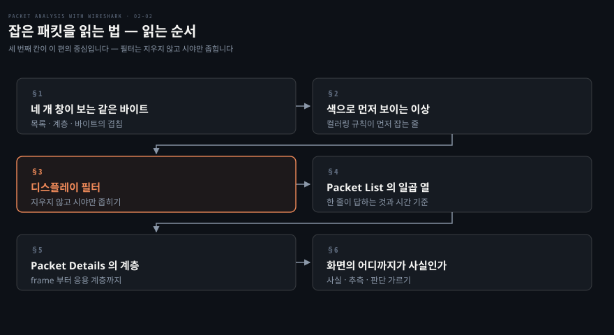
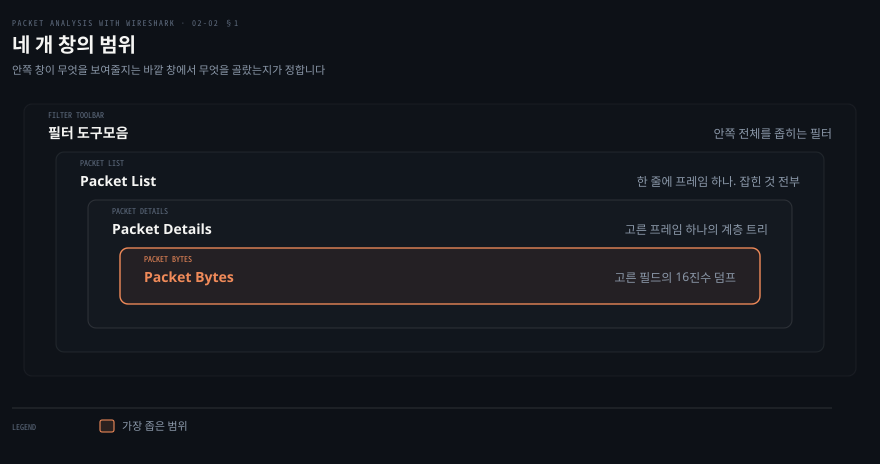
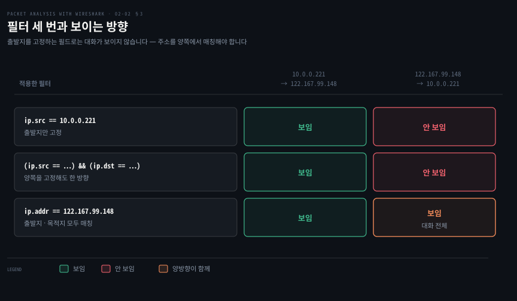
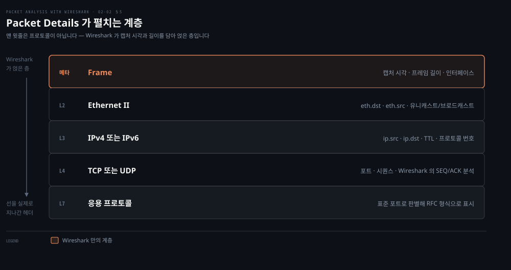

# 잡은 패킷을 읽는 법

---

> 파일이 생긴 다음부터는 무엇도 사라지지 않습니다. 디스플레이 필터는 패킷을 버리지 않고 시야만 좁히며, 네 개 창은 같은 바이트를 범위만 달리해 네 번 보여줍니다. 이 편은 그 화면을 읽는 법입니다.

## 핵심 요약

> 이 편이 매달린 하나의 생각은 **Wireshark 의 네 창이 같은 바이트를 범위만 좁혀 가며 네 번 보여주고, 디스플레이 필터는 그 바이트를 지우지 않은 채 보이는 범위만 바꾼다**는 것입니다.

앞 편의 캡처 필터와 대비하면 성격이 분명해집니다. 캡처 필터는 디스크에 무엇을 쓸지 정하므로 되돌릴 수 없습니다. 디스플레이 필터는 이미 파일에 들어온 것을 대상으로 하므로 몇 번이든 바꿔 걸 수 있습니다. 원문의 표현으로는 "모든 패킷의 완전한 해부를 제공함으로써 캡처 파일의 뷰를 바꾸는" 도구입니다.

그래서 이 편의 실수는 대개 필터를 잘못 쓴 데서 나옵니다. 원문이 세 번에 걸쳐 필터를 고쳐 가며 보여주는 예제가 그 지점을 정확히 짚습니다. 출발지를 고정하는 필드로는 두 호스트의 대화가 보이지 않고, 주소를 양쪽에서 매칭하는 필드라야 보입니다.

화면을 읽는 쪽에서는 Packet Details 창의 맨 윗줄이 함정입니다. `Frame` 은 선을 지나간 프로토콜이 아니라 Wireshark 가 캡처 시각과 길이를 담아 얹은 메타 계층입니다. 원문도 "frame 프로토콜은 Wireshark 만 사용하며 모든 TCP/IP 프로토콜이 그 위에 얹힌다"고 못박습니다.


## 학습 목표

> 이 편을 읽고 나면 아래 다섯 가지를 스스로 해낼 수 있습니다.

1. 네 개 창이 각각 어느 범위를 보는지, 한 창에서의 선택이 다른 창을 어떻게 바꾸는지 설명할 수 있습니다.
2. 두 호스트의 대화를 보려면 어떤 필드를 써야 하는지 판단하고, `ip.src` 계열로는 왜 안 되는지 설명할 수 있습니다.
3. 캡처 필터와 디스플레이 필터의 문법 차이를 같은 조건으로 각각 써 볼 수 있습니다.
4. Packet List 의 일곱 열이 각각 무엇을 답하는지 말하고, 시간 기준을 바꿔 패킷 사이 간격을 잴 수 있습니다.
5. Packet Details 의 계층을 위에서 아래로 짚으며 어느 줄이 실제 헤더이고 어느 줄이 Wireshark 가 얹은 것인지 가릴 수 있습니다.

아래는 이 편 전체를 화면을 읽어 내려가는 순서로 이은 지도입니다. 칸 옆의 절 번호가 본문에서 그 부분을 다루는 곳입니다.




## 1. 네 개 창이 보는 같은 바이트

> 창이 넷으로 나뉜 이유는 기능이 넷이어서가 아니라 보는 범위가 넷이기 때문입니다. 바깥 창에서 무엇을 골랐는지가 안쪽 창이 무엇을 보여줄지 정합니다.



### 화면이 넷으로 갈려 있어 어디를 봐야 할지 모르는 상태

캡처를 시작하거나 파일을 열면 창이 여럿으로 나뉜 화면이 뜹니다. 원문의 설명으로는 "Wireshark 가 패킷을 잡기 시작할 때, 또는 오프라인으로 보려고 `.pcap` 파일을 열 때" 나타나는 메인 창입니다. 각 창이 무엇을 담당하는지 모르면 아래 두 창은 그냥 배경처럼 지나치게 됩니다.

### 범위가 좁아지는 순서로 놓여 있습니다

원문은 화면의 구성 요소를 이렇게 정리합니다.

| 표시 | 무엇인가 |
|------|---------|
| 빨간 상자 | Wireshark 가 실행 중이며 패킷을 잡고 있음을 보입니다 |
| 1 | Filter 도구모음. 적용한 필터로 패킷을 걸러 냅니다 |
| 2 | Packet List 창. 잡힌 패킷을 모두 표시합니다 |
| 3 | Packet Details 창. 선택한 패킷을 자세한 형태로 보입니다 |
| 4 | Packet Byte 창. 선택한 패킷을 16진수 덤프 형태로 보입니다 |

위 그림처럼 넷은 나란한 관계가 아니라 안으로 들어가는 관계입니다. 선택이 한 방향으로만 전달됩니다.

- 필터 도구모음이 목록 전체를 좁힙니다.
- 목록에서 고른 한 줄이 Details 를 채웁니다.
- Details 에서 고른 한 필드가 Bytes 의 강조 범위를 정합니다.

원문도 Packet Bytes 를 "프레임에 담긴 바이트를 표시하며, 강조된 영역은 Packet Details 창에서 선택한 노드로 설정된다"고 설명합니다.

이 관계를 알면 조사 순서가 정해집니다.

1. 필터로 목록을 좁힙니다.
2. 목록에서 의심스러운 한 줄을 고릅니다.
3. Details 에서 계층을 내려가며 값을 확인합니다.
4. 값이 이상하면 Bytes 에서 실제 바이트를 봅니다.


## 2. 색이 먼저 말해 줍니다

> Packet List 의 색은 장식이 아니라 규칙의 결과입니다. 필터를 걸기 전에 눈이 먼저 이상한 줄을 잡아냅니다.

### 목록이 수천 줄인데 어디부터 봐야 하는지

캡처를 몇 분만 떠도 목록은 수천 줄이 됩니다. 무엇을 찾을지 이미 알고 있다면 필터를 걸면 되지만, 무엇이 이상한지를 모르는 상태에서 시작하는 조사가 더 많습니다.

### 규칙이 걸린 줄에 색이 붙습니다

원문은 목록 창을 처음 볼 때 색부터 관찰하라고 안내합니다. **"표시된 패킷이 서로 다른 색으로 나타납니다. 이것이 Wireshark 의 가장 좋은 기능 중 하나입니다. 설정된 필터에 따라 패킷에 색을 입혀, 찾고 있는 패킷을 시각적으로 파악하도록 돕습니다."**

규칙은 사용자가 바꿀 수 있습니다. 원문이 적는 경로는 `View | Coloring Rules` 이고, 대화상자에서 New 를 눌러 필터 이름과 필터 문자열을 정한 뒤 전경색과 배경색을 지정하는 방식입니다.

색이 규칙의 결과라는 점이 중요합니다. **색은 미리 정해진 프로토콜별 팔레트가 아니라 디스플레이 필터를 조건으로 삼은 규칙이므로, 조사 대상이 정해지면 그 조건으로 규칙을 하나 만들어 두는 편이 매번 필터를 다시 거는 것보다 빠릅니다.** 필터를 걸면 나머지가 사라지지만 색은 나머지를 남긴 채 표시하므로, 전후 맥락을 함께 봐야 할 때 유리합니다.


## 3. 디스플레이 필터 — 지우지 않고 시야만 좁힙니다

> 디스플레이 필터는 파일이 생긴 뒤에 작동하므로 몇 번이든 바꿔 걸 수 있습니다. 다만 어느 필드를 고르느냐에 따라 같은 대화가 보이기도 하고 안 보이기도 합니다.



### 필터를 걸었는데 절반만 보이는 상태

두 호스트가 주고받은 통신을 보려고 필터를 걸었는데 한쪽 방향만 나옵니다. 조건을 더 붙여 양쪽 주소를 모두 지정해도 결과가 그대로입니다. 원문이 세 단계에 걸쳐 재현하는 상황이 정확히 이것입니다.

### 원문의 세 번 시도

원문은 `SampleCapture01.pcap` 을 열고 HOSTA(`10.0.0.221`)와 HOSTB(`122.167.99.148`) 사이를 추적하는 과정을 세 번에 나눠 보여줍니다.

첫 번째로 `ip.src == 10.0.0.221` 을 겁니다. 결과에 대한 원문의 서술은 이렇습니다. **"Packet List 창이 출발지에서 목적지로 가는 트래픽을 표시합니다. 출발지는 `10.0.0.221` 로 고정되어 보입니다. 어느 패킷이 `122.167.99.148` 에서 `10.0.0.221` 로 보내진 것인지에 대한 증거가 없습니다."**

두 번째로 `(ip.src == 10.0.0.221) && (ip.dst == 122.167.99.148)` 로 조건을 늘립니다. 원문의 판정은 **"다시, Packet List 창은 두 호스트 사이의 대화를 표시하지 않습니다"** 입니다. 조건을 더한다고 방향이 늘지 않습니다.

세 번째로 `ip.addr == 122.167.99.148` 로 필드를 바꿉니다. 원문이 밝히는 이유가 답입니다. **"`ip.addr` 필드는 출발지와 목적지 주소 양쪽에 대해 IP 헤더와 매칭하므로 호스트 사이의 대화를 표시합니다."**

정리하면 이렇습니다. **`ip.src` 와 `ip.dst` 는 방향이 박힌 필드라 아무리 조합해도 한 방향만 남습니다. `ip.addr` 는 방향이 없는 필드라 한 번에 양방향을 잡습니다.** 같은 원리가 이더넷에도 적용되어, 원문은 목적지 MAC 으로 같은 대화를 잡는 예로 `eth.addr == 06:73:7a:4c:2f:85` 를 듭니다. `eth.dst` 가 아니라 `eth.addr` 인 이유가 방금의 원리입니다.

### 필터를 적용하는 세 가지 경로

원문은 필터를 손으로 치는 것 말고 두 가지 경로를 더 제시합니다.

1. 필터 칸에 프로토콜 이름을 치고 Apply 를 누릅니다. 원문의 예는 `http_01.pcap` 을 열고 `http` 를 치는 것입니다.
2. Packet List 창의 열에서 값을 고르고 오른쪽 클릭해 `Apply as Filter | Selected` 를 고릅니다. 원문의 예는 출발지 IP `122.167.102.21` 로 필터를 만드는 것입니다.
3. Packet Details 창에서도 같은 방식으로 만들 수 있습니다. 원문은 "단계는 동일하다"고 적습니다.

필터를 지울 때는 Filter 도구모음의 Clear 를 눌러 잡힌 패킷 전체를 다시 표시합니다.

두 번째 경로가 실무에서 가장 빠릅니다. **필드 이름을 외우지 않아도 화면에서 값을 골라 오른쪽 클릭하면 정확한 필드명이 자동으로 채워지기 때문입니다.** 원문도 "필터를 외울 필요가 없다"고 적으며 Autocomplete 기능을 함께 듭니다. 필터 칸에 첫 마침표를 찍으면 그 뒤에 올 수 있는 디섹터가 모두 나열됩니다.

### 원문의 필터 예제 열두 가지

| 목적 | 필터 |
|------|------|
| 특정 포트의 패킷 | `tcp.port == 443` |
| 출발지 포트의 패킷 | `tcp.srcport=2222` |
| 443 포트의 SYN 패킷 | `(tcp.port == 443) && (tcp.flags == 0x0010)` |
| HTTP 프로토콜 | `http` |
| HTTP GET 메서드 기준 | `http.request.method == "GET"` |
| `&&` 로 tcp 와 http 결합 | `tcp && http` |
| TCP 윈도우 크기 확인 | `tcp.window_size <2000` |
| 정상 트래픽에는 ARP 제외 | `!arp` |
| MAC 주소 필터 | `eth.dst == 06:43:7b:4c:4f:85` |
| TCP ACK 걸러 내기 | `tcp.flags.ack==0` |
| RST 와 ACK 만 확인 | `(tcp.flags.ack == 1) && (tcp.flags.reset == 1)` |
| 모든 SNMP | `Snmp` |
| HTTP 또는 DNS 또는 SSL | `http \|\| dns \| ssl` |

> **원문 정오**: 세 번째 행의 `(tcp.port == 443) && (tcp.flags == 0x0010)` 는 SYN 패킷을 잡지 못합니다. `0x0010` 은 **ACK** 비트입니다. TCP 제어 비트는 RFC 9293 기준으로 CWR · ECE · URG · ACK · PSH · RST · SYN · FIN 순서라, ACK 이 다섯 번째 비트(`0x10`)이고 SYN 은 일곱 번째 비트(`0x02`)입니다.[^tcp-flags] SYN 만 잡으려면 `(tcp.port == 443) && (tcp.flags == 0x0002)` 를 쓰거나, 비트 필드를 직접 쓰는 편이 더 안전합니다 — `tcp.flags.syn == 1 && tcp.flags.ack == 0` 은 값 전체를 비교하지 않으므로 다른 플래그가 함께 서 있어도 의도대로 동작합니다. **같은 책 3장이 이 정오를 스스로 반증합니다.** 3장의 TCP 데이터 통신 절은 필터 목록에서 `tcp.flags == 0x0018` 을 PSH·ACK, `tcp.flags == 0x0011` 을 FIN·ACK, 그리고 `tcp.flags == 0x0010` 을 **"모든 ACK 패킷"** 이라고 적습니다. 2장의 라벨만 어긋나 있습니다.

> **원문 정오**: 필터 표에 문법 오류가 셋 더 있습니다. `tcp.srcport=2222` 는 등호가 하나입니다. 공식 문서가 나열하는 동등 비교 연산자는 `eq`·`any_eq`·`==` 셋뿐이고 `=` 는 없습니다.[^dfilter-ops] `http || dns | ssl` 은 마지막 구분자가 파이프 하나입니다. 논리 OR 는 `or` 또는 `||` 이며 파이프 하나는 연산자 목록에 없습니다.[^dfilter-ops] `Snmp` 는 대문자로 시작합니다. 공식 문서는 5.0 부터 영문 연산자만 대소문자를 가리지 않게 됐다고 적으며, **필드 이름은 여전히 대소문자를 가린다**고 명시합니다.[^dfilter-ops] 셋 다 `tcp.srcport == 2222`·`http || dns || ssl`·`snmp` 로 고쳐야 동작합니다.

> **지금은 다릅니다 (4.6)**: 마지막 행의 `ssl` 은 현행 판에서 `tls` 입니다. Wireshark 3.0 릴리스 노트가 "SSL 디섹터의 이름이 TLS 로 바뀌었다"고 적고, 옛 `ssl.*` 필드는 호환을 위해 지원하지만 "앞으로 제거될 수 있다"고 덧붙입니다.[^ssl-tls] 새로 쓰는 필터에는 `tls` 를 씁니다.

원문이 함께 제시하는 참조가 지금도 유효합니다. 프로토콜별 필드 이름은 디스플레이 필터 레퍼런스에서 찾을 수 있습니다.[^dfref]


## 4. Packet List 의 일곱 열

> 목록의 한 줄이 프레임 하나입니다. 일곱 열은 각각 다른 질문에 답하며, 그중 시간 열만 기준을 바꿀 수 있습니다.

### 어느 열을 봐야 문제가 드러나는지

목록에는 열이 일곱 개 있는데 대부분의 조사에서 실제로 쓰는 것은 두세 개입니다. 어느 열이 무엇을 답하는지 알아야 눈이 그쪽으로 갑니다.

### 일곱 열이 답하는 것

원문은 각 열을 이렇게 설명합니다. 한 행이 서로 다른 패킷 하나에 대응하며, 그 단위를 프레임이라 부릅니다.

| 열 | 무엇을 답하는가 |
|----|---------------|
| No. | 현재 라이브 또는 오프라인 캡처에서의 패킷 번호 |
| Time | 패킷이 잡힌 시각. libpcap 파일의 Automatic 설정은 마이크로초 단위 |
| Source | 패킷이 출발한 곳의 IP 주소 |
| Destination | 패킷이 도착하는 곳의 IP 주소 |
| Protocol | 표준 포트를 근거로 판별한 패킷의 프로토콜 정보 |
| Length | 바이트 단위 패킷 길이 |
| Info | 패킷의 개요와 성격에 대한 요약 |

Protocol 열의 설명에 단서가 있습니다. **표준 포트를 근거로 판별하므로, 비표준 포트에서 도는 서비스는 실제 프로토콜과 다르게 표시됩니다.** 그 경우를 바로잡는 것이 다음 편에서 다룰 Decode-As 기능입니다.

### 시간 기준을 옮겨 간격을 잽니다

Time 열의 값은 기본적으로 캡처 시작부터의 경과 시간입니다. 원문은 이 기준을 바꾸는 두 가지를 제시합니다.

첫째는 표시 형식입니다. `View | Time Display Format` 에서 쓸 수 있는 표현 형식을 고릅니다.

둘째가 조사에서 더 유용합니다. **Set Time Reference 는 선택한 패킷을 기준점으로 삼습니다.** 원문의 예는 `http.pcap` 을 열고 38번 패킷을 고른 뒤 오른쪽 클릭으로 `Set Time Reference (toggle)` 를 적용하는 것입니다. 원문의 설명대로 **"`*REF*` 가 설정되면 그 뒤 모든 패킷의 시간 계산에서 출발점이 됩니다."**

지연을 조사할 때 이 기능이 답을 바로 줍니다. 요청 패킷에 기준점을 걸면 그 뒤 줄의 Time 값이 곧 요청 이후 경과 시간이라, 응답이 몇 밀리초 만에 왔는지를 뺄셈 없이 읽을 수 있습니다.


## 5. Packet Details 가 펼치는 계층

> 선택한 프레임이 계층별로 펼쳐집니다. 맨 윗줄은 선을 지나간 프로토콜이 아니라 Wireshark 가 얹은 메타 계층입니다.



### 트리를 펼쳤는데 어느 줄이 진짜인지 모르는 상태

Details 창을 펼치면 줄이 다섯 남짓 나옵니다. 맨 위가 `Frame` 인데, 이더넷보다 아래에 무엇이 더 있나 싶어집니다. 이 줄의 정체를 모르면 계층 순서 전체가 어긋나 보입니다.

### 맨 윗줄은 프로토콜이 아닙니다

원문이 그 답을 줍니다. **"frame 프로토콜은 Wireshark 만 사용합니다. 모든 TCP/IP 프로토콜이 그 위에 얹힙니다. frame 은 패킷이 언제 잡혔는지를 보여줍니다."** 선을 지나간 것이 아니라 Wireshark 가 캡처 메타데이터를 담아 만든 층입니다.

그 아래부터가 실제 헤더입니다. 원문은 이더넷을 "TCP/IP 스택의 링크 계층 프로토콜"로 소개하고, 보내는 호스트에서 하나(유니캐스트) 또는 여럿(멀티캐스트·브로드캐스트)의 받는 호스트로 패킷을 보낸다고 설명합니다. 쓸 만한 필터로 둘을 듭니다.

```bash
eth.dst == 06:3c:0f:39:2e:f7   # 이 MAC 주소로 보내진 패킷만
eth.dst == ff:ff:ff:ff:ff:ff   # 브로드캐스트 트래픽만
```

그다음 IP 계층은 데이터그램을 IPv4 로 보냈는지 IPv6 로 보냈는지를 담습니다. 원문이 드는 필터는 셋입니다.

```bash
ip.src == 122.166.88.120/24    # 그 서브넷에서 나온 트래픽
ip.addr == 122.166.88.120      # 그 호스트로 가거나 그 호스트에서 나온 트래픽
```

> **원문 정오**: 원문은 이 목록에 `Host 122.166.88.120` 을 세 번째 디스플레이 필터로 함께 적습니다. 이것은 디스플레이 필터가 아니라 **캡처 필터(BPF) 문법**입니다. 디스플레이 필터 칸에 넣으면 동작하지 않습니다. 앞 편에서 본 대로 두 문법은 체계가 다르며, BPF 의 `host x` 에 대응하는 디스플레이 필터가 바로 바로 위 줄의 `ip.addr == x` 입니다.

TCP 계층은 TCP 관련 데이터를 모두 담고, 통신이 UDP 라면 그 자리가 UDP 로 바뀝니다. 원문은 여기서 Wireshark 가 하는 일을 덧붙입니다. **"시퀀스 번호를 근거로 SEQ/ACK 분석이 수행되고 expert info 가 제공됩니다."** 재전송이나 중복 ACK 같은 판정이 이 줄에서 나옵니다.

맨 아래 응용 계층은 패킷에 응용 프로토콜이 들어 있을 때만 나타납니다. 원문의 설명대로 Wireshark 는 표준 포트를 근거로 프로토콜을 해독해 RFC 가 정의한 읽을 수 있는 형식으로 표시합니다.

### 이더넷 프레임의 구조

원문은 이더넷 프레임의 구조를 표로 제시합니다. 숫자는 바이트 수입니다.

| Preamble | 목적지 MAC | 출발지 MAC | Type/length | 사용자 데이터 | FCS |
|:---:|:---:|:---:|:---:|:---:|:---:|
| 8 | 6 | 6 | 2 | 46–1500 | 4 |

Type/length 필드의 값이 상위 프로토콜을 정합니다. 원문이 드는 값은 셋입니다. IPv4 는 `0800`, IPv6 는 `86DD`, ARP 는 `0806` 입니다.

원문은 여기서 헤더 크기를 계산해 줍니다. **"이더넷 헤더 전체는 14바이트입니다. 목적지 주소 6바이트, 출발지 주소 6바이트, EtherType 2바이트입니다."** 앞 편의 snaplen 을 정할 때 이 숫자가 기준이 됩니다.

> **원문 정오**: 표 아래의 "preamble(8바이트)과 FCS(4바이트)는 프레임의 일부가 아니며 Wireshark 는 이 필드를 잡지 않습니다"는 FCS 쪽이 지나치게 단정적입니다. Wireshark 위키는 preamble 에 대해서는 이더넷 하드웨어가 걸러 내므로 Wireshark 나 다른 애플리케이션에 전달되지 않는다고 단언합니다. FCS 는 다르게 적습니다. **대부분의 이더넷 인터페이스가 FCS 를 제공하지 않거나 드라이버가 그렇게 설정하지 않지만, 일부 플랫폼의 일부 인터페이스에서는 수신 패킷에 대해 FCS 가 제공된다는 것입니다.**[^ws-ethernet] "잡지 않습니다"가 아니라 "대개 못 잡지만 환경에 따라 잡힙니다"가 맞습니다. 같은 위키가 최소 프레임 크기 64바이트는 FCS 를 포함한 값이라 혼동을 준다고 지적하는 점도 함께 볼 만합니다.

### Packet Bytes 창

원문의 설명은 한 문장입니다. **"Packet Bytes 창은 프레임에 담긴 바이트를 표시하며, 강조된 영역은 Packet Details 창에서 선택한 노드에 맞춰 설정됩니다."**

짧지만 이 창의 쓸모가 그 한 문장에 다 들어 있습니다. Details 에서 필드를 클릭하면 그 필드가 실제로 프레임의 몇 번째 바이트인지가 아래에서 강조됩니다. **해석된 값과 원본 바이트를 눈으로 대조할 수 있는 유일한 자리라, Wireshark 의 해석이 의심스러울 때 마지막으로 확인하는 곳이 됩니다.**


## 심화 학습

> 2장 분석 축에서 판본을 타는 것은 필터 이름 하나와 문법 검사의 엄격함입니다. 창 구성과 필드 의미는 그대로입니다.

| 원문(1.12, 2015) | 현행(4.6, 2026) | 성격 |
|------------------|-----------------|------|
| 네 개 창 구성 | 그대로 | 유지 |
| `View \| Coloring Rules` | 그대로 | 유지 |
| `Apply as Filter \| Selected` | 그대로 | 유지 |
| `ip.addr` 가 양방향 매칭 | 그대로 | 유지 |
| Set Time Reference | 그대로 | 유지 |
| `ssl` 필터 | **`tls`**. 옛 `ssl.*` 은 호환 유지, 제거 예고[^ssl-tls] | 바뀜 |
| 동등 비교는 `==` | 그대로. `eq`·`any_eq` 도 같은 뜻[^dfilter-ops] | 유지 |
| 필드 이름 대소문자 | 그대로 가립니다. 5.0 부터 영문 *연산자*만 가리지 않습니다[^dfilter-ops] | 확장 |

원문이 다루지 않는 축이 하나 있습니다. **필터 칸의 색이 문법 검사 결과를 알려준다는 점입니다.** 초록이면 유효한 필터, 빨강이면 문법 오류, 노랑이면 문법은 맞지만 의도와 다르게 동작할 가능성이 있다는 경고입니다. 위 정오 항목의 `tcp.srcport=2222` 나 `Snmp` 를 실제로 쳐 보면 칸이 빨갛게 변해, 문서를 찾지 않고도 잘못된 필터임을 알 수 있습니다.

기준선을 잡아 두면 유용한 필터가 몇 개 있습니다. 원문의 예제 표를 실무 관점으로 다시 묶으면 이렇습니다.

```bash
# 무엇이 실패하고 있는가 — 연결이 거부되거나 끊긴 자리
tcp.flags.reset == 1

# 재전송이 일어나는가 — Wireshark 의 SEQ/ACK 분석이 붙여 주는 판정
tcp.analysis.retransmission

# 응답이 느린가 — 요청 뒤 경과 시간이 임계를 넘은 것만
http.time > 1

# 특정 대화만 — 방향 없는 필드로 양쪽을 함께
ip.addr == 10.0.0.221 && tcp.port == 8080
```

앞의 셋은 원문의 예제 표에 없지만 같은 문법 체계 안에 있고, 필드 이름은 디스플레이 필터 레퍼런스에서 확인할 수 있습니다.[^dfref]


## 면접 대비

### 한 줄 정의

"디스플레이 필터는 이미 저장된 캡처에서 보여줄 패킷만 고르는 필터라 패킷을 지우지 않으며, 어느 필드를 쓰느냐에 따라 같은 대화가 한 방향만 보이기도 하고 양방향이 보이기도 합니다."

### 핵심 포인트 세 가지

1. **방향이 박힌 필드와 아닌 필드를 구분해야 합니다.** `ip.src`·`ip.dst`·`eth.dst` 는 방향이 박혀 있어 아무리 조합해도 한 방향만 남습니다. `ip.addr`·`eth.addr` 는 출발지와 목적지 양쪽을 매칭하므로 대화가 한 번에 보입니다.
2. **Details 창의 맨 윗줄은 프로토콜이 아닙니다.** `Frame` 은 Wireshark 가 캡처 시각과 길이를 담아 얹은 메타 계층이고, 실제로 선을 지나간 헤더는 그 아래 이더넷부터입니다.
3. **Protocol 열은 표준 포트로 판별한 결과입니다.** 비표준 포트에서 도는 서비스는 실제와 다르게 표시되며, 그것을 바로잡는 기능이 Decode-As 입니다.

### 자주 묻는 질문

Q: 두 서버 사이의 통신만 보려면 어떤 필터를 씁니까?
A: `ip.addr == A && ip.addr == B` 를 씁니다. `ip.src == A && ip.dst == B` 로 쓰면 A 에서 B 로 가는 방향만 나오고 돌아오는 응답이 빠집니다.

Q: 요청과 응답 사이 시간을 재려면 어떻게 합니까?
A: 요청 패킷을 고르고 오른쪽 클릭해 Set Time Reference 를 겁니다. 그 뒤 줄의 Time 값이 곧 요청 이후 경과 시간이 됩니다.

Q: 필터를 걸었는데 아무것도 안 나옵니다.
A: 먼저 필터 칸의 색을 봅니다. 빨강이면 문법 오류입니다. 초록인데 결과가 없으면 필드 선택이 잘못됐을 가능성이 큽니다. 화면에서 값을 골라 오른쪽 클릭으로 `Apply as Filter` 를 쓰면 정확한 필드명이 채워집니다.


## 핵심 개념 체크리스트

- [ ] 네 개 창의 포함 관계를 그리고, 한 창의 선택이 어느 창을 바꾸는지 말할 수 있습니까?
- [ ] `ip.src` 로는 대화가 안 보이고 `ip.addr` 로는 보이는 이유를 설명할 수 있습니까?
- [ ] 캡처 필터 `host 10.0.0.221` 에 대응하는 디스플레이 필터를 쓸 수 있습니까?
- [ ] Packet List 의 일곱 열 중 어느 것이 표준 포트 추정에 기대는지 지목할 수 있습니까?
- [ ] Details 창에서 실제 헤더가 아닌 줄을 골라낼 수 있습니까?
- [ ] `tcp.flags == 0x0002` 와 `tcp.flags == 0x0010` 이 각각 무엇을 잡는지 말할 수 있습니까?


## 관련 문서

- [02-01 패킷을 잡는 법](./02-01.패킷을 잡는 법.md) — 이 편의 앞. 캡처 필터와 파일이 생기기까지
- [02-03 분석을 돕는 기능들](./02-03.분석을 돕는 기능들.md) — 이 편의 뒤. Decode-As·IO Graph·Follow TCP Stream
- [Packet Analysis with Wireshark — 정독 인덱스](./README.md) — 7개 장 전체 지도


## 참고 자료

- 원본: 《Packet Analysis with Wireshark》 (Anish Nath, Packt Publishing, 2015) ISBN 978-1-78588-781-9
- 다룬 범위: Chapter 2 의 Wireshark user interface 절
- [Wireshark 디스플레이 필터 레퍼런스](https://www.wireshark.org/docs/dfref/) — 프로토콜별 필드 이름의 정본
- [Wireshark Wiki — Ethernet](https://wiki.wireshark.org/Ethernet) — 원문 References 절이 가리키는 문서
- [RFC 9293 — Transmission Control Protocol](https://datatracker.ietf.org/doc/html/rfc9293) — TCP 제어 비트 순서

[^dfilter-ops]: Wireshark User's Guide, Building Display Filter Expressions — 동등 비교 연산자는 `eq`·`any_eq`·`==` 이며 단일 `=` 는 목록에 없습니다. 논리 연산자는 `and`/`&&`, `or`/`||`, `xor`/`^^`, `not`/`!` 입니다. 대소문자에 대해서는 "Beginning in Wireshark 5.0, the English forms of operators (but not field, function, or macro names, or the first characters in escape sequences) are case-insensitive." <https://www.wireshark.org/docs/wsug_html_chunked/ChWorkBuildDisplayFilterSection.html> (2026-09-05 조회)

[^tcp-flags]: RFC 9293 §3.1 Header Format 의 제어 비트 순서 — CWR · ECE · URG("Urgent pointer field is significant") · ACK("Acknowledgment field is significant") · PSH · RST("Reset the connection") · SYN("Synchronize sequence numbers") · FIN. 각 플래그는 1비트를 차지합니다. Wireshark 의 `tcp.flags` 는 16비트 부호 없는 정수이고 `tcp.flags.syn`·`tcp.flags.ack` 는 불리언입니다. <https://datatracker.ietf.org/doc/html/rfc9293> · <https://www.wireshark.org/docs/dfref/t/tcp.html> (2026-09-05 조회)

[^ws-ethernet]: Wireshark Wiki, Ethernet — "As the Ethernet hardware filters the preamble, it is not given to Wireshark or any other application." · "Most Ethernet interfaces also either don't supply the FCS to Wireshark or other applications, or aren't configured by their driver to do so; therefore, Wireshark will typically only be given the green fields, although on some platforms, with some interfaces, the FCS will be supplied on incoming packets." <https://wiki.wireshark.org/Ethernet> (2026-09-05 조회)

[^ssl-tls]: Wireshark 3.0.0 릴리스 노트 — "The SSL dissector has been renamed to TLS. As with BOOTP the old "ssl.\*" display filter fields are supported but may be removed in a future release." <https://www.wireshark.org/docs/relnotes/wireshark-3.0.0.html> (2026-09-05 조회)

[^dfref]: Wireshark Display Filter Reference — 프로토콜별 필드 이름·타입 목록. TCP 는 <https://www.wireshark.org/docs/dfref/t/tcp.html>, 전체 색인은 <https://www.wireshark.org/docs/dfref/> (2026-09-05 조회)
