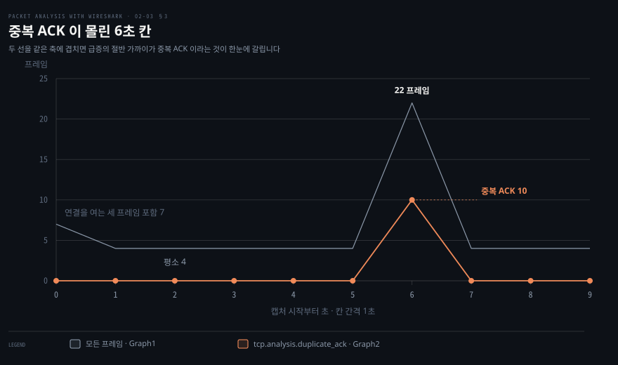
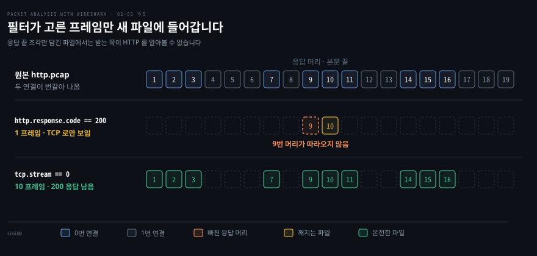
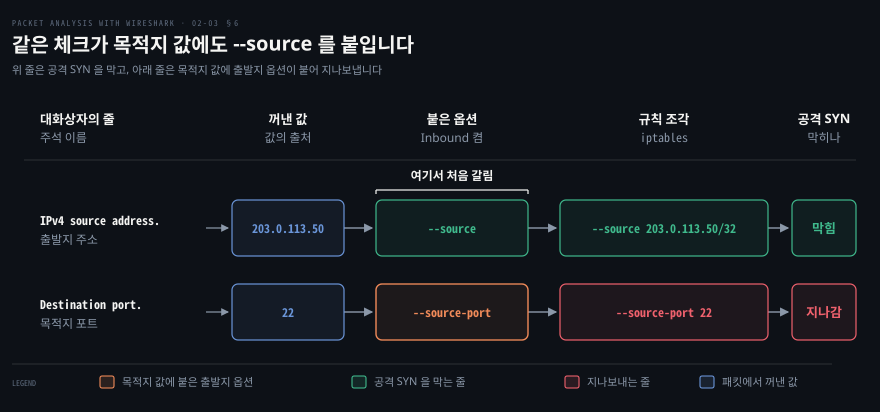

# 분석을 돕는 기능들

---

> 2장의 마지막 절은 화면을 읽는 것만으로는 닿지 않는 자리들을 다룹니다. 프로토콜이 잘못 판별됐을 때, 흩어진 세그먼트를 한 대화로 봐야 할 때, 이상한 구간을 시간축에서 찾아야 할 때 쓰는 기능 여섯 가지입니다.

## 핵심 요약

> 이 편이 매달린 하나의 생각은 **Wireshark 의 기본 해석이 틀리거나 부족한 지점마다 그것을 사람이 덮어쓰는 기능이 하나씩 붙어 있다**는 것입니다.

기본 해석은 포트 표와 내용 짐작에 기댑니다. 원문은 "표준 포트를 근거로 들어오는 패킷을 자동으로 식별하고 해독"한다고 포트 쪽만 적었습니다. 현행 판의 TCP 판별은 표에 없는 포트면 패킷 내용으로 한 번 더 짐작합니다. 둘 다 빗나가면 TCP 로만 보이고 그 자리를 Decode-As 가 메웁니다.

해석의 세부도 기본값이 있습니다. HTTP 헤더가 여러 TCP 세그먼트에 걸쳐 왔을 때 이어 붙일지, gzip 으로 압축된 본문을 풀어서 보일지 같은 것입니다. 프로토콜 설정이 그 기본값을 바꿉니다.

나머지 넷은 관점을 바꾸는 기능입니다. IO Graph 는 패킷을 시간축의 처리량으로, Follow TCP Stream 은 흩어진 세그먼트를 하나의 대화로, Export Specified Packets 는 걸러 낸 것만 별도 파일로, 방화벽 ACL 생성은 관찰한 패킷을 차단 규칙으로 바꿉니다.


## 학습 목표

> 이 편을 읽고 나면 아래 다섯 가지를 스스로 해낼 수 있습니다.

1. 포트 표에도 휴리스틱에도 걸리지 않은 서비스가 TCP 로만 보이는 이유를 설명하고 Decode-As 로 바로잡을 수 있습니다.
2. Decode-As 가 하는 일이 복호화가 아니라 해석이라는 점을 구분해 말할 수 있습니다.
3. HTTP 프로토콜 설정 여섯 가지가 각각 무엇을 바꾸는지 짚을 수 있습니다.
4. IO Graph 에서 스파이크를 짚어 해당 패킷으로 이동하고 두 번째 그래프에 필터를 걸어 원인 트래픽을 분리할 수 있습니다.
5. 조사 결과를 다른 사람에게 넘길 형태 — 걸러 낸 패킷 파일이나 방화벽 규칙 — 로 바꿀 수 있습니다.

이 편에서 새로 만나는 낱말입니다. `어디서` 는 그 낱말이 실제로 설명되는 절입니다.

| 키워드 | 뜻 | 학습 포인트·연결 개념 | 어디서 |
|---|---|---|---|
| 디섹터 (dissector) | 바이트를 프로토콜로 풀어 주는 해석기 | 포트 표 → 휴리스틱 순 · 못 걸리면 TCP 로만 | §1 |
| 휴리스틱 디섹터 | 내용 모양으로 프로토콜을 추정 | 포트 표 다음 차례 · TCP 위에서 동작 | §1 |
| Decode As | 이 포트를 이 프로토콜로 |  복호화가 아니라 해석 · `-d` 로도 지정 | §1 |
| 재조립 (reassembly) | 흩어진 세그먼트를 한 덩어리로 | 끄면 헤더만 반쯤 보임 | §2 |
| IO Graph | 처리량을 시간축에 올린 그래프 | 스파이크에서 패킷으로 이동 · 둘째 그래프에 필터 | §3 |
| Follow TCP Stream | 한 스트림을 대화로 이어 붙임 | 목록에 흩어진 요청·응답을 모음 | §4 |


## 1. 포트가 거짓말할 때

> Wireshark 는 TCP 위의 프로토콜을 포트 표로 먼저, 패킷 내용으로 다음에 짐작합니다. 둘 다 빗나가면 TCP 로만 보이고, 그 자리를 사람이 Decode As 로 덮어씁니다.


### TLS 인 줄 아는데 화면에는 TCP 만 보이는 상태

원문이 드는 상황이 정확합니다. `https.pcap` 을 열면 HTTPS 트래픽이 잡혀 있는데도 **"SSL 관련 데이터를 보여주지 않고 모든 TCP 통신만 보여줍니다."** 분명 TLS 인데 Details 창에 TLS 계층이 없습니다. 원문이 드는 서비스 포트는 `4433` 입니다.

4433 이 어떤 번호인지부터 보면 왜 빗나갔는지 이해됩니다. 443 은 IANA 에 `https` 로 등록돼 있습니다. 4433 의 등록 주인은 TLS 가 아니라 `vop`(Versile Object Protocol)입니다.[^iana-ports] 등록부만 보면 4433 은 TLS 와 상관없는 번호입니다.

그래도 4433 에서 TLS 를 볼 수 있는 경우가 있습니다. OpenSSL 의 시험용 서버 `openssl s_server` 는 포트를 정하지 않으면 4433 에서 기다립니다.[^openssl-sserver] 두 번호가 속한 포트 구간과 구간마다 이름을 얼마나 믿을지는 [02-01 패킷을 잡는 법](./02-01.패킷을 잡는 법.md) §3 이 다룹니다.

Wireshark 의 TLS 포트 표에도 4433 은 들어 있지 않습니다. tshark 4.6.8 에서 `tshark -G decodes` 로 뽑아 보면 TLS 에 묶인 TCP 포트는 443 · 465 · 636 · 853 · 993 · 995 같은 번호입니다. 포트 표만 보는 판별이라면 4433 의 TLS 는 알아볼 수 없습니다.

현행 4.6.8 에서는 이 증상이 TLS 로 재현되지 않습니다. 빈 설정에서 4433 의 ClientHello 도, 연결 중간부터 잡힌 TLS 레코드도 TLS 로 읽혔습니다. Wireshark 는 포트 표에 걸리지 않은 연결이면 패킷 앞머리의 바이트 모양으로 프로토콜을 한 번 더 짐작합니다. 이 단계를 휴리스틱이라 부르는데 TLS 를 잡아낸 것도 이 짐작입니다. 판별 순서는 아래 「TCP 위에서는 포트 표 다음에 휴리스틱을 봅니다」가 다룹니다.

같은 증상은 지금도 직접 만들어 볼 수 있습니다. 휴리스틱이 없는 프로토콜을 표에 없는 포트에 올리면 됩니다. Redis 를 설치하지 않아도 `nc` 로 Redis 의 요청과 응답 바이트만 흉내 내면 충분합니다.

캡처는 루프백 `lo0` 에서 뜹니다. 기계 밖으로 나가지 않는 인터페이스라 남의 프레임이 섞여 들어오지 않습니다. 사무실 네트워크의 `en0` 에서는 다른 기기의 mDNS 가 함께 들어올 수 있습니다. 그 까닭은 [01-01 패킷 분석기와 Wireshark](./01-01.패킷 분석기와 Wireshark.md) §4 가 다룹니다.

```bash
# 16379 번 포트만 4초 동안 잡는다
dumpcap -i lo0 -f 'tcp port 16379' -a duration:4 -w ~/paw-0203-resp.pcapng & DC=$!
sleep 1
# 받는 쪽은 +PONG 을 돌려주고, 보내는 쪽은 PING 을 Redis 형식으로 보낸다
(printf '+PONG\r\n'; sleep 1) | nc -l 127.0.0.1 16379 &
sleep 0.5
(printf '*1\r\n$4\r\nPING\r\n'; sleep 1) | nc 127.0.0.1 16379
# 캡처가 끝날 때까지만 기다린다
wait $DC
```

이 편에 싣는 출력은 같은 흐름을 문서용 주소(RFC 5737)로 합성한 캡처를 tshark 4.6.8 로 읽은 것입니다. 직접 뜬 파일에서는 주소가 `127.0.0.1` 로 나오고 프레임 번호와 포트, 시각이 다릅니다. 2026-09-14 에 위 방법으로 뜬 파일에서도 요청과 응답은 TCP 로만 보였고 아래 `-d` 를 걸자 RESP 로 풀렸습니다.

```bash
tshark -r ~/paw-0203-resp.pcapng
```

```bash
    4   0.010000   192.0.2.10 → 198.51.100.20 TCP 68 51300 → 16379 [PSH, ACK] Seq=1 Ack=1 Win=65535 Len=14
    5   0.030000 198.51.100.20 → 192.0.2.10   TCP 61 16379 → 51300 [PSH, ACK] Seq=1 Ack=15 Win=65535 Len=7
```

6379 는 IANA 등록 이름이 `redis` 이고[^iana-ports] Wireshark 의 RESP 포트 표에도 있어서 같은 요청을 6379 로 보내면 `RESP 68 Request: PING` 으로 읽힙니다.

16379 에서도 같은 결과를 내려면 이 포트는 RESP 라고 사람이 직접 지정해 주면 됩니다. 그 기능이 Decode As 입니다. tshark 에서는 `-d 포트,프로토콜` 로 겁니다. 자세한 동작은 아래 「Decode As 로 덮어씁니다」에서 봅니다.

```bash
tshark -r ~/paw-0203-resp.pcapng -d tcp.port==16379,resp
```

```bash
    4   0.010000   192.0.2.10 → 198.51.100.20 RESP 68 Request: PING
    5   0.030000 198.51.100.20 → 192.0.2.10   RESP 61 Response: PONG
```

### TCP 로만 보이면 무엇을 잃나

Protocol 열에 TCP 가 찍히는 것이 왜 문제인지는 잃는 것을 세어 보면 드러납니다. 이번에는 18080 포트의 웹 서버에 HTTP 요청을 두 번 보내 캡처합니다. 이 파일은 §4 · §5 · §6 에서도 씁니다.

```bash
# 받을 파일 하나와 18080 번 웹 서버를 준비한다
mkdir -p ~/paw-www && printf '<html><body>hello</body></html>\n' > ~/paw-www/index.html
# 서버 프로세스 번호를 적어 두었다가 끝낼 때 그 번호만 끈다
python3 -m http.server 18080 --bind 127.0.0.1 --directory ~/paw-www >/dev/null 2>&1 & echo $! > ~/paw-www/server.pid
# 18080 번만 4초 동안 잡는 사이, 있는 파일과 없는 파일을 한 번씩 요청한다
dumpcap -i lo0 -f 'tcp port 18080' -a duration:4 -w ~/paw-0203-http.pcapng &
sleep 1
curl -s -o /dev/null http://127.0.0.1:18080/index.html
curl -s -o /dev/null http://127.0.0.1:18080/missing
sleep 4
```

HTTP 는 휴리스틱이 알아보므로, 짐작이 빗나가 포트로만 판별되는 상황을 재현하려고 HTTP 휴리스틱을 끄고 읽습니다. 아래 두 줄은 문서용 주소로 합성한 캡처의 출력입니다. 파이썬 서버로 뜬 파일에서도 요청 줄은 휴리스틱을 끄면 TCP, `-d` 를 걸면 HTTP 로 보였습니다. 다만 그 서버는 응답을 `HTTP/1.0` 으로 보내므로, 직접 뜬 파일의 응답 줄에는 `HTTP/1.0` 이 찍힙니다.

```bash
tshark -r ~/paw-0203-http.pcapng --disable-heuristic http_tcp
```

```bash
    5   0.110000   192.0.2.10 → 198.51.100.20 TCP 101 51234 → 18080 [PSH, ACK] Seq=1 Ack=1 Win=65535 Len=47
```

같은 프레임에 `-d tcp.port==18080,http` 로 Decode As 를 걸면 이렇게 바뀝니다.

```bash
    5   0.110000   192.0.2.10 → 198.51.100.20 HTTP 101 GET /index.html HTTP/1.1
```

두 줄 사이에서 잃은 것이 셋입니다.

1. **Info 열이 쓸모를 잃습니다.** 요청 메서드와 경로 대신 포트와 플래그, 길이만 남습니다.
2. **프로토콜 필드 필터가 걸리지 않습니다.** `http.request.method == "GET"` 을 걸면 휴리스틱을 끈 쪽은 0건, Decode As 를 건 쪽은 1건이 나왔습니다.
3. **Follow HTTP Stream 이 비어 있습니다.** 스트림 따라가기는 §4 에서 다룹니다. 휴리스틱을 끈 쪽은 스트림 내용 없이 머리글만 나왔고 Decode As 를 건 쪽은 요청 본문이 그대로 나왔습니다. Follow TCP Stream 으로 날 바이트는 볼 수 있지만 HTTP 로 풀어 주지는 않습니다.

### TCP 위에서는 포트 표 다음에 휴리스틱을 봅니다

애초에 Wireshark 가 짐작해야 하는 이유는 헤더 구조에 있습니다. 이더넷에는 EtherType 이, IP 에는 다음 계층 프로토콜을 가리키는 Protocol 필드가 있어 헤더가 다음 계층을 직접 알려 줍니다.[^rfc791-proto] 전송 계층부터는 그런 칸이 없습니다. UDP 헤더는 출발지 포트, 목적지 포트, 길이, 체크섬 네 칸이 전부입니다.[^rfc768] TCP 헤더도 포트와 순서·흐름 제어를 위한 칸뿐입니다.[^rfc9293-hdr]

그래서 그 위의 프로토콜은 포트 번호나 내용을 보고 짐작할 수밖에 없습니다. 공식 문서도 Wireshark 가 정해진 연결과 휴리스틱 짐작으로 디섹터를 찾기 때문에 잘못 고를 수 있다고 적습니다.[^wsug-dissection]

원문은 이유를 표준 포트 하나로 설명합니다. Wireshark 는 표준 포트를 근거로 자동 식별하며 443 포트는 SSL 로 해독하는데, 서비스가 비표준 포트에서 돌면 그 판별에 걸리지 않는다는 것입니다.

현행 판에서 TCP 세그먼트의 내용을 넘길 디섹터는 아래 순서로 찾습니다. 순서는 프로토콜마다 따로 짜여 있어서 여기 적은 것은 TCP 디섹터의 순서입니다.[^tcp-order]

1. 이 연결에 이미 묶어 둔 디섹터가 있으면 그것을 씁니다.
2. 사람이 Decode As 로 바꿔 둔 포트 매핑을 봅니다.
3. 포트 표를 봅니다. SYN 에서 알아낸 서버 포트를 먼저, 그다음 두 포트 가운데 낮은 번호, 높은 번호 순입니다.
4. 여기까지 걸리지 않으면 패킷 내용으로 짐작하는 휴리스틱 디섹터에게 넘깁니다.

휴리스틱을 포트 표보다 먼저 쓰게 하는 `tcp.try_heuristic_first` 설정도 있지만 기본값은 꺼짐입니다.[^tcp-order] 공식 문서는 휴리스틱 디섹터를 IANA 등록 포트 같은 정해진 관계가 아니라 패킷 앞머리의 바이트 배열 같은 내용으로 짐작하는 디섹터라고 설명합니다.[^wsug-dissection]

2026-09-14 빈 설정의 tshark 4.6.8 에서는 `HTTP over TCP` 와 `SSL/TLS over TCP` 휴리스틱이 기본으로 켜져 있었습니다. 18080 의 HTTP 요청도 HTTP 로 읽혔습니다. 공식 문서는 800 포트의 HTTP 를 알아보지 못하는 예로 드는데 이것도 마찬가지였습니다. HTTP 기본 포트 표에는 8080 도 들어 있었습니다.

지금 TCP 로만 보이는 경우는 두 가지입니다.

1. **휴리스틱이 없는 프로토콜이 표에 없는 포트에서 돌 때.** 앞의 16379 Redis 가 이 경우이며 Decode As 로 풀립니다.
2. **짐작할 머리가 캡처에 없을 때.** 18080 의 프레임 가운데 연결 중간부터 잡혀 요청 줄 없이 본문 조각만 있는 것은 TCP 로 남았습니다. Decode As 를 걸어도 HTTP 로 풀리지 않았습니다.

이런 짐작이 화면에서 어떻게 사실과 섞이는지는 [02-02 잡은 패킷을 읽는 법](./02-02.잡은 패킷을 읽는 법.md) §6 이 다룹니다.

### Decode As 로 덮어씁니다

Decode-As 는 이 포트와 디섹터의 짝을 사람이 덮어쓰는 기능입니다. 원문의 정의는 **"선택한 프로토콜을 근거로 패킷을 해독하게 하는 기능"** 이고 공식 문서는 "특정 상황에서 어떤 프로토콜이라 부를지를 덮어쓰게 해 준다"고 설명합니다.[^wsug-decode] 절차는 셋입니다.

1. `Analyze → Decode As…` 를 누릅니다. 원문은 `Analyze | Decode As` 로 적었고 경로는 같습니다.
2. Decode As 팝업에서 해당 트래픽을 해독할 프로토콜을 고릅니다. 원문의 예는 `SSL` 이고 현행 판의 목록에서는 이름이 `TLS` 입니다.
3. Wireshark 가 그 프로토콜로 트래픽을 다시 표시합니다.

명령줄에서는 `-d` 가 같은 일을 합니다. man page 에 따르면 이 옵션은 Wireshark 의 Decode As 기능처럼 레이어 타입을 어떤 프로토콜로 해석할지 정합니다.[^tshark-man] 앞의 Redis 에 건 `-d tcp.port==16379,resp` 가 그 예입니다. 원문의 상황이라면 `-d tcp.port==4433,tls` 가 됩니다.

원문은 바로 뒤에 주의를 답니다. **"SSL 해독(decoding)은 SSL 데이터를 복호화(decrypted)했다는 뜻이 아닙니다."** Decode-As 는 어느 디섹터로 펼칠지를 바꿀 뿐이라, 암호화된 페이로드는 그대로 암호문으로 남습니다. 복호화는 4장에서 키를 다루며 따로 나옵니다.


## 2. 프로토콜 설정 — 해석 방식을 바꿉니다

> Decode-As 가 어느 디섹터를 쓸지를 정한다면, 프로토콜 설정은 그 디섹터가 어떻게 해석할지를 정합니다.

### 헤더가 반만 보이거나 본문이 깨져 보일 때

HTTP 를 보는데 헤더가 중간에서 끊겨 있거나, 본문 자리에 알아볼 수 없는 바이트가 들어 있습니다. 패킷이 손상된 것처럼 보이지만 대개는 해석 설정의 문제입니다. HTTP 응답 하나가 TCP 세그먼트 여러 개에 나뉘어 왔는데 이어 붙이지 않았거나, gzip 으로 압축된 본문을 풀지 않은 것입니다.

### 디섹터의 동작을 켜고 끕니다

원문은 이 기능을 **"Wireshark 의 표시가 처리되는 방식과 패킷이 분석되는 방식을 사용자가 맞춤 설정하는 유연성을 제공"** 하는 것으로 설명하고 두 가지 경로를 제시합니다.

- `Edit | Preferences | Protocols` 로 들어가 설정을 조정합니다.
- Packet Details 창에서 프로토콜을 오른쪽 클릭해 `Protocol Preferences` 를 고릅니다. 원문은 이쪽을 "간단한 방법"이라고 부릅니다.

두 번째가 실무에서 빠릅니다. 지금 보고 있는 프로토콜의 설정만 바로 열리므로, 수백 개 프로토콜 목록에서 찾지 않아도 됩니다.

앞의 두 증상은 각각 다른 설정으로 이어집니다. 헤더가 중간에서 끊겨 보이면 아래 표의 재조립 세 항목을, 본문이 알아볼 수 없는 바이트면 Decompress entity bodies 를 봅니다. 원문이 예로 드는 HTTP 프로토콜 설정은 여섯 가지입니다.

| 설정 | 무엇을 바꾸는가 |
|------|---------------|
| Reassemble HTTP headers spanning multiple TCP segments | HTTP 헤더가 TCP 세그먼트 하나를 넘겨 전송됐다면 HTTP 디섹터가 이어 붙입니다 |
| Reassemble HTTP bodies spanning multiple TCP segments | HTTP 본문이 세그먼트 하나를 넘겨 전송됐다면 이어 붙입니다 |
| Reassemble chunked transfer-coded bodies | 세그먼트에 걸친 청크를 모두 이어 붙여 페이로드에 더합니다 |
| Decompress entity bodies | 압축된 데이터(`.gzip` 또는 인코딩된 것)를 시각화하는 데 씁니다 |
| SSL/TLS ports | SSL/TLS 포트를 더하거나 뺍니다. 기본값은 `443` |
| Custom HTTP header fields | 새 헤더 필드를 정의합니다 |

앞의 셋이 같은 문제를 다른 각도에서 다룹니다. **TCP 는 바이트 스트림이라 애플리케이션 메시지의 경계를 지키지 않으므로, 하나의 HTTP 메시지가 세그먼트 여러 개로 쪼개져 도착하는 것이 정상입니다.** 재조립 설정을 끄면 Wireshark 는 세그먼트를 하나씩 따로 보여 주고 켜면 메시지 단위로 합쳐 보여 줍니다. 헤더가 중간에서 끊겨 보이는 증상의 원인이 대개 여기입니다.

다섯 번째 항목은 앞 절의 Decode-As 와 겹칩니다. 비표준 포트의 TLS 를 항상 TLS 로 보고 싶다면 Decode-As 로 매번 지정하는 대신 이 설정에 포트를 더해 두면 됩니다.


## 3. IO Graph — 시간축에서 이상한 구간 찾기

> 목록을 아무리 넘겨도 "언제 몰렸는가"는 보이지 않습니다. IO Graph 는 그 축을 세워 줍니다.

### 어느 시점이 문제인지 모르는 상태

캡처는 몇 분치인데 문제는 그 안의 어느 순간에 일어났습니다. 수천 줄을 눈으로 훑어 급증 구간을 찾는 것은 현실적이지 않습니다.

### 처리량을 시간축에 올립니다

원문은 IO Graph 를 클라이언트와 서버의 상호작용 데이터를 의미 있게 분석하는 데 쓰라고 안내합니다. 무엇을 재는지도 명시합니다. **"Wireshark IO Graph 는 처리량을 잽니다. 단위는 틱당 패킷 수이고, 각 틱은 1초입니다."**

현행 판에서 틱당 패킷 수와 1초 간격은 고를 수 있는 값 중 하나입니다. 공식 문서는 이 창이 패킷과 프로토콜 데이터를 여러 방식으로 그린다고 설명합니다. Y 축에 패킷 수·바이트·비트나 필드 계산을 올리고 간격도 바꿀 수 있다고도 적습니다.[^wsug-iograph]

원문이 제시하는 절차는 두 단계로 나뉩니다. 먼저 스파이크를 찾습니다.

1. `Statistics → I/O Graphs` 를 누릅니다. 원문은 단수형 `Statistics | IO graph` 로 적었습니다. 현행 판의 메뉴 이름은 복수형입니다.[^wsug-iograph]
2. I/O Graphs 창이 나타납니다.
3. 창에서 스파이크를 찾아 클릭합니다.
4. 그래프의 높은 지점을 클릭하면 Wireshark 가 Packet List 창에서 해당 패킷을 자동으로 보여 줍니다.

네 번째 단계가 이 기능의 핵심입니다. **그래프와 패킷 목록이 연동되어 있어, 시각으로 찾은 이상 구간에서 곧장 패킷 단위 조사로 넘어갈 수 있습니다.** 어느 패킷으로 가는지도 정해져 있습니다. 공식 문서는 그래프 위에 마우스를 올리면 칸마다 선택한 그래프의 마지막 패킷 번호가 보이고 클릭하면 그 패킷으로 간다고 합니다.[^wsug-iograph]

그다음 원인을 분리합니다. 원문의 예제에서 그 구간에는 중복 ACK 가 많았습니다. 중복 ACK 은 받는 쪽이 새 데이터 없이 같은 확인 번호를 되풀이해 보낸 ACK 입니다. 받는 쪽은 순서가 어긋난 세그먼트가 오면 곧바로 중복 ACK 을 보내 어느 번호를 기다리는지 알립니다.[^rfc5681-dupack] 그래서 중복 ACK 이 몰린 구간은 세그먼트가 빠졌는지 의심해 볼 자리입니다. Wireshark 는 세그먼트 길이가 0 이고 창 크기가 그대로이며 SYN · FIN · RST 가 없는 ACK 에 이 판정을 붙입니다.[^wsug-dupack]

5. IO Graph 대화상자로 돌아갑니다.
6. Graph2 를 골라 `tcp.analysis.duplicate_ack` 를 입력합니다.
7. Graph2 를 클릭해 필터를 적용합니다.
8. 대화상자가 중복 ACK 의 처리량을 표시합니다.

두 번째 그래프에 필터를 거는 이 방식이 쓸모의 대부분입니다. **전체 처리량과 의심 트래픽의 처리량을 같은 시간축에 겹쳐 놓으면, 급증이 그 트래픽 때문인지 아닌지가 한눈에 갈립니다.** 원문도 프로토콜별로 그래프를 그려 트래픽 분포를 보는 용도(`tcp`·`http`·`udp`·`ntp`·`ldap`)와 보안 분석 용도를 함께 듭니다.

### 명령줄에서는 -z io,stat 이 같은 표를 냅니다

GUI 를 띄울 수 없는 서버에서 캡처했다면 그래프 창을 열 수 없습니다. tshark 의 `-z io,stat` 은 그래프 대신 같은 값을 칸마다 표로 찍습니다. man page 에 따르면 이 옵션은 간격마다 패킷 수와 바이트를 세고 필터를 하나 이상 주면 필터마다 열을 하나씩 만듭니다.[^tshark-man]

급증이 있는 캡처는 §1 의 웹 서버에 요청을 몰아 보내 만들 수 있습니다. 1초에 한 번씩 요청하다가 한순간 여덟 개를 한꺼번에 보냅니다.

```bash
# §1 의 18080 서버가 떠 있어야 한다. 10초 동안 잡는다
dumpcap -i lo0 -f 'tcp port 18080' -a duration:10 -w ~/paw-0203-io.pcapng & DC=$!
sleep 1
for s in 1 2 3; do curl -s -o /dev/null http://127.0.0.1:18080/; sleep 1; done
# 이 1초에 요청 여덟 개를 한꺼번에 보낸다
for j in 1 2 3 4 5 6 7 8; do curl -s -o /dev/null http://127.0.0.1:18080/ & done
sleep 1
for s in 1 2 3; do curl -s -o /dev/null http://127.0.0.1:18080/; sleep 1; done
# 서버도 백그라운드에 떠 있으므로, 인자 없이 wait 하면 끝나지 않는다. 캡처만 기다린다
wait $DC
```

2026-09-14 에 이 방법으로 뜬 파일은 평소 칸이 14프레임, 몰아 보낸 칸이 116프레임이었습니다. 루프백은 잃는 세그먼트가 거의 없어 중복 ACK 열은 두 번 떠서 0 과 2 에 그쳤습니다. 아래 출력은 중복 ACK 이 몰리는 모습을 보이려고 따로 합성한 캡처에서 나왔습니다. 문서용 주소를 쓴 10초짜리 내려받기 캡처입니다. 6초대에 서버 세그먼트 하나를 캡처에서 빼 두었습니다.

필터 자리의 첫 칸을 비우면 모든 프레임이 Graph1 이 되고 둘째 칸의 `tcp.analysis.duplicate_ack` 가 원문 절차의 Graph2 가 됩니다.

```bash
tshark -r ~/paw-0203-io.pcapng -q -z 'io,stat,1,,tcp.analysis.duplicate_ack'
```

```bash
==============================================
| IO Statistics                              |
|                                            |
| Duration: 9.601000 secs                    |
| Interval: 1 secs                           |
|                                            |
| Col  1: Frames and bytes                   |
|      2: tcp.analysis.duplicate_ack         |
|--------------------------------------------|
|          |1               |2               |
| Interval | Frames | Bytes | Frames | Bytes |
|--------------------------------------------|
|  0 <> 1  |      7 |  2386 |      0 |     0 |
|  1 <> 2  |      4 |  2216 |      0 |     0 |
|  2 <> 3  |      4 |  2216 |      0 |     0 |
|  3 <> 4  |      4 |  2216 |      0 |     0 |
|  4 <> 5  |      4 |  2216 |      0 |     0 |
|  5 <> 6  |      4 |  2216 |      0 |     0 |
|  6 <> 7  |     22 | 12188 |     10 |   540 |
|  7 <> 8  |      4 |  2216 |      0 |     0 |
|  8 <> 9  |      4 |  2216 |      0 |     0 |
|  9 <> Dur|      4 |  2216 |      0 |     0 |
==============================================
```



위 그림이 이 표의 Frames 두 열을 그린 것입니다. 평소 1초에 4프레임이던 흐름이 `6 <> 7` 칸에서 22프레임으로 뛰었고 그중 10개가 중복 ACK 입니다. 급증의 절반 가까이가 중복 ACK 이라는 것까지 표 한 줄로 갈립니다. 첫 칸의 7프레임은 연결을 여는 세 프레임이 더해진 값입니다.

그 칸의 프레임은 `-Y 'frame.time_relative >= 6 && frame.time_relative < 7'` 로 목록에 불러오면 됩니다. 직접 뜬 파일이라면 6 과 7 자리에 급증 칸의 초를 넣습니다. GUI 에서 스파이크를 클릭해 패킷으로 넘어가던 단계가 명령줄에서는 이 필터 한 줄입니다.


## 4. Follow TCP Stream — 흩어진 세그먼트를 한 대화로

> Packet List 에서 한 대화는 다른 대화와 섞여 흩어져 있습니다. 스트림 단위로 모으면 주고받은 내용이 순서대로 이어집니다.


### 요청과 응답이 목록에서 흩어져 있는 상태

HTTP 응답 하나를 보려는데 목록에서는 그 대화의 패킷이 다른 연결의 패킷과 번갈아 나옵니다. 본문은 세그먼트 여러 개에 나뉘어 있어, 한 줄씩 클릭해 Details 를 열어 봐도 내용이 조각조각입니다.

### 스트림 단위로 이어 붙입니다

원문의 정의는 짧습니다. **"TCP 스트림 기능은 사용자가 TCP 스트림의 데이터를 볼 수 있게 해 줍니다."** 절차는 패킷 하나를 기점으로 잡는 것입니다. 원문의 예에서는 `http_01.pcap` 을 열고 첫 HTTP OK 를 찾습니다. 그 패킷은 35번이었고 오른쪽 클릭해 `Follow TCP Stream` 을 고릅니다.

스트림을 적용하면 대화상자가 열려 **"이 HTTP 대화에서 어떤 요청이 보내졌고 어떤 응답이 받아졌는지"** 를 보여 줍니다. 원문은 표시 형식이 여섯 가지 있으며 스크린샷에서 빨간 내용이 요청이고 파란 내용이 응답이라고 밝힙니다.

이 기능이 답하는 물음은 다른 창들과 다릅니다. **네 개 창이 "이 패킷 하나에 무엇이 들어 있는가"에 답한다면, Follow TCP Stream 은 "이 연결에서 무슨 대화가 오갔는가"에 답합니다.** 평문 프로토콜을 조사할 때는 이쪽이 훨씬 빠릅니다.

따라가기를 걸면 목록에도 변화가 생깁니다. 공식 문서는 스트림 따라가기가 그 스트림의 패킷만 고르는 디스플레이 필터를 함께 건다고 적습니다.[^wsug-follow] 현행 판이 따라가는 스트림은 TCP 말고도 UDP · DCCP · TLS · HTTP · HTTP/2 · QUIC · WebSocket · SIP · USB CDC 가 있습니다.[^wsug-follow]

명령줄에서는 두 단계로 나눕니다. 그 필터가 쓰는 스트림 번호를 먼저 찾고 그 번호로 내용을 뽑습니다. 파일은 §1 에서 뜬 `~/paw-0203-http.pcapng` 를 씁니다. 그 파일은 요청을 차례로 보냈으므로 두 연결이 섞이지 않고 이어서 나올 수 있습니다. 아래 출력은 두 연결이 목록에서 번갈아 나오게 시작 시각을 엇갈려 합성한 캡처의 것입니다. §1 의 합성 출력과는 다른 캡처라 서버 포트가 80 이고 프레임 번호도 다릅니다. §5 도 이 캡처를 씁니다.

```bash
# 프레임마다 몇 번 스트림에 속하는지 본다
tshark -r ~/paw-0203-http.pcapng -T fields -e frame.number -e tcp.stream -e _ws.col.Info
```

```bash
7	0	GET /index.html HTTP/1.1 
8	1	GET /missing HTTP/1.1 
9	0	HTTP/1.1 200 OK 
10	0	HTTP/1.1 200 OK  (text/html)
11	0	51234 → 80 [ACK] Seq=48 Ack=97 Win=65535 Len=0
12	1	HTTP/1.1 404 Not Found 
```

19줄 가운데 7~12번만 옮겼습니다. 7번과 8번, 10번과 12번이 서로 다른 연결인데 목록에서는 붙어 있습니다. 둘째 열이 스트림 번호이고 200 OK 가 속한 대화는 0번입니다.

```bash
# 0번 스트림의 내용을 ASCII 로 이어 붙인다
tshark -r ~/paw-0203-http.pcapng -q -z follow,tcp,ascii,0
```

```bash
===================================================================
Follow: tcp,ascii
Filter: tcp.stream eq 0
Node 0: 192.0.2.10:51234
Node 1: 198.51.100.20:80
47
GET /index.html HTTP/1.1
Host: example.com


	64
HTTP/1.1 200 OK
Content-Type: text/html
Content-Length: 32


	32
<html><body>hello</body></html>

===================================================================
```

출력 머리의 `Filter: tcp.stream eq 0` 이 GUI 가 함께 거는 그 필터입니다. 각 덩어리 앞의 숫자는 바이트 수입니다. 앞에 탭이 붙은 덩어리는 두 번째 노드가 보낸 데이터입니다.[^tshark-man] 탭 없는 47바이트가 클라이언트의 요청이고 탭이 붙은 64바이트와 32바이트는 서버의 응답 머리와 본문입니다. 목록에서 9번과 10번 두 프레임에 나뉘어 있던 응답이 여기서는 순서대로 이어집니다. GUI 스크린샷의 빨강과 파랑을 명령줄에서는 이 탭이 대신합니다.


## 5. 걸러 낸 것만 따로 내보내기

> 조사에서 찾은 것을 다른 사람에게 넘기려면 파일이 필요합니다. 전체 캡처가 아니라 걸러 낸 것만 담을 수 있고, 필터가 고른 프레임이 곧 새 파일의 전부가 됩니다.



### 수 기가바이트 파일을 통째로 넘길 수 없을 때

문제가 되는 패킷을 찾았는데 원본 캡처는 수 기가바이트입니다. 이것을 그대로 넘기면 받는 쪽이 다시 같은 필터를 걸어야 합니다. 파일을 옮기는 것부터 부담입니다.

### 화면에 보이는 것만 새 파일로

원문은 Export Specified Packets 를 **"걸러 낸 패킷을 다른 파일로 내보내게 해 주는 기능"** 으로 설명합니다. 절차는 둘입니다.

1. 필터 칸에 조건을 적용합니다. 원문의 예는 `http.response.code == 200` 입니다.
2. `File | Export Specified Packets` 로 들어가면 내보내기 옵션이 있는 대화상자가 열립니다.

이 기능은 디스플레이 필터와 짝을 이룹니다. **앞 편에서 필터가 패킷을 지우지 않는다고 했는데, 이 기능이 그 "보이는 범위"를 실제 파일로 굳혀 줍니다.** 조사 과정에서 좁혀 온 필터가 그대로 넘길 파일의 정의가 됩니다.

명령줄에서는 `-Y` 로 거른 결과를 `-w` 로 씁니다. man page 에 따르면 `-Y` 는 파일에 쓰기 전에 적용되고 필터에 맞는 패킷이 파일에 들어갑니다.[^tshark-man] 아래는 §1 에서 뜬 파일에 원문의 필터를 건 것입니다.

```bash
tshark -r ~/paw-0203-http.pcapng -Y 'http.response.code == 200' -w ~/ok.pcapng
tshark -r ~/ok.pcapng
```

```bash
    1   0.000000 198.51.100.20 → 192.0.2.10   TCP 86 80 → 51234 [PSH, ACK] Seq=1 Ack=1 Win=65535 Len=32
```

### 응답 한 줄만 고르면 받는 쪽에서는 HTTP 가 사라집니다

넘겨받은 파일을 열었더니 `HTTP/1.1 200 OK` 가 아니라 TCP 한 줄만 있습니다. 원본에서는 분명 200 응답이 보였으니 받는 쪽은 파일이 잘못 만들어졌다고 여기기 쉽습니다.

원인은 응답이 두 세그먼트에 나뉘어 있었다는 데 있습니다. 원본에서 응답 머리는 9번, 본문 끝은 10번 프레임이었습니다. §2 의 재조립이 켜져 있으면 Wireshark 는 둘을 이어 붙인 결과를 마지막 조각인 10번에 얹어 보여 줍니다. 그래서 `http.response.code == 200` 에 맞는 프레임은 10번 하나뿐입니다. 새 파일에는 32바이트짜리 본문 조각만 들어갔습니다. 머리가 없으니 받는 쪽 Wireshark 는 이것이 HTTP 인지 알 수 없습니다.

man page 는 맞는 패킷이 의존하는 패킷, 예를 들어 조각도 파일에 쓴다고 적습니다.[^tshark-man] 그런데 tshark 4.6.8 로 합성 캡처를 내보냈을 때 9번 세그먼트는 따라오지 않았습니다. 두 번 읽는 `-2` 를 붙여도 파일에는 한 프레임뿐이었습니다. §1 의 방법으로 루프백에서 뜬 파일도 응답이 머리와 본문 두 세그먼트로 나뉘어 있었습니다. 내보낸 파일에는 본문 조각 한 프레임만 TCP 로 남았습니다. 문서의 문장만 믿고 넘기면 받는 쪽에서 대화가 깨집니다.

대화를 통째로 넘기려면 필터를 스트림 번호로 바꿉니다.

```bash
# 200 응답이 속한 스트림 번호를 찾는다
tshark -r ~/paw-0203-http.pcapng -Y 'http.response.code == 200' -T fields -e tcp.stream
# 그 스트림 전체를 새 파일로 쓴다. 0 자리에 위 명령이 찍은 번호를 넣는다
tshark -r ~/paw-0203-http.pcapng -Y 'tcp.stream == 0' -w ~/stream0.pcapng
tshark -r ~/stream0.pcapng -Y 'http.response.code == 200'
```

```bash
0
    6   0.032000 198.51.100.20 → 192.0.2.10   HTTP 86 HTTP/1.1 200 OK  (text/html)
```

첫 줄의 `0` 이 스트림 번호입니다. 둘째 줄은 새 파일에 원문의 필터를 다시 건 결과입니다. 연결을 여는 세 프레임부터 닫는 프레임까지 열 프레임이 함께 들어가, 받는 쪽에서도 같은 필터로 200 응답이 나옵니다. 원본에서 10번이던 프레임이 새 파일에서 6번이 된 것은 1번 스트림의 프레임이 빠졌기 때문입니다.


## 6. 방화벽 ACL 규칙 생성

> 관찰이 끝나면 조치가 남습니다. Wireshark 는 고른 패킷을 방화벽 제품별 규칙 문법으로 바꿔 주지만, 방향은 한쪽으로 가정하므로 나온 줄을 골라 써야 합니다.



### 차단해야 하는데 문법을 매번 찾아야 하는 상황

악성 트래픽의 출발지를 특정했습니다. 이제 차단해야 하는데 대상 방화벽이 `iptables` 인지 Cisco IOS 인지에 따라 문법이 다릅니다. 주소와 포트를 손으로 옮겨 적다 보면 오타가 납니다.

### 고른 패킷에서 규칙을 뽑습니다

원문은 네트워크 관리자가 Wireshark 로 여러 방화벽 제품의 ACL 규칙을 생성할 수 있다며 제품을 여섯 가지 듭니다.

| 제품 | 원문 표기 |
|------|----------|
| Cisco IOS | Cisco IOS |
| IP Filter | ipfilter |
| IP Firewall | ipfw |
| Netfilter | iptables |
| Packet Filter | pf |
| Windows Firewall | netsh |

적용 범위는 원문의 팁에 나옵니다. **"MAC 주소와 IPv4 주소에 대한 규칙이 있으며, 필터는 TCP·UDP 포트와 IPv4·포트 조합을 지원합니다."**

원문의 절차에 현행 판의 선행 조건을 더하면 넷입니다.

1. Packet List 에서 규칙을 뽑을 프레임을 정확히 하나 고릅니다.
2. `Tools → Firewall ACL Rules` 를 엽니다. 원문은 `Tool | Firewall ACL Rules` 로 적었습니다.
3. 대화상자에서 Product 와 Filter 를 고릅니다.
4. ACCEPT/DENY 기준을 지정하면 규칙이 생성됩니다.

> **원문 정오**: 메뉴 이름은 `Tool` 이 아니라 **`Tools`** 입니다. 공식 문서의 절 제목이 "The 'Tools' Menu" 이고 그 아래 첫 항목이 Firewall ACL Rules 입니다.[^wsug-tools] 원문의 단수 표기는 오타로 보입니다.

1번이 현행 판에서 더해진 조건입니다. **`Tools → Firewall ACL Rules` 는 프레임이 정확히 하나 선택되어 있지 않으면 비활성화됩니다.**[^wsug-tools]

아무것도 고르지 않은 채 메뉴를 열면 항목이 회색이라 기능이 없는 줄 알기 쉽습니다. 규칙을 그 패킷의 주소와 포트에서 뽑기 때문에 생긴 조건입니다.

공식 문서는 지원 제품으로 Cisco IOS · Linux Netfilter(iptables) · OpenBSD pf · Windows Firewall(netsh) 넷만 듭니다.[^wsug-tools]

그렇다고 원문의 나머지 둘이 빠진 것은 아닙니다. 4.6 소스의 제품 목록에는 ipfilter 와 ipfw 도 남아 있습니다. Cisco IOS 는 standard 와 extended 로, netsh 는 옛 문법과 새 문법으로 두 갈래씩 나뉩니다.[^fw-rules-src][^fw-rules-src]

### 만들어진 규칙은 방향을 한쪽으로 가정합니다

대화상자에는 규칙이 여러 줄 한꺼번에 나옵니다. 그대로 복사해 붙이면 차단하려던 트래픽은 지나가고 엉뚱한 트래픽이 막힐 수 있습니다.

공식 문서는 규칙이 바깥 인터페이스에 적용된다는 전제로 만들어진다고 밝힙니다.[^wsug-tools] Wireshark 소스 코드를 보면 그 전제가 규칙 문자열에 어떻게 박히는지 알 수 있습니다. 대화상자는 고른 패킷에서 출발지·목적지 주소, 포트, MAC 을 꺼내 줄마다 한 값씩 넣습니다. 방향은 줄마다 따로 정하지 않고 `Inbound` 체크 하나로 정하는데, 이 체크와 `Deny` 체크는 기본으로 켜져 있습니다.[^fw-rules-src]

아래는 바깥 주소 `203.0.113.50` 이 우리 서버 `198.51.100.20` 의 22번 포트로 보낸 SYN 한 프레임에서 규칙을 뽑은 결과입니다. 기본 제품인 Netfilter 로 두었고 여덟 줄 가운데 넉 줄만 옮겼습니다. GUI 로 띄워 복사한 것이 아니라, Wireshark 4.6 소스의 형식 문자열에 이 패킷의 값을 넣어 만든 결과입니다.[^fw-rules-src]

```bash
# Netfilter (iptables) rules for <파일 경로>, packet 1. Change eth0 to a valid interface if needed.

# IPv4 source address.
iptables --append INPUT --in-interface eth0 --source 203.0.113.50/32 --jump DROP

# IPv4 destination address.
iptables --append INPUT --in-interface eth0 --source 198.51.100.20/32 --jump DROP

# Source port.
iptables --append INPUT --in-interface eth0 --protocol tcp --source-port 51500 --jump DROP

# Destination port.
iptables --append INPUT --in-interface eth0 --protocol tcp --source-port 22 --jump DROP
```

주석이 목적지라고 적은 두 줄에도 `--source` 와 `--source-port` 가 붙었습니다. `Inbound` 가 켜져 있으면 Wireshark 코드가 값이 출발지에서 왔는지 목적지에서 왔는지와 상관없이 주소 옵션은 `--source` 로, 포트 옵션은 `--source-port` 로 고르기 때문입니다.[^fw-rules-src] 대화상자 코드의 주석도 만들어지는 규칙 가운데 말이 안 되는 것이 있다고 스스로 적어 둡니다.[^fw-rules-src]

이 공격 SYN 을 막는 줄은 첫 줄 `--source 203.0.113.50/32` 입니다. `Destination port.` 줄은 출발지 포트가 22 인 패킷에 걸리는데,[^iptables-ext] 공격 SYN 의 출발지 포트는 51500 이라 지나갑니다. 둘째 줄은 우리 서버 주소를 출발지로 달고 들어오는 패킷에 걸립니다. **나온 줄 가운데 주석과 옵션의 방향이 맞는 줄만 골라 쓰고, 인터페이스 이름 `eth0` 도 실제 이름으로 바꿉니다.** 첫 줄의 안내 문구가 그 두 번째 일을 요구합니다.

직접 확인하려면 §1 에서 뜬 `~/paw-0203-http.pcapng` 를 Wireshark 로 열고 `[SYN]` 줄 하나를 고른 뒤 메뉴를 엽니다. 루프백 캡처라 출발지와 목적지가 모두 `127.0.0.1` 로 나옵니다. 링크 계층에 MAC 주소가 없어서 대화상자 코드가 이더넷 주소일 때만 만드는 MAC 줄도 나오지 않습니다.[^fw-rules-src] 목적지 포트 줄에 `--source-port 18080` 이 붙는지를 보면 위 동작이 그대로 드러납니다.

### 실습 정리

이 편에서 띄운 서버와 뜬 파일은 다음으로 정리합니다.

```bash
# §1 에서 적어 둔 번호의 서버만 끈다
kill "$(cat ~/paw-www/server.pid)"
# 파일 이름을 하나씩 적는다. zsh 는 맞는 파일이 없는 * 패턴을 오류로 멈춘다
rm -f ~/paw-0203-resp.pcapng ~/paw-0203-http.pcapng ~/paw-0203-io.pcapng ~/ok.pcapng ~/stream0.pcapng
rm -rf ~/paw-www
```


## 결정 치트시트

> 조사 중 떠오르는 물음과 그 물음에 답하는 기능입니다.

| 물음 | 기능 | 왜 |
|------|------|-----|
| 이 트래픽이 Redis 인데 왜 TCP 로만 보이지 | Decode-As · `tshark -d` | 포트 표에도 휴리스틱에도 걸리지 않으면 TCP 로만 보입니다 |
| 헤더가 중간에서 끊겨 보이는데 | 프로토콜 설정의 재조립 항목 | 한 메시지가 여러 TCP 세그먼트로 나뉘어 옵니다 |
| 본문이 알아볼 수 없는 바이트인데 | 프로토콜 설정의 Decompress entity bodies | gzip 등으로 압축된 본문입니다 |
| 언제 몰렸는지 모르겠는데 | I/O Graphs · `tshark -z io,stat` | 시간축 처리량을 세우고 스파이크에서 패킷으로 넘어갑니다 |
| 그 급증이 무엇 때문인지 | I/O Graphs 의 두 번째 그래프에 필터 | 전체와 의심 트래픽을 같은 축에 겹칩니다 |
| 이 연결에서 무슨 대화가 오갔는지 | Follow TCP Stream · `tshark -z follow` | 흩어진 세그먼트를 대화 단위로 이어 붙입니다 |
| 찾은 것을 넘겨야 하는데 | Export Specified Packets · `tshark -Y … -w` | 디스플레이 필터가 그대로 파일의 정의가 됩니다 |
| 넘긴 파일에서 HTTP 가 TCP 로 보인다는데 | `tcp.stream == N` 으로 다시 내보내기 | 응답 끝 조각만 담기면 머리 세그먼트가 빠집니다 |
| 차단 규칙을 써야 하는데 | Tools → Firewall ACL Rules | 고른 패킷에서 뽑지만 방향은 `Inbound` 하나로 정하므로 맞는 줄만 고릅니다 |


## 면접 대비

### 한 줄 정의

"Decode-As 는 Wireshark 가 포트 표와 휴리스틱으로 정한 디섹터를 사람이 덮어쓰는 기능이며, 해석 방식을 바꿀 뿐 암호화된 내용을 복호화하지는 않습니다."

### 핵심 포인트 세 가지

1. **해독과 복호화는 다릅니다.** Decode-As 로 TLS 라고 지정하면 레코드 계층 구조는 펼쳐지지만 페이로드는 여전히 암호문입니다. 복호화하려면 키가 따로 필요합니다.
2. **재조립은 기본 동작이지 예외가 아닙니다.** TCP 는 바이트 스트림이라 애플리케이션 메시지 경계를 지키지 않으므로, 한 HTTP 응답이 세그먼트 여럿에 나뉘는 것이 정상입니다. 프로토콜 설정의 재조립 항목이 그것을 합쳐 줍니다.
3. **I/O Graph 는 그래프와 목록이 연동됩니다.** 시각으로 찾은 급증 구간을 클릭하면 해당 패킷으로 이동하므로, 시간축 탐색에서 패킷 단위 조사로 끊김 없이 넘어갑니다.

### 자주 묻는 질문

Q: 비표준 포트의 서비스를 매번 Decode-As 로 지정하기 번거롭습니다.
A: 해당 프로토콜의 설정에 포트를 추가합니다. HTTP 프로토콜 설정의 `SSL/TLS ports` 처럼 포트 목록을 갖는 항목이 있습니다.

Q: Follow TCP Stream 과 디스플레이 필터의 차이가 무엇입니까?
A: 필터는 조건에 맞는 패킷을 목록에 남기고 Follow TCP Stream 은 한 연결의 세그먼트를 순서대로 이어 붙여 내용 자체를 보여 줍니다. 답하는 물음이 "어느 패킷인가"와 "무슨 대화였나"로 다릅니다.

Q: Firewall ACL Rules 메뉴가 회색으로 비활성화되어 있습니다.
A: 프레임을 정확히 하나 선택해야 활성화됩니다. 규칙을 그 패킷의 주소와 포트에서 뽑기 때문입니다.


## 핵심 개념 체크리스트

- [ ] 포트 표와 휴리스틱 두 단계에 모두 걸리지 않은 서비스가 왜 TCP 로만 보이는지, 어떻게 바로잡는지 설명할 수 있습니까?
- [ ] 443 과 4433 이 각각 어느 포트 구간에 있고 IANA 에 무엇으로 등록돼 있는지 말하고 그래도 4433 에서 TLS 를 볼 수 있는 경우를 하나 댈 수 있습니까?
- [ ] Decode-As 가 복호화가 아니라는 점을 근거와 함께 말할 수 있습니까?
- [ ] HTTP 재조립 설정 셋이 각각 무엇을 이어 붙이는지 구분할 수 있습니까?
- [ ] I/O Graph 의 두 번째 그래프를 어디에 쓰는지 예를 들 수 있습니까?
- [ ] 조사 결과를 파일과 방화벽 규칙 두 형태로 넘길 수 있습니까?
- [ ] `http.response.code == 200` 으로 내보낸 파일에서 HTTP 가 사라지는 까닭과, 스트림 번호로 다시 내보내는 명령을 쓸 수 있습니까?
- [ ] Firewall ACL Rules 가 만든 `Destination port.` 줄에 `--source-port` 가 붙는 까닭과, 그 줄이 공격 SYN 을 막지 못하는 까닭을 설명할 수 있습니까?
- [ ] 연결이 TCP 로만 보일 때 잃는 것 셋을 대고 전송 계층 헤더에 상위 프로토콜 칸이 없어 짐작이 필요하다는 구조를 설명할 수 있습니까?


## 관련 문서

- [02-02 잡은 패킷을 읽는 법](./02-02.잡은 패킷을 읽는 법.md) — 이 편의 앞. 네 개 창과 디스플레이 필터
- [02-01 패킷을 잡는 법](./02-01.패킷을 잡는 법.md) — 캡처 필터와 파일이 생기기까지
- [Packet Analysis with Wireshark — 정독 인덱스](./README.md) — 7개 장 전체 지도


## 참고 자료

- 원본: 《Packet Analysis with Wireshark》 (Anish Nath, Packt Publishing, 2015) ISBN 978-1-78588-781-9
- 다룬 범위: Chapter 2 의 Wireshark features 절
- [Wireshark User's Guide](https://www.wireshark.org/docs/wsug_html_chunked/) — 현행 4.6 기준 공식 문서
- [tshark(1) man page](https://www.wireshark.org/docs/man-pages/tshark.html) — 같은 기능의 명령줄 대응

[^wsug-decode]: Wireshark User's Guide, Decode As — "Decode As is accessed by selecting the Analyze → Decode As…" · "The \"Decode As\" functionality lets you override what protocol is called under specific circumstances." <https://www.wireshark.org/docs/wsug_html_chunked/ChCustProtocolDissectionSection.html> (2026-09-05 조회)

[^wsug-iograph]: Wireshark User's Guide, I/O Graphs — "Lets you plot packet and protocol data in a variety of ways." Y 축에 Packets·Bytes·Bits 또는 사용자 정의 필드 계산을 올릴 수 있고 X 축은 시간 간격입니다. · "Hovering over the graph shows the last packet number of the selected graph (or by default, the first enabled graph in the graphs list) in each interval except as noted below." · "Clicking on the graph takes you to the associated packet in the packet list." <https://www.wireshark.org/docs/wsug_html_chunked/ChStatIOGraphs.html> (2026-09-05 조회, 클릭 동작은 2026-09-14 조회)

[^wsug-tools]: Wireshark User's Guide, The "Tools" Menu — 첫 항목이 Firewall ACL Rules 이며 "allows you to create command-line ACL rules for many different firewall products, including Cisco IOS, Linux Netfilter (iptables), OpenBSD pf and Windows Firewall (via netsh)" 입니다. MAC 주소·IPv4 주소·TCP/UDP 포트·IPv4+포트 조합 규칙을 지원하고 바깥 인터페이스 적용을 전제하며, 프레임이 정확히 하나 선택되지 않으면 메뉴 항목이 비활성화됩니다. <https://www.wireshark.org/docs/wsug_html_chunked/ChUseToolsMenuSection.html> (2026-09-05 조회)

[^tshark-man]: tshark(1) man page (TShark 4.6.8) — `-d`: "Like Wireshark’s Decode As…​ feature, this lets you specify how a layer type should be dissected." · `-Y`: "Cause the specified filter ... to be applied before printing a decoded form of packets or writing packets to a file. Packets matching the filter are printed or written to file; packets that the matching packets depend upon (e.g., fragments), are not printed but are written to file" · `-z io,stat`: "Collect packet/bytes statistics for the capture in intervals of interval seconds." · "If one or more filters are specified statistics will be calculated for all filters and presented with one column of statistics for each filter." · `-z follow`: "The data sent by the second node is prefixed with a tab to differentiate it from the data sent by the first node." · "each section of output is preceded by its length in bytes plus a newline." <https://www.wireshark.org/docs/man-pages/tshark.html> (2026-09-14 조회)

[^wsug-dupack]: Wireshark User's Guide, TCP Analysis — TCP Dup ACK "Set when all of the following are true: The segment size is zero. The window size is non-zero and hasn’t changed, or there is valid SACK data. The next expected sequence number and last-seen acknowledgment number are non-zero (i.e., the connection has been established). SYN, FIN, and RST are not set." <https://www.wireshark.org/docs/wsug_html_chunked/ChAdvTCPAnalysis.html> (2026-09-26 조회)

[^rfc5681-dupack]: RFC 5681 §3.2 — "A TCP receiver SHOULD send an immediate duplicate ACK when an out-of-order segment arrives. The purpose of this ACK is to inform the sender that a segment was received out-of-order and which sequence number is expected." <https://www.rfc-editor.org/rfc/rfc5681> (2026-09-26 조회)

[^rfc791-proto]: RFC 791 §3.1 — "Protocol: 8 bits This field indicates the next level protocol used in the data portion of the internet datagram." <https://www.rfc-editor.org/rfc/rfc791> (2026-09-14 조회)

[^rfc768]: RFC 768 — User Datagram Header Format 은 Source Port · Destination Port · Length · Checksum 네 칸 뒤에 data octets 가 이어지는 구조입니다. "Source Port is an optional field, when meaningful, it indicates the port of the sending process" <https://www.rfc-editor.org/rfc/rfc768> (2026-09-14 조회)

[^rfc9293-hdr]: RFC 9293 §3.1 Header Format — "Source Port: 16 bits" · "Destination Port: 16 bits" · "Sequence Number: 32 bits" · "Acknowledgment Number: 32 bits" · Data Offset · Reserved · 제어 비트 · "Window: 16 bits" · "Checksum: 16 bits" · "Urgent Pointer: 16 bits" · Options 로 이어지며, 데이터 부분이 어떤 프로토콜인지 적는 칸은 없습니다. <https://www.rfc-editor.org/rfc/rfc9293> (2026-09-14 조회)

[^wsug-dissection]: Wireshark User's Guide, Control Protocol dissection — "As Wireshark tries to find the right dissector for each packet (using static “routes” and heuristics “guessing”), it might choose the wrong dissector in your specific case. For example, Wireshark won’t know if you use a common protocol on an uncommon TCP port, e.g., using HTTP on TCP port 800 instead of the standard port 80." · "Heuristic dissectors are dissectors that are not identified by a known relationship to other dissectors (i.e. IANA registered port number) but by heuristics "guessing" based on the content of the packet (i.e. A set sequence of bytes at the start of a packet)." <https://www.wireshark.org/docs/wsug_html_chunked/ChCustProtocolDissectionSection.html> (2026-09-14 조회)

[^tcp-order]: Wireshark 소스 release-4.6 `epan/dissectors/packet-tcp.c` 의 `decode_tcp_ports()` — 주석 "determine if this packet is part of a conversation and call dissector for the conversation if available" 뒤에 `try_conversation_dissector()` 를 부르고, `dissector_is_uint_changed()` 로 사용자가 바꾼 포트 매핑을 먼저 시도합니다. `if (try_heuristic_first)` 블록 다음 주석은 "Try the server port captured on the SYN or SYN|ACK packet. After that try the port number with the lower value first, followed by the port number with the higher value." 이고, 그 뒤에 휴리스틱 표를 시도합니다. 설정 설명은 "Try to decode a packet using an heuristic sub-dissector before using a sub-dissector registered to a specific port" 이며, tshark 4.6.8 `-G defaultprefs` 의 기본값은 `#tcp.try_heuristic_first: FALSE` 입니다. <https://gitlab.com/wireshark/wireshark/-/blob/release-4.6/epan/dissectors/packet-tcp.c> (2026-09-14 조회)

[^iana-ports]: IANA Service Name and Transport Protocol Port Number Registry — TCP 443 `https` "http protocol over TLS/SSL" · TCP 4433 `vop` "Versile Object Protocol" · TCP 6379 `redis` "An advanced key-value cache and store". <https://www.iana.org/assignments/service-names-port-numbers/service-names-port-numbers.csv> (2026-09-14 조회)

[^openssl-sserver]: OpenSSL 3.6 openssl-s_server(1) — "-port +int The TCP port to listen on for connections. If not specified 4433 is used." <https://docs.openssl.org/3.6/man1/openssl-s_server/> (2026-09-14 조회)

[^wsug-follow]: Wireshark User's Guide, Following Protocol Streams — "Following a protocol stream applies a display filter which selects all the packets in the current stream." · "Wireshark supports following the streams of many different protocols, including TCP, UDP, DCCP, TLS, HTTP, HTTP/2, QUIC, WebSocket, SIP, and USB CDC." <https://www.wireshark.org/docs/wsug_html_chunked/ChAdvFollowStreamSection.html> (2026-09-14 조회)

[^fw-rules-src]: Wireshark 소스 release-4.6. `ui/firewall_rules.c` 머리 주석 "For directional rules, an outside interface is assumed." · 제품 배열 `products[]` 의 이름은 "Cisco IOS (standard)" · "Cisco IOS (extended)" · "IP Filter (ipfilter)" · "IPFirewall (ipfw)" · "Netfilter (iptables)" · "Packet Filter (pf)" · "Windows Firewall (netsh old syntax)" · "Windows Firewall (netsh new syntax)" 입니다. · Netfilter 함수의 `#define NF_ADDR_DIR(inbound) ((inbound) ? "--source" : "--destination")` 과 `#define NF_PORT_DIR(inbound) ((inbound) ? "--source-port" : "--destination-port")` 가 출발지·목적지 줄에 똑같이 쓰입니다. `ui/qt/firewall_rules_dialog.cpp` 는 "IPv4 source address." · "IPv4 destination address." · "Source port." · "Destination port." 순으로 줄을 만들고, MAC 줄은 `if (mac_func && dl_src_.type == AT_ETHER)` 일 때만 만들며, 주석에 "some of the generated rules don't make sense" 라고 적습니다. `ui/qt/firewall_rules_dialog.ui` 는 `inboundCheckBox` 와 `denyCheckBox` 의 `checked` 를 `true` 로 둡니다. <https://gitlab.com/wireshark/wireshark/-/blob/release-4.6/ui/firewall_rules.c> · <https://gitlab.com/wireshark/wireshark/-/blob/release-4.6/ui/qt/firewall_rules_dialog.cpp> (2026-09-14 조회)

[^iptables-ext]: iptables-extensions(8), tcp — "--source-port,--sport port[:port] Source port or port range specification." · "--destination-port,--dport port[:port] Destination port or port range specification." <https://ipset.netfilter.org/iptables-extensions.man.html> (2026-09-14 조회)
