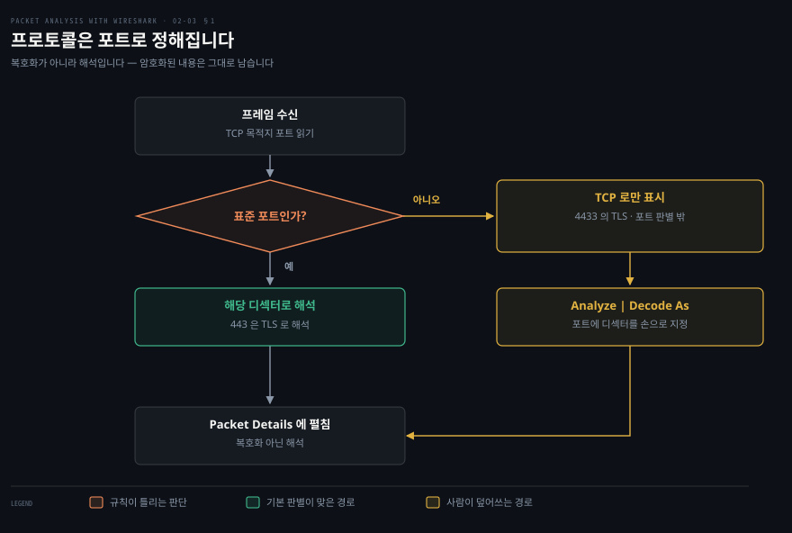
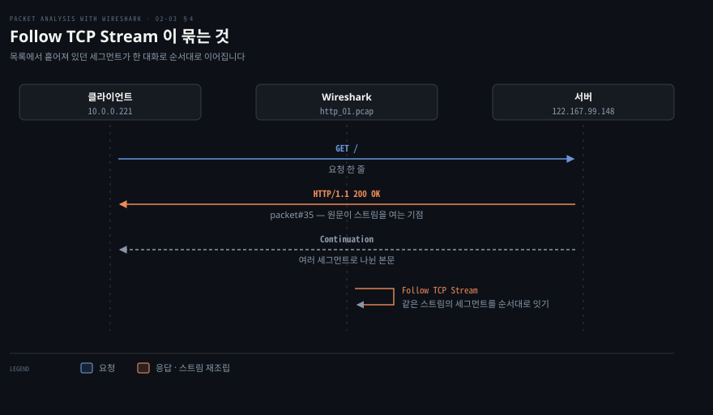

# 분석을 돕는 기능들

---

> 2장의 마지막 절은 화면을 읽는 것만으로는 닿지 않는 자리들을 다룹니다. 프로토콜이 잘못 판별됐을 때, 흩어진 세그먼트를 한 대화로 봐야 할 때, 이상한 구간을 시간축에서 찾아야 할 때 쓰는 기능 여섯 가지입니다.

## 핵심 요약

> 이 편이 매달린 하나의 생각은 **Wireshark 의 기본 해석이 틀리거나 부족한 지점마다 그것을 사람이 덮어쓰는 기능이 하나씩 붙어 있다**는 것입니다.

기본 해석은 표준 포트에 기댑니다. 원문의 표현대로 Wireshark 는 "표준 포트를 근거로 들어오는 패킷을 자동으로 식별하고 해독"합니다. 그 전제가 깨지는 순간이 비표준 포트이고, Decode-As 가 그 자리를 메웁니다.

해석의 세부도 기본값이 있습니다. HTTP 헤더가 여러 TCP 세그먼트에 걸쳐 왔을 때 이어 붙일지, gzip 으로 압축된 본문을 풀어서 보일지 같은 것입니다. 프로토콜 설정이 그 기본값을 바꿉니다.

나머지 넷은 관점을 바꾸는 기능입니다. IO Graph 는 패킷을 시간축의 처리량으로, Follow TCP Stream 은 흩어진 세그먼트를 하나의 대화로, Export Specified Packets 는 걸러 낸 것만 별도 파일로, 방화벽 ACL 생성은 관찰한 패킷을 차단 규칙으로 바꿉니다.


## 학습 목표

> 이 편을 읽고 나면 아래 다섯 가지를 스스로 해낼 수 있습니다.

1. 비표준 포트에서 도는 서비스가 TCP 로만 보이는 이유를 설명하고, Decode-As 로 바로잡을 수 있습니다.
2. Decode-As 가 하는 일이 복호화가 아니라 해석이라는 점을 구분해 말할 수 있습니다.
3. HTTP 프로토콜 설정 여섯 가지가 각각 무엇을 바꾸는지 짚을 수 있습니다.
4. IO Graph 에서 스파이크를 짚어 해당 패킷으로 이동하고, 두 번째 그래프에 필터를 걸어 원인 트래픽을 분리할 수 있습니다.
5. 조사 결과를 다른 사람에게 넘길 형태 — 걸러 낸 패킷 파일이나 방화벽 규칙 — 로 바꿀 수 있습니다.


## 1. 포트가 거짓말할 때

> Wireshark 는 표준 포트로 프로토콜을 정합니다. 서비스가 비표준 포트에서 돌면 그 판별이 통째로 빗나갑니다.



### TLS 인 줄 아는데 화면에는 TCP 만 보이는 상태

원문이 드는 상황이 정확합니다. `https.pcap` 을 열면 HTTPS 트래픽이 잡혀 있는데도 **"SSL 관련 데이터를 보여주지 않고 모든 TCP 통신만 보여줍니다."** 분명 TLS 인데 Details 창에 TLS 계층이 없습니다.

### 판별의 전제가 표준 포트이기 때문입니다

원문이 이유를 밝힙니다. Wireshark 는 표준 포트를 근거로 자동 식별하며, 예로 443 포트는 SSL 로 해독합니다. 그런데 서비스가 비표준 포트에서 돌면 그 판별에 걸리지 않습니다. 원문이 드는 예가 SSL 표준 포트는 443 인데 서비스가 `4433` 에서 도는 경우입니다.

Decode-As 는 그 매핑을 사람이 덮어쓰는 기능입니다. 원문의 정의대로 **"선택한 프로토콜을 근거로 패킷을 해독하게 하는 기능"** 입니다. 절차는 셋입니다.

1. `Analyze | Decode As` 를 누릅니다.
2. Decode As 팝업에서 해당 트래픽을 해독할 프로토콜을 고릅니다. 원문의 예에서는 SSL 입니다.
3. Wireshark 가 그 프로토콜로 트래픽을 다시 표시합니다.

원문이 바로 뒤에 다는 주의가 핵심입니다. **"SSL 해독(decoding)은 SSL 데이터를 복호화(decrypted)했다는 뜻이 아닙니다."** Decode-As 는 어느 디섹터로 펼칠지를 바꿀 뿐이라, 암호화된 페이로드는 그대로 암호문으로 남습니다. 복호화는 4장에서 키를 다루며 따로 나옵니다.

> **지금은 다릅니다 (4.6)**: 메뉴 경로는 그대로 `Analyze → Decode As…` 입니다. 공식 문서도 같은 경로를 적고, 기능을 "특정 상황에서 어떤 프로토콜이라 부를지를 덮어쓰게 해 준다"고 설명합니다.[^wsug-decode] 고를 프로토콜 이름만 `SSL` 에서 `TLS` 로 바뀌었습니다.


## 2. 프로토콜 설정 — 해석 방식을 바꿉니다

> Decode-As 가 어느 디섹터를 쓸지를 정한다면, 프로토콜 설정은 그 디섹터가 어떻게 해석할지를 정합니다.

### 헤더가 반만 보이거나 본문이 깨져 보일 때

HTTP 를 보는데 헤더가 중간에서 끊겨 있거나, 본문 자리에 알아볼 수 없는 바이트가 들어 있습니다. 패킷이 손상된 것처럼 보이지만 대개는 해석 설정의 문제입니다. HTTP 응답 하나가 TCP 세그먼트 여러 개에 나뉘어 왔는데 이어 붙이지 않았거나, gzip 으로 압축된 본문을 풀지 않은 것입니다.

### 디섹터의 동작을 켜고 끕니다

원문은 이 기능을 **"Wireshark 의 표시가 처리되는 방식과 패킷이 분석되는 방식을 사용자가 맞춤 설정하는 유연성을 제공"** 하는 것으로 설명하고, 두 가지 경로를 제시합니다.

- `Edit | Preferences | Protocols` 로 들어가 설정을 조정합니다.
- Packet Details 창에서 프로토콜을 오른쪽 클릭해 `Protocol Preferences` 를 고릅니다. 원문은 이쪽을 "간단한 방법"이라고 부릅니다.

두 번째가 실무에서 빠릅니다. 지금 보고 있는 프로토콜의 설정만 바로 열리므로, 수백 개 프로토콜 목록에서 찾지 않아도 됩니다.

원문이 예로 드는 HTTP 프로토콜 설정은 여섯 가지입니다.

| 설정 | 무엇을 바꾸는가 |
|------|---------------|
| Reassemble HTTP headers spanning multiple TCP segments | HTTP 헤더가 TCP 세그먼트 하나를 넘겨 전송됐다면 HTTP 디섹터가 이어 붙입니다 |
| Reassemble HTTP bodies spanning multiple TCP segments | HTTP 본문이 세그먼트 하나를 넘겨 전송됐다면 이어 붙입니다 |
| Reassemble chunked transfer-coded bodies | 세그먼트에 걸친 청크를 모두 이어 붙여 페이로드에 더합니다 |
| Decompress entity bodies | 압축된 데이터(`.gzip` 또는 인코딩된 것)를 시각화하는 데 씁니다 |
| SSL/TLS ports | SSL/TLS 포트를 더하거나 뺍니다. 기본값은 `443` |
| Custom HTTP header fields | 새 헤더 필드를 정의합니다 |

앞의 셋이 같은 문제를 다른 각도에서 다룹니다. **TCP 는 바이트 스트림이라 애플리케이션 메시지의 경계를 지키지 않으므로, 하나의 HTTP 메시지가 세그먼트 여러 개로 쪼개져 도착하는 것이 정상입니다.** 재조립 설정을 끄면 Wireshark 는 세그먼트를 하나씩 따로 보여 주고, 켜면 메시지 단위로 합쳐 보여 줍니다. 헤더가 중간에서 끊겨 보이는 증상의 원인이 대개 여기입니다.

다섯 번째 항목은 앞 절의 Decode-As 와 겹칩니다. 비표준 포트의 TLS 를 항상 TLS 로 보고 싶다면 Decode-As 로 매번 지정하는 대신 이 설정에 포트를 더해 두면 됩니다.


## 3. IO Graph — 시간축에서 이상한 구간 찾기

> 목록을 아무리 넘겨도 "언제 몰렸는가"는 보이지 않습니다. IO Graph 는 그 축을 세워 줍니다.

### 어느 시점이 문제인지 모르는 상태

캡처는 몇 분치인데 문제는 그 안의 어느 순간에 일어났습니다. 수천 줄을 눈으로 훑어 급증 구간을 찾는 것은 현실적이지 않습니다.

### 처리량을 시간축에 올립니다

원문은 IO Graph 를 클라이언트와 서버의 상호작용 데이터를 의미 있게 분석하는 데 쓰라고 안내합니다. 무엇을 재는지도 명시합니다. **"Wireshark IO Graph 는 처리량을 잽니다. 단위는 틱당 패킷 수이고, 각 틱은 1초입니다."**

원문이 제시하는 절차는 두 단계로 나뉩니다. 먼저 스파이크를 찾습니다.

1. `Statistics | IO graph` 를 누릅니다.
2. IO Graph 대화상자가 나타납니다.
3. 대화상자에서 스파이크를 찾아 클릭합니다.
4. 그래프의 높은 지점을 클릭하면 Wireshark 가 Packet List 창에서 해당 패킷을 자동으로 보여 줍니다.

네 번째 단계가 이 기능의 핵심입니다. **그래프와 패킷 목록이 연동되어 있어, 시각으로 찾은 이상 구간에서 곧장 패킷 단위 조사로 넘어갈 수 있습니다.**

그다음 원인을 분리합니다. 원문의 예제에서 그 구간에는 중복 ACK 가 많았습니다.

5. IO Graph 대화상자로 돌아갑니다.
6. Graph2 를 골라 `tcp.analysis.duplicate_ack` 를 입력합니다.
7. Graph2 를 클릭해 필터를 적용합니다.
8. 대화상자가 중복 ACK 의 처리량을 표시합니다.

두 번째 그래프에 필터를 거는 이 방식이 쓸모의 대부분입니다. **전체 처리량과 의심 트래픽의 처리량을 같은 시간축에 겹쳐 놓으면, 급증이 그 트래픽 때문인지 아닌지가 한눈에 갈립니다.** 원문도 프로토콜별로 그래프를 그려 트래픽 분포를 보는 용도(`tcp`·`http`·`udp`·`ntp`·`ldap`)와 보안 분석 용도를 함께 듭니다.

> **지금은 다릅니다 (4.6)**: 메뉴 이름이 복수형 `Statistics → I/O Graphs` 입니다. 공식 문서는 이 기능을 "패킷과 프로토콜 데이터를 여러 방식으로 그릴 수 있게 해 준다"고 설명하며, Y 축에 패킷 수·바이트·비트 또는 사용자 정의 필드 계산을 올릴 수 있다고 적습니다.[^wsug-iograph] 원문이 고정값으로 적은 "틱당 패킷 수, 1초 간격"은 현행 판에서 고를 수 있는 값 중 하나입니다.


## 4. Follow TCP Stream — 흩어진 세그먼트를 한 대화로

> Packet List 에서 한 대화는 다른 대화와 섞여 흩어져 있습니다. 스트림 단위로 모으면 주고받은 내용이 순서대로 이어집니다.



### 요청과 응답이 목록에서 흩어져 있는 상태

HTTP 응답 하나를 보려는데 목록에서는 그 대화의 패킷이 다른 연결의 패킷과 번갈아 나옵니다. 본문은 세그먼트 여러 개에 나뉘어 있어, 한 줄씩 클릭해 Details 를 열어 봐도 내용이 조각조각입니다.

### 스트림 단위로 이어 붙입니다

원문의 정의는 짧습니다. **"TCP 스트림 기능은 사용자가 TCP 스트림의 데이터를 볼 수 있게 해 줍니다."** 절차는 패킷 하나를 기점으로 잡는 것입니다. 원문의 예에서는 `http_01.pcap` 을 열고 첫 HTTP OK 를 찾습니다. 그 패킷은 35번이었고, 오른쪽 클릭해 `Follow TCP Stream` 을 고릅니다.

스트림을 적용하면 대화상자가 열려 **"이 HTTP 대화에서 어떤 요청이 보내졌고 어떤 응답이 받아졌는지"** 를 보여 줍니다. 원문은 표시 형식이 여섯 가지 있으며, 스크린샷에서 빨간 내용이 요청이고 파란 내용이 응답이라고 밝힙니다.

이 기능이 답하는 물음은 다른 창들과 다릅니다. **네 개 창이 "이 패킷 하나에 무엇이 들어 있는가"에 답한다면, Follow TCP Stream 은 "이 연결에서 무슨 대화가 오갔는가"에 답합니다.** 평문 프로토콜을 조사할 때는 이쪽이 훨씬 빠릅니다.


## 5. 걸러 낸 것만 따로 내보내기

> 조사에서 찾은 것을 다른 사람에게 넘기려면 파일이 필요합니다. 전체 캡처가 아니라 걸러 낸 것만 담을 수 있습니다.

### 수 기가바이트 파일을 통째로 넘길 수 없을 때

문제가 되는 패킷을 찾았는데 원본 캡처는 수 기가바이트입니다. 이것을 그대로 넘기면 받는 쪽이 다시 같은 필터를 걸어야 하고, 파일을 옮기는 것부터 부담입니다.

### 화면에 보이는 것만 새 파일로

원문은 Export Specified Packets 를 **"걸러 낸 패킷을 다른 파일로 내보내게 해 주는 기능"** 으로 설명합니다. 절차는 둘입니다.

1. 필터 칸에 조건을 적용합니다. 원문의 예는 `http.response.code == 200` 입니다.
2. `File | Export Specified Packets` 로 들어가면 내보내기 옵션이 있는 대화상자가 열립니다.

디스플레이 필터와 짝을 이루는 기능이라는 점이 요령입니다. **앞 편에서 필터가 패킷을 지우지 않는다고 했는데, 이 기능이 그 "보이는 범위"를 실제 파일로 굳혀 줍니다.** 조사 과정에서 좁혀 온 필터가 그대로 넘길 파일의 정의가 됩니다.


## 6. 방화벽 ACL 규칙 생성

> 관찰이 끝나면 조치가 남습니다. Wireshark 는 고른 패킷을 방화벽 제품별 규칙 문법으로 바꿔 줍니다.

### 차단해야 하는데 문법을 매번 찾아야 하는 상황

악성 트래픽의 출발지를 특정했습니다. 이제 차단해야 하는데 대상 방화벽이 `iptables` 인지 Cisco IOS 인지에 따라 문법이 다르고, 주소와 포트를 손으로 옮겨 적다 보면 오타가 납니다.

### 고른 패킷에서 규칙을 뽑습니다

원문은 네트워크 관리자가 Wireshark 로 여러 방화벽 제품의 ACL 규칙을 생성할 수 있다고 적고, 제품을 여섯 가지 듭니다.

| 제품 | 원문 표기 |
|------|----------|
| Cisco IOS | Cisco IOS |
| IP Filter | ipfilter |
| IP Firewall | ipfw |
| Netfilter | iptables |
| Packet Filter | pf |
| Windows Firewall | netsh |

원문이 다는 팁이 적용 범위를 밝힙니다. **"MAC 주소와 IPv4 주소에 대한 규칙이 있으며, 필터는 TCP·UDP 포트와 IPv4·포트 조합을 지원합니다."**

절차는 둘입니다. 원문은 `Tool | Firewall ACL Rules` 로 들어가 대화상자에서 Product 와 Filter 를 고르고 ACCEPT/DENY 기준을 지정하면 규칙이 생성된다고 적습니다.

> **원문 정오**: 메뉴 이름은 `Tool` 이 아니라 **`Tools`** 입니다. 공식 문서의 절 제목이 "The 'Tools' Menu" 이고 그 아래 첫 항목이 Firewall ACL Rules 입니다.[^wsug-tools] 원문의 단수 표기는 오타로 보입니다.

> **지금은 다릅니다 (4.6)**: 이 메뉴 항목은 **프레임이 정확히 하나 선택되어 있지 않으면 비활성화됩니다.**[^wsug-tools] 아무것도 고르지 않은 채 메뉴를 열면 항목이 회색이라 기능이 없는 줄 알기 쉬운데, 목록에서 패킷 한 줄을 고르면 켜집니다. 규칙을 그 패킷의 주소·포트에서 뽑기 때문입니다. 공식 문서가 적는 지원 제품은 Cisco IOS · Linux Netfilter(iptables) · OpenBSD pf · Windows Firewall(netsh) 이며, 규칙이 "바깥 인터페이스에 적용된다는 전제"로 만들어진다는 점도 함께 밝힙니다.


## 심화 학습

> 2장 기능 절에서 바뀐 것은 메뉴 이름과 프로토콜 이름입니다. 각 기능이 무엇을 덮어쓰는지는 그대로입니다.

| 원문(1.12, 2015) | 현행(4.6, 2026) | 성격 |
|------------------|-----------------|------|
| `Analyze \| Decode As` | 그대로[^wsug-decode] | 유지 |
| 고를 프로토콜은 `SSL` | `TLS` | 바뀜 |
| `Edit \| Preferences \| Protocols` | 그대로 | 유지 |
| Packet Details 오른쪽 클릭 → Protocol Preferences | 그대로 | 유지 |
| `Statistics \| IO graph` | `Statistics → I/O Graphs`[^wsug-iograph] | 바뀜 — 복수형 |
| 틱당 패킷 수, 1초 고정 | 간격과 Y 축(패킷·바이트·비트·사용자 정의)을 고릅니다[^wsug-iograph] | 확장 |
| `Follow TCP Stream` | 그대로. UDP·TLS·HTTP 스트림도 따로 있습니다 | 확장 |
| `File \| Export Specified Packets` | 그대로 | 유지 |
| `Tool \| Firewall ACL Rules` | `Tools → Firewall ACL Rules`. 프레임 하나를 골라야 활성화[^wsug-tools] | 바뀜 |

원문이 다루지 않는 축이 하나 있습니다. **이 기능들의 상당수가 `tshark` 명령줄에도 있다는 점입니다.** GUI 없이 조사해야 하거나 같은 분석을 반복해야 할 때, 화면에서 클릭하던 것을 명령으로 옮길 수 있습니다.

```bash
# Decode As 에 해당 — 4433 포트를 TLS 로 해석
tshark -r https.pcap -d tcp.port==4433,tls

# Export Specified Packets 에 해당 — 필터에 맞는 패킷만 새 파일로
tshark -r http.pcap -Y 'http.response.code == 200' -w ok.pcapng

# Follow TCP Stream 에 해당 — 0번 스트림의 내용만
tshark -r http_01.pcap -q -z follow,tcp,ascii,0
```

`-d` 는 디코드 규칙을, `-Y` 는 디스플레이 필터를, `-z` 는 통계·추출 항목을 지정합니다. 옵션의 정확한 형식은 `tshark` man page 에서 확인합니다.[^tshark-man]


## 결정 치트시트

> 조사 중 떠오르는 물음과 그 물음에 답하는 기능입니다.

| 물음 | 기능 | 왜 |
|------|------|-----|
| 이 트래픽이 TLS 인데 왜 TCP 로만 보이지 | Decode-As | 판별이 표준 포트에 기대므로 비표준 포트는 빗나갑니다 |
| 헤더가 중간에서 끊겨 보이는데 | 프로토콜 설정의 재조립 항목 | 한 메시지가 여러 TCP 세그먼트로 나뉘어 옵니다 |
| 본문이 알아볼 수 없는 바이트인데 | 프로토콜 설정의 Decompress entity bodies | gzip 등으로 압축된 본문입니다 |
| 언제 몰렸는지 모르겠는데 | I/O Graphs | 시간축 처리량을 세우고 스파이크에서 패킷으로 넘어갑니다 |
| 그 급증이 무엇 때문인지 | I/O Graphs 의 두 번째 그래프에 필터 | 전체와 의심 트래픽을 같은 축에 겹칩니다 |
| 이 연결에서 무슨 대화가 오갔는지 | Follow TCP Stream | 흩어진 세그먼트를 대화 단위로 이어 붙입니다 |
| 찾은 것을 넘겨야 하는데 | Export Specified Packets | 디스플레이 필터가 그대로 파일의 정의가 됩니다 |
| 차단 규칙을 써야 하는데 | Tools → Firewall ACL Rules | 고른 패킷의 주소·포트에서 제품별 문법으로 뽑습니다 |


## 면접 대비

### 한 줄 정의

"Decode-As 는 Wireshark 가 표준 포트로 정한 디섹터를 사람이 덮어쓰는 기능이며, 해석 방식을 바꿀 뿐 암호화된 내용을 복호화하지는 않습니다."

### 핵심 포인트 세 가지

1. **해독과 복호화는 다릅니다.** Decode-As 로 TLS 라고 지정하면 레코드 계층 구조는 펼쳐지지만 페이로드는 여전히 암호문입니다. 복호화하려면 키가 따로 필요합니다.
2. **재조립은 기본 동작이지 예외가 아닙니다.** TCP 는 바이트 스트림이라 애플리케이션 메시지 경계를 지키지 않으므로, 한 HTTP 응답이 세그먼트 여럿에 나뉘는 것이 정상입니다. 프로토콜 설정의 재조립 항목이 그것을 합쳐 줍니다.
3. **I/O Graph 는 그래프와 목록이 연동됩니다.** 시각으로 찾은 급증 구간을 클릭하면 해당 패킷으로 이동하므로, 시간축 탐색에서 패킷 단위 조사로 끊김 없이 넘어갑니다.

### 자주 묻는 질문

Q: 비표준 포트의 서비스를 매번 Decode-As 로 지정하기 번거롭습니다.
A: 해당 프로토콜의 설정에 포트를 추가합니다. HTTP 프로토콜 설정의 `SSL/TLS ports` 처럼 포트 목록을 갖는 항목이 있습니다.

Q: Follow TCP Stream 과 디스플레이 필터의 차이가 무엇입니까?
A: 필터는 조건에 맞는 패킷을 목록에 남기고, Follow TCP Stream 은 한 연결의 세그먼트를 순서대로 이어 붙여 내용 자체를 보여 줍니다. 답하는 물음이 "어느 패킷인가"와 "무슨 대화였나"로 다릅니다.

Q: Firewall ACL Rules 메뉴가 회색으로 비활성화되어 있습니다.
A: 프레임을 정확히 하나 선택해야 활성화됩니다. 규칙을 그 패킷의 주소와 포트에서 뽑기 때문입니다.


## 핵심 개념 체크리스트

- [ ] 비표준 포트의 서비스가 왜 잘못 표시되는지, 어떻게 바로잡는지 설명할 수 있습니까?
- [ ] Decode-As 가 복호화가 아니라는 점을 근거와 함께 말할 수 있습니까?
- [ ] HTTP 재조립 설정 셋이 각각 무엇을 이어 붙이는지 구분할 수 있습니까?
- [ ] I/O Graph 의 두 번째 그래프를 어디에 쓰는지 예를 들 수 있습니까?
- [ ] 조사 결과를 파일과 방화벽 규칙 두 형태로 넘길 수 있습니까?


## 관련 문서

- [02-02 잡은 패킷을 읽는 법](./02-02.잡은 패킷을 읽는 법.md) — 이 편의 앞. 네 개 창과 디스플레이 필터
- [02-01 패킷을 잡는 법](./02-01.패킷을 잡는 법.md) — 캡처 필터와 파일이 생기기까지
- [Packet Analysis with Wireshark — 정독 인덱스](./README.md) — 7개 장 전체 지도


## 참고 자료

- 원본: 《Packet Analysis with Wireshark》 (Anish Nath, Packt Publishing, 2015) ISBN 978-1-78588-781-9
- 다룬 범위: Chapter 2 의 Wireshark features 절
- [Wireshark User's Guide](https://www.wireshark.org/docs/wsug_html_chunked/) — 현행 4.6 기준 공식 문서
- [tshark(1) man page](https://www.wireshark.org/docs/man-pages/tshark.html) — 같은 기능의 명령줄 대응

[^wsug-decode]: Wireshark User's Guide, Decode As — "Decode As is accessed by selecting the Analyze → Decode As…" · "The \"Decode As\" functionality lets you override what protocol is called under specific circumstances." <https://www.wireshark.org/docs/wsug_html_chunked/ChCustProtocolDissectionSection.html> (2026-09-05 조회)

[^wsug-iograph]: Wireshark User's Guide, I/O Graphs — "Lets you plot packet and protocol data in a variety of ways." Y 축에 Packets·Bytes·Bits 또는 사용자 정의 필드 계산을 올릴 수 있고 X 축은 시간 간격입니다. <https://www.wireshark.org/docs/wsug_html_chunked/ChStatIOGraphs.html> (2026-09-05 조회)

[^wsug-tools]: Wireshark User's Guide, The "Tools" Menu — 첫 항목이 Firewall ACL Rules 이며 "allows you to create command-line ACL rules for many different firewall products, including Cisco IOS, Linux Netfilter (iptables), OpenBSD pf and Windows Firewall (via netsh)" 입니다. MAC 주소·IPv4 주소·TCP/UDP 포트·IPv4+포트 조합 규칙을 지원하고 바깥 인터페이스 적용을 전제하며, 프레임이 정확히 하나 선택되지 않으면 메뉴 항목이 비활성화됩니다. <https://www.wireshark.org/docs/wsug_html_chunked/ChUseToolsMenuSection.html> (2026-09-05 조회)

[^tshark-man]: tshark(1) man page — `-d` 디코드 규칙, `-Y` 디스플레이 필터, `-z` 통계 항목. <https://www.wireshark.org/docs/man-pages/tshark.html> (2026-09-05 조회)
