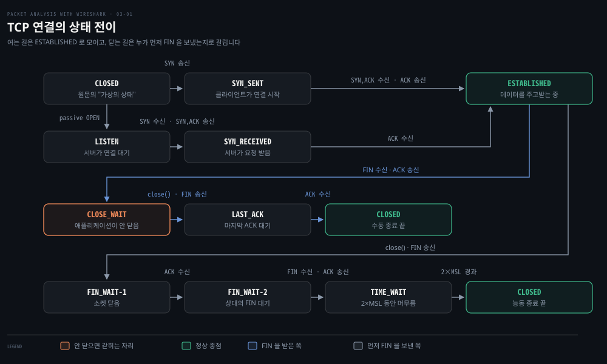
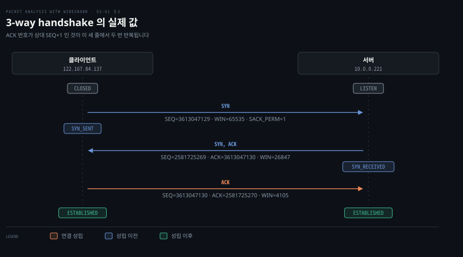
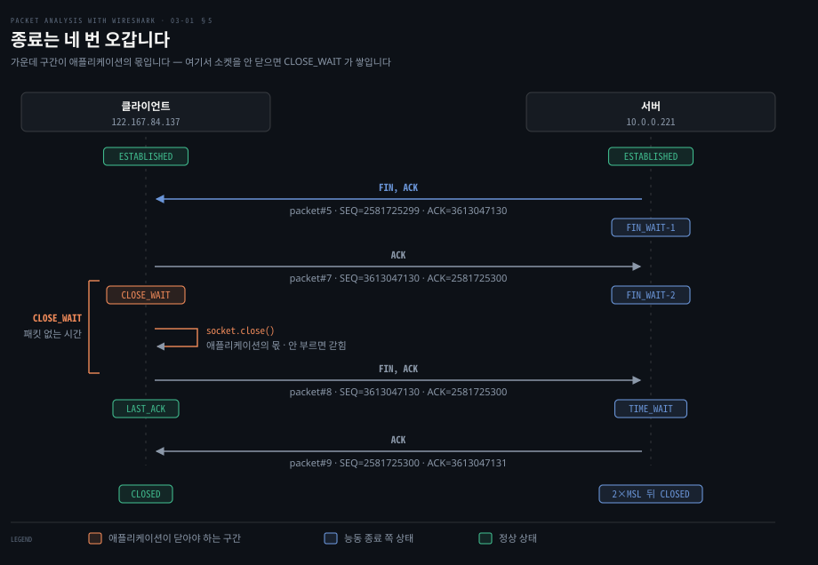

# TCP 연결의 생애

---

> 3장 전반부는 연결 하나가 태어나서 죽을 때까지를 패킷 단위로 따라갑니다. 열 때 세 번, 닫을 때 네 번 오가며, 그 사이의 상태 이름들이 곧 장애를 읽는 어휘가 됩니다.

## 핵심 요약

> 이 편이 매달린 하나의 생각은 **TCP 의 상태 이름 하나하나가 "지금 누구의 응답을 기다리는가"를 가리키며, 그래서 어느 상태에 쌓여 있는지가 누구의 잘못인지를 말해 준다**는 것입니다.

원문은 TCP 를 "여러 네트워크에서 널리 쓰이는 호스트 대 호스트 프로토콜"로 소개하고 그것이 제공하는 것을 여섯 가지로 나열합니다. 그중 이 편의 축이 되는 것은 연결 지향 설정과 해제입니다. 연결이 상태를 갖는다는 뜻입니다. 상태가 있으니 어느 상태에서 멈췄는지가 진단의 출발점이 됩니다.

여는 쪽은 단순합니다. 세 번의 왕복으로 양쪽이 서로의 시작 시퀀스 번호를 확인하면 끝입니다. 확인 번호는 상대가 보낸 시퀀스 번호에 그 세그먼트가 차지한 번호 수를 더한 값입니다. 데이터가 없는 SYN 도 번호 하나를 차지하므로 handshake 에서는 +1 이 두 번 나타납니다. 이 규칙을 알면 Wireshark 화면의 숫자가 읽힙니다.

닫는 쪽이 복잡합니다. 양쪽이 각자 닫아야 하므로 네 번이 오갑니다. 먼저 FIN 을 보낸 쪽과 받은 쪽은 서로 다른 상태를 지납니다. 받은 쪽이 지나는 `CLOSE_WAIT` 를 원문은 **"`CLOSE_WAIT` 는 애플리케이션 코드에 문제가 있다는 뜻"** 이라고 판정합니다. 커널은 할 일을 다 했고 남은 것은 애플리케이션이 소켓을 닫는 일뿐인 상태입니다.


## 학습 목표

> 이 편을 읽고 나면 아래 다섯 가지를 스스로 해낼 수 있습니다.

1. 3-way handshake 의 세 패킷에서 시퀀스·확인 번호가 어떻게 이어지는지 숫자로 짚을 수 있습니다.
2. TCP 헤더의 주요 필드를 Wireshark 필터 이름과 짝지어 말할 수 있습니다.
3. 연결 종료가 왜 네 번 오가는지, 먼저 닫는 쪽과 나중에 닫는 쪽이 어떤 상태를 지나는지 구분할 수 있습니다.
4. `CLOSE_WAIT` 가 쌓였을 때 그것이 커널이 아니라 애플리케이션의 문제인 이유를 설명할 수 있습니다.
5. `ss` 나 `netstat` 로 현재 상태를 확인하고 그 상태를 Wireshark 화면의 패킷과 대응시킬 수 있습니다.

이 편에서 새로 만나는 낱말입니다. `어디서` 는 그 낱말이 실제로 설명되는 절입니다.

| 키워드 | 뜻 | 학습 포인트·연결 개념 | 어디서 |
|---|---|---|---|
| 3-way handshake | 연결을 여는 세 번의 왕복 | SYN → SYN·ACK → ACK · 셋째는 데이터 가능 | §3 |
| 시퀀스 번호 (sequence number) | 보낸 바이트의 자리 표시 | 열로 올려 두면 읽힘 · `tcp.seq` | §2 · §3 |
| 확인 번호 (acknowledgment number) | 다음에 받을 바이트 번호 | 받은 것이 아니라 기대하는 것 · `tcp.ack` | §2 · §3 |
| 0바이트 세그먼트 | 데이터 없이 헤더만 싣는 세그먼트 | SYN·FIN 은 번호 하나를 차지하고 ACK 는 차지하지 않음 | §3 · §4 |
| 네 번의 왕복 (4-way 종료) | 닫을 때 오가는 네 번 | 양쪽이 각자 닫음 · half-close 가 가능해서 | §5 |
| TCP 상태 (상태 이름) | 연결이 지나는 이름 붙은 단계 | 패킷과 짝지어 읽음 · 전이도로 봄 | 상태 지도 · §5 · §6 표 |
| `TIME_WAIT` | 먼저 닫은 쪽이 머무는 상태 | 정상인데 많아 보임 · 03-02 §3 | §5 · §6 |

아래는 원문이 표로 적은 상태 전이를 한 장으로 이은 지도입니다. 윗 두 줄이 §3 이 다루는 여는 경로로, 위가 연결을 거는 클라이언트이고 아래가 기다리던 서버입니다. 아래 두 줄이 §5 가 다루는 닫는 경로로, FIN 을 받은 쪽이 위이고 먼저 보낸 쪽이 아래입니다.




## 1. TCP 가 약속하는 것

> TCP 의 여섯 가지 약속은 그냥 기능 목록이 아니라, 나중에 무엇이 깨졌을 때 어느 축을 봐야 하는지를 나누는 눈금입니다.

### 무엇이 느린지 모를 때 기준이 없습니다

애플리케이션이 느릴 때 네트워크 탓인지 아닌지를 가르려면 TCP 가 무엇을 보장하고 무엇을 보장하지 않는지를 알아야 합니다. 순서를 보장한다면 순서 뒤바뀜은 원인 후보에서 빠집니다. 흐름 제어가 있다면 느림의 원인이 수신 측 버퍼일 수 있습니다.

### 여섯 가지 약속

원문은 TCP 가 제공하는 것을 이렇게 나열합니다.

1. **연결 지향 설정과 해제** — TCP 세션을 열고 닫는 절차가 있습니다. 이 편의 §3 과 §5 가 그것입니다.
2. **바이트 스트림** — 메시지가 아니라 바이트의 흐름을 주고받습니다. 받은 바이트가 보낸 바이트와 동일하고 순서도 같음을 보장합니다.
3. **신뢰성 있는 순서 배달** — 시퀀스 번호를 써서 손상·유실·중복되거나 순서가 뒤바뀐 데이터로부터 복구합니다.
4. **흐름 제어** — 수신자의 버퍼 공간이 넘치지 않게 합니다.
5. **혼잡 제어** — 원문이 RFC 5681 을 근거로 드는 알고리즘은 slow start, congestion avoidance, fast retransmit, fast recovery 넷입니다. 리눅스가 기본으로 쓰는 혼잡 제어 알고리즘은 이와 별개 축입니다.
6. **다중화** — 모든 TCP 대화는 나가는 파이프와 들어오는 파이프 두 개의 논리 파이프를 가집니다.

두 번째 항목이 실무에서 가장 자주 오해받는 자리입니다. **TCP 는 바이트 스트림이라 애플리케이션이 보낸 메시지의 경계를 지켜 주지 않습니다.** 한 번에 보낸 요청이 여러 세그먼트로 쪼개져 도착하거나 여러 번 보낸 것이 한 세그먼트에 뭉쳐 도착할 수 있습니다. 앞 편에서 본 HTTP 재조립 설정도 그래서 필요합니다.


## 2. 헤더 20바이트가 담는 것

> TCP 세그먼트마다 붙는 20바이트가 상태 기계를 굴립니다. 각 필드에는 Wireshark 필터 이름이 하나씩 짝지어져 있습니다.

### Details 창의 필드 이름을 모르면 필터를 못 씁니다

Packet Details 에서 TCP 를 펼치면 필드가 십수 개 나옵니다. 화면에서 값을 보는 것과 그 값으로 필터를 거는 것은 다른 일입니다. 후자를 하려면 필드 이름을 알아야 합니다.

### 필드와 필터 이름

원문은 "각 TCP 세그먼트는 선택적 데이터 값과 함께 20바이트 헤더를 갖는다"고 적고 헤더 필드를 Wireshark 필터 이름과 함께 표로 제시합니다.

| TCP 헤더 필드 | Wireshark 필터 | 원문의 설명 |
|--------------|---------------|------------|
| Source port (16비트) | `tcp.srcport` | 보내는 쪽 포트 |
| Destination port (16비트) | `tcp.dstport` | 받는 쪽 포트 |
| Sequence Number (32비트) | `tcp.seq` | ISN 을 정하고 TCP 의 상태를 제어합니다 |
| Acknowledgement number (32비트) | `tcp.ack` | 그 호스트가 다음에 받고 싶은 시퀀스 번호를 담습니다 |
| Flags | `tcp.flags` | 제어 비트 |
| Reserved | `tcp.flags.res` | 향후 사용 |
| Nonce | `tcp.flags.ns` | 실험적 |
| CWR | `tcp.flags.cwr` | 혼잡 윈도우 축소 |
| ECN | `tcp.flags.ecn` | ECN-Echo |
| Urgent | `tcp.flags.urg` | 긴급 포인터 필드가 설정됨 |
| Acknowledgement | `tcp.flags.ack` | 확인이 설정됨 |
| Push | `tcp.flags.push` | 데이터를 밀어 올림 |
| Reset | `tcp.flags.reset` | 연결을 재설정 |
| SYN | `tcp.flags.syn` | 시퀀스 번호를 동기화 |
| FIN | `tcp.flags.fin` | 더 이상 데이터 없음 |
| Window size (16비트) | `tcp.window_size` | 3-way handshake 에서 윈도우 크기를 알립니다 |
| Checksum (16비트) | `tcp.checksum` | 오류 검사 |
| Urgent pointer (16비트) | `tcp.urgent_pointer` | 세그먼트의 일부 데이터가 긴급함을 수신자에게 알립니다 |
| Options | `tcp.options` | MSS · NOP · window scale · timestamps · SACK permitted |

이 표에서 handshake 화면의 숫자를 읽는 데 필요한 것은 확인 번호와 시퀀스 번호 두 칸입니다. 그중 확인 번호 칸부터 봅니다. **`tcp.ack` 는 "내가 받은 마지막 바이트"가 아니라 "내가 다음에 받고 싶은 바이트"입니다.** RFC 9293 도 이 칸을 "the value of the next sequence number the sender of the segment is expecting to receive" 로 정의합니다.[^rfc9293-hdr]

시퀀스 번호 칸은 짝이 되는 정의를 갖습니다. 그 세그먼트에 담긴 **첫 데이터 바이트의 번호**입니다("The sequence number of the first data octet in this segment").[^rfc9293-hdr] 두 정의를 합치면 확인 번호를 만드는 식이 나옵니다.

```bash
확인 번호 = 상대 SEQ + 그 세그먼트가 차지한 번호 수
            # 차지한 번호 수 = 데이터 바이트 수 + SYN 이면 1 + FIN 이면 1
```

RFC 9293 이 세그먼트 길이를 "the number of octets occupied by the data in the segment (counting SYN and FIN)" 로 정의하는 것이 이 식의 뒷부분입니다.[^rfc9293-space] **+1 이 되는 것은 데이터 없는 SYN·FIN 이거나, SYN·FIN 없이 데이터가 정확히 1바이트일 때입니다.** 데이터가 29바이트면 +29 입니다. 29바이트를 실은 FIN 이면 +30 입니다. 데이터 없는 ACK 면 +0 입니다. 다음 절의 숫자와 §4 의 검산이 이 식대로 이어집니다.

### 원문과 현행 RFC 의 차이

헤더 명세를 확인할 때는 현행 **RFC 9293** 을 봅니다. 원문은 RFC 793 을 근거로 들었지만 RFC 793 은 RFC 9293 이 폐기(obsolete)했습니다.[^rfc9293] 헤더 형상 자체는 그대로입니다. 다만 Reserved 가 4비트로 정리되는 등 표기가 달라졌습니다.

Options 칸이 차지할 수 있는 크기는 최대 **320비트(40바이트)** 입니다. 원문은 표에 "(0-132 bits) divisible by 32" 라고 적었지만 132 는 32 로 나누어떨어지지 않아 자기 설명과도 어긋납니다. RFC 9293 은 Data Offset 을 "TCP 헤더의 32비트 워드 수"로 정의하고 이 필드가 4비트이므로 최댓값은 15 워드, 곧 60바이트입니다. 옵션 없는 헤더가 20바이트이니 옵션에 남는 것은 40바이트입니다.[^rfc9293]


## 3. 연결을 여는 세 번의 왕복

> 세 패킷이 하는 일은 하나입니다. 양쪽이 서로의 시작 시퀀스 번호를 알리고 그것을 확인받는 것입니다.



### 숫자가 커서 읽히지 않는 화면

Wireshark 에서 handshake 를 열면 열 자리 숫자가 여럿 늘어섭니다. 어느 숫자가 어느 숫자에서 나왔는지 모르면 그냥 난수처럼 보입니다. 그러면 이 세 줄에서 아무것도 못 읽습니다.

### 숫자가 읽히게 화면을 맞춥니다

세 패킷을 읽기 전에 화면을 두 가지 맞춰 둡니다. 원문이 짚듯 **Wireshark 는 기본적으로 상대 시퀀스 번호를 보여 줍니다.** 화면의 `Seq=0` 은 진짜 0 이 아니라 그 연결의 첫 번째라는 뜻입니다. 절대값을 보려면 설정을 바꿉니다.

```bash
Edit | Preferences | Protocols | TCP | Relative sequence numbers
```

원문은 종료 절을 읽기 전에 두 필드를 목록의 열로 추가하라고 안내하지만 번호를 읽어야 하는 곳은 handshake 부터입니다. Details 에서 해당 필드를 오른쪽 클릭해 `Display as Column` 을 고르거나 설정에서 사용자 정의 열을 추가하는 방법입니다.

```bash
Edit | Preferences | Columns   # 새 열 추가 후 "custom" 에 tcp.seq
Edit | Preferences | Columns   # 새 열 추가 후 "custom" 에 tcp.ack
```

### 첫 번째 — 클라이언트의 SYN

원문은 `normal-connection.pcap` 을 열어 확인하라고 안내하고 클라이언트가 하는 일을 일곱 가지로 적습니다.

1. `tcp.flags.syn` 을 1 로 설정하고 SYN 패킷을 보냅니다.
2. 시작 시퀀스 번호(ISN)로 `tcp.seq=3613047129` 를 생성해 설정합니다.
3. `tcp.ack` 를 0 으로 둡니다.
4. `tcp.window_size` 를 서버에 알립니다. 값은 `tcp.window_size_value == 65535` 입니다.
5. MSS · NOP · window scale · timestamps · SACK permitted 같은 다른 `tcp.options` 를 함께 넣습니다.
6. 선택적 확인 응답 처리에서 `tcp.options.sack_perm == 1` 을 고릅니다.
7. 타임스탬프는 `tcp.options.timestamp.tsval == 123648340` 입니다.

네 번째 항목에는 원문이 계산을 하나 붙입니다. **윈도우 65535 바이트는 MSS 에 따라 몇 개의 세그먼트를 한 번에 보낼 수 있는지를 정합니다. 원문의 예로 MSS 가 1440바이트면 45개 세그먼트를 보낼 수 있습니다.**

### 두 번째 — 서버의 SYN, ACK

원문은 서버가 하는 일을 다섯 가지로 적습니다.

1. `tcp.flags.syn`을 1 로, `tcp.flags.ack` 를 1 로 설정해 SYN 이 받아들여졌음을 확인합니다.
2. 자기 ISN 으로 `tcp.seq=2581725269` 를 생성해 설정합니다.
3. `tcp.ack=3613047130` 을 설정합니다. 클라이언트 `tcp.seq + 1` 입니다.
4. 서버 윈도우 크기로 `tcp.window_size_value == 26847` 을 설정합니다.
5. `tcp.options` 를 설정해 클라이언트에 응답합니다.

세 번째가 앞 절의 규칙이 처음 나타나는 자리입니다. 클라이언트 ISN 3613047129 에 1 을 더한 3613047130 이 서버의 확인 번호가 됩니다.

### 세 번째 — 클라이언트의 ACK

1. `tcp.flags.ack == 1` 을 설정해 서버로 보냅니다.
2. `tcp.seq=3613047130` 은 ISN + 1 입니다. `tcp.ack=2581725270` 은 서버 SYN_ACK 의 `tcp.seq + 1` 입니다.
3. 클라이언트 윈도우 크기를 다시 설정합니다. 이 값 `tcp.window_size_value == 4105` 를 서버가 쓰게 됩니다.

같은 규칙이 반대 방향으로 한 번 더 반복됩니다. 이 세 번째 패킷이 오가면 연결이 성립합니다.

### 데이터가 없는 SYN 이 번호 하나를 차지하는 이유

handshake 의 세 패킷에는 데이터가 한 바이트도 없습니다. 셋 다 데이터 없이 번호·플래그·윈도우만 싣는 **0바이트 세그먼트**입니다. 그런데 서버의 확인 번호는 클라이언트 ISN + 1 입니다. 클라이언트의 확인 번호도 서버 ISN + 1 입니다. 데이터가 없는데 무엇을 하나 센 것인지가 여기서 막힙니다.

RFC 9293 §3.4 가 답을 적어 둡니다. 번호 체계를 데이터뿐 아니라 일부 제어 비트에도 쓴다는 것입니다.

> "This is achieved by implicitly including some control flags in the sequence space so they can be retransmitted and acknowledged without confusion (i.e., one and only one copy of the control will be acted upon)." · "The SYN and FIN are the only controls requiring this protection, and these controls are used only at connection opening and closing."[^rfc9293-space]

SYN 도 도중에 사라질 수 있으니 다시 보내야 합니다. 다시 보낸 SYN 과 먼저 보낸 SYN 을 헷갈리지 않고 확인하고 여러 사본 가운데 한 사본만 처리되게 하려면 SYN 자체에 번호가 있어야 합니다. 그래서 SYN 은 데이터가 없어도 번호 하나를 차지합니다. 그 번호를 확인하는 값이 ISN + 1 입니다.

헤더 정의도 같은 말을 합니다. 시퀀스 번호 칸의 정의가 "If SYN is set, the sequence number is the initial sequence number (ISN) and the first data octet is ISN+1." 로 이어집니다.[^rfc9293-hdr] 셋째 패킷의 클라이언트 SEQ 가 3613047130 인 까닭입니다. ISN 은 SYN 이 씁니다. 첫 데이터 바이트는 ISN + 1 부터 셉니다.

FIN 도 같은 보호를 받습니다. [03-02 §2](./03-02.TCP가 어긋날 때.md) 의 `close_wait.pcap` 에서 서버 FIN 의 SEQ 2131384057 에 대한 확인이 2131384058 인 것이 그 예입니다.

**반대로 ACK 비트는 번호를 차지하지 않습니다.** RFC 9293 용어집은 ACK 를 "A control bit (acknowledge) occupying no sequence space" 로 정의합니다.[^rfc9293-noack] ACK 만 실은 셋째 패킷 뒤에도 클라이언트의 다음 번호는 3613047130 그대로입니다. §5 에서 서버 FIN 이 싣는 확인 번호도 3613047130 입니다.

그래서 정상 흐름에서 데이터 없는 ACK 는 확인받는 대상이 아닙니다. 사라져도 다시 보내지지 않습니다. 같은 RFC 가 "ACK segments that contain no data are not reliably transmitted by TCP" 라고 적습니다.[^rfc9293-noack] 데이터 없는 ACK 하나하나에 대한 확인은 따로 오지 않습니다.


## 4. 데이터가 흐를 때

> 연결이 성립하면 데이터가 세그먼트를 주고받으며 흐릅니다. PUSH 플래그가 그 흐름이 시작됐음을 알립니다.

### 어느 패킷에 실제 데이터가 있는지

handshake 뒤의 패킷 목록에는 데이터가 있는 것과 확인만 하는 것이 섞여 있습니다. 확인만 하는 것은 데이터 없이 번호·플래그·윈도우만 싣는 0바이트 세그먼트입니다. 둘을 눈으로 가르려면 Length 열을 일일이 봐야 합니다. 필터로 가르는 편이 빠릅니다. 그 필터를 읽으려면 PSH 가 무엇을 알리는지부터 알아야 하므로 목록은 packet#4 를 본 뒤에 둡니다.

### PSH 와 ACK 가 함께 섭니다

원문은 세 번의 연결이 성립하면 세그먼트를 교환하며 데이터가 통신되고 **"데이터가 옥텟의 스트림으로 연결 위를 흐른다는 것을 알리려고 PUSH 플래그가 설정된다"** 고 적습니다.

`normal-connection.pcap` 의 packet#4 를 골라 Details 에서 TCP 를 펼치면 원문이 짚는 다섯 가지가 보입니다.

1. 서버가 클라이언트로 데이터를 보내고 있습니다.
2. 서버가 `tcp.flags.push = 1` 을 설정합니다.
3. 서버가 `tcp.flags.ack = 1` 을 설정합니다.
4. 서버 데이터는 29바이트이고 값은 `414e495348204e415448204e4f524d414c20434f4e4e4543...` 입니다.
5. 서버가 `(tcp.flags.ack == 1) && (tcp.flags.push == 1)` 을 설정합니다. 곧 `[PSH,ACK]` 플래그는 호스트가 앞서 받은 데이터를 확인하면서 동시에 데이터를 더 보내고 있음을 뜻합니다.

네 번째의 16진수를 직접 읽어 보면 이 절이 무엇을 보여주는지 분명해집니다. `41`은 `A`, `4e`은 `N`, `49`는 `I`, `53`은 `S`, `48`은 `H`, `20`은 공백입니다. 이어 읽으면 `ANISH NATH NORMAL CONNEC…` 가 됩니다. **평문 프로토콜에서는 Packet Bytes 창의 16진수가 곧 사람이 읽을 수 있는 내용이라는 사실이 여기서 확인됩니다.**

다섯 번째 항목의 ACK 는 이 패킷만의 특징이 아닙니다. RFC 9293 은 확인 번호 칸에 대해 "Once a connection is established, this is always sent." 라고 적습니다.[^rfc9293-hdr] 연결이 성립한 뒤에는 RST 로 끊는 경우 같은 예외를 빼면 세그먼트가 ACK 비트를 켜고 다음에 받을 번호를 싣습니다. packet#4 의 ACK 도 새로 무엇을 확인하려는 것이 아니라 평소처럼 클라이언트에게서 다음에 받을 번호 3613047130 을 싣고 있을 뿐입니다.

packet#4 로 §2 의 식을 검산할 수 있습니다. 데이터 세그먼트의 SEQ 는 첫 바이트의 번호입니다. 그다음 세그먼트의 SEQ 는 데이터 크기만큼 나아갑니다.[^rfc9293-hdr]

```bash
2581725270      # §3 셋째 패킷의 tcp.ack — 서버가 보낼 첫 데이터 바이트의 번호
+ 29            # packet#4 의 서버 데이터 29바이트 — 번호 2581725270 ~ 2581725298 을 차지
= 2581725299    # §5 packet#5 서버 FIN 의 tcp.seq
```

세 값은 모두 원문에 있습니다. 29바이트가 번호 29개를 차지했으므로 서버의 다음 세그먼트인 FIN 은 2581725299 에서 시작합니다. 원문의 packet#4 Details 스크린샷에도 `Sequence number: 2581725270` 이 `[TCP Segment Len: 29]`·`[Next sequence number: 2581725299]` 와 함께 찍혀 있어 이 식과 맞습니다. 같은 검산을 실측 캡처의 여덟 줄로 되짚은 것이 [03-03 §1](./03-03.실습 — 연결의 생애를 직접 잡기.md) 입니다.

원문이 제시하는 데이터 관련 디스플레이 필터는 일곱 가지입니다.

```bash
data                                    # 데이터가 담긴 패킷 전부
data && ip.addr==10.0.0.221             # 그 IP 와 주고받은 것 중 데이터가 있는 것
tcp.flags.push == 1                     # PUSH 패킷 전부
tcp.flags.push == 1 && ip.addr==10.0.0.221   # 두 호스트 사이의 PUSH 패킷
tcp.flags == 0x0018                     # PSH, ACK 패킷 전부
tcp.flags == 0x0011                     # FIN, ACK 패킷 전부
tcp.flags == 0x0010                     # ACK 패킷 전부
```

마지막 세 줄이 플래그 값을 읽는 법을 알려 줍니다. `0x0018` 은 PSH(`0x08`)와 ACK(`0x10`)를 더한 값이고 `0x0011` 은 FIN(`0x01`)과 ACK(`0x10`)를 더한 값입니다. **비트를 더해 읽는 이 규칙을 알면 어떤 플래그 조합이든 값을 직접 만들 수 있습니다.**

> **노트의 읽기**: 이 목록이 앞 편([02-02](./02-02.잡은 패킷을 읽는 법.md))에서 지적한 2장의 정오를 스스로 반증합니다. 2장은 `tcp.flags == 0x0010` 을 "443 포트의 SYN 패킷"이라고 적었지만, 같은 책 3장의 이 목록은 같은 값을 "모든 ACK 패킷"이라고 적습니다. 3장 쪽이 맞습니다.


## 5. 연결을 닫는 네 번의 왕복

> 여는 것은 한 번의 합의지만 닫는 것은 각자의 결정입니다. 그래서 네 번이 오가고, 먼저 닫은 쪽과 나중에 닫는 쪽의 상태가 갈립니다.



### 닫았는데 소켓이 남아 있는 상태

애플리케이션은 종료됐는데 `netstat` 에는 소켓이 남아 있습니다. 어떤 것은 잠시 뒤 사라지고 어떤 것은 계속 남습니다. 둘의 차이는 그 소켓이 어느 상태에 있느냐입니다. 그 상태는 누가 먼저 FIN 을 보냈는지가 정합니다.

### 왜 네 번 오가는가

원문 밖에서 보강하면 FIN 은 연결 전체가 아니라 **내가 보내는 방향 하나만 닫습니다.** RFC 9293 은 CLOSE 를 "I have no more data to send." 로 정의합니다. 두 방향이 따로 닫히므로 한 방향만 닫힌 "half closed" 연결이 있을 수 있다고도 적습니다.[^rfc9293-half] 상대 FIN 에 대한 확인과 상대 자신의 FIN 이 따로 오므로 닫는 데 네 번이 듭니다. 받은 쪽은 자기 방향을 닫기 전까지 데이터를 계속 보낼 수 있습니다.

### 닫는 방법은 셋입니다

원문은 정상 종료를 "클라이언트나 서버가 받는 쪽으로 모든 데이터를 보냈다고 판단해 연결을 닫을 수 있을 때" 일어나는 일로 설명하고 방법을 셋으로 나눕니다.

- 클라이언트가 FIN 패킷을 서버로 보내 종료를 시작합니다.
- 서버가 FIN 패킷을 클라이언트로 보내 종료를 시작합니다.
- 클라이언트와 서버가 동시에 종료를 시작합니다.

세그먼트 셋으로 끝나는 원문 밖 변형은 절 끝에서 봅니다.

### 원문의 예제 — 서버가 먼저 닫습니다

`normal-connection.pcap` 의 packet#5 를 고르고 Details 에서 TCP 를 살피면 원문이 짚는 흐름이 보입니다.

- packet#5 에서 서버가 연결을 닫으려고 FIN 패킷을 시작합니다.
- 서버가 `[FIN,ACK]` 곧 `(tcp.flags.fin == 1) && (tcp.flags.ack == 1)` 을 설정해 클라이언트로 보냅니다.
- 서버 시퀀스 번호 `tcp.seq == 2581725299` 가 packet#7 에서 확인됩니다.
- packet#8 에서 클라이언트가 연결을 닫으려고 FIN 을 시작합니다.
- 클라이언트도 `[FIN,ACK]` 를 설정해 서버로 보냅니다.
- 클라이언트 시퀀스 번호 `tcp.seq == 3613047130` 이 packet#9 에서 확인됩니다.

두 번째 항목의 `[FIN,ACK]` 에 붙은 ACK 도 §4 의 `[PSH,ACK]` 와 같은 경우입니다. packet#5 의 ACK 는 다음에 받을 번호 3613047130 을 실었을 뿐 FIN 을 확인하지 않습니다.

예제에서는 서버가 먼저 닫는 쪽이고 클라이언트가 FIN 을 받는 쪽입니다. 서버가 `FIN_WAIT-1`·`FIN_WAIT-2`·`TIME_WAIT` 을 지나고 클라이언트가 `CLOSE_WAIT`·`LAST_ACK` 을 지납니다. 각 상태의 뜻은 §6 표에 있습니다. 원문 종료 절의 패킷 목록 스크린샷과 전이 표로 #4~#9 를 이어 놓으면 이렇습니다.

| 패킷 | 방향 | 플래그 | SEQ · ACK | 서버 상태 | 클라이언트 상태 | 출처 |
|---|---|---|---|---|---|---|
| #4 | 서버 → 클라이언트 | PSH, ACK · 데이터 29바이트 | 2581725270 · 3613047130 | ESTABLISHED | ESTABLISHED | 원문 스크린샷 · 본문 · 표 5행 |
| #5 | 서버 → 클라이언트 | FIN, ACK | 2581725299 · 3613047130 | `FIN_WAIT-1` 로 | ESTABLISHED | 원문 스크린샷 · 본문 · 표 7행 |
| #6 | 클라이언트 → 서버 | ACK | 3613047130 · 2581725299 | `FIN_WAIT-1` | ESTABLISHED | 번호는 원문 스크린샷 · 서버 상태는 캡처 순서로 추론 |
| #7 | 클라이언트 → 서버 | ACK | 3613047130 · 2581725300 | `FIN_WAIT-2` 로 | `CLOSE_WAIT` 로 | 원문 스크린샷 · 본문 · 표 8행 |
| #8 | 클라이언트 → 서버 | FIN, ACK | 3613047130 · 2581725300 | `TIME_WAIT` 로 | `LAST_ACK` 로 | 원문 스크린샷 · 본문 · 표 9행 |
| #9 | 서버 → 클라이언트 | ACK | 2581725300 · 3613047131 | `TIME_WAIT` 유지 | CLOSED 로 | 원문 스크린샷 · 표 10행 |

#6 은 서버 데이터 29바이트에 대한 클라이언트의 확인입니다. 서버 FIN 인 #5 뒤에 잡혔지만 확인 번호가 2581725299 라서 FIN 까지는 확인하지 않습니다. 서버는 `FIN_WAIT-1` 에 그대로 있습니다. FIN 을 확인하는 것은 확인 번호가 하나 더 큰 #7 입니다. 원문 표 6행은 이 ACK 를 FIN 앞에 두고 서버를 ESTABLISHED 로 적었으므로 #6 행의 서버 상태는 표가 아니라 캡처 순서에서 읽은 값입니다.

이제 packet#7 과 packet#8 사이를 봅니다. **두 패킷을 만들어 보내는 것은 둘 다 클라이언트 커널입니다. 다른 것은 계기입니다.** #7 은 상대 FIN 이 도착한 것이 계기라 커널이 곧바로 보냅니다. RFC 9293 §3.10.7.4 는 FIN 이 도착했을 때의 처리를 "send an acknowledgment for the FIN" 으로 적습니다. ESTABLISHED 였다면 그와 함께 CLOSE-WAIT 로 들어갑니다.[^rfc9293-close]

#8 은 애플리케이션이 `close()` 를 부른 것이 계기입니다. RFC 9293 §3.10.4 의 CLOSE 호출 처리는 CLOSE-WAIT 상태에서 "then send a FIN segment, enter LAST-ACK state" 입니다.[^rfc9293-close] **그래서 `CLOSE_WAIT` 는 패킷으로 찍히지 않고 #7 과 #8 사이의 시간으로만 드러납니다.** 원문 스크린샷에서 #1 과 #2 의 간격이 0.000025초라 이 캡처는 서버 쪽에서 잡은 것으로 보입니다. 그 캡처의 시각으로 #7 은 0.100668초, #8 은 0.100675초에 도착해 간격이 7마이크로초였습니다. **애플리케이션이 `close()` 를 부르지 않으면 #8 은 영영 없습니다.** 다음 편의 §2 가 이 문제를 다룹니다. 같은 간격을 20초로 벌려 표에 찍히게 만든 캡처는 [03-03 §4](./03-03.실습 — 연결의 생애를 직접 잡기.md) 에 있습니다.

### 종료가 세 번으로 끝나는 경우

원문의 예제는 네 번 오가지만 원문 밖에서 보강하면 세그먼트 셋으로 끝나는 경우도 있습니다. FIN 을 받은 쪽이 그 FIN 에 대한 확인과 자기 FIN 을 한 세그먼트에 실어 보내는 경우입니다. RFC 9293 은 먼저 FIN 을 보내 `FIN_WAIT-1` 에 있는 쪽이 상대 FIN 을 받았을 때를 "If our FIN has been ACKed (perhaps in this segment), then enter TIME-WAIT" 로 적습니다.[^rfc9293-close]

괄호 안의 "perhaps in this segment" 가 상대 FIN 과 내 FIN 에 대한 확인이 한 세그먼트로 올 수 있다는 뜻입니다. 그때는 `FIN_WAIT-2` 에 머무는 시간 없이 `TIME_WAIT` 로 갑니다. RFC 9293 §3.3.2 는 상태 그림이 이 전이를 생략했다고 주석으로 따로 적어 둡니다.

> "The figure omits a transition from FIN-WAIT-1 to TIME-WAIT if a FIN is received and the local FIN is also acknowledged."[^rfc9293-close]

캡처에서는 두 번째 `[FIN, ACK]` 의 확인 번호가 첫 FIN 의 SEQ + 1 이고 그 사이에 따로 ACK 가 없는 모양으로 보입니다.

### 원문 전이 표와 스크린샷의 차이

번호와 방향은 모두 원문 스크린샷의 패킷 목록에 찍혀 있습니다. #9 의 확인 번호 3613047131 은 원문이 빨간 상자로 짚어 둔 값입니다. 상태는 같은 절의 Sr. No. 1~10 전이 표에서 읽었습니다. 이 표에는 패킷 번호 열이 없고 인쇄본에서 서버 상태 열의 오른쪽이 잘려 `FIN_W`·`TIME_` 처럼 앞글자만 보이므로 잘린 칸은 다음 행의 시작 상태로 이어 읽었습니다.

전이 표의 두 행은 스크린샷과 다릅니다. 표 5행은 데이터 세그먼트를 SEQ 3613047130 · ACK 2581725270 으로 적었지만 스크린샷의 #4 는 SEQ 2581725270 · ACK 3613047130 입니다. 표에서 두 값이 서로 바뀌어 있습니다. 표 10행은 서버를 `TIME_WAIT` 에서 CLOSED 로 옮겨 적었지만 CLOSED 로 가는 것은 2×MSL 이 지난 뒤라([03-02 §3](./03-02.TCP가 어긋날 때.md)), #9 행에는 유지로 적었습니다.

### 이 절에서 쓰는 필터

이 절에서 쓰는 필터는 셋입니다. 첫 줄은 원문이 가리키는 기능을 실제로 걸리는 필드로 적었습니다.

```bash
tcp.analysis.acks_frame    # 이 ACK 가 확인하는 세그먼트의 프레임으로 이어 줍니다
tcp.connection.fin         # 전문가 정보를 제공합니다
tcp.flags == 0x0011        # [FIN,ACK] 패킷 전부
```

원문은 첫 줄을 `tcp.analysis:SEQ/ACK` 로 적었지만 디스플레이 필터의 필드 이름은 점으로만 잇습니다. 콜론과 슬래시를 쓰지 않으므로 Wireshark 4.6.8 의 `dftest` 도 이 표기를 "neither a field nor a protocol name" 으로 거부합니다.

원문이 가리키는 것은 Packet Details 창의 **"SEQ/ACK analysis" 하위 트리**입니다. 그 안에서 확인한 세그먼트로 이어 주는 필드가 `tcp.analysis.acks_frame`("This is an ACK to the segment in frame")입니다. 원문이 handshake 절에 다는 팁 하나가 여기서 쓰입니다. **`tcp.analysis.flags` 는 Wireshark 가 전문가 메시지를 붙인 패킷을 보여 줍니다.** 재전송·중복 ACK 같은 판정이 이 필터로 한꺼번에 걸립니다.


## 6. 상태 이름과 확인 명령

> 상태 이름은 "지금 누구의 응답을 기다리는가"의 다른 표현입니다. 명령 한 줄로 현재 어느 상태에 몇 개가 있는지 셀 수 있습니다.

### 패킷을 잡기 전에 셀 수 있습니다

Wireshark 로 잡아야만 알 수 있는 것이 있고 그 전에 명령 한 줄로 답이 나오는 것이 있습니다. "지금 소켓이 어느 상태에 몇 개나 있는가"는 후자입니다.

### 원문이 정리한 상태

| 상태 | 원문의 설명 |
|------|------------|
| `LISTEN` | 서버가 들어오는 연결을 받을 수 있게 열려 있습니다 |
| `SYN-SENT` | 클라이언트가 연결을 시작했습니다 |
| `SYN-RECEIVED` | 서버가 연결 요청을 받았습니다 |
| `ESTABLISHED` | 클라이언트와 서버가 데이터를 주고받을 준비가 됐고, 연결이 성립했습니다 |
| `FIN-WAIT-1` | 클라이언트나 서버가 소켓을 닫았습니다 |
| `FIN-WAIT-2` | 클라이언트나 서버가 연결을 놓았습니다 |
| `CLOSE-WAIT` | 클라이언트나 서버가 소켓을 닫지 않았습니다. 이 상태는 만료되지 않습니다 |
| `LAST-ACK` | 클라이언트로부터 올 ACK 를 기다립니다. 클라이언트와의 TCP 대화의 마지막 단계입니다 |
| `TIME-WAIT` | 로컬 애플리케이션이 연결을 닫았고 상대가 확인한 뒤 자기 FIN 을 보냈음을 뜻합니다 |
| `CLOSED` | 가상의 상태입니다 |

`CLOSE-WAIT` 칸의 **"이 상태는 만료되지 않습니다"** 가 이 표에서 가장 실무적인 문장입니다. 다른 상태는 시간이 지나면 정리되지만 이것은 애플리케이션이 소켓을 닫기 전까지 영원히 남습니다. 그래서 쌓입니다.

### 명령으로 세기

원문이 제시하는 확인 명령입니다.

```bash
ss -nt4 state CLOSE-WAIT
ss -nt4 state ESTABLISHED
netstat -an | grep CLOSE-WAIT
netstat -an | grep ESTABLISHED
```

배포하기 전이나 장애 중에 이 명령을 세어 보는 것이 Wireshark 를 켜는 것보다 먼저입니다. **`CLOSE_WAIT` 의 개수가 시간이 지나며 늘기만 한다면 그 자체로 애플리케이션이 소켓을 닫지 않는다는 증거이고, 패킷을 잡지 않아도 원인이 좁혀집니다.**

### `FIN_WAIT_2` 를 정리하는 시간

고아 연결은 애플리케이션이 이미 놓아 버린 연결입니다. 이 연결이 `FIN_WAIT_2` 에 머무는 시간은 커널 파라미터 `tcp_fin_timeout` 이 정하며 기본값은 **60초**입니다. 커널 문서는 이 값을 "어떤 애플리케이션도 더 이상 참조하지 않는 고아 연결이 로컬에서 중단되기 전까지 `FIN_WAIT_2` 상태에 머무는 시간"으로 정의합니다. 고아가 아닌 연결의 `FIN_WAIT_2` 는 받기만 하는 온전한 상태라고도 적습니다.[^ip-sysctl] 커널 문서가 이 값으로 정의하는 상태는 `FIN_WAIT_2` 하나입니다.

원문은 `FIN-WAIT-1`·`FIN-WAIT-2`·`TIME-WAIT` 세 상태의 설명에 각각 "In Linux the default is 60 ms" 라고 적었지만 단위는 밀리초가 아니라 초이고 해당하는 상태도 셋이 아니라 하나입니다. 원문이 함께 보인 `/proc/sys/net/ipv4/tcp_fin_timeout` 의 출력 `60` 도 초 단위 값입니다.


## 7. 실습 — 정상 연결 흐름 잡기

> 원문은 Java 소켓 프로그램으로 이 장의 캡처를 직접 만들어 보게 합니다. 서버를 띄우고 클라이언트를 붙이는 것이 전부입니다.

### 원문의 절차

원문이 제시하는 단계는 일곱입니다. 캡처를 시작해 `tcp.port==8082` 를 겁니다. 책이 제공하는 Java 서버를 컴파일해 띄운 뒤 `netstat` 으로 `LISTEN` 을 확인합니다. 그다음 클라이언트를 붙여 Wireshark 에서 패킷을 읽습니다. 명령과 그 출력은 [03-03 §실험실](./03-03.실습 — 연결의 생애를 직접 잡기.md) 이 맡습니다.

절차 자체보다 `netstat` 으로 `LISTEN` 을 확인하는 단계가 중요합니다. **클라이언트를 붙이기 전에 서버가 `LISTEN` 인지 확인하는 이 한 줄이, 다음 편에서 다룰 `RST` 시나리오와 이 정상 시나리오를 가르는 조건입니다.** 서버가 떠 있지 않은 채 클라이언트를 실행하면 handshake 대신 RST 가 돌아옵니다.

루프백으로 실습할 때 걸리는 것이 하나 있습니다. **`localhost` 로 붙으면 트래픽이 물리 인터페이스를 지나지 않으므로 `en0` 이나 `eth0` 에서는 아무것도 안 잡힙니다.** 앞 편에서 본 대로 루프백 인터페이스(`lo0` 또는 `lo`)를 골라야 합니다.

원서의 이 절차를 실제로 돌려 캡처까지 남긴 것은 [03-03 실습](./03-03.실습 — 연결의 생애를 직접 잡기.md) 입니다. 맥에 `ss` 가 없어 리눅스 컨테이너 둘로 자리를 옮겼습니다. 종료가 셋이 되는 경우까지 잡혀 있습니다.


## 심화 학습

> 원문이 `socket.close()` 를 부르라고만 적은 자리를, 예외가 나도 소켓이 닫히게 하는 코드 쪽에서 막는 방법입니다.

원문이 다루지 않는 축이 하나 있습니다. **`CLOSE_WAIT` 를 애플리케이션 코드에서 막는 방법**입니다. 원문은 `socket.close()` 를 부르라고만 적습니다. 예외가 났을 때도 반드시 닫히게 하려면 호출 위치가 중요합니다. Java 라면 try-with-resources 가 그 보장을 언어 차원에서 줍니다.

```java
// 예외가 나도 close() 가 보장됩니다 — CLOSE_WAIT 가 쌓이는 경로를 막습니다
try (Socket socket = new Socket(host, 9999);
     var in = socket.getInputStream()) {
    // ...
}   // 블록을 벗어날 때 close() 가 호출되어 FIN 이 나갑니다
```

같은 원리가 커넥션 풀에도 적용됩니다. 풀에서 빌린 연결을 반납하지 않으면 소켓이 닫히지 않으므로 애플리케이션 로그에는 아무 문제가 없는데 `CLOSE_WAIT` 만 늘어나는 형태로 드러납니다. 앞 절의 `ss -nt4 state CLOSE-WAIT` 개수를 시간에 따라 세어 보면 누수인지 아닌지가 갈립니다.


## 결정 치트시트

> 소켓 상태를 보고 다음에 무엇을 볼지 정하는 기준입니다.

| 보이는 상태 | 무엇을 뜻하나 | 다음에 볼 것 |
|------------|-------------|------------|
| `SYN_SENT` 가 쌓임 | SYN 을 보냈는데 응답이 없습니다 | 방화벽·ACL, 서버가 떠 있는지. 다음 편 §1 |
| `ESTABLISHED` 인데 느림 | 연결은 됐고 전송이 문제입니다 | 윈도우 크기·재전송. 다음 편 §3·§4 |
| `CLOSE_WAIT` 가 늘기만 함 | 애플리케이션이 소켓을 안 닫습니다 | 코드의 close 경로. 만료되지 않는 상태입니다 |
| `TIME_WAIT` 가 많음 | 정상입니다. 내가 먼저 닫은 연결이 많다는 뜻입니다 | 대개 조치 불필요. 2×MSL 뒤 사라집니다 |
| `FIN_WAIT_2` 가 쌓임 | 내 FIN 은 확인됐는데 상대가 안 닫습니다 | 상대 쪽 애플리케이션. 내 쪽이 이미 놓은 고아 연결이면 `tcp_fin_timeout` 뒤 정리됩니다 |
| `LISTEN` 이 없음 | 서버가 그 포트를 안 잡았습니다 | 프로세스·바인딩 주소. RST 가 돌아옵니다 |


## 면접 대비

### 한 줄 정의

"3-way handshake 는 양쪽이 서로의 시작 시퀀스 번호를 알리고 상대 번호 + 1 로 확인해 주는 절차이며, 그 확인이 두 번 오가면 연결이 성립합니다."

### 핵심 포인트 세 가지

1. **확인 번호는 다음에 받고 싶은 번호입니다.** 그래서 상대 SEQ 에 그 세그먼트가 차지한 번호 수를 더한 값이 됩니다. 데이터 바이트 수에 SYN·FIN 을 각각 1 로 세므로 SYN 이 오가는 handshake 에서는 +1 로, 29바이트 데이터 뒤에는 +29 로 나타납니다.
2. **닫는 것은 각자의 결정이라 네 번 오갑니다.** 상대 FIN 에 대한 ACK 는 커널이 자동으로 보내지만 내 FIN 은 애플리케이션이 소켓을 닫아야 나갑니다. 그 사이가 `CLOSE_WAIT` 입니다.
3. **`CLOSE_WAIT` 는 만료되지 않습니다.** 다른 상태는 시간이 지나면 정리되지만 이것만은 애플리케이션이 닫기 전까지 남습니다. 늘기만 한다면 그 자체가 코드 문제의 증거입니다.

### 자주 묻는 질문

Q: `CLOSE_WAIT` 와 `TIME_WAIT` 중 어느 쪽이 문제입니까?
A: `CLOSE_WAIT` 입니다. 상대가 보낸 FIN 을 받고도 내 애플리케이션이 소켓을 닫지 않은 상태이고 만료되지 않습니다. `TIME_WAIT` 는 내가 먼저 닫은 연결이 2×MSL 동안 머무는 정상 상태입니다.

Q: Wireshark 의 `Seq=0` 은 진짜 0 입니까?
A: 아닙니다. Wireshark 는 기본적으로 상대 시퀀스 번호를 보여 줍니다. 절대값은 `Edit | Preferences | Protocols | TCP` 에서 상대 시퀀스 번호 설정을 끄면 보입니다.

Q: 서버가 안 떠 있으면 무엇이 돌아옵니까?
A: SYN 에 대해 RST 가 돌아옵니다. handshake 가 시작되지도 않습니다. 다음 편 §1 이 그 패킷을 다룹니다.


## 핵심 개념 체크리스트

- [ ] handshake 세 패킷의 시퀀스·확인 번호를 종이에 적어 이어 볼 수 있습니까?
- [ ] `tcp.ack` 가 무엇을 가리키는지 한 문장으로 말할 수 있습니까?
- [ ] 데이터가 없는 SYN·FIN 은 번호 하나를 차지하는데 ACK 는 차지하지 않는 이유를 RFC 근거와 함께 말할 수 있습니까?
- [ ] `CLOSE_WAIT` 가 캡처의 어느 패킷이 아니라 어느 두 패킷 사이의 시간인지 짚을 수 있습니까?
- [ ] `tcp.flags == 0x0018` 이 무엇을 잡는지 비트를 더해 설명할 수 있습니까?
- [ ] 종료가 왜 네 번 오가는지, 그중 어느 하나가 애플리케이션의 몫인지 지목할 수 있습니까?
- [ ] `CLOSE_WAIT` 와 `FIN_WAIT_2` 중 어느 쪽이 내 문제이고 어느 쪽이 상대 문제인지 구분할 수 있습니까?
- [ ] `ss` 로 특정 상태의 소켓만 세는 명령을 쓸 수 있습니까?


## 관련 문서

- [03-02 TCP가 어긋날 때](./03-02.TCP가 어긋날 때.md) — 이 편의 뒤. RST·CLOSE_WAIT 재현·지연·재전송
- [03-03 실습 — 연결의 생애를 직접 잡기](./03-03.실습 — 연결의 생애를 직접 잡기.md) — 이 편의 흐름을 컨테이너 둘로 직접 잡은 캡처
- [02-02 잡은 패킷을 읽는 법](./02-02.잡은 패킷을 읽는 법.md) — Packet Details 의 계층과 디스플레이 필터
- [Packet Analysis with Wireshark — 정독 인덱스](./README.md) — 7개 장 전체 지도


## 참고 자료

- 원본: 《Packet Analysis with Wireshark》 (Anish Nath, Packt Publishing, 2015) ISBN 978-1-78588-781-9
- 다룬 범위: Chapter 3 의 Recapping TCP · TCP connection establishment and clearing · TCP data communication · TCP close sequence · Lab exercise 절
- [RFC 9293 — Transmission Control Protocol](https://datatracker.ietf.org/doc/html/rfc9293) — RFC 793 을 대체한 현행 TCP 명세
- [Wireshark Wiki — TCP Analyze Sequence Numbers](https://wiki.wireshark.org/TCP_Analyze_Sequence_Numbers) — 원문 References 절이 가리키는 문서
- [Wireshark 디스플레이 필터 레퍼런스 — TCP](https://www.wireshark.org/docs/dfref/t/tcp.html) — 이 편의 필드 이름 정본

[^rfc9293]: RFC 9293 §3.1 Header Format — Data Offset 은 "The number of 32-bit words in the TCP header" 이며 4비트입니다. Options 는 "size(Options) == (DOffset-5)*32; present only when DOffset > 5" 이므로 DOffset 최댓값 15 에서 옵션은 최대 40바이트입니다. Reserved 는 4비트입니다. 이 RFC 는 RFC 793 을 비롯한 여러 문서를 폐기합니다. <https://datatracker.ietf.org/doc/html/rfc9293> (2026-09-05 조회)

[^rfc9293-hdr]: RFC 9293 §3.1 Header Format — Sequence Number "The sequence number of the first data octet in this segment (except when the SYN flag is set). If SYN is set, the sequence number is the initial sequence number (ISN) and the first data octet is ISN+1." · Acknowledgment Number "If the ACK control bit is set, this field contains the value of the next sequence number the sender of the segment is expecting to receive. Once a connection is established, this is always sent." · 연결 성립 뒤의 예외로 §3.10.5 ABORT Call 은 ESTABLISHED 등에서 "Send a reset segment: <SEQ=SND.NXT><CTL=RST>" 입니다. <https://www.rfc-editor.org/rfc/rfc9293.txt> (2026-09-15 조회)

[^rfc9293-space]: RFC 9293 §3.4 Sequence Numbers — "SEG.LEN = the number of octets occupied by the data in the segment (counting SYN and FIN)" · "This is achieved by implicitly including some control flags in the sequence space so they can be retransmitted and acknowledged without confusion (i.e., one and only one copy of the control will be acted upon)." · "The SYN and FIN are the only controls requiring this protection, and these controls are used only at connection opening and closing." <https://www.rfc-editor.org/rfc/rfc9293.txt> (2026-09-15 조회)

[^rfc9293-noack]: RFC 9293 §4 Glossary, ACK — "A control bit (acknowledge) occupying no sequence space, which indicates that the acknowledgment field of this segment specifies the next sequence number the sender of this segment is expecting to receive, hence acknowledging receipt of all previous sequence numbers." · §3.8.4 TCP Keep-Alives — "It is extremely important to remember that ACK segments that contain no data are not reliably transmitted by TCP." <https://www.rfc-editor.org/rfc/rfc9293.txt> (2026-09-15 조회)

[^rfc9293-close]: RFC 9293 §3.3.2 State Machine Overview, Note 2 — "The figure omits a transition from FIN-WAIT-1 to TIME-WAIT if a FIN is received and the local FIN is also acknowledged." · §3.10.7.4 Other States, FIN 비트 처리 — "If the FIN bit is set, signal the user "connection closing" and return any pending RECEIVEs with same message, advance RCV.NXT over the FIN, and send an acknowledgment for the FIN." · ESTABLISHED STATE "Enter the CLOSE-WAIT state." · FIN-WAIT-1 STATE "If our FIN has been ACKed (perhaps in this segment), then enter TIME-WAIT, start the time-wait timer, turn off the other timers; otherwise, enter the CLOSING state." · §3.10.4 CLOSE Call, CLOSE-WAIT STATE "Queue this request until all preceding SENDs have been segmentized; then send a FIN segment, enter LAST-ACK state." <https://www.rfc-editor.org/rfc/rfc9293.txt> (2026-09-15 조회)

[^rfc9293-half]: RFC 9293 §3.6 Closing a Connection — "CLOSE is an operation meaning "I have no more data to send."" · §3.6.1 Half-Closed Connections — "Since the two directions of a TCP connection are closed independently, it is possible for a connection to be "half closed", i.e., closed in only one direction, and a host is permitted to continue sending data in the open direction on a half-closed connection." <https://www.rfc-editor.org/rfc/rfc9293.txt> (2026-09-26 조회)

[^ip-sysctl]: Linux kernel networking 문서, `tcp_fin_timeout` — "The length of time an orphaned (no longer referenced by any application) connection will remain in the FIN_WAIT_2 state before it is aborted at the local end. While a perfectly valid “receive only” state for an un-orphaned connection, an orphaned connection in FIN_WAIT_2 state could otherwise wait forever for the remote to close its end of the connection." · "Default: 60 seconds" <https://docs.kernel.org/networking/ip-sysctl.html> (2026-09-05 조회 · 두 번째 문장은 2026-09-15 추가)
