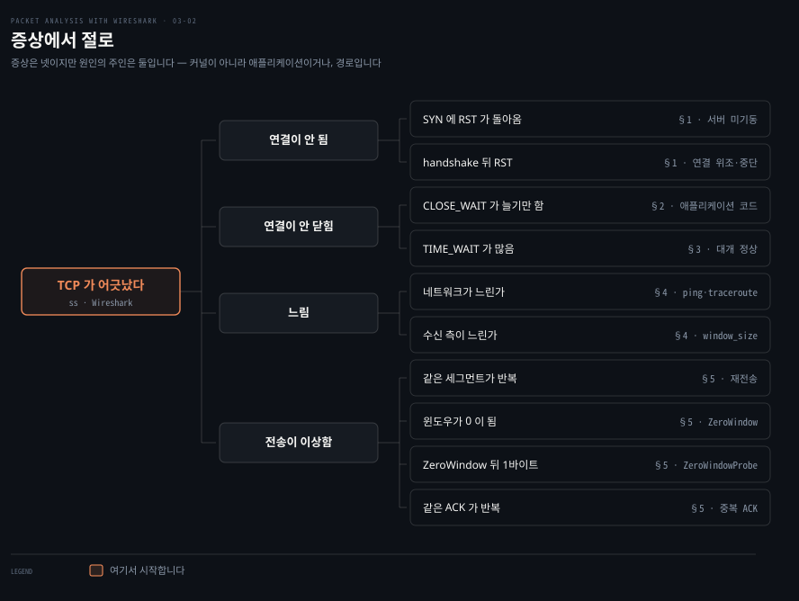
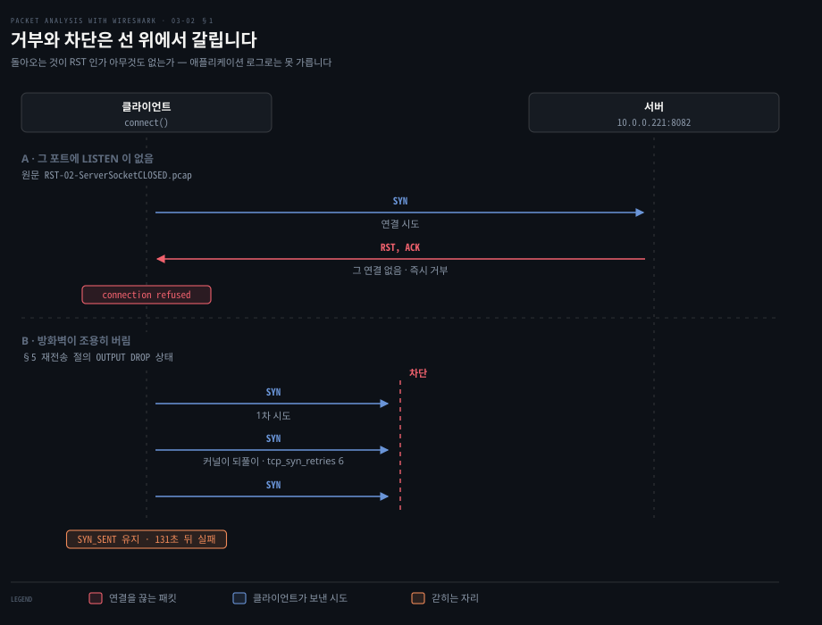
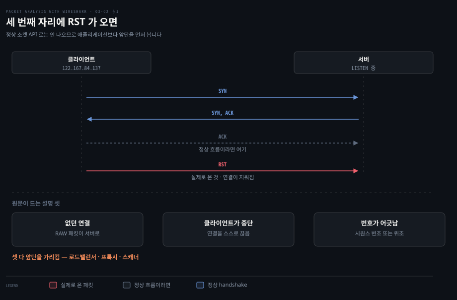
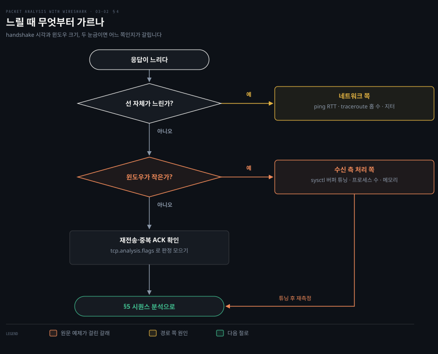
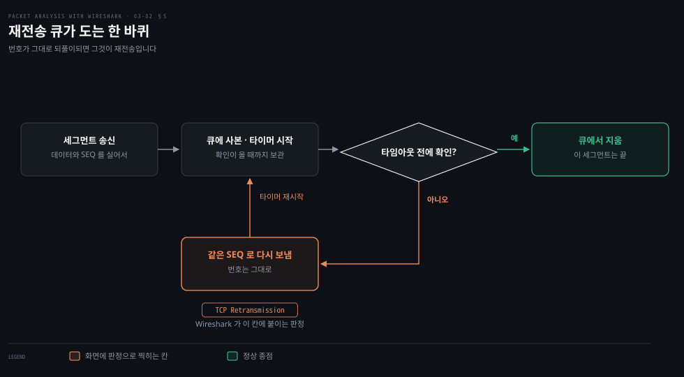
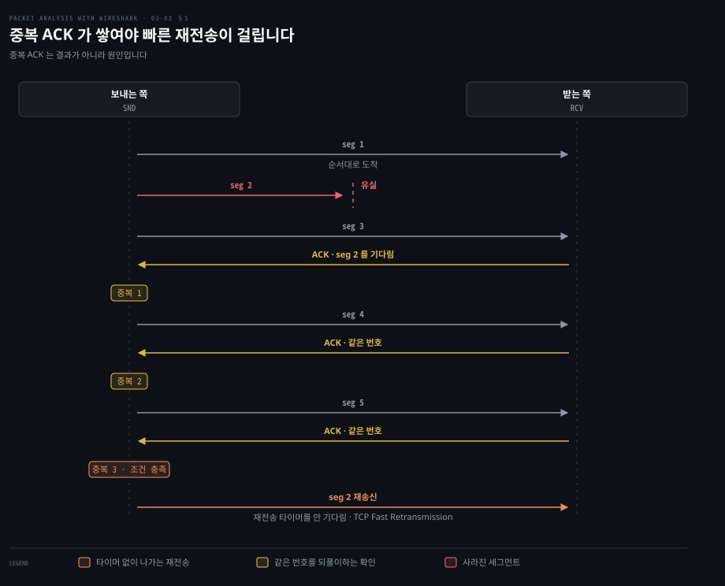
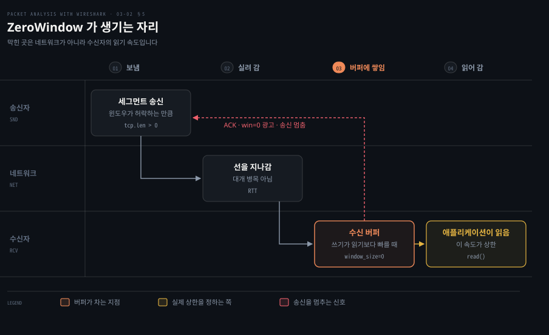
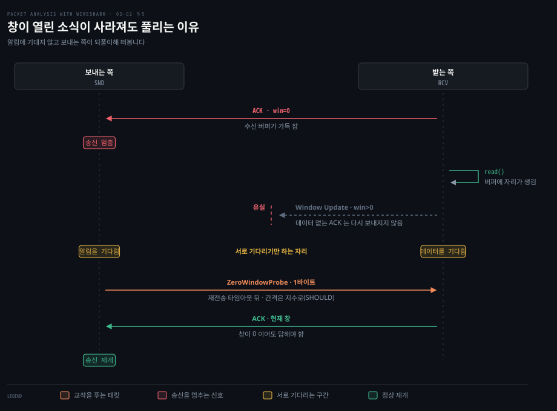

# TCP가 어긋날 때

---

> 3장 후반부는 연결이 정상 경로를 벗어나는 자리들을 모읍니다. 거부·미종료·지연·재전송 넷인데, 넷을 가르는 물음은 하나입니다. 커널이 못 한 일인가, 애플리케이션이 안 한 일인가.

## 핵심 요약

> 이 편이 매달린 하나의 생각은 **TCP 의 이상 신호 대부분이 커널의 고장이 아니라 애플리케이션이나 경로의 상태를 그대로 비추는 것이며, 그래서 어느 신호가 떴는지가 어디를 고쳐야 하는지를 말해 준다**는 것입니다.

원문이 다루는 네 갈래는 서로 다른 층을 가리킵니다. `RST` 는 상대가 그 연결을 받을 준비가 안 됐다는 신호입니다. `CLOSE_WAIT` 는 내 애플리케이션이 소켓을 안 닫았다는 뜻입니다. 지연은 선이 느린 경우와 수신 측이 못 읽어 가는 경우로 다시 갈립니다. 재전송·`ZeroWindow`·중복 ACK 는 Wireshark 가 시퀀스 번호를 보고 붙인 판정입니다.

원문의 판정 중 가장 실무적인 것은 `CLOSE_WAIT` 에 대한 것입니다. **"`CLOSE_WAIT` 는 애플리케이션 코드에 문제가 있다는 뜻이며, 트래픽이 많은 환경에서 `CLOSE_WAIT` 가 계속 늘면 애플리케이션 프로세스를 느리게 만들고 죽일 수도 있습니다."** 패킷을 잡기 전에 개수만 세어도 원인이 좁혀집니다.

Wireshark 쪽에서 이 편의 열쇠는 `tcp.analysis.flags` 하나입니다. 원문이 적듯 이 필터는 Wireshark 가 전문가 메시지를 붙인 패킷을 모아 보여 줍니다. Packet Details 의 SEQ/ACK analysis 아래 TCP Analysis Flags 를 펼치면 무엇이 그 판정을 촉발했는지가 나옵니다.


## 학습 목표

> 이 편을 읽고 나면 아래 다섯 가지를 스스로 해낼 수 있습니다.

1. `RST` 가 몇 번째 패킷에서 나왔는지로 원인 후보를 좁힐 수 있습니다.
2. `CLOSE_WAIT` 를 직접 재현하고 코드의 어느 줄이 그것을 만들었는지 지목할 수 있습니다.
3. 느릴 때 선 문제인지 수신 측 처리 문제인지를 handshake 시각과 윈도우 크기 두 눈금으로 가를 수 있습니다.
4. `tcp.analysis.flags` 로 Wireshark 의 판정을 모으고 다섯 판정이 각각 무슨 조건에 붙는지 말할 수 있습니다.
5. 중복 ACK 와 빠른 재전송의 인과 방향을 바르게 말할 수 있습니다.

이 편에서 새로 만나는 낱말입니다. `어디서` 는 그 낱말이 실제로 설명되는 절입니다.

| 키워드 | 뜻 | 학습 포인트·연결 개념 | 어디서 |
|---|---|---|---|
| RST | 연결을 즉시 끊는 제어 비트 | 몇 번째 패킷인지로 원인이 갈림 | §1 |
| `CLOSE_WAIT` | 상대는 닫았는데 안 닫은 상태 | 재시작하면 사라짐 · `close()` 누락 | §2 |
| TCB (Transmission Control Block) | 커널이 연결마다 들고 있는 기록 | 지우면 그 연결에 온 세그먼트에 RST · `TIME_WAIT` 가 붙들고 있는 것 | §3 |
| `ZeroWindow` | 받는 쪽 여유가 0 이 됨 | 선이 아니라 상대가 못 읽는 것 | §5 |
| 재전송 (retransmission) | 같은 바이트를 다시 보냄 | 손실 또는 ACK 유실 · 지연의 원인 | §5 |
| 중복 ACK (duplicate ACK) | 같은 확인 번호가 거듭 옴 | 원인이지 결과가 아님 · 인과 방향 주의 | §5 |
| 빠른 재전송 (fast retransmit) | 중복 ACK 를 보고 앞당겨 보냄 | 타임아웃을 안 기다림 · 중복 ACK 가 먼저 | §5 |
| Zero-Window Probing | 창이 0 일 때 보내는 쪽이 떠보는 일 | 창이 열린 소식이 사라져도 풀림 · `ZeroWindowProbe` 판정 | §5 |

아래는 겉으로 보이는 증상에서 이 편의 어느 절로 가는지를 이은 지도입니다.




## 1. RST — 연결이 거부되거나 끊길 때

> `RST` 는 "이 연결을 지워라"라는 신호입니다. handshake 의 몇 번째에서 나왔는지가 원인을 가릅니다.

### 연결이 안 되는데 로그에는 타임아웃만

애플리케이션 로그에 남는 것은 대개 "연결 실패" 한 줄입니다. 거부당한 것인지, 응답이 아예 없어 타임아웃이 난 것인지, 붙었다가 끊긴 것인지가 그 한 줄로는 갈리지 않습니다. 셋은 조치가 전혀 다릅니다.

### RST 가 하는 일

원문은 `RST` 플래그가 연결을 재설정하며 **"받는 쪽이 그 연결을 지워야 함을 알린다"** 고 설명합니다. 받는 쪽은 시퀀스 번호와 헤더 정보를 근거로 연결을 지웁니다. 그리고 조건을 덧붙입니다. 받는 쪽에 그 연결이 존재하지 않으면 `RST` 가 설정되며 비정상 동작 때문에 **TCP 연결 수명 주기의 어느 시점에서든** 나올 수 있습니다.

### 흔한 쪽 — SYN 에 바로 RST



원문이 "가장 흔한 사용 사례"라고 부르는 경우입니다. `RST-02-ServerSocketCLOSED.pcap` 을 열면 보입니다. 서버가 시작되지 않은 상태에서 클라이언트가 연결을 시도했고 연결이 `RST` 패킷으로 거부됐습니다.

이 형태는 진단이 쉽습니다. **첫 SYN 에 바로 RST 가 돌아오면 그 포트에 `LISTEN` 이 없습니다. 조용히 버리는 방화벽 차단과도 구분됩니다.** 위 그림의 아래쪽처럼 차단이면 아무 응답 없이 SYN 재전송만 반복되기 때문입니다. 같은 SYN 을 누가 몇 번 다시 보내는지는 재전송을 다루는 §5 에서 봅니다.

### 드문 쪽 — handshake 뒤에 RST



`RST-01.pcap` 의 경우입니다. `SYN` 과 `SYN-ACK` 이 오간 뒤 `ACK` 가 와야 할 자리에 `RST` 가 왔습니다. 원문은 먼저 이렇게 단정합니다. **"TCP `RST` 패킷은 정상적으로는 보여선 안 됩니다."** 그리고 가능한 설명을 셋으로 듭니다.

- 클라이언트 연결이 애초에 존재한 적이 없었습니다. RAW 패킷이 TCP 서버로 보내진 경우입니다.
- 클라이언트가 자기 연결을 중단했습니다.
- 시퀀스 번호가 바뀌거나 위조됐습니다.

세 설명이 공통으로 가리키는 것은 **정상적인 소켓 API 사용으로는 이 패턴이 나오지 않는다**는 점입니다. 그래서 이 패턴이 보이면 애플리케이션 코드보다 그 앞단을 먼저 의심하게 됩니다. 로드밸런서, 프록시, 스캐너가 후보입니다.

### 직접 잡아 보려면

원문의 실습은 서버를 띄우지 않은 채 같은 클라이언트만 실행하는 것입니다. 앞 편의 정상 실습과 다른 것은 **서버를 띄웠는가 하나뿐**입니다. 같은 프로그램이 서버 유무에 따라 handshake 를 완성하거나 `RST` 를 받습니다. 명령과 캡처는 [03-03 실습](./03-03.실습 — 연결의 생애를 직접 잡기.md) 이 맡습니다.


## 2. CLOSE_WAIT — 커널은 끝냈는데 애플리케이션이 안 끝냈을 때

> 상대의 FIN 에 대한 ACK 는 커널이 자동으로 보냅니다. 내 FIN 도 커널이 만들어 보내지만 그 계기인 `close()` 는 애플리케이션의 몫이라, 부르지 않으면 여기서 멈춥니다.

### 재시작하면 사라지는 문제

프로세스를 재시작하면 없어지고 며칠 지나면 다시 쌓이는 종류의 문제가 있습니다. 소켓이 계속 늘어나 결국 파일 디스크립터가 바닥나는 형태입니다. 원인이 코드에 있는데 코드는 아무 예외도 던지지 않습니다.

### 원문이 짚는 지점

원문은 이 상태를 **"연결이 `CLOSE_WAIT` 상태에 갇히는 일이 흔하며, 이 시나리오는 대체로 받는 쪽이 상대의 연결 종료 요청을 기다릴 때 일어난다"** 고 설명합니다. `close_wait.pcap` 을 열면 두 단계가 보입니다.

1. 서버가 packet#5 에서 소켓을 닫으며 `tcp.flags.fin == 1` 을 설정하고 `tcp.seq == 2131384057` 을 씁니다.
2. 클라이언트가 packet#7 에서 `tcp.ack == 2131384058` 로 응답했지만 **자기 소켓을 닫지 않았고** 그래서 `CLOSE_WAIT` 에 남습니다.

두 번째 단계의 확인 번호가 앞 편의 규칙을 다시 보여 줍니다. 2131384057 + 1 = 2131384058 입니다. **커널은 규칙대로 할 일을 다 했습니다. 남은 것은 애플리케이션이 `close()` 를 부르는 일 하나뿐입니다.**

원문의 판정이 이어집니다. **"`CLOSE_WAIT` 는 애플리케이션 코드에 문제가 있다는 뜻이며, 트래픽이 많은 환경에서 `CLOSE_WAIT` 가 계속 늘면 애플리케이션 프로세스를 느리게 만들고 죽일 수도 있습니다."**

원문의 실습은 클라이언트가 소켓을 닫지 않는 프로그램을 띄워 이 상태를 만드는 것입니다. 같은 상태를 컨테이너에서 실제로 만들어 잡은 캡처가 [03-03 §2](./03-03.실습 — 연결의 생애를 직접 잡기.md) 에 있습니다.

### 세어 보기

```bash
netstat -an | grep CLOSE_WAIT
```

앞 편에서 본 `ss -nt4 state CLOSE-WAIT` 도 같은 일을 합니다. **한 번 세는 것보다 시간을 두고 두 번 세는 편이 낫습니다.** 개수가 유지되면 정상적인 종료 과정일 수 있습니다. 단조 증가하면 닫지 않는 경로가 있습니다.

### 고치는 자리는 close() 한 줄

고치는 방법으로 원문은 둘을 듭니다. 이미 생긴 `CLOSE_WAIT` 를 없애려면 프로세스 재시작이 필요합니다. 문제 자체를 풀려면 클라이언트와 서버 양쪽에서 FIN 이 나가야 합니다.

```java
// 원문의 해결 — 처리가 끝나면 소켓을 닫아 FIN 흐름을 시작합니다
Socket socket = new Socket(InetAddress.getByName("localhost"), 9999);
// ...
socket.close();          // 이 호출이 계기가 되어 커널이 FIN 을 보냅니다
// ...
Thread.sleep(Integer.MAX_VALUE);
```

이렇게 고쳐 다시 실행하면 `CLOSE_WAIT` 가 보이지 않는다는 것이 원문의 설명입니다. 그런데 위 코드에는 실무에서 걸리는 함정이 있습니다. **`close()` 앞에서 예외가 나면 그 줄에 도달하지 못합니다.** 앞 편 심화 학습에서 본 try-with-resources 가 그 경로까지 막습니다.

> **노트의 읽기**: 원문은 이 실습에서 띄울 서버를 `java TCPServer01` 로 적었지만 `TCPServer01` 은 앞 편 정상 연결 실습의 서버입니다. 이 절의 서버는 같은 단계에서 컴파일한 `Server0302` 입니다. 고치는 방법을 다룬 대목의 소제목도 "How to resolve TCP CLOSE_STATE" 로 적었는데 `CLOSE_STATE` 라는 TCP 상태는 없습니다. 앞뒤 문장이 다루는 것은 모두 `CLOSE_WAIT` 입니다.


## 3. TIME_WAIT — 정상인데 많아 보일 때

> `TIME_WAIT` 는 고장이 아니라 안전장치입니다. 마지막 ACK 가 유실됐을 때를 대비해 일부러 머무는 시간입니다.

### 많으면 불안해지는 상태

`netstat` 을 찍으면 `TIME_WAIT` 가 수천 개 보이는 일이 흔합니다. `CLOSE_WAIT` 와 이름이 비슷해 같은 종류의 문제로 오해하기 쉽습니다.

### 왜 머무는가

원문은 목적을 이렇게 적습니다. **"`TIME_WAIT` 상태의 주된 목적은 한쪽 끝이 `LAST_ACK` 이나 `CLOSING` 에 앉아 FIN 을 재전송하고 우리 ACK 중 하나 이상이 유실됐을 때 연결을 우아하게 닫는 것입니다."**

곧 내가 보낸 마지막 ACK 가 도중에 사라질 수 있습니다. 그러면 상대는 FIN 을 다시 보냅니다. 그 FIN 이 왔을 때 내 쪽에 연결이 남아 있어야 제대로 답할 수 있습니다. 여기서 연결이 남아 있다는 것은 커널이 연결마다 들고 있는 기록이 남아 있다는 뜻입니다. RFC 9293 은 이 기록을 TCB(Transmission Control Block)라 부릅니다. 주소와 포트 쌍, 송수신 버퍼와 재전송 큐를 가리키는 포인터, 시퀀스 번호 변수들을 담는 기록입니다.[^rfc9293-state]

그 기록을 이미 지운 뒤에 재전송된 FIN 이 오면 커널에는 그 연결이 없습니다. §1 에서 본 대로 받는 쪽에 연결이 없으면 `RST` 가 나갑니다. RFC 9293 도 연결이 없는(CLOSED) 상태에서는 RST 가 아닌 모든 세그먼트에 RST 로 답한다고 적습니다.[^rfc9293-state] 그러면 상대는 정상 종료를 확인하지 못합니다. **`TIME_WAIT` 는 그 재전송을 받아 줄 수 있도록 TCB 를 남겨 두는 시간입니다.** 타이머가 끝나면 커널이 TCB 를 지우고 CLOSED 로 갑니다.[^rfc9293-state]

원문은 RFC 1122 를 인용해 머무는 시간을 분명히 적습니다. 요지는 둘입니다.

- 연결이 능동적으로 닫히면 2×MSL(Maximum Segment Lifetime) 동안 `TIME-WAIT` 상태에 머물러야 합니다(MUST).
- 다만 조건이 맞으면 `TIME-WAIT` 상태에서 원격 TCP 의 새 SYN 을 받아 연결을 바로 다시 열 수도 있습니다(MAY).

첫 줄의 조건을 다시 보면 `TIME_WAIT` 는 손실이 났을 때만 거치는 상태가 아닙니다. **먼저 닫은 연결은 마지막 ACK 가 무사히 도착했든 아니든 모두 이 상태를 거칩니다.** 머무를지를 가르는 조건은 먼저 닫았다는 것 하나입니다.[^rfc9293-state] 그래서 `TIME_WAIT` 가 많다는 사실만으로는 손실을 말할 수 없습니다.

정리하면 판단 기준이 분명해집니다. **`TIME_WAIT` 가 많으면 내가 먼저 닫은 연결이 많은 것이므로 짧은 연결을 대량으로 여닫는 애플리케이션에서는 정상입니다.** 반대로 `CLOSE_WAIT` 는 어느 개수든 닫지 않은 소켓이 있다는 뜻이라 성격이 다릅니다.


## 4. 지연은 어디서 오나

> 느리다는 신고는 선이 느리다는 뜻일 수도, 수신 측이 못 읽어 간다는 뜻일 수도 있습니다. 두 눈금으로 가릅니다.



### 느리다는 말만으로는 아무것도 못 합니다

"느려요"라는 신고에는 네트워크 팀과 애플리케이션 팀이 서로를 가리키는 상황이 따라옵니다. 근거가 없으면 양쪽 다 자기 쪽은 아니라고 말할 수 있습니다.

### 원문이 꼽는 원인들

원문은 지연이 네트워크에 있을 수도, 클라이언트나 서버의 애플리케이션 처리에 있을 수도 있다고 전제하고 흔한 원인을 나열합니다.

- 선 자체가 느립니다. `ping` 으로 잽니다.
- 프로세스가 너무 많아 메모리를 먹습니다. `free`·`top` 으로 CPU 와 메모리 사용을 확인합니다.
- 애플리케이션이 충분한 메모리로 시작되지 않았거나 더 많은 요청을 감당하지 못합니다.
- TCP 튜닝이 잘못됐습니다.
- 네트워크 지터가 있습니다.
- 코드가 나쁩니다. 네트워크 너머로 부하 테스트를 걸어 벤치마크합니다.
- 게이트웨이가 잘못 설정됐습니다. 라우팅 테이블을 확인합니다.
- 홉 수가 많습니다. `traceroute` 로 셉니다. 홉이 많을수록 지연이 늘어납니다.
- NIC 인터페이스가 느리거나 내려가 있습니다.

`ping` 으로 왕복 시간을 재는 예를 원문은 이렇게 보입니다.

```bash
ping -c4 google.com
# round-trip min/avg/max/stddev = 162.507/204.821/226.034/25.394 ms
```

원문의 예제 둘은 이 목록을 윈도우 크기와 handshake 시각이라는 두 눈금으로 좁힙니다.

### 원문의 진단 예제 — 5MB 를 4.99분에 받았습니다

`slow_download.pcap` 에서 HTTP 서버에 5MB 를 요청했는데 받는 데 약 4.99분이 걸렸습니다. 원문이 제시하는 진단 순서는 여덟 단계입니다.

1. `Edit | Preferences | Protocols | HTTP` 에서 HTTP 재조립 옵션을 모두 켭니다.
2. `http.response.code==200` 필터를 겁니다.
3. HTTP 로 가서 `http.time == 299.816907000` 을 확인합니다. 약 4.99분입니다.
4. `http.content_length_header == "5242880"` 으로 파일 크기를 확인합니다.
5. `tcp.segment.count == 2584` 로 몇 개의 TCP 세그먼트가 오갔는지 확인하고 그렇게 많이 필요한지 자문합니다.
6. 클라이언트와 서버의 윈도우 크기를 확인합니다.
7. `tcp.window_size_value` 를 열로 추가하고 오름차순으로 정렬합니다. 서버(`10.0.0.16`)에서 클라이언트(`122.167.205.152`)로 가는 전체 흐름의 윈도우 크기가 **100** 입니다.
8. `sysctl.conf` 의 TCP 튜닝 파라미터를 확인합니다.

7번이 원문이 지목하는 자리입니다. 원문은 이 대목에서 윈도우 크기를 **"한 장치가 애플리케이션 프로세스로 넘기기 전에 상대로부터 한 번에 감당할 수 있는 데이터 양"** 으로 정의합니다. **창이 작게 유지되면 한 번에 실어 보낼 수 있는 양이 그만큼 묶입니다.** 원문은 이 값을 `sysctl.conf` 에서 일부러 줄여 재현했다고 밝힙니다. 고친 뒤 같은 다운로드가 299.8초에서 **2.84초**로 줄었다고도 적습니다(`fast_download.pcap`).

원문이 붙이는 팁이 이 절의 결론입니다. **"윈도우 크기는 시스템이 들어오는 데이터를 처리하기에 너무 느린지를 알려 줍니다. 그것이 가리키는 것은 시스템이 느리다는 것이지 네트워크가 느리다는 것이 아닙니다."**

관련 커널 파라미터는 넷입니다.

```bash
net.core.rmem_max      # 수신 소켓 버퍼 최대치
net.core.wmem_max      # 송신 소켓 버퍼 최대치
net.ipv4.tcp_rmem      # TCP 수신 버퍼 (min / default / max)
net.ipv4.tcp_wmem      # TCP 송신 버퍼 (min / default / max)
```

> **노트의 읽기**: 원문은 이 파일을 한 곳에서는 `sysctl.conf`, 다른 곳에서는 `/etc/sysctl.cnf` 로 적습니다. 실제 경로는 `/etc/sysctl.conf` 이고 `.cnf` 는 오기입니다.

5번의 세그먼트 개수는 원문이 세어만 두고 "이렇게 많이 필요한지 자문하라"고 넘깁니다. 7번의 100 에서 5번의 2,584 를 끌어내지는 않습니다.

> **노트의 읽기**: 두 수를 곧바로 이으면 어긋납니다. 5,242,880바이트를 100바이트씩 나르면 세그먼트가 52,429개 필요한데 원문이 센 것은 2,584개입니다. 세그먼트당 평균 약 2,029바이트인 셈입니다. 원문이 적은 필드 이름이 실마리입니다. `tcp.window_size_value` 는 TCP 헤더에 실린 값 그대로입니다. 창 스케일링이 반영된 크기는 `tcp.window_size` 가 따로 들고 있습니다.[^ws-window-field] 다만 원문에 스케일 인자가 없고 예제 pcap 도 없어 여기서는 계산으로 확정하지 않고 어긋난다는 사실만 적습니다.

### 선 쪽 지연은 handshake 에서 드러납니다

원문은 `slow_client_ack.pcap` 으로 반대 경우를 보입니다. handshake 세 메시지 중 앞의 둘(`SYN`, `SYN-ACK`)은 빠르게 오갔는데 마지막 `ACK` 가 `frame.time_relative == 15.798777000` 초나 걸렸습니다.

이 방법이 유용한 이유가 있습니다. **handshake 는 데이터가 없어 애플리케이션 처리 시간이 섞이지 않으므로 그 구간의 지연은 순수하게 선 쪽 지연입니다.** 원문도 handshake 가 끝난 뒤로는 시간 간격이 일정하게 돌아왔다고 짚습니다. 앞 편에서 본 Set Time Reference 가 이 측정을 편하게 해 줍니다.


## 5. Wireshark 가 붙이는 판정 — 재전송·중복 ACK·ZeroWindow·ZeroWindowProbe

> Wireshark 는 시퀀스 번호를 좇아 판정을 스스로 붙입니다. 다섯 판정이 붙는 조건을 알면 화면의 표시가 문장으로 읽힙니다.

### 수천 줄에서 이상한 것만 고르기

패킷 목록에서 재전송인지 아닌지를 눈으로 가리는 것은 시퀀스 번호를 하나씩 비교하는 일입니다. Wireshark 는 그것을 이미 해 두었습니다. 결과를 필터 하나로 꺼낼 수 있습니다.

### 판정 다섯과 각각이 붙는 조건

원문은 `tcp.analysis.flags` 를 **"Wireshark 가 어떤 종류의 전문가 메시지를 붙인 패킷을 보여 주는 내장 필터"** 로 소개합니다. 무엇이 그 판정을 촉발했는지는 Packet Details 의 TCP 절에서 SEQ/ACK analysis 를 펼치고 그 아래 TCP Analysis Flags 를 펼치면 나옵니다.

원문이 예로 드는 다섯입니다. 각 판정이 붙는 조건은 원문이 적지 않아 Wireshark User's Guide 에서 가져왔습니다. 필터 이름은 tshark 4.6.8 에서 확인했습니다.[^wsug-tcp]

| 판정 | 붙는 조건 | 읽는 법 | 필터 |
|---|---|---|---|
| TCP Retransmission | keepalive 가 아니고, 정방향에서 길이가 0 보다 크거나 `SYN`·`FIN` 이 켜져 있으며, 다음에 기대하는 번호가 이 세그먼트의 번호보다 큼 | 확인이 제때 안 와서 다시 보냄 | `tcp.analysis.retransmission` |
| TCP Fast Retransmission | 위 조건 셋에 더해, 역방향에 중복 ACK 가 둘 이상 쌓였거나 2 MSS 넘게 건너뛰었고, 번호가 다음에 기대하는 확인 번호와 같으며, 직전 확인을 본 지 20밀리초가 안 됨 | 타이머를 안 기다리고 앞당겨 보냄 | `tcp.analysis.fast_retransmission` |
| TCP Dup ACK | 길이가 0 이고, 창이 0 이 아닌 채 안 바뀌었거나 유효한 SACK 가 있으며, 다음에 기대하는 번호와 직전 확인 번호가 0 이 아니고(곧 연결이 맺어져 있고) `SYN`·`FIN`·`RST` 가 꺼져 있음 | 뒤는 도착했는데 중간이 빔 | `tcp.analysis.duplicate_ack` |
| TCP ZeroWindow | 광고된 수신 창이 0 이고 `SYN`·`FIN`·`RST` 가 모두 꺼져 있음 | 받는 쪽 버퍼가 가득 참 | `tcp.analysis.zero_window` |
| TCP ZeroWindowProbe | 번호가 다음에 기대하는 번호와 같고 길이가 1 이며, 역방향의 직전 창이 0 이었음 | 보내는 쪽이 창을 떠봄 | `tcp.analysis.zero_window_probe` |

다섯은 둘씩 짝을 이룹니다. 앞의 두 판정은 같은 조건 셋 위에 서 있습니다. 빠른 재전송 쪽이 중복 ACK·번호 일치·시간 세 조건을 더 요구합니다. 뒤의 두 판정은 창이 0 이라는 같은 사실을 두 쪽에서 본 것입니다. 하나는 알리는 쪽, 하나는 떠보는 쪽입니다. 남은 중복 ACK 는 그 사이에서 빠른 재전송을 부르는 자리입니다.

원문은 이 절의 첫 문장에서 필터 이름을 `tcp.analysys.flags` 로 적었습니다. 같은 문장의 뒷부분과 3장 앞 절처럼 `analysis` 로 쓰는 `tcp.analysis.flags` 가 맞습니다.

### 재전송 — 확인이 안 와서 같은 번호를 다시 보냅니다



원문이 설명하는 메커니즘이 위 그림입니다. 보낼 때 사본을 재전송 큐에 넣고 타이머를 시작합니다. 확인이 오면 큐에서 지우고 타이머가 먼저 끝나면 다시 보냅니다. 여기에 한 가지를 덧붙입니다. **재전송 중에는 재전송 타임아웃이 일어날 때까지 시퀀스 번호가 바뀌지 않습니다.**

번호가 안 바뀐다는 점이 화면에서 재전송을 알아보는 단서입니다. 원문의 예제 `tcp-retransmission.pcapng` 에서는 `tcp.seq == 1870089183` 을 보낸 뒤 재전송이 많이 일어납니다. 원문은 그 결과를 **"많은 TCP 재전송은 작업 타임아웃으로 이어질 수 있습니다"** 로 정리합니다.

원문이 다는 팁 하나가 오해를 막습니다. **KeepAlive 는 재전송이 아닙니다.** Wireshark 도 둘을 갈라 Keep-Alive 조건에 걸린 세그먼트에는 재전송 판정을 덮어씁니다.[^wsug-tcp]

원문의 재현 실습은 방화벽으로 응답을 버려 이 상태를 만드는 것입니다. 명령은 [03-03 실습](./03-03.실습 — 연결의 생애를 직접 잡기.md) 이 맡습니다. 원문은 그 절차에서 규칙을 영구 저장하는 줄을 `iptables save` 로 적었지만 그런 하위 명령은 없습니다. 규칙을 파일로 내보내는 명령은 하이픈이 붙은 `iptables-save` 입니다.

이 실습이 앞 §1 의 `RST` 와 짝을 이룹니다. **포트가 닫혀 있으면 `RST` 가 돌아옵니다. 응답이 버려지면 아무것도 안 와서 `SYN` 재전송이 반복됩니다.** 두 증상을 가르는 것이 방화벽 차단 여부입니다.

차단된 쪽에서 SYN 을 다시 보내는 주체는 커널입니다. 애플리케이션이 보내는 것이 아닙니다. 연결은 `SYN_SENT` 에 머뭅니다. 리눅스 커널 문서는 첫 SYN 을 다시 보내는 횟수 `tcp_syn_retries` 의 기본값을 6 으로 적습니다. 문서의 계산으로는 초기 RTO 1초와 `tcp_syn_linear_timeouts` 기본값 4 에서 이 값이 마지막 재전송까지 67초에 해당하고 연결 시도는 131초 뒤에 최종 실패합니다.[^ip-sysctl-syn]

애플리케이션이 연결에 따로 거는 제한 시간은 이 재전송과 다른 층의 시계입니다. 애플리케이션이 그보다 짧게 걸어 두었다면 커널의 재전송이 다 끝나기 전에 애플리케이션 쪽 시간이 먼저 다합니다.

### 중복 ACK — 빠른 재전송의 결과가 아니라 원인입니다



원문이 적는 식별 조건은 둘입니다. 윈도우·`SEQ`·`ACK` 가 직전 세그먼트와 같고 세그먼트 길이가 0 입니다. 또 패킷 유실이 있을 때 나타나 재전송이 함께 보입니다. RFC 5681 이 정의하는 조건 다섯도 이와 어긋나지 않습니다.[^rfc5681]

**어긋나는 것은 인과 방향입니다.** RFC 5681 은 **"빠른 재전송 알고리즘은 3개의 중복 ACK 가 도착한 것을 세그먼트가 유실됐다는 표시로 사용한다"** 고 적습니다. 이어 **"3개의 중복 ACK 를 받은 뒤 TCP 는 재전송 타이머가 만료되기를 기다리지 않고 유실된 것으로 보이는 세그먼트를 재전송한다"** 고 덧붙입니다.[^rfc5681] 곧 중복 ACK 3개가 먼저 쌓이고 그것이 빠른 재전송을 촉발합니다. 위 그림의 순서가 그것입니다.

원문은 이 절을 "Duplicate ACKs are sent when there is fast retransmission" 으로 열어 순서를 거꾸로 적었습니다. 같은 절 뒷부분의 "Duplicate ACKs can occur when there is a packet loss, in which case a retransmission can be seen" 은 바른 순서입니다.

### ZeroWindow — 받는 쪽 버퍼가 차서 창이 0 이 됩니다



§4 에서 본 윈도우 크기가 0 이 되는 조건을 원문은 이렇게 짚습니다. **"윈도우 크기가 0 인 TCP 헤더는 받는 쪽의 버퍼가 가득 찼음을 뜻합니다. 이 상태는 읽기보다 쓰기가 빠를 때 더 빨리 옵니다."**

뒷문장이 이 신호의 뜻을 정합니다. 위 그림처럼 **막힌 곳은 선이 아니라 애플리케이션의 읽기 속도입니다.**

원문이 제시하는 조치는 셋입니다.

- 애플리케이션이 충분한 메모리로 시작했는지 확인합니다.
- 더 큰 윈도우 크기를 얻도록 TCP 파라미터를 튜닝합니다. `sysctl.conf` 의 `net.core.rmem_max`·`net.core.wmem_max`·`net.ipv4.tcp_rmem`·`net.ipv4.tcp_wmem` 을 봅니다.
- 받는 쪽이 프로세스를 너무 많이 돌리고 있지 않은지 확인합니다.

원문의 팁도 화면에서 유용합니다. **`SYN`·`RST`·`FIN` 플래그는 TCP ZeroWindow 에도 TCP Window Full 에도 절대 설정되지 않습니다.** 그 세 플래그가 함께 보이면 다른 종류의 패킷입니다.

> **노트의 읽기**: 원문은 ZeroWindow 를 설명하며 "세그먼트가 정확히 1바이트"라고 적습니다. 그런데 윈도우 0 을 광고하는 패킷은 대개 데이터가 없는 ACK 입니다. 1바이트인 것은 앞 표에 함께 든 **ZeroWindowProbe** 쪽입니다. Wireshark 가 역방향 창이 0 일 때 다음 번호로 온 1바이트 세그먼트에 그 판정을 붙이기 때문입니다.[^wsug-tcp] 원문의 문장은 두 판정을 한 문단에서 다루다 섞인 것으로 보입니다.

### Window Update 와 ZeroWindowProbe — 창이 열린 소식이 사라져도 풀립니다



원문은 Window Update 를 정상 동작으로 규정합니다. **"Window Update 는 ACK 패킷이고 창을 넓히기만 하며, 이것은 정상적인 TCP 동작입니다."** 식별 조건은 직전 세그먼트와 같은 번호를 갖고 새 윈도우 값을 실은 0바이트 세그먼트입니다. `ZeroWindow` 뒤에 이것이 보이면 막혔던 것이 풀린 것이므로 두 판정은 짝으로 읽습니다.

원문은 여기서 멈춥니다. 그런데 이 ACK 가 도중에 사라지면 어떻게 되는지가 남습니다. RFC 9293 은 데이터 없는 ACK 가 확실하게 전달되지 않는다고 적습니다.[^rfc9293-window] 그러면 위 그림의 가운데처럼 받는 쪽은 데이터를, 보내는 쪽은 알림을 기다리며 둘 다 멈춥니다.

그래서 규격은 이 일을 받는 쪽의 알림에 맡기지 않고 **보내는 쪽이 떠보게 합니다.** RFC 9293 §3.8.6.1 은 이 일을 Zero-Window Probing 이라 부릅니다. 그 절의 두 문장입니다.

> "This retransmission is essential to guarantee that when either TCP peer has a zero window the reopening of the window will be reliably reported to the other." · "The transmitting host SHOULD send the first zero-window probe when a zero window has existed for the retransmission timeout period (SHLD-29) (Section 3.8.1), and SHOULD increase exponentially the interval between successive probes (SHLD-30)."[^rfc9293-window]

떠보는 일 자체는 선택이 아닙니다. 같은 절이 **"Probing of zero (offered) windows MUST be supported (MUST-36)."** 라고 못박습니다.[^rfc9293-window]

SHOULD 가 걸린 것은 시점과 간격 쪽입니다. 창이 0 인 채로 재전송 타임아웃만큼 지나면 첫 패킷을 보내고 간격은 지수로 늘립니다. 받는 쪽은 창이 0 이어도 현재 창을 실은 ACK 로 답해야 합니다.[^rfc9293-window] **되풀이하므로 답 하나가 사라져도 다음 패킷의 답이 열린 창을 알려 줍니다.** 앞 표의 1바이트는 규격이 아니라 Wireshark 의 판정 조건입니다. RFC 는 적어도 한 옥텟이라고만 적습니다.

SWS(Silly Window Syndrome)는 창이 작은 조각으로 움직이며 성능이 크게 떨어지는 패턴입니다. Window Update 가 언제 나가는지는 RFC 9293 §3.8.6.2.2 가 정합니다. 애플리케이션이 읽어 가도 받는 쪽이 곧바로 알린다는 보장은 없습니다. 받는 쪽의 SWS 회피 알고리즘과 지연 ACK 가 허락할 때 나갑니다.[^rfc9293-window]


## 심화 학습

> 3장 후반부에서 바뀐 것은 실습 환경의 명령뿐이고, 판정의 의미와 진단 순서는 그대로입니다. 실행 절차는 [03-03 실습](./03-03.실습 — 연결의 생애를 직접 잡기.md) 으로 옮겼습니다.

| 원문(2015) | 현행(2026) | 성격 |
|-----------|-----------|------|
| `tcp.analysys.flags` | `tcp.analysis.flags` | 원문 오타 — 본문은 바른 표기로 |
| `iptables save` | `iptables-save` 또는 `service iptables save` | 원문 오기 — 본문은 바른 명령으로 |
| 중복 ACK 는 빠른 재전송의 *결과* | 중복 ACK 가 빠른 재전송의 *원인*[^rfc5681] | 원문 인과 뒤집힘 — 본문은 RFC 순서로 |
| ZeroWindow 세그먼트가 1바이트 | 1바이트인 것은 ZeroWindowProbe | 원문이 두 판정을 섞음 — 노트의 읽기 |
| `/etc/sysctl.cnf` | `/etc/sysctl.conf` | 원문 오타 — 노트의 읽기 |
| CentOS 6 · `telnet`·`nc` 실습 | 리눅스 컨테이너 둘로 옮김 — [03-03](./03-03.실습 — 연결의 생애를 직접 잡기.md) | 실행은 실습편으로 |
| `netstat -an \| grep` | `ss -nt4 state …` 가 더 빠릅니다 | 확장 |
| 버퍼 파라미터 넷 | 그대로[^ip-sysctl] | 유지 |

원문이 다루지 않는 축이 하나 있습니다. **판정을 필터로 세어 조사의 방향을 정하는 방법**입니다. `tcp.analysis.flags` 로 모으는 것까지는 원문이 알려 줍니다. 어느 판정이 몇 개인지까지 세면 어디를 볼지가 바로 정해집니다.

```bash
# 판정별 개수를 세어 무엇이 지배적인지 봅니다
tshark -r slow.pcapng -Y 'tcp.analysis.retransmission' | wc -l
tshark -r slow.pcapng -Y 'tcp.analysis.duplicate_ack'  | wc -l
tshark -r slow.pcapng -Y 'tcp.analysis.zero_window'    | wc -l
```

재전송이 지배적이면 경로나 차단을 보고 `ZeroWindow` 가 지배적이면 수신 측 애플리케이션을 봅니다. 중복 ACK 만 많고 재전송이 적다면 순서 뒤바뀜일 수 있습니다. **세 숫자의 비율이 §4 의 판단 흐름에서 어느 갈래로 갈지를 정해 줍니다.**


## 결정 치트시트

> 화면에 보이는 판정과 그것이 가리키는 곳입니다.

| 보이는 것 | 어디를 보나 | 왜 |
|----------|-----------|-----|
| 첫 SYN 에 RST | 서버 프로세스·바인딩 포트 | 그 포트에 `LISTEN` 이 없습니다 |
| SYN 재전송만 반복 | 방화벽·ACL | 응답이 버려지고 있습니다 |
| handshake 뒤 RST | 앞단 프록시·LB·스캐너 | 정상 소켓 사용으로는 안 나옵니다 |
| `CLOSE_WAIT` 단조 증가 | 애플리케이션의 close 경로 | 커널은 할 일을 마쳤습니다 |
| `TIME_WAIT` 많음 | 대개 조치 불필요 | 내가 먼저 닫은 연결이 많다는 뜻입니다 |
| handshake 만 느림 | 선·경로 | 데이터가 없어 앱 처리가 안 섞입니다 |
| 윈도우가 작게 유지됨 | 수신 측 버퍼·프로세스 | 시스템이 느린 것이지 선이 느린 게 아닙니다 |
| `ZeroWindow` | 수신 측 애플리케이션의 읽기 | 버퍼가 찼습니다 |
| 재전송 다수 | 경로 유실·차단 | 확인이 제때 안 옵니다 |
| 중복 ACK 다수 | 유실 또는 순서 뒤바뀜 | 3개가 쌓이면 빠른 재전송이 걸립니다 |


## 면접 대비

### 한 줄 정의

"`tcp.analysis.flags` 는 Wireshark 가 시퀀스 번호를 좇아 붙인 판정을 한 번에 모아 보는 필터이며, 재전송·중복 ACK·ZeroWindow 같은 것이 여기 걸립니다."

### 핵심 포인트 세 가지

1. **RST 의 위치가 원인을 가릅니다.** 첫 SYN 에 대한 RST 는 그 포트에 `LISTEN` 이 없다는 신호입니다. handshake 가 끝난 뒤의 RST 는 정상 소켓 사용으로 나오지 않으므로 앞단을 의심합니다. 응답이 아예 없으면 그것은 차단입니다.
2. **윈도우 크기는 수신 측의 속도계입니다.** 작게 유지되거나 0 이 되는 것은 애플리케이션이 못 읽어 가기 때문입니다. 선이 느려서 생기는 일이 아닙니다. handshake 구간의 시각과 함께 보면 어느 쪽인지가 갈립니다.
3. **중복 ACK 가 빠른 재전송을 부릅니다.** 반대가 아닙니다. RFC 5681 은 3개의 중복 ACK 도착을 유실의 표시로 삼아 타이머를 기다리지 않고 재전송한다고 정합니다.

### 자주 묻는 질문

Q: 연결이 안 될 때 RST 와 타임아웃을 어떻게 구분합니까?
A: 캡처를 보면 바로 갈립니다. RST 가 돌아왔다면 상대 호스트에 닿았고 그 포트가 닫혀 있는 것입니다. 아무것도 안 오고 SYN 재전송만 반복되면 중간에서 버려지고 있는 것이라 방화벽을 봅니다.

Q: `CLOSE_WAIT` 는 왜 시간이 지나도 안 사라집니까?
A: 만료 타이머가 없기 때문입니다. 커널은 상대 FIN 에 ACK 를 보낸 뒤 애플리케이션이 `close()` 를 부르기를 기다리며 그 호출이 없으면 계속 기다립니다.

Q: `ZeroWindow` 가 보이면 무엇부터 합니까?
A: 그 패킷을 보낸 쪽, 곧 데이터를 받는 쪽의 애플리케이션을 봅니다. 버퍼 파라미터 튜닝은 그다음입니다. 읽는 속도 자체가 느리면 버퍼를 키워도 시간만 늦출 뿐입니다.


## 핵심 개념 체크리스트

- [ ] RST 가 첫 SYN 에 왔을 때와 handshake 뒤에 왔을 때의 원인 후보를 각각 댈 수 있습니까?
- [ ] `CLOSE_WAIT` 를 재현하는 코드 조건과 그것을 막는 코드 패턴을 쓸 수 있습니까?
- [ ] `TIME_WAIT` 가 왜 안전장치인지 마지막 ACK 유실 시나리오로 설명할 수 있습니까?
- [ ] 손실이 전혀 없는 네트워크에서도 먼저 닫은 연결이 `TIME_WAIT` 를 거치는 이유와 그동안 커널이 붙들고 있는 것이 무엇인지 말할 수 있습니까?
- [ ] 창이 다시 열렸다는 소식이 사라져도 연결이 풀리는 이유를 누가 무엇을 되풀이하는지로 설명할 수 있습니까?
- [ ] 느릴 때 선 문제인지 수신 측 문제인지를 어느 두 눈금으로 가릅니까?
- [ ] 원문의 창 100 과 세그먼트 2,584 개를 곱셈으로 이으면 왜 어긋나는지, 어느 필드를 봐야 하는지 말할 수 있습니까?
- [ ] 중복 ACK 와 빠른 재전송의 인과 방향을 RFC 근거와 함께 말할 수 있습니까?


## 관련 문서

- [03-01 TCP 연결의 생애](./03-01.TCP 연결의 생애.md) — 이 편의 앞. handshake·종료·상태 이름
- [03-03 실습 — 연결의 생애를 직접 잡기](./03-03.실습 — 연결의 생애를 직접 잡기.md) — 이 편의 RST·CLOSE_WAIT·재전송을 컨테이너에서 직접 만든 캡처
- [04-01 TLS 핸드셰이크 읽기](./04-01.TLS 핸드셰이크 읽기.md) — 이 편의 뒤. TCP 위에 얹히는 TLS
- [Packet Analysis with Wireshark — 정독 인덱스](./README.md) — 7개 장 전체 지도


## 참고 자료

- 원본: 《Packet Analysis with Wireshark》 (Anish Nath, Packt Publishing, 2015) ISBN 978-1-78588-781-9
- 다룬 범위: Chapter 3 의 TCP troubleshooting · TCP latency issues · Wireshark TCP sequence analysis 절
- [RFC 5681 — TCP Congestion Control](https://datatracker.ietf.org/doc/html/rfc5681) — 빠른 재전송과 중복 ACK 의 정의
- [Wireshark Wiki — TCP Analyze Sequence Numbers](https://wiki.wireshark.org/TCP_Analyze_Sequence_Numbers) — 원문 References 절이 가리키는 문서
- [Linux ip-sysctl 문서](https://docs.kernel.org/networking/ip-sysctl.html) — TCP 버퍼 파라미터

[^rfc5681]: RFC 5681 §3.2 Fast Retransmit/Fast Recovery — "The fast retransmit algorithm uses the arrival of 3 duplicate ACKs (as defined in section 2, without any intervening ACKs which move SND.UNA) as an indication that a segment has been lost." · "After receiving 3 duplicate ACKs, TCP performs a retransmission of what appears to be the missing segment, without waiting for the retransmission timer to expire." 중복 ACK 의 조건 다섯은 §2 에 있습니다. <https://datatracker.ietf.org/doc/html/rfc5681> (2026-09-05 조회)

[^rfc9293-state]: RFC 9293 §3.6.1 — "When a connection is closed actively, it MUST linger in the TIME-WAIT state for a time 2xMSL (Maximum Segment Lifetime) (MUST-13)." · §3.3.1 — "We conceive of these variables being stored in a connection record called a Transmission Control Block or TCB. Among the variables stored in the TCB are the local and remote IP addresses and port numbers, the IP security level, and compartment of the connection (see Appendix A.1), pointers to the user's send and receive buffers, pointers to the retransmit queue and to the current segment. In addition, several variables relating to the send and receive sequence numbers are stored in the TCB." · §3.5.2 — "If the connection does not exist (CLOSED), then a reset is sent in response to any incoming segment except another reset." · §3.10.8 TIME-WAIT TIMEOUT — "If the time-wait timeout expires on a connection, delete the TCB, enter the CLOSED state, and return." <https://www.rfc-editor.org/rfc/rfc9293.txt> (2026-09-15 조회)

[^rfc9293-window]: RFC 9293 §4 Glossary, ACK — "A control bit (acknowledge) occupying no sequence space, which indicates that the acknowledgment field of this segment specifies the next sequence number the sender of this segment is expecting to receive, hence acknowledging receipt of all previous sequence numbers." · §3.8.4 — "It is extremely important to remember that ACK segments that contain no data are not reliably transmitted by TCP." · §3.8.6.1 Zero-Window Probing — "The sending TCP peer must regularly transmit at least one octet of new data (if available), or retransmit to the receiving TCP peer even if the send window is zero, in order to "probe" the window." · "Probing of zero (offered) windows MUST be supported (MUST-36)." · "This retransmission is essential to guarantee that when either TCP peer has a zero window the reopening of the window will be reliably reported to the other." · "When the receiving TCP peer has a zero window and a segment arrives, it must still send an acknowledgment showing its next expected sequence number and current window (zero)." · "The transmitting host SHOULD send the first zero-window probe when a zero window has existed for the retransmission timeout period (SHLD-29) (Section 3.8.1), and SHOULD increase exponentially the interval between successive probes (SHLD-30)." · §3.8.6.2 — "The "Silly Window Syndrome" (SWS) is a stable pattern of small incremental window movements resulting in extremely poor TCP performance." · §3.8.6.2.2 Receiver's Algorithm — "The receiver's SWS avoidance algorithm determines when the right window edge may be advanced; this is customarily known as "updating the window". This algorithm combines with the delayed ACK algorithm (Section 3.8.6.3) to determine when an ACK segment containing the current window will really be sent to the receiver." · §3.8.6.3 — "sending fewer than one ACK (acknowledgment) segment per data segment received; this is known as a "delayed ACK"." <https://www.rfc-editor.org/rfc/rfc9293.txt> (2026-09-15 조회)

[^wsug-tcp]: Wireshark User's Guide, TCP Analysis — 판정 표의 조건은 모두 이 문서에서 옮긴 것입니다. "TCP Retransmission Set when all of the following are true: This is not a keepalive packet. In the forward direction, the segment length is greater than zero or the SYN or FIN flag is set. The next expected sequence number is greater than the current sequence number." · "TCP Fast Retransmission Set when all of the following are true: This is not a keepalive packet. In the forward direction, the segment size is greater than zero or the SYN or FIN is set. The next expected sequence number is greater than the current sequence number. We have at least two duplicate ACKs in the reverse direction, or more than 2 MSS have been jumped over" (이 줄만 원문 목록에 마침표가 없습니다) "The current sequence number equals the next expected acknowledgment number. We saw the last acknowledgment less than 20ms ago." · "TCP Dup ACK … Set when all of the following are true: The segment size is zero. The window size is non-zero and hasn't changed, or there is valid SACK data. The next expected sequence number and last-seen acknowledgment number are non-zero (i.e., the connection has been established). SYN, FIN, and RST are not set." · "TCP ZeroWindow Set when the receive window size is zero and none of SYN, FIN, or RST are set." · "TCP ZeroWindowProbe Set when the sequence number is equal to the next expected sequence number, the segment size is one, and last-seen window size in the reverse direction was zero." · "TCP Keep-Alive … Supersedes "Fast Retransmission", "Out-Of-Order", "Spurious Retransmission", and "Retransmission"." 필터 이름 다섯은 `dftest` 로 확인했습니다(TShark 4.6.8, 2026-09-17). <https://www.wireshark.org/docs/wsug_html_chunked/ChAdvTCPAnalysis.html> (2026-09-15 조회)

[^ip-sysctl-syn]: Linux kernel networking 문서, `tcp_syn_retries` — "Number of times initial SYNs for an active TCP connection attempt will be retransmitted. Should not be higher than 127. Default value is 6, which corresponds to 67seconds (with tcp_syn_linear_timeouts = 4) till the last retransmission with the current initial RTO of 1second. With this the final timeout for an active TCP connection attempt will happen after 131seconds." <https://docs.kernel.org/networking/ip-sysctl.html> (2026-09-15 조회)

[^ws-window-field]: Wireshark 필드 목록(`tshark -G fields`, TShark 4.6.8, 2026-09-17 확인) — `tcp.window_size_value` 는 "The window size value from the TCP header", `tcp.window_size` 는 "The scaled window size (if scaling has been used)", `tcp.window_size_scalefactor` 는 "The window size scaling factor (-1 when unknown, -2 when no scaling is used)" 입니다.

[^ip-sysctl]: Linux kernel networking 문서 — `net.ipv4.tcp_rmem`·`tcp_wmem` 은 각각 min/default/max 세 값을 갖고, `net.core.rmem_max`·`wmem_max` 가 소켓 버퍼의 상한을 정합니다. <https://docs.kernel.org/networking/ip-sysctl.html> (2026-09-05 조회)
