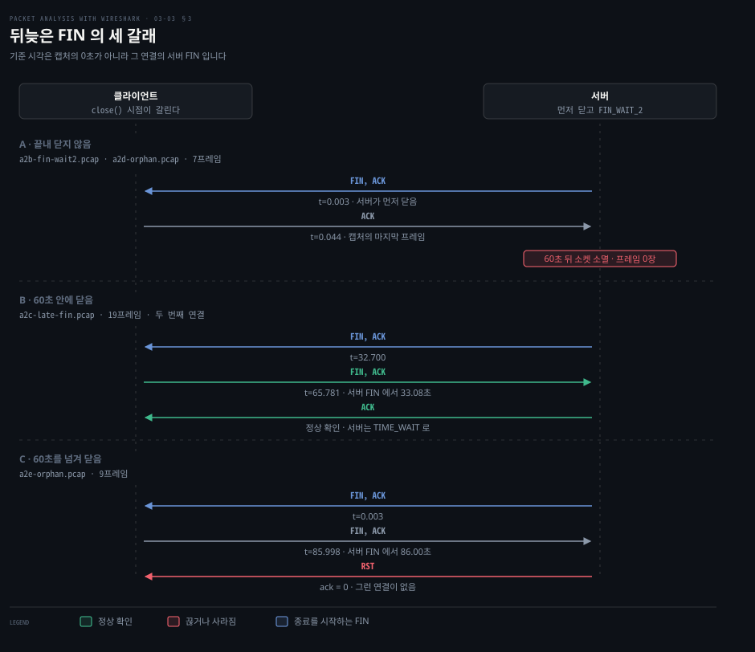

# 실습 — 연결의 생애를 직접 잡기

---

## 실험실

> OrbStack 리눅스 컨테이너 둘. 2026-09-16 실행. 원서가 `ss`·`sysctl`·`tc` 를 전제하는데 맥에는 `ss` 가 없어 자리를 리눅스로 옮겼습니다.

### 원서가 제시하는 일곱 단계

원서는 Java 소켓 프로그램 한 벌로 이 장의 캡처를 만들게 합니다. 이 랩이 무엇을 바꿨는지 보려면 원서 쪽을 먼저 봐야 합니다. 아래는 [03-01 §7](./03-01.TCP 연결의 생애.md) 에서 옮겨 온 원서의 절차입니다.

```bash
# 1. Wireshark 를 열고 캡처를 시작한 뒤 디스플레이 필터를 겁니다
tcp.port==8082

# 2~4. 서버를 컴파일해 띄우고 LISTEN 을 확인합니다
javac TCPServer01.java
java TCPServer01
netstat -an | grep 8082          # tcp46  0  0  *.8082  *.*  LISTEN

# 5~6. 클라이언트를 컴파일해 실행합니다
javac Client0301.java
java Client0301

# 7. Wireshark 에서 패킷을 보고 분석합니다
```

### 이 랩이 바꾼 것

맥에서 원서를 그대로 따라가면 첫 명령부터 막힙니다. `ss` 가 아예 없습니다. 손실이나 지연을 넣으려면 호스트 방화벽을 sudo 로 건드려야 합니다. 컨테이너 둘을 쓰면 원서 명령을 거의 그대로 쓸 수 있습니다. 설정도 컨테이너의 네트워크 네임스페이스 안에만 머물러 호스트가 깨끗하게 남습니다.

랩은 저장소 밖 `~/study/paw-lab/03-tcp-lifecycle/` 에 있습니다. `compose.yaml`·`Dockerfile`·`src/`(Java)·`src-go/`(Go)·`build.sh`·`look.sh`·`pcap/` 한 벌입니다. 원서는 파일 이름과 `socket.close()` 조각만 싣고 소스 전문을 싣지 않았습니다. 그래서 서술된 동작만 맞춰 새로 썼습니다.

```bash
cd ~/study/paw-lab/03-tcp-lifecycle
docker compose up -d --build                # tcp-server, tcp-client 두 컨테이너

# 서버는 접속 하나를 받아 29바이트를 보내고 자기가 먼저 닫는다
docker exec -d tcp-server java /lab/src/SimpleTCPServer01.java

# 클라이언트는 --close-after 가 언제 닫을지를 정한다. 이 편의 네 절이 이 값 하나로 갈린다
docker exec tcp-client java /lab/src/SimpleClient0301.java --close-after 0
```

서버가 보내는 29바이트는 원서와 같은 `ANISH NATH NORMAL CONNECTION` 한 줄입니다. [03-01 §4](./03-01.TCP 연결의 생애.md) 가 SEQ 검산에 쓰는 그 29 입니다. 아래 모든 캡처에 `tcp.len == 29` 로 한 번씩 나옵니다.

### 원서의 `ss -nt4` 가 빈 결과를 내놓습니다

원서는 상태를 셀 때 `ss -nt4 state CLOSE-WAIT` 같은 명령을 씁니다([03-01 §6](./03-01.TCP 연결의 생애.md)). 그런데 소켓이 분명히 있는데 목록이 비었습니다. `-4` 는 IPv4 만 보라는 뜻인데 Java 소켓은 기본이 IPv6 이중 스택이라 `[::ffff:…]` 형태로 잡히기 때문입니다. 원서의 확인 명령이 통째로 무용지물이 됩니다.

compose 의 환경변수로 고정했습니다.

```yaml
environment:
  JDK_JAVA_OPTIONS: -Djava.net.preferIPv4Stack=true
```

코드 안에서 `System.setProperty` 로 거는 것은 늦습니다. 단일 파일 실행 모드(`java Foo.java`)는 `main` 에 들어가기 전에 네트워크 클래스를 초기화하므로 그 시점에는 스택이 이미 정해져 있습니다.

### 잡는 쪽과 읽는 쪽을 가릅니다

캡처는 컨테이너 안 `tcpdump` 가 `pcap/` 에 씁니다. 읽는 일은 호스트의 `tshark` 가 합니다. [01-02 §3](./01-02.실습 — 캡처 환경과 첫 프레임.md) 에서 본 오프라인 분업과 같은 구조입니다.

```bash
# -d 는 셸을 거치지 않아 sh -c 로 감싼다 (5절)
docker exec -d tcp-server sh -c \
  'tcpdump -i eth0 -w /pcap/a1-normal.pcap "tcp port 8082" 2>/dev/null'
```

읽을 때는 `./look.sh <파일>` 을 씁니다. 아래 tshark 호출을 감싼 것입니다. 이 편의 모든 표가 그 출력입니다.

```bash
tshark -r pcap/a1-normal.pcap -T fields -E header=y \
  -e frame.number -e frame.time_relative -e tcp.srcport -e tcp.dstport \
  -e tcp.flags.str -e tcp.seq_raw -e tcp.ack_raw -e tcp.len | column -t
```

표에 상대 번호가 필요하면 `tcp.seq_raw` 를 `tcp.seq` 로, `tcp.ack_raw` 를 `tcp.ack` 로 바꿉니다. 원시 번호는 연결마다 난수에서 시작해 눈으로 못 읽습니다. 상대 번호는 Wireshark 가 첫 SYN 을 0 으로 잡아 다시 센 값입니다.


## 1. 정상 종료 — 네 세그먼트가 아니라 셋이었습니다

> `--close-after 0` 한 번. 8프레임이고 종료는 프레임 6·7·8 셋입니다. 원서 그림의 네 걸음과 개수가 다릅니다.

이 절에서 확인하려는 것은 둘입니다. [03-01](./03-01.TCP 연결의 생애.md) 이 세운 번호 전진 규칙이 실측 번호에서도 맞는지, 그리고 원서가 네 걸음으로 그린 종료가 여기서도 넷인지입니다. 클라이언트가 데이터를 받자마자 닫게 하고 한 번 돌립니다.

```bash
docker exec -d tcp-server sh -c 'tcpdump -i eth0 -w /pcap/a1-normal.pcap "tcp port 8082" 2>/dev/null'
docker exec tcp-client java /lab/src/SimpleClient0301.java --close-after 0
./look.sh pcap/a1-normal.pcap
```

| 프레임 | 시각(초) | 방향 | 플래그 | SEQ | ACK | len |
|---|---|---|---|---|---|---|
| 1 | 0.000000 | 클라이언트 → 서버 | `S` | 0 | 0 | 0 |
| 2 | 0.000099 | 서버 → 클라이언트 | `A··S` | 0 | 1 | 0 |
| 3 | 0.000105 | 클라이언트 → 서버 | `A` | 1 | 1 | 0 |
| 4 | 0.008004 | 서버 → 클라이언트 | `AP` | 1 | 1 | 29 |
| 5 | 0.008018 | 클라이언트 → 서버 | `A` | 1 | 30 | 0 |
| 6 | 0.008963 | 서버 → 클라이언트 | `A···F` | 30 | 1 | 0 |
| 7 | 0.012066 | 클라이언트 → 서버 | `A···F` | 1 | 31 | 0 |
| 8 | 0.012107 | 서버 → 클라이언트 | `A` | 31 | 2 | 0 |

### 번호가 언제 전진하는지를 이 여덟 줄로 검산합니다

[03-01 §2](./03-01.TCP 연결의 생애.md) 가 식으로 세웠고 [§4](./03-01.TCP 연결의 생애.md) 가 원문 번호로 검산했습니다. 여기서는 같은 것을 뺄셈으로 확인할 수 있습니다. 볼 것은 셋입니다.

- **SYN 은 데이터가 0바이트인데 번호 하나를 차지합니다.** 프레임 1 의 len 은 0 인데 프레임 2 의 ACK 가 1 입니다. 원시 번호로도 2976367397 다음이 2976367398 입니다.
- **데이터는 len 만큼 전진합니다.** 프레임 4 가 SEQ 1 로 29바이트를 싣고, 프레임 5 의 ACK 가 30 입니다. 서버의 다음 SEQ 인 프레임 6 도 30 입니다.
- **ACK 는 번호를 차지하지 않습니다.** 클라이언트의 SEQ 는 프레임 3·5·7 에서 내내 1 입니다. ACK 를 두 번 보내는 동안 한 칸도 움직이지 않았습니다. 움직인 것은 FIN 을 실은 프레임 7 다음입니다. 프레임 8 의 ACK 가 2 인 것이 그 증거입니다.
- **PSH 도 번호를 차지하지 않습니다.** 프레임 4 는 SEQ 1 에서 시작해 다음 SEQ 가 30 이니 전진분은 29 입니다. 데이터 길이 그대로입니다. PSH 비트가 하나를 더 먹었다면 31 이 되어야 했습니다.

### 종료가 셋인 이유는 프레임 6 과 7 의 간격에 있습니다

원서 예제는 종료에 네 걸음을 씁니다. 서버 FIN, 클라이언트 ACK, 클라이언트 FIN, 서버 ACK 순입니다. 그런데 이 캡처에는 클라이언트의 단독 ACK 가 없습니다. 프레임 7 하나가 `A···F` 로 ACK 와 FIN 을 함께 싣고 있습니다.

프레임 6 에서 7 까지가 3.1밀리초입니다. 서버 FIN 이 도착한 순간 애플리케이션은 이미 `close()` 를 불러 놓은 상태였습니다.

받는 쪽 커널은 ACK 를 곧바로 보내지 않고 잠깐 미뤄 두었다가 그사이 보낼 것이 생기면 함께 싣습니다. 이것이 지연 ACK 입니다. 리눅스 커널은 ACK 를 미루는 최소 시간을 `HZ/25`, 곧 1/25초인 40밀리초로 정의합니다.[^tcp-h] 커널이 이 타이머를 기다리는 동안 `close()` 가 들어와 둘을 한 세그먼트로 묶었습니다. RFC 9293 은 `FIN-WAIT-1` 에서 `TIME-WAIT` 로 바로 가는 경로를 "perhaps in this segment" 라는 괄호로 적어 두었습니다. 이 캡처가 그 경우입니다. [03-01 §5](./03-01.TCP 연결의 생애.md) 가 원문 밖 보강으로 다룬 대목입니다.

**종료가 셋이냐 넷이냐는 프로토콜이 정하지 않고 애플리케이션이 언제 닫느냐가 정합니다.** 4절에서 같은 서버를 상대로 넷을 만들어 봅니다.


## 2. 클라이언트가 닫지 않으면 — 와야 할 프레임이 오지 않습니다

> `--close-after never`. 캡처가 클라이언트의 ACK 에서 끊기고 그 뒤가 없습니다. 없다는 것이 관찰 결과입니다.

```bash
docker exec -d tcp-server sh -c 'tcpdump -i eth0 -w /pcap/a2b-fin-wait2.pcap "tcp port 8082" 2>/dev/null'
docker exec -d tcp-client java /lab/src/SimpleClient0301.java --close-after never
./look.sh pcap/a2b-fin-wait2.pcap
```

| 프레임 | 시각(초) | 방향 | 플래그 | len |
|---|---|---|---|---|
| 1 | 0.000000 | 클라이언트 → 서버 | `S` | 0 |
| 2 | 0.000141 | 서버 → 클라이언트 | `A··S` | 0 |
| 3 | 0.000147 | 클라이언트 → 서버 | `A` | 0 |
| 4 | 0.003194 | 서버 → 클라이언트 | `AP` | 29 |
| 5 | 0.003205 | 클라이언트 → 서버 | `A` | 0 |
| 6 | 0.003440 | 서버 → 클라이언트 | `A···F` | 0 |
| 7 | 0.044068 | 클라이언트 → 서버 | `A` | 0 |

일곱 줄이 전부입니다. 3절의 고아 판정에 쓰려고 따로 돌린 `a2d-orphan.pcap` 도 포트만 다를 뿐 같은 일곱 줄이고, 마지막 프레임 시각이 0.049476 입니다.

### 프레임 7 은 커널이 보냈고 프레임 8 은 애플리케이션이 안 불렀습니다

프레임 6 과 7 사이가 40.6밀리초입니다. 1절의 3.1밀리초와 대조되는 값이며 리눅스의 지연 ACK 타이머가 이 자리에 있습니다. 1절에서는 그 타이머가 만료되기 전에 `close()` 가 들어와 ACK 와 FIN 이 한 장이 됐습니다. 여기서는 `close()` 가 영영 안 들어와 타이머가 만료되었고 ACK 만 홀로 나갔습니다.

여기서 배울 것은 화면에 없는 것입니다. 클라이언트는 `CLOSE_WAIT` 에, 서버는 `FIN_WAIT_2` 에 남습니다. 두 상태 모두 프레임을 만들지 않으므로 캡처에는 아무 흔적이 없습니다. 이 캡처를 끄지 않고 오래 두면 한참 뒤에 RST 가 붙습니다. 그 이유는 3절에서 봅니다. [03-02 §2](./03-02.TCP가 어긋날 때.md) 는 "커널은 규칙대로 할 일을 다 했고 남은 것은 `close()` 하나뿐" 이라고 적었습니다. 이 일곱 줄이 정확히 그 자리입니다.


## 3. 고아가 만료될 때 — 선에는 아무것도 나가지 않습니다

> 서버가 먼저 닫고 애플리케이션이 소켓을 놓으면 그 소켓은 고아가 됩니다. 고아는 60초를 세고, 그 안에 FIN 이 오느냐로 운명이 셋으로 갈립니다.



2절의 상태가 언제까지 가는지 보려고 `ss` 를 폴링했습니다. 75초 뒤에 확인했을 때 서버 쪽 소켓은 목록에서 사라져 있었고 클라이언트의 `CLOSE_WAIT` 는 그대로 남아 있었습니다. 그 시각에 무슨 패킷이 오갔는지 캡처를 열어 봤더니 볼 것이 없었습니다.

```bash
# a2b·a2d 둘 다 7프레임이고 마지막 프레임이 0.05초 언저리다.
# 75초 근처를 찾는 필터는 아무것도 못 고른다
tshark -r pcap/a2b-fin-wait2.pcap -Y 'frame.time_relative > 1' | wc -l   # 0
tshark -r pcap/a2d-orphan.pcap    -Y 'frame.time_relative > 1' | wc -l   # 0
```

**고아가 된 `FIN_WAIT_2` 가 접힐 때 선에는 한 장도 나가지 않습니다.** 소켓이 사라졌다는 사실은 `ss` 만 압니다. 캡처만 보고 있으면 연결이 아직 살아 있는지 이미 정리됐는지 구분할 방법이 없습니다.

[03-01 §6](./03-01.TCP 연결의 생애.md) 이 적은 대로 고아 `FIN_WAIT_2` 가 기다리는 시간은 커널 파라미터 `tcp_fin_timeout` 이 정합니다.

```bash
docker exec tcp-server sysctl net.ipv4.tcp_fin_timeout
# net.ipv4.tcp_fin_timeout = 60
```

75초라는 숫자도 정밀한 값이 아닙니다. `ss` 를 폴링하다 그 시점에 사라진 것을 본 것입니다. 소멸 시각을 좁히려면 폴링 간격을 줄여 다시 재야 합니다. 캡처로 확정하는 경계는 60초 쪽입니다. 아래 두 캡처가 그 근거입니다.

### 60초 안에 닫으면 정상 확인을 받습니다

`a2c-late-fin.pcap` 은 클라이언트가 FIN 을 한참 늦게 보낸 캡처입니다. 서버 FIN 을 받은 클라이언트가 수십 초 뒤에야 닫게 해서 만들었습니다. 어떤 방법으로 늦췄는지는 이 회차 기록에 명령이 남지 않았습니다. 판정에 쓰는 것은 두 FIN 의 시각뿐입니다. 19프레임 안에 연결이 둘 들어 있습니다. 둘 다 늦은 FIN 이 정상 ACK 를 받았습니다.

| 연결 | 서버 FIN | 클라이언트 FIN | 간격(초) | 서버의 응답 |
|---|---|---|---|---|
| 첫 번째 (포트 46546) | 프레임 7 · 0.007307 | 프레임 9 · 23.706712 | 23.70 | 프레임 10 · ACK |
| 두 번째 (포트 38954) | 프레임 16 · 32.699882 | 프레임 18 · 65.781256 | 33.08 | 프레임 19 · ACK |

두 번째 줄이 이 절에서 제일 조심할 자리입니다. 클라이언트 FIN 의 시각이 65.78 이라 캡처를 켠 지 60초를 넘겼는데도 RST 가 아니라 ACK 가 돌아왔습니다. 기준 시각은 캡처의 0초가 아니라 그 연결의 서버 FIN 입니다. 그 연결에서 재면 33.08초이고 60초 안입니다.

```bash
# 파일 전체의 절대 시각으로 판정하면 틀린다. 그 연결의 서버 FIN 을 먼저 찾고 빼야 한다
tshark -r pcap/a2c-late-fin.pcap -Y 'tcp.port==38954 && tcp.flags.fin==1' \
  -T fields -e frame.number -e frame.time_relative -e tcp.srcport
# 16  32.699882  8082
# 18  65.781256  38954
```

### 60초를 넘겨 닫으면 RST 가 돌아옵니다

`a2e-orphan.pcap` 은 같은 시나리오를 한 번 더 늦춰 돌린 것입니다. 클라이언트가 닫지 않게 띄워 두고 서버 FIN 에서 85초쯤 지나 자바 프로세스를 죽여 커널이 대신 FIN 을 보내게 했습니다. 죽인 뒤 곧바로 캡처를 끊으면 안 되는 이유는 5절에서 봅니다. 9프레임이고 뒤 두 줄이 갈림길입니다.

| 프레임 | 시각(초) | 방향 | 플래그 | SEQ | ACK |
|---|---|---|---|---|---|
| 6 | 0.003220 | 서버 → 클라이언트 | `A···F` | 30 | 1 |
| 7 | 0.046036 | 클라이언트 → 서버 | `A` | 1 | 31 |
| 8 | 85.998278 | 클라이언트 → 서버 | `A···F` | 1 | 31 |
| 9 | 85.999286 | 서버 → 클라이언트 | `R` | 31 | 0 |

프레임 8 이 서버 FIN 에서 85.99초 뒤입니다. 60초를 넘겼으니 서버 쪽 소켓은 이미 없습니다. 커널은 모르는 연결에 온 FIN 으로 취급해 RST 를 보냅니다.

그 RST 의 확인 번호는 0 입니다. 정상 종료의 마지막 ACK 였다면 클라이언트 FIN 의 SEQ + 1 인 2 가 들어가야 합니다. 0 이라는 것은 확인할 상태 자체가 남아 있지 않다는 뜻입니다. [03-02 §1](./03-02.TCP가 어긋날 때.md) 이 말하는 "그런 연결 없음" 의 표시입니다.

```bash
# RST 의 확인 번호를 원시값과 상대값 양쪽으로 확인한다. 둘 다 0 이다
tshark -r pcap/a2e-orphan.pcap -Y 'tcp.flags.reset==1' \
  -T fields -e frame.number -e tcp.ack -e tcp.ack_raw
# 9  0  0
```

### 2절의 캡처를 오래 켜 두면

`a2-never.pcap` 은 같은 시나리오를 돌린 뒤 tcpdump 를 끄지 않고 둔 파일입니다. 18프레임이고 앞 일곱 줄은 위 표와 같은 모양입니다. 나머지가 두 덩어리로 붙었습니다.

| 프레임 | 시각(초) | 방향 | 플래그 | 무엇 |
|---|---|---|---|---|
| 8 | 1389.337703 | 클라이언트 → 서버 | `A···F` | 자바 프로세스를 죽여 커널이 대신 보낸 FIN |
| 9 | 1389.337799 | 클라이언트 → 서버 | `A···F` | 같은 FIN 이 한 번 더 잡힘 (5절) |
| 10 | 1389.337839 | 서버 → 클라이언트 | `R` | RST, 확인 번호 0 |
| 11~18 | 9176.601171~ | 양방향 | — | 한참 뒤 돌린 별개의 연결 하나 |

프레임 8 이 서버 FIN 에서 1389.33초 뒤입니다. 60초를 한참 넘겼으니 서버 쪽 소켓은 이미 사라져 있었습니다. 그래서 정상 종료 대신 RST 가 돌아왔습니다. 그 RST 의 확인 번호도 0 이라 위 `a2e-orphan.pcap` 과 같은 판정입니다.


## 4. 20초 뒤에 닫으면 — 종료가 넷이 되고 대기 구간이 드러납니다

> `--close-after 20`. 10프레임이고 종료가 프레임 7·8·9·10 넷입니다. 1절과 다른 것은 클라이언트 코드 한 줄뿐입니다.

```bash
docker exec -d tcp-server sh -c 'tcpdump -i eth0 -w /pcap/a3-close20.pcap "tcp port 8082" 2>/dev/null'
docker exec tcp-client java /lab/src/SimpleClient0301.java --close-after 20
./look.sh pcap/a3-close20.pcap
```

| 프레임 | 시각(초) | 방향 | 플래그 | SEQ | ACK | len |
|---|---|---|---|---|---|---|
| 1 | 0.000000 | 클라이언트 → 서버 | `S` | 0 | 0 | 0 |
| 2 | 0.000135 | 클라이언트 → 서버 | `S` | 0 | 0 | 0 |
| 3 | 0.000200 | 서버 → 클라이언트 | `A··S` | 0 | 1 | 0 |
| 4 | 0.000211 | 클라이언트 → 서버 | `A` | 1 | 1 | 0 |
| 5 | 0.002960 | 서버 → 클라이언트 | `AP` | 1 | 1 | 29 |
| 6 | 0.002969 | 클라이언트 → 서버 | `A` | 1 | 30 | 0 |
| 7 | 0.003224 | 서버 → 클라이언트 | `A···F` | 30 | 1 | 0 |
| 8 | 0.045948 | 클라이언트 → 서버 | `A` | 1 | 31 | 0 |
| 9 | 20.023125 | 클라이언트 → 서버 | `A···F` | 1 | 31 | 0 |
| 10 | 20.023416 | 서버 → 클라이언트 | `A` | 31 | 2 | 0 |

프레임 2 가 프레임 1 과 한 글자도 다르지 않습니다. 이것을 재전송으로 셀지 말지는 5절에서 가릅니다.

### `CLOSE_WAIT` 는 프레임이 아니라 두 프레임 사이의 시간입니다

[03-01 §5](./03-01.TCP 연결의 생애.md) 는 원문 예제에서 이 간격이 7마이크로초였다고 적었습니다. 표에서는 사실상 보이지 않는 값입니다. 20초를 넣으면 같은 간격이 표에 그대로 찍힙니다.

```bash
tshark -r pcap/a3-close20.pcap -Y 'frame.number in {7,9}' \
  -T fields -e frame.number -e frame.time_relative -e tcp.flags.str
# 7   0.003224   ·······A···F
# 9  20.023125   ·······A···F
```

20.019901초입니다. 클라이언트 코드는 `read()` 가 `-1` 을 돌려준 뒤 20초를 자고 `close()` 를 부릅니다. `read()` 가 `-1` 을 돌려주는 계기가 프레임 7 의 FIN 도착입니다. 프로그램이 잔 20초가 캡처에서는 프레임 7 과 9 사이의 빈자리로 나타납니다.

그 사이에 프레임 8 이 하나 있습니다. 프레임 7 에서 42.7밀리초 뒤이며 2절에서 본 지연 ACK 타이머 값입니다. 커널은 FIN 이 도착하자마자 상태를 `CLOSE_WAIT` 로 옮기고 확인을 보냈습니다. 그 확인은 "받았다" 일 뿐 "끝내겠다" 가 아닙니다.

### 셋과 넷을 가르는 것은 40밀리초 창입니다

일곱 캡처에서 서버 FIN 과 그에 대한 클라이언트의 첫 응답 사이를 모두 재면 값이 두 무리로 갈립니다.

| 캡처 | 간격(밀리초) | 클라이언트의 첫 응답 | 종료 세그먼트 |
|---|---|---|---|
| `a1-normal` | 3.1 | `A···F` (합쳐짐) | 셋 |
| `a2-never` | 40.6 | `A` (단독) | 종료 못 함 |
| `a2b-fin-wait2` | 40.6 | `A` (단독) | 종료 못 함 |
| `a2c-late-fin` | 42.2 | `A` (단독) | 넷 |
| `a2d-orphan` | 41.3 | `A` (단독) | 종료 못 함 |
| `a2e-orphan` | 42.8 | `A` (단독) | 넷 (RST 로 끝남) |
| `a3-close20` | 42.7 | `A` (단독) | 넷 |

`a1` 만 3.1밀리초이고 나머지는 전부 40밀리초대입니다. **애플리케이션이 40밀리초 안에 `close()` 를 부르면 종료가 셋이 되고 그 창을 놓치면 넷이 됩니다.** 원서 예제가 넷인 것도 프로토콜이 넷을 요구해서가 아니라 그쪽 프로그램이 늦게 닫았기 때문입니다.


## 5. 세기 전에 속는 자리 셋

> 판정을 셀 때 숫자가 실제보다 커지거나 작아지는 자리입니다. 셋 다 이 회차에서 직접 겪었습니다.

### 같은 SYN 이 두 번 잡히고 Wireshark 가 재전송이라고 적습니다

4절 표의 프레임 1 과 2 는 SEQ 도 같고 플래그도 같습니다. Wireshark 는 프레임 2 에 "This frame is a (suspected) retransmission" 을 붙입니다. 재전송으로 세면 없는 장애가 하나 생깁니다.

```bash
tshark -r pcap/a3-close20.pcap -Y 'tcp.flags.syn==1 && tcp.flags.ack==0' \
  -T fields -e frame.number -e frame.time_relative -e ip.id -e ip.src -e ip.dst
# 1  0.000000000  0x2e54  192.168.117.3  192.168.117.2
# 2  0.000135000  0x2e54  192.168.117.3  192.168.117.2
```

[03-02 §5](./03-02.TCP가 어긋날 때.md) 가 다룬 재전송은 확인이 제때 오지 않아 같은 번호를 다시 보내는 일입니다. 그런데 이 두 프레임은 `ip.id` 가 같고 간격이 0.135밀리초입니다. 재전송이라면 IP 계층이 새 패킷을 만들므로 `ip.id` 가 새로 붙습니다. 재전송 타이머도 최소 200밀리초는 기다립니다. 리눅스 커널이 재전송 타임아웃의 하한을 `HZ/5`, 곧 200밀리초로 두기 때문입니다.[^tcp-h] 둘 다 어긋나므로 이것은 같은 패킷 하나가 캡처 지점에서 두 번 복사된 것입니다.

같은 모양이 다른 캡처에도 있습니다. 판정 개수를 셀 때는 `ip.id` 로 먼저 갈라야 합니다.

| 캡처 | 프레임 쌍 | `ip.id` | 간격(밀리초) |
|---|---|---|---|
| `a3-close20` | 1·2 | `0x2e54` | 0.135 |
| `a2c-late-fin` | 1·2 | `0xff6d` | 0.501 |
| `a2-never` | 8·9 | `0x7b93` | 0.096 |
| `a2-never` | 11·12 | `0x4a11` | 0.619 |

```bash
# 판정만 세면 네 건이 나온다. ip.id 를 함께 뽑으면 넷 다 바로 앞줄과 같은 값이다
tshark -r pcap/a2-never.pcap    -Y 'tcp.analysis.retransmission' -T fields -e frame.number -e ip.id
tshark -r pcap/a3-close20.pcap  -Y 'tcp.analysis.retransmission' -T fields -e frame.number -e ip.id
tshark -r pcap/a2c-late-fin.pcap -Y 'tcp.analysis.retransmission' -T fields -e frame.number -e ip.id
# 9  0x7b93 / 12 0x4a11 / 2 0x2e54 / 2 0xff6d
```

일곱 캡처를 통틀어 재전송 판정은 네 건이고 넷 다 이 중복입니다. **진짜 재전송은 한 건도 없었습니다.**

### 자바를 죽이고 곧바로 tcpdump 를 멈추면 마지막 두 줄이 사라집니다

종료를 `close()` 가 아니라 프로세스 강제 종료로 만들 때 마지막 두 줄이 빠지는 일이 있었습니다. 자바를 죽인 뒤 곧바로 tcpdump 를 끊으면 캡처가 먼저 닫힙니다. 커널이 대신 보내는 FIN 과 그에 대한 응답은 기록되지 못합니다. 3절에서 판정의 근거로 쓴 `a2e-orphan.pcap` 의 프레임 8·9 가 딱 그 두 줄입니다. 둘 사이는 1.0밀리초입니다.

```bash
docker exec tcp-client pkill -f SimpleClient0301
sleep 5                                    # 이 다섯 초가 프레임 8·9 를 살린다
docker exec tcp-server pkill tcpdump
```

**프로세스를 죽여 만드는 종료는 죽인 시점이 아니라 커널이 마무리한 시점에 선에 나타납니다.** 사이에 몇 초를 둬야 합니다.

### `docker exec -d` 는 셸을 거치지 않습니다

`docker exec -d tcp-server tcpdump … 2>/dev/null` 이 통하지 않습니다. `-d` 로 넘긴 인자는 셸을 거치지 않고 그대로 실행 파일에 전달되므로 `2>/dev/null` 이 리다이렉션이 아니라 tcpdump 의 인자로 들어갑니다. 리다이렉션을 쓰려면 `sh -c '…'` 로 셸을 하나 끼워야 합니다.


## 남은 것

> 묶음 A 세 단계에서 확인하지 못한 축입니다.

| 축 | 상태 |
|---|---|
| 서버 쪽 `TIME_WAIT` 의 2×MSL 소멸 | `ss` 로 존재만 확인했고 사라지는 시각을 재지 않았습니다 |
| `CLOSE_WAIT` 가 쌓여 파일 디스크립터를 고갈시키는 구간 | 연결 하나씩만 돌렸습니다. [03-02 §2](./03-02.TCP가 어긋날 때.md) 의 단조 증가를 보려면 반복 접속이 필요합니다 |
| 클라이언트가 먼저 닫는 방향 | 이 랩의 서버는 항상 먼저 닫습니다. 상태가 좌우로 뒤집히는 대조를 못 했습니다 |
| 동시 종료 | 양쪽이 같은 순간에 FIN 을 보내는 `CLOSING` 경로는 재현하지 않았습니다 |
| 묶음 B·C | 연결 실패(`--abort`·`iptables`)와 느림(`tc netem`·`--read-delay`)은 다음 회차입니다 |


## 관련 문서

- [TCP 연결의 생애](./03-01.TCP 연결의 생애.md) — SEQ 계산과 종료 세그먼트 수, 상태 목록 쪽
- [TCP가 어긋날 때](./03-02.TCP가 어긋날 때.md) — `CLOSE_WAIT`·`TIME_WAIT`·RST 쪽
- [실습 — 캡처 환경과 첫 프레임](./01-02.실습 — 캡처 환경과 첫 프레임.md) — 1장 실습편
- [실습 — 필터와 해석](./02-04.실습 — 필터와 해석.md) — 2장 실습편
- [Packet Analysis with Wireshark — 정독 인덱스](./README.md)

[^tcp-h]: Linux 커널 `include/net/tcp.h` — "#define TCP_DELACK_MIN	((unsigned)(HZ/25))	/* minimal time to delay before sending an ACK */" (HZ >= 100 일 때) · "#define TCP_RTO_MIN	((unsigned)(HZ / 5))". HZ 는 1초의 틱 수이므로 각각 1/25초(40밀리초)와 1/5초(200밀리초)입니다. <https://github.com/torvalds/linux/blob/master/include/net/tcp.h> (2026-09-26 조회)
