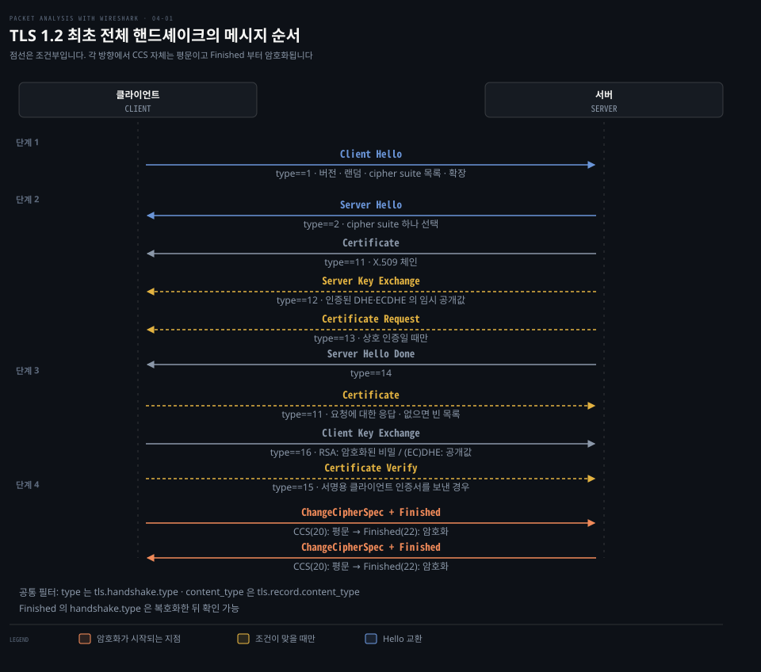
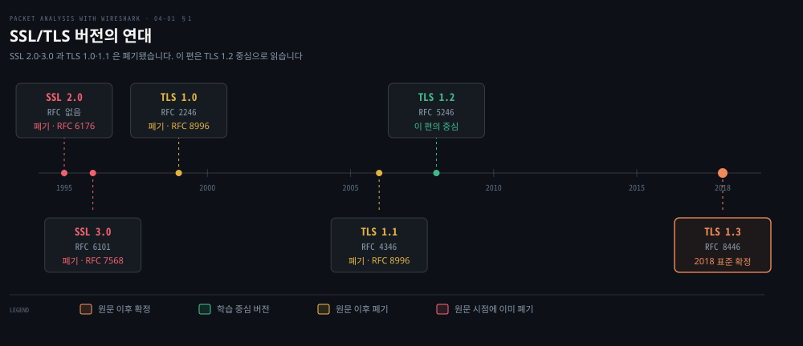
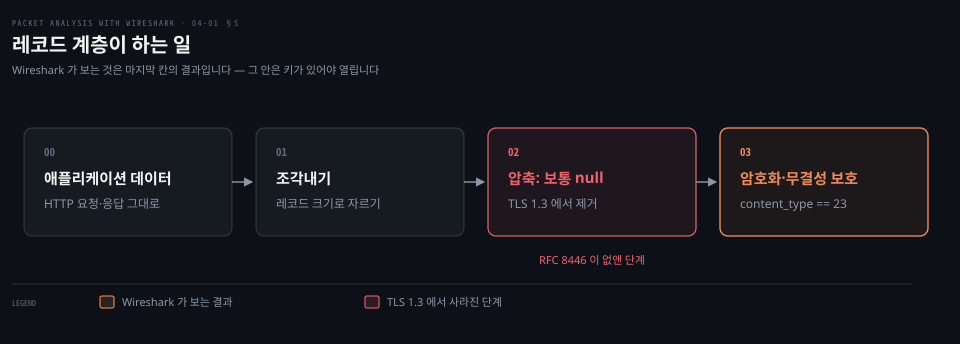

# TLS 핸드셰이크 읽기

---

> 4장 전반부는 암호화가 시작되기 전에 오가는 것들을 봅니다. 그 구간은 평문이라 Wireshark 로 전부 읽히고, 핸드셰이크 실패의 원인도 대부분 그 안에 남습니다.

## 핵심 요약

> 이 편이 매달린 하나의 생각은 **핸드셰이크는 암호화되기 전에 끝나는 협상이므로, TLS 통신에서 사람이 읽을 수 있는 마지막 구간이자 실패 원인이 드러나는 유일한 구간이라는** 것입니다.

원문은 핸드셰이크 프로토콜이 하는 일을 넷으로 정리합니다. cipher suite 협상과 랜덤 값 교환, 세션 생성 또는 재개, `pre_master_secret` 도달, 인증서 교환(선택), 그리고 `pre_master_secret` 에서 `master_secret` 을 만드는 일입니다.

이 협상이 평문이라는 사실이 이 장 전체의 실용적 가치를 만듭니다. 서버가 어떤 버전과 cipher suite 를 골랐는지, 어떤 인증서를 내밀었는지, 클라이언트 인증서를 요구했는지가 전부 화면에 드러납니다. 원문이 버전 이야기부터 시작하는 이유도 같습니다. **"버전을 아는 것은 핸드셰이크 문제를 디버깅할 때 대단히 중요합니다. 핸드셰이크 실패의 대부분이 이 과정에서 일어나기 때문입니다."**

암호화가 시작되는 지점은 분명합니다. `ChangeCipherSpec` 뒤의 `Finished` 부터이고, 그 뒤로는 Wireshark 가 `Application Data` 라는 레코드만 보여 줍니다. 안을 보려면 다음 편의 복호화가 필요합니다.

## 학습 목표

> 이 편을 읽고 나면 아래 다섯 가지를 스스로 해낼 수 있습니다.

1. 핸드셰이크 메시지 열 가지를 순서대로 짚고, 어느 것이 조건부인지 그 조건과 함께 말할 수 있습니다.
2. Client Hello 와 Server Hello 의 구조 차이를 설명하고, 화면에서 실제로 고른 cipher suite 를 읽을 수 있습니다.
3. cipher suite 이름 하나에서 키 교환·인증·암호·해시 네 가지를 분해할 수 있습니다.
4. Wireshark 에서 어느 지점부터 내용을 못 보게 되는지 지목하고, 그 이유를 설명할 수 있습니다.
5. Alert 메시지의 이름과 번호를 보고 실패 원인을 좁힐 수 있습니다.

아래는 원문의 상호 인증 예제(`two-way-handshake.pcap`)를 메시지 순서로 이은 지도입니다. 실선은 언제나 오가고 점선은 조건이 맞을 때만 오갑니다.

## 1. 버전을 아는 것이 왜 먼저인가

> 핸드셰이크 실패의 대부분이 버전 협상에서 일어납니다. 그래서 원문도 버전 표부터 꺼냅니다.

### 붙지 않는데 로그는 "SSL 오류"만 남깁니다

클라이언트가 서버에 붙지 못하는데 양쪽 로그가 모두 모호합니다. 인증서 문제인지, 버전이 안 맞는지, cipher suite 가 없는지가 갈리지 않습니다. 셋 다 조치가 다릅니다.

### 원문이 정리한 버전

원문은 TLS 를 **"SSL(Secure Socket Layer)의 새 이름"** 으로 소개하고 버전을 표로 제시합니다. 위 그림이 그 표를 연대 위에 놓은 것입니다.

| 프로토콜 | 연도 | RFC | 원문 시점(2015)의 폐기 여부 |
|---------|------|-----|------------------------|
| SSL 1.0 | 해당 없음 | 해당 없음 | 해당 없음 |
| SSL 2.0 | 1995 | 없음 | 폐기 · RFC 6176 |
| SSL 3.0 | 1996 | RFC 6101 | 폐기 · RFC 7568 |
| TLS 1.0 | 1999 | RFC 2246 | 아니오 |
| TLS 1.1 | 2006 | RFC 4346 | 아니오 |
| TLS 1.2 | 2008 | RFC 5246 | 아니오 |
| TLS 1.3 | 미정 | 초안 | 아니오 |

> **지금은 다릅니다 (2026)**: 이 표의 오른쪽 칸이 크게 바뀌었습니다. **TLS 1.0 과 TLS 1.1 은 RFC 8996 이 폐기했고, TLS 1.3 은 초안이 아니라 RFC 8446 으로 확정됐습니다.** 지금 쓸 수 있는 것은 TLS 1.2 와 1.3 둘뿐이고, 그림의 왼쪽 넷은 모두 폐기 상태입니다.

원문은 TLS 가 주는 이점도 셋으로 듭니다. 통신을 암호화해 기밀성과 무결성을 주고, 닫힌 용도에서는 선택적으로 클라이언트 측 검증도 할 수 있다는 것입니다.

> **원문 정오**: 세 이점 중 첫 줄인 **"SSL/TLS 는 상위 프로토콜을 대신해 7계층(애플리케이션 계층)에서 동작합니다"** 는 층이 틀렸습니다. TLS 는 애플리케이션 계층이 아니라 **전송 계층 위·애플리케이션 계층 아래**에 있습니다. RFC 8446 은 TLS 를 이렇게 규정합니다. "밑에 놓인 전송에 대한 유일한 요구사항은 신뢰성 있는 순서 보장 데이터 스트림입니다." 그리고 "TLS 는 애플리케이션 프로토콜에 독립적이며, 상위 프로토콜이 TLS 위에 투명하게 얹힐 수 있다"고 적습니다.[^rfc8446] 곧 TLS 는 스스로 애플리케이션 프로토콜이 아니라, 애플리케이션 프로토콜을 얹는 자리입니다. HTTP 가 TLS 위에 얹혀 HTTPS 가 되는 관계가 그것입니다.

## 2. 네 단계와 열 가지 메시지

> 핸드셰이크는 열 가지 메시지 종류로 이루어지고, 각각에 Wireshark 필터 번호가 하나씩 붙습니다.

### 화면에 뜬 메시지가 어느 단계인지 모를 때

Wireshark 에서 TLS 를 열면 `Handshake Protocol: Client Hello` 같은 줄이 이어집니다. 어느 것이 필수이고 어느 것이 조건부인지를 모르면 "이 메시지가 없는데 정상인가"를 판단할 수 없습니다.

### 메시지 종류와 필터 번호

원문은 메시지가 열 가지이며 핸드셰이크 프로토콜 안의 **1바이트 필드**라고 적고, 필터와 함께 표로 제시합니다. 핸드셰이크 레코드는 모두 `ssl.record.content_type == 22` 아래에 있습니다.

| 번호 | 메시지 | 필터 |
|:---:|--------|------|
| 0 | Hello request | `ssl.handshake.type == 0` |
| 1 | Client Hello | `ssl.handshake.type == 1` |
| 2 | Server Hello | `ssl.handshake.type == 2` |
| 11 | Certificate | `ssl.handshake.type == 11` |
| 12 | ServerKeyExchange | `ssl.handshake.type == 12` |
| 13 | CertificateRequest | `ssl.handshake.type == 13` |
| 14 | ServerHelloDone | `ssl.handshake.type == 14` |
| 15 | Certificate Verify | `ssl.handshake.type == 15` |
| 16 | Client Key Exchange | `ssl.handshake.type == 16` |
| 20 | Finished | `ssl.handshake.type == 20` |

핸드셰이크가 아닌 레코드 종류도 셋 있습니다. 이쪽은 `ssl.record.content_type` 으로 거릅니다.

| 레코드 | 필터 |
|--------|------|
| ChangeCipherSpec | `ssl.record.content_type == 20` |
| Alert Protocol | `ssl.record.content_type == 21` |
| Application Data | `ssl.record.content_type == 23` |

번호가 `Certificate` 에서 11 로 건너뛰는 것이 눈에 띕니다. **번호는 순서가 아니라 종류 식별자이므로 연속일 필요가 없습니다.** 실제 오가는 순서는 위 지도가 보여 주는 대로이고, 원문은 그 순서를 "네 단계"로 묶습니다. 그리고 전제를 하나 답니다. **핸드셰이크는 TCP 연결이 이미 성립해 있어야 시작합니다.** 앞 편의 3-way handshake 가 끝난 뒤에 오는 일입니다.

> **지금은 다릅니다 (4.6)**: 필터 접두사가 `ssl.` 에서 `tls.` 로 바뀌었습니다. 예전 `ssl.*` 필드는 호환을 위해 남아 있지만 제거가 예고돼 있으므로, 새로 쓰는 필터에는 `tls.handshake.type == 1` 처럼 씁니다. 표의 번호 자체는 그대로입니다.

## 3. Client Hello 가 제안하고 Server Hello 가 고릅니다

> 두 메시지의 구조는 같고 차이는 하나입니다. 클라이언트는 목록을 내밀고 서버는 하나를 고릅니다.

### 협상 결과를 화면에서 읽어야 할 때

"이 연결이 무슨 버전, 무슨 cipher suite 로 붙었는가"는 보안 점검에서 가장 자주 묻는 질문입니다. 답은 Server Hello 한 줄에 있습니다.

### Client Hello 의 구조

원문은 핸드셰이크 레코드가 16진수 `0x16=22` 로 식별된다고 짚고, Client Hello 의 구조를 다음과 같이 나눕니다.

- **Message**: Client Hello 는 `0x01` 입니다.
- **Version**: `0x0303` 이면 TLS 1.2 입니다. 원문은 `0x300` 이 SSL 3.0 이라고 덧붙입니다.
- **Random**: `gmt_unix_time`(표준 UNIX 32비트 형식의 현재 시각)과 보안 난수로 만든 **28바이트**의 랜덤 바이트로 이루어집니다.
- **Session ID**: `0x00` 이면 세션 ID 가 비었다는 뜻이고, 쓸 수 있는 세션이 없어 새 보안 파라미터를 만든다는 의미입니다.
- **Cipher suites**: 클라이언트가 지원하는 목록을 서버에 줍니다. **목록의 첫 번째가 클라이언트가 가장 선호하는(가장 강한) 것**입니다.
- **Compression methods**: 지원하는 압축 방법을 나열합니다.
- **Extensions**: 서버에 확장 기능을 요청합니다.

cipher suite 협상에 원문이 붙이는 조건이 실패 진단의 핵심입니다. **서버는 자기 선호에 따라 고르되, 클라이언트가 제안한 것 중에 있어야만 합니다. 없으면 서버가 alert/fatal 메시지를 내고 연결을 닫습니다.** 다음 편의 디버깅 절이 정확히 이 상황을 다룹니다.

원문의 예제에서 클라이언트가 요청한 확장은 넷입니다.

| 원문의 값 | 확장 이름 | 참조 |
|:---:|----------|------|
| 0 | elliptic_curve | RFC 4492 |
| 1 | ec_point_formats | RFC 4492 |
| 3 | signature_algorithms | RFC 5246 |
| 5 | heartbeat | RFC 6520 |

> **원문 정오**: 이 표의 "Value" 열은 확장 번호가 아닙니다. IANA 의 TLS ExtensionType Values 레지스트리 기준으로 **`elliptic_curves`(현재 이름 `supported_groups`)는 10, `ec_point_formats` 는 11, `signature_algorithms` 는 13, `heartbeat` 는 15** 입니다.[^iana-tls-ext] 원문의 0·1·3·5 는 목록의 순번으로 보입니다. 참고로 번호 **0 은 `server_name`** 이라 실제 값과 겹칩니다. 확장을 필터로 거를 때 이 번호를 그대로 쓰면 다른 확장을 잡게 됩니다.

### Server Hello 의 구조

원문은 두 메시지의 구조가 같으며 **차이는 서버가 cipher suite 를 하나만 고를 수 있다는 것 하나**라고 적습니다. 핸드셰이크 종류는 `0x02=2`, 버전 `0x0303` 은 서버가 TLS 1.2 를 받아들였다는 뜻입니다. 세션 ID 는 핸드셰이크 없이 재접속하기 위한 **32바이트** 값이 만들어집니다.

원문의 예제에서 서버가 고른 것은 `TLS_ECDHE_RSA_WITH_AES_256_GCM_SHA384 (0xc030)` 이고, 원문은 그 이름을 네 조각으로 풀어 줍니다.

| 조각 | 뜻 |
|------|-----|
| `ECDHE` | 타원곡선 Diffie-Hellman 키 교환 |
| `RSA` | 인증 |
| `GCM` | 블록 암호 운용 모드 Galois/Counter Mode |
| `AES_256` | 암호화 |
| `SHA384` | 다이제스트 |

**이 분해가 cipher suite 이름을 읽는 규칙 전부입니다.** 다음 편에서 복호화 가능 여부를 가르는 것도 첫 조각 하나입니다.

원문은 클라이언트와 서버의 버전이 어떻게 만나는지도 표로 제시합니다. `SSLv23` 행과 열이 다른 모든 버전과 통하는 유일한 값입니다.

> **노트의 읽기**: 그 표에서 `SSLv23` 은 프로토콜 버전이 아니라 **OpenSSL 이 "쓸 수 있는 가장 높은 버전으로 협상하라"는 뜻으로 쓰는 메서드 이름**입니다. 그래서 다른 모든 버전과 통하는 것으로 표시됩니다. 프로토콜 버전 목록에 섞여 있어 같은 층의 값으로 오해하기 쉬운 자리입니다.

## 4. 인증서와 키 교환 메시지

> Server Hello 다음의 메시지들은 조건부입니다. 어느 것이 오는지가 키 교환 방식과 상호 인증 여부를 알려 줍니다.

### 어떤 메시지가 안 왔다고 문제인가

캡처를 보면 `ServerKeyExchange` 가 있는 연결도 있고 없는 연결도 있습니다. 없는 것이 이상한 것인지 정상인지 판단하려면 규칙을 알아야 합니다.

### Certificate — 체인째 옵니다

원문은 Server Hello 뒤에 서버가 X.509 인증서(`ssl.handshake.type == 11`)를 보내야 한다고 적고, 그 인증서가 CA 나 중간 CA 가 서명했거나 배포에 따라 자체 서명일 수 있다고 설명합니다.

체인에 대한 설명이 실무적입니다. **서버가 인증서 체인으로 설정돼 있으면 체인 전체가 서버 인증서와 함께 클라이언트에 제시됩니다.** 클라이언트는 체인의 최상위 인증서를 자기가 저장한 CA 인증서와 대조하며, 현대 브라우저는 신뢰할 수 있는 CA 제공자로부터 루트 CA 를 미리 설치해 둡니다.

원문은 서명 알고리즘의 표현 방식도 짚습니다. `sha256WithRSAEncryption` 서명일 때 해시 값 자체가 서명 알고리즘을 나타내는 OID(`Algorithm Id: 1.2.840.113549.1.1.11`)에 이어 붙습니다. 인증서는 DER 인코딩 형식을 따르며 암호화되면 PKCS#7(RFC 2315 의 Cryptographic Message Syntax Standard)이 됩니다.

### Server Key Exchange — 올 때와 안 올 때

원문은 RFC 5246 을 근거로 규칙을 명확히 적습니다. **서버는 Server Certificate 메시지가(보냈다면) 클라이언트가 pre-master secret 를 교환하기에 충분한 데이터를 담고 있지 않을 때만 이 메시지를 보냅니다.** 그리고 목록을 둘로 나눕니다.

- 이 메시지가 **오는** 키 교환 방식: `DHE_DSS`, `DHE_RSA`, `DH_anon`
- 이 메시지가 **오면 안 되는**(not legal) 키 교환 방식: `RSA`, `DH_DSS`, `DH_RSA`

두 목록의 차이가 원리를 드러냅니다. **정적 RSA 나 정적 DH 는 서버 인증서 안의 공개키만으로 클라이언트가 비밀을 만들 수 있으므로 추가 메시지가 필요 없습니다. 임시(ephemeral) 방식은 매번 새 파라미터를 만들어 보내야 하므로 이 메시지가 필요합니다.** 다음 편의 전방 비밀성이 바로 이 차이에서 나옵니다.

### 상호 인증일 때만 오는 셋

원문은 서버가 선택적으로 클라이언트 인증서를 요구할 수 있다고 적습니다. 상호 인증을 지원하려면 서버가 `CertificateRequest`(13)를 보내고 클라이언트는 자기 인증서 정보를 줘야 합니다. **클라이언트가 주지 못하면 Alert 프로토콜이 생성되고 연결이 종료됩니다.**

클라이언트 쪽에서도 셋이 조건부입니다. 클라이언트 `Certificate`(11)는 상호 인증 조건에서만 보내지고, 서버가 자기 CA 체인에서 검증에 실패하면 alert fatal 을 내고 통신이 멈춥니다. `Certificate Verify`(15)는 `pre_master_secret` 으로 만든 `master_secret` 을 써서 Client Key Exchange 뒤에 보내집니다.

`ServerHelloDone`(14)은 **서버가 키 교환을 지원하는 메시지 전송을 마쳤으며 클라이언트가 자기 차례의 키 교환으로 넘어가도 된다는 뜻**입니다. 조건부 메시지들의 끝을 알리는 표지라 보면 됩니다.

### Client Key Exchange — 언제나 옵니다

원문은 이 메시지가 **언제나 클라이언트가 보낸다**고 못박습니다. 일반적인(단방향 인증) 핸드셰이크에서는 클라이언트가 `ServerHelloDone` 을 받은 뒤 처음 보내는 메시지입니다.

이 메시지가 보이면 `pre_master_secret` 이 정해졌다는 뜻이고, 그 방식은 고른 키 교환에 따라 갈립니다. **RSA 로 암호화한 비밀을 전송하거나, Diffie-Hellman 파라미터를 보내거나 둘 중 하나입니다.** RSA 인 경우 서버가 자기 개인키로 `premaster_secret` 을 복호화합니다.

## 5. 암호화가 시작되는 지점

> `ChangeCipherSpec` 뒤부터 기록이 보호됩니다. Wireshark 가 내용을 못 보게 되는 지점이 정확히 여기입니다.

### 어디까지 읽히고 어디부터 안 읽히는지

TLS 캡처를 열면 앞부분은 필드가 펼쳐지는데 뒤로 가면 `Application Data` 만 줄줄이 나옵니다. 그 경계가 어디이고 왜 거기인지를 알아야 "여기까지가 내가 볼 수 있는 전부"라고 판단할 수 있습니다.

### ChangeCipherSpec — 경계선

원문은 `ChangeCipherSpec` 레코드 종류(`ssl.record.content_type == 20`)가 핸드셰이크 레코드 종류(22)와 다르며 별도 프로토콜의 일부라고 짚습니다. 그리고 조건을 답니다. **이 메시지는 키 교환이 완료됐을 때만 클라이언트와 서버 양쪽이 보내며, 이후의 기록이 새로 협상된 암호 규격과 키(`master_secret`)로 보호될 것임을 상대에게 알립니다.**

### Finished — 협상이 제대로 됐는지 검산

원문은 `Finished` 가 암호화돼 있어 Wireshark 에서 **encrypted handshake message** 로 보인다고 적습니다. `ChangeCipherSpec` 직후에 양쪽이 보내며, 키 교환과 인증 과정이 성공했는지 검증하는 것이 목적입니다. **양쪽이 모두 `Finished` 를 보내면 핸드셰이크가 성공적으로 끝난 것으로 보고 그때부터 안전한 채널로 애플리케이션 데이터를 주고받습니다.**

> **원문 정오**: 원문은 이 메시지가 **"MD5 해시 + SHA 해시를 담는다"** 고 적습니다. 그것은 SSL 3.0 과 TLS 1.0·1.1 의 구성이고, 원문 자신의 예제가 쓰는 **TLS 1.2 에서는 다릅니다.** RFC 5246 §7.4.9 는 `verify_data` 를 PRF 로 만들며 기본 해시가 SHA-256 이라고 정합니다.[^rfc5246] 원문의 예제가 Server Hello 에서 `0x0303`(TLS 1.2)을 받아들였다고 적고 있어, 같은 장 안에서 어긋납니다.

### 레코드 계층 — 조각내고 압축하고 암호화합니다

원문은 `Application Data` 메시지(`ssl.record.content_type == 23`)가 레코드 계층에 실려 **조각내기·압축·암호화**를 거친다고 적습니다. 위 그림의 세 칸이 그것입니다.

> **지금은 다릅니다 (TLS 1.3)**: 이 셋 중 **압축이 없어졌습니다.** RFC 8446 은 TLS 1.2 와의 주요 차이를 열거하며 "압축의 제거"를 명시합니다.[^rfc8446] 같은 목록에 이 편과 다음 편에 걸치는 변화가 둘 더 있습니다. **정적 RSA 와 Diffie-Hellman cipher suite 가 제거되어 모든 공개키 기반 키 교환이 전방 비밀성을 제공하며**, 핸드셰이크 상태 기계가 재구성되어 **`ChangeCipherSpec` 같은 불필요한 메시지가 제거됐습니다**(중간 장비 호환이 필요한 경우 제외).[^rfc8446] 곧 TLS 1.3 캡처에서는 위 지도의 메시지 구성 자체가 다르게 보입니다.

## 6. Alert — 실패를 알리는 프로토콜

> 핸드셰이크가 실패하면 그 이유가 Alert 하나로 옵니다. 이름과 번호가 원인을 좁혀 줍니다.

### 실패했는데 어느 쪽이 거절했는지

TLS 연결이 끊겼을 때 클라이언트 로그와 서버 로그가 서로 다른 말을 하는 일이 흔합니다. Alert 는 어느 쪽이 무엇 때문에 끊었는지를 한 줄로 알려 줍니다.

### 심각도 둘

원문은 Alert 프로토콜(`ssl.record.content_type == 21`)이 메시지의 심각도와 경고를 기술하며, alert 메시지는 암호화·압축되고 **warning 과 fatal 두 수준**을 지원한다고 적습니다. **fatal 이면 연결이 종료됩니다.**

### 원문이 정리한 alert 목록

| Alert | 원문의 심각도 | 원문의 설명 |
|-------|:---:|------------|
| `close_notify(0)` | Closure | 이 연결에서 더 이상 메시지를 보내지 않습니다 |
| `unexpected_message(10)` | Fatal | 부적절한 메시지를 받았습니다 |
| `bad_record_mac(20)` | Fatal | 잘못된 MAC 을 받았습니다 |
| `decryption_failed(21)` | Fatal | TLS 암호문이 유효하지 않은 방식으로 복호화됐습니다 |
| `record_overflow(22)` | Fatal | 메시지 크기가 2^14+2048 바이트를 넘습니다 |
| `decompression_failure(30)` | Fatal | 유효하지 않은 입력을 받았습니다 |
| `handshake_failure(40)` | Fatal | 보낸 쪽이 핸드셰이크를 마무리하지 못했습니다 |
| `bad_certificate(42)` | Fatal | 손상된 인증서를 받았습니다. ASN 시퀀스가 잘못됐습니다 |
| `unsupported_certificate(43)` | Fatal | 인증서 종류를 지원하지 않습니다 |
| `certificate_revoked(44)` | Warning | 서명자가 인증서를 폐기했습니다 |
| `certificate_expired(45)` | Warning | 인증서가 유효하지 않습니다 |
| `certificate_unknown(46)` | Warning | 알 수 없는 인증서입니다 |
| `illegal_parameter(47)` | Fatal | TLV 에 유효하지 않은 파라미터가 있습니다 |
| `unknown_ca(48)` | Fatal | CA 체인을 찾지 못했습니다 |
| `access_denied(49)` | Fatal | 인증서는 유효하지만 서버가 협상을 거부했습니다 |
| `decode_error(50)` | Fatal | 받은 TLV 가 유효한 형태가 아닙니다 |
| `decrypt_error(51)` | Fatal | 복호화 암호가 유효하지 않습니다 |
| `export_restriction(60)` | Fatal | 수출 제한을 지키지 않은 협상이 감지됐습니다 |
| `protocol_version(70)` | Fatal | 선택된 프로토콜 버전을 서버가 지원하지 않습니다 |
| `insufficient_security(71)` | Fatal | 더 강한 cipher suite 가 필요합니다 |
| `internal_error(80)` | Fatal | 서버 쪽 문제입니다 |
| `user_canceled(90)` | Fatal | 클라이언트가 작업을 취소했습니다 |
| `no_renegotiation(100)` | Fatal | 서버가 핸드셰이크를 협상하지 못합니다 |

번호가 원인의 층을 나눕니다. **10~30번대는 프로토콜 형식과 MAC, 40~51번은 핸드셰이크와 인증서, 60번대 이상은 정책과 버전입니다.** 실패를 만나면 번호 구간만 봐도 어느 축을 볼지가 정해집니다.

> **원문 정오**: 마지막 행의 `no_renegotiation(100)` 은 Fatal 이 아닙니다. RFC 5246 §7.2.2 는 이 alert 를 **"언제나 warning 이다(This message is always a warning)"** 라고 명시합니다.[^rfc5246] `user_canceled(90)` 역시 프로토콜 실패와 무관한 취소를 알리는 것이라 통상 warning 수준입니다. 표에서 이 둘의 심각도 칸은 다르게 읽어야 합니다.

가장 자주 만나는 것은 `handshake_failure(40)` 와 `unknown_ca(48)` 둘입니다. 앞의 것은 대개 **공통 cipher suite 나 버전이 없다는 뜻**이고, 뒤의 것은 **클라이언트가 서버 인증서의 발급자를 신뢰 저장소에서 못 찾았다는 뜻**입니다. 다음 편의 디버깅 절이 둘을 각각 어떻게 확인하는지 다룹니다.

## 심화 학습

> 4장 전반부에서 바뀐 것은 필터 접두사, 버전 상태, 그리고 TLS 1.3 이 없앤 것들입니다. 메시지 구조와 협상 원리는 그대로입니다.

| 원문(2015) | 현행(2026) | 성격 |
|-----------|-----------|------|
| `ssl.handshake.type` · `ssl.record.content_type` | `tls.*`. 옛 `ssl.*` 은 호환 유지 | 바뀜 |
| TLS 1.0·1.1 은 폐기 아님 | RFC 8996 이 폐기 | 바뀜 |
| TLS 1.3 은 DRAFT | **RFC 8446**[^rfc8446] | 바뀜 |
| TLS 는 7계층에서 동작 | 전송 위·애플리케이션 아래[^rfc8446] | 정오 |
| 확장 번호 0·1·3·5 | 10·11·13·15[^iana-tls-ext] | 정오 |
| Finished 는 MD5+SHA 해시 | TLS 1.2 는 PRF · SHA-256[^rfc5246] | 정오 |
| `no_renegotiation` 은 Fatal | 언제나 warning[^rfc5246] | 정오 |
| 레코드 계층은 조각내기·압축·암호화 | TLS 1.3 은 압축 제거[^rfc8446] | 바뀜 |
| 정적 RSA·DH cipher suite 사용 가능 | TLS 1.3 이 제거 · 모두 전방 비밀성[^rfc8446] | 바뀜 |
| `ChangeCipherSpec` 이 경계 | TLS 1.3 은 중간 장비 호환용으로만 남김[^rfc8446] | 바뀜 |
| cipher suite 이름 분해 규칙 | 그대로(TLS 1.3 은 이름 형식이 더 짧아짐) | 유지 |

TLS 1.3 캡처를 볼 때 화면이 크게 달라 보이는 이유가 위 표의 아래 넷입니다. 특히 **암호화가 시작되는 지점이 앞당겨져 `Certificate` 조차 암호화된 뒤에 오므로, 원문의 지도에서 서버 인증서를 눈으로 확인하던 절차가 TLS 1.3 에서는 통하지 않습니다.** 인증서를 확인하려면 다음 편의 세션 키 로그가 필요합니다.

캡처 없이 서버 설정을 먼저 확인하는 방법도 있습니다. 다음 편이 다루는 `nmap` 스크립트가 그것이며, 서버가 어떤 버전과 cipher suite 를 지원하는지 한 번에 나열해 줍니다.

## 면접 대비

### 한 줄 정의

"TLS 핸드셰이크는 암호화가 시작되기 전에 버전·cipher suite·인증서를 평문으로 협상하는 절차이며, 그래서 TLS 통신에서 사람이 읽을 수 있는 마지막 구간입니다."

### 핵심 포인트 세 가지

1. **핸드셰이크가 평문이라는 점이 진단의 근거입니다.** 어떤 버전과 cipher suite 로 붙었는지, 어떤 인증서를 내밀었는지가 캡처에 그대로 남습니다. 암호화는 `ChangeCipherSpec` 뒤의 `Finished` 부터입니다.
2. **`ServerKeyExchange` 의 유무가 키 교환 방식을 알려 줍니다.** 정적 RSA·정적 DH 는 인증서만으로 충분해 이 메시지가 오면 안 되고, 임시 DH 계열은 매번 새 파라미터를 보내야 해서 옵니다.
3. **cipher suite 이름은 네 조각입니다.** `TLS_ECDHE_RSA_WITH_AES_256_GCM_SHA384` 는 키 교환 ECDHE, 인증 RSA, 암호 AES-256-GCM, 다이제스트 SHA-384 입니다. 첫 조각이 다음 편의 복호화 가능 여부를 정합니다.

### 자주 묻는 질문

Q: TLS 는 OSI 몇 계층입니까?
A: 전송 계층 위, 애플리케이션 계층 아래입니다. RFC 8446 은 밑에 놓인 전송에 신뢰성 있는 순서 보장 스트림만 요구하고, 상위 프로토콜이 TLS 위에 투명하게 얹힌다고 규정합니다. 애플리케이션 계층에서 동작한다는 서술은 부정확합니다.

Q: `handshake_failure` 가 떴습니다. 무엇부터 봅니까?
A: 클라이언트가 제안한 cipher suite 목록과 버전, 그리고 서버가 지원하는 목록을 대조합니다. 서버가 클라이언트 목록에 없는 것을 고를 수 없으므로 교집합이 비면 이 alert 가 납니다.

Q: TLS 1.3 캡처는 왜 다르게 보입니까?
A: 정적 RSA·DH 가 제거되고 압축이 없어졌으며 `ChangeCipherSpec` 이 호환 목적 외에는 사라졌습니다. 암호화 시작 지점도 앞당겨져 서버 인증서가 암호화된 뒤에 옵니다.

## 핵심 개념 체크리스트

- [ ] 핸드셰이크 메시지 열 가지 중 언제나 오는 것과 조건부인 것을 가를 수 있습니까?
- [ ] `ServerKeyExchange` 가 없는 캡처를 보고 그것이 정상인지 판단할 수 있습니까?
- [ ] cipher suite 이름 하나를 네 조각으로 분해할 수 있습니까?
- [ ] 캡처에서 Wireshark 가 내용을 못 보게 되는 첫 패킷을 지목할 수 있습니까?
- [ ] `handshake_failure(40)` 와 `unknown_ca(48)` 의 원인 차이를 말할 수 있습니까?
- [ ] TLS 1.3 이 없앤 것 셋을 댈 수 있습니까?

## 관련 문서

- [04-02 열쇠와 실패](./04-02.열쇠와 실패.md) — 이 편의 뒤. 키 교환 방식·복호화·핸드셰이크 실패 디버깅
- [03-02 TCP가 어긋날 때](./03-02.TCP가 어긋날 때.md) — TLS 아래의 TCP. 핸드셰이크는 TCP 연결 위에서 시작합니다
- [Packet Analysis with Wireshark — 정독 인덱스](./README.md) — 7개 장 전체 지도

## 참고 자료

- 원본: 《Packet Analysis with Wireshark》 (Anish Nath, Packt Publishing, 2015) ISBN 978-1-78588-781-9
- 다룬 범위: Chapter 4 의 An introduction to SSL/TLS · The SSL/TLS handshake 절
- [RFC 8446 — TLS 1.3](https://datatracker.ietf.org/doc/html/rfc8446) — 현행 최신 버전
- [RFC 5246 — TLS 1.2](https://www.rfc-editor.org/rfc/rfc5246.html) — 원문 예제가 쓰는 버전
- [IANA TLS ExtensionType Values](https://www.iana.org/assignments/tls-extensiontype-values/tls-extensiontype-values.xhtml) — 원문이 링크로 제시하는 확장 목록의 정본

[^rfc8446]: RFC 8446 §1 Introduction — "The primary goal of TLS is to provide a secure channel between two communicating peers; the only requirement from the underlying transport is a reliable, in-order data stream." · "TLS is application protocol independent; higher-level protocols can layer on top of TLS transparently." §1.2 Major Differences from TLS 1.2 — "the removal of compression, the Digital Signature Algorithm (DSA), and custom Ephemeral Diffie-Hellman (DHE) groups" · "Static RSA and Diffie-Hellman cipher suites have been removed; all public-key based key exchange mechanisms now provide forward secrecy." · "The handshake state machine has been significantly restructured to be more consistent and to remove superfluous messages such as ChangeCipherSpec (except when needed for middlebox compatibility)." <https://datatracker.ietf.org/doc/html/rfc8446> (2026-09-05 조회)

[^rfc5246]: RFC 5246 — §7.4.9 Finished 의 `verify_data` 는 PRF 로 만들어지며 TLS 1.2 는 MD5/SHA-1 조합을 쓰지 않고 cipher suite 가 정하는 해시(기본 SHA-256)를 씁니다. §7.2.2 Error Alerts 의 `no_renegotiation` 은 "always a warning" 입니다. §7.4.3 ServerKeyExchange 는 서버 인증서가 클라이언트가 premaster secret 를 정하기에 충분한 정보를 담은 경우 보내지 않습니다. <https://www.rfc-editor.org/rfc/rfc5246.html> (2026-09-05 조회)

[^iana-tls-ext]: IANA TLS ExtensionType Values 레지스트리 — `server_name` 0, `supported_groups`(elliptic_curves 에서 개명) 10, `ec_point_formats` 11, `signature_algorithms` 13, `heartbeat` 15. <https://www.iana.org/assignments/tls-extensiontype-values/tls-extensiontype-values.xhtml> (2026-09-05 조회)
