# TLS 핸드셰이크 읽기

---

> 4장 전반부는 TLS 핸드셰이크에서 누가 무엇을 제안하고, 어떤 메시지부터 암호화되는지 읽습니다. 버전과 키 교환 방식을 먼저 알아야 메시지의 유무와 관찰 가능한 범위를 판단할 수 있습니다.

## 핵심 요약

> 핸드셰이크는 통신 조건을 협상하고 상대를 인증하며 공유 키 재료를 만드는 과정입니다. Wireshark에서 그 과정이 어디까지 읽히는지는 TLS 버전과 복호화 키의 유무에 따라 달라집니다.

이 편의 기준은 **TLS 1.2의 최초 전체 핸드셰이크**입니다. 서버 인증서를 사용하는 정적 RSA와 DHE·ECDHE를 비교하고, 필요할 때 클라이언트 인증이 추가되는 모습을 봅니다. 세션 재개·재협상·PSK 방식은 이 순서도의 범위에서 제외합니다.

TLS 1.2에서는 Hello와 인증서·키 교환 메시지를 평문으로 읽을 수 있지만, 마지막 `Finished`는 이미 암호화됩니다. 따라서 핸드셰이크가 전부 평문인 것은 아닙니다. TLS 1.3에서는 경계가 더 앞당겨져 `ServerHello` 다음 핸드셰이크 메시지부터 암호화됩니다.[^rfc5246][^rfc8446]

이 차이를 먼저 잡으면 캡처에서 인증서가 안 보일 때도 메시지 누락인지, 버전 차이인지, 복호화가 필요한 상태인지 구분할 수 있습니다. 실패 원인은 보이는 Alert와 협상 필드를 단서로 좁히되, 암호화된 메시지나 끝점의 로그가 필요한 경우도 있습니다.


## 학습 목표

> 이 편을 읽고 나면 아래 다섯 가지를 스스로 해낼 수 있습니다.

1. TLS 1.2 전체 핸드셰이크의 흐름을 따라가며 조건부 메시지의 유무를 설명할 수 있습니다.
2. Client Hello 와 Server Hello 의 구조 차이를 설명하고, 화면에서 실제로 고른 cipher suite 를 읽을 수 있습니다.
3. TLS 1.2의 ECDHE-RSA-GCM suite에서 키 교환·인증·레코드 보호·PRF 해시를 구분할 수 있습니다.
4. 복호화 키가 없는 캡처에서 TLS 1.2와 1.3의 암호화 경계를 구분할 수 있습니다.
5. Alert 메시지의 이름과 번호를 보고 실패 원인을 좁힐 수 있습니다.

이 편에서 새로 만나는 낱말입니다. `어디서` 는 그 낱말이 실제로 설명되는 절입니다.

| 키워드 | 뜻 | 학습 포인트·연결 개념 | 어디서 |
|---|---|---|---|
| TLS 핸드셰이크 | 협상·인증·공유 키 설정 | TLS 1.2 전체 흐름 · 조건부 메시지 | §2 |
| Client Hello | 클라이언트가 제안하는 첫 메시지 | 버전·cipher suite 목록·확장 · SNI 도 여기 | §3 |
| Server Hello | 서버가 하나를 고르는 응답 | 제안이 아니라 선택 · 화면에서 결과를 읽음 | §3 |
| cipher suite | 암호 알고리즘 조합 | 버전별 구성 차이 · GCM과 PRF 역할 | §3 |
| SNI (Server Name Indication) | ClientHello 의 평문 도메인 | 인증서를 고르려 평문 · 01-01 §4 와 같은 사실 | §3 |
| X.509 | 공개키 인증서의 형식 표준 | 이름과 공개키를 CA 서명으로 묶음 | §4 |
| DHE · ECDHE | 매번 새 키를 만드는 임시 디피-헬먼 | 이름 첫 조각 · 원리는 04-02 §1 | §3 · §4 |
| 상호 인증 (mutual TLS) | 클라이언트도 인증서를 내미는 구성 | 메시지 셋이 더 붙음 | §4 |
| ChangeCipherSpec | TLS 1.2 보호 상태 전환 | 송신 방향별 경계 · 다음 Finished부터 | §5 |

아래는 여섯 절의 읽는 순서입니다. §2에서 전체 흐름을 잡고 §3~§5에서 각 메시지를 읽은 뒤, §6에서 실패 단서와 캡처 판독 절차를 확인합니다. Alert는 마지막에만 오는 메시지가 아니라 문제가 감지된 시점에 올 수 있습니다.

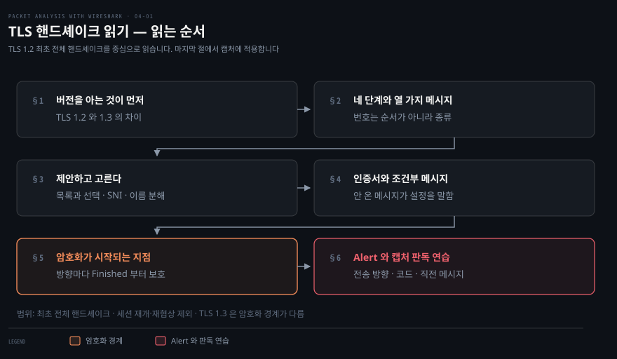


## 1. 버전을 아는 것이 왜 먼저인가

> 같은 이름의 TLS라도 버전에 따라 메시지와 암호화 경계가 달라집니다. 버전을 먼저 확인해야 캡처에 맞는 순서도를 고를 수 있습니다.


### 붙지 않는데 로그는 "SSL 오류"만 남깁니다

클라이언트가 서버에 붙지 못하는데 양쪽 로그가 모두 모호합니다. 인증서 문제인지, 버전이 안 맞는지, cipher suite 가 없는지가 갈리지 않습니다. 셋 다 조치가 다릅니다.

### 책의 버전과 캡처의 버전

TLS(Transport Layer Security)는 SSL(Secure Sockets Layer)을 계승한 프로토콜입니다. 책은 2015년 자료이므로 TLS 1.3을 초안으로 소개하지만, 아래 표는 확정된 표준을 기준으로 읽습니다.

| 프로토콜 | 연도 | RFC | 원문 시점(2015)의 폐기 여부 | 현행(2026) |
|---------|------|-----|------------------------|-----------|
| SSL 1.0 | 해당 없음 | 해당 없음 | 해당 없음 | 해당 없음 |
| SSL 2.0 | 1995 | 없음 | 폐기 · RFC 6176 | 폐기 |
| SSL 3.0 | 1996 | RFC 6101 | 폐기 · RFC 7568 | 폐기 |
| TLS 1.0 | 1999 | RFC 2246 | 아니오 | 폐기 · RFC 8996 |
| TLS 1.1 | 2006 | RFC 4346 | 아니오 | 폐기 · RFC 8996 |
| TLS 1.2 | 2008 | RFC 5246 | 아니오 | 현행 |
| TLS 1.3 | 2018 | RFC 8446 | 초안 | 현행 |

TLS 1.0과 TLS 1.1은 RFC 8996으로 폐기됐습니다. 그림에서 SSL 2.0부터 TLS 1.1까지는 과거 캡처를 해석하기 위한 항목입니다.[^rfc8996]

> 원서 표기: `SSLv23`은 프로토콜 버전 이름이 아니라 OpenSSL의 옛 협상 메서드 이름입니다. 어떤 버전과도 무조건 연결된다는 뜻이 아니며, 실제 연결 가능 여부는 양쪽의 지원 버전과 설정에 달려 있습니다.

TLS는 통신의 기밀성과 무결성을 보호하고 상대의 신원을 확인합니다. 보통 HTTPS에서는 서버를 인증하고, 상호 인증을 구성하면 서버도 클라이언트 인증서를 확인합니다.

이 편의 TCP 기반 캡처에서 TLS는 전송 계층 위·애플리케이션 계층 아래에 있습니다. HTTP가 TLS 위에 얹히는 것이 HTTPS입니다. RFC 8446은 TLS가 애플리케이션 프로토콜에 독립적이며, 밑에는 신뢰성 있는 순서 보장 스트림을 요구한다고 설명합니다.[^rfc8446]

> 원서와의 차이: 책의 “7계층에서 동작한다”는 표현보다 HTTP·TLS·TCP의 포함 관계로 이해하는 편이 캡처를 읽는 데 정확합니다. QUIC과 TLS의 결합은 이 편에서 다루지 않습니다.


## 2. TLS 1.2 전체 흐름과 메시지 번호

> 메시지 번호는 순서가 아니라 종류를 나타냅니다. 전체 흐름을 먼저 보고, 키 교환 방식과 클라이언트 인증 여부에 따라 추가되는 메시지를 구분합니다.

### 화면에 뜬 메시지가 어느 단계인지 모를 때

Wireshark 에서 TLS 를 열면 `Handshake Protocol: Client Hello` 같은 줄이 이어집니다. 어느 것이 필수이고 어느 것이 조건부인지를 모르면 "이 메시지가 없는데 정상인가"를 판단할 수 없습니다.

### 메시지 종류와 필터 번호

아래는 TLS 1.2에서 서버 인증서를 사용하는 전체 핸드셰이크의 개념도입니다. 이 범위의 기본 메시지는 실선, 키 교환 방식과 클라이언트 인증 조건에 따라 추가되는 메시지는 점선입니다. 책의 `two-way-handshake.pcap`은 상호 인증 예제 이름이며, 이 그림은 패킷 번호를 옮긴 실측 기록이 아닙니다.


책이 소개한 메시지 종류 열 가지를 아래에 모았습니다. 열 가지가 매 연결마다 한 번씩 오거나 TLS의 모든 메시지를 망라한다는 뜻은 아닙니다. 예를 들어 `HelloRequest`는 재협상과 관련돼 최초 핸드셰이크 그림에는 없습니다.

`tls.handshake.type`은 핸드셰이크 메시지의 1바이트 종류 필드이고, `tls.record.content_type`은 그 메시지를 담는 레코드의 종류입니다. 송신자가 누구인지와 관계없이 같은 필터를 씁니다. 책의 `ssl.*` 대신 아래에서는 Wireshark의 `tls.*` 필드를 사용합니다.[^wireshark-tls]

| 번호 | 메시지 | 필터 |
|:---:|--------|------|
| 0 | HelloRequest · 재협상 요청 | `tls.handshake.type == 0` |
| 1 | Client Hello | `tls.handshake.type == 1` |
| 2 | Server Hello | `tls.handshake.type == 2` |
| 11 | Certificate | `tls.handshake.type == 11` |
| 12 | ServerKeyExchange | `tls.handshake.type == 12` |
| 13 | CertificateRequest | `tls.handshake.type == 13` |
| 14 | ServerHelloDone | `tls.handshake.type == 14` |
| 15 | Certificate Verify | `tls.handshake.type == 15` |
| 16 | Client Key Exchange | `tls.handshake.type == 16` |
| 20 | Finished · 복호화 후 식별 | `tls.handshake.type == 20` |

핸드셰이크가 아닌 레코드 종류도 셋 있습니다. 이쪽은 `tls.record.content_type` 으로 거릅니다.

| 레코드 | 필터 |
|--------|------|
| ChangeCipherSpec | `tls.record.content_type == 20` |
| Alert Protocol | `tls.record.content_type == 21` |
| Application Data | `tls.record.content_type == 23` |

핸드셰이크 종류의 20은 `Finished`, 레코드 종류의 20은 `ChangeCipherSpec`입니다. 숫자가 같아도 필드가 다릅니다. TLS 1.2의 핸드셰이크 레코드는 종류 22로 식별할 수 있지만, 암호화된 내부 메시지의 종류는 복호화하지 않으면 읽을 수 없습니다.

메시지가 오가는 순서는 표보다 한 걸음씩 움직이는 그림이 빠릅니다. 아래 둘은 같은 왕복을 단계별로 재생해 주며, TLS 1.2 와 1.3 을 나란히 두고 비교할 수 있습니다.

- [TLS Handshake Visualised (Security Ronin)](https://tls-handshake.securityronin.com/) — 1.3 흐름을 6단계로 재생하고, 같은 장면의 모의 Wireshark 패킷 목록을 함께 보여 줍니다.
- [TLS Handshake Demo (FixMyCert)](https://fixmycert.com/demos/tls-handshake) — 1.2 를 8단계, 1.3 을 7단계로 끊어 단계 수 차이 자체를 보이는 쪽입니다.

> **두 링크의 한계**: 화면 안에서 재생되는 대신 새 창으로 열립니다. 두 사이트 모두 프레임 차단 헤더(`X-Frame-Options`)를 보내 문서 안에 끼워 넣을 수 없습니다. 값과 순서의 정본은 본문과 RFC 이며, 링크는 움직임을 눈에 익히는 용도입니다.

그림의 네 단계는 클라이언트 제안, 서버 선택·인증·키 교환 정보, 클라이언트 응답, 보호 상태 전환과 검증입니다. 이 편의 TLS 교환은 앞 편에서 본 TCP 연결 성립 뒤에 시작합니다. 한 TCP 패킷에 TLS 메시지가 여럿 담기거나 한 메시지가 여러 패킷에 걸칠 수 있으므로, 메시지 수를 패킷 수로 세지 않습니다.


## 3. Client Hello 가 제안하고 Server Hello 가 고릅니다

> ClientHello는 지원하는 조건을 제안하고 ServerHello는 사용할 조건을 선택합니다. 공통 필드는 있지만 두 메시지의 구조가 완전히 같지는 않습니다.

### 협상 결과를 화면에서 읽어야 할 때

그림에서는 ClientHello 가 내민 세 필드가 ServerHello 에서 각각 어떻게 줄어드는지, 고를 cipher suite 가 없으면 어디로 빠지는지를 봅니다.

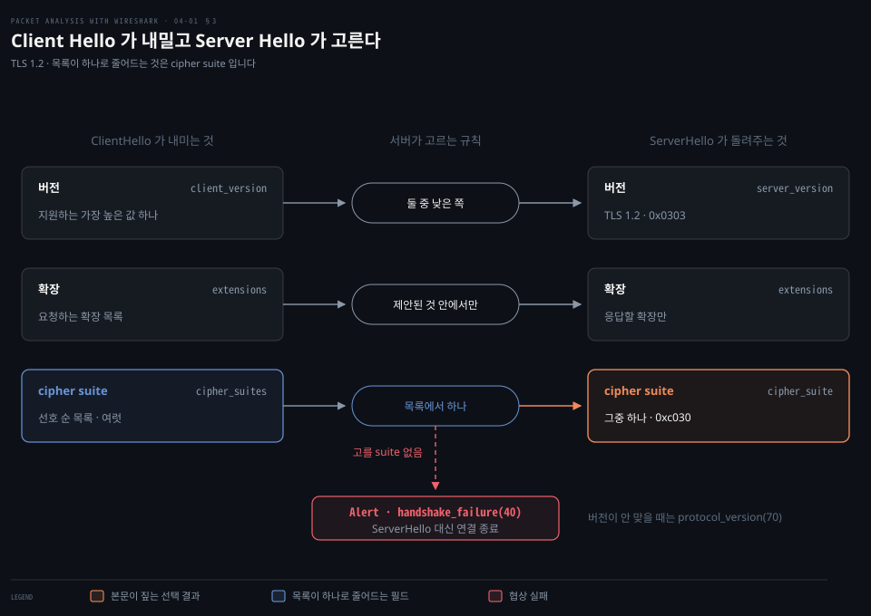

"이 연결이 무슨 버전, 무슨 cipher suite 로 붙었는가"는 보안 점검에서 가장 자주 묻는 질문입니다. 답은 Server Hello 한 줄에 있습니다.

Wireshark 상세 창에서는 그 한 줄이 ServerHello 아래 두 필드로 보입니다. 아래는 실측 출력이 아니라 형태 예시입니다.

```bash
Version: TLS 1.2 (0x0303)
Cipher Suite: TLS_ECDHE_RSA_WITH_AES_256_GCM_SHA384 (0xc030)
```

| 상세 창 이름 | 표시 필터 필드 | 필터 예 |
|---|---|---|
| Version | `tls.handshake.version` | `tls.handshake.version == 0x0303` |
| Cipher Suite | `tls.handshake.ciphersuite` | `tls.handshake.ciphersuite == 0xc030` |

필드 이름과 상세 창 이름은 Wireshark 표시 필터 문서에서 확인한 것입니다.[^wireshark-tls] ServerHello 만 남기려면 `tls.handshake.type == 2 && tls.handshake.ciphersuite == 0xc030` 처럼 메시지 종류를 함께 겁니다.

그런데 그 한 줄만 봐서는 판단이 서지 않습니다. 서버가 고른 값은 클라이언트가 제안한 목록 안에서만 나오므로, 무엇이 제안됐는지를 먼저 봐야 그 선택이 최선인지 아니면 남은 것이 그것뿐이었는지 갈립니다. 그래서 아래는 제안하는 쪽(Client Hello)을 먼저 읽고, 인증서 선택에 필요해 먼저 나가는 SNI 를 본 다음, 고르는 쪽(Server Hello)으로 갑니다.

### Client Hello 의 구조

TLS 1.2의 ClientHello에서 협상을 진단할 때 쓰는 필드는 셋입니다.[^rfc5246]

- **Version**: TLS 1.2의 버전 값은 `0x0303`입니다.
- **Cipher suites**: 지원 목록을 선호 순서대로 보냅니다. 첫 항목이 가장 선호하는 것입니다.
- **Extensions**: 서버에 확장 기능을 요청합니다.

나머지 넷은 다음과 같습니다.

- **Message**: Client Hello 는 `0x01` 입니다.
- **Random**: 32바이트 값입니다. RFC 5246의 구조는 시각 필드 4바이트와 난수 28바이트입니다.
- **Session ID**: 길이가 0이면 비어 있습니다. 세션 ID 방식의 재개를 요청하지 않는다는 뜻입니다.
- **Compression methods**: 지원하는 압축 방법 목록입니다. `null`이면 압축하지 않습니다.

필드 값만 보고 단정하지 않을 자리가 넷 있습니다. TLS 1.3도 호환용 Version 필드에는 `0x0303`을 쓰므로, 실제 선택 버전은 ServerHello의 `supported_versions` 확장까지 확인합니다. cipher suite 목록의 첫 항목이 반드시 암호학적으로 가장 강하다는 뜻은 아닙니다. 캡처에서 Random 의 앞 4바이트를 신뢰할 수 있는 시계로 간주하지 않습니다. 세션 티켓까지 포함한 모든 재개 가능성을 Session ID 하나로 판단하지 않습니다.

cipher suite는 클라이언트가 제안한 것 중에서 서버도 사용할 수 있는 하나를 선택합니다. 공통 조합이 없으면 협상할 수 없습니다. 다만 교집합이 있어도 인증서·서명 알고리즘 등 다른 조건 때문에 실패할 수 있으므로, 목록 일치만으로 성공을 단정하지 않습니다.

확장은 고유 번호로 식별합니다. 책에서 다룬 네 확장과 SNI를 IANA 번호로 정리하면 다음과 같습니다.[^iana-tls-ext]

| 실제 번호 | 확장 이름 | 역할 |
|:---:|----------|------|
| 0 | server_name | 접속하려는 서버 이름 전달 |
| 10 | supported_groups · 옛 이름 elliptic_curves | 지원하는 키 교환 그룹 전달 |
| 11 | ec_point_formats | 지원하는 타원곡선 점 표현 전달 |
| 13 | signature_algorithms | 지원하는 서명 알고리즘 전달 |
| 15 | heartbeat | heartbeat 기능 협상 |

> 원서와의 차이: 기존 노트가 옮긴 원서 표의 0·1·3·5는 위 네 확장의 실제 번호와 다릅니다. 필터에는 위 IANA 번호를 사용합니다. 원서 값이 무엇을 뜻했는지는 실제 확장 번호와 분리해서 읽습니다.

### SNI — 인증서를 고르려고 도메인 이름이 먼저, 그것도 평문으로

SNI(Server Name Indication)는 `server_name` 확장으로 서버 이름을 전달합니다. ClientHello에 이 이름이 필요한 이유는 인증서 선택의 순서 때문입니다.

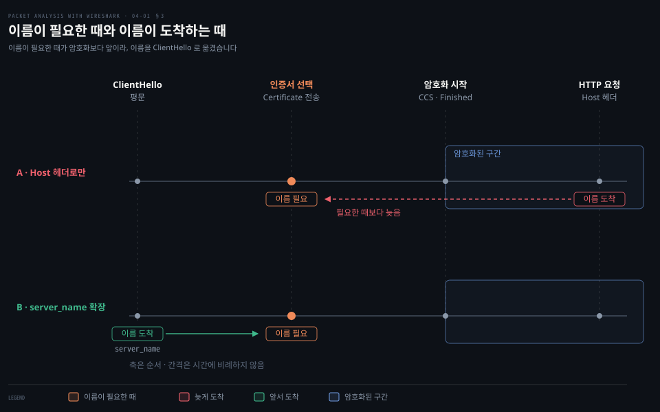

한 IP 와 한 포트에 사이트가 여럿 얹혀 있으면, 서버는 인증서를 내밀기 전에 클라이언트가 어느 사이트를 찾는지 알아야 합니다. 이름을 HTTP `Host:` 헤더로만 보내면 그림의 윗줄처럼 필요한 때보다 늦게 도착하는 순서 역전이 생깁니다. 아랫줄이 그 이름을 ClientHello 에 실은 해결입니다.

> "TLS does not provide a mechanism for a client to tell a server the name of the server it is contacting. It may be desirable for clients to provide this information to facilitate secure connections to servers that host multiple 'virtual' servers at a single underlying network address."[^rfc6066]

RFC 가 적은 것은 한 주소에 가상 서버가 여럿 얹힌다는 문제까지입니다. `Host:` 헤더와의 순서 역전은 그 문제를 TLS 쪽에서 풀어야 했던 이유로, 규격이 아니라 이 노트의 해설입니다.

이 편에서 다루는 평문 ClientHello에 SNI가 포함되면 캡처에서도 그 이름을 읽을 수 있습니다. 암호화가 시작된 뒤에도 앞서 잡힌 ClientHello가 감춰지는 것은 아닙니다. SNI가 없는 연결이나 ClientHello를 보호하는 ECH(Encrypted ClientHello)는 이 예제의 범위 밖입니다.

### 도청되는 선 위에서 같은 키를 갖는 법 — 키 교환(Key Exchange)과 인증(Authentication)

서버가 고른 cipher suite 를 읽기 전에, 그 이름이 무슨 문제를 나눠 푸는지부터 봅니다. 문제는 하나입니다. 본문을 감싸는 데 쓰는 **대칭키**(symmetric key)는 암호화와 복호화에 같은 값을 쓰므로 양쪽이 그 값을 똑같이 갖고 있어야 합니다. 그런데 클라이언트와 서버는 방금 처음 만났고, 그 사이의 선은 누구나 엿볼 수 있습니다. 키를 그냥 실어 보내면 엿보는 쪽도 같이 갖게 됩니다.

키 교환이 푸는 것이 이 자리입니다. 양쪽이 각자 비밀값을 쥐고 공개값만 선에 흘린 뒤, 자기 비밀값과 상대의 공개값으로 같은 결과를 계산합니다. 엿보는 쪽은 공개값 둘을 다 봐도 그 결과를 만들지 못합니다. 그래서 선을 지나가지 않은 값이 양쪽에만 생깁니다.

이 그림에서 볼 것은 선을 건너는 화살표가 둘뿐이라는 점입니다.

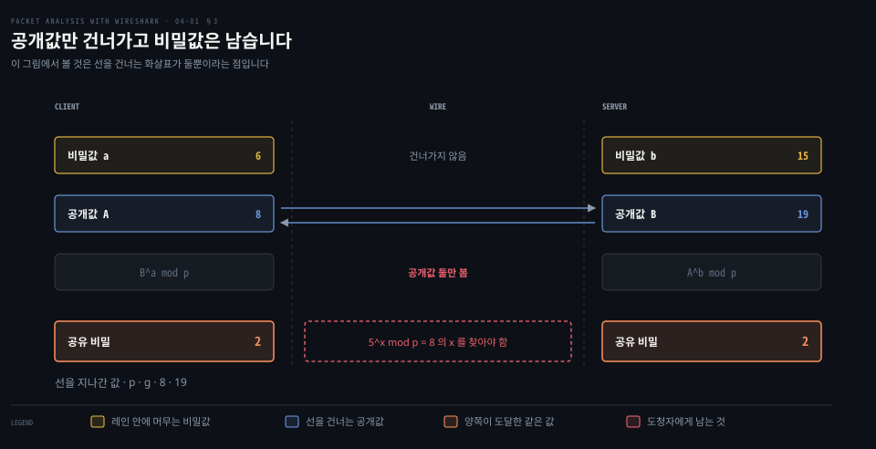

TLS 가 쓰는 것은 같은 구조를 타원곡선 위의 점 연산으로 하는 쪽입니다. 왜 한쪽 방향만 쉬운 계산이 이것을 세우는지, 작은 수로 직접 따라가 보는 예제와 곡선 쪽이 왜 짧은 키로 같은 방어력을 얻는지는 [04-02 §1](./04-02.열쇠와 실패.md) 이 맡습니다.

키 교환만으로는 구멍이 하나 남습니다. 같은 값에 도달했다는 것은 상대가 누구인지를 말해 주지 않습니다. 가운데 낀 쪽이 클라이언트와 한 번, 서버와 한 번 따로 키 교환을 하면 양쪽 다 정상으로 보입니다.

인증이 그 구멍을 막습니다. 서버는 이번 연결의 공개값에 자기 개인키로 **서명**(signature)합니다. 서명은 개인키로 만들고 공개키로 확인하는 값이라, 개인키로 풀고 공개키로 감싸는 암호화와 방향이 반대입니다. 클라이언트는 인증서에 담긴 공개키로 그 서명을 검증합니다. 가운데 낀 쪽은 자기 공개값에 서버의 서명을 붙일 수 없으므로 여기서 걸립니다. 인증서를 통째로 베끼거나 그 안의 공개키를 바꿔 보는 두 시도가 각각 어디서 막히는지는 [§4](#4-인증서와-키-교환-메시지) 가 그림으로 다룹니다.

키 교환이 만든 그 공유 비밀이 TLS 1.2 에서 `pre_master_secret` 입니다. 이름이 이어지는 자리를 한 줄로 두면 이렇습니다.

- **`pre_master_secret`**: 키 교환이 만든 공유 비밀. 정적 RSA 에서는 클라이언트가 만들어 서버 공개키로 암호화해 보내고, DHE·ECDHE 에서는 양쪽이 각자 계산합니다.
- **`master_secret`**: `pre_master_secret` 과 양쪽 Hello 의 Random 을 PRF 에 넣어 만드는 값.
- **레코드 키**: `master_secret` 에서 파생해 실제로 본문을 감쌀 때 쓰는 대칭키.

키 교환과 인증은 이렇게 다른 일이므로 cipher suite 이름도 그 둘을 따로 적습니다. 바로 아래에서 서버가 고른 이름을 그 순서대로 읽습니다.

### Server Hello 의 구조

ServerHello의 종류는 2입니다. 서버가 선택한 버전과 cipher suite, 압축 방법을 읽습니다. Random과 Session ID도 있지만 클라이언트의 값을 그대로 복사하는 것은 아닙니다. TLS 1.2의 Session ID 길이는 0~32바이트이며, 재개를 허용하지 않으면 비어 있을 수 있습니다. 재개하더라도 핸드셰이크가 완전히 사라지는 것은 아닙니다.[^rfc5246]

TLS 1.2의 Hello는 조건을 고르는 메시지입니다. 평문으로 전달되지만, 평문이라는 말이 난수 생성 등 암호학적 처리가 전혀 없다는 뜻은 아닙니다.

책에서 소개하는 선택값 `TLS_ECDHE_RSA_WITH_AES_256_GCM_SHA384 (0xc030)`을 네 역할로 나눠 보겠습니다.

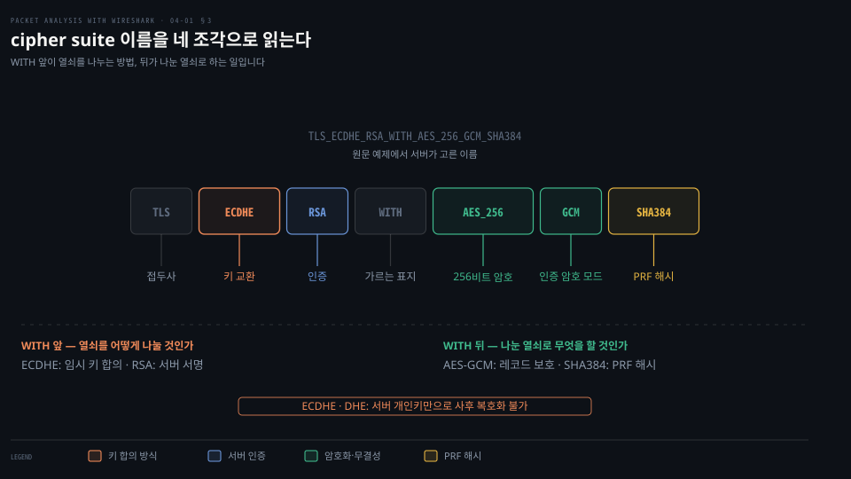

| 조각 | 하는 일 | 실제로 도는 자리 | 종류 |
|---|---|---|---|
| `ECDHE` | 세션 키 재료를 합의 | ServerKeyExchange · ClientKeyExchange | 비대칭 |
| `RSA` | 서버가 개인키 소유를 증명 | ServerKeyExchange의 서명 | 비대칭 |
| `AES_256`·`GCM` | 본문을 감싸고 무결성까지 보호 | ChangeCipherSpec 뒤로 계속 | 대칭 |
| `SHA384` | PRF의 해시 | master secret·레코드 키 파생, Finished 계산 | 해시 |

이 분해는 TLS 1.2의 해당 suite를 읽는 방법입니다. 모든 버전에 같은 분해 규칙을 적용하지 않습니다. TLS 1.3의 suite 이름에는 키 교환과 인증 방식이 들어 있지 않습니다.[^rfc8446]

첫 조각의 `ECDHE` 는 타원곡선 위에서 매번 새 키를 만들어 나누는 **임시(ephemeral)** 디피-헬먼이고, `DHE` 는 같은 일을 정수 나머지 위에서 합니다. 끝의 `E` 가 그 임시성을 가리킵니다. 왜 그렇게 해야 하고 그것이 사후 복호화 가능 여부를 어떻게 가르는지는 [04-02 §1](./04-02.열쇠와 실패.md) 이 맡습니다.

### 키 합의·서명·레코드 보호·키 파생을 구분합니다

네 역할은 쓰이는 자리가 다릅니다. ECDHE는 공유 비밀을 합의하고 RSA는 서버의 키 교환 파라미터에 서명합니다. AES-GCM은 그 뒤 레코드를 보호하며, SHA384는 PRF(Pseudorandom Function, 의사난수 함수)의 해시로 키 파생과 Finished 계산에 쓰입니다.[^rfc5289][^rfc5246]

키 합의와 인증은 공유 키를 안전하게 준비하고, 대량의 데이터는 대칭 암호로 처리합니다. 이 GCM suite의 레코드 무결성은 GCM의 인증 태그로 확인합니다. SHA384를 각 레코드에 따로 붙이는 MAC으로 읽으면 역할을 혼동하게 됩니다.[^rfc5289]

인증서 발급자의 서명 알고리즘은 suite 이름의 RSA와 별개일 수 있습니다.

핸드셰이크 캡처와 서버 개인키로 정적 RSA(`TLS_RSA_WITH_...`)의 과거 통신을 복호화할 수 있는 조건과 ECDHE·DHE에는 세션 키 로그가 필요한 이유는 [04-02](./04-02.열쇠와 실패.md)가 다룹니다.

Server Hello 에서 버전과 suite 를 읽으면, §4 에서 어떤 메시지를 기대할지가 정해집니다.


## 4. 인증서와 키 교환 메시지

> 서버 인증서 뒤의 추가 키 교환 정보와 클라이언트 인증 메시지는 조건에 따라 달라집니다. 선택된 suite와 인증 요구를 함께 봐야 메시지가 없는 이유를 설명할 수 있습니다.

### 어떤 메시지가 안 왔다고 문제인가

TLS 1.2 연결을 여러 개 잡아 비교하면 `ServerKeyExchange` 가 있는 연결도 있고 없는 연결도 있습니다. 없는 것이 이상한 것인지 정상인지 판단하려면 규칙을 알아야 합니다. 자기 캡처에서 이 규칙을 확인하는 절차는 [§6 판독 연습의 3번](#판독-연습--한-연결에서-네-가지-근거를-찾습니다)입니다.

이 편에서는 두 조건을 따로 봅니다. 키 교환 방식은 `ServerKeyExchange`의 유무를 정하고, 클라이언트 인증 요구는 `CertificateRequest`와 그 응답을 추가합니다. 서명 가능한 클라이언트 인증서로 응답하면 `CertificateVerify`도 보냅니다.

두 조건이 어느 메시지를 가르는지 표로 두면 이렇습니다. 위 넷은 키 교환 방식이 정하는 축이고, 맨 아래 줄은 서버를 인증하는 위 세 행에 더해지는 축입니다.

| 조건 | ServerKeyExchange | CertificateRequest | 클라이언트 Certificate | CertificateVerify |
|---|:---:|:---:|:---:|:---:|
| 정적 RSA | 안 옴 | — | — | — |
| 인증된 DHE·ECDHE | 옴 | — | — | — |
| 정적 DH | 안 옴 | — | — | — |
| `DH_anon` | 옴 | — | — | — |
| 클라이언트 인증 요구 추가 시 | 위 행 그대로 · `DH_anon` 제외 | 옴 | 옴 · 없으면 빈 목록 | 서명 가능한 인증서를 보냈을 때만 |

`—` 는 그 조건이 이 메시지를 가르지 않는다는 뜻입니다. 위 네 행에서 클라이언트 인증 쪽 세 칸이 비는 것은, 그 셋이 키 교환 방식이 아니라 서버의 인증 요구로만 갈리기 때문입니다. `DH_anon` 은 ServerKeyExchange 를 보내면서도 서버를 인증하지 않으므로, 이 메시지의 유무만으로 인증 여부를 판단하지 않습니다.

`DH_anon` 행에는 맨 아래 줄을 더하지 않습니다. 익명 서버가 클라이언트 인증을 요구하는 것 자체를 RFC 5246 §7.4.4 가 fatal 오류로 정하기 때문입니다.[^rfc5246]

> "Note: It is a fatal handshake_failure alert for an anonymous server to request client authentication."

표가 기대하는 메시지가 캡처에 없으면, 설정을 의심하기 전에 캡처 누락과 세션 재개부터 확인합니다.

### Certificate — 체인째 옵니다

그림에서는 Certificate 메시지로 오는 인증서와 클라이언트가 이미 가진 루트를 가르는 경계, 그리고 서명을 확인하며 루트까지 올라가는 방향을 봅니다.

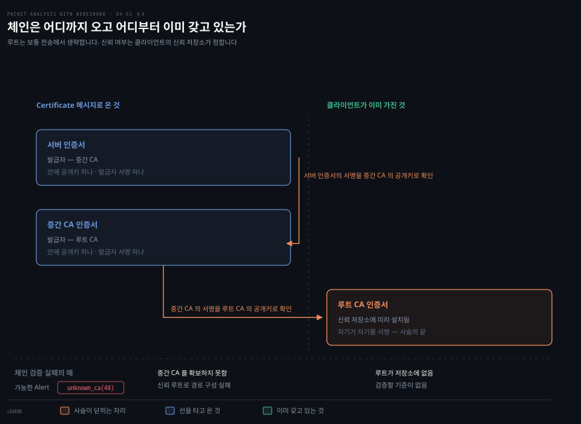

이 편의 인증서 기반 전체 핸드셰이크에서는 ServerHello 뒤에 서버의 Certificate 메시지가 옵니다. X.509는 이름·유효 기간·공개키 등을 발급자의 서명과 묶는 인증서 형식입니다. CA(Certificate Authority, 인증 기관)가 발급하거나 자체 서명한 인증서를 사용할 수 있지만, 받아들일지는 클라이언트의 신뢰 설정에 달려 있습니다.

서버는 자기 인증서를 먼저 보내고, 신뢰 경로를 구성하는 데 필요한 중간 CA 인증서를 이어 보냅니다. 루트 인증서는 보통 생략합니다. 서버가 루트를 함께 보내더라도 그것만으로 신뢰가 생기지는 않습니다. 클라이언트가 이미 신뢰하는 기준점까지 서명 체인이 이어져야 합니다.[^rfc5246]

체인 검증만으로 끝나지도 않습니다. HTTPS 클라이언트는 접속하려는 이름과 인증서의 이름, 유효 기간 등도 확인합니다. 캡처에서 인증서를 읽었다는 사실과 클라이언트가 그 인증서를 받아들였다는 사실을 구분합니다.

> 원서 설명 정리: TLS 1.2의 Certificate에는 DER로 인코딩한 인증서 목록이 실립니다. “인증서가 암호화되면 PKCS#7이 된다”는 기존 설명은 인증서 형식과 별도 컨테이너 형식을 혼동하므로 적용하지 않습니다.

### Server Key Exchange — 올 때와 안 올 때

그림에서는 정적 RSA 와 인증된 DHE·ECDHE 의 같은 구간을 나란히 놓고, ServerKeyExchange 자리가 비는지 채워지는지를 봅니다.

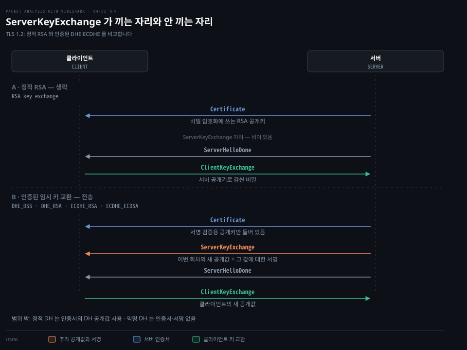

정적 RSA에서는 서버 인증서의 공개키로 비밀을 암호화할 수 있으므로 `ServerKeyExchange`를 보내지 않습니다. 인증된 DHE·ECDHE에서는 인증서의 장기 공개키와 이번 연결의 임시 공개값이 다릅니다. 서버가 새 공개값과 필요한 파라미터를 서명해 보내는 자리가 `ServerKeyExchange`입니다.[^rfc5246][^rfc8422]

과거의 정적 DH도 인증서에 키 합의용 공개값이 있어 이 메시지를 보내지 않습니다. 그러나 RSA처럼 비밀을 암호화해 전달하는 방식은 아닙니다. 반대로 익명 DH인 `DH_anon`은 ServerKeyExchange를 보내지만 인증서와 서명으로 서버를 인증하지 않습니다. 그래서 그림은 정적 RSA와 인증된 임시 DH만 비교합니다.

### 인증서를 그대로 베낀 중간자가 왜 아무것도 못 하는가

TLS 1.2의 이 흐름에서는 인증서가 평문으로 옵니다. 누구나 그 바이트를 복사할 수 있지만, 인증서만으로 서버를 사칭할 수는 없습니다.

인증서는 공개된 이름과 공개키를 발급자의 서명으로 묶은 것입니다. 그 공개키와 짝인 개인키는 별도로 보관합니다.

그림에서는 공격자가 할 수 있는 두 시도가 같은 두 검사를 지나며 어디서 처음 갈리는지를 봅니다.

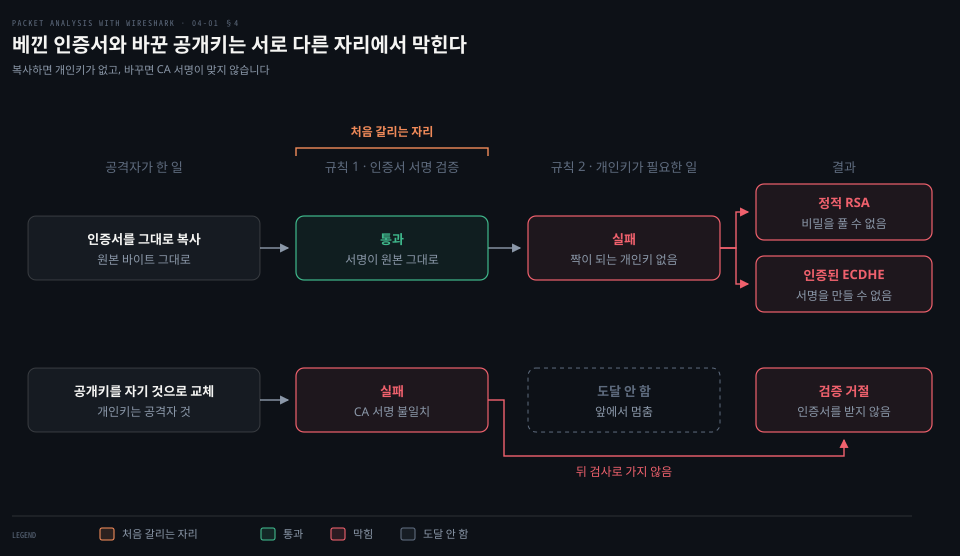

베낀 쪽은 서명 검증을 통과해도 짝이 되는 개인키가 없어서 막힙니다. 공개키를 바꾼 쪽은 자기 개인키로 비밀을 풀거나 서명할 수 있게 되지만, 원래 내용에 대한 CA 서명이 맞지 않아 그보다 먼저 막힙니다. 인증서 내용의 공개 여부와 개인키의 비밀성은 다른 문제입니다.

이 설명은 개인키가 유출되지 않았고 클라이언트가 인증서를 올바르게 검증한다는 전제입니다. 신뢰하는 CA가 공격자의 키에 잘못된 인증서를 발급한 경우도 별개의 위협입니다. 인증서 투명성(Certificate Transparency)은 이런 발급을 감시하는 데 쓰이며, 인증서 검증이나 개인키 보호를 대신하지 않습니다.

### Client Key Exchange — RSA와 ECDHE가 보내는 값

그림에서는 같은 메시지에 실리는 것이 비밀의 암호문인지 공개값인지, 그리고 두 길이 같은 `pre_master_secret` 에 닿는 자리를 봅니다.

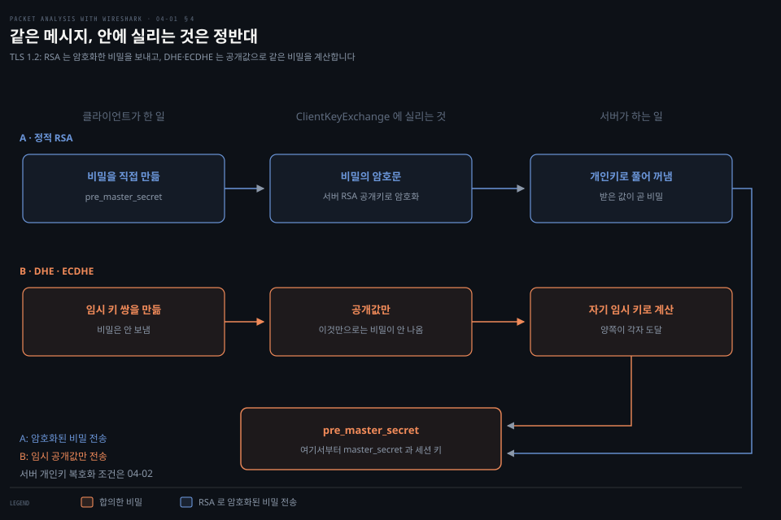

이 편의 TLS 1.2 전체 핸드셰이크에서는 클라이언트가 이 메시지를 보냅니다. 서버 인증만 하는 경우에는 ServerHelloDone 뒤 첫 클라이언트 핸드셰이크 메시지입니다. 클라이언트 인증서를 보내는 경우에는 그 Certificate 다음에 옵니다.

정적 RSA에서는 클라이언트가 만든 `pre_master_secret`의 암호문이 실립니다. DHE·ECDHE에서는 클라이언트의 공개값이 실리고, 양쪽은 자기 임시 개인값과 상대의 공개값으로 같은 공유 비밀을 계산합니다. 공개값을 캡처했다는 사실만으로 비밀을 얻을 수는 없습니다. 메시지의 존재는 키 교환 시도를 보여줄 뿐, 상대가 이를 받아 검증까지 마쳤다는 증거는 아닙니다.

### 상호 인증일 때만 오는 셋

상호 인증에서만 오는 셋은 `CertificateRequest`, 클라이언트 `Certificate`, `CertificateVerify` 입니다. 그림에서는 이 셋이 연달아 오지 않고 기본 흐름 사이 어느 자리에 끼는지를 봅니다.

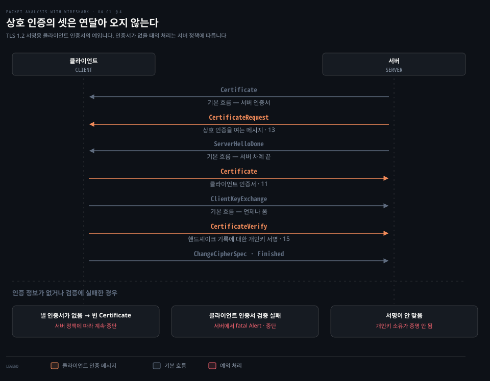

서버가 클라이언트 인증도 요청하면 `CertificateRequest`를 보냅니다. 클라이언트는 `ServerHelloDone`을 받은 뒤 자기 `Certificate`로 응답합니다. `ServerHelloDone`은 서버가 이 단계의 메시지 전송을 마쳤다는 표지이며, 핸드셰이크 전체의 끝은 아닙니다.

서명 가능한 인증서를 보낸 클라이언트는 `ClientKeyExchange` 다음에 `CertificateVerify`를 보냅니다. 이것은 앞서 주고받은 핸드셰이크 기록에 **클라이언트 개인키로 서명**한 값입니다. 서버는 클라이언트 인증서의 공개키로 검증해, 인증서만 복사한 상대가 아닌지 확인합니다. `master_secret`으로 만드는 Finished와 역할이 다릅니다.[^rfc5246]

TLS 1.2에서 적절한 클라이언트 인증서가 없으면 빈 인증서 목록을 보냅니다. 서버는 클라이언트 인증을 필수로 요구하는지에 따라 중단하거나 인증 없이 계속할 수 있습니다. 따라서 CertificateRequest를 보았다는 사실만으로 상호 인증의 성공을 단정하지 않습니다.[^rfc5246]


## 5. 암호화가 시작되는 지점

> TLS 1.2 최초 핸드셰이크에서는 각 송신자의 ChangeCipherSpec 다음 레코드부터 새 키로 보호합니다. Finished도 이 보호 범위에 들어갑니다.

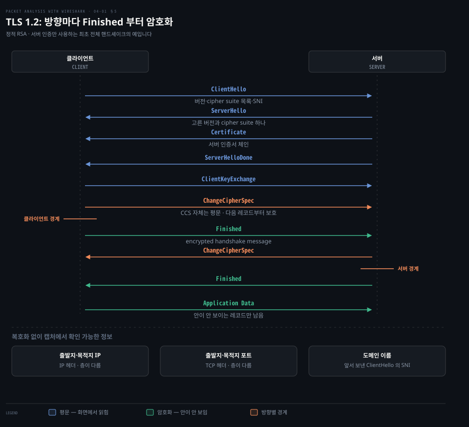

### 어디까지 읽히고 어디부터 안 읽히는지

TLS 캡처를 열면 앞부분은 필드가 펼쳐지는데 뒤로 가면 `Application Data` 만 줄줄이 나옵니다. 그 경계가 어디이고 왜 거기인지를 알아야 "여기까지가 내가 볼 수 있는 전부"라고 판단할 수 있습니다.

### TLS 가 가리는 층과 못 가리는 층

이 TCP 기반 캡처에서 TLS가 보호하는 것은 레코드의 내용입니다. IP·TCP 헤더나 TLS 레코드의 종류·길이까지 모두 감추는 것은 아닙니다. TLS는 채널로 보낸 데이터를 보호하지만 전송 길이 자체를 숨기지는 않으며, 패딩으로 일부 길이 정보를 흐릴 수는 있습니다.[^rfc8446]

[Security Ronin 시각화](https://tls-handshake.securityronin.com/)의 패킷 목록이 이 경계를 그대로 보여 줍니다. ServerHello 뒤의 패킷이 전부 `Application Data` 한 줄로만 찍히고, 세션 키를 넣어야 안이 열립니다. TLS 1.3 에서 인증서까지 가려지는 이유가 화면에 바로 나타납니다.

| 남는 것 | 어디에 | 무엇이 드러나는가 |
|---|---|---|
| 출발지·목적지 IP | IP 헤더 | 누가 누구와 통신하는가 |
| 출발지·목적지 포트 | TCP 헤더 | 서비스의 단서 · 443만으로 HTTPS를 확정하지는 못함 |
| 도메인 이름 | 앞서 캡처한 평문 ClientHello의 SNI | 클라이언트가 요청한 서버 이름 (§3) |

IP·포트는 이후 패킷에서도 계속 보이고, SNI는 앞서 평문으로 보낸 이름을 캡처에서 다시 읽는 것입니다. 이후 모든 레코드에 SNI가 반복해서 실리는 것은 아닙니다. TLS가 내용을 감춰도 통신 상대·시점·길이 같은 관찰 단서는 남습니다.

### ChangeCipherSpec — 경계선

`ChangeCipherSpec`은 핸드셰이크 종류가 아니라 별도 레코드 종류 20입니다. 보내는 쪽이 이후 레코드에 새로 협상한 보호 상태를 적용한다는 뜻입니다. 최초 핸드셰이크에서 CCS 자체는 평문이고, 바로 다음 Finished부터 새 키로 보호됩니다.[^rfc5246]

클라이언트가 CCS를 보냈다고 서버의 송신 방향까지 동시에 바뀌지는 않습니다. 서버도 자기 CCS를 보낸 뒤 전환합니다. 레코드를 암호화하는 키는 `master_secret` 자체가 아니라, 그 값과 Hello의 랜덤 값 등에서 파생한 방향별 키입니다.

### Finished — 협상이 제대로 됐는지 검산

Finished는 지금까지의 핸드셰이크 기록과 공유 비밀에 기반한 검증값을 담습니다. 각 끝점은 자기 Finished를 보내고 상대의 Finished를 받아 검증한 뒤 애플리케이션 데이터를 주고받습니다. 두 메시지가 캡처에 보인다는 사실만으로 내부 검증 성공까지 확인한 것은 아닙니다.[^rfc5246]

TLS 1.2의 `verify_data`는 `master_secret`을 사용하는 PRF로 계산하며 해시는 선택된 suite를 따릅니다. 기본 PRF는 SHA-256을 쓰지만, 이 편의 `TLS_ECDHE_RSA_WITH_AES_256_GCM_SHA384`는 SHA-384를 씁니다. 옛 버전의 MD5·SHA-1 조합 설명을 이 예제에 적용하지 않습니다.[^rfc5289]

복호화 키가 없으면 Wireshark에서 Finished의 내부 대신 `Encrypted Handshake Message`처럼 보일 수 있습니다. TLS 1.2에서는 이후에도 레코드 종류 22·21·23을 구분할 수 있으므로, “암호화되면 모두 Application Data로 표시된다”고 외우지 않습니다.

### 레코드 계층 — 데이터를 나누고 보호합니다


레코드 계층은 애플리케이션 데이터를 나누고 선택된 알고리즘으로 보호합니다. TLS 1.2에는 압축 협상 자리가 있지만, `null`을 선택하면 압축 없이 통과합니다. TLS 1.3은 레코드 압축을 제거했습니다. 그림의 압축 칸을 반드시 데이터를 압축하는 단계로 읽지 않습니다.[^rfc5246][^rfc8446]

TLS 1.3에서는 ServerHello 다음 핸드셰이크 메시지부터 암호화되며, 보호된 레코드의 바깥 종류는 Application Data입니다. 내부에 핸드셰이크·Alert·애플리케이션 데이터 중 무엇이 있는지는 복호화해야 구분합니다. CCS가 보이더라도 호환용일 수 있어 TLS 1.2처럼 암호화 경계로 사용하지 않습니다.[^rfc8446]


## 6. Alert — 실패를 알리는 프로토콜

> Alert는 상대가 보고한 종료·오류의 단서입니다. 이름뿐 아니라 송신 방향과 직전 메시지를 함께 봐야 원인을 좁힐 수 있습니다.

### 실패했는데 어느 쪽이 거절했는지

TLS 연결이 끊겼을 때 어느 쪽이 거절했는지부터 확인합니다. 같은 `unknown_ca`라도 클라이언트가 보냈다면 서버 인증서를, 서버가 보냈다면 클라이언트 인증서를 신뢰하지 못한 상황일 수 있습니다. Alert 하나가 설정의 근본 원인까지 모두 알려주는 것은 아닙니다.

### 심각도 둘

TLS 1.2의 Alert에는 `warning(1)`과 `fatal(2)` 수준이 있으며 fatal이면 연결을 종료합니다. Alert도 당시의 레코드 보호 상태를 따릅니다.

최초 CCS 전에는 평문으로 보일 수 있지만, 보호 상태로 전환한 뒤에는 복호화 키 없이 내용이 안 보입니다.[^rfc5246]

TLS 1.3은 Alert 종류 자체로 의미를 판단하므로 `level` 필드를 무시할 수 있습니다. TLS 1.2의 warning 분류를 그대로 적용하지 않습니다.[^rfc8446]

### TLS 1.2 Alert를 읽는 기준

RFC 5246 기준입니다. 아래에서 “상황에 따라”는 보내는 쪽이 warning 또는 fatal을 정한다는 뜻이며, 연결을 종료할 오류로 판단했다면 fatal로 보냅니다. 번호 구간을 오류 분류 규칙으로 외우기보다 이름과 실제 level을 읽습니다.[^rfc5246]

| Alert | 수준·상태 | 의미 |
|-------|:---:|------------|
| `close_notify(0)` | 종료 알림 | 송신자가 더 이상 데이터를 보내지 않습니다 |
| `unexpected_message(10)` | Fatal | 부적절한 메시지를 받았습니다 |
| `bad_record_mac(20)` | Fatal | 레코드의 인증·복호화 검증에 실패했습니다 |
| `decryption_failed_RESERVED(21)` | 예약 · 전송 금지 | 과거 버전에서 사용한 값입니다 |
| `record_overflow(22)` | Fatal | 암호문 또는 압축 레코드의 길이 제한을 넘었습니다 |
| `decompression_failure(30)` | Fatal | 압축 해제에 실패했습니다 |
| `handshake_failure(40)` | Fatal | 수용 가능한 보안 파라미터를 협상하지 못했습니다 |
| `bad_certificate(42)` | 상황에 따라 | 인증서가 손상됐거나 서명 검증 등에 실패했습니다 |
| `unsupported_certificate(43)` | 상황에 따라 | 인증서 종류를 지원하지 않습니다 |
| `certificate_revoked(44)` | 상황에 따라 | 발급자가 인증서를 폐기했습니다 |
| `certificate_expired(45)` | 상황에 따라 | 인증서가 만료됐거나 아직 유효하지 않습니다 |
| `certificate_unknown(46)` | 상황에 따라 | 그 밖의 이유로 인증서를 받아들일 수 없습니다 |
| `illegal_parameter(47)` | Fatal | 필드 값이 범위를 벗어나거나 다른 필드와 모순됩니다 |
| `unknown_ca(48)` | Fatal | 인증서 체인을 신뢰하는 CA에 연결하지 못했습니다 |
| `access_denied(49)` | Fatal | 유효한 인증서를 받았지만 접근 정책이 거부했습니다 |
| `decode_error(50)` | Fatal | 필드 범위나 메시지 길이가 잘못돼 해석할 수 없습니다 |
| `decrypt_error(51)` | Fatal | 서명·Finished 등 핸드셰이크 암호 연산 검증에 실패했습니다 |
| `export_restriction_RESERVED(60)` | 예약 · 전송 금지 | 과거 버전에서 사용한 값입니다 |
| `protocol_version(70)` | Fatal | 제안된 버전을 지원하지 않습니다 |
| `insufficient_security(71)` | Fatal | 더 강한 cipher suite 가 필요합니다 |
| `internal_error(80)` | Fatal | 송신한 끝점에서 내부 오류가 발생했습니다 |
| `user_canceled(90)` | 통상 Warning | 프로토콜 오류 이외의 이유로 핸드셰이크를 취소합니다 |
| `no_renegotiation(100)` | Warning | 재협상 요청을 받아들이지 않습니다 |

> 원서와의 차이: 기존 노트의 원서 표에는 90·100이 Fatal로, 일부 인증서 오류가 Warning 또는 Fatal로 고정돼 있었습니다. 위 표는 TLS 1.2 규격을 따릅니다. 21·60도 현재 사용할 오류 이름이 아니라 예약 값으로 구분했습니다.

### 이름에서 다음 확인 항목으로 이어 갑니다

| 보이는 단서 | 먼저 확인할 것 | 아직 단정할 수 없는 것 |
|---|---|---|
| `handshake_failure(40)` | 보낸 쪽, 제안된 suite·그룹·서명 알고리즘, 직전 메시지 | suite 교집합 부족만이 유일한 원인은 아닙니다 |
| `unknown_ca(48)` | 보낸 쪽의 신뢰 저장소와 상대가 보낸 인증서 체인 | 항상 클라이언트 쪽 오류인 것은 아닙니다 |
| `certificate_expired(45)` | 검증한 끝점의 시각과 인증서 유효 기간 | 이름 불일치나 CA 신뢰 문제와 같지 않습니다 |
| `protocol_version(70)` | 양쪽 지원 버전과 최소·최대 버전 설정 | 레코드 헤더의 버전만으로 협상 결과를 확정하지 않습니다 |
| 암호화된 Alert 또는 Alert 없이 종료 | 복호화 가능 여부, TCP 종료·리셋, 양쪽 로그 | 보이는 Alert가 없다고 TLS 오류가 없었던 것은 아닙니다 |

### 판독 연습 — 한 연결에서 네 가지 근거를 찾습니다

TLS 1.2 전체 핸드셰이크를 처음부터 담은 캡처를 준비합니다. 아래는 학습자가 자기 캡처에 적용하는 절차이며, 특정 파일을 실행해 얻은 패킷 번호나 관찰 결과는 아닙니다. 책의 `two-way-handshake.pcap`을 갖고 있다면 상호 인증 메시지까지 같은 방법으로 확인할 수 있습니다.

1. **연결을 고릅니다.** `tls.handshake.type == 1`로 ClientHello를 찾고 TCP의 Stream index를 기록합니다. 그 값이 N이면 표시 필터에 `tcp.stream eq N`을 쓰되, N은 실제 숫자로 바꿉니다. 이후 필터에도 이 조건을 함께 둬 다른 연결과 섞이지 않게 합니다.
2. **협상 결과를 읽습니다.** `tls.handshake.type == 2`로 ServerHello를 찾고 선택된 버전과 Cipher Suite를 기록합니다. `supported_versions`가 TLS 1.3을 선택했다면 이 편의 TLS 1.2 순서도에 억지로 맞추지 않습니다.
3. **조건부 메시지를 설명합니다.** `tls.handshake.type == 12`와 `tls.handshake.type == 13`을 각각 확인합니다. 전자는 suite의 키 교환 방식, 후자는 서버의 클라이언트 인증 요구와 연결해 설명합니다. 메시지가 없으면 캡처 누락·재개 연결 여부도 확인합니다.
4. **방향별 경계를 찾습니다.** `tls.record.content_type == 20`으로 양쪽 CCS를 찾은 뒤, 전체 스트림으로 돌아가 각 송신 방향의 다음 레코드를 확인합니다. 그 레코드가 같은 TCP 패킷 안에 있을 수도 있습니다. 복호화 키가 없다면 Finished 내부의 `verify_data`는 확인할 수 없다는 한계도 적습니다.

필터의 필드 이름은 Wireshark TLS 표시 필터 문서를 기준으로 합니다.[^wireshark-tls] 마지막에는 “버전 / 선택 suite / 조건부 메시지와 이유 / 클라이언트·서버 각각의 보호 시작 레코드” 네 항목을 자기 말로 정리합니다. 암호화된 내부 검증값처럼 못 본 것은 추측으로 채우지 않습니다.


## 심화 학습

> TLS 1.3에서는 키 교환 정보와 암호화 경계, cipher suite의 의미가 함께 바뀝니다. TLS 1.2 메시지 이름을 하나씩 대입하는 방식으로 읽지 않습니다.

| 확인 대상 | TLS 1.2 · 이 편의 전체 핸드셰이크 | TLS 1.3 · 인증서 기반 전체 핸드셰이크 |
|---|---|---|
| 임시 키 교환 정보 | ServerKeyExchange·ClientKeyExchange | Hello의 key_share 확장 |
| 첫 보호 핸드셰이크 메시지 | 각 방향의 CCS 다음 Finished | ServerHello 다음 EncryptedExtensions부터 |
| 서버 인증서 | 평문 Certificate로 확인 | 암호화돼 있어 캡처 복호화 필요 |
| cipher suite 이름 | 키 교환·인증·레코드 보호·PRF 해시 | AEAD 레코드 보호 알고리즘과 HKDF 해시 |
| ChangeCipherSpec | 레코드 보호 상태 전환 | 나타나도 중간 장비 호환용 |

TLS 1.3의 `TLS_AES_256_GCM_SHA384`만 보고 인증 방식이 RSA인지 ECDSA인지 알 수는 없습니다. 키 교환·서명 알고리즘을 별도로 협상하기 때문입니다. 정적 RSA·정적 DH와 레코드 압축도 제거됐습니다. TLS 1.3의 PSK·재개·0-RTT는 위 비교의 범위 밖입니다.[^rfc8446]

캡처 없이 서버 설정을 먼저 확인하는 방법도 있습니다. 다음 편이 다루는 `nmap` 스크립트가 그것이며, 서버가 어떤 버전과 cipher suite 를 지원하는지 한 번에 나열해 줍니다.

위 비교표의 항목을 하나씩 움직여 보려면 [Security Ronin 시각화](https://tls-handshake.securityronin.com/)의 what-if 목록이 쓸모 있습니다. 이 편이 다룬 자리와 맞물리는 것만 골라 적으면 이렇습니다.

- **SNI 노출 대 ECH**: §3 의 SNI 가 평문이라는 문제와 그것을 가리는 확장을 양쪽으로 돌려 봅니다.
- **상호 인증(client certificate)**: §4 의 CertificateRequest·CertificateVerify 가 실제로 어느 자리에 끼는지 보입니다.
- **PSK 재개와 0-RTT**: 심화 표가 범위 밖으로 둔 항목이라, 흐름만 눈으로 확인하는 데 씁니다.
- **TLS 1.2 다운그레이드**: 전방 비밀성이 없는 정적 RSA 로 내려갔을 때의 차이를 [04-02 §1](./04-02.열쇠와 실패.md) 과 함께 읽습니다.

목록에는 이 편이 다루지 않는 항목(HelloRetryRequest·ALPN 불일치·OCSP·인증서 핀닝)도 있습니다. 본문에 없는 주제까지 링크를 근거로 삼지 않고, 필요하면 RFC 로 따로 확인합니다.


## 면접 대비

### 한 줄 정의

TLS 핸드셰이크는 통신 조건을 협상하고 상대를 인증하며 공유 키 재료를 만드는 과정입니다. 일부 메시지는 핸드셰이크가 끝나기 전부터 암호화되고, 그 경계는 버전에 따라 다릅니다.

### 핵심 포인트 세 가지

1. **버전과 관찰 범위**를 먼저 확인합니다. TLS 1.2 최초 핸드셰이크는 방향별 CCS 다음 Finished부터, TLS 1.3은 ServerHello 다음 핸드셰이크 메시지부터 보호합니다.
2. **메시지의 조건**을 선택된 suite와 연결합니다. TLS 1.2 전체 핸드셰이크에서 정적 RSA는 ServerKeyExchange가 없고, 인증된 DHE·ECDHE는 임시 공개값과 서명을 보냅니다.
3. **알고리즘의 역할**을 구분합니다. 이 편의 suite는 ECDHE 키 합의, RSA 서명, AES-256-GCM 레코드 보호, SHA-384 기반 PRF를 사용합니다. 서버 개인키만으로 ECDHE 통신을 사후 복호화할 수는 없습니다.

### 자주 묻는 질문

Q: TLS 는 OSI 몇 계층입니까?
A: 전송 계층 위, 애플리케이션 계층 아래입니다. RFC 8446 은 밑에 놓인 전송에 신뢰성 있는 순서 보장 스트림만 요구하고, 상위 프로토콜이 TLS 위에 투명하게 얹힌다고 규정합니다. 애플리케이션 계층에서 동작한다는 서술은 부정확합니다.

Q: `handshake_failure` 가 떴습니다. 무엇부터 봅니까?
A: 먼저 송신 방향과 직전 메시지를 확인합니다. 협상 초반이면 지원 버전·suite·그룹·서명 알고리즘을 대조하고, 필요한 경우 양쪽 로그로 원인을 확인합니다. 이 Alert만으로 suite 불일치를 확정하지 않습니다.

Q: 인증서는 있는데 CertificateVerify가 왜 따로 필요합니까?
A: 인증서는 공개키와 신원의 연결을 보여주지만 복사할 수 있습니다. 서명 기반 클라이언트 인증에서 CertificateVerify는 핸드셰이크 기록에 개인키로 서명해, 상대가 그 개인키를 갖고 있음을 증명합니다.

Q: TLS 1.3에서는 Certificate가 안 보이면 누락입니까?
A: ServerHello 다음 핸드셰이크 메시지는 암호화되므로, 복호화 키가 없으면 인증서가 안 보이는 것이 정상일 수 있습니다. TLS 1.2 순서도로 누락을 판단하지 않습니다.


## 핵심 개념 체크리스트

- [ ] TLS 1.2 전체 핸드셰이크에서 조건부 메시지의 유무를 설명할 수 있습니까?
- [ ] ECDHE의 ClientKeyExchange가 비밀 자체를 보내지 않는 이유를 설명할 수 있습니까?
- [ ] AES-GCM의 무결성 보호와 SHA384의 PRF 역할을 구분할 수 있습니까?
- [ ] CertificateVerify의 서명과 Finished의 검증값이 어떻게 다른지 말할 수 있습니까?
- [ ] 양방향 CCS 뒤 첫 보호 레코드를 찾고, TLS 1.3에는 그 기준을 적용하지 않는 이유를 말할 수 있습니까?
- [ ] unknown_ca의 송신 방향을 보고 어느 쪽 신뢰 설정부터 확인할지 정할 수 있습니까?


## 관련 문서

- [04-02 열쇠와 실패](./04-02.열쇠와 실패.md) — 이 편의 뒤. 키 교환 방식·복호화·핸드셰이크 실패 디버깅
- [03-02 TCP가 어긋날 때](./03-02.TCP가 어긋날 때.md) — TLS 아래의 TCP. 핸드셰이크는 TCP 연결 위에서 시작합니다
- [Packet Analysis with Wireshark — 정독 인덱스](./README.md) — 7개 장 전체 지도


## 참고 자료

- 원본: 《Packet Analysis with Wireshark》 (Anish Nath, Packt Publishing, 2015) ISBN 978-1-78588-781-9
- 다룬 범위: Chapter 4 의 An introduction to SSL/TLS · The SSL/TLS handshake 절
- [RFC 8446 — TLS 1.3](https://datatracker.ietf.org/doc/html/rfc8446) — TLS 1.3의 메시지와 보호 범위
- [RFC 5246 — TLS 1.2](https://www.rfc-editor.org/rfc/rfc5246.html) — 원문 예제가 쓰는 버전
- [IANA TLS ExtensionType Values](https://www.iana.org/assignments/tls-extensiontype-values/tls-extensiontype-values.xhtml) — 원문이 링크로 제시하는 확장 목록의 정본

[^rfc8446]: [RFC 8446](https://www.rfc-editor.org/rfc/rfc8446.html) — §1·§1.2 보호 범위와 버전 차이, §2 전체 흐름, §4.1 Hello와 cipher suite, §5.2 레코드 보호, §6 Alert. (2026-09-18 조회)

[^rfc5246]: [RFC 5246](https://www.rfc-editor.org/rfc/rfc5246.html) — §5 PRF, §6.2·§6.3 레코드 보호와 키 파생, §7.1 CCS, §7.2 Alert, §7.4.1 Hello, §7.4.2 인증서, §7.4.3 키 교환, §7.4.6~§7.4.9 클라이언트 인증·CertificateVerify·Finished. (2026-09-18 조회)

[^rfc6066]: [RFC 6066 §3 — Server Name Indication](https://www.rfc-editor.org/rfc/rfc6066.html#section-3). (2026-09-18 조회)

[^iana-tls-ext]: [IANA — TLS ExtensionType Values](https://www.iana.org/assignments/tls-extensiontype-values/tls-extensiontype-values.xhtml). (2026-09-18 조회)

[^rfc5289]: [RFC 5289 §3.2 — Galois Counter Mode-Based Cipher Suites](https://www.rfc-editor.org/rfc/rfc5289.html#section-3.2). (2026-09-18 조회)

[^rfc8422]: [RFC 8422 §5.4·§5.7 — Server Key Exchange·Client Key Exchange](https://www.rfc-editor.org/rfc/rfc8422.html#section-5.4). (2026-09-18 조회)

[^rfc8996]: [RFC 8996 — Deprecating TLS 1.0 and TLS 1.1](https://www.rfc-editor.org/rfc/rfc8996.html). (2026-09-18 조회)

[^wireshark-tls]: [Wireshark — Display Filter Reference: Transport Layer Security](https://www.wireshark.org/docs/dfref/t/tls.html). (2026-09-18 조회)
