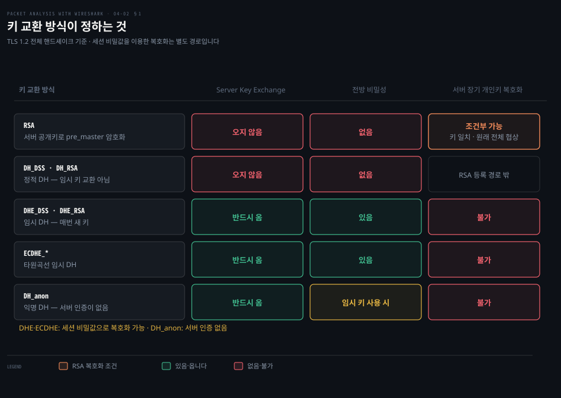
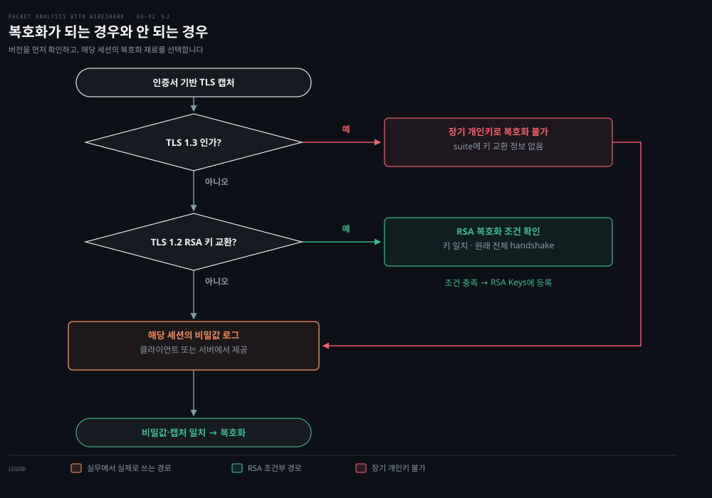

# 열쇠와 실패

---

> 4장 후반부는 두 가지를 답합니다. 잡아 둔 TLS 를 열 수 있는가, 그리고 열리지 않는 연결이 왜 안 붙는가. 두 답 모두 cipher suite 이름 한 줄에서 시작합니다.

## 핵심 요약

> 이 편이 매달린 하나의 생각은 **서버 개인키를 갖고 있어도 열리지 않는 트래픽이 있으며, 그것을 가르는 것이 cipher suite 이름 안의 키 교환 조각 하나라는** 것입니다.

원문은 복호화 가능 여부를 한 문장으로 정합니다. **"TLS 트래픽의 복호화는 서버가 Server Hello 메시지에서 어떤 cipher suite 를 골랐는지에 달려 있습니다."** 정적 RSA 면 서버 개인키로 열리고, DHE 나 ECDHE 면 개인키를 갖고 있어도 열리지 않습니다.

열리지 않는 이유가 결함이 아니라 설계입니다. 원문의 설명대로 **"DHE/ECDHE 는 개인키가 있어도 이 방식으로는 복호화할 수 없습니다. 전방 비밀성(forward secrecy)을 지원하도록 설계됐기 때문입니다."** 개인키가 유출돼도 과거 통신은 안전하게 남는다는 성질이고, 그 성질의 대가가 사후 복호화 불가입니다.

디버깅 쪽의 출발점도 같은 자리입니다. 원문이 첫 항목으로 드는 것은 **"당신의 SSL/TLS 서버를 알라"** 입니다. 서버가 어떤 버전과 cipher suite 를 지원하는지 먼저 확인하면, 클라이언트가 왜 거절당했는지가 대개 그 목록의 교집합에서 드러납니다.


## 학습 목표

> 이 편을 읽고 나면 아래 다섯 가지를 스스로 해낼 수 있습니다.

1. cipher suite 이름만 보고 그 연결을 사후에 복호화할 수 있는지 판단할 수 있습니다.
2. 전방 비밀성이 무엇을 지키고 그 대가가 무엇인지 설명할 수 있습니다.
3. Wireshark 에 서버 개인키를 등록해 RSA 트래픽을 복호화할 수 있습니다.
4. 개인키를 공유하지 않고 복호화 결과만 넘기는 방법을 쓸 수 있습니다.
5. `nmap` 과 `openssl` 로 핸드셰이크 실패의 원인을 서버 쪽에서 확인할 수 있습니다.

이 편에서 새로 만나는 낱말입니다. `어디서` 는 그 낱말이 실제로 설명되는 절입니다.

| 키워드 | 뜻 | 학습 포인트·연결 개념 | 어디서 |
|---|---|---|---|
| 정적 RSA 키 교환 | 서버 공개키로 키 재료를 감쌈 | 개인키가 있으면 사후 복호화 가능 | §1 · §2 |
| DHE · ECDHE | 매번 새 키를 만들어 나눔 | 개인키가 있어도 사후 복호화 불가 | §1 · §2 |
| 전방 비밀성 (forward secrecy) | 키가 새도 과거는 안 열림 | 지키는 것과 잃는 것 · 운영 가시성이 대가 | §1 |
| 세션 키 (session keys) | 실제 암복호에 쓰는 키 | 키 교환의 산물 · 이것만 있으면 열림 | §2 |
| `SSLKEYLOGFILE` | 세션 키를 파일로 남기는 환경 변수 | 개인키를 안 넘기고 결과만 넘김 | §2 |
| `unknown_ca` | 체인을 신뢰하지 못한다는 Alert | 받는 쪽 truststore 문제 · 서버 설정 아님 | §3 |

이 편의 절 셋은 순서가 아니라 판정 하나에서 갈라져 나옵니다.


## 1. 키 교환 방식이 정하는 것

> 키 교환 방식 하나가 세 가지를 한꺼번에 정합니다. 어떤 메시지가 오는지, 전방 비밀성이 있는지, 사후에 열리는지.



### 개인키가 있는데 안 열릴 때

서버 개인키를 갖고 있고 캡처도 있는데 Wireshark 가 아무것도 못 펼칩니다. 설정을 잘못한 것인지, 원래 안 되는 것인지가 갈리지 않으면 시간만 쓰게 됩니다.

### 원문이 나눈 세 방식

원문은 키 교환 방식을 셋으로 나누고 각각의 cipher suite 이름 규칙을 줍니다.

**Diffie-Hellman** 은 **"사전에 공유한 비밀 없이 안전하지 않은 매체 위에서 두 사용자가 비밀 키를 교환하게 해 주는 프로토콜"** 입니다. 이름 규칙은 `DH` 가 들어가고 `DHE` 나 `DH_anon` 은 아닌 것입니다. 원문의 예는 `SSL_DH_RSA_WITH_DES_CBC_SHA` 입니다.

**타원곡선 Diffie-Hellman** 은 전통적인 RSA 방식의 큰 소수 대신 타원곡선 암호를 쓰는 변형입니다. 원문은 ECC 가 RSA·Rabin·El Gamal 과 마찬가지로 공개키 암호 시스템이며, 모든 사용자가 공개키와 개인키를 갖고 공개키는 암호화·서명 검증에, 개인키는 복호화·서명 생성에 쓴다고 설명합니다.

**RSA** 는 `pre_master_secret` 키를 서버 공개 RSA 키로 암호화하는 방식입니다. 이름에 `RSA` 가 들어가고 `DH`·`DH_anon`·`DHE` 는 아닌 것입니다. 원문의 예는 `TLS_RSA_WITH_AES_128_CBC_SHA` 등입니다.

**타원곡선 임시 DH 는 이름에 `ECDHE` 가 들어갑니다.** `TLS_ECDHE_RSA_WITH_AES_256_GCM_SHA384` 가 그 형태이고, 앞 편에서 원문 자신이 예로 든 서버 선택 cipher suite 가 정확히 이것입니다. 이름에 `DHE` 만 들어간 `SSL_DHE_RSA_WITH_DES_CBC_SHA` 계열은 타원곡선이 아니라 정수 나머지 위의 임시 Diffie-Hellman 입니다. 원문은 타원곡선 절의 예제와 이름 규칙을 뒤쪽 계열로 적었습니다.

**RSA 키 교환에서 서버 공개키는 `Certificate` 메시지로 옵니다.** 인증서 안의 공개키만으로 클라이언트가 `pre_master_secret` 을 만들 수 있어 추가 메시지가 필요 없습니다. 그 규칙이 RFC 5246 §7.4.3 이고, 같은 규칙이 `RSA`·`DH_DSS`·`DH_RSA` 에서는 Server Key Exchange 를 보내지 못하게 합니다.[^rfc5246]

원문의 RSA 절은 이 공개키가 Server Key Exchange 중에 제공된다고 적었습니다. 같은 장의 핸드셰이크 절이 적은 규칙 쪽이 맞습니다.

### 왜 한쪽 방향만 쉬운가 — 디피-헬먼의 계산 성질

원문은 디피-헬먼을 "비밀 키를 교환하게 해 주는 프로토콜"이라고 정의하고 넘어갑니다. 그 정의만으로는 **엿듣는 쪽이 오가는 값을 다 보고도 왜 같은 비밀에 도달하지 못하는지**가 서지 않습니다. 답은 한쪽 방향만 쉬운 계산에 있습니다.

작은 수로 한 바퀴 돌려 보면 구조가 그대로 보입니다. 공개된 값이 소수 `p=23` 과 밑 `g=5` 이고, 두 쪽이 각자 비밀 하나를 고릅니다.

```bash
# 공개: p=23, g=5          비밀: a=6 (앨리스), b=15 (밥)
A = 5^6  mod 23 = 8        # 앨리스가 선에 내보내는 값
B = 5^15 mod 23 = 19       # 밥이 선에 내보내는 값

앨리스: B^a mod 23 = 19^6  mod 23 = 2
밥    : A^b mod 23 = 8^15  mod 23 = 2     # 같은 값에 도달
```

**선을 지나간 것은 `p`·`g`·`8`·`19` 넷뿐이고 `2` 는 한 번도 지나가지 않았습니다.** 양쪽이 각자 계산해 도달했기 때문입니다. 엿듣는 쪽이 `2` 를 얻으려면 `5^x mod 23 = 8` 을 만족하는 `x` 를 찾아야 하는데, 이것이 **이산 로그 문제**입니다. 거듭제곱은 쉽고 그 역은 어렵다는 비대칭이 이 방식을 세웁니다. 위처럼 `p` 가 23 이면 스물몇 번 세어 풀리지만, 실제 `p` 는 2048비트라 같은 방법이 통하지 않습니다.

타원곡선 위의 ECDH 는 같은 뼈대를 다른 무대에서 씁니다. 거듭제곱 대신 곡선 위의 점을 여러 번 더하고, 역을 구하는 문제가 **타원곡선 이산 로그**가 됩니다. 이쪽이 알려진 풀이법이 더 나빠서 **같은 방어력을 훨씬 짧은 키로 얻습니다.**

미국 NIST 가 정리한 대응은 이렇습니다.[^nist-keylen] RSA 는 난제가 이산 로그가 아니라 소인수분해라 계열이 다르지만, 이 표에서는 키 길이가 유한체 DH 와 같은 줄에 섭니다.

| 방어력 | 유한체 DH (FFC `L`) | RSA (IFC `k`) | 타원곡선 (ECC `f`) |
|---:|---:|---:|---:|
| 112비트 | 2048비트 | 2048비트 | 224~255비트 |
| 128비트 | 3072비트 | 3072비트 | 256~383비트 |
| 192비트 | 7680비트 | 7680비트 | 384~511비트 |

**같은 112비트 방어력에 앞의 둘은 2048비트가 필요한데 곡선 쪽은 224비트면 됩니다.** 키가 짧으면 계산과 전송이 가벼워지므로, 요즘 서버가 `ECDHE` 를 기본으로 고르는 이유가 여기 있습니다. 앞 편에서 원문의 예제 서버가 고른 것도 `ECDHE` 였습니다.

### 전방 비밀성 — 지키는 것과 잃는 것

원문의 설명이 명확합니다. 앞의 RSA 시나리오에서는 서버 개인키를 알면 통신을 복호화할 수 있습니다. **"시스템 하드닝이 부실하거나 내부 위협 주체 때문에 개인키가 유출되면 SSL/TLS 통신이 깨집니다."** 전방 비밀성에서는 서버 개인키에 접근할 수 있어도 통신이 안전하게 남습니다.

식별 규칙은 한 줄입니다. **cipher suite 이름에 `ECDHE` 나 `DHE` 가 들어 있으면 전방 비밀성을 지원합니다.**

이 성질의 대가가 곧 다음 절의 주제입니다. **과거 트래픽을 사후에 열 수 없다는 것은 공격자에게도 나에게도 똑같이 적용됩니다.** 운영 편의와 보안이 정면으로 부딪히는 자리이고, 현행 TLS 는 보안 쪽으로 정리됐습니다.

위 표에서 복호화가 되는 유일한 칸인 정적 RSA 가 **TLS 1.3 에서는 아예 없어졌습니다.** RFC 8446 은 "정적 RSA 와 Diffie-Hellman cipher suite 가 제거되어 모든 공개키 기반 키 교환 메커니즘이 이제 전방 비밀성을 제공한다"고 적습니다.[^rfc8446] 곧 TLS 1.3 연결은 서버 개인키로 여는 경로가 존재하지 않습니다.

같은 대비를 화면에서 돌려 볼 수 있습니다. [TLS Handshake Visualised (Security Ronin)](https://tls-handshake.securityronin.com/) 의 what-if 목록에 `TLS 1.2 downgrade (RSA, no forward secrecy)` 항목이 있어, 전방 비밀성이 있는 흐름과 없는 흐름을 나란히 재생합니다. `Export RSA downgrade (FREAK)` 와 `Export DHE downgrade (Logjam)` 도 같은 목록에 있습니다 — 이 편이 다루는 범위 밖이지만, 약한 키 교환으로 내려가는 것이 어떤 모양인지 보는 데 씁니다.


## 2. 복호화가 되는 경우와 안 되는 경우

> 서버 개인키로 여는 길과 세션 키 로그로 여는 길이 있습니다. 어느 길인지는 cipher suite 이름이 정합니다.



### 열려 있는 캡처를 앞에 두고

TLS 캡처를 열면 `Application Data` 만 줄줄이 나옵니다. 무엇이 필요한지 모르면 개인키를 구하려 애쓰다가 정작 그 방식으로는 안 되는 경우에 시간을 다 쓰게 됩니다.

### 정적 RSA — 서버 개인키를 등록합니다

원문은 `decrypt-ssl01.pcap` 을 열어 서버가 고른 cipher suite 를 확인하는 것부터 시작합니다. 그 예제에서는 `TLS_RSA_WITH_AES_256_CBC_SHA` 가 쓰였고, RSA 이므로 개인키로 복호화할 수 있습니다.

설정 절차는 넷입니다. `Edit → Preferences → Protocols → TLS` 에서 새 RSA 키를 추가하고 아래를 채웁니다. 원문은 이 경로를 `Edit | Preferences | Protocol | SSL` 로 적었습니다. 단수 `Protocol` 은 `Protocols` 이고, 프로토콜 이름도 `SSL` 에서 `TLS` 로 바뀌었습니다.

1. 개인키 파일. 원문의 예에서는 서버가 쓰는 `server.key` 입니다.
2. 서버의 IP 주소.
3. SSL/TLS 서버의 포트(`443`).
4. 디코딩할 프로토콜. 이 경우 `http` 입니다.

적용하면 그 IP 의 SSL 트래픽이 HTTP 트래픽으로 디코드됩니다. 앞 편의 Decode-As 와 비슷해 보이지만 성격이 다릅니다. **Decode-As 는 어느 디섹터로 펼칠지만 바꾸고 암호문은 그대로 두지만, 이것은 실제로 복호화합니다.**

### 개인키를 안 넘기고 결과만 넘기기

원문이 이어서 제시하는 방법이 실무에서 더 자주 쓰입니다. 복호화가 된 뒤 `File → Export TLS Session Keys` 로 세션 키를 파일(`exported-session-keys`)로 내보낼 수 있습니다. 원문의 메뉴 이름은 `File | Export SSL Session Keys` 입니다. 파일 내용은 이런 형태입니다.

```bash
RSA Session-ID:af458c9c61675238b74f40b2a9547a0a2a394ada458a1b648e0495ed279d5e2e Mas...
```

그다음 `Edit → Preferences → Protocols → TLS` 의 `(Pre)-master-secret log file` 에 이 파일 경로를 지정하면 같은 복호화가 재현됩니다. 원문이 밝히는 쓰임이 정확합니다. **"이 방식은 사용자가 개인키를 공유하지 않고 패킷을 공유하면서도 복호화 단계를 제공하고 싶을 때 유용합니다."**

이 구분이 조직에서 중요합니다. **서버 개인키는 그 서버로 오는 모든 과거·미래 트래픽을 여는 열쇠이지만, 세션 키 파일은 그 캡처 하나만 엽니다.** 외부 벤더나 다른 팀에 캡처를 넘길 때 무엇을 함께 주느냐가 위험의 크기를 정합니다.

### DHE·ECDHE — 이 방식으로는 안 됩니다

원문의 판정은 짧고 분명합니다. **"DHE/ECDHE 는 개인키가 있어도 이 방식으로는 복호화할 수 없습니다. 전방 비밀성을 지원하도록 설계됐기 때문입니다."**

그래서 남는 길은 하나입니다. 위 그림의 focal 칸인 `(pre)-master-secret` 로그입니다. **서버 개인키가 아니라 그 세션에서 실제로 쓰인 키를 클라이언트가 파일로 남겨야 합니다.** 브라우저나 클라이언트 라이브러리가 그 파일을 남기도록 설정해 두고 캡처와 함께 보관하는 방식이며, 앞 절의 export 파일과 같은 형식을 씁니다.

바른 표기는 `ECDHE` 입니다. 원문은 이 절의 소제목만 `ECHDE` 로 적었고 같은 절의 본문은 `ECDHE` 로 씁니다.

세션 키를 넣기 전과 후의 차이는 [Security Ronin 시각화](https://tls-handshake.securityronin.com/) 의 패킷 목록에서 바로 보입니다. `Load SSLKEYLOGFILE…` 을 누르기 전까지 핸드셰이크 뒤 패킷이 전부 `Application Data` 로만 남습니다. 이 편이 설명하는 키 로그 경로가 화면에서 무엇을 바꾸는지가 그 한 번의 토글로 드러납니다.


## 3. 실패를 디버깅하는 법

> 캡처를 보기 전에 서버에게 직접 물어보는 편이 빠릅니다. 지원하는 버전과 cipher suite 목록이 실패의 답인 경우가 많습니다.

### 붙지 않는데 캡처만 들여다볼 때

핸드셰이크 실패를 캡처로 보면 Alert 하나만 남습니다. 그 Alert 가 왜 났는지는 서버 설정을 봐야 알 수 있고, 서버에 로그인할 수 없는 상황도 흔합니다.

### 서버에게 직접 물어봅니다

원문의 첫 항목이 이것입니다. **"당신의 SSL/TLS 서버를 알라. 서버가 어떻게 구성됐는지, 어떤 TLS 버전을 쓰는지, 어떤 cipher suite 를 지원하는지가 대단히 중요합니다."** 도구는 `nmap` 입니다.

```bash
nmap --script ssl-cert,ssl-enum-ciphers -p 443 <서버IP>
```

원문의 출력에서 읽히는 것이 셋입니다. 인증서의 주체·발급자·공개키 종류(RSA 2048비트)와 유효 기간, 지원하는 프로토콜(`TLSv1.2`), 그리고 지원하는 cipher suite 목록입니다. 예제의 대상은 `10.0.0.106` 이고, 이 서버는 `TLS_ECDHE_RSA_WITH_AES_256_CBC_SHA` 하나만 지원합니다.

### 목록이 어긋나면 어떤 오류가 나는가

원문은 두 가지 실패를 직접 재현해 보입니다. 서버가 지원하지 않는 프로토콜이나 cipher suite 로 붙으면 핸드셰이크 실패가 돌아온다는 것입니다.

```bash
# 서버가 TLS 1.2 만 지원하는데 1.1 로 붙으면
curl -k --tlsv1.1 https://<서버IP>
# curl: (35) Unknown SSL protocol error in connection to ...

# 서버가 지원하지 않는 cipher 로 붙으면
curl -k --ciphers EXP-RC2-CBC-MD5 https://<서버IP>
# curl: (35) error:14077410:SSL routines:SSL23_GET_SERVER_HELLO:sslv3 alert handshake failure
```

두 번째 출력의 끝에 나오는 `alert handshake failure` 가 앞 편에서 본 `handshake_failure(40)` 입니다. **캡처의 Alert 번호와 클라이언트의 오류 메시지가 같은 사건의 양쪽 기록입니다.**

### unknown_ca 를 만났을 때

원문은 `unknown_ca` 오류가 났을 때 인증서·개인키·CSR 세 파일의 해시를 비교하라고 안내합니다.

```bash
openssl x509 -noout -modulus -in server.crt | openssl md5
openssl rsa  -noout -modulus -in server.key | openssl md5
openssl req  -noout -modulus -in server.csr | openssl md5
```

원문의 설명이 판정 기준입니다. **CSR 이 클라이언트 개인키로 생성됐다면 `csr`·`cer`·개인키의 MD5 해시 값이 모두 같습니다.** 인증서는 CA 나 중간 CA 의 개인키로 발급되지만 모듈러스는 원래 키 쌍의 것이므로 일치합니다.

해시가 같다면 그다음은 체인 검증입니다.

```bash
openssl verify -verbose -CAfile cacert.pem server.crt
openssl verify -verbose -CAfile cacert.pem client.crt
```

이 두 단계가 `unknown_ca` 의 원인을 정확히 가릅니다. **해시가 다르면 인증서와 키가 짝이 아닌 것이고, 해시는 같은데 검증이 실패하면 체인이 끊긴 것입니다.** 앞의 것은 파일을 잘못 배치한 문제이고 뒤의 것은 중간 인증서 누락인 경우가 많습니다.

원문이 함께 제시하는 외부 도구는 [SSL Labs 서버 테스트](https://www.ssllabs.com/ssltest/)와 [sslscan](https://github.com/rbsec/sslscan) 입니다.

실패의 모양을 먼저 눈에 익히고 싶으면 [Security Ronin 시각화](https://tls-handshake.securityronin.com/) 의 실패 시나리오 목록이 이 절과 같은 축입니다. 이 절이 다루는 `unknown_ca` 와 cipher suite 불일치 말고도 인증서 만료, 호스트네임 불일치(CN·SAN), 폐기된 인증서(OCSP), 약한 서명 알고리즘, 인증서 핀닝 실패를 각각 재생해 어느 단계에서 끊기는지 보여 줍니다.

목록의 항목 이름이 곧 검색어입니다. 다만 실제 진단은 이 절의 `nmap`·`openssl` 순서로 하고, 시각화는 어느 단계에서 끊기는지를 가늠하는 데만 씁니다.


## 심화 학습

> TLS 1.3 이 개인키 경로를 없앤 뒤로는 세션 키 로그가 기본 경로가 됐습니다. 원문이 다루지 않는 것은 그 로그를 실제로 남기는 방법입니다.

원문이 전방 비밀성의 예로 드는 `TLS_ECDHE_RSA_WITH_RC4_128_SHA` 는 지금 쓰지 않습니다. 그 안의 RC4 는 RFC 7465 가 금지했습니다. DHE·ECDHE 가 개인키로 열리지 않는다는 원문의 판정은 그대로이고, TLS 1.3 에서는 그것이 유일한 경우입니다. 그래서 `(pre)-master-secret log file` 이 복호화의 기본 경로가 됐습니다.

원문이 다루지 않는 축이 하나 있습니다. **세션 키 로그를 실제로 남기는 방법**입니다. 원문은 Wireshark 가 복호화한 뒤 내보내는 경로만 알려 주는데, DHE·ECDHE 에서는 애초에 복호화가 안 되므로 그 경로를 쓸 수 없습니다. 클라이언트 쪽이 먼저 남겨야 합니다.

표준 방식은 `SSLKEYLOGFILE` 환경 변수입니다. 이 변수가 가리키는 파일에 클라이언트가 세션마다 키를 덧붙이고, Wireshark 의 `(Pre)-Master-Secret log filename` 에 같은 파일을 지정하면 복호화됩니다.

```bash
# 클라이언트 쪽에서 캡처와 함께 키를 남깁니다
export SSLKEYLOGFILE=/tmp/tlskeys.log
curl https://example.com/    # 또는 브라우저를 이 환경에서 실행

# Wireshark 쪽 — Preferences → Protocols → TLS
#   (Pre)-Master-Secret log filename: /tmp/tlskeys.log
```

이 방법의 전제가 중요합니다. **클라이언트를 내가 통제할 수 있어야 합니다.** 남의 브라우저나 상대 서버가 내는 트래픽은 이 방법으로도 열 수 없고, 그것이 전방 비밀성이 지키려던 바로 그 성질입니다.


## 결정 치트시트

> 캡처를 앞에 두고 무엇을 할 수 있는지 정하는 기준입니다.

| cipher suite 이름 | 사후 복호화 | 필요한 것 |
|------------------|:---:|----------|
| `TLS_RSA_WITH_*` | 가능 | 서버 개인키 |
| `TLS_DH_RSA_WITH_*`(정적) | 원문 미기재 | Server Key Exchange 가 오지 않는 계열 |
| `TLS_DHE_*` | 불가 | 클라이언트가 남긴 세션 키 로그 |
| `TLS_ECDHE_*` | 불가 | 클라이언트가 남긴 세션 키 로그 |
| TLS 1.3 의 모든 suite | 불가 | 세션 키 로그. 정적 RSA 가 없습니다 |

| 증상 | 먼저 볼 것 | 명령 |
|------|-----------|------|
| 버전이 안 맞는 듯 | 서버가 지원하는 버전 | `nmap --script ssl-enum-ciphers` |
| cipher 가 없는 듯 | 서버 목록과 클라이언트 목록의 교집합 | 같은 명령 · Client Hello 의 목록 |
| `unknown_ca` | 인증서와 키가 짝인가 | `openssl x509\|rsa -noout -modulus \| openssl md5` |
| 짝은 맞는데 실패 | 체인이 이어지는가 | `openssl verify -CAfile` |
| 캡처가 안 열림 | cipher suite 이름의 첫 조각 | Server Hello 를 봅니다 |


## 면접 대비

### 한 줄 정의

"전방 비밀성은 서버 개인키가 유출돼도 과거 통신이 안전하게 남는 성질이며, 그 대가로 개인키를 가진 운영자도 자기 트래픽을 사후에 복호화할 수 없습니다."

### 핵심 포인트 세 가지

1. **복호화 가능 여부는 cipher suite 이름이 정합니다.** 이름에 `DHE` 나 `ECDHE` 가 있으면 전방 비밀성이 있고 서버 개인키로는 열리지 않습니다. 정적 RSA 만 개인키로 열립니다.
2. **개인키와 세션 키는 위험의 크기가 다릅니다.** 개인키는 그 서버의 모든 트래픽을 여는 열쇠이고, 세션 키 파일은 그 캡처 하나만 엽니다. 캡처를 남에게 넘길 때는 후자를 씁니다.
3. **TLS 1.3 에서는 개인키 경로가 아예 없습니다.** 정적 RSA 와 DH cipher suite 가 제거되어 모든 키 교환이 전방 비밀성을 갖습니다. 복호화하려면 클라이언트가 세션 키를 남겨야 합니다.

### 자주 묻는 질문

Q: 서버 개인키가 있는데 왜 복호화가 안 됩니까?
A: cipher suite 이름을 보십시오. `DHE` 나 `ECDHE` 가 들어 있으면 설계상 불가능합니다. 그 경우 클라이언트가 `SSLKEYLOGFILE` 로 남긴 세션 키가 필요합니다.

Q: 캡처를 외부에 넘겨 분석을 받아야 하는데 개인키는 못 줍니다.
A: 세션 키만 내보내 함께 줍니다. Wireshark 에서 복호화한 뒤 세션 키를 파일로 내보내면 그 파일은 해당 캡처만 엽니다.

Q: `handshake_failure` 가 났는데 서버에 로그인할 수 없습니다.
A: `nmap --script ssl-cert,ssl-enum-ciphers` 로 밖에서 서버의 지원 목록을 확인하고, 클라이언트 Client Hello 의 목록과 교집합이 있는지 봅니다.


## 핵심 개념 체크리스트

- [ ] cipher suite 이름을 보고 사후 복호화 가능 여부를 판단할 수 있습니까?
- [ ] 전방 비밀성이 지키는 것과 그 대가를 각각 말할 수 있습니까?
- [ ] Wireshark 에 개인키를 등록하는 데 필요한 네 가지 값을 댈 수 있습니까?
- [ ] 개인키를 주지 않고 복호화 결과를 공유하는 방법을 설명할 수 있습니까?
- [ ] `unknown_ca` 의 두 원인을 `openssl` 명령으로 어떻게 가르는지 말할 수 있습니까?
- [ ] TLS 1.3 캡처를 열려면 무엇이 필요한지 설명할 수 있습니까?


## 관련 문서

- [04-01 TLS 핸드셰이크 읽기](./04-01.TLS 핸드셰이크 읽기.md) — 이 편의 앞. 메시지 순서와 cipher suite 협상
- [02-03 분석을 돕는 기능들](./02-03.분석을 돕는 기능들.md) — Decode-As 와의 차이. 그쪽은 해석만 바꿉니다
- [Packet Analysis with Wireshark — 정독 인덱스](./README.md) — 7개 장 전체 지도


## 참고 자료

- 원본: 《Packet Analysis with Wireshark》 (Anish Nath, Packt Publishing, 2015) ISBN 978-1-78588-781-9
- 다룬 범위: Chapter 4 의 Key exchange · Decrypting SSL/TLS · Debugging issues 절
- [Wireshark Wiki — TLS](https://wiki.wireshark.org/TLS) — 복호화 설정의 정본. 원문 References 가 가리키는 문서의 현재 위치
- [SSL Labs 서버 테스트](https://www.ssllabs.com/ssltest/) — 원문이 제시하는 외부 점검 도구
- [sslscan](https://github.com/rbsec/sslscan) — 원문이 제시하는 명령줄 점검 도구

[^rfc5246]: RFC 5246 §7.4.3 Server Key Exchange Message — 이 메시지는 서버 인증서가 클라이언트가 premaster secret 를 정하기에 충분한 정보를 담지 않은 경우에만 보내지며, RSA 키 교환처럼 인증서만으로 충분한 경우에는 보내지 않습니다. <https://www.rfc-editor.org/rfc/rfc5246.html> (2026-09-05 조회)

[^nist-keylen]: NIST SP 800-57 Part 1 Rev. 5, Table 2 "Comparable security strengths of symmetric block cipher and asymmetric-key algorithms" — 보안 강도 112 비트에서 FFC(DSA·DH·MQV)는 `L = 2048`, IFC(RSA)는 `k = 2048`, ECC 는 `f = 224-255` 입니다. 128 비트에서는 각각 3072 · 3072 · `f = 256-383`, 192 비트에서는 7680 · 7680 · `f = 384-511` 입니다. 표의 주석은 "The security-strength estimates will be significantly affected when quantum computing becomes a practical consideration" 이라고 덧붙입니다. 본문 표의 "정수 나머지 위" 열은 FFC 와 IFC 가 이 세 행에서 같은 값을 갖는 것을 하나로 적은 것입니다. <https://nvlpubs.nist.gov/nistpubs/SpecialPublications/NIST.SP.800-57pt1r5.pdf> (2026-09-18 조회)

[^rfc8446]: RFC 8446 §1.2 Major Differences from TLS 1.2 — "Static RSA and Diffie-Hellman cipher suites have been removed; all public-key based key exchange mechanisms now provide forward secrecy." <https://datatracker.ietf.org/doc/html/rfc8446> (2026-09-05 조회)
