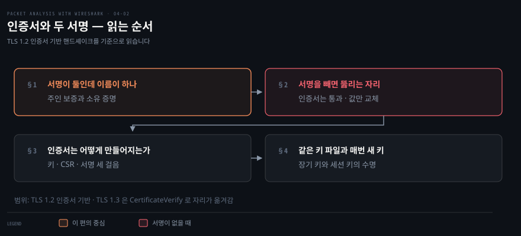
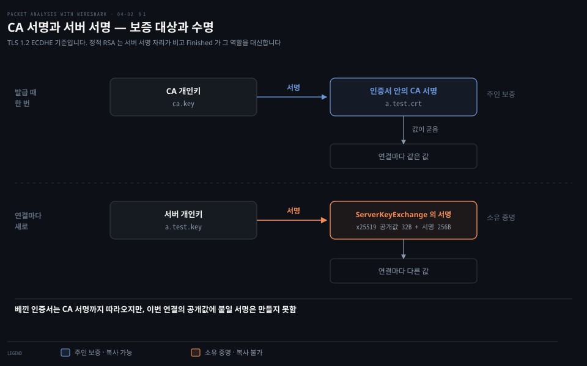
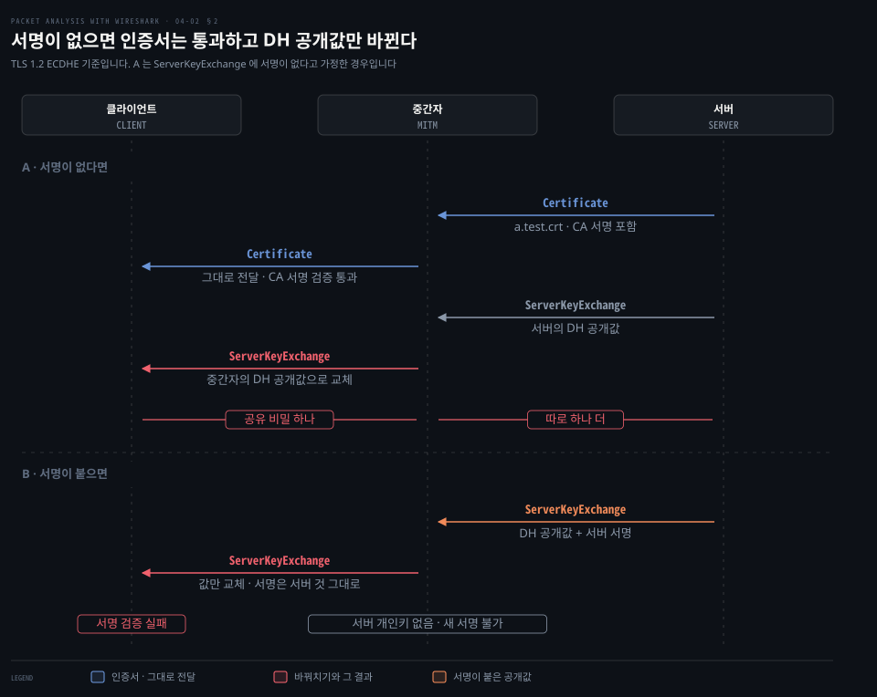
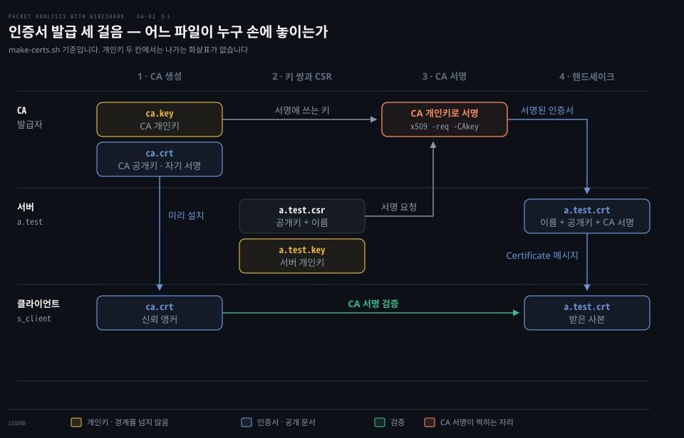

# 인증서와 두 서명

---

> 핸드셰이크 한 번에 서명이 두 개 등장합니다. 인증서 안의 서명과 ServerKeyExchange 의 서명은 증명하는 것도, 만들어지는 시점도 다릅니다.

## 핵심 요약

> 인증서는 "이 공개키의 주인이 누구인가"를 보증하고, 핸드셰이크의 서버 서명은 "그 개인키를 지금 쥐고 있는가"를 증명합니다. 앞의 것은 복사할 수 있고 뒤의 것은 복사할 수 없습니다.

중간자가 인증서를 통째로 베껴도 아무것도 못 하는 이유가 여기 있습니다. 인증서는 공개 문서라 누구나 받아 갈 수 있지만 그 안에는 소유를 증명하는 값이 없습니다. 소유 증명은 별도의 서명이 맡고, 이 서명은 연결마다 새로 만들어집니다.

이 편은 [04-01](./04-01.TLS%20%ED%95%B8%EB%93%9C%EC%85%B0%EC%9D%B4%ED%81%AC%20%EC%9D%BD%EA%B8%B0.md) §4 가 메시지의 유무를 다룬 자리에서 갈라져 나왔습니다. 그쪽이 "어떤 메시지가 오는가"를 읽는다면 이쪽은 "그 메시지 안의 서명이 각각 무엇을 보증하는가"를 읽습니다. 키의 수명도 함께 다룹니다. 인증서와 짝을 이루는 개인키는 몇 달에서 한 해를 가고 데이터를 감싸는 키는 연결이 끝나면 버려집니다.

실측은 `~/study/paw-lab/04-tls` 랩의 캡처를 씁니다. 책 본문에 없는 수치는 그 캡처에서 뜬 값이고, 프로토콜 규정은 RFC 를 따로 답니다.


## 학습 목표

> 이 편을 읽고 나면 아래 다섯 가지를 스스로 해낼 수 있습니다.

1. CA 서명과 서버 서명이 각각 무엇을 보증하는지 구분해 설명할 수 있습니다.
2. 인증서만으로는 소유를 증명하지 못하는 이유를 중간자 시나리오로 설명할 수 있습니다.
3. ServerKeyExchange 에 서명이 없으면 어떤 공격이 성립하는지 말할 수 있습니다.
4. `.crt`·`.key`·`ca.crt` 가 각각 누구의 것이고 어디에 놓이는지 구분할 수 있습니다.
5. 장기 키와 세션 키의 수명 차이를 설명할 수 있습니다.

이 편에서 새로 만나는 낱말입니다. `어디서` 는 그 낱말이 실제로 설명되는 절입니다.

| 키워드 | 뜻 | 학습 포인트·연결 개념 | 어디서 |
|---|---|---|---|
| CA 서명 | 발급자가 인증서에 찍는 서명 | 주인 보증 · 발급 때 한 번 · 복사 가능 | §1 |
| 서버 서명 | ServerKeyExchange 에 붙는 서명 | 소유 증명 · 연결마다 새로 · 복사 불가 | §1 |
| CSR (Certificate Signing Request) | 서명을 받으려고 CA 에 내는 요청 | 공개키와 이름을 담아 보냄 | §3 |
| 신뢰 앵커 (trust anchor) | 검증의 출발점이 되는 CA 인증서 | 클라이언트가 미리 갖고 있어야 함 | §3 |
| 자기서명 인증서 | 발급자와 주인이 같은 인증서 | 루트 CA 가 이 모양 · 신뢰는 미리 설치에서 옴 | §1·§3 |
| 도메인 검증 | CA 가 요청자의 도메인 제어를 확인 | ACME 의 HTTP-01·DNS-01 | §3 |
| 장기 키 | 인증서와 짝인 개인키 | 몇 달~한 해 · 신원과 서명 | §4 |
| 세션 키 | 연결마다 파생되는 대칭 키 | 데이터 암호화 · 끝나면 폐기 | §4 |

§1 에서 두 서명을 구분한 뒤 §2 에서 서명이 빠졌을 때 무엇이 뚫리는지 봅니다. §3 은 그 인증서가 만들어지는 과정을 실습 랩의 명령으로 따라갑니다. §4 는 키의 수명을 나눠 봅니다.




## 1. 서명이 둘인데 이름이 하나입니다

> 캡처 한 건에 서명이 두 번 나옵니다. 인증서 안의 서명과 ServerKeyExchange 의 서명은 만든 주체도 보증 대상도 다릅니다.

### 서버가 자기 인증서에 스스로 서명하면 왜 안 되는가

인증서에는 서명이 반드시 붙습니다. 그러면 서버가 자기 개인키로 자기 인증서에 서명해 내면 되지 않을까 싶어집니다. 파일은 실제로 그렇게 만들 수 있고 형식도 유효합니다.

막히는 곳은 받는 쪽입니다. 가짜 서버도 키 쌍을 만들고 이름 칸에 `a.test` 라고 적어 자기 개인키로 서명하면 똑같은 모양의 인증서가 나옵니다. 둘을 나란히 놓으면 진짜를 가릴 근거가 없습니다. 자기가 자기를 보증하는 문장은 누구나 쓸 수 있어서 아무것도 구분해 주지 못합니다.

그래서 서명하는 쪽이 문서의 주인과 달라야 합니다. 클라이언트가 이미 신뢰하는 제삼자가 이 이름과 이 공개키가 한 묶음이라고 서명해 두면 가짜 서버는 그 제삼자의 개인키가 없어 같은 서명을 만들지 못합니다. 그 제삼자가 CA 입니다.

랩의 `ca.crt` 도 자기서명입니다. 그래도 통하는 근거는 서명에 있지 않습니다. 클라이언트가 그 파일을 미리 받아 두었다는 사실이 근거이고, 그 자리를 §3 이 신뢰 앵커로 다룹니다.

인증서와 서버 서명은 종류부터 다릅니다. 인증서는 이름과 공개키에 CA 서명이 붙은 문서이고, 서버 서명은 이번 연결에서 만들어진 값에 찍은 도장입니다. 문서는 미리 만들어 두고 계속 쓸 수 있어도 도장은 찍을 대상이 생겨야 찍을 수 있으니, 서버 서명은 미리 만들어 둘 수 없습니다.

### 인증서를 받았는데 상대가 진짜인지 아직 모르는 이유

핸드셰이크를 읽다 보면 인증서가 평문으로 도착합니다. 그 안에 서버 이름과 공개키가 들어 있고 CA 의 서명까지 붙어 있으니 이것만으로 상대가 증명된 것처럼 보입니다. 그러나 이 시점에 증명된 것은 아직 없습니다.

인증서는 선을 타고 오는 공개 문서라서 누구나 받아서 그대로 다시 보낼 수 있기 때문입니다. 브라우저로 아무 사이트나 접속해도 그 인증서를 파일로 저장할 수 있다는 점을 떠올리면 분명해집니다. 베껴 보내는 일 자체를 막는 장치는 프로토콜 어디에도 없습니다.

인증서가 보증하는 것은 상대의 신원이 아니라 **공개키와 이름의 묶음**입니다. "이 공개키의 주인은 a.test 다"까지가 CA 가 말해 주는 범위이고, 지금 말을 걸어 온 쪽이 그 주인인지는 말해 주지 않습니다.

### 두 서명이 가르는 것

그래서 서명이 하나 더 필요합니다. 서버는 이번 연결에서만 쓰는 값에 자기 개인키로 서명해 보내고, 클라이언트는 인증서에 담긴 공개키로 그 서명을 검증합니다. 이 검증이 통과해야 비로소 개인키를 쥔 쪽과 말하고 있다는 것이 확인됩니다.



| 구분 | CA 서명 | 서버 서명 |
|---|---|---|
| 있는 곳 | 인증서 안 | ServerKeyExchange 메시지 |
| 만든 주체 | 발급 CA | 서버 자신 |
| 보증하는 것 | 이 공개키의 주인이 누구인가 | 그 개인키를 지금 쥐고 있는가 |
| 만드는 시점 | 발급 때 한 번 | 핸드셰이크마다 새로 |
| 검증에 쓰는 키 | CA 공개키 (`ca.crt`) | 서버 인증서의 공개키 |
| 복사 | 가능 — 인증서째 베끼면 따라온다 | 불가 — 값이 연결마다 달라진다 |

인증서 안에는 소유 증명이 없습니다. 소유 증명은 인증서 밖에서 연결마다 따로 만들어집니다. 04-01 §4 의 「인증서를 그대로 베낀 중간자가 왜 아무것도 못 하는가」가 막히는 자리가 정확히 이 두 번째 서명입니다.

서버 서명의 대상은 이번 연결의 공개값 하나만이 아닙니다. 양쪽 Hello 의 Random 두 개와 그 공개값을 이어 붙인 것에 서명합니다. RFC 5246 은 이것을 `client_random`·`server_random`·키 교환 파라미터를 담은 서명 구조체로 적고, ECDHE 를 다루는 RFC 8422 도 같은 순서로 적습니다.[^rfc5246][^rfc8422]

그래서 지나간 핸드셰이크에서 서명 바이트만 떼어 붙이는 수법이 통하지 않습니다. Random 은 연결마다 새로 뽑히므로 다른 연결에 그 서명을 실으면 검증하는 쪽이 계산한 값과 어긋납니다. 평문으로 지나가는 값을 그대로 복사해도 소용이 없는 것은 이 때문입니다.


랩 캡처에서 두 값의 크기를 확인할 수 있습니다. `a1-handshake.pcap` 의 프레임 7 은 서버가 보낸 네 메시지를 한 세그먼트에 담고 있고, 그중 Certificate 레코드가 796바이트, ServerKeyExchange 레코드가 300바이트입니다. 후자 안에 x25519 공개값 32바이트와 `rsa_pss_rsae_sha256` 서명 256바이트가 들어 있습니다.

x25519 는 ECDHE 에 쓰는 타원곡선 그룹 이름이고, `rsa_pss_rsae_sha256` 은 RSA 공개키 인증서로 만드는 RSASSA-PSS 서명(해시 SHA-256)입니다.[^rfc8446-names] 서명 방식이 suite 이름과 따로 정해지는 이유는 심화 학습에서 봅니다.

### 개인키로 잠그면 왜 아무것도 숨겨지지 않는가

비대칭 키 쌍은 쓰임이 둘이고 방향이 서로 반대입니다. 이 방향이 잡혀 있지 않으면 비밀값을 개인키로 잠근다는 문장이 나오는데 개인키로 처리한 값은 짝이 되는 공개키로 누구나 되돌릴 수 있습니다. 공개키는 공개돼 있으니 그렇게 잠근 것은 아무것도 숨기지 못합니다.

| 쓰임 | 거는 쪽 | 푸는 쪽 | 그래서 서는 것 |
|---|---|---|---|
| 숨기기 | 받는 쪽의 공개키 | 받는 쪽의 개인키 | 개인키를 쥔 쪽만 읽습니다 |
| 서명 | 보내는 쪽의 개인키 | 보내는 쪽의 공개키 | 개인키를 쥔 쪽이 만들었습니다 |

숨기기는 받는 쪽의 키를 쓰고 서명은 보내는 쪽의 키를 씁니다. 같은 키 쌍이라도 어느 쪽을 먼저 대느냐에 따라 얻는 것이 달라집니다.


## 2. 서명을 빼면 무엇이 뚫리는가

> DH 공개값은 연결마다 새로 뽑혀 인증서에 담길 수 없습니다. 그 값에 서명이 없으면 중간자가 인증서는 그대로 통과시키고 값만 바꿔치기할 수 있습니다.

### 인증서는 통과시키고 값만 바꾸는 공격

CA 서명이 보증하는 것은 인증서 안에 담긴 RSA 공개키까지입니다. 그런데 ECDHE 에서 실제로 세션 키를 만드는 재료는 그 RSA 공개키가 아니라 연결마다 새로 뽑는 DH 공개값입니다. 이 값은 발급 시점에 존재하지 않았으므로 인증서에 들어갈 수 없습니다.

여기에 서명이 없다고 가정하면 공격이 성립합니다. 

1. 중간자는 서버의 인증서를 손대지 않고 그대로 전달합니다. CA 서명은 멀쩡하니 클라이언트의 검증은 통과합니다. 
2. ServerKeyExchange 만 가로채 DH 공개값을 자기 값으로 바꿔 보냅니다. 
3. 클라이언트는 중간자와 공유 비밀을 맺고, 중간자는 서버와 따로 하나를 더 맺습니다. 양쪽 모두 정상으로 보입니다.

이 공격을 막는 것이 서명입니다. 중간자에게는 서버의 개인키가 없어서 자기 DH 공개값에 서버의 서명을 붙일 수 없습니다. 값을 바꾸는 순간 서명 검증이 깨지니 서명을 살리려면 값을 그대로 둘 수밖에 없습니다.



### 정적 RSA 에 이 메시지가 없는 이유

`b5-static-rsa.pcap` 에서 서버의 핸드셰이크 종류는 `2, 11, 14` 입니다. ServerKeyExchange 에 해당하는 12 가 없습니다.

정적 RSA 는 인증서 안의 공개키를 그대로 키 교환에 씁니다. 클라이언트가 비밀 값을 만들어 그 공개키로 잠가 보내면 서버가 개인키로 풉니다. 새로 만들어 보낼 공개값이 없으니 서명할 대상도 없습니다. 그래서 메시지 자체가 오지 않습니다.[^rfc5246]

이 경우에는 소유 증명이 다른 방식으로 이루어집니다. 서버가 개인키로 그 비밀 값을 풀어야만 이어지는 Finished 를 맞게 만들 수 있으므로 핸드셰이크가 끝까지 진행된다는 사실이 곧 소유의 증거입니다. 증명이 사라진 것이 아니라 증명하는 자리가 옮겨 간 것입니다.

같은 캡처에서 ClientKeyExchange 레코드는 262바이트입니다. 2048비트 RSA 로 잠근 비밀 값 256바이트가 그 안에 들어 있습니다. ECDHE 로 붙은 `a1-handshake.pcap` 의 같은 메시지는 37바이트이고 x25519 공개값 32바이트를 담습니다. 키 교환 방식이 바뀌면 이 메시지의 크기부터 달라집니다.


## 3. 인증서는 어떻게 만들어지는가

> 실습 랩의 인증서는 자체 CA 하나와 그 CA 가 서명한 서버 인증서 둘로 이루어집니다. 키 생성·CSR·서명 세 걸음을 따라가면 파일 넷의 역할이 드러납니다.



### 파일이 넷인데 어느 것을 어디에 두는지

`make-certs.sh` 가 만드는 파일은 확장자로 역할이 나뉩니다. 이름이 비슷해 헷갈리지만 놓이는 자리가 서로 다릅니다.

| 파일 | 누가 갖는가 | 역할 |
|---|---|---|
| `a.test.key` | 서버만 | 개인키. 서명을 만드는 쪽이라 밖으로 내보내지 않습니다 |
| `a.test.crt` | 서버가 갖고 클라이언트에 보냄 | 공개키와 이름에 CA 서명이 붙은 문서 |
| `ca.crt` | 클라이언트가 미리 갖고 있음 | 신뢰 앵커. 서버 인증서의 CA 서명을 검증하는 데 씁니다 |
| `ca.key` | CA 만 | CA 의 개인키. 서명을 발급할 때만 씁니다 |

- `ca.crt` 를 클라이언트가 미리 받아 두어야 하는 이유는 검증의 출발점이기 때문입니다. 서버 인증서의 서명을 검증하려면 CA 의 공개키가 필요한데 그 공개키를 다시 선에서 받아 오면 같은 문제가 되풀이됩니다. 
- 그래서 어딘가에서는 미리 갖고 있는 값으로 끊어야 하고, 그 자리가 신뢰 앵커입니다. 공개 웹에서는 OS 나 브라우저가 배포하는 CA 묶음이 이 자리를 맡습니다.

표에 공개키만 담은 파일이 없는 것이 걸립니다. 따로 만들지 않기 때문입니다. 공개키는 `a.test.crt` 안에 이름·유효 기간과 함께 실려 있고, 핸드셰이크에서 클라이언트가 받는 것도 그 인증서입니다. 공개키 파일을 따로 주고받는 단계는 없습니다.

`a.test.key` 같은 RSA 개인키 파일은 모듈러스와 공개 지수를 함께 담고 있어서 개인키만 있으면 공개키를 언제든 다시 뽑아낼 수 있습니다. `openssl rsa -in a.test.key -pubout` 으로 뽑은 값은 `a.test.crt` 안의 공개키와 같습니다. 반대 방향은 성립하지 않습니다. 그래서 내보내면 안 되는 파일은 `.key` 한쪽뿐입니다.

이름 때문에 헷갈리는 자리도 하나 있습니다. 핸드셰이크로 오는 `a.test.crt` 를 CA 인증서라고 부르기 쉬운데 거기 붙은 것은 CA 의 서명일 뿐 문서의 주인은 서버입니다. 주인을 기준으로 부르면 이쪽이 서버 인증서이고, CA 인증서는 CA 자신의 공개키를 담은 `ca.crt` 쪽입니다.


### 세 걸음

```bash
# 1. CA 를 만듭니다. -x509 는 CSR 없이 자기 자신을 서명한 인증서를 바로 냅니다.
openssl req -x509 -newkey rsa:2048 -nodes -keyout ca.key -out ca.crt -days 365 \
  -subj "/CN=paw-lab Root CA"

# 2. 서버의 키 쌍과 CSR 을 만듭니다. CSR 은 "이 공개키에 이 이름으로 서명해 달라"는 요청서입니다.
openssl req -newkey rsa:2048 -nodes -keyout a.test.key -out a.test.csr \
  -subj "/CN=a.test"

# 3. CA 가 그 요청에 서명합니다. 여기서 나온 .crt 가 핸드셰이크에서 클라이언트에 전달됩니다.
openssl x509 -req -in a.test.csr -CA ca.crt -CAkey ca.key -CAcreateserial \
  -out a.test.crt -days 365 -extfile <(printf "subjectAltName=DNS:%s" "a.test")
```

두 번째 걸음에서 개인키와 CSR 이 동시에 나오는 점을 봅니다. 개인키는 서버를 떠나지 않고 CSR 만 CA 로 갑니다. CA 는 개인키를 본 적이 없으면서도 그 공개키에 서명할 수 있습니다. 이것이 서명의 성질입니다.

세 번째 걸음의 `subjectAltName` 은 이 인증서가 어느 이름에 유효한지를 적는 자리입니다. 04-01 §4 가 말한 SAN 호스트명 검증이 이 값을 봅니다. 랩이 `a.test` 와 `b.test` 두 장을 만드는 이유는 SNI 실험 때문입니다. 같은 주소와 포트에서 요청한 이름에 따라 다른 인증서가 나가는 것을 보려는 것입니다.

랩의 세 걸음에 빠져 있는 단계가 하나 있습니다. CA 가 요청자를 확인하는 절차입니다. 위 명령에서 `ca.key` 를 쥔 쪽은 CSR 이 들어오면 그대로 서명하고 요청자가 정말 `a.test` 를 쥐고 있는지는 묻지 않습니다. 랩이라 그래도 되지만 공개 CA 는 그럴 수 없습니다.

공개 CA 가 쓰는 자동화 규약이 ACME 이고 확인 방법 둘을 RFC 8555 가 정합니다. HTTP-01 은 그 도메인으로 접속되는 서버의 지정된 경로에 지정된 내용을 올려 두게 하고, DNS-01 은 지정된 이름에 지정된 값의 TXT 레코드를 두게 합니다. 둘 다 그 도메인을 실제로 제어하는지를 요청자가 직접 보이게 하는 방식입니다.[^rfc8555]

사설 CA 의 인증서가 랩 밖에서 통하지 않는 것은 암호가 약해서가 아닙니다. 확인 절차를 건너뛴 서명이고, 무엇보다 클라이언트의 신뢰 저장소에 그 CA 가 없기 때문입니다.


인증서 형식의 이름인 X.509 는 ITU-T 의 X.500 디렉터리 시리즈 가운데 509번 권고에서 왔습니다. 현재 인터넷에서 쓰는 프로파일과 경로 검증 규칙은 RFC 5280 이 정합니다.[^rfc5280]


## 4. 같은 키 파일을 쓰는데 매번 새 키라는 말

> 서버는 띄울 때마다 같은 `.key` 파일을 읽는데 데이터를 감싸는 키는 연결마다 새로 만들어집니다. 모순처럼 보이지만 둘은 다른 키입니다.

### 수명이 다른 두 키

같은 키 파일을 계속 쓰는데 "연결마다 새 키"라는 설명이 붙으면 모순처럼 들리지만 두 문장이 서로 다른 키를 가리키고 있어서 생기는 혼동입니다.

| 구분 | 장기 키 | 세션 키 |
|---|---|---|
| 실체 | `a.test.key` 와 인증서의 공개키 | 핸드셰이크에서 파생한 대칭 키 |
| 수명 | 인증서 유효 기간 — 몇 달에서 한 해 | 연결 하나. 끝나면 버립니다 |
| 하는 일 | 신원 증명과 서명 | 데이터 암호화와 무결성 |
| 종류 | 비대칭 — 개인키와 공개키가 다릅니다 | 대칭 — 양쪽이 같은 값을 씁니다 |
| 선을 지나가는가 | 공개키만 인증서에 담겨 지나갑니다 | 지나가지 않습니다 |

서버가 시작할 때 읽는 것은 장기 키입니다. 이 키는 서명을 만드는 데만 쓰이고 데이터를 감싸는 데는 쓰이지 않습니다. 본문을 감싸는 세션 키는 핸드셰이크에서 양쪽이 각자 계산하며 연결이 끝나면 사라집니다.

인증서에 담긴 공개키와 핸드셰이크의 DH 공개값은 둘 다 공개라는 말이 붙지만 수명이 다릅니다. 인증서의 공개키는 장기 키의 한쪽이라 인증서를 다시 발급할 때까지 그대로이고, DH 공개값은 연결마다 새로 뽑아 그 연결이 끝나면 버립니다. §2 에서 DH 공개값이 인증서에 담길 수 없다고 한 것이 이 차이 때문입니다.


이 구분이 잡히면 [04-03 §1](./04-03.%EC%97%B4%EC%87%A0%EC%99%80%20%EC%8B%A4%ED%8C%A8.md) 의 전방 비밀성이 왜 성립하는지도 따라옵니다. 장기 키가 나중에 유출돼도 ECDHE 로 맺은 과거 세션의 키는 복구되지 않습니다. 그 키를 만든 임시 개인값이 장기 키와 별개이고 이미 폐기됐기 때문입니다.


### 대칭 키는 무엇에 실려 오는가

세션 키가 선을 지나가지 않는다면 양쪽이 어떻게 같은 값을 갖는지가 남습니다. 답은 키 교환 방식마다 다릅니다.

ECDHE 로 붙은 `a1-handshake.pcap` 에서는 공개키 암호화가 한 번도 일어나지 않습니다. 오가는 것은 양쪽의 DH 공개값뿐이고 각자 자기 임시 개인값과 상대의 공개값으로 같은 공유 비밀을 계산합니다. 서버의 공개키는 무엇을 잠그는 데 쓰이지 않고 서버 서명을 확인하는 데만 쓰입니다.

정적 RSA 로 붙은 `b5-static-rsa.pcap` 이 다른 쪽입니다. 클라이언트가 비밀 값을 만들어 서버 공개키로 잠가 보내고 서버가 개인키로 풉니다. 공개키 암호화가 실제로 일어나지만 핸드셰이크를 통틀어 그 한 번뿐입니다.

어느 쪽이든 세션 키 자체는 선을 지나가지 않습니다. 양쪽이 공유 비밀과 두 Hello 의 Random 으로 각자 계산합니다. 그 계산은 `pre_master_secret` 에서 `master_secret` 을 거쳐 레코드 키로 이어지며, 각 단계의 이름은 04-01 §3 이 적어 두었습니다. 본문을 보낼 때마다 공개키를 다시 쓰는 일은 어느 쪽에도 없습니다.

### 데이터를 비대칭으로 감싸지 않는 이유

그러면 왜 굳이 대칭 키로 바꾸는지가 남습니다. 이유는 둘이며 둘 다 이 연결만의 사정과 상관없는 방식 자체의 성질입니다.

하나는 한 번에 다룰 수 있는 크기입니다. RSA 는 모듈러스보다 긴 평문을 다루지 못합니다. PKCS #1 v1.5 로 감싸면 상한이 모듈러스 길이에서 11바이트를 뺀 값이라 2048비트 키에서는 245바이트가 한계입니다.[^rfc8017] 본문을 이 크기로 잘라 담을 수는 없습니다.

다른 하나는 속도입니다. 같은 기기에서 `openssl speed` 로 재면 자릿수가 다릅니다.

| 연산 | 처리량 | 잰 조건 |
|---|---|---|
| RSA-2048 개인키 | 약 0.39 MB/s | 초당 1,574회 · 회당 245바이트 |
| AES-128-GCM | 약 8,770 MB/s | 8KB 블록 |

네 자릿수 배 차이라 본문을 비대칭으로 감싸면 연결이 대역폭이 아니라 CPU 에 묶입니다.

클라이언트에 키 쌍이 없다는 것은 이유가 아닙니다. 클라이언트도 인증서를 내는 mTLS 에서도 결론은 같습니다. 클라이언트의 키 쌍은 CertificateVerify 에 서명하는 데 쓰이고 본문은 그대로 대칭 세션 키가 감쌉니다. RFC 5246 은 이 메시지를 클라이언트 인증서를 명시적으로 검증하는 자리로 적고, 서명 능력이 있는 인증서를 보낸 다음에만 보낸다고 적습니다.[^rfc5246] 그 메커니즘은 04-01 §4 가 다룹니다.

### 서명 권한만 떼어낼 수 있다는 뜻이기도 합니다

서버 서명이 연결마다 새로 필요하고 재사용되지 않는다는 성질은 그 서명을 만드는 일만 따로 떼어낼 수 있다는 뜻이기도 합니다. ECDHE 에서 장기 개인키는 세션 키 계산에 관여하지 않으므로 개인키를 다른 장비에 두고 서명 결과만 받아 와도 핸드셰이크가 성립합니다. CDN 이 고객 인증서의 개인키를 넘겨받지 않고 TLS 를 종단하는 구성과 HSM(Hardware Security Module, 개인키를 밖으로 내보내지 않고 안에서 서명만 해 주는 전용 장비)에 개인키를 가두는 구성이 같은 성질에 기댑니다.

캡처에서는 이 차이가 보이지 않습니다. 서명 바이트가 로컬 키에서 나왔는지 원격 장비에서 왔는지 구분할 단서가 레코드에 없습니다. 판독으로는 구분할 수 없고 구성을 알아야만 확인되는 사실입니다.


## 심화 학습

> 서명 알고리즘의 이름은 cipher suite 의 이름과 따로 놉니다. 둘을 같은 축으로 읽으면 어긋납니다.

인증서 발급자의 서명 알고리즘과 핸드셰이크의 서명 알고리즘은 다를 수 있습니다. 랩 캡처의 suite 는 `TLS_ECDHE_RSA_WITH_AES_256_GCM_SHA384` 인데 ServerKeyExchange 의 서명은 `rsa_pss_rsae_sha256` 입니다. suite 이름의 `RSA` 는 인증 방식이 RSA 계열이라는 것까지만 말하고, 실제로 쓴 서명 방식은 `signature_algorithms` 확장의 협상 결과입니다.[^rfc8422]

TLS 1.3 에서는 이 편이 다룬 메시지 배치가 달라집니다. ServerKeyExchange 가 사라지고 키 공유 값이 Hello 의 확장으로 옮겨가며, 소유 증명은 CertificateVerify 라는 별도 메시지가 맡습니다. 두 서명이 하는 일은 그대로이고 실려 가는 자리만 바뀝니다.[^rfc8446-cv]

| 구분 | TLS 1.2 (이 편의 기준) | TLS 1.3 |
|---|---|---|
| 키 공유 값 | ServerKeyExchange | ClientHello·ServerHello 의 `key_share` 확장 |
| 소유 증명 서명 | ServerKeyExchange 안에 포함 | CertificateVerify 메시지 |
| 평문으로 보이는가 | 보입니다 | ServerHello 이후라 키가 있어야 보입니다 |

TLS 1.3 에서 이 메시지들이 캡처에 어떻게 나타나는지는 04-01 심화 학습이 실측과 함께 다룹니다.


## 면접 대비

### 한 줄 정의

인증서는 공개키와 이름의 묶음을 CA 가 보증한 문서이고, 소유 증명은 그 문서 밖에서 연결마다 새로 만들어지는 서명이 맡습니다.

### 핵심 포인트 세 가지

1. CA 서명은 주인을 보증하고 복사할 수 있지만, 서버 서명은 소유를 증명하고 복사할 수 없습니다.
2. DH 공개값은 연결마다 새로 뽑혀 인증서에 담길 수 없으므로 별도의 서명이 필요합니다.
3. 장기 키는 서명에만 쓰이고 데이터는 연결마다 새로 만든 세션 키가 감쌉니다.

### 자주 묻는 질문

Q: 인증서를 그대로 베끼면 왜 통하지 않습니까?
A: 인증서 안에는 소유를 증명하는 값이 없기 때문입니다. 베낀 쪽은 개인키가 없어 이번 연결의 공개값에 서명할 수 없고, 클라이언트의 서명 검증에서 걸립니다.

Q: 정적 RSA 에는 ServerKeyExchange 가 없는데 소유 증명은 어떻게 합니까?
A: 서버가 개인키로 비밀 값을 풀어야만 Finished 를 맞게 만들 수 있으므로 핸드셰이크가 끝까지 진행되는 것 자체가 증거입니다.

Q: `ca.crt` 를 서버가 보내 주면 안 됩니까?
A: 그러면 검증의 출발점까지 선에서 받는 셈이라 같은 문제가 되풀이됩니다. 신뢰 앵커는 미리 갖고 있는 값이어야 합니다.


## 핵심 개념 체크리스트

- [ ] CA 서명과 서버 서명이 각각 보증하는 것을 말할 수 있다
- [ ] 인증서 안에 소유 증명이 없다는 문장의 뜻을 설명할 수 있다
- [ ] 서명 없는 ServerKeyExchange 에서 성립하는 중간자 공격을 말할 수 있다
- [ ] 정적 RSA 에 12번 메시지가 없는 이유를 말할 수 있다
- [ ] `.crt`·`.key`·`ca.crt` 를 누가 갖는지 구분할 수 있다
- [ ] 장기 키와 세션 키의 수명과 역할을 가를 수 있다
- [ ] 개인키로 잠근 값이 왜 아무것도 숨기지 못하는지 말할 수 있다
- [ ] 데이터에 대칭 키를 쓰는 이유를 크기와 속도로 댈 수 있다


## 관련 문서

- [04-01 TLS 핸드셰이크 읽기](./04-01.TLS%20%ED%95%B8%EB%93%9C%EC%85%B0%EC%9D%B4%ED%81%AC%20%EC%9D%BD%EA%B8%B0.md) — 이 편의 앞. 메시지의 유무와 암호화 경계
- [04-03 열쇠와 실패](./04-03.%EC%97%B4%EC%87%A0%EC%99%80%20%EC%8B%A4%ED%8C%A8.md) — 이 편의 뒤. 전방 비밀성과 복호화 조건
- [04-04 실습](./04-04.%EC%8B%A4%EC%8A%B5%20%E2%80%94%20TLS%20%ED%95%B8%EB%93%9C%EC%85%B0%EC%9D%B4%ED%81%AC%EB%A5%BC%20%EC%A7%81%EC%A0%91%20%EC%9E%A1%EA%B8%B0.md) — 여기서 만든 인증서로 실제 핸드셰이크를 잡습니다. `openssl` 명령 옵션 풀이가 있습니다
- [Packet Analysis with Wireshark — 정독 인덱스](./README.md) — 7개 장 전체 지도


## 참고 자료

- 원본: 《Packet Analysis with Wireshark》 (Anish Nath, Packt Publishing, 2015) ISBN 978-1-78588-781-9
- 다룬 범위: Chapter 4 의 인증서·키 교환 메시지를 실습 캡처로 확장
- 실측: `~/study/paw-lab/04-tls` 랩의 `a1-handshake.pcap`·`b5-static-rsa.pcap` (tshark 4.6.8, 2026-09-20)
- 실측: 암호 연산 처리량은 같은 기기의 `openssl speed` (OpenSSL 3.6.4, 2026-09-21)

[^rfc5246]: [RFC 5246](https://www.rfc-editor.org/rfc/rfc5246.html) — §7.4.2 Certificate, §7.4.3 ServerKeyExchange 의 전송 조건과 서명 대상, §7.4.8 CertificateVerify 의 전송 조건, §6.2.3.3 의 레코드 보호 키(`client_write_key`·`server_write_key`). (2026-09-20·2026-09-21 조회)

[^rfc8422]: [RFC 8422](https://www.rfc-editor.org/rfc/rfc8422.html) — §5.4 ECDHE ServerKeyExchange 의 서명 구조. (2026-09-20 조회)

[^rfc5280]: [RFC 5280](https://www.rfc-editor.org/rfc/rfc5280.html) — X.509 인증서 프로파일과 경로 검증. ITU-T X.509 권고의 인터넷 프로파일입니다. (2026-09-20 조회)

[^rfc8446-cv]: [RFC 8446](https://www.rfc-editor.org/rfc/rfc8446.html) — §4.4.3 CertificateVerify, §4.2.8 key_share 확장. (2026-09-20 조회)

[^rfc8555]: [RFC 8555](https://www.rfc-editor.org/rfc/rfc8555.html) — §8.3 HTTP Challenge, §8.4 DNS Challenge 의 도메인 제어 확인 방법. (2026-09-21 조회)

[^rfc8017]: [RFC 8017](https://www.rfc-editor.org/rfc/rfc8017.html) — §7.2 RSAES-PKCS1-v1_5 의 평문 길이 상한. (2026-09-21 조회)

[^rfc8446-names]: RFC 8446 §4.2.3 — "/* RSASSA-PSS algorithms with public key OID rsaEncryption */ rsa_pss_rsae_sha256(0x0804)" · §4.2.7 — "/* Elliptic Curve Groups (ECDHE) */ ... x25519(0x001D)". <https://www.rfc-editor.org/rfc/rfc8446.txt> (2026-09-26 조회)
