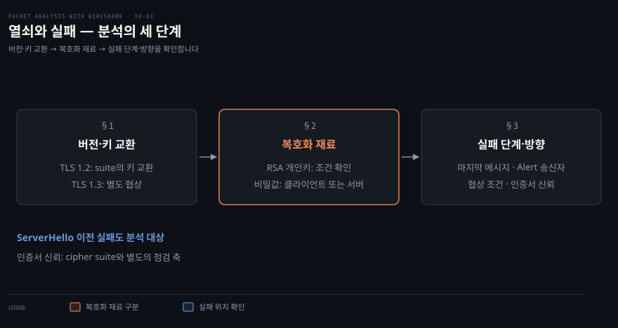
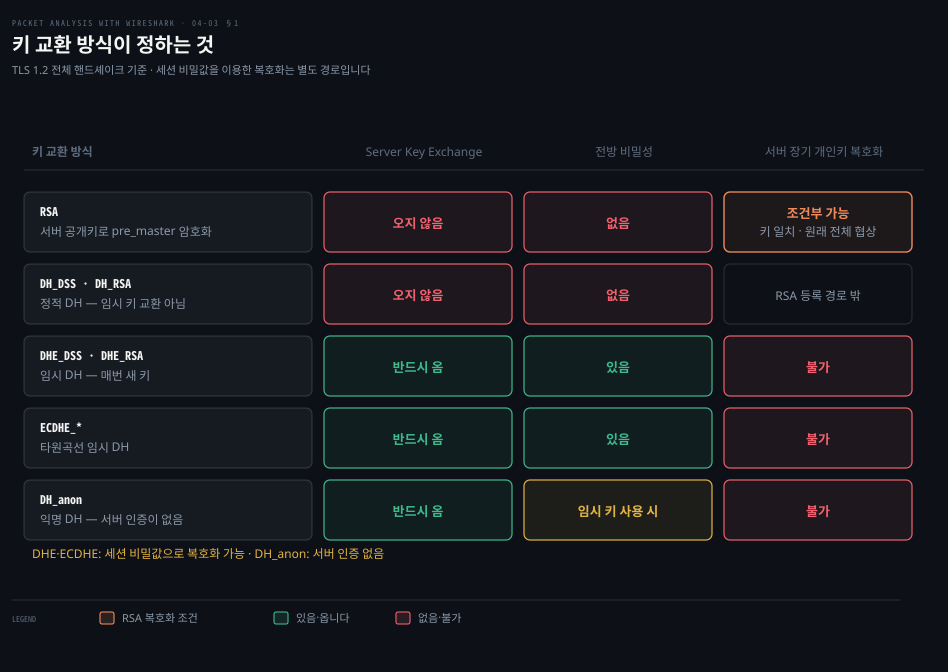
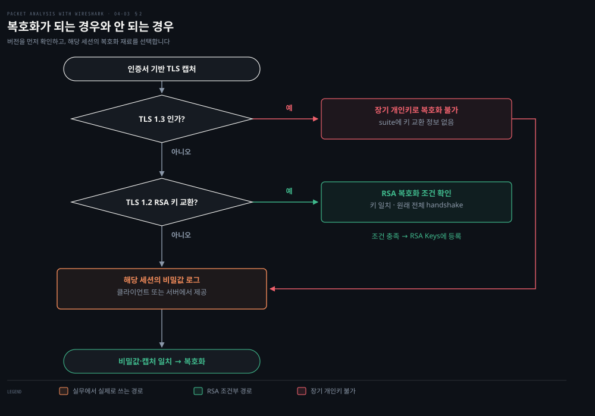

# 열쇠와 실패

---

> 잡아 둔 TLS 통신을 복호화하려면 어떤 비밀이 필요한지, 연결이 실패하면 어느 쪽의 무엇부터 확인할지 배웁니다. 버전·키 교환 방식·실패 지점을 구분해야 두 문제를 풀 수 있습니다.

## 핵심 요약

> 서버의 장기 개인키와 연결마다 만들어지는 세션 비밀은 역할이 다릅니다. 이 차이가 복호화 가능 범위를 정하고 실패 진단에서는 협상 문제와 인증서 신뢰 문제를 구분하는 출발점이 됩니다.

앞편에서는 TLS 1.2 전체 핸드셰이크의 메시지와 암호화 경계를 읽었습니다. 이 편에서는 같은 캡처를 두고 “서버 개인키가 있으면 내용을 볼 수 있는가”를 묻습니다. 정적 RSA와 달리 DHE·ECDHE에서는 장기 개인키만으로 세션 비밀을 복구할 수 없습니다. 해당 연결의 비밀을 따로 기록했다면 복호화할 수 있습니다.[^wireshark-tls]

이 편의 기본 범위도 인증서를 사용하는 TLS 1.2 전체 핸드셰이크입니다. TLS 1.3에서는 cipher suite 이름에 키 교환 방식이 없으므로 같은 이름 판독 규칙을 적용하지 않습니다. 세션 재개와 PSK는 필요한 경계만 짚습니다.[^rfc8446]

“Wireshark에서 내용이 안 보인다”와 “TLS 연결 자체가 실패했다”는 다른 문제입니다. 전자는 캡처와 복호화 재료를 확인하고 후자는 마지막으로 진행된 단계와 Alert 송신 방향을 살펴봅니다. 협상이 실패해 ServerHello조차 없는 연결에서는 선택된 suite를 찾을 수 없습니다.


## 학습 목표

> 아래 다섯 가지를 캡처의 근거와 함께 설명하는 것이 목표입니다.

1. TLS 1.2의 RSA 키 교환과 ECDHE-RSA 인증에서 같은 RSA 키가 맡는 역할을 구분할 수 있습니다.
2. 디피-헬먼의 작은 수 예제로 공유 비밀이 선을 지나지 않는 이유와 전방 비밀성의 조건을 설명할 수 있습니다.
3. 버전·키 교환·캡처 범위를 확인해 개인키와 키 로그 중 필요한 복호화 재료를 고를 수 있습니다.
4. 세션 키 로그를 적용하기 전후의 차이를 확인하고, 공유되는 비밀의 범위를 설명할 수 있습니다.
5. 협상 실패와 인증서 신뢰 실패를 구분해 nmap·curl·OpenSSL로 다음 확인을 이어 갈 수 있습니다.

| 키워드 | 뜻 | 학습 포인트·연결 개념 | 어디서 |
|---|---|---|---|
| 정적 RSA 키 교환 | RSA로 공유 비밀을 전달 | 인증서 개인키와 전체 핸드셰이크 | §1 · §2 |
| DHE · ECDHE | 임시 키로 공유 비밀 합의 | 공개값·개인값·장기 서명키 구분 | §1 |
| 전방 비밀성 | 장기 키 유출에도 과거 보호 | 임시 비밀 폐기와 안전한 구현이 전제 | §1 |
| 세션 키 로그 | 연결별 복호화 비밀 기록 | 클라이언트나 서버에서 확보 | §2 |
| SSLKEYLOGFILE | 키 로그 경로 환경 변수 | 구현 지원과 실제 파일 생성 확인 | §2 |
| unknown_ca | 인증서 신뢰 경로 검증 실패 | Alert 송신자와 상대 체인 확인 | §3 |

§1에서 키의 역할을 구분하고 §2에서 그 차이를 복호화 절차에 적용합니다. §3은 연결이 성립하지 않는 경우로 넘어가, 앞편에서 읽은 실패 단서를 실제 진단 명령과 잇습니다.




## 1. 키 교환 방식이 정하는 것

> TLS 1.2에서는 선택된 키 교환 방식으로 추가 메시지와 장기 개인키의 역할을 알 수 있습니다. 전방 비밀성은 그 장기 키가 나중에 유출돼도 과거의 세션 비밀을 복구하지 못하게 하는 성질입니다.



### RSA가 이름에 있는데 개인키로 안 열리는 이유

앞편의 예제는 `TLS_ECDHE_RSA_WITH_AES_256_GCM_SHA384`입니다. 이름에 RSA가 있어도 RSA 키 교환은 아닙니다. ECDHE가 공유 비밀을 합의하고, RSA는 서버가 보낸 임시 공개값을 인증하는 서명에 쓰입니다. 서명키를 얻었다고 그 공개값에 대응하는 임시 개인값까지 얻는 것은 아닙니다.

비교할 대상은 `TLS_RSA_WITH_AES_128_CBC_SHA`입니다. 여기서는 클라이언트가 만든 `pre_master_secret`을 서버 인증서의 RSA 공개키로 암호화합니다. 캡처에 그 암호문이 있고 짝이 되는 개인키를 확보하면 공유 비밀을 복구할 수 있습니다. 이후 키 파생에 필요한 핸드셰이크 정보도 있어야 실제 레코드를 열 수 있습니다.[^rfc5246][^wireshark-tls]

두 이름의 차이는 공유 비밀을 만드는 방식에서 옵니다. 아래 두 소절에서 디피-헬먼과 타원곡선의 원리를 본 뒤, TLS 1.2 의 키 교환 네 방식을 한 표로 비교합니다.

### 디피-헬먼 — 공개값만 보고 공유 비밀을 얻기 어려운 이유

공개값이 모두 캡처에 남는데도 왜 같은 비밀을 계산하지 못할까요? 양쪽은 공개값 외에 자기만 아는 개인값을 하나씩 사용하기 때문입니다. **디피-헬먼(Diffie–Hellman, DH)**은 비밀 자체를 보내지 않고 양쪽이 같은 값을 계산하는 키 합의 방식입니다.

아래는 원리를 보이기 위한 작은 수 예제이며 실행 명령이 아닙니다. `mod`는 나눗셈의 나머지입니다. 공개된 소수 `p=23`과 밑 `g=5`를 쓰고 앨리스와 밥은 각각 비밀 `a=6`, `b=15`를 고릅니다.

```bash
# 계산식 예시: ^는 거듭제곱, mod는 나머지
# 공개: p=23, g=5      비밀: a=6 (앨리스), b=15 (밥)
A = 5^6  mod 23 = 8       # 앨리스가 보내는 공개값
B = 5^15 mod 23 = 19      # 밥이 보내는 공개값

앨리스: B^a mod 23 = 19^6  mod 23 = 2
밥    : A^b mod 23 = 8^15  mod 23 = 2
```

두 결과가 같은 이유는 양쪽 모두 `g^(ab) mod p`를 계산하기 때문입니다. 선에 보이는 값은 `p`, `g`, `A`, `B`이고 공유 비밀 `2`는 보내지 않았습니다. 각자의 개인값을 아는 끝점은 상대 공개값에 자기 지수를 적용하기만 하면 됩니다.

도청자는 개인값을 모릅니다. `5^x mod 23 = 8`을 풀어 앨리스의 개인값을 찾는 것은 **이산 로그 문제**이며, 공유 비밀을 구하는 한 방법입니다. 공개값 둘에서 공유 비밀을 직접 구하는 문제도 적절한 큰 그룹에서는 어렵다고 가정합니다. “반드시 개인값을 먼저 구해야만 한다”는 뜻은 아닙니다.

작은 예제는 후보를 전부 대입해 쉽게 풀립니다. 실제 보안은 충분히 큰 그룹과 적절한 파라미터를 사용한다는 조건에 달려 있습니다. 유한체 DH는 2048비트나 3072비트 등의 소수를 사용할 수 있고 그 크기가 보안 강도와 계산 비용에 영향을 줍니다.[^nist-keylen]

이 계산만으로는 상대의 신원이 확인되지 않습니다. 능동적인 중간자가 양쪽과 각각 키를 합의하는 것을 막으려면 인증도 필요합니다. 앞편에서 본 인증서 검증과 교환 파라미터 서명이 그 역할을 합니다.

### 타원곡선은 같은 원리를 다른 연산으로 구현합니다

유한체 DH의 수를 키우면 공격도 어려워지지만 계산과 전송 부담도 커집니다. **ECDH(Elliptic Curve Diffie–Hellman)**는 타원곡선 위의 점 연산으로 공유 비밀을 합의하는 방식입니다. 그 임시 키 버전이 ECDHE입니다. RSA를 타원곡선으로 바꾼 암호화 방식이라는 뜻은 아닙니다.[^rfc8422]

유한체 예제의 `g^a` 대신 곡선의 기준점 G에 개인값 a를 곱한 점 `aG`를 보냅니다. 상대 점 `bG`에 a를 곱하거나 `aG`에 b를 곱하면 같은 `abG`에 도달합니다. 실제 프로토콜은 이 결과에서 키 재료를 얻습니다. 개인값은 보내지 않는다는 구조가 앞의 예제와 같습니다.

ECC에 대한 알려진 일반적 공격의 특성 때문에, 적절한 곡선을 사용하면 유한체 DH보다 짧은 파라미터로 비슷한 보안 강도를 얻을 수 있습니다. NIST의 비교표는 다음과 같습니다. 이 표는 고전적 공격에 대한 비교이며, 모든 곡선이나 구현의 안전성을 보장하는 표는 아닙니다.[^nist-keylen]

| 보안 강도 | 유한체 DH (FFC L) | RSA (IFC k) | 타원곡선 (ECC f) |
|---:|---:|---:|---:|
| 112비트 | 2048비트 | 2048비트 | 224~255비트 |
| 128비트 | 3072비트 | 3072비트 | 256~383비트 |
| 192비트 | 7680비트 | 7680비트 | 384~511비트 |

- 예를 들어 128비트 보안 강도에서 RSA·유한체 DH는 3072비트, ECC는 256~383비트 범위입니다. 키 길이와 보안 강도는 같은 수치가 아닙니다. 
- 짧은 파라미터는 전송량과 구현 비용에 이점이 있지만 실제 성능은 알고리즘과 구현에 따라서도 달라집니다.

### TLS 1.2 키 교환 네 방식 — 장기 키가 하는 일이 다릅니다

앞의 두 원리를 TLS 1.2 에 대입하면 키 교환은 넷으로 나뉩니다. 갈리는 곳은 공유 비밀을 만드는 방법과, 인증서의 장기 키가 그 과정에서 하는 역할입니다.

| TLS 1.2 키 교환 | 공유 비밀을 만드는 방법 | ServerKeyExchange | 인증서의 장기 키 역할 |
|---|---|---|---|
| 정적 RSA | 클라이언트의 비밀을 RSA 암호문으로 전달 | 없음 | 서버가 비밀을 복호화 |
| 인증된 DHE | 유한체의 임시 공개값으로 합의 | 있음 | 임시 교환 파라미터에 서명 |
| 인증된 ECDHE | 타원곡선의 임시 공개값으로 합의 | 있음 | 임시 교환 파라미터에 서명 |
| 정적 DH | 인증서의 고정 DH 공개값으로 합의 | 없음 | 고정 DH 키로 합의에 참여 |

정적 DH는 책의 `SSL_DH_RSA_WITH_DES_CBC_SHA` 같은 과거 이름을 읽기 위해 남겼습니다. 이 이름의 RSA는 인증서 서명 쪽 구분이며 RSA 키 전달을 뜻하지 않습니다. DH와 DHE를 같은 방식으로 읽지 않고 끝의 E가 임시(ephemeral) 키를 뜻한다는 점을 기억합니다.[^rfc5246]

> 원서와의 차이: 타원곡선 절의 `SSL_DHE_RSA_WITH_...` 예제는 유한체 DHE 이름입니다. 타원곡선 임시 키 교환은 ECDHE입니다. RSA 공개키가 ServerKeyExchange로 온다는 원서 문장도 바로잡아 읽습니다. 정적 RSA에서는 Certificate로 공개키를 받고 ServerKeyExchange를 보내지 않습니다.[^rfc5246][^rfc8422]

### 전방 비밀성은 어떤 비밀의 유출을 가정합니까?

서버 인증서의 개인키가 나중에 유출됐다고 가정합니다. 정적 RSA에서는 공격자가 과거에 저장한 ClientKeyExchange 암호문을 풀어 공유 비밀을 얻을 수 있습니다. 이 장기 키 하나가 과거 세션의 비밀을 복구하는 데 쓰이는 구조입니다.

DHE·ECDHE는 연결에 쓰인 임시 개인값이 별도로 필요합니다. 안전하게 생성한 임시 비밀을 사용 후 폐기했다면, 나중에 장기 서명키를 얻어도 과거의 공유 비밀이 복구되지 않습니다. 이것이 **전방 비밀성(forward secrecy)**입니다. 강한 파라미터와 안전한 구현도 전제합니다.

여기서 갈리는 것이 "새로 만드느냐"가 아니라는 점을 짚습니다. 정적 RSA도 연결마다 새 비밀 값을 만듭니다. 클라이언트가 매번 새로 뽑아 서버 공개키로 잠가 보내므로 세션 키 자체는 연결마다 다릅니다.

차이는 그 값이 **장기 키로 잠긴 채 선 위를 지나가느냐**입니다. 지나간 값은 캡처에 남고 나중에 장기 개인키를 얻으면 그때 풀립니다. 임시 방식은 공개값만 지나가고 비밀 값은 양쪽에서 계산되므로 선에 남는 것이 없습니다.

| 구분 | 정적 RSA | DHE · ECDHE |
|---|---|---|
| 연결마다 새 비밀 값 | 만듭니다 | 만듭니다 |
| 그 값이 선을 지나가는가 | 장기 키로 잠긴 채 지나갑니다 | 지나가지 않습니다 |
| 장기 키 유출 시 과거 세션 | 풀립니다 | 풀리지 않습니다 |

판별은 이름의 칸 개수 대신 `DHE`·`ECDHE` 의 끝 글자 `E`(ephemeral)로 합니다. `openssl ciphers -stdname` 의 `Kx` 열을 보면 더 분명합니다. `Kx=RSA` 면 정적 RSA, `Kx=ECDH` 면 임시 방식입니다.

세션 비밀 자체를 기록한 로그가 유출된 경우까지 보호하는 성질은 아닙니다. 운영자가 해당 연결의 키 로그를 보관했다면 나중에 캡처를 열 수 있습니다. 따라서 “전방 비밀성이 있으면 사후 복호화가 불가능하다” 대신 “장기 개인키만으로는 사후 복호화할 수 없다”고 설명합니다.

TLS 1.3은 정적 RSA와 정적 DH 키 교환을 제거했습니다. 다만 RFC의 전방 비밀성 설명은 공개키 기반 키 교환에 대한 것입니다. PSK만 사용하는 모드까지 포함해 모든 연결이 같은 성질을 갖는다고 일반화하지 않습니다. TLS 1.3 suite 이름만으로 키 교환 방식을 판정할 수도 없습니다.[^rfc8446]


## 2. 복호화가 되는 경우와 안 되는 경우

> 정적 RSA에는 조건을 만족하는 서버 개인키 경로가 있고 DHE·ECDHE와 TLS 1.3에는 해당 연결의 키 로그를 사용하는 경로가 있습니다. 로그는 복호화가 필요한 통신이 일어날 때 확보해야 합니다.



### 공개키는 핸드셰이크에서 한 번만 쓰입니다

복호화 재료를 고르기 전에 무엇을 푸는 것인지부터 맞춰 둡니다. 공개키 암호는 핸드셰이크에서 비밀 값을 나르는 데 한 번 쓰이고 그 뒤 주고받는 데이터는 양쪽 방향 모두 **같은 대칭 키**로 암호화됩니다. 방향마다 상대의 공개키로 감싸는 것이 아닙니다.

인증서를 사용하는 이 핸드셰이크에서 클라이언트는 키 쌍조차 갖고 있지 않습니다. 클라이언트 인증을 요구하는 구성에서만 클라이언트 인증서와 개인키가 등장합니다. 그러니 "서버에서 클라이언트로 가는 데이터는 클라이언트 공개키로 암호화한다"는 그림은 성립하지 않습니다.

이 구분이 서면 복호화에 필요한 것이 무엇인지도 정해집니다. 찾아야 하는 것은 방향별 공개키가 아니라 그 대칭 키를 만들어 낸 비밀입니다.

### 먼저 캡처와 키의 조건을 맞춥니다

Application Data만 보인다고 연결이 실패한 것은 아닙니다. TCP 스트림은 앞편에서 정한 그대로 좁혀 놓고 선택된 버전과 suite, 핸드셰이크 시작 부분이 들어 있는지 확인합니다. TLS 1.3에서는 ServerHello의 `supported_versions`도 봅니다.

복호화 재료가 있어도 캡처 누락이나 다른 연결의 키 때문에 열리지 않을 수 있습니다. 아래 표의 “가능”은 필요한 핸드셰이크·레코드를 확보했고 Wireshark가 해당 암호를 지원한다는 전제입니다.[^wireshark-tls]

| 캡처의 방식 | 서버 인증서 개인키만 추가 | 해당 연결의 키 로그 추가 |
|---|---|---|
| TLS 1.2 정적 RSA 전체 핸드셰이크 | 조건부 가능 | 가능 |
| TLS 1.2 DHE·ECDHE | 불가 | 가능 |
| TLS 1.3 | 불가 | 필요한 traffic secret이 있으면 가능 |
| TLS 1.2 재개 연결만 따로 캡처 | 원래 RSA였어도 이 경로로 복구 불가 | 대응하는 세션 비밀이 있으면 가능 |

TLS 1.2 키 로그에는 master secret 같은 키 파생 재료가, TLS 1.3에는 방향·단계별 traffic secret이 기록될 수 있습니다. “세션 키 로그”는 실제 레코드 키 하나를 적은 파일만을 뜻하지 않습니다. 이 비밀과 캡처를 함께 사용해 Wireshark가 필요한 키를 파생합니다.

### 정적 RSA — 개인키와 원래 핸드셰이크가 모두 필요합니다

원서의 `decrypt-ssl-01.pcap`은 `TLS_RSA_WITH_AES_256_CBC_SHA`를 사용합니다. 이 예제를 열 때는 다음 조건부터 확인합니다.[^wireshark-tls]

1. 선택된 suite가 RSA 키 교환이어야 합니다. ECDHE_RSA에서 RSA는 서명이므로 이 조건을 만족하지 않습니다.
2. 개인키가 그 연결에서 제시된 서버 인증서의 공개키와 짝이어야 합니다. 클라이언트 키나 CA의 개인키는 대신 쓸 수 없습니다.
3. 원래 전체 핸드셰이크의 ClientKeyExchange가 있어야 합니다. 재개 연결만 있거나 캡처를 늦게 시작했다면 필요한 비밀의 암호문이 없습니다.

현재 Wireshark 문서는 Preferences의 `RSA Keys` 대화상자를 권장합니다. TLS 설정의 옛 `RSA keys list`는 폐기 예정 방식으로 구분합니다. 설치 버전에서 제공하는 대화상자에 서버 개인키를 등록합니다. 환경에 따라 Preferences는 Edit 메뉴 또는 macOS의 애플리케이션 메뉴에서 엽니다.[^wireshark-tls]

복호화가 성공하면 레코드 안의 HTTP 요청·응답 같은 상위 프로토콜을 읽을 수 있습니다. 반드시 모든 Protocol 열이 HTTP로 바뀌어야 하는 것은 아닙니다. Decode As는 바이트를 해석할 디섹터를 고르는 기능이고 여기서는 실제 암호문을 복호화한다는 차이가 있습니다.

원서의 옛 절차는 `Edit → Preferences → Protocols → SSL`에서 개인키 파일, 서버 IP, 포트 443, 내부 프로토콜 http를 입력하는 것입니다. 이 네 항목은 과거 화면을 읽는 기준으로 남깁니다. 현재 설정에 그대로 같은 입력칸이 있다고 가정하지 않습니다.

### DHE·ECDHE — 통신할 때 키 로그를 남깁니다

개인키로 열 수 없는 캡처는 해당 연결의 세션 비밀이 필요합니다. 키 로그를 지원하는 클라이언트나 서버 중 한쪽에서 기록할 수 있습니다. `SSLKEYLOGFILE`은 이 기능을 제공하는 프로그램에 로그 경로를 알려 주는 환경 변수입니다. 모든 프로그램이 이 변수를 지원하는 것은 아닙니다.[^wireshark-tls][^curl]

다음은 키 로그를 지원하는 curl로 새 HTTPS 연결을 만드는 예입니다. 먼저 `curl -V`에서 TLS 백엔드를 확인하고 Wireshark에서 실제 통신 인터페이스의 캡처를 시작합니다. HTTP/1.1을 지정해 관찰할 상위 프로토콜도 단순하게 고정합니다.

```bash
# 셸에서 실행: curl과 TLS 백엔드 정보 확인
curl -V

# 새 디렉터리를 만들어 다른 실습의 키 로그와 섞지 않습니다.
umask 077
TLS_LAB_DIR=$(mktemp -d)
export SSLKEYLOGFILE="$TLS_LAB_DIR/tlskeys.log"
printf '키 로그 경로: %s\n' "$SSLKEYLOGFILE"

# Wireshark 캡처를 시작한 뒤 실행합니다.
curl --http1.1 https://example.com/ -o "$TLS_LAB_DIR/response.html"
test -s "$SSLKEYLOGFILE" && printf '키 로그가 생성되었습니다.\n'
```

요청이 성공해도 마지막 확인 문구가 안 나오면 먼저 로그 파일 생성부터 해결합니다. curl 공식 문서는 지원하는 TLS 백엔드를 따로 나열합니다. 특히 macOS 기본 curl처럼 사용하는 백엔드가 다를 수 있으므로, 변수 설정만으로 성공을 가정하지 않습니다.[^curl]

캡처를 멈춘 뒤 Preferences의 `Protocols → TLS → (Pre)-Master-Secret log filename`에 출력된 경로를 지정합니다. 같은 스트림을 다시 읽어 HTTP 상세나 복호화된 데이터가 보이는지 살펴봅니다. TLS 1.3에서는 그 전까지 감춰졌던 핸드셰이크 메시지도 관찰할 수 있습니다.[^wireshark-tls]

| 관찰 결과 | 다음 확인 |
|---|---|
| HTTPS 요청은 성공했지만 키 로그가 없음 | 실행한 프로그램의 지원 여부·백엔드·파일 권한 |
| 키 로그는 있지만 캡처가 안 열림 | 같은 실행의 연결인지·Hello와 레코드 누락 여부·설정 경로 |
| HTTP 요청·응답을 읽을 수 있음 | 키 로그 설정을 비운 경우와 같은 스트림에서 비교 |

과거 연결의 비밀을 남기지 않았다면 지금 환경 변수를 설정해도 그 연결의 로그가 생기지 않습니다. 새 연결을 다시 캡처해야 합니다. 실습이 끝나면 `unset SSLKEYLOGFILE`로 이후 실행에 변수가 전달되지 않게 하고 캡처와 로그의 보관 범위를 정합니다. 이미 만들어진 파일이 이 명령으로 지워지는 것은 아닙니다.

### 세션 키를 내보내면 무엇을 공유하게 됩니까?

분석을 다른 사람에게 맡길 때 서버 개인키 전체를 넘길 필요는 없습니다. Wireshark에 이미 복호화 재료가 있다면 `File → Export TLS Session Keys`로 알고 있는 세션 비밀을 내보낼 수 있습니다. 받은 쪽은 그 파일을 TLS 키 로그 설정에 넣어 대응하는 캡처를 분석합니다.[^wireshark-tls]

원서는 내보낸 파일을 `exported-session-keys`라고 저장하고 `RSA Session-ID:...`로 시작하는 과거 형식을 보여 줍니다. 오늘 사용하는 로그의 레이블은 버전과 방식에 따라 다를 수 있으므로 그 예제 문자열을 직접 만들어 넣지 않습니다.

Export는 모르는 키를 계산해 내는 기능이 아닙니다. 키가 없는 ECDHE 캡처를 연 뒤 이 메뉴를 누르는 것으로 복호화 문제가 해결되지는 않습니다. 먼저 끝점의 로그 등으로 필요한 비밀을 확보해야 합니다.

키 파일의 경계는 캡처 파일명이 아니라 그 안에 들어 있는 세션 비밀입니다. 한 로그에 여러 연결의 비밀이 누적될 수 있고 같은 연결을 담은 다른 캡처도 열 수 있습니다. “이 캡처 하나만 여는 열쇠”라고 설명하지 않습니다. 공유할 연결에 필요한 비밀만 포함됐는지 확인합니다.

서버 인증서의 장기 개인키도 모든 과거·미래 트래픽을 여는 만능 열쇠는 아닙니다. 정적 RSA와 ECDHE에서 역할이 다르다는 §1의 구분을 그대로 적용합니다. 다만 인증에 쓰는 장기 키를 넘기는 것은 세션 비밀을 넘기는 것과 다른 범위의 권한을 노출합니다.

### 키 로그 파일은 어떻게 그 연결을 찾아내는가

키 로그를 넣었는데 옛 캡처가 안 열리는 일이 있습니다. 파일 한 줄의 구조를 보면 왜 그런지 드러납니다.

TLS 1.2 키 로그의 한 줄은 라벨과 값 둘로 이루어집니다.

```bash
# 실제 파일의 한 줄 — 값은 줄여 적었습니다
CLIENT_RANDOM b273d8952dae... 554c47fdf24a...
#             └ ClientHello 의 난수      └ master secret
```

첫 값이 색인입니다. ClientHello 에 평문으로 실려 나간 32바이트 난수와 같은 값이고, Wireshark 는 캡처에서 읽은 난수로 이 파일을 뒤져 해당 줄을 찾습니다. 랩 캡처에서 두 값이 같은지 직접 대조했고 일치했습니다.

그래서 키 로그는 그 파일이 기록된 연결만 엽니다. 다른 연결의 캡처에는 대응하는 난수가 없어 찾을 줄이 없습니다. 한 번 받아 두면 계속 쓰는 서버 개인키와 달리, 복호화가 필요한 통신이 일어나는 그 시점에 확보해야 하는 이유가 이것입니다.

TLS 1.3 에서는 라벨이 하나가 아닙니다. 방향과 단계마다 따로 기록되므로 랩 캡처의 키 로그에는 다섯 종이 들어 있었습니다.

| 라벨 | 여는 구간 |
|---|---|
| `CLIENT_HANDSHAKE_TRAFFIC_SECRET` | 클라이언트 방향 핸드셰이크 메시지 |
| `SERVER_HANDSHAKE_TRAFFIC_SECRET` | 서버 방향 핸드셰이크 메시지 — 인증서가 여기 있습니다 |
| `CLIENT_TRAFFIC_SECRET_0` | 클라이언트 방향 애플리케이션 데이터 |
| `SERVER_TRAFFIC_SECRET_0` | 서버 방향 애플리케이션 데이터 |
| `EXPORTER_SECRET` | 상위 프로토콜이 파생에 쓰는 값 |

핸드셰이크 메시지와 애플리케이션 데이터가 다른 비밀로 보호되므로, 인증서만 보고 싶을 때와 본문까지 보고 싶을 때 필요한 줄이 다릅니다.


## 3. 실패를 디버깅하는 법

> Alert를 보낸 쪽과 직전 메시지로 실패 단계를 좁힌 뒤, 그 가설에 맞는 도구를 씁니다. 지원 목록의 불일치와 인증서 신뢰 실패는 확인 대상이 다릅니다.

### 마지막으로 진행된 단계에서 진단을 시작합니다

연결이 끊겼다는 사실만으로 인증서를 바꾸거나 cipher 목록을 넓히면 원인을 놓치기 쉽습니다. 앞편처럼 한 TCP 스트림을 고르고 Hello와 읽을 수 있는 Alert를 확인합니다. TLS 1.3에서 암호화된 Alert가 안 보일 수 있다는 관찰 한계도 이어집니다.

| 마지막 단서 | 우선 세울 가설 | 확인할 자료 |
|---|---|---|
| TCP 연결부터 성립하지 않음 | TLS 이전의 연결 문제 | SYN·RST·재전송, 3장 노트 |
| ClientHello 뒤 Alert, ServerHello 없음 | 버전·suite·그룹·서명 조건 불일치 | ClientHello 제안, 서버 지원 목록·로그 |
| 인증서 처리 뒤 unknown_ca | 검증자가 신뢰 경로를 만들지 못함 | Alert 방향, 상대 체인, 검증자 신뢰 저장소 |
| 암호화된 Alert 또는 Alert 없이 종료 | 캡처만으로 원인 미확정 | 키 로그, TCP 종료, 양쪽 오류 로그 |

`handshake_failure(40)`는 보안 파라미터 협상에 실패했다는 넓은 단서입니다. suite의 교집합이 있더라도 그룹이나 서명 알고리즘 등 다른 조건 때문에 실패할 수 있습니다. 반대로 Alert가 보이지 않는다고 TLS 오류가 없었던 것도 아닙니다.[^rfc5246][^rfc8446]

### nmap으로 서버가 받아들이는 조건을 확인합니다

서버 설정을 직접 볼 수 없다면 외부에서 여러 조건으로 연결을 시도해 지원 범위를 확인할 수 있습니다. 원서가 제시한 도구가 nmap의 `ssl-cert`, `ssl-enum-ciphers` 스크립트입니다. 이 명령은 캡처를 읽는 것이 아니라 대상에 실제 접속을 시도하므로, 자신이 관리하거나 점검을 허가받은 서버에서 사용합니다.[^nmap]

아래 도메인은 예시 자리표시자입니다. 명령 실행 전에 실제 실습 서버 이름으로 바꿉니다. 이름 기반 서버라면 원래 요청과 같은 SNI가 전달되는지도 봅니다.

```bash
nmap --script ssl-cert,ssl-enum-ciphers -p 443 tls-lab.example.test
```

출력에서는 인증서의 주체·발급자·유효 기간과 지원 버전·suite를 읽습니다. 원서의 출력 예제는 TLS 1.2와 `TLS_ECDHE_RSA_WITH_AES_256_CBC_SHA` 하나를 보여 줍니다. 이것은 그 서버의 당시 결과이며 내 서버의 결과를 예측하는 값은 아닙니다.

이 도구가 목록을 얻어 내는 방식 자체가 프로토콜의 성질에서 나옵니다. 서버는 "내가 받는 묶음은 이것들이다"를 말해 주는 메시지를 갖고 있지 않습니다. 제안을 받아 하나를 고르거나 거절할 뿐입니다.

그래서 훑는 쪽은 묶음을 하나씩만 제안해 붙여 봅니다. `handshake_failure(40)` 이 오면 다음 묶음으로 넘어가는 일을 반복합니다. 이것은 우회가 아닌 표준 방법입니다. 실습 랩에서 묶음 140개를 이렇게 돌리는 데 약 2초가 걸렸고, 숨겨 둔 서버 설정(묶음 셋, TLS 1.2 만)이 그대로 복원됐습니다. 캡처 대신 명령 실행으로 확인한 값이라 환경에 따라 시간은 달라집니다.

그 목록을 실패한 ClientHello와 대조합니다. nmap이 만든 연결과 애플리케이션의 연결은 별개입니다. 대상 IP가 같아도 SNI나 경로가 달라 다른 인증서·설정을 만날 수 있으므로 원래 접속 조건을 함께 기록합니다.

### curl로 버전 조건을 고정해 비교합니다

원서는 TLS 1.2만 지원하는 서버에 `curl -k --tlsv1.1`로 접속해 실패하는 예제를 보여 줍니다. 현재 curl의 `--tlsv1.1`은 최소 버전을 지정합니다. 1.1만 허용하려면 최대 버전도 함께 정해야 합니다.[^curl]

아래는 TLS 1.2만 허용한 격리 실습 서버와 그 인증서를 신뢰할 CA 파일을 준비한 경우입니다. `lab-ca.pem`과 도메인을 실제 값으로 바꿉니다. 첫 명령은 기준 연결이고 둘째는 버전 조건만 바꾼 비교입니다.

```bash
# 기준: TLS 1.2로 고정합니다.
curl -v --cacert lab-ca.pem --tlsv1.2 --tls-max 1.2 \
  https://tls-lab.example.test/

# 비교: TLS 1.1로 고정합니다. 서버 또는 로컬 TLS 구현이 거부할 수 있습니다.
curl -v --cacert lab-ca.pem --tlsv1.1 --tls-max 1.1 \
  https://tls-lab.example.test/
```

TLS 1.1은 폐기된 버전이므로 이 명령을 운영 설정의 권장값으로 읽지 않습니다. 로컬 구현이 TLS 1.1을 막으면 서버에 도달하기 전에 실패할 수도 있습니다. 캡처에 ClientHello와 서버 응답이 실제로 있는지 확인해야 서버가 거부했다고 결론 낼 수 있습니다.

원서의 `--ciphers EXP-RC2-CBC-MD5`도 현재 그대로 재현된다고 가정하지 않습니다. 그 옛 암호를 로컬 TLS 라이브러리부터 지원하지 않을 수 있습니다. suite를 제한하는 실험에서는 지원되는 이름을 사용하고, TLS 1.2 이하의 `--ciphers`와 TLS 1.3의 `--tls13-ciphers`도 구분합니다.[^curl]

원서의 오류 코드 35와 `sslv3 alert handshake failure` 문자열은 당시 출력입니다. 오류 문자열 안의 sslv3만 보고 실제 협상 버전을 단정하지 않습니다. 오류 문구는 실행 환경에 따라 달라지므로 버전·명령·패킷의 근거를 함께 남깁니다. 인증서 문제를 진단할 때는 검증을 생략하는 `-k`를 빼야 합니다.

### unknown_ca는 Alert를 보낸 쪽의 신뢰 경로부터 봅니다

`unknown_ca(48)`는 받은 인증서 체인을 알려진 신뢰 기준점에 연결하지 못했다는 뜻입니다. “누가 검증하다 거부했는가”를 먼저 정해야 어떤 신뢰 저장소를 볼지 알 수 있습니다.[^rfc5246][^rfc8446]

| Alert 방향 | 우선 확인할 인증서 | 우선 확인할 신뢰 설정 |
|---|---|---|
| 클라이언트가 서버로 보냄 | 서버가 보낸 체인 | 클라이언트가 신뢰하는 CA |
| 서버가 클라이언트로 보냄 | 상호 인증의 클라이언트 체인 | 서버가 클라이언트 인증에 쓰는 CA |

검증자가 올바른 루트를 신뢰하지 않을 수도 있고 상대가 중간 인증서를 빠뜨렸을 수도 있습니다. 클라이언트의 truststore 문제로만 고정하거나 서버 설정은 무관하다고 단정하지 않습니다.

파일로 재현할 때는 신뢰할 루트와 체인을 잇는 중간 인증서를 분리합니다. 아래의 `roots.pem`은 해당 검증자가 신뢰하는 루트, `intermediates.pem`은 상대가 제시한 중간 인증서 묶음입니다. `server.crt`는 서버의 최종 인증서입니다. 중간 인증서가 없는 체인이면 `-untrusted` 옵션을 생략합니다.[^openssl-verify]

```bash
# 서버 인증서: 체인·용도·접속 이름을 함께 확인합니다.
openssl verify -verbose -CAfile roots.pem -untrusted intermediates.pem \
  -purpose sslserver -verify_hostname tls-lab.example.test server.crt

# 상호 인증의 클라이언트 인증서: 이쪽 검증자인 서버의 신뢰 설정을 씁니다.
openssl verify -verbose -CAfile client-roots.pem -untrusted client-intermediates.pem \
  -purpose sslclient client.crt
```

성공하면 `server.crt: OK` 같은 결과가 나옵니다. 실패하면 오류 이유와 체인의 어느 깊이에서 실패했는지 읽습니다. 실패 원인은 발급자 누락 외에도 유효 기간, 용도, 제약 조건, 서명 검증 등일 수 있습니다. 체인만 검증한 성공 결과가 접속 이름까지 맞다는 뜻은 아니므로 서버 예제에는 이름 검사를 명시했습니다.[^openssl-verify]

이 명령은 지정한 파일과 OpenSSL의 정책을 검사합니다. 실제 애플리케이션이 다른 CA 저장소나 검증 정책을 쓰면 결과가 다를 수 있으므로, 마지막에는 원래 클라이언트로 다시 확인합니다.

### 인증서와 개인키 짝 검사는 별개의 질문입니다

체인이 신뢰되는데도 서버가 인증서를 로드하지 못하거나 키 불일치를 보고하면, 인증서와 개인키가 같은 키 쌍인지 대조합니다. 원서는 unknown_ca 항목에서 이 검사와 체인 검사를 이어 소개하지만 키 쌍 일치가 CA 신뢰를 증명하지는 않습니다.

아래는 원서의 RSA 전용 검사입니다. 파일 전체의 해시 대신 각 파일에서 꺼낸 RSA modulus를 해시해 비교합니다. CSR(Certificate Signing Request, 인증서 서명 요청)은 발급 때 사용한 파일이 남아 있을 때만 비교하면 됩니다.

```bash
openssl x509 -noout -modulus -in server.crt | openssl md5
openssl rsa  -noout -modulus -in server.key | openssl md5
openssl req  -noout -modulus -in server.csr | openssl md5
```

세 명령이 오류 없이 modulus를 추출했는지 먼저 확인합니다. 같은 값이면 같은 RSA modulus를 사용한다는 단서이며 여기서 MD5는 원서의 비교 절차를 재현하는 용도입니다. 인증서의 안전한 서명 알고리즘으로 권장하는 것이 아닙니다. EC 키에는 이 RSA 전용 명령을 쓰지 않습니다.

키가 일치해도 클라이언트가 발급자를 신뢰하지 않을 수 있습니다. 반대로 체인이 신뢰돼도 서버가 엉뚱한 개인키 파일을 읽으면 인증에 실패할 수 있습니다. 두 검사를 “unknown_ca 원인을 정확히 둘로 나누는 절차”로 외우지 않습니다.

원서가 소개한 [SSL Labs 서버 테스트](https://www.ssllabs.com/ssltest/)와 [sslscan](https://github.com/rbsec/sslscan)도 서버 설정 확인을 돕습니다. 다만 실제 장애 연결의 Alert 방향과 양쪽 로그를 대신하지는 않습니다.


## 심화 학습

> TLS 1.3은 키 교환과 suite 이름을 분리하고, 더 이른 시점부터 핸드셰이크를 암호화합니다. 복호화와 실패 분석에서도 TLS 1.2의 이름 판독 규칙을 그대로 적용하지 않습니다.

| 비교 항목 | TLS 1.2 · 이 편의 인증서 기반 전체 교환 | TLS 1.3 |
|---|---|---|
| suite 이름으로 키 교환 식별 | RSA·DHE·ECDHE 등을 구분 | 이름에는 AEAD와 HKDF 해시만 포함 |
| 서버 인증서 개인키로 캡처 복호화 | 정적 RSA에서 조건부 가능 | 불가 |
| 키 로그의 대표 재료 | master secret | 방향·단계별 traffic secret |
| 인증서·Alert 관찰 | 당시 레코드 보호 상태에 따라 다름 | ServerHello 이후 보호 메시지는 키 필요 |

TLS 1.3의 `TLS_AES_256_GCM_SHA384`에서 RSA나 ECDHE가 안 보인다고 “키 교환이 없다”고 해석하지 않습니다. 키 교환·인증은 별도로 협상합니다. PSK-only와 (EC)DHE를 결합한 PSK 모드도 구분해야 하므로 “TLS 1.3이면 모든 모드가 전방 비밀성을 갖는다”는 암기 규칙은 쓰지 않습니다.[^rfc8446]

원서의 오래된 DES·RC4·export cipher 예제는 과거 캡처와 이름 규칙을 읽는 자료입니다. 실제 배포할 암호 설정 목록으로 옮기지 않습니다. 움직이는 흐름은 앞편의 시각화 링크로 복습하되, 판정은 실제 버전·키 재료·패킷 증거를 기준으로 합니다.


## 결정 치트시트

> 이름을 읽는 데서 멈추지 않고, 판정에 필요한 추가 조건까지 확인합니다.

| 지금 가진 단서 | 판단 | 다음 행동 |
|---|---|---|
| TLS 1.2 정적 RSA와 서버 개인키 | 복호화 후보 | 인증서와 키의 일치, 원래 ClientKeyExchange 확인 |
| TLS 1.2 ECDHE_RSA와 RSA 개인키 | 그 키만으로 복호화 불가 | 해당 연결의 끝점 키 로그 확보 여부 확인 |
| TLS 1.3과 캡처 | suite만으로 키 교환 판정 불가 | Hello의 협상 정보와 필요한 traffic secret 확인 |
| 키 로그를 넣어도 내용이 안 보임 | 복호화 조건 추가 확인 필요 | 실행·연결 대응, 핸드셰이크 누락, 설정 경로 확인 |
| ClientHello 직후 handshake_failure | 협상 조건 불일치 가능 | 버전·suite·그룹·서명 알고리즘 대조 |
| unknown_ca | 인증서 신뢰 경로 확인 필요 | Alert 송신자의 신뢰 저장소와 상대 체인 확인 |
| 서버의 key mismatch 로그 | 키 배치 오류 가능 | 인증서와 개인키 짝 확인 |
| 서버가 ECDHE 를 받지만 `Kx=RSA` 묶음도 열려 있음 | 그 묶음만 제안하는 클라이언트와의 연결은 나중에 열릴 수 있음 | 지원 목록을 훑어 정적 RSA 묶음이 남아 있는지 확인 |


## 면접 대비

> 답에서 키의 종류와 적용 조건을 빼지 않는 것이 핵심입니다. 먼저 스스로 설명한 뒤 아래 예시와 비교합니다.

### 한 줄 정의

전방 비밀성은 안전하게 운용한 임시 키 교환에서, 장기 인증 키가 나중에 유출돼도 과거 세션의 비밀을 복구하지 못하게 하는 성질입니다. 세션 비밀 자체의 유출까지 막는 것은 아닙니다.

### 핵심 포인트 세 가지

1. TLS 1.2에서 RSA 키 전달과 ECDHE-RSA 서명은 다른 역할입니다. 같은 RSA 인증서를 쓰더라도 캡처 복호화 가능 여부가 달라집니다.
2. 키 로그는 개인키 대신 해당 연결의 비밀을 제공하지만 캡처 파일 하나에 묶이지 않습니다. 로그에 담긴 연결의 범위를 확인해야 합니다.
3. 실패 진단은 단계와 방향에서 시작합니다. suite 교집합, CA 신뢰, 인증서·개인키 일치는 각각 다른 질문입니다.

### 판단 연습 — 답을 보기 전에 근거를 말합니다

Q: TLS 1.2 ECDHE_RSA 연결입니다. 서버의 RSA 개인키와 전체 캡처가 있는데 HTTP가 안 보입니다. 무엇이 더 필요합니까?

A: RSA 개인키는 임시 키 교환의 서명에 쓰인 키입니다. 필요한 것은 키 로그이며, 그 안에 해당 연결의 세션 비밀이 담겨 있어야 합니다. 전체 캡처만으로 임시 개인값을 복구할 수는 없습니다.

Q: TLS_RSA_WITH_AES_256_CBC_SHA인데 서버 개인키를 넣어도 안 열립니다. 이름 판독이 틀렸습니까?

A: 이름은 개인키 경로의 후보만 알려 줍니다. 실제 인증서와 개인키가 맞는지, 원래 전체 핸드셰이크와 ClientKeyExchange가 있는지 확인합니다. 재개 연결만 캡처했을 수도 있습니다.

Q: 인증서와 개인키의 modulus가 같은데 클라이언트가 unknown_ca를 보냈습니다. 모순입니까?

A: 키 쌍 일치와 CA 신뢰는 별개입니다. 클라이언트의 신뢰 저장소와 서버가 보낸 중간 인증서 체인을 살펴봅니다.

Q: 상호 인증 중 서버가 unknown_ca를 보냈습니다. 서버 인증서를 다시 발급하면 됩니까?

A: 먼저 서버가 받은 클라이언트 인증서 체인과, 서버의 클라이언트 인증용 CA 설정을 확인합니다. 송신 방향이 검사 대상을 가릅니다.

Q: TLS 1.2 전용 서버에 curl --tlsv1.1로 접속했는데 성공했습니다. 왜 그렇습니까?

A: 현재 curl에서 그 옵션은 최소 버전입니다. 1.2를 협상할 수 있습니다. 실제 버전을 확인하고 정확히 1.1만 허용하는 비교에는 최대 버전도 지정합니다.


## 핵심 개념 체크리스트

> 각 항목에 “가능/불가”만 답하지 말고 필요한 조건이나 관찰 근거를 한 가지씩 붙입니다.

- [ ] 공개값 A·B와 공유 비밀을 구분하고, 양쪽 계산이 같은 값에 도달하는 이유를 설명할 수 있습니까?
- [ ] TLS 1.2의 RSA와 ECDHE_RSA에서 장기 개인키가 각각 무엇을 하는지 말할 수 있습니까?
- [ ] 개인키·키 로그·캡처 범위를 함께 보고 복호화 가능성을 판단할 수 있습니까?
- [ ] 키 로그가 안 생긴 경우와 로그는 있는데 복호화가 안 된 경우의 확인 순서를 구분할 수 있습니까?
- [ ] unknown_ca의 송신 방향으로 어느 쪽 신뢰 설정과 인증서 체인을 볼지 정할 수 있습니까?
- [ ] TLS 1.3 suite 이름만으로는 알 수 없는 정보를 설명할 수 있습니까?


## 관련 문서

- [04-01 TLS 핸드셰이크 읽기](./04-01.TLS 핸드셰이크 읽기.md) — 버전·메시지·암호화 경계·Alert 방향
- [04-02 인증서와 두 서명](./04-02.%EC%9D%B8%EC%A6%9D%EC%84%9C%EC%99%80%20%EB%91%90%20%EC%84%9C%EB%AA%85.md) — 이 편의 앞. CA 서명과 서버 서명, 장기 키와 세션 키
- [02-03 분석을 돕는 기능들](./02-03.분석을 돕는 기능들.md) — Decode As와 실제 복호화의 차이
- [04-04 실습 — TLS 핸드셰이크를 직접 잡기](./04-04.%EC%8B%A4%EC%8A%B5%20%E2%80%94%20TLS%20%ED%95%B8%EB%93%9C%EC%85%B0%EC%9D%B4%ED%81%AC%EB%A5%BC%20%EC%A7%81%EC%A0%91%20%EC%9E%A1%EA%B8%B0.md) — 복호화 두 경로와 Alert 를 직접 재현합니다. `tshark` 복호화 옵션 풀이가 있습니다
- [Packet Analysis with Wireshark — 정독 인덱스](./README.md) — 장별 범위와 학습 상태


## 참고 자료

- 《Packet Analysis with Wireshark》(Anish Nath, Packt Publishing, 2015), Chapter 4 전체 — 본문은 Key exchange · Decrypting SSL/TLS · Debugging issues 중심
- 원서의 키 교환·복호화·진단 항목은 유지하고, 현재 절차와 원서 오류의 정정은 아래 공식 자료에 근거합니다.

[^rfc5246]: [RFC 5246 — TLS 1.2](https://www.rfc-editor.org/rfc/rfc5246.html) — §7.2 Alert, §7.4.2~§7.4.3 인증서·키 교환, §7.4.7 ClientKeyExchange. (2026-09-19 대조)

[^rfc8422]: [RFC 8422 — ECC Cipher Suites for TLS](https://www.rfc-editor.org/rfc/rfc8422.html) — ECDH·ECDHE 및 §5.4·§5.7 교환 메시지.

[^nist-keylen]: [NIST SP 800-57 Part 1 Rev. 5](https://nvlpubs.nist.gov/nistpubs/SpecialPublications/NIST.SP.800-57pt1r5.pdf), Table 2 — FFC의 L, IFC의 k, ECC의 f와 고전적 보안 강도 비교. 기존 노트의 2026-09-18 대조 표를 유지했습니다.

[^rfc8446]: [RFC 8446 — TLS 1.3](https://www.rfc-editor.org/rfc/rfc8446.html) — §1.2 suite 구성 변경, §2·§4.2.9 PSK 모드, §6.2 unknown_ca. (2026-09-19 대조)

[^wireshark-tls]: [Wireshark Wiki — TLS](https://wiki.wireshark.org/TLS) — RSA 복호화 전제, RSA Keys 설정, 끝점 키 로그와 키 내보내기. (2026-09-19 대조)

[^curl]: [curl man page](https://curl.se/docs/manpage.html) — SSLKEYLOGFILE 지원 백엔드, --tlsv1.1·--tls-max·--ciphers·--tls13-ciphers·--cacert. (2026-09-19 대조)

[^openssl-verify]: [OpenSSL — Verification options](https://docs.openssl.org/master/man1/openssl-verification-options/) — 신뢰 저장소, -untrusted, 용도·호스트명 검증과 오류 해석. (2026-09-19 대조)

[^nmap]: [Nmap — ssl-enum-ciphers](https://nmap.org/nsedoc/scripts/ssl-enum-ciphers.html) — 반복 접속으로 서버가 수락하는 cipher를 열거하는 스크립트.
