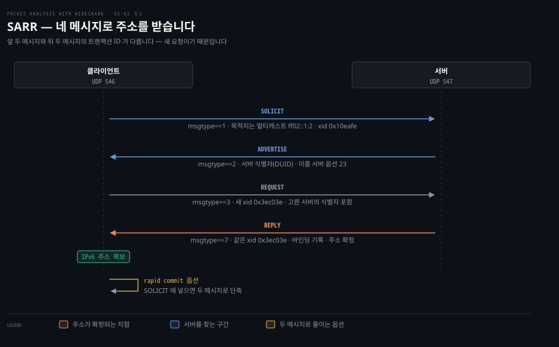
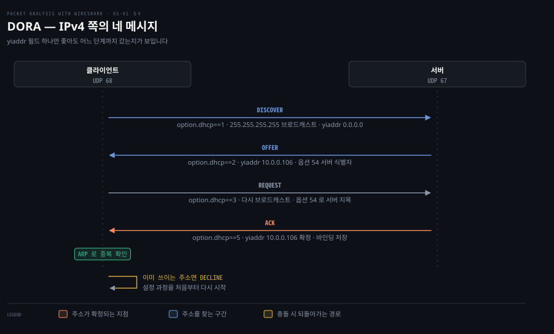

# 주소를 받아 오는 프로토콜

---

> 5장 전반부는 통신이 시작되기 전의 일을 다룹니다. 주소가 없으면 아무것도 못 하므로, 주소를 얻는 이 교환이 모든 캡처의 맨 앞에 옵니다.

## 핵심 요약

> 이 편이 매달린 하나의 생각은 **주소를 받는 절차가 IPv4 든 IPv6 든 "찾고 · 제안받고 · 고르고 · 확정받는" 네 걸음으로 같으며, 그래서 한쪽을 읽을 줄 알면 다른 쪽도 읽힌다**는 것입니다.

IPv6 쪽 이름은 SARR 이고 IPv4 쪽 이름은 DORA 입니다. `SOLICIT`·`ADVERTISE`·`REQUEST`·`REPLY` 와 `DISCOVER`·`OFFER`·`REQUEST`·`ACK` 가 한 걸음씩 짝을 이룹니다. 원문이 DHCPv6 메시지 표에 "동등한 DHCPv4 메시지" 열을 따로 둔 것도 그래서입니다.

다른 점은 주소를 모를 때 어디로 보내느냐입니다. IPv4 는 브로드캐스트(`255.255.255.255`)를 쓰고 IPv6 는 브로드캐스트가 없어 멀티캐스트(`ff02::1:2`)를 씁니다. 포트도 갈립니다. IPv4 는 서버 67·클라이언트 68, IPv6 는 서버 547·클라이언트 546 입니다.

캡처에서 이 교환을 찾는 일이 실무에서 자주 필요합니다. **주소를 못 받으면 그 뒤의 모든 조사가 무의미하고, 받았다면 몇 번째 메시지까지 갔는지가 어디서 막혔는지를 말해 줍니다.**


## 학습 목표

> 이 편을 읽고 나면 아래 다섯 가지를 스스로 해낼 수 있습니다.

1. DHCPv6 의 네 메시지와 DHCPv4 의 네 메시지를 짝지어 말할 수 있습니다.
2. 캡처에서 몇 번째 메시지까지 갔는지 보고 어디서 막혔는지 좁힐 수 있습니다.
3. `yiaddr` 필드 하나를 좇아 IPv4 주소 할당의 진행을 읽을 수 있습니다.
4. 두 메시지 교환이 언제 쓰이는지, rapid commit 이 무엇을 줄이는지 설명할 수 있습니다.
5. `dhclient` 로 필요한 메시지 종류를 직접 만들어 캡처할 수 있습니다.


## 1. 주소를 못 받으면 아무것도 안 됩니다

> DHCP 는 통신이 아니라 통신의 전제를 만드는 프로토콜입니다. 그래서 캡처의 맨 앞에 오고, 여기서 막히면 뒤가 전부 비어 있습니다.

### 아무 트래픽도 안 잡힐 때

캡처를 떴는데 조사하려던 통신이 하나도 없습니다. 애플리케이션 문제로 보이지만, 그 장비가 애초에 주소를 못 받았다면 나갈 패킷 자체가 없었던 것입니다. 그 경우 확인할 것은 애플리케이션이 아니라 캡처의 맨 앞입니다.

### DHCPv6 는 무엇을 나르나

원문은 DHCPv6 를 **"DHCPv6 클라이언트에게 IPv6 주소와 그 밖의 설정 정보를 제공하는 응용 계층 프로토콜"** 로 소개하고, 그 정보가 DHCPv6 옵션에 실려 온다고 적습니다. 그리고 성격을 둘로 나눕니다. **DHCPv6 는 상태 유지 주소 자동 설정 프로토콜이면서 동시에 무상태 주소 설정 프로토콜입니다.**

주소가 없는 상태에서 어떻게 서버를 찾는지가 이 프로토콜의 첫 문제입니다. 원문의 답은 이렇습니다. 클라이언트와 서버는 UDP 로 메시지를 주고받습니다. **클라이언트는 링크 로컬 주소를 쓰고, DHCPv6 는 링크 범위 멀티캐스트 주소로 메시지를 받습니다.** 서버가 같은 링크에 없으면 클라이언트 링크의 DHCPv6 릴레이 에이전트가 메시지를 중계합니다.

### 주소와 포트

| 대상 | 값 | 범위 |
|------|-----|------|
| 모든 DHCP 릴레이 에이전트와 서버 | `FF02::1:2` | 링크 로컬 |
| 모든 DHCPv6 서버 | `FF05::1:3` | 사이트 로컬 |
| 서버·릴레이 에이전트가 듣는 포트 | UDP `547` | |
| 클라이언트가 듣는 포트 | UDP `546` | |

포트를 확인하는 명령도 원문이 함께 줍니다.

```bash
netstat -an | grep 547
# udp  0  0 :::547  :::*
```

필터는 둘로 나뉩니다. 원문의 안내대로 **표시할 때는 `dhcpv6` 디스플레이 필터를, 잡을 때는 캡처 필터로 UDP 포트 547** 을 씁니다. 앞 편들에서 본 두 필터의 구분이 여기서도 그대로입니다.


## 2. 네 메시지로 주소를 받습니다

> SARR 은 주소를 새로 받을 때의 흐름입니다. 네 메시지가 각각 무엇을 확정하는지가 정해져 있습니다.



### 어느 메시지까지 갔는지 세는 일

주소를 못 받았을 때 캡처를 보면 메시지가 하나만 있거나 둘까지만 있습니다. 어디까지 갔는지가 곧 원인이므로, 네 걸음의 이름과 순서를 알아야 셀 수 있습니다.

### 원문의 메시지 종류 열셋

원문은 DHCPv6 메시지를 표로 정리하고 각각에 DHCPv4 의 동등한 메시지를 나란히 둡니다.

| DHCPv6 | 필터 | 하는 일 | IPv4 의 짝 |
|--------|------|---------|-----------|
| `SOLICIT` | `dhcpv6.msgtype == 1` | 클라이언트가 서버 그룹에 보냅니다 | `DHCPDISCOVER` |
| `ADVERTISE` | `== 2` | 서버가 SOLICIT 에 응답해 자기 가용성을 알립니다 | `DHCPOFFER` |
| `REQUEST` | `== 3` | 클라이언트가 IPv6 주소나 설정 파라미터를 담아 보냅니다 | `DHCPREQUEST` |
| `CONFIRM` | `== 4` | 이 링크에서 그 주소가 아직 유효한지 확인합니다 | `DHCPREQUEST` |
| `RENEW` | `== 5` | 수명이나 설정 파라미터를 갱신합니다 | `DHCPREQUEST` |
| `REBIND` | `== 6` | RENEW 응답을 못 받았을 때 보냅니다 | `DHCPREQUEST` |
| `REPLY` | `== 7` | 클라이언트가 보낸 모든 메시지에 대해 옵니다 | `DHCPACK` |
| `RELEASE` | `== 8` | 주소와 설정을 반납합니다 | `DHCPRELEASE` |
| `DECLINE` | `== 9` | 그 주소가 이미 쓰이고 있음을 알립니다 | `DHCPDECLINE` |
| `RECONFIGURE` | `== 10` | 서버가 설정이 바뀌었음을 알립니다 | 없음 |
| `INFORMATION-REQUEST` | `== 11` | 주소 할당 없이 설정만 요청합니다 | `DHCPINFORM` |
| `RELAY-FORWARD` | `== 12` | 릴레이가 서버로 전달합니다 | 없음 |
| `RELAY-REPLY` | `== 13` | 서버가 릴레이를 통해 클라이언트로 보냅니다 | 없음 |

오른쪽 열의 빈칸 셋이 IPv6 에만 있는 것들입니다. **`RECONFIGURE` 는 서버가 먼저 말을 거는 유일한 메시지이고, `RELAY-*` 둘은 서버가 다른 링크에 있을 때 쓰입니다.**

### 네 걸음이 각각 확정하는 것

원문은 `DHCPv6-Flow-SOLICIT.pcap` 으로 SARR 을 짚습니다. 위 그림이 그 흐름이고, 각 걸음이 담는 것은 이렇습니다.

**`SOLICIT`** 에서 클라이언트는 서버를 찾습니다. 목적지가 서버 주소가 아니라 멀티캐스트 `ff02::1:2` 라는 점이 핵심입니다. 담는 옵션은 셋입니다. 클라이언트 식별자(`dhcpv6.option.type == 1`), 받고 싶은 정보를 지정하는 ORO 옵션(`== 6`, 원문 예제에서는 이름 서버 정보), 그리고 비임시 주소 할당을 요청하는 IA_NA(`== 3`)입니다. 임시 주소가 필요하면 IA_TA 를 씁니다.

**`ADVERTISE`** 에서 서버가 자기를 알립니다. 원문은 여러 서버가 응답할 수 있고 클라이언트가 선호도에 따라 고른다고 적습니다. 서버가 담는 것은 자기 선호에 맞춘 IA_NA 값, 서버 식별자(`== 2`), 그리고 SOLICIT 이 요청한 이름 서버 정보(`== 23`)입니다.

서버 식별자 옵션에 원문이 붙이는 설명이 IPv4 와의 차이를 드러냅니다. **"서버 식별자 옵션은 DUID 를 나릅니다. DUID 는 DHCP Unique Identifier 이며 IPv6 에서의 호스트 식별자입니다. DHCPv4 의 경우 호스트 식별자는 MAC 주소입니다."**

**`REQUEST`** 에서 클라이언트가 서버 하나를 고릅니다. 원문이 짚는 것 셋입니다. 여전히 멀티캐스트로 보내고, **새 트랜잭션 ID(`0x3ec03e`)를 담으며**, 고른 서버의 식별자를 넣습니다.

**`REPLY`** 에서 서버가 확정합니다. 서버는 자기 정책과 설정에 따라 그 클라이언트를 위한 바인딩을 만들고, 요청받은 IA 와 정보를 기록한 뒤 `dhcpv6.msgtype == 7` 로 보냅니다. **트랜잭션 ID 는 REQUEST 의 것과 같아야 합니다.**

트랜잭션 ID 가 요청·응답 짝을 만드는 방식이 이 프로토콜을 읽는 열쇠입니다. **앞 두 메시지가 `0x10eafe`, 뒤 두 메시지가 `0x3ec03e` 로 다르다는 것은 REQUEST 가 SOLICIT 의 이어짐이 아니라 새 요청이라는 뜻입니다.**

> **원문 정오**: `ADVERTISE` 설명에서 서버와 클라이언트의 주소가 **둘 다 `fe80::f816:3eff:fe1d:e848`** 로 적혀 있습니다. 같은 링크에서 서버와 클라이언트가 같은 링크 로컬 주소를 가질 수 없습니다. 게다가 그 주소는 바로 앞 `SOLICIT` 설명에서 클라이언트 주소로 적힌 것과도 같습니다. 서버 주소 자리가 클라이언트 주소로 잘못 복사된 것으로 보입니다.


## 3. 두 메시지로 줄이는 경우

> 주소가 필요 없거나 이미 있는 경우에는 네 걸음이 필요 없습니다. 두 걸음으로 끝냅니다.

### 네 걸음이 늘 필요하지는 않습니다

DNS 서버 목록만 알고 싶은데 주소 할당 절차를 통째로 도는 것은 낭비입니다. 원문은 그런 경우를 두 메시지 교환으로 분류합니다.

### 언제 두 걸음인가

원문의 기준은 **"IP 주소 할당이 필요 없을 때, 또는 DHCPv6 클라이언트가 사용 가능한 DNS 서버나 NTP 서버 목록 같은 설정 정보를 얻고 싶을 때"** 입니다. 예로 `CONFIRM-REPLY` 와 `RELEASE-REPLY` 를 듭니다.

`INFORMATION-REQUEST`(`dhcpv6.msgtype == 11`)가 그 전형입니다. 원문의 설명대로 **주소가 아니라 설정만 요청할 때 클라이언트가 보냅니다.**

### rapid commit — 네 걸음을 두 걸음으로

원문이 특히 짚는 것은 rapid commit 옵션입니다. **"rapid commit 은 별도의 DHCPv6 메시지가 아니라 SOLICIT 의 옵션의 일부"** 라는 점이 중요합니다. 동작 규칙은 셋입니다.

- rapid commit 을 쓰려는 클라이언트는 보내는 SOLICIT 에 이 옵션을 넣습니다.
- rapid commit 옵션이 담긴 REPLY 를 받으면, 클라이언트는 추가 ADVERTISE 나 REPLY 를 기다리지 않고 즉시 처리해 그 안의 주소와 설정을 씁니다.
- 서버가 이 옵션을 지원하지 않으면 네 메시지 교환(SARR)으로 갑니다.

캡처에서 이것을 읽는 요령이 있습니다. **SOLICIT 다음에 ADVERTISE 없이 바로 REPLY 가 오면 rapid commit 이 쓰인 것입니다.** 두 메시지만 보이는 것이 실패가 아니라 정상일 수 있다는 뜻이라, 메시지 수만 세고 판단하면 안 됩니다.


## 4. IPv4 쪽의 DORA

> 이름과 주소 체계만 다르고 걸음 수와 역할은 같습니다. `yiaddr` 필드 하나가 진행을 알려 줍니다.



### IPv4 캡처에서 같은 것을 찾을 때

앞 절의 SARR 을 알면 DORA 는 이름만 바꿔 읽으면 됩니다. 원문이 붙이는 기억법이 그것입니다. **"`DISCOVER`·`OFFER`·`REQUEST`·`ACK` 교환이 주소 할당 중에 일어납니다. 기억법으로 DORA 라고 부릅니다."**

### 네 걸음이 담는 것

원문은 `DHCPv4.pcap` 으로 흐름을 짚습니다.

**`DISCOVER`**(`bootp.option.dhcp == 1`) — 클라이언트가 자기 로컬 물리 서브넷에 브로드캐스트(`255.255.255.255`)합니다. 옵션 55(파라미터 요청 목록, `bootp.option.type`)를 넣을 수 있습니다. **이 시점의 `yiaddr` 필드는 `bootp.ip.your == 0.0.0.0`** 입니다.

**`OFFER`**(`== 2`) — 서버가 쓸 수 있는 주소를 `yiaddr` 에 담아 응답합니다. 원문 예제에서는 `bootp.ip.your == 10.0.0.106` 입니다. 서버는 옵션 54(DHCP 서버 식별자)를 보내고 DISCOVER 의 옵션 55 가 요청한 다른 설정도 함께 줄 수 있습니다.

**`REQUEST`**(`== 3`) — 클라이언트가 다시 브로드캐스트합니다. **반드시 옵션 54 를 담아 어느 서버를 골랐는지 알려야 합니다.** 여러 서버가 OFFER 를 보냈을 수 있기 때문입니다.

**`ACK`**(`== 5`) — 서버가 설정 파라미터와 함께 확정합니다. 이때 `yiaddr` 이 최종 주소가 됩니다.

**진행을 읽는 요령은 `yiaddr` 하나입니다.** `0.0.0.0` 이면 아직 제안 전입니다. 값이 채워졌으면 제안 이후입니다. ACK 에 그 값이 있으면 확정입니다.

원문이 마지막에 붙이는 절차 하나가 앞 편들과 이어집니다. **클라이언트는 받은 설정을 검증하고 ARP 로 그 IPv4 주소를 다시 확인합니다. 다른 DHCP 클라이언트가 이미 쓰고 있으면 서버에 `DECLINE` 을 보내고 설정 과정을 다시 시작합니다.** 곧 캡처에 `DECLINE` 이 보인다면 주소 충돌이 있었다는 뜻입니다.

> **지금은 다릅니다 (4.6)**: 필터 접두사가 `bootp.` 에서 `dhcp.` 로 바뀌었습니다. Wireshark 3.0 릴리스 노트는 **"BOOTP 디섹터의 이름이 DHCP 로 바뀌었습니다. `bootp.dhcp` 를 제외하면 옛 `bootp.*` 디스플레이 필터 필드는 여전히 지원되지만 앞으로 제거될 수 있습니다"** 라고 적습니다.[^ws30] 새로 쓸 때는 `dhcp.option.dhcp == 1`·`dhcp.ip.your` 처럼 씁니다. 예외로 든 `bootp.dhcp` 는 호환에서 빠졌으므로 그 필드만은 반드시 바꿔야 합니다.


## 5. BOOTP 와 DHCP

> DHCP 는 BOOTP 를 대체한 것이 아니라 그 위에 얹힌 확장입니다. 그래서 필터 이름이 오래도록 `bootp` 였습니다.

### 왜 필터 이름이 bootp 였나

Wireshark 에서 DHCP 를 찾으려고 `dhcp` 를 쳤는데 안 나오던 시절이 있었습니다. 이유는 프로토콜의 역사에 있습니다.

### 원문의 대조표

원문의 설명이 관계를 정합니다. **"DHCP 는 BOOTP 메커니즘의 확장입니다. 달리 말해 DHCP 는 BOOTP 를 자기 전송 프로토콜로 씁니다. 이 동작 덕분에 기존 BOOTP 클라이언트는 초기화 소프트웨어를 바꾸지 않고도 DHCP 서버와 상호 운용됩니다."**

| 항목 | BOOTP | DHCP |
|------|-------|------|
| 뜻 | Bootstrap Protocol | Dynamic Host Configuration Protocol · BOOTP 의 확장 |
| 연도 | 1985 | 1993 |
| UDP 서버 포트 | 67 | 67 |
| UDP 클라이언트 포트 | 68 | 68 |
| 서비스 | IPv4 주소 할당 | 주소 할당 · 임대(lease) · 레거시 BOOTP 기능 지원 |
| 설정 파라미터 | 제한된 수의 vendor extensions | 더 크고 확장 가능한 options |
| RFC | RFC 951 | RFC 2131 |
| 현황 | DHCP 로 대체됨 | 활성 · 기능이 계속 추가됨 |

포트가 같다는 점이 상호 운용의 근거입니다. **같은 포트에서 같은 메시지 형식을 쓰되 DHCP 가 옵션을 더 얹은 구조라, 서버 하나가 양쪽 클라이언트를 모두 받을 수 있습니다.**

원문은 DHCPv4 에도 rapid commit 옵션이 있다고 덧붙입니다. **"DHCPv6 를 본떠 만들어졌으며, DHCPv4 클라이언트를 빠르게 설정하기 위해 두 메시지 교환을 씁니다."** 앞 절의 IPv6 rapid commit 과 같은 발상입니다.


## 6. 트래픽을 직접 만들어 보기

> 이 프로토콜은 마침 재현이 쉽습니다. 명령 한 줄로 원하는 메시지를 만들 수 있습니다.

### 캡처를 기다리지 않아도 됩니다

DHCP 교환은 부팅 때나 임대 갱신 때만 일어나므로 우연히 잡히기를 기다리기는 어렵습니다. 원문은 `dhclient` 로 원하는 메시지를 직접 만들라고 안내합니다.

### DHCPv6 쪽

원문의 전제는 둘입니다. DHCPv6 서버가 준비돼 있어야 하고(원문 예제는 ISC `dhcpd`), 캡처를 먼저 걸어 둡니다.

```bash
# 백그라운드로 IPv6 트래픽을 잡아 둡니다
tcpdump -i any ip6 -vv -w DHCPv6-FLOW.pcap -s0 &

dhclient -6 eth0        # 네 메시지 교환(SARR)
dhclient -6 -r eth0     # RELEASE
dhclient -S -6 eth0     # INFORMATION-REQUEST
```

> **노트의 읽기**: 원문은 `CONFIRM` 메시지를 잡는 명령으로도 `dhclient -6 eth0` 을 제시합니다. SARR 을 잡는 명령과 같은 줄이라, 이 명령만으로 `CONFIRM` 이 나온다고 읽기는 어렵습니다. `CONFIRM` 은 클라이언트가 이미 주소를 가진 채 링크가 바뀌었을 때 보내는 메시지이므로, 재현하려면 그 조건을 따로 만들어야 합니다.

### DHCPv4 쪽

원문은 플랫폼별로 셋을 제시합니다. 어느 쪽이든 Wireshark 캡처를 먼저 시작하고 끝에 멈춥니다.

```bash
# Windows — 명령 프롬프트에서
ipconfig /renew
ipconfig /release

# Linux — 인터페이스를 내렸다 올립니다
ifdown eth0:0
ifup eth0:0

# dhclient 로 DORA 한 번
dhclient -4 eth0
```

실습에서 걸리는 것이 하나 있습니다. **DHCP 는 브로드캐스트나 멀티캐스트로 오가므로 스위치 환경에서도 같은 세그먼트라면 남의 것까지 잡힙니다.** 앞 편들에서 유니캐스트를 보려면 TAP 이나 SPAN 이 필요했던 것과 다릅니다. 반대로 말하면 **다른 장비의 DHCP 실패도 내 자리에서 관찰할 수 있습니다.**


## 심화 학습

> 5장 전반부에서 바뀐 것은 필터 접두사와 참조 RFC 입니다. 메시지 흐름은 그대로입니다.

| 원문(2015) | 현행(2026) | 성격 |
|-----------|-----------|------|
| `bootp.*` 필터 | `dhcp.*`. `bootp.dhcp` 는 호환에서 제외[^ws30] | 바뀜 |
| DHCPv6 는 RFC 3315 | **RFC 8415** 가 폐기·대체[^rfc8415] | 바뀜 |
| `dhcpv6` 필터 | 그대로 | 유지 |
| 포트 546·547, 멀티캐스트 `ff02::1:2` | 그대로[^rfc8415] | 유지 |
| SARR · DORA 흐름 | 그대로 | 유지 |
| rapid commit 은 SOLICIT 의 옵션 | 그대로 | 유지 |
| DUID 가 IPv6 의 호스트 식별자 | 그대로 | 유지 |

RFC 8415 는 DHCPv6 를 이렇게 규정합니다. **"노드에 네트워크 설정 파라미터·IP 주소·프리픽스를 설정하는 확장 가능한 메커니즘. 파라미터는 무상태로 제공될 수도 있고, 하나 이상의 IPv6 주소 또는 프리픽스의 상태 유지 할당과 결합될 수도 있다."**[^rfc8415] 원문이 "상태 유지이면서 무상태"라고 적은 것과 같은 말입니다.

원문이 다루지 않는 축이 하나 있습니다. **IPv6 에는 DHCPv6 말고도 주소를 얻는 길이 하나 더 있다는 점**입니다. 라우터 광고를 받아 스스로 주소를 만드는 SLAAC 이고, 캡처에서는 ICMPv6 Router Advertisement 로 보입니다. **DHCPv6 교환이 아예 안 보이는데 장비가 IPv6 주소를 갖고 있다면 그쪽 경로를 봐야 합니다.**

```bash
# 주소 할당 관련 트래픽을 한 번에 — DHCPv6 와 라우터 광고를 함께
dhcpv6 || icmpv6.type == 134
```


## 결정 치트시트

> 캡처에서 몇 번째 메시지까지 갔는지로 원인을 좁힙니다.

| 캡처에 보이는 것 | 뜻 | 다음에 볼 것 |
|-----------------|-----|------------|
| `SOLICIT`·`DISCOVER` 만 반복 | 서버가 응답하지 않습니다 | 서버 기동 여부 · 릴레이 설정 · 같은 세그먼트인가 |
| `ADVERTISE`·`OFFER` 까지만 | 클라이언트가 고르지 못했습니다 | 클라이언트 로그 · 여러 서버의 충돌 |
| `REQUEST` 뒤 응답 없음 | 서버가 확정하지 못했습니다 | 서버의 주소 풀 소진 · 정책 |
| `DECLINE` 이 보임 | 주소 충돌입니다 | ARP 로 그 주소를 쓰는 장비 찾기 |
| `SOLICIT` → `REPLY` 두 개만 | rapid commit 입니다 | 정상. 실패가 아닙니다 |
| DHCP 가 아예 없는데 주소가 있음 | 정적 설정이거나 SLAAC 입니다 | `icmpv6.type == 134` |
| `RELAY-FORWARD`·`RELAY-REPLY` | 서버가 다른 링크에 있습니다 | 릴레이 에이전트 설정 |


## 면접 대비

### 한 줄 정의

"DHCP 는 주소를 모르는 장비가 브로드캐스트나 멀티캐스트로 서버를 찾아, 제안받고 고르고 확정받는 네 걸음의 교환이며, IPv4 에서는 DORA, IPv6 에서는 SARR 이라 부릅니다."

### 핵심 포인트 세 가지

1. **네 걸음의 역할이 양쪽에서 같습니다.** 찾기·제안·선택·확정이고, 이름만 `DISCOVER`/`SOLICIT`, `OFFER`/`ADVERTISE`, `REQUEST`/`REQUEST`, `ACK`/`REPLY` 로 다릅니다.
2. **주소를 모를 때 어디로 보내느냐가 갈립니다.** IPv4 는 브로드캐스트 `255.255.255.255`, IPv6 는 브로드캐스트가 없어 멀티캐스트 `ff02::1:2` 입니다. 포트도 67·68 과 547·546 으로 다릅니다.
3. **메시지 수만으로 성패를 판단하면 안 됩니다.** rapid commit 을 쓰면 두 개만 보이는 것이 정상이고, `DECLINE` 이 보이면 주소 충돌로 처음부터 다시 도는 중입니다.

### 자주 묻는 질문

Q: DHCP 교환이 캡처에 아예 없는데 장비는 IP 를 갖고 있습니다.
A: 정적 설정이거나, IPv6 라면 SLAAC 으로 라우터 광고를 받아 스스로 만들었을 수 있습니다. `icmpv6.type == 134` 로 라우터 광고를 확인합니다.

Q: `REQUEST` 를 왜 다시 브로드캐스트합니까? 서버를 이미 골랐는데요.
A: 고르지 못한 다른 서버들에게도 "나는 저 서버를 골랐다"를 알려 그들이 잡아 둔 주소를 풀게 하기 위해서입니다. 그래서 옵션 54 로 고른 서버를 반드시 지목해야 합니다.

Q: 필터에 `bootp` 를 쳤는데 안 먹습니다.
A: Wireshark 3.0 부터 디섹터 이름이 DHCP 로 바뀌었습니다. `dhcp` 로 쓰고, 필드도 `dhcp.option.dhcp` 처럼 씁니다.


## 핵심 개념 체크리스트

- [ ] SARR 과 DORA 의 네 걸음을 짝지어 말할 수 있습니까?
- [ ] IPv4 와 IPv6 가 서버를 찾는 방법이 어떻게 다른지 설명할 수 있습니까?
- [ ] `yiaddr` 값 하나로 할당이 어디까지 갔는지 판단할 수 있습니까?
- [ ] rapid commit 이 쓰인 캡처를 실패한 교환과 구분할 수 있습니까?
- [ ] DUID 와 MAC 주소가 각각 어느 쪽의 호스트 식별자인지 말할 수 있습니까?
- [ ] `dhclient` 로 RELEASE 와 INFORMATION-REQUEST 를 각각 만들 수 있습니까?


## 관련 문서

- [05-02 이름과 요청](./05-02.이름과 요청.md) — 이 편의 뒤. 주소를 받은 다음의 DNS 와 HTTP
- [04-02 열쇠와 실패](./04-02.열쇠와 실패.md) — 앞 장. TLS 의 키 교환과 복호화
- [Packet Analysis with Wireshark — 정독 인덱스](./README.md) — 7개 장 전체 지도


## 참고 자료

- 원본: 《Packet Analysis with Wireshark》 (Anish Nath, Packt Publishing, 2015) ISBN 978-1-78588-781-9
- 다룬 범위: Chapter 5 의 DHCPv6 · BOOTP/DHCP 절
- [RFC 8415 — DHCPv6](https://datatracker.ietf.org/doc/html/rfc8415) — RFC 3315 을 대체한 현행 명세
- [RFC 2131 — DHCP](https://tools.ietf.org/html/rfc2131) — 원문 References 가 가리키는 문서
- [IANA DHCPv6 파라미터](http://www.iana.org/assignments/dhcpv6-parameters/dhcpv6-parameters.xhtml) — 메시지 타입·옵션 번호의 정본

[^ws30]: Wireshark 3.0.0 릴리스 노트 — "The BOOTP dissector has been renamed to DHCP. With the exception of "bootp.dhcp", the old "bootp.\*" display filter fields are still supported but may be removed in a future release." <https://www.wireshark.org/docs/relnotes/wireshark-3.0.0.html> (2026-09-05 조회)

[^rfc8415]: RFC 8415 "Dynamic Host Configuration Protocol for IPv6 (DHCPv6)" — "This document obsoletes RFC 3315, RFC 3633, RFC 3736, RFC 4242, RFC 7083, RFC 7283, and RFC 7550." DHCPv6 는 "an extensible mechanism for configuring nodes with network configuration parameters, IP addresses, and prefixes. Parameters can be provided statelessly, or in combination with stateful assignment of one or more IPv6 addresses and/or IPv6 prefixes." <https://datatracker.ietf.org/doc/html/rfc8415> (2026-09-05 조회)
