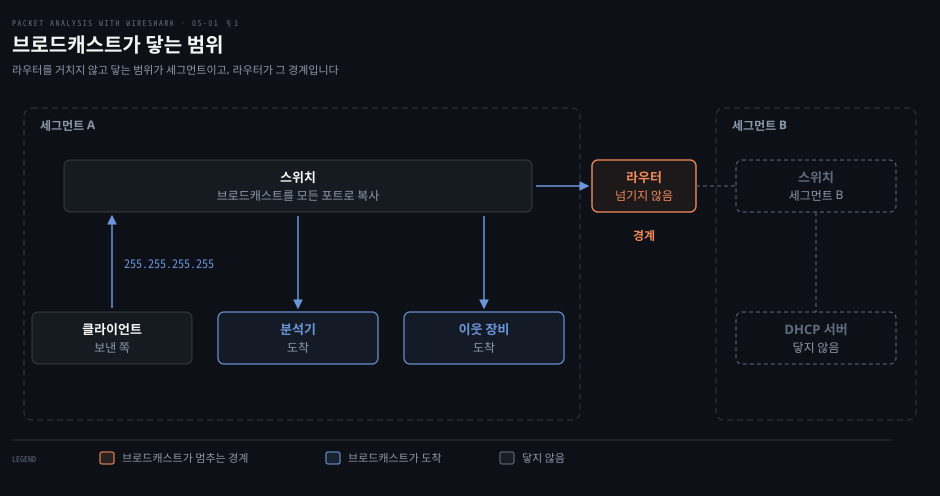
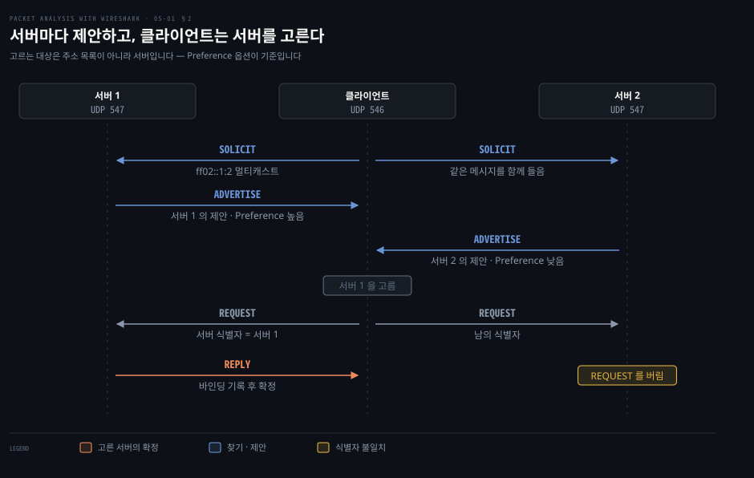
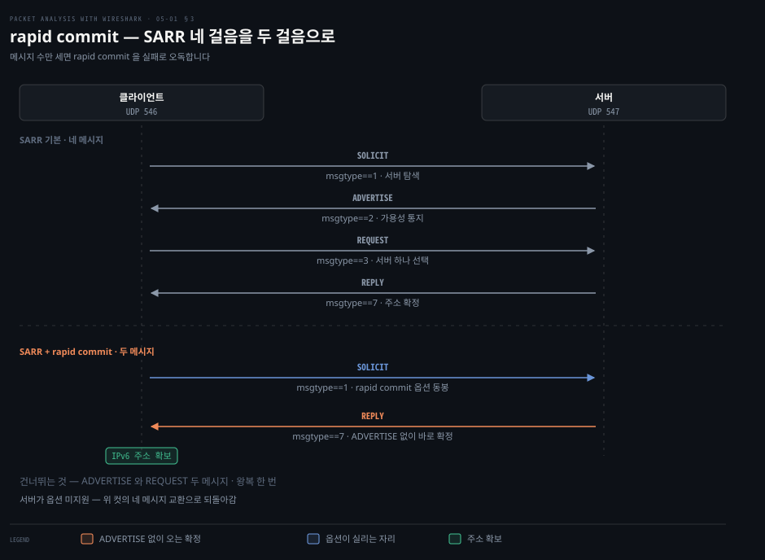
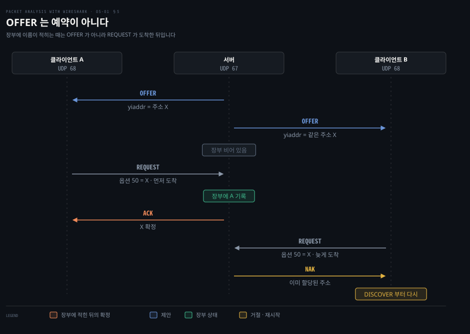
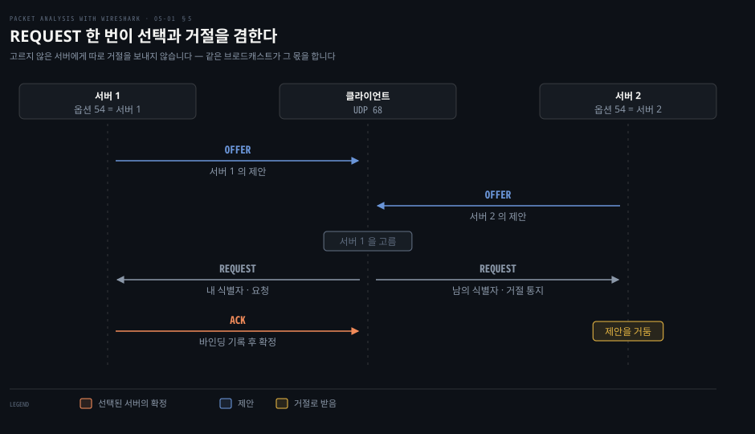
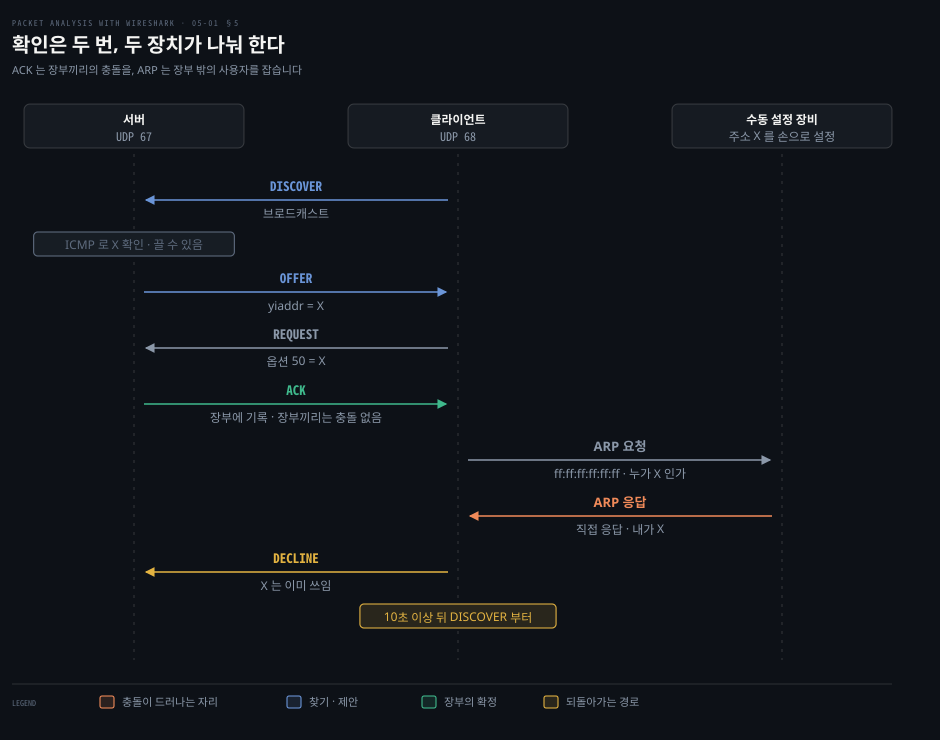
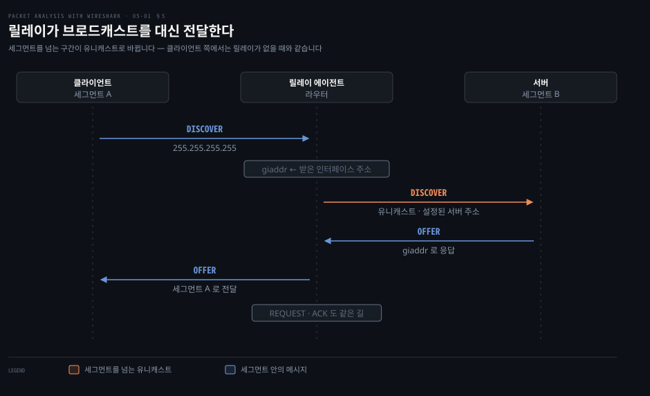
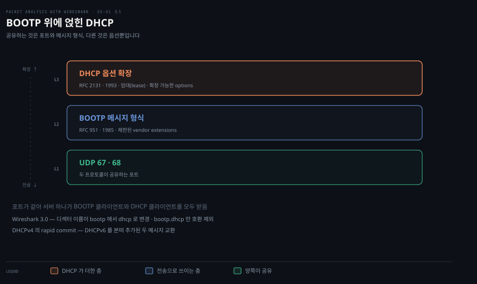
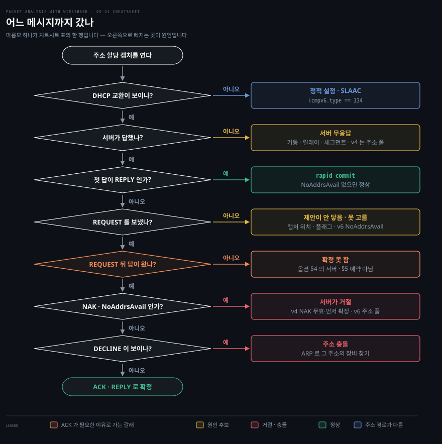

# 주소를 받아 오는 프로토콜

---

> 5장 전반부는 통신이 시작되기 전의 일을 다룹니다. 주소가 없으면 아무것도 못 하므로, 주소를 얻는 이 교환이 모든 캡처의 맨 앞에 옵니다.

## 핵심 요약

> 이 편이 매달린 하나의 생각은 주소를 받는 절차가 IPv4 든 IPv6 든 "찾고 · 제안받고 · 고르고 · 확정받는" **네 걸음**으로 같으며, 그래서 한쪽을 읽을 줄 알면 다른 쪽도 읽힌다는 것입니다.

두 이름은 네 메시지의 머리글자입니다. IPv4 쪽 **DORA** 는 Discover·Offer·Request·Ack 이고, IPv6 쪽 **SARR** 은 Solicit·Advertise·Request·Reply 입니다. 원문이 DHCPv6 메시지 표에 "동등한 DHCPv4 메시지" 열을 따로 둔 것도 두 이름이 한 걸음씩 짝을 이루기 때문입니다.

표의 위 네 줄은 같은 역할이 이름만 바뀐 자리이고, 아래 네 줄이 실제로 다른 자리입니다.

| 역할 | IPv4 — DORA | IPv6 — SARR |
|---|---|---|
| 찾기 | `DISCOVER` | `SOLICIT` |
| 제안 | `OFFER` | `ADVERTISE` |
| 선택 | `REQUEST` | `REQUEST` |
| 확정 | `ACK` | `REPLY` |
| 주소를 모를 때 목적지 | 브로드캐스트 `255.255.255.255` | 멀티캐스트 `ff02::1:2` (IPv6 에는 브로드캐스트가 없음) |
| 포트 (서버 · 클라이언트) | UDP 67 · 68 | UDP 547 · 546 |
| 호스트 식별자 | MAC 주소 | DUID |
| 거절 | `NAK` 메시지 | 상태 코드 NoAddrsAvail |

캡처에서 이 교환을 찾는 일이 실무에서 자주 필요합니다. 주소를 못 받으면 그 뒤의 모든 조사가 무의미하고, 받았다면 몇 번째 메시지까지 갔는지가 어디서 막혔는지를 말해 줍니다.


## 학습 목표

> 이 편을 읽고 나면 아래 다섯 가지를 스스로 해낼 수 있습니다.

1. DHCPv6 의 네 메시지와 DHCPv4 의 네 메시지를 짝지어 말할 수 있습니다.
2. 캡처에서 몇 번째 메시지까지 갔는지 보고 어디서 막혔는지 좁힐 수 있습니다.
3. `yiaddr` 필드 하나를 좇아 IPv4 주소 할당의 진행을 읽을 수 있습니다.
4. 두 메시지 교환이 언제 쓰이는지, rapid commit 이 무엇을 줄이는지 설명할 수 있습니다.
5. 서버가 여럿이거나 다른 세그먼트에 있을 때 누가 서버를 고르고 누가 대신 전달하는지 설명할 수 있습니다.

이 편에서 새로 만나는 낱말입니다. `어디서` 는 그 낱말이 실제로 설명되는 절입니다.

| 키워드 | 뜻 | 학습 포인트·연결 개념 | 어디서 |
|---|---|---|---|
| DHCPv6 | IPv6 주소를 받아 오는 프로토콜 | 주소를 모를 때 쓰므로 멀티캐스트로 시작 | §1 |
| SARR | DHCPv6 의 네 메시지 | Solicit·Advertise·Request·Reply | §2 |
| DORA | DHCPv4 의 네 메시지 | Discover·Offer·Request·Ack | §4 |
| rapid commit | 네 걸음을 두 걸음으로 줄임 | 왕복을 아낌 · 양쪽이 지원해야 | §3 |
| IA_NA | IPv6 비임시 주소를 담는 옵션 | Identity Association · 요청과 응답에 모두 실림 | §2 |
| 네트워크 세그먼트 | 라우터를 거치지 않고 닿는 범위 | 브로드캐스트가 닿는 곳 · TCP 세그먼트와 다른 말 | §1 |
| DHCPNAK | 서버가 REQUEST 를 거절하는 메시지 | 무응답과 다름 · IPv6 는 상태 코드로 | §5 |
| 릴레이 에이전트 | 다른 세그먼트의 서버로 대신 전달 | `giaddr` 로 세그먼트를 알림 · IPv6 는 봉투 메시지 | §1 · §5 |
| BOOTP | DHCP 의 전신 | 필터 이름이 `bootp` 였던 이유 | §6 |
| 자동 구성 (autoconfiguration) | 주소를 손으로 안 넣는 방식 | 못 받으면 아무 트래픽도 안 잡힘 | §1 |


## 1. 주소를 못 받으면 아무것도 안 됩니다

> DHCP 는 통신이 아니라 통신의 전제를 만드는 프로토콜입니다. 그래서 캡처의 맨 앞에 오고, 여기서 막히면 뒤가 전부 비어 있습니다.

### 아무 트래픽도 안 잡힐 때

캡처를 떴는데 조사하려던 통신이 하나도 없습니다. 애플리케이션 문제로 보이지만, 그 장비가 애초에 주소를 못 받았다면 나갈 패킷 자체가 없었던 것입니다. 그 경우 확인할 것은 애플리케이션이 아니라 캡처의 맨 앞입니다.

### 브로드캐스트가 닿는 범위가 네트워크 세그먼트입니다

주소가 없는 장비는 서버가 어디 있는지 모르므로 근처의 모두에게 묻습니다. 그 물음이 어디까지 닿는지를 알아야 이 편의 나머지가 읽힙니다.

이 편에서 **네트워크 세그먼트**는 라우터를 거치지 않고 프레임이 닿는 범위를 뜻합니다. [01-01 §4](./01-01.패킷%20분석기와%20Wireshark.md#4-무엇이-보이고-무엇이-안-보이는가--위치주소암호화)에서 본 대로 스위치는 브로드캐스트를 모든 포트로 복사합니다. 그런데 `255.255.255.255` 로 보낸 것은 연결된 물리 네트워크 밖으로 넘어가지 않습니다. 그러니 브로드캐스트가 닿는 범위가 곧 세그먼트이며 라우터가 그 경계입니다. 원문과 RFC 2131 은 이 범위를 "로컬 물리 서브넷"이라 부릅니다. DHCPv6 원문의 "링크"도 같은 범위입니다.

3장의 TCP 세그먼트와는 이름만 같은 다른 말입니다. TCP 세그먼트는 TCP 가 데이터를 잘라 담는 단위이고, 여기의 세그먼트는 네트워크의 범위입니다.



왼쪽 세그먼트 안에서는 클라이언트의 물음이 분석기와 이웃 장비에 모두 닿습니다. 라우터 너머의 서버에는 닿지 않습니다.

이 문제의 해결책은 **릴레이 에이전트**입니다. 라우터가 클라이언트의 브로드캐스트를 받아 설정해 둔 서버 주소로 대신 보내 주는 역할입니다. 동작은 네 걸음의 이름을 배운 뒤에야 읽히므로 [§5 의 릴레이 절](#서버가-다른-세그먼트에-있으면-릴레이-에이전트가-대신-전달합니다)에서 자세히 봅니다. 여기서는 세그먼트 밖 서버에는 브로드캐스트가 닿지 않는다는 문제만 기억하면 됩니다.

### 같은 세그먼트라면 남의 DHCP 도 내 캡처에 잡힙니다

세그먼트 경계는 캡처에서도 드러납니다. DHCP 는 브로드캐스트나 멀티캐스트로 오가므로, 스위치 환경에서도 같은 세그먼트라면 남의 장비가 주고받는 DHCP 까지 내 캡처에 잡힙니다. 유니캐스트를 보려면 TAP 이나 SPAN 이 필요했던 것과 다릅니다. 반대로 말하면 다른 장비의 DHCP 실패도 내 자리에서 관찰할 수 있습니다.

그 차이는 1장의 도식에 그대로 있습니다. 가운데 열이 분석기 자리이고, 브로드캐스트 줄은 그 칸까지 도착합니다. 남의 유니캐스트 줄은 그 칸에 오지 않습니다.


### DHCPv6 는 무엇을 나르고, 왜 UDP 멀티캐스트로 시작하나

원문은 DHCPv6 를 "DHCPv6 클라이언트에게 IPv6 주소와 그 밖의 설정 정보를 제공하는 응용 계층 프로토콜" 로 소개하고, 그 정보가 DHCPv6 옵션에 실려 온다고 적습니다. 그리고 성격을 둘로 나눕니다. DHCPv6 는 **상태 유지** 주소 자동 설정 프로토콜이면서 동시에 **무상태** 주소 설정 프로토콜입니다.

주소가 없는 상태에서 어떻게 서버를 찾는지가 이 프로토콜의 첫 문제입니다. 원문의 답은 세 줄이고, 각 줄이 그 문제의 한 조각을 풉니다.

1. 클라이언트와 서버는 UDP 로 메시지를 주고받습니다. TCP 는 데이터를 보내기 전에 상대 한 곳과 핸드셰이크로 연결을 맺어야 하는데(3장), 서버 주소를 모르는 클라이언트는 그 상대를 정할 수 없습니다. UDP 는 연결 없이 데이터그램을 바로 보내므로 목적지를 특정 서버가 아닌 그룹 주소로 둘 수 있습니다.
2. 클라이언트는 링크 로컬 주소를 출발지로 씁니다. 아직 받은 주소가 없어도 이 링크 안에서는 이 주소로 말할 수 있습니다.
3. 목적지는 링크 범위 멀티캐스트 주소 `ff02::1:2` 입니다. RFC 8415 는 이렇게 하는 이유를 "클라이언트가 DHCP 서버의 주소를 설정해 둘 필요가 없도록" 이라고 적습니다.[^rfc8415-udp]

멀티캐스트도 라우터를 넘지 않으므로 서버가 같은 링크에 없으면 위 세 줄만으로는 닿지 않습니다. 원문은 그때 클라이언트 링크의 DHCPv6 릴레이 에이전트가 메시지를 중계한다고 적습니다. 앞 절의 세그먼트 문제와 같은 문제이고 해결책도 같습니다.

### 주소와 포트

| 대상 | 값 | 범위 |
|------|-----|------|
| 모든 DHCP 릴레이 에이전트와 서버 | `FF02::1:2` | 링크 로컬 |
| 모든 DHCPv6 서버 | `FF05::1:3` | 사이트 로컬 |
| 서버·릴레이 에이전트가 듣는 포트 | UDP `547` | |
| 클라이언트가 듣는 포트 | UDP `546` | |

포트를 확인하는 명령도 원문이 함께 줍니다.

```bash
netstat -an | grep 547
# udp  0  0 :::547  :::*
```

필터는 둘로 나뉩니다. 원문의 안내대로 표시할 때는 `dhcpv6` 디스플레이 필터를, 잡을 때는 캡처 필터로 UDP 포트 547 을 씁니다. 앞 편들에서 본 두 필터의 구분이 여기서도 그대로입니다.


## 2. 네 메시지로 주소를 받습니다

> SARR 은 Solicit·Advertise·Request·Reply 네 메시지의 머리글자이고, IPv6 주소를 새로 받을 때의 흐름입니다. 네 메시지가 각각 무엇을 확정하는지가 정해져 있습니다.


### 어느 메시지까지 갔는지 세는 일

주소를 못 받았을 때 캡처를 보면 메시지가 하나만 있거나 둘까지만 있습니다. 어디까지 갔는지가 곧 원인이므로, 네 걸음의 이름과 순서를 알아야 셀 수 있습니다.

### 메시지 열셋 가운데 흐름의 뼈대는 넷입니다

원문은 DHCPv6 메시지 열셋을 표로 정리하고 각각에 DHCPv4 의 동등한 메시지를 나란히 둡니다. 처음 읽을 때는 SOLICIT·ADVERTISE·REQUEST·REPLY 네 줄만 보면 됩니다. 이 넷이 주소를 받는 흐름의 뼈대입니다. `INFORMATION-REQUEST` 는 §3, `RELAY-*` 둘은 §5 에서 다시 나오고, 나머지는 캡처에서 만났을 때 찾아보는 참고용입니다.

| DHCPv6 | 필터 | 하는 일 | IPv4 의 짝 |
|--------|------|---------|-----------|
| `SOLICIT` | `dhcpv6.msgtype == 1` | 클라이언트가 서버 그룹에 보냅니다 | `DHCPDISCOVER` |
| `ADVERTISE` | `== 2` | 서버가 SOLICIT 에 응답해 자기 가용성을 알립니다 | `DHCPOFFER` |
| `REQUEST` | `== 3` | 클라이언트가 IPv6 주소나 설정 파라미터를 담아 보냅니다 | `DHCPREQUEST` |
| `CONFIRM` | `== 4` | 이 링크에서 그 주소가 아직 유효한지 확인합니다 | `DHCPREQUEST` |
| `RENEW` | `== 5` | 수명이나 설정 파라미터를 갱신합니다 | `DHCPREQUEST` |
| `REBIND` | `== 6` | RENEW 응답을 못 받았을 때 보냅니다 | `DHCPREQUEST` |
| `REPLY` | `== 7` | 클라이언트가 보낸 모든 메시지에 대해 옵니다 | `DHCPACK` |
| `RELEASE` | `== 8` | 주소와 설정을 반납합니다 | `DHCPRELEASE` |
| `DECLINE` | `== 9` | 그 주소가 이미 쓰이고 있음을 알립니다 | `DHCPDECLINE` |
| `RECONFIGURE` | `== 10` | 서버가 설정이 바뀌었음을 알립니다 | 없음 |
| `INFORMATION-REQUEST` | `== 11` | 주소 할당 없이 설정만 요청합니다 | `DHCPINFORM` |
| `RELAY-FORWARD` | `== 12` | 릴레이가 서버로 전달합니다 | 없음 |
| `RELAY-REPLY` | `== 13` | 서버가 릴레이를 통해 클라이언트로 보냅니다 | 없음 |

오른쪽 열의 빈칸 셋이 IPv6 에만 있는 것들입니다. `RECONFIGURE` 는 서버가 먼저 말을 거는 유일한 메시지이고, `RELAY-*` 둘은 서버가 다른 링크에 있을 때 쓰입니다.

### 네 걸음이 각각 확정하는 것

원문은 `DHCPv6-Flow-SOLICIT.pcap` 으로 SARR 을 짚습니다. 위 그림이 그 흐름이고, 각 걸음이 담는 것은 이렇습니다.

**`SOLICIT`** 에서 클라이언트는 서버를 찾습니다. 목적지가 서버 주소가 아니라 멀티캐스트 `ff02::1:2` 라는 점이 핵심입니다. 담는 옵션은 셋입니다. 클라이언트 식별자(`dhcpv6.option.type == 1`), 받고 싶은 정보를 지정하는 ORO 옵션(`== 6`, 원문 예제에서는 이름 서버 정보), 그리고 비임시 주소 할당을 요청하는 IA_NA(`== 3`)입니다. 임시 주소가 필요하면 IA_TA 를 씁니다.

IA 는 Identity Association 의 줄임말입니다. RFC 8415 는 이것을 서버와 클라이언트가 관련된 IPv6 주소 묶음을 식별하고 관리하는 단위로 정의합니다.[^rfc8415-ia] 뒤에 붙은 NA 는 Non-temporary Addresses(비임시 주소), TA 는 Temporary Addresses(임시 주소)입니다. SOLICIT 의 IA_NA 는 이런 주소가 필요하다는 요청이고, ADVERTISE·REPLY 의 IA_NA 에는 서버가 정한 주소가 담겨 돌아옵니다.

**`ADVERTISE`** 에서 서버가 자기를 알립니다. 원문은 여러 서버가 응답할 수 있고 클라이언트가 선호도에 따라 고른다고 적습니다. 서버가 담는 것은 자기 선호에 맞춘 IA_NA 값, 서버 식별자(`== 2`), 그리고 SOLICIT 이 요청한 이름 서버 정보(`== 23`)입니다.

서버 식별자 옵션에 원문이 붙이는 설명이 IPv4 와의 차이를 드러냅니다. "서버 식별자 옵션은 DUID 를 나릅니다. DUID 는 DHCP Unique Identifier 이며 IPv6 에서의 호스트 식별자입니다. DHCPv4 의 경우 호스트 식별자는 MAC 주소입니다."

**`REQUEST`** 에서 클라이언트가 서버 하나를 고릅니다. 원문이 짚는 것은 셋입니다. 여전히 멀티캐스트로 보냅니다. **새 트랜잭션 ID**(`0x3ec03e`)를 담습니다. 고른 서버의 식별자를 넣습니다.

**`REPLY`** 에서 서버가 확정합니다. 서버는 자기 정책과 설정에 따라 그 클라이언트를 위한 바인딩을 만들고, 요청받은 IA 와 정보를 기록한 뒤 `dhcpv6.msgtype == 7` 로 보냅니다. 트랜잭션 ID 는 REQUEST 의 것과 같아야 합니다.

트랜잭션 ID 가 요청·응답 짝을 만드는 방식이 이 프로토콜을 읽는 열쇠입니다. 앞 두 메시지가 `0x10eafe`, 뒤 두 메시지가 `0x3ec03e` 로 다르다는 것은 REQUEST 가 SOLICIT 의 이어짐이 아니라 새 요청이라는 뜻입니다.

### 서버가 여럿이면 클라이언트가 서버 하나를 고릅니다

ADVERTISE 가 여러 개 올 수 있다는 원문의 한 줄은 "서버가 주소 목록을 주고 클라이언트가 그중 하나를 고른다"로 읽히기 쉽습니다. 고르는 대상은 주소가 아니라 서버입니다. SOLICIT 이 멀티캐스트라 링크의 서버가 모두 듣고, 서버마다 자기 ADVERTISE 로 제안합니다.

고르는 기준은 서버가 정합니다. 서버는 ADVERTISE 에 Preference 옵션으로 선호도 값을 실을 수 있고, RFC 8415 는 클라이언트가 이 값이 가장 높은 ADVERTISE 를 우선하라(SHOULD)고 정합니다. 다만 제안한 설정이 더 나은 서버라면 선호도가 낮아도 고를 수 있습니다(MAY).[^rfc8415-pref]



원문 캡처에는 서버가 하나뿐이라, 그림의 서버 2 는 구조를 보이기 위한 예시입니다. 고른 결과는 REQUEST 에 그 서버의 식별자를 넣는 것으로 드러납니다. REQUEST 도 멀티캐스트라 두 서버가 모두 받습니다. 식별자가 자기 DUID 와 다른 서버는 그 REQUEST 를 버립니다.[^rfc8415-discard]

IPv4 도 같은 구조입니다. OFFER 의 `yiaddr` 필드는 4바이트 하나라 OFFER 하나에는 주소 하나만 실립니다. 클라이언트는 여러 OFFER 를 보고 서버 하나를 고릅니다.[^rfc2131-choose] IPv4 에서 고른 결과를 알리는 방법은 [§5](#request-한-번의-브로드캐스트가-선택과-거절을-겸합니다)에서 봅니다.

> **원문 정오**: `ADVERTISE` 설명에서 서버와 클라이언트의 주소가 둘 다 `fe80::f816:3eff:fe1d:e848` 로 적혀 있습니다. 같은 링크에서 서버와 클라이언트가 같은 링크 로컬 주소를 가질 수 없습니다. 게다가 그 주소는 바로 앞 `SOLICIT` 설명에서 클라이언트 주소로 적힌 것과도 같습니다. 서버 주소 자리가 클라이언트 주소로 잘못 복사된 것으로 보입니다.


## 3. 두 메시지로 줄이는 경우

> 주소가 필요 없거나 이미 있는 경우에는 네 걸음이 필요 없습니다. 두 걸음으로 끝냅니다.



### 네 걸음이 늘 필요하지는 않습니다

DNS 서버 목록만 알고 싶은데 주소 할당 절차를 통째로 도는 것은 낭비입니다. 원문은 그런 경우를 두 메시지 교환으로 분류합니다.

### 언제 두 걸음인가

원문의 기준은 "IP 주소 할당이 필요 없을 때, 또는 DHCPv6 클라이언트가 사용 가능한 DNS 서버나 NTP 서버 목록 같은 설정 정보를 얻고 싶을 때" 입니다. 예로 `CONFIRM-REPLY` 와 `RELEASE-REPLY` 를 듭니다.

`INFORMATION-REQUEST`(`dhcpv6.msgtype == 11`)가 그 전형입니다. 원문의 설명대로 주소가 아니라 설정만 요청할 때 클라이언트가 보냅니다.

### rapid commit — 네 걸음을 두 걸음으로

원문이 특히 짚는 것은 rapid commit 옵션입니다. "rapid commit 은 별도의 DHCPv6 메시지가 아니라 SOLICIT 의 옵션의 일부" 라는 점이 중요합니다. 동작 규칙은 셋입니다.

- rapid commit 을 쓰려는 클라이언트는 보내는 SOLICIT 에 이 옵션을 넣습니다.
- rapid commit 옵션이 담긴 REPLY 를 받으면, 클라이언트는 추가 ADVERTISE 나 REPLY 를 기다리지 않고 즉시 처리해 그 안의 주소와 설정을 씁니다.
- 서버가 이 옵션을 지원하지 않으면 네 메시지 교환(SARR)으로 갑니다.

위 도식은 IPv6(SARR) 기준입니다. IPv4(DORA) 에도 같은 발상의 rapid commit 옵션이 있고, 원문은 그것을 [§6](#6-bootp-와-dhcp) 끝에서 덧붙입니다.

캡처에서 이것을 읽는 요령이 있습니다. SOLICIT 다음에 ADVERTISE 없이 바로 REPLY 가 오면 **rapid commit** 이 쓰인 것입니다. 두 메시지만 보이는 것이 실패가 아니라 정상일 수 있다는 뜻이라, 메시지 수만 세고 판단하면 안 됩니다.


## 4. IPv4 쪽의 DORA

> 이름과 주소 체계만 다르고 걸음 수와 역할은 같습니다. `yiaddr` 필드 하나가 진행을 알려 줍니다.


### IPv4 캡처에서 같은 것을 찾을 때

앞 절의 SARR 을 알면 DORA 는 이름만 바꿔 읽으면 됩니다. 원문이 붙이는 기억법이 그것입니다. "`DISCOVER`·`OFFER`·`REQUEST`·`ACK` 교환이 주소 할당 중에 일어납니다. 기억법으로 DORA 라고 부릅니다." 네 메시지 Discover·Offer·Request·Ack 의 머리글자입니다.

### 네 걸음이 담는 것

원문은 `DHCPv4.pcap` 으로 흐름을 짚습니다. 원문은 필터를 `bootp.` 접두사로 적었는데, 현행 4.6 에서는 `dhcp.` 로 바뀌었습니다. Wireshark 3.0 릴리스 노트는 "BOOTP 디섹터의 이름이 DHCP 로 바뀌었습니다. `bootp.dhcp` 를 제외하면 옛 `bootp.*` 디스플레이 필터 필드는 여전히 지원되지만 앞으로 제거될 수 있습니다" 라고 적습니다.[^ws30]

그래서 아래 필드는 새로 쓸 이름인 `dhcp.` 로 옮겼습니다. 예외로 든 `bootp.dhcp` 는 호환에서 빠졌으므로 그 필드만은 반드시 바꿔야 합니다.

**`DISCOVER`**(`dhcp.option.dhcp == 1`) — 클라이언트가 자기 로컬 물리 서브넷에 브로드캐스트(`255.255.255.255`)합니다. 옵션 55(파라미터 요청 목록, `dhcp.option.type`)를 넣을 수 있습니다. 이 시점의 `yiaddr` 필드는 `dhcp.ip.your == 0.0.0.0` 입니다.

DISCOVER 는 IP 헤더의 출발지 주소도 `0.0.0.0` 입니다. 원문에는 없는 내용으로, RFC 2131 은 주소를 얻기 전에 클라이언트가 브로드캐스트하는 DHCP 메시지의 출발지 주소를 0 으로 둔다고 정합니다.[^rfc2131-src] 뒤의 REQUEST 도 같은 처지라, 캡처에서 `ip.src == 0.0.0.0` 로 두 메시지를 함께 골라낼 수 있습니다.

**`OFFER`**(`== 2`) — 서버가 쓸 수 있는 주소를 `yiaddr` 에 담아 응답합니다. 원문 예제에서는 `dhcp.ip.your == 10.0.0.106` 입니다. 서버는 옵션 54(DHCP 서버 식별자)를 보내고 DISCOVER 의 옵션 55 가 요청한 다른 설정도 함께 줄 수 있습니다.

**`REQUEST`**(`== 3`) — 클라이언트가 다시 브로드캐스트합니다. 반드시 옵션 54 를 담아 어느 서버를 골랐는지 알려야 합니다. 여러 서버가 OFFER 를 보냈을 수 있기 때문입니다. 원문은 이어서 REQUEST 에서 선택된 서버가 그 클라이언트의 바인딩을 저장소에 기록하고 ACK 로 응답한다고 적습니다.

고른 주소는 `yiaddr` 가 아니라 옵션 50(요청 IP 주소, `dhcp.option.requested_ip_address`)에 실립니다. 원문에는 없는 내용입니다. RFC 2131 은 이 옵션을 OFFER 의 `yiaddr` 값으로 채우라고 정하고, 클라이언트가 보내는 REQUEST 의 `yiaddr` 는 0 으로 둡니다.[^rfc2131-req]

**`ACK`**(`== 5`) — 서버가 설정 파라미터와 함께 확정합니다. 이때 `yiaddr` 이 최종 주소가 됩니다.

진행을 읽는 요령은 서버가 보낸 메시지의 `yiaddr` 하나입니다. 클라이언트가 보내는 DISCOVER·REQUEST 에서는 늘 `0.0.0.0` 이므로 이 값은 서버 쪽에서만 읽습니다. OFFER 에 값이 있으면 제안까지 왔고, ACK 에 같은 값이 있으면 확정입니다. 그 사이 REQUEST 가 어느 주소를 골랐는지는 옵션 50 이 알려 줍니다.

원문이 마지막에 붙이는 절차 하나가 앞 편들과 이어집니다. 클라이언트는 받은 설정을 검증하고 ARP 로 그 IPv4 주소를 다시 확인합니다. 다른 DHCP 클라이언트가 이미 쓰고 있으면 서버에 `DECLINE` 을 보내고 설정 과정을 다시 시작합니다. 곧 캡처에 `DECLINE` 이 보인다면 주소 충돌이 있었다는 뜻입니다.

> **노트의 읽기**: 원문은 ARP 가 잡는 상대를 "다른 DHCP 클라이언트"로 적습니다. RFC 2131 은 쓰는 쪽을 가리지 않고 "이미 쓰이는 주소"라고만 적습니다.[^rfc2131-arp] 서버 장부에 없는 장비도 ARP 에 걸린다는 뜻이며, 이 차이는 §5 의 확인 절에서 다시 봅니다.


## 5. 제안에서 확정까지 — 예약·거절·확인·중계

> OFFER 는 주소를 붙잡아 두지 않습니다. 확정은 ACK 가, 거절은 NAK 이, 마지막 확인은 클라이언트의 ARP 가 맡습니다.

DORA 의 네 이름을 알아도 "왜 네 걸음이어야 하나"는 따로 물어야 풀립니다. 이 절은 원문이 짧게 넘어간 다섯 자리를 RFC 원문으로 채웁니다. OFFER 가 예약이 아니라는 것, REQUEST 한 번이 선택과 거절을 겸하는 방식, 거절 메시지, 두 장치가 나눠 하는 확인, 세그먼트 밖 서버로 가는 중계입니다. 다섯 소절은 서로 기대지 않으므로 필요한 것만 골라 읽어도 됩니다.

### OFFER 는 예약이 아닙니다 — ACK 가 확정하는 이유

OFFER 를 받은 순간 주소가 내 것이 된다고 읽기 쉽습니다. 그렇게 보면 뒤의 REQUEST·ACK 두 걸음은 군더더기입니다. 실제로는 OFFER 가 예약이 아니어서 두 걸음이 필요합니다.

RFC 2131 은 "서버는 제안한 주소를 예약해 둘 필요가 없다"고 적습니다.[^rfc2131-offer] 다른 클라이언트에게 주지 않으면 더 효율적일 뿐이고, 제안한 주소를 잠시 비워 두는 것은 서버의 선택입니다. 장부에 이름이 적히는 때는 그 뒤입니다. 원문과 RFC 모두 REQUEST 에서 선택된 서버가 바인딩을 저장소에 기록하고 ACK 로 응답한다고 적습니다.

그래서 서버가 같은 주소를 두 클라이언트에게 차례로 제안하는 일이 생길 수 있습니다. 둘 다 그 주소로 REQUEST 를 보내면, 먼저 도착한 쪽이 장부에 적히고 ACK 를 받습니다. 늦은 쪽은 이미 할당된 주소를 요청한 셈이라 NAK 을 받습니다.



클라이언트 B 는 A 와 같은 제안을 받았지만 장부에 적히지 못했습니다. ACK 는 "장부에 적었다"는 확인이고, 이 확인을 받기 전까지 클라이언트는 그 주소를 자기 것으로 쓰지 않습니다. NAK 을 받은 B 는 찾기부터 다시 시작합니다.

### REQUEST 한 번의 브로드캐스트가 선택과 거절을 겸합니다

서버가 둘이면 OFFER 도 둘 옵니다. 클라이언트는 하나를 골라 옵션 54 에 그 서버의 식별자를 넣고 REQUEST 를 한 번만 브로드캐스트합니다. 고르지 않은 서버에게 따로 거절을 보내지 않습니다.

RFC 2131 은 선택되지 않은 서버들이 이 REQUEST 를 "클라이언트가 자기 제안을 거절했다는 통지로 쓴다"고 적습니다.[^rfc2131-select] 같은 메시지가 선택된 서버에는 요청이고 나머지 서버에는 거절 통지입니다. 브로드캐스트라서 가능한 일입니다.



오른쪽 서버는 옵션 54 에서 자기 식별자를 찾지 못하고 제안을 거둡니다. 캡처에서 OFFER 는 둘인데 ACK 가 하나뿐이라면 이 흐름입니다.

### 거절은 DHCPNAK 로 옵니다 — 응답이 없는 것과 다릅니다

주소를 줄 수 없을 때 서버가 알리는 방법은 단계마다 다릅니다. 원문 표는 ACK(5)에서 끝나지만 DHCPv4 에는 거절 메시지 **DHCPNAK**(메시지 종류 6, `dhcp.option.dhcp == 6`)이 있습니다.[^rfc2132-type] RFC 2131 은 선택된 서버가 REQUEST 를 들어줄 수 없을 때, 예를 들어 요청된 주소가 이미 할당됐을 때 NAK 로 응답해야 한다고 정합니다. NAK 을 받은 클라이언트는 설정 과정을 처음부터 다시 시작합니다.[^rfc2131-nak]

여기의 ACK·NAK 은 TCP 헤더의 ACK 와 이름만 같습니다. TCP 의 ACK 는 전송 계층이 바이트를 받았다고 알리는 헤더 플래그입니다. DHCP 의 ACK·NAK 은 응용 계층의 메시지 종류입니다. DHCP 는 UDP 위에서 돕니다. RFC 768 은 UDP 가 전달을 보장하지 않는다고 적습니다.[^rfc768] 그래서 DHCP 는 확정과 거절을 스스로 정의했습니다. 둘은 옵션 53(DHCP 메시지 종류)의 값 5 와 6 으로 구분됩니다.

DISCOVER 단계에는 거절 메시지가 없습니다. RFC 2131 이 DISCOVER 에 답하는 서버 메시지로 두는 것은 OFFER 하나이고, 그마저 서버가 보낼 수 있다(may)는 표현입니다. 클라이언트는 OFFER 를 하나도 못 받으면 시간이 지난 뒤 DISCOVER 를 다시 보냅니다.[^rfc2131-retx] 그래서 줄 주소가 없는 IPv4 서버는 캡처에서 거절이 아니라 반복되는 DISCOVER 로 보입니다.

DHCPv6 에는 거절 전용 메시지가 없습니다. 대신 서버가 REPLY 의 IA 옵션 안에 상태 코드 NoAddrsAvail(값 2, `dhcpv6.status_code == 2`)을 실어 줄 주소가 없다고 알립니다. IPv4 와 다른 점은 이 표시가 ADVERTISE 에도 실린다는 것입니다. RFC 8415 는 뒤따를 REQUEST 에도 주소를 줄 수 없는 서버가 ADVERTISE 의 IA 에 NoAddrsAvail 을 담아야 한다(MUST)고 정합니다.[^rfc8415-status] IPv6 에서는 제안 단계의 거절도 캡처에 남습니다.

### 주소 확인은 서버의 ICMP 와 클라이언트의 ARP 로 나뉩니다

§4 끝의 "ARP 로 다시 확인"은 전제 하나를 깔고 있습니다. ARP 요청은 MAC 브로드캐스트(`ff:ff:ff:ff:ff:ff`)로 나갑니다. RFC 826 은 주소를 묻는 장비가 요청을 "케이블 위의 모두에게" 브로드캐스트하고, 그 주소의 주인만 브로드캐스트가 아닌 직접 응답을 돌려준다고 적습니다.[^rfc826] 그러니 방금 받은 주소를 ARP 로 물었는데 응답이 오면, 세그먼트 안 누군가가 이미 그 주소를 쓰고 있는 것입니다.

확인은 한 번이 아니라 두 번이고 두 장치가 나눠 합니다. RFC 2131 은 서버가 새 주소를 할당할 때 OFFER 전에 그 주소가 쓰이지 않는지 확인하라(SHOULD)고 정하고, 예로 ICMP Echo Request 를 듭니다. 관리자가 이 확인을 끌 수 있게 구현하라는 조항도 함께 둡니다.[^rfc2131-probe] 클라이언트는 ACK 를 받은 뒤 ARP 로 마지막 확인을 합니다.



두 확인과 ACK 는 서로 다른 사고를 막습니다. ACK 가 막는 것은 장부끼리의 충돌입니다. 같은 주소를 두 클라이언트에게 제안해도 장부에 먼저 적힌 쪽만 확정되기 때문입니다. ARP 가 잡는 것은 장부 밖의 사용자입니다. 누군가 그 주소를 손으로 설정해 두었다면 서버 장부에는 없고, 서버의 ICMP 확인은 꺼져 있을 수 있습니다. 마지막 그물은 클라이언트의 ARP 입니다.

충돌을 찾은 클라이언트는 서버에 DECLINE 을 보내고 찾기부터 다시 시작합니다. RFC 2131 은 다시 시작하기 전에 최소 10초를 기다리라(SHOULD)고 정합니다.[^rfc2131-arp] 충돌이 되풀이될 때 트래픽이 폭주하지 않게 하려는 것입니다.

### 서버가 다른 세그먼트에 있으면 릴레이 에이전트가 대신 전달합니다

§1 에서 본 대로 클라이언트의 DISCOVER 는 라우터에서 멈춥니다. 서버를 세그먼트마다 둘 수 없다면 누군가 그 물음을 서버까지 옮겨야 합니다. DHCPv6 쪽은 원문이 `RELAY-FORWARD`·`RELAY-REPLY` 로 다뤘지만, DHCPv4 쪽 중계는 원문에 없습니다.

세그먼트마다 DHCP 서버를 두면 문제는 사라지지만, 서버가 세그먼트 수만큼 늘고 주소 풀도 그만큼 흩어집니다. 서버 한 대가 여러 세그먼트를 맡으려면 브로드캐스트를 서버까지 옮겨 줄 장치가 있어야 합니다.

RFC 2131 은 그 장치인 릴레이 에이전트를 "DHCP 클라이언트와 서버 사이에서 DHCP 메시지를 넘겨주는 인터넷 호스트 또는 라우터"로 정의하고, DHCP 가 BOOTP 의 릴레이 동작을 그대로 쓴다고 적습니다.[^rfc2131-relay] 라우터가 이 일을 맡으면 브로드캐스트가 멈추는 바로 그 자리에서 전달이 일어납니다. 관리자는 라우터에 전달할 서버 주소를 설정해 둡니다. RFC 1542 는 이 목적지를 설정 가능한 IP 주소 목록으로 두라고 권합니다.[^rfc1542-dest]

릴레이가 끼면 DISCOVER 한 통은 다섯 단계를 거칩니다.

1. 클라이언트가 DISCOVER 를 브로드캐스트하고, 같은 세그먼트에 있는 라우터 인터페이스가 이것을 받습니다.
2. 릴레이는 `giaddr`(릴레이 에이전트 IP 주소, `dhcp.ip.relay`)이 0 이면 요청이 들어온 인터페이스의 주소를 적습니다. `hops`(메시지가 거친 릴레이 수) 필드는 1 늘리고 나머지 필드는 그대로 둡니다.[^rfc1542-giaddr]
3. 릴레이는 설정된 서버 주소로 유니캐스트합니다. 목적지가 서버 한 대의 주소라 라우터를 넘어갈 수 있습니다.
4. 서버는 `giaddr` 로 요청이 어느 세그먼트에서 왔는지 알고 그 세그먼트의 주소 풀에서 주소를 고릅니다. 응답은 `giaddr` 에 적힌 릴레이의 67번 포트로 보냅니다.[^rfc2131-giaddr]
5. 릴레이는 `giaddr` 로 응답을 내보낼 인터페이스를 정하고 클라이언트에게 내려 줍니다. 이때 BROADCAST 플래그를 봅니다. 주소가 설정되기 전에는 유니캐스트를 받지 못하는 클라이언트가 DISCOVER·REQUEST 의 `flags` 필드에 켜 두는 비트입니다.[^rfc2131-bcast] 켜져 있으면 `255.255.255.255` 로, 꺼져 있으면 `yiaddr` 와 클라이언트 MAC(`chaddr`)으로 유니캐스트합니다.[^rfc1542-reply]



`giaddr` 하나가 두 가지 일을 합니다. 서버에게는 어느 세그먼트의 주소를 줄지 알려 주고, 릴레이에게는 응답을 어느 인터페이스로 내보낼지 알려 줍니다. `hops` 는 릴레이가 여러 단 이어질 때를 대비한 계수기입니다. RFC 1542 는 `hops` 가 16 을 넘은 요청을 버리라고 정합니다.

DHCPv6 릴레이는 방식이 다릅니다. 필드를 고쳐 쓰는 대신 받은 메시지를 통째로 새 `RELAY-FORWARD` 메시지의 Relay Message 옵션에 싸서 보냅니다.[^rfc8415-relay] §2 표에서 IPv6 에만 있던 `RELAY-FORWARD`·`RELAY-REPLY` 가 그 봉투입니다. IPv4 는 BOOTP 시절부터 있던 `giaddr`·`hops` 필드를 쓰므로 릴레이용 메시지 종류가 따로 없습니다.

캡처 자리에 따라 보이는 것이 다릅니다. 클라이언트 세그먼트에서 잡으면 릴레이가 없을 때와 같은 교환이 보입니다. 서버 쪽에서 잡으면 `giaddr` 이 채워진 유니캐스트가 릴레이와 서버 사이를 오갑니다.


## 6. BOOTP 와 DHCP

> DHCP 는 BOOTP 를 대체한 것이 아니라 그 위에 얹힌 확장입니다. 그래서 필터 이름이 오래도록 `bootp` 였습니다.



### 왜 필터 이름이 bootp 였나

Wireshark 에서 DHCP 를 찾으려고 `dhcp` 를 쳤는데 안 나오던 시절이 있었습니다. 이유는 프로토콜의 역사에 있습니다.

### 원문의 대조표

원문의 설명이 관계를 정합니다. "DHCP 는 BOOTP 메커니즘의 확장입니다. 달리 말해 DHCP 는 BOOTP 를 자기 전송 프로토콜로 씁니다. 이 동작 덕분에 기존 BOOTP 클라이언트는 초기화 소프트웨어를 바꾸지 않고도 DHCP 서버와 상호 운용됩니다."

| 항목 | BOOTP | DHCP |
|------|-------|------|
| 뜻 | Bootstrap Protocol | Dynamic Host Configuration Protocol · BOOTP 의 확장 |
| 연도 | 1985 | 1993 |
| UDP 서버 포트 | 67 | 67 |
| UDP 클라이언트 포트 | 68 | 68 |
| 서비스 | IPv4 주소 할당 | 주소 할당 · 임대(lease) · 레거시 BOOTP 기능 지원 |
| 설정 파라미터 | 제한된 수의 vendor extensions | 더 크고 확장 가능한 options |
| RFC | RFC 951 | RFC 2131 |
| 현황 | DHCP 로 대체됨 | 활성 · 기능이 계속 추가됨 |

포트가 같다는 점이 상호 운용의 근거입니다. 같은 포트에서 같은 메시지 형식을 쓰되 DHCP 가 옵션을 더 얹은 구조라, **서버 하나가 양쪽 클라이언트를 모두** 받을 수 있습니다.

원문은 DHCPv4 에도 rapid commit 옵션이 있다고 덧붙입니다. "DHCPv6 를 본떠 만들어졌으며, DHCPv4 클라이언트를 빠르게 설정하기 위해 두 메시지 교환을 씁니다." 앞 절의 IPv6 rapid commit 과 같은 발상입니다.


## 심화 학습

> 원문이 참조한 DHCPv6 명세는 새 RFC 로 바뀌었고, 메시지 흐름·포트·필터는 그대로입니다. 원문이 다루지 않는 SLAAC 경로도 함께 봅니다.

원문이 참조한 DHCPv6 명세 RFC 3315 는 **RFC 8415** 가 폐기하고 대체했습니다.[^rfc8415] `dhcpv6` 필터, 포트 546·547, 멀티캐스트 `ff02::1:2`, SARR·DORA 흐름, SOLICIT 의 rapid commit 옵션, IPv6 호스트 식별자인 DUID 는 모두 그대로입니다.

RFC 8415 는 DHCPv6 를 이렇게 규정합니다. "노드에 네트워크 설정 파라미터·IP 주소·프리픽스를 설정하는 확장 가능한 메커니즘. 파라미터는 무상태로 제공될 수도 있고, 하나 이상의 IPv6 주소 또는 프리픽스의 상태 유지 할당과 결합될 수도 있다."[^rfc8415] 원문이 "상태 유지이면서 무상태"라고 적은 것과 같은 말입니다.

원문이 다루지 않는 축이 하나 있습니다. IPv6 에는 DHCPv6 말고도 주소를 얻는 길이 하나 더 있다는 점입니다. 라우터 광고를 받아 스스로 주소를 만드는 SLAAC 이고, 캡처에서는 ICMPv6 Router Advertisement 로 보입니다. DHCPv6 교환이 아예 안 보이는데 장비가 IPv6 주소를 갖고 있다면 그쪽 경로를 봐야 합니다.

```bash
# 주소 할당 관련 트래픽을 한 번에 — DHCPv6 와 라우터 광고를 함께
dhcpv6 || icmpv6.type == 134
```


## 결정 치트시트

> 캡처에서 몇 번째 메시지까지 갔는지로 원인을 좁힙니다.



| 캡처에 보이는 것 | 뜻 | 다음에 볼 것 |
|-----------------|-----|------------|
| `SOLICIT`·`DISCOVER` 만 반복 | 서버가 응답하지 않습니다 | 서버 기동 여부 · [릴레이 설정](#서버가-다른-세그먼트에-있으면-릴레이-에이전트가-대신-전달합니다) · [같은 세그먼트인가](#브로드캐스트가-닿는-범위가-네트워크-세그먼트입니다) · IPv4 는 줄 주소가 없어도 이렇게 보입니다 |
| `ADVERTISE`·`OFFER` 까지만 | 클라이언트가 고르지 못했습니다 | 클라이언트 로그 · 여러 서버의 충돌 |
| `REQUEST` 뒤 응답 없음 | 서버가 확정하지 못했습니다 | 옵션 54 가 지목한 서버의 상태 · [OFFER 는 예약이 아닙니다](#offer-는-예약이-아닙니다--ack-가-확정하는-이유) |
| `NAK`, 또는 `NoAddrsAvail` 상태 코드 | 서버가 거절했습니다 | 주소 풀 소진 · 다른 클라이언트가 먼저 확정했는가 · [거절 절](#거절은-dhcpnak-로-옵니다--응답이-없는-것과-다릅니다) |
| `DECLINE` 이 보임 | 주소 충돌입니다 | ARP 로 그 주소를 쓰는 장비 찾기 |
| `SOLICIT` → `REPLY` 두 개만 | rapid commit 입니다 | 정상. 실패가 아닙니다 |
| DHCP 가 아예 없는데 주소가 있음 | 정적 설정이거나 SLAAC 입니다 | `icmpv6.type == 134` |
| `RELAY-FORWARD`·`RELAY-REPLY` | 서버가 다른 링크에 있습니다 | 릴레이 에이전트 설정 |


## 면접 대비

### 한 줄 정의

"DHCP 는 주소를 모르는 장비가 브로드캐스트나 멀티캐스트로 서버를 찾아, 제안받고 고르고 확정받는 네 걸음의 교환이며, IPv4 에서는 DORA, IPv6 에서는 SARR 이라 부릅니다."

### 핵심 포인트 세 가지

1. **네 걸음의 역할이 양쪽에서 같습니다.** 찾기·제안·선택·확정이고, 이름만 `DISCOVER`/`SOLICIT`, `OFFER`/`ADVERTISE`, `REQUEST`/`REQUEST`, `ACK`/`REPLY` 로 다릅니다.
2. **주소를 모를 때 어디로 보내느냐가 갈립니다.** IPv4 는 브로드캐스트 `255.255.255.255`, IPv6 는 브로드캐스트가 없어 멀티캐스트 `ff02::1:2` 입니다. 포트도 67·68 과 547·546 으로 다릅니다.
3. **메시지 수만으로 성패를 판단하면 안 됩니다.** rapid commit 을 쓰면 두 개만 보이는 것이 정상이고, `DECLINE` 이 보이면 주소 충돌로 처음부터 다시 도는 중입니다.

### 자주 묻는 질문

Q: DHCP 교환이 캡처에 아예 없는데 장비는 IP 를 갖고 있습니다.
A: 정적 설정이거나, IPv6 라면 SLAAC 으로 라우터 광고를 받아 스스로 만들었을 수 있습니다. `icmpv6.type == 134` 로 라우터 광고를 확인합니다.

Q: `REQUEST` 를 왜 다시 브로드캐스트합니까? 서버를 이미 골랐는데요.
A: 고르지 못한 다른 서버들에게도 "나는 저 서버를 골랐다"를 알려 그들이 잡아 둔 주소를 풀게 하기 위해서입니다. 그래서 옵션 54 로 고른 서버를 반드시 지목해야 합니다. 서버가 둘인 흐름은 [§5](#request-한-번의-브로드캐스트가-선택과-거절을-겸합니다)에 있습니다.

Q: 필터에 `bootp` 를 쳤는데 안 먹습니다.
A: Wireshark 3.0 부터 디섹터 이름이 DHCP 로 바뀌었습니다. `dhcp` 로 쓰고, 필드도 `dhcp.option.dhcp` 처럼 씁니다.


## 핵심 개념 체크리스트

- [ ] SARR 과 DORA 의 네 걸음을 짝지어 말할 수 있습니까?
- [ ] IPv4 와 IPv6 가 서버를 찾는 방법이 어떻게 다른지 설명할 수 있습니까?
- [ ] `yiaddr` 값 하나로 할당이 어디까지 갔는지 판단할 수 있습니까?
- [ ] rapid commit 이 쓰인 캡처를 실패한 교환과 구분할 수 있습니까?
- [ ] OFFER 를 받고도 ACK 를 기다려야 하는 이유를 서버 장부로 설명할 수 있습니까?
- [ ] NAK 이 온 캡처와 DISCOVER 만 반복되는 캡처가 각각 무엇을 뜻하는지 가를 수 있습니까?
- [ ] DUID 와 MAC 주소가 각각 어느 쪽의 호스트 식별자인지 말할 수 있습니까?
- [ ] 서버가 다른 세그먼트에 있을 때 릴레이가 `giaddr` 로 무엇을 알리는지 말할 수 있습니까?


## 관련 문서

- [05-02 이름과 요청](./05-02.이름과 요청.md) — 이 편의 뒤. 주소를 받은 다음의 DNS 와 HTTP
- [04-03 열쇠와 실패](./04-03.열쇠와 실패.md) — 앞 장. TLS 의 키 교환과 복호화
- [Packet Analysis with Wireshark — 정독 인덱스](./README.md) — 7개 장 전체 지도


## 참고 자료

- 원본: 《Packet Analysis with Wireshark》 (Anish Nath, Packt Publishing, 2015) ISBN 978-1-78588-781-9
- 다룬 범위: Chapter 5 의 DHCPv6 · BOOTP/DHCP 절
- [RFC 8415 — DHCPv6](https://datatracker.ietf.org/doc/html/rfc8415) — RFC 3315 을 대체한 현행 명세
- [RFC 2131 — DHCP](https://tools.ietf.org/html/rfc2131) — 원문 References 가 가리키는 문서
- [RFC 2132 — DHCP 옵션](https://www.rfc-editor.org/rfc/rfc2132.txt) — 메시지 종류 번호(옵션 53)
- [RFC 1542 — BOOTP 릴레이](https://www.rfc-editor.org/rfc/rfc1542.txt) — IPv4 릴레이 에이전트의 동작
- [RFC 826 — ARP](https://www.rfc-editor.org/rfc/rfc826.txt) — ARP 요청이 브로드캐스트인 근거
- [IANA DHCPv6 파라미터](http://www.iana.org/assignments/dhcpv6-parameters/dhcpv6-parameters.xhtml) — 메시지 타입·옵션 번호의 정본

[^ws30]: Wireshark 3.0.0 릴리스 노트 — "The BOOTP dissector has been renamed to DHCP. With the exception of "bootp.dhcp", the old "bootp.\*" display filter fields are still supported but may be removed in a future release." <https://www.wireshark.org/docs/relnotes/wireshark-3.0.0.html> (2026-09-05 조회)

[^rfc8415]: RFC 8415 "Dynamic Host Configuration Protocol for IPv6 (DHCPv6)" — "As such, this document obsoletes RFC 3315, RFC 3633, RFC 3736, RFC 4242, RFC 7083, RFC 7283, and RFC 7550." DHCPv6 는 "an extensible mechanism for configuring nodes with network configuration parameters, IP addresses, and prefixes. Parameters can be provided statelessly, or in combination with stateful assignment of one or more IPv6 addresses and/or IPv6 prefixes." <https://datatracker.ietf.org/doc/html/rfc8415> (2026-09-05 조회)

[^rfc2131-src]: RFC 2131 §4.1 — "DHCP messages broadcast by a client prior to that client obtaining its IP address must have the source address field in the IP header set to 0." <https://www.rfc-editor.org/rfc/rfc2131.txt> (2026-09-21 조회)

[^rfc2131-req]: RFC 2131 §3.1 3단계 — "The 'requested IP address' option MUST be set to the value of 'yiaddr' in the DHCPOFFER message from the server." 같은 문서 Table 5 는 클라이언트가 보내는 DHCPREQUEST 의 'yiaddr' 을 0 으로 적습니다. <https://www.rfc-editor.org/rfc/rfc2131.txt> (2026-09-21 조회)

[^rfc2131-offer]: RFC 2131 §3.1 2단계 — "Servers need not reserve the offered network address, although the protocol will work more efficiently if the server avoids allocating the offered network address to another client." 4단계 — "The server selected in the DHCPREQUEST message commits the binding for the client to persistent storage and responds with a DHCPACK message" · "A server MAY choose to mark addresses offered to clients in DHCPOFFER messages as unavailable." <https://www.rfc-editor.org/rfc/rfc2131.txt> (2026-09-21 조회)

[^rfc2131-select]: RFC 2131 §3.1 4단계 — "Those servers not selected by the DHCPREQUEST message use the message as notification that the client has declined that server's offer." <https://www.rfc-editor.org/rfc/rfc2131.txt> (2026-09-21 조회)

[^rfc2132-type]: RFC 2132 §9.6 DHCP Message Type — "6 DHCPNAK". <https://www.rfc-editor.org/rfc/rfc2132.txt> (2026-09-21 조회)

[^rfc2131-nak]: RFC 2131 §3.1 4단계 — "If the selected server is unable to satisfy the DHCPREQUEST message (e.g., the requested network address has been allocated), the server SHOULD respond with a DHCPNAK message." 5단계 — "If the client receives a DHCPNAK message, the client restarts the configuration process." <https://www.rfc-editor.org/rfc/rfc2131.txt> (2026-09-21 조회)

[^rfc2131-retx]: RFC 2131 §3.1 2·3단계 — "Each server may respond with a DHCPOFFER message" · "The client times out and retransmits the DHCPDISCOVER message if the client receives no DHCPOFFER messages." <https://www.rfc-editor.org/rfc/rfc2131.txt> (2026-09-21 조회)

[^rfc8415-status]: RFC 8415 §18.3.9 — "If the server will not assign any addresses to an IA_NA or IA_TA in subsequent Request messages from the client, the server MUST include the IA option in the Advertise message with no addresses in that IA and a Status Code option … containing status code NoAddrsAvail." §18.3.2 은 REPLY 에 같은 상태 코드를 싣게 하고, §21.13 표는 NoAddrsAvail 의 값을 2 로 둡니다. <https://datatracker.ietf.org/doc/html/rfc8415> (2026-09-21 조회)

[^rfc826]: RFC 826 — 요청을 만든 장비는 그 패킷을 "broadcasts this packet to everybody on the cable", 주소 주인은 응답을 "sends the packet directly (not broadcast)". <https://www.rfc-editor.org/rfc/rfc826.txt> (2026-09-21 조회)

[^rfc2131-probe]: RFC 2131 §3.1 2단계 — "When allocating a new address, servers SHOULD check that the offered network address is not already in use; e.g., the server may probe the offered address with an ICMP Echo Request. Servers SHOULD be implemented so that network administrators MAY choose to disable probes of newly allocated addresses." 5단계 — "The client SHOULD perform a final check on the parameters (e.g., ARP for allocated network address)". <https://www.rfc-editor.org/rfc/rfc2131.txt> (2026-09-21 조회)

[^rfc2131-arp]: RFC 2131 §3.1 5단계 — "If the client detects that the address is already in use (e.g., through the use of ARP), the client MUST send a DHCPDECLINE message to the server and restarts the configuration process. The client SHOULD wait a minimum of ten seconds before restarting the configuration process to avoid excessive network traffic in case of looping." <https://www.rfc-editor.org/rfc/rfc2131.txt> (2026-09-21 조회)

[^rfc2131-relay]: RFC 2131 §1.5 — "A BOOTP relay agent or relay agent is an Internet host or router that passes DHCP messages between DHCP clients and DHCP servers. DHCP is designed to use the same relay agent behavior as specified in the BOOTP protocol specification." <https://www.rfc-editor.org/rfc/rfc2131.txt> (2026-09-21 조회)

[^rfc1542-dest]: RFC 1542 §4.1.1 — "A configurable list of destination IP addresses provides good flexibility." <https://www.rfc-editor.org/rfc/rfc1542.txt> (2026-09-21 조회)

[^rfc1542-giaddr]: RFC 1542 §4.1.1 — "If this field is zero, the relay agent MUST fill this field with the IP address of the interface on which the request was received." · "The value of the 'hops' field MUST be incremented." · "The relay agent MUST silently discard BOOTREQUEST messages whose 'hops' field exceeds the value 16." <https://www.rfc-editor.org/rfc/rfc1542.txt> (2026-09-21 조회)

[^rfc2131-giaddr]: RFC 2131 §4.1 — "If the 'giaddr' field in a DHCP message from a client is non-zero, the server sends any return messages to the 'DHCP server' port on the BOOTP relay agent whose address appears in 'giaddr'." §4.3.1 은 새 주소를 "the address of the relay agent that forwarded the message ('giaddr' when not 0)" 에 맞춰 고른다고 적습니다. <https://www.rfc-editor.org/rfc/rfc2131.txt> (2026-09-21 조회)

[^rfc8415-udp]: RFC 8415 §5 — "Clients and servers exchange DHCP messages using UDP" · "A DHCP client sends most messages using a reserved, link-scoped multicast destination address so that the client need not be configured with the address or addresses of DHCP servers." <https://datatracker.ietf.org/doc/html/rfc8415> (2026-09-21 조회)

[^rfc8415-pref]: RFC 8415 §18.2.9 — "Those Advertise messages with the highest server preference value SHOULD be preferred over all other Advertise messages. The client MAY choose a less preferred server if that server has a better set of advertised parameters". §21.8 — "The Preference option is sent by a server to a client to control the selection of a server by the client." <https://datatracker.ietf.org/doc/html/rfc8415> (2026-09-21 조회)

[^rfc8415-discard]: RFC 8415 §16.4 — "Servers MUST discard any received Request message that meets any of the following conditions" 가운데 "the contents of the Server Identifier option do not match the server's DUID." <https://datatracker.ietf.org/doc/html/rfc8415> (2026-09-21 조회)

[^rfc2131-choose]: RFC 2131 §2 필드 표 — "yiaddr 4 'your' (client) IP address." §3.1 3단계 — "The client may choose to wait for multiple responses. The client chooses one server from which to request configuration parameters, based on the configuration parameters offered in the DHCPOFFER messages." <https://www.rfc-editor.org/rfc/rfc2131.txt> (2026-09-21 조회)

[^rfc768]: RFC 768 — "The protocol is transaction oriented, and delivery and duplicate protection are not guaranteed." RFC 2132 §9.6 — "This option is used to convey the type of the DHCP message. The code for this option is 53". <https://www.rfc-editor.org/rfc/rfc768.txt> (2026-09-21 조회)

[^rfc1542-reply]: RFC 1542 §4.1.2 — "If this flag is set to 1, the reply SHOULD be sent as an IP broadcast using the IP limited broadcast address 255.255.255.255 as the IP destination address and the link-layer broadcast address as the link-layer destination address. If the BROADCAST flag is cleared (0), the reply SHOULD be sent as an IP unicast to the IP address specified by the 'yiaddr' field and the link-layer address specified in the 'chaddr' field." <https://www.rfc-editor.org/rfc/rfc1542.txt> (2026-09-21 조회)

[^rfc8415-relay]: RFC 8415 §19.1 — "it constructs a new Relay-forward message." · "The relay agent copies the received DHCP message (excluding any IP or UDP headers) into a Relay Message option (see Section 21.10) in the new message." <https://datatracker.ietf.org/doc/html/rfc8415> (2026-09-21 조회)

[^rfc8415-ia]: RFC 8415 §12 — "An Identity Association (IA) is a construct through which a server and a client can identify, group, and manage a set of related IPv6 addresses or delegated prefixes." <https://datatracker.ietf.org/doc/html/rfc8415> (2026-09-21 조회)

[^rfc2131-bcast]: RFC 2131 §4.1 — "A client that cannot receive unicast IP datagrams until its protocol software has been configured with an IP address SHOULD set the BROADCAST bit in the 'flags' field to 1 in any DHCPDISCOVER or DHCPREQUEST messages that client sends." <https://www.rfc-editor.org/rfc/rfc2131.txt> (2026-09-21 조회)
