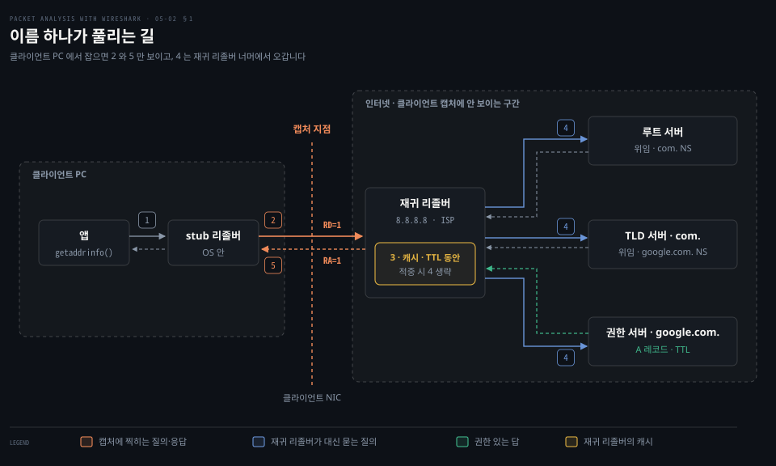
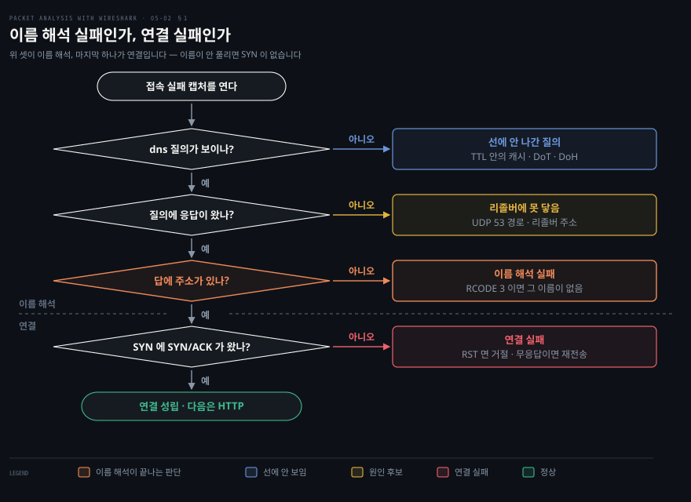
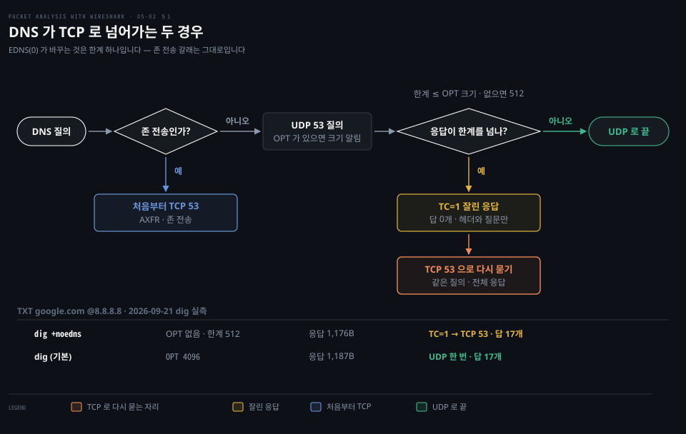
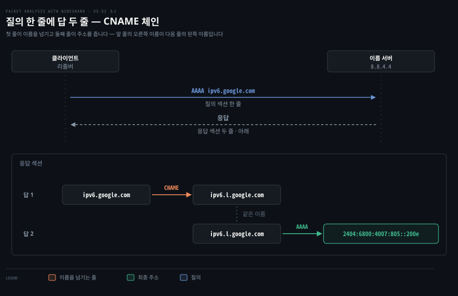
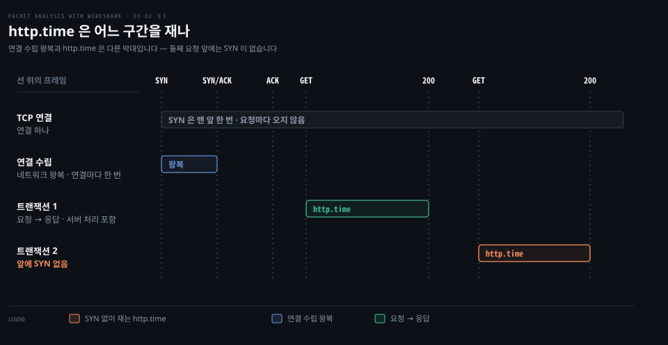
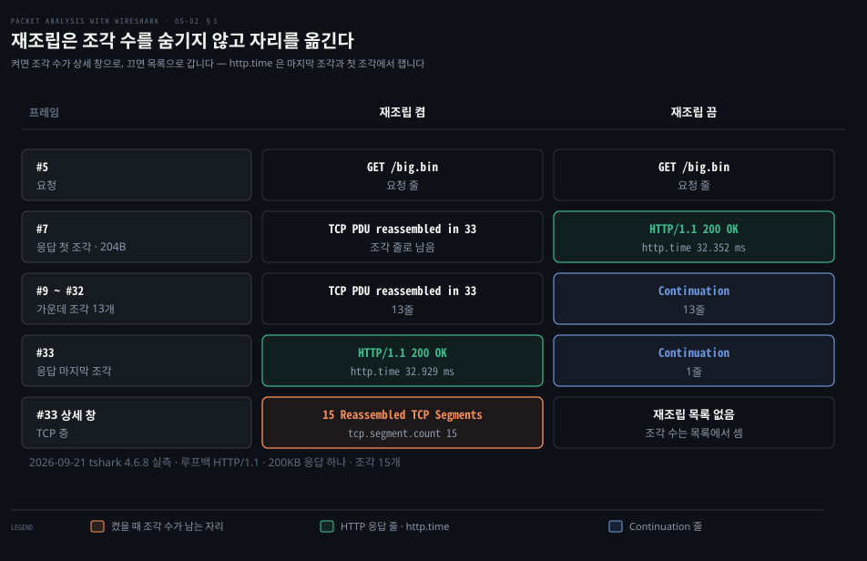
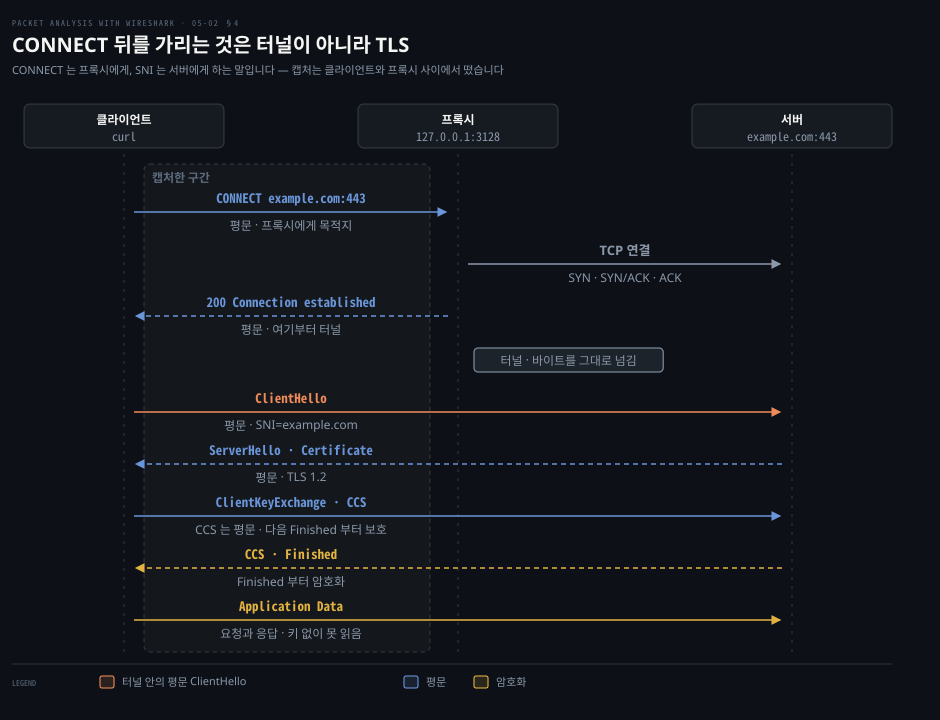
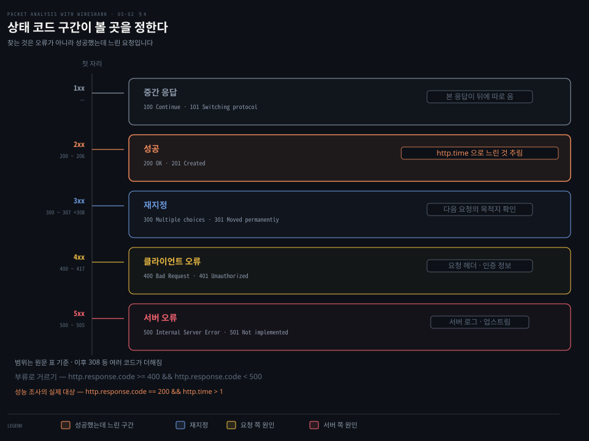
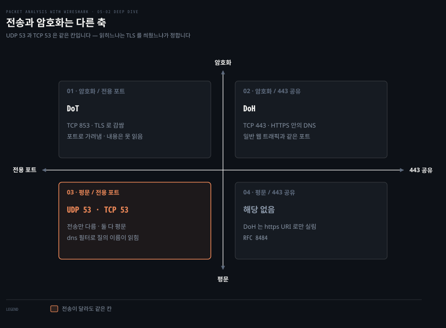
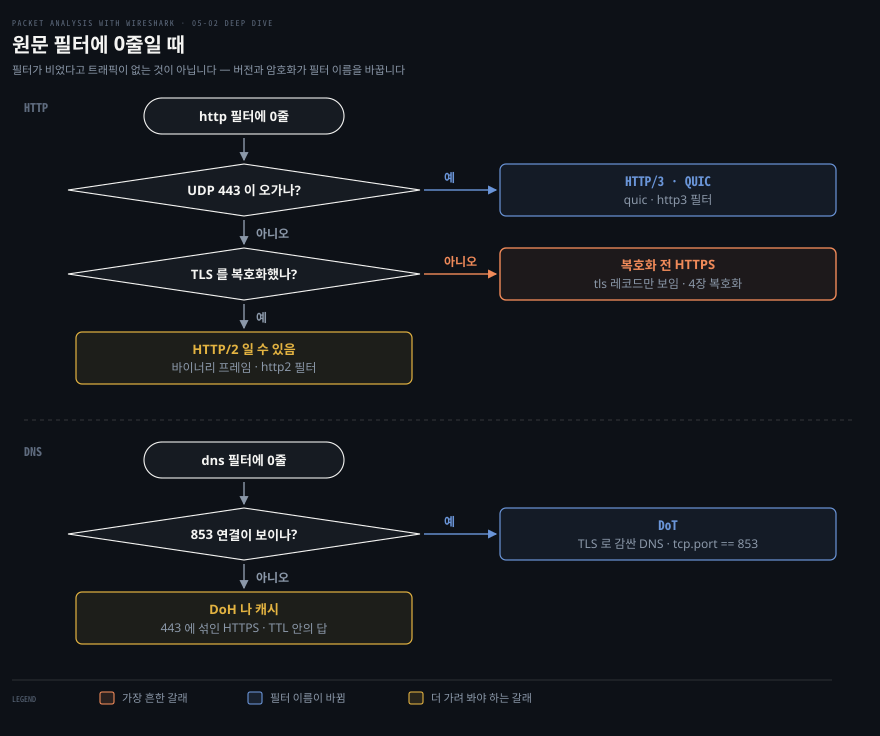

# 이름과 요청

---

> 5장 후반부는 주소를 받은 다음의 두 프로토콜을 봅니다. 이름을 주소로 바꾸는 DNS 와, 그 주소로 무언가를 요청하는 HTTP 입니다.

## 핵심 요약

> 이 편은 한 가지 생각에 매달립니다. DNS 와 HTTP 는 캡처에서 질문 한 줄과 답 한 줄로 읽히고 그 **두 줄 사이의 시간**이 곧 성능 조사의 눈금이 됩니다.

DNS 쪽에서 읽을 것은 질의 타입입니다. 원문은 이 메커니즘을 "질의 타입에 따라 이름을 주소 같은 속성으로 옮기는 것" 으로 설명합니다. 무엇을 알고 싶은지가 타입을 정하고, 타입이 정해지면 `dns.qry.type` 필터 값이 정해집니다.

HTTP 쪽에서 읽을 것은 트랜잭션의 응답 시간과 상태 코드입니다. HTTP 트랜잭션은 요청 하나와 그에 대한 응답 하나의 짝입니다. TCP 연결 하나에 이 짝이 여럿 차례로 실립니다. 원문 절차는 TCP 재조립을 끄는 데서 시작합니다. 한 응답이 몇 개의 TCP 세그먼트로 쪼개져 왔는지를 세기 위해서입니다. 원문은 그 개수가 TCP 윈도우 크기 같은 파라미터를 조정하는 데 쓰인다고 적습니다.

두 프로토콜은 둘 다 평문이라 내용이 그대로 읽힙니다. 원문은 HTTP 절에서 폼 전송의 비밀번호를 예로 들어 이 점을 보입니다. 앞 장의 TLS 는 바로 이 문제를 막습니다.


## 학습 목표

> 이 편을 읽고 나면 아래 다섯 가지를 스스로 해낼 수 있습니다.

1. 알고 싶은 것에 맞는 DNS 레코드 타입을 고르고 그에 맞는 `dns.qry.type` 필터를 쓸 수 있습니다.
2. 접속 실패 캡처에서 이름 해석 실패와 연결 실패를 가르고, 응답의 CNAME 체인을 따라 최종 주소를 찾을 수 있습니다.
3. DNS 가 UDP 를 쓰다가 TCP 로 넘어가는 조건을 설명할 수 있습니다.
4. 가장 느린 HTTP 응답을 찾아 몇 조각으로 왔는지 세고, 그 개수만으로 창 크기를 판단하지 않는 이유를 설명할 수 있습니다.
5. HTTP 메서드와 상태 코드로 원하는 트랜잭션만 뽑고, 프록시의 CONNECT 뒤를 가리는 것이 TLS 라는 것을 설명할 수 있습니다.

이 편에서 새로 만나는 낱말입니다. `어디서` 는 그 낱말이 실제로 설명되는 절입니다.

| 키워드 | 뜻 | 학습 포인트·연결 개념 | 어디서 |
|---|---|---|---|
| stub · 재귀 리졸버 | OS 안의 질의자 · 대신 찾는 서버 | 캡처는 둘 사이만 · RD/RA · 캐시 적중이면 질의 없음 | §1 |
| 이름 해석 (name resolution) | 이름을 주소로 바꾸는 단계 | 여기서 막히면 SYN 이 안 나감 | §1 |
| RCODE | 응답 헤더의 결과 코드 | 3 이름 없음 · 0 에 빈 답은 NODATA | §1 |
| TC 비트 · EDNS(0) | 잘린 응답 표시 · UDP 한계를 늘리는 확장 | 잘리면 TCP 로 다시 묻기 · AXFR 은 늘 TCP | §1 |
| 질의 타입 (query type) | A·AAAA·MX·CNAME 등 | `dns.qry.type` 으로 거름 | §2 |
| CNAME 체인 | 이름이 다른 이름을 가리킴 | 끝까지 따라가야 주소가 나옴 | §2 |
| HTTP 트랜잭션 | 요청 하나와 응답 하나의 짝 | 연결 하나에 여럿 · SYN 은 연결마다 한 번 | §3 |
| 조각 (TCP 세그먼트) | 한 응답을 나눠 나른 단위 | 재조립 끔은 Continuation 줄 · 켬은 `tcp.segment.count` | §3 |
| 상태 코드 (status code) | 2xx·4xx·5xx 응답 구분 | `http.response.code` 로 트랜잭션을 뽑음 | §4 |
| CONNECT 터널 | 프록시에게 목적지를 여는 요청 | 가리는 것은 터널이 아니라 TLS | §4 |
| DoT · DoH | TLS 로 감싼 DNS | 전송과 암호화는 다른 축 | 심화 |


## 1. 이름 해석 — 접속 실패가 이름 탓인지부터 가립니다

> "서버에 못 붙는다"는 신고는 이름을 주소로 못 바꾼 경우와 주소로 연결을 못 연 경우로 갈립니다. 이 둘을 가르려면 이름 하나가 누구를 거쳐 풀리고, 그중 어느 구간이 캡처에 잡히는지부터 알아야 합니다.

### DNS 의 세 부분 — 이름 공간, 이름 서버, 리졸버

DNS 는 이름을 주소로 바꾸는 일을 세 부분에 나눠 맡깁니다. 원문도 DNS 를 "모든 장비가 호스트명을 IP 주소로 옮기는 데 쓰는 것" 으로 소개한 뒤 구성 요소를 셋으로 나눕니다. 원문은 이름만 들고 넘어가므로, 각각이 무엇인지는 RFC 1034 의 정의로 채웁니다.[^rfc1034-parts]

- **이름 공간(name space)**: 모든 이름을 담은 트리입니다. 
  - 맨 위 루트(`.`) 아래에 `com` 이, 그 아래에 `google.com` 이, 다시 그 아래에 `www.google.com` 이 매달립니다. 
  - 마디마다 주소 같은 정보가 붙습니다. 그 정보 한 건이 §2 에서 보는 리소스 레코드입니다.
- **이름 서버(name server)**: 트리의 한 부분을 맡아 그 정보를 쥔 서버입니다. 
  - 한 서버가 트리 전체를 알지는 못합니다. 자기 몫은 완전히 알고, 나머지는 누구에게 물으면 되는지 가리키는 포인터만 가집니다. 
  - 서버가 완전히 아는 몫을 존(zone)이라 하고, 그 존에 대해 서버는 권한(authority)을 가집니다. 
  - 루트를 맡은 루트 서버, `com` 을 맡은 TLD 서버, `google.com` 을 맡은 권한 서버가 모두 이름 서버입니다.
- **리졸버(resolver)**: 프로그램의 요청을 받아 이름 서버에서 정보를 꺼내 오는 쪽입니다. 
  - 이름 서버가 답을 주면 그대로 쓰고, 다른 서버를 가리키면 그 위임(referral)을 따라가 답을 만듭니다.

원문은 이 가운데 리졸버 관점으로 범위를 좁힙니다. "클라이언트가 서버에 질의를 보내고 서버가 답하는 자리이며, 같은 질의에 여러 답이 올 수 있습니다." 답이 여러 줄이면 이름 하나에 주소가 여럿이거나 CNAME 체인입니다. 체인은 §2 끝에서 다룹니다.

### 조회 흐름 — stub 리졸버가 묻고 재귀 리졸버가 대신 찾아갑니다

캡처를 보면 질의가 `8.8.8.8` 같은 서버 하나로만 가고 루트 서버로는 가지 않습니다. 원문이 말하는 리졸버가 실제로는 두 단계로 나뉘기 때문입니다.

PC 의 운영체제 안에 있는 리졸버는 대개 위임을 스스로 따라가지 않습니다. RFC 1034 는 이것을 stub 리졸버라 부르고, 재귀 질의를 대신 처리해 줄 이름 서버의 주소 목록만 있으면 된다고 적습니다.[^rfc1034-stub] 그 목록에 적힌 서버가 재귀 리졸버입니다. 공유기나 ISP 가 알려 준 DNS 서버, `8.8.8.8` 같은 공개 DNS 가 이 자리에 있습니다. 같은 절은 이렇게 나누면 조직 전체의 캐시를 한곳에 모을 수 있다고 설명합니다.



그림의 번호를 따라가면 다섯 단계입니다. 점선 세로줄이 클라이언트 PC 의 캡처 지점입니다.

1. 앱이 `getaddrinfo()` 같은 운영체제 호출로 이름을 넘깁니다. 프로세스 안의 호출이라 선에 나가지 않습니다.
2. stub 리졸버가 재귀 리졸버에게 UDP 53 으로 질의를 보냅니다. 헤더의 RD(Recursion Desired) 비트를 켜서 위임을 끝까지 따라가 답만 달라고 요청합니다.[^rfc1034-rdra]
3. 재귀 리졸버는 자기 캐시를 먼저 봅니다. 답이 있으면 곧바로 5단계로 갑니다.[^rfc1034-cache]
4. 캐시에 없으면 캐시에 쥔 가장 가까운 위임부터, 그것도 없으면 루트 서버부터 묻습니다.[^rfc1034-best] 그림은 아무것도 없는 경우입니다. 루트는 답 대신 `com` 을 맡은 서버를 알려 주고, TLD 서버는 `google.com` 을 맡은 권한 서버를 알려 줍니다. 권한 서버가 주소와 TTL 을 담은 답을 주면 재귀 리졸버는 그 답을 TTL 동안 캐시에 둡니다.
5. 재귀 리졸버가 RA(Recursion Available) 비트를 켠 응답을 stub 에 돌려주고, stub 은 주소를 앱에 넘깁니다.

클라이언트 PC 에서 캡처하면 2단계의 질의와 5단계의 응답 두 줄만 보입니다. 4단계의 질의는 재귀 리졸버에서 나가므로 클라이언트의 선을 지나지 않습니다. 원문이 "리졸버 관점"으로 좁힌 자리가 이 구간입니다. 이 구간의 질의와 응답에는 재귀를 요청했다는 RD 와, 서버가 재귀를 제공할 수 있다는 RA 가 켜져 있습니다. RA 는 재귀를 할 수 있다는 표시일 뿐, 실제로 했는지는 알려 주지 않습니다.[^rfc1034-rdra]

```bash
# stub 이 재귀를 요청한 질의
dns.flags.recdesired == 1

# 서버가 재귀를 제공한다고 알린 응답
dns.flags.recavail == 1
```

### 접속이 안 될 때 이름 해석 실패와 연결 실패를 가릅니다

"서버에 못 붙는다"는 신고를 받으면 3장의 TCP 조사로 넘어가기 전에 이름부터 풀렸는지 확인합니다. 이름이 안 풀렸다면 TCP 를 아무리 봐도 원인이 나오지 않습니다.

가르는 기준은 목적지로 가는 SYN 입니다. 이름이 풀리지 않으면 애플리케이션은 연결할 주소를 모르므로 SYN 이 아예 나가지 않습니다. SYN 이 보이면 이름 해석은 끝났고 문제는 연결 쪽에 있습니다.



그림의 위쪽 세 판단이 이름 해석이고, 마지막 하나가 연결입니다. 판단마다 "아니오"가 나오면 원인과 다음에 볼 곳은 이렇습니다.

| 판단 | "아니오"일 때 원인 | 다음에 볼 곳 |
|------|------------------|------------|
| `dns` 질의가 보이나 | 캐시로 풀었거나, 질의가 암호화돼 `dns` 로 안 잡힘 | 이전 응답의 TTL · `tcp.port == 853` · 443 연결 (DoT·DoH, 심화 학습) |
| 질의에 응답이 왔나 | 재귀 리졸버에 닿지 못함 | UDP 53 경로 · 설정된 리졸버 주소 |
| 답에 주소가 있나 | 이름이 없거나, 그 타입의 레코드가 없거나, 서버 오류 | 응답 헤더의 RCODE (아래 표) |
| SYN 에 SYN/ACK 가 왔나 | 연결 실패 | [03-02](./03-02.TCP%EA%B0%80%20%EC%96%B4%EA%B8%8B%EB%82%A0%20%EB%95%8C.md) §1 「RST — 연결이 거부되거나 끊길 때」 |

첫 판단에서 질의가 안 보여도 오류가 아닐 수 있습니다. 앞 흐름의 3단계처럼 리졸버는 자기가 가진 정보에서 먼저 답을 찾고 거기서 답이 나오면 질의는 선에 나가지 않습니다. 답에 붙은 TTL(Time To Live)이 그 답을 캐시에 둬도 되는 시간입니다.[^rfc1034-cache] 질의를 TLS 로 감싸는 DoT·DoH 를 써도 `dns` 필터에 잡히지 않습니다. 이 방식이 왜 생겼고 캡처에서 어떻게 가르는지는 심화 학습에서 다룹니다.

셋째 판단은 응답 헤더의 RCODE(Response Code)로 이유를 읽습니다. RCODE 는 응답 헤더의 4비트 칸으로, RFC 1035 가 0~5 를 정의하고 6~15 는 예약해 두었습니다.[^rfc1035-rcode] 지금은 6~10 이 동적 갱신(UPDATE) 등에 배정돼 있지만 일반 조회 응답에서 보는 값은 0~5 입니다. 약칭은 IANA 등록부의 표기이고,[^rfc6895-rcode] Wireshark 필드는 `dns.flags.rcode` 입니다.

| RCODE | 약칭 | 뜻 | 캡처에서 다음에 볼 곳 |
|-------|------|-----|------------------|
| 0 | NoError | 오류 없음 | 답이 있으면 정상 · 비었으면 아래 NODATA |
| 1 | FormErr | 서버가 질의를 해석하지 못함 | 질의 섹션 · 추가 섹션의 OPT |
| 2 | ServFail | 서버 쪽 문제로 처리하지 못함 | 응답을 보낸 리졸버 · 다른 리졸버로 같은 질의 |
| 3 | NXDomain | 질의한 이름이 없음 | 질의 섹션의 이름 철자 |
| 4 | NotImp | 그 종류의 질의를 지원하지 않음 | 질의 섹션이 묻는 레코드 종류 (§2) |
| 5 | Refused | 정책상 거부 | 이 클라이언트에 대한 허용 여부 · 존 전송 허용 여부 |

1 은 EDNS(0) 와 얽힙니다. EDNS(0) 를 구현하지 않은 서버는 OPT 레코드가 붙은 질의에 FormErr 로 답하도록 정해져 있습니다.[^rfc6891-formerr] OPT 는 아래 TCP 소절에서 설명합니다. 5 는 RFC 1035 가 직접 예를 듭니다. 특정 요청자에게 정보를 주지 않으려 하거나, 존 전송 같은 작업을 거부할 때입니다.

RCODE 가 0 인데 답 섹션에 물은 타입의 답이 없으면 NODATA 입니다. NODATA 는 RCODE 번호가 따로 없고 응답 내용으로 판정하는 이름입니다. 이름은 있지만 물은 타입의 레코드가 없다는 뜻입니다.[^rfc2308-nodata] 답 섹션에 CNAME 만 있고 그 끝에 물은 타입이 없는 경우도 여기에 듭니다. IPv4 주소만 있는 이름에 AAAA 를 물으면 이렇게 옵니다.

넷째 판단부터가 연결입니다. SYN 에 RST 가 돌아오는지, 아무 응답 없이 SYN 만 다시 나가는지는 표의 03-02 §1 에서 가립니다.

### 필터와 포트 — 기본은 UDP 53 입니다

원문은 표시할 때 `dns` 디스플레이 필터를, 잡을 때 UDP 포트 53 을 쓰라고 안내합니다. 기본은 UDP 지만 원문은 예외도 적습니다. "일부 DNS 시스템은 TCP 도 씁니다. TCP 는 응답 데이터 크기가 512바이트를 넘거나 존 전송 같은 작업에 쓰입니다."

존 전송은 §2 에서 AXFR 로 다시 나옵니다. 존은 앞에서 본 대로 이름 서버가 권한을 가진 트리의 한 구획입니다.[^rfc1034-zone] 존 전송(zone transfer)은 한 존의 레코드 전체를 주 이름 서버에서 보조 이름 서버로 복사하는 작업이고, 그때 쓰는 질의 타입이 AXFR 입니다.

### DNS 가 TCP 로 넘어가는 두 경우 — 잘린 응답과 존 전송

DNS 를 UDP 로만 알고 있으면 캡처에 찍힌 TCP 53 줄을 이상 트래픽으로 읽기 쉽습니다. 원문이 든 두 조건은 성격이 다릅니다. 응답 크기는 UDP 로 먼저 물었다가 넘어가는 경우이고, 존 전송은 처음부터 TCP 로 가는 경우입니다.

크기 쪽은 RFC 1035 가 정한 UDP 메시지 상한 512바이트에서 시작합니다. 이보다 긴 응답은 잘리고 헤더의 TC(TrunCation) 비트가 켜집니다.[^rfc1035-udp] 잘린 응답을 받은 클라이언트는 TC 를 신호로 삼아 같은 질의를 TCP 로 다시 묻습니다.[^rfc7766]

RFC 6891 이 정의한 EDNS(0) 는 이 512 라는 한계를 바꿨습니다. 그 방법을 읽으려면 메시지 모양을 먼저 봐야 합니다. DNS 메시지는 헤더 뒤에 질의·응답·권한·추가의 네 섹션이 옵니다. 추가 섹션은 질의와 관련은 있지만 답 자체는 아닌 레코드를 싣는 자리입니다.[^rfc1035-msg]

클라이언트는 이 추가 섹션에 OPT 라는 레코드를 붙입니다. 옵션을 나르려고 레코드 모양만 빌린 의사 레코드이고 타입 번호는 41 입니다. 레코드에는 원래 IN 같은 클래스를 적는 CLASS 칸이 있습니다. OPT 는 이 칸에 UDP 페이로드 크기를 적습니다. 자기가 받아 재조립할 수 있는 크기입니다.[^rfc6891] 서버는 그 크기까지는 자르지 않고 UDP 로 답할 수 있습니다.[^rfc7766] 그래서 512바이트를 넘는 응답도 UDP 한 번에 오고 TCP 로 넘어가는 일이 줄어듭니다. 알린 크기마저 넘는 응답은 여전히 잘리고 TCP 로 넘어갑니다.



2026-09-21 에 dig 9.10.6 과 tshark 4.6.8 로 같은 질의를 두 방식으로 보내 확인했습니다. OPT 없이 물으니 UDP 응답이 TC=1 에 답 0개로 왔고 `dig` 가 곧바로 TCP 53 으로 다시 물어 1,176바이트에 답 17개를 받았습니다. OPT 에 4096 을 싣는 `dig` 기본값으로 물으면 1,187바이트가 UDP 한 번에 왔습니다.

```bash
# OPT 없이 묻습니다 — 한계는 512바이트
dig +noedns TXT google.com @8.8.8.8

# 기본값으로 묻습니다 — dig 9.10.6 은 OPT 에 4096 을 싣습니다
dig TXT google.com @8.8.8.8
```

첫 명령만 아래 줄을 찍고 TCP 로 다시 묻습니다.

```bash
;; Truncated, retrying in TCP mode.
```

캡처에서는 잘린 응답과 TCP 로 넘어간 질의를 따로 거릅니다.

```bash
# TC 가 켜진 잘린 응답
dns.flags.truncated == 1

# TCP 로 넘어간 질의
tcp.port == 53
```

존 전송 쪽은 EDNS(0) 와 상관이 없습니다. 존을 통째로 옮기는 일은 정확해야 해서 RFC 1034 가 AXFR 에 TCP 같은 신뢰할 수 있는 전송을 요구합니다. RFC 1035 도 UDP 는 존 전송에 쓸 수 없다고 적습니다.[^rfc1034-zone][^rfc1035-udp] 캡처에 OPT 의사 레코드가 보이면 EDNS(0) 를 쓰는 중입니다. 그와 무관하게 AXFR 은 TCP 53 으로 갑니다.


## 2. 질의 타입 — 무엇을 묻느냐가 레코드와 필터를 정합니다

> 무엇을 알고 싶은지가 레코드 타입을 정하고, 타입이 필터 값을 정합니다.

### 타입을 모르면 질의를 못 만듭니다

`dig` 를 칠 때 타입을 빼면 A 레코드만 나옵니다. 메일 서버를 찾거나 IPv6 주소를 확인하려면 타입을 지정해야 하고 캡처에서 남의 질의를 읽을 때도 타입 번호를 알아야 무엇을 물었는지 압니다.

### 답 한 줄의 형식 — 리소스 레코드 여섯 칸

§1 에서 이름 공간의 마디마다 정보가 붙는다고 했습니다. 그 정보 한 건이 리소스 레코드(resource record)이고 응답 섹션의 답 한 줄이 레코드 한 건입니다. 레코드는 어느 이름의 어떤 종류 정보인지, 얼마 동안 캐시해도 되는지, 실제 값이 무엇인지를 여섯 칸에 나눠 담습니다. 원문은 칸마다 Wireshark 필터를 붙입니다.

| 필드 | 뜻 | 길이 | Wireshark 필터 |
|------|-----|------|---------------|
| NAME | 소유자 이름 | 가변 | `dns.qry.name == "google.com"` |
| TYPE | 리소스 레코드의 종류(숫자) | 2 | `dns.qry.type == 1` 등 |
| CLASS | 클래스 코드 | 2 | `dns.qry.class == 0x0001` |
| TTL | 유효 시간 | 4 | |
| RDLENGTH | RDATA 필드의 옥텟 길이 | 2 | |
| RDATA | 레코드별 추가 데이터 | 가변 | |

원문이 값과 함께 드는 타입은 다섯입니다.

- `dns.qry.type == 1` — A
- `dns.qry.type == 2` — NS
- `dns.qry.type == 15` — MX
- `dns.qry.type == 28` — AAAA
- `dns.qry.type == 255` — ANY

CLASS 는 `0x0001` 이 IN(인터넷)입니다. TTL 칸이 §1 에서 본 캐시의 수명입니다.


위 그림은 원문의 `dig`·`nslookup` 예제에 나오는 타입 전부를 쓰임새로 묶었습니다. 갈래는 무엇을 묻느냐로 넷입니다.

- 주소는 무엇인가: "이 이름의 주소는 무엇인가?" 에 A 는 IPv4, AAAA 는 IPv6 로 답합니다.
- 어떤 이름과 잇나: "이 이름은 어느 이름의 별칭인가?" 에는 CNAME 이, "이 주소의 이름은 무엇인가?" 에는 PTR 이 답합니다.
- 누가 맡고 있나: "이 존은 어느 이름 서버가 맡는가?" 에는 NS 가, "이 존의 권한 정보는 무엇인가?" 에는 SOA 가 답합니다.
- 그 밖에 무엇이 있나: "이 도메인의 메일은 어느 서버가 받는가?" 에는 MX 가, 이름에 붙은 글에는 TXT 가 답합니다. 모든 종류를 한꺼번에 묻는 ANY 와 존을 통째로 받는 AXFR 도 그림은 이 갈래에 넣었습니다.

A·AAAA 만 떠올리면 주소를 물었는데 CNAME 답이 섞여 오는 캡처를 읽지 못합니다. 아래 원문 예제가 바로 그 경우입니다.

### dig 로 타입마다 질의해 보기

원문은 `dig` 와 `nslookup` 으로 각 타입을 질의하고 백그라운드 캡처에서 질의·응답 섹션을 관찰하라고 안내합니다.

```bash
dig A     google.com. @8.8.4.4      # IPv4 주소
dig AAAA  ipv6.google.com. @8.8.4.4 # IPv6 주소
dig CNAME google.com. @8.8.4.4      # 별칭
dig MX    google.com. @8.8.4.4      # 메일 교환
dig NS    google.com. @8.8.4.4      # 이름 서버
dig SOA   google.com. @8.8.4.4      # 권한 정보
dig TXT   google.com. @8.8.4.4      # 텍스트 레코드
dig ANY   google.com. @8.8.4.4      # 모든 종류
```

원문은 각 명령에 `+noadditional +noquestion +nocomments +nocmd +nostats` 를 붙여 출력을 답 부분만 남깁니다. 캡처와 대조할 때 화면이 단순해져 편합니다.

> **노트의 읽기**: 원문은 PTR 질의 예로 `nslookup -type=ptr google.com 8.8.4.4` 를 듭니다. PTR 은 원문 자신이 적듯 역방향 조회용이라 주소를 뒤집은 이름(`x.x.x.x.in-addr.arpa`)을 물어야 하고, `google.com` 같은 정방향 이름으로 물으면 의미 있는 답이 오지 않습니다. 실제로 역방향을 확인하려면 `dig -x 8.8.4.4` 처럼 씁니다.

> **노트의 읽기**: AXFR 예로 든 `nslookup -type=axfr google.com 8.8.4.4` 도 그대로는 동작하지 않습니다. 원문이 적듯 AXFR 은 주 이름 서버에서 보조 이름 서버로 존 파일을 옮기는 작업이라 그 존의 권한 서버에 물어야 하는데, `8.8.4.4` 는 권한 서버가 아니라 공개 재귀 리졸버입니다. 게다가 공개된 서버는 대부분 AXFR 을 거부합니다. 명령의 형태를 익히는 예제로 읽는 편이 맞습니다.

### 캡처에서 CNAME 체인 따라가기

원문은 `DNS-Packet.pcap` 을 열고 `dns.qry.type==28` 로 걸러 AAAA 질의를 봅니다. 읽히는 것은 이렇습니다.

클라이언트(`192.168.1.101`)가 이름 서버(`8.8.4.4`)에게 `ipv6.google.com` 을 풀어 달라고 요청합니다. 질의 섹션에는 레코드 타입 AAAA 와 호스트명, 클래스 IN 이 담깁니다. 이름 서버는 여러 답으로 응답합니다. `ipv6.google.com` 의 정규 이름이 `ipv6.l.google.com` 이고, `ipv6.l.google.com` 의 AAAA 주소가 `2404:6800:4007:805::200e` 라는 두 줄입니다.

첫 줄이 CNAME 레코드입니다. CNAME 은 자기 이름(소유자 이름)이 별칭이라는 것과, 그 별칭이 가리키는 정규 이름을 RDATA 에 담습니다.[^rfc1034-cname] 그래서 첫 줄의 오른쪽 이름이 둘째 줄의 왼쪽 이름이 되고 주소는 체인의 끝에서 나옵니다.



이것이 앞에서 말한 "같은 질의에 여러 답"의 실제 모습입니다. 첫 줄은 CNAME 으로 이름을 넘기고 둘째 줄이 실제 주소를 줍니다. 응답 줄이 여럿일 때 어느 것이 최종 답인지는 이렇게 체인을 따라가 확인합니다. 두 줄을 따로 보고 싶으면 응답 섹션의 타입으로 거릅니다.

```bash
# 응답 섹션의 CNAME 줄
dns.resp.type == 5

# 응답 섹션의 AAAA 줄
dns.resp.type == 28
```


## 3. HTTP — 가장 느린 응답 찾기

> HTTP 는 요청 한 줄과 응답 한 줄로 읽힙니다. 둘 사이의 시간이 `http.time` 이고, 그것으로 정렬하면 느린 것이 위로 옵니다.


### 어느 요청이 느린지 모를 때

페이지가 느리다는 신고를 받으면 어느 요청이 원인인지부터 찾습니다. 요청이 수십 개면 하나씩 보기는 현실적이지 않습니다.

### http.time 은 연결 수립이 아니라 요청과 응답 사이를 잽니다

느린 요청을 찾을 때 SYN 과 SYN/ACK 의 간격부터 보기 쉽습니다. 그 간격은 연결을 세우는 왕복이라 네트워크 지연을 보여 주지만 요청마다 생기지 않습니다. HTTP/1.1 은 연결 하나를 계속 쓰는 것이 기본이라 요청과 응답 여럿을 한 연결에 싣기 때문입니다.[^rfc9112-persist]

그래서 이 절이 세는 단위는 연결이 아니라 트랜잭션입니다. HTTP 트랜잭션은 요청 하나와 그에 대한 응답 하나의 짝이고, `http.time` 은 그 요청 프레임에서 응답 프레임까지의 간격입니다. Wireshark 가 이 필드에 붙인 설명이 원문이 정렬하는 열 이름 그대로 Time since request 입니다. 서버가 요청을 받아 처리한 시간이 이 간격에 들어 있으므로 연결 수립 왕복이 짧아도 `http.time` 은 길 수 있습니다.



둘째 트랜잭션 앞에는 SYN 이 없습니다. 2026-09-21 에 `curl` 로 같은 연결에서 GET 을 두 번 보낸 캡처에서도 SYN·SYN/ACK·ACK 는 맨 앞에 한 번뿐이었고 `http.time` 은 두 응답에 따로 붙었습니다.

### 원문의 세 단계

절차에 앞서 낱말 하나를 맞춥니다. 큰 응답은 TCP 세그먼트 여러 개에 나뉘어 옵니다. 이 편은 그 하나하나를 조각이라 부릅니다. 재조립은 조각을 모아 HTTP 메시지 하나로 합쳐 보여 주는 기능입니다. 재조립을 끄면 첫 조각 뒤의 조각이 `Continuation` 줄로 따로 찍힙니다.

원문은 `http_01.pcap` 에서 가장 느린 HTTP GET 응답을 찾는 절차를 셋으로 제시합니다.

1. `Edit | Preferences | Protocols | TCP` 에서 **Allow subdissector to reassemble TCP streams** 를 끕니다.
2. 필터 바에 `http` 를 걸고 `http.response.code == 200` 패킷에서 `http.time` 을 열로 추가합니다.
3. Time since request 열을 눌러 내림차순으로 정렬한 뒤 맨 위 줄의 요청 프레임 링크를 따라갑니다.

첫 단계가 왜 필요한지에 원문이 이유를 답니다. "이것은 실제 내용을 얻는 데 continuation 패킷이 몇 개인지 아는 데 도움이 되고, TCP 파라미터를 미세 조정하는 데도 도움이 됩니다." 원문이 드는 미세 조정의 예가 continuation 패킷을 줄이려고 TCP 윈도우 크기를 설정하는 일입니다.

### 재조립을 켜든 끄든 조각 수는 보입니다 — 바뀌는 것은 자리와 http.time

원문의 이유만 읽으면 재조립을 켜 두면 조각 수, 곧 한 응답을 나눠 나른 TCP 세그먼트의 수가 사라지는 것처럼 보입니다. 실제로는 사라지지 않고 찍히는 자리만 옮깁니다. 2026-09-21 에 루프백에서 200KB 응답 하나를 받은 캡처를 tshark 4.6.8 로 재조립 켬과 끔으로 두 번 열어 비교했습니다.



패킷은 두 설정에서 똑같이 도착하고, 바뀌는 것은 표시뿐입니다. 끄면 조각이 목록에 `Continuation` 줄로 늘어서고 원문이 세라는 개수가 이 줄들입니다. 켜면 같은 개수가 마지막 조각의 `15 Reassembled TCP Segments`, 곧 `tcp.segment.count` 필드에 담깁니다([02-04](./02-04.%EC%8B%A4%EC%8A%B5%20%E2%80%94%20%ED%95%84%ED%84%B0%EC%99%80%20%ED%95%B4%EC%84%9D.md) §7).

`http.time` 은 응답 줄이 붙은 프레임에서 잽니다. 그래서 끄면 첫 조각까지(32.352ms), 켜면 마지막 조각까지(32.929ms)를 재고, 둘의 차이는 응답 본문이 전송되는 동안의 시간입니다.

`Protocols | TCP` 재조립은 기본값이 켬입니다. 2026-09-23 tshark 4.6.8 에서도 `tcp.desegment_tcp_streams` 가 켬이었으므로 5장 원문 절차는 목록에서 조각을 세려고 이것을 일부러 끕니다. 2장에서는 헤더가 끊겨 보일 때 켜는 설정이었습니다([02-03](./02-03.%EB%B6%84%EC%84%9D%EC%9D%84%20%EB%8F%95%EB%8A%94%20%EA%B8%B0%EB%8A%A5%EB%93%A4.md) §2). 3장은 반대로 `Protocols | HTTP` 재조립을 켜고 셉니다. `slow_download.pcap` 에서 `tcp.segment.count == 2584` 로 5MB 응답의 조각 수를 확인한 뒤 창 크기를 보러 갑니다. 그 절차는 [03-02](./03-02.TCP%EA%B0%80%20%EC%96%B4%EA%B8%8B%EB%82%A0%20%EB%95%8C.md) §4 「원문의 진단 예제」에 있습니다.

조각 수는 창 크기 열을 볼 계기입니다. 보내는 쪽은 데이터를 받는 쪽이 지금 더 받을 수 있다고 알린 수신 창에 맞춰 세그먼트로 꾸리므로[^rfc9293-window], 창이 조각 하나에 실을 수 있는 최대 크기(MSS)보다 작게 묶이면 조각이 잘게 쪼개지고 확인을 기다리는 왕복도 늘어납니다. 다만 조각 수는 응답이 클수록 당연히 늘고, 3장 예제의 창 100 과 조각 2,584 도 산술로 이어지지 않습니다(100바이트씩이면 5,242,880바이트에 52,429개). 판단은 창 크기 열에서 하며 그 사정은 03-02 §4 의 노트의 읽기에 있습니다.


## 4. 메서드와 상태 코드로 수천 요청을 좁힙니다

> 메서드와 상태 코드는 필터 값이 그대로 의미라 조사 범위를 좁히는 가장 빠른 손잡이입니다. 메서드 가운데 CONNECT 는 뒤가 왜 안 보이는지를 따로 봅니다.

### 수천 요청에서 관심 있는 것만

캡처에 HTTP 요청이 수천 개면 `http` 필터만으로는 좁혀지지 않습니다. 무엇을 찾는지에 따라 메서드나 상태 코드로 한 번 더 걸러야 합니다.

### 메서드 — 원문의 여섯 가지

원문이 정리한 메서드와 필터입니다.

| 메서드 | 뜻 | 필터 |
|--------|-----|------|
| GET | 지정한 자원을 가져옵니다 | `http.request.method == "GET"` |
| POST | 지정한 자원으로 처리할 데이터를 보냅니다 | `http.request.method == "POST"` |
| PUT | 지정한 URI 의 표현을 올립니다 | `http.request.method == "PUT"` |
| DELETE | 지정한 자원·엔티티를 지웁니다 | `http.request.method == "DELETE"` |
| OPTIONS | 서버가 지원하는 HTTP 메서드를 돌려줍니다 | `http.request.method == "OPTIONS"` |
| CONNECT | 요청 연결을 투명한 TCP/IP 터널로 바꿉니다 | `http.request.method == "CONNECT"` |

마지막 CONNECT 가 실무에서 자주 걸립니다. 프록시를 거쳐 HTTPS 를 쓰면 첫 요청이 `CONNECT` 로 나가고 그 뒤로는 HTTP 요청·응답 줄이 더 나오지 않습니다. 프록시 환경의 캡처에서 HTTP 가 갑자기 끊긴 것처럼 보이면 이 메서드를 찾아봅니다. 왜 끊겨 보이는지는 아래 CONNECT 소절에서 설명합니다.

### POST 폼은 평문 그대로 읽힙니다

원문은 폼 전송을 예로 듭니다. `HTTP_FORM_POST.pcap` 을 열고 POST 만 걸러 password 폼 항목을 찾게 합니다. "폼에 비밀번호 같은 민감 정보가 담겨 있으면 Wireshark 가 쉽게 드러냅니다. HTTP 는 네트워크 위로 데이터를 옮기는 안전하지 않은 수단이기 때문입니다."

평문이 문제이니 대책은 암호화입니다. 같은 요청이 TLS 위에 얹히면 앞 장에서 본 대로 `Application Data` 레코드로만 보입니다.

### CONNECT 뒤가 안 보이는 이유는 터널이 아니라 TLS 입니다

CONNECT 를 읽으려면 프록시부터 정해 둡니다. 프록시는 클라이언트가 설정으로 골라 자기 요청을 대신 받게 한 중계자입니다.[^rfc9110-proxy] 브라우저나 `curl` 에 프록시 주소를 넣으면 요청이 서버가 아니라 프록시로 먼저 갑니다.

HTTPS 요청을 프록시에게 맡기면 클라이언트는 목적지를 CONNECT 요청 한 줄로 알립니다. 요청 대상 자리에는 URL 이 아니라 목적지의 호스트와 포트만 들어갑니다(`CONNECT example.com:443 HTTP/1.1`). 프록시는 그 목적지로 TCP 연결을 열어 2xx 응답을 돌려주고 그때부터 양쪽 데이터를 가리지 않고 넘기기만 합니다.[^rfc9110-connect] RFC 9110 은 이렇게 메시지를 바꾸지 않고 두 연결을 잇는 중계자를 터널이라 부릅니다.[^rfc9110-proxy]

이렇게 열린 CONNECT 터널은 바이트를 바꾸지도 감싸지도 않습니다. 그래서 그 안으로 4장의 TLS 핸드셰이크가 그대로 지나갑니다. ClientHello 는 평문이고 SNI 도 읽힙니다([04-01](./04-01.TLS%20%ED%95%B8%EB%93%9C%EC%85%B0%EC%9D%B4%ED%81%AC%20%EC%9D%BD%EA%B8%B0.md) §3). 내용이 안 보이기 시작하는 자리는 터널이 열린 곳이 아니라 TLS 가 보호를 시작하는 곳입니다(04-01 §5).



2026-09-21 에 로컬 프록시를 세우고 `curl --tls-max 1.2 -x http://127.0.0.1:3128 https://example.com/` 을 클라이언트와 프록시 사이에서 잡으니 위 그림의 순서 그대로였습니다. HTTP 요청·응답은 `CONNECT` 와 `200 Connection established` 두 줄뿐이고 그 뒤 프레임은 Protocol 열에 TLSv1.2 로 찍혔습니다. TLS 1.3 이면 보호 경계가 ServerHello 다음으로 앞당겨집니다(04-01 §5).

tshark 4.6.8 은 터널 안 프레임의 프로토콜 목록을 `…:tcp:http:tls` 처럼 HTTP 아래에 TLS 를 이어 적어서 이 프레임들도 `http` 필터에 걸립니다. 요청과 응답만 보려면 `http.request || http.response` 로 거릅니다.

여기서 두 이름을 가릅니다. CONNECT 줄의 `example.com:443` 은 프록시에게 하는 말이라 프록시는 이 줄을 보고 어디로 연결할지 압니다. SNI 는 터널 안에서 서버에게 하는 말이라 서버가 어느 인증서를 내밀지 고르는 데 씁니다. 프록시는 SNI 가 아니라 CONNECT 덕에 목적지를 압니다.

### 상태 코드 구간이 다음에 볼 곳을 정합니다

원문은 응답의 첫 줄에 상태 코드가 있다고 짚고 `http.response.code` 로 거르라고 안내합니다. "HTTP 클라이언트-서버 상호작용을 디버깅할 때 도움이 됩니다."

상태 코드는 세 자리 수이고 첫 자리가 응답의 부류를 정합니다. 나머지 두 자리는 부류를 가르는 데 쓰이지 않습니다.[^rfc9110-status] 그래서 요청 수천 개를 좁힐 때는 첫 자리만 보고 어느 쪽을 조사할지 먼저 정합니다. 4xx 면 클라이언트가 보낸 요청을, 5xx 면 서버를 조사합니다.

| 부류 | 뜻 (RFC 9110) | 다음에 볼 곳 | 원문 범위 · 예 |
|------|--------------|------------|--------------|
| Informational · 1xx | 요청을 받았고 처리를 이어 감 | 대개 조사 대상이 아님 | (범위 표기 없음) · 100 Continue · 101 Switching protocol |
| Successful · 2xx | 요청을 받아 이해하고 수락함 | 느리면 `http.time` (§3) | 200–206 · 200 OK · 201 Created |
| Redirection · 3xx | 요청을 끝내려면 추가 동작이 필요함 | 이어서 나간 다음 요청 | 300–307 · 300 Multiple choices · 301 Moved permanently |
| Client Error · 4xx | 요청이 잘못됐거나 들어줄 수 없음 | 클라이언트가 보낸 요청 줄·헤더 | 400–417 · 400 Bad Request · 401 Unauthorized |
| Server Error · 5xx | 겉보기에 올바른 요청을 서버가 처리하지 못함 | 서버와 그 뒤의 백엔드 | 500–505 · 500 Internal Server Error · 501 Not implemented |



부류 하나만 보고 싶을 때는 범위로 거는 편이 편합니다.

```bash
http.response.code >= 400 && http.response.code < 500   # 클라이언트 오류만
http.response.code >= 500                                # 서버 오류만
http.response.code == 200 && http.time > 1               # 성공했지만 1초 넘게 걸린 것
```

마지막 줄이 앞 절의 지표와 이어집니다. **오류는 없는데 느린 요청**이 성능 조사에서 실제로 찾는 대상입니다. 이런 요청은 상태 코드와 응답 시간을 함께 걸어야 나옵니다.


## 심화 학습

> 평문 DNS 를 지키려고 DoT·DoH 가 나왔고, 브라우저의 DoH 는 운영체제의 DNS 설정을 건너뛰는 새 문제를 만들었습니다. 마지막 소절은 그 결과 원문의 필터에 아무것도 안 잡힐 때 무엇을 볼지 HTTP 버전과 함께 정리합니다.

`dns` · `http` 필터와 `http.time` · `http.response.code` 필드는 원문 그대로 씁니다. 원문이 3xx 를 307 까지로 적은 상태 코드에는 지금 308 이 추가됐습니다.

### DoT·DoH 는 DNS 를 엿보기와 바꿔치기에서 지킵니다

평문 DNS 는 UDP 53 이든 TCP 53 이든 같은 망에 있는 누구나 질의를 읽을 수 있고 경로 중간에서 응답을 바꿔 칠 수도 있습니다. RFC 7858 은 지금의 DNS 질의가 거의 전부 암호화되지 않아 망에 접근한 공격자에게 엿보일 수 있다고 적습니다.[^rfc7858]

첫 해결책이 DoT(DNS over TLS)입니다. DNS 메시지를 TLS 연결 안에 넣어 엿보기와 경로상 변조의 기회를 없애고 전용 포트 853 을 씁니다.[^rfc7858] 포트가 따로 있으므로 캡처에서 `tcp.port == 853` 으로 가려낼 수 있습니다.

두 번째가 DoH(DNS over HTTPS)입니다. DNS 메시지를 https URI 의 HTTP 요청으로 실어 보내므로 기본 포트가 일반 HTTPS 와 같은 443 입니다.[^rfc8484][^rfc9110-https] RFC 8484 는 설계할 때 본 쓰임새를 둘로 적습니다. 경로 위 장비가 DNS 동작에 끼어드는 것을 막는 것, 그리고 웹 애플리케이션이 브라우저 API 로 DNS 정보를 안전하게 얻게 하는 것입니다. 둘째 쓰임새 때문에 DoH 는 처음부터 브라우저가 직접 쓰는 길을 열어 둡니다.

둘 다 지키는 범위는 §1 흐름도의 캡처 구간, 곧 stub 리졸버와 재귀 리졸버 사이입니다. RFC 8484 도 대상을 운영체제의 stub 리졸버와 재귀 리졸버 사이의 통신으로 적고, RFC 7858 도 변조를 막는 자리를 "in the network" 로 한정합니다. 재귀 리졸버가 내준 답 자체가 진짜인지는 TLS 가 보장하지 않습니다. 그 출처와 무결성은 DNSSEC 이 레코드에 서명을 붙여 확인합니다.[^rfc4033]

여기서 UDP·TCP 와 TLS 는 서로 다른 축입니다. UDP 냐 TCP 냐는 DNS 메시지를 어떻게 나르느냐의 문제이고 읽히느냐는 그 위에 TLS 를 씌웠느냐의 문제입니다. 2026-09-21 에 `dig +tcp` 로 TCP 53 을 강제해 물어도 캡처에서 질의 이름 `example.com` 이 그대로 읽혔습니다.



### 브라우저의 DoH 는 운영체제의 DNS 설정을 건너뜁니다

브라우저가 DoH 를 직접 쓰면 새 문제가 생깁니다. 원문에는 없는 내용입니다. 브라우저가 운영체제에 설정된 재귀 리졸버 대신 자기가 고른 DoH 제공자로 물으면 질의는 캡처에서 443 의 HTTPS 로만 보입니다. 운영체제에 걸어 둔 필터링 DNS 도 거치지 않습니다. 접속은 되는데 `dns` 질의가 안 보이고 DNS 차단도 먹지 않으면 이 경우를 의심합니다.

브라우저마다 기본값이 다릅니다. Chrome 은 DoH 를 Secure DNS 라 부릅니다. 기본으로는 사용자가 쓰던 DNS 제공자의 DoH 로 올라가므로 그 제공자의 가족 필터링이 유지됩니다. 사용자가 다른 제공자를 직접 고르면 그 제공자로 묻습니다. Windows 부모 통제나 기업 정책이 감지되면 Secure DNS 를 아예 끕니다.[^chrome-doh]

Firefox 는 2020년 2월 미국 사용자에게 DoH 를 기본으로 켜기 시작했습니다. 기본 제공자는 Cloudflare 입니다. 이때 질의는 운영체제에 설정한 DNS 가 아니라 Cloudflare 로 갑니다.[^firefox-doh]

캡처만으로는 이 DoH 를 일반 HTTPS 와 가르지 못하므로 의심되면 브라우저의 보안 DNS 설정부터 확인합니다. 필터링 DNS 를 이 방식으로 운영하는 사례는 [Learning CoreDNS 07-01 §9](../../../08_cloud/book/learning-coredns/07-01.%EC%A7%88%EB%AC%B8%EA%B3%BC%20%EB%8B%B5%EC%9D%B4%20%EC%96%B4%EA%B8%8B%EB%82%98%EB%A9%B4%20%ED%81%B4%EB%9D%BC%EC%9D%B4%EC%96%B8%ED%8A%B8%EA%B0%80%20%EB%B2%84%EB%A6%B0%EB%8B%A4.md)에 있습니다.

### 원문 필터에 0줄이면 HTTP 버전과 DNS 암호화를 의심합니다

원문의 `http` 필터로 아무것도 안 잡히는데 트래픽은 오간다면 필터 이름이 바뀐 경우가 많습니다. HTTP/2 는 TLS 위의 바이너리 프레임이라 `http` 필터로는 안 잡히고 `http2` 를 써야 합니다. 앞 장의 복호화가 없으면 내용이 보이지 않습니다. HTTP/3 는 TCP 가 아니라 QUIC(UDP) 위에 있어 `quic`·`http3` 를 씁니다.

DNS 도 앞 두 소절의 DoT(TCP 853)나 DoH(443)로 오가면 `dns` 필터로 안 잡힙니다.



HTTP 쪽에서 가장 흔한 갈래는 복호화 전 HTTPS 입니다. DNS 쪽은 853 연결이 없으면 443 에 섞인 DoH 와 TTL 안에서 캐시로 푼 경우가 남습니다. 둘 다 포트만으로는 가려내지 못합니다.

```bash
# 원문의 필터로 안 잡힐 때 확인해 볼 것들
http2                       # HTTP/2 — TLS 복호화가 되어 있어야 보입니다
quic                        # HTTP/3 의 전송
tcp.port == 853             # DoT
dns || tcp.port == 853      # 평문 DNS 와 DoT 를 함께
```


## 결정 치트시트

> 접속 실패와 느린 응답을 캡처에서 무엇이 있고 없는지로 좁힙니다. 표의 행은 모두 본문 각 절의 결론이며 새 사실은 없습니다.

| 캡처에 보이는 것 | 뜻 | 다음에 볼 것 |
|-----------------|-----|------------|
| 목적지로 가는 SYN 이 없음 | 이름 해석에서 멈췄을 수 있습니다 | `dns` 질의가 나갔는가 · 응답의 RCODE |
| `dns` 질의 자체가 없음 | 캐시로 풀었거나 DoT·DoH 일 수 있습니다 | TTL · `tcp.port == 853` · 443 연결 |
| RCODE 3 | 질의한 이름이 없습니다 | 질의 섹션의 이름 |
| RCODE 0 인데 답이 비어 있음 | 보통 그 타입의 레코드가 없다는 뜻입니다(NODATA) | 질의 타입 |
| RCODE 2 | 서버가 질의를 처리하지 못했습니다 | 응답을 보낸 서버 |
| RCODE 5 | 서버가 정책상 거부했습니다 | 이 클라이언트에 대한 허용 여부 · 존 전송 허용 여부 |
| TC=1 뒤 같은 질의가 TCP 53 으로 | 응답이 한계를 넘어 다시 물었습니다 | 정상입니다 · OPT 크기 |
| SYN 뒤 RST, 또는 SYN 만 반복 | 연결 단계 문제입니다 | [03-02](./03-02.TCP%EA%B0%80%20%EC%96%B4%EA%B8%8B%EB%82%A0%20%EB%95%8C.md) §1 |
| 연결 왕복은 짧은데 `http.time` 이 긺 | 요청 뒤 응답까지가 느립니다 (서버 처리, 재조립 켬이면 응답 전송까지) | `http.response.code == 200 && http.time > 1` 로 추린 뒤 조각 수 · 창 크기 열 |
| `http` 에 0줄인데 웹은 됨 | HTTPS · HTTP/2 · HTTP/3 인 경우가 많습니다 | 복호화 · `http2` · `quic` |
| `CONNECT` 뒤 HTTP 줄이 없음 | 터널 안이 TLS 입니다 | `tls` · ClientHello 의 SNI |


## 면접 대비

### 한 줄 정의

"DNS 캡처는 질의 섹션의 타입과 이름, 응답 섹션의 여러 답을 읽는 일이고, HTTP 캡처는 요청 한 줄과 응답 한 줄 사이의 `http.time` 을 읽는 일입니다."

### 핵심 포인트 세 가지

1. **DNS 응답이 여러 줄인 것은 정상입니다.** CNAME 으로 이름을 넘기고 그다음 줄이 실제 주소를 주는 체인이 흔합니다. 최종 답을 찾으려면 체인을 따라갑니다.
2. **원문은 성능을 잴 때 TCP 재조립을 끕니다.** 끄면 응답 첫 조각에 HTTP 줄이 붙고 나머지가 Continuation 줄로 늘어서 몇 조각인지 목록에서 셉니다. 켜 두면 같은 개수가 마지막 조각의 상세 창(`tcp.segment.count`)으로 옮겨 갑니다. 조각 수는 창 크기 열을 볼 계기일 뿐 판단 근거는 아닙니다.
3. **HTTP 는 평문입니다.** 폼의 비밀번호가 캡처에 그대로 남습니다. 이것이 앞 장의 TLS 가 필요한 이유입니다. TLS 위에서는 같은 요청이 `Application Data` 로만 보입니다.

### 자주 묻는 질문

Q: `http` 필터에 아무것도 안 잡히는데 웹은 됩니다.
A: HTTPS 라면 앞 장의 복호화가 필요합니다. 복호화가 되어 있는데도 안 잡히면 HTTP/2 일 수 있으니 `http2` 로, QUIC 이라면 `quic` 으로 확인합니다.

Q: DNS 응답이 왜 여러 줄입니까?
A: CNAME 체인이거나 이름 하나에 주소가 여럿인 경우입니다. 원문 예제도 `ipv6.google.com` → `ipv6.l.google.com` → AAAA 주소로 두 줄이 옵니다.

Q: DNS 가 TCP 53 으로 가는 것이 보입니다. 이상한 트래픽입니까?
A: 아닙니다. 응답이 한계를 넘어 잘렸으면(TC=1) 클라이언트가 TCP 로 다시 묻습니다. 존 전송(AXFR)은 처음부터 TCP 입니다. 한계는 OPT 가 없으면 512바이트입니다. OPT 가 있으면 클라이언트가 적은 크기까지 늘어나지만, 서버도 자기 최대 크기를 따로 가지므로 둘 중 작은 쪽에서 잘릴 수 있습니다.[^rfc6891-resp]

Q: 느린 요청을 찾았는데 다음에 무엇을 봅니까?
A: 먼저 어느 구간이 느린지 가릅니다. 연결 수립 왕복은 SYN 과 SYN/ACK 사이에서 따로 보고, `http.time` 은 요청에서 응답까지라 서버 처리가 들어 있습니다. 응답이 여러 조각으로 오래 걸렸다면 조각 수와 창 크기를 봅니다. 창이 작게 묶이면 조각 수와 왕복이 늘어나기 때문입니다. 다만 판단은 조각 수가 아니라 창 크기 열에서 합니다.

Q: 프록시를 쓰면 프록시는 SNI 로 목적지를 압니까?
A: 아닙니다. 프록시는 평문 `CONNECT example.com:443` 줄로 목적지를 압니다. SNI 는 그 뒤 터널 안을 지나는 ClientHello 에 실려 서버에게 가는 이름입니다. 터널은 바이트를 그대로 넘길 뿐이라 이 ClientHello 도 평문으로 보입니다.


## 핵심 개념 체크리스트

목표 번호 순서대로 하나 이상씩 짝지었고, 마지막 항목은 심화 학습용입니다.

- [ ] (목표 1) 알고 싶은 것에 맞는 DNS 레코드 타입과 그 `dns.qry.type` 값을 댈 수 있습니까?
- [ ] (목표 2) stub 리졸버·재귀 리졸버·루트·TLD·권한 서버를 거치는 흐름에서, 클라이언트 캡처에 보이는 구간이 어디인지 말할 수 있습니까?
- [ ] (목표 2) 캡처에서 이름 해석 실패와 연결 실패를 무엇이 있고 없는지로 가르고, RCODE 0·2·3·5 와 NODATA 를 구분할 수 있습니까?
- [ ] (목표 2) DNS 응답의 CNAME 체인을 따라 최종 주소를 찾을 수 있습니까?
- [ ] (목표 3) DNS 가 TCP 로 넘어가는 두 경우와, EDNS(0) 가 그중 무엇을 바꾸는지 설명할 수 있습니까?
- [ ] (목표 4) `http.time` 이 재는 구간이 연결 수립 왕복과 어떻게 다른지, 연결 하나에 트랜잭션이 여럿이면 SYN 이 몇 번인지 말할 수 있습니까?
- [ ] (목표 4) 재조립을 켤 때와 끌 때 조각 수와 `http.time` 이 어디에 찍히는지, 조각 수만으로 창이 작다고 결론 내리지 않는 이유를 말할 수 있습니까?
- [ ] (목표 5) 성공했지만 느린 요청만 뽑는 필터를 쓸 수 있습니까?
- [ ] (목표 5) 프록시가 목적지를 아는 것이 CONNECT 덕인지 SNI 덕인지, CONNECT 뒤가 안 보이는 이유가 무엇인지 설명할 수 있습니까?
- [ ] (심화) 평문 DNS 가 UDP·TCP 어느 쪽이든 읽히는 이유와 DoT·DoH 가 바꾸는 축을 말할 수 있습니까?


## 관련 문서

- [05-01 주소를 받아 오는 프로토콜](./05-01.주소를 받아 오는 프로토콜.md) — 이 편의 앞. 이름을 묻기 전에 주소부터 받습니다
- [06-01 무선에서 잡기](./06-01.무선에서 잡기.md) — 다음 장. 매체가 무선으로 바뀔 때
- [03-02 TCP가 어긋날 때](./03-02.TCP%EA%B0%80%20%EC%96%B4%EA%B8%8B%EB%82%A0%20%EB%95%8C.md) — 3장. 재조립을 켠 채 조각 수를 세는 진단 예제
- [04-01 TLS 핸드셰이크 읽기](./04-01.TLS%20%ED%95%B8%EB%93%9C%EC%85%B0%EC%9D%B4%ED%81%AC%20%EC%9D%BD%EA%B8%B0.md) — 4장. CONNECT 터널 안을 지나는 평문 ClientHello 와 암호화가 시작되는 경계
- [Packet Analysis with Wireshark — 정독 인덱스](./README.md) — 7개 장 전체 지도


## 참고 자료

- 원본: 《Packet Analysis with Wireshark》 (Anish Nath, Packt Publishing, 2015) ISBN 978-1-78588-781-9
- 다룬 범위: Chapter 5 의 DNS · HTTP 절
- [RFC 1035 — DNS 구현과 명세](https://www.ietf.org/rfc/rfc1035.txt) — 원문 References 가 가리키는 문서
- [RFC 1034 — DNS 개념과 기능](https://www.rfc-editor.org/rfc/rfc1034.txt) — 세 구성 요소, stub 리졸버와 재귀, 존, AXFR 의 전송, CNAME, 리졸버의 캐시
- [RFC 2308 — Negative Caching of DNS Queries](https://www.rfc-editor.org/rfc/rfc2308.txt) — NXDOMAIN 과 NODATA 의 정의
- [RFC 6895 — DNS IANA Considerations](https://www.rfc-editor.org/rfc/rfc6895.txt) — RCODE 약칭 등록부
- [RFC 6891 — EDNS(0)](https://datatracker.ietf.org/doc/html/rfc6891) — 질의에 받을 수 있는 UDP 크기를 싣는 확장
- [RFC 7766 — DNS Transport over TCP](https://www.rfc-editor.org/rfc/rfc7766.txt) — 잘린 응답 뒤 TCP 로 다시 묻는 동작
- [RFC 9110 — HTTP Semantics](https://www.rfc-editor.org/rfc/rfc9110.txt) — 상태 코드 부류, 프록시와 터널, CONNECT, https 기본 포트
- [RFC 9112 — HTTP/1.1](https://www.rfc-editor.org/rfc/rfc9112.txt) — 한 연결에 요청과 응답 여럿을 싣는 persistent connection
- [RFC 9293 — TCP](https://www.rfc-editor.org/rfc/rfc9293.txt) — 창의 정의와 창에 맞춘 세그먼트 구성
- [RFC 7858 — DNS over TLS](https://www.rfc-editor.org/rfc/rfc7858.txt) — DoT 의 목적과 포트 853
- [RFC 8484 — DNS over HTTPS](https://www.rfc-editor.org/rfc/rfc8484.txt) — DoH 의 쓰임새
- [Wireshark Wiki — HTTP](https://wiki.wireshark.org/Hyper_Text_Transfer_Protocol) — 원문 References 가 가리키는 문서

[^rfc6891]: RFC 6891 §6.1.1 — "An OPT pseudo-RR (sometimes called a meta-RR) MAY be added to the additional data section of a request." · "The OPT RR has RR type 41." §6.2.3 — "The requestor's UDP payload size (encoded in the RR CLASS field) is the number of octets of the largest UDP payload that can be reassembled and delivered in the requestor's network stack." <https://www.rfc-editor.org/rfc/rfc6891.txt> (2026-09-21 조회)

[^rfc1034-cache]: RFC 1034 §5.3.3 — "1. See if the answer is in local information, and if so return it to the client." §3.6 — TTL 은 "primarily used by resolvers when they cache RRs." <https://www.rfc-editor.org/rfc/rfc1034.txt> (2026-09-21 조회)

[^rfc1035-msg]: RFC 1035 §4.1 — "The top level format of message is divided into 5 sections" · "the additional records section contains RRs which relate to the query, but are not strictly answers for the question." <https://www.rfc-editor.org/rfc/rfc1035.txt> (2026-09-23 조회)

[^rfc1035-rcode]: RFC 1035 §4.1.1 RCODE — "Response code - this 4 bit field is set as part of responses." · "1 Format error - The name server was unable to interpret the query." · "2 Server failure - The name server was unable to process this query due to a problem with the name server." · "3 Name Error - Meaningful only for responses from an authoritative name server, this code signifies that the domain name referenced in the query does not exist." · "4 Not Implemented - The name server does not support the requested kind of query." · "5 Refused - The name server refuses to perform the specified operation for policy reasons. For example, a name server may not wish to provide the information to the particular requester, or a name server may not wish to perform a particular operation (e.g., zone transfer) for particular data." · "6-15 Reserved for future use." <https://www.rfc-editor.org/rfc/rfc1035.txt> (2026-09-26 조회)

[^rfc6895-rcode]: RFC 6895 §2.3 RCODE 등록 표 — "0 NoError No Error" · "1 FormErr Format Error" · "2 ServFail Server Failure" · "3 NXDomain Non-Existent Domain" · "4 NotImp Not Implemented" · "5 Refused Query Refused" · "6 YXDomain Name Exists when it should not [RFC2136]" … "10 NotZone Name not contained in zone [RFC2136]". <https://www.rfc-editor.org/rfc/rfc6895.txt> (2026-09-26 조회)

[^rfc2308-nodata]: RFC 2308 §1 — "NODATA" 는 "a pseudo RCODE which indicates that the name is valid, for the given class, but are no records of the given type." §2.2 — "NODATA is indicated by an answer with the RCODE set to NOERROR and no relevant answers in the answer section." · "there is no RCODE value to indicate NODATA". §1 — "NXDOMAIN" 은 "an alternate expression for the \"Name Error\" RCODE". <https://www.rfc-editor.org/rfc/rfc2308.txt> (2026-09-26 조회)

[^rfc6891-formerr]: RFC 6891 §7 — "Responders that choose not to implement the protocol extensions defined in this document MUST respond with a return code (RCODE) of FORMERR to messages containing an OPT record in the additional section". <https://www.rfc-editor.org/rfc/rfc6891.txt> (2026-09-26 조회)

[^rfc1034-parts]: RFC 1034 §2.4 — "The DNS has three major components" · 이름 공간은 "specifications for a tree structured name space and data associated with the names" · 이름 서버는 "has complete information about a subset of the domain space, and pointers to other name servers" · "Authoritative information is organized into units called ZONEs" · 리졸버는 "programs that extract information from name servers in response to client requests" 이며 "pursue the query using referrals to other name servers". <https://www.rfc-editor.org/rfc/rfc1034.txt> (2026-09-26 조회)

[^rfc1034-best]: RFC 1034 §5.3.3 — "2. Find the best servers to ask." · "The general strategy is to look for locally-available name server RRs, starting at SNAME, then the parent domain name of SNAME, the grandparent, and so on toward the root." <https://www.rfc-editor.org/rfc/rfc1034.txt> (2026-09-26 조회)

[^rfc1034-stub]: RFC 1034 §5.3.1 Stub resolvers — "move the resolution function out of the local machine and into a name server which supports recursive queries" · "can centralize the cache for a whole local network or organization" · "All that the remaining stub needs is a list of name server addresses that will perform the recursive requests." <https://www.rfc-editor.org/rfc/rfc1034.txt> (2026-09-26 조회)

[^rfc1034-rdra]: RFC 1034 §4.3.1 — "RA signals availability rather than use." · "Queries contain a bit called recursion desired or RD. This bit specifies specifies whether the requester wants recursive service for this query." · RA 는 "set or cleared by a name server in all responses. The bit is true if the name server is willing to provide recursive service for the client". <https://www.rfc-editor.org/rfc/rfc1034.txt> (2026-09-26 조회)

[^rfc9110-status]: RFC 9110 §15 — "The first digit of the status code defines the class of response. The last two digits do not have any categorization role." · 5xx 는 "The server failed to fulfill an apparently valid request". <https://www.rfc-editor.org/rfc/rfc9110.txt> (2026-09-26 조회)

[^rfc1034-zone]: RFC 1034 §4.1 — "The database is divided up into sections called zones, which are distributed among the name servers." §4.3.5 — "Because accuracy is essential, TCP or some other reliable protocol must be used for AXFR requests." <https://www.rfc-editor.org/rfc/rfc1034.txt> (2026-09-21 조회)

[^rfc1035-udp]: RFC 1035 §4.2.1 — "Messages carried by UDP are restricted to 512 bytes (not counting the IP or UDP headers). Longer messages are truncated and the TC bit is set in the header." · "UDP is not acceptable for zone transfers, but is the recommended method for standard queries in the Internet." <https://www.rfc-editor.org/rfc/rfc1035.txt> (2026-09-21 조회)

[^rfc6891-resp]: RFC 6891 §6.2.4 — "The responder's maximum payload size can change over time but can reasonably be expected to remain constant between two closely spaced sequential transactions". RFC 7766 §4 도 서버가 클라이언트가 알린 크기까지 보낼 수 "있다(may)"고만 적습니다. <https://www.rfc-editor.org/rfc/rfc6891.txt> (2026-09-23 조회)

[^rfc7766]: RFC 7766 §4 — "When the client receives such a response, it takes the TC flag as an indication that it should retry over TCP instead." · "An EDNS0-compatible server receiving a request from an EDNS0-compatible client may send UDP packets up to that client's announced buffer size without truncation." <https://www.rfc-editor.org/rfc/rfc7766.txt> (2026-09-21 조회)

[^rfc1034-cname]: RFC 1034 §3.6.2 — "A CNAME RR identifies its owner name as an alias, and specifies the corresponding canonical name in the RDATA section of the RR." <https://www.rfc-editor.org/rfc/rfc1034.txt> (2026-09-21 조회)

[^rfc9112-persist]: RFC 9112 §9.3 — HTTP/1.1 은 persistent connection 을 기본으로 쓰며 "allowing multiple requests and responses to be carried over a single connection." <https://www.rfc-editor.org/rfc/rfc9112.txt> (2026-09-21 조회)

[^rfc9293-window]: RFC 9293 §3.1 Window — "The number of data octets beginning with the one indicated in the acknowledgment field that the sender of this segment is willing to accept." §3.8.6 — "The sending TCP endpoint packages the data to be transmitted into segments that fit the current window" <https://www.rfc-editor.org/rfc/rfc9293.txt> (2026-09-21 조회)

[^rfc9110-proxy]: RFC 9110 §3.7 — proxy 는 "a message-forwarding agent that is chosen by the client, usually via local configuration rules, to receive requests for some type(s) of absolute URI", tunnel 은 "acts as a blind relay between two connections without changing the messages." <https://www.rfc-editor.org/rfc/rfc9110.txt> (2026-09-21 조회)

[^rfc9110-connect]: RFC 9110 §9.3.6 — CONNECT 의 요청 대상은 "consisting of only the host and port number of the tunnel destination, separated by a colon." · "Any 2xx (Successful) response indicates that the sender (and all inbound proxies) will switch to tunnel mode immediately after the response header section" · 그 뒤 "restrict its behavior to blind forwarding of data, in both directions, until the tunnel is closed." <https://www.rfc-editor.org/rfc/rfc9110.txt> (2026-09-21 조회)

[^chrome-doh]: Chromium Blog 「A safer and more private browsing experience with Secure DNS」(2020-05) — "Chrome uses this list to match the user’s current DNS service provider with that provider’s DNS-over-HTTPS service, if the provider offers one. By keeping the user’s chosen provider, we can preserve any extra services offered by the DNS service provider, such as family-safe filtering" · "Chrome will also disable Secure DNS if Windows parental controls are enabled" · "Chrome will disable Secure DNS if it detects a managed environment via the presence of one or more enterprise policies" · "configure it in a no-fallback mode by choosing a specific DNS-over-HTTPS service provider among a list of popular options or by specifying a custom provider". <https://blog.chromium.org/2020/05/a-safer-and-more-private-browsing-DoH.html> (2026-09-23 조회)
[^firefox-doh]: Mozilla Blog 「Firefox continues push to bring DNS over HTTPS by default for US users」(2020-02-25) — "Today, Firefox began the rollout of encrypted DNS over HTTPS (DoH) by default for US-based users." · "By default, this change will send your encrypted DNS requests to Cloudflare." <https://blog.mozilla.org/en/products/firefox/firefox-continues-push-to-bring-dns-over-https-by-default-for-us-users/> (2026-09-23 조회)

[^rfc4033]: RFC 4033 §12 — "The extensions provide data origin authentication and data integrity using digital signatures over resource record sets." <https://www.rfc-editor.org/rfc/rfc4033.txt> (2026-09-23 조회)

[^rfc7858]: RFC 7858 §1 — "Today, nearly all DNS queries [RFC1034] [RFC1035] are sent unencrypted, which makes them vulnerable to eavesdropping by an attacker that has access to the network channel" · Abstract — "Encryption provided by TLS eliminates opportunities for eavesdropping and on-path tampering with DNS queries in the network" · §3.1 — "MUST listen for and accept TCP connections on port 853" <https://www.rfc-editor.org/rfc/rfc7858.txt> (2026-09-21 조회)

[^rfc8484]: RFC 8484 §1 — "over HTTP [RFC7540] using https [RFC2818] URIs (and therefore TLS [RFC8446] security for integrity and confidentiality)" · "These use cases are preventing on-path devices from interfering with DNS operations, and also allowing web applications to access DNS information via existing browser APIs in a safe way" · "This document focuses on communication between DNS clients (such as operating system stub resolvers) and recursive resolvers." <https://www.rfc-editor.org/rfc/rfc8484.txt> (2026-09-26 조회)

[^rfc9110-https]: RFC 9110 §4.2.2 — "If the port subcomponent is empty or not given, TCP port 443 (the reserved port for HTTP over TLS) is the default." <https://www.rfc-editor.org/rfc/rfc9110.txt> (2026-09-21 조회)
