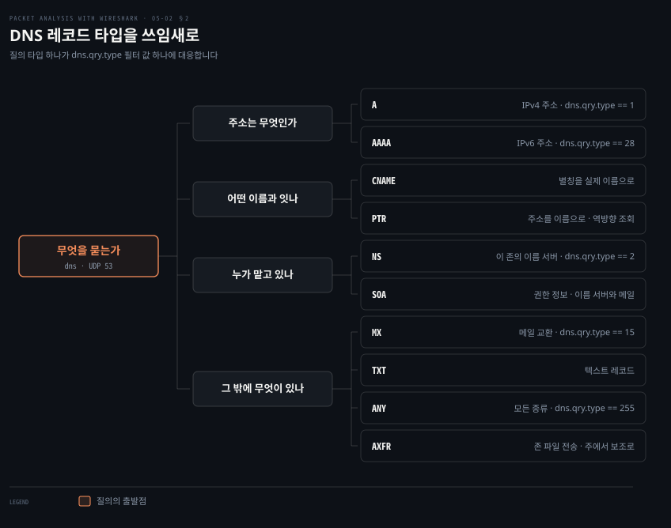
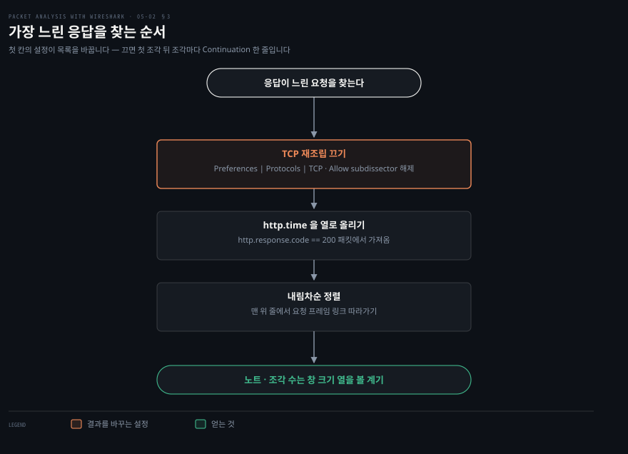

# 이름과 요청

---

> 5장 후반부는 주소를 받은 다음의 두 프로토콜을 봅니다. 이름을 주소로 바꾸는 DNS 와, 그 주소로 무언가를 요청하는 HTTP 입니다.

## 핵심 요약

> 이 편이 매달린 하나의 생각은 **DNS 와 HTTP 는 캡처에서 질문 한 줄과 답 한 줄로 읽히며, 그 두 줄 사이의 시간이 곧 성능 조사의 눈금이 된다**는 것입니다.

DNS 쪽에서 읽을 것은 질의 타입입니다. 원문은 이 메커니즘을 **"질의 타입에 따라 이름을 주소 같은 속성으로 옮기는 것"** 으로 설명합니다. 무엇을 알고 싶은지가 타입을 정하고, 타입이 정해지면 `dns.qry.type` 필터 값이 정해집니다.

HTTP 쪽에서 읽을 것은 응답 시간과 상태 코드입니다. 원문이 제시하는 절차의 첫 단계가 TCP 재조립을 *끄는* 것이라는 점이 눈에 띕니다. 한 응답이 몇 개의 세그먼트로 쪼개져 왔는지를 세기 위해서이고, 그 개수가 앞 장에서 본 윈도우 크기 튜닝의 근거가 됩니다.

두 프로토콜의 공통점이 하나 더 있습니다. **둘 다 평문이라 내용이 그대로 읽힙니다.** 원문도 HTTP 절에서 폼 전송의 비밀번호를 예로 들며 그 점을 짚습니다. 앞 장의 TLS 가 왜 필요한지가 여기서 대조로 드러납니다.


## 학습 목표

> 이 편을 읽고 나면 아래 다섯 가지를 스스로 해낼 수 있습니다.

1. 알고 싶은 것에 맞는 DNS 레코드 타입을 고르고 그에 맞는 `dns.qry.type` 필터를 쓸 수 있습니다.
2. DNS 캡처에서 질의 섹션과 응답 섹션을 각각 읽고 CNAME 체인을 따라갈 수 있습니다.
3. DNS 가 UDP 를 쓰다가 TCP 로 넘어가는 조건을 설명할 수 있습니다.
4. 가장 느린 HTTP 응답을 찾고, 그 응답이 몇 개의 세그먼트로 왔는지 셀 수 있습니다.
5. HTTP 메서드와 상태 코드로 필터를 걸어 원하는 트랜잭션만 뽑을 수 있습니다.


## 1. 이름을 주소로

> DNS 는 세 부분으로 이루어지고, 이 편은 그중 클라이언트 쪽만 봅니다. 질문 한 줄과 답 여러 줄이 오갑니다.

### 접속이 안 되는데 어디서 막혔는지

"서버에 못 붙는다"는 신고에서 이름 해석이 실패한 것인지 연결이 실패한 것인지는 완전히 다른 문제입니다. 앞 편의 TCP 조사로 넘어가기 전에 이름부터 풀렸는지 확인해야 합니다.

### 세 부분과 이 편이 보는 자리

원문은 DNS 를 **"모든 장비가 호스트명을 IP 주소로 옮기는 데 쓰는 것"** 으로 소개하고, 주요 구성 요소를 셋으로 나눕니다.

- 이름 공간(name space)
- 그 이름 공간을 제공하는 서버
- 이름 공간에 대해 서버에 질의하는 리졸버(클라이언트)

그리고 범위를 못박습니다. **"이 주제는 리졸버 관점에 집중합니다. 클라이언트가 서버에 질의를 보내고 서버가 답하는 자리이며, 같은 질의에 여러 답이 올 수 있습니다."**

여러 답이 올 수 있다는 마지막 조건이 화면을 읽을 때 자주 걸립니다. **응답 섹션에 줄이 여럿이면 그것은 오류가 아니라 CNAME 체인이거나 여러 주소를 가진 이름입니다.**

### 필터와 포트

원문의 안내는 앞 편들과 같은 구조입니다. **표시할 때는 `dns` 디스플레이 필터를, 잡을 때는 UDP 포트 53** 을 씁니다.

전송 프로토콜에 대한 설명이 중요합니다. 기본 포트는 53 이고 UDP 를 쓰지만, 원문의 표현대로 **"일부 DNS 시스템은 TCP 도 씁니다. TCP 는 응답 데이터 크기가 512바이트를 넘거나 존 전송 같은 작업에 쓰입니다."**

> **지금은 다릅니다**: 512바이트 한계는 EDNS(0) 로 완화됐습니다. RFC 6891 이 정의한 이 확장은 클라이언트가 자기가 받을 수 있는 UDP 페이로드 크기를 알리게 해 주므로, 512바이트를 넘는 응답도 UDP 로 옵니다. 캡처에서 OPT 의사 레코드가 보이면 EDNS(0) 를 쓰는 것입니다. 존 전송(AXFR)이 TCP 를 쓰는 것은 그대로입니다.


## 2. 리소스 레코드와 질의 타입

> 무엇을 알고 싶은지가 레코드 타입을 정하고, 타입이 필터 값을 정합니다.



### 타입을 모르면 질의를 못 만듭니다

`dig` 를 칠 때 타입을 빼면 A 레코드만 나옵니다. 메일 서버를 찾거나 IPv6 주소를 확인하려면 타입을 지정해야 하고, 캡처에서 남의 질의를 읽을 때도 타입 번호를 알아야 무엇을 물었는지 압니다.

### 레코드의 형식

원문은 DNS 가 쓰는 레코드 형식을 필드별로 제시하고 각각에 Wireshark 필터를 붙입니다.

| 필드 | 뜻 | 길이 | Wireshark 필터 |
|------|-----|------|---------------|
| NAME | 소유자 이름 | 가변 | `dns.qry.name == "google.com"` |
| TYPE | 리소스 레코드의 종류(숫자) | 2 | `dns.qry.type == 1` 등 |
| CLASS | 클래스 코드 | 2 | `dns.qry.class == 0x0001` |
| TTL | 유효 시간 | 4 | |
| RDLENGTH | RDATA 필드의 옥텟 길이 | 2 | |
| RDATA | 레코드별 추가 데이터 | 가변 | |

원문이 값과 함께 드는 타입은 다섯입니다.

- `dns.qry.type == 1` — A
- `dns.qry.type == 2` — NS
- `dns.qry.type == 15` — MX
- `dns.qry.type == 28` — AAAA
- `dns.qry.type == 255` — ANY

CLASS 는 `0x0001` 이 IN(인터넷)입니다.

위 그림이 원문의 `dig`·`nslookup` 예제에 나오는 타입 전부를 쓰임새로 묶은 것입니다. **주소를 묻는가, 이름을 잇는가, 권한을 묻는가, 부가 정보를 묻는가** 넷으로 갈립니다.

### 질의를 만들어 보기

원문은 `dig` 와 `nslookup` 으로 각 타입을 질의하고 백그라운드 캡처에서 질의·응답 섹션을 관찰하라고 안내합니다.

```bash
dig A     google.com. @8.8.4.4      # IPv4 주소
dig AAAA  ipv6.google.com. @8.8.4.4 # IPv6 주소
dig CNAME google.com. @8.8.4.4      # 별칭
dig MX    google.com. @8.8.4.4      # 메일 교환
dig NS    google.com. @8.8.4.4      # 이름 서버
dig SOA   google.com. @8.8.4.4      # 권한 정보
dig TXT   google.com. @8.8.4.4      # 텍스트 레코드
dig ANY   google.com. @8.8.4.4      # 모든 종류
```

원문은 각 명령에 `+noadditional +noquestion +nocomments +nocmd +nostats` 를 붙여 출력을 답 부분만 남깁니다. 캡처와 대조할 때 화면이 단순해져 편합니다.

> **노트의 읽기**: 원문은 PTR 질의 예로 `nslookup -type=ptr google.com 8.8.4.4` 를 듭니다. PTR 은 원문 자신이 적듯 역방향 조회용이라 **주소를 뒤집은 이름**(`x.x.x.x.in-addr.arpa`)을 물어야 하고, `google.com` 같은 정방향 이름으로 물으면 의미 있는 답이 오지 않습니다. 실제로 역방향을 확인하려면 `dig -x 8.8.4.4` 처럼 씁니다.

> **노트의 읽기**: AXFR 예로 든 `nslookup -type=axfr google.com 8.8.4.4` 도 그대로는 동작하지 않습니다. 원문이 적듯 AXFR 은 주 이름 서버에서 보조 이름 서버로 존 파일을 옮기는 작업이라 **그 존의 권한 서버**에 물어야 하는데, `8.8.4.4` 는 권한 서버가 아니라 공개 재귀 리졸버입니다. 게다가 공개된 서버는 대부분 AXFR 을 거부합니다. 명령의 형태를 익히는 예제로 읽는 편이 맞습니다.

### 캡처에서 읽기

원문은 `DNS-Packet.pcap` 을 열고 `dns.qry.type==28` 로 걸러 AAAA 질의를 봅니다. 읽히는 것은 이렇습니다.

클라이언트(`192.168.1.101`)가 이름 서버(`8.8.4.4`)에게 `ipv6.google.com` 을 풀어 달라고 요청합니다. 질의 섹션에는 레코드 타입 AAAA 와 호스트명, 클래스 IN 이 담깁니다. 이름 서버는 여러 답으로 응답합니다. **`ipv6.google.com` 의 정규 이름이 `ipv6.l.google.com` 이고, `ipv6.l.google.com` 의 AAAA 주소가 `2404:6800:4007:805::200e` 라는 두 줄입니다.**

이것이 앞에서 말한 "같은 질의에 여러 답"의 실제 모습입니다. **첫 줄은 CNAME 으로 이름을 넘기고 둘째 줄이 실제 주소를 줍니다.** 응답 줄이 여럿일 때 어느 것이 최종 답인지는 이렇게 체인을 따라가 확인합니다.


## 3. HTTP — 가장 느린 응답 찾기

> HTTP 는 요청 한 줄과 응답 한 줄로 읽힙니다. 둘 사이의 시간이 `http.time` 이고, 그것으로 정렬하면 느린 것이 위로 옵니다.



### 어느 요청이 느린지 모를 때

페이지가 느리다는 신고에서 어느 요청이 원인인지를 찾는 것이 첫 일입니다. 요청이 수십 개면 하나씩 보는 것은 현실적이지 않습니다.

### 원문의 세 단계

원문은 `http_01.pcap` 에서 가장 느린 HTTP GET 응답을 찾는 절차를 셋으로 제시합니다.

1. `Edit | Preferences | Protocols | TCP` 에서 **Allow subdissector to reassemble TCP streams 를 끕니다.**
2. 필터 바에 `http` 를 걸고 `http.response.code == 200` 패킷에서 `http.time` 을 열로 추가합니다.
3. Time since request 열을 눌러 내림차순으로 정렬하고, 맨 위 줄의 요청 프레임 링크를 따라갑니다.

첫 단계가 왜 필요한지에 원문이 이유를 답니다. **"이것은 실제 내용을 얻는 데 continuation 패킷이 몇 개인지 아는 데 도움이 되고, TCP 파라미터를 미세 조정하는 데도 도움이 됩니다."** 원문이 드는 미세 조정의 예가 continuation 패킷을 줄이려고 TCP 윈도우 크기를 설정하는 일입니다.

곧 재조립을 켜 두면 Wireshark 가 세그먼트를 합쳐 보여 주므로 **몇 조각으로 왔는지가 화면에서 사라집니다.** 앞 장에서 윈도우 100바이트 때문에 세그먼트가 2,584개가 됐던 예제가 바로 이 숫자였습니다. 두 장이 같은 지표를 양쪽에서 다루고 있습니다.

앞 편의 프로토콜 설정과 방향이 반대라는 점도 눈여겨볼 만합니다. **내용을 읽을 때는 재조립을 켜고, 성능을 잴 때는 끕니다.** 목적이 다르면 같은 설정의 좋고 나쁨이 뒤집힙니다.

### 평문이라는 사실

원문은 폼 전송을 예로 듭니다. `HTTP_FORM_POST.pcap` 을 열고 POST 만 걸러 password 폼 항목을 찾으라는 것입니다. 원문의 표현은 직설적입니다. **"폼에 비밀번호 같은 민감 정보가 담겨 있으면 Wireshark 가 쉽게 드러냅니다. HTTP 는 네트워크 위로 데이터를 옮기는 안전하지 않은 수단이기 때문입니다."**

이 한 문단이 4장 전체의 존재 이유를 요약합니다. **같은 요청이 TLS 위에 얹히면 앞 장에서 본 대로 `Application Data` 레코드로만 보입니다.**


## 4. HTTP 메서드와 상태 코드

> 메서드와 상태 코드는 필터 값이 그대로 의미입니다. 조사 범위를 좁히는 가장 빠른 손잡이입니다.

### 수천 요청에서 관심 있는 것만

캡처에 HTTP 요청이 수천 개면 `http` 필터만으로는 좁혀지지 않습니다. 무엇을 찾는지에 따라 메서드나 상태 코드로 한 번 더 걸러야 합니다.

### 메서드

원문이 정리한 메서드와 필터입니다.

| 메서드 | 뜻 | 필터 |
|--------|-----|------|
| GET | 지정한 자원을 가져옵니다 | `http.request.method == "GET"` |
| POST | 지정한 자원으로 처리할 데이터를 보냅니다 | `http.request.method == "POST"` |
| PUT | 지정한 URI 의 표현을 올립니다 | `http.request.method == "PUT"` |
| DELETE | 지정한 자원·엔티티를 지웁니다 | `http.request.method == "DELETE"` |
| OPTIONS | 서버가 지원하는 HTTP 메서드를 돌려줍니다 | `http.request.method == "OPTIONS"` |
| CONNECT | 요청 연결을 투명한 TCP/IP 터널로 바꿉니다 | `http.request.method == "CONNECT"` |

마지막 CONNECT 가 실무에서 자주 걸립니다. **프록시를 거쳐 HTTPS 를 쓰면 첫 요청이 `CONNECT` 로 나가고 그 뒤부터는 터널이라 내용이 안 보입니다.** 프록시 환경의 캡처에서 HTTP 가 갑자기 끊긴 것처럼 보이면 이 메서드를 찾아봅니다.

### 상태 코드

원문은 응답의 첫 줄에 상태 코드가 있다고 짚고 `http.response.code` 로 거르라고 안내합니다. **"HTTP 클라이언트-서버 상호작용을 디버깅할 때 도움이 됩니다."**

| 부류 | 범위 | 원문이 드는 예 |
|------|------|--------------|
| Informational · 1xx | 100 | 100 Continue · 101 Switching protocol |
| Successful · 2xx | 200–206 | 200 OK · 201 Created |
| Redirection · 3xx | 300–307 | 300 Multiple choices · 301 Moved permanently |
| Client Error · 4xx | 400–417 | 400 Bad Request · 401 Unauthorized |
| Server Error · 5xx | 500–505 | 500 Internal Server Error · 501 Not implemented |

부류 하나만 보고 싶을 때는 범위로 거는 편이 편합니다.

```bash
http.response.code >= 400 && http.response.code < 500   # 클라이언트 오류만
http.response.code >= 500                                # 서버 오류만
http.response.code == 200 && http.time > 1               # 성공했지만 1초 넘게 걸린 것
```

마지막 줄이 앞 절의 지표와 이어집니다. **오류는 없는데 느린 요청**이 성능 조사에서 실제로 찾는 대상이고, 상태 코드와 응답 시간을 함께 걸어야 나옵니다.


## 심화 학습

> 5장 후반부에서 바뀐 것은 DNS 의 전송 조건과 HTTP 의 버전입니다. 필터 이름은 그대로입니다.

| 원문(2015) | 현행(2026) | 성격 |
|-----------|-----------|------|
| `dns` · `http` 필터 | 그대로 | 유지 |
| UDP 512바이트 넘으면 TCP | EDNS(0) 로 완화. OPT 레코드가 크기를 알립니다[^rfc6891] | 확장 |
| 상태 코드 3xx 는 307 까지 | 308 이 추가됐습니다 | 확장 |
| HTTP/1.1 전제 | HTTP/2·HTTP/3 는 필터가 다릅니다 | 확장 |
| `http.time` · `http.response.code` | 그대로 | 유지 |
| PTR 예제가 정방향 이름 | 역방향 이름 또는 `dig -x` | 정오 |
| AXFR 을 공개 리졸버에 질의 | 권한 서버에 질의해야 하며 대개 거부됩니다 | 정오 |

원문이 다루지 않는 축이 둘 있습니다.

첫째는 **HTTP 버전이 올라가면 캡처가 달라진다**는 점입니다. HTTP/2 는 TLS 위의 바이너리 프레임이라 `http` 필터로는 안 잡히고 `http2` 를 써야 하며, 앞 장의 복호화가 없으면 내용이 보이지 않습니다. HTTP/3 는 TCP 가 아니라 QUIC(UDP) 위에 있어 `quic`·`http3` 를 씁니다. **원문의 `http` 필터로 아무것도 안 잡히는데 트래픽은 오간다면 버전을 먼저 의심합니다.**

둘째는 **DNS 도 암호화된다**는 점입니다. DoT(DNS over TLS, TCP 853)와 DoH(DNS over HTTPS, 443)를 쓰면 `dns` 필터로 안 잡힙니다. 이름 해석이 캡처에 안 보이는데 해석은 되고 있다면 이쪽을 봅니다.

```bash
# 원문의 필터로 안 잡힐 때 확인해 볼 것들
http2                       # HTTP/2 — TLS 복호화가 되어 있어야 보입니다
quic                        # HTTP/3 의 전송
tcp.port == 853             # DoT
dns || tcp.port == 853      # 평문 DNS 와 DoT 를 함께
```


## 면접 대비

### 한 줄 정의

"DNS 캡처는 질의 섹션의 타입과 이름, 응답 섹션의 여러 답을 읽는 일이고, HTTP 캡처는 요청 한 줄과 응답 한 줄 사이의 `http.time` 을 읽는 일입니다."

### 핵심 포인트 세 가지

1. **DNS 응답이 여러 줄인 것은 정상입니다.** CNAME 으로 이름을 넘기고 그다음 줄이 실제 주소를 주는 체인이 흔합니다. 최종 답을 찾으려면 체인을 따라갑니다.
2. **성능을 잴 때는 TCP 재조립을 끕니다.** 켜 두면 세그먼트가 합쳐져 한 응답이 몇 조각으로 왔는지가 안 보입니다. 그 개수가 윈도우 튜닝의 근거입니다.
3. **HTTP 는 평문입니다.** 폼의 비밀번호가 캡처에 그대로 남습니다. 이것이 앞 장의 TLS 가 필요한 이유이고, TLS 위에서는 같은 요청이 `Application Data` 로만 보입니다.

### 자주 묻는 질문

Q: `http` 필터에 아무것도 안 잡히는데 웹은 됩니다.
A: HTTPS 라면 앞 장의 복호화가 필요합니다. 복호화가 되어 있는데도 안 잡히면 HTTP/2 일 수 있으니 `http2` 로, QUIC 이라면 `quic` 으로 확인합니다.

Q: DNS 응답이 왜 여러 줄입니까?
A: CNAME 체인이거나 이름 하나에 주소가 여럿인 경우입니다. 원문 예제도 `ipv6.google.com` → `ipv6.l.google.com` → AAAA 주소로 두 줄이 옵니다.

Q: 느린 요청을 찾았는데 다음에 무엇을 봅니까?
A: 그 응답이 몇 개의 세그먼트로 왔는지와 윈도우 크기를 봅니다. 앞 장에서 본 대로 윈도우가 작으면 세그먼트 수가 폭증하고 그것이 전송 시간을 지배합니다.


## 핵심 개념 체크리스트

- [ ] 알고 싶은 것에 맞는 DNS 레코드 타입과 그 `dns.qry.type` 값을 댈 수 있습니까?
- [ ] DNS 응답의 CNAME 체인을 따라 최종 주소를 찾을 수 있습니까?
- [ ] DNS 가 TCP 로 넘어가는 조건과 EDNS(0) 가 바꾼 것을 설명할 수 있습니까?
- [ ] 성능을 잴 때 TCP 재조립을 왜 끄는지 말할 수 있습니까?
- [ ] 성공했지만 느린 요청만 뽑는 필터를 쓸 수 있습니까?
- [ ] 프록시 환경에서 `CONNECT` 가 무엇을 뜻하는지 설명할 수 있습니까?


## 관련 문서

- [05-01 주소를 받아 오는 프로토콜](./05-01.주소를 받아 오는 프로토콜.md) — 이 편의 앞. 이름을 묻기 전에 주소부터 받습니다
- [06-01 무선에서 잡기](./06-01.무선에서 잡기.md) — 다음 장. 매체가 무선으로 바뀔 때
- [Packet Analysis with Wireshark — 정독 인덱스](./README.md) — 7개 장 전체 지도


## 참고 자료

- 원본: 《Packet Analysis with Wireshark》 (Anish Nath, Packt Publishing, 2015) ISBN 978-1-78588-781-9
- 다룬 범위: Chapter 5 의 DNS · HTTP 절
- [RFC 1035 — DNS 구현과 명세](https://www.ietf.org/rfc/rfc1035.txt) — 원문 References 가 가리키는 문서
- [RFC 6891 — EDNS(0)](https://datatracker.ietf.org/doc/html/rfc6891) — 512바이트 한계를 완화한 확장
- [Wireshark Wiki — HTTP](https://wiki.wireshark.org/Hyper_Text_Transfer_Protocol) — 원문 References 가 가리키는 문서

[^rfc6891]: RFC 6891 "Extension Mechanisms for DNS (EDNS(0))" — 클라이언트가 OPT 의사 레코드로 자기가 받을 수 있는 UDP 페이로드 크기를 알려, 512바이트를 넘는 응답도 UDP 로 주고받을 수 있게 합니다. <https://datatracker.ietf.org/doc/html/rfc6891> (2026-09-05 조회)
