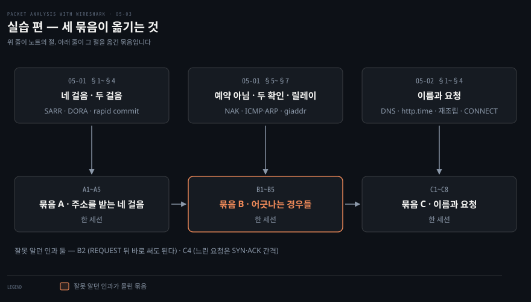
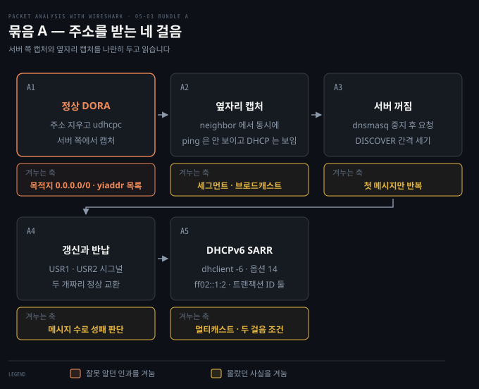
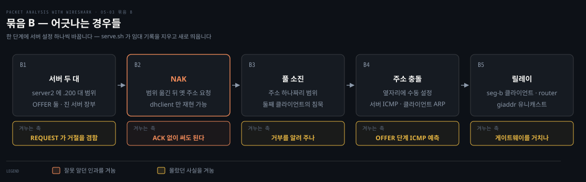
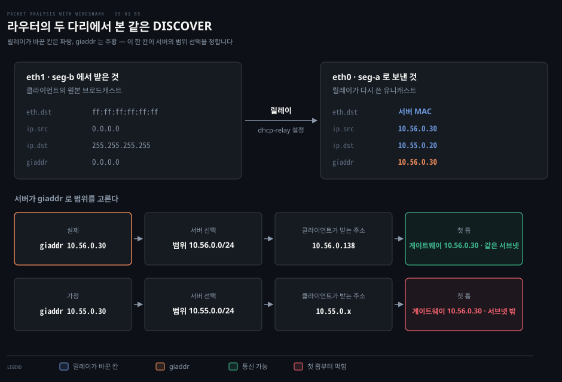

# 실습 — 주소를 직접 잡기

---

> 05-01 의 주소 받기를 컨테이너 일곱 개로 옮겨 두 묶음 10단계로 직접 잡은 기록입니다. 단계마다 무엇을 예측했고 캡처에 실제로 무엇이 찍혔는지를 나란히 둡니다.

05-02 의 이름과 요청을 같은 랩에서 잡은 묶음 C 는 [05-04 실습 — 이름과 요청을 직접 잡기](./05-04.%EC%8B%A4%EC%8A%B5%20%E2%80%94%20%EC%9D%B4%EB%A6%84%EA%B3%BC%20%EC%9A%94%EC%B2%AD%EC%9D%84%20%EC%A7%81%EC%A0%91%20%EC%9E%A1%EA%B8%B0.md)로 나눴습니다. 아래 실험실 절은 두 편이 함께 씁니다.

## 실험실

> OrbStack 리눅스 컨테이너 일곱. 서버는 `dnsmasq` 하나가 DHCP 와 DNS 를 다 맡고, 클라이언트는 `udhcpc`·`dhclient` 로 주소를 지웠다 다시 받습니다. 세그먼트는 둘입니다.



원서는 `dhclient -4 eth0` 한 줄로 DORA 를 만들라고 합니다. 맥북에서는 그 명령을 칠 자리가 없습니다. 맥의 DHCP 클라이언트는 손으로 띄우는 것이 아니고, 공유기가 내주는 주소는 조건을 바꿀 수 없습니다. 서버를 두 대 두거나 풀을 하나로 줄이거나 릴레이를 끼우려면 서버가 내 손에 있어야 하므로 4장과 같이 컨테이너로 옮깁니다.

랩은 저장소 밖 `~/study/paw-lab/05-dhcp/` 에 있습니다. `LAB.md` 에 구성과 돌리다 걸린 자리를 적어 두었습니다.

```bash
cd ~/study/paw-lab/05-dhcp
docker compose up -d --build            # 컨테이너 일곱, 세그먼트 둘
./serve.sh dhcp-server dhcp-a.conf      # dnsmasq 를 임대 기록 없이 새로 띄움
./look-dhcp.sh pcap/a1-server.pcap      # DHCP 캡처를 정렬된 표로
./look.sh pcap/c4-client.pcap http frame.number http.time   # 아무 필드나 표로
docker compose down                     # 정리
```

| 컨테이너 | 주소 | 역할 |
|---|---|---|
| `dhcp-server` | 10.55.0.20 · fd00:55::20 | DHCP·DNS 서버, HTTP(80)·TLS(443) 서버 |
| `dhcp-server2` | 10.55.0.21 | 둘째 DHCP 서버(B1), 프록시(C6) |
| `dhcp-client` · `dhcp-client2` | 도커가 .2~.14 에서 배정 | 주소를 지우고 다시 받는 쪽 |
| `dhcp-neighbor` | 도커가 배정 | 옆자리. 남의 교환이 어디까지 보이는지 캡처하는 쪽 |
| `dhcp-router` | 10.55.0.30 · 10.56.0.30 | 두 세그먼트에 걸친 라우터. 릴레이가 도는 자리(B5) |
| `dhcp-client-b` | 10.56.0.x | 서버와 다른 세그먼트의 클라이언트(B5) |

### 서버·클라이언트 프로그램과 설정 파일

주소를 내주는 쪽은 `dnsmasq` 입니다. 작은 네트워크용 DHCP·DNS 서버이고 공유기 펌웨어에 흔히 들어 있습니다. 한 프로그램이 어느 설정 파일을 읽느냐에 따라 DHCP 서버도 되고 이름 서버도 됩니다. `.conf` 는 설정 파일에 흔히 붙는 이름일 뿐이라 문법은 프로그램마다 따로입니다.

| 설정 파일 | 쓰는 단계 | 핵심 줄 |
|---|---|---|
| `dhcp-a.conf` | A1~A4, B1, B4 | `dhcp-range=10.55.0.100,10.55.0.150,...,2m` · `port=0` 은 DNS 를 끈다는 뜻 |
| `dhcp-b2.conf` | B1 의 둘째 서버 | 범위 `.200~.220` — 제안한 주소만 보고 어느 서버인지 갈립니다 |
| `dhcp-moved.conf` | B2 | 범위를 `.160~.170` 으로 옮기고 `dhcp-authoritative` |
| `dhcp-one.conf` | B3 | 범위가 `.100` 하나 |
| `dhcp6.conf` | A5 | DHCPv6 범위 `fd00:55::1000~1fff` |
| `dhcp-relay-server.conf` · `relay.conf` | B5 | 서버는 두 세그먼트 몫의 범위, 라우터는 `dhcp-relay=10.56.0.30,10.55.0.20` |
| `dns.conf` | C1~C3 | `lab.test` 존의 A·AAAA·CNAME·MX·TXT·NS·SOA 와 큰 TXT |

`serve.sh` 는 dnsmasq 를 끄고 임대 기록 파일(`/var/lib/misc/dnsmasq.leases`)을 지운 뒤 다시 띄웁니다. 기록을 남겨 두면 앞 단계에서 준 주소를 기억해 곧바로 같은 주소를 줍니다. 단계마다 깨끗한 서버에서 시작하려고 지웁니다. 운영에서는 이 파일 덕분에 재시작해도 누구에게 무엇을 빌려줬는지 잊지 않습니다.

받는 쪽은 둘입니다. IPv4 는 busybox 의 `udhcpc` 를 씁니다. 출력이 짧아 캡처와 맞춰 보기 쉽습니다. 옛 주소를 기억했다가 다시 요청하는 동작(B2)과 IPv6(A5)는 `udhcpc` 에 없어서 그 두 자리만 ISC `dhclient` 를 씁니다. 네 걸음을 보내는 순서는 커널이 아니라 이 클라이언트 프로그램이 정합니다. 커널은 패킷을 내보내고 받을 뿐입니다. 주소가 확정되면 프로그램이 커널에 "이 인터페이스에 이 주소를 붙여라"고 지시합니다.

A4 의 갱신과 반납은 시그널로 시킵니다. 시그널은 커널이 프로세스에게 번호 하나를 전하는 통지입니다. `SIGUSR1`(10)과 `SIGUSR2`(12)는 용도를 프로그램이 정하도록 비워 둔 번호이고, `udhcpc` 는 앞의 것을 갱신에, 뒤의 것을 반납에 배정했습니다.

### 잡는 쪽과 읽는 쪽을 가릅니다

캡처는 컨테이너 안 `tcpdump` 가 `pcap/` 에 쓰고, 읽는 일은 호스트의 `tshark` 가 합니다. 05-03·05-04 두 편 18단계의 명령 블록은 모두 같은 틀을 따르므로 여기서 한 번만 풀어 둡니다. 아래 단계들에서는 이 틀 밖의 줄에만 주석을 답니다.

```bash
# 1. 관찰할 자리에서 캡처를 백그라운드로 켭니다 (-U: 패킷마다 파일에 바로 씀)
docker exec -d <컨테이너> sh -c 'tcpdump -i eth0 -w /pcap/<이름>.pcap -U "<필터>" 2>/dev/null'
sleep 2                                   # tcpdump 가 준비될 시간
# 2. 실험 대상 명령을 실행합니다 — 단계마다 여기만 다릅니다
docker exec dhcp-client sh -c '...'
# 3. 2초 기다렸다 캡처를 끕니다 (바로 끄면 뒤쪽 프레임이 빠짐, 아래 함정 참고)
sleep 2; docker exec <컨테이너> pkill tcpdump
# 4. 호스트에서 표로 읽습니다
./look-dhcp.sh pcap/<이름>.pcap
```

DHCP 는 `./look-dhcp.sh` 로 읽습니다. 한 줄에 메시지 종류와 아래 표의 칸들을 나란히 놓습니다. 그 밖의 표는 `./look.sh <pcap> <필터|-> <필드...>` 로 뽑습니다.

종류 칸은 번호로 찍힙니다. 1 DISCOVER · 2 OFFER · 3 REQUEST · 4 DECLINE · 5 ACK · 6 NAK · 7 RELEASE 입니다. 나머지 칸의 이름은 RFC 2131 의 필드 이름이라 처음 보면 암호처럼 읽힙니다. 뜻은 이렇습니다.

| 칸 | 뜻 | 주로 보이는 자리 |
|---|---|---|
| `eth.dst` | 이더넷 프레임의 목적지 MAC. DHCP 칸이 아니라 Wireshark 의 이더넷 필드 | 모든 프레임 |
| `chaddr` | 클라이언트의 MAC 주소 | 모든 메시지 |
| `yiaddr` | 서버가 클라이언트에게 주는 주소 (your IP) | OFFER · ACK |
| `ciaddr` | 클라이언트가 이미 쓰고 있는 주소 (client IP) | 갱신 · 반납 |
| `giaddr` | 요청을 대신 넘긴 릴레이의 주소 (gateway IP) | 라우터를 건넌 요청 (B5) |
| 옵션 54 | 이 메시지와 관련된 서버의 주소 (서버 식별자) | OFFER · REQUEST · ACK |
| 옵션 50 | 클라이언트가 달라고 하는 주소 | REQUEST |
| 트랜잭션 ID | 한 번의 교환을 묶는 번호 | 모든 메시지 |

두 스크립트 모두 빈 칸을 `-` 로 채웁니다. `column -t` 는 빈 필드를 건너뛰어 뒤 값을 앞 열로 당깁니다. 채우지 않으면 C3 에서처럼 포트 번호가 엉뚱한 열 밑에 찍혀 읽기를 망칩니다.

단계마다 읽는 순서도 같습니다. 예측 질문, 명령, 캡처 표, 해석 순으로 갑니다. 마지막 인용 상자에는 흔히 틀리는 예측을 적었습니다. 표를 보기 전에 예측 질문에 답을 정해 두면 해석 문단이 훨씬 빨리 읽힙니다.

### 먼저 알아야 할 함정

실행 중에 실제로 부딪혀 고친 것들입니다. 모르면 캡처가 비거나 개수가 틀립니다.

캡처를 멈추기 전에 2초를 기다립니다. `tcpdump` 는 커널 버퍼에 모인 패킷을 묶음으로 받아 오므로 마지막 메시지 직후에 죽이면 뒤쪽 프레임이 파일에 안 남습니다. DISCOVER 하나만 남은 적이 있습니다.

보낸 쪽에서 뜬 캡처에는 자기가 보낸 DHCP 프레임이 두 번 찍힙니다(자기 캡처 중복). `udhcpc` 와 `dnsmasq` 가 raw 소켓으로 내보내는 프레임이 그렇습니다. 선 위에서는 한 번이고 옆자리나 상대편 캡처에는 한 번만 보입니다. 개수를 셀 때는 받는 쪽 캡처를 씁니다.

`dnsmasq` 가 제안하는 주소는 클라이언트 MAC 에서 나오고, 컨테이너를 다시 만들면 MAC 이 바뀝니다. B4 는 주소를 외워 두지 말고 그 자리에서 먼저 제안된 주소를 확인해 옆자리에 넣습니다.

주소를 지울 때는 `ip -4 addr flush dev eth0` 로 IPv4 만 지웁니다. `-4` 를 빼면 IPv6 링크 로컬까지 사라져 `dhclient -6` 이 `no link-local IPv6 address for eth0` 로 시작도 못 합니다. 이미 지웠으면 `ip link set eth0 down; ip link set eth0 up` 으로 링크 로컬을 다시 만듭니다.

zsh 에서 `echo == SARR` 은 `zsh: = not found` 로 그 줄을 끊습니다. zsh 는 `=` 로 시작하는 단어를 명령 경로 찾기로 해석하기 때문입니다. 구분 표시는 `echo '== SARR'` 처럼 따옴표로 감쌉니다.

서버를 "없을 때만" 띄울 때 `sh -c 'pgrep -f s_server || ...'` 는 쓰지 않습니다. `-f` 는 명령줄 전체를 보므로 검사하는 `sh -c` 문자열 자신이 걸려 서버를 띄우지 않고 넘어갑니다. C6 에서 프록시가 CONNECT 에 500 을 돌려준 원인이었습니다. 이름이 정확히 같은 프로세스만 찾는 `pgrep -x` 를 쓰거나 `docker exec -d` 로 직접 띄운 뒤 `ss -ltn` 으로 LISTEN 을 확인합니다.


## 묶음 A · 주소를 받는 네 걸음

> 정상 DORA 를 서버와 옆자리 양쪽에서 잡고, 서버를 끈 채 다시 요청하고, 갱신과 반납을 세고, 같은 흐름을 DHCPv6 로 한 번 더 잡습니다. 다섯 단계입니다.



### A1. 주소가 없는 클라이언트에게 OFFER 는 MAC 으로 꽂힙니다

먼저 예측합니다. 서버 캡처에 DHCP 메시지는 몇 개 찍힐까요? 첫 DISCOVER 의 목적지가 `255.255.255.255` 라면, 아직 주소가 없는 클라이언트에게 서버는 OFFER 를 어디로 보낼까요?

```bash
# 서버와 옆자리 두 곳에서 동시에 잡습니다 (옆자리 캡처는 A2 에서 읽음)
# icmp 를 넣은 것은 서버가 주소를 내주기 전에 보내는 ping 확인까지 보려고
docker exec -d dhcp-server sh -c 'tcpdump -i eth0 -w /pcap/a1-server.pcap -U "port 67 or port 68 or icmp" 2>/dev/null'
docker exec -d dhcp-neighbor sh -c 'tcpdump -i eth0 -w /pcap/a1-neighbor.pcap -U "port 67 or port 68 or icmp" 2>/dev/null'
sleep 2
# IPv4 주소를 지우고 새로 받은 뒤, 받은 주소로 서버에 ping 이 나가는지 확인
# udhcpc: -f 포그라운드, -q 주소를 받으면 종료, -n 실패하면 종료, -t 4 최대 4번 시도
docker exec dhcp-client sh -c 'ip -4 addr flush dev eth0; udhcpc -i eth0 -f -q -n -t 4; ping -c 2 -W 1 10.55.0.20 | tail -1'
sleep 2; docker exec dhcp-server pkill tcpdump; docker exec dhcp-neighbor pkill tcpdump
./look-dhcp.sh pcap/a1-server.pcap
```

| 프레임 | 시각(초) | eth.dst | 출발지 → 목적지 | 종류 | yiaddr | 옵션 54 · 50 |
|---|---|---|---|---|---|---|
| 1 | 0.000 | `ff:ff:ff:ff:ff:ff` | 0.0.0.0 → 255.255.255.255 | 1 DISCOVER | 0.0.0.0 | - |
| 2 | 3.008 | `ff:ff:ff:ff:ff:ff` | 0.0.0.0 → 255.255.255.255 | 1 DISCOVER | 0.0.0.0 | - |
| 3 | 3.017 | 클라이언트 MAC | 10.55.0.20 → 10.55.0.137 | ICMP | | |
| 4·5 | 3.017 | `c6:68:75:04:f6:c1` | 10.55.0.20 → 10.55.0.137 | 2 OFFER | 10.55.0.137 | 54 = .20 |
| 6 | 3.017 | `ff:ff:ff:ff:ff:ff` | 0.0.0.0 → 255.255.255.255 | 3 REQUEST | 0.0.0.0 | 54 = .20 · 50 = .137 |
| 7 | 3.024 | `c6:68:75:04:f6:c1` | 10.55.0.20 → 10.55.0.137 | 5 ACK | 10.55.0.137 | 54 = .20 |

표를 위에서 아래로 읽으면 DISCOVER → OFFER → REQUEST → ACK 네 걸음이 보입니다. 네 걸음은 한 트랜잭션 ID(`0x8e237041`)로 묶였고 3초 안에 끝났습니다. 줄 수가 넷보다 많은 이유는 둘입니다. 1·2번 DISCOVER 가 3초 벌어진 것은 클라이언트가 재전송했기 때문입니다. 4·5번 OFFER 둘은 앞의 「자기 캡처 중복」 함정이라 선 위에서는 하나입니다.

뒤따르는 ping 은 출발지가 `10.55.0.137` 로 바뀌어 받은 주소가 인터페이스에 붙었음을 보여 줍니다. 임대(lease) 120초는 설정 파일의 `2m` 입니다. 그 안에 갱신하지 않으면 주소는 회수됩니다.

첫째 예측 질문의 답은 `eth.dst` 칸에 있습니다. OFFER 의 목적지 IP 는 클라이언트가 아직 갖지 않은 `10.55.0.137` 인데도 도착했습니다. 서버가 IP 가 아니라 MAC 으로 배달했기 때문입니다.

서버는 클라이언트 MAC 을 두 군데서 얻습니다. DISCOVER 프레임의 출발지 MAC 과 DHCP 메시지 안의 `chaddr` 칸입니다. 그리고 브로드캐스트가 아니라 그 MAC 앞으로 프레임을 꽂습니다. 같은 세그먼트 안이라 스위치는 MAC 만 보고 그 포트로 보냅니다. NIC 은 자기 MAC 앞으로 온 프레임을 받아들이고 `udhcpc` 는 IP 스택 아래의 raw 소켓으로 그것을 읽습니다. IP 주소가 없어도 받을 수 있는 이유가 이 raw 소켓입니다.

이 동작은 RFC 2131 §4.1 이 BROADCAST 비트가 꺼진 첫 요청에 서버가 하라고 정한 그대로입니다.[^rfc2131-unicast] 비트가 켜진 경우는 [05-01 §4 「서버의 답은 옆자리에 보이는가」](./05-01.%EC%A3%BC%EC%86%8C%EB%A5%BC%20%EB%B0%9B%EC%95%84%20%EC%98%A4%EB%8A%94%20%ED%94%84%EB%A1%9C%ED%86%A0%EC%BD%9C.md)가 다룹니다.

`yiaddr` 칸은 걸음마다 값이 바뀝니다.

| 걸음 | `yiaddr` | 뜻 |
|---|---|---|
| DISCOVER | `0.0.0.0` | 아직 받은 주소 없음 |
| OFFER | `10.55.0.137` | 서버가 제안하는 주소 하나 |
| REQUEST | `0.0.0.0` | 고른 주소는 이 칸이 아니라 옵션 50 에 실음 |
| ACK | `10.55.0.137` | 확정된 그 주소 |

포트가 67(서버)과 68(클라이언트)로 갈린 이유도 여기서 보입니다. 응답이 브로드캐스트로 올 수도 있으니 목적지 IP 로는 받을 프로그램을 가릴 수 없습니다. 그래서 커널은 목적지 포트 68 을 보고 그 포트를 듣는 `udhcpc` 에게 넘깁니다. 한 장비에 서버와 클라이언트가 함께 있어도 같은 포트를 두 프로그램이 잡지 않게 번호가 나뉘어 있습니다.

> **흔한 예측 실수** — OFFER 를 DISCOVER 의 출발지로 되돌려 보낸다고 봅니다. 그 출발지가 `0.0.0.0` 이라 되돌릴 IP 가 없습니다. 서버가 쥔 것은 MAC 입니다. `yiaddr` 에 주소 목록이 온다고 보는 것도 흔한데, 서버 하나는 주소 하나를 제안합니다.

### A2. 옆자리에는 브로드캐스트만 도착합니다

같은 시간에 `dhcp-neighbor` 가 뜬 캡처입니다. 먼저 예측합니다. 서버 캡처 11줄 가운데 몇 줄이 옆자리에 남을까요?

```bash
./look-dhcp.sh pcap/a1-neighbor.pcap
```

| 프레임 | eth.dst | 출발지 → 목적지 | 종류 | 옵션 54 · 50 |
|---|---|---|---|---|
| 1 | `ff:ff:ff:ff:ff:ff` | 0.0.0.0 → 255.255.255.255 | 1 DISCOVER | - |
| 2 | `ff:ff:ff:ff:ff:ff` | 0.0.0.0 → 255.255.255.255 | 1 DISCOVER | - |
| 3 | `ff:ff:ff:ff:ff:ff` | 0.0.0.0 → 255.255.255.255 | 3 REQUEST | 54 = .20 · 50 = .137 |

세 줄이 남았고 전부 브로드캐스트입니다. OFFER·ACK·ping 은 클라이언트 MAC 앞으로 간 유니캐스트라 스위치가 옆자리 포트로 보내지 않았습니다. 규칙은 단순합니다. 브로드캐스트는 옆자리에 오고, 유니캐스트는 오지 않습니다.

1장에서 나눈 "옆자리에 오는 것과 안 오는 것"의 두 갈래가 한 캡처에 나란히 찍힌 셈입니다. TAP 도 SPAN 도 없이 남의 DHCP 요청을 내 자리에서 볼 수 있다는 05-01 §1 의 문장이 이것입니다. DISCOVER 가 여기서도 둘이므로 A1 의 재전송이 자기 캡처 중복이 아니라 선 위에서 실제로 두 번 나간 것이라는 점도 확인됩니다.

REQUEST 가 옆자리에 찍힌 이유는 옵션 54 에 있습니다. 서버가 여럿이면 모두가 이 한 번의 브로드캐스트를 듣고 옵션 54 에 자기가 적히지 않은 서버는 선택받지 못했음을 압니다. 선택과 거절을 한 메시지가 겸합니다. 실제로 둘째 서버가 물러나는 모습은 B1 에서 봅니다.

> **흔한 예측 실수** — REQUEST 는 고른 서버에게만 보내니 옆자리에 없다고 봅니다. 고르지 않은 서버들도 알아야 하므로 브로드캐스트입니다.

### A3. 서버가 없으면 DISCOVER 만 반복됩니다

서버의 dnsmasq 를 멈추고 다시 요청합니다. `-t 4 -T 2` 는 최대 4번, 2초 간격으로 시도하라는 옵션입니다. 먼저 예측합니다. 서버가 없다는 사실을 클라이언트는 어떻게 알게 될까요?

```bash
./serve.sh dhcp-server stop               # 서버의 dnsmasq 를 끔
docker exec -d dhcp-neighbor sh -c 'tcpdump -i eth0 -w /pcap/a3-neighbor.pcap -U "port 67 or port 68" 2>/dev/null'
sleep 2
# 답이 없으니 4번 시도 뒤 "no lease, failing" 으로 끝남
docker exec dhcp-client sh -c 'ip -4 addr flush dev eth0; udhcpc -i eth0 -f -q -n -t 4 -T 2'
sleep 2; docker exec dhcp-neighbor pkill tcpdump
./look-dhcp.sh pcap/a3-neighbor.pcap
```

DISCOVER 네 개가 0·2.007·4.017·6.024초에 찍히고 `udhcpc: no lease, failing` 으로 끝납니다. 넷 모두 트랜잭션 ID 가 `0x309d8c09` 로 같습니다. 재시도는 같은 요청을 되풀이한 것입니다.

예측 질문의 답은 "알려 주는 쪽이 없다"입니다. 꺼진 서버는 "나 없다"고 알릴 수단이 없습니다. 클라이언트는 정해진 횟수와 시간이 다 지나도록 답이 없다는 사실로만 실패를 판단합니다. 05-01 결정 치트시트의 첫 행 "DISCOVER 만 반복"의 실물입니다.

2초 간격은 이 랩이 `-T 2` 로 고정한 값입니다. RFC 2131 §4.1 은 첫 재전송을 4초 안팎으로 두고 이후 두 배씩 늘리라고 권합니다.[^rfc2131-backoff]

> **흔한 예측 실수** — 반복되는 메시지를 OFFER 로 셉니다. 종류 열이 `1`, 곧 클라이언트의 DISCOVER 입니다. OFFER 는 서버가 보내는 것이라 서버가 없으면 하나도 없습니다.

### A4. 갱신과 반납은 두 개짜리 정상 교환입니다

`udhcpc` 를 백그라운드로 두고 `SIGUSR1` 로 갱신, `SIGUSR2` 로 반납을 시킵니다. 먼저 예측합니다. 갱신은 메시지 몇 개이고, 처음 받을 때처럼 브로드캐스트일까요?

```bash
./serve.sh dhcp-server dhcp-a.conf
docker exec -d dhcp-server sh -c 'tcpdump -i eth0 -w /pcap/a4-server.pcap -U "port 67 or port 68" 2>/dev/null'
sleep 2
# -b: 주소를 받은 뒤 백그라운드로 남음, -p: 시그널을 보낼 PID 를 파일에 기록
docker exec dhcp-client sh -c '
  ip -4 addr flush dev eth0; udhcpc -i eth0 -b -p /tmp/udhcpc.pid; sleep 2
  kill -USR1 $(cat /tmp/udhcpc.pid); sleep 2    # 갱신
  kill -USR2 $(cat /tmp/udhcpc.pid); sleep 1    # 반납
  ip -4 addr show eth0 | grep inet              # 반납 뒤라 빈 출력이어야 함
  kill $(cat /tmp/udhcpc.pid)'
sleep 2; docker exec dhcp-server pkill tcpdump
./look-dhcp.sh pcap/a4-server.pcap
```

1~6번은 A1 과 같은 DORA 입니다. 관찰 대상은 그 뒤 세 줄입니다.

| 프레임 | 시각(초) | eth.dst | 출발지 → 목적지 | 종류 | ciaddr | 트랜잭션 ID |
|---|---|---|---|---|---|---|
| 7 | 5.038 | 서버 MAC | 10.55.0.137 → 10.55.0.20 | 3 REQUEST (갱신) | 10.55.0.137 | `0x7ca7dc24` |
| 8 | 5.040 | 클라이언트 MAC | 10.55.0.20 → 10.55.0.137 | 5 ACK | 10.55.0.137 | `0x7ca7dc24` |
| 9 | 7.039 | 서버 MAC | 10.55.0.137 → 10.55.0.20 | 7 RELEASE | 10.55.0.137 | `0xcf0b0c37` |

갱신은 REQUEST 와 ACK 두 개이고 유니캐스트입니다. 처음 받을 때와 달리 클라이언트는 이미 주소를 갖고 있습니다. 앞서 받은 ACK 의 옵션 54 로 서버 주소도 압니다. 그래서 외칠 필요 없이 서버에게 바로 보냅니다. `ciaddr` 칸에는 자기 주소가 채워져 나갑니다. 유니캐스트라 옆자리에서는 이 교환이 보이지 않습니다.

반납은 RELEASE 하나이고 서버는 답하지 않습니다. 반납 뒤 `ip -4 addr` 는 빈 출력입니다. 반납만 새 트랜잭션 ID 를 썼습니다. 앞 교환을 잇지 않는 별개 요청이기 때문입니다.

이 단계의 요점은 메시지 두 개짜리 교환도 정상일 수 있다는 것입니다. 메시지 수만 세고 성패를 판단하면 갱신을 실패로 읽습니다.

> **흔한 예측 실수** — 갱신과 반납도 브로드캐스트라고 봅니다. 주소와 서버를 모두 아는 단계라 유니캐스트로 충분합니다.

### A5. DHCPv6 도 같은 네 걸음이고 목적지는 멀티캐스트입니다

`dhclient -6` 으로 SARR 을 한 번, rapid commit 설정(`send dhcp6.rapid-commit;`)을 물려 한 번 더 받습니다. 옆자리에서 캡처합니다. 먼저 예측합니다. 브로드캐스트가 없는 IPv6 에서 SOLICIT 의 목적지는 무엇이고, rapid commit 교환은 옆자리에 몇 줄 남을까요?

```bash
./serve.sh dhcp-server dhcp6.conf
docker exec -d dhcp-neighbor sh -c 'tcpdump -i eth0 -w /pcap/a5-neighbor.pcap -U "udp port 546 or udp port 547" 2>/dev/null'
sleep 2
# 첫 번째: 기본 SARR 네 걸음. 끝에 -r 로 주소를 반납해 두 번째 시도를 깨끗하게 시작
# dhclient: -6 DHCPv6, -1 한 번만 시도, -lf 임대 기록 파일, -pf PID 파일
echo '== SARR'; docker exec dhcp-client sh -c '
  rm -f /tmp/d6.lease
  timeout 25 dhclient -6 -v -1 -lf /tmp/d6.lease -pf /tmp/d6.pid eth0 2>&1 | grep -E "Solicit|Advertise|Request|Reply|Bound"
  kill $(cat /tmp/d6.pid); dhclient -6 -r -lf /tmp/d6.lease eth0'
# 두 번째: -cf 로 rapid commit 설정 파일을 물림 (두 걸음으로 끝나야 함)
echo '== RAPID'; docker exec dhcp-client sh -c '
  rm -f /tmp/d6.lease
  timeout 25 dhclient -6 -v -1 -cf /conf/dhclient6-rapid.conf -lf /tmp/d6.lease -pf /tmp/d6.pid eth0 2>&1 | grep -E "Solicit|Advertise|Request|Reply|Bound"
  kill $(cat /tmp/d6.pid)'
sleep 2; docker exec dhcp-neighbor pkill tcpdump
./look.sh pcap/a5-neighbor.pcap - frame.number ipv6.src ipv6.dst dhcpv6.msgtype dhcpv6.xid dhcpv6.option.type
```

`dhclient` 로그의 `XMT`·`RCV`·`PRC` 는 송신·수신·처리를 뜻하는 접두어입니다. SARR 쪽 로그는 Solicit → Advertise → Request → Reply → Bound, rapid 쪽은 Solicit → Reply → Bound 입니다.

표의 `msgtype` 은 DHCPv6 메시지 종류 번호입니다. 1 SOLICIT · 2 ADVERTISE · 3 REQUEST · 7 REPLY · 8 RELEASE 이고, IPv4 의 종류 칸에 해당합니다. `xid` 는 IPv4 의 트랜잭션 ID 에 해당하는 번호입니다.

| 프레임 | 출발지 → 목적지 | msgtype | xid | 옵션 |
|---|---|---|---|---|
| 1 | `fe80::c468:75ff:fe04:f6c1` → `ff02::1:2` | 1 SOLICIT | `0xcf33cd` | 1,6,8,3 |
| 2 | 같음 | 3 REQUEST | `0x3c05ce` | 1,2,6,8,3,5 |
| 3 | 같음 | 8 RELEASE | `0x375726` | 1,2,6,8,3,5 |
| 4 | 같음 | 1 SOLICIT | `0xdfd776` | 1,6,8,14,3 |

옆자리에는 클라이언트가 멀티캐스트 `ff02::1:2`(모든 DHCP 서버와 릴레이)로 낸 것만 남았습니다. 서버의 ADVERTISE·REPLY 는 유니캐스트라 없습니다. IPv4 의 A2 에서 DISCOVER·REQUEST 만 남던 것과 같은 구조입니다. 브로드캐스트 자리를 멀티캐스트가 대신했을 뿐입니다.

표의 1~3번이 SARR 쪽, 4번이 rapid 쪽입니다. 4번 줄의 옵션 14 가 rapid commit 이고, 그 교환에서 옆자리가 본 것은 SOLICIT 하나뿐입니다. 출발지 링크 로컬의 끝 `c468:75ff:fe04:f6c1` 은 A1 의 클라이언트 MAC `c6:68:75:04:f6:c1` 에서 만들어진 주소입니다.

IPv4 와 달리 SOLICIT 과 REQUEST 의 트랜잭션 ID 가 다릅니다. DORA 넷은 한 번호로 묶였는데 SARR 은 걸음마다 새 번호입니다. 05-01 이 원서를 따라 "REQUEST 는 새 트랜잭션 ID 를 담는다"고 짚은 자리가 이것입니다.

멀티캐스트가 그룹에 가입하지 않은 옆자리까지 온 데에는 두 겹의 이유가 있습니다. 먼저 도커 브리지는 MLD 스누핑을 하지 않아 멀티캐스트를 모든 포트로 내보냅니다. 스누핑은 스위치가 "이 그룹을 받겠다"는 가입 보고를 엿봐 그 포트로만 그룹 프레임을 보내는 기능입니다. 가입 보고는 IPv4 에서 IGMP, IPv6 에서 MLD 이고 그림은 [01-01 §4 「IGMP 스누핑」](./01-01.%ED%8C%A8%ED%82%B7%20%EB%B6%84%EC%84%9D%EA%B8%B0%EC%99%80%20Wireshark.md)에 있습니다.

다음으로 `tcpdump` 가 NIC 을 promiscuous 모드로 열어 자기 그룹이 아닌 프레임도 버리지 않습니다. 스누핑하는 스위치였다면 첫째 관문에서 걸러져 옆자리에는 오지 않았을 것입니다. 05-01 §1 「IPv6 는 스위치의 MLD 스누핑에 따라 달라집니다」가 이 조건을 다룹니다.

처음 시도는 시작도 못 했습니다. 주소를 지우며 `-4` 를 빼 링크 로컬까지 지웠기 때문입니다. 실패 자체가 배울 거리였습니다. IPv6 클라이언트는 링크 로컬 주소가 있어야 서버를 부를 수 있고 그 자리가 IPv4 의 `0.0.0.0` 에 해당합니다.

> **흔한 예측 실수** — rapid commit 이면 옆자리에도 두 줄이 보인다고 봅니다. 두 줄은 클라이언트 쪽 로그의 이야기이고, 선 위에서 옆자리에 닿는 것은 멀티캐스트인 SOLICIT 하나입니다.


## 묶음 B · 어긋나는 경우들

> 서버 둘, 줄 수 없는 주소, 빈 풀, 남이 먼저 쓰는 주소, 라우터 너머의 서버를 차례로 만듭니다. 한 단계에 서버 설정 하나씩 바꾸며 다섯 단계입니다.



### B1. 서버 두 대가 제안하면 REQUEST 하나가 둘을 정리합니다

`dhcp-server2` 에 `.200~.220` 범위를 주고 두 서버를 함께 띄웁니다. 먼저 예측합니다. 골라지지 않은 서버는 REQUEST 를 받은 뒤 무엇을 할까요?

```bash
./serve.sh dhcp-server dhcp-a.conf       # 첫째 서버: .100~.150
./serve.sh dhcp-server2 dhcp-b2.conf     # 둘째 서버: .200~.220
# 캡처는 질 쪽(둘째 서버)에서 — REQUEST 를 받은 뒤 무엇을 하는지 보려고
docker exec -d dhcp-server2 sh -c 'tcpdump -i eth0 -w /pcap/b1-server2.pcap -U "port 67 or port 68" 2>/dev/null'
sleep 2
docker exec dhcp-client sh -c 'ip -4 addr flush dev eth0; udhcpc -i eth0 -f -q -n -t 4'
sleep 2; docker exec dhcp-server2 pkill tcpdump
./look-dhcp.sh pcap/b1-server2.pcap
# 선 밖의 증거 둘: 두 서버의 DHCP 로그와 임대 기록 파일
docker exec dhcp-server grep -E 'DHCP[A-Z]+\(' /tmp/dnsmasq.log; docker exec dhcp-server2 grep -E 'DHCP[A-Z]+\(' /tmp/dnsmasq.log
docker exec dhcp-server cat /var/lib/misc/dnsmasq.leases; docker exec dhcp-server2 cat /var/lib/misc/dnsmasq.leases
```

클라이언트는 `udhcpc: broadcasting select for 10.55.0.137, server 10.55.0.20` 으로 첫째 서버를 골랐습니다. 둘째 서버의 캡처에는 DISCOVER 둘, 자기 OFFER(`.207`), 그리고 REQUEST 하나가 있습니다. 첫째 서버의 OFFER 는 클라이언트 MAC 앞으로 간 유니캐스트라 여기 없습니다. REQUEST 의 옵션 54 는 `10.55.0.20`, 옵션 50 은 `10.55.0.137` 입니다.

| 서버 | 로그 | 임대 기록 |
|---|---|---|
| `dhcp-server` (.20) | DISCOVER·OFFER `.137` 두 쌍 → REQUEST → ACK | `c6:68:75:04:f6:c1 10.55.0.137` 한 줄 |
| `dhcp-server2` (.21) | DISCOVER·OFFER `.207` 두 쌍뿐 | 비어 있음 |

예측 질문의 답은 "아무것도 하지 않는다"입니다. 둘째 서버는 REQUEST 를 받았지만 옵션 54 가 자기 주소가 아니므로 선택받지 못했음을 알고 아무것도 보내지 않았습니다. 제안했던 `.207` 은 다시 빌려줄 수 있는 상태로 남습니다.

둘째 서버의 임대 기록이 비어 있는 것은 지웠기 때문이 아닙니다. 처음부터 적은 적이 없습니다. 서버는 REQUEST 를 받아 ACK 를 보낼 때 기록하고 OFFER 때는 적지 않습니다. OFFER 가 예약이 아니라는 05-01 §5 의 설명을 두 장부가 보여 줍니다.

두 로그 파일을 이어 찍으면 한 흐름처럼 보이므로 로그 앞의 PID(`dnsmasq-dhcp[115]` 와 `[21]`)로 서버를 가립니다.

이 단계에서는 두 서버 모두 `dhcp-authoritative` 를 뺐습니다. 켜 두면 진 서버가 남의 서버를 고른 REQUEST 에도 NAK(`wrong server-ID`)을 브로드캐스트하므로 조용히 물러나는 모습이 가려집니다.

> **흔한 예측 실수** — DISCOVER 가 둘인 것을 서버가 둘이라서라고 봅니다. 서버가 하나였던 A1 에서도 둘이었습니다. 서버가 첫 제안 전에 ICMP 확인을 하느라 늦는 사이 클라이언트가 재전송한 것입니다.

### B2. 줄 수 없는 주소를 요청하면 NAK 이 옵니다

`dhclient` 로 주소를 받은 뒤 서버의 범위를 `.160~.170` 으로 옮겨 임대 기록 없이 다시 띄웁니다. 같은 `dhclient` 를 다시 돌리면 기록해 둔 옛 주소를 기억하고 DISCOVER 없이 REQUEST 부터 보냅니다. 먼저 예측합니다. 서버는 어떻게 답하고, 클라이언트는 무엇부터 다시 할까요?

```bash
./serve.sh dhcp-server2 stop
./serve.sh dhcp-server dhcp-a.conf
# 준비: 옛 범위에서 주소를 받아 임대 기록 파일(-lf)에 남기고, 인터페이스에서는 지움
docker exec dhcp-client sh -c '
  ip -4 addr flush dev eth0; rm -f /tmp/dhclient.lease
  dhclient -v -1 -lf /tmp/dhclient.lease -pf /tmp/dhclient.pid eth0 2>&1 | grep -E "DHCP|bound"
  kill $(cat /tmp/dhclient.pid); ip -4 addr flush dev eth0'
./serve.sh dhcp-server dhcp-moved.conf   # 범위를 .160~.170 으로 옮겨 다시 띄움
docker exec -d dhcp-neighbor sh -c 'tcpdump -i eth0 -w /pcap/b2-neighbor.pcap -U "port 67 or port 68" 2>/dev/null'
sleep 2
# 본 실험: 같은 임대 기록 파일로 다시 시작 → 옛 주소를 REQUEST 로 바로 요청
docker exec dhcp-client sh -c 'dhclient -v -1 -lf /tmp/dhclient.lease -pf /tmp/dhclient.pid eth0 2>&1 | grep -E "DHCP|bound"; kill $(cat /tmp/dhclient.pid)'
sleep 2; docker exec dhcp-neighbor pkill tcpdump
./look-dhcp.sh pcap/b2-neighbor.pcap
```

| 프레임 | 시각(초) | 출발지 → 목적지 | 종류 | 옵션 54 · 50 |
|---|---|---|---|---|
| 1 | 0.000 | 0.0.0.0 → 255.255.255.255 | 3 REQUEST | 50 = .137 (옛 주소) |
| 2 | 0.001 | 10.55.0.20 → 255.255.255.255 | 6 NAK | 54 = .20 |
| 3·4 | 0.008 · 2.603 | 0.0.0.0 → 255.255.255.255 | 1 DISCOVER | - |
| 5 | 3.033 | 0.0.0.0 → 255.255.255.255 | 3 REQUEST | 50 = .166 |

서버는 REQUEST 1ms 뒤에 NAK 을 보냈고 로그 사유는 `address not available` 입니다. 요청한 주소가 지금 범위 밖이라 줄 수 없다는 뜻입니다. 클라이언트는 곧바로 DISCOVER 부터 다시 돌아 `.166` 을 받았습니다. 두 예측 질문의 답이 차례로 NAK 과 DISCOVER 입니다.

옆자리 캡처에서 OFFER·ACK 는 유니캐스트라 없습니다. NAK 은 브로드캐스트라서 찍혔습니다. RFC 2131 §4.1 은 `giaddr` 가 0 이면 NAK 은 늘 브로드캐스트한다고 정합니다.[^rfc2131-unicast]

`dhcp-authoritative` 를 켰기에 dnsmasq 가 이렇게 적극적으로 거절했습니다. "이 네트워크의 주소는 내가 다 안다"는 선언이라 모르는 주소 요청을 틀린 것으로 판정합니다. 이 옵션이 없는 서버는 모르는 요청에 침묵합니다.

장부의 주인은 서버입니다. 클라이언트가 NAK 을 무시하고 옛 주소를 계속 쓰면 서버는 그 주소가 비었다고 믿고 다른 클라이언트에게 빌려줄 수 있습니다. 같은 세그먼트에 같은 IP 가 둘이 됩니다. 클라이언트가 REQUEST 를 보낸 것만으로는 주소를 쓰지 않고 ACK 를 받은 뒤에 쓰는 이유입니다. `udhcpc` 는 옛 주소를 다시 요청하는 동작이 없어 이 단계만 `dhclient` 를 씁니다.

> **흔한 예측 실수** — REQUEST 를 보냈으면 그 주소를 바로 써도 된다고 봅니다. 서버가 장부에 적었다는 표시가 ACK 이고, 그 사이에 거절될 수 있습니다.

### B3. 풀이 비면 서버는 아무 말도 하지 않습니다

주소가 `.100` 하나뿐인 범위를 주고 `dhcp-client` 가 먼저 받아 갑니다. 이어 `dhcp-client2` 가 요청합니다. 먼저 예측합니다. 줄 주소가 없는 서버는 DISCOVER 에 NAK 으로 답할까요?

```bash
./serve.sh dhcp-server dhcp-one.conf     # 범위가 .100 하나뿐
# 첫 클라이언트가 하나뿐인 주소를 가져감
# pkill dhclient: B2 의 dhclient 가 백그라운드에 남아 제멋대로 갱신을 보내지 않게
docker exec dhcp-client sh -c 'pkill dhclient; ip -4 addr flush dev eth0; udhcpc -i eth0 -f -q -n -t 4 2>&1 | tail -1'
docker exec -d dhcp-neighbor sh -c 'tcpdump -i eth0 -w /pcap/b3-neighbor.pcap -U "port 67 or port 68" 2>/dev/null'
sleep 2
# 둘째 클라이언트가 빈 풀에 요청 (3번 시도)
docker exec dhcp-client2 sh -c 'ip -4 addr flush dev eth0; udhcpc -i eth0 -f -q -n -t 3 -T 2'
sleep 2; docker exec dhcp-neighbor pkill tcpdump
./look-dhcp.sh pcap/b3-neighbor.pcap
docker exec dhcp-server grep -E 'DHCP[A-Z]+\(' /tmp/dnsmasq.log   # 선에 없는 서버의 속사정
```

옆자리 캡처에는 `dhcp-client2` 의 DISCOVER 세 개만 0·2.006·4.011초에 남았고 서버의 답은 한 줄도 없습니다. 예측 질문의 답은 "NAK 도 없다"입니다.

서버가 무엇을 했는지는 선이 아니라 서버 로그에만 남았습니다. `DHCPDISCOVER(eth0) b2:19:84:90:96:fa no address available` 이 세 번 찍혔습니다. 로그의 앞 여섯 줄은 MAC `c6:68:75:04:f6:c1`, 곧 먼저 주소를 가져간 `dhcp-client` 의 DORA 입니다. 로그에서 누가 누구인지는 MAC 열로 가립니다.

| 상황 | 단계 | 서버의 반응 |
|---|---|---|
| B2 줄 수 없는 특정 주소를 요청 | REQUEST | NAK 으로 거절 (authoritative 일 때) |
| B3 줄 주소가 하나도 없음 | DISCOVER | 침묵 |

서버가 여럿일 수 있는 프로토콜이라 못 주는 서버마다 거절을 보내면 낭비입니다. 클라이언트에게 필요한 것은 주는 서버의 OFFER 하나입니다. 캡처만 보면 B3 와 A3(서버 꺼짐)는 구분되지 않아 둘을 가르려면 서버 로그를 봐야 합니다. 05-01 치트시트의 "DISCOVER 만 반복" 행에 주소 풀이 함께 들어 있는 이유입니다.

> **흔한 예측 실수** — 풀이 비면 NAK 이 온다고 봅니다. NAK 은 REQUEST 에 대한 답이고, DISCOVER 에는 줄 것이 없으면 답하지 않습니다.

### B4. 남이 먼저 쓰는 주소를 서버와 클라이언트가 각각 걸러냅니다

서버가 곧 제안할 주소는 `.137` 입니다. 이 주소를 옆자리에 손으로 넣어 둡니다. DHCP 를 거치지 않은 수동 설정이라 서버의 장부는 이 사실을 모릅니다. 확인하는 쪽을 바꿔 가며 두 번 돌립니다.

| 경우 | 서버의 사전 ICMP 확인 | 클라이언트의 ARP 확인 |
|---|---|---|
| B4a | 켬 (dnsmasq 기본값) | 끔 |
| B4b | 끔 (`--no-ping`) | 켬 (`udhcpc -a`, ACK 를 받은 뒤) |

먼저 예측합니다. 각 경우 누가 충돌을 알아채고, 그다음 무엇을 할까요?

```bash
./serve.sh dhcp-server dhcp-a.conf
# 옆자리에 곧 제안될 주소를 손으로 붙임 (주소는 먼저 한 번 받아 보고 확인 — 함정 참고)
docker exec dhcp-neighbor ip addr add 10.55.0.137/24 dev eth0

# B4a: 서버가 확인. 서버 쪽에서 icmp 까지 잡음
docker exec -d dhcp-server sh -c 'tcpdump -i eth0 -w /pcap/b4a-server.pcap -U "port 67 or port 68 or icmp" 2>/dev/null'
sleep 2
docker exec dhcp-client sh -c 'ip -4 addr flush dev eth0; udhcpc -i eth0 -f -q -n -t 5 2>&1 | tail -1'
sleep 2; docker exec dhcp-server pkill tcpdump
./look-dhcp.sh pcap/b4a-server.pcap

# B4b: 서버 확인을 끄고(--no-ping) 클라이언트가 확인(-a). 이번엔 arp 를 잡음
./serve.sh dhcp-server dhcp-a.conf --no-ping
docker exec -d dhcp-neighbor sh -c 'tcpdump -i eth0 -w /pcap/b4b-neighbor.pcap -U "port 67 or port 68 or arp" 2>/dev/null'
sleep 2
docker exec dhcp-client sh -c 'ip -4 addr flush dev eth0; udhcpc -i eth0 -f -q -n -t 5 -a'
sleep 2; docker exec dhcp-neighbor pkill tcpdump
./look-dhcp.sh pcap/b4b-neighbor.pcap
docker exec dhcp-neighbor ip addr del 10.55.0.137/24 dev eth0   # 정리
```

B4a 에서는 서버가 걸렀습니다.

| 프레임 | 시각(초) | 출발지 → 목적지 | 무엇 |
|---|---|---|---|
| 1 | 0.000 | 0.0.0.0 → 255.255.255.255 | DISCOVER |
| 2 | 0.001 | 10.55.0.20 → 10.55.0.137 | 서버의 ICMP 확인 |
| 3 | 0.001 | 10.55.0.137 → 10.55.0.20 | 응답. 출발지 MAC 이 옆자리 `9e:62:0b:21:94:67` |
| 4 | 3.006 | 0.0.0.0 → 255.255.255.255 | DISCOVER 재전송 |
| 5 | 3.017 | 10.55.0.20 → 10.55.0.138 | 다음 후보에 ICMP, 응답 없음 |
| 6·9 | 3.017 · 3.021 | 10.55.0.20 → 10.55.0.138 | OFFER `.138` · ACK `.138` |

B4b 에서는 클라이언트가 걸렀습니다.

| 프레임 | 시각(초) | eth.dst | 무엇 |
|---|---|---|---|
| 1·2 | 0.000 · 0.015 | 브로드캐스트 | DISCOVER · REQUEST `.137` (ACK 는 유니캐스트라 없음) |
| 3 | 0.022 | `ff:ff:ff:ff:ff:ff` | ARP 요청 `0.0.0.0` → "`.137` 누구?" |
| 4 | 0.022 | 클라이언트 MAC | ARP 응답 `.137` → "나야" |
| 5 | 0.023 | 브로드캐스트 | 4 DECLINE `.137`, 새 트랜잭션 ID `0xf5ce5e18` |
| 6·7 | 20.046 · 20.049 | 브로드캐스트 | DISCOVER · REQUEST `.138` |
| 8 | 20.058 | `ff:ff:ff:ff:ff:ff` | ARP 요청 `.138`, 응답 없음 |

`udhcpc` 는 이 세 줄을 `offered address is in use (got ARP reply), declining` 한 문장으로 적었습니다. ARP 요청은 브로드캐스트로 외치고 응답은 묻던 쪽에게만 유니캐스트로 옵니다. 이 확인에서는 침묵이 곧 "비어 있음"입니다.

DECLINE 뒤에는 20초를 쉬었습니다. RFC 2131 §3.1 이 루프를 막으려고 최소 10초를 기다리라고 정했기 때문입니다.[^rfc2131-decline] `udhcpc` 는 20초를 씁니다. 재시작한 교환에서 서버는 `.137` 을 건너뛰고 `.138` 을 제안했습니다. 확인을 꺼 둔 서버가 DECLINE 을 받고 그 주소를 후보에서 뺀 것입니다.

두 확인은 같은 문제를 다른 자리에서 막습니다. REQUEST 브로드캐스트를 알아듣는 쪽은 DHCP 서버들뿐입니다. DHCP 를 읽지 않는 수동 설정 장비는 "그 주소 내 거야"라고 답할 길이 없으므로 서버가 제안 전에 ICMP 로 묻습니다.

그러나 서버의 확인은 꺼져 있을 수도 있고 방화벽이 ICMP 를 막으면 답이 오지 않습니다. 주소를 실제로 쓸 클라이언트가 ACK 뒤에 한 번 더 ARP 로 묻는 이유입니다. 같은 세그먼트에서 IP 를 가진 장비는 ARP 에 반드시 답하므로 이 마지막 확인은 막을 수 없습니다. 05-01 §5 「주소 확인은 서버의 ICMP 와 클라이언트의 ARP 로 나뉩니다」의 실물입니다.

B4a 표에서 첫 OFFER 가 3초쯤 늦게 나온 것도 짚어 둡니다. dnsmasq 가 ping 응답을 기다린 탓은 아닙니다. `.137` 의 응답은 0.3ms 만에 왔습니다. `.138` 에는 ping 뒤 0.2ms 만에 OFFER 가 나갔습니다. 3초는 클라이언트의 재전송 간격이었습니다.

dnsmasq 매뉴얼은 사전 ping 을 "주소를 내주기 전에 그 주소로 ICMP echo 를 보내고, 응답이 오면 이미 쓰이는 것이니 다른 주소를 시도한다"고만 적습니다.[^dnsmasq-noping] ping 을 얼마나 기다리는지와 DECLINE 된 주소를 얼마나 빼 두는지는 매뉴얼에 없습니다.

> **흔한 예측 실수** — 클라이언트가 OFFER 단계에서 ICMP 로 찔러 본다고 봅니다. ICMP 확인은 서버 쪽 동작이고, 클라이언트의 확인은 ACK 뒤의 ARP 입니다. 표의 종류 `4` 를 ACK 로 읽는 것도 흔한데 ACK 는 `5`, `4` 는 DECLINE 입니다.

### B5. 라우터 너머의 서버에는 릴레이가 대신 갑니다

`dhcp-client-b` 는 seg-b(`10.56.0.0/24`)에 있고 서버는 seg-a 에 있습니다. 그 사이의 `dhcp-router` 는 두 세그먼트에 다리를 하나씩 걸친 장비입니다. `eth1` 이 seg-b(클라이언트 쪽), `eth0` 이 seg-a(서버 쪽)에 꽂혀 있습니다. 집 공유기의 "내부망·외부망"과 달리 NAT 이 끼지 않는 이쪽·저쪽입니다. 라우터에서는 dnsmasq 가 릴레이로 돕니다.

`relay.conf` 의 `dhcp-relay=10.56.0.30,10.55.0.20` 은 두 곳으로 보내라는 뜻이 아닙니다. 앞 값은 라우터 자신의 seg-b 쪽 주소로, 그 인터페이스로 들어오는 DHCP 브로드캐스트를 받고 넘길 때 `giaddr` 에 적을 값입니다. 뒤 값이 넘길 서버입니다. 이 설정은 네트워크 관리자가 라우터마다 해 두며, 시스코 라우터의 `ip helper-address` 한 줄이 같은 일을 합니다.

먼저 예측합니다. seg-b 쪽 DISCOVER 는 어떤 모습이고, 라우터가 seg-a 쪽 서버로 넘길 때는 무엇이 바뀔까요? 서버는 두 범위 중 어느 쪽 주소를 줄지 무엇으로 알까요?

```bash
./serve.sh dhcp-server dhcp-relay-server.conf               # 두 세그먼트 몫의 범위를 가진 서버
docker exec dhcp-server ip route replace 10.56.0.0/24 via 10.55.0.30   # seg-b 로 가는 답은 라우터를 거치게
./serve.sh dhcp-router relay.conf                            # 라우터에서 릴레이를 띄움
# 라우터의 두 다리에서 따로 잡음: eth1 = seg-b(클라이언트 쪽), eth0 = seg-a(서버 쪽)
docker exec -d dhcp-router sh -c 'tcpdump -i eth1 -w /pcap/b5-router-segb.pcap -U "port 67 or port 68" 2>/dev/null'
docker exec -d dhcp-router sh -c 'tcpdump -i eth0 -w /pcap/b5-router-sega.pcap -U "port 67 or port 68" 2>/dev/null'
sleep 2
docker exec dhcp-client-b sh -c 'ip -4 addr flush dev eth0; udhcpc -i eth0 -f -q -n -t 5'
sleep 2; docker exec dhcp-router pkill tcpdump
./look-dhcp.sh pcap/b5-router-segb.pcap
./look-dhcp.sh pcap/b5-router-sega.pcap
```

두 표는 트랜잭션 ID 가 모두 `0x3a2b9b57` 로 같습니다. 한 교환을 라우터의 두 다리에서 본 것이라 받은 주소도 하나, `10.56.0.138` 입니다. seg-b 쪽에서 클라이언트는 여전히 `255.255.255.255` 로 외칩니다. 라우터도 seg-b 에 다리를 걸치고 있어 그 브로드캐스트가 라우터까지는 닿습니다. 브로드캐스트가 넘지 못하는 것은 라우터 너머입니다.



라우터는 받은 브로드캐스트의 출발지를 자기로, 목적지를 서버로 바꾼 유니캐스트로 다시 보냈습니다. `giaddr` 는 seg-b 표의 1·2·5번(클라이언트 원본)에서 `0.0.0.0` 이고, seg-a 표에서는 전부 `10.56.0.30` 입니다. 서버는 답에 그 값을 그대로 되돌려 보냈으므로 seg-b 쪽에서는 서버의 답(3·4·6번)에만 찍힙니다. Wireshark 는 이 칸을 "Relay agent IP address" 라 부르고 필터 이름을 `dhcp.ip.relay` 로 붙였습니다.

셋째 예측 질문의 답이 `giaddr` 입니다. 서버는 `giaddr` 가 속한 서브넷으로 범위를 고릅니다. `10.56.0.30` 이 적혀 왔으니 `10.56.0.0/24` 몫에서 줬습니다.

라우터가 왜 하필 클라이언트 쪽 다리의 주소를 적는지는 반대 경우를 떠올리면 보입니다. 서버 쪽 다리 주소 `10.55.0.30` 을 적었다면 서버는 `10.55.0.x` 를 줬을 것입니다. 그러면 seg-b 에 선 클라이언트는 이웃과도 게이트웨이와도 다른 서브넷에 놓입니다.

장비는 목적지가 자기 서브넷 안이면 직접 보내고 밖이면 게이트웨이로 보냅니다. 그런데 그 게이트웨이 `10.56.0.30` 마저 자기 서브넷 밖이라 첫 홉부터 보낼 길이 없습니다. 주소는 받았지만 아무 데도 못 보내는 클라이언트가 되는 셈입니다.

> **흔한 예측 실수** — `giaddr` 가 빈 요청을 우선한다고 봅니다. 반대로 `giaddr` 가 서버의 범위 선택 근거입니다. 두 표의 같은 `.138` 을 두 주소로 읽는 것도 흔한데, 트랜잭션 ID 가 같으면 한 교환입니다.


## 세기 전에 속는 자리

> 묶음 A·B 를 돌리며 실제로 잘못 세거나 잘못 읽은 자리입니다. 대부분 한 칸의 뜻을 착각한 것이었습니다.

로그나 표 두 개를 이어 붙이면 한 흐름처럼 보입니다. B1 에서 두 서버의 로그를 이어 찍었을 때 "DISCOVER·OFFER 가 두 번 더"처럼 읽혔고, B3 에서 한 클라이언트의 재전송을 두 클라이언트로 읽었습니다. 서버는 로그 앞의 PID 로, 클라이언트는 MAC 으로 가립니다.

같은 교환을 두 곳에서 잡으면 같은 값이 두 번 나옵니다. B5 의 두 표에 찍힌 `.138` 은 주소 하나입니다. 트랜잭션 ID 가 같으면 한 교환입니다. 반대로 한 곳에서 잡은 표에 같은 프레임이 두 번 나오면 A1 처럼 자기 캡처 중복을 먼저 의심합니다.


## 남은 것

> 이 랩으로 확인하지 못한 것입니다. 구성상 세우지 않았거나 원인을 확정하지 못한 자리입니다.

이 랩의 관찰에는 빈칸이 둘 남았습니다. 채우지 않은 채 두면 다음에 읽을 때 확인한 것과 짐작한 것이 섞이므로 무엇을 못 봤는지 적어 둡니다.

dnsmasq 가 사전 ping 에 답을 얼마나 기다리는지, DECLINE 된 주소를 얼마나 오래 빼 두는지는 매뉴얼에 없어 확인하지 못했습니다. 이 편은 B4 의 캡처에서 보인 값만 적었습니다.

DHCPv4 의 rapid commit 은 원서가 언급하지만 `udhcpc` 와 dnsmasq 가 지원하지 않아 IPv6 쪽(A5)으로만 봤습니다. 클라이언트가 BROADCAST 비트를 켠 경우도 이 랩의 클라이언트로는 만들지 않았습니다.


## 관련 문서

- [05-01 주소를 받아 오는 프로토콜](./05-01.%EC%A3%BC%EC%86%8C%EB%A5%BC%20%EB%B0%9B%EC%95%84%20%EC%98%A4%EB%8A%94%20%ED%94%84%EB%A1%9C%ED%86%A0%EC%BD%9C.md) — 묶음 A·B 가 옮기는 네 걸음·예약 아님·두 확인·릴레이
- [05-02 이름과 요청](./05-02.%EC%9D%B4%EB%A6%84%EA%B3%BC%20%EC%9A%94%EC%B2%AD.md) — 이론 편. 실습은 05-04
- [05-04 실습 — 이름과 요청을 직접 잡기](./05-04.%EC%8B%A4%EC%8A%B5%20%E2%80%94%20%EC%9D%B4%EB%A6%84%EA%B3%BC%20%EC%9A%94%EC%B2%AD%EC%9D%84%20%EC%A7%81%EC%A0%91%20%EC%9E%A1%EA%B8%B0.md) — 같은 랩의 묶음 C. DNS·HTTP·CONNECT·DoT·mDNS
- [04-04 실습 — TLS 핸드셰이크를 직접 잡기](./04-04.%EC%8B%A4%EC%8A%B5%20%E2%80%94%20TLS%20%ED%95%B8%EB%93%9C%EC%85%B0%EC%9D%B4%ED%81%AC%EB%A5%BC%20%EC%A7%81%EC%A0%91%20%EC%9E%A1%EA%B8%B0.md) — 같은 방식의 앞 장 랩
- [01-01 패킷 분석기와 Wireshark](./01-01.%ED%8C%A8%ED%82%B7%20%EB%B6%84%EC%84%9D%EA%B8%B0%EC%99%80%20Wireshark.md) — 옆자리에 무엇이 오는가, IGMP 스누핑
- [Packet Analysis with Wireshark — 정독 인덱스](./README.md) — 7개 장 전체 지도

[^rfc2131-unicast]: RFC 2131 §4.1 — "If the broadcast bit is not set and 'giaddr' is zero and 'ciaddr' is zero, then the server unicasts DHCPOFFER and DHCPACK messages to the client's hardware address and 'yiaddr' address. In all cases, when 'giaddr' is zero, the server broadcasts any DHCPNAK messages to 0xffffffff." <https://www.rfc-editor.org/rfc/rfc2131.txt> (2026-09-26 조회)

[^rfc2131-backoff]: RFC 2131 §4.1 — "the delay before the first retransmission SHOULD be 4 seconds randomized by the value of a uniform random number chosen from the range -1 to +1." 이후 재전송은 최대 64초까지 두 배씩 늘립니다. <https://www.rfc-editor.org/rfc/rfc2131.txt> (2026-09-26 조회)

[^rfc2131-decline]: RFC 2131 §3.1 — "If the client detects that the address is already in use (e.g., through the use of ARP), the client MUST send a DHCPDECLINE message to the server and restarts the configuration process. The client SHOULD wait a minimum of ten seconds before restarting the configuration process to avoid excessive network traffic in case of looping." <https://www.rfc-editor.org/rfc/rfc2131.txt> (2026-09-26 조회)

[^dnsmasq-noping]: dnsmasq(8) `--no-ping` — "By default, the DHCP server will attempt to ensure that an address is not in use before allocating it to a host. It does this by sending an ICMP echo request (aka "ping") to the address in question. If it gets a reply, then the address must already be in use, and another is tried." <https://thekelleys.org.uk/dnsmasq/docs/dnsmasq-man.html> (2026-09-26 조회)
