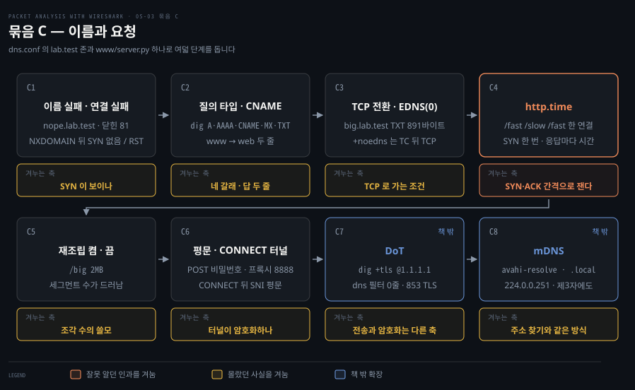

# 실습 — 주소와 이름을 직접 잡기

---

> 이 편은 골격이고, 각 단계의 명령과 실측 값은 그 묶음을 실행한 세션에서 채웁니다. 지금 적힌 것은 무엇을 어떤 순서로 보는지와 각 단계가 Phase 1 의 어느 어긋난 예측을 겨누는지입니다.

## 실험실

> OrbStack 리눅스 컨테이너 일곱. 서버는 `dnsmasq` 하나가 DHCP 와 DNS 를 다 맡고, 클라이언트는 busybox 의 `udhcpc` 로 주소를 지웠다 다시 받습니다. 세그먼트는 둘입니다.


원서는 `dhclient -4 eth0` 한 줄로 DORA 를 만들라고 합니다. 맥북에서는 그 명령을 칠 자리가 없습니다. 맥의 DHCP 클라이언트는 손으로 띄우는 것이 아니고, 공유기가 내주는 주소는 조건을 바꿀 수 없습니다. 서버를 두 대 두거나 풀을 하나로 줄이거나 릴레이를 끼우려면 서버가 내 손에 있어야 하므로, 4장과 같이 컨테이너로 옮깁니다.

`dnsmasq` 를 고른 이유는 설정 파일 대여섯 줄로 DHCP 서버가 되고 같은 프로그램이 DNS 서버도 되기 때문입니다. 묶음 C 에서 `lab.test` 존을 직접 들고 있게 하면 CNAME 체인이나 512바이트를 넘는 TXT 처럼 원하는 응답을 마음대로 만들 수 있습니다.

랩은 저장소 밖 `~/study/paw-lab/05-dhcp/` 에 있습니다. `LAB.md` 에 구성과 사전 검증에서 걸린 자리를 적어 두었습니다.

```bash
cd ~/study/paw-lab/05-dhcp
docker compose up -d --build            # 컨테이너 일곱, 세그먼트 둘

./serve.sh dhcp-server dhcp-a.conf      # dnsmasq 를 임대 기록 없이 새로 띄움
./look-dhcp.sh pcap/a1-server.pcap      # DHCP 캡처를 정렬된 표로
docker compose down                     # 정리
```

| 컨테이너 | 주소 | 역할 |
|---|---|---|
| `dhcp-server` | 10.55.0.20 · fd00:55::20 | DHCP·DNS 서버, HTTP·TLS 서버 |
| `dhcp-server2` | 10.55.0.21 | 둘째 DHCP 서버(B1), 프록시(C6) |
| `dhcp-client` · `dhcp-client2` | 도커가 .2~.14 에서 배정 | 주소를 지우고 다시 받는 쪽 |
| `dhcp-neighbor` | 도커가 배정 | 옆자리. 남의 교환이 어디까지 보이는지 캡처하는 쪽 |
| `dhcp-router` | 10.55.0.30 · 10.56.0.30 | 두 세그먼트에 걸친 라우터. 릴레이가 도는 자리(B5) |
| `dhcp-client-b` | 10.56.0.x | 서버와 다른 세그먼트의 클라이언트(B5) |

### 잡는 쪽과 읽는 쪽을 가릅니다

캡처는 컨테이너 안 `tcpdump` 가 `pcap/` 에 쓰고, 읽는 일은 호스트의 `tshark` 가 합니다. 4장과 같습니다. DHCP 는 `./look-dhcp.sh` 로 읽습니다. 메시지 종류(1 찾기 · 2 제안 · 3 선택 · 5 확정 · 6 NAK · 4 DECLINE · 7 RELEASE)와 `yiaddr`·`giaddr`·옵션 54·옵션 50·트랜잭션 ID 를 한 줄에 놓습니다.

### 먼저 알아야 할 함정 넷

사전 검증에서 실제로 부딪힌 것입니다. 모르면 캡처가 비거나 개수가 틀립니다.

캡처를 멈추기 전에 2초를 기다립니다. `tcpdump` 는 커널 버퍼에 모인 패킷을 묶음으로 받아 오므로 마지막 메시지 직후에 죽이면 뒤쪽 프레임이 파일에 안 남습니다. DISCOVER 하나만 남은 적이 있습니다.

보낸 쪽에서 뜬 캡처에는 자기가 보낸 DHCP 프레임이 두 번 찍힙니다. `udhcpc` 와 `dnsmasq` 가 raw 소켓으로 내보내는 프레임이 그렇습니다. 선 위에서는 한 번이고, 옆자리나 상대편 캡처에는 한 번만 보입니다. 개수를 셀 때는 받는 쪽 캡처를 씁니다.

`dnsmasq` 는 처음 보는 클라이언트에게 제안하기 전에 그 주소로 ICMP 를 보내고 3초쯤 기다립니다. 첫 OFFER 가 늦는 이유이고 B4 의 관찰 대상입니다. 끌 때는 `--no-ping` 입니다.

`dnsmasq` 가 제안하는 주소는 클라이언트 MAC 에서 나오고, 컨테이너를 다시 만들면 MAC 이 바뀝니다. B4 는 주소를 외워 두지 말고 그 자리에서 먼저 제안된 주소를 확인해 옆자리에 넣습니다.


## 묶음 A · 주소를 받는 네 걸음

> 정상 DORA 를 서버와 옆자리 양쪽에서 잡고, 서버를 끈 채 다시 요청하고, 갱신과 반납을 세고, 같은 흐름을 DHCPv6 로 한 번 더 잡습니다. 다섯 단계입니다.


### A1. 정상 DORA 한 번을 서버 쪽에서 잡습니다

클라이언트의 주소를 지우고 `udhcpc` 로 다시 받게 하면서 서버 쪽에서 캡처합니다. 볼 것은 네 메시지의 출발지·목적지 IP, 걸음마다 달라지는 `yiaddr`, REQUEST 의 옵션 54 와 옵션 50 입니다. Phase 1 에서 첫 메시지의 목적지를 `0.0.0.0/0` 으로, OFFER 의 `yiaddr` 을 주소 목록으로 예측했던 자리를 캡처로 확인합니다.

(실측 값은 묶음 A 세션에서 채웁니다.)

### A2. 옆자리에서 동시에 잡으면 무엇이 보이나

`dhcp-neighbor` 에서 같은 시간에 캡처를 뜹니다. 클라이언트의 DHCP 는 보이고 클라이언트가 서버에 보낸 ping 은 안 보여야 합니다. 브로드캐스트는 세그먼트 전체에 닿고 유니캐스트는 그 장비의 포트로만 간다는 1장의 갈래가 이 한 장에 나란히 찍힙니다.

(실측 값은 묶음 A 세션에서 채웁니다.)

### A3. 서버를 끄면 첫 메시지만 반복됩니다

`./serve.sh dhcp-server stop` 뒤에 다시 요청합니다. DISCOVER 만 몇 초 간격으로 남습니다. 치트시트 첫 행의 모습이고, 간격이 어떻게 벌어지는지를 셉니다.

(실측 값은 묶음 A 세션에서 채웁니다.)

### A4. 갱신과 반납은 두 개짜리 정상 교환입니다

`udhcpc` 를 백그라운드로 띄우고 `SIGUSR1` 로 갱신, `SIGUSR2` 로 반납을 시킵니다. 갱신은 REQUEST→ACK 두 개이고 유니캐스트입니다. 메시지 수만 세고 실패라 판단하면 안 되는 이유가 여기 있습니다.

(실측 값은 묶음 A 세션에서 채웁니다.)

### A5. 같은 네 걸음을 DHCPv6 로 잡습니다

`dhclient -6` 으로 SARR 을, rapid commit 설정을 물려 두 걸음 교환을 잡습니다. 목적지 `ff02::1:2`, SOLICIT 과 REQUEST 의 트랜잭션 ID 가 다른 것, REPLY 에 옵션 14 가 실리는 것을 봅니다. 원서의 `DHCPv6-Flow-SOLICIT.pcap` 을 직접 만드는 단계입니다.

(실측 값은 묶음 A 세션에서 채웁니다.)


## 묶음 B · 어긋나는 경우들

> 서버 둘, 줄 수 없는 주소, 빈 풀, 남이 먼저 쓰는 주소, 라우터 너머의 서버를 차례로 만듭니다. 한 단계에 서버 설정 하나씩 바꾸며 다섯 단계입니다.


### B1. 서버 두 대가 제안하면 REQUEST 하나가 둘을 정리합니다

`dhcp-server2` 에 .200 대 범위를 주고 둘 다 띄웁니다. OFFER 둘이 오고 클라이언트는 하나를 고릅니다. 볼 것은 REQUEST 가 브로드캐스트이고 옵션 54 에 고른 서버가 적혀 있다는 것, 그리고 진 서버의 임대 기록이 비어 있다는 것입니다. Phase 1 에서 "거절 메시지를 따로 보낸다"고 예측했던 자리입니다.

(실측 값은 묶음 B 세션에서 채웁니다.)

### B2. 줄 수 없는 주소를 요청하면 NAK 이 옵니다

서버의 범위를 옮긴 뒤 옛 주소를 기억하는 `dhclient` 로 다시 요청합니다. REQUEST 에 NAK 이 돌아오고 클라이언트는 DISCOVER 부터 다시 돕니다. Phase 1 의 "REQUEST 를 보내면 바로 써도 된다"(잘못 알던 인과)와 "거부를 알려 줘야 하지 않나"에 답하는 단계입니다. `udhcpc` 는 옛 주소를 다시 요청하지 않아 이 단계만 `dhclient` 를 씁니다.

(실측 값은 묶음 B 세션에서 채웁니다.)

### B3. 풀이 비면 서버는 아무 말도 하지 않습니다

주소 하나짜리 범위를 주고 클라이언트 둘을 차례로 붙입니다. 둘째는 DISCOVER 만 반복하고 서버 로그에만 `no address available` 이 남습니다. DISCOVER 단계에서는 거절 메시지가 없다는 것과, B2 의 NAK 이 REQUEST 단계의 일이라는 것을 나란히 둡니다.

(실측 값은 묶음 B 세션에서 채웁니다.)

### B4. 남이 먼저 쓰는 주소를 서버와 클라이언트가 각각 걸러냅니다

옆자리에 서버가 제안할 주소를 수동으로 넣어 둡니다. 먼저 서버가 OFFER 전에 ICMP 로 확인해 다음 주소를 제안하는 것을 보고, `--no-ping` 으로 그 확인을 끈 뒤 클라이언트가 ACK 뒤 ARP 로 알아채 DECLINE 을 보내고 처음부터 다시 도는 것을 봅니다. Phase 1 의 "OFFER 단계에서 ICMP 로 찔러 본다"는 예측이 서버 쪽 동작이었음을 확인하는 자리입니다.

(실측 값은 묶음 B 세션에서 채웁니다.)

### B5. 라우터 너머의 서버에는 릴레이가 대신 갑니다

`dhcp-client-b` 는 서버와 다른 세그먼트에 있습니다. 라우터의 양쪽 인터페이스에서 캡처하면 seg-b 쪽은 브로드캐스트, seg-a 쪽은 `giaddr` 이 찍힌 유니캐스트로 같은 교환이 보입니다. 첫 질문에서 "게이트웨이를 거치나"라고 물으셨던 것의 실제 답입니다.

(실측 값은 묶음 B 세션에서 채웁니다.)


## 묶음 C · 이름과 요청

> 05-02 의 DNS 와 HTTP 를 같은 컨테이너에서 잡습니다. 여덟 단계이고 뒤의 둘(DoT · mDNS)은 원서에 없는 확장입니다.



### C1. 이름 실패와 연결 실패는 캡처에서 다르게 보입니다

없는 이름(`nope.lab.test`)에 붙으면 NXDOMAIN 뒤에 SYN 이 없고, 있는 이름의 닫힌 포트(81)에 붙으면 SYN 뒤에 RST 가 옵니다. "서버에 못 붙는다"를 두 갈래로 가르는 첫 단계입니다.

(실측 값은 묶음 C 세션에서 채웁니다.)

### C2. 질의 타입마다 답이 다르고 CNAME 은 두 줄로 옵니다

`dig` 로 A·AAAA·CNAME·MX·TXT·NS·SOA 를 차례로 묻습니다. `www.lab.test` 를 물으면 CNAME 한 줄과 A 한 줄이 함께 오는 것이 원서의 "같은 질의에 여러 답"입니다. Phase 1 에서 질의 타입을 A·AAAA 만 꼽았던 자리입니다.

(실측 값은 묶음 C 세션에서 채웁니다.)

### C3. 큰 응답은 TCP 로 넘어가고 EDNS(0) 가 그것을 없앱니다

891바이트짜리 TXT 를 `+noedns` 로 물으면 TC 플래그가 선 응답 뒤에 TCP 로 다시 묻고, 기본(EDNS 켬)으로 물으면 UDP 한 번으로 끝납니다. Phase 1 에서 "그런 경우가 있는가"라고 되물었던 자리입니다.

(실측 값은 묶음 C 세션에서 채웁니다.)

### C4. 연결 하나에 실린 요청마다 http.time 이 찍힙니다

`/fast` · `/slow` · `/fast` 를 한 연결로 요청합니다. SYN 은 한 번인데 `http.time` 은 응답마다 있고 `/slow` 만 2초입니다. 연결 수립 왕복과 요청·응답 간격이 다른 것을 재는 자리이며, Phase 1 의 "느린 요청은 SYN·ACK 간격으로 잰다"(잘못 알던 인과)를 겨눕니다.

(실측 값은 묶음 C 세션에서 채웁니다.)

### C5. 재조립을 끄면 조각 수가 드러납니다

2MB 응답을 재조립을 켠 채 읽으면 한 줄이고, 끄면 Continuation 이 수십 줄입니다. 조각 수가 무엇을 판단하게 해 주는지는 03-02 의 창 크기 절과 이어집니다.

(실측 값은 묶음 C 세션에서 채웁니다.)

### C6. 평문 POST 는 그대로 읽히고 CONNECT 터널 안은 TLS 가 가립니다

폼으로 보낸 비밀번호가 캡처에 그대로 찍히는 것을 먼저 봅니다. 그다음 프록시(`dhcp-server2:8888`)를 거쳐 HTTPS 에 붙습니다. CONNECT 한 줄과 `200` 은 평문입니다. 그 뒤 터널 안으로 ClientHello 와 SNI 가 평문으로 지나가고 암호화는 그다음부터입니다. "CONNECT 이후가 전부 암호화면 Hello 는 어떻게 되나"라고 물으셨던 자리입니다.

(실측 값은 묶음 C 세션에서 채웁니다.)

### C7. DoT 는 dns 필터에 잡히지 않습니다 (책 밖)

`dig +tls @1.1.1.1` 로 같은 이름을 묻습니다. `dns` 필터는 0줄이고 853 포트에 TLS 만 보입니다. 전송(UDP·TCP)과 암호화(TLS)가 다른 축이라는 것을 캡처로 확인합니다. 인터넷이 필요한 유일한 단계입니다.

(실측 값은 묶음 C 세션에서 채웁니다.)

### C8. mDNS 는 서버 없이 이름을 외칩니다 (책 밖)

`avahi-resolve` 로 `server.local` 을 풉니다. 질의는 `224.0.0.251:5353` 멀티캐스트로 나가고 이름 주인이 직접 답합니다. 제3자 컨테이너의 캡처에도 같은 교환이 찍힙니다. 주소를 찾을 때 썼던 "전원에게 외치고 해당자만 답하는" 방식을 이름에 쓴 것이고, 1장 실습에서 옆 사람 iPhone 이름이 보였던 이유입니다.

(실측 값은 묶음 C 세션에서 채웁니다.)


## 세기 전에 속는 자리

> 세 묶음을 마친 뒤 실제로 잘못 세거나 놓친 자리를 적습니다.

아직 학습자가 돌린 묶음이 없어 비어 있습니다. 사전 검증에서 걸린 것은 위 함정 넷과 `LAB.md` 에 있고, 학습자가 직접 잘못 센 자리는 묶음마다 여기에 보탭니다.


## 남은 것

> 이 랩으로 확인하지 못한 것을 적습니다.

아직 세 묶음을 마치지 않아 비어 있습니다. 세우지 못한 구성과 범위를 넘는 자리를 묶음 C 를 마친 뒤 적습니다.


## 관련 문서

- [05-01 주소를 받아 오는 프로토콜](./05-01.%EC%A3%BC%EC%86%8C%EB%A5%BC%20%EB%B0%9B%EC%95%84%20%EC%98%A4%EB%8A%94%20%ED%94%84%EB%A1%9C%ED%86%A0%EC%BD%9C.md) — 묶음 A·B 가 옮기는 네 걸음·예약 아님·두 확인·릴레이
- [05-02 이름과 요청](./05-02.%EC%9D%B4%EB%A6%84%EA%B3%BC%20%EC%9A%94%EC%B2%AD.md) — 묶음 C 가 옮기는 DNS 와 HTTP
- [04-04 실습 — TLS 핸드셰이크를 직접 잡기](./04-04.%EC%8B%A4%EC%8A%B5%20%E2%80%94%20TLS%20%ED%95%B8%EB%93%9C%EC%85%B0%EC%9D%B4%ED%81%AC%EB%A5%BC%20%EC%A7%81%EC%A0%91%20%EC%9E%A1%EA%B8%B0.md) — 같은 방식의 앞 장 랩. C6 의 프록시 터널 안이 그 장의 핸드셰이크입니다
- [Packet Analysis with Wireshark — 정독 인덱스](./README.md) — 7개 장 전체 지도
