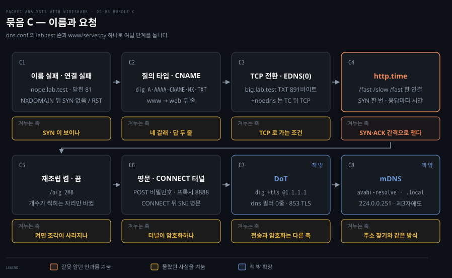

# 실습 — 이름과 요청을 직접 잡기

---

> 05-02 의 DNS 와 HTTP 를 05-03 과 같은 컨테이너에서 여덟 단계로 직접 잡은 기록입니다. 단계마다 무엇을 예측했고 캡처에 실제로 무엇이 찍혔는지를 나란히 둡니다.

## 실험실은 05-03 과 같습니다

> 랩 구성, 명령 블록의 틀, 캡처 표를 읽는 법, 함정은 05-03 「실험실」에 있습니다. 이 편은 그 랩의 서버를 이름 서버와 웹 서버로 다시 띄워 씁니다.

컨테이너 일곱의 역할, `serve.sh`·`look.sh` 사용법, 단계마다 되풀이되는 캡처 명령의 틀은 [05-03 「실험실」](./05-03.%EC%8B%A4%EC%8A%B5%20%E2%80%94%20%EC%A3%BC%EC%86%8C%EB%A5%BC%20%EC%A7%81%EC%A0%91%20%EC%9E%A1%EA%B8%B0.md)에 한 번 풀어 두었습니다. 아래 명령 블록에는 그 틀 밖의 줄에만 주석을 달았습니다. 이 편에서 특히 부딪히는 함정은 둘입니다. zsh 에서 `echo ==` 가 줄을 끊는 것과, `pgrep -f` 가 자기 자신을 찾아 서버를 띄우지 않는 것(C6)입니다. 둘 다 05-03 「먼저 알아야 할 함정」에 있습니다.

단계마다 읽는 순서도 05-03 과 같습니다. 예측 질문, 명령, 캡처 표, 해석 순으로 가고, 마지막 인용 상자에 흔히 틀리는 예측을 적었습니다.


## 묶음 C · 이름과 요청

> 05-02 의 DNS 와 HTTP 를 같은 컨테이너에서 잡습니다. 여덟 단계이고 뒤의 둘(DoT · mDNS)은 원서에 없는 확장입니다.



묶음 C 는 서버를 이름 서버로 다시 띄우고 HTTP 서버(`www/server.py`, 80번)를 함께 둡니다. 클라이언트는 DHCP 로 주소를 하나 받고 `resolv.conf` 에 서버를 이름 서버로 적은 뒤 시작합니다.

```bash
./serve.sh dhcp-server dhcp-a.conf       # 주소를 한 번 받아 두고
docker exec dhcp-client sh -c 'ip -4 addr flush dev eth0; udhcpc -i eth0 -f -q -n -t 4 2>&1 | tail -1'
./serve.sh dhcp-server dns.conf          # 같은 dnsmasq 를 이름 서버로 다시 띄움
docker exec -d dhcp-server python3 /www/server.py              # HTTP 서버(80번)
docker exec dhcp-client sh -c 'echo "nameserver 10.55.0.20" > /etc/resolv.conf'   # 이름은 이 서버에 묻도록
```

`dns.conf` 가 들고 있는 `lab.test` 의 기록 묶음이 존 하나이고, 존의 뜻은 [05-02 §1](./05-02.%EC%9D%B4%EB%A6%84%EA%B3%BC%20%EC%9A%94%EC%B2%AD.md)이 풀어 둡니다.

| 이름 | 기록 |
|---|---|
| `web.lab.test` | A `10.55.0.20` · AAAA `fd00:55::20` |
| `multi.lab.test` | A `10.55.0.41` · A `10.55.0.42` |
| `www.lab.test` | CNAME → `web.lab.test` |
| `lab.test` | MX `10 mail.lab.test` · TXT `"v=paw-lab"` · NS · SOA |
| `big.lab.test` | TXT, 응답이 900바이트 안팎 |

### C1. 이름 실패는 SYN 이 없고 연결 실패는 SYN 뒤에 RST 가 옵니다

없는 이름 `nope.lab.test` 와, 있는 이름이지만 아무도 듣지 않는 81번 포트에 붙습니다. 사용자 눈에는 둘 다 "서버에 못 붙는다"입니다. 먼저 예측합니다. 두 캡처는 어떻게 다를까요?

```bash
docker exec -d dhcp-client sh -c 'tcpdump -i eth0 -w /pcap/c1-client.pcap -U "port 53 or port 81" 2>/dev/null'
sleep 2
docker exec dhcp-client sh -c 'curl -4 -s -m 3 http://nope.lab.test/; echo "curl exit=$?"'     # 없는 이름
docker exec dhcp-client sh -c 'curl -4 -s -m 3 http://web.lab.test:81/; echo "curl exit=$?"'  # 있는 이름, 닫힌 포트
sleep 2; docker exec dhcp-client pkill tcpdump
./look.sh pcap/c1-client.pcap - frame.number ip.src ip.dst dns.qry.name dns.flags.rcode dns.a tcp.dstport tcp.flags.str
```

| 프레임 | 출발지 → 목적지 | 무엇 |
|---|---|---|
| 1·2 | .137 ↔ .20 | `nope.lab.test` 질의 · 응답 `rcode 3` (NXDOMAIN) |
| 3·4 | .137 ↔ .20 | `web.lab.test` 질의 · 응답 `rcode 0`, A `10.55.0.20` |
| 5 | .137 → .20 | SYN → 81 |
| 6 | .20 → .137 | RST·ACK |

NXDOMAIN 은 "그런 이름 없음"이고 DNS 응답 코드 3 입니다. 그 뒤에는 SYN 이 없습니다. `curl` 도 두 갈래를 이미 가르고 있어서 앞은 exit 6(호스트 이름을 풀지 못함), 뒤는 exit 7(연결하지 못함)입니다. `-4` 는 IPv4 로만 붙게 하는 옵션으로, 05-03 의 A5 를 거치며 클라이언트의 IPv6 전역 주소가 사라졌을 수 있어 넣었습니다.

81번 SYN 에는 SYN-ACK 없이 곧바로 RST 가 돌아왔습니다. 81번에는 서버 프로그램이 없는데도 서버 IP 에서 RST 가 나왔습니다. RST 는 프로그램이 아니라 커널의 TCP 스택이 보내기 때문입니다.

SYN 이 도착하면 커널은 목적지 포트로 자기 소켓 표에서 LISTEN 중인 소켓을 찾습니다. 없으면 애플리케이션까지 올려 보낼 곳이 없으므로 그 자리에서 RST 로 거절합니다. 3장 묶음 B 에서 본 "닫힌 포트의 즉시 RST"와 같습니다. 프로그램이 없으니 서버 쪽 애플리케이션 로그에는 아무것도 남지 않습니다.

> **흔한 예측 실수** — 닫힌 포트에서도 3-way 가 다 돈 뒤 실패한다고 봅니다. 포트 확인은 첫 SYN 에서 끝나므로 SYN-ACK 는 오지 않습니다.

### C2. 질의 타입이 답을 정하고 CNAME 체인은 서버가 따라갑니다

`dig` 로 질의 타입만 바꿔 가며 묻습니다. `+noall +answer` 는 출력을 전부 끄고 답 부분만 다시 켜는 dig 고유의 옵션 문법입니다. 먼저 예측합니다. `multi.lab.test` 와 `www.lab.test` 의 A 질의는 둘 다 답이 두 줄인데 모양이 어떻게 다를까요? `www` 를 물으면 클라이언트가 `web` 을 다시 물어야 할까요?

```bash
docker exec -d dhcp-client sh -c 'tcpdump -i eth0 -w /pcap/c2-client.pcap -U "port 53" 2>/dev/null'
sleep 2
docker exec dhcp-client sh -c '
  # 이름별 질의 넷: "타입 이름" 쌍을 set -- 로 $1·$2 에 나눠 담음
  for q in "A web" "AAAA web" "A multi" "A www"; do
    set -- $q; dig @10.55.0.20 +noall +answer $1 $2.lab.test
  done
  # 도메인 자체에 딸린 기록 넷
  for t in MX TXT NS SOA; do
    dig @10.55.0.20 +noall +answer $t lab.test
  done'
sleep 2; docker exec dhcp-client pkill tcpdump
./look.sh pcap/c2-client.pcap - frame.number dns.flags.response dns.qry.name dns.qry.type dns.count.answers
```

`dig` 출력 가운데 `multi`·`www` 와 도메인 기록 넷만 옮깁니다.

```bash
multi.lab.test.   600  IN  A      10.55.0.41
multi.lab.test.   600  IN  A      10.55.0.42
www.lab.test.     600  IN  CNAME  web.lab.test.
web.lab.test.     600  IN  A      10.55.0.20
lab.test.         600  IN  MX     10 mail.lab.test.
lab.test.         600  IN  TXT    "v=paw-lab"
lab.test.         600  IN  NS     server.lab.test.
lab.test.         600  IN  SOA    server.lab.test. hostmaster.server.lab.test. 1790258654 1200 180 1209600 600
```

`multi` 는 같은 이름에 A 가 두 줄이고, `www` 는 이름이 이름을 가리키고 그 끝에서 주소가 나오는 두 줄입니다. 질의 타입이 A 이니 AAAA 는 오지 않습니다. 원서의 "같은 질의에 여러 답"이 이 두 갈래입니다.

나머지 넷은 도메인에 딸린 정보입니다. MX 는 이 도메인 앞으로 온 메일을 받을 서버이고 10 은 우선순위입니다. TXT 는 자유 텍스트이며 실무에서는 도메인 소유 확인이나 메일 발신 허가 목록(SPF)을 적습니다. NS 는 이 존을 맡는 이름 서버, SOA(Start Of Authority)는 존의 관리 정보로 주 서버·관리자 메일·일련번호·보조 서버의 갱신 주기가 이어집니다.

`tshark` 표는 질의·응답 짝 여덟 쌍입니다. `www.lab.test` 는 8번 질의(`answers 0`)와 9번 응답(`answers 2`) 한 쌍뿐이고, 그 뒤에 `web.lab.test` 를 따로 묻는 질의가 없습니다. 서버가 CNAME 을 따라가 주소까지 응답에 함께 담았습니다. 클라이언트는 한 번 묻고 두 줄을 위에서부터 따라 읽습니다.

> **흔한 예측 실수** — `dns.flags.response` 의 `False`·`True` 를 실패·성공으로 읽습니다. 이 칸은 질의(`False`)와 응답(`True`)의 구분이고, 질의에는 늘 `answers 0` 이 찍힙니다. 실패는 C1 의 `rcode` 로 나타납니다.

### C3. 큰 응답은 TC 표시 뒤 TCP 로 다시 묻고 EDNS(0) 가 그것을 없앱니다

`big.lab.test` 의 TXT 를 두 번 묻습니다. `+noedns` 는 "512바이트까지만 받는다"는 옛 방식입니다. 기본값은 질의에 OPT 기록을 붙여 더 크게 받을 수 있다고 알리는 EDNS(0)입니다. 먼저 예측합니다. 512바이트에 안 들어가는 답을 서버는 어떻게 보낼까요? 캡처에서 UDP 와 TCP 는 어떤 순서로 보일까요?

```bash
docker exec -d dhcp-client sh -c 'tcpdump -i eth0 -w /pcap/c3-client.pcap -U "port 53" 2>/dev/null'
sleep 2
# 옛 방식(512바이트 한계)으로 한 번 — "Truncated" 줄이 나오는지 봄
docker exec dhcp-client sh -c 'dig @10.55.0.20 +noedns TXT big.lab.test | grep -E "Truncated|flags:|SERVER|MSG SIZE"'
# 기본값(EDNS) 으로 한 번 — "udp:" 줄에 알린 크기가 찍힘
docker exec dhcp-client sh -c 'dig @10.55.0.20 TXT big.lab.test | grep -E "flags:|udp:|SERVER|MSG SIZE"'
sleep 2; docker exec dhcp-client pkill tcpdump
./look.sh pcap/c3-client.pcap - frame.number udp.srcport udp.dstport tcp.srcport tcp.dstport tcp.flags.str dns.flags.response dns.flags.truncated dns.count.answers dns.rr.udp_payload_size frame.len
```

| 프레임 | 무엇 | 크기 |
|---|---|---|
| 1 | UDP 질의, 클라이언트 42115 → 53 | 72 |
| 3 | UDP 응답 → 42115. TC=1, 답 0줄, `rcode 0` | 72 |
| 4·5·6 | TCP 3-way (32827 ↔ 53) | |
| 7 · 9 | TCP 위로 같은 질의 · 응답 답 1줄 | 98 · 959 |
| 11·12·13 | TCP 연결 종료 FIN · FIN · ACK | |
| 14 | EDNS 질의, `udp_payload_size 1232` | 95 |
| 15 | UDP 응답 한 번, TC 없음, 답 1줄 | 944 |

표는 두 덩어리입니다. 1~13번이 `+noedns` 질의이고 UDP 로 물었다가 TCP 로 다시 묻습니다. 14·15번이 EDNS 질의이고 UDP 한 번으로 끝납니다.

3번 응답은 실패도 거절도 아닙니다. TC(Truncated, "잘렸다")는 DNS 헤더의 한 비트입니다. 답은 있지만 이 UDP 한 패킷에 못 담았으니 더 큰 통로로 다시 물으라는 표시입니다. 오류를 알리는 `rcode` 가 0 인 것이 그 증거입니다. `dig` 의 `Truncated, retrying in TCP mode` 가 그 표시를 알아채고 TCP 로 다시 물은 것입니다.

나머지 칸도 짚어 둡니다. 42115 는 클라이언트가 이 질의에 쓴 임시 포트이고 답은 그 포트로 돌아옵니다. 11~13번의 `A···F` 는 3장에서 본 연결 종료이고, 종료가 FIN·FIN·ACK 셋으로 끝난 것도 3장 묶음 A 와 같습니다.

두 번의 응답이 갈린 이유는 질의 쪽의 한 칸입니다. 1번 질의에는 OPT 기록이 없어(`udp_payload_size` 가 `-`) 서버가 옛 512바이트 한계를 적용했습니다. 14번 질의에는 "1232바이트까지 받는다"가 적혀 있어 944바이트를 한 번에 보냈습니다. 14번이 1번보다 23바이트 큰 것도 이 OPT 기록 때문입니다.

`dig` 출력의 나머지 칸도 이 자리에서 읽힙니다.

| `dig` 출력 | 뜻 |
|---|---|
| `flags:` 의 `qr` | 이건 응답 |
| `flags:` 의 `aa` | 이 서버가 존의 주인이라 권한 있는 답 |
| `flags:` 의 `rd` | 클라이언트가 재귀 조회를 원했음 |
| `QUERY 1, ANSWER 1, AUTHORITY 1, ADDITIONAL 1` | DNS 메시지의 네 칸에 든 줄 수. EDNS 쪽의 `ADDITIONAL 1` 이 OPT 기록 |
| `MSG SIZE rcvd` | 받은 메시지의 바이트 수 |

512바이트를 넘는 쪽은 응답입니다. 이름 하나를 묻는 질의는 72바이트였습니다. 응답은 한 이름에 주소가 수십 개 걸리거나 이번처럼 TXT 가 길거나 DNSSEC 서명이 붙을 때 커집니다.

> **흔한 예측 실수** — TC 응답을 실패로 읽습니다. 실패는 `rcode` 가 0 이 아닐 때이고, TC 는 "여기엔 못 담았다"는 안내입니다.

### C4. http.time 은 연결 수립이 아니라 요청과 응답 사이를 잽니다

`/fast`(바로 응답)·`/slow`(2초 뒤 응답)·`/fast` 를 `curl` 한 번으로 요청합니다. HTTP/1.1 은 연결을 재사용하므로 세 요청이 TCP 연결 하나에 실립니다. 먼저 예측합니다. SYN 은 몇 번이고, 첫 `/fast` 의 `http.time` 은 3-way 가 들어가 셋째보다 클까요?

```bash
docker exec -d dhcp-client sh -c 'tcpdump -i eth0 -s0 -w /pcap/c4-client.pcap -U "port 80" 2>/dev/null'
sleep 2
# URL 셋을 curl 한 번에 → 연결 재사용. -o 는 URL 마다 하나씩 짝지어 본문을 버림
# num_connects: 요청마다 새로 연 연결 수
docker exec dhcp-client sh -c 'curl -4 -s -o /dev/null -o /dev/null -o /dev/null -w "연결 수: %{num_connects}\n" http://web.lab.test/fast http://web.lab.test/slow http://web.lab.test/fast'
sleep 2; docker exec dhcp-client pkill tcpdump
./look.sh pcap/c4-client.pcap 'tcp.flags.syn==1' frame.number frame.time_relative tcp.stream tcp.flags.str   # SYN 이 몇 번인가
./look.sh pcap/c4-client.pcap http frame.number frame.time_relative tcp.stream http.request.uri http.response.code http.time http.request_in   # 요청별 http.time
```

`curl` 의 `연결 수` 는 1·0·0 이고 `tcp.stream` 은 모두 0 입니다. 한 연결을 재사용했습니다. SYN(1번)과 SYN-ACK(2번) 사이는 0.000059초, 59마이크로초입니다.

| 요청 | 요청 프레임 → 응답 프레임 | http.time |
|---|---|---|
| `/fast` | 4 → 8 | 0.0349초 |
| `/slow` | 10 → 14 | 2.0488초 |
| `/fast` | 16 → 20 | 0.0434초 |

응답 줄의 `http.request_in` 이 짝이 되는 요청 프레임을 가리킵니다. `http.time` 은 4번에서 8번 사이의 시간입니다. 3-way 는 그 앞 1·2번에서 끝났으니 들어가지 않습니다. 그래서 첫 `/fast` 와 셋째 `/fast` 가 같은 0.03~0.04초로 나왔고 `/slow` 만 서버가 2초를 쓴 만큼 2.05초가 됐습니다.

연결 수립 왕복은 세 요청에 공통으로 한 번뿐입니다. 요청마다 달랐던 것은 서버가 답을 만드는 데 쓴 시간이었습니다. SYN 과 SYN-ACK 사이 간격으로는 네트워크 왕복만 보여 어느 요청이 느렸는지 가릴 수 없습니다.

`http` 필터 표에서는 프레임 번호가 둘씩 빕니다. 그 사이가 HTTP 가 아닌 순수 TCP 프레임이라서입니다. 서버의 ACK 와 헤더·본문으로 나뉘어 나간 응답의 앞 조각이 거기 있고, Wireshark 는 마지막 조각에 HTTP 응답 한 줄을 찍습니다.

> **흔한 예측 실수** — 느린 요청을 SYN 과 SYN-ACK 간격으로 찾으려 합니다. 그 간격은 연결마다 한 번 재는 네트워크 왕복이고, 요청마다의 느림은 `http.time` 에 있습니다.

### C5. 재조립 켬·끔은 조각 수가 찍히는 자리와 http.time 의 끝점을 바꿉니다

2MB 짜리 `/big` 응답을 한 번 받고, 같은 캡처를 재조립만 켜고 꺼서 두 번 읽습니다. 재조립은 여러 TCP 세그먼트로 쪼개져 온 응답을 하나로 합쳐 보여 주는 기능이고 기본값은 켬입니다. 먼저 예측합니다. 켜면 조각 프레임은 목록에서 사라질까요? `http.time` 은 어느 쪽이 클까요?

```bash
docker exec -d dhcp-client sh -c 'tcpdump -i eth0 -s0 -w /pcap/c5-client.pcap -U "port 80" 2>/dev/null'
sleep 2
docker exec dhcp-client sh -c 'curl -4 -s -o /dev/null -w "받은 바이트: %{size_download}\n" http://web.lab.test/big'
sleep 2; docker exec dhcp-client pkill tcpdump
./look.sh pcap/c5-client.pcap http frame.number frame.time_relative http.response.code http.time tcp.segment.count   # 재조립 켬(기본값)
tshark -o tcp.desegment_tcp_streams:FALSE -r pcap/c5-client.pcap -Y http | wc -l   # 재조립 끔: http 줄 수
tshark -r pcap/c5-client.pcap -Y 'tcp.srcport==80 && tcp.len>0' | wc -l          # 서버가 보낸 데이터 조각 수
```

받은 바이트는 2,097,152 이고 서버가 보낸 데이터 조각은 45개입니다. 이 45는 재조립을 켠 기본값에서 필터 없이 셌는데도 그대로 나왔습니다. 재조립은 프레임을 지우지 않고, 모은 결과를 마지막 조각에 한 번 더 붙여 보여 줄 뿐입니다.

| 설정 | `http` 필터 줄 수 | 응답 프레임 | `http.time` | 끝점 |
|---|---|---|---|---|
| 켬 | 2 (요청 · 응답) | 74, `tcp.segment.count 45` | 0.04696초 | 마지막 조각, 곧 마지막 바이트 |
| 끔 | 46 (요청 · `200 OK` · Continuation 44) | 6 | 0.04419초 | 첫 조각, 곧 첫 바이트 |

끄면 첫 조각만 HTTP 응답으로 읽히고 나머지는 앞에서 이어지는 데이터(Continuation)로만 표시됩니다. `http.time` 은 `200 OK` 가 찍힌 그 첫 조각에만 붙습니다. 그래서 켬은 마지막 바이트까지, 끔은 첫 바이트까지를 잽니다. 두 값의 차이 약 2.8ms 는 첫 조각을 뺀 나머지 44조각, 곧 본문 2MB 가까이를 나르는 데 걸린 시간입니다.

실무에서는 질문에 따라 고릅니다. "다운로드가 느리다"를 조사할 때는 켠 쪽을, "서버가 처리를 늦게 시작한다"를 의심할 때는 끈 쪽을 봅니다. 두 값의 차이로 본문 전송 시간을 떼어 낼 수 있습니다. 다만 첫 바이트까지의 시간에도 왕복 한 번이 이미 들어 있으니, 차이가 네트워크 지연 전부는 아닙니다.

같은 컴퓨터 안이라 본문 전송이 2.8ms 로 끝나 두 값이 비슷해 보였습니다. 인터넷 너머이거나 수신 창이 작으면 이 차이가 수백 ms 에서 수 초로 벌어집니다. 조각이 몇 개로 찍히는지는 컨테이너의 오프로드에 따라 달라지므로 45 는 이 환경의 값입니다. 05-02 §3 「재조립을 켜든 끄든 조각 수는 보입니다」가 이 관찰을 본문으로 정리합니다.

> **흔한 예측 실수** — 재조립을 켜면 조각이 목록에서 사라진다고 봅니다. 조각은 남고 개수가 찍히는 자리만 마지막 조각의 `tcp.segment.count` 로 옮겨 갑니다.

### C6. 평문 POST 는 그대로 읽히고 CONNECT 터널 안의 ClientHello 도 평문입니다

폼으로 비밀번호를 평문 HTTP 로 보낸 뒤, 프록시(`dhcp-server2:8888`, tinyproxy)를 거쳐 HTTPS(`web.lab.test:443`)에 붙습니다. `curl -x` 는 "이 프록시를 거쳐라", `-k` 는 자체 서명 인증서라 검증을 건너뛰라는 옵션입니다. 먼저 예측합니다. 클라이언트와 프록시 사이의 캡처에서 CONNECT·`200`·ClientHello 는 평문일까요? TLS 의 상대는 프록시일까요, 서버일까요?

```bash
# 서버에 TLS 서버(443)를 띄움
docker exec -d dhcp-server openssl s_server -accept 443 -cert /certs/web.crt -key /certs/web.key -www -quiet
# 프록시 쪽: web.lab.test 를 풀 수 있게 hosts 에 적고, tinyproxy 가 없을 때만 띄움 (pgrep -x, 함정 참고)
docker exec dhcp-server2 sh -c 'grep -q web.lab.test /etc/hosts || echo "10.55.0.20 web.lab.test" >> /etc/hosts; pgrep -x tinyproxy >/dev/null || tinyproxy -c /conf/tinyproxy.conf'
# 캡처는 클라이언트에서: 80(평문 POST)과 8888(프록시로 가는 연결)
docker exec -d dhcp-client sh -c 'tcpdump -i eth0 -s0 -w /pcap/c6-client.pcap -U "port 80 or port 8888" 2>/dev/null'
sleep 2
docker exec dhcp-client sh -c 'curl -4 -s -d "user=paw&password=hunter2" http://web.lab.test/login'   # 평문 POST
docker exec dhcp-client sh -c 'curl -4 -s -k -x http://10.55.0.21:8888 https://web.lab.test/ -o /dev/null -w "HTTP %{http_code}, CONNECT 응답 %{http_connect}\n"'   # 프록시 경유 HTTPS
sleep 2; docker exec dhcp-client pkill tcpdump
./look.sh pcap/c6-client.pcap 'http.request.method=="POST"' frame.number urlencoded-form.key urlencoded-form.value   # 폼 값이 보이는가
./look.sh pcap/c6-client.pcap 'tcp.port==8888 && (http || tls)' frame.number ip.src http.request.method http.request.uri http.response.code tls.record.opaque_type _ws.col.Info   # 터널 안팎
```

POST 는 4번 프레임에 `user,password = paw,hunter2` 가 그대로 찍혔습니다. HTTPS 는 `HTTP 200, CONNECT 응답 200` 으로 붙었고 선은 이렇습니다.

| 프레임 | 출발지 | 무엇 |
|---|---|---|
| 4 | .137 | `CONNECT web.lab.test:443` 평문 |
| 6 | .21 | `200` 평문 — 터널 열림 |
| 8 | .137 | Client Hello (SNI=web.lab.test) 평문 |
| 9 | .21 | Server Hello, Change Cipher Spec, Application Data ×4 |
| 10~23 | 양쪽 | Application Data, `opaque_type 23` |

CONNECT 요청에는 목적지의 이름과 포트가 실립니다. 프록시가 `200` 으로 받으면 그 뒤 이 연결을 지나는 바이트는 읽지 않고 그대로 넘깁니다. 터널은 암호화하지 않습니다. 4장에서 본 핸드셰이크는 터널 안을 그대로 지나가고 공유 키가 아직 없으니 ClientHello 는 통째로 평문입니다. 뒤를 가리는 것은 TLS 입니다.

이 랩은 TLS 1.3 으로 붙어 ServerHello 바로 뒤의 인증서까지 이미 암호화됐습니다. TLS 1.3 은 암호화된 레코드의 진짜 종류를 숨기고 바깥에 `23` 만 적습니다. 그 값은 `tls.record.content_type` 이 아니라 `tls.record.opaque_type` 칸에 들어갑니다.

`Application Data` 안에는 `GET / HTTP/1.1`, `Host: web.lab.test` 같은 요청이 들어 있지만 못 읽습니다. 프록시도 읽을 필요가 없습니다. 어디로 이을지는 이미 4번 CONNECT 한 줄에서 받았기 때문입니다.

표의 IP 는 전부 클라이언트(.137)와 프록시(.21)뿐이라 이 한쪽 캡처만으로는 IP 로 TLS 의 상대를 알 수 없습니다. 근거는 문맥입니다. CONNECT 가 `web.lab.test:443` 까지 이어 달라고 했고 SNI 도 그 이름을 부릅니다. 정리하면 CONNECT 는 프록시에게 하는 말이고, SNI 는 서버에게 하는 말입니다.

호스트별로 라우팅하는 프록시는 두 방식으로 갈리고, 방식에 따라 TLS 의 양 끝이 달라집니다.

| 방식 | 프록시가 하는 일 | TLS 의 양 끝 | 예 |
|---|---|---|---|
| TLS 종단 | 그 도메인의 인증서와 개인키로 TLS 를 직접 끝내고, 복호화한 HTTP 의 `Host`·경로를 보고 뒤쪽 서버로 새로 보냄 | 클라이언트 ↔ 프록시 | Nginx 리버스 프록시, API 게이트웨이 |
| SNI 패스스루 | 복호화하지 않고 평문 ClientHello 의 SNI 만 읽은 뒤 바이트를 넘김 | 클라이언트 ↔ 서버 | 오늘 본 CONNECT 터널과 같은 구도 |

> **흔한 예측 실수** — CONNECT 뒤는 전부 암호화라 ClientHello 는 가려지고 SNI 만 평문이라고 봅니다. 터널은 바이트를 옮길 뿐이라 ClientHello 는 통째로 평문입니다.

### C7. DoT 는 누구에게 물었나만 보이고 무엇을 물었나는 가립니다 (책 밖)

인터넷이 필요한 유일한 단계입니다. Cloudflare 공개 리졸버 `1.1.1.1` 에 같은 이름을 평문 DNS(UDP 53)와 DoT(DNS over TLS, TCP 853)로 한 번씩 묻습니다. 먼저 예측합니다. DoT 쪽에서 SNI 와 질의한 이름은 보일까요?

```bash
docker exec -d dhcp-client sh -c 'tcpdump -i eth0 -s0 -w /pcap/c7-client.pcap -U "host 1.1.1.1" 2>/dev/null'
sleep 2
docker exec dhcp-client dig @1.1.1.1 +short example.com        # 평문 DNS (UDP 53)
docker exec dhcp-client dig +tls @1.1.1.1 +short example.com   # DoT (TCP 853)
sleep 2; docker exec dhcp-client pkill tcpdump
./look.sh pcap/c7-client.pcap dns frame.number ip.dst udp.dstport tcp.dstport dns.qry.name
./look.sh pcap/c7-client.pcap 'tcp.port==853 && tls' frame.number tls.handshake.type tls.handshake.extensions_server_name tls.record.opaque_type _ws.col.Info
```

두 질의 모두 `104.20.23.154`·`172.66.147.243` 을 돌려줬습니다. `dns` 필터에는 평문 쪽 두 줄만 걸렸습니다. 질의는 `1.1.1.1:53` 으로 갔고 응답은 클라이언트의 55213번 포트로 왔습니다. DoT 는 0줄입니다. 853 쪽에는 6번 Client Hello, 8번 Server Hello·Change Cipher Spec·Application Data, 그 뒤 Application Data 만 있고 모두 `opaque_type 23` 입니다.

질의한 이름 `example.com` 은 DoT 캡처 어디에도 없습니다. `Application Data` 안에 암호화돼 있습니다. 6번 ClientHello 의 SNI 도 비어 있는데 이유는 명령에 있습니다. C6 는 `https://web.lab.test/` 처럼 이름으로 붙었고 C7 은 `@1.1.1.1` 처럼 IP 로 붙었습니다. SNI(Server Name Indication)는 찾아온 서버의 이름을 적는 칸이라 IP 만 받은 `dig` 는 적을 이름이 없었습니다.

`example.com` 은 물어본 이름이지 접속한 서버의 이름이 아닙니다. 이 캡처에서는 누구에게 물었나(`1.1.1.1:853`)만 보이고 무엇을 물었나는 가려집니다. DoT 가 지키려는 것이 그 둘째입니다.

전송(UDP·TCP)과 암호화(TLS)는 다른 축입니다. 평문 DNS 는 UDP 든 TCP 든 같은 망에서 질의가 읽히고 응답이 바뀔 수 있습니다. DoT·DoH 는 DNS 를 TLS 안에 넣어 그것을 막습니다. 목적과 브라우저 쪽 사정은 05-02 심화 학습의 두 절이 다룹니다.

> **흔한 예측 실수** — DoT 에서도 SNI 로 질의 이름이 보인다고 봅니다. SNI 는 리졸버의 이름이고, IP 로 붙으면 그마저 비어 있습니다.

### C8. mDNS 는 질의·응답·알림을 모두 그룹에 외칩니다 (책 밖)

mDNS(Multicast DNS)는 이름 서버 없이 같은 세그먼트 전체에 "`server.local` 가진 장비 있나?"를 멀티캐스트로 외치는 방식입니다. 그 이름의 주인이 직접 답합니다. 이름이 `.local` 로 끝나면 이 방식을 씁니다. 각 컨테이너에 mDNS 응답기 avahi 를 띄웁니다. 클라이언트가 `server.local` 을 IP 로 푸는 동안 교환과 상관없는 `dhcp-client2` 에서 캡처합니다. 먼저 예측합니다. 답은 누가 할까요? 제3자 캡처에도 찍힐까요?

```bash
# 세 컨테이너에 mDNS 응답기 avahi 를 띄움. avahi 는 dbus 가 먼저 떠 있어야 함
for c in dhcp-server dhcp-neighbor dhcp-client; do
  docker exec $c sh -c '
    mkdir -p /run/dbus; rm -f /run/dbus/pid
    pgrep -x dbus-daemon >/dev/null || dbus-daemon --system --fork
    pgrep -x avahi-daemon >/dev/null || avahi-daemon -D --no-chroot'
done
sleep 3
docker exec dhcp-client sh -c 'pkill -x avahi-daemon; sleep 1; avahi-daemon -D --no-chroot'; sleep 4   # 기억을 비움
# 교환과 상관없는 제3자(dhcp-client2)에서 mDNS 포트 5353 을 잡음
docker exec -d dhcp-client2 sh -c 'tcpdump -i eth0 -w /pcap/c8b-bystander.pcap -U "udp port 5353" 2>/dev/null'
sleep 2
docker exec dhcp-client avahi-resolve -4 -n server.local   # server.local 을 IPv4 주소로 풂
sleep 2; docker exec dhcp-client2 pkill tcpdump
./look.sh pcap/c8b-bystander.pcap 'dns.qry.name=="server.local" || dns.resp.name=="server.local"' frame.number ip.src ip.dst dns.flags.response dns.qry.name dns.a
```

| 프레임 | 출발지 → 목적지 | 무엇 |
|---|---|---|
| 3 | (IPv6) | 질의 `server.local` |
| 4 | 10.55.0.137 → 224.0.0.251 | 질의 `server.local` |
| 5 | 10.55.0.20 → 224.0.0.251 | 응답 A `10.55.0.20` |

질의도 응답도 목적지가 `224.0.0.251:5353`, 곧 mDNS 그룹입니다. 답은 `server.local` 의 주인인 `10.55.0.20` 이 직접 보냈고 이름 서버는 끼지 않았습니다. 제3자인 `dhcp-client2` 의 캡처에는 셋이 모두 찍혔습니다.

답까지 그룹에 외치는 이유를 RFC 6762 부록 D 가 적습니다. 멀티캐스트 응답 하나가 세그먼트 모든 장비의 캐시를 갱신하므로 나중에 같은 이름이 필요한 장비는 질의를 선에 내보낼 필요조차 없습니다.[^rfc6762-appd] 다른 장비가 같은 질의를 하려다 답을 엿듣고 자기 질의를 거두는 효과도 있습니다.

처음 캡처(`c8-bystander.pcap`)에는 질의가 없었습니다. avahi 를 막 띄운 직후라 장비마다 묻지 않았는데 자기 이름을 외친 알림만 찍혀 있었습니다. `client.local`·`neighbor.local`·`server.local` 이 각자 `224.0.0.251` 로 알렸고, 클라이언트는 그 알림을 캐시해 두었다가 `avahi-resolve` 때 선에 묻지 않고 답을 꺼냈습니다.

RFC 6762 §8.3 은 응답기가 켜질 때 이런 요청받지 않은 응답을 최소 두 번 보내라고 정합니다.[^rfc6762-announce] 1장 실습에서 아무도 묻지 않았는데 옆 사람 iPhone 이름이 찍힌 것이 이 알림입니다. 위 명령이 클라이언트의 avahi 만 다시 띄워 기억을 비운 뒤 푸는 까닭입니다.

05-03 A1 의 DHCP 가 "주소를 모를 때 전원에게 외친다"였다면 mDNS 는 같은 방식을 이름에 쓰고 답까지 전원에게 돌려줍니다. `dig @224.0.0.251 -p 5353` 은 질의를 내보내지만 avahi 가 답하지 않아 쓰지 않았습니다.

> **흔한 예측 실수** — 답은 묻던 쪽에게만 가니 제3자에게는 안 찍힌다고 봅니다. mDNS 의 답은 기본이 멀티캐스트입니다.


## 세기 전에 속는 자리

> 묶음 C 를 돌리며 실제로 잘못 세거나 잘못 읽은 자리입니다. 대부분 한 칸의 뜻을 착각한 것이었습니다.

플래그 칸은 이름대로 읽히지 않습니다. `dns.flags.response` 는 질의와 응답의 구분입니다. `dns.flags.truncated` 는 잘림 표시이고 실패는 `rcode` 가 말합니다. TLS 1.3 의 암호화 레코드는 `tls.record.content_type` 에서 비고 `tls.record.opaque_type` 에 `23` 으로 찍힙니다. `MSG SIZE rcvd` 는 받은 메시지 크기이지 혼잡 제어의 수신 창이 아닙니다.

열이 밀린 표는 그 자체로 사실을 틀리게 보여 줍니다. C3 의 첫 표는 빈 칸을 채우지 않아 포트가 엉뚱한 열에 찍혔고, 거기서 "42115 가 뭔가"가 나왔습니다. `look.sh` 를 만든 이유입니다.


## 남은 것

> 이 랩으로 확인하지 못한 것입니다. 구성상 세우지 않았거나 원인을 확정하지 못한 자리입니다.

이 랩의 관찰에는 빈칸이 둘 남았습니다. 채우지 않은 채 두면 다음에 읽을 때 확인한 것과 짐작한 것이 섞이므로 무엇을 못 봤는지 적어 둡니다.

C6 은 클라이언트와 프록시 사이 한쪽만 잡았습니다. 프록시와 서버 사이도 잡아 같은 ClientHello 가 `10.55.0.21 → 10.55.0.20` 으로 건너가는지 보면 IP 는 구간마다 바뀌어도 TLS 메시지는 그대로 건너간다는 것이 캡처로 확정됩니다. 미실행입니다.

C2 와 C3 의 첫 질의가 같은 포트·같은 ID 로 1ms 안에 두 번 찍혔습니다. 둘째 질의부터는 한 번씩이었습니다. 자기 캡처 중복인지 `dig` 의 재전송인지 원인을 확정하지 못해 질의 수를 셀 때는 응답을 기준으로 셌습니다.


## 관련 문서

- [05-02 이름과 요청](./05-02.%EC%9D%B4%EB%A6%84%EA%B3%BC%20%EC%9A%94%EC%B2%AD.md) — 이 편이 옮기는 DNS 와 HTTP
- [05-03 실습 — 주소를 직접 잡기](./05-03.%EC%8B%A4%EC%8A%B5%20%E2%80%94%20%EC%A3%BC%EC%86%8C%EB%A5%BC%20%EC%A7%81%EC%A0%91%20%EC%9E%A1%EA%B8%B0.md) — 같은 랩의 실험실과 묶음 A·B
- [04-04 실습 — TLS 핸드셰이크를 직접 잡기](./04-04.%EC%8B%A4%EC%8A%B5%20%E2%80%94%20TLS%20%ED%95%B8%EB%93%9C%EC%85%B0%EC%9D%B4%ED%81%AC%EB%A5%BC%20%EC%A7%81%EC%A0%91%20%EC%9E%A1%EA%B8%B0.md) — C6 의 프록시 터널 안이 그 장의 핸드셰이크입니다
- [Packet Analysis with Wireshark — 정독 인덱스](./README.md) — 7개 장 전체 지도

[^rfc6762-appd]: RFC 6762 Appendix D — "One multicast response can update the caches on all machines on the network. If another machine later wants to issue the same query, and it already has the answer in its cache, it may not need to even transmit that multicast query on the network at all." <https://www.rfc-editor.org/rfc/rfc6762.txt> (2026-09-26 조회)

[^rfc6762-announce]: RFC 6762 §8.3 — 응답기는 시작할 때 자기 레코드를 담은 요청받지 않은 멀티캐스트 응답을 보내야 하며(MUST), 최소 두 번 보내야 합니다("MUST send at least two unsolicited responses"). <https://www.rfc-editor.org/rfc/rfc6762.txt> (2026-09-26 조회)
