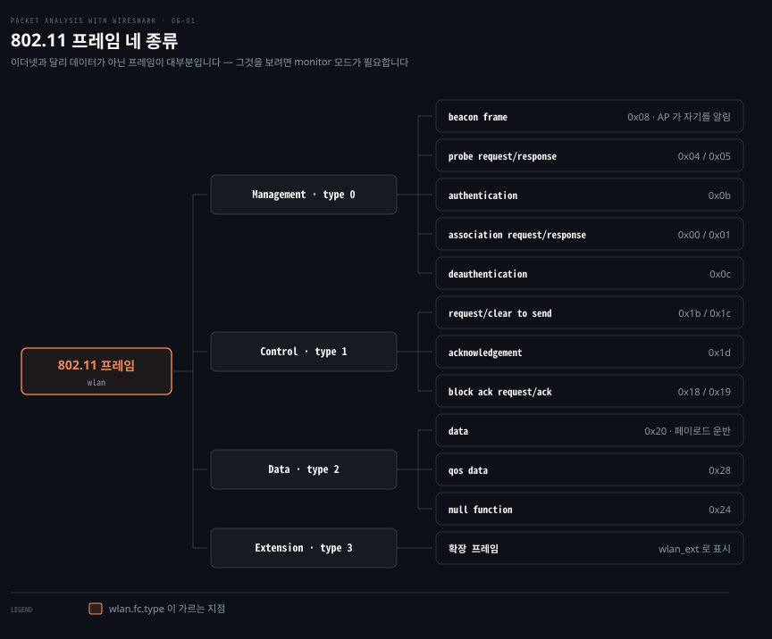
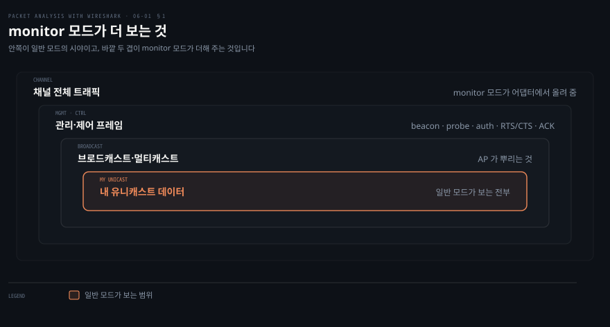
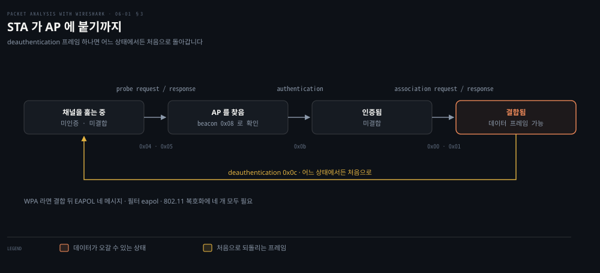
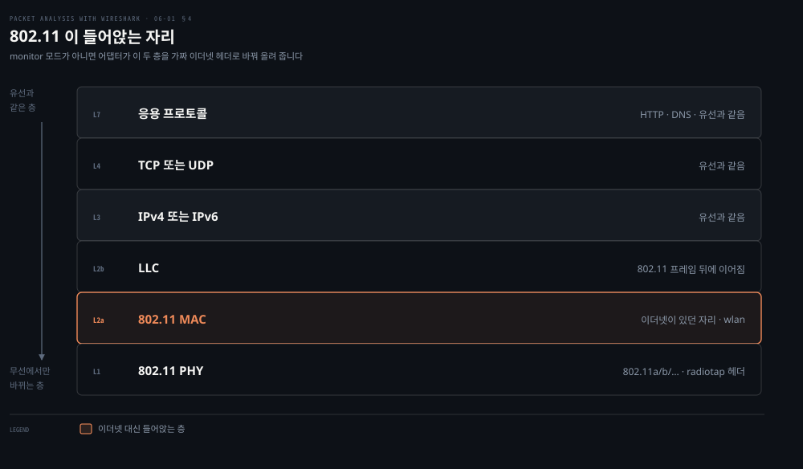

# 무선에서 잡기

---

> 6장은 매체가 바뀌면 캡처가 어떻게 달라지는지를 다룹니다. 선이 없으니 promiscuous 모드만으로는 부족하고, 데이터가 아닌 프레임이 대부분을 차지합니다.

## 핵심 요약

> 이 편이 매달린 하나의 생각은 **무선에서는 어댑터가 무엇을 올려 줄지가 캡처의 상한이며, monitor 모드를 켜야만 그 상한이 채널 전체로 넓어진다**는 것입니다.

유선에서 promiscuous 모드가 하던 일을 무선에서는 monitor 모드가 합니다. 원문의 정의가 그것입니다. **"Wireshark 는 monitor 모드, 곧 RFMON(Radio Frequency Monitor) 모드로 돌아야 하며, 이 모드는 무선 네트워크 인터페이스 컨트롤러(WNIC)를 가진 컴퓨터가 AP 로부터 받은 모든 트래픽을 관찰하게 해 줍니다."**

모드를 켜면 화면의 성격이 바뀝니다. **어느 AP 에도 결합되지 않은 채 802.11 프레임만 보이며, 그 대부분은 데이터가 아니라 관리·비콘 프레임입니다.** 유선 캡처가 데이터 프레임 위주였던 것과 정반대입니다.

지원 여부는 운영체제와 드라이버가 정합니다. 원문이 셋으로 나눠 적습니다.

- Linux 는 무선 도구모음(`View | Wireless Toolbar`)으로 모드와 채널을 다룹니다.
- macOS 는 무선 어댑터가 monitor 모드를 지원합니다.
- Windows 는 지원하지 않아 AirPcap 같은 상용 어댑터가 필요합니다.


## 학습 목표

> 이 편을 읽고 나면 아래 다섯 가지를 스스로 해낼 수 있습니다.

1. promiscuous 모드와 monitor 모드가 각각 무엇을 바꾸는지 구분해 말할 수 있습니다.
2. Wireshark 와 `tcpdump` 로 monitor 모드 캡처를 시작할 수 있습니다.
3. 802.11 프레임 네 종류를 `wlan.fc.type` 으로 갈라 내고, 서브타입으로 특정 프레임만 뽑을 수 있습니다.
4. STA 가 AP 에 붙기까지의 프레임 순서를 캡처에서 따라갈 수 있습니다.
5. 무선 캡처의 계층 구조가 유선과 어디서 갈리는지 설명할 수 있습니다.

아래는 802.11 이 프레임을 나누는 네 종류와 그 아래 주요 서브타입입니다. 값은 원문 표에 적힌 것만 옮겼습니다.




## 1. monitor 모드가 더 보는 것

> promiscuous 모드는 내게 온 것을 버리지 않게 할 뿐입니다. 무선에서 남의 프레임까지 보려면 어댑터 자체를 다른 모드로 두어야 합니다.



### Wi-Fi 인데 내 트래픽만 잡힐 때

앞 편들에서 배운 대로 promiscuous 모드를 켰는데도 잡히는 것은 내 장비의 통신뿐입니다. 유선에서라면 스위치 탓을 하겠지만 무선에는 스위치가 없습니다. 원인이 다른 곳에 있습니다.

### 기본값은 두 끝점 사이만입니다

원문이 그 이유를 짚습니다. **"기본적으로 Wi-Fi 네트워크에서 트래픽을 잡기 시작하면 두 끝점(HOST-A 와 HOST-B) 사이의 트래픽을 잡습니다."** 어댑터가 자기와 무관한 프레임을 애초에 위로 올려 주지 않기 때문입니다.

monitor 모드는 그 상한을 바꿉니다. 원문의 표현대로 **"monitor 모드가 켜지면 어댑터는 그 채널에서 전송되는 모든 패킷을 잡습니다."** 그 안에 드는 것은 셋입니다.

- 유니캐스트 패킷
- 브로드캐스트 패킷
- 제어·관리 패킷

위 그림의 바깥 두 겹이 그렇게 더해지는 것입니다. **유선에서 promiscuous 모드가 "온 것을 버리지 않게" 했다면, 무선의 monitor 모드는 "오지 않던 것까지 오게" 합니다.** 두 모드의 성격이 다르다는 점이 이 장의 출발점입니다.

### 켜는 절차

원문이 제시하는 Wireshark 쪽 절차는 다섯입니다.

1. `Capture | Options` 를 누릅니다.
2. 활성 Wi-Fi 어댑터를 고르고 인터페이스 설정을 더블클릭합니다.
3. **Capture packets in Monitor mode** 옵션을 켭니다.
4. OK 를 누릅니다.
5. 캡처를 시작합니다.

`tcpdump` 로도 같은 일을 합니다. 원문이 드는 명령과 출력입니다.

```bash
tcpdump -I -P -i en0 -w 802.11.pcap
# tcpdump: WARNING: en0: no IPv4 address assigned
# tcpdump: listening on en0, link-type IEEE802_11_RADIO (802.11 plus radiotap header)
```

출력의 두 줄이 monitor 모드가 켜졌다는 증거입니다. **IPv4 주소가 없다는 경고는 어댑터가 네트워크에 결합되지 않았다는 뜻이고, 링크 타입이 `IEEE802_11_RADIO` 라는 것은 802.11 프레임에 radiotap 헤더가 붙어 올라온다는 뜻입니다.** 유선 캡처의 링크 타입이 이더넷이던 것과 여기서 갈립니다.

원문이 다는 팁 하나가 실무적입니다. **monitor 모드에서는 이름 해석을 끄십시오.** Wireshark 가 FQDN 을 풀려고 시도하는데 monitor 모드에는 외부 네트워크가 없으므로, 캡처 파일을 여는 것이 느려지기만 합니다. 앞 편의 이름 해석 대가가 여기서는 이득 없이 비용만 남습니다.


## 2. 프레임 네 종류와 필터

> 802.11 은 프레임을 네 종류로 나눕니다. 유선과 달리 데이터가 아닌 프레임이 대부분이라, 종류를 가르는 것이 첫 작업입니다.

### 화면이 낯선 이름으로 가득할 때

monitor 모드로 잡으면 `Beacon frame`, `Probe Request`, `Acknowledgement` 같은 줄이 이어집니다. 유선 캡처에서 보던 IP·TCP 는 잘 안 보입니다. 이 이름들이 무엇인지 모르면 어디부터 볼지가 안 정해집니다.

### 최상위 네 갈래

원문은 계층 2 의 데이터그램을 프레임이라 부르고 종류를 넷으로 나눕니다.

| 종류 | 값 | 필터 |
|------|:---:|------|
| Management | `0x00` | `wlan.fc.type == 0` |
| Control | `0x01` | `wlan.fc.type == 1` |
| Data | `0x02` | `wlan.fc.type == 2` |
| Extension | `0x03` | `wlan.fc.type == 3` |

원문은 프로토콜 계열별 디스플레이 필터도 함께 줍니다. `wlan` 은 802.11 프레임, `wlan_ext` 는 확장 프레임, `wlan_mgt` 는 관리 프레임, `wlan_aggregate` 는 집합 프레임입니다.

> **지금은 다릅니다**: 현행 Wireshark 의 디스플레이 필터 레퍼런스에서 802.11 필드는 모두 `wlan.` 접두사 아래에 있고, `wlan_mgt` 로 시작하는 필드는 목록에 없습니다. 원문의 `wlan_mgt.ssid` 같은 표기를 그대로 치면 안 먹을 수 있으므로, 정확한 필드 이름은 [디스플레이 필터 레퍼런스](https://www.wireshark.org/docs/dfref/w/wlan.html)에서 확인하는 편이 안전합니다.

### 관리 프레임 — 무선에서 가장 많이 보이는 것

원문은 관리 프레임의 서브타입을 값과 함께 정리합니다. `wlan.fc.type_subtype` 으로 특정 프레임만 뽑습니다.

| 이름 | 값 | 이름 | 값 |
|------|:---:|------|:---:|
| association request | `0x00` | beacon frame | `0x08` |
| association response | `0x01` | atim | `0x09` |
| reassociation request | `0x02` | disassociation | `0x0a` |
| reassociation response | `0x03` | authentication | `0x0b` |
| probe request | `0x04` | deauthentication | `0x0c` |
| probe response | `0x05` | action | `0x0d` |
| measurement pilot | `0x06` | action no ack | `0x0e` |

> **원문 정오**: probe response 행의 값은 `0x05` 인데 같은 행의 필터는 `wlan.fc.type_subtype == 0x06` 으로 적혀 있습니다. `0x06` 은 바로 다음 행 measurement pilot 의 값이라 두 행의 필터가 같아집니다. probe response 를 뽑으려면 `wlan.fc.type_subtype == 0x05` 를 써야 합니다. 위 표는 값 쪽을 기준으로 적었습니다.

비콘 프레임이 이 목록에서 가장 쓸모가 큽니다. 원문의 설명대로 **"비콘은 무선 네트워크의 특성을 보여 주는 작은 브로드캐스트 데이터 패킷"** 이며, 담는 것이 여럿입니다. 최대 데이터 전송률, 성능(암호화 켬·끔), AP 의 MAC 주소, SSID(무선 네트워크 이름), RSN 정보, 벤더별 정보, Wi-Fi Protected Setup 등입니다.

원문이 짚는 두 이름의 구분이 실무에서 자주 헷갈립니다. **SSID 는 AP 의 이름이고, BSSID 는 AP 의 MAC 주소입니다.** 원문의 예로는 SSID 가 `ANish`, BSSID 가 `94:FB:B3:B8:DF:DD` 입니다.

```bash
wlan.fc.type_subtype == 0x08     # 비콘만 — 주변에 어떤 AP 가 있는지
wlan.fc.type_subtype == 0x0c     # deauthentication — 끊긴 원인을 볼 때
```

### 데이터 프레임과 제어 프레임

데이터 프레임은 원문의 설명대로 **"파일이나 화면 같은 페이로드를 담을 수 있는 패킷을 나릅니다."** 값은 `0x20` 부터 시작합니다. 실무에서 자주 쓰는 것은 `0x20` 인 data 와 `0x28` 인 qos data 둘입니다. 원문의 예제 필터는 QoS Data + CF-Poll 을 뽑는 `wlan.fc.type_subtype == 0x2A` 입니다.

제어 프레임은 **"스테이션 사이에서 데이터 프레임을 교환"** 하는 프레임입니다. RTS(`0x1b`)·CTS(`0x1c`)·ACK(`0x1d`)가 여기 있고, 무선의 매체 접근 방식이 이 셋에 드러납니다.

> **노트의 읽기**: 원문의 제어 프레임 표에는 `0x162`·`0x165` 처럼 세 자리 값이 여럿 있습니다. 원문 자신이 그 앞에 **"제어 프레임 확장의 범위는 `0x160`–`0x16A` 이며 type = 1, subtype = 6 이다"** 라고 적어 이것이 일반 서브타입이 아니라 확장 서브타입임을 밝힙니다. 다만 `wlan.fc.type_subtype` 은 타입 2비트와 서브타입 4비트를 합친 값이라 표현 범위가 `0x00`–`0x3F` 이므로, 세 자리 값을 그대로 필터에 넣는 것은 그 범위 밖입니다. 확장 프레임을 다뤄야 한다면 값을 옮겨 적기 전에 레퍼런스에서 현재 표기를 확인하는 편이 안전합니다.


## 3. STA 가 AP 에 붙기까지

> 무선에서는 데이터를 주고받기 전에 세 단계를 지납니다. 각 단계마다 오가는 프레임 이름이 정해져 있습니다.



### 붙었다 끊겼다 할 때

Wi-Fi 가 자꾸 끊긴다는 신고에서 어느 단계에서 끊기는지는 프레임 이름이 알려 줍니다. 인증에서 실패하는 것과 결합에서 실패하는 것, 그리고 붙어 있다가 쫓겨나는 것은 원인이 다릅니다.

### 원문이 서술하는 순서

용어부터 정리해 둘 필요가 있습니다. 원문은 **"무선 네트워크는 유선 LAN 과 다릅니다. 여기서 주소를 지정할 수 있는 단위는 스테이션(STA)이며, STA 는 고정된 위치가 아니라 메시지의 목적지입니다"** 라고 적습니다. AP 도 하나의 STA 를 포함하며 분배 시스템으로 가는 접근을 제공합니다.

절차는 이렇게 흐릅니다.

1. **AP 가 비콘 프레임으로 자기 성능을 알립니다.**
2. **STA 가 프로브 요청 프레임을 뿌려** 어느 AP 가 범위 안에 있는지 알아냅니다.
3. **프로브 응답 프레임**에 AP 의 성능 정보와 지원 데이터 전송률 등이 담겨 옵니다.
4. **STA 가 자기 신원을 담은 인증 프레임**을 AP 로 보냅니다. 기본값인 개방 시스템 인증에서는 AP 가 인증 프레임으로 수락 또는 거절을 응답합니다.
5. **STA 가 결합 요청 프레임**을 보내고 AP 가 결합 응답 프레임으로 수락 또는 거절합니다. 수락되면 STA 는 AP 를 통해 다른 네트워크에 접근할 수 있습니다.

위 그림이 그 흐름이고, 마지막 상태에 이르러야 데이터 프레임이 오갑니다. **`deauthentication` 프레임 하나면 어느 상태에서든 처음으로 돌아간다**는 점도 함께 봐야 합니다. 캡처에 그 프레임이 반복해서 보이면 끊김의 원인이 그 자리입니다.

> **노트의 읽기**: 원문은 프로브 요청에 대해 "모든 채널에서, 보통은 (채널 11)"이라고 적습니다. 모든 채널을 훑는다는 것과 보통 채널 11 이라는 것이 한 문장 안에서 어긋납니다. 실제로 STA 는 채널을 차례로 옮겨 가며 프로브 요청을 뿌리고, 채널 11 은 그 과정에서 자주 쓰이는 채널의 하나입니다.

### 공유 키 인증

원문은 개방 시스템 인증과 대비해 공유 키 인증도 설명합니다. **WEP(64비트 또는 128비트) 키가 필요하고 클라이언트와 AP 가 같은 키를 써야 합니다.** 절차는 STA 가 공유 키 인증을 요청하면 AP 가 암호화되지 않은 128바이트의 무작위 시험 문구를 보내고, STA 가 그것을 암호화해 돌려주면 AP 가 수락 또는 거절을 응답하는 형태입니다.

> **지금은 다릅니다**: WEP 는 오래전에 깨졌고 공유 키 인증도 함께 폐기됐습니다. 현재 실무에서 만나는 것은 WPA2·WPA3 이고, 그 인증은 다음 절의 EAPOL 네 메시지로 이루어집니다. 원문의 공유 키 인증 절차는 프로토콜의 역사로 읽는 편이 맞습니다.

### 802.1X 와 EAPOL

원문은 IEEE 802.1x 를 **"PPP 의 확장인 EAP(Extensible Authentication Protocol)에 기반하며 'EAP over LAN' 또는 EAPOL 이라고도 불린다"** 고 소개합니다.

캡처에서 볼 때는 필터 하나면 됩니다. 원문은 `802.11-AUTH-enabled.pcap` 을 열고 `eapol` 필터를 걸라고 안내합니다. 그리고 **"EAPOL 패킷에서 장치와 AP 의 세션 키가 다루어지고, 모든 EAPOL 패킷이 4개 중 1·2·3·4 로 잡힌다"** 고 적습니다. 이른바 4-way handshake 입니다.

원문이 마지막에 다는 문장이 앞 장과 이어집니다. **"802.11 트래픽을 복호화하려면 이 EAPOL 패킷들이 필요합니다."** 4장에서 TLS 복호화에 세션 키가 필요했던 것과 같은 구조입니다. **암호화된 통신을 여는 열쇠는 언제나 핸드셰이크 구간에 있고, 그 구간을 못 잡으면 뒤를 못 엽니다.** 무선 캡처를 시작하는 시점이 중요한 이유가 이것입니다.

> **노트의 읽기**: 원문은 "IEEE 802.11 워킹 그룹이 2001년에 802.1x 표준을 통과시켰다"고 적습니다. 802.1X 는 802.11 워킹 그룹이 아니라 **IEEE 802.1 워킹 그룹**의 표준입니다. 이름의 숫자가 그 소속을 가리킵니다. 802.11 이 그것을 무선 인증에 끌어다 쓴 것입니다.


## 4. 802.11 이 들어앉는 자리

> 무선에서 바뀌는 것은 아래 두 층뿐입니다. IP 위로는 유선 캡처와 똑같이 읽힙니다.



### 무선 캡처인데 이더넷처럼 보일 때

무선에서 잡았는데 Packet Details 에 `Ethernet II` 가 뜨는 일이 있습니다. 잘못 잡은 것인지 정상인지가 헷갈립니다.

### 802.11 이 이더넷 자리를 대신합니다

원문은 계층 관계를 이렇게 적습니다. **"802.11 표준은 802.11 기반 무선 LAN 의 동작을 지원하는 공통 MAC(데이터 링크) 계층을 규정합니다. 802.11 MAC 계층은 802.11a/b 같은 802.11 물리(PHY) 계층을 써서 캐리어 감지·송신·802.11 프레임 수신을 수행합니다."**

원문의 예제는 `802.11-AUTH-Disabled.pcap` 을 열고 `wlan.da==e8:de:27:59:72:06` 으로 걸러 데이터가 어떻게 실려 가는지를 보는 것입니다. 관찰 결과는 이렇습니다. **"802.11 QoS 데이터 프레임에서 LLC 헤더가 IEEE 802.11 뒤에 따라옵니다. 이것이 monitor 모드에서 기대되는 모습입니다."**

앞 절의 헷갈림에 대한 답이 마지막 문장에 있습니다. **"잡힌 802.11 이 이더넷 패킷처럼 보이는 것은, 802.11 어댑터가 종종 데이터 패킷을 가짜 이더넷 패킷으로 바꿔 호스트에 넘기기 때문입니다."**

곧 화면에 `Ethernet II` 가 보이면 **monitor 모드가 아니라 일반 모드로 잡힌 것**입니다. 802.11 프레임 헤더를 보려면 monitor 모드가 필요하고, 그때는 위 그림의 두 층이 `Ethernet II` 자리에 나타납니다. **"이더넷처럼 보이는가"가 모드를 확인하는 가장 빠른 눈금입니다.**


## 5. 다른 Wi-Fi 스니핑 도구

> Wireshark 로 안 되는 자리가 있습니다. 운영체제나 목적에 따라 다른 도구를 씁니다.

### Windows 에서 막힐 때

앞에서 본 대로 Windows 는 monitor 모드를 지원하지 않습니다. WEP 복호화나 위치 정보 같은 기능도 Wireshark 의 범위 밖입니다.

### 원문이 꼽는 도구

| 도구 | 원문의 설명 |
|------|------------|
| [Kismet](https://www.kismetwireless.net/) | 802.11a/b/g/n Wi-Fi 트래픽을 스니핑합니다 |
| Riverbed AirPcap | 802.11a/b/g/n 을 잡고 분석하며 Wireshark 와 완전히 통합됩니다 |
| KisMac (macOS) | Kismet 과 비슷한 기능을 제공하며 macOS 판 NetStumbler 로 통합니다 |
| NetStumbler | Wi-Fi 분석에 씁니다 |

원문은 macOS 사용자를 위해 시스템 기본 도구도 함께 듭니다. airport ID·airport utility·Wi-Fi Diagnostics 로 무선 네트워크를 스니핑하고 진단할 수 있다는 것입니다.

이 목록에서 실무적으로 남는 것은 **Windows 에서 monitor 모드가 필요하면 전용 하드웨어를 사야 한다**는 사실입니다. 앞 절의 AirPcap 이 그 자리이고, 다른 두 운영체제에서는 하드웨어 추가 없이 됩니다.

> **노트의 읽기**: 표의 도구 링크는 모두 2015년 시점 주소입니다. 이 노트에서 각 도구의 현재 유지보수 상태를 확인하지는 않았으므로, 실제로 쓰기 전에 개별 확인이 필요합니다.


## 심화 학습

> 6장에서 바뀐 것은 필터 접두사와 인증 방식입니다. monitor 모드의 원리와 프레임 구조는 그대로입니다.

| 원문(2015) | 현행(2026) | 성격 |
|-----------|-----------|------|
| `wlan` · `wlan.fc.type` · `wlan.fc.type_subtype` | 그대로 | 유지 |
| `wlan_mgt.*` | `wlan.` 접두사 아래로 정리 | 바뀜 |
| probe response 필터가 `0x06` | `0x05` | 정오 |
| WEP 공유 키 인증 | 폐기. WPA2·WPA3 와 EAPOL | 바뀜 |
| 802.1x 는 802.11 워킹 그룹 | IEEE 802.1 워킹 그룹 | 정오 |
| Windows 는 monitor 모드 미지원 | 그대로. 전용 어댑터가 필요합니다 | 유지 |
| `tcpdump -I` 로 monitor 모드 | 그대로 | 유지 |
| 802.11a/b/g/n | ax(Wi-Fi 6)·be(Wi-Fi 7)가 더해졌습니다 | 확장 |

원문이 다루지 않는 축이 하나 있습니다. **채널을 고르는 일**입니다. monitor 모드는 어댑터가 맞춰진 **한 채널**의 트래픽만 잡습니다. 원문은 Linux 무선 도구모음이 채널 설정을 제공한다고만 적고 넘어가는데, 실무에서는 이것이 캡처 성패를 가릅니다.

**조사 대상 AP 가 6번 채널에 있는데 어댑터가 1번에 있으면 아무것도 안 잡힙니다.** 그래서 순서가 정해집니다. 먼저 비콘을 훑어 대상 AP 의 채널을 확인하고, 그 채널로 고정한 뒤 본 캡처를 시작합니다.

```bash
# 1. 비콘만 걸러 주변 AP 와 채널을 봅니다
wlan.fc.type_subtype == 0x08

# 2. 특정 AP 의 트래픽만 — BSSID 로 고정합니다
wlan.bssid == 94:fb:b3:b8:df:dd

# 3. 복호화에 필요한 EAPOL 네 개가 잡혔는지 확인합니다
eapol
```

세 번째가 특히 중요합니다. **EAPOL 네 메시지는 STA 가 AP 에 붙는 순간에만 오갑니다.** 이미 붙어 있는 장비의 트래픽을 나중에 잡으면 그 넷이 없어 복호화할 수 없습니다. 대상 장비의 Wi-Fi 를 껐다 켜서 재결합을 유도하는 것이 실무의 요령이며, 앞 장에서 TLS 세션 키를 미리 남겨 두어야 했던 것과 같은 이유입니다.


## 결정 치트시트

> 무선 캡처에서 막혔을 때 확인할 것들입니다.

| 증상 | 원인 후보 | 확인 |
|------|----------|------|
| 내 트래픽만 잡힘 | monitor 모드가 꺼져 있습니다 | 링크 타입이 `IEEE802_11_RADIO` 인가 |
| `Ethernet II` 가 보임 | 일반 모드입니다 | 어댑터가 프레임을 가짜 이더넷으로 바꿨습니다 |
| 아무것도 안 잡힘 | 채널이 다릅니다 | 비콘(`0x08`)으로 대상 AP 의 채널 확인 |
| Windows 에서 모드가 안 켜짐 | 미지원입니다 | 전용 어댑터 또는 다른 OS |
| 파일 열기가 느림 | 이름 해석이 켜져 있습니다 | monitor 모드에서는 끕니다 |
| 복호화가 안 됨 | EAPOL 넷이 없습니다 | 재결합을 유도해 다시 잡습니다 |
| 자꾸 끊김 | deauthentication 프레임 | `wlan.fc.type_subtype == 0x0c` 로 셉니다 |


## 면접 대비

### 한 줄 정의

"monitor 모드는 무선 어댑터가 자기와 무관한 프레임까지 위로 올려 주게 하는 모드이며, 유선의 promiscuous 모드가 '온 것을 안 버리는' 설정인 것과 달리 '오지 않던 것을 오게 하는' 설정입니다."

### 핵심 포인트 세 가지

1. **두 모드는 성격이 다릅니다.** promiscuous 모드는 NIC 가 목적지 주소로 거르는 것을 멈추게 하고, monitor 모드는 어댑터가 채널 전체의 프레임을 올려 주게 합니다. 무선에서는 후자가 없으면 관리·제어 프레임이 아예 안 보입니다.
2. **`Ethernet II` 가 보이면 monitor 모드가 아닙니다.** 어댑터가 802.11 프레임을 가짜 이더넷 패킷으로 바꿔 넘기기 때문이고, 그러면 802.11 헤더를 볼 수 없습니다.
3. **복호화하려면 결합 순간을 잡아야 합니다.** EAPOL 4-way handshake 는 STA 가 AP 에 붙을 때만 오가므로, 이미 붙어 있는 장비의 트래픽은 나중에 잡아도 못 엽니다.

### 자주 묻는 질문

Q: monitor 모드를 켰는데 아무것도 안 잡힙니다.
A: 채널을 확인합니다. monitor 모드는 어댑터가 맞춰진 한 채널만 잡으므로, 대상 AP 가 다른 채널이면 비어 있습니다. 비콘 필터로 주변 AP 와 채널을 먼저 봅니다.

Q: Wi-Fi 가 자꾸 끊깁니다. 캡처에서 무엇을 봅니까?
A: `wlan.fc.type_subtype == 0x0c` 로 deauthentication 프레임을 셉니다. 이 프레임 하나면 어느 상태에서든 처음으로 돌아가므로, 반복해서 보이면 그것이 끊김의 직접 원인입니다.

Q: SSID 와 BSSID 의 차이가 무엇입니까?
A: SSID 는 AP 의 이름이고 BSSID 는 AP 의 MAC 주소입니다. 같은 SSID 를 여러 AP 가 쓸 수 있으므로, 특정 AP 만 걸러야 할 때는 BSSID 를 씁니다.


## 핵심 개념 체크리스트

- [ ] promiscuous 모드와 monitor 모드가 각각 무엇을 바꾸는지 한 문장씩 말할 수 있습니까?
- [ ] `tcpdump` 출력의 링크 타입으로 monitor 모드 여부를 판단할 수 있습니까?
- [ ] `wlan.fc.type` 네 값이 각각 어떤 프레임인지 댈 수 있습니까?
- [ ] 비콘 프레임에 담기는 정보를 세 가지 이상 말할 수 있습니까?
- [ ] STA 가 AP 에 붙기까지의 프레임 순서를 짚을 수 있습니까?
- [ ] 무선 트래픽을 복호화하려면 캡처를 언제 시작해야 하는지 설명할 수 있습니까?


## 관련 문서

- [05-02 이름과 요청](./05-02.이름과 요청.md) — 앞 장. 유선에서의 응용 프로토콜
- [02-01 패킷을 잡는 법](./02-01.패킷을 잡는 법.md) — promiscuous 모드와 캡처 옵션
- [Packet Analysis with Wireshark — 정독 인덱스](./README.md) — 7개 장 전체 지도


## 참고 자료

- 원본: 《Packet Analysis with Wireshark》 (Anish Nath, Packt Publishing, 2015) ISBN 978-1-78588-781-9
- 다룬 범위: Chapter 6 WLAN Capturing 전체
- [Wireshark Wiki — CaptureSetup/WLAN](https://wiki.wireshark.org/CaptureSetup/WLAN) — 원문이 가리키는 무선 캡처 설정 문서
- [Wireshark Wiki — HowToDecrypt802.11](https://wiki.wireshark.org/HowToDecrypt802.11) — 원문이 가리키는 복호화 문서
- [디스플레이 필터 레퍼런스 — WLAN](https://www.wireshark.org/docs/dfref/w/wlan.html) — 현행 필드 이름의 정본
