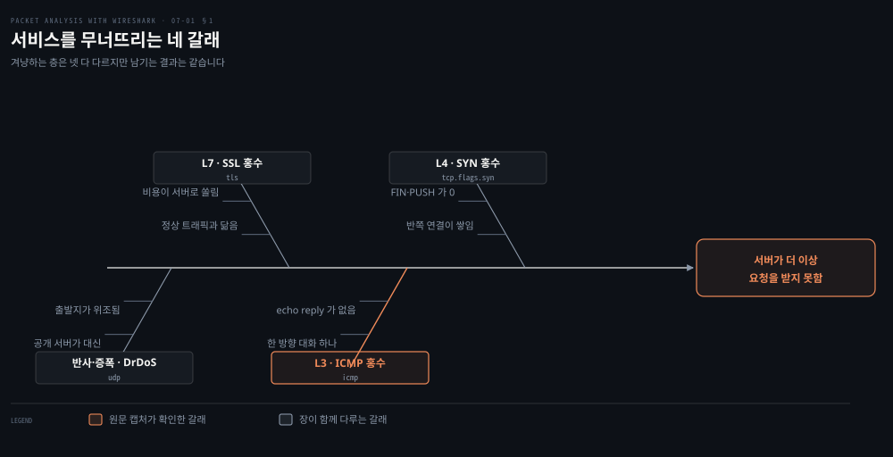
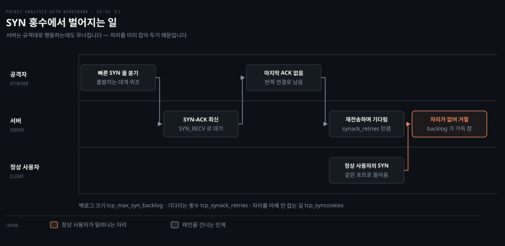
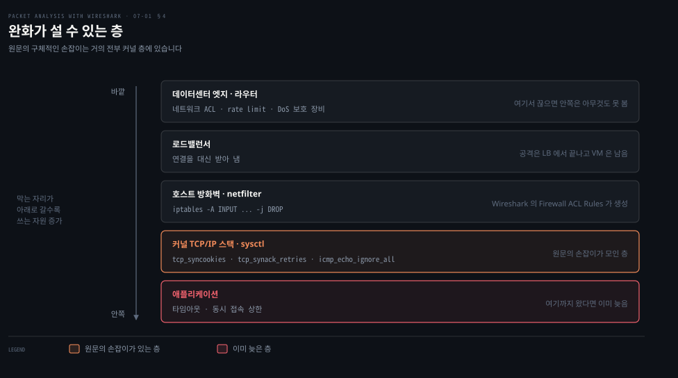
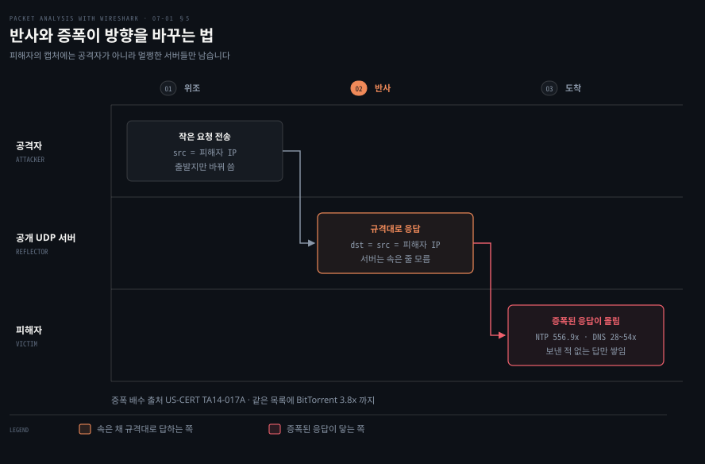

# 서비스를 무너뜨리는 공격

---

> 7장 전반부는 가용성을 겨냥하는 공격을 봅니다. 서버를 속이는 것이 아니라 서버가 규격대로 하는 일을 감당할 수 없을 만큼 시키는 쪽입니다.

## 핵심 요약

> 이 편이 매달린 하나의 생각은 **서비스 거부 공격의 패킷은 하나씩 뜯어보면 전부 정상이며, 이상은 오직 양과 방향에서만 드러난다**는 것입니다.

앞의 여섯 장에서 배운 읽기는 패킷 하나를 여는 일이었습니다. SYN 플래그가 켜졌는지, 레코드 타입이 24인지, 프레임이 관리 프레임인지. 7장 전반부에서는 그 읽기가 통하지 않습니다. **SYN 홍수의 SYN 패킷 하나를 열어 봐야 정상적인 연결 요청과 구별되지 않습니다.**

그래서 도구가 바뀝니다. 원문이 SYN 홍수와 ICMP 홍수 양쪽에서 여는 창이 같습니다. **IO Graph 로 시간당 개수를 보고, Conversations 로 누가 누구에게 얼마나 보냈는지를 봅니다.** 필터로 한 패킷을 고르는 대신 통계로 분포를 봅니다.

공격이 노리는 것도 공통점이 있습니다. **서버가 상대를 믿고 미리 잡아 두는 자원**입니다. SYN 홍수는 SYN_RECV 자리를, ICMP 홍수는 응답을 만들 CPU 를, SSL 홍수는 개인 키 연산을 겨눕니다. 규격이 "일단 자리를 잡고 기다려라"라고 정해 둔 곳마다 공격면이 하나씩 생깁니다.


## 학습 목표

> 이 편을 읽고 나면 아래 다섯 가지를 스스로 해낼 수 있습니다.

1. IO Graph 에 SYN·ACK·FIN·PUSH 네 그래프를 걸고 그 모양으로 SYN 홍수를 판정할 수 있습니다.
2. SYN 홍수에서 ACK 개수가 왜 SYN 개수의 절반으로 나오는지 계산으로 설명할 수 있습니다.
3. Conversations 창에서 한 방향으로만 흐르는 대화를 찾고 평균 프레임 크기까지 읽어 낼 수 있습니다.
4. 완화책이 서는 층을 구분하고, 커널 sysctl 중 어느 항목이 실제로 SYN 홍수에 듣는지 가릴 수 있습니다.
5. 반사·증폭 공격에서 피해자의 캡처에 무엇이 남는지, 왜 공격자가 거기 없는지 설명할 수 있습니다.


## 1. 넘치게 만드는 네 갈래

> 결과는 하나이고 그 결과에 이르는 길이 원문에서 넷으로 갈립니다. 서버가 더 이상 요청을 받지 못한다는 결과입니다.



### 공격인지 사고인지부터 갈라야 합니다

"서비스가 안 됩니다"라는 신고에는 배포 실수도, 디스크 가득 참도, 공격도 들어 있습니다. 캡처를 여는 이유는 **바깥에서 들어온 트래픽이 원인인지**를 먼저 가르기 위해서입니다. 그 판정이 서고 나서야 어느 갈래인지를 따집니다.

### 원문이 정의하는 결과

원문은 DoS 를 결과로 정의합니다. **"이 기법은 호스트가 사용자에게 더 이상 어떤 요청도 제공할 수 없게 만드는 방식으로 공격하는 것입니다. 결국 서버가 죽고 서버 불가 상태가 됩니다."**

이 정의에 방법이 없다는 점이 중요합니다. 결과가 같으면 다 DoS 이므로, 갈래를 나누는 기준은 **어느 층의 어떤 자원을 소진시키느냐**가 됩니다.

| 갈래 | 겨냥하는 층 | 소진시키는 것 | 캡처에서 읽히는 근거 |
|------|-----------|-------------|-------------------|
| SYN 홍수 | L4 · TCP | 반쪽 연결을 담아 두는 백로그 | SYN 은 많고 FIN·PUSH 는 0 |
| ICMP 홍수 | L3 · ICMP | echo 응답을 만드는 처리 능력 | echo request 만 있고 reply 가 없음 |
| SSL 홍수 | L7 · TLS | 핸드셰이크의 키 연산 | 정상 트래픽과 닮아 개수로만 드러남 |
| DrDoS | 반사·증폭 | 회선 대역폭 | 요청한 적 없는 응답만 쌓임 |

위 그림이 이 표를 결과 하나 아래 모은 것입니다. 강조한 갈래가 ICMP 홍수인 이유는 원문의 예제 캡처 `ICMP_Flood_01.pcap` 이 실제로 그 갈래를 확인해 주기 때문입니다. 나머지 셋은 원문이 함께 다루지만 캡처로 끝까지 확인되는 것은 이쪽 하나입니다.

원문이 다루는 순서와 이 편의 순서가 다릅니다. 원문은 SYN·ICMP·SSL 을 한 절에 묶고 DrDoS 를 뒤에 따로 두었는데, DrDoS 도 결과가 같은 갈래이므로 여기서는 함께 놓았습니다.


## 2. SYN 홍수 — 서버가 규격을 지켜서 무너집니다

> 3장에서 본 세 번의 악수 중 마지막 하나를 빼면 공격이 됩니다. 서버는 아무 잘못도 하지 않습니다.



### 연결이 안 되는데 서버는 멀쩡합니다

부하는 낮은데 새 연결만 안 붙는 상황이 있습니다. 프로세스는 살아 있고 CPU 도 한가한데 클라이언트만 타임아웃이 납니다. 이때 의심할 것이 **연결을 받아 두는 자리가 남의 것으로 차 있는 경우**입니다.

### 원문이 서술하는 두 가지 시나리오

원문은 3장의 세 번 악수를 상기시키고 나서 공격을 둘로 나눕니다.

- 클라이언트가 SYN 을 아주 빠르게 보내고, SYN-ACK 을 받고도 마지막 ACK 으로 답하지 않습니다.
- 또는 SYN 을 아주 빠르게 보내면서 서버의 SYN-ACK 을 막거나, 위조한 출발지 IP 로 SYN 을 보내 SYN-ACK 이 실재하지 않는 호스트로 가게 합니다.

그리고 결과를 한 문장으로 적습니다. **"이 모든 시나리오에서 TCP/IP 스택 파일 디스크립터가 소진되어 서버가 느려지고 결국 죽습니다."**

위 그림이 이 서술에 정상 사용자를 한 레인 더 넣은 것입니다. 원문의 서술에는 피해자가 명시되지 않지만, **실제로 밀려나는 것은 공격자가 아니라 그 뒤에 줄 서 있던 정상 사용자**이므로 그 자리를 그림에서 강조했습니다.

### IO Graph 로 판정하기

원문의 절차는 짧습니다. `SYN_FLOOD.pcap` 을 열고 `Statistics | IO Graph` 를 눌러 네 개의 그래프를 만듭니다. 예제 화면의 필터가 그대로 읽힙니다.

```properties
Graph 1 = tcp.flags.syn==1
Graph 2 = tcp.flags.ack==1
Graph 3 = tcp.flags.fin==1
Graph 4 = tcp.flags.push==1
```

원문이 이 네 그래프에서 읽어 내는 것이 넷입니다.

- `tcp.flags.fin` 의 개수가 0 이므로 TCP 연결이 한 번도 닫히지 않았습니다.
- `tcp.flags.push` 의 개수가 0 이므로 데이터를 한 번도 주고받지 않았습니다.
- SYN 패킷의 개수가 아주 많습니다.
- ACK 의 개수가 SYN 개수의 절반입니다.

앞의 셋은 바로 읽힙니다. 연결이 열리기만 하고 닫히지도 쓰이지도 않았다는 뜻입니다. 네 번째가 설명 없이 던져져 있어 걸립니다.

> **노트의 읽기**: ACK 이 정확히 절반으로 나오는 이유는 필터의 의미에 있습니다. `tcp.flags.syn` 은 SYN 비트 하나를 보는 불리언 필드라 **SYN 패킷과 SYN-ACK 패킷을 둘 다** 셉니다. 반면 `tcp.flags.ack==1` 에 걸리는 것은 이 캡처에서 SYN-ACK 뿐입니다. 마지막 ACK 이 끝내 오지 않으므로 순수 ACK 패킷이 없기 때문입니다. 공격자가 SYN 을 N 개 보내고 서버가 SYN-ACK 을 N 개 돌려주면, SYN 비트가 켜진 패킷은 2N 개이고 ACK 비트가 켜진 패킷은 N 개입니다. 절반은 우연이 아니라 이 캡처의 구조입니다.

이 읽기가 서면 판정 기준이 하나 더 생깁니다. **ACK 대 SYN 비가 절반에 가까울수록 마지막 악수가 통째로 빠졌다는 뜻**이고, 비가 1 에 가까워지면 정상 연결이 섞여 있다는 뜻입니다.

### 실전에서의 단서

원문은 예제가 실제와 다르다는 점을 스스로 짚습니다. **"실제 상황에서는 이 데이터가 진짜 패킷 흐름과 섞이겠지만 분석 기법은 그대로입니다. SYN 패킷이 예상 밖으로 늘거나 SYN 패킷에 뾰족한 봉우리가 보이는 순간, 그것은 DoS 의 SYN 홍수이거나 여러 출발지에서 오는 DDoS 입니다."**

섞인다는 말이 중요합니다. 실무의 캡처에서 FIN 과 PUSH 가 0 인 일은 없습니다. **보는 것은 절대 개수가 아니라 기울기**이고, 그래서 원문도 "예상 밖의 증가"와 "봉우리"라는 표현을 씁니다.


## 3. ICMP 홍수 — 통계 창이 숫자를 줍니다

> ping 은 답을 요구하는 프로토콜입니다. 답하는 쪽이 답하지 못할 만큼 물으면 그 자체가 공격이 됩니다.

### 그래프만 보면 규모를 오해합니다

IO Graph 는 시간당 개수를 그리는 도구입니다. 봉우리 높이는 **한 눈금 안의 개수**이지 전체 개수가 아닙니다. 규모를 말하려면 다른 창이 필요합니다.

### 원문의 정의와 절차

원문은 ICMP 홍수를 이렇게 정의합니다. **"공격자가 위조한 IP 주소로 echo request(ping) 패킷을 퍼붓거나, 서버가 echo request 로 넘쳐 각 요청에 대한 echo response 를 처리하지 못해 호스트가 느려지고 서비스 거부에 이릅니다."**

절차는 SYN 홍수와 같은 모양입니다. `ICMP_Flood_01.pcap` 을 열고 `Statistics | IO Graph` 에서 `icmp` 와 `icmpv6` 두 그래프를 그립니다. 원문이 화면에서 읽어 내는 특징이 둘입니다.

- IO 그래프에 ICMP 패킷이 아주 많습니다. 짧은 시간 안에 거의 8만 개의 ping 요청입니다.
- 캡처에 echo reply 메시지가 없습니다.

두 번째가 판정의 핵심입니다. **정상적인 ping 은 반드시 짝이 있습니다.** 요청만 있고 답이 없다면 답할 수 없거나 답이 다른 곳으로 가고 있다는 뜻입니다.

> **노트의 읽기**: "짧은 시간 안에 거의 8만 개"는 총계가 아니라 그래프 한 눈금당 최고치입니다. 예제 화면의 IO Graph 설정이 `Tick interval: 1 sec` · `Unit: Packets/Tick` 이므로 8만은 **초당** 개수입니다. 같은 파일을 Conversations 로 열면 총계가 나옵니다. **패킷 999,599개 · 41,983,438바이트 · 지속 41.96초**이므로 평균은 초당 약 23,800개입니다. 봉우리에서 8만, 평균으로 2만 4천이라는 두 숫자가 함께 있어야 규모를 제대로 말할 수 있습니다.

> **노트의 읽기**: 같은 창의 두 숫자를 나누면 단서가 하나 더 나옵니다. 41,983,438 ÷ 999,599 = 42.0 이므로 **평균 프레임이 42바이트**입니다. 이더넷 헤더 14 + IPv4 헤더 20 + ICMP 헤더 8 이 정확히 42 이므로, 이 패킷들은 **데이터를 한 바이트도 싣지 않은 최소 크기 echo request** 입니다. 사람이 치는 `ping` 은 기본 페이로드가 있어 98바이트쯤 나옵니다. 크기가 딱 헤더 합으로 떨어지면 생성기가 만든 트래픽을 의심합니다.

### Conversations 로 방향 보기

원문은 SSL 홍수를 설명하는 자리에서 Conversations 를 꺼냅니다. **"Wireshark 는 어느 IP 에서 가장 많은 패킷이 왔는지 알아내는 데 도움이 됩니다. 이 기능은 Wireshark Conversations 라 하며 어떤 종류의 홍수 상황(DoS 공격)에도 쓸 수 있습니다."**

`Statistics | Conversations` 를 열면 예제 화면에 줄이 딱 하나 뜹니다. 그 한 줄이 판정입니다.

| 열 | 값 | 무엇을 말하나 |
|----|-----|-------------|
| Address A · Address B | 10.0.0.4 · 10.0.0.5 | 캡처 전체에 대화가 하나뿐입니다 |
| Packets · Bytes | 999,599 · 41,983,438 | 앞에서 계산한 규모입니다 |
| Packets A→B | 0 | 공격받는 쪽이 한 개도 답하지 않았습니다 |
| Packets A←B | 999,599 | 전부 한 방향입니다 |
| Duration | 41.96초 | 초당 약 23,800개 |

**A→B 가 0 이라는 칸이 이 표에서 가장 많은 말을 합니다.** 대화라고 부르는 창에서 한쪽이 한 마디도 하지 않았다는 뜻이고, 그것이 곧 echo reply 가 없다는 원문의 관찰입니다.

> **노트의 읽기**: 원문은 SSL 홍수 절에서 `ICMP_Flood_01.pcap` 을 엽니다. SSL 캡처가 아니라 앞 절의 ICMP 캡처입니다. 이것은 실수라기보다 의도로 읽힙니다. 원문 스스로 Conversations 가 "어떤 종류의 홍수 상황에도" 쓰인다고 먼저 적어 두었기 때문입니다. 다만 SSL 홍수의 실제 화면은 이 예제로 확인되지 않는다는 점은 짚고 넘어가야 합니다.

### SSL 홍수가 다른 점

원문은 SSL 홍수를 L7 공격으로 분류하고 탐지가 어려운 이유를 답니다. **"정상적인 웹사이트 트래픽과 닮았다는 점에서 탐지가 어렵습니다."**

그리고 비용을 셉니다. 단방향 인증 기준으로 연결 하나를 세우는 데 대략 12개의 패킷이 오간다는 것입니다. TCP 악수 3개에 SSL 악수 9개를 더한 숫자입니다.

> **노트의 읽기**: 이 12 는 **메시지를 센 숫자**이지 TCP 세그먼트를 센 숫자가 아닙니다. 4장에서 본 대로 ServerHello·Certificate·ServerHelloDone 은 한 세그먼트에 함께 실려 오는 것이 보통이라, 실제 캡처의 패킷 수는 이보다 적습니다. 그리고 공격의 근거는 패킷 개수가 아니라 **비용의 비대칭**입니다. 클라이언트는 메시지를 던지기만 하고 서버는 개인 키 연산을 합니다. 개수가 아니라 이 비대칭이 SSL 홍수를 성립시킵니다.

원문은 같은 부류로 HTTP/HTTPS 의 POST 홍수와 GET 홍수를 덧붙입니다. 셋 다 연결이 정상적으로 맺어진 뒤에 벌어지므로 SYN 홍수의 판정 기준은 통하지 않습니다.


## 4. 막을 수 있는 자리

> 같은 공격이라도 어느 층에서 끊느냐에 따라 아래 층이 처리할 양이 달라집니다. 원문의 손잡이는 거의 전부 한 층에 몰려 있습니다.



### 설정을 어디에 넣어야 하는지

원문의 완화책 목록은 sysctl 한 줄과 iptables 한 줄과 "로드밸런서를 쓰라"가 나란히 놓여 있습니다. 이 셋은 같은 층의 조치가 아니므로, 무엇을 먼저 할지 정하려면 층으로 갈라 놓아야 합니다.

### 커널 스택 — 원문의 손잡이가 모인 곳

원문이 `/etc/sysctl.conf` 에 넣으라고 제시하는 항목이 다섯입니다.

```ini
net.ipv4.tcp_syncookies = 1
net.ipv4.tcp_syn_retries = 2
net.ipv4.tcp_synack_retries = 2
net.ipv4.tcp_max_syn_backlog = 4096
net.ipv4.tcp_max_tw_buckets = 1440000
```

각 항목이 실제로 무엇을 하는지를 커널 문서로 확인하면 목록의 성격이 갈립니다.

| 항목 | 커널 기본값 | 하는 일 | SYN 홍수에 듣나 |
|------|-----------|--------|---------------|
| `tcp_syncookies` | 1 | 백로그가 넘칠 때 자리를 잡지 않고 쿠키로 답합니다 | 듭니다 |
| `tcp_synack_retries` | 5 | SYN-ACK 을 몇 번 재전송할지 정합니다 | 듭니다 |
| `tcp_max_syn_backlog` | 메모리에 따라 다름 | 반쪽 연결을 몇 개까지 기억할지 정합니다 | 듭니다 |
| `tcp_syn_retries` | 6 | **나가는** 연결의 SYN 을 몇 번 재전송할지 정합니다 | 안 듭니다 |
| `tcp_max_tw_buckets` | 문서에 미기재 | TIME_WAIT 소켓의 **상한**입니다 | 겨냥이 다릅니다 |

> **노트의 읽기**: 목록 안의 `tcp_syn_retries` 는 SYN 홍수 방어와 무관합니다. 커널 문서는 이 값을 **"능동적 TCP 연결 시도의 최초 SYN 이 재전송되는 횟수"**[^sysctl]로 정의합니다. 여기서 능동적(active)은 내 서버가 바깥으로 거는 연결을 말하므로, 남이 내게 SYN 을 퍼붓는 상황에는 걸리지 않습니다. 원문의 산문은 **"SYN,ACK 재시도를 낮추면 서버가 SYN 홍수를 완화하는 데 도움이 됩니다"** 라고 적어 들어오는 연결 쪽인 `tcp_synack_retries` 를 정확히 지목하므로, 원문이 틀리게 적은 것은 아닙니다. 다만 설정 블록에는 두 항목이 나란히 있어 붙여 읽기 쉽고, 그대로 복사하면 방어와 무관한 값까지 바꾸게 됩니다.

> **노트의 읽기**: `tcp_max_tw_buckets` 에 붙은 주석 **"단순 DOS 공격을 막기 위해 tcp-time-wait 버킷 풀 크기를 늘립니다"** 는 커널 문서를 그대로 옮긴 것입니다. 해당 항목의 세 문장이 이렇습니다. **"시스템이 동시에 유지하는 timewait 소켓의 최대 개수. 이 수를 넘으면 timewait 소켓은 즉시 파괴되고 경고가 출력됩니다. 이 한계는 오직 단순한 DoS 공격을 막기 위해 존재하므로 인위적으로 낮춰서는 안 되며, 네트워크 상황이 기본값보다 큰 값을 요구하면 (아마도 메모리를 늘린 뒤에) 오히려 키워야 합니다."**[^sysctl] 다만 이 항목이 막는 것은 SYN 홍수가 아니라 TIME_WAIT 소켓이 메모리를 잠식하는 쪽입니다. 앞의 세 항목과 겨냥하는 자리가 다르므로 같은 묶음으로 외우지 않는 편이 낫습니다.

> **지금은 다릅니다 (4.6 · 현행 커널)**: `tcp_syncookies` 는 커널 기본값이 이미 1 이라 원문의 "SYNcookie 를 켜라"는 지시가 지금은 대부분 아무것도 바꾸지 않습니다. 그리고 커널 문서가 이것을 최후 수단으로 못박습니다. **"syncookies 는 폴백 설비입니다. 부하가 높은 서버가 정상적인 연결 속도를 견디도록 돕는 데 써서는 안 됩니다."** 이유도 적혀 있습니다. **"syncookies 는 TCP 프로토콜을 심각하게 위반하며, TCP 확장을 쓸 수 없게 하고, 일부 서비스(예: SMTP 릴레이)를 심각하게 저하시킬 수 있습니다."**[^sysctl] 로그에 SYN 홍수 경고가 뜨는데 실제로는 공격이 아니라면, 그것은 방어가 아니라 설정 오류의 신호입니다.

원문은 적용 명령도 답니다. `sysctl -p` 입니다.

> **원문 정오**: 그 앞의 안내문이 두 곳 모두 `sycltl` 로 적혀 있습니다. `sysctl` 의 오타입니다. 명령줄 자체는 `bash#sysctl -p` 로 옳게 적혀 있어 따라 하는 데 지장은 없지만, 본문에서 명령 이름을 찾을 때 걸립니다.

### 호스트 방화벽 — Wireshark 가 규칙을 만들어 줍니다

원문이 SYN 홍수 완화의 두 번째 항목으로 iptables 를 들면서 2장의 기능을 다시 부릅니다. **"방화벽 규칙을 만들려면 Wireshark 의 방화벽 규칙 생성 기능을 써서 DoS 를 일으키는 트래픽을 버립니다."**

예제가 제품별로 같은 의도를 네 번 적습니다.

```bash
# Netfilter (iptables)
iptables -A INPUT -i eth0 -d 10.0.0.3/32 -j DROP
# Cisco IOS (standard)
access-list NUMBER deny host 10.0.0.3
# IPFirewall (ipfw)
add deny ip from 10.0.0.3 to any in
# Windows Firewall (netsh)
add portopening tcp 443 Wireshark DISABLE 10.0.0.3
```

2장에서 본 `Tools | Firewall ACL Rules` 가 만들어 주는 것이 정확히 이 네 줄입니다. **캡처에서 문제의 주소를 고르고 메뉴를 누르면 제품별 문법으로 규칙이 나옵니다.** 분석 도구가 조치까지 이어지는 드문 자리라 기억해 둘 만합니다.

ICMP 홍수 쪽 규칙에는 문제가 있습니다.

```bash
iptables  -I INPUT  -p icmp   --icmp-type 8   -j DROP
ip6tables -I INPUT  -p icmpv6 --icmpv6-type 8 -j DROP
ip6tables -I INPUT  -p icmpv6 -i eth0         -j DROP
```

> **원문 정오**: 둘째 줄의 `--icmpv6-type 8` 은 아무것도 막지 못합니다. IPv4 의 ICMP 에서는 타입 8 이 echo request 가 맞지만, **ICMPv6 의 echo request 는 타입 128**[^rfc4443]입니다. IPv4 의 번호를 그대로 IPv6 에 옮겨 적은 것입니다. IPv6 의 ping 을 막으려면 `--icmpv6-type 128` 이라야 합니다.

> **원문 정오**: 셋째 줄처럼 ICMPv6 를 통째로 버리면 IPv6 자체가 동작하지 않습니다. IPv6 는 주소 해석(Neighbor Discovery)과 경로 MTU 발견을 ICMPv6 위에 올려 두었기 때문입니다. RFC 4890 이 이 점을 경고합니다. **"방화벽이 ICMPv6 를 지나치게 공격적으로 걸러 내면 IPv6 통신의 수립과 유지에 해로운 영향을 줄 수 있습니다."** 같은 문서가 버리면 안 되는 것을 열거합니다. **"Packet Too Big(타입 2)"** 과 **"Neighbor Solicitation·Neighbor Advertisement(타입 135, 136) 메시지는 로컬 링크의 통신 수립과 유지에 필수적입니다."**[^rfc4890] IPv4 에서는 ICMP 를 다 막아도 통신이 되지만 IPv6 에서는 되지 않습니다.

### 바깥 층

나머지 항목은 호스트 밖의 조치입니다. 원문의 목록을 층으로 다시 세우면 이렇습니다.

- **로드밸런서를 연결 오프로더로 씁니다.** 원문의 표현대로 "공격이 일어나면 로드밸런서에서 일어나고 VM 은 보호된 채로 남습니다."
- **IP 당 초당 SYN 개수를 제한합니다.**
- **데이터센터 경계 라우터에 DoS/DDoS 보호를 겁니다.**
- **네트워크 ACL 로 라우터 수준에서 끊고 IDS/IPS 를 들입니다.**
- **바깥에 열린 포트를 감사하고, 비정상적인 봉우리에 알림을 겁니다.**

위 그림이 이 목록을 층으로 세운 것입니다. 원칙은 한 줄로 정리됩니다. **바깥에서 끊을수록 안쪽 층이 볼 양이 줄어들고, 안쪽으로 갈수록 같은 공격을 처리하는 데 드는 자원이 늘어납니다.**


## 5. 반사와 증폭 — 공격자가 캡처에 없습니다

> DrDoS 에서 피해자가 캡처를 열면 공격자가 보이지 않습니다. 보이는 것은 멀쩡한 공개 서버들입니다.



### 차단할 주소가 너무 많습니다

앞 절의 방화벽 규칙은 출발지 주소 하나를 막는 것이었습니다. 반사 공격에서는 그 방법이 통하지 않습니다. **출발지가 전부 실재하는 정상 서버**라서 막으면 그 서버를 쓰는 정상 사용자도 함께 잘립니다.

### 원문의 정의

원문은 DrDoS 를 이렇게 소개합니다. **"분산 반사 서비스 거부(DrDoS)는 UDP 기반 증폭 공격이라고도 하며, 공개적으로 접근 가능한 UDP 서버와 대역폭 증폭 배수를 이용해 시스템을 UDP 트래픽으로 압도합니다."**

정의는 정확합니다. 그 뒤에 붙은 예제 설명이 정의와 어긋납니다.

> **원문 정오**: 원문은 `DrDoS.pcap` 을 설명하면서 **"서버 IP 주소로 SYN 패킷이 피해자의 출발지 IP 를 달고 보내지며, 목적지 포트는 HTTP 80 이고 출발지 포트는 NTP 포트 123, UDP 입니다. 이제 서버는 출발지로 ACK 패킷을 응답합니다"** 라고 적습니다. 한 패킷이 TCP 의 SYN 이면서 동시에 UDP 포트 123 을 출발지로 가질 수는 없습니다. TCP 와 UDP 는 서로 다른 전송 프로토콜이고 포트 번호 공간도 별개입니다. 그리고 NTP 반사에서 증폭을 만드는 것은 ACK 이 아니라 **큰 UDP 응답**입니다. 원문이 스스로 인용한 US-CERT 경보가 올바른 순서를 적습니다. **"많은 UDP 패킷의 출발지 IP 주소가 피해자 IP 주소로 위조되면, 목적지 서버(증폭기)가 공격자가 아니라 피해자에게 응답하여 반사 서비스 거부 공격이 만들어집니다."**[^ta14017a] 곧 공격 패킷의 **목적지** 포트가 123 이고, 반사된 응답이 피해자로 갑니다.

### 증폭 배수

원문은 UDP 기반 증폭 공격에 감염되는 프로토콜로 DNS·NTP·BitTorrent 셋을 들고 US-CERT 경보 TA14-017A 를 가리킵니다. 그 경보가 배수를 표로 줍니다.

| 프로토콜 | 대역폭 증폭 배수 | 취약한 명령 |
|---------|---------------|-----------|
| NTP | 556.9 | TA14-013A 참조 |
| DNS | 28 ~ 54 | TA13-088A 참조 |
| BitTorrent | 3.8 | 파일 검색 |

556.9 라는 숫자가 이 공격의 성격을 설명합니다. **1Mbps 를 흘려보낼 수 있는 공격자가 피해자에게 556Mbps 를 보낼 수 있다**는 뜻이고, 회선이 비대칭이어도 공격이 성립하는 이유입니다.

BitTorrent 가 이 목록에 있다는 점은 다음 편으로 이어집니다. 7장 후반부에서 BitTorrent 를 다시 만나는데, 그때는 공격 도구가 아니라 사내 호스트에서 나가는 트래픽으로 만납니다.

### 피해자 쪽 캡처에서 읽히는 것

원문은 판정 방법까지 적지는 않습니다. 앞 절들에서 익힌 도구로 세우면 이렇게 됩니다.

- **Conversations 에 출발지가 수십에서 수천 개**로 흩어져 있고 전부 A→B 한 방향입니다.
- 그 출발지들이 **NTP 123 이나 DNS 53 같은 잘 알려진 UDP 포트**에서 옵니다.
- 피해자 쪽에서 그 서버들에게 **요청을 보낸 기록이 없습니다.** 요청 없는 응답만 쌓이는 것이 반사 공격의 서명입니다.

세 번째가 SYN 홍수·ICMP 홍수와 갈리는 지점입니다. 앞의 둘은 요청이 넘쳐서 문제였고, 이쪽은 **요청한 적 없는 응답**이 넘칩니다.


## 심화 학습

> 원문의 명령과 필터는 대부분 지금도 그대로 돕니다. 바뀐 것은 커널의 기본값과 IPv6 를 다루는 태도입니다.

| 원문(2015) | 현행(2026) | 성격 |
|-----------|-----------|------|
| `tcp.flags.syn==1` 등 네 필터 | 그대로 컴파일됩니다 | 유지 |
| `Statistics \| IO Graph` · `Statistics \| Conversations` | Statistics 메뉴 그대로 | 유지 |
| `Tools \| Firewall ACL Rules` | 그대로 | 유지 |
| "SYNcookie 를 켜라" | 커널 기본값이 이미 1 입니다[^sysctl] | 무의미해짐 |
| `tcp_syn_retries = 2` | 나가는 연결용이라 방어와 무관합니다 | 노트의 읽기 |
| `tcp_max_tw_buckets` 를 늘려 DoS 방지 | 커널 문서의 표현 그대로입니다 | 원문이 맞음 |
| `--icmpv6-type 8` | ICMPv6 echo request 는 128 입니다[^rfc4443] | 정오 |
| ICMPv6 전체 차단 | IPv6 가 동작하지 않습니다[^rfc4890] | 정오 |
| DrDoS 예제가 TCP SYN·ACK | UDP 요청·응답입니다[^ta14017a] | 정오 |

원문이 다루지 않는 축이 둘 있습니다.

첫째는 **SYN 쿠키가 무엇을 포기하는가**입니다. 쿠키는 자리를 잡지 않으려고 상태를 시퀀스 번호 안에 접어 넣는 기법이라, 접을 자리가 부족해 TCP 옵션을 온전히 담지 못합니다. 커널 문서가 적는 "TCP 확장을 쓸 수 없게 한다"가 그 뜻입니다. **평시에 켜 두고 쓰는 설정이 아니라 넘칠 때만 발동하는 안전판**으로 읽어야 합니다.

둘째는 **위조 출발지를 네트워크가 걸러 낼 수 있다**는 점입니다. 원문의 완화책은 전부 피해자 쪽 조치인데, 반사 공격은 위조 패킷이 애초에 인터넷으로 나가지 못하면 성립하지 않습니다. 자기 네트워크에서 나가는 패킷의 출발지가 자기 대역인지 확인하는 필터링이 그 조치이고, 이것은 피해자가 아니라 **공격자가 붙어 있는 쪽 사업자**가 하는 일입니다. 내가 할 수 있는 몫과 남이 해 줘야 하는 몫이 갈리는 자리입니다.

```bash
# 반사 공격이 의심될 때 먼저 걸어 보는 것들
udp && !dns                                 # 요청 없이 오는 UDP 응답 훑기
udp.srcport == 123 || udp.srcport == 53     # 잘 알려진 반사 출발지
icmp && !icmp.resp_in                       # 짝 없는 ICMP 요청만
tcp.flags.syn == 1 && tcp.flags.ack == 0    # 순수 SYN 만 세기
```

마지막 줄이 앞 절의 절반 계산을 필터로 옮긴 것입니다. **SYN-ACK 을 빼고 순수 SYN 만 세면 절반이라는 보정 없이 바로 개수를 읽을 수 있습니다.**


## 결정 치트시트

| 화면에서 본 것 | 의심할 것 | 다음에 열 창 |
|--------------|---------|------------|
| SYN 은 많은데 FIN·PUSH 가 0 | SYN 홍수 | IO Graph 에 네 그래프 |
| ACK 이 SYN 의 절반 | 마지막 악수가 통째로 없음 | `tcp.flags.syn==1 && tcp.flags.ack==0` |
| echo request 만 있고 reply 가 없음 | ICMP 홍수 | Conversations 에서 A→B 확인 |
| 대화가 하나뿐이고 한 방향 | 단일 출발지 홍수 | Firewall ACL Rules 로 규칙 생성 |
| 평균 프레임이 헤더 합과 같음 | 생성기가 만든 트래픽 | 총 바이트 ÷ 총 패킷 |
| 요청한 적 없는 UDP 응답이 쌓임 | 반사·증폭 | 출발지 포트 분포 |
| 정상 트래픽과 닮았는데 연결만 폭증 | L7 홍수 | Conversations 의 상위 출발지 |


## 면접 대비

### 한 줄 정의

"서비스 거부 공격의 판정은 패킷 하나를 여는 일이 아니라 개수와 방향의 분포를 보는 일이고, Wireshark 에서는 IO Graph 로 시간당 개수를, Conversations 로 방향과 총량을 봅니다."

### 핵심 포인트 세 가지

1. **SYN 홍수에서 ACK 이 SYN 의 절반인 것은 필터 의미 때문입니다.** `tcp.flags.syn` 은 SYN 과 SYN-ACK 을 둘 다 세고 `tcp.flags.ack` 는 SYN-ACK 만 셉니다. 마지막 ACK 이 없으면 비가 정확히 절반이 됩니다.
2. **IO Graph 의 봉우리는 총계가 아니라 눈금당 개수입니다.** 규모를 말하려면 Conversations 의 총 패킷과 지속 시간을 함께 읽어야 합니다.
3. **ICMPv6 를 통째로 막으면 IPv6 가 끊깁니다.** 주소 해석과 경로 MTU 발견이 ICMPv6 위에 있기 때문이고, IPv4 의 감각을 그대로 옮기면 안 되는 대표적인 자리입니다.

### 자주 묻는 질문

Q: SYN 쿠키를 켜 두면 SYN 홍수는 해결된 것입니까?
A: 아닙니다. 커널 문서는 쿠키를 폴백 설비라고 못박습니다. TCP 확장을 쓸 수 없게 만든다는 경고도 함께 답니다. 백로그 크기와 SYN-ACK 재전송 횟수를 먼저 조정하고 쿠키는 넘칠 때 발동하는 안전판으로 둡니다.

Q: 캡처에 공격자 IP 가 안 보이는데 트래픽은 쏟아집니다.
A: 반사·증폭을 의심합니다. 출발지가 전부 실재하는 공개 서버이고 잘 알려진 UDP 포트에서 오며, 내가 요청을 보낸 기록이 없다면 반사입니다. 출발지를 차단하면 정상 사용자도 함께 잘립니다.

Q: 실무 캡처에서는 FIN 과 PUSH 가 0 이 아닌데 어떻게 판정합니까?
A: 절대 개수가 아니라 기울기를 봅니다. 원문도 "예상 밖의 증가"와 "봉우리"라고 적습니다. 그리고 ACK 대 SYN 비가 1 에서 0.5 쪽으로 기울면 반쪽 연결이 섞여 든 것입니다.


## 핵심 개념 체크리스트

- [ ] IO Graph 에 네 그래프를 걸고 그 모양으로 SYN 홍수를 판정할 수 있습니까?
- [ ] ACK 이 SYN 의 절반으로 나오는 이유를 필터 의미로 설명할 수 있습니까?
- [ ] Conversations 에서 총 패킷·지속 시간·방향을 읽고 초당 개수를 계산할 수 있습니까?
- [ ] 총 바이트를 총 패킷으로 나눠 프레임 크기의 뜻을 읽을 수 있습니까?
- [ ] 커널 sysctl 다섯 중 SYN 홍수에 실제로 듣는 셋을 가릴 수 있습니까?
- [ ] ICMPv6 를 전부 막으면 무엇이 깨지는지 두 가지를 댈 수 있습니까?
- [ ] 반사 공격의 패킷이 어느 방향으로 위조되는지 그릴 수 있습니까?


## 관련 문서

- [03-01 TCP 연결의 생애](./03-01.TCP 연결의 생애.md) — SYN 홍수가 어긋뜨리는 그 세 번의 악수
- [02-03 분석을 돕는 기능들](./02-03.분석을 돕는 기능들.md) — IO Graph 와 Firewall ACL Rules 의 기본 사용법
- [07-02 훔쳐보고 끼어드는 공격](./07-02.훔쳐보고 끼어드는 공격.md) — 이 편의 뒤. 양이 아니라 모양이 고발하는 공격들
- [Packet Analysis with Wireshark — 정독 인덱스](./README.md) — 7개 장 전체 지도


## 참고 자료

- 원본: 《Packet Analysis with Wireshark》 (Anish Nath, Packt Publishing, 2015) ISBN 978-1-78588-781-9
- 다룬 범위: Chapter 7 의 The DOS attack · DrDoS 절
- [Linux ip-sysctl 문서](https://docs.kernel.org/networking/ip-sysctl.html) — 원문이 제시한 다섯 항목의 정의와 기본값
- [US-CERT TA14-017A — UDP-Based Amplification Attacks](https://www.cisa.gov/news-events/alerts/2014/01/17/udp-based-amplification-attacks) — 원문이 직접 가리키는 경보
- [RFC 4443 — ICMPv6](https://www.rfc-editor.org/rfc/rfc4443.html) — echo request 타입 번호
- [RFC 4890 — 방화벽에서 ICMPv6 를 거르는 권고](https://www.rfc-editor.org/rfc/rfc4890.html) — 무엇을 버리면 안 되는가

[^sysctl]: Linux ip-sysctl 문서 — `tcp_syn_retries`: "Number of times initial SYNs for an active TCP connection attempt will be retransmitted." (기본 6) · `tcp_synack_retries`: "Number of times SYNACKs for a passive TCP connection attempt will be retransmitted." (기본 5) · `tcp_max_tw_buckets`: "Maximal number of timewait sockets held by system simultaneously. If this number is exceeded time-wait socket is immediately destroyed and warning is printed. This limit exists only to prevent simple DoS attacks, you _must_ not lower the limit artificially, but rather increase it (probably, after increasing installed memory), if network conditions require more than default value." · `tcp_syncookies`: "Default: 1 ... Note, that syncookies is fallback facility. It MUST NOT be used to help highly loaded servers to stand against legal connection rate. ... syncookies seriously violate TCP protocol, do not allow to use TCP extensions, can result in serious degradation of some services (f.e. SMTP relaying)". <https://docs.kernel.org/networking/ip-sysctl.html> (2026-09-05 조회)

[^rfc4443]: RFC 4443 §4.1 Echo Request Message — "Type 128". §4.2 Echo Reply Message — "Type 129". <https://www.rfc-editor.org/rfc/rfc4443.html> (2026-09-05 조회)

[^rfc4890]: RFC 4890 — "overly aggressive filtering of ICMPv6 by firewalls may have a detrimental effect on the establishment and maintenance of IPv6 communications" · "ICMPv6 Neighbor Solicitation and Neighbor Advertisement (Type 135 and 136) messages are essential to the establishment and maintenance of communications on the local link." <https://www.rfc-editor.org/rfc/rfc4890.html> (2026-09-05 조회)

[^ta14017a]: US-CERT Alert TA14-017A "UDP-Based Amplification Attacks" — "When many UDP packets have their source IP address forged to the victim IP address, the destination server (or amplifier) responds to the victim (instead of the attacker), creating a reflected denial-of-service (DoS) attack." 증폭 배수 표: NTP 556.9 · DNS 28 to 54 · BitTorrent 3.8. <https://www.cisa.gov/news-events/alerts/2014/01/17/udp-based-amplification-attacks> (2026-09-05 조회)
