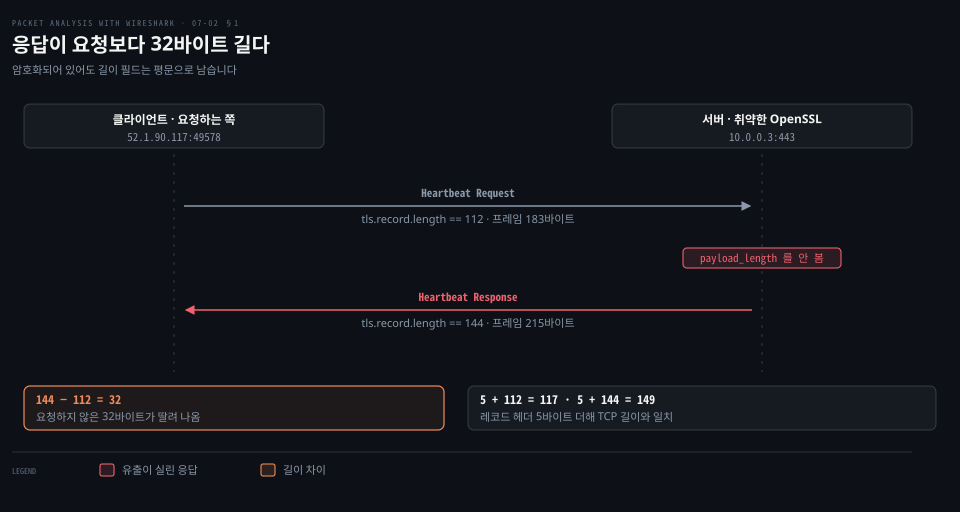
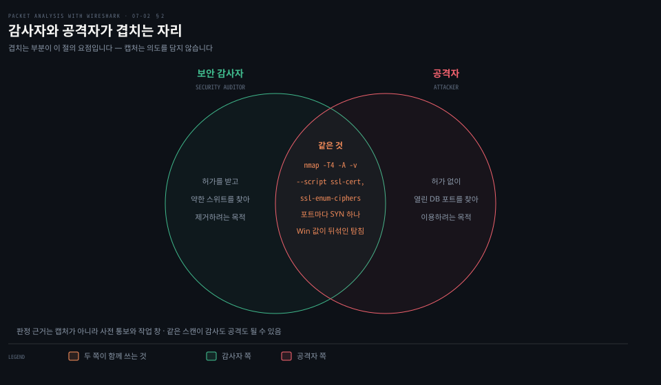
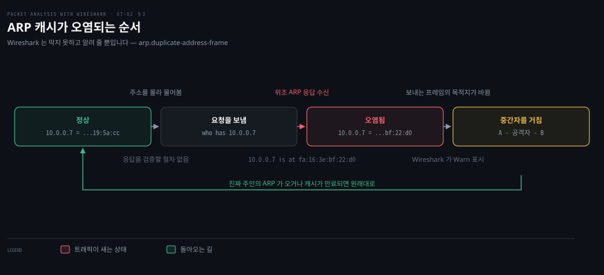
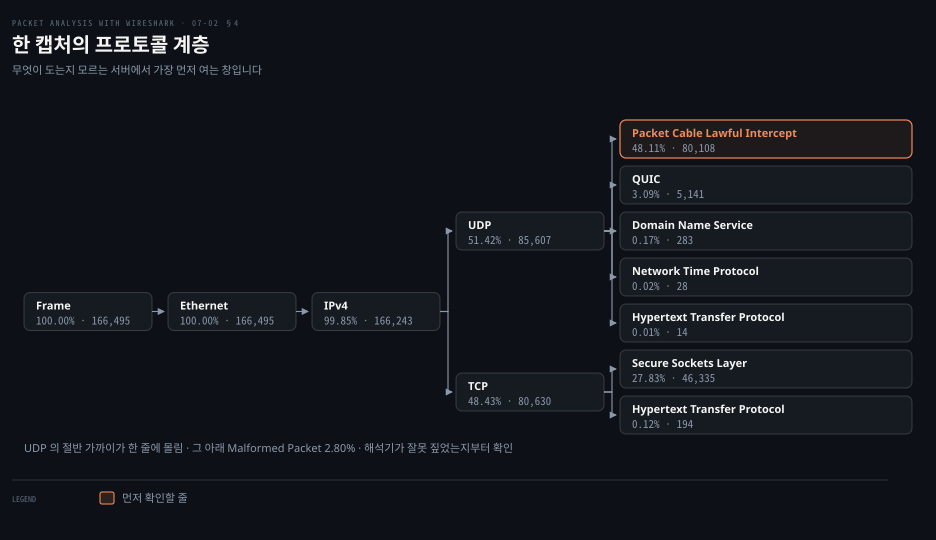

# 훔쳐보고 끼어드는 공격

---

> 7장 후반부는 가용성이 아니라 기밀성과 무결성을 겨냥하는 공격을 봅니다. 트래픽 양은 정상인데 내용이나 방향이 어긋나 있는 쪽입니다.

## 핵심 요약

> 이 편이 매달린 하나의 생각은 **이쪽 공격들은 양이 아니라 모양으로 드러나며, 그 모양은 필드 하나이거나 통계 창의 한 줄에 담겨 있다**는 것입니다.

앞 편의 판정은 개수를 세는 일이었습니다. 이 편은 다릅니다. **Heartbleed 는 프레임 두 개면 판정되고, ARP 중독은 한 MAC 이 여러 IP 를 주장하는 줄 몇 개면 충분합니다.** 트래픽 양으로는 아무 표가 나지 않습니다.

그래서 도구도 다릅니다. 원문이 이 절들에서 쓰는 것은 **디스플레이 필터 하나와 통계 창 두 개**입니다. `tls.record.content_type == 24` 로 Heartbeat 만 남기고, `arp.duplicate-address-frame` 으로 중복 경고만 남깁니다. 남는 줄이 적으므로 눈으로 읽습니다.

공통점이 하나 더 있습니다. **셋 다 Wireshark 가 막아 주지 않습니다.** 원문이 BitTorrent 절 끝에 붙인 주의가 그 성격을 정확히 적습니다. **"Wireshark 는 바이러스를 알려 주거나 검사하지 않습니다. 바이러스를 분석하는 데 도움을 줄 뿐입니다."**


## 학습 목표

> 이 편을 읽고 나면 아래 다섯 가지를 스스로 해낼 수 있습니다.

1. 암호화된 캡처에서 Heartbeat 두 프레임의 길이 필드만으로 Heartbleed 를 판정할 수 있습니다.
2. 그 판정이 규격이 정한 위반과 어떻게 다른 근사인지 설명할 수 있습니다.
3. 포트 스캔의 서명을 캡처에서 읽고, 감사인지 공격인지를 캡처만으로는 가릴 수 없는 이유를 말할 수 있습니다.
4. ARP 중복 경고를 걸러 내고 그것이 중간자 공격일 때 무엇이 함께 보이는지 짚을 수 있습니다.
5. Endpoints 와 Protocol Hierarchy 두 창을 목적에 맞게 나눠 쓸 수 있습니다.


## 1. Heartbleed — 길이 하나가 고발합니다

> 내용은 암호화되어 열 수 없습니다. 그런데 길이 필드는 평문이라 그것만으로 유출이 드러납니다.



### 암호화된 트래픽은 못 본다고 포기하기 전에

4장에서 배운 대로 TLS 안을 보려면 키가 필요합니다. 키가 없는 캡처에서는 `Application Data` 만 줄줄이 보입니다. 그런데 **레코드 계층의 헤더는 암호화되지 않습니다.** 타입과 버전과 길이 세 필드는 언제나 읽힙니다. 그 셋만으로 할 수 있는 일이 있습니다.

### 어디에 있는 버그인가

원문은 위치부터 못박습니다. **"Heartbeat 프로토콜은 레코드 계층 프로토콜 위에서 돕니다."** 규격은 RFC 6520 입니다.

그리고 범위를 답니다. **"Heartbleed 버그는 Heartbeat 프로토콜을 구현한 특정 OpenSSL 버전에 존재합니다."** 취약한 범위는 1.0.1 부터 1.0.1f 까지이고 식별자는 CVE-2014-0160 입니다.

무엇이 새는지도 한 줄입니다. **"이 버그는 Heartbeat 응답 중에 공격자가 메모리의 더 큰 부분을 읽을 수 있게 하는 심각한 취약점입니다."** 원문은 그 메모리에 개인 키와 비밀번호가 들어 있을 수 있다고 덧붙입니다.

### 필터와 판정

Heartbeat 는 레코드 타입 24 입니다. 4장에서 본 타입 20·21·22·23 옆자리입니다.

```properties
# 원문 표기 (Wireshark 1.12)
filter = ssl.record.content_type == 24
# 지금 쓰는 표기
filter = tls.record.content_type == 24
```

원문은 `heartbleed.pcap` 을 열고 이 필터를 겁니다. 남는 것은 암호화된 Heartbeat 메시지들이고, 그중 두 개가 짝입니다.

| 프레임 | 방향 | 레코드 길이 | 프레임 크기 | TCP 길이 |
|-------|------|-----------|-----------|---------|
| 15 · Heartbeat Request | 52.1.90.117 → 10.0.0.3 | 112 | 183바이트 | 117 |
| 16 · Heartbeat Response | 10.0.0.3 → 52.1.90.117 | 144 | 215바이트 | 149 |

원문의 판정은 이 표의 두 숫자 차이입니다. **"이 패킷에서 Heartbeat Response 의 길이가 144 로 설정되어 있는데, 이는 서버가 기대보다 32바이트 많은 데이터를 돌려주었다는 뜻입니다. 이 여분의 정보가 heartbleed 이며, 이 유출은 비밀번호와 개인 키 같은 민감 정보를 담고 있을 수 있습니다."**

> **노트의 읽기**: 화면의 숫자들이 서로 맞는지 검산해 두면 읽기가 단단해집니다. 레코드 헤더는 타입 1바이트, 버전 2바이트, 길이 2바이트로 **5바이트**입니다. 요청은 `5 + 112 = 117` 로 TCP 길이와 맞고, 응답은 `5 + 144 = 149` 로 역시 맞습니다. 프레임 크기에서 TCP 길이를 빼면 양쪽 다 66바이트가 나오는데, 이더넷 14 + IPv4 20 + TCP 32(옵션 포함)입니다. 숫자들이 서로 맞으므로 화면을 잘못 읽은 것이 아닙니다.

> **노트의 읽기**: 다만 이 판정은 **암호화된 캡처에서 쓸 수 있는 근사**입니다. 규격이 정한 진짜 위반은 길이 차이가 아니라 payload_length 필드입니다. RFC 6520 은 응답이 **"받은 HeartbeatRequest 페이로드의 정확한 사본을 실어야 한다"** 고 정하고, **"받은 HeartbeatMessage 의 payload_length 가 너무 크면 그 메시지는 조용히 버려야 한다"**[^rfc6520]고 적습니다. 취약한 OpenSSL 이 하지 않은 것이 바로 이 검사입니다. 암호화된 캡처에서는 payload_length 를 볼 수 없으니 레코드 길이로 대신 보는 것이고, 같은 규격이 **"padding_length 는 최소 16 이어야 한다"** 고 정하므로 정상적인 응답도 요청과 길이가 완전히 같지는 않습니다. **길이가 다르다는 사실 자체가 아니라 32바이트라는 크기가 판정의 근거**입니다.

> **지금은 다릅니다 (4.6)**: 원문의 `ssl.` 접두사는 여전히 컴파일되지만 경고가 붙습니다. 로컬 4.6.8 의 `dftest` 가 그대로 알려 줍니다. **`Warning: Deprecated token "ssl.record.content_type".`** 내부적으로는 `tls.record.content_type` 으로 바뀌어 실행됩니다. 그리고 이제는 길이를 손으로 비교할 필요가 없습니다. 해석기가 판정 필드를 직접 제공합니다.
>
> ```bash
> tls.heartbeat_message.payload_length.invalid   # 해석기가 붙이는 위반 표시
> tls.record.content_type == 24                  # 원문의 방법 — 여전히 유효합니다
> ```

### 재현과 조치

원문은 실험 절차를 넷으로 적습니다. 취약한 OpenSSL 1.0.1c 를 설치합니다. 자체 서명 인증서를 만듭니다. 그 버전으로 TLS 서버를 띄웁니다. 마지막으로 캡처를 겁니다.

```bash
openssl version                                    # OpenSSL 1.0.1c 10 May 2012
openssl req -sha256 -new -newkey rsa:2048 -nodes -keyout ./server.key -out server.csr
openssl x509 -req -days 365 -in server.csr -signkey server.key -out server.crt
openssl s_server -www -cipher AES256-SHA -key ./server.key -cert ./server.crt
tcpdump port 443 -s0 -w heartbleed.pcap &
```

조치는 두 줄입니다. **OpenSSL 권고문대로 패치를 적용하고, 취약점이 해소된 뒤 비밀번호를 바꿉니다.** 순서가 중요합니다. 패치 전에 비밀번호를 바꾸면 그 새 비밀번호도 함께 샙니다.


## 2. 스캐닝 — 같은 명령을 두 사람이 씁니다

> 스캔은 공격의 전 단계이기도 하고 감사의 첫 단계이기도 합니다. 캡처에는 그 차이가 남지 않습니다.



### 스캔을 발견했는데 이게 사고인지 모를 때

포트 스캔 경보가 떴을 때 가장 먼저 물어야 할 것은 "누가 했는가"이지 "무엇이 왔는가"가 아닙니다. 패킷만 봐서는 결론이 나지 않기 때문입니다.

### 원문이 나란히 적는 두 사람

원문은 취약점 스캔의 구성을 셋으로 나눕니다. **호스트 발견, 포트 스캔, OS 탐지**입니다. 그리고 같은 문단에서 두 사람을 나란히 놓습니다.

- 보안 감사자는 허용된 포트만 바깥으로 열려 있는지 확인하려고 호스트를 스캔합니다.
- 공격자는 어떤 서비스가 떠 있는지 알아내려고 포트를 스캔합니다. 원문의 예가 구체적입니다. 이 과정에서 DB 포트가 바깥에 열려 있으면 그 DB 시스템은 공격에 노출됩니다.

SSL 스캔 절에서도 같은 대비가 반복됩니다. 감사자는 약한 암호 스위트와 취약한 프로토콜 버전을 **찾아서 없애려고** 쓰고, 공격자는 같은 것을 **찾아서 이용하려고** 씁니다.

위 그림이 이 대비를 겹침으로 세운 것입니다. **겹치는 부분이 이 절의 요점입니다.** 목적은 반대인데 명령도 패킷도 같으므로, 캡처 자체는 어느 쪽인지 말해 주지 않습니다.

### 캡처에 남는 모양

원문은 `host_scan.pcap` 을 열고 화면을 보여 줍니다. 예제 화면에서 읽히는 것이 이렇습니다.

| 항목 | 값 |
|------|-----|
| 출발지 | `122.172.240.212` 하나 |
| 목적지 | `10.0.0.6` · `10.0.0.8` 여럿 |
| 목적지 포트 | 443 · 22 · 80 으로 옮겨 다님 |
| 출발지 포트 | 43617 · 43800 · 43873 · 56650 … 매번 다름 |
| 플래그 | 전부 `[SYN]` |
| 길이 | 전부 `Len=0` |

원문의 서술이 이 화면을 요약합니다. **"이 과정에서 각 호스트의 흔한 서비스 포트 전부로 SYN 패킷이 보내집니다. DNS, LDAP, HTTP 등입니다."**

> **원문 정오**: 그다음 문장이 어긋납니다. 원문은 **"호스트로부터 ACK 을 받으면 그 호스트는 그 포트에서 ACTIVE 로 간주됩니다"** 라고 적습니다. 열린 포트가 SYN 에 돌려주는 것은 ACK 이 아니라 **SYN-ACK** 입니다. 3장에서 이 책 스스로 세 번의 악수를 SYN → SYN-ACK → ACK 으로 적었습니다. 닫힌 포트라면 RST-ACK 이 오고, 방화벽이 삼키면 아무것도 오지 않습니다. 스캐너가 이 셋을 갈라 open · closed · filtered 로 판정하므로, "ACK 이 오면 열림"으로 외우면 닫힌 포트까지 열린 것으로 셉니다.

> **노트의 읽기**: 예제 화면의 윈도우 크기가 `Win=1024` · `Win=65535` · `Win=1` · `Win=63` 으로 뒤섞여 있고 일부에는 `WS` 옵션이 붙습니다. 단순한 포트 스캔이라면 이 값이 일정합니다. 값이 제각각이라는 것은 **OS 탐지 탐침이 섞여 있다**는 신호이고, 원문이 든 명령의 `-A` 옵션이 그 탐침을 켭니다. 화면과 명령이 여기서 이어집니다.

### nmap 명령

원문이 드는 명령은 둘입니다.

```bash
nmap -T4 -A -v 128.136.179.233              # 원문 표기: "Scan standard ports in the host"
nmap -p 1-65535 -T4 -A -v 128.136.179.233   # 원문 표기: "Scan all active ports in the host"
```

> **원문 정오**: 둘째 줄의 설명 "활성 포트를 전부 스캔"이 틀렸습니다. `-p 1-65535` 는 **전체 포트**를 훑으라는 지정이고, 어느 포트가 열려 있는지는 그 스캔의 *결과*이지 범위를 고르는 조건이 아닙니다. 활성 포트만 골라 스캔하는 것은 원리상 불가능합니다 — 그걸 알려면 이미 스캔이 끝나 있어야 합니다.

> **노트의 읽기**: 첫 줄의 "표준 포트"는 틀렸다기보다 느슨한 표현입니다. 포트 범위 옵션이 없을 때 nmap 이 쓰는 기본값은 **"단순한 `nmap <target>` 명령은 대상 호스트의 TCP 포트 1,000개를 스캔합니다"**[^nmap] 이므로, 표준으로 정해진 목록이 아니라 통계적으로 가장 흔한 1,000개입니다. 그리고 두 줄에 다 붙은 `-A` 는 포트 범위와 무관하게 **"OS 탐지, 버전 탐지, 스크립트 스캔, traceroute 를 켜는"**[^nmap] 옵션이라, 앞 절에서 본 뒤섞인 윈도우 값이 여기서 나옵니다.

SSL 스캔 예제도 같은 도구를 씁니다.

```bash
nmap --script ssl-cert,ssl-enum-ciphers -p 636 10.10.1.3
nmap --script ssl-cert,ssl-enum-ciphers -p 443 10.10.1.3
```

4장의 디버깅 절에서 만난 그 명령입니다. **거기서는 내 서버의 협상 실패를 조사하는 도구였고, 여기서는 남의 서버의 약점을 찾는 도구입니다.** 그림의 겹침이 말하는 것이 이것입니다.


## 3. ARP 중복 IP — 끼어드는 공격

> 앞의 둘은 훔쳐보는 쪽이었습니다. 이쪽은 트래픽 한가운데에 서는 쪽입니다.



### 통신은 되는데 느리고 이상할 때

중간자 공격의 곤란한 점은 **통신이 끊기지 않는다**는 것입니다. 공격자가 중계해 주므로 사용자는 눈치채지 못하고, 신고는 "느리다" 정도로 들어옵니다. 그래서 신고가 아니라 캡처가 먼저 알려 줘야 합니다.

### 필터 한 줄

원문의 방법은 짧습니다. **"Wireshark 는 ARP 프로토콜에서 중복 IP 를 탐지합니다. `arp.duplicate-address-frame` 필터를 써서 중복 IP 정보 프레임만 표시합니다."**

이 필드는 값을 비교하는 필터가 아니라 **존재를 보는 필터**입니다. 로컬 4.6.8 의 필드 목록이 정의를 그대로 줍니다. `arp.duplicate-address-frame` 은 **"Frame showing earlier use of IP address"** 이고 타입은 프레임 번호입니다. 곧 이 필드가 붙어 있다는 것 자체가 Wireshark 가 앞선 사용을 찾았다는 뜻입니다.

### 화면에서 읽히는 것

원문이 `ARP_Duplicate_IP.pcap` 에서 읽어 내는 것이 셋입니다.

- 보통 중복 IP 는 DHCP 서버가 정리합니다. 이 경우처럼 **모든 IP 주소에 대해 뜨기 시작하면** 심각하게 봐야 합니다.
- 모든 IP 가 같은 보낸이 MAC 주소 `fa:16:3e:bf:22:d0` 을 가지며 그 IP 의 중복으로 표시됩니다.
- 이것은 ARP 중독일 수 있습니다. 배경에서 중간자 공격이 벌어지고 있는 것입니다.

> **노트의 읽기**: 원문은 "같은 MAC" 이라고만 적고 개수를 세지 않습니다. 예제 화면의 Info 열을 세어 보면 그 MAC 하나가 **10.0.0.1 · 10.0.0.2 · 10.0.0.7 · 10.0.0.8 넷의 주인이라고 주장**합니다. 그리고 상세 창의 전문가 정보가 진짜 주인을 함께 알려 줍니다. `[Duplicate IP address detected for 10.0.0.8 (fa:16:3e:bf:22:d0) - also in use by fa:16:3e:52:0e:55 (frame 1)]` 처럼, 뒤에 온 주장과 먼저 있던 주인을 나란히 적습니다. **하나가 넷을 주장하는 것은 주소 충돌의 모양이 아닙니다.** 실수로 같은 IP 를 쓰면 충돌은 보통 하나뿐입니다.

### 왜 이런 일이 가능한가

ARP 에는 인증이 없습니다. **"10.0.0.7 은 이 MAC 에 있다"는 응답이 오면 받는 쪽은 그대로 캐시에 씁니다.** 물어보지 않아도 보낼 수 있고(gratuitous ARP), 마지막에 들은 말이 이깁니다. 위 그림의 두 번째 전이가 그 자리입니다.

캐시가 오염되면 그 호스트가 10.0.0.7 로 보내는 프레임의 목적지 MAC 이 공격자 것으로 바뀝니다. **IP 헤더는 그대로이므로 상위 계층에서는 아무 이상이 없습니다.** 공격자가 그대로 중계하면 통신도 정상으로 보입니다.

원래대로 돌아가는 길도 그림에 있습니다. 진짜 주인이 ARP 를 보내거나 캐시가 만료되면 복구되지만, **공격자가 계속 보내면 계속 이깁니다.** 예제 화면의 시각을 보면 프레임 2번부터 18번까지가 0.08초 안에 들어 있어, 실제로 반복해서 덮어쓰고 있는 모습입니다.


## 4. 통계 두 창 — 누가 도는가와 무엇이 도는가

> Endpoints 는 누가 이야기하는지를, Protocol Hierarchy 는 무엇이 도는지를 답합니다. 묻는 것이 다르므로 나눠 씁니다.



### 무엇을 봐야 할지 모르는 캡처를 받았을 때

인수인계받은 서버나 처음 보는 네트워크의 캡처에는 걸어 볼 필터가 없습니다. 무엇이 도는지를 모르기 때문입니다. **필터를 만들기 전에 목록부터 보는 창**이 이 절의 둘입니다.

### Endpoints — 나가는 연결을 세기

원문은 BitTorrent 를 예로 이 창을 씁니다. `bittorrent.pcapng` 를 열고 `Statistics | Endpoints` 를 누른 뒤 네 단계를 밟습니다.

1. 프로토콜을 거릅니다. 이 경우에는 BitTorrent 입니다.
2. IPv4 탭을 고릅니다.
3. 이름 해석을 켭니다.
4. 클라이언트 줄을 읽습니다.

원문이 읽어 내는 것은 이렇습니다. **"클라이언트(192.168.1.101)가 10744바이트를 내려받았고 그 내용이 서로 다른 지리적 위치에서 오고 있습니다. 여러 출처에서 받은 것이므로 열기 전에 검사하기를 권합니다."** 그리고 요약합니다. **"이 예에서 클라이언트는 서로 다른 지리적 위치에 흩어진 16개의 서로 다른 엔드포인트에 연결되어 있습니다."**

> **원문 정오**: 예제 화면의 클라이언트 줄은 **Packets 46 · Bytes 10 774** 입니다. 본문의 `10744` 는 자릿수를 옮겨 적으면서 생긴 오타입니다. 그리고 이 값은 내려받은 양이 아닙니다. 같은 줄의 **Tx Bytes 4 268 과 Rx Bytes 6 506 을 더하면 정확히 10 774** 이므로, Bytes 열은 **오간 전체**입니다. 내려받은 양(Rx)은 6,506바이트입니다. Endpoints 창은 방향별 열을 따로 주므로 어느 열을 인용하는지가 결과를 바꿉니다.

> **노트의 읽기**: 원문의 "16개 엔드포인트"가 어디서 나오는지는 본문에 없고 화면에 있습니다. 창 위쪽 탭이 **`IPv4: 17`** 로 되어 있는데, 이 17 에는 클라이언트 자신이 포함됩니다. **17 − 1 = 16** 이 원격 엔드포인트 수입니다. 탭의 숫자를 그냥 읽으면 하나 더 세게 됩니다.

여기서 읽어야 할 보안의 의미는 개수가 아니라 **모양**입니다. 사내 호스트 하나가 46개 패킷으로 16곳과 이야기하고, 그 이름이 `.fr` · `.ca` · `.be` 처럼 흩어져 있습니다. 원문이 "지리적으로 흩어져"라고 말한 근거가 위도·경도 열이 아니라 **해석된 호스트명**이라는 점도 화면에서 확인됩니다. 그 열들은 예제에서 비어 있습니다.

7장 앞 절의 반사·증폭 목록에 BitTorrent 가 3.8배로 올라 있던 것을 떠올리면, 이 프로토콜은 여기서 두 번째로 등장하는 셈입니다. **한 번은 남을 때리는 도구로, 한 번은 우리 쪽에서 나가는 트래픽으로** 만납니다.

### Protocol Hierarchy — 무엇이 도는지 훑기

원문의 소개가 이 창의 용도를 그대로 적습니다. **"이 기능은 서버에서 어떤 프로토콜이 돌고 있는지를 다룰 때 아주 유용합니다."**

> **원문 정오**: 여는 방법이 틀렸습니다. 원문은 **"Wireshark 메뉴에서 Summary | Protocol Hierarchy 를 클릭합니다"** 라고 적는데, Wireshark 에는 Summary 라는 최상위 메뉴가 없습니다. 공식 사용자 안내서가 이 창들의 자리를 한 문장으로 못박습니다. **"Wireshark 는 폭넓은 네트워크 통계를 제공하며 Statistics 메뉴로 접근할 수 있습니다."**[^wsug] Protocol Hierarchy 도 Conversations 도 Endpoints 도 전부 Statistics 아래입니다. 원문이 다른 절에서는 `Statistics | Conversations` · `Statistics | Endpoints` 로 올바르게 적으므로, 이 절만 어긋납니다.

원문이 보안 관점의 용도를 설명합니다. **"보안 관점에서 이 창은 이더넷 시스템 위에서 일어나는 모든 프로토콜을 높은 곳에서 한눈에 보여 줍니다. 네트워크 관리자는 이 정보로 시스템 설정을 단단히 합니다. 예를 들어 운영 시스템에서 DCE 프로토콜이 도는 것을 발견하면, 이 계층을 보고 나서 서비스를 멈추라고 경보를 올릴 수 있습니다."**

위 그림이 원문 예제 화면의 값을 그대로 옮긴 것입니다. 총 166,495 프레임이고, 백분율은 전체 프레임 대비입니다. 갈라지는 모양이 바로 읽힙니다.

| 줄 | 비율 | 패킷 수 |
|----|------|--------|
| Frame · Ethernet | 100.00% | 166,495 |
| IPv4 | 99.85% | 166,243 |
| ├ UDP | 51.42% | 85,607 |
| ├ TCP | 48.43% | 80,630 |
| UDP 아래 · Packet Cable Lawful Intercept | 48.11% | 80,108 |
| TCP 아래 · Secure Sockets Layer | 27.83% | 46,335 |

> **노트의 읽기**: 이 화면에서 원문이 짚지 않은 줄이 하나 있습니다. **UDP 의 절반 가까이(48.11%)가 Packet Cable Lawful Intercept 로 해석되어 있고 그 아래에 Malformed Packet 2.80% 가 딸려 있습니다.** 일반적인 캡처에서 나올 만한 구성이 아닙니다. 2장의 Decode-As 절이 다룬 그대로, 해석기는 포트와 휴리스틱으로 프로토콜을 정하므로 **틀리게 짚을 수 있습니다.** 놀랄 만한 프로토콜이 큰 비율로 보이면 침해를 의심하기 전에 해석이 맞는지부터 확인하는 편이 낫습니다. Malformed Packet 이 함께 붙어 있는 것이 오해석의 흔한 동반 신호입니다.

> **노트의 읽기**: 백분율의 합이 100%를 넘어도 이상이 아닙니다. 공식 안내서가 이 창을 **"캡처에 있는 모든 프로토콜의 트리입니다. 각 행은 한 프로토콜의 통계 값을 담습니다"**[^wsug]라고 설명하는데, 프레임 하나가 여러 프로토콜을 동시에 담으므로 같은 프레임이 여러 줄에 함께 세어집니다. IPv4 99.85% 와 UDP 51.42% 가 같은 프레임을 두 번 센 것입니다.

두 창을 쓰는 순서를 정하면 이렇게 됩니다. **Protocol Hierarchy 로 무엇이 도는지 훑어 이상한 줄을 고르고, 그 줄을 필터로 걸어 Endpoints 로 누가 그것을 하는지 봅니다.** 원문의 BitTorrent 예제가 두 번째 단계만 보여 준 셈입니다.


## 심화 학습

> 원문의 필터는 지금도 그대로 돕니다. 바뀐 것은 접두사 이름과, Heartbleed 를 판정하는 더 나은 방법이 생겼다는 점입니다.

| 원문(2015) | 현행(2026) | 성격 |
|-----------|-----------|------|
| `ssl.record.content_type == 24` | 컴파일되지만 deprecated 경고가 붙습니다 | 유지·경고 |
| 길이를 손으로 비교해 Heartbleed 판정 | `tls.heartbeat_message.payload_length.invalid` | 확장 |
| `arp.duplicate-address-frame` | 1.0.0 부터 4.6.8 까지 그대로 | 유지 |
| `Statistics \| Endpoints` · `Conversations` | 그대로 | 유지 |
| `Summary \| Protocol Hierarchy` | Statistics 메뉴입니다[^wsug] | 정오 |
| "ACK 이 오면 포트가 열림" | SYN-ACK 입니다 | 정오 |
| "10744바이트를 내려받음" | 화면은 10,774 이고 그것은 총계입니다 | 정오 |
| `-p 1-65535` 를 "활성 포트" 라 설명 | 전체 포트입니다. 열림 여부는 결과입니다[^nmap] | 정오 |

원문이 다루지 않는 축이 둘 있습니다.

첫째는 **Heartbleed 를 지금 만나면 그 자체가 결론**이라는 점입니다. CVE-2014-0160 은 2014년에 공개됐고 취약한 버전은 1.0.1f 까지입니다. 지금 이 취약점이 살아 있는 서버를 찾았다면 문제는 이 버그 하나가 아니라 **10년 넘게 패치되지 않은 시스템**입니다. 원문의 조치 두 줄로 끝날 일이 아닙니다.

둘째는 **ARP 중독을 캡처가 아니라 구성으로 막는다**는 점입니다. 원문은 탐지까지만 다룹니다. 실제 방어는 스위치 쪽에 있습니다. DHCP 스누핑으로 IP 와 MAC 의 짝을 기록하고 동적 ARP 검사로 그 기록과 어긋나는 ARP 를 버리는 방식이라, **호스트가 아니라 그 아래 스위치가 하는 일**입니다. Wireshark 는 그 방어가 없는 구간을 찾아 주는 도구입니다.

```bash
# 이 편의 필터를 한자리에
tls.record.content_type == 24                   # Heartbeat 만
tls.heartbeat_message.payload_length.invalid    # 해석기가 잡은 위반
arp.duplicate-address-frame                     # 중복 IP 경고만
arp.duplicate-address-detected                  # 같은 사건의 라벨 필드
tcp.flags.syn == 1 && tcp.flags.ack == 0        # 스캔의 SYN 만
bittorrent                                      # 나가면 안 되는 프로토콜의 예
```


## 결정 치트시트

| 화면에서 본 것 | 의심할 것 | 다음에 할 일 |
|--------------|---------|------------|
| Heartbeat 응답이 요청보다 김 | Heartbleed | 서버의 OpenSSL 버전 확인 |
| 한 MAC 이 여러 IP 를 주장 | ARP 중독·중간자 | 스위치의 DHCP 스누핑 여부 확인 |
| 중복 경고가 IP 마다 뜸 | 충돌이 아니라 공격 | 전문가 정보에서 원래 주인 확인 |
| 한 출발지가 여러 포트에 SYN 만 | 포트 스캔 | 사전 통보된 감사인지 대조 |
| SYN 의 Win 값이 제각각 | OS 탐지 탐침 섞임 | `-A` 급 스캔으로 취급 |
| 낯선 프로토콜이 큰 비율 | 오해석 또는 침해 | Decode-As 로 해석부터 확인 |
| 사내 호스트가 여러 나라와 연결 | 무단 P2P·유출 | Endpoints 에서 Rx·Tx 를 나눠 읽기 |


## 면접 대비

### 한 줄 정의

"이 부류의 공격은 트래픽 양이 정상이라 개수로는 안 잡히고, 레코드 길이 · ARP 의 보낸이 MAC · 통계 창의 한 줄처럼 **모양이 어긋난 자리**로 판정합니다."

### 핵심 포인트 세 가지

1. **암호화된 트래픽에서도 레코드 헤더는 읽힙니다.** 타입·버전·길이 세 필드가 평문이라 Heartbleed 를 내용 없이 판정할 수 있습니다. 다만 그것은 근사이고, 규격상의 위반은 payload_length 검사 누락입니다.
2. **스캔은 캡처만으로 감사와 공격을 가릴 수 없습니다.** 같은 명령이 같은 패킷을 만들기 때문이고, 판정은 사전 통보와 작업 창 같은 캡처 밖 정보로 합니다.
3. **Endpoints 와 Protocol Hierarchy 는 묻는 것이 다릅니다.** 무엇이 도는지 먼저 훑고 이상한 줄을 고른 다음, 그 줄을 누가 하는지 봅니다. 순서를 뒤집으면 볼 것을 못 고릅니다.

### 자주 묻는 질문

Q: 키가 없어 TLS 를 못 여는데 무엇을 할 수 있습니까?
A: 레코드 계층의 타입·버전·길이는 암호화되지 않으므로 그 셋으로 할 수 있는 일이 있습니다. Heartbleed 판정이 그 예이고, 4장의 핸드셰이크 읽기도 대부분 평문 구간에서 이루어집니다.

Q: 중복 IP 경보가 떴는데 공격인지 실수인지 어떻게 압니까?
A: 개수와 방향을 봅니다. 실수로 같은 IP 를 쓰면 충돌이 보통 하나이고 두 MAC 이 번갈아 주장합니다. 공격이면 한 MAC 이 여러 IP 를 주장하고 짧은 시간에 반복해서 덮어씁니다.

Q: Protocol Hierarchy 의 비율 합이 100%를 넘습니다.
A: 정상입니다. 프레임 하나가 여러 프로토콜을 담으므로 같은 프레임이 여러 줄에 세어집니다. 공식 문서도 각 행이 한 프로토콜의 통계라고만 설명합니다.


## 핵심 개념 체크리스트

- [ ] 암호화된 Heartbeat 두 프레임의 길이 필드만으로 유출을 판정할 수 있습니까?
- [ ] 레코드 헤더 5바이트를 더해 TCP 길이와 맞는지 검산할 수 있습니까?
- [ ] 그 판정이 RFC 6520 이 정한 위반과 어떻게 다른 근사인지 말할 수 있습니까?
- [ ] 스캔 캡처에서 감사와 공격을 가를 수 없는 이유를 설명할 수 있습니까?
- [ ] SYN 의 윈도우 값이 뒤섞인 것이 무엇을 뜻하는지 짚을 수 있습니까?
- [ ] ARP 중복 경고에서 충돌과 중독을 가르는 기준 둘을 댈 수 있습니까?
- [ ] Endpoints 의 Bytes 열과 Rx Bytes 열의 차이를 설명할 수 있습니까?
- [ ] Protocol Hierarchy 에서 낯선 프로토콜을 보았을 때 먼저 확인할 것을 말할 수 있습니까?


## 관련 문서

- [07-01 서비스를 무너뜨리는 공격](./07-01.서비스를 무너뜨리는 공격.md) — 이 편의 앞. 양으로 드러나는 공격들
- [04-02 열쇠와 실패](./04-02.열쇠와 실패.md) — 같은 `ssl-enum-ciphers` 를 내 서버 조사에 쓰는 자리
- [02-03 분석을 돕는 기능들](./02-03.분석을 돕는 기능들.md) — Decode-As 가 오해석을 바로잡는 방법
- [Packet Analysis with Wireshark — 정독 인덱스](./README.md) — 7개 장 전체 지도


## 참고 자료

- 원본: 《Packet Analysis with Wireshark》 (Anish Nath, Packt Publishing, 2015) ISBN 978-1-78588-781-9
- 다룬 범위: Chapter 7 의 Heartbleed bug · Scanning · ARP duplicate IP detection · BitTorrent · Wireshark protocol hierarchy 절
- [RFC 6520 — TLS·DTLS Heartbeat 확장](https://www.rfc-editor.org/rfc/rfc6520.html) — 원문이 직접 가리키는 규격
- [Wireshark User's Guide 8장 Statistics](https://www.wireshark.org/docs/wsug_html_chunked/ChStatistics.html) — 통계 창들의 자리와 설명
- [Wireshark ARP 필드 참조](https://www.wireshark.org/docs/dfref/a/arp.html) — `arp.duplicate-address-frame` 의 정의와 지원 범위
- [nmap — 포트 스캔 기초](https://nmap.org/book/man-port-scanning-basics.html) — 기본 포트 범위와 포트 상태의 정의

[^rfc6520]: RFC 6520 §4 Heartbeat Request and Response Messages — "the receiver MUST send a corresponding HeartbeatResponse message carrying an exact copy of the payload of the received HeartbeatRequest." · "If the payload_length of a received HeartbeatMessage is too large, the received HeartbeatMessage MUST be discarded silently." · "The padding_length MUST be at least 16." ContentType 은 24 입니다. <https://www.rfc-editor.org/rfc/rfc6520.html> (2026-09-05 조회)

[^wsug]: Wireshark User's Guide 8장 Statistics — "Wireshark provides a wide range of network statistics which can be accessed via the Statistics menu." Protocol Hierarchy 창은 "This is a tree of all the protocols in the capture. Each row contains the statistical values of one protocol." <https://www.wireshark.org/docs/wsug_html_chunked/ChStatistics.html> (2026-09-05 조회)

[^nmap]: Nmap 참조 안내서 — "The simple command nmap `<target>` scans 1,000 TCP ports on the host `<target>`." · `-A` 는 "Enable OS detection, version detection, script scanning, and traceroute". <https://nmap.org/book/man-port-scanning-basics.html> · <https://nmap.org/book/man-briefoptions.html> (2026-09-05 조회)
