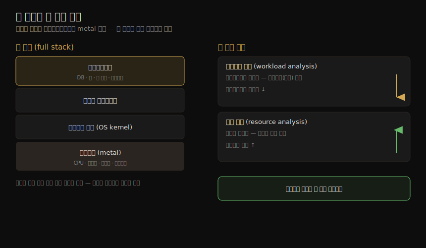

# 서론 (1) — 성능이란 무엇이고 왜 어려운가
---
> 이 노트는 1장 전반부로, 시스템 성능이라는 분야가 *무엇을 다루며 왜 어려운가* 를 잡습니다. 시스템 성능은 애플리케이션부터 하드웨어까지 풀 스택 전체를 봅니다. 누가(역할) 언제(활동) 어느 방향에서(관점) 성능을 다루는지, 그리고 이 분야가 주관적·복잡·다중 원인·다중 이슈라는 네 가지 이유로 까다로운 까닭을 살핍니다. 마지막으로 이 모든 어려움을 정량화하는 핵심 지표인 지연시간(latency)을 봅니다.

성능 분석이 까다로운 첫째 이유는 "성능 문제가 있다"는 판단 자체가 모호할 수 있기 때문입니다. 버그는 있거나 없거나, 고쳤거나 안 고쳤거나로 흑백이 갈리지만, 성능은 한 사용자에게 "나쁨"이 다른 사용자에겐 "좋음"일 수 있습니다. 이 노트는 그 모호함의 정체를 네 갈래로 나눠 보고, 모호함을 객관으로 바꾸는 지표인 지연시간으로 마무리합니다.

뒤따르는 01-02 가 *도구* (관측·실험·방법론)를 다룬다면, 이 노트는 그 앞에 놓일 *지형도* 입니다. 어떤 도구를 들기 전에, 내가 지금 무엇을(풀 스택의 어디를) 어느 관점에서 보려 하는지를 먼저 정해야 하기 때문입니다.

## 1. 시스템 성능 — 풀 스택 전체를 본다

> 시스템 성능은 애플리케이션부터 하드웨어(metal)까지, 데이터 경로 위의 모든 것을 봅니다. 목표는 지연을 줄여 사용자 경험을 높이고, 비효율을 없애 비용을 줄이는 것입니다.

시스템 성능은 컴퓨터 시스템 *전체* — 주요 소프트웨어와 하드웨어 구성 요소 모두 — 의 성능을 연구합니다. 데이터 경로(data path) 위에 있는 것이라면 저장 장치부터 애플리케이션 소프트웨어까지 무엇이든 포함됩니다. 성능에 영향을 줄 수 있기 때문입니다. 분산 시스템이라면 여러 서버와 애플리케이션이 그 경로에 들어갑니다. 그래서 저자는 데이터 경로를 보여 주는 환경 다이어그램이 없다면 찾거나 직접 그려 보라고 권합니다. 구성 요소 간 관계를 이해하고, 통째로 빠뜨리는 영역이 없게 하는 방법이기 때문입니다.

"풀 스택(full stack)"이라는 말은 보통 데이터베이스·앱·웹 서버 같은 애플리케이션 환경만 가리키기도 합니다. 그러나 시스템 성능에서 풀 스택은 **애플리케이션부터 metal(하드웨어)까지** — 시스템 라이브러리, 커널, 하드웨어 자체를 모두 포함한 소프트웨어 스택 전체 — 를 뜻합니다. 컴파일러도 성능에 한몫하므로 이 스택에 들어갑니다. 이 풀 스택의 층위와, 뒤(§4)에서 볼 두 분석 관점을 한 장으로 정리하면 다음과 같습니다.

| 목표 | 방법 |
|------|------|
| 사용자 경험 향상 | 지연(latency) 감소 |
| 비용 절감 | 비효율 제거 · 처리량(throughput) 향상 · 전반적 튜닝 |

## 2. 역할 — 누가 성능을 다루는가

> 성능은 여러 직무가 함께 다루며, 대부분은 자기 책임 영역만 봅니다(네트워크 팀은 네트워크, DB 팀은 DB). 일부 회사는 환경 전체를 가로질러 보는 전담 성능 엔지니어를 둡니다.

시스템 성능은 한 직무의 일이 아닙니다. 시스템 관리자, SRE(사이트 신뢰성 엔지니어), 애플리케이션 개발자, 네트워크 엔지니어, DB 관리자, 웹 관리자 등 여러 직무가 다룹니다. 이들 대부분에게 성능은 업무의 *일부* 이고, 분석도 자기 책임 영역에 집중됩니다. 네트워크 팀은 네트워크를, DB 팀은 DB를 확인하는 식입니다. 그래서 어떤 문제는 근본 원인이나 기여 요인을 찾으려면 둘 이상의 팀이 협력해야 합니다.

일부 회사는 성능을 주 업무로 하는 **성능 엔지니어** 를 고용합니다. 이들은 여러 팀과 함께 환경을 총체적으로 연구할 수 있고, 복잡한 문제를 푸는 데 이 접근이 결정적일 때가 있습니다. 또한 환경 전체의 분석·용량 계획을 위한 더 나은 도구를 찾고 개발하는 중심 자원 역할도 합니다. 저자가 속한 Netflix의 클라우드 성능 팀이 그 예로, 마이크로서비스·SRE 팀의 분석을 돕고 모두가 쓸 성능 도구를 만듭니다. 규모가 큰 팀은 커널 성능, 클라이언트 성능, 언어 성능(예: Java), 런타임 성능(예: JVM), 성능 도구 등으로 전문 분야를 나누기도 합니다.

## 3. 활동 — 언제 성능을 다루는가

> 성능 활동은 소프트웨어 수명주기 전체에 걸쳐 일어납니다. 이상적으로는 하드웨어 선택·코드 작성 *전* 에 목표 설정·모델링부터 시작하지만, 현실은 문제가 터진 뒤로 미뤄지기 일쑤입니다. 늦을수록 고치기 어려워집니다.

시스템 성능은 소프트웨어 프로젝트의 수명주기 — 구상부터 개발, 프로덕션 배포까지 — 에 대응하는 활동들로 이뤄집니다. 저자가 든 이상적 단계는 다음과 같습니다.

| 단계 | 활동 |
|------|------|
| 1 | 미래 제품의 성능 목표 설정·성능 모델링 |
| 2 | 프로토타입 SW·HW의 성능 특성 파악(characterization) |
| 3 | 개발 중 제품을 테스트 환경에서 성능 분석 |
| 4 | 새 버전의 비회귀 테스트(non-regression testing) |
| 5 | 제품 릴리스 벤치마킹 |
| 6 | 타깃 프로덕션 환경에서 PoC 테스트 |
| 7 | 프로덕션 성능 튜닝 |
| 8 | 돌아가는 프로덕션 SW 모니터링 |
| 9 | 프로덕션 이슈의 성능 분석 |
| 10 | 프로덕션 이슈의 사후 검토(incident review) |
| 11 | 프로덕션 분석을 강화할 성능 도구 개발 |

1~5단계가 전통적 제품 개발이고, 그 뒤 출시·배포가 옵니다. 6~9단계에서 타깃 환경 문제가 나타난다면, 그것은 개발 단계에서 잡지 못했다는 뜻입니다. 성능 공학은 이상적으로 하드웨어를 고르거나 코드를 쓰기 *전* 에 — 목표 설정과 성능 모델 작성으로 — 시작해야 합니다. 그러나 이 단계를 건너뛰고 문제가 생긴 뒤로 미루는 일이 잦습니다. 개발이 진행될수록, 앞선 아키텍처 결정 때문에 생긴 성능 문제는 점점 고치기 어려워집니다.

#### 클라우드가 바꾼 것 — canary와 blue-green

> 클라우드는 PoC 테스트(6단계)의 새 기법을 주었고, 이것이 앞 단계(1~5)를 건너뛰도록 부추깁니다. 실패해도 안전한 선택지가 있어, 사전 분석 없이 프로덕션에서 시험하고 필요하면 되돌립니다.

클라우드는 6단계를 쉽게 만들어, 역설적으로 앞 단계를 건너뛰게 합니다. 한 기법은 **canary 테스트** 로, 프로덕션 워크로드의 일부만 한 인스턴스에 흘려 새 소프트웨어를 시험합니다. 또 하나는 **blue-green 배포**(Netflix는 red-black 이라 부름)로, 트래픽을 새 인스턴스 풀로 점진 이동하면서 옛 풀을 백업으로 남겨 둡니다. 이렇게 "실패해도 안전한(safe-to-fail)" 선택지가 있으니, 사전 성능 분석 없이 프로덕션에서 새 소프트웨어를 시험하고 필요하면 빠르게 되돌리는 일이 흔합니다. 저자는 그래도 현실이 허락하면 앞 단계 활동을 함께 하라고 권합니다. 최선의 성능을 얻기 위해서입니다(다만 출시 시점 압박이라는 현실도 인정합니다).

#### 용량 계획(capacity planning)

용량 계획은 위 여러 활동에 걸칩니다. 설계 단계에서는 개발 소프트웨어의 자원 발자국(footprint)을 연구해 설계가 목표를 얼마나 충족하는지 봅니다. 배포 후에는 자원 사용을 모니터링해 문제가 터지기 전에 예측합니다.

## 4. 관점 — 어느 방향에서 보는가

> 성능 분석에는 두 관점이 있습니다. 자원 분석(resource analysis)은 시스템 관리자가 자원 쪽에서, 워크로드 분석(workload analysis)은 개발자가 워크로드 쪽에서 스택을 봅니다. 까다로운 문제는 양쪽 모두에서 봐야 합니다.

활동의 초점이 다른 것과 별개로, 성능 역할은 서로 다른 관점에서도 볼 수 있습니다. 두 관점은 소프트웨어 스택을 *반대 방향* 에서 접근합니다.

| 관점 | 주로 쓰는 직무 | 보는 방향 |
|------|--------------|----------|
| 자원 분석 (resource analysis) | 시스템 관리자 — 시스템 자원 담당 | 자원(CPU·디스크·네트워크)에서 위로 |
| 워크로드 분석 (workload analysis) | 애플리케이션 개발자 — 워크로드 성능 담당 | 워크로드(요청)에서 아래로 |

각 관점은 저마다 강점이 있습니다(2장에서 상세히 다룹니다). 까다로운 문제일수록 두 관점 모두에서 분석해 보는 것이 도움이 됩니다.

## 5. 성능은 왜 어려운가 — 네 가지 이유

> 성능 공학이 까다로운 까닭은 네 가지입니다. 주관적이고, 복잡하며, 단일 근본 원인이 없을 수 있고, 여러 이슈가 겹칩니다.

성능 공학이 도전적인 분야인 데는 분명한 이유가 있습니다. 아래 네 가지를 하나씩 봅니다.

#### 주관성(subjectivity)

기술 분야는 대개 객관적이라, 종사자들이 흑백으로 보는 데 익숙합니다. 버그는 있거나 없거나, 고쳤거나 안 고쳤거나입니다. 그러나 성능은 주관적일 때가 많습니다. 애초에 문제가 있는지, 있다면 언제 고쳐졌는지가 불분명할 수 있습니다. 한 사용자에게 "나쁜" 성능이 다른 사용자에겐 "좋은" 성능일 수 있기 때문입니다.

예를 들어 "평균 디스크 I/O 응답 시간 1ms"는 좋은 걸까요 나쁜 걸까요? 응답 시간(지연)은 가장 좋은 지표 축에 들지만, 그 값을 해석하기는 어렵습니다. 어떤 값이 좋고 나쁜지는 개발자와 사용자의 성능 *기대치* 에 달려 있습니다. 주관적 성능은 명확한 목표 — 목표 평균 응답 시간, 또는 요청의 몇 %가 특정 지연 범위 안에 들어야 한다는 식 — 를 정의하면 객관적으로 바꿀 수 있습니다.

#### 복잡성(complexity)

성능은 시스템의 복잡성과 *분석 출발점이 분명하지 않다* 는 점 때문에도 어렵습니다. 클라우드 환경에서는 어느 인스턴스부터 봐야 할지조차 모를 수 있습니다. 때로는 "네트워크 탓"이나 "DB 탓" 같은 가설로 시작하는데, 그 방향이 맞는지를 분석가가 가려내야 합니다.

문제는 *격리 상태에서는 잘 동작하는* 서브시스템들의 복잡한 상호작용에서 비롯되기도 합니다. 한 구성 요소의 실패가 다른 곳의 성능 문제를 부르는 **연쇄 실패(cascading failure)** 가 그 예입니다. 게다가 병목은 예상 밖으로 얽혀 있어, 하나를 고치면 병목이 시스템의 다른 곳으로 *옮겨갈* 뿐 전체 성능은 기대만큼 나아지지 않기도 합니다. 프로덕션 워크로드의 복잡한 특성 탓에 실험실에서 재현되지 않거나 간헐적으로만 재현되는 경우도 있습니다. 그래서 복잡한 문제는 시스템 내부와 외부 상호작용을 아우르는 총체적(holistic) 접근이 필요하고, 이것이 성능 공학을 폭넓고 지적으로 도전적인 일로 만듭니다.

#### 다중 원인(multiple causes)

어떤 문제는 단일 근본 원인이 없고 여러 기여 요인이 겹칩니다. 평소엔 정상인 세 사건이 *동시에* 일어나 합쳐질 때 문제가 되는 식입니다. 각각은 격리하면 근본 원인이 아닙니다.

#### 다중 이슈(multiple performance issues)

성능에서 진짜 어려움은 문제를 *찾는* 게 아닙니다. 복잡한 소프트웨어에는 보통 문제가 *많습니다.* 운영체제나 앱의 버그 DB에서 "performance"를 검색해 보면 놀랄 만큼 많은, 알려졌지만 아직 안 고친 이슈가 나옵니다. 고성능으로 평가받는 성숙한 소프트웨어조차 그렇습니다. 그래서 진짜 과제는 *어느 이슈가 가장 중요한지* 가려내는 것입니다. 이를 위해 분석가는 이슈의 *크기(magnitude)* 를 정량화해야 합니다. 어떤 이슈는 내 워크로드엔 해당이 없거나 미미할 수 있습니다. 이상적으로는 이슈를 정량화하는 데 그치지 않고 각각으로 얻을 *잠재 speedup* 까지 추정합니다. 이 정보는 경영진이 엔지니어링·운영 자원 투입을 정당화할 근거를 찾을 때 값집니다. 정량화에 잘 맞는 지표가 — 가능할 때 — 바로 지연시간입니다.

## 6. 지연시간(latency) — 모호함을 정량으로

> 지연시간은 기다린 시간을 재는 핵심 지표입니다. 최대 speedup을 추정할 수 있어 정량화에 강합니다. 단 의미가 모호할 수 있어, 연결 지연·요청 지연처럼 한정어를 붙여 써야 합니다.

지연시간은 *기다리는 데 쓴 시간* 의 척도이며, 필수 성능 지표입니다. 넓게 보면 어떤 작업이 완료되기까지의 시간 — 앱 요청, DB 쿼리, 파일시스템 작업 등 — 을 뜻합니다. 웹사이트라면 링크 클릭부터 화면이 다 그려질 때까지의 시간을 지연으로 표현할 수 있습니다. 높은 지연은 사용자를 떠나게 하므로 고객과 제공자 모두에게 중요한 지표입니다.

지연시간의 강점은 **최대 speedup을 추정** 할 수 있다는 점입니다. 100ms 걸리는 DB 쿼리가 그중 80ms를 디스크 읽기 대기로 쓴다고 합시다. 디스크 읽기를 없애면(예: 캐싱) 100ms → 20ms 로, **5배(5x) 빠름** 이 됩니다. 이것이 추정 speedup이며, 동시에 이슈를 정량화한 것입니다. 디스크 읽기가 쿼리를 최대 5배 느리게 한다는 것입니다.

이런 계산은 다른 지표로는 어렵습니다. 예를 들어 IOPS(초당 I/O 연산)는 I/O 유형에 따라 달라 직접 비교가 안 됩니다. IOPS가 80% 줄어도, 각 I/O 크기가 10배 커졌다면 성능 영향이 무엇일지 알기 어렵습니다.

다만 지연시간은 한정어 없이는 모호할 수 있습니다. 네트워크에서 "지연"은 연결 수립 시간일 수도, 데이터 전송을 포함한 연결 전체 시간일 수도 있습니다(DNS 지연은 보통 후자로 측정). 그래서 저자는 가능한 한 **연결 지연(connection latency)**, **요청 지연(request latency)** 처럼 한정어를 붙여 씁니다. 한편 지연은 늘 필요한 곳에서 측정되진 않았습니다. 어떤 영역은 평균만, 어떤 영역은 아예 측정값을 안 줬습니다. 그러나 **BPF 기반 관측 도구** 가 나오면서, 임의의 관심 지점에서 지연을 측정하고 전체 분포까지 보여 줄 수 있게 됐습니다(이 도구 이야기는 01-02 로 이어집니다).

## 학습 점검

> 이 노트의 핵심을 스스로 떠올려 봅니다. 답이 막히면 해당 섹션으로 돌아가 확인합니다.

- 시스템 성능에서 "풀 스택"이 애플리케이션 환경만 가리키는 통념과 어떻게 다른지 설명해 봅니다. (→ §1)
- 성능 활동을 코드 작성 *전* 에 시작해야 하는 이유와, 클라우드의 canary·blue-green이 왜 앞 단계를 건너뛰게 하는지 말해 봅니다. (→ §3)
- 자원 분석과 워크로드 분석 관점의 차이와, 까다로운 문제에 둘 다 필요한 이유를 떠올려 봅니다. (→ §4)
- 성능이 어려운 네 가지 이유(주관성·복잡성·다중 원인·다중 이슈)를 각각 한 문장으로 말해 봅니다. (→ §5)
- 지연시간이 IOPS 같은 지표보다 정량화에 강한 이유를, 100ms/80ms 디스크 예로 설명해 봅니다. (→ §6)
