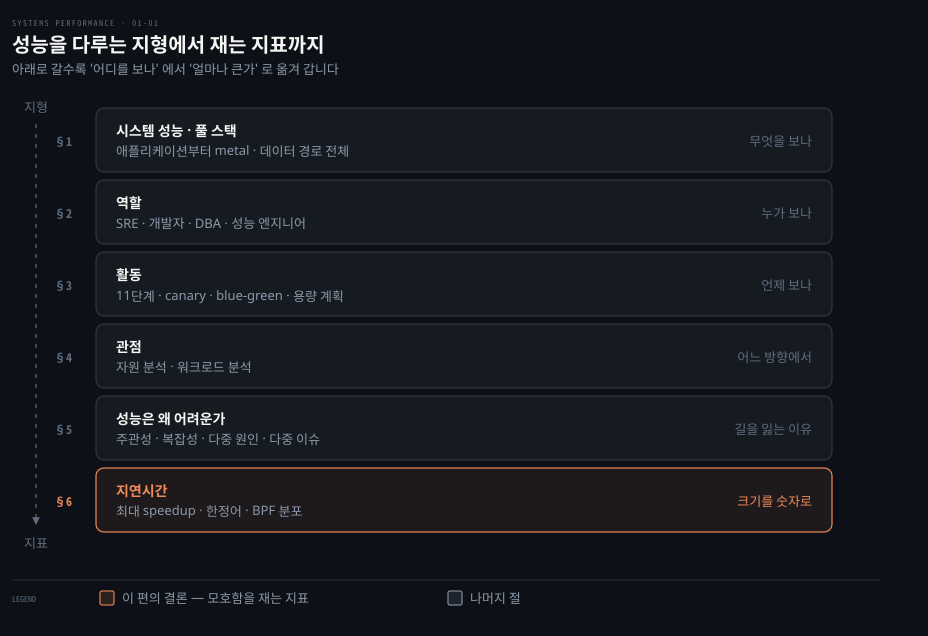
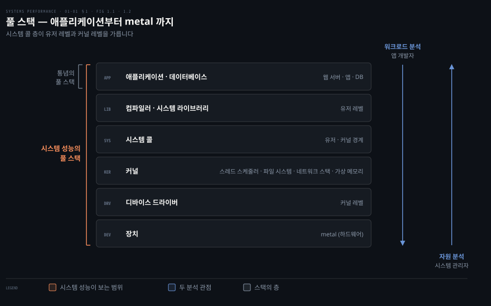
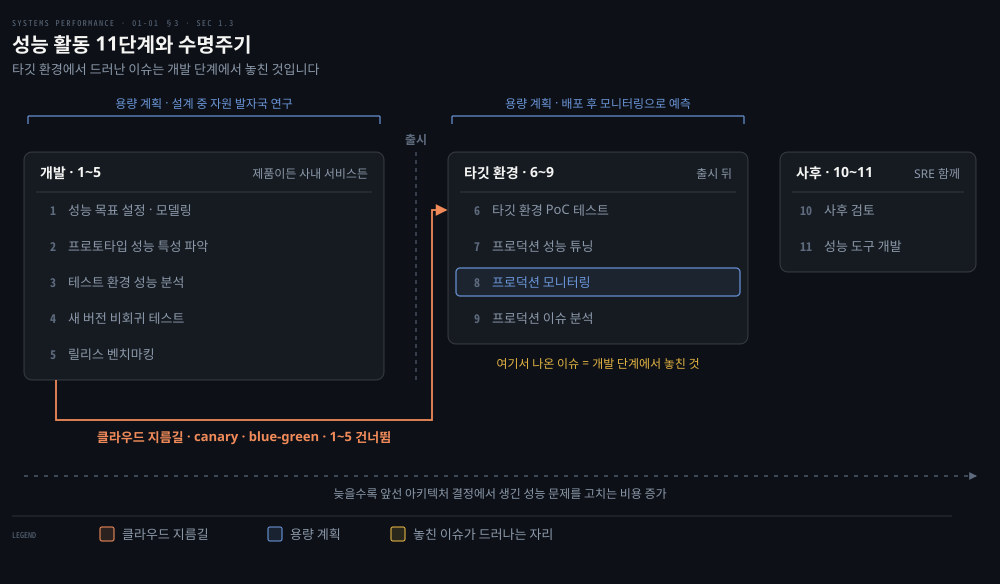
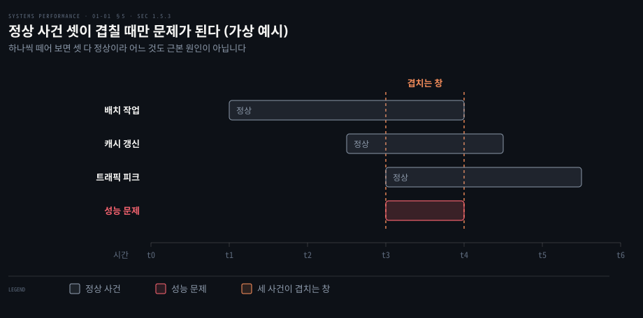
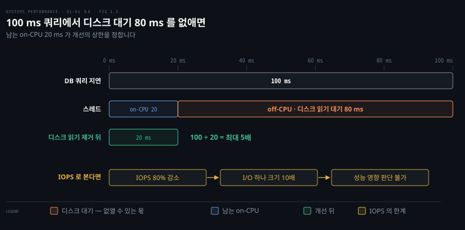

# 서론 — 성능이란 무엇이고 왜 어려운가
---
> 이 노트는 1장 전반부(1.1~1.6)로, 시스템 성능이 무엇을 다루고 왜 어려운지를 잡습니다. 어려움의 정체를 네 갈래로 나눈 뒤, 그 모호함을 숫자로 바꾸는 지표인 지연시간으로 마무리합니다.

## 핵심 요약

> 이 편이 매달린 하나의 생각은 성능 문제가 있다·없다로 깔끔하게 갈리지 않는다는 것입니다. 그래서 범위와 관점을 먼저 정하고, 지연시간 같은 정량 지표로 바꿔야 다룰 수 있습니다.

시스템 성능은 애플리케이션부터 하드웨어까지 데이터 경로에 놓인 모든 요소를 살핍니다. 원서는 분석에 앞서 데이터 경로를 그린 환경 다이어그램부터 갖추라고 권합니다. 특정 영역을 통째로 빠뜨리지 않기 위해서입니다.

성능은 여러 직무가 소프트웨어 수명주기 내내 다룹니다. 이상적으로는 하드웨어를 고르기 전에 목표와 모델을 세워야 합니다. 현실에서는 문제가 터진 뒤로 미루기 쉽고, 미룰수록 고치기가 더 어려워집니다.

성능이 까다로운 이유는 네 가지입니다. 기준이 주관적이고 시스템이 복잡합니다. 원인이 하나가 아닐 수 있고 여러 이슈가 겹치기도 합니다. 그래서 진짜 과제는 이슈를 찾는 일이 아니라 어느 이슈가 가장 중요한지 가려내는 일입니다.

지연시간은 이 가림에 잘 맞는 지표입니다. 100ms 쿼리 가운데 80ms가 디스크 대기라면, 디스크 읽기를 없앨 때 최대 5배 빨라진다는 계산이 바로 나옵니다.

## 학습 목표

> 이 편을 덮은 뒤 스스로 할 수 있어야 하는 일을 먼저 적어 둡니다.

1. 시스템 성능의 풀 스택이 애플리케이션 환경만 가리키는 통념과 어떻게 다른지 설명합니다.
2. 성능 활동 11단계를 개발·타깃 환경·사후 세 구간과 그 사이의 출시 시점으로 나눕니다. 그리고 활동을 코드 작성 전에 시작해야 하는 까닭을 설명합니다.
3. 자원 분석과 워크로드 분석이 스택을 어느 방향에서 보는지 비교합니다.
4. 성능이 어려운 네 가지 이유를 각각 한 문장과 예로 설명합니다.
5. 지연시간으로 최대 speedup을 계산합니다. IOPS로는 같은 계산이 안 되는 까닭을 설명합니다.

아래 지도는 이 편의 여섯 절을 위에서 아래로 쌓은 모습입니다.

§1~§4가 범위·사람·시점·방향이라는 지형을 세웁니다. §5는 그 지형에서 성능이 왜 어려운지를 다룹니다. §6은 그 어려움을 숫자로 바꾸는 지표를 설명합니다.

## 이 문서가 다루지 않는 것

> 1장 후반과 뒤 장으로 넘긴 주제를 먼저 밝혀 둡니다. 이 편은 지형과 어려움까지만 봅니다.

- 관측 도구(카운터·프로파일링·트레이싱)와 실험 도구, 60초 체크리스트, 두 케이스 스터디는 01-02에서 다룹니다. 이 편이 지형도라면 01-02는 그 위에서 손에 드는 연장입니다.
- 두 분석 관점의 강점과 지연 분석 같은 방법론은 2장에서 살펴봅니다(02-01 §11, 02-02).
- 스택의 각 층, 곧 시스템 콜과 커널 하위 시스템의 동작은 3장(03-01)에서 설명합니다.

## 1. 시스템 성능 — 풀 스택 전체를 본다

> 시스템 성능은 애플리케이션부터 하드웨어(metal)까지, 데이터 경로 위의 모든 것을 봅니다. 목표는 지연을 줄여 사용자 경험을 높이고, 비효율을 없애 비용을 줄이는 것입니다.

성능 문제를 조사할 때 처음 부딪히는 물음은 범위를 어디까지 잡을지입니다. 느린 원인이 애플리케이션 코드에 있을 수도 있고, 그 아래 라이브러리나 커널, 디스크에 있을 수도 있기 때문입니다. 원서는 그래서 시스템 성능을 컴퓨터 시스템 전체의 성능을 연구하는 분야로 정의합니다. 주요 소프트웨어와 하드웨어 구성 요소가 모두 들어갑니다.

데이터 경로(data path) 위에 있는 것이면 모두 분석 대상입니다. 저장 장치부터 애플리케이션 소프트웨어까지 무엇이든 성능에 영향을 줄 수 있습니다. 분산 시스템이라면 여러 서버와 애플리케이션이 그 경로에 들어갑니다. 원서는 데이터 경로가 그려진 환경 다이어그램이 없다면 찾거나 직접 그리라고 권합니다. 그래야 구성 요소 사이의 관계가 보이고, 영역 하나를 통째로 빠뜨리는 일을 막을 수 있습니다.

이 범위에 맞춰 **풀 스택**(full stack)이라는 말도 다시 정의됩니다. 업계에서 풀 스택은 흔히 데이터베이스나 애플리케이션, 웹 서버 같은 애플리케이션 환경만 가리킵니다. 반면 시스템 성능에서 풀 스택은 애플리케이션부터 metal(하드웨어)까지 이어지는 소프트웨어 스택 전체를 뜻합니다. 시스템 라이브러리와 커널, 하드웨어 자체가 모두 이 스택에 들어갑니다.

원서 그림 1.1은 서버 한 대의 일반적인 소프트웨어 스택을 아래처럼 그립니다. 오른쪽 두 화살표는 §4에서 살펴볼 두 분석 관점(그림 1.2)을 같은 스택 위에 겹쳐 그린 것입니다.

가운데 놓인 시스템 콜 층이 경계입니다. 그 위가 유저 레벨, 아래가 커널 레벨입니다. 커널 안에는 스레드 스케줄러와 파일 시스템, 네트워크 스택과 가상 메모리가 있습니다. 커널 아래에는 디바이스 드라이버가 놓입니다. 그리고 맨 아래에는 장치(metal)가 자리합니다.

왼쪽 두 괄호는 풀 스택의 두 정의를 견줍니다. 컴파일러가 애플리케이션 칸이 아니라 별도 상자로 들어간 점도 눈여겨볼 만합니다. 원서는 컴파일러가 시스템 성능에 한몫하기 때문에 그림에 넣었다고 설명합니다. 각 층의 자세한 내용은 3장으로 이어집니다.

이 범위를 살펴보는 목적은 두 가지입니다. 그리고 각 목적은 서로 다른 방법으로 이룹니다. 아래 표에 나오는 처리량(throughput)은 단위 시간당 처리한 작업량입니다. 이는 작업 하나에 걸린 시간인 지연과 짝을 이루는 지표입니다. 두 용어는 2장(02-01 §1)에서 다시 정의합니다.

| 목표 | 방법 |
|------|------|
| 사용자 경험 향상 | 지연(latency) 감소 |
| 비용 절감 | 비효율 제거 · 처리량(throughput) 향상 · 전반적 튜닝 |

## 2. 역할 — 누가 성능을 다루는가

> 성능은 여러 직무가 함께 다루며, 대부분은 자기 책임 영역만 봅니다(네트워크 팀은 네트워크, DB 팀은 DB). 일부 회사는 환경 전체를 가로질러 보는 전담 성능 엔지니어를 둡니다.

느린 원인이 팀 경계를 넘나들면 누가 그 문제를 맡는지가 흐릿해집니다. 시스템 성능은 한 직무의 일이 아니기 때문입니다. 시스템 관리자, SRE(사이트 신뢰성 엔지니어), 애플리케이션 개발자, 네트워크 엔지니어, DB 관리자, 웹 관리자와 그 밖의 지원 인력이 함께 다룹니다.

이들 대부분에게 성능은 업무의 일부입니다. 분석도 자기 책임 영역에 집중됩니다. 네트워크 팀은 네트워크를, DB 팀은 DB를 확인하는 식입니다. 그래서 어떤 문제는 둘 이상의 팀이 협력해야 근본 원인이나 기여 요인을 찾을 수 있습니다.

일부 회사는 성능을 주 업무로 하는 **성능 엔지니어**(performance engineer)를 둡니다. 성능 엔지니어는 여러 팀과 함께 환경을 총체적으로 연구할 수 있습니다. 복잡한 성능 문제에서는 이 접근이 결정적일 수 있습니다. 또한 환경 전체의 성능 분석과 용량 계획에 쓸 더 나은 도구를 찾고 만드는 중심 자원 노릇도 합니다.

저자가 속한 Netflix 클라우드 성능 팀이 그 예입니다. 이 팀은 마이크로서비스 팀과 SRE 팀의 성능 분석을 돕고 모두가 쓸 성능 도구를 만듭니다. 성능 엔지니어를 여럿 둔 회사는 개인이 한두 분야를 깊게 맡게 할 수 있습니다. 큰 팀이라면 커널 성능, 클라이언트 성능, 언어 성능(예: Java), 런타임 성능(예: JVM), 성능 도구 전문가를 따로 두기도 합니다.

## 3. 활동 — 언제 성능을 다루는가

> 성능 활동은 소프트웨어 수명주기 전체에 걸쳐 일어나며, 이상적으로는 하드웨어 선택·코드 작성 *전* 에 목표 설정·모델링부터 시작합니다. 현실은 문제가 터진 뒤로 미뤄지기 일쑤이고, 늦을수록 고치기 어려워집니다.

성능 문제를 언제 잡느냐가 고치는 비용을 정합니다. 설계 단계에서 잡으면 모델만 고치면 됩니다. 하지만 출시 뒤에 잡으면 앞서 내린 아키텍처 결정을 건드려야 할 수 있습니다. 원서는 시스템 성능을 이루는 활동 열한 가지를 듭니다. 이 목록은 소프트웨어 프로젝트 수명주기의 이상적인 단계이기도 합니다. 구상에서 출발해 개발을 거쳐 프로덕션 배포에 이릅니다.

| 단계 | 활동 |
|------|------|
| 1 | 미래 제품의 성능 목표 설정·성능 모델링 |
| 2 | 프로토타입 SW·HW의 성능 특성 파악(characterization) |
| 3 | 개발 중 제품을 테스트 환경에서 성능 분석 |
| 4 | 새 버전의 비회귀 테스트(non-regression testing) |
| 5 | 제품 릴리스 벤치마킹 |
| 6 | 타깃 프로덕션 환경에서 PoC 테스트 |
| 7 | 프로덕션 성능 튜닝 |
| 8 | 돌아가는 프로덕션 SW 모니터링 |
| 9 | 프로덕션 이슈의 성능 분석 |
| 10 | 프로덕션 이슈의 사후 검토(incident review) |
| 11 | 프로덕션 분석을 강화할 성능 도구 개발 |

1~5단계가 전통적인 제품 개발입니다. 고객에게 파는 제품이든 사내 서비스든 같습니다. 이 단계를 마친 뒤 제품을 출시합니다. 타깃 환경(고객 쪽 또는 자체 환경)에서 PoC 테스트를 먼저 거치기도 합니다. 아니면 곧바로 배포나 설정으로 넘어가기도 합니다. 타깃 환경에서 이슈를 만났다면(6~9단계) 개발 단계에서 그 이슈를 잡거나 고치지 못한 셈입니다. 4단계의 비회귀 테스트는 새 버전이 이전 버전보다 느려지지 않았는지 확인하는 시험입니다.

그래서 성능 공학은 이상적으로 하드웨어를 고르거나 코드를 쓰기 *전*에 시작합니다. 첫 단계는 목표를 세우고 성능 모델을 만드는 일입니다. 그러나 현실에서는 이 단계를 건너뛰고 문제가 생긴 뒤로 미루는 일이 잦습니다. 개발이 한 단계씩 나아갈수록 앞선 아키텍처 결정에서 생긴 성능 문제는 점점 고치기 어려워집니다.

그림은 11단계를 세 구간으로 나눕니다. 1~5단계의 개발, 6~9단계의 타깃 환경, 10~11단계의 사후 구간입니다. 개발과 타깃 환경 사이에는 점선을 그어 출시 시점을 나타냅니다. 아래 화살표는 클라우드가 만든 지름길입니다. 위 괄호는 용량 계획이 걸치는 두 자리입니다. 둘 다 아래 소절에서 자세히 설명합니다.

9단계 프로덕션 이슈 분석에는 SRE가 함께하기도 합니다. 그 뒤에 10단계 사후 검토 회의가 열립니다. 이 회의는 무슨 일이 있었는지 분석하는 자리입니다. 또한 디버깅 기법을 나누고 같은 사고를 피할 방법을 찾습니다. 원서는 이 회의가 개발 쪽의 회고(retrospective)와 비슷하다고 봅니다. 그래서 회고와 그 안티패턴을 다룬 책을 따로 소개합니다[^corry20].

회사와 제품마다 환경과 활동이 다릅니다. 그래서 많은 경우 모든 단계를 다 밟지는 않습니다[^ten-steps]. 내 일이 이 가운데 몇 가지, 또는 단 한 가지에만 맞춰져 있을 수도 있습니다.

### 클라우드가 바꾼 것 — canary와 blue-green

> 클라우드는 PoC 테스트(6단계)의 새 기법을 주었고, 이것이 앞 단계(1~5)를 건너뛰도록 부추깁니다. 실패해도 안전한 선택지가 있어, 사전 분석 없이 프로덕션에서 시험하고 필요하면 되돌립니다.

클라우드는 6단계 PoC 테스트를 쉽게 만들었습니다. 그 덕에 역설적으로 앞 단계를 건너뛰게 부추깁니다. 이와 관련된 한 가지 기법은 **canary 테스트**입니다. 프로덕션 워크로드의 일부만 인스턴스 하나에 흘려 새 소프트웨어를 시험하는 방식입니다.

다른 기법은 이것을 배포의 일상 단계로 만든 **blue-green 배포**입니다. 옛 인스턴스 풀을 백업으로 켜 둡니다. 그리고 트래픽을 새 풀로 조금씩 옮깁니다. Netflix는 같은 방식을 red-black 배포라 부릅니다.

이렇게 실패해도 안전한(safe-to-fail) 선택지가 있습니다. 그래서 사전 성능 분석 없이 새 소프트웨어를 프로덕션에서 시험하고, 필요하면 빠르게 되돌리는 일이 흔합니다. 저자는 현실이 허락하면 앞 단계 활동도 함께 하라고 권합니다. 그래야 최선의 성능을 얻을 수 있습니다. 다만 출시 시점 때문에 프로덕션으로 더 빨리 가야 할 사정이 있을 수 있다는 점도 인정합니다.

### 용량 계획(capacity planning)

용량 계획(capacity planning)이라는 말은 위 활동 여럿을 함께 가리킬 수 있습니다. 설계 중에는 개발 중인 소프트웨어의 자원 발자국(footprint)을 연구합니다. 이를 통해 설계가 목표 요구를 얼마나 충족할지 봅니다. 배포 뒤에는 자원 사용을 모니터링해 문제가 일어나기 전에 예측합니다. 앞선 그림의 괄호가 두 자리에 걸친 까닭이 바로 이것입니다.

## 4. 관점 — 어느 방향에서 보는가

> 성능 분석에는 두 관점이 있습니다. 자원 분석(resource analysis)은 시스템 관리자가 자원 쪽에서, 워크로드 분석(workload analysis)은 개발자가 워크로드 쪽에서 스택을 보며, 까다로운 문제는 양쪽 모두에서 봐야 합니다.

같은 느린 요청을 두고도 누가 보느냐에 따라 출발점이 갈립니다. 원서는 어떤 활동에 초점을 두느냐와 별개로, 성능 역할을 서로 다른 관점에서 볼 수 있다고 말합니다. 그림 1.2는 워크로드 분석과 자원 분석이 소프트웨어 스택에 서로 다른 방향에서 접근하는 모습을 그립니다. §1 그림 오른쪽의 두 화살표가 이것입니다.

| 관점 | 주로 쓰는 직무 | 보는 방향 |
|------|--------------|----------|
| 자원 분석 (resource analysis) | 시스템 관리자 — 시스템 자원 담당 | 자원(CPU·디스크·네트워크)에서 위로 |
| 워크로드 분석 (workload analysis) | 애플리케이션 개발자 — 워크로드 성능 담당 | 워크로드(요청)에서 아래로 |

관점마다 저마다 강점이 있습니다. 원서는 이를 2장에서 자세히 다룹니다. 까다로운 문제일수록 두 관점 모두에서 분석해 보면 도움이 됩니다.

## 5. 성능은 왜 어려운가 — 네 가지 이유

> 성능 공학이 까다로운 까닭은 네 가지입니다. 주관적이고, 복잡하며, 단일 근본 원인이 없을 수 있고, 여러 이슈가 겹칩니다.

앞의 네 절이 성능을 다루는 지형을 세웠습니다. 반면 이 절은 그 지형에서 왜 길을 잃는지 살펴봅니다. 원서는 시스템 성능 공학이 도전적인 분야인 이유로 아래 네 가지를 듭니다.

### 주관성(subjectivity)

기술 분야는 대개 객관적이어서 종사자들은 흑백으로 나누어 보는 데 익숙합니다. 소프트웨어 장애 처리가 그렇습니다. 버그는 있거나 없고, 고쳤거나 안 고쳤습니다. 그런 버그는 흔히 해석하기 쉬운 에러 메시지로 드러나 에러가 있다는 사실을 바로 알려 줍니다.

성능은 그렇지 않을 때가 많습니다. 애초에 문제가 있는지, 있다면 언제 고쳐졌는지가 불분명할 수 있습니다. 한 사용자에게 나쁜 성능이라 이슈인 현상이 다른 사용자에게는 좋은 성능일 수 있습니다.

원서의 예를 봅니다. "평균 디스크 I/O 응답 시간은 1ms 입니다."는 좋은 값일까요, 나쁜 값일까요? 응답 시간, 곧 지연은 쓸 수 있는 지표 가운데 손꼽히게 좋은 지표입니다. 그래도 그 값을 해석하기는 어렵습니다. 어떤 값이 좋은지 나쁜지는 어느 정도 애플리케이션 개발자와 최종 사용자의 성능 기대치에 달려 있습니다.

주관적 성능은 분명한 목표를 정하면 객관적으로 바꿀 수 있습니다. 목표 평균 응답 시간을 두거나, 요청의 몇 퍼센트가 특정 지연 범위에 들어야 한다고 정하는 식입니다. 원서는 지연 분석을 포함해 주관성을 다루는 다른 방법을 2장에서 소개합니다.

### 복잡성(complexity)

복잡성은 분석의 출발점이 보이지 않는다는 문제로 먼저 나타납니다. 클라우드 환경에서는 어느 서버 인스턴스부터 볼지조차 모를 수 있습니다. 그래서 "네트워크 탓"이나 "DB 탓" 같은 가설로 시작하기도 합니다. 이 방향이 맞는지는 분석가가 가려내야 합니다.

문제는 따로 떼어 보면 잘 동작하는 서브시스템들의 복잡한 상호작용에서 생기기도 합니다. 한 구성 요소의 실패가 다른 구성 요소에 성능 문제를 일으키는 **연쇄 실패**(cascading failure)가 그 예입니다. 결과로 나타난 문제를 이해하려면 구성 요소 사이의 관계를 풀고 각자가 문제에 얼마나 기여하는지 알아야 합니다.

병목도 예상 밖의 방식으로 얽혀 있을 수 있습니다. 병목 하나를 고쳐도 병목이 시스템의 다른 곳으로 옮겨 갈 뿐이라 전체 성능은 기대만큼 나아지지 않기도 합니다. 시스템이 아니라 프로덕션 워크로드의 복잡한 특성이 원인인 경우도 있습니다. 이런 문제는 실험실에서 끝내 재현되지 않거나 가끔만 재현됩니다.

복잡한 성능 문제를 풀려면 대개 총체적(holistic) 접근이 필요합니다. 시스템 내부와 외부 상호작용까지 전체를 조사해야 할 수 있습니다. 그만큼 폭넓은 기술이 필요합니다. 원서는 이런 점이 성능 공학을 다양하고 지적으로 도전적인 일로 만든다고 설명합니다.

이 복잡함 속에서 길잡이가 되는 것이 방법론입니다. 원서는 2장에서 방법론을 소개하고 6~10장에서 CPU·메모리·파일 시스템·디스크·네트워크마다 자원별 방법론을 둡니다. 성능 문제가 이 자원들끼리의 상호작용에서 생길 때도 있습니다. 석유 유출이나 금융 시스템 붕괴처럼 복잡계 전반의 분석은 따로 연구된 분야라며, 원서는 관련 책을 함께 소개합니다[^dekker18].

### 다중 원인(multiple causes)

어떤 성능 문제에는 단일 근본 원인이 없고 여러 기여 요인이 있습니다. 원서는 평소에도 일어나는 정상 사건 셋이 동시에 일어나 합쳐지면서 성능 문제가 되는 장면을 떠올려 보라고 합니다. 셋은 각각 정상 사건이라 하나만 떼어 보면 어느 것도 근본 원인이 아닙니다.

아래 그림은 이 장면을 시간축에 옮긴 가상 예시입니다. 사건 이름은 설명을 위해 붙인 것이며 원서에는 없습니다.

사건마다 막대가 따로 놓여 있고 문제는 세 막대가 겹치는 짧은 창에서만 생깁니다. 그래서 사건을 하나씩 떼어 조사하면 각각 정상으로 보입니다.

### 다중 이슈(multiple performance issues)

성능 이슈를 찾는 것은 대개 어렵지 않습니다. 복잡한 소프트웨어에는 보통 이슈가 많습니다. 운영체제나 애플리케이션의 버그 데이터베이스에서 performance를 검색해 보면 놀랄 수 있습니다. 고성능으로 평가받는 성숙한 소프트웨어에도 알려진 성능 이슈 여럿이 아직 고쳐지지 않은 채 남아 있기 마련입니다.

그래서 진짜 과제는 이슈를 찾는 것이 아니라 어느 이슈가 가장 중요한지 가려내는 일입니다. 그러려면 분석가가 이슈의 크기(magnitude)를 정량화해야 합니다. 어떤 이슈는 내 워크로드에 해당하지 않거나 아주 조금만 해당합니다.

이상적으로는 이슈를 정량화하는 데서 그치지 않고 이슈마다 얻을 수 있는 잠재 speedup까지 추정합니다. 경영진이 엔지니어링·운영 자원을 쓸 근거를 찾을 때 이 정보가 값집니다. 원서는 정량화에 잘 맞는 지표로, 쓸 수 있을 때라면 지연시간을 듭니다.

## 6. 지연시간(latency) — 모호함을 정량으로

> 지연시간은 기다린 시간을 재는 핵심 지표이고, 최대 speedup 을 추정할 수 있어 정량화에 강합니다. 단 의미가 모호할 수 있어 연결 지연·요청 지연처럼 한정어를 붙여 써야 합니다.

§5가 남긴 질문은 여러 이슈 가운데 무엇이 가장 큰가였습니다. 그 크기를 재는 단위로 원서가 고른 것이 바로 지연시간입니다. 지연시간은 기다리는 데 쓴 시간의 척도입니다. 필수 성능 지표이기도 합니다. 넓게는 애플리케이션 요청이나 DB 쿼리, 파일 시스템 작업처럼 어떤 작업이 끝나기까지 걸린 시간을 뜻합니다.

웹사이트라면 링크를 클릭해 화면이 다 그려질 때까지 걸린 시간을 지연으로 나타낼 수 있습니다. 이 지연은 고객과 웹사이트 제공자 모두에게 중요합니다. 지연이 높으면 고객이 답답해하고 다른 곳으로 떠날 수 있기 때문입니다.

지표로서 지연시간의 강점은 최대 speedup을 추정할 수 있다는 점입니다. 원서 그림 1.3은 100ms가 걸리는 DB 쿼리를 그립니다. 이 100ms가 지연입니다. 그중 80ms는 디스크 읽기를 기다리며 블록된 시간입니다. 캐싱 같은 방법으로 디스크 읽기를 없애면 얻을 수 있는 최대 개선이 계산됩니다. 100ms에서 20ms(100 − 80)로 줄어 5배 빨라집니다.

그림은 스레드의 시간을 둘로 나눕니다. on-CPU는 스레드가 CPU 위에서 실행 중인 시간입니다. 반면 off-CPU는 디스크 I/O나 락 같은 것을 기다리며 CPU를 떠나 있는 시간입니다. off-CPU 시간을 재는 도구는 01-02의 `offcputime(8)` 사례와 6장에서 다시 나옵니다.

막대 길이가 곧 시간입니다. 디스크 읽기를 없애도 on-CPU 20ms는 남습니다. 그래서 개선의 상한은 이 남는 몫이 정합니다. 이렇게 얻은 5배가 추정 speedup입니다. 그리고 같은 계산이 성능 이슈의 크기도 정량화합니다. 디스크 읽기 때문에 쿼리가 최대 5배까지 느리게 돌고 있는 셈입니다.

다른 지표로도 같은 계산이 될까요? IOPS가 80% 줄었다는 변경 하나를 두고, 성능이 얼마나 좋아졌는지 먼저 따져 봅니다.

IOPS(초당 I/O 연산 수)로는 이 계산이 되지 않습니다. IOPS는 I/O 유형에 따라 다릅니다. 그래서 직접 비교하기 어려운 경우가 많습니다. IOPS가 80% 줄면 연산 수는 5분의 1이 됩니다. 그런데 그 I/O 하나하나의 크기(바이트)가 10배 커졌다면 성능에 어떤 영향이 있었을까요? IOPS만으로는 알 수 없습니다.

지연시간도 한정어가 없으면 모호할 수 있습니다. 네트워크에서 지연은 연결을 맺는 시간만 뜻하고 데이터 전송 시간은 뺄 수도 있습니다. 반대로 데이터 전송까지 포함한 연결 전체의 시간을 뜻할 수도 있습니다. DNS 지연은 흔히 이렇게 잽니다.

원서는 가능한 한 한정어를 붙여 씁니다. 그래서 앞의 두 예를 각각 **연결 지연**(connection latency)과 **요청 지연**(request latency)으로 부릅니다. 각 장 첫머리에도 그 장의 지연 용어를 요약해 둡니다.

지연은 쓸모 있는 지표지만 필요한 때와 자리에서 늘 구할 수 있지는 않았습니다. 어떤 영역은 평균 지연만 주었습니다. 어떤 영역은 지연 측정값을 아예 주지 않았습니다. 하지만 새 BPF 기반 관측 도구가 나오면서 원하는 관심 지점 어디서든 지연을 재고, 지연의 전체 분포까지 보여 줄 수 있게 됐습니다. BPF는 원래 Berkeley Packet Filter의 약자였지만 지금은 약자가 아닌 이름입니다. 이 도구들의 이야기는 01-02로 이어집니다.

## 학습 점검

> 이 노트의 핵심을 스스로 떠올려 봅니다. 답이 막히면 해당 섹션으로 돌아가 확인합니다.

- 시스템 성능에서 "풀 스택"이 애플리케이션 환경만 가리키는 통념과 어떻게 다른지 설명해 봅니다. (→ §1)
- 성능 활동을 코드 작성 *전* 에 시작해야 하는 이유와, 클라우드의 canary·blue-green이 왜 앞 단계를 건너뛰게 하는지 말해 봅니다. (→ §3)
- 자원 분석과 워크로드 분석 관점의 차이와, 까다로운 문제에 둘 다 필요한 이유를 떠올려 봅니다. (→ §4)
- 성능이 어려운 네 가지 이유(주관성·복잡성·다중 원인·다중 이슈)를 각각 한 문장으로 말해 봅니다. (→ §5)
- 지연시간이 IOPS 같은 지표보다 정량화에 강한 이유를, 100ms/80ms 디스크 예로 설명해 봅니다. (→ §6)

## 정답 (자답 후 펼치기)

> 먼저 답한 뒤 읽습니다. 판단 근거와 흔한 오해를 함께 적습니다.

### 정답 1 — 풀 스택의 범위

시스템 성능에서 풀 스택은 애플리케이션부터 시스템 라이브러리, 커널, 하드웨어(metal)까지 이르는 소프트웨어 스택 전체입니다. 반면 업계에서 흔히 말하는 풀 스택은 DB와 애플리케이션, 웹 서버 같은 애플리케이션 환경만 가리킵니다. 대표 오해는 커널과 하드웨어를 다른 팀의 몫으로 떼어 두는 것입니다. 데이터 경로 위에 있으면 무엇이든 성능에 영향을 줄 수 있습니다.

### 정답 2 — 앞 단계와 클라우드

앞서 내린 아키텍처 결정에서 생긴 성능 문제는 개발이 진행될수록 고치기 어려워집니다. 그래서 첫 단계는 하드웨어를 고르고 코드를 쓰기 전에 목표를 세우고 성능 모델을 만드는 일입니다. canary와 blue-green은 실패해도 안전한 선택지를 줍니다. 덕분에 프로덕션에서 시험하고 빠르게 되돌릴 수 있습니다. 그래서 사전 분석인 1~5단계를 건너뛰고 6단계로 가기 쉬워집니다. 대표 오해는 되돌릴 수 있으니 앞 단계가 필요 없다고 보는 것입니다. 하지만 원서는 현실이 허락하면 앞 단계도 챙기라고 권합니다.

### 정답 3 — 두 관점

자원 분석은 시스템 자원을 책임지는 시스템 관리자가 주로 씁니다. 이때 분석은 자원에서 시작해 위로 스택을 봅니다. 반면 워크로드 분석은 워크로드가 내는 성능을 책임지는 애플리케이션 개발자가 주로 씁니다. 이들은 워크로드에서 출발해 아래로 스택을 봅니다. 두 관점은 강점이 서로 다릅니다. 그래서 까다로운 문제는 양쪽에서 보는 편이 도움이 됩니다. 대표 오해는 한쪽 관점에서 원인이 안 보이면 문제가 없다고 결론 내는 것입니다.

### 정답 4 — 네 가지 이유

주관성은 같은 수치가 사람에 따라 좋거나 나쁠 수 있다는 뜻입니다. 평균 디스크 I/O 응답 시간 1ms가 그 예입니다. 복잡성은 출발점이 분명하지 않은 데다 서브시스템이 얽혀 병목이 옮겨 다니는 문제입니다. 다중 원인에서는 정상 사건 여럿이 겹쳐야 비로소 문제가 됩니다. 다중 이슈는 이슈가 많아 가장 중요한 것을 골라야 한다는 뜻입니다. 대표 오해는 성능 분석의 어려움이 문제를 찾는 데 있다고 보는 것입니다. 원서는 진짜 과제가 이슈의 우선순위를 가리는 일이라고 말합니다.

### 정답 5 — 지연과 IOPS

100ms 쿼리 가운데 80ms가 디스크 대기라면, 디스크 읽기를 없앤 뒤 남는 시간은 20ms입니다. 100 ÷ 20 = 5이므로 최대 speedup은 5배입니다. 그리고 이 숫자가 곧 이슈의 크기입니다. IOPS는 I/O 유형과 크기에 따라 의미가 다릅니다. 그래서 80% 감소라는 숫자만으로는 성능이 나아졌는지조차 알 수 없습니다. 대표 오해는 IOPS가 줄면 디스크가 할 일도 그만큼 줄었다고 읽는 것입니다.

## 관련 문서

- 두 분석 관점의 강점과 top-down·bottom-up 비교: [02-01 §11 「11. 두 분석 관점 — top-down vs bottom-up」](./02-01.%EB%B0%A9%EB%B2%95%EB%A1%A0%20%E2%80%94%20%EC%9A%A9%EC%96%B4%C2%B7%EB%AA%A8%EB%8D%B8%C2%B7%ED%95%B5%EC%8B%AC%20%EA%B0%9C%EB%85%90.md)
- 지연 분석을 포함한 방법론 목록: [02-02 「7. 지연 분석·이벤트 추적·기준선」](./02-02.%EB%B0%A9%EB%B2%95%EB%A1%A0%20%E2%80%94%20%EB%B6%84%EC%84%9D%20%EB%B0%A9%EB%B2%95%EB%A1%A0%2020%EC%A2%85.md)
- 그림 1.1 스택의 층(시스템 콜·인터럽트·프로세스): [03-01](./03-01.%EC%9A%B4%EC%98%81%EC%B2%B4%EC%A0%9C%20%E2%80%94%20%EC%BB%A4%EB%84%90%C2%B7%EC%8B%9C%EC%8A%A4%ED%85%9C%20%EC%BD%9C%C2%B7%EC%9D%B8%ED%84%B0%EB%9F%BD%ED%8A%B8%C2%B7%ED%94%84%EB%A1%9C%EC%84%B8%EC%8A%A4.md)
- 이 편 다음, 관측·실험 도구와 두 케이스 스터디: [01-02](./01-02.%EC%84%9C%EB%A1%A0%20%E2%80%94%20%EA%B4%80%EC%B8%A1%C2%B7%EC%8B%A4%ED%97%98%C2%B7%EB%B0%A9%EB%B2%95%EB%A1%A0%C2%B7%EC%BC%80%EC%9D%B4%EC%8A%A4.md)

## 각주

> 원서 본문과 참고문헌(1.12)에서 옮긴 출처입니다. 원서 밖 자료는 쓰지 않았습니다.

[^ten-steps]: 원서 1.3(p4)은 활동을 열한 개 나열한 뒤 본문에서 "in many cases not all ten steps are performed" 라고 적습니다. 목록 개수(11)와 본문의 수(ten)가 어긋나는 자리라, 이 노트는 목록대로 11단계로 적고 어느 쪽이 의도인지는 정하지 않습니다.
[^corry20]: 원서 1.12 [Corry 20] Corry, A., *Retrospectives Antipatterns*, Addison-Wesley, 2020.
[^dekker18]: 원서 1.12 [Dekker 18] Dekker, S., *Drift into Failure: From Hunting Broken Components to Understanding Complex Systems*, CRC Press, 2018.
