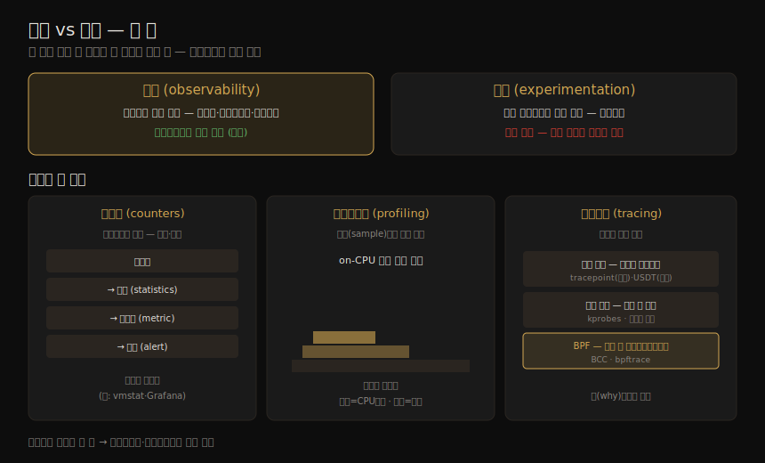

# 서론 (2) — 관측·실험·방법론·케이스
---
> 이 노트는 1장 후반부로, 성능을 *어떤 도구로 보는가* 를 잡습니다. 도구는 크게 둘입니다. 시스템을 건드리지 않고 관찰하는 관측(observability) 도구와, 합성 워크로드를 걸어 실험하는 실험(experimentation) 도구입니다. 관측의 세 갈래(카운터·프로파일링·트레이싱)와 정적/동적 계측·BPF를 보고, 실험(벤치마킹)·클라우드·방법론(60초 체크리스트)을 거쳐, 두 케이스 스터디로 이 모든 게 실제로 어떻게 맞물리는지 봅니다.

01-01 이 "성능이란 무엇이고 왜 어려운가"라는 지형도였다면, 이 노트는 그 위에서 *실제로 손에 드는 연장* 입니다. 저자가 든 비유 하나가 전체를 꿰뚫습니다. "사람에게 두 손 — 관측과 실험 — 이 있는데, 한 종류 도구만 쓰는 건 문제를 한 손으로 풀려는 것과 같다." 프로덕션에서는 관측을 먼저 시도하되, 두 손을 다 쓰는 것이 핵심입니다.

> 전제: 프로덕션 환경에서는 *관측 도구를 먼저* 씁니다. 실험 도구는 합성 워크로드로 시스템 상태를 바꿔, 자원 경합으로 프로덕션 워크로드를 교란할 수 있기 때문입니다. 반대로 유휴 테스트 환경이라면 벤치마킹으로 하드웨어 성능을 가늠하는 데서 시작해도 좋습니다.


## 1. 관측 vs 실험 — 두 손

> 도구는 두 종류입니다. 관측 도구는 시스템을 건드리지 않고 관찰하고(카운터·프로파일링·트레이싱), 실험 도구는 합성 워크로드를 걸어 측정합니다(벤치마킹). 프로덕션에선 관측을 먼저, 그러나 둘 다 써야 합니다.

관측(observability)은 *관찰을 통해 시스템을 이해하는* 것이며, 이를 해내는 도구를 분류하는 말입니다. 카운터·프로파일링·트레이싱을 쓰는 도구가 여기 들고, 워크로드 실험으로 시스템 상태를 바꾸는 벤치마크 도구는 빠집니다. 두 도구의 자리와 그 아래 관측의 세 갈래를 한 장으로 정리하면 다음과 같습니다.



| 구분 | 관측(observability) | 실험(experimentation) |
|------|--------------------|----------------------|
| 하는 일 | 시스템을 건드리지 않고 관찰 | 합성 워크로드를 걸어 측정 |
| 도구 | 카운터·프로파일링·트레이싱 | 벤치마킹(매크로·마이크로) |
| 프로덕션 | 먼저 시도(안전) | 자원 경합으로 교란 위험 |
| 유휴 테스트 환경 | — | 하드웨어 성능 가늠에 적합 |

> 저자가 든 비유: 두 손은 관측과 실험입니다. 프로덕션에서 관측 도구를 먼저 시도하라는 권고는 유효하지만, 관측 도구가 너무 많아 한참 헤맬 때 실험 도구가 더 빨리 답을 줄 수 있습니다. 한 손만 쓰지 않는 것 — 이것이 선임 엔지니어 Roch Bourbonnais 가 저자에게 가르친 교훈입니다.


## 2. 카운터·통계·메트릭

> 앱과 커널은 카운터(하드코딩된 정수)로 상태·활동을 기록합니다. 성능 도구가 누적 카운터를 시점마다 읽어 통계(변화율·평균·백분위)를 냅니다. 그중 모니터링 대상으로 선택된 통계가 메트릭이고, 메트릭으로 알림을 만듭니다.

앱과 커널은 보통 자기 상태·활동을 데이터로 제공합니다. 연산 수, 바이트 수, 지연 측정, 자원 사용률, 에러율 등입니다. 이들은 대개 소프트웨어에 하드코딩된 정수 변수 — **카운터(counter)** — 로 구현되며, 일부는 누적되어 늘 증가합니다. 성능 도구는 이 누적 카운터를 *서로 다른 시점에* 읽어 통계를 계산합니다. 시간당 변화율, 평균, 백분위 등입니다.

예를 들어 `vmstat(8)` 은 `/proc` 의 커널 카운터를 바탕으로 가상 메모리 통계를 요약합니다. 48-CPU 프로덕션 API 서버의 출력은 다음과 같습니다.

```
$ vmstat 1 5
procs -----------memory---------- ---swap-- -----io---- -system-- ------cpu-----
 r  b   swpd   free   buff  cache   si   so    bi    bo   in   cs us sy id wa st
19  0      0 6531592  42656 1672040    0    0     1     7   21   33 51  4 46  0  0
26  0      0 6533412  42656 1672064    0    0     0     0 81262 188942 54  4 43  0  0
62  0      0 6533856  42656 1672088    0    0     0     8 80865 180514 53  4 43  0  0
```

`cpu us + sy` 열을 보면 시스템 전체 CPU 사용률이 약 57% 임을 알 수 있습니다.

용어 사이의 위계가 있습니다. **메트릭(metric)** 은 대상을 평가·모니터링하려고 *선택된* 통계입니다. 대부분의 회사는 모니터링 에이전트로 선택한 통계(메트릭)를 일정 간격으로 기록하고, GUI에 차트로 그려 시간 변화를 봅니다. 메트릭으로 **알림(alert)** — 예: 문제 감지 시 이메일 발송 — 도 만듭니다.

```
카운터(counter) → 통계(statistics) → 메트릭(metric) → 알림(alert)
```

> 다만 이 위계는 업계에서 엄격히 지켜지진 않습니다. 카운터·통계·메트릭은 종종 혼용되고, 알림도 전용 시스템뿐 아니라 어느 계층에서나 생길 수 있습니다. 시계열 메트릭만으로 문제가 풀리기도 합니다. 문제 시작 시각이 알려진 변경과 맞아떨어지면 그 변경을 되돌리면 됩니다. 그러나 메트릭은 "CPU나 디스크 쪽" 정도의 방향만 가리킬 뿐 *왜* 인지는 말해 주지 않을 때가 많습니다. 그때 더 깊이 파려면 프로파일링·트레이싱이 필요합니다.


## 3. 프로파일링과 플레임 그래프

> 프로파일링은 표본(sample)을 떠서 대상의 거친 그림을 그립니다. CPU가 흔한 대상이고, 일정 간격으로 on-CPU 코드 경로를 표집합니다. 플레임 그래프는 그 표본을 시각화해, 메트릭 다음으로 많은 성능 개선을 찾아 줍니다.

시스템 성능에서 **프로파일링(profiling)** 은 보통 *표집(sampling)* 하는 도구를 가리킵니다. 측정값의 부분집합(표본)을 떠서 대상의 거친 그림을 그리는 것입니다. CPU가 흔한 대상이며, 일정 시간 간격으로 on-CPU 코드 경로를 표집하는 방법을 씁니다.

CPU 프로파일을 시각화하는 효과적 방법이 **플레임 그래프(flame graph)** 입니다. 저자는 메트릭 다음으로 가장 많은 성능 개선을 플레임 그래프로 찾을 수 있다고 봅니다. CPU 문제뿐 아니라, CPU에 남은 발자국으로 다른 유형의 문제도 드러내기 때문입니다. 락 경합은 스핀 경로의 CPU 시간으로, 메모리 문제는 `malloc()` 같은 할당 함수의 과도한 CPU 시간과 그에 이른 코드 경로로, 잘못 설정된 네트워킹은 느리거나 낡은 코드 경로의 CPU 시간으로 발견됩니다.

플레임 그래프의 두 축은 다음과 같습니다.

| 축 | 의미 |
|----|------|
| 가로(너비) | 쓰인 CPU 시간에 비례 — 넓을수록 그 경로가 CPU를 많이 씀 |
| 세로(높이) | 코드 경로(스택) — 위로 갈수록 호출 깊이가 깊음 |


## 4. 트레이싱 — 정적·동적 계측과 BPF

> 트레이싱은 이벤트 기반 기록입니다. 이벤트를 잡아 저장하거나 즉석에서 요약합니다. 계측 지점이 소스에 박혀 있으면 정적, 실행 중에 끼워 넣으면 동적입니다. BPF는 이 동적 트레이싱에 프로그래머빌리티와 안전을 더해 차세대 도구를 떠받칩니다.

**트레이싱(tracing)** 은 이벤트 기반 기록입니다. 이벤트 데이터를 잡아 나중 분석용으로 저장하거나, 즉석에서 커스텀 요약·동작에 씁니다. 시스템 콜용(`strace(1)`)·네트워크 패킷용(`tcpdump(8)`) 같은 특수 목적 도구가 있고, 모든 소프트웨어·하드웨어 이벤트를 분석하는 범용 도구(Ftrace·BCC·bpftrace)가 있습니다. 이 "모든 걸 보는" 트레이서는 다양한 이벤트 소스 — 특히 정적·동적 계측 — 와 프로그래머빌리티를 위한 BPF를 씁니다.

#### 정적 계측(static instrumentation)

정적 계측은 소스 코드에 *하드코딩된* 계측 지점입니다. 리눅스 커널에는 디스크 I/O·스케줄러 이벤트·시스템 콜 등을 계측하는 지점이 수백 개 있으며, 이 커널 정적 계측 기술을 **tracepoint** 라 합니다. 유저 공간용으로는 **USDT(user statically defined tracing)** 가 있어, 라이브러리(예: libc)가 라이브러리 호출을, 많은 앱이 서비스 요청을 계측하는 데 씁니다.

정적 계측을 쓰는 도구의 예가 `execsnoop(8)` 입니다. `execve(2)` 시스템 콜의 tracepoint를 계측해, 트레이싱 중 새로 생성되는 프로세스를 찍습니다. SSH 로그인을 트레이싱한 출력입니다.

```
# execsnoop
PCOMM            PID    PPID   RET ARGS
ssh              30656  20063    0 /usr/bin/ssh 0
sshd             30657  1401     0 /usr/sbin/sshd -D -R
sh               30660  30657    0
env              30661  30660    0 /usr/bin/env -i PATH=/usr/local/sbin:...
[...]
```

> `top(1)` 같은 다른 관측 도구가 놓치기 쉬운 *수명이 짧은(short-lived) 프로세스* 를 드러내는 데 특히 유용합니다. 이런 단명 프로세스가 성능 문제의 원인일 수 있습니다.

#### 동적 계측(dynamic instrumentation)

동적 계측은 소프트웨어가 *실행된 뒤* 메모리 안 명령어를 수정해 계측 지점을 만듭니다. 디버거가 돌아가는 소프트웨어의 아무 함수에나 breakpoint를 거는 것과 비슷합니다. 다만 디버거는 breakpoint에서 대화형 디버거로 흐름을 넘기는 반면, 동적 계측은 루틴을 실행한 뒤 대상 소프트웨어를 *계속 진행* 시킵니다. 덕분에 돌아가는 어떤 소프트웨어에서든 커스텀 통계를 만들 수 있고, 관측성 부족으로 풀 수 없던 문제를 풀 수 있습니다.

> 저자의 비유: 커널 내부 분석은 어두운 방에 들어가는 것과 같습니다. 커널 엔지니어가 필요하다고 여긴 자리에 촛불(시스템 카운터)이 놓여 있을 뿐입니다. 동적 계측은 *어디든 비출 수 있는 손전등* 을 든 것과 같습니다.

동적 계측은 1990년대에 처음 나왔고, 리눅스에선 2004년 kprobes로 커널에 병합되기 시작했습니다. 그러나 잘 알려지지 않고 쓰기 어려웠습니다. 이를 바꾼 것이 2005년 Sun의 **DTrace** 로, 쓰기 쉽고 프로덕션에서 안전했습니다. 저자가 만든 여러 DTrace 기반 도구가 동적 계측의 중요성을 널리 알렸습니다.

#### BPF

**BPF**(원래 Berkeley Packet Filter, 이제는 약자가 아닌 이름)는 리눅스의 최신 동적 트레이싱 도구를 떠받칩니다. 본래 `tcpdump(8)` 표현식 실행을 빠르게 하는 커널 안 미니 가상 머신이었으나, 2013년부터 확장(그래서 eBPF로도 불림)되어 안전과 빠른 자원 접근을 제공하는 범용 커널 안 실행 환경이 됐습니다. 그 많은 새 쓰임 중 하나가 트레이싱 도구로, **BCC**(BPF Compiler Collection)와 **bpftrace** 프런트엔드에 프로그래머빌리티를 줍니다. 앞서 본 `execsnoop(8)` 이 BCC 도구입니다.

| 기술 | 계측 시점 | 예 |
|------|----------|-----|
| 정적 계측 | 소스에 하드코딩 (컴파일 시) | tracepoint(커널)·USDT(유저) |
| 동적 계측 | 실행 중 메모리 명령어 수정 | kprobes·DTrace |
| BPF | 위 소스 + 커널 안 프로그래머빌리티 | BCC·bpftrace |

> `perf(1)` 과 Ftrace 도 BPF 프런트엔드와 비슷한 트레이싱 능력을 가진 트레이서입니다(각각 13·14장). 이 도구들의 깊은 참고서는 저자의 별도 저서가 있습니다(DTrace·BPF).


## 5. 실험 — 벤치마킹

> 실험 도구는 대부분 벤치마킹입니다. 합성 워크로드를 걸어 성능을 잽니다. 실세계 워크로드를 흉내 내는 매크로와, CPU·디스크처럼 특정 요소를 재는 마이크로가 있습니다. 마이크로가 디버그·반복·이해에 더 쉽습니다.

관측 도구 외에 실험 도구가 있고, 대부분은 벤치마킹 도구입니다. 합성 워크로드를 시스템에 걸어 성능을 측정하는 실험을 수행합니다. 실험 도구는 테스트 대상 시스템의 성능을 *교란* 할 수 있으므로 신중해야 합니다.

| 종류 | 재는 것 | 비유(자동차) |
|------|--------|-------------|
| 매크로 벤치마크 | 실세계 워크로드 시뮬레이션(예: 클라이언트 요청) | 라구나 세카 한 바퀴 랩 타임 |
| 마이크로 벤치마크 | 특정 요소(CPU·디스크·네트워크) | 최고 속도, 0→60mph 시간 |

두 종류 모두 중요하지만, 마이크로 벤치마크가 보통 디버그·반복·이해가 쉽고 더 안정적입니다. 예를 들어 `iperf(1)` 로 TCP 처리량을 재면, 초당 평균이 약 4.8 Gbits에서 3.2 Gbits/sec로 떨어지는 **이중 모드(bi-modal)** 처리량이 드러납니다. 프로덕션에서 관측 도구만으로 이 문제를 디버그하면, 클라이언트 워크로드의 자연 변동에 가려 이 이중 모드 동작이 안 보일 수 있습니다. `iperf(1)` 로 *고정 워크로드* 를 걸면 클라이언트 변동을 없애, 다른 요인(외부 스로틀링·버퍼 사용 등)에 따른 변동을 드러냅니다. 이것이 실험 도구를 함께 써야 하는 까닭입니다.

> 용어 주의: `iperf(1)` 출력의 "Bandwidth"는 흔한 오용입니다. bandwidth는 *가능한 최대* 처리량을 뜻하는데, `iperf(1)` 가 재는 것은 현재 워크로드의 *처리량(throughput)* 입니다.


## 6. 클라우드 컴퓨팅

> 클라우드는 작은 가상 인스턴스로 빠른 확장을 가능케 해 엄격한 용량 계획의 필요를 줄였습니다. 동시에 분 단위 과금이라 성능 개선이 곧 비용 절감이고, 이웃 테넌트와의 경합·물리 시스템 관측 곤란이라는 새 어려움을 낳았습니다.

클라우드는 컴퓨팅 자원을 필요할 때 배포하는 방식으로, 앱을 점점 더 많은 작은 가상 시스템(인스턴스)에 배포해 빠른 확장을 가능케 합니다. 용량을 짧은 통지로 더할 수 있어 *엄격한 용량 계획의 필요* 가 줄었습니다. 반대로 성능 분석의 *필요* 는 커졌습니다. 자원을 덜 쓰면 시스템 수가 줄고, 클라우드는 분·시간 단위 과금이라 시스템 수를 줄이는 성능 개선이 *즉각적인 비용 절감* 이 되기 때문입니다. 수년 고정 계약에 묶여 계약이 끝나야 절감이 실현되는 엔터프라이즈 데이터센터와 대비됩니다.

클라우드·가상화가 낳은 새 어려움도 있습니다. 다른 테넌트가 주는 성능 영향 관리(**성능 격리, performance isolation**)와, 각 테넌트 입장에서의 물리 시스템 관측입니다. 시스템이 제대로 관리하지 않으면 이웃과의 경합으로 디스크 I/O 성능이 나빠질 수 있고, 어떤 환경에서는 물리 디스크의 실제 사용을 테넌트가 관측조차 못 해 문제 식별이 어렵습니다(11장).


## 7. 방법론 — Linux 60초 분석 체크리스트

> 방법론은 성능 작업의 권장 절차를 문서화한 것입니다. 없으면 분석이 "낚시 원정" — 되는대로 찔러 보기 — 이 됩니다. 저자가 어떤 문제든 가장 먼저 쓰는 것이 도구 기반 60초 체크리스트입니다.

방법론(methodology)은 시스템 성능의 여러 작업에 대한 권장 절차를 문서화한 것입니다. 방법론이 없으면 성능 조사가 *낚시 원정(fishing expedition)* — 한 건 걸리길 바라며 되는대로 시도 — 으로 흐릅니다. 시간만 잡아먹고 비효율적이며, 중요한 영역을 빠뜨립니다.

저자가 어떤 성능 문제든 가장 먼저 쓰는 것이 **Linux 60초 분석 체크리스트** 입니다. 대부분의 배포판에 있는 전통 도구로, 조사 첫 60초 안에 실행할 수 있습니다.

| # | 도구 | 확인할 것 |
|---|------|----------|
| 1 | `uptime` | 부하 평균(load average) — 1·5·15분을 비교해 부하가 느는지 주는지 |
| 2 | `dmesg -T \| tail` | 커널 에러(OOM 이벤트 포함) |
| 3 | `vmstat -SM 1` | 시스템 전체 — 런큐 길이, 스와핑, 전체 CPU 사용 |
| 4 | `mpstat -P ALL 1` | CPU별 균형 — 한 CPU만 바쁘면 스레드 확장성 불량 신호 |
| 5 | `pidstat 1` | 프로세스별 CPU 사용 — 예상 밖 소비자, user/system 시간 |
| 6 | `iostat -sxz 1` | 디스크 I/O — IOPS·처리량·평균 대기·busy % |
| 7 | `free -m` | 메모리 사용(파일시스템 캐시 포함) |
| 8 | `sar -n DEV 1` | 네트워크 장치 I/O — 패킷·처리량 |
| 9 | `sar -n TCP,ETCP 1` | TCP 통계 — 연결률·재전송 |
| 10 | `top` | 전체 개관 확인 |

> 같은 메트릭이 있다면 모니터링 GUI로도 이 체크리스트를 따를 수 있습니다. 다만 이 체크리스트는 *바로 쓸 수 있는 CLI 도구* 를 최대한 활용하도록 설계됐습니다. 저자는 커스텀 대시보드라면 USE 방법론 같은 쪽에 더 만들고 싶다고 합니다(USE·워크로드 특성 파악·지연 분석 등 더 많은 방법론은 2장).


## 8. 케이스 스터디 — 도구가 맞물리는 법

> 두 가설 사례로 이 모든 도구가 실제로 어떻게 쓰이는지 봅니다. 하나는 "느린 디스크" 신고를 추적해 진짜 원인(이웃 앱의 메모리 잠식)을 찾는 이야기, 하나는 새 소프트웨어의 회귀를 벤치마킹으로 밝히는 이야기입니다.

#### 느린 디스크 — Sumit

DB 팀이 "디스크가 느리다"는 티켓을 올립니다. 시스템 관리자 Sumit 은 먼저 *문제 기술서* 를 만들려고 질문합니다. "지금 DB 성능 문제가 있나? 어떻게 측정했나? 언제부터인가? 최근 바뀐 게 있나? 왜 디스크를 의심하나?" DB 팀은 "1초 넘는 쿼리 로그가 지난주 시간당 수십 건으로 늘었고, 모니터링(AcmeMon)에서 디스크가 바빴다"고 답합니다. 진짜 문제는 확인됐지만 디스크 가설은 추측임이 드러납니다.

Sumit 은 **USE 방법론** 으로 자원 병목을 빠르게 점검합니다. 디스크 사용률은 80%로 높고 CPU·네트워크는 낮습니다. 단 AcmeMon은 1분 간격이라, 서버에 로그인해 `iostat(1)` 을 1초 간격으로 돌리니 디스크가 종종 100%를 치며 포화·지연 증가가 보입니다. 이것이 DB를 *막고 있는지* 확인하려고 BCC/BPF 도구 `offcputime(8)` 으로, 커널이 DB를 디스케줄링할 때마다 스택과 off-CPU 시간을 잡습니다. 스택은 DB가 쿼리 중 파일시스템 읽기에서 자주 블록됨을 보여 줍니다. 증거로 충분합니다.

다음 질문은 *왜* 입니다. **워크로드 특성 파악** 으로 IOPS·처리량·평균 지연·읽기/쓰기 비를 재니 디스크는 *높은 부하에 정상* 으로 보입니다. DB 부하가 늘었나 물으니 아니고, 쿼리율도 일정합니다(CPU가 일정했던 것과 일치). 파일시스템 단편화 가설은 용량이 30%뿐이라 기각됩니다. Sumit 은 커널 I/O 스택 지식을 떠올립니다 — 이 디스크 I/O는 대개 *파일시스템 캐시(page cache) 미스* 탓입니다. `cachestat(8)` 으로 캐시 적중률을 보니 91% 인데, 비슷한 워크로드의 다른 서버는 98% 이상이고 캐시 크기도 훨씬 큽니다. 메모리 사용을 보니 *간과됐던 것* 이 나옵니다. 한 개발 프로젝트의 프로토타입 앱이 프로덕션 부하도 없이 메모리를 점점 먹어, 파일시스템 캐시 몫을 빼앗아 적중률을 떨어뜨리고 더 많은 읽기를 디스크 읽기로 만든 것입니다. 그 앱을 다른 서버로 옮기자 캐시가 회복되고 느린 쿼리가 0으로 돌아옵니다.

#### 소프트웨어 변경 — Pamela

성능·확장성 엔지니어 Pamela 는 새 핵심 기능이 성능을 해치는지 확인하려고, 배포 전 **비회귀 테스트(non-regression testing)** 를 합니다. 유휴 서버와 클라이언트 워크로드 시뮬레이터를 구하고, 접근 로그 분석으로 시뮬레이터가 프로덕션 워크로드를 잘 닮았는지 봅니다. 평균 부하는 닮았지만 변동을 반영하지 못함을 적어 둡니다.

부하를 100부터 100씩 올리는 **스트레스 테스트** 를 하니 처리량이 약 700 요청/초에서 평평해집니다. 새 버전도 700에서 멈춥니다. **액티브 벤치마킹** 으로 한계 요인을 찾지만 서버 자원·스레드는 거의 유휴라 안 보입니다. 접근을 바꿔, 700/초 고정 부하로 자원 소비를 잽니다. 현 버전은 32 CPU를 평균 20%로, 새 버전은 같은 부하에 30%로 몹니다 — *CPU를 더 먹는 회귀* 입니다. 700 한계가 궁금해 데이터 경로 전체(네트워크·클라이언트·생성기)를 조사하고, **스레드 상태 분석** 으로 클라이언트 소프트웨어가 *단일 스레드* 라 한 스레드가 CPU를 100% 쓰며 한계가 됐음을 찾습니다. 클라이언트를 여러 시스템에서 병렬 실행하니 서버를 100% CPU로 몰 수 있고, 현 버전 3,500 요청/초·새 버전 2,300 요청/초로 앞 발견과 일치합니다. Pamela 는 회귀를 개발팀에 알리고 **CPU 플레임 그래프** 로 원인 코드 경로를 프로파일합니다. 또 평균 워크로드만 테스트됐고 변동은 안 됐음을, 생성기가 단일 스레드라 병목이 될 수 있음을 버그로 남깁니다.

> 두 케이스의 공통점: 가설("디스크 탓")로 출발하되 *빠르게 다른 자원도 점검* 하고, 메트릭(USE)→트레이싱(offcputime·스레드 상태)→실험(벤치마킹)→프로파일링(플레임 그래프)으로 손을 바꿔 가며, 모든 점검을 스크린샷과 함께 *문서화* 합니다. 더 자세한 실전 사례는 16장에 있습니다.


## 학습 점검

> 이 노트의 핵심을 스스로 떠올려 봅니다. 답이 막히면 해당 섹션으로 돌아가 확인합니다.

- 관측과 실험 도구의 차이와, 프로덕션에서 관측을 먼저 쓰는 이유를 "두 손" 비유로 설명해 봅니다. (→ §1)
- 카운터→통계→메트릭→알림 위계를 말하고, 메트릭만으로 부족해 프로파일링·트레이싱이 필요해지는 때를 설명해 봅니다. (→ §2, §3)
- 플레임 그래프의 두 축(너비·높이)이 무엇을 뜻하는지, 왜 CPU 외 문제까지 드러내는지 떠올려 봅니다. (→ §3)
- 정적 계측·동적 계측·BPF의 차이를 "촛불 vs 손전등" 비유와 함께 설명해 봅니다. (→ §4)
- 매크로 vs 마이크로 벤치마크의 차이와, `iperf(1)` 고정 워크로드가 이중 모드 변동을 어떻게 드러냈는지 말해 봅니다. (→ §5)
- 60초 체크리스트의 첫 세 도구(`uptime`·`dmesg`·`vmstat`)가 각각 무엇을 보는지, 두 케이스 스터디가 손을 어떻게 바꿔 가며 원인을 좁혔는지 설명해 봅니다. (→ §7, §8)
