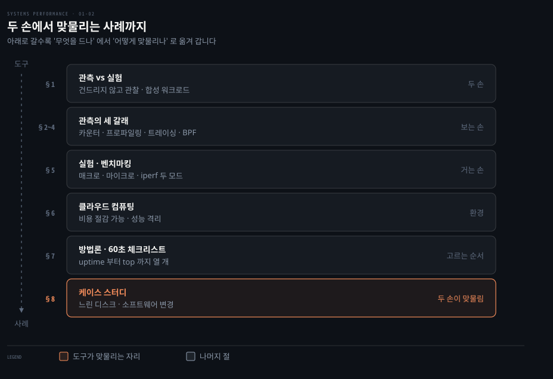
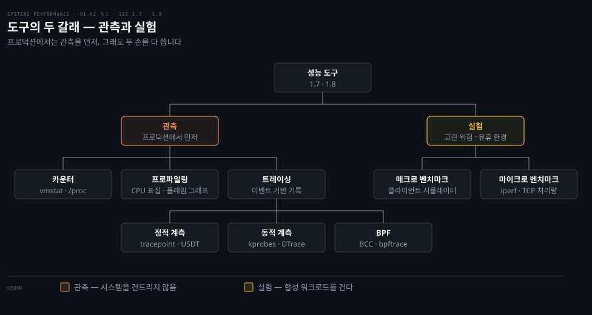
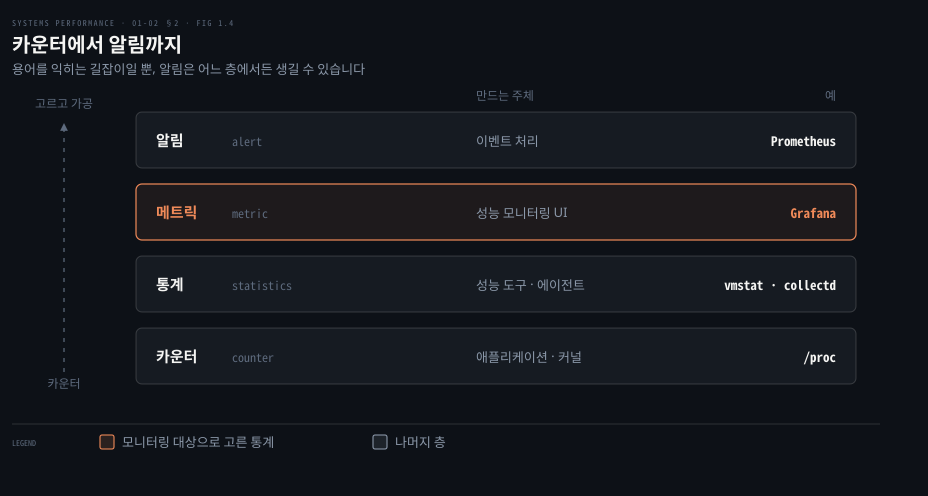
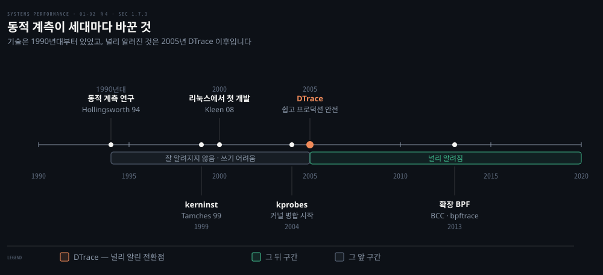
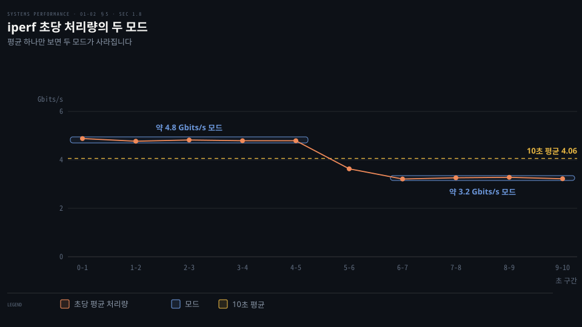
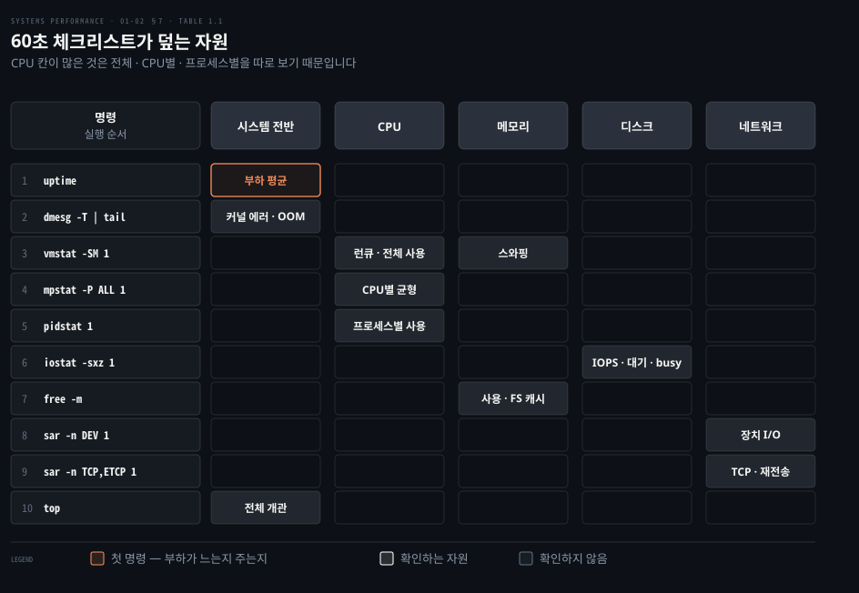
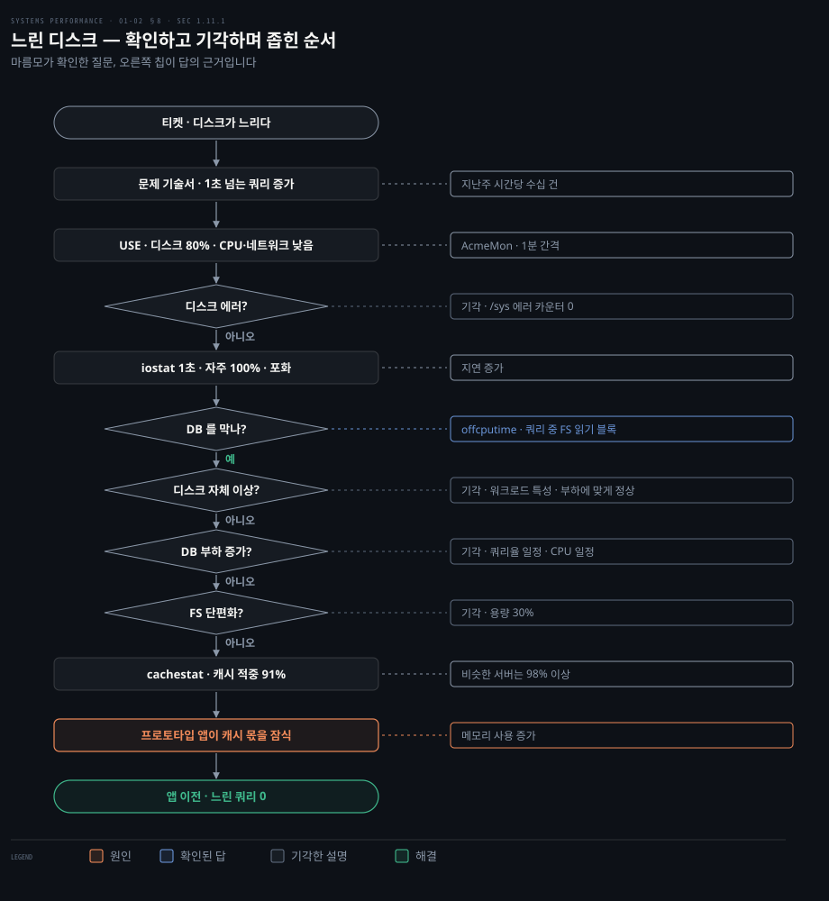
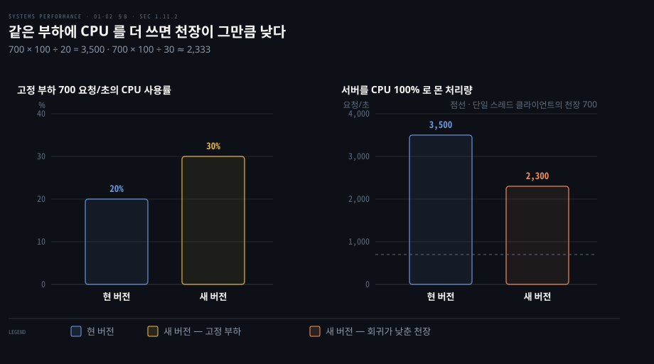

# 서론 — 관측·실험·방법론·케이스
---
> 이 노트는 1장 후반부(1.7~1.11)로, 성능을 어떤 도구로 보는가를 잡습니다. 시스템을 건드리지 않는 관측과 합성 워크로드를 거는 실험이라는 두 손을 보고, 방법론과 두 케이스 스터디로 도구가 실제로 맞물리는 모습을 확인합니다.

## 핵심 요약

> 이 편이 매달린 하나의 생각은 성능을 보는 손이 관측과 실험 둘이라는 것입니다. 한 종류 도구만 쓰면 문제를 한 손으로 푸는 것과 같습니다.

관측 도구는 카운터와 프로파일링, 트레이싱으로 시스템을 건드리지 않고 상태를 살핍니다. 프로덕션에서는 관측 도구를 먼저 시도합니다. 반면 실험 도구는 합성 워크로드로 시스템 상태를 바꿉니다. 합성 워크로드는 실제 트래픽을 흉내 내 인위로 만든 부하입니다. 이 부하가 프로덕션 워크로드를 교란할 수 있기 때문입니다.

메트릭은 성능 문제가 CPU 쪽인지 디스크 쪽인지 방향을 가리킵니다. 하지만 이유는 말해 주지 않을 때가 많습니다. 그때 프로파일링과 트레이싱으로 더 깊이 팝니다. 동적 계측과 BPF는 실행 중인 소프트웨어의 거의 어디든 비출 수 있는 손전등을 줍니다.

관측만으로 안 보이는 것도 있습니다. `iperf(1)`로 고정 워크로드를 걸자 약 4.8 Gbits/sec와 약 3.2 Gbits/sec 두 모드가 드러났습니다. 프로덕션의 자연 변동 속에서는 이 동작이 가려질 수 있습니다.

도구를 되는대로 찔러 보지 않으려면 방법론이 필요합니다. 저자가 어떤 문제든 처음 60초에 돌리는 체크리스트가 그 출발점입니다. 이어지는 두 케이스 스터디는 가설에서 출발해 손을 바꿔 가며 원인을 좁히는 과정을 보여 줍니다.


## 학습 목표

> 이 편을 덮은 뒤 스스로 할 수 있어야 하는 일을 먼저 적어 둡니다.

1. 관측 도구와 실험 도구를 구분합니다. 프로덕션에서 관측을 먼저 쓰는 이유와 실험이 더 빠른 경우를 설명합니다.
2. 카운터와 통계, 메트릭, 알림의 위계를 설명합니다. 메트릭만으로 부족해 프로파일링과 트레이싱으로 넘어갈 때를 판단합니다.
3. 정적 계측과 동적 계측, BPF가 계측 지점을 어떻게 만드는지 비교합니다.
4. `iperf(1)` 출력에서 두 모드를 읽고, 고정 워크로드가 무엇을 드러내는지 설명합니다.
5. 60초 체크리스트와 두 케이스 스터디에서 도구를 바꿔 가며 원인을 좁히는 순서를 설명합니다.

아래 지도는 이 편의 여덟 절을 위에서 아래로 쌓아 둔 모습입니다.



§1이 두 손을 나눕니다. §2~§4는 관측의 세 갈래를, §5는 실험을 다룹니다. §6은 클라우드라는 환경을, §7은 도구를 고르는 순서를 살핍니다. §8은 그 모두가 맞물린 사례입니다.


## 이 문서가 다루지 않는 것

> 1장 전반과 뒤 장으로 넘긴 주제를 먼저 밝혀 둡니다. 이 편은 도구의 종류와 쓰임새까지만 봅니다.

- 시스템 성능의 범위와 역할, 활동, 관점, 그리고 성능이 어려운 이유는 01-01에서 다룹니다. 01-01이 지형도라면 이 편은 그 위에서 손에 드는 연장입니다.
- 관측 도구의 내부, 시스템 전체 관측과 프로세스별 관측의 차이는 4장(04-01)에서 살펴봅니다.
- 플레임 그래프를 읽는 자세한 방법은 6장 6.7.3과 05-02 §3이 다룹니다.
- BPF 자체와 BCC, bpftrace 프런트엔드는 3장과 15장(15-01)에서 설명합니다.
- USE 방법과 워크로드 특성 파악, 드릴다운 분석의 정의는 2장(02-02)에서 짚어 봅니다.
- 클라우드의 성능 격리와 테넌트 관측은 11장(11-01)이 다룹니다.


## 1. 관측 vs 실험 — 두 손

> 관측 도구는 시스템을 건드리지 않고 관찰하고(카운터·프로파일링·트레이싱), 실험 도구는 합성 워크로드를 걸어 측정합니다(벤치마킹). 프로덕션에선 관측을 먼저 쓰되, 둘 다 써야 합니다.



성능 문제를 앞에 두면 어떤 도구부터 들지가 첫 결정입니다. 도구를 잘못 고르면 프로덕션을 흔들거나, 같은 자리를 몇 시간째 맴돌게 됩니다. 위 그림은 이 편이 다룰 도구를 두 갈래로 나눕니다. 그리고 갈래마다 1장에 나오는 실제 예를 붙였습니다.

원서는 도구를 두 종류로 나눕니다. **관측**(observability)은 관찰로 시스템을 이해하는 일입니다. 그 일을 해내는 도구를 분류하는 말이기도 합니다. 카운터와 프로파일링, 트레이싱을 쓰는 도구가 이 갈래에 듭니다. 반면 워크로드 실험으로 시스템 상태를 바꾸는 벤치마크 도구는 여기서 빠집니다.

프로덕션 환경이라면 가능한 한 관측 도구를 먼저 시도합니다. 실험 도구는 자원 경합으로 프로덕션 워크로드를 교란할 수 있기 때문입니다. 반대로 유휴 테스트 환경이라면 벤치마킹 도구로 하드웨어 성능을 가늠하는 데서 시작해도 됩니다.

| 구분 | 관측(observability) | 실험(experimentation) |
|------|--------------------|----------------------|
| 하는 일 | 시스템을 건드리지 않고 관찰 | 합성 워크로드를 걸어 측정 |
| 도구 | 카운터·프로파일링·트레이싱 | 벤치마킹(매크로·마이크로) |
| 프로덕션 | 먼저 시도(안전) | 자원 경합으로 교란 위험 |
| 유휴 테스트 환경 | — | 하드웨어 성능 가늠에 적합 |

관측을 먼저 하라는 권고에는 단서가 붙습니다. 관측 도구가 너무 많아 몇 시간씩 헤맬 때는 실험 도구가 더 빨리 답을 줄 수 있습니다. 저자는 오래전 선임 성능 엔지니어 Roch Bourbonnais에게 배운 비유를 옮깁니다. 사람에게는 관측과 실험이라는 두 손이 있습니다. 한 종류 도구만 쓰는 것은 문제를 한 손으로 풀려는 것과 같다는 비유입니다. 원서에서 이 비유는 1.8 실험 절의 `iperf(1)` 예 뒤에 나옵니다.

5~11장에는 장마다 관측 절이 있습니다(예: CPU 관측 도구는 6.6).


## 2. 카운터·통계·메트릭

> 앱과 커널은 카운터(하드코딩된 정수)로 상태·활동을 기록하고, 성능 도구가 누적 카운터를 시점마다 읽어 통계(변화율·평균·백분위)를 냅니다. 그중 모니터링 대상으로 선택된 통계가 메트릭이고, 메트릭으로 알림을 만듭니다.

숫자 하나를 보고 판단하려면 그 숫자가 어디서 왔는지부터 알아야 합니다. 앱과 커널은 보통 자기 상태와 활동을 데이터로 내놓습니다. 연산 수나 바이트 수, 지연 측정값, 자원 사용률, 에러율 같은 것들입니다.

이 데이터는 대개 소프트웨어에 하드코딩된 정수 변수, 즉 **카운터**(counter)로 구현됩니다. 그중 일부는 값이 누적되어 늘 증가합니다. 성능 도구는 이 누적 카운터를 서로 다른 시점에 읽어 통계를 계산합니다. 시간당 변화율이나 평균, 백분위 같은 값입니다.

예를 들어 `vmstat(8)`은 `/proc` 파일 시스템의 커널 카운터를 바탕으로 가상 메모리 통계 등을 시스템 전체 기준으로 요약합니다. 다음은 48-CPU 프로덕션 API 서버의 출력입니다. 대조한 원서 PDF 사본에서 오른쪽 열이 잘려 있어 보이는 데까지만 옮깁니다.

이 출력에서 원서가 짚는 곳은 맨 오른쪽 `cpu` 묶음의 `us`(유저 시간)와 `sy`(시스템 시간) 열입니다.

```bash
vmstat 1 5
procs -----------memory---------- ---swap-- -----io---- -system-- ------cpu
 r  b   swpd    free   buff   cache   si   so    bi    bo    in     cs us sy id
19  0      0 6531592  42656 1672040    0    0     1     7    21     33 51  4 4
26  0      0 6533412  42656 1672064    0    0     0     0 81262 188942 54
62  0      0 6533856  42656 1672088    0    0     0     8 80865 180514 53
34  0      0 6532972  42656 1672088    0    0     0     0 81250 180651 53
31  0      0 6534876  42656 1672088    0    0     0     0 74389 168210 46
```

원서는 이 두 열을 더하면 시스템 전체 CPU 사용률이 약 57%라고 읽습니다. 각 열의 뜻은 6장과 7장에서 자세히 다룹니다.

카운터에서 알림까지는 위계가 있습니다. **메트릭**(metric)은 대상을 평가하거나 모니터링하려고 골라낸 통계입니다. 대부분의 회사는 모니터링 에이전트를 써서 고른 통계, 즉 메트릭을 일정 간격으로 기록합니다. 그리고 GUI에 차트로 그려 시간에 따른 변화를 봅니다. 모니터링 소프트웨어는 메트릭으로 사용자 정의 알림(alert)도 만들 수 있습니다. 문제가 감지되면 담당자에게 이메일을 보내는 식입니다.



원서 그림 1.4는 이 위계를 층마다 대표 예와 함께 보여 줍니다. 원서는 이 그림을 용어를 익히는 길잡이로 내놓을 뿐, 업계의 쓰임이 엄격하지 않다고 덧붙입니다. 카운터와 통계, 메트릭은 자주 섞여 쓰입니다. 또한 알림도 전용 알림 시스템만이 아니라 어느 층에서든 생길 수 있습니다.

메트릭을 그래프로 그린 예로 원서는 같은 서버를 보는 Grafana 기반 도구 화면(그림 1.5)을 싣습니다. 이런 선 그래프는 용량 계획에 쓸모가 있습니다. 자원이 언제 바닥날지 예측하게 해 주기 때문입니다. 통계가 어떻게 계산되는지 알면 해석도 나아집니다. 평균과 분포, 최빈값, 이상치 같은 통계는 2장 2.8에서 정리합니다.

때로는 시계열 메트릭만으로 문제가 풀리기도 합니다. 문제가 시작된 정확한 시각이 알려진 소프트웨어나 설정 변경과 맞아떨어지면, 그 변경을 되돌리면 됩니다. 다른 때는 메트릭이 방향만 가리킵니다. CPU나 디스크 쪽 문제라는 것까지는 알려 주지만 왜인지는 설명하지 않습니다. 더 깊이 파서 원인을 찾으려면 프로파일링이나 트레이싱 도구가 필요합니다.


## 3. 프로파일링과 플레임 그래프

> 프로파일링은 표본(sample)을 떠서 대상의 거친 그림을 그리며, 흔한 대상은 일정 간격으로 표집한 on-CPU 코드 경로입니다. 플레임 그래프는 그 표본을 시각화해, 메트릭 다음으로 많은 성능 개선을 찾아 줍니다.

메트릭이 CPU 쪽을 가리켰다면 다음 질문은 CPU가 어떤 코드에 시간을 쓰는지로 이어집니다. 시스템 성능에서 **프로파일링**(profiling)은 보통 표집(sampling) 도구 사용을 가리킵니다. 측정값의 부분집합인 표본을 떠서 대상의 거친 그림을 그립니다. 흔한 대상은 CPU입니다. 일정 시간 간격으로 on-CPU 코드 경로를 표집하는 방법을 많이 씁니다.

CPU 프로파일을 효과적으로 시각화하는 도구가 **플레임 그래프**(flame graph)입니다. 원서는 메트릭을 빼면 CPU 플레임 그래프가 다른 어떤 도구보다 많은 성능 개선을 찾아 준다고 봅니다. 이는 CPU 문제만이 아니라 다른 유형의 문제도 보여 줍니다. 다른 문제들이 CPU에 남긴 발자국을 드러내는 덕분입니다.

락 경합은 여러 스레드가 같은 락을 얻으려고 기다리는 상황을 뜻합니다. 스핀은 락이 풀리기를 기다리는 방식입니다. 이 과정에서 CPU를 쓰며 되풀이해 상태를 확인합니다. 따라서 락 경합이 CPU 시간으로 드러납니다.

| 문제 | CPU 에 남는 발자국 |
|------|------------------|
| 락 경합 | 스핀 경로에서 쓴 CPU 시간 |
| 메모리 문제 | `malloc()` 같은 할당 함수에서 쓴 과도한 CPU 시간과, 거기에 이른 코드 경로 |
| 잘못 설정된 네트워킹 | 느리거나 낡은 코드 경로에서 쓴 CPU 시간 |

원서 그림 1.6은 네트워크 마이크로 벤치마크 도구 `iperf(1)`이 쓴 CPU 사이클을 플레임 그래프로 보여 줍니다. 여기서 바이트 복사에 쓴 몫과 TCP 송신에 쓴 몫을 견줄 수 있습니다. 바이트 복사는 `copy_user_enhanced_fast_string()`으로 끝나는 경로를 뜻합니다. 반면 TCP 송신은 `tcp_write_xmit()`이 들어 있는 왼쪽 탑을 가리킵니다.

| 축 | 의미 |
|----|------|
| 가로(너비) | 쓰인 CPU 시간에 비례 — 넓을수록 그 경로가 CPU를 많이 씀 |
| 세로(높이) | 코드 경로 |

원서 1장은 두 축을 이 정도로만 설명합니다. 탑을 어떤 순서로 읽는지 같은 자세한 방법은 뒤로 미룹니다. 관련 내용은 6장 6.7.3과 [05-02 §3](./05-02.%EC%95%A0%ED%94%8C%EB%A6%AC%EC%BC%80%EC%9D%B4%EC%85%98%20%E2%80%94%20%EC%96%B8%EC%96%B4%C2%B7%EB%B0%A9%EB%B2%95%EB%A1%A0.md)의 도식에 맡깁니다. 프로파일러는 4·5·6장이 다룹니다.


## 4. 트레이싱 — 정적·동적 계측과 BPF

> 트레이싱은 이벤트를 잡아 저장하거나 즉석에서 요약하는 이벤트 기반 기록이며, 계측 지점이 소스에 박혀 있으면 정적, 실행 중에 끼워 넣으면 동적입니다. BPF는 이 동적 트레이싱에 프로그래머빌리티와 안전을 더해 차세대 도구를 떠받칩니다.

표본이 주는 거친 그림으로 부족하면 이벤트 하나하나를 기록하는 방식이 필요합니다. **트레이싱**(tracing)은 이벤트를 기반으로 기록합니다. 이벤트 데이터를 잡아 나중 분석용으로 저장합니다. 또는 즉석에서 소비해 사용자 정의 요약과 다른 동작에 씁니다.

트레이싱 도구에는 특수 목적 도구와 범용 도구가 꼽힙니다. 시스템 콜용 `strace(1)`과 네트워크 패킷용 `tcpdump(8)`이 특수 목적 도구를 뜻합니다. 모든 소프트웨어와 하드웨어 이벤트 실행을 분석할 수 있는 범용 도구로는 Ftrace와 BCC, bpftrace가 있습니다. 이렇게 모든 것을 보는 트레이서는 여러 이벤트 소스를 다룹니다. 특히 정적 계측과 동적 계측을 활용하며 프로그래머빌리티를 위해 BPF를 씁니다.

### 정적 계측(static instrumentation)

정적 계측은 소스 코드에 추가해 둔 하드코딩된 소프트웨어 계측 지점입니다. 리눅스 커널에는 디스크 I/O나 스케줄러 이벤트, 시스템 콜 등을 계측하는 이런 지점이 수백 개 존재합니다. 커널 정적 계측을 위한 리눅스 기술을 **tracepoint**라고 부릅니다.

유저 공간 소프트웨어용 정적 계측 기술로는 USDT(user statically defined tracing)가 꼽힙니다. 라이브러리(예: libc)는 USDT로 라이브러리 호출을 계측합니다. 많은 애플리케이션 역시 서비스 요청을 계측하는 데 이 기술을 씁니다.

정적 계측을 쓰는 대표적인 도구로 `execsnoop(8)`을 듭니다. 이 도구는 `execve(2)` 시스템 콜의 tracepoint를 계측합니다. 이를 통해 트레이싱하는 동안 새로 생성되는 프로세스를 찍습니다. 다음은 SSH 로그인을 트레이싱한 원서 출력입니다.

```bash
# execsnoop
PCOMM            PID    PPID   RET ARGS
ssh              30656  20063    0 /usr/bin/ssh 0
sshd             30657  1401     0 /usr/sbin/sshd -D -R
sh               30660  30657    0
env              30661  30660    0 /usr/bin/env -i PATH=/usr/local/sbin:/us
run-parts        30661  30660    0 /bin/run-parts --lsbsysinit /etc/update-
00-header        30662  30661    0 /etc/update-motd.d/00-header
uname            30663  30662    0 /bin/uname -o
uname            30664  30662    0 /bin/uname -r
uname            30665  30662    0 /bin/uname -m
[...]
```

로그인 한 번에 로그인 안내문(motd)을 만드는 스크립트가 `uname` 같은 프로세스를 줄줄이 띄우고 곧바로 끝냅니다. 원서 출력은 이 뒤로 `cat`과 `cut`, `tr`, `head` 같은 프로세스를 더 보여 줍니다.

`top(1)` 같은 다른 관측 도구는 이렇게 수명이 짧은(short-lived) 프로세스를 놓치기 쉽습니다. `top(1)`은 일정 간격으로 프로세스 목록을 다시 읽어 보여 줍니다. 따라서 그 사이에 생겼다 사라진 프로세스는 화면에 나오지 않습니다. 그래서 CPU를 쓰는데도 원인 후보에서 빠집니다. 원서는 이런 단명 프로세스가 성능 문제의 원인일 수 있다고 짚습니다. tracepoint와 USDT 프로브는 4장이 더 다룹니다.

### 동적 계측(dynamic instrumentation)

동적 계측은 소프트웨어가 실행된 뒤에 계측 지점을 만듭니다. 메모리에 올라간 명령어를 고쳐 계측 루틴을 끼워 넣는 방식을 씁니다. 디버거가 실행 중인 소프트웨어의 아무 함수에나 breakpoint를 거는 것과 비슷합니다.

차이는 그다음에 나타납니다. 디버거는 breakpoint에 닿으면 실행 흐름을 대화형 디버거로 넘깁니다. 동적 계측은 루틴을 실행한 뒤 대상 소프트웨어를 계속 진행시킵니다. 덕분에 실행 중인 어떤 소프트웨어에서든 사용자 정의 성능 통계를 만들 수 있는 바탕이 됩니다. 관측성이 모자라 풀 수 없거나 풀기 너무 어려웠던 문제를 이제 고칠 수 있습니다.

동적 계측은 전통적인 관측과 너무 달라서 처음에는 그 역할을 파악하기 어려울 수 있습니다. 원서의 비유를 빌리자면 이렇습니다. 운영체제 커널 내부를 분석하는 작업은 어두운 방에 들어가는 일과 다름없습니다. 방에는 커널 엔지니어가 필요하다고 여긴 자리에만 촛불(시스템 카운터)이 놓인 상태입니다. 동적 계측은 어디로든 비출 수 있는 손전등을 든 것과 같습니다.

동적 계측은 1990년대에[^hollingsworth94] 처음 탄생했습니다. 이를 쓰는 동적 트레이서(예: kerninst[^tamches99])도 함께 나왔습니다. 리눅스에서는 2000년에 처음 개발됐습니다[^kleen08]. 이후 2004년부터 kprobes 형태로 커널에 병합되기 시작했습니다. 그러나 이 기술들은 잘 알려지지 않았고 쓰기도 까다로웠습니다.

이를 바꾼 전환점이 2005년 Sun Microsystems가 내놓은 자체 구현 DTrace입니다. DTrace는 쓰기 쉽고 프로덕션에서 안전했습니다. 저자는 DTrace 기반 도구를 많이 만들어 동적 계측이 시스템 성능에 얼마나 중요한지 보였습니다. 그 도구들이 널리 쓰이면서 DTrace와 동적 계측이 알려졌습니다.



눈금 간격은 실제 연도 간격을 따릅니다. 기술은 1990년대부터 존재했습니다. 하지만 쓰기 쉽고 안전한 도구가 나온 2005년 이후에야 널리 알려졌다는 점이 이 그림의 요점입니다.

### BPF

**BPF**는 원래 Berkeley Packet Filter의 약자였고, 지금 리눅스의 최신 동적 트레이싱 도구를 떠받칩니다. 처음에는 `tcpdump(8)` 표현식 실행을 빠르게 하려고 만든 커널 안의 작은 가상 머신이었습니다. 2013년부터 크게 확장되어, 안전하면서 자원에 빠르게 접근하는 범용 커널 안 실행 환경으로 자리 잡았습니다. 확장된 BPF를 처음에는 eBPF라 불렀지만 지금은 그냥 BPF라 부릅니다.

그 많은 새 쓰임 가운데 하나가 트레이싱 도구입니다. BPF는 BCC(BPF Compiler Collection)와 bpftrace 프런트엔드에 프로그래머빌리티를 줍니다. 앞서 본 `execsnoop(8)`도 BCC 도구를 뜻합니다. 저자는 이 도구를 처음 DTrace 용으로 만들었습니다. 그 뒤 BCC나 bpftrace 같은 다른 트레이서용으로도 구현을 마쳤습니다.

| 기술 | 계측 지점을 만드는 방식 | 예 |
|------|----------|-----|
| 정적 계측 | 소스에 추가한 하드코딩 지점 | tracepoint(커널)·USDT(유저) |
| 동적 계측 | 실행 중 메모리의 명령어를 고쳐 끼움 | kprobes·DTrace |
| BPF | 위 이벤트 소스에 커널 안 프로그래머빌리티를 더함 | BCC·bpftrace |

BPF는 3장이 설명합니다. BPF 트레이싱 프런트엔드인 BCC와 bpftrace는 15장이 소개합니다. 다른 장도 관측 절에서 BPF 기반 트레이싱 도구를 많이 짚어 봅니다(예: CPU는 6.6). `perf(1)`와 Ftrace도 BPF 프런트엔드와 비슷한 능력을 일부 가진 트레이서이며 13장과 14장이 다룹니다. 트레이싱 도구를 깊게 다룬 책으로 저자는 앞서 낸 DTrace 책과 BPF 책을 꼽습니다.


## 5. 실험 — 벤치마킹

> 실험 도구는 대부분 벤치마킹 도구로, 합성 워크로드를 걸어 성능을 잽니다. 실세계 워크로드를 흉내 내는 매크로와 특정 구성 요소를 재는 마이크로가 있고, 마이크로가 디버그·반복·이해에 더 쉽습니다.

관측 도구만으로는 변동 원인을 가리기 어려울 때가 있습니다. 워크로드 자체가 출렁이면 시스템이 만든 변동과 섞이기 때문입니다. 관측 도구 말고 실험 도구가 있으며 대부분은 벤치마킹 도구입니다. 실험 도구는 시스템에 합성 워크로드를 걸어 성능을 잽니다. 테스트 대상 시스템의 성능을 교란할 수 있으므로 신중하게 써야 합니다.

| 종류 | 재는 것 | 비유(자동차) |
|------|--------|-------------|
| 매크로 벤치마크 | 실세계 워크로드 시뮬레이션(예: 클라이언트 요청) | 라구나 세카 한 바퀴 랩 타임 |
| 마이크로 벤치마크 | 특정 요소(CPU·디스크·네트워크) | 최고 속도, 0→60mph 시간 |

두 종류 모두 중요합니다. 다만 마이크로 벤치마크가 보통 디버그나 반복, 이해 면에서 더 쉽고 더 안정적입니다.

다음은 `iperf(1)`로 TCP 네트워크 처리량을 잰 마이크로 벤치마크입니다. 유휴 서버에서 원격 유휴 서버로 10초 동안(`-t 10`) 돌립니다. 그리고 초마다 평균을 찍게(`-i 1`) 설정했습니다.

```bash
# iperf -c 100.65.33.90 -i 1 -t 10
------------------------------------------------------------
Client connecting to 100.65.33.90, TCP port 5001
TCP window size: 12.0 MByte (default)
------------------------------------------------------------
[  3] local 100.65.170.28 port 39570 connected with 100.65.33.90 port 5001
[ ID] Interval       Transfer     Bandwidth
[  3]  0.0- 1.0 sec   582 MBytes  4.88 Gbits/sec
[  3]  1.0- 2.0 sec   568 MBytes  4.77 Gbits/sec
[  3]  2.0- 3.0 sec   574 MBytes  4.82 Gbits/sec
[  3]  3.0- 4.0 sec   571 MBytes  4.79 Gbits/sec
[  3]  4.0- 5.0 sec   571 MBytes  4.79 Gbits/sec
[  3]  5.0- 6.0 sec   432 MBytes  3.63 Gbits/sec
[  3]  6.0- 7.0 sec   383 MBytes  3.21 Gbits/sec
[  3]  7.0- 8.0 sec   388 MBytes  3.26 Gbits/sec
[  3]  8.0- 9.0 sec   390 MBytes  3.28 Gbits/sec
[  3]  9.0-10.0 sec   383 MBytes  3.22 Gbits/sec
[  3]  0.0-10.0 sec  4.73 GBytes  4.06 Gbits/sec
```

출력을 해석하기 전에 하나 생각해 봅니다. 같은 동작이 프로덕션 서버에서 일어났다고 가정합니다. 관측 도구만으로 이 패턴이 보였을지 의문입니다.

출력은 처음 5초 동안 약 4.8 Gbits/sec이던 처리량이 약 3.2 Gbits/sec로 떨어지는 모습을 보여 줍니다. 처리량에 모드가 둘인 **이중 모드**(bi-modal) 결과입니다. 원서는 성능을 개선하려면 3.2 Gbits/sec 모드에 집중해 그 모드를 설명할 다른 메트릭을 찾아볼 수 있다고 말합니다.



마지막 줄의 10초 평균 4.06 Gbits/sec는 두 모드 어디에도 없는 값입니다. 평균 하나만 보면 두 모드가 사라집니다.

앞의 질문에 답해 봅니다. 프로덕션 서버에서 관측 도구만으로 이 문제를 디버그한다고 가정합니다. 네트워크 처리량은 클라이언트 워크로드의 자연 변동 때문에 초마다 출렁입니다. 그 속에서 네트워크의 이중 모드 동작은 드러나지 않을 수 있습니다. `iperf(1)`로 고정 워크로드를 걸면 클라이언트 변동이 사라집니다. 그러면 외부 네트워크 스로틀링이나 버퍼 사용 같은 다른 요인이 만든 변동이 드러납니다.

용어 하나를 짚어 둡니다. 출력의 Bandwidth라는 열 이름은 흔한 오용입니다. 대역폭(bandwidth)은 가능한 최대 처리량을 뜻합니다. `iperf(1)`가 재는 것은 대역폭이 아니라 지금 거는 네트워크 워크로드의 비율입니다. 이는 곧 처리량(throughput)을 가리킵니다.

6~10장에는 장마다 실험 도구 절이 있습니다. 예를 들어 CPU 실험 도구는 6.8이 다룹니다.


## 6. 클라우드 컴퓨팅

> 클라우드는 작은 가상 인스턴스로 빠른 확장을 가능케 해 엄격한 용량 계획의 필요를 줄였습니다. 동시에 분 단위 과금이라 성능 개선이 곧바로 비용 절감이 될 수 있고, 이웃 테넌트와의 경합·물리 시스템 관측 곤란이라는 새 어려움을 낳았습니다.

도구가 같아도 어디서 돌리느냐에 따라 분석의 이유와 어려움이 달라집니다. 클라우드 컴퓨팅은 컴퓨팅 자원을 필요할 때 배포하는 방식을 뜻합니다. 애플리케이션을 점점 더 많은 작은 가상 시스템, 곧 인스턴스에 배포해 빠르게 확장할 수 있게 했습니다.

클라우드에서는 용량을 짧은 통지로 더할 수 있게 되면서 엄격한 용량 계획의 필요가 줄었습니다. 어떤 경우에는 성능 분석을 바라는 마음이 오히려 커지기도 했습니다. 자원을 덜 쓰면 시스템 수를 줄일 수 있기 때문입니다. 클라우드 사용료는 보통 분이나 시간 단위로 매기므로 시스템 수를 줄인 성능 개선은 즉각적인 비용 절감이 될 수 있습니다. 이는 수년짜리 고정 지원 계약에 묶여 계약이 끝나야 절감을 실현하는 엔터프라이즈 데이터센터와 대비를 이룹니다.

클라우드와 가상화가 낳은 새 어려움도 존재합니다. 테넌트는 같은 물리 서버를 나눠 쓰는 다른 고객(인스턴스)입니다. 첫 번째 어려움은 다른 테넌트가 주는 성능 영향을 관리하는 일로, **성능 격리**(performance isolation)라고도 부릅니다. 두 번째 어려움은 테넌트마다 물리 시스템을 관측하는 작업입니다.

예를 들어 시스템을 제대로 관리하지 않으면 이웃과의 경합 때문에 디스크 I/O 성능이 나빠질 수 있습니다. 어떤 환경에서는 테넌트가 물리 디스크의 실제 사용량을 관측할 수 없어 이 문제를 식별하기 어렵습니다. 관련 주제는 11장이 다룹니다.


## 7. 방법론 — Linux 60초 분석 체크리스트

> 방법론은 성능 작업의 권장 절차를 문서화한 것으로, 없으면 분석이 되는대로 찔러 보는 낚시 원정이 됩니다. 저자가 어떤 문제든 가장 먼저 쓰는 것이 도구 기반 60초 체크리스트입니다.

도구가 이렇게 많으면 무엇부터 돌릴지가 다시 문제로 떠오릅니다. **방법론**(methodology)은 시스템 성능의 여러 작업에 권장하는 절차를 문서화하는 방식입니다. 방법론이 없으면 성능 조사가 낚시 원정(fishing expedition)으로 흐릅니다. 이는 한 건 걸리기를 바라며 아무거나 시도하는 상황을 가리킵니다. 결과적으로 시간이 많이 들고 비효율적이며 중요한 영역을 빠뜨리기 쉽습니다.

2장은 시스템 성능 방법론을 모아 둔 목록을 제공합니다. 그중 저자가 어떤 성능 문제든 가장 먼저 쓰는 것이 도구 기반 체크리스트입니다. **Linux 60초 분석 체크리스트**는 대부분의 리눅스 배포판에 있는 전통 도구를 씁니다. 이 도구들로 성능 문제 조사의 첫 60초 안에 실행할 수 있습니다[^gregg15a]. 원서 표 1.1은 명령과 확인할 것, 그리고 그 명령을 더 자세히 다루는 절을 함께 보여 줍니다.

| # | 도구 | 확인할 것 | 자세히 |
|---|------|----------|--------|
| 1 | `uptime` | 부하 평균(load average) — 1·5·15분을 비교해 부하가 느는지 주는지 | 6.6.1 |
| 2 | `dmesg -T \| tail` | 커널 에러(OOM 이벤트 포함) | 7.5.11 |
| 3 | `vmstat -SM 1` | 시스템 전체 — 런큐 길이, 스와핑, 전체 CPU 사용 | 7.5.1 |
| 4 | `mpstat -P ALL 1` | CPU별 균형 — 한 CPU만 바쁘면 스레드 확장성 불량 신호 | 6.6.3 |
| 5 | `pidstat 1` | 프로세스별 CPU 사용 — 예상 밖 소비자, user/system 시간 | 6.6.7 |
| 6 | `iostat -sxz 1` | 디스크 I/O — IOPS·처리량·평균 대기·busy % | 9.6.1 |
| 7 | `free -m` | 메모리 사용(파일시스템 캐시 포함) | 8.6.2 |
| 8 | `sar -n DEV 1` | 네트워크 장치 I/O — 패킷·처리량 | 10.6.6 |
| 9 | `sar -n TCP,ETCP 1` | TCP 통계 — 연결률·재전송 | 10.6.6 |
| 10 | `top` | 전체 개관 확인 | 6.6.6 |

1번의 부하 평균은 실행 중이거나 실행을 기다리는 작업 수의 이동 평균입니다. 리눅스는 끊을 수 없는 I/O 대기 작업도 함께 계산합니다. 자세한 해석은 6장(6.6.1)이 다룹니다.

표의 확인할 것 열을 자원별로 다시 묶으면 아래와 같습니다.



열 개 명령이 60초 안에 시스템 전반(부하·커널 에러)과 CPU나 메모리, 디스크, 네트워크를 한 번씩 훑습니다. CPU 칸이 가장 많은 것은 전체 사용과 CPU별 균형, 프로세스별 사용을 따로 보기 때문입니다.

같은 메트릭이 있다면 모니터링 GUI로도 이 체크리스트를 따를 수 있습니다. 체크리스트용 대시보드를 따로 구성해도 무방합니다. 다만 이 체크리스트는 바로 쓸 수 있는 CLI 도구를 최대한 살리도록 설계됐습니다. 반면 모니터링 제품에는 더 많은(그리고 더 나은) 메트릭이 존재할 수 있다는 점을 유의합니다. 저자라면 대시보드는 USE 방법이나 다른 방법론용으로 구성하겠다고 말합니다.

USE 방법은 자원마다 사용률이나 포화, 에러를 확인하는 방법론을 가리킵니다. 이름은 Utilization과 Saturation, Errors의 머리글자에서 왔으며 2장(02-02 §3)이 자세히 다룹니다.

2장과 뒤 장들에는 USE 방법과 워크로드 특성 파악, 지연 분석을 비롯해 더 많은 방법론이 담겨 있습니다.


## 8. 케이스 스터디 — 도구가 맞물리는 법

> 두 가설 사례로 이 모든 도구가 실제로 어떻게 쓰이는지 봅니다. 하나는 "느린 디스크" 신고를 추적해 진짜 원인(이웃 앱의 메모리 잠식)을 찾는 이야기, 하나는 새 소프트웨어의 회귀를 벤치마킹으로 밝히는 이야기입니다.

도구와 방법론을 따로 배우면 실제로 언제 무엇을 써야 할지 잘 그려지지 않습니다. 원서는 시스템 성능을 처음 접하는 독자를 위해 가상의 사례 둘을 요약합니다. 이는 여러 활동을 언제 왜 하는지 보여 줍니다. 첫 번째는 디스크 I/O가 얽힌 성능 문제이고 두 번째는 소프트웨어 변경의 성능 테스트를 가리킵니다.

원서는 사례의 접근이 정답이거나 유일한 길이 아니라, 이런 활동을 할 수 있는 하나의 길이라고 밝힙니다. 비판적으로 읽어 보라는 의미를 담습니다. 사례에 나오는 활동은 책의 다른 장에서 자세히 다룹니다.

### 느린 디스크 — Sumit

Sumit은 중간 규모 회사의 시스템 관리자입니다. DB 팀이 DB 서버 한 대의 디스크가 느리다는 지원 티켓을 올립니다. 티켓은 그 때문에 DB에 문제가 생겼는지는 말하지 않습니다. 그래서 Sumit은 먼저 **문제 기술서**(problem statement)를 만들려고 네 가지를 질문합니다.

- 지금 DB 성능 문제가 있는가? 어떻게 측정했는가?
- 이 문제가 언제부터 있었는가?
- 최근 DB 에서 바뀐 것이 있는가?
- 왜 디스크를 의심했는가?

DB 팀은 1,000 밀리초보다 느린 쿼리를 기록하는 로그를 근거로 내세웁니다. 평소엔 거의 없던 이 쿼리가 지난주 동안 시간당 수십 건으로 늘었습니다. 회사의 기본 모니터링 시스템인 AcmeMon에서는 디스크가 바빴다고 보고합니다. 진짜 DB 문제는 확인됐지만 디스크 가설은 추측일 가능성이 큽니다. Sumit은 디스크를 보되 다른 자원도 빠르게 점검하기로 마음먹습니다.

Sumit은 USE 방법(2장 2.5.9)으로 자원 병목부터 살핍니다. AcmeMon에서 디스크 사용률은 약 80%이고 CPU와 네트워크는 훨씬 낮습니다. 지난주 동안 디스크 사용률은 꾸준히 올랐고 CPU 사용률은 일정한 상태를 유지했습니다. AcmeMon은 디스크 포화나 에러 통계를 주지 않아서 Sumit은 서버에 로그인해 나머지를 직접 확인합니다.

`/sys`의 디스크 에러 카운터는 0으로 나옵니다. AcmeMon의 80%는 1분 간격 값이었습니다. `iostat(1)`을 1초 간격으로 돌리니 사용률이 자주 100%를 치며 포화와 디스크 I/O 지연 증가가 뚜렷해집니다.

이 I/O가 쿼리와 무관하게 비동기로 도는 것이 아니라 실제로 DB를 막는지 보려고 BCC/BPF 도구 `offcputime(8)`을 씁니다. 커널이 DB를 CPU에서 내릴(디스케줄링할) 때마다 스택과 off-CPU 시간을 잡는 역할을 맡습니다. off-CPU는 01-01 §6에서 본 대로 CPU를 떠나 기다린 시간이고, 스택은 그 순간까지 이어진 함수 호출 경로(호출 스택)입니다. 스택은 DB가 쿼리 도중 파일 시스템 읽기에서 자주 블록된다는 점을 보여 줍니다.

다음은 왜인지 따져 봅니다. 워크로드 특성 파악으로 `iostat(1)`의 IOPS와 처리량, 평균 지연, 읽기/쓰기 비율을 살핍니다. 그 결과 디스크 자체의 문제가 아니라 부하가 높은 경우로 보입니다. Sumit은 확인한 내용을 명령 스크린샷과 함께 티켓에 적고 DB 부하가 늘었는지 묻습니다. DB 팀은 AcmeMon에는 없는 쿼리율이 일정했다고 답합니다. CPU가 일정했던 현상과 일치하는 답입니다.

CPU가 늘지 않았는데 디스크 부하가 커질 원인으로 동료가 파일 시스템 단편화를 꼽지만, 용량은 30%뿐입니다. 드릴다운 분석(2장 2.5.12)은 시간이 걸리므로 Sumit은 커널 I/O 스택 지식에서 쉬운 설명부터 떠올립니다. 이 디스크 I/O는 대개 파일 시스템 캐시(페이지 캐시) 미스에서 발생합니다.

`cachestat(8)`(8장 8.6.12)으로 본 캐시 적중률은 91%입니다. 높아 보이지만 비교할 과거 데이터가 전혀 없습니다. 비슷한 워크로드의 다른 DB 서버를 보니 98%를 넘고 캐시 크기도 훨씬 큽니다.

메모리 사용을 살피자 간과됐던 점이 나옵니다. 한 개발 프로젝트의 프로토타입 앱이 프로덕션 부하도 없이 메모리를 점점 더 먹고 있었습니다. 이 메모리는 파일 시스템 캐시가 쓸 몫에서 나가므로 적중률이 떨어집니다. 결과적으로 더 많은 파일 시스템 읽기가 디스크 읽기로 바뀌었습니다. 앱을 다른 서버로 옮기자 캐시가 원래 크기로 돌아오며 디스크 사용률이 내려갑니다. 느린 쿼리는 0으로 돌아오고 티켓은 닫힙니다.



그림은 Sumit이 지나간 판단을 순서대로 이은 과정입니다. 마름모가 Sumit이 확인한 질문이고 오른쪽 칩이 답의 근거를 가리킵니다. 기각 칩이 붙은 마름모가 아니오로 지나간 설명입니다.

### 소프트웨어 변경 — Pamela

Pamela는 작은 회사에서 성능 관련 활동을 모두 맡는 성능·확장성 엔지니어입니다. 새 핵심 기능이 성능을 해칠지 몰라 배포 전에 **비회귀 테스트**(non-regression testing)를 하기로 마음먹습니다. 회귀 테스트라 부르기도 하지만, 변경이 성능을 퇴보시키지 않음을 확인하는 활동이라 원서는 비회귀 테스트라 칭합니다.

Pamela는 유휴 서버와 더불어 앱 팀이 예전에 만든 클라이언트 워크로드 시뮬레이터를 구합니다. 시뮬레이터에는 한계와 알려진 버그가 있어 프로덕션을 닮았는지부터 봅니다. 사내 도구로 하루 여러 시간대의 접근 로그를 분석해 견주니 평균 워크로드는 닮았지만 변동은 반영하지 못했습니다. Pamela는 이 점을 적어 두고 넘어갑니다.

가장 쉬운 접근은 한계에 닿을 때까지 부하를 올리는 **스트레스 테스트**입니다. 초당 100 요청에서 시작해 100씩 올리고, 단계마다 1분씩 구동합니다(시뮬레이터 기본값은 1,000). 액티브 벤치마킹으로 한계 요인을 찾지만 서버 자원과 스레드는 대부분 노는 상태입니다. 처리량은 현 버전도 새 버전도 초당 약 700에서 평평해집니다. 완료율 대 부하 그래프는 둘 다 급한 천장을 그립니다.

확인한 것은 서버 자원뿐이었으니 한계는 앱 로직일 수도, 네트워크나 시뮬레이터일 수도 있습니다. Pamela는 접근을 바꿔 고정된 요청률에서 자원 사용을 잽니다. 이렇게 하면 자원 사용을 요청 하나당 값으로 나타낼 수 있게 됩니다. 초당 700 요청에서 현 버전은 CPU 32개를 평균 20%, 새 버전은 30% 썼습니다. 분석 결과 CPU를 더 쓰는 회귀가 맞아떨어집니다.

다음 문단으로 가기 전에 셈해 봅니다. 초당 700 요청이 CPU 20%를 쓴다면, CPU를 100%까지 몰았을 때 두 버전은 각각 초당 몇 요청에서 멈출지 질문을 던집니다.

700 한계를 찾으려고 Pamela는 부하를 더 걸고 네트워크와 클라이언트 시스템, 워크로드 생성기까지 데이터 경로를 모두 조사합니다. 확인한 것은 스크린샷과 함께 따로 기록해 둡니다. 클라이언트에 스레드 상태 분석을 하자 클라이언트가 단일 스레드라는 사실이 나옵니다. 그 스레드 하나가 시간의 100%를 on-CPU로 쓰고 있었으니 이것이 테스트의 한계 요인입니다.

클라이언트를 여러 시스템에서 병렬로 띄우자 두 버전 모두 서버를 CPU 100%까지 몰아붙입니다. 현 버전은 초당 3,500 요청, 새 버전은 2,300 요청에 닿아 앞서 잰 자원 소비와 맞습니다. 셈으로 확인하면 700 × 100 ÷ 20 = 3,500 이고 700 × 100 ÷ 30 ≈ 2,333 입니다.



Pamela는 회귀를 개발자들에게 알리고, CPU 플레임 그래프로 어떤 코드 경로가 CPU를 더 쓰는지 프로파일링합니다. 평균 워크로드만 테스트했다는 점은 기록으로 남깁니다. 워크로드 생성기가 단일 스레드라 병목이 될 수 있다는 점은 따로 버그로 올립니다.

### 두 케이스에서 읽어 낼 것 — 이 노트의 정리

이 소절은 원서가 아니라 이 노트의 정리입니다. 두 케이스 모두 가설이나 의심에서 출발하지만 그 가설만 파지 않고 다른 자원도 빠르게 살펴봅니다. 그리고 관측과 실험을 오가며 원인을 좁힙니다.

Sumit은 USE 메트릭과 1초 단위 `iostat(1)`으로 시작해 `offcputime(8)` 트레이싱과 `cachestat(8)`으로 원인을 좁혔습니다. Pamela는 스트레스 테스트와 고정 부하 실험으로 시작해 스레드 상태 분석으로 클라이언트 한계를 찾고, CPU 플레임 그래프 프로파일링으로 방향을 틀었습니다. 스레드 상태 분석은 트레이싱 도구가 아니라 방법론입니다(05-02 §6). 두 사람 모두 확인한 것을 스크린샷과 함께 꼼꼼히 기록했습니다.

저자가 특정 클라우드 성능 문제를 푼 과정을 더 자세히 적은 사례는 16장에 담겨 있습니다.


## 학습 점검

> 이 노트의 핵심을 스스로 떠올려 봅니다. 답이 막히면 해당 섹션으로 돌아가 확인합니다.

- 관측과 실험 도구의 차이와, 프로덕션에서 관측을 먼저 쓰는 이유를 "두 손" 비유로 설명해 봅니다. (→ §1)
- 카운터→통계→메트릭→알림 위계를 말하고, 메트릭만으로 부족해 프로파일링·트레이싱이 필요해지는 때를 설명해 봅니다. (→ §2, §3)
- 플레임 그래프의 두 축(너비·높이)이 무엇을 뜻하는지, 왜 CPU 외 문제까지 드러내는지 떠올려 봅니다. (→ §3)
- 정적 계측·동적 계측·BPF의 차이를 "촛불 vs 손전등" 비유와 함께 설명해 봅니다. (→ §4)
- 매크로 vs 마이크로 벤치마크의 차이와, `iperf(1)` 고정 워크로드가 이중 모드 변동을 어떻게 드러냈는지 말해 봅니다. (→ §5)
- 60초 체크리스트의 첫 세 도구(`uptime`·`dmesg`·`vmstat`)가 각각 무엇을 보는지, 두 케이스 스터디가 손을 어떻게 바꿔 가며 원인을 좁혔는지 설명해 봅니다. (→ §7, §8)


## 정답 (자답 후 펼치기)

> 먼저 답한 뒤 읽습니다. 판단 근거와 흔한 오해를 함께 적습니다.

### 정답 1 — 두 손

관측 도구는 카운터나 프로파일링, 트레이싱으로 시스템을 건드리지 않고 살펴봅니다. 반면 실험 도구는 합성 워크로드를 걸어 시스템 상태를 바꾸며 잽니다. 프로덕션에서 관측을 먼저 쓰는 이유는 실험 도구가 자원 경합으로 프로덕션 워크로드를 교란할 수 있기 때문입니다. 그래도 관측 도구 사이를 몇 시간씩 헤맬 때는 실험이 더 빨리 답을 줄 수 있어 두 도구를 모두 써야 합니다. 대표 오해는 관측을 먼저 하라는 권고를 실험을 하지 말라는 뜻으로 읽는 일입니다.

### 정답 2 — 위계와 그다음

카운터는 소프트웨어에 박힌 정수입니다. 통계는 카운터를 시점마다 읽어 낸 변화율과 평균, 백분위를 뜻합니다. 메트릭은 그중 모니터링하려고 고른 통계이고 알림은 메트릭으로 만든 통지입니다. 메트릭이 CPU나 디스크 쪽이라는 방향만 가리키고 이유를 설명하지 못할 때 프로파일링과 트레이싱으로 더 깊이 파고듭니다. 대표 오해는 이 위계가 업계에서 엄격히 지켜진다고 여기는 것입니다.

### 정답 3 — 플레임 그래프의 두 축

가로 너비는 그 경로에 쓴 CPU 시간에 비례합니다. 세로축은 코드 경로를 보여 줍니다. 락 경합은 스핀 경로의 CPU 시간으로 드러납니다. 메모리 문제는 `malloc()` 같은 할당 함수의 CPU 시간으로 나타납니다. 이렇게 다른 문제도 CPU에 발자국을 남기므로 CPU 밖의 문제까지 살피게 됩니다. 대표 오해는 플레임 그래프가 CPU 문제만 보여 준다고 여기는 현상입니다.

### 정답 4 — 촛불과 손전등

정적 계측은 소스에 미리 넣어 둔 지점(tracepoint나 USDT)을 가리킵니다. 동적 계측은 실행 중 메모리의 명령어를 고쳐 원하는 함수 어디에든 지점을 만듭니다. 원서의 비유로는 어디든 비출 수 있는 손전등입니다. 원서의 촛불은 시스템 카운터이고, 커널 엔지니어가 필요하다고 본 자리만 비춥니다. 미리 정한 자리만 본다는 점에서 정적 계측도 촛불 쪽에 가깝다는 사실이 이 노트의 해석입니다.

BPF는 이 이벤트 소스 위에서 도는 안전한 커널 안 실행 환경입니다. 이를 통해 BCC와 bpftrace에 프로그래머빌리티를 줍니다. 대표 오해는 동적 계측이 디버거처럼 실행을 멈춘다고 여기는 편견입니다. 동적 계측은 루틴을 실행한 뒤 대상을 계속 진행시킵니다.

### 정답 5 — 매크로·마이크로와 iperf

매크로 벤치마크는 클라이언트 요청 같은 실세계 워크로드를 흉내 냅니다. 마이크로 벤치마크는 CPU나 디스크, 네트워크 같은 특정 구성 요소를 잽니다. 자동차로 치면 랩 타임과 최고 속도의 차이입니다. `iperf(1)`은 고정 워크로드를 걸어 클라이언트 변동을 없앴습니다. 그래서 처음 5초 약 4.8 Gbits/sec, 그 뒤 약 3.2 Gbits/sec라는 두 모드가 드러났습니다. 대표 오해는 출력의 Bandwidth 열을 대역폭으로 읽는 잘못입니다. 실제로 재는 것은 처리량입니다.

### 정답 6 — 첫 세 도구와 두 케이스

`uptime`은 1·5·15분 부하 평균을 견줘 부하가 느는지 주는지 살핍니다. `dmesg -T | tail`은 OOM 이벤트를 포함한 커널 에러를 확인합니다. `vmstat -SM 1`은 런큐 길이나 스와핑, 전체 CPU 사용 같은 시스템 전체 통계를 봅니다.

Sumit은 USE 메트릭에서 1초 단위 `iostat(1)`, `offcputime(8)` 트레이싱, `cachestat(8)`으로 좁혔습니다. Pamela는 스트레스 테스트와 고정 부하 실험에서 스레드 상태 분석으로, 다시 CPU 플레임 그래프로 넘어갔습니다. 대표 오해는 처음 받은 가설(디스크 탓)만 따라가는 태도입니다.


## 관련 문서

- 관측 도구의 유형과 커버리지: [04-01](./04-01.%EA%B4%80%EC%B8%A1%20%EB%8F%84%EA%B5%AC%20%E2%80%94%20%EB%8F%84%EA%B5%AC%20%EC%BB%A4%EB%B2%84%EB%A6%AC%EC%A7%80%C2%B7%EC%9C%A0%ED%98%95.md)
- USE 방법·워크로드 특성 파악·드릴다운 분석: [02-02 §3·§5·§6](./02-02.%EB%B0%A9%EB%B2%95%EB%A1%A0%20%E2%80%94%20%EB%B6%84%EC%84%9D%20%EB%B0%A9%EB%B2%95%EB%A1%A0%2020%EC%A2%85.md)
- 플레임 그래프 읽기와 스레드 상태 분석: [05-02 §3·§6](./05-02.%EC%95%A0%ED%94%8C%EB%A6%AC%EC%BC%80%EC%9D%B4%EC%85%98%20%E2%80%94%20%EC%96%B8%EC%96%B4%C2%B7%EB%B0%A9%EB%B2%95%EB%A1%A0.md)
- BCC 와 bpftrace: [15-01](./15-01.BPF%20%E2%80%94%20%EA%B0%9C%EC%9A%94%C2%B7BCC%20vs%20bpftrace%C2%B7BCC.md)
- 클라우드의 성능 격리와 관측: [11-01](./11-01.%ED%81%B4%EB%9D%BC%EC%9A%B0%EB%93%9C%20%EC%BB%B4%ED%93%A8%ED%8C%85%20%E2%80%94%20%EB%B0%B0%EA%B2%BD.md)
- 더 자세한 케이스 스터디: [16-01](./16-01.%EC%BC%80%EC%9D%B4%EC%8A%A4%20%EC%8A%A4%ED%84%B0%EB%94%94%20%E2%80%94%20%EC%BB%A8%ED%85%8C%EC%9D%B4%EB%84%88%EA%B0%80%203-4%EB%B0%B0%20%EB%B9%A0%EB%A5%B8%20%EC%9D%B4%EC%9C%A0.md)
- 이 편 앞, 시스템 성능의 지형: [01-01](./01-01.%EC%84%9C%EB%A1%A0%20%E2%80%94%20%EC%84%B1%EB%8A%A5%EC%9D%B4%EB%9E%80%20%EB%AC%B4%EC%97%87%EC%9D%B4%EA%B3%A0%20%EC%99%9C%20%EC%96%B4%EB%A0%A4%EC%9A%B4%EA%B0%80.md)


## 각주

> 원서 참고문헌(1.12)에서 옮긴 출처입니다. 원서 밖 자료는 쓰지 않았고, 주소는 원서에 적힌 그대로입니다.

[^hollingsworth94]: 원서 1.12 [Hollingsworth 94] Hollingsworth, J., Miller, B., and Cargille, J., "Dynamic Program Instrumentation for Scalable Performance Tools," Scalable High-Performance Computing Conference (SHPCC), May 1994.
[^tamches99]: 원서 1.12 [Tamches 99] Tamches, A., and Miller, B., "Fine-Grained Dynamic Instrumentation of Commodity Operating System Kernels," Proceedings of the 3rd Symposium on Operating Systems Design and Implementation, February 1999.
[^kleen08]: 원서 1.12 [Kleen 08] Kleen, A., "On Submitting Kernel Patches," Intel Open Source Technology Center, 2008. <http://halobates.de/on-submitting-patches.pdf>
[^gregg15a]: 원서 1.12 [Gregg 15a] Gregg, B., "Linux Performance Analysis in 60,000 Milliseconds," Netflix Technology Blog, 2015. <http://techblog.netflix.com/2015/11/linux-performance-analysis-in-60s.html>
