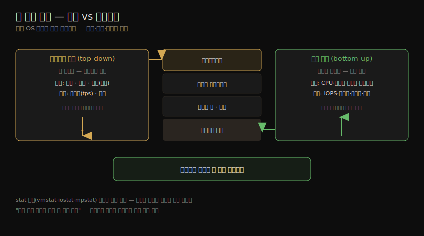

# 방법론 (1) — 용어·모델·핵심 개념
---
> 이 노트는 2장의 첫 부분(배경)으로, 책 나머지 전체가 *전제 지식* 으로 깔고 가는 용어·모델·개념을 잡습니다. 저자는 2장을 "초판 이후 가장 적게 바뀐 장 — 소프트웨어·하드웨어·도구·튜너블은 다 바뀌었지만 이론과 방법론은 그대로인 durable skills"라 부릅니다. 여기서는 IOPS·지연·사용률·포화 같은 핵심 용어, 시스템·큐잉 모델, 그리고 지연·시간 스케일·트레이드오프·확장성·캐싱 등 14가지 개념과 두 분석 관점을 봅니다.

저자가 주니어 시스템 관리자로 출발했을 때, man page를 처음부터 끝까지 읽으며 page fault·context switch 정의는 외웠지만 *그것으로 무엇을 할지* — 신호에서 해결로 가는 길 — 는 몰랐다고 합니다. 선임들에게 있던 그 노하우가 man page엔 없었고, 보통 어깨너머로 배워야 했습니다. 2장 전체는 그 노하우를 글로 옮긴 것이고, 이 노트는 그 노하우가 딛고 설 *공통 어휘와 멘탈 모델* 입니다.

뒤따르는 02-02 가 *방법론* (USE·RED·드릴다운 등)을, 02-03 이 *모델링·통계·시각화* 를 다룹니다. 이 노트의 개념을 모르면 그 둘을 읽기 어렵습니다.


## 1. 핵심 용어

> 시스템 성능의 기본 어휘입니다. 뒤 장들이 같은 단어를 문맥마다 다시 정의하므로, 여기서 표준 뜻을 먼저 잡아 둡니다.

| 용어 | 뜻 |
|------|-----|
| IOPS | 초당 입출력 연산 수. 디스크 I/O라면 초당 읽기·쓰기 |
| 처리량(throughput) | 수행된 일의 속도. 통신에선 데이터율(bytes/s·bits/s), DB 등에선 연산율(ops/s·tps) |
| 응답 시간(response time) | 한 연산이 완료되기까지의 시간. *대기 + 서비스(service time) + 결과 전송* 을 모두 포함 |
| 지연(latency) | 연산이 서비스되기를 *기다린* 시간. 문맥에 따라 응답 시간 전체를 뜻하기도 함 |
| 사용률(utilization) | 요청을 처리하는 자원이 얼마나 바쁜지(시간 기반). 저장 자원이라면 소비된 용량(예: 메모리 사용률) |
| 포화(saturation) | 자원이 처리하지 못해 *큐에 쌓인* 일의 정도 |
| 병목(bottleneck) | 시스템 성능을 제한하는 자원. 병목 식별·제거가 시스템 성능의 핵심 활동 |
| 워크로드(workload) | 시스템에 가해지는 입력·부하. DB라면 클라이언트가 보낸 쿼리·명령 |
| 캐시(cache) | 느린 계층 대신 쓰는 빠른 저장 영역. 제한된 데이터를 복제·버퍼링해 성능을 높임(경제적 이유로 보통 더 작음) |


## 2. 두 가지 모델

> 단순한 두 모델이 시스템 성능의 기본 원리를 보여 줍니다. 테스트 대상 시스템(SUT)은 교란(perturbation)에 취약하고, 많은 구성 요소는 큐잉 시스템으로 모델링할 수 있습니다.

#### 테스트 대상 시스템(SUT)

테스트 대상 시스템(System Under Test)의 성능은 *교란(interference)* 에 영향받습니다. 예약된 시스템 작업, 다른 사용자, 다른 워크로드가 교란원이며, 그 출처가 분명하지 않을 때가 많습니다. 특히 클라우드에서는 물리 호스트의 다른 게스트 테넌트 활동이 내 게스트 SUT 안에서 *관측조차 안 될* 수 있어 어렵습니다. 또 현대 환경은 로드밸런서·프록시·웹·캐시·앱·DB·스토리지 등 여러 네트워크 구성 요소로 입력 워크로드를 처리하므로, 환경을 *지도로 그리는 행위만으로도* 간과됐던 교란원이 드러나기도 합니다.

#### 큐잉 시스템(queueing system)

일부 구성 요소·자원은 큐잉 시스템으로 모델링해 상황별 성능을 예측할 수 있습니다. 디스크가 대표적으로, 부하에 따라 응답 시간이 어떻게 나빠지는지를 예측합니다. 큐잉 시스템과 그 네트워크를 연구하는 분야가 *큐잉 이론* 입니다(02-03 §모델링).


## 3. 지연 — 시간 기반 지표의 힘

> 지연은 시간 기반 지표라 계산이 가능합니다. 같은 단위(시간)로 표현되므로 이슈를 정량화해 순위 매기고, speedup도 추정할 수 있습니다. IOPS로는 불가능한 일입니다.

어떤 환경은 지연이 성능의 유일한 초점이고, 다른 환경은 처리량과 함께 한두 개의 핵심 지표입니다. 지연은 연산이 수행되기 *전에 기다린* 시간이며, 응답 시간은 이 지연과 연산 시간을 함께 아우릅니다.

지연은 측정 위치에 따라 달라 *측정 대상* 과 함께 표현됩니다. 웹사이트 로드 시간은 위치가 다른 세 시간 — DNS 지연(DNS 연산 전체)·TCP 연결 지연(핸드셰이크 초기화만)·TCP 데이터 전송 시간 — 으로 나뉩니다. 더 높은 수준에선 이 셋을 합쳐 또 다른 무엇의 "지연"으로 부르기도 합니다(클릭부터 페이지 완성까지). "지연"이라는 한 단어는 모호하므로, 요청 지연·TCP 연결 지연처럼 한정어를 붙이는 게 좋습니다.

지연이 강한 까닭은 *계산이 가능* 하기 때문입니다. 같은 단위(시간)로 표현되니 이슈를 정량화해 순위 매기고, 줄이거나 없앨 때의 speedup도 추정할 수 있습니다. IOPS 지표로는 정확히 못 합니다. 다른 지표를 가능한 한 *지연이나 시간으로 환산* 하면 비교가 됩니다. "네트워크 I/O 100건 vs 디스크 I/O 50건" 중 무엇이 빠른지는 홉 수·드롭률·I/O 크기·랜덤/순차·디스크 종류 등 변수가 많아 답하기 복잡하지만, "총 네트워크 I/O 100ms vs 총 디스크 I/O 50ms"라면 차이가 분명합니다.


## 4. 시간 스케일 — 나노초의 감각

> 시스템 구성 요소는 자릿수가 다른 시간 스케일에서 동작합니다. CPU 사이클(0.3ns)을 1초로 환산하면 메인 메모리 접근은 6분, 회전 디스크 I/O는 1~12개월, 물리 재부팅은 3만 2천 년이 됩니다.

시간을 숫자로 비교할 수 있어도, 출처별 지연에 대한 *감각* 을 갖는 게 도움이 됩니다. 구성 요소들은 자릿수(orders of magnitude)가 다른 시간 스케일에서 동작해, 그 차이가 얼마나 큰지 가늠하기 어렵습니다. 3.5GHz CPU의 1 사이클(실제 0.3ns)을 *1초* 로 환산한 가상 시스템으로 그 차이를 드러내면 다음과 같습니다.

| 이벤트 | 실제 지연 | 1사이클=1초로 환산 |
|--------|----------|-------------------|
| CPU 1 사이클 | 0.3 ns | 1 초 |
| L1 캐시 접근 | 0.9 ns | 3 초 |
| L2 캐시 접근 | 3 ns | 10 초 |
| L3 캐시 접근 | 10 ns | 33 초 |
| 메인 메모리 접근(DRAM) | 100 ns | 6 분 |
| SSD I/O(플래시) | 10~100 μs | 9~90 시간 |
| 회전 디스크 I/O | 1~10 ms | 1~12 개월 |
| 인터넷: 샌프란시스코→뉴욕 | 40 ms | 4 년 |
| 인터넷: 샌프란시스코→호주 | 183 ms | 19 년 |
| OS 가상화 부팅 | < 1 s | 105 년 |
| SCSI 명령 타임아웃 | 30 s | 3천 년 |
| 물리 시스템 재부팅 | 5 m | 3만 2천 년 |

> 빛이 0.5m(눈에서 이 페이지까지쯤)를 가는 데 약 1.7ns가 걸리는데, 그동안 현대 CPU는 다섯 사이클을 실행하고 여러 명령을 처리합니다. CPU 사이클의 시간 스케일이 그만큼 작습니다.


## 5. 트레이드오프와 튜닝

> 성능엔 흔한 트레이드오프가 있습니다(good/fast/cheap 중 둘). 튜닝은 *일이 수행되는 곳에 가장 가까이서* 할 때 가장 효과적이라, 보통 애플리케이션 수준이 가장 큰 이득(예: 20배)을 줍니다.

#### 흔한 트레이드오프

"좋게·빠르게·싸게(good/fast/cheap)" 중 둘만 고르는 트레이드오프가 대표적입니다. 많은 IT 프로젝트가 *제때·저렴하게* 를 골라 성능을 나중으로 미루는데, 앞선 결정(나쁜 스토리지 아키텍처·비효율 언어/OS·분석 도구 없는 부품)이 개선을 막으면 문제가 됩니다. CPU와 메모리도 트레이드 관계입니다 — 메모리로 결과를 캐싱해 CPU를 아끼거나, 반대로 CPU로 데이터를 압축해 메모리를 아낍니다. 튜너블 파라미터에도 트레이드오프가 따릅니다.

| 튜너블 | 작게 | 크게 |
|--------|------|------|
| 파일시스템 레코드 크기 | 랜덤 I/O·캐시 효율↑ | 스트리밍·백업↑ |
| 네트워크 버퍼 크기 | 연결당 메모리↓·확장성↑ | 처리량↑ |

#### 튜닝은 일에 가까이서

성능 튜닝은 *일이 수행되는 곳에 가장 가까이서* 할 때 가장 효과적입니다. 앱 주도 워크로드라면 앱 안에서입니다. 애플리케이션 수준에서 튜닝하면 DB 쿼리를 없애 큰 폭(예: 20배)으로 개선할 수 있지만, 스토리지 장치 수준 튜닝은 이미 상위 OS 스택 코드를 실행한 *세금* 을 낸 뒤라 결과 앱 성능이 퍼센트(예: 20%) 단위로만 나아집니다.

| 계층 | 튜닝 대상 예 |
|------|------------|
| 애플리케이션 | 앱 로직, 요청 큐 크기, 수행 DB 쿼리 |
| 데이터베이스 | 테이블 레이아웃, 인덱스, 버퍼링 |
| 시스템 콜 | mmap vs read/write, sync/async I/O 플래그 |
| 파일시스템 | 레코드 크기, 캐시 크기, 저널링 |
| 스토리지 | RAID 레벨, 디스크 수·종류 |

> 다만 튜닝하기 좋은 곳이 *관측하기 좋은 곳* 과 같진 않습니다. 느린 쿼리는 on-CPU 시간이나 그것이 일으킨 파일시스템·디스크 I/O로 가장 잘 이해되며, 이는 OS 도구로 관측됩니다. 빠르게 바뀌는 앱 환경(주·일 단위 배포)에서는 OS 튜닝·관측을 간과하기 쉬운데, OS 성능 분석이 OS 이슈뿐 아니라 *앱 수준 이슈* 도 — 때로는 앱에서보다 쉽게 — 짚어 낸다는 점을 기억해야 합니다.


## 6. 적절성의 수준과 멈출 때

> 조직마다 성능 요구가 다르며, 옳고 그름이 아니라 ROI 문제입니다. 분석을 *언제 멈출지* 도 중요합니다 — 문제의 대부분을 설명했거나, ROI가 분석 비용보다 작거나, 다른 곳에 더 큰 ROI가 있을 때입니다.

#### 적절성의 수준(level of appropriateness)

큰 데이터센터·클라우드는 커널 내부·CPU 카운터까지 분석하는 성능 팀을 두고 미래 성장을 모델링합니다. 연 수백만을 컴퓨팅에 쓰는 환경이라면 그 팀이 찾는 이득이 곧 ROI라 정당화됩니다. 반면 작은 스타트업은 표면적 점검만 하고 서드파티 모니터링에 맡깁니다. 어느 쪽이 옳고 그른 게 아니라 *성능 전문성의 ROI* 에 달린 문제입니다. 다만 성능은 비용만이 아니라 *사용자 경험* 이기도 해서, 스타트업도 지연 개선에 투자할 이유가 있습니다 — 이때 ROI는 비용 절감이 아니라 *떠나지 않는 고객* 입니다. 극단적으로 증권 거래소·고빈도 트레이더는 6ms를 줄이려 3억 달러짜리 대서양 횡단 케이블을 깔 만큼 지연이 결정적입니다.

#### 분석을 언제 멈추나

도구도 볼 것도 많아 *멈출 때* 를 아는 게 도전입니다. 저자가 든 세 시나리오입니다.

1. **문제의 대부분을 설명했을 때.** 3배 느려진 Java 앱에서 첫 원인(예외 스택)이 전체 CPU의 12%뿐이라 멈출 수 없었습니다 — 66%에 가까웠다면 3배 둔화가 설명되니 멈췄을 것입니다.
2. **잠재 ROI가 분석 비용보다 작을 때.** 연 수천만 달러 이득이면 몇 달을 써도 정당하지만, 작은 마이크로서비스의 수백 달러짜리 이득엔 한 시간도 아까울 수 있습니다.
3. **다른 곳에 더 큰 ROI가 있을 때.** 앞 둘이 충족돼도 우선순위가 더 높은 곳이 있으면 그쪽으로.

#### 시점 한정 권고(point-in-time recommendation)

환경은 사용자·하드웨어·소프트웨어가 더해지며 바뀝니다. 10Gbit/s에 묶였던 환경이 100Gbit/s로 올린 뒤 디스크·CPU 병목을 겪는 식입니다. 성능 권고, 특히 튜너블 값은 *특정 시점에만* 유효합니다. 인터넷에서 찾은 튜너블 값은 빠른 이득을 줄 때도 있지만, 내 시스템·워크로드에 안 맞거나·한때 맞았으나 지금은 아니거나·이후 버전에서 제대로 고쳐진 버그의 임시 우회였다면 성능을 망칩니다. 남의 약장을 뒤져 안 맞거나 만료된 약을 먹는 것과 같습니다. 튜너블을 바꿀 땐 *상세 이력과 함께 버전 관리* 에 저장하는 게 좋습니다.


## 7. 부하 vs 아키텍처

> 앱이 느린 원인은 둘로 갈립니다. 아키텍처·구현 문제이거나, 단순히 *부하가 너무 많아서* 큐잉과 긴 지연이 생긴 것입니다. 둘을 구분해야 대응이 갈립니다.

앱은 실행되는 소프트웨어 설정·하드웨어 — 아키텍처와 구현 — 때문에 느릴 수도, *단순히 부하가 너무 많아* 큐잉·긴 지연이 생겨 느릴 수도 있습니다. 아키텍처 분석에서 일은 큐잉되는데 수행 방식엔 문제가 없다면, 부하가 과한 것이고, 클라우드라면 이 지점에서 인스턴스를 더 띄웁니다.

| 구분 | 예 |
|------|-----|
| 아키텍처 문제 | 단일 스레드 앱이 한 CPU만 바쁘고 다른 CPU는 유휴인데 요청이 큐잉 / 단일 락 경합으로 한 스레드만 전진 |
| 부하 문제 | 멀티스레드 앱이 *모든* CPU를 다 쓰는데도 요청이 큐잉 — CPU 용량이 한계 |


## 8. 확장성 — knee point

> 확장성은 부하 증가에 따른 성능입니다. 어느 지점까지 선형이다가, 자원 경합이 시작되는 knee point를 지나면 처리량 증가가 꺾이고 결국 떨어집니다. 응답 시간은 그 지점부터 빠르게(메모리) 또는 느리게(CPU) 나빠집니다.

부하 증가에 따른 시스템의 성능이 *확장성(scalability)* 입니다. 처리량은 한동안 선형으로 늘다가, 자원 경합이 처리량을 깎기 시작하는 **knee point**(두 함수의 경계)를 지나면 선형에서 벗어납니다. 경합·일관성(coherency) 오버헤드가 커지면 결국 완료되는 일이 줄어 처리량이 *감소* 합니다. 이 지점은 한 구성 요소가 100% 사용률(포화점)에 닿거나, 그에 근접해 큐잉이 잦고 커질 때 옵니다.

응답 시간(지연)의 악화 양상은 두 가지입니다. **빠른(fast)** 악화는 메모리 부하에서 — 시스템이 메인 메모리를 비우려 페이지를 디스크로 옮길 때 — 나타나고, **느린(slow)** 악화는 CPU 부하에서 나타납니다. 디스크 I/O도 빠른 악화의 예로, 유휴 회전 디스크는 약 1ms로 응답하다 부하가 늘면 10ms에 근접합니다(02-03 큐잉 이론 M/D/1·60% 사용률). 자원이 없을 때 큐잉 대신 *에러를 반환* 하면(예: 웹서버가 503) 응답 시간은 선형으로 유지될 수 있습니다.


## 9. 사용률과 포화 — 100% busy ≠ 100% capacity

> 사용률은 두 정의가 있습니다. 시간 기반(busy %, U=B/T)과 용량 기반입니다. 100% busy가 100% 용량은 아닙니다 — 엘리베이터나 스토리지 어레이는 100% 바빠도 일을 더 받을 수 있습니다. 포화는 처리 못 해 큐에 쌓인 정도입니다.

#### 사용률의 두 정의

**시간 기반** 사용률은 큐잉 이론의 정의로, 관측 기간 T 중 자원이 바빴던 비율입니다(`U = B/T`). `iostat(1)` 의 `%b`(percent busy)가 이것입니다. 100%에 근접하면 경합으로 성능이 크게 나빠질 수 있습니다. **용량 기반** 사용률은 용량 계획의 정의로, 낼 수 있는 처리량 중 얼마를 쓰는지입니다.

핵심은 **100% busy가 100% capacity는 아니라는** 것입니다. 엘리베이터는 층 사이를 움직이면(100% 바쁨) 더 못 받을 것 같지만 승객을 더 태울 수 있고, 100% 바쁜 디스크도 쓰기를 온디스크 캐시에 버퍼링해 더 받을 수 있습니다. 스토리지 어레이는 디스크 하나가 늘 100%라 흔히 100% 사용률로 보이지만, 유휴 디스크가 많아 일을 더 받습니다. 이 책에서 사용률은 보통 *시간 기반*(non-idle time)을 뜻하고, 메모리 사용량 같은 용량 기반 지표에만 용량 정의를 씁니다.

#### 포화(saturation)

자원이 처리할 수 있는 것보다 더 많은 일이 요청된 정도가 포화입니다. (용량 기반) 100% 사용률에서 시작되며, 더 받지 못한 일이 큐에 쌓입니다. *어떤 정도의 포화든* 성능 문제입니다 — 기다리는 시간(지연)이 생기기 때문입니다. 단 시간 기반 사용률(busy %)에서는 자원의 병렬 처리 정도에 따라 100%가 아니어도 포화가 시작될 수 있습니다.


## 10. 프로파일링·캐싱·known-unknowns

> 프로파일링은 표집으로 거친 그림을 그리고, 캐싱은 빠른 계층에 결과를 저장해 성능을 높입니다. 캐시 성능은 적중률(hit ratio)과 미스율(miss rate)로 보며, 적중률은 비선형이라 98%→99%가 10%→11%보다 훨씬 큽니다.

#### 프로파일링과 캐싱

프로파일링은 일정 간격으로 상태를 표집해 대상의 거친 그림을 그립니다(예: CPU instruction pointer·스택 표집). 캐싱은 느린 계층의 결과를 빠른 계층에 저장하며(예: 디스크 블록을 RAM에), CPU의 L1·L2·L3처럼 여러 계층으로 쌓입니다 — 작고 빠른 L1에서 크고 느린 쪽으로, 밀도와 지연의 경제적 트레이드오프입니다.

캐시 성능 지표는 둘입니다.

```
적중률(hit ratio) = hits / (hits + misses)
```

적중률은 **비선형** 입니다. 98%와 99%의 성능 차가 10%와 11%의 차보다 훨씬 큽니다 — 적중·미스의 두 계층 속도 차 때문이라, 차가 클수록 기울기가 가팔라집니다. 다른 지표는 **미스율(miss rate, 초당 미스 수)** 로, 미스당 페널티에 *비례(선형)* 해 해석이 쉽습니다. 적중률만으론 오해할 수 있습니다 — 워크로드 A(적중률 90%, 미스율 200/s)와 B(80%, 20/s)에서 적중률은 A가 낫지만 B가 디스크 읽기를 10배 적게 해 더 빨리 끝날 수 있습니다. 총 실행 시간 `(적중률×적중지연)+(미스율×미스지연)` 으로 확인합니다.

캐시 관리 정책엔 MRU·LRU·MFU·LFU·NFU 등이 있고, 캐시 상태는 cold(빈/적중률 0)·warm(유용하나 미흡)·hot(자주 쓰는 데이터·높은 적중률, 예 99%+)로 나뉩니다. 캐시는 cold로 시작해 데워지며, 크거나 다음 계층이 느리면 데우는 데 오래 걸립니다.

#### known-unknowns

서장의 화두를 성능에 적용하면 셋으로 나뉩니다.

| 구분 | 뜻 | 예 |
|------|-----|-----|
| known-knowns | 아는 줄 아는 것 | CPU 사용률을 봐야 함을 알고, 값이 평균 10%임도 안다 |
| known-unknowns | 모르는 줄 아는 것 | 프로파일링으로 CPU를 누가 바쁘게 하는지 볼 수 있음을 알지만 아직 안 봤다 |
| unknown-unknowns | 모르는 줄도 모르는 것 | 장치 인터럽트가 무거운 CPU 소비자가 될 수 있음을 몰라 점검조차 안 한다 |

> "더 알수록 모르는 게 더 많아진다(the more you know, the more you don't know)"는 게 성능 분야입니다. 시스템을 배울수록 unknown-unknowns를 더 인식하게 되고, 그것이 점검 가능한 known-unknowns로 바뀝니다.


## 11. 두 분석 관점 — top-down vs bottom-up

> 성능 분석엔 두 관점이 있습니다. 자원 분석(resource analysis)은 시스템 관리자가 자원에서 위로(bottom-up), 워크로드 분석(workload analysis)은 개발자가 워크로드에서 아래로(top-down) OS 스택을 봅니다. 청중·지표·접근이 다릅니다.

두 관점의 자리와 각각에 잘 맞는 지표를 한 장으로 정리하면 다음과 같습니다.



| 관점 | 주 청중 | 방향 | 대상 | 잘 맞는 지표 |
|------|--------|------|------|-------------|
| 자원 분석 | 시스템 관리자(물리 자원 담당) | bottom-up | CPU·메모리·디스크·네트워크·버스·인터커넥트 | IOPS·처리량·사용률·포화 |
| 워크로드 분석 | 앱 개발자·지원(앱 담당) | top-down | 요청·지연·완료(에러) | 처리량(tps)·지연 |

**자원 분석** 은 자원이 한계에 닿거나 근접하는지를 *사용률* 중심으로 봅니다. 성능 이슈 조사(어느 자원이 원인인지)와 용량 계획에 쓰입니다. CPU처럼 사용률 지표가 바로 있는 자원도, 네트워크처럼 송수신 Mbps를 최대 대역폭과 비교해 추정하는 자원도 있습니다. 흔히 보는 stat 도구(vmstat·iostat·mpstat) 문서가 이 관점인데, 이것이 *유일한* 관점이 아님을 알고 읽어야 합니다.

**워크로드 분석** 은 가해진 워크로드와 앱의 반응을 봅니다. 요청 속성을 점검·요약하는 *워크로드 특성 파악*(02-02)으로 불필요·불균형한 일을 찾고("가장 빠른 쿼리는 아예 안 하는 쿼리"), 지연(응답 시간)으로 성능을 표현합니다(MySQL=쿼리 지연, Apache=HTTP 요청 지연). 출발점이 *애플리케이션* 이라, 지연을 파고들며 라이브러리·시스템 콜·커널로 내려갑니다. 완료(에러) 상태도 봅니다 — 요청이 빨리 끝나도 에러로 재시도되면 지연이 쌓이기 때문입니다.


## 학습 점검

> 이 노트의 핵심을 스스로 떠올려 봅니다. 답이 막히면 해당 섹션으로 돌아가 확인합니다.

- 응답 시간·지연·서비스 시간의 관계를 한 문장으로 설명해 봅니다. (→ §1, §3)
- CPU 1사이클을 1초로 환산했을 때 메인 메모리 접근·회전 디스크 I/O가 각각 얼마가 되는지, 이 환산이 왜 유용한지 말해 봅니다. (→ §4)
- 튜닝이 "일에 가까이서" 할 때 왜 더 효과적인지(앱 20배 vs 스토리지 20%)를 설명해 봅니다. (→ §5)
- 분석을 멈출 세 시나리오와, 12% vs 66% 예가 왜 멈춤 판단을 가르는지 떠올려 봅니다. (→ §6)
- "100% busy ≠ 100% capacity"를 엘리베이터·스토리지 어레이 예로 설명하고, 포화가 왜 어떤 정도든 문제인지 말해 봅니다. (→ §9)
- 캐시 적중률이 비선형인 이유(98%→99% vs 10%→11%)와, 적중률만으론 오해할 수 있어 미스율을 함께 보는 까닭을 설명해 봅니다. (→ §10)
- 자원 분석과 워크로드 분석의 방향(bottom-up·top-down)·청중·지표 차이를 말해 봅니다. (→ §11)
