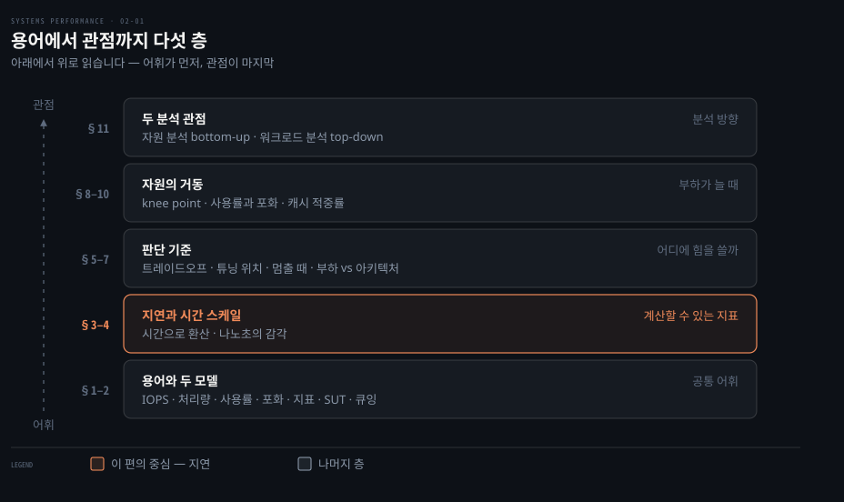
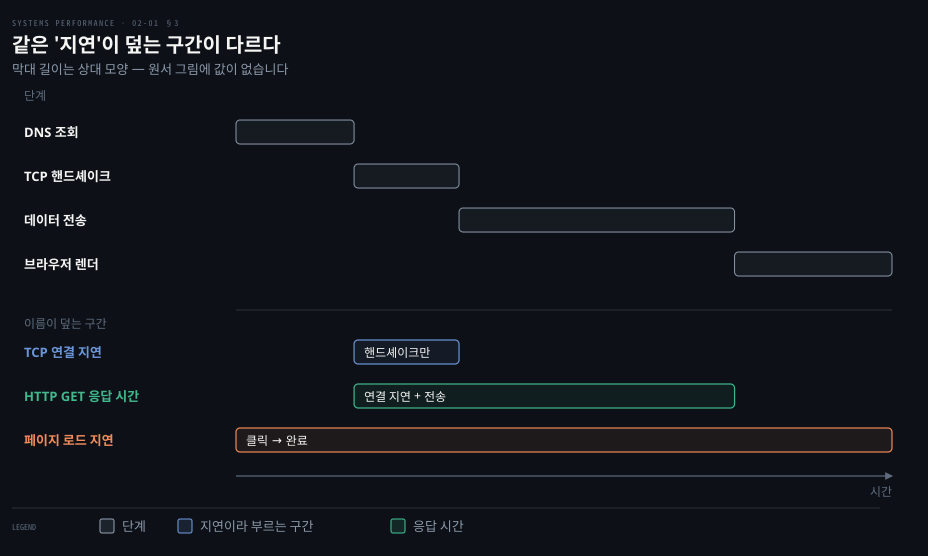
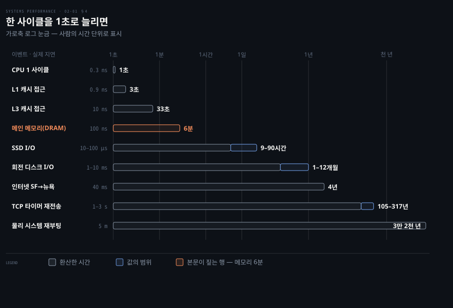
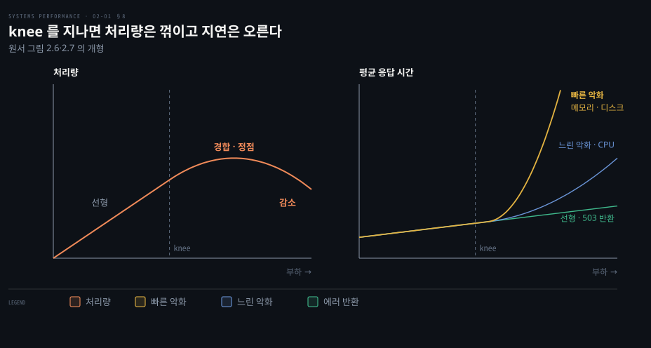
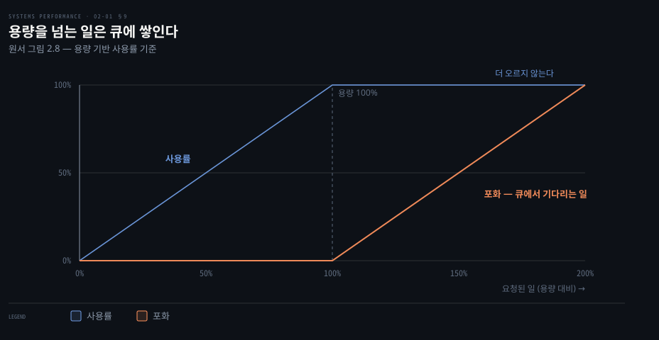
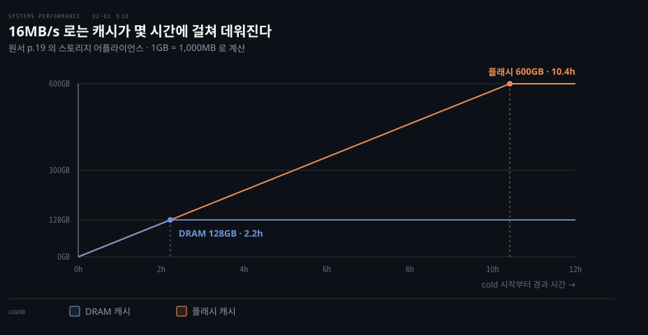
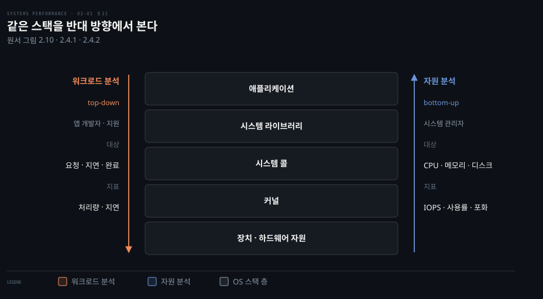

# 방법론 — 용어·모델·핵심 개념
---
> 이 노트는 원서 2장의 배경(2.1~2.4)을 다룹니다. 책 나머지가 전제로 깔고 가는 용어·모델·개념 14가지와 두 분석 관점을 잡습니다.

## 핵심 요약

> 이 편이 붙든 생각은 하나입니다. 성능 분석은 시간으로 잴 수 있는 공통 어휘에서 시작합니다.

저자는 주니어 시스템 관리자 시절 man page를 처음부터 끝까지 읽었다고 회고합니다. page fault(메모리에 없는 페이지를 건드려 커널이 채우는 일)나 context switch(CPU가 실행하던 스레드를 다른 스레드로 바꾸는 일)의 정의는 외웠습니다. 하지만 그 지표로 무엇을 할지는 알지 못했습니다. 신호에서 해결로 가는 길이 man page에는 나타나지 않습니다. 두 용어는 3장에서 문맥 교환은 03-01, 페이지 폴트는 03-02가 각각 다룹니다.

선임들에게는 그 노하우가 있었고 보통 어깨너머로 배워야 했습니다. 2장은 그 노하우를 글로 옮긴 장입니다. 이 편은 노하우가 딛고 설 어휘를 뜻합니다.

어휘의 중심은 지연입니다. 지연은 시간 단위라 서로 더하고 비교할 수 있어서 이슈에 순위를 매기고 개선 폭을 미리 계산할 수 있습니다. IOPS 같은 개수 지표로는 이 계산이 안 됩니다. 사용률과 포화는 자원이 얼마나 바쁜지와 얼마나 밀렸는지를 나눠 보는 두 눈금을 뜻합니다.

저자는 2장을 초판 이후 가장 적게 바뀐 장이라 부릅니다. 소프트웨어와 하드웨어, 도구, 튜너블은 다 바뀌었습니다. 하지만 이론과 방법론은 그대로인 지속 기술(durable skills)이라는 뜻입니다. 뒤따르는 02-02가 방법론을 짚어 줍니다. 02-03이 모델링과 통계, 시각화를 다루며 둘 다 이 편의 어휘를 전제로 씁니다.


## 학습 목표

> 이 편을 덮은 뒤 스스로 할 수 있어야 하는 일을 먼저 적어 둡니다.

1. 응답 시간·지연·서비스 시간을 구분하고, 지연을 시간으로 환산해 두 이슈의 크기를 비교합니다.
2. CPU 사이클을 1초로 늘린 시간 스케일로 메모리·디스크·네트워크 지연의 자릿수 차이를 설명합니다.
3. 튜닝을 일에 가까운 곳에서 해야 하는 이유와 분석을 멈출 세 조건을 판단 근거와 함께 댑니다.
4. 시간 기반 사용률과 용량 기반 사용률을 구분하고, 포화가 어느 정도든 문제인 까닭을 설명합니다.
5. 캐시 적중률이 비선형인 이유와 미스율을 함께 봐야 하는 경우를 판단하고, 자원 분석과 워크로드 분석의 방향을 구분합니다.

아래는 이 편 전체를 다섯 층으로 쌓은 지도입니다. 아래층의 어휘가 위층 개념을 받치고, 맨 위 두 관점이 그 개념을 실제 분석 방향으로 묶습니다. 층마다 붙은 절 번호가 본문에서 그 내용을 다루는 곳입니다.




## 이 문서가 다루지 않는 것

> 앞뒤 편으로 넘긴 주제를 밝혀 둡니다.

- 분석 방법론 20종(USE와 RED, 워크로드 특성 파악, 드릴다운 등)은 02-02에서 설명합니다.
- 큐잉 이론의 계산과 확장성 모델(Amdahl과 USL), 통계와 시각화는 02-03에서 알아봅니다.
- 자원별 지표의 실제 이름과 도구는 6~10장에 있는 자원별 방법론 절이 다룹니다.


## 1. 핵심 용어

> 뒤 장들은 같은 단어를 문맥마다 다시 정의합니다. 여기서 표준 뜻을 먼저 잡아 두면 그 변주를 따라갈 수 있습니다.

| 용어 | 뜻 |
|------|-----|
| IOPS | 초당 입출력 연산 수. 디스크 I/O라면 초당 읽기·쓰기 |
| 처리량(throughput) | 수행된 일의 속도. 통신에선 데이터율(bytes/s·bits/s), DB 등에선 연산율(ops/s·tps) |
| 응답 시간(response time) | 한 연산이 완료되기까지의 시간. *대기 + 서비스(service time) + 결과 전송* 을 모두 포함 |
| 지연(latency) | 연산이 서비스되기를 *기다린* 시간. 문맥에 따라 응답 시간 전체를 뜻하기도 함 |
| 사용률(utilization) | 요청을 처리하는 자원이 얼마나 바쁜지(시간 기반). 저장 자원이라면 소비된 용량(예: 메모리 사용률) |
| 포화(saturation) | 자원이 처리하지 못해 *큐에 쌓인* 일의 정도 |
| 병목(bottleneck) | 시스템 성능을 제한하는 자원. 병목 식별·제거가 시스템 성능의 핵심 활동 |
| 워크로드(workload) | 시스템에 가해지는 입력·부하. DB라면 클라이언트가 보낸 쿼리·명령 |
| 캐시(cache) | 느린 계층 대신 쓰는 빠른 저장 영역. 제한된 데이터를 복제·버퍼링해 성능을 높임(경제적 이유로 보통 더 작음) |

원서는 더 많은 용어를 책 끝에 있는 용어집(Glossary)에 모아 두었습니다(p.3).

### 지표 — 공짜가 아니고 틀릴 수도 있다

용어를 알아도 그 값을 어디서 얻는지가 남습니다. 원서 2.3.10(p.14)은 성능 지표(metrics)를 관심 있는 활동을 재는 통계로 정의합니다. 이 통계를 만드는 곳으로는 시스템과 애플리케이션, 추가 도구를 꼽습니다. 흔한 유형으로는 처리량과 IOPS, 사용률, 지연이 있습니다. 처리량 단위는 문맥에 따라 다릅니다. DB 처리량은 보통 초당 쿼리나 요청 수입니다. 네트워크 처리량은 초당 비트나 바이트 수로 나타냅니다.

값을 모으고 저장하려면 어딘가에서 CPU 사이클을 써야 합니다. 따라서 지표는 공짜가 아닙니다. 측정 작업의 오버헤드가 대상의 성능을 깎을 수 있습니다. 이것을 **관찰자 효과(observer effect)** 라 부릅니다. 원서는 이 효과가 하이젠베르크의 불확정성 원리와 자주 혼동된다고 짚습니다. 불확정성 원리는 위치와 운동량을 동시에 정밀하게 알 수 없다는 내용입니다.

지표는 틀릴 수도 있습니다. 벤더가 좋은 지표를 빠짐없이 보여 줄 거라 가정하기 쉽습니다. 하지만 실제 지표는 헷갈리고 복잡합니다. 부정확하거나 버그 탓에 아예 틀리기도 합니다. 한 버전에서 맞던 지표가 새 코드 경로를 반영하지 못해서 틀어지는 일도 생깁니다. 지표 자체가 가진 문제는 4장 4.6 "관측의 관측"이 이어서 다룹니다.


## 2. 두 가지 모델

> 테스트 대상 시스템(SUT)은 교란에 취약하고, 많은 구성 요소는 큐잉 시스템으로 모델링할 수 있습니다. 두 단순한 모델이 이 두 원리를 보여 줍니다.

### 테스트 대상 시스템(SUT)

테스트 대상 시스템(System Under Test)의 성능은 *교란(perturbation)* 에 영향을 받습니다. 예약된 시스템 작업과 다른 사용자, 다른 워크로드가 대표적인 교란원입니다. 이런 교란원의 출처는 분명하지 않을 때가 많습니다. 특히 클라우드에서는 다른 게스트 테넌트 활동이 물리 호스트에서 일어납니다. 이는 내 게스트 SUT 안에서 관측조차 안 될 수 있어서 파악하기 어렵습니다.

현대 환경은 로드밸런서와 프록시, 웹, 캐시, 앱, DB, 스토리지 같은 여러 네트워크 구성 요소로 입력 워크로드를 처리합니다. 따라서 환경을 지도로 그리는 행위만으로도 간과됐던 교란원이 드러나기도 합니다. 원서는 이런 환경 전체를 큐잉 시스템의 네트워크로 모델링해서 분석할 수도 있다고 덧붙입니다(p.3).

### 큐잉 시스템(queueing system)

일부 구성 요소나 자원은 큐잉 시스템으로 모델링해서 상황별 성능을 예측할 수 있습니다. 디스크가 대표적입니다. 부하에 따라 응답 시간이 어떻게 나빠지는지를 예측합니다. 큐잉 시스템과 그 네트워크를 연구하는 분야가 *큐잉 이론* 입니다(02-03 §3).


## 3. 지연 — 시간 기반 지표의 힘

> 지연은 시간 단위라 계산이 가능합니다. 이슈를 같은 단위로 정량화해 순위 매기고, 줄였을 때의 speedup 도 추정할 수 있습니다.

"지연이 늘었다"는 보고를 받으면 먼저 어느 구간의 지연인지부터 물어야 합니다. 같은 단어가 측정 위치에 따라 다른 구간을 가리키기 때문입니다. 어떤 환경에서는 지연이 성능을 파악하는 유일한 초점입니다. 다른 환경에서는 처리량과 함께 한두 개의 핵심 지표로 쓰입니다.

원서 그림 2.3(p.4)은 HTTP GET 같은 네트워크 전송을 예로 듭니다. 시스템은 데이터를 보내는 연산이 시작되기 전에 네트워크 연결이 맺어지기를 기다려야 합니다. 이 기다림이 그 연산의 지연입니다. 응답 시간은 이 지연과 연산 시간을 함께 덮습니다.

웹사이트 로드 시간은 위치가 다른 세 시간으로 나뉩니다. 첫째로 DNS 지연은 DNS 연산 전체를 뜻합니다. 둘째로 TCP 연결 지연은 핸드셰이크 초기화만 가리킵니다. 그다음이 TCP 데이터 전송 시간입니다. 더 높은 수준에서는 이 셋을 합칩니다. 즉 사용자가 링크를 클릭한 때부터 페이지가 다 그려질 때까지를 또 다른 "지연"으로 부르기도 합니다.



각 막대의 길이는 상대적인 비율을 나타낼 뿐 실제 값이 아닙니다. 같은 "지연"이라는 단어가 맨 아래 두 줄처럼 서로 다른 범위를 덮습니다. 따라서 요청 지연이나 TCP 연결 지연처럼 무엇을 쟀는지 한정어를 붙이는 편이 좋습니다.

지연 지표가 요긴한 까닭은 계산이 가능하기 때문입니다. 같은 시간 단위로 표현되니 이슈를 정량화해서 순위를 매깁니다. 또한 이슈를 줄이거나 없앨 때의 speedup 도 추정할 수 있습니다. 반면 IOPS 지표로는 이 일을 정확히 하지 못합니다.

다른 지표도 가능하면 지연이나 시간으로 환산해서 비교합니다. "네트워크 I/O 100건 vs 디스크 I/O 50건" 중 어느 쪽이 빠른지는 답하기 복잡합니다. 홉 수와 드롭률, 재전송, I/O 크기, 랜덤/순차, 디스크 종류 등 변수가 많기 때문입니다. 반면에 "총 네트워크 I/O 100ms vs 총 디스크 I/O 50ms"라면 차이가 분명합니다.

원서 표 2.1(p.5)은 시간 단위의 약어를 정리합니다. 다음 절에 나오는 표가 이 단위들을 오갑니다.

| 단위 | 약어 | 1초에 대한 비 |
|------|------|--------------|
| 분 | m | 60 |
| 초 | s | 1 |
| 밀리초 | ms | 10⁻³ |
| 마이크로초 | μs | 10⁻⁶ |
| 나노초 | ns | 10⁻⁹ |
| 피코초 | ps | 10⁻¹² |


## 4. 시간 스케일 — 나노초의 감각

> 구성 요소마다 동작하는 시간 스케일의 자릿수가 다릅니다. CPU 사이클(0.3ns)을 1초로 늘리면 메인 메모리 접근은 6분, 회전 디스크 I/O는 1~12개월, 물리 재부팅은 3만 2천 년이 됩니다.

시간을 숫자로 비교할 수 있어도 출처별 지연에 대한 감각을 갖는 게 도움이 됩니다. 각 구성 요소는 자릿수(orders of magnitude)가 다른 시간 스케일에서 동작합니다. 그래서 그 차이가 얼마나 큰지 가늠하기가 어렵습니다.

원서 표 2.2(p.6)는 3.5GHz 프로세서의 CPU 레지스터 접근에서 출발합니다. 실제로는 0.3ns 인 1 사이클을 1초로 늘린 가상 시스템으로 그 차이를 뚜렷하게 보여 줍니다. 표에 나오는 L1과 L2, L3 캐시는 CPU 안에 계층으로 붙은 캐시입니다. 이는 §10 에서 다시 다룹니다.

| 이벤트 | 실제 지연 | 1사이클=1초로 환산 |
|--------|----------|-------------------|
| CPU 1 사이클 | 0.3 ns | 1 초 |
| L1 캐시 접근 | 0.9 ns | 3 초 |
| L2 캐시 접근 | 3 ns | 10 초 |
| L3 캐시 접근 | 10 ns | 33 초 |
| 메인 메모리 접근(DRAM) | 100 ns | 6 분 |
| SSD I/O(플래시) | 10~100 μs | 9~90 시간 |
| 회전 디스크 I/O | 1~10 ms | 1~12 개월 |
| 인터넷: 샌프란시스코→뉴욕 | 40 ms | 4 년 |
| 인터넷: 샌프란시스코→영국 | 81 ms | 8 년 |
| 경량 하드웨어 가상화 부팅 | 100 ms | 11 년 |
| 인터넷: 샌프란시스코→호주 | 183 ms | 19 년 |
| OS 가상화 부팅 | < 1 s | 105 년 |
| TCP 타이머 기반 재전송 | 1~3 s | 105~317 년 |
| SCSI 명령 타임아웃 | 30 s | 3천 년 |
| 하드웨어 가상화 부팅 | 40 s | 4천 년 |
| 물리 시스템 재부팅 | 5 m | 3만 2천 년 |

표에 있는 숫자를 눈으로 훑으면 자릿수가 잘 느껴지지 않습니다. 같은 값을 로그 눈금 막대로 옮기면 느낌이 달라집니다. 한 눈금마다 열 배씩 멀어지는 거리가 막대 길이로 나타납니다.



캐시 세 단계와 메모리가 왼쪽 몇 눈금 안에 몰려 있습니다. 디스크와 네트워크는 거기서 다시 네다섯 자릿수를 건너뜁니다. 재부팅과 타임아웃은 그보다도 더 멉니다.

CPU 사이클의 시간 스케일은 그만큼 작습니다. 빛이 0.5m(눈에서 이 페이지까지쯤)를 가는 데 약 1.7ns 가 걸립니다. 그동안 현대 CPU는 다섯 사이클을 실행하고 여러 명령을 처리합니다. CPU 사이클과 지연은 6장, 디스크 I/O 지연은 9장, 인터넷 지연은 10장이 더 자세히 다룹니다.


## 5. 트레이드오프와 튜닝

> 성능에는 흔한 트레이드오프가 있습니다(good/fast/cheap 중 둘). 튜닝은 *일이 수행되는 곳에 가장 가까이서* 할 때 가장 효과적이라, 애플리케이션 수준에서 큰 이득(예: 20배)이 날 수 있습니다.

### 흔한 트레이드오프

"좋게·빠르게·싸게(good/fast/cheap)" 중 둘만 고르는 트레이드오프가 대표적입니다. 원서 그림 2.4(p.7)는 이를 IT 프로젝트 용어인 고성능과 제때, 저렴하게로 바꿔서 보여 줍니다. 많은 IT 프로젝트가 제때와 저렴하게를 골라서 성능을 나중으로 미룹니다.

앞선 결정이 나중의 개선을 막을 때 이 선택이 문제가 됩니다. 예를 들어 나쁜 스토리지 아키텍처를 골라 데이터를 채웠거나 비효율적으로 구현된 언어나 OS를 쓴 경우입니다. 성능 분석 도구가 없는 부품을 고른 경우도 마찬가지입니다.

CPU와 메모리도 트레이드 관계입니다. 메모리로 결과를 캐싱해서 CPU를 아낄 수 있습니다. 반대로 CPU가 넉넉한 현대 시스템에서는 CPU로 데이터를 압축해서 메모리를 아끼기도 합니다. 튜너블 파라미터에도 트레이드오프가 따릅니다.

| 튜너블 | 작게 | 크게 |
|--------|------|------|
| 파일시스템 레코드 크기 | 랜덤 I/O·캐시 효율↑ | 스트리밍·백업↑ |
| 네트워크 버퍼 크기 | 연결당 메모리↓·확장성↑ | 처리량↑ |

### 튜닝은 일에 가까이서

성능 튜닝은 일이 수행되는 곳에 가장 가까이서 할 때 가장 효과적입니다. 앱이 이끄는 워크로드라면 앱 안에서 튜닝해야 합니다. 애플리케이션 수준에서 튜닝하면 DB 쿼리를 없애거나 줄여서 큰 폭(예: 20배)으로 개선할 수 있습니다.

스토리지 장치 수준까지 내려가면 사정이 다릅니다. 스토리지 I/O를 없애거나 개선해도 이미 상위 OS 스택 코드를 실행한 세금을 낸 뒤입니다. 그래서 앱 성능은 퍼센트(예: 20%) 단위로만 나아질 수 있습니다.

| 계층 | 튜닝 대상 예 |
|------|------------|
| 애플리케이션 | 앱 로직, 요청 큐 크기, 수행 DB 쿼리 |
| 데이터베이스 | 테이블 레이아웃, 인덱스, 버퍼링 |
| 시스템 콜 | mmap vs read/write, sync/async I/O 플래그 |
| 파일시스템 | 레코드 크기, 캐시 크기, 저널링 |
| 스토리지 | RAID 레벨, 디스크 수·종류 |

표에 나온 세 용어를 짧게 풀면 이렇습니다. mmap 은 파일을 메모리에 매핑해서 읽는 방식입니다. 저널링은 쓰기 전에 기록을 남겨 두어서 장애 뒤에 복구하는 방식입니다. RAID 는 여러 디스크를 묶어서 하나처럼 쓰는 방식입니다. 차례로 7장 메모리와 8장 파일 시스템, 9장 디스크가 자세히 다룹니다.

앱 수준에서 큰 이득이 나는 데는 다른 이유도 있습니다. 요즘 환경은 기능을 빠르게 내보내려고 소프트웨어 변경을 주 단위나 일 단위로 프로덕션에 밀어 넣습니다. 원서는 하루에 여러 번 배포하는 Netflix 클라우드와 Shopify 를 예로 듭니다(p.9 각주 2). 그래서 개발과 테스트는 정확성에 집중합니다. 성능 측정과 최적화는 문제가 된 뒤로 미룹니다.

다만 튜닝하기 좋은 곳이 관측하기 좋은 곳과 같지는 않습니다. 느린 쿼리는 on-CPU 시간이나 그것이 일으킨 파일시스템, 디스크 I/O로 가장 잘 이해됩니다. 이는 OS 도구로 관측됩니다.

빠르게 바뀌는 앱 환경에서는 OS 튜닝과 OS 관측을 간과하기 쉽습니다. 원서는 OS 성능 분석이 OS 이슈뿐 아니라 앱 수준 이슈도 짚어 낸다는 점을 기억하라고 합니다. 이 과정이 때로는 앱만 볼 때보다 쉽기도 합니다.


## 6. 적절성의 수준과 멈출 때

> 조직마다 성능 요구가 다르며, 옳고 그름이 아니라 ROI 문제입니다. 분석을 *언제 멈출지* 도 같은 잣대로 정합니다.

### 적절성의 수준(level of appropriateness)

새 조직에 가 보면 내가 본 적 없을 만큼 깊게 분석하는 것이 일상일 수 있습니다. 반대로 내가 기본이라 여긴 분석이 그곳에서는 고급 기술이라서 한 번도 안 해 봤을 수도 있습니다. 원서는 후자를 "따기 쉬운 열매(low-hanging fruit)"가 남아 있는 좋은 소식이라 부릅니다.

큰 데이터센터나 클라우드는 커널 내부와 CPU 카운터까지 분석합니다. 또한 다양한 트레이싱 도구를 쓰는 성능 팀을 둡니다. 미래 성장을 공식 모델로 예측하기도 합니다. 연 수백만 달러를 컴퓨팅에 쓰는 환경이라면 그 팀이 찾는 이득이 곧 ROI라서 이런 작업이 정당화됩니다.

반면에 작은 스타트업은 표면적 점검만 하고 서드파티 모니터링에 맡깁니다. 어느 쪽이 옳고 그른 게 아니라 *성능 전문성의 ROI* 에 달린 문제입니다.

다만 성능은 비용만이 아니라 사용자 경험이기도 합니다. 그래서 스타트업도 지연 개선에 투자할 이유가 있습니다. 이때 ROI는 비용 절감이 아니라 떠나지 않는 고객을 뜻합니다. 극단적으로 증권 거래소나 고빈도 트레이더에게는 지연이 결정적입니다. 원서의 예로 뉴욕과 런던 거래소 사이 전송 지연을 6ms 줄이려고 3억 달러짜리 대서양 횡단 케이블이 계획됐습니다(p.10, Williams 11).

### 분석을 언제 멈추나

도구도 많고 볼 것도 많아서 분석을 멈출 때를 아는 게 도전입니다. 저자가 수업에서 원인이 셋인 성능 문제를 내 주면 학생마다 멈추는 지점이 다릅니다. 원인을 하나 찾고 멈추는 학생과 둘이나 셋에서 멈추는 학생, 더 찾으려는 학생이 있습니다. 원인 셋을 다 찾으면 멈추라고 말하기는 쉽습니다. 하지만 실전에서는 원인이 몇 개인지 모릅니다.

원서가 든 세 시나리오입니다(p.10).

1. 문제의 대부분을 설명했을 때. CPU를 세 배 더 쓰게 된 Java 앱에서 첫 원인(예외 스택)이 전체 CPU의 12%뿐이라서 분석을 멈출 수 없었습니다. 이 원인이 66%에 가까웠다면 3배 둔화가 설명되니 멈췄을 것입니다.
2. 잠재 ROI가 분석 비용보다 작을 때. 연 수천만 달러 이득이면 몇 달을 써도 정당합니다. 하지만 작은 마이크로서비스의 수백 달러짜리 이득에는 한 시간도 아까울 수 있습니다.
3. 다른 곳에 더 큰 ROI가 있을 때. 앞 둘이 충족되지 않아도 우선순위가 더 높은 곳이 있으면 그쪽으로 갑니다.

66%라는 기준은 산술 계산으로 나옵니다. CPU 사용량이 세 배가 됐다면 늘어난 몫은 전체의 1 − 1/3, 즉 약 67%입니다. 새로 찾은 원인이 그만큼을 차지해야 3배 둔화를 혼자 설명합니다. 12%라면 원인을 없애도 CPU는 약 12%만 줄어듭니다. 나머지 대부분은 아직 설명되지 않은 채 남습니다.

둘째 시나리오에는 예외가 있습니다. 회사 시간에 달리 할 일이 없을 때(저자는 실제로는 그런 일이 없다고 덧붙입니다)와 작은 이슈가 나중에 커질 문제의 카나리아로 의심될 때입니다. 전업 성능 엔지니어라면 잠재 ROI로 이슈의 우선순위를 매기는 일이 매일 하는 업무일 것입니다.

### 시점 한정 권고(point-in-time recommendation)

환경은 사용자와 하드웨어, 소프트웨어가 더해지며 바뀝니다. 예를 들어 10Gbit/s 네트워크에 묶였던 환경이 100Gbit/s로 올린 뒤에 디스크나 CPU 병목을 겪는 식입니다. 그래서 성능 권고, 특히 튜너블 값은 특정 시점에만 유효합니다.

인터넷에서 찾은 튜너블 값은 빠른 이득을 줄 때도 있지만 성능을 망칠 수도 있습니다. 내 시스템이나 워크로드에 안 맞거나 한때는 맞았으나 지금은 아닌 경우입니다. 이후 버전에서 제대로 고쳐진 버그의 임시 우회였던 경우도 있습니다. 원서는 이를 남의 약장을 뒤져서 안 맞거나 만료된 약을 먹는 일에 비유합니다.

그런 권고는 어떤 튜너블이 있고 과거에 바꿀 필요가 있었는지 둘러보는 데 쓸 만합니다. 내 일은 그다음입니다. 내 시스템과 워크로드에서 그 값을 바꿀지와 어떻게 바꿀지를 살펴야 합니다. 남들이 바꿀 일이 없었거나 바꾸고도 공유하지 않은 중요한 파라미터는 이 방법으로 놓칠 수 있습니다(p.11).

튜너블을 바꿀 때는 상세 이력과 함께 버전 관리에 저장하는 편이 좋습니다. Puppet 과 Salt, Chef 같은 설정 관리 도구를 쓰면 이미 비슷한 일을 하고 있을 수 있습니다. 그래야 언제 무슨 이유로 바꿨는지 나중에 살필 수 있습니다.


## 7. 부하 vs 아키텍처

> 앱이 느린 원인은 아키텍처·구현 문제이거나 단순히 *부하가 너무 많아서* 입니다. 둘을 구분해야 대응이 갈립니다.

앱은 실행되는 소프트웨어 설정과 하드웨어, 즉 아키텍처와 구현 때문에 느릴 수 있습니다. 반대로 단순히 부하가 너무 많아서 큐잉과 긴 지연이 생겨 느릴 수도 있습니다.

아키텍처를 분석했더니 일은 큐잉되는데 일을 수행하는 방식에는 문제가 없다면 부하가 과한 상태입니다. 클라우드라면 이 지점에서 인스턴스를 더 띄웁니다.

| 구분 | 예 |
|------|-----|
| 아키텍처 문제 | 단일 스레드 앱이 한 CPU만 바쁘고 다른 CPU는 유휴인데 요청이 큐잉 / 단일 락 경합으로 한 스레드만 전진 |
| 부하 문제 | 멀티스레드 앱이 *모든* CPU를 다 쓰는데도 요청이 큐잉 — CPU 용량이 한계 |


## 8. 확장성 — knee point

> 확장성은 부하 증가에 따른 성능입니다. 어느 지점까지 선형이다가, 자원 경합이 시작되는 knee point 를 지나면 처리량 증가가 꺾이고 결국 떨어집니다.

부하를 늘렸는데 처리량이 따라 늘지 않는 지점이 어디인지가 이 절의 질문입니다. 부하가 늘 때 시스템이 내는 성능을 *확장성(scalability)* 이라고 부릅니다. 처리량은 한동안 선형으로 늘어납니다. 그러다가 자원 경합이 처리량을 깎기 시작하는 **knee point** 를 지나면 선형에서 벗어납니다. knee point 는 한 함수가 다른 함수로 바뀌는 경계입니다.

경합과 일관성 유지 오버헤드가 더 커지면 어떻게 될까요? 결국 완료되는 일이 줄어서 처리량이 감소합니다. 일관성 유지 오버헤드는 CPU 들이 캐시 같은 공유 데이터를 서로 맞추는 비용입니다. 02-03 §2 에 나오는 USL 이 이 비용을 β 로 나타냅니다.

이 지점은 한 구성 요소가 100% 사용률(포화점)에 닿을 때 옵니다. 또는 100%에 근접해서 큐잉이 잦고 커질 때 오기도 합니다.

원서의 예는 무거운 계산을 하는 앱에 스레드를 더해 부하를 늘리는 경우입니다(p.13). CPU가 100%에 다가가면 스케줄러 지연이 늘어나서 응답 시간이 나빠지기 시작합니다. 100%에서 정점을 찍은 뒤 스레드를 더하면 문맥 교환이 늘어납니다. 그 문맥 교환 작업이 CPU를 차지해서 실제로 끝나는 일이 줄어들고 처리량이 떨어집니다. x축의 "부하"를 CPU 코어 수 같은 자원으로 바꿔도 같은 곡선이 나옵니다.

응답 시간이 나빠지는 모양은 두 가지입니다. 원서 그림 2.7(p.13)은 Cockcroft 95 를 인용해서 비선형 확장의 평균 응답 시간을 그립니다.

메모리 부하에서는 **빠른(fast)** 악화가 나타날 수 있습니다. 시스템이 메인 메모리를 비우려고 페이지를 디스크로 옮길 때 이런 양상이 보입니다. 반면에 CPU 부하에서는 **느린(slow)** 악화가 나타날 수 있습니다.



왼쪽은 처리량이 knee 에서 꺾여서 떨어지는 모양입니다. 오른쪽은 같은 부하 축에서 응답 시간이 나빠지는 세 가지 모양을 그렸습니다. 곡선 모양만 보이는 개형이라서 축에 값이 없습니다.

디스크 I/O도 빠른 악화의 예입니다. 부하와 디스크 사용률이 오를수록 I/O가 다른 I/O 뒤에 줄 설 가능성이 커집니다. 유휴 상태의 회전 디스크는 약 1ms로 응답합니다. 하지만 부하가 늘면 응답 시간이 10ms에 근접할 수 있습니다(02-03 §3 의 큐잉 모델 표기 M/D/1과 60% 사용률).

자원이 없을 때 큐잉 대신 에러를 반환하면 응답 시간이 선형으로 유지될 수 있습니다. 예를 들어 웹 서버가 요청을 큐에 넣는 대신 503 "Service Unavailable"을 돌려준다고 합시다. 이때 처리되는 요청은 일정한 응답 시간을 유지합니다.


## 9. 사용률과 포화 — 100% busy ≠ 100% capacity

> 사용률에는 시간 기반(busy %, U=B/T)과 용량 기반 두 정의가 있고, 100% busy 가 100% 용량은 아닙니다. 포화는 처리 못 해 큐에 쌓인 정도입니다.

### 사용률의 두 정의

첫째 정의인 **시간 기반** 사용률은 큐잉 이론에서 왔습니다. 관측 기간 T 중 자원이 바빴던 비율을 말합니다. 이는 `U = B/T` 로 씁니다. OS 성능 도구가 가장 쉽게 보여 주는 사용률도 이 수치입니다. `iostat(1)` 의 `%b`(percent busy)도 B/T라는 뜻을 이름에 그대로 담았습니다. 이 수치가 100%에 근접하면 경합 탓에 성능이 크게 나빠질 수 있습니다. 따라서 다른 지표를 활용해서 그 구성 요소가 병목인지 확인합니다.

둘째 정의인 **용량 기반** 사용률은 용량 계획에서 쓰며, 낼 수 있는 처리량 중 얼마를 쓰는지 나타냅니다. 이 정의로 100%인 디스크는 일을 더 받을 수 없습니다. 반면에 시간 기반 정의에서 100%는 그저 100% 시간 동안 바빴음을 뜻합니다.

핵심은 100% busy 가 100% capacity 는 아니라는 점입니다. 엘리베이터는 층 사이를 오가는 동안 바쁘다고 볼 수 있습니다. 하지만 그 와중에도 승객을 더 태울 수 있습니다. 엘리베이터의 100% 용량은 최대 적재량에 닿아서 사람을 더 못 태우는 상태를 가리킵니다.

100% 바쁜 디스크도 쓰기를 온디스크 캐시에 버퍼링해서 일을 더 받을 수 있습니다. 스토리지 어레이는 디스크 하나가 늘 100%라서 흔히 100% 사용률로 보입니다. 그러나 유휴 디스크가 많아서 일을 더 받습니다.

이상적으로는 한 장치에서 두 사용률을 다 재고 싶습니다. 디스크가 100% 바빠서 경합이 시작되는 시점과 100% 용량이라서 일을 더 못 받는 시점을 둘 다 알고 싶은 것입니다. 하지만 디스크는 온보드 컨트롤러가 무엇을 하는지와 용량 예측을 알려 주지 않아서 보통 불가능합니다(p.16).

이 책에서 사용률은 보통 시간 기반(non-idle time)을 뜻합니다. 메모리 사용량 같은 용량 기반 지표에만 용량 정의를 씁니다.

### 포화(saturation)

자원이 처리할 수 있는 것보다 더 많은 일이 요청된 정도가 포화입니다. 포화는 (용량 기반) 100% 사용률에서 시작됩니다. 이 시점부터 자원이 더 받지 못한 일이 큐에 쌓입니다.



원서 그림 2.8(p.17)처럼 부하가 계속 늘어나면 용량 기반 사용률은 100%에서 멈춥니다. 그 뒤로는 포화가 선형으로 자랍니다. 기다리는 시간(지연)이 생기므로 어떤 정도의 포화든 성능 문제가 됩니다.

시간 기반 사용률(busy %)로 보면 사정이 조금 다릅니다. 자원이 일을 병렬로 처리하는 정도에 따라 달라집니다. 사용률이 100%에 닿기 전에도 큐잉과 포화가 시작될 수 있습니다.


## 10. 프로파일링·캐싱·known-unknowns

> 프로파일링은 표집으로 거친 그림을 그리고, 캐싱은 빠른 계층에 결과를 저장해 성능을 높입니다. 캐시 적중률은 비선형이라 98%→99%가 10%→11%보다 훨씬 큽니다.

### 프로파일링과 캐싱

프로파일링은 일정 간격으로 시스템 상태를 표집해서 대상의 그림을 그립니다(예: CPU instruction pointer 나 스택 표집). 앞서 본 IOPS 나 처리량과 달리 표집은 거친 그림을 줍니다. 그림이 얼마나 거친지는 표집률이 결정합니다. CPU 프로파일링은 6장이 다룹니다.

캐싱은 느린 계층의 결과를 빠른 계층에 저장합니다(예: 디스크 블록을 RAM에). CPU는 L1과 L2, L3처럼 여러 계층의 하드웨어 캐시를 둡니다. 작고 빠른 L1에서 시작해서 갈수록 크기와 접근 지연이 함께 커집니다. 이는 밀도와 지연 사이의 경제적인 트레이드오프입니다. 소프트웨어로 메인 메모리에 만든 캐시도 많습니다. 그 목록은 3장 3.2.11에 있습니다.

캐시 성능 지표는 둘입니다.

```pseudocode
적중률(hit ratio) = hits / (hits + misses)
```

적중률은 **비선형** 입니다. 98%와 99%의 성능 차이가 10%와 11%의 차이보다 훨씬 큽니다. 이는 적중과 미스가 오가는 두 저장 계층의 속도 차이 때문입니다. 그 차이가 클수록 곡선이 가팔라집니다(원서 그림 2.9, p.18).

다른 지표는 초당 미스 수인 **미스율(miss rate)** 입니다. 이는 미스당 페널티에 선형으로 비례합니다. 그래서 해석이 더 쉬울 수 있습니다.

적중률만 보면 오해할 수 있습니다. 같은 일을 다른 알고리즘으로 하는 워크로드 A(적중률 90%, 미스율 200/s)와 B(80%, 20/s)가 있다고 합시다. 적중률은 A가 낫습니다. 하지만 B가 디스크 읽기를 10배 적게 해서 훨씬 빨리 끝날 수 있습니다.

확실히 하려면 워크로드마다 총 실행 시간을 계산합니다. 원서의 식은 `runtime = (hit rate × hit latency) + (miss rate × miss latency)` 입니다. 여기서 hit rate 는 적중률(hit ratio)이 아니라 초당 적중 수입니다. 이 계산은 평균 적중과 미스 지연을 씁니다. 또한 일이 직렬로 처리된다고 가정합니다.

캐시 관리 알고리즘과 정책은 한정된 캐시 공간에 무엇을 담을지 정합니다.

| 정책 | 뜻 |
|------|-----|
| MRU(most recently used) | 가장 최근에 쓴 객체를 남기는 유지 정책 |
| LRU(least recently used) | 공간이 필요할 때 가장 오래 안 쓴 객체를 빼는 축출 정책을 가리킬 수 있음 |
| MFU·LFU | 가장 자주·가장 드물게 쓴 것을 기준으로 함 |
| NFU(not frequently used) | LRU를 값싸지만 덜 꼼꼼하게 흉내 낸 것일 수 있음 |

캐시 상태를 부르는 말도 있습니다. cold 캐시는 비었거나 쓸모없는 데이터로 차 있습니다. 그래서 적중률이 0(데워지기 시작하면 0 근처)입니다. warm 캐시는 쓸모 있는 데이터가 찼지만 hot 이라 부를 만큼 적중률이 높지 않습니다. hot 캐시는 자주 쓰는 데이터로 차서 적중률이 높습니다(예: 99% 넘게). 캐시가 얼마나 데워졌는지를 warmth 라 부릅니다. warmth 를 높이는 활동은 적중률을 높이려는 활동입니다.

### 캐시를 데우는 데 걸리는 시간

캐시는 cold 로 시작해서 시간이 지나며 데워집니다. 캐시가 크거나 다음 계층이 느리면, 또는 둘 다 해당하면 데우는 데 오래 걸립니다. 원서(p.19)는 저자가 일한 스토리지 어플라이언스로 이를 보여 줍니다.

그 장비는 파일시스템 캐시로 DRAM 128GB, 2단 캐시로 플래시 600GB, 저장소로 회전 디스크를 썼습니다. 랜덤 읽기 워크로드에서 디스크는 초당 약 2,000번 읽었고 I/O 크기는 8KB 였습니다. 그래서 캐시를 채울 수 있는 속도는 2,000 × 8KB = 16MB/s 에 그쳤습니다. 두 캐시가 cold 로 시작하자 DRAM 캐시는 2시간 넘게, 플래시 캐시는 10시간 넘게 걸려서야 데워졌습니다.



16MB/s 로 나눠 보면 원서의 두 시간이 맞아떨어집니다. 128GB 를 채우는 데 약 2.2시간이, 600GB 에는 약 10.4시간이 걸립니다(1GB = 1,000MB 로 계산). 큰 캐시일수록 재시작 직후 한동안 성능이 낮은 이유가 여기 있습니다.

### known-unknowns

서문에서 소개한 이 구분은 성능 분야에서 특히 중요합니다(p.19).

| 구분 | 뜻 | 예 |
|------|-----|-----|
| known-knowns | 아는 줄 아는 것 | CPU 사용률을 봐야 함을 알고, 값이 평균 10%임도 안다 |
| known-unknowns | 모르는 줄 아는 것 | 프로파일링으로 CPU를 누가 바쁘게 하는지 볼 수 있음을 알지만 아직 안 봤다 |
| unknown-unknowns | 모르는 줄도 모르는 것 | 장치 인터럽트가 무거운 CPU 소비자가 될 수 있음을 몰라 점검조차 안 한다 |

성능은 "더 알수록 모르는 게 더 많아지는(the more you know, the more you don't know)" 분야입니다. 시스템을 배울수록 unknown-unknowns 를 더 인식하게 됩니다. 그리고 그것이 점검 가능한 known-unknowns 로 바뀝니다.


## 11. 두 분석 관점 — top-down vs bottom-up

> 자원 분석은 시스템 관리자가 자원에서 위로(bottom-up), 워크로드 분석은 개발자가 워크로드에서 아래로(top-down) OS 스택을 봅니다. 두 관점은 청중·지표·접근이 다릅니다.



같은 성능 문제를 두고 개발자와 시스템 관리자는 서로 다른 자리에서 출발합니다. 그림처럼 같은 OS 소프트웨어 스택을 살펴볼 때 워크로드 분석은 애플리케이션에서 아래로 내려갑니다. 자원 분석은 하드웨어 자원에서 위로 올라갑니다. 다음 02-02 에 나오는 방법론이 두 관점마다 쓸 구체적인 전략을 줍니다.

| 관점 | 주 청중 | 방향 | 대상 | 잘 맞는 지표 |
|------|--------|------|------|-------------|
| 자원 분석 | 시스템 관리자(물리 자원 담당) | bottom-up | CPU·메모리·디스크·네트워크·버스·인터커넥트 | IOPS·처리량·사용률·포화 |
| 워크로드 분석 | 앱 개발자·지원(앱 담당) | top-down | 요청·지연·완료(에러) | 처리량(tps)·지연 |

### 자원 분석

자원 분석은 자원이 한계에 닿거나 근접하는지를 봅니다. 이때 사용률을 중심에 둡니다. 이 분석은 특정 자원이 원인인지 살피는 성능 이슈 조사에 쓰입니다. 용량 계획에도 쓰입니다. 용량 계획에서는 새 시스템 크기를 정하고 기존 자원이 언제 바닥날지 확인합니다.

CPU처럼 사용률 지표가 바로 있는 자원도 있고 네트워크처럼 송수신 Mbps를 최대 대역폭과 비교해서 추정하는 자원도 있습니다. 표에 있는 네 지표는 자원이 무엇을 요청받았는지 잽니다. 또한 주어진 부하에서 자원이 얼마나 바쁘고 밀렸는지 보여 줍니다. 지연 같은 다른 지표도 그 자원이 얼마나 잘 응답하는지 보는 데 쓸모가 있습니다.

자원 분석이 흔한 이유 가운데 하나는 관련 문서가 많기 때문입니다. 그 문서들은 `vmstat` 과 `iostat`, `mpstat` 같은 "stat" 도구에 집중합니다. 원서는 그런 문서를 읽을 때 주의하라고 말합니다. 자원 분석은 하나의 관점일 뿐이며 유일한 관점이 아님을 알고 읽으라고 합니다.

### 워크로드 분석

워크로드 분석은 가해진 워크로드와 앱의 반응을 봅니다. 원서가 꼽는 대상은 셋입니다(p.21). 가해진 워크로드인 요청과 앱의 응답 시간인 지연, 그리고 에러를 확인하는 완료입니다.

요청을 살필 때는 보통 그 속성을 점검하고 요약합니다. 이것이 *워크로드 특성 파악*(02-02 §5)입니다. DB라면 클라이언트 호스트와 DB 이름, 테이블, 쿼리 문자열이 속성입니다. 이 데이터로 불필요하거나 불균형한 일을 찾습니다. 지금 잘 돌아가는 시스템에서도 일을 줄일 길이 보일 수 있습니다. 원서의 말대로 가장 빠른 쿼리는 아예 안 하는 쿼리입니다.

지연(응답 시간)은 앱 성능을 표현하는 가장 중요한 지표입니다. MySQL이면 쿼리 지연이고 Apache면 HTTP 요청 지연입니다. 이 문맥에서 지연은 응답 시간과 같은 뜻으로 쓰입니다.

워크로드 분석의 작업에는 순서가 있습니다. 먼저 허용 임계를 넘는 지연을 찾아서 이슈를 식별하고 확인합니다. 다음에 그 지연의 원천을 찾습니다. 수정한 뒤에는 지연이 나아졌는지 확인합니다. 출발점이 애플리케이션이라서 지연을 파고들며 앱과 라이브러리, 커널로 내려갑니다.

완료 상태도 살펴봅니다. 요청이 빨리 끝나도 에러 상태로 끝나서 재시도되면 지연이 쌓이기 때문입니다.


## 학습 점검

> 이 노트의 핵심을 스스로 떠올려 봅니다. 답이 막히면 해당 섹션으로 돌아가 확인합니다.

- 응답 시간·지연·서비스 시간의 관계를 한 문장으로 설명해 봅니다. (→ §1, §3)
- CPU 1사이클을 1초로 환산했을 때 메인 메모리 접근·회전 디스크 I/O가 각각 얼마가 되는지, 이 환산이 왜 유용한지 말해 봅니다. (→ §4)
- 튜닝이 "일에 가까이서" 할 때 왜 더 효과적인지(앱 20배 vs 스토리지 20%)를 설명해 봅니다. (→ §5)
- 분석을 멈출 세 시나리오와, 12% vs 66% 예가 왜 멈춤 판단을 가르는지 떠올려 봅니다. (→ §6)
- "100% busy ≠ 100% capacity"를 엘리베이터·스토리지 어레이 예로 설명하고, 포화가 왜 어떤 정도든 문제인지 말해 봅니다. (→ §9)
- 캐시 적중률이 비선형인 이유(98%→99% vs 10%→11%)와, 적중률만으론 오해할 수 있어 미스율을 함께 보는 까닭을 설명해 봅니다. (→ §10)
- 자원 분석과 워크로드 분석의 방향(bottom-up·top-down)·청중·지표 차이를 말해 봅니다. (→ §11)


## 정답 (자답 후 펼치기)

> 먼저 답한 뒤 읽습니다. 판단 근거와 흔한 오해를 함께 적습니다.

### 정답 1 — 응답 시간·지연·서비스 시간

응답 시간은 기다린 시간(지연)과 실제로 처리된 시간(서비스 시간), 그리고 결과를 전송하는 시간을 모두 더한 것입니다. HTTP GET 이라면 연결이 맺어지기를 기다리는 시간이 지연입니다. 그리고 응답 시간은 그 지연과 전송 연산을 함께 덮습니다. 대표 오해는 지연과 응답 시간이 늘 다르다고 여기는 것입니다. MySQL 쿼리 지연처럼 문맥에 따라 지연이 응답 시간 전체를 뜻하기도 합니다. 따라서 무엇을 쟀는지 한정어를 붙입니다.

### 정답 2 — 시간 스케일

1 사이클 0.3ns 를 1초로 늘려 봅니다. 그러면 메인 메모리 접근(100ns)은 약 6분, 회전 디스크 I/O(1~10ms)는 1~12개월입니다. 이 환산은 숫자로는 와닿지 않는 자릿수 차이를 사람의 시간 감각으로 옮겨 줍니다. 그래서 디스크 I/O 하나가 수백만 사이클에 해당한다는 점을 직관으로 판단하게 됩니다. 대표 오해는 SSD 면 메모리와 비슷하다고 보는 것입니다. 표에 나온 대로 SSD 도 메모리보다 두세 자릿수 느립니다.

### 정답 3 — 일에 가까이서 튜닝하는 이유

애플리케이션에서는 DB 쿼리 자체를 없애거나 줄여서 일의 양을 바꿀 수 있습니다. 그래서 20배 같은 큰 이득이 날 수 있습니다. 스토리지 수준에서는 상위 OS 스택 코드를 이미 실행한 세금을 낸 뒤입니다. 따라서 앱 성능이 20% 안팎으로만 나아질 수 있습니다. 대표 오해는 튜닝하기 좋은 곳이 관측하기도 좋은 곳이라고 여기는 것입니다. 느린 쿼리의 원인은 OS 도구로 on-CPU 시간과 I/O를 볼 때 더 잘 드러나기도 합니다.

### 정답 4 — 분석을 멈출 세 시나리오

문제의 대부분을 설명했을 때, 잠재 ROI가 분석 비용보다 작을 때, 다른 곳에 더 큰 ROI가 있을 때입니다. CPU 사용량이 세 배가 됐다면 늘어난 몫이 전체의 약 2/3 입니다. 그래서 찾은 원인이 66% 안팎이어야 둔화를 혼자 설명합니다. 원인이 12%라면 대부분이 아직 설명되지 않아서 계속 찾아야 합니다. 대표 오해는 원인 하나를 찾으면 끝이라고 보는 것입니다. 실전에서는 원인이 몇 개인지 모릅니다.

### 정답 5 — 100% busy 와 포화

시간 기반 100%는 관측 기간 내내 바빴다는 뜻일 뿐입니다. 일을 더 못 받는다는 뜻이 아닙니다. 엘리베이터는 계속 움직여도 승객을 더 태울 수 있습니다. 스토리지 어레이는 디스크 하나가 늘 바빠도 유휴 디스크가 많아서 일을 더 받습니다. 포화는 더 받지 못한 일이 큐에서 기다리는 상태입니다. 그 대기가 곧 지연이므로 어떤 정도든 문제입니다. 대표 오해는 사용률이 100% 아래면 포화가 없다고 보는 것입니다. 병렬로 일하는 자원은 100% 전에도 큐잉이 시작될 수 있습니다.

### 정답 6 — 적중률의 비선형과 미스율

적중과 미스가 오가는 두 계층의 속도 차가 크다고 합시다. 그러면 적중률 1%p 가 남은 미스의 큰 비율을 없애는 구간(98%→99%는 미스가 절반으로 준다)에서 성능이 크게 뜁니다. 낮은 구간(10%→11%)에서는 거의 안 변합니다. 미스율은 초당 미스 수입니다. 따라서 미스당 페널티에 비례해서 해석이 쉽습니다. 대표 오해는 적중률이 높은 쪽이 늘 빠르다고 보는 것입니다. 적중률 90%와 미스 200/s 인 A보다 80%와 미스 20/s 인 B가 디스크 읽기를 10배 적게 합니다.

### 정답 7 — 두 분석 관점

자원 분석은 시스템 관리자가 CPU와 메모리, 디스크 같은 자원에서 출발해 위로 봅니다. IOPS 와 처리량, 사용률, 포화가 잘 맞습니다. 워크로드 분석은 앱 개발자와 지원 인력이 요청과 지연, 완료에서 출발합니다. 그리고 앱과 라이브러리, 커널로 내려갑니다. 처리량과 지연이 잘 맞습니다. 대표 오해는 vmstat 과 iostat 문서가 다루는 자원 관점을 유일한 관점으로 여기는 것입니다.


## 관련 문서

- 관측·실험·방법론을 처음 소개한 서론: [01-02](./01-02.%EC%84%9C%EB%A1%A0%20%E2%80%94%20%EA%B4%80%EC%B8%A1%C2%B7%EC%8B%A4%ED%97%98%C2%B7%EB%B0%A9%EB%B2%95%EB%A1%A0%C2%B7%EC%BC%80%EC%9D%B4%EC%8A%A4.md)
- 이 편의 어휘로 쓴 방법론 20종: [02-02](./02-02.%EB%B0%A9%EB%B2%95%EB%A1%A0%20%E2%80%94%20%EB%B6%84%EC%84%9D%20%EB%B0%A9%EB%B2%95%EB%A1%A0%2020%EC%A2%85.md)
- 큐잉 이론·확장성 모델·통계: [02-03](./02-03.%EB%B0%A9%EB%B2%95%EB%A1%A0%20%E2%80%94%20%EB%AA%A8%EB%8D%B8%EB%A7%81%C2%B7%EC%9A%A9%EB%9F%89%EA%B3%84%ED%9A%8D%C2%B7%ED%86%B5%EA%B3%84%C2%B7%EC%8B%9C%EA%B0%81%ED%99%94.md)
- 지표 자체가 틀리는 경우: [04-03 「관측의 관측」](./04-03.%EA%B4%80%EC%B8%A1%20%EB%8F%84%EA%B5%AC%20%E2%80%94%20sar%C2%B7%ED%8A%B8%EB%A0%88%EC%9D%B4%EC%8B%B1%20%EB%8F%84%EA%B5%AC%C2%B7%EA%B4%80%EC%B8%A1%EC%9D%98%20%EA%B4%80%EC%B8%A1.md)
