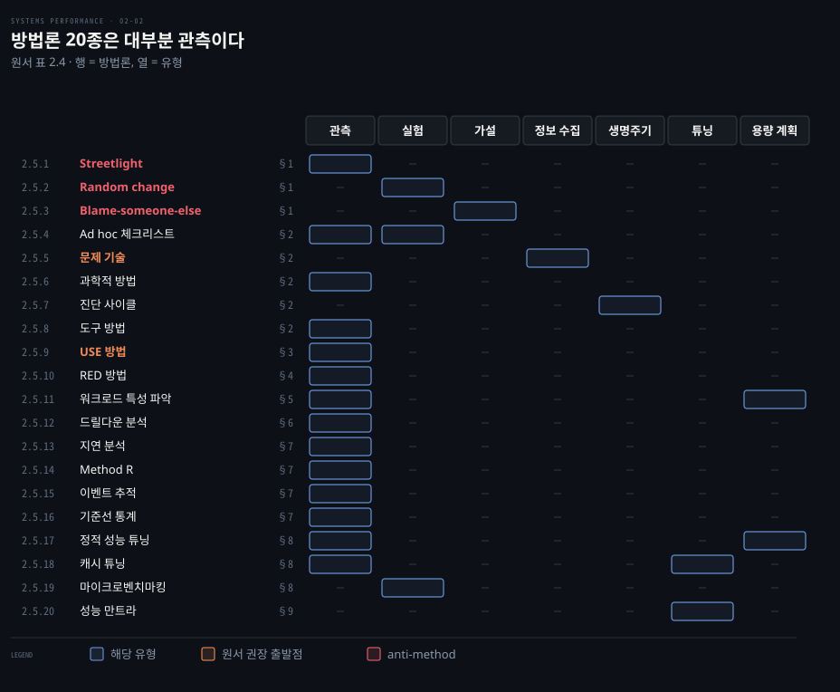
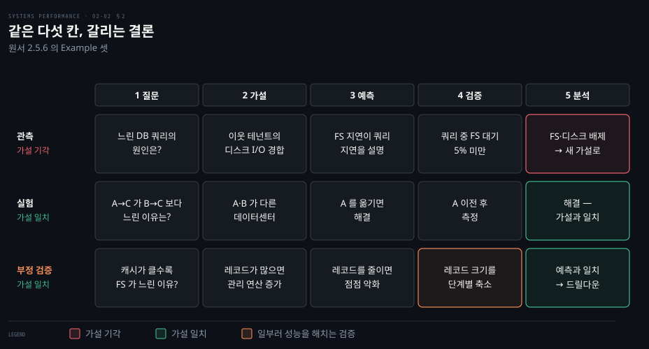
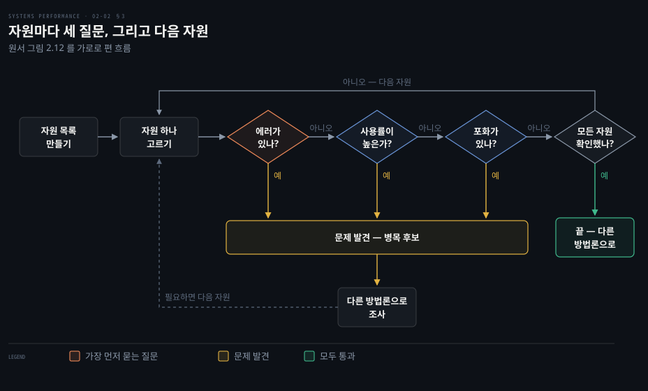
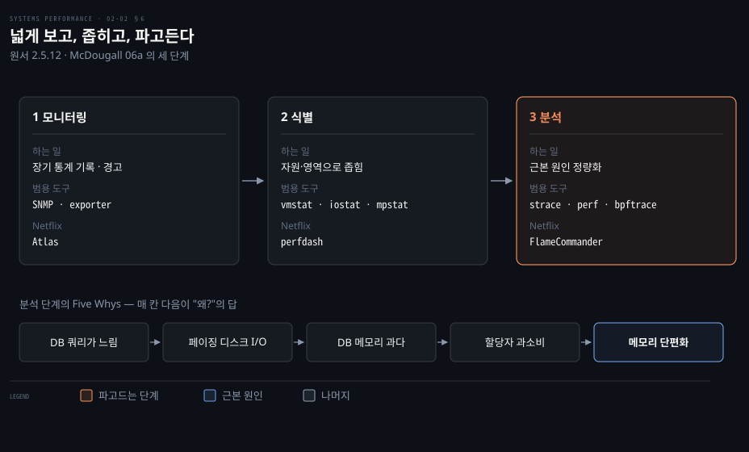
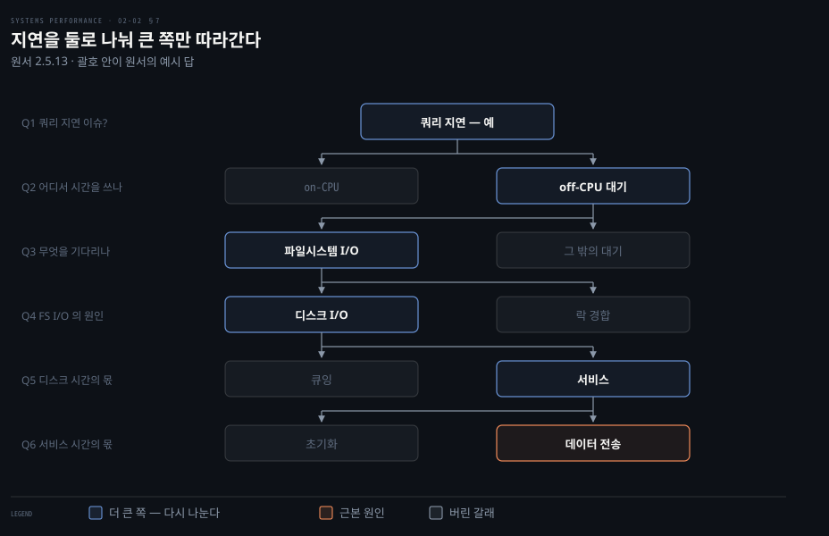

# 방법론 — 분석 방법론 20종
---
> 이 노트는 원서 2.5 Methodology 의 방법론 20종을 다룹니다. 복잡한 시스템 앞에서 어디서 시작해 어떻게 진행할지를 정해 주는 절차들입니다.

## 핵심 요약

> 이 편이 붙든 생각은 하나입니다. 성능 조사는 도구가 아니라 질문 목록에서 출발해야 빠뜨리지 않습니다.

방법론이 없으면 성능 조사는 *낚시 원정(fishing expedition)*이 됩니다. 운 좋게 하나 걸리기를 바라며 무작정 찌르다 보면 시간만 버리고 중요한 영역을 빠뜨립니다. 원서는 방법론이 초보에게는 출발점을, 전문가에게는 점검표를 준다고 말합니다.

원서가 제안하는 출발 순서는 이렇습니다. 새로운 이슈에는 문제 기술(§2)을 가장 먼저 씁니다. 그런 다음 USE 방법(§3)을 활용해 자원 병목을 빠르게 점검합니다. 그래도 원인을 찾지 못하면 다른 방법론으로 넘어갑니다.

방법론 20종은 저마다 성격이 다릅니다. 원서 표 2.4(p.22–23)는 각 방법론을 관측 분석, 실험 분석, 가설 분석, 정보 수집, 분석 생명주기, 튜닝, 용량 계획으로 나눕니다. 이 가운데 대부분은 시스템을 건드리지 않고 확인하는 관측 분석입니다. 실험 분석은 무엇인가를 바꾸거나 부하를 가하는 방식입니다. 우리가 피해야 할 anti-method 셋도 이 표에 함께 들어 있습니다.

## 학습 목표

> 이 편을 덮은 뒤 스스로 할 수 있어야 하는 일을 먼저 적어 둡니다.

1. anti-method 셋이 왜 방법론의 부재인지 설명하고, 남 탓 조사를 받았을 때 대응하는 법을 댑니다.
2. 문제 기술의 여섯 질문과 과학적 방법의 다섯 단계를 원서 예시 하나에 적용해 봅니다.
3. USE 방법의 절차를 그리고, 오류를 먼저 보고 도구가 아닌 자원을 순회하는 이유를 설명합니다.
4. RED 의 요청률과 duration 으로 부하 문제와 아키텍처 문제를 가르는 판단을 내립니다.
5. 드릴다운과 지연 분석이 범위를 좁히는 방식을 비교하고, 성능 만트라의 순서를 근거와 함께 댑니다.

아래 격자는 20종을 원서 표 2.4 의 유형으로 나눈 것입니다. 행마다 오른쪽 끝의 절 번호가 이 문서에서 그 방법론을 다루는 곳입니다. 한 방법론이 두 유형에 걸치면 두 칸이 켜집니다.

## 이 문서가 다루지 않는 것

> 앞뒤 편과 다른 장으로 넘긴 주제를 밝혀 둡니다.

- 사용률·포화·지연 같은 용어의 정의는 02-01이 다룹니다.
- 큐잉 이론·용량 계획·통계·모니터링(표 2.4의 나머지 넷)은 02-03이 다룹니다.
- 자원별로 바꾼 방법론(CPU 프로파일링·off-CPU 분석·누수 탐지 등, 원서 표 2.5)은 5~12장의 방법론 절이 다룹니다.
- Linux용 USE 체크리스트 전체는 부록 a0-01이 다룹니다.

## 1. 피해야 할 anti-method 3종

> 세 가지는 의도적 방법론의 *부재* 입니다. 운 좋게 맞혀도 느리고, 찾은 것이 진짜 원인이라는 보장이 없습니다.

| anti-method | 정의 | 왜 나쁜가 |
|-------------|------|----------|
| Streetlight | 익숙하거나 인터넷에서 본 도구만 골라 뭔가 튀어나오길 봄 | 가로등 아래서 열쇠 찾는 술취한 사람 — "빛이 거기 있어서". `top(1)` 만 보는 건 의미 있어서가 아니라 다른 도구를 못 읽어서 |
| Random change | 무작위로 짚어 바꿔 가며 사라질 때까지 시도 | 결국 맞혀도 오래 걸리고, 나중에 고쳐질 버그를 우회한 튜닝이 영문 모른 채 남음. 피크 부하에 더 큰 문제를 일으킬 위험 |
| Blame-someone-else | 내 책임 아닌 부품을 의심해 그 팀에 떠넘김 | 데이터 없는 가설이 신호. "네트워크 같은데 드롭 있나 확인해 줄래?" — 아니면 1번으로. 다른 팀 자원 낭비 |

streetlight는 튜닝에서도 같은 모습으로 나타납니다. 자신이 잘 알고 익숙한 튜너블만 이 값 저 값으로 바꿔 보는 식입니다. 원서는 이 방법으로 찾은 것이 *한* 문제일 수는 있어도 *그* 문제는 아닐 수 있다고 짚습니다(p.26). 다른 방법론은 발견을 정량화합니다. 따라서 거짓 양성을 빨리 거르고 더 큰 문제에 우선순위를 줄 수 있습니다.

random change의 절차는 원서에서 여섯 단계입니다. 먼저 바꿀 항목을 무작위로 고릅니다. 한쪽으로 바꿔 측정하고 반대쪽으로 바꿔 다시 측정합니다. 둘 중 하나가 기준선보다 나으면 그 변경을 남기고 처음으로 돌아갑니다. 성능이 나아졌는지는 실행 시간, 지연, 초당 연산 수, 처리량 같은 지표로 판단합니다.

blame-someone-else의 피해자가 되지 않으려면 비난하는 쪽에 스크린샷을 요청합니다. 어떤 도구를 돌렸고 출력을 어떻게 해석했는지 묻습니다. 그 근거를 제3자에게 가져가 다시 확인받을 수 있습니다.

## 2. 기본기 — 문제 기술·과학적 방법·진단 사이클

> 새 이슈에는 문제 기술부터 씁니다. 그다음은 가설을 세워 검증하는 과학적 방법과, 가설과 데이터를 빠르게 오가는 진단 사이클입니다.

### Ad hoc 체크리스트 방법

지원 인력이 짧은 시간에 시스템을 점검·튜닝할 때 씁니다. 새 서버나 앱을 프로덕션에 올린 뒤 실제 부하에서 흔한 문제를 반나절쯤 확인하는 장면이 전형입니다. 체크리스트는 그 시스템 유형의 최근 경험으로 만듭니다. 항목은 이런 모양입니다.

> `iostat -x 1` 을 돌려 `r_await` 열을 봅니다. 부하 중 계속 10(ms)을 넘으면 디스크 읽기가 느리거나 디스크가 과부하입니다.

`r_await`는 읽기 요청 하나가 끝나기까지 걸린 평균 시간(ms)이며 9장 디스크가 자세히 다룹니다. 이런 항목 열두 개 안팎이 체크리스트 하나입니다. 가장 짧은 시간에 가장 큰 값을 줄 수 있지만 시점 한정 권고라 자주 갱신해야 합니다. 또한 문서로 쉽게 적을 수 있는 수정, 곧 튜너블 설정 같은 것에 치우칩니다. 소스나 환경에 맞춘 수정은 다루지 못합니다(p.27). 지원 팀을 이끈다면 모두가 흔한 문제를 같은 방식으로 점검하게 만드는 데 효과적입니다.

### 문제 기술(problem statement)

새 이슈에 가장 먼저 쓸 방법입니다. 고객에게 묻습니다.

- 왜 성능 문제가 있다고 생각하십니까?
- 이 시스템이 잘 동작한 적이 있습니까?
- 최근 바뀐 게 있습니까? (소프트웨어·하드웨어·부하)
- 문제를 지연이나 실행 시간으로 표현할 수 있습니까?
- 다른 사람·앱에도 영향을 주십니까, 당신만입니까?
- 환경은 어떻습니까? (소프트웨어·하드웨어·버전·설정)

질문하고 답하는 것만으로 원인과 해법이 바로 보일 때가 많습니다. 저자는 서버에 로그인하거나 지표를 보지 않고 이 질문만으로 전화로 성능 이슈를 푼 적이 있다고 합니다.

### 과학적 방법

과학적 방법은 미지를 가설과 검증으로 다룹니다. 단계는 **질문 → 가설 → 예측 → 검증 → 분석**입니다. 질문은 문제 기술 그 자체입니다. 검증은 관측적일 수도 실험적일 수도 있습니다.

메모리가 적은 시스템으로 옮긴 뒤 느려졌다면 가설은 "파일시스템 캐시가 작아져서"입니다. 관측 검증은 두 시스템의 캐시 미스율을 비교해 작은 쪽이 높을 거라는 예측을 확인합니다. 실험 검증은 RAM을 더해 캐시를 키우면 나아질 거라는 예측을 봅니다. 원서는 튜너블로 캐시 크기를 인위적으로 줄여 더 나빠지는지 보는 것을 "또 다른, 아마 더 쉬운 실험 검증"이라 부릅니다(p.28).

원서는 예시 셋을 더 듭니다. 다섯 칸이 어떻게 채워지고 결론이 어떻게 갈리는지를 한 장에 모았습니다.

첫 줄은 가설이 기각된 경우입니다. 쿼리 지연 중 파일시스템 대기가 5% 미만입니다. 문제는 아직 안 풀렸지만 파일시스템과 디스크라는 큰 구성 요소가 배제되었습니다. 이제 둘째 단계로 돌아가 새 가설을 세웁니다.

둘째 줄은 실험으로 가설이 맞은 경우입니다. 실험이 문제를 못 고쳤다면 새 가설로 가기 전에 변경을 되돌려야 합니다. 여러 요인을 한꺼번에 바꾸면 무엇이 효과였는지 가리기 어렵기 때문입니다.

셋째 줄은 원서가 **부정 검증(negative test)**이라 이름 붙인 예입니다(p.29). 레코드 크기를 점점 줄여 일부러 성능을 해칩니다. 그 결과로 대상 시스템을 배웁니다. 결과가 예측과 맞자 캐시 관리 루틴으로 드릴다운이 이어졌습니다.

### 진단 사이클

`가설 → 계측 → 데이터 → 가설`입니다. 과학적 방법처럼 데이터를 모아 가설을 일부러 검증합니다. 다만 데이터가 빠르게 새 가설로 이어진다는 점을 강조합니다. 의사가 작은 검사를 잇따라 하며 진단을 다듬는 것과 같습니다.

과학적 방법과 진단 사이클 모두 이론과 데이터의 균형이 좋습니다. 가설에서 데이터로 빨리 옮겨 나쁜 이론을 일찍 버립니다. 그리고 더 나은 이론을 세우는 것이 핵심입니다.

### 도구 방법(tools method)

쓸 수 있는 도구를 나열합니다. 도구마다 유용한 지표를 적고 지표마다 해석을 적어 점검표를 만듭니다. 꽤 효과적이지만 알려진 도구에만 의존해 streetlight처럼 불완전한 시야를 줍니다. 더 나쁜 점은 사용자가 그 불완전함을 모른 채 남는다는 것입니다. 동적 트레이싱 같은 커스텀 도구가 필요한 이슈는 영영 못 풀 수 있습니다.

원서는 실전에서 이 방법이 병목·오류 같은 문제를 찾기는 하지만 효율적이지 않다고 평가합니다(p.30). 도구와 지표가 많으면 순회에 시간이 듭니다. 기능이 겹치는 도구들의 장단점을 따지느라 또 시간이 듭니다. 파일시스템 마이크로벤치마크 도구처럼 하나면 될 일에 열 개 넘는 선택지가 있는 경우도 있습니다.

## 3. USE 방법 — 자원 병목 빠른 점검

> USE 방법은 성능 조사 초기에 시스템 병목을 찾습니다. 도구가 아니라 자원을 순회하므로 질문 목록이 먼저 완성되고, 답할 도구가 없는 항목은 known-unknown 으로 남습니다.

USE(Utilization·Saturation·Errors) 방법은 시스템 자원에 집중합니다. 모든 자원의 사용률, 포화, 에러를 점검합니다.

| 항목 | 정의 |
|------|------|
| 자원(Resources) | 모든 물리 서버 기능 부품(CPU·버스 등). 지표가 말이 되면 일부 소프트웨어 자원도 |
| 사용률(Utilization) | 정해진 간격 동안 자원이 일하느라 바빴던 비율 |
| 포화(Saturation) | 처리 못 해 큐에 쌓인 정도(다른 말로 pressure) |
| 에러(Errors) | 에러 이벤트의 수 |

바쁜 동안에도 자원은 일을 더 받을 수 있습니다. 일을 더 받지 못하면 포화입니다. 메인 메모리처럼 용량이 곧 사용률인 자원은 100%에 닿으면 일을 큐에 넣거나 에러를 냅니다. 이 둘 모두 USE가 찾습니다.

에러를 꼭 점검하는 이유는 복구 가능한 실패가 숨어 있기 때문입니다(p.31). 재시도하는 연산이나 이중화 풀의 고장 난 장치 등이 이에 해당합니다. 겉으로는 멀쩡해도 성능을 깎고 있을 수 있습니다.

### 절차 — 에러 → 포화 → 사용률 순

원서 그림 2.12(p.32)를 다시 그렸습니다. 자원 하나에 세 질문을 묻고, 문제가 없으면 다음 자원으로 넘어갑니다.

점검은 에러부터 합니다. 지표가 객관적이라 빠르게 배제할 수 있습니다. 포화는 두 번째입니다. 정도와 무관하게 이슈를 뜻하므로 사용률보다 해석이 빠릅니다.

이 방법은 도구가 아니라 자원을 순회합니다. 그래서 먼저 완전한 질문 목록을 만들고 *그다음* 답할 도구를 찾습니다. 도구가 없어도 그 질문이 미답임을 아는 것 자체가 유용합니다. 그 질문은 known-unknown 이 됩니다.

문제는 둘 이상 있을 수 있습니다. 처음 찾은 것이 *한* 문제일 뿐 *그* 문제가 아닐 수 있습니다. 따라서 발견할 때마다 다른 방법론으로 조사하고, 다시 USE로 돌아와 나머지를 마저 점검합니다(p.32).

### 지표 표현과 해석

세 지표는 단위가 다릅니다.

| 지표 | 단위 | 예 |
|------|------|-----|
| 사용률 | 간격 동안의 % | 한 CPU가 90% |
| 포화 | 대기 큐 길이 | CPU 평균 런큐 4 |
| 에러 | 보고된 에러 수 | 이 디스크 50 에러 |

짧은 고사용률 버스트는 긴 평균에 가려져도 포화와 문제를 일으킬 수 있습니다. 5분 평균은 초 단위의 100%를 숨깁니다. 원서는 고속도로 톨게이트로 묻습니다. 하루 평균 40%였다고 하면 그날 줄을 선 차가 있었는지 알 수 있을까요? 아마 러시아워에 100%가 되며 줄을 섰겠지만 하루 평균에는 보이지 않습니다(p.33).

해석 가이드는 다음과 같습니다.

- **사용률 100%**는 대개 병목 신호입니다(포화로 확인). **60% 초과**도 문제일 수 있습니다. 측정 간격이 짧은 100% 버스트를 가릴 수 있기 때문입니다. 하드 디스크처럼 중간에 끼어들 수 없는 자원(CPU 제외)은 사용률이 오를수록 큐잉 지연이 잦아집니다.
- **포화**는 0이 아니면(any degree) 문제일 수 있습니다.
- **에러**는 0이 아니고 늘고 있다면 조사할 가치가 있습니다.
- *부정 케이스*(낮은 사용률, 포화 0, 에러 0)는 해당 자원이 원인이 아님을 빠르게 알려 줍니다.

### 자원 목록과 소프트웨어 자원

물리 자원(CPU, 메인 메모리, 네트워크 인터페이스, 스토리지, 가속기, 컨트롤러, 인터커넥트)을 다 적습니다. 지표 유형을 붙이면 약 30개 지표가 나옵니다. 문제는 대개 쉬운 지표에서 나오므로 CPU 포화, 메모리 용량 포화, 네트워크 사용률, 디스크 사용률부터 봅니다.

하드웨어 캐시는 뺍니다. USE는 사용률이 높을 때 *성능이 나빠지는* 자원에 쓰는데, 캐시는 *좋아지기* 때문입니다. 모호한 자원은 일단 넣고 지표가 쓸모 있는지 확인합니다.

| 자원 | 유형 | 지표 예 |
|------|------|---------|
| CPU | 사용률 / 포화 | CPU 사용률 / 런큐 길이·스케줄러 지연·PSI |
| 메모리 | 사용률 / 포화 | 가용 메모리 / 스와핑·페이지 스캔·OOM·PSI |
| 네트워크 | 사용률 | 수신·송신 처리량 / 최대 대역폭 |
| 스토리지 I/O | 사용률 / 포화 / 에러 | device busy % / 대기 큐·PSI / 장치 에러 |

표의 PSI(Pressure Stall Information)는 자원 부족으로 작업이 멈춘 시간의 비율을 Linux 커널이 알려 주는 지표입니다. CPU 쪽은 6장, 메모리 쪽은 7장이 다룹니다.

기능 블록 다이어그램을 그려 자원을 도는 길도 있습니다(원서 그림 2.13, p.34). 자원 관계도 보여 주므로 데이터 흐름 속 병목을 찾을 때 좋습니다.

CPU, 메모리, I/O 인터커넥트와 버스는 자주 놓칩니다. 처리량을 넉넉히 설계해 흔한 병목은 아니지만, 한 번 겪으면 메인보드를 바꾸거나 zero copy 같은 기법으로 부하를 덜어야 해서 풀기 어렵습니다. zero copy는 데이터 복사를 줄여 메모리 버스를 덜 쓰는 기법입니다.

원서 표 2.7(p.35)은 측정이 어려운 조합입니다. 몇 개만 옮깁니다.

| 자원 | 유형 | 지표 예 |
|------|------|---------|
| CPU | 에러 | machine check exception, CPU 캐시 ECC 에러 |
| 네트워크 | 포화 | 포화와 관련된 인터페이스·OS 에러(Linux "overruns") |
| 메모리 인터커넥트 | 포화 | 메모리 stall 사이클, 높은 CPI(CPU 성능 카운터) |

이 지표는 표준 OS 도구에 안 보일 수 있어 동적 트레이싱이나 CPU 성능 모니터링 카운터가 필요할 수 있습니다.

소프트웨어 자원도 동일합니다. mutex 락은 보유 시간이 사용률이고 대기 스레드가 포화입니다. 스레드 풀은 바쁜 시간이 사용률이고 대기 요청 수가 포화입니다. 프로세스, 스레드와 파일 디스크립터 용량은 할당 실패("cannot fork")가 에러입니다.

클라우드나 컨테이너의 *자원 제어*(cgroups 제한)도 물리 자원처럼 USE로 봅니다. cgroups는 프로세스 그룹마다 CPU, 메모리 자원 한도를 두는 Linux 기능이며 03-02 §7과 11장이 다룹니다. 호스트가 멀쩡해도 테넌트 한도 탓에 할당 에러나 스와핑이 생기면 해당 테넌트의 "용량 포화"입니다.

### 마이크로서비스에 적용

마이크로서비스는 지표가 많아 점검하기 어렵고 놓치기 쉽습니다. USE가 이를 해결합니다. Netflix의 마이크로서비스 USE 지표는 셋입니다(p.38).

- 사용률은 전체 인스턴스의 평균 CPU 사용률입니다.
- 포화는 99분위 지연과 평균 지연의 차이입니다. 99분위가 포화 탓이라고 봅니다.
- 에러는 요청 에러입니다.

Netflix는 이 셋을 모니터링 도구 Atlas로 마이크로서비스마다 봅니다.

## 4. RED 방법 — 서비스 건강

> RED 는 마이크로서비스의 *서비스* 에 특화돼 사용자 관점의 건강을 봅니다. USE 가 머신 건강이면 RED 는 사용자 건강이라, 둘은 상보적입니다.

USE로 머신이 멀쩡해 보여도 사용자가 느끼는 서비스는 느릴 수 있습니다. RED 방법은 이 빈자리를 마이크로서비스의 서비스 단위로 메웁니다. 모든 서비스에 대해 요청률(Rate), 에러(Errors), duration을 점검합니다.

| 지표 | 뜻 |
|------|-----|
| 요청률 | 초당 서비스 요청 수 |
| 에러 | 실패한 요청 수 |
| Duration | 요청 완료 시간(평균뿐 아니라 백분위 등 분포도 고려) |

마이크로서비스 구조도를 그리고 서비스마다 세 지표가 모니터링되는지 확인합니다(p.38). 분산 트레이싱 도구가 이 구조도를 대신 그려 주기도 합니다.

USE와 마찬가지로 빠르고 따르기 쉬우며 포괄적입니다. 두 방법 모두 Tom Wilkie가 Prometheus, Grafana용 구현을 만들었습니다.

요청률이 들어 있다는 점이 *부하 vs 아키텍처*(02-01 §7)를 가르는 이른 단서가 됩니다. 요청률은 일정한데 duration이 늘어난다면 서비스 자체, 즉 아키텍처 문제를 가리킵니다. 요청률과 duration이 함께 늘어나면 가해진 부하의 문제일 수 있습니다. 이쪽은 워크로드 특성 파악 방법으로 더 살펴봅니다.

## 5. 워크로드 특성 파악

> 부하로 인한 이슈를 찾는 단순하고 효과적인 방법입니다. 결과 성능이 아니라 *입력* 을 봅니다.

워크로드 특성 파악(workload characterization)은 부하로 인한 이슈를 식별합니다. 결과 성능이 아니라 시스템 *입력*에 초점을 둡니다. 아키텍처, 구현, 설정에 문제가 없어도 감당할 수 없는 부하를 받고 있을 수 있기 때문입니다. 다음 질문에 답합니다.

- **누가** 부하를 일으킵니까? (PID, UID, 원격 IP)
- **왜** 호출됩니까? (코드 경로, 스택 트레이스)
- **무엇**이 부하 특성입니까? (IOPS, 처리량, 방향, 유형, 적절하면 분산/표준편차도)
- **어떻게** 시간에 따라 변합니까? (일간 패턴?)

답을 강하게 예상하더라도 전부 점검하는 편이 좋습니다. 원서의 예로, 설정상 DB 클라이언트가 웹서버 풀이라고 예상했지만 IP를 확인해 보니 인터넷 전체가 부하를 던지고 있었습니다. DoS 공격이었습니다.

최고의 성능 이득은 불필요한 일을 없애는 데서 옵니다. 루프에 갇힌 스레드, 피크 시간대의 시스템 전체 백업, DoS 같은 일을 특성 파악으로 짚어 내면 유지보수나 재설정으로 없앨 수 있습니다.

없앨 수 없는 부하라면 자원 제어로 throttle합니다. 원서의 예는 백업이 압축에 CPU를, 전송에 네트워크를 써서 프로덕션 DB를 방해하는 경우입니다(p.39). 자원 제어로 그 사용량을 묶어 두면 백업은 느려지지만 DB는 다치지 않습니다.

특성 파악은 시뮬레이션 벤치마크의 입력이 되기도 합니다. 이때 평균만이 아니라 분포와 변동도 모아야 다양한 워크로드를 흉내 낼 수 있습니다. 또한 부하 문제를 식별해 아키텍처 문제와 분리해 줍니다. 앱이 클라이언트 활동을 자세히 로그로 남기거나 일간, 월간 사용 보고서를 낸다면 그것이 분석 재료가 됩니다.

## 6. 드릴다운 분석과 Five Whys

> 드릴다운은 높은 수준에서 시작해 흥미로운 곳을 좁혀 가며, 필요하면 하드웨어까지 소프트웨어 스택을 파고듭니다. 모니터링·식별·분석 세 단계이고, 분석 단계에서 "왜?"를 다섯 번 묻는 Five Whys 를 씁니다.

이슈가 어디에 있는지 모를 때 모든 층을 한꺼번에 볼 수는 없습니다. 드릴다운 분석(drill-down analysis)은 이슈를 높은 수준에서 살펴본 뒤, 앞서 발견한 내용을 근거로 초점을 좁혀 나갑니다. 흥미롭지 않은 영역은 버리고 흥미로운 쪽만 깊이 파고듭니다. 원서는 McDougall 06a의 세 단계를 소개합니다(p.40).

| 단계 | 하는 일 |
|------|--------|
| 모니터링(Monitoring) | 높은 수준 통계를 시간에 따라 기록하고 문제가 의심되면 경고 |
| 식별(Identification) | 의심 문제를 특정 자원·영역으로 좁혀 병목 후보를 찾음 |
| 분석(Analysis) | 의심 영역을 트레이싱·프로파일링으로 깊이 보고 근본 원인을 정량화 |

모니터링 단계에서는 회사 전체에 걸쳐 모든 서버나 인스턴스의 결과를 모을 수 있습니다. 과거에 쓰던 기술은 SNMP였습니다. 하지만 현대 모니터링은 시스템마다 에이전트 역할을 하는 exporter를 띄워서 지표를 수집하고 이를 GUI로 보여 줍니다. 명령줄 도구로 짧게 확인할 때는 놓치기 쉬운 장기 패턴이 여기서 드러납니다.

식별 단계는 서버를 직접 확인하면서 CPU, 디스크, 메모리를 점검하는 과정입니다. 예전에는 vmstat, iostat, mpstat 같은 명령줄 도구로 진행했습니다. 지금은 이와 똑같은 지표를 보여 주는 GUI 대시보드가 많습니다.

분석 단계에서 대부분의 드릴다운 작업이 일어납니다. 커스텀 도구를 만들거나 소스를 읽어가며 필요한 만큼 스택을 한 겹씩 벗겨 냅니다. Linux 도구로는 strace, perf, BCC, bpftrace, Ftrace가 있습니다.

Netflix에서는 이 순서가 다음과 같이 이어집니다. 먼저 Atlas가 문제가 있는 마이크로서비스를 짚어 냅니다. 이어서 perfdash(옛 이름 Vector)가 원인을 자원으로 좁힙니다. 그러면 FlameCommander가 해당 자원을 사용하는 코드 경로를 보여 줍니다. 그다음 BCC 도구와 커스텀 bpftrace 도구로 계측을 진행합니다.

**Five Whys**는 분석 단계에서 "왜?"를 묻고 답하기를 다섯 번(또는 그 이상) 되풀이하는 기법입니다. DB가 느린 이유를 따라가니 메모리 페이징 때문에 발생한 디스크 I/O가 나왔습니다. 그 아래로 DB 메모리가 너무 큼, 할당자의 과소비가 차례로 나왔습니다. 끝에서 *할당자의 메모리 단편화 이슈*가 드러났습니다. 원서는 이 끈질긴 질문이 시스템 메모리 할당 라이브러리의 실제 수정으로 이어진 실화라고 소개합니다.

## 7. 지연 분석·이벤트 추적·기준선

> 지연 분석은 연산 시간을 작은 구성 요소로 쪼개고 큰 쪽을 계속 세분합니다. 이벤트 추적은 요약에 가려진 개별 이벤트를 보고, 기준선 통계는 "정상"을 미리 기록해 둡니다.

### 지연 분석(latency analysis)

연산 완료 시간을 작은 구성 요소로 나눕니다. 지연이 가장 큰 구성 요소를 계속 세분해 근본 원인을 찾아 정량화합니다. 드릴다운처럼 소프트웨어 스택의 층을 내려가며 앱에서 시작해 라이브러리·시스템 콜·커널·디바이스 드라이버로 갑니다.

원서의 MySQL 쿼리 지연 예는 여섯 질문으로 갑니다(p.42). 매 질문이 지연을 둘로 나누고 큰 쪽만 계속 분석하므로 원서는 이것을 지연의 이진 탐색이라 부릅니다.

괄호 안이 원서의 예시 답입니다. 쿼리 지연 문제가 있습니다(예). 시간은 off-CPU 대기였고 그 대기는 파일시스템 I/O였습니다. 그 I/O는 락 경합이 아니라 디스크 I/O였고 큐잉이 아니라 서비스 시간이었으며, 초기화가 아니라 데이터 전송이었습니다.

DB 쿼리의 지연 분석을 겨냥한 방법론이 **Method R** 입니다. Oracle 트레이스 이벤트를 바탕으로 쿼리 중 시간이 어디서 쓰이는지를 찾고 정량화합니다(p.43). DB 용으로 만들었지만 그 접근은 어떤 시스템에도 쓸 수 있습니다.

### 이벤트 추적(event tracing)

시스템은 이산 이벤트(CPU 명령·디스크 I/O·패킷·시스템 콜·쿼리 등)를 처리합니다. 보통은 ops/s·bytes/s·평균 지연 같은 요약을 보지만 요약에 중요한 디테일이 가려지면 개별 이벤트를 봐야 합니다. 패킷은 `tcpdump`, 블록 I/O는 `biosnoop`, 시스템 콜은 `strace` 로 추적합니다.

이벤트를 추적할 때는 세 가지를 봅니다. 입력은 유형·방향·크기 같은 요청 속성입니다. 시간은 시작·끝·지연이고 결과는 에러 상태와 전송 크기입니다. `tcpdump -ttt` 가 패킷 사이 간격을 찍는 것처럼 타임스탬프는 지연 분석에 특히 쓸모가 있습니다.

앞선 이벤트도 함께 봅니다. 드물게 높은 지연을 보인 *지연 이상치(latency outlier)* 는 그 이벤트 자체가 아니라 앞선 이벤트 탓일 수 있습니다. 큐 꼬리의 이벤트는 앞에 줄 선 이벤트 때문에 늦어집니다. 이런 경우를 추적한 이벤트로 식별합니다.

### 기준선 통계(baseline statistics)

모니터링 제품은 지표를 시간축 선 그래프로 보여 주고 선이 바뀐 모양으로 최근 변화를 드러냅니다. Netflix 대시보드는 지난주 같은 시간대 선을 하나 더 그려 화요일 오후 3시를 지난주 화요일 오후 3시와 바로 비교합니다(p.45).

하지만 명령줄에는 모니터링되지 않는 지표가 훨씬 많습니다. 낯선 시스템 통계가 이 서버에서 "정상"인지 모를 때 쓰는 오래된 방법이 기준선 통계입니다. "정상" 부하일 때 모든 지표를 모아 텍스트 파일이나 DB에 기록해 두고 나중에 비교합니다.

기준선 소프트웨어는 관측 도구를 돌리고 `/proc` 파일을 읽는 셸 스크립트면 됩니다. 프로파일러와 트레이싱 도구를 넣으면 모니터링 제품보다 훨씬 자세히 남습니다. 다만 그 도구의 오버헤드가 프로덕션을 흔들지 않게 주의합니다. 매일 정기적으로, 그리고 시스템·앱 변경 전후로 모읍니다.

기준선도 모니터링도 없다면 커널 카운터 기반 도구를 씁니다. 이 도구가 보여 주는 *summary-since-boot* 평균을 현재와 비교합니다. 거칠지만 없는 것보다 낫습니다.

## 8. 정적 튜닝·캐시 튜닝·마이크로벤치마킹

> 정적 튜닝은 *부하 없이* 설정된 아키텍처를 점검합니다. 캐시 튜닝은 스택 위쪽일수록 좋고, 마이크로벤치마킹은 단순한 인공 워크로드로 잽니다.

### 정적 성능 튜닝(static performance tuning)

다른 방법론이 가해진 부하의 성능, 곧 동적 성능을 본다면 정적 튜닝은 설정된 아키텍처의 이슈를 봅니다. 시스템이 쉬고 부하가 없을 때도 할 수 있습니다. 부품마다 네 가지를 묻습니다.

- 부품이 말이 됩니까(낡음·저성능)?
- 설정이 의도한 워크로드에 맞습니까?
- 자동 설정이 그 워크로드에 최적인 상태입니까?
- 에러로 degraded 상태입니까?

원서가 드는 발견 예입니다(p.46).

| 범주 | 예 |
|------|-----|
| 협상·고장 | 네트워크가 10Gbit/s 대신 1Gbit/s로 협상 / RAID 풀의 디스크 고장 |
| 버전·용량 | 낡은 OS·앱·펌웨어 / 파일시스템이 거의 참 |
| 설정 불일치 | 워크로드 I/O 크기와 맞지 않는 파일시스템 레코드 크기 |
| 실수로 켜진 것 | 비싼 디버그 모드 / IP 포워딩이 켜져 서버가 라우터가 됨 |
| 위치 | 인증 같은 자원을 로컬이 아니라 원격 데이터센터에서 씀 |

점검은 쉽습니다. 어려운 건 점검할 생각을 하는 것입니다.

### 캐시 튜닝(cache tuning)

앱에서 디스크까지 여러 캐시 계층이 있습니다(전체 목록은 3장 3.2.11). 계층마다 쓰는 일반 전략은 여섯 단계입니다.

1. 일이 수행되는 곳에 가까운 스택 위쪽에 캐싱합니다. 적중 처리 비용이 줄고 메타데이터가 많아 유지 정책을 개선할 수 있습니다.
2. 캐시가 켜져 동작하는지 확인합니다.
3. 적중률·미스 비율과 미스율을 봅니다.
4. 캐시 크기가 동적이면 현재 크기를 확인합니다.
5. 워크로드에 맞게 캐시를 튜닝합니다.
6. 캐시에 맞게 워크로드를 튜닝합니다. 불필요한 소비자를 줄여 대상 워크로드에 공간을 내 줍니다.

같은 데이터를 두 번 담는 *이중 캐싱* 을 주의합니다. 계층별 이득도 따집니다. L1 캐시를 튜닝하면 미스가 L2 로 가므로 나노초를 아낍니다. L3 를 개선하면 훨씬 느린 DRAM 접근을 피해 전체 이득이 더 클 수 있습니다.

### 마이크로벤치마킹(micro-benchmarking)

단순한 인공 워크로드의 성능을 잽니다. 실세계 워크로드를 흉내 내는 macro-benchmarking 은 시뮬레이션이라 수행도 이해도 복잡해질 수 있습니다. 마이크로벤치마킹은 변수가 적어 다루기 쉽습니다.

대표 예는 Linux `iperf(1)` 로, TCP 처리량을 시험합니다. 프로덕션 워크로드 중에 TCP 카운터를 함께 보면 달리 찾기 어려운 외부 네트워크 병목을 드러낼 수 있습니다.

도구는 두 갈래입니다. 부하를 걸고 성능까지 재는 마이크로벤치마크 도구가 있고, 부하만 걸고 측정은 다른 관측 도구에 맡기는 부하 생성기가 있습니다. 원서는 어느 쪽이든 괜찮지만 마이크로벤치마크 도구를 쓰고 다른 도구로 성능을 교차 확인하는 편이 가장 안전하다고 합니다(p.47).

대상 예는 시스템 콜 시간(fork·execve·open·read·close), 캐시된 파일 읽기(1바이트~1MB), 소켓 버퍼 크기별 네트워크 처리량입니다. 보통 연산을 최대한 빨리 반복해 많은 연산의 총 시간을 재고 평균 시간(`평균=실행시간/연산수`)을 냅니다.

## 9. 성능 만트라 — 튜닝 우선순위

> 성능을 높이는 실행 항목을 가장 효과적인 것부터 나열한 튜닝 방법론입니다. "아예 하지 마라"가 1위입니다.

| 순위 | 만트라 | 예 |
|------|--------|-----|
| 1 | 아예 하지 마라 | 불필요한 일 제거 |
| 2 | 하되, 다시 하지 마라 | 캐싱 |
| 3 | 덜 하라 | refresh·polling·update 빈도↓ |
| 4 | 나중에 하라 | write-back 캐싱 |
| 5 | 안 볼 때 하라 | off-peak 시간에 스케줄 |
| 6 | 동시에 하라 | 단일→멀티 스레드 |
| 7 | 더 싸게 하라 | 빠른 하드웨어 구매 |

순서에는 이유가 있습니다. 위로 갈수록 일의 양 자체를 줄입니다. 아래로 갈수록 같은 일을 다른 때·다른 방식·더 비싼 자원으로 처리합니다. "가장 빠른 일은 아예 안 하는 일"이라는 워크로드 특성 파악(§5)의 정신과 맞닿습니다.

저자가 가장 좋아하는 방법론 중 하나로, Netflix 의 Scott Emmons 에게 배웠다고 합니다. Emmons 는 이것을 Craig Hanson·Pat Crain 에게서 비롯됐다고 했지만 저자는 출판된 출처를 아직 찾지 못했다고 덧붙입니다(p.48).

## 학습 점검

> 이 노트의 핵심을 스스로 떠올려 봅니다. 답이 막히면 해당 섹션으로 돌아가 확인합니다.

- anti-method 3종(streetlight·random change·blame-someone-else)을 각각 한 문장으로 설명하고, blame-someone-else의 피해자가 안 되는 법을 말해 봅니다. (→ §1)
- 새 이슈에 문제 기술을 가장 먼저 쓰는 이유와, 과학적 방법의 다섯 단계를 떠올려 봅니다. (→ §2)
- USE 방법을 한 문장으로 말하고, 왜 에러→포화→사용률 순으로 점검하는지·왜 도구가 아닌 자원을 순회하는지 설명해 봅니다. (→ §3)
- RED 방법의 세 지표와, 요청률이 부하 vs 아키텍처 판별에 어떤 단서를 주는지 말해 봅니다. (→ §4)
- 워크로드 특성 파악의 네 질문(누가·왜·무엇·어떻게)과, DoS를 발견한 예가 왜 "전부 점검"의 가치를 보여 주는지 설명해 봅니다. (→ §5)
- 드릴다운 3단계와 Five Whys가 어떻게 근본 원인에 닿는지, 지연 분석이 왜 "지연의 이진 탐색"인지 떠올려 봅니다. (→ §6, §7)
- 성능 만트라 1~3위(아예 하지 마라·다시 하지 마라·덜 하라)와 각 예를 말해 봅니다. (→ §9)

## 정답 (자답 후 펼치기)

> 먼저 답한 뒤 읽습니다. 판단 근거와 흔한 오해를 함께 적습니다.

### 정답 1 — anti-method 셋과 남 탓 대응

streetlight 는 익숙한 도구만 봐서 우연히 걸리기를 기다립니다. random change 는 무작위로 바꿔 보며 문제가 사라지길 기다립니다. blame-someone-else 는 데이터 없이 남의 부품을 의심해 문제를 넘깁니다. 셋 다 의도적인 방법론이 없다는 점이 같습니다. 남 탓 조사를 받으면 어떤 도구를 돌렸고 출력을 어떻게 해석했는지 스크린샷을 달라고 해서 제3자에게 다시 확인받습니다. 흔히 random change 가 결국 맞혔으면 괜찮다고 오해합니다. 이해하지 못한 변경이 나중에 버그가 고쳐진 뒤에도 남고, 피크 부하에서 더 큰 문제를 일으킬 수 있습니다.

### 정답 2 — 문제 기술을 먼저 쓰는 이유

여섯 질문을 묻고 답하는 것만으로 원인과 해법이 바로 드러날 때가 많아 가장 싸고 빠른 첫 단계이기 때문입니다. 특히 "최근 바뀐 것"과 "잘 동작한 적이 있나"는 조사 범위를 단번에 좁힙니다. 과학적 방법은 질문 → 가설 → 예측 → 검증 → 분석이며, 질문 자리에 문제 기술이 들어갑니다. 검증이 늘 실험이어야 한다는 오해가 흔합니다. 두 시스템의 캐시 미스율 비교처럼 관측으로도 검증합니다.

### 정답 3 — USE 의 순서와 자원 순회

USE 는 모든 자원에 대해 사용률·포화·에러를 점검하는 방법입니다. 에러는 대개 객관적이라 해석이 빠르고 먼저 배제하면 시간이 절약됩니다. 포화는 어떤 정도든 이슈라 사용률보다 해석이 빠릅니다. 도구가 아니라 자원을 순회하면 질문 목록이 먼저 완성되므로 답할 도구가 없는 항목도 known-unknown 으로 드러납니다. 대표 오해는 USE 에서 이상이 없으면 시스템에 문제가 없다고 결론 내는 것입니다. 그때는 다른 방법론으로 넘어갑니다.

### 정답 4 — RED 와 부하 vs 아키텍처

세 지표는 요청률·에러·duration 입니다. 요청률이 일정한데 duration 이 늘었다면 같은 양의 일을 더 느리게 처리하는 것이라 서비스 자체, 즉 아키텍처 쪽을 봅니다. 둘이 함께 늘었다면 일이 늘어난 것이 원인일 수 있어 워크로드 특성 파악으로 넘어갑니다. RED 가 USE 를 대신한다고 흔히 오해합니다. RED 는 사용자 건강, USE 는 머신 건강이라 둘은 상보적입니다.

### 정답 5 — 워크로드 특성 파악과 DoS 사례

네 질문은 누가·왜·무엇을·어떻게 변하며 부하를 주는지입니다. DB 클라이언트가 웹서버 풀이라는 예상은 설정에 근거한 강한 믿음이었지만 IP를 실제로 확인하자 인터넷 전체가 보내는 DoS 공격이 드러났습니다. 예상이 강할수록 확인을 건너뛰기 쉬워서 이 사례가 "전부 점검"의 가치를 보여 줍니다. 대표 오해는 특성 파악이 성능 결과를 보는 일이라 여기는 것입니다. 이 방법은 결과가 아니라 입력을 봅니다.

### 정답 6 — 드릴다운·Five Whys·지연의 이진 탐색

드릴다운은 모니터링으로 문제를 감지합니다. 이어 식별로 자원·영역을 좁히고 분석으로 근본 원인을 정량화합니다. Five Whys 는 분석 단계에서 "왜?"를 거듭 물어 DB 지연을 할당자 단편화까지 따라갔습니다. 지연 분석은 매 단계 지연을 둘로 나누고 큰 쪽만 계속 나눕니다. 그래서 탐색 범위가 매번 반으로 줄어 이진 탐색이라 부릅니다. 대표 오해는 드릴다운과 지연 분석이 같은 것이라 보는 것입니다. 드릴다운은 흥미로운 영역을 따라가고 지연 분석은 시간의 크기를 기준으로 고릅니다.

### 정답 7 — 만트라 1~3위

1위는 불필요한 일을 없애는 "아예 하지 마라"입니다. 2위는 캐싱인 "하되 다시 하지 마라"이고, 3위는 refresh·polling·update 빈도를 낮추는 "덜 하라"입니다. 위로 갈수록 일의 양 자체를 줄이므로 효과가 큽니다. 대표 오해는 빠른 하드웨어 구매를 첫 대응으로 보는 것입니다. 만트라에서는 마지막인 7위입니다.

### 판단 문항 — 내 환경에 쓸 방법론 다섯과 순서

원서 연습 2.11 의 2번은 내 환경에 쓸 방법론 다섯을 고르고 순서와 이유를 대라고 합니다. 한 가지 답은 이렇습니다. 문제 기술로 범위를 잡습니다. 그다음 USE 로 자원 병목을 훑고 RED 로 서비스 쪽 증상을 확인합니다. 부하 의심이면 워크로드 특성 파악을, 원인 구간을 좁혀야 하면 지연 분석을 씁니다. 고른 순서마다 앞 단계의 결과가 다음 단계를 고르는 근거가 되는지 확인합니다.

## 관련 문서

- 이 편이 쓰는 용어와 두 분석 관점: [02-01](./02-01.%EB%B0%A9%EB%B2%95%EB%A1%A0%20%E2%80%94%20%EC%9A%A9%EC%96%B4%C2%B7%EB%AA%A8%EB%8D%B8%C2%B7%ED%95%B5%EC%8B%AC%20%EA%B0%9C%EB%85%90.md)
- 큐잉 이론·용량 계획·통계·모니터링: [02-03](./02-03.%EB%B0%A9%EB%B2%95%EB%A1%A0%20%E2%80%94%20%EB%AA%A8%EB%8D%B8%EB%A7%81%C2%B7%EC%9A%A9%EB%9F%89%EA%B3%84%ED%9A%8D%C2%B7%ED%86%B5%EA%B3%84%C2%B7%EC%8B%9C%EA%B0%81%ED%99%94.md)
- Linux 용 USE 체크리스트 전체: [a0-01](./a0-01.%EB%B6%80%EB%A1%9D%20%E2%80%94%20USE%20%EB%A9%94%EC%84%9C%EB%93%9C%20%EC%B2%B4%ED%81%AC%EB%A6%AC%EC%8A%A4%ED%8A%B8%C2%B7sar%20%EC%9A%94%EC%95%BD.md)
- 마이크로벤치마크를 포함한 벤치마크 유형: [12-02](./12-02.%EB%B2%A4%EC%B9%98%EB%A7%88%ED%82%B9%20%E2%80%94%20%EB%B2%A4%EC%B9%98%EB%A7%88%ED%82%B9%20%EC%9C%A0%ED%98%95.md)
