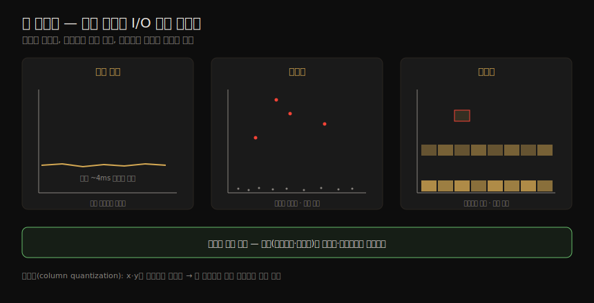

# 방법론 (3) — 모델링·용량계획·통계·시각화
---
> 이 노트는 2장의 마지막 부분으로, 성능을 *예측하고 정량화하고 보여 주는* 도구를 잡습니다. 모델링은 부하·자원이 늘 때 성능이 어떻게 확장되는지 예측하고(Amdahl·USL·큐잉 이론), 용량 계획은 병목이 될 자원을 찾아 미래를 대비합니다. 통계는 평균의 함정과 백분위·다봉분포·이상치를 다루고, 시각화(라인·산점도·히트맵)는 텍스트로는 못 보는 패턴을 드러냅니다.

성능 평가에는 세 활동이 있습니다 — 프로덕션 관측("측정"), 실험 테스트("시뮬레이션"), 그리고 분석적 모델링입니다. 성능은 이 중 *최소 둘* 을 할 때 가장 잘 이해됩니다(모델링+시뮬레이션, 또는 시뮬레이션+측정). 이 노트는 그 셋째 축인 모델링에서 출발해, 그것이 실제 결정(용량 계획)과 해석(통계·시각화)으로 이어지는 길을 따라갑니다.

02-01 이 개념을, 02-02 가 방법론을 잡았다면, 이 노트는 그 위에서 *수학과 그림* 으로 미래를 내다보고 데이터를 읽습니다.


## 1. 모델링과 시각적 식별

> 분석적 모델링은 확장성 분석에 쓰입니다 — 부하·자원이 늘 때 성능이 어떻게 확장되는지. 충분한 결과를 모아 그리면 모델 없이도 확장성 프로파일(선형·경합·일관성·knee point·천장)을 눈으로 식별할 수 있습니다.

분석적 모델링은 *확장성 분석* — 부하나 자원(CPU 코어·프로세스·스레드)이 늘 때 성능이 어떻게 확장되는지 — 에 쓰입니다. 기존 시스템이면 측정(부하·결과 성능 특성 파악)에서 시작하고, 프로덕션 부하가 없으면 실험(시뮬레이션)을, 예측엔 모델링을 씁니다. 확장성 분석은 자원 제약으로 성능이 선형을 멈추는 **knee point** 를 드러내, 프로덕션에서 마주치기 전에 고치게 합니다.

#### 엔터프라이즈 vs 클라우드

모델링은 대규모 엔터프라이즈 시스템을 *소유 없이* 시뮬레이션하게 해 주지만, 대규모 환경은 복잡해 정확히 모델링하기 어렵습니다. 클라우드는 어떤 규모든 *벤치마크 기간만큼* 빌릴 수 있어, 수학 모델 대신 워크로드를 특성 파악·시뮬레이션해 여러 규모에서 *측정* 합니다 — knee point 같은 발견이 이론이 아닌 실측이 되고, 모델에 없던 한계도 드러납니다.

#### 시각적 식별과 확장성 프로파일

결과를 *전달 성능 vs 확장 파라미터* 로 그리면 패턴이 보입니다. 예: 스레드를 늘리며 처리량을 그렸더니 8 스레드쯤에서 기울기가 꺾이는 knee point가 보이면, 8 부근 설정을 조사합니다(8코어×2 HW스레드 시스템이었음). 모델 없이 눈으로 식별 가능한 프로파일은 다음과 같습니다.

| 프로파일 | 뜻 |
|----------|-----|
| 선형(linear) | 자원이 늘수록 성능이 비례해 증가 |
| 경합(contention) | 공유·직렬 자원 경합이 확장 효과를 깎기 시작 |
| 일관성(coherence) | 데이터 일관성 유지(변경 전파) 비용이 확장 이득을 넘어섬 |
| knee point | 확장점에서 한 요인이 프로파일을 바꿈 |
| 확장성 천장(ceiling) | 하드 리밋(버스·인터커넥트 최대, 또는 SW 자원 제어) |


## 2. 확장성 법칙 — Amdahl·USL

> Amdahl 법칙은 병렬화 안 되는 *직렬* 구성 요소를 반영해 확장을 모델링합니다(경합 프로파일). USL은 거기에 *일관성 지연* 파라미터를 더합니다(일관성 프로파일). 둘 다 데이터를 모아 회귀 분석으로 파라미터를 구합니다.

#### Amdahl 법칙

직렬 구성 요소가 병렬로 확장되지 않음을 반영해 확장성을 모델링합니다(앞의 *경합* 프로파일).

```
C(N) = N / (1 + α(N − 1))
```

상대 용량 C(N), 확장 차원 N(CPU 수·사용자 부하), α(0~1)는 직렬성의 정도 — 선형에서 벗어나는 척도입니다. 적용은 (1) N 범위에 데이터 수집(관측·마이크로벤치) → (2) 회귀 분석으로 α 결정(gnuplot·R) → (3) 데이터와 모델 함수를 함께 그려 분석합니다.

#### USL(Universal Scalability Law)

Neil Gunther가 *일관성 지연* 파라미터를 더해 만든 모델로(앞의 *일관성* 프로파일, 경합 효과 포함).

```
C(N) = N / (1 + α(N − 1) + βN(N − 1))
```

β는 일관성 파라미터로, β=0이면 Amdahl 법칙이 됩니다. 분산이 큰 데이터셋은 프로파일을 눈으로 가리기 어려운데, 모델은 앞 데이터로 파라미터를 구해 *뒤 데이터 예측* 을 현실과 대조하게 해 줍니다. 모델이 데이터에서 예상 밖으로 벗어나면 — 모델(내 이해)의 문제이거나 시스템 실제 확장성의 문제이거나 — 조사할 가치가 있습니다.


## 3. 큐잉 이론 — 디스크는 왜 60%부터 느려지나

> 큐잉 이론은 큐가 있는 시스템의 큐 길이·대기 시간·사용률을 수학으로 분석합니다. Little의 법칙(L=λW)이 기본이고, Kendall 표기(A/S/m)로 시스템을 분류합니다. M/D/1 디스크 모델은 60% 사용률부터 응답 시간이 두 배가 되는 이유를 보여 줍니다.

큐잉 이론은 큐가 있는 시스템의 큐 길이·대기 시간(지연)·사용률을 수학으로 분석합니다. **Little의 법칙** 이 기본입니다.

```
L = λW
```

시스템 안 평균 요청 수 L = 평균 도착률 λ × 평균 체류 시간 W. 큐에 적용하면 L=큐 안 요청 수, W=평균 대기 시간입니다.

큐잉 시스템은 세 요인 — 도착 과정(A)·서비스 시간 분포(S)·서비스 센터 수(m) — 으로 **Kendall 표기 `A/S/m`** 로 분류합니다.

| 표기 | 뜻 |
|------|-----|
| M/M/1 | Markovian 도착·Markovian 서비스·1 센터 |
| M/M/c | M/M/1의 다중 서버 |
| M/G/1 | Markovian 도착·일반 분포 서비스·1 센터 (회전 디스크 연구에 흔히) |
| M/D/1 | Markovian 도착·결정적(고정) 서비스·1 센터 |

#### M/D/1과 60% 사용률

디스크를 M/D/1로 단순화하면, 사용률이 오를 때 응답 시간 변화를 계산할 수 있습니다.

```
r = s(2 − ρ) / 2(1 − ρ)     (r=응답시간, s=서비스시간, ρ=사용률)
```

서비스 시간 1ms로 그리면, **60% 사용률을 넘으면 평균 응답 시간이 두 배** 가 되고 80%에선 세 배가 됩니다. 디스크 I/O 지연이 앱의 한계 자원일 때가 많아, 평균 지연이 두 배 이상이면 앱 성능에 큰 타격입니다. 이것이 디스크 사용률이 100%에 닿기 *훨씬 전부터* 문제가 되는 이유입니다 — 요청을 (대개) 인터럽트 못 하고 차례를 기다려야 하는 큐잉 시스템이라, 높은 우선순위가 선점하는 CPU와 다릅니다. 이 단순 모델은 *최선의 경우* 에 가깝고, 서비스 시간 변동(M/G/1·M/M/1)은 평균을 더 높이며, 90·99분위는 60%부터 훨씬 빠르게 나빠집니다.


## 4. 용량 계획

> 용량 계획은 부하가 늘 때 시스템이 어떻게 감당·확장하는지 봅니다. 자원 한계 분석으로 병목 될 자원을 찾고, 요인 분석으로 최소 비용 구성을 정하며, 수직·수평 확장과 샤딩으로 풉니다.

용량 계획(capacity planning)은 부하 증가를 시스템이 어떻게 감당·확장하는지 봅니다.

#### 자원 한계 분석

부하에서 병목이 될 자원을 찾습니다 — (1) 서버 요청률 측정·모니터링 → (2) 하드웨어·소프트웨어 자원 사용 측정 → (3) 요청을 자원 사용으로 표현 → (4) 알려진(또는 실험으로 정한) 한계까지 외삽. 예: 1,000 요청/s, 16 CPU 평균 40%면 —

```
요청당 CPU% = 16 × 40% / 1,000 = 0.64%
최대 요청/s = 100% × 16 / 0.64 = 2,500 요청/s
```

2,500 요청/s에서 CPU가 100%가 되리란 거친 최선 추정입니다(다른 한계가 먼저 올 수도). 모니터링으로 여러 데이터 점을 모으면 정확도가 오릅니다. 이게 충분한지는 *피크 워크로드* 를 알아야 답합니다 — 하루 10만 히트는 평균 1 요청/s지만, 새 콘텐츠 직후 몰리면 피크는 큽니다.

#### 요인 분석

새 시스템 구매 시 디스크·CPU·RAM·플래시·RAID·파일시스템 설정 등 바꿀 요인이 많아, 보통 *최소 비용으로 필요 성능* 을 내는 게 과제입니다. 8개 이진 요인을 다 테스트하면 256번이라, *최대 구성에서 하나씩 끄며* 테스트합니다 — (1) 전부 최대로 측정 → (2) 요인을 하나씩 바꿔 측정(성능 하락) → (3) 각 하락%와 비용 절감을 기록 → (4) 필요 요청/s를 유지하며 비용 절감 요인 선택 → (5) 재테스트. 8요인이 10번이면 됩니다.

#### 확장 솔루션

| 전략 | 뜻 |
|------|-----|
| 수직 확장(vertical) | 더 큰 시스템 |
| 수평 확장(horizontal) | 여러 시스템에 부하 분산(로드밸런서가 하나처럼 보이게) |
| auto scaling(ASG) | 사용 지표로 인스턴스를 자동 증감(Netflix는 CPU 60% 목표). K8s는 HPA로 Pod 증감 |
| 샤딩(sharding) | DB 데이터를 논리 조각으로 나눠 각자 DB가 관리(샤딩 키 선택이 관건) |

클라우드는 수평 확장을 *가상 시스템 단위* 로 더 잘게 해, 초기 큰 구매가 없어 프로젝트 초기엔 엄격한 용량 계획의 필요가 줄어듭니다.


## 5. 통계 — 평균의 함정

> 성능 이득은 신뢰할 지표로 정량화해 비교·우선순위를 매깁니다. 평균은 디테일을 숨기는 요약이라, 평균만 보면 위험합니다 — 100ms 이상치가 1ms 평균에 가려지고, 다봉분포에서는 평균이 오히려 *중심을 벗어난* 값일 수 있습니다.

#### 성능 이득 정량화

이슈와 잠재 개선을 정량화하면 비교·우선순위가 가능합니다. *관측 기반* — 신뢰할 지표 선택 → 해결 시 이득 추정(예: 요청 10ms 중 9ms가 디스크 I/O → 메모리 캐싱으로 ~10μs → 10ms→1.01ms ≈ 9배). *실험 기반* — 수정 적용 → 전후 비교(예: 스레드 수 늘려 10ms→2ms = 5배). 지연(시간)이 구성 요소 간 직접 비교돼 이 계산에 잘 맞습니다. 단 지연은 앱 요청의 *동기* 구성 요소로 측정해야 합니다 — 백그라운드 디스크 쓰기 같은 비동기는 앱 성능에 직접 영향이 없습니다.

#### 평균의 종류와 함정

| 평균 | 쓰임 |
|------|------|
| 산술 평균(mean) | 합/개수 — 가장 흔함 |
| 기하 평균 | n제곱근 — 곱셈 효과(예: 커널 네트워크 스택 계층별 개선) |
| 조화 평균 | 개수/역수합 — 비율의 평균(예: 평균 전송률) |
| 시간 평균 | 대부분 지표가 시간에 대한 평균(CPU "50% 사용률"은 *어떤 간격* 의 50%) |
| 감쇠 평균(decayed) | 최근에 더 가중(load average) — 단기 변동을 완화 |

평균은 디테일을 숨기는 요약입니다 — 100ms 이상치들이 1ms 평균에 가려지곤 합니다. *간격* 도 늘 확인해야 합니다 — 5분 평균이 초 단위 100% 포화를 숨겨, 모니터링은 80%인데 실제로는 CPU 포화(스케줄러 지연)였던 사례가 있습니다.

#### 표준편차·백분위·중앙값과 다봉분포

표준편차는 분산의 척도(클수록 평균에서 더 퍼짐)이고, 99분위는 값의 99%가 드는 지점입니다. 90·95·99·99.9분위로 *가장 느린* 쪽을 정량화하며 SLA에 쓰입니다. 50분위(중앙값)는 데이터의 중심을 보여 줍니다. 변동을 한 지표로 표현하려면 *변동계수(CoV = 표준편차/평균)* 를 씁니다(낮을수록 변동 적음).

문제는 평균·표준편차·백분위가 *정규/단봉분포* 를 가정한다는 것입니다. 시스템 성능은 흔히 *이중모드(bimodal)* 입니다 — 빠른 경로/느린 경로, 캐시 적중/미스. 읽기·쓰기·랜덤·순차가 섞인 디스크 I/O 지연 히스토그램은 1ms 미만(온디스크 캐시 적중)과 7ms 부근(미스·랜덤 읽기) 두 봉우리를 보이고, 평균 3.3ms는 *어느 봉우리에도 없는* — 거의 중심의 반대인 — 오해의 소지가 큰 값입니다.

> "평균 깊이 6인치인 개울을 건너다 빠져 죽은 사람이 있었다." — 성능 지표로 평균(특히 평균 지연)을 볼 때마다 *분포가 어떤가* 를 물어야 합니다.

#### 이상치(outliers)

기대 분포에 안 맞는 극소수의 극단값입니다. 디스크 I/O 이상치(대부분 0~10ms인데 가끔 1,000ms 넘음)·TCP 재전송발 네트워크 지연 이상치가 예입니다. 평균은 이상치에 조금 밀리지만 중앙값은 덜 밀리고, 표준편차·99분위가 이상치를 더 잘 잡습니다(빈도에 따라). 다봉분포·이상치를 제대로 보려면 *전체 분포* 를 — 히스토그램으로 — 봐야 합니다.


## 6. 모니터링

> 모니터링은 성능 통계를 시간에 따라 기록해 과거와 현재를 비교하고 시간 기반 사용 패턴을 식별합니다. 시·일·주·분기·연 주기가 흔히 보이며, 모니터링이 없으면 summary-since-boot라도 확인합니다.

시스템 성능 모니터링은 통계를 시간(time series)에 따라 기록해, 과거와 현재를 비교하고 사용 패턴을 식별합니다 — 용량 계획·성장 정량화·피크 식별에 유용하고, 현재 값이 "정상" 범위인지 맥락도 줍니다.

흔히 보이는 시간 기반 패턴입니다.

| 주기 | 예 |
|------|-----|
| 시간별(hourly) | 모니터링·리포트 작업(5·10분 주기도 흔함) |
| 일별(daily) | 업무 시간(9~5) 패턴, 야간 로그 로테이션·백업 |
| 주별(weekly) | 평일/주말 패턴 |
| 분기별 | 재무 리포트 |
| 연별 | 학사 일정·휴가 |

불규칙 증가(새 콘텐츠 공개·블랙프라이데이)나 감소(정전·인터넷 장애·스포츠 결승)도 있습니다. 모니터링 제품은 *exporter(에이전트)* 로 통계를 모으는데, OS 도구 텍스트를 파싱(비효율)하거나 OS 라이브러리·커널 인터페이스를 직접 읽습니다. 분산·클라우드가 커지며 수백~수천 시스템을 한 인터페이스로 보는 중앙 모니터링이 중요해집니다(Netflix는 20만+ 인스턴스를 Atlas로). 모니터링이 없으면 OS의 *summary-since-boot* 값이라도 현재와 비교합니다.


## 7. 시각화

> 시각화는 텍스트로는 이해(또는 표시)하기 어려운 데이터를 보게 하고 패턴 인식을 돕습니다. 라인 차트는 시간 추이를, 산점도는 모든 점을, 히트맵은 산점도의 확장성·밀도 한계를 풀어 줍니다.

시각화는 텍스트로는 이해·표시하기 어려운 데이터를 보게 하고, 패턴 인식·매칭을 돕습니다 — 프로그래밍으론 어렵지만 눈으론 쉬운 상관관계 식별에 효과적입니다. 세 주요 차트의 자리를 한 장으로 정리하면 다음과 같습니다.



| 시각화 | 보여 주는 것 | 한계 |
|--------|------------|------|
| 라인 차트(line chart) | 시간 추이(x=시간). 평균·중앙값·표준편차·백분위를 여러 선으로 | 분포 디테일은 요약돼 가려짐 |
| 산점도(scatter plot) | 모든 I/O를 점으로(x=완료시각·y=지연). 이상치를 그대로 드러냄 | 점이 겹쳐 분해능 한계, 데이터 많으면 "페인트 벽" |
| 히트맵(heat map) | x·y를 버킷으로 양자화해 색으로 표시. 한 시스템도 수천 시스템도 같게 | (양자화로 산점도 한계를 해결) |

라인 차트는 MySQL 서버의 평균 읽기 지연이 4ms로 일정해 보이지만, 같은 데이터에 중앙값·백분위 선을 더하면(y축이 8배로 커짐) *평균이 높은 이유* 가 드러납니다 — 1%의 I/O가 20ms를 넘는 것입니다(99분위). 산점도는 그 이상치(10·20·50ms 넘는 점)를 *전부* 보여 주지만, 서브밀리초 점이 x축 근처에 겹쳐 분해능 한계가 옵니다. **히트맵**(정확히는 column quantization)은 x·y 범위를 버킷으로 묶어 큰 픽셀로 색칠해, 산점도의 확장성·밀도 한계를 동시에 풉니다 — 저자가 ZFS Storage Analytics(2008)에서 지연 시각화에 도입했고 지금은 Grafana 등에 흔합니다. 이중모드 분포가 또렷이 보입니다.

이 밖에 *타임라인 차트*(웹 브라우저의 waterfall, 의존성 화살표가 있으면 Gantt), *표면도(surface plot)*(3차원 — 데이터센터 CPU 사용률을 와이어프레임 언덕으로) 가 있습니다. Unix 성능 분석은 빠른 텍스트 도구에 치우쳐 왔지만, 현대 도구는 브라우저·모바일에서 실시간 뷰를 줍니다 — 긴급 이슈에선 지표 접근 *속도* 가 결정적입니다.


## 학습 점검

> 이 노트의 핵심을 스스로 떠올려 봅니다. 답이 막히면 해당 섹션으로 돌아가 확인합니다.

- 성능 평가의 세 활동(측정·시뮬레이션·모델링)과, 왜 최소 둘을 함께 해야 하는지 말해 봅니다. (→ 도입, §1)
- 확장성 프로파일 다섯(선형·경합·일관성·knee point·천장)을 구분하고, Amdahl과 USL의 차이(β)를 설명해 봅니다. (→ §1, §2)
- M/D/1 디스크 모델에서 60% 사용률부터 응답 시간이 두 배가 되는 이유와, 이것이 CPU와 어떻게 다른지 떠올려 봅니다. (→ §3)
- 자원 한계 분석으로 1,000 요청/s·16 CPU 40%에서 최대 요청/s를 계산하는 과정을 설명해 봅니다. (→ §4)
- 평균이 위험한 두 경우(이상치·다봉분포)와, "평균 깊이 6인치 개울" 비유가 무엇을 뜻하는지 말해 봅니다. (→ §5)
- 라인 차트·산점도·히트맵이 각각 무엇을 보여 주고 무엇을 못 보는지, 히트맵이 산점도의 어떤 한계를 푸는지 설명해 봅니다. (→ §7)
