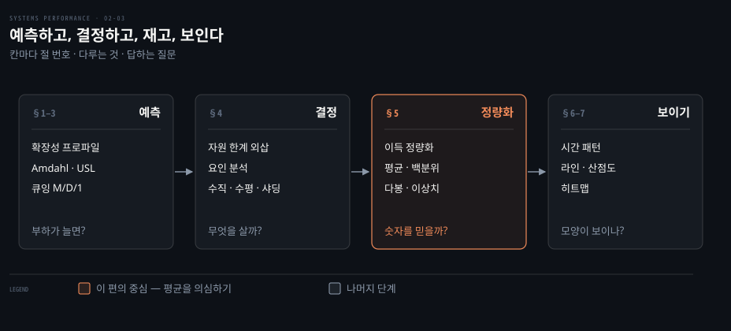
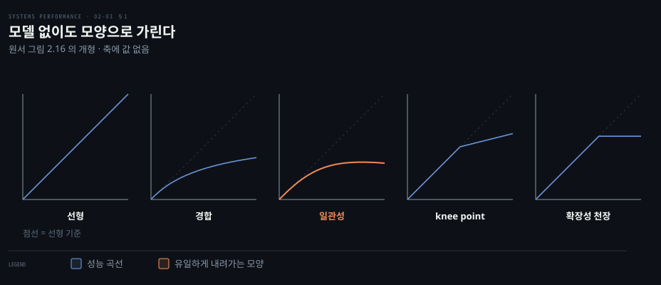
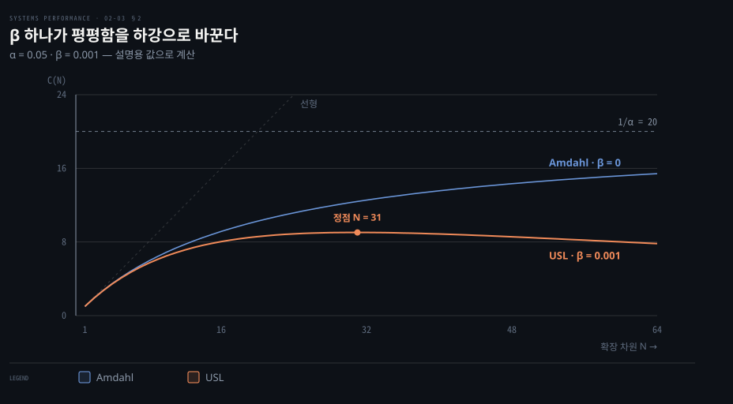
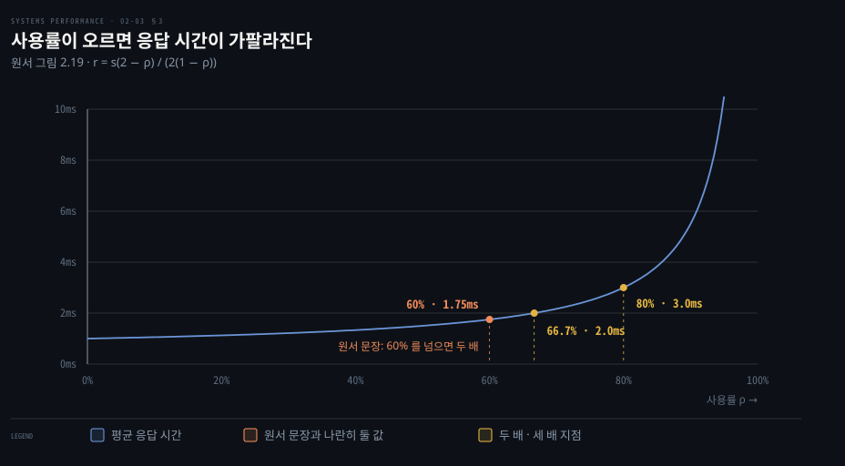
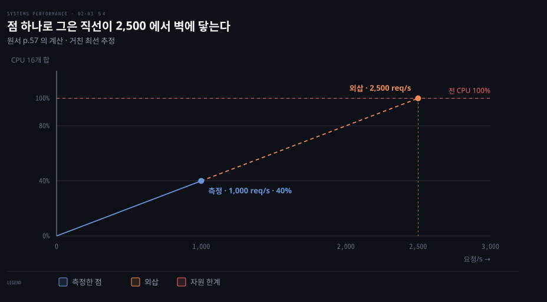
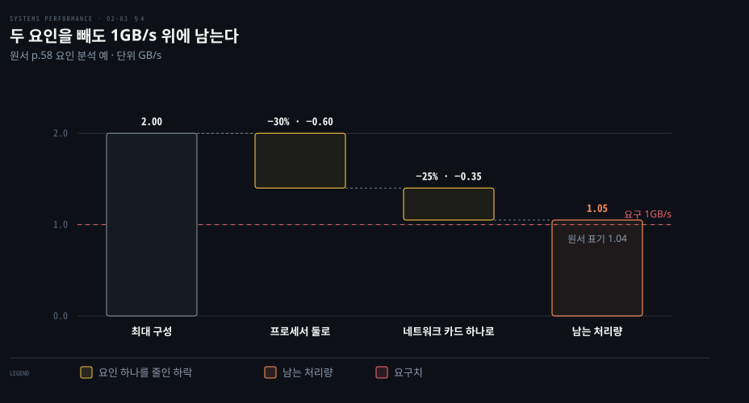
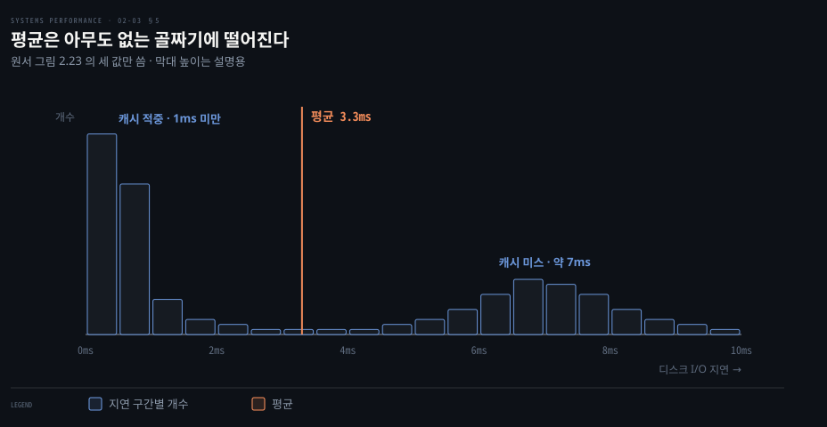
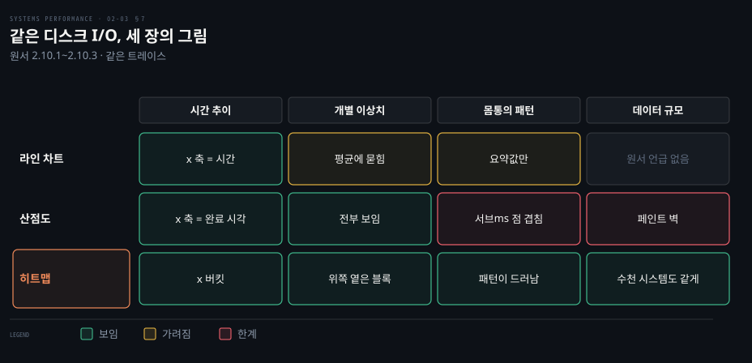

# 방법론 — 모델링·용량계획·통계·시각화
---
> 이 노트는 원서 2.6~2.10 을 다룹니다. 성능을 예측하는 모델링, 미래를 대비하는 용량 계획, 데이터를 정량화하는 통계, 그리고 패턴을 보이는 모니터링·시각화입니다.

## 핵심 요약

> 이 편이 붙든 생각은 하나입니다. 평균 하나로 요약한 숫자는 예측에도 판단에도 부족하고, 분포와 곡선을 봐야 합니다.

성능 평가에는 세 가지 활동이 있습니다. 프로덕션을 관측하는 "측정"과 실험으로 시험하는 "시뮬레이션", 그리고 분석적 모델링입니다. 원서는 이 구분을 Jain 91 에서 가져옵니다. 원서는 이 활동들 가운데 *최소 둘* 을 함께 할 때 성능을 가장 잘 이해한다고 말합니다(p.48). 모델링과 시뮬레이션을 함께 하거나 시뮬레이션과 측정을 함께 하는 식입니다.

이 편은 그 셋째 축인 모델링에서 출발합니다. §1~§3 의 모델은 부하가 늘어날 때 성능이 어디서 꺾이는지 예측합니다. §4 의 용량 계획은 그 예측을 구매나 확장 결정으로 옮깁니다. 그리고 §5~§7 의 통계와 시각화는 측정한 데이터를 읽는 방법을 다룹니다.

세 갈래에는 공통된 교훈이 있습니다. 디스크 사용률 60%의 응답 시간과 평균 3.3ms 의 디스크 지연, 평균 4ms 로 일정해 보이는 라인 차트는 모두 숫자 하나로 요약된 지표입니다. 이런 숫자가 숨긴 모양 때문에 오해를 부릅니다. 곡선과 분포를 그려야 그 숨은 모양이 보입니다.


## 학습 목표

> 이 편을 덮은 뒤 스스로 할 수 있어야 하는 일을 먼저 적어 둡니다.

1. 측정·시뮬레이션·모델링 중 둘을 함께 써야 하는 이유를 대고, 확장성 프로파일 다섯을 그래프 모양으로 구분합니다.
2. Amdahl 법칙과 USL 의 식을 비교해 β 가 곡선에 무엇을 더하는지 설명합니다.
3. M/D/1 식으로 사용률별 응답 시간 배수를 계산하고, 디스크가 100% 전에 느려지는 이유를 설명합니다.
4. 요청당 자원 사용량으로 최대 처리량을 외삽하고, 요인 분석으로 시험 횟수를 줄이는 절차를 적용합니다.
5. 평균이 오해를 부르는 두 경우를 판단하고, 라인 차트·산점도·히트맵 중 데이터에 맞는 시각화를 고릅니다.

아래는 이 편을 구성하는 네 단계입니다. 모델로 성능을 예측하고 그 예측을 바탕으로 용량을 결정합니다. 측정한 데이터를 통계로 정량화하고 모니터링과 시각화로 보여 줍니다. 칸마다 적힌 절 번호는 본문에서 해당 내용을 다루는 곳을 뜻합니다.




## 이 문서가 다루지 않는 것

> 앞뒤 편과 다른 장으로 넘긴 주제를 밝혀 둡니다.

- 사용률과 포화, 확장성, knee point 의 정의는 02-01에서 다룹니다.
- 워크로드 특성 파악이나 마이크로벤치마킹 같은 방법론은 02-02에서 살펴봅니다.
- 벤치마크를 설계하고 실행하는 방법은 12장에서 알아봅니다.
- 자원별 히트맵과 시각화의 실제 예는 6장(CPU)과 8장(파일시스템), 9장(디스크)의 시각화 절이 다룹니다.


## 1. 모델링과 시각적 식별

> 분석적 모델링은 부하나 자원이 늘 때 성능이 어떻게 확장되는지 예측합니다. 결과를 충분히 모아 그리면 모델 없이도 확장성 프로파일을 눈으로 식별할 수 있습니다.

부하가 두 배가 되면 성능도 두 배가 될까요? 분석적 모델링은 이런 *확장성 분석* 에 쓰입니다. 늘리는 대상은 CPU 코어 같은 하드웨어 자원일 수도 있고, 프로세스와 스레드 같은 소프트웨어 자원일 수도 있습니다.

기존 시스템이면 부하와 그 결과 성능을 특성 파악하는 측정 단계에서 시작합니다. 프로덕션 부하가 아직 없거나 프로덕션보다 큰 부하를 시험하려면 워크로드 시뮬레이션으로 실험해야 합니다. 모델링은 측정이나 시뮬레이션 결과를 바탕으로 성능을 예측합니다.

확장성 분석은 자원 제약 탓에 성능이 선형 확장을 멈추는 **knee point** 를 드러냅니다. 원서의 정의로는 한 함수가 다른 함수로 바뀌는 지점입니다. 여기서는 선형 확장에서 경합으로 바뀌는 지점을 뜻합니다. 이런 지점이 있는지, 어디인지를 알면 확장을 막는 문제를 프로덕션에서 만나기 전에 고칠 수 있습니다.

### 엔터프라이즈 vs 클라우드

모델링은 대규모 엔터프라이즈 시스템을 *소유하지 않고* 시뮬레이션하게 해 줍니다. 하지만 대규모 환경의 성능은 복잡해서 정확히 모델링하기 어렵습니다.

클라우드는 어떤 규모의 환경이든 벤치마크 시험 기간만큼 짧게 빌릴 수 있습니다. 그래서 수학 모델을 만드는 대신에 워크로드를 특성 파악하고 시뮬레이션한 뒤 여러 규모의 클라우드에서 *측정* 할 수 있습니다. knee point 같은 발견은 같을 수 있지만 이론이 아니라 측정 데이터에 근거합니다. 그리고 모델에 없던 한계도 드러납니다(p.49).

### 시각적 식별과 확장성 프로파일

실험으로 결과를 충분히 모았다면 전달된 성능을 확장 파라미터에 맞게 그려 봅니다. 그러면 패턴이 보일 수 있습니다. 원서 그림 2.15(p.50)는 스레드 수를 늘리면서 처리량을 그렸더니 8 스레드쯤에서 기울기가 바뀌는 knee point 가 보인 예입니다. 이제 앱과 시스템 설정에서 8 부근의 값을 찾아서 조사합니다.

그 시스템은 코어마다 하드웨어 스레드 둘을 둔 8코어였습니다. 원서는 knee 가 코어 수 때문인지 확인하는 길 둘을 제시합니다. 첫째로 8 스레드 위아래에서 IPC(사이클당 실행한 명령 수) 같은 CPU 효과를 비교합니다. 둘째로 코어 수가 다른 시스템에서 같은 확장 시험을 반복합니다. 그런 뒤에 knee 가 예상대로 옮겨 가는지 살펴보는 것입니다. 스레드를 늘렸는데 IPC 가 떨어진다면 스레드들이 한 코어의 자원을 두고 경합한다는 신호입니다. IPC 는 6장 CPU 가 자세히 다룹니다.

모델 없이 눈으로 식별할 수 있는 프로파일은 다섯입니다(원서 그림 2.16). x 축은 확장 차원이고 y 축은 결과 성능(처리량이나 초당 트랜잭션 등)입니다.



| 프로파일 | 뜻 |
|----------|-----|
| 선형(linear) | 자원이 늘수록 성능이 비례해 증가. 영원히 이어지지 않고 다른 패턴의 초기 단계일 수 있음 |
| 경합(contention) | 공유·직렬 자원 경합이 확장 효과를 깎기 시작 |
| 일관성(coherence) | 데이터 일관성 유지(변경 전파) 비용이 확장 이득을 넘어섬 |
| knee point | 확장점에서 한 요인이 프로파일을 바꿈 |
| 확장성 천장(ceiling) | 하드 리밋(버스·인터커넥트 최대, 또는 SW 자원 제어) |


## 2. 확장성 법칙 — Amdahl·USL

> Amdahl 법칙은 병렬화되지 않는 *직렬* 구성 요소를 반영해 확장을 모델링하고(경합 프로파일), USL 은 거기에 *일관성 지연* 파라미터를 더합니다(일관성 프로파일). 둘 다 데이터를 모아 회귀 분석으로 파라미터를 구합니다.

시각적 식별은 쉽고 효과적입니다. 하지만 수학 모델을 쓰면 시스템의 확장성을 더 배울 수 있습니다. 모델이 데이터에서 예상 밖으로 벗어나는 자리는 조사할 가치가 있습니다. 왜냐하면 모델, 즉 내 이해에 문제가 있거나 시스템의 실제 확장성에 문제가 있다는 뜻이기 때문입니다.

### Amdahl 법칙

컴퓨터 설계자 Gene Amdahl 의 이름을 딴 이 법칙은 워크로드 가운데 병렬로 확장되지 않는 직렬 구성 요소를 반영해서 확장성을 모델링합니다. 앞서 살펴본 *경합* 프로파일이 이것입니다.

```pseudocode
C(N) = N / (1 + α(N − 1))
```

C(N) 은 상대 용량이고 N 은 CPU 수나 사용자 부하 같은 확장 차원입니다. α(0 ≤ α ≤ 1)는 직렬성의 정도입니다. 그래서 선형 확장에서 얼마나 벗어나는지를 나타냅니다.

적용은 세 단계입니다. 먼저 관측이나 마이크로벤치마크, 부하 생성기로 N 범위의 데이터를 모읍니다. 다음에 회귀 분석으로 α 를 구합니다. 이때 gnuplot 이나 R 같은 통계 소프트웨어를 씁니다. 마지막으로 데이터 점과 모델 함수를 함께 그려서 확장을 예측하고 데이터와 모델의 차이를 살펴봅니다.

원서는 회귀 단계가 어떤 모양인지 보이려고 gnuplot 코드 일부를 싣습니다(p.51).

```pseudocode
# gnuplot — 원서 p.51 발췌
inputN = 10                     # 모델 입력으로 쓸 행 수
alpha = 0.1                     # 시작값(seed)
amdahl(N) = N1 * N/(1 + alpha * (N - 1))
# 회귀 분석(비선형 최소제곱 적합)
fit amdahl(x) filename every ::1::inputN using 1:2 via alpha
```

이 코드는 발췌한 내용이라서 그대로 돌아가지 않습니다. 데이터 파일 `filename` 과 N=1 일 때의 처리량 `N1` 은 원서가 가리키는 Performance Scalability Models toolkit 의 전체 코드(Gregg 14a)에서 정의합니다. R 로는 `nls()` 함수를 이용해서 같은 비선형 최소제곱 적합 작업을 합니다.

### USL(Universal Scalability Law)

Neil Gunther 가 *일관성 지연* 파라미터를 더해서 만든 모델입니다. 예전 이름은 super-serial model 입니다(Gunther 97). 앞서 살펴본 *일관성* 프로파일이 이것입니다. 경합 효과도 포함합니다.

```pseudocode
C(N) = N / (1 + α(N − 1) + βN(N − 1))
```

C(N) 과 N, α 는 Amdahl 과 같습니다. 그리고 β 가 일관성 파라미터입니다. β = 0 이면 Amdahl 법칙이 됩니다.



두 곡선은 같은 α 를 쓰고 β 만 다릅니다. Amdahl 곡선은 1/α 를 향해서 평평해질 뿐 내려가지 않습니다. USL 곡선은 βN(N − 1) 항이 N 의 제곱으로 커집니다. 따라서 정점을 지나서 내려갑니다. 이 하강이 02-01 §8 에서 본 "처리량이 *감소* 하는" 구간을 식으로 표현한 것입니다.

원서 그림 2.17(p.52)은 분산이 큰 데이터셋에 두 모델을 적합한 예입니다. 원으로 찍은 처음 10개 점을 모델에 넣습니다. ×로 찍은 나머지 10개 점으로는 모델의 예측을 현실과 대조해 봅니다. 분산이 커서 눈으로는 프로파일을 가리기 어려운 데이터도 이렇게 모델로 판별할 수 있습니다.


## 3. 큐잉 이론 — 디스크는 왜 60%부터 느려지나

> 큐잉 이론은 큐가 있는 시스템의 큐 길이·대기 시간·사용률을 수학으로 분석합니다. M/D/1 디스크 모델은 사용률이 오르면 응답 시간이 빠르게 늘어나는 이유를 보여 줍니다.

부하가 두 배가 되면 평균 응답 시간은 얼마가 될까요? 프로세서를 하나 더하면 응답 시간은 어떻게 바뀔까요? 부하가 두 배일 때도 90분위 응답 시간을 100ms 아래로 지킬 수 있을까요? 원서는 큐잉 이론이 이런 질문에 답한다고 합니다(p.53).

큐잉 이론은 큐가 있는 시스템을 수학으로 연구합니다. 이 이론은 큐 길이와 대기 시간(지연), 시간 기반 사용률을 분석합니다. 컴퓨팅의 많은 소프트웨어와 하드웨어 구성 요소를 큐잉 시스템으로 모델링할 수 있습니다. 여러 큐잉 시스템을 함께 모델링한 것을 큐잉 네트워크라 부릅니다.

직관적으로 말하면 이 이론은 요청이 얼마나 자주 도착하고 하나를 처리하는 데 얼마나 걸리는지만으로 줄에서 기다리는 시간을 예측합니다. 이 이론은 확률 분포와 확률 과정, Erlang C 공식, Little 의 법칙을 바탕으로 합니다. 큐잉 이론을 처음 만든 사람이 Agner Krarup Erlang 입니다. 이 중에서 **Little 의 법칙** 이 가장 기본입니다.

```pseudocode
L = λW
```

시스템 안 평균 요청 수 L 은 평균 도착률 λ 와 평균 체류 시간 W 의 곱입니다. 이 법칙을 큐에 적용하면 L 은 큐 안 요청 수이고 W 는 큐에서의 평균 대기 시간입니다.

큐잉 시스템은 세 가지 요인으로 분류합니다. 도착 과정은 요청 사이 간격의 분포입니다. 이 분포에는 무작위와 고정 간격, 푸아송 과정(도착 간격이 지수 분포) 등이 있습니다. 서비스 시간 분포는 고정(결정적) 분포나 지수 분포 등입니다. 마지막 요인은 서비스 센터 수로 하나 또는 여럿입니다.

이 세 요인을 **Kendall 표기 `A/S/m`** 으로 적습니다. 버퍼 수와 모집단 크기, 서비스 규율까지 담는 확장 표기도 존재합니다.

| 표기 | 뜻 |
|------|-----|
| M/M/1 | Markovian 도착·Markovian 서비스·1 센터 |
| M/M/c | M/M/1의 다중 서버 |
| M/G/1 | Markovian 도착·일반 분포 서비스·1 센터. 일반 분포는 고정(D)도 지수 분포(M)도 아닌 임의 분포라는 뜻 (회전 디스크 연구에 흔히) |
| M/D/1 | Markovian 도착·결정적(고정) 서비스·1 센터 |

### M/D/1과 60% 사용률

디스크가 워크로드에 결정적으로 응답한다고 단순화하면 M/D/1 모델이 됩니다. 이제 사용률이 오를 때 응답 시간이 어떻게 변하는지 계산할 수 있습니다. 응답 시간 r 을 서비스 시간 s 와 사용률 ρ 로 쓰면 다음 수식과 같습니다. 원서 R 코드(p.55)도 이 우선순위로 계산합니다.

```pseudocode
r = s(2 − ρ) / (2(1 − ρ))
```

서비스 시간 1ms 로 사용률 0~100%를 그리면 아래 곡선과 같습니다.



원서는 이 그래프를 두고 "60% 사용률을 넘으면 평균 응답 시간이 두 배가 되고, 80%에서는 세 배가 된다"고 적습니다(p.55). 같은 공식으로 계산하면 ρ = 0.6 에서 1.75배이고 ρ ≈ 0.67 에서 2.0배, ρ = 0.8 에서 3.0배입니다. 80% 에서 세 배가 되는 것은 계산과 같습니다. 하지만 60% 의 두 배는 계산값 1.75배와 다릅니다. 원서는 이 근사의 근거를 따로 밝히지 않습니다. 원서 문장이 그래프를 읽은 근사 표현인지는 이 노트에서 판정하지 않고 두 값을 나란히 둡니다.

어느 쪽이든 결론은 같습니다. 디스크 I/O 지연은 앱의 한계 자원일 때가 많습니다. 그래서 평균 지연이 두 배 이상이 되면 앱 성능에 큰 타격을 줍니다. 디스크는 대개 요청을 중간에 끊지 못하고 차례를 기다려야 하는 큐잉 시스템입니다. 이 때문에 사용률이 100%에 닿기 *훨씬 전부터* 문제가 됩니다. 이는 높은 우선순위 일이 선점할 수 있는 CPU와 다른 점입니다.

사용률이 부하에 비례한다고 가정해 보겠습니다. 그러면 이 그래프는 앞의 첫 질문인 "부하가 두 배가 되면 평균 응답 시간은?"에 눈으로 답해 줍니다.

이 단순 모델은 어떤 면에서 *최선의 경우* 입니다. 서비스 시간이 변하면 평균 응답 시간은 더 길어집니다(M/G/1, M/M/1). 그림에 없는 응답 시간 분포도 존재합니다. 90분위와 99분위는 60% 를 넘으면 평균보다 훨씬 빠르게 나빠집니다.


## 4. 용량 계획

> 용량 계획은 부하가 늘 때 시스템이 얼마나 감당하고 어떻게 확장할지 봅니다. 자원 한계 분석으로 병목 될 자원을 찾고, 요인 분석으로 최소 비용 구성을 정하며, 수직·수평 확장과 샤딩으로 풉니다.

용량 계획(capacity planning)은 앞의 모델링으로도 하고 아래의 자원 한계 분석과 요인 분석으로도 진행합니다. 특정 앱의 용량을 계획하려면 정량화된 성능 목표가 있어야 도움이 됩니다. 그 목표를 정하는 일은 5장이 다룹니다. 더 깊은 내용으로 원서는 Allspaw 08(The Art of Capacity Planning)을 권합니다.

### 자원 한계 분석

이 방법은 부하에서 병목이 될 자원을 찾습니다. 컨테이너라면 소프트웨어가 건 한도가 병목이 될 수도 있습니다. 절차는 네 단계입니다.

1. 서버 요청률을 재고 시간에 따라 측정해 봅니다.
2. 하드웨어와 소프트웨어 자원 사용량을 재고 시간에 따라 모니터링합니다.
3. 요청을 자원 사용량으로 나타냅니다.
4. 자원마다 알려진(또는 실험으로 정한) 한계까지 외삽합니다.

먼저 서버의 역할과 요청 유형을 정합니다. 웹 서버는 HTTP 요청을, NFS 서버는 NFS 프로토콜 연산을, DB 서버는 쿼리 요청을 처리합니다. 하드웨어 쪽 감시 자원은 CPU 사용률과 메모리 사용량, 디스크 IOPS, 처리량, 용량, 네트워크 처리량입니다. 소프트웨어 쪽은 가상 메모리 사용량과 프로세스/태스크/스레드, 파일 디스크립터입니다.

원서의 예는 초당 1,000 요청을 처리하는 기존 시스템입니다(p.57). 가장 바쁜 자원은 CPU 16개이고 평균 40% 사용률을 보입니다. 그래서 100%에 닿으면 병목이 될 것으로 예상합니다.

```pseudocode
요청당 CPU% = 16 × 40% / 1,000 = 0.64%
최대 요청/s = 100% × 16 / 0.64% = 1,600 / 0.64 = 2,500 요청/s
```



2,500 요청/s 에서 CPU가 100%가 되리라는 예측은 거친 최선 추정입니다. 다른 한계가 먼저 올 수 있기 때문입니다. 이 계산은 데이터 점 하나만 썼습니다. 그래서 모니터링으로 처리량과 사용률이 다른 여러 점을 모으면 추정이 정확해집니다(원서 그림 2.20).

2,500 요청/s 면 충분할까요? 이에 답하려면 *피크 워크로드* 를 알아야 합니다. 하루 10만 히트는 많아 보여도 평균 1 요청/s 에 불과합니다. 그런데 10만 히트 대부분이 새 콘텐츠를 올린 직후 몇 초에 몰린다면 피크는 큽니다.

### 요인 분석

새 시스템을 사서 배치할 때는 바꿀 수 있는 요인이 많습니다. 디스크와 CPU 수, RAM 양, 플래시 사용, RAID 구성, 파일시스템 설정 같은 것입니다. 보통 과제는 *최소 비용으로 필요한 성능* 을 내는 것입니다.

모든 조합을 시험하면 가격 대비 성능이 가장 좋은 조합을 찾을 수 있지만 금방 감당이 안 됩니다. 요인이 이진 요인 8개면 256번을 시험해야 합니다. 원서는 최대 구성을 알 때 쓰는 절차를 제시합니다(p.58).

1. 모든 요인을 최대로 두고 성능을 잽니다.
2. 요인을 하나씩 바꿔 가며 잽니다(바꿀 때마다 성능이 떨어져야 합니다).
3. 측정값으로 요인마다 성능 하락 %를 매기고 비용 절감액을 함께 적습니다.
4. 최대 성능(과 최대 비용)에서 출발해 하락을 합친 결과가 필요한 요청/s 를 지키는 선에서 비용을 아낄 요인을 고릅니다.
5. 계산한 구성을 다시 시험해 성능을 확인합니다.

이렇게 하면 요인 8개짜리 시스템도 열 번 안팎의 시험으로 끝날 수 있습니다.

원서의 예는 읽기 처리량 1GB/s 와 작업 집합 200GB 가 요구되는 새 스토리지입니다. 최대 구성은 2GB/s 를 내며 프로세서 넷, DRAM 256GB, 듀얼 포트 10GbE 카드 둘, 점보 프레임, 압축과 암호화 끔으로 이뤄집니다. 측정한 하락은 다음과 같습니다.

| 바꾼 요인 | 성능 하락 |
|-----------|----------|
| 프로세서 둘로 | 30% |
| 네트워크 카드 하나로 | 25% |
| 점보 프레임 끔 | 35% |
| 암호화 켬 | 10% |
| 압축 켬 | 40% |
| DRAM 축소(작업 집합이 다 안 들어감) | 90% |



원서는 프로세서 둘과 네트워크 카드 하나인 구성이 요구를 맞춘다고 보고 그 처리량을 `2 × (1 – 0.30) × (1 – 0.25) = 1.04 Gbytes/s` 로 적습니다. 같은 식을 계산하면 1.05GB/s 입니다. 두 값 중 어느 쪽이든 요구 1GB/s 를 넘는다는 결론은 똑같습니다. 원서는 부품들을 함께 쓸 때 예상과 다르게 동작할 수 있으니 이 구성을 다시 시험하라고 덧붙입니다.

### 확장 솔루션

| 전략 | 뜻 |
|------|-----|
| 수직 확장(vertical) | 더 큰 시스템 |
| 수평 확장(horizontal) | 여러 시스템에 부하 분산(로드밸런서가 하나처럼 보이게) |
| auto scaling(ASG) | 사용 지표로 인스턴스를 자동 증감(Netflix는 CPU 60% 목표). K8s는 HPA로 Pod 증감 |
| 샤딩(sharding) | DB 데이터를 논리 조각으로 나눠 각자 DB가 관리(샤딩 키 선택이 관건) |

클라우드는 전체 시스템이 아니라 더 작은 가상 시스템 단위로 수평 확장을 더 잘게 나눕니다. 클라우드는 메인프레임처럼 지원 계약까지 묶인 초기 대량 구매가 없습니다. 그래서 프로젝트 초기에는 엄격한 용량 계획의 필요가 줄어듭니다(p.59).

샤딩 키의 예로 원서는 고객 DB를 고객 이름의 알파벳 범위로 나누는 경우를 듭니다. 부하를 DB 들에 고르게 퍼뜨리는 키를 고르는 것이 관건입니다.


## 5. 통계 — 평균의 함정

> 성능 이득은 신뢰할 지표로 정량화해야 비교하고 우선순위를 매길 수 있습니다. 평균은 디테일을 숨기는 요약이라, 이상치와 다봉분포 앞에서 오해를 부릅니다.

### 성능 이득 정량화

이슈와 잠재 개선을 정량화하면 비교하고 우선순위를 매길 수 있습니다. 이를 위한 방법은 관측 기반과 실험 기반 두 가지입니다(p.60).

관측 기반은 신뢰할 지표를 고르고 문제 해결 시 이득을 추정합니다. 예를 들어 요청 10ms 중 9ms 가 디스크 I/O라고 가정해 봅니다. 그러면 메모리 캐싱으로 그 9ms 를 약 10μs 의 DRAM 지연으로 바꿀 수 있습니다. 결과적으로 10ms 가 1.01ms(10ms − 9ms + 10μs)가 되어 약 9배 이득을 봅니다.

지연(시간)은 구성 요소끼리 직접 비교되므로 이런 계산에 잘 맞습니다. 단 지연은 앱 요청의 *동기* 구성 요소로 측정해야 합니다. 백그라운드 디스크 쓰기(write flush) 같은 비동기 이벤트는 앱 성능에 직접적인 영향이 없습니다.

실험 기반은 수정을 적용하고 전후를 비교합니다. 예를 들어 앱 스레드 수를 늘려 큐잉 대신 동시성을 허용했습니다. 이로 인해 트랜잭션 지연 평균이 10ms 에서 2ms 가 됐다면 5배 이득입니다. 수정을 프로덕션에 시험하는 비용이 크면 이 방법은 맞지 않습니다. 이럴 때는 관측 기반을 씁니다.

### 평균의 종류와 함정

| 평균 | 쓰임 |
|------|------|
| 산술 평균(mean) | 합/개수 — 가장 흔함 |
| 기하 평균 | n제곱근 — 곱셈 효과(예: 커널 네트워크 스택 계층별 개선) |
| 조화 평균 | 개수/역수합 — 비율의 평균(예: 평균 전송률) |
| 시간 평균 | 대부분 지표가 시간에 대한 평균(CPU "50% 사용률"은 *어떤 간격* 의 50%) |
| 감쇠 평균(decayed) | 최근에 더 가중(load average) — 단기 변동을 완화 |

조화 평균은 원서의 예로 보면 이해하기 쉽습니다(p.61). 800MB 를 보내는데 처음 100MB 는 50MB/s 로 보냅니다. 나머지 700MB 는 제한이 걸려 10MB/s 로 보냅니다. 이럴 때 평균 전송률은 다음과 같습니다.

```pseudocode
800 / (100/50 + 700/10) = 800 / 72 ≈ 11.1 MB/s
```

두 속도를 단순 산술 평균하면 30MB/s 가 나옵니다. 하지만 실제로는 대부분의 시간을 느린 구간에서 보냅니다. 따라서 평균 전송률은 11.1MB/s 가 맞습니다.

평균은 디테일을 숨기는 요약입니다. 저자는 평균 지연이 1ms 에 가까운데 가끔 100ms 를 넘는 디스크 I/O 이상치가 있던 사례를 여럿 분석했다고 합니다. 이와 함께 *간격* 도 늘 확인해야 합니다. 모니터링은 CPU 사용률이 80%를 넘은 적이 없다고 했습니다. 하지만 5분 평균이 초 단위로 100%를 친 구간을 숨겼습니다. 그래서 실제로는 CPU 포화(스케줄러 지연)였던 고객 사례가 있습니다.

### 표준편차·백분위·중앙값과 다봉분포

표준편차는 분산의 척도로 클수록 평균에서 더 퍼져 있습니다. 99분위는 전체 값의 99%가 드는 지점입니다. 90분위와 95분위, 99분위, 99.9분위는 요청 지연 중 *가장 느린* 쪽을 정량화합니다. 이 값은 SLA 에도 쓰입니다. 50분위인 중앙값은 데이터의 몸통이 어디 있는지 보여 줍니다.

표준편차는 평균에 상대적이라 둘을 함께 봐야 분산을 제대로 이해합니다. 표준편차 50 만으로는 알 수 있는 게 적습니다. 하지만 평균 200 이 함께 있으면 많은 걸 압니다. 이 비율을 한 지표로 쓴 것이 *변동계수(CoV = 표준편차/평균)* 이고 이 예에서는 25%입니다(p.63). 이 계수가 낮을수록 변동이 적습니다.

변동을 한 지표로 나타내는 다른 방법은 z 값입니다. 이 값은 원래 값이 평균에서 표준편차 몇 개만큼 떨어졌는지를 나타냅니다. 계산식은 (값 − 평균) / 표준편차 와 같습니다. z 값이 크면 그 값을 이상치로 의심하는 근거로 씁니다.

문제는 평균과 표준편차, 백분위가 *정규/단봉분포* 를 전제로 한다는 점입니다. 시스템 성능은 흔히 *이중모드(bimodal)* 를 보입니다. 빠른 코드 경로와 느린 코드 경로, 캐시 적중과 미스가 각자 봉우리를 만듭니다. 게다가 봉우리가 셋 이상일 수도 있습니다.

원서 그림 2.23(p.63)은 읽기와 쓰기, 랜덤과 순차가 섞인 디스크 I/O 지연 히스토그램입니다. 왼쪽 봉우리는 1ms 미만으로 온디스크 캐시 적중 구간을 뜻합니다. 온디스크 캐시는 디스크 장치 자체에 달린 캐시입니다. 오른쪽 봉우리는 7ms 부근으로 캐시 미스 구간을 말합니다. 원서는 이를 랜덤 읽기라 부릅니다. 랜덤 읽기는 헤드 탐색이 필요한 비순차 읽기를 의미합니다. 두 용어는 9장 디스크가 자세히 다룹니다.



평균 3.3ms 는 어느 봉우리에도 없습니다. 원서는 이 평균이 중심 경향을 나타내기는커녕 거의 그 반대라고 지적합니다. 그래서 이 평균은 지표로서 심각하게 오해를 부른다고 말합니다.

> "평균 깊이 6인치인 개울을 건너다 빠져 죽은 사람이 있었다." — W. I. E. Gates. 성능 지표로 평균(특히 평균 지연)을 볼 때마다 *분포가 어떤가* 를 물어야 합니다.

### 이상치(outliers)

이상치는 기대 분포에 맞지 않는 극소수의 극단값입니다. 이는 아주 높을 수도 아주 낮을 수도 있습니다. 대부분 0~10ms 인 디스크 I/O 중 가끔 1,000ms 를 넘는 사례가 좋은 예입니다. TCP 타이머 기반 재전송 때문에 생긴 네트워크 지연 이상치도 또 다른 예입니다. 원서는 이런 이상치가 심각한 성능 문제를 일으킨다고 강조합니다. 하지만 대부분의 지표로는 최댓값이 아니면 이 현상이 드러나지 않는다고 합니다(p.64).

정규분포에서는 이상치가 평균을 조금 움직이지만 중앙값은 움직이지 않을 것입니다. 표준편차와 99분위는 이상치를 잡을 가능성이 더 높습니다. 하지만 그것도 이상치의 빈도에 달렸습니다. 다봉분포와 이상치를 제대로 파악하려면 히스토그램 같은 방식으로 *전체 분포* 를 봐야 합니다.


## 6. 모니터링

> 모니터링은 성능 통계를 시간에 따라 기록해 과거와 현재를 비교하고 시간 기반 사용 패턴을 식별합니다. 모니터링이 없으면 summary-since-boot 라도 확인합니다.

지금 보는 값이 정상 범위인지 알려면 과거 값이 있어야 합니다. 시스템 성능 모니터링은 통계를 시계열(time series)로 기록해 둡니다. 이를 통해 과거와 현재를 비교하고 사용 패턴을 식별합니다. 모니터링은 용량 계획과 성장 정량화, 피크 식별에 쓰입니다. 또한 지난 "정상" 범위와 평균이 현재 값을 해석할 맥락을 줍니다.

원서 그림 2.24~2.26(p.65)은 한 클라우드 서버의 파일시스템 읽기를 하루와 5일, 30일 단위로 그린 것입니다. 오전 8시쯤부터 오르고 오후에 조금 꺼졌다가 밤에 줄어드는 일간 패턴이 보입니다. 긴 차트에서는 주말 활동이 낮습니다. 게다가 30일 차트에는 짧은 스파이크도 몇 개 나타납니다.

이것은 흔히 보이는 시간 기반 패턴입니다.

| 주기 | 예 |
|------|-----|
| 시간별(hourly) | 모니터링·리포트 작업(5·10분 주기도 흔함) |
| 일별(daily) | 업무 시간(9~5) 패턴, 야간 로그 로테이션·백업 |
| 주별(weekly) | 평일/주말 패턴 |
| 분기별 | 재무 리포트 |
| 연별 | 학사 일정·휴가 |

불규칙한 증가(새 콘텐츠 공개나 블랙프라이데이)나 감소(정전이나 인터넷 장애, 스포츠 결승)도 존재합니다. 원서 각주에 따르면 저자는 Netflix SRE 당번 때 이런 경우를 위한 비전통적 도구를 배웠습니다. 정전이 의심되면 소셜 미디어를 봅니다. 스포츠 결승이 있는지는 팀 채팅에 묻는 것입니다.

모니터링 제품은 *exporter(에이전트)* 로 통계를 모읍니다. OS 도구의 텍스트 출력을 파싱하는 방식은 비효율적입니다. 그래서 OS 라이브러리와 커널 인터페이스를 직접 읽는 방식도 씁니다. 분산과 클라우드가 커질수록 수백~수천 시스템을 한 인터페이스로 보는 중앙 모니터링이 중요해집니다. Netflix 는 20만 넘는 인스턴스를 자체 제작한 오픈 소스 Atlas 로 관리합니다.

모니터링이 없으면 OS 가 주는 *summary-since-boot* 값이라도 있는지 확인해 현재와 비교합니다.


## 7. 시각화

> 시각화는 텍스트로는 이해하거나 표시하기 어려운 양의 데이터를 보게 하고 패턴 인식을 돕습니다. 라인 차트는 시간 추이를, 산점도는 모든 점을 보이고, 히트맵은 산점도의 확장성·밀도 한계를 풉니다.

시각화는 프로그래밍으로는 어렵지만 눈으로는 쉬운 상관관계 식별에 효과적입니다. 원서는 MySQL 을 돌리는 프로덕션 클라우드 서버에서 느린 쿼리의 원인으로 디스크 I/O 지연을 의심한 한 사례를 다룹니다. 이 사례를 세 차트로 차례로 그립니다(p.67–69).



| 시각화 | 보여 주는 것 | 한계 |
|--------|------------|------|
| 라인 차트(line chart) | 시간 추이(x=시간). 평균·중앙값·표준편차·백분위를 여러 선으로 | 분포 디테일은 요약돼 가려짐 |
| 산점도(scatter plot) | 모든 I/O를 점으로(x=완료시각·y=지연). 이상치를 그대로 드러냄 | 점이 겹쳐 분해능 한계, 데이터 많으면 "페인트 벽" |
| 히트맵(heat map) | x·y를 버킷으로 양자화해 색으로 표시. 한 시스템도 수천 시스템도 같게 | (양자화로 산점도 한계를 해결) |

### 라인 차트

20초 동안의 평균 디스크 I/O 지연을 그린 라인 차트는 약 4ms 로 꽤 일정해 보입니다. 이 디스크로서는 기대보다 높은 값입니다. 같은 데이터에 초당 중앙값과 표준편차, 백분위 선을 더하면 y 축 범위가 8배로 커집니다. 이렇게 되면 평균이 높은 이유가 드러납니다. I/O 의 1%가 20ms 를 넘습니다(99분위). 중앙값은 기대했던 자리인 약 1ms 에 있습니다.

### 산점도

산점도는 모든 데이터를 보여 줍니다. 디스크 I/O 마다 점 하나를 x=완료 시각, y=지연 자리에 찍습니다. 10ms 와 20ms, 심지어 50ms 를 넘는 I/O가 많이 보입니다. 이로써 평균이 기대보다 높은 이유가 완전히 이해됩니다.

한계도 여기서 보입니다. 많은 I/O가 서브밀리초라 x 축 근처에 겹쳐 서로 구분되지 않습니다. 데이터가 늘수록 나빠집니다. 클라우드 전체의 수백만 점을 한 산점도에 찍으면 점이 합쳐져 "페인트 벽"이 됩니다. 모든 I/O 의 x 와 y 좌표를 모으고 처리해야 하는 데이터 양도 문제입니다.

### 히트맵

산점도의 두 한계를 함께 푸는 것이 **히트맵**(정확히는 column quantization)입니다. 히트맵은 x 와 y 범위를 버킷으로 묶어 큰 픽셀로 칠합니다. 그리고 그 범위의 이벤트 수로 색을 정합니다. 이 양자화 덕분에 한 시스템의 데이터도 수천 시스템의 데이터도 같은 방식으로 보여 줍니다.

히트맵은 그전에도 디스크 오프셋 같은 위치를 보이는 데 쓰였습니다(TazTool). 저자는 지연과 사용률 같은 지표에 히트맵을 쓰는 방법을 고안했습니다. 그래서 지연 히트맵은 2008년 Sun ZFS Storage 어플라이언스의 Analytics 에 처음 들어갔습니다. 지금은 Grafana 같은 모니터링 제품에 흔합니다(p.68).

높은 지연 이상치는 히트맵 위쪽의 블록으로 보입니다. 이 이상치는 대개 I/O 하나뿐이라 옅은 색입니다. 산점도로는 볼 수 없던 데이터 몸통의 패턴도 드러납니다. 같은 트레이스의 전체 구간을 그린 히트맵은 범위가 9배인데도 잘 읽힙니다(p.69).

이 히트맵에서 보이는 이중모드는 거의 0인 지연과 1ms 조금 아래의 지연입니다. 원서는 앞쪽을 디스크 캐시 적중으로 여기고 뒤쪽을 캐시 미스로 추정합니다. §5 의 히스토그램(1ms 미만과 7ms 부근)과는 다른 데이터셋이라 봉우리 위치가 다릅니다.

### 그 밖의 시각화와 도구

타임라인 차트는 활동을 시간축 위의 막대로 보입니다. 웹 브라우저의 프론트엔드 분석에서는 이를 waterfall 차트라 부르며 네트워크 요청의 시점을 보여 줍니다. 여기에 명시적인 의존성 화살표를 넣으면 Gantt 차트의 한 종류가 됩니다. 서버 쪽에서는 스레드나 CPU 의 타임라인을 KernelShark 와 Trace Compass 로 그립니다(p.70).

표면도(surface plot)는 3차원을 표면으로 그립니다. 이 시각화는 와이어프레임으로 렌더링할 때가 많습니다. 원서 그림 2.33 은 물리 서버 300대 넘게, CPU 5,312개를 담은 데이터센터 이미지의 일부입니다. 서버마다 CPU 16개를 행으로 두고 60초의 초당 사용률을 열로 놓은 16×60 사각형을 체커보드처럼 깝니다. 그리고 높이를 사용률로 정했습니다. CPU 가 거의 늘 100%인 서버는 솟은 고원으로 보입니다.

Unix 성능 분석은 그래픽 지원이 부족해 빠른 텍스트 도구에 치우쳐 왔습니다. 시각화는 접근이 느리고 트레이스 후 보고하는 주기가 필요했습니다. 긴급 이슈에서는 지표에 닿는 *속도* 가 결정적입니다. 따라서 브라우저와 모바일에서 실시간 뷰를 주는 현대 도구가 그 간극을 메웁니다.


## 학습 점검

> 이 노트의 핵심을 스스로 떠올려 봅니다. 답이 막히면 해당 섹션으로 돌아가 확인합니다.

- 성능 평가의 세 활동(측정·시뮬레이션·모델링)과, 왜 최소 둘을 함께 해야 하는지 말해 봅니다. (→ 도입, §1)
- 확장성 프로파일 다섯(선형·경합·일관성·knee point·천장)을 구분하고, Amdahl과 USL의 차이(β)를 설명해 봅니다. (→ §1, §2)
- M/D/1 디스크 모델에서 60% 사용률부터 응답 시간이 두 배가 되는 이유와, 이것이 CPU와 어떻게 다른지 떠올려 봅니다. (→ §3)
- 자원 한계 분석으로 1,000 요청/s·16 CPU 40%에서 최대 요청/s를 계산하는 과정을 설명해 봅니다. (→ §4)
- 평균이 위험한 두 경우(이상치·다봉분포)와, "평균 깊이 6인치 개울" 비유가 무엇을 뜻하는지 말해 봅니다. (→ §5)
- 라인 차트·산점도·히트맵이 각각 무엇을 보여 주고 무엇을 못 보는지, 히트맵이 산점도의 어떤 한계를 푸는지 설명해 봅니다. (→ §7)


## 정답 (자답 후 펼치기)

> 먼저 답한 뒤 읽습니다. 판단 근거와 흔한 오해를 함께 적습니다.

### 정답 1 — 세 활동과 둘을 함께 쓰는 이유

이 세 활동은 프로덕션 관측인 측정, 실험 시험인 시뮬레이션, 분석적 모델링입니다. 하나만 쓰면 그 활동의 맹점을 다른 활동으로 확인할 길이 없습니다. 모델은 측정이나 시뮬레이션 데이터로 파라미터를 정합니다. 거꾸로 데이터가 모델에서 벗어나는 자리가 조사할 곳을 알려 줍니다. 여기서 대표 오해는 클라우드에서 측정이 쉬워졌으니 모델이 필요 없다고 보는 것입니다. 모델은 측정 데이터가 이상한지 판별하는 기준이 됩니다.

### 정답 2 — 확장성 프로파일과 β

다섯은 선형과 경합, 일관성, knee point, 확장성 천장입니다. 경합은 직렬 구성 요소 때문에 확장 효과가 줄어드는 모양입니다. Amdahl 법칙의 α 가 이를 나타냅니다. USL 은 βN(N − 1) 항을 더해 일관성 유지 비용을 넣습니다. 그래서 이 항이 N 의 제곱으로 커져 곡선이 정점 뒤에 내려갑니다. 대표 오해는 Amdahl 곡선도 결국 내려간다고 보는 것입니다. Amdahl 곡선은 1/α 를 향해 평평해질 뿐입니다.

### 정답 3 — M/D/1 과 60%

`r = s(2 − ρ) / (2(1 − ρ))` 로 계산하면 ρ = 0.6 에서 1.75배이고 ρ ≈ 0.67 에서 2배, ρ = 0.8 에서 3배입니다. 원서는 "60%를 넘으면 두 배"라고 적었으니 이 두 값을 함께 기억합니다. 디스크는 대개 요청을 중간에 끊을 수 없어 차례를 기다려야 합니다. 그래서 사용률이 오를수록 큐잉 지연이 커집니다. 이는 높은 우선순위 일이 선점할 수 있는 CPU와 다른 점입니다. 여기서 대표 오해는 디스크 사용률 100%가 될 때까지는 괜찮다고 보는 것입니다.

### 정답 4 — 자원 한계 외삽

요청당 CPU% 는 16 × 40% / 1,000 = 0.64% 와 같습니다. 전 CPU 100%, 곧 1,600% 를 0.64% 로 나누면 2,500 요청/s 가 최대 추정치입니다. 이것은 다른 한계가 먼저 오지 않는다는 거친 최선 추정입니다. 그리고 데이터 점이 하나라 여러 점을 모으면 정확해집니다. 여기서 대표 오해는 2,500 요청/s 면 충분하다고 바로 결론 내는 것입니다. 충분한지는 평균이 아니라 피크 워크로드로 판단합니다.

### 정답 5 — 평균이 오해를 부르는 두 경우

첫째는 이상치입니다. 평균 1ms 근처의 디스크 지연이 가끔 100ms 를 넘는 I/O를 숨깁니다. 둘째는 다봉분포입니다. 1ms 미만과 7ms 부근 두 봉우리 사이에서 평균 3.3ms 는 어느 쪽에도 없는 값입니다. "평균 깊이 6인치 개울"은 평균이 얕아도 깊은 곳에서 빠질 수 있다는 뜻을 띠고 있습니다. 이는 평균을 볼 때마다 분포를 물으라는 경고입니다.

원서 연습 2.11 의 3번은 99분위를 더하면 이 문제가 풀리는지 질문합니다. 이상치는 빈도에 따라 99분위로 잡힐 수 있습니다. 하지만 다봉분포의 두 봉우리 위치는 백분위 숫자 몇 개로는 드러나지 않습니다. 그래서 히스토그램이나 히트맵으로 전체 분포를 봐야 합니다.

### 정답 6 — 세 시각화의 자리

라인 차트는 시간 추이를 보이지만 분포를 요약해 가립니다. 산점도는 모든 점을 찍어 이상치를 그대로 보입니다. 하지만 점이 겹쳐 서브밀리초 구간을 구분할 수 없고 데이터가 많으면 "페인트 벽"이 됩니다. 히트맵은 x 와 y 를 버킷으로 양자화해 색으로 개수를 보여 줍니다. 이로써 히트맵은 산점도의 확장성과 밀도 한계를 풉니다. 대표 오해는 히트맵이 개별 이상치를 지운다고 보는 것입니다. 이상치는 위쪽의 옅은 블록으로 남습니다.


## 관련 문서

- 확장성·knee point·사용률의 정의: [02-01](./02-01.%EB%B0%A9%EB%B2%95%EB%A1%A0%20%E2%80%94%20%EC%9A%A9%EC%96%B4%C2%B7%EB%AA%A8%EB%8D%B8%C2%B7%ED%95%B5%EC%8B%AC%20%EA%B0%9C%EB%85%90.md)
- 워크로드 특성 파악·마이크로벤치마킹: [02-02](./02-02.%EB%B0%A9%EB%B2%95%EB%A1%A0%20%E2%80%94%20%EB%B6%84%EC%84%9D%20%EB%B0%A9%EB%B2%95%EB%A1%A0%2020%EC%A2%85.md)
- 벤치마크 방법론과 부하를 늘려 가는 시험: [12-03](./12-03.%EB%B2%A4%EC%B9%98%EB%A7%88%ED%82%B9%20%E2%80%94%20%EB%B0%A9%EB%B2%95%EB%A1%A0%C2%B7%EB%B2%A4%EC%B9%98%EB%A7%88%ED%81%AC%20%EC%A7%88%EB%AC%B8.md)
- 디스크 지연 분포와 히트맵의 실제 예: [09-03](./09-03.%EB%94%94%EC%8A%A4%ED%81%AC%20%E2%80%94%20%EB%B0%A9%EB%B2%95%EB%A1%A0%C2%B7%EC%8B%9C%EA%B0%81%ED%99%94%C2%B7%EC%8B%A4%ED%97%98%C2%B7%ED%8A%9C%EB%8B%9D.md)
