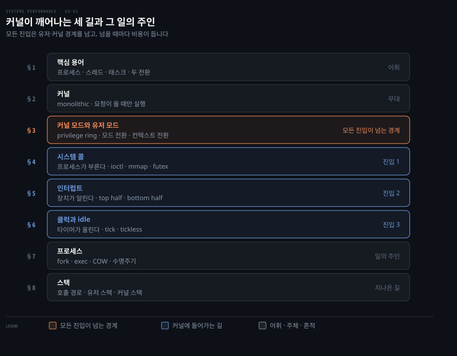
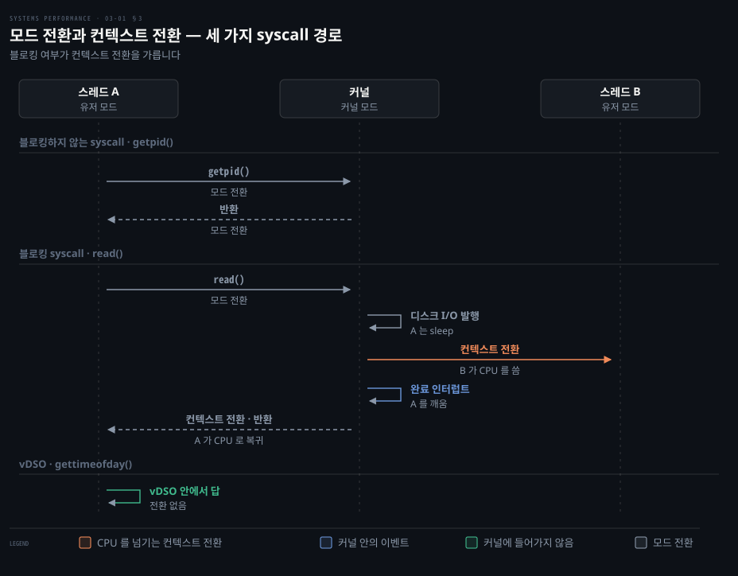
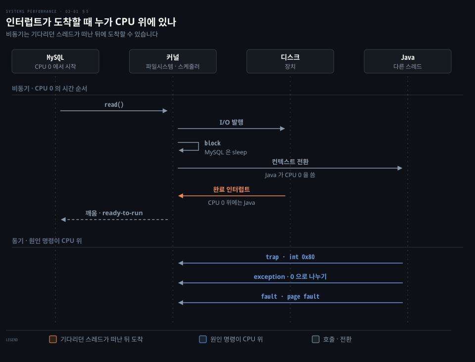
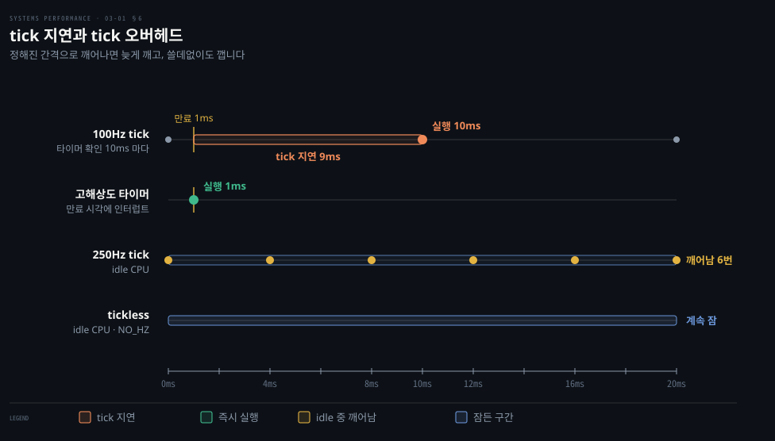
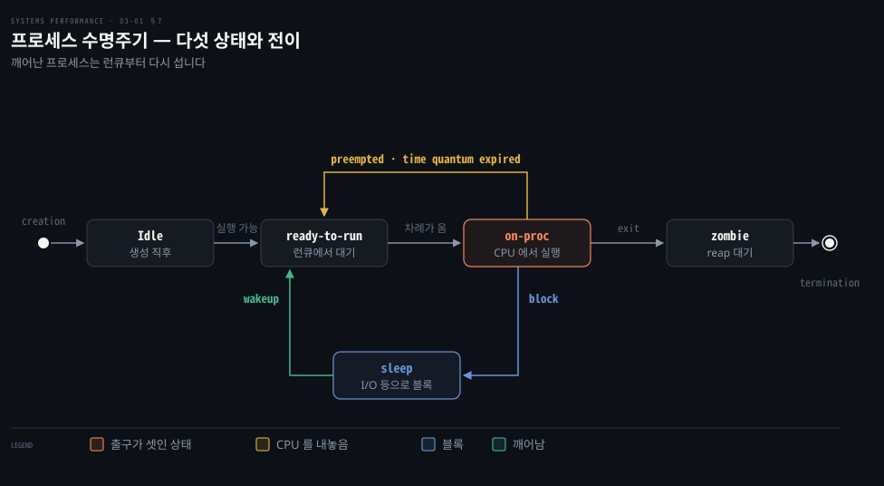
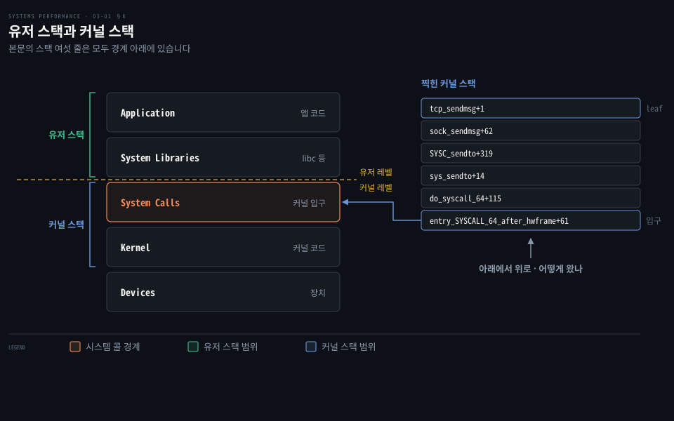

# 운영체제 — 커널·시스템 콜·인터럽트·프로세스
---
> 이 노트는 3장의 첫 부분으로, 커널이 언제 깨어나 무엇을 실행하는지를 잡습니다. 원서 3.1·3.2.1~3.2.7 을 따라 용어, 커널과 두 모드, 시스템 콜, 인터럽트, 클럭, 프로세스, 스택을 봅니다.

## 핵심 요약

> 커널은 늘 도는 프로그램이 아니라 시스템 콜·인터럽트·타이머가 부를 때 깨어나는 프로그램이고, 그 진입마다 드는 비용과 남기는 흔적이 성능 분석의 재료입니다.

성능 분석은 가설을 세우고 확인하는 일입니다. 시스템 콜은 어떻게 수행되는가, 커널은 스레드를 어느 CPU에 올리는가 같은 질문이 매번 나옵니다. 원서는 그래서 운영체제와 커널 지식을 이 책 나머지의 전제로 둡니다.

커널에 들어가는 길은 셋입니다. 프로세스가 시스템 콜로 부르는 길은 §4, 장치가 인터럽트를 보내는 길은 §5, 타이머가 tick 을 울리는 길은 §6 이 다룹니다. 들어갈 때마다 모드 전환이 일어나고 기다려야 하는 요청이면 컨텍스트 전환까지 더해집니다. 두 전환의 차이는 §3 이 다룹니다.

§7 이 다루는 프로세스와 스레드가 그 일의 주인입니다. 스레드가 어떤 경로로 지금 코드에 왔는지는 §8 의 스택에 남습니다. 스택 트레이스가 "왜 이 코드가 도는가"에 답하는 이유가 여기 있습니다.


## 학습 목표

> 이 편을 덮은 뒤 스스로 할 수 있어야 하는 일입니다.

1. 프로세스·스레드·태스크, 모드 전환·컨텍스트 전환을 구분해 설명합니다.
2. 블로킹하는 시스템 콜과 그렇지 않은 시스템 콜이 CPU 에서 무엇이 다른지 비교합니다.
3. 비동기 인터럽트와 동기 인터럽트를 "그 일을 일으킨 명령이 아직 CPU 위에 있는가"로 가릅니다.
4. 타이머 만료 시각과 tick 주기를 받으면 tick 지연이 얼마나 생기는지 예측합니다.
5. 스택 트레이스를 leaf-to-root 로 읽어 호출 경로와 유저·커널 경계를 판단합니다.

아래는 이 편의 절을 커널이 깨어나는 길과 그 일의 주인으로 묶은 지도입니다. 행 왼쪽의 절 번호가 본문에서 그 부분을 다루는 곳입니다.



맨 위 세 행은 어휘와 무대를, 가운데 세 행은 커널에 들어가는 길을 나타냅니다. 아래 두 행에는 그 일을 하는 주체와 그 주체가 지나온 길을 남기는 자리가 있습니다.


## 이 문서가 다루지 않는 것

> 다른 편과 다른 책 노트로 넘긴 주제입니다.

- 가상 메모리·스케줄러·파일시스템·캐시·선점처럼 자원을 나누는 쪽은 03-02 가 이어받습니다.
- Linux 커널의 구현 역사와 Extended BPF 는 03-03 이 다룹니다.
- 같은 메커니즘을 커널 개발자 관점에서 보려면 [linux-kernel-programming](../linux-kernel-programming/00-00.%EC%B1%85%20%EA%B0%9C%EC%9A%94%EC%99%80%20%ED%95%99%EC%8A%B5%20%EB%A1%9C%EB%93%9C%EB%A7%B5.md)을, K8s 운영 관점에서 보려면 [kernel](../../kernel/README.md) 노트를 봅니다.
- 스택 워킹 기법의 세부(frame pointer·debuginfo·LBR·ORC)는 원서가 『BPF Performance Tools』 2.4절로 넘깁니다.


## 1. 핵심 용어

> 이 책이 쓰는 운영체제 어휘입니다. 프로세스·스레드·태스크, 모드 전환·컨텍스트 전환처럼 이름이 비슷해 섞이는 쌍을 먼저 갈라 둡니다.

"컨텍스트 전환이 많다"와 "모드 전환이 많다"는 서로 다른 비용을 가리킵니다. 그래서 같은 현상을 다른 이름으로 부르면 가설이 엇갈립니다. 아래 표는 원서 3.1 의 용어를 그대로 옮긴 것으로 용어마다 원서의 정의를 붙였습니다.

| 용어 | 뜻 |
|------|-----|
| 운영체제(OS) | 부팅·프로그램 실행을 위해 설치된 SW와 파일. 커널·관리 도구·시스템 라이브러리 포함 |
| 커널(kernel) | 시스템을 관리하는 프로그램(HW·메모리·CPU 스케줄링). HW 직접 접근이 허용된 *커널 모드* 에서 실행 |
| 프로세스(process) | 프로그램을 실행하는 OS 추상·환경. 유저 모드로 돌며 시스템 콜이나 트랩으로 커널 모드에 접근 |
| 스레드(thread) | CPU에 스케줄링될 수 있는 실행 맥락. 커널은 스레드 여럿을, 프로세스는 하나 이상을 가짐 |
| 태스크(task) | 리눅스의 실행 단위 — 단일 스레드 프로세스·멀티스레드의 한 스레드·커널 스레드를 모두 가리킴 |
| BPF 프로그램 | BPF 실행 환경에서 도는 커널 모드 프로그램 |
| 메인 메모리 / 가상 메모리 | 물리 메모리(RAM) / 멀티태스킹·오버서브스크립션을 지원하는 추상(사실상 무한) |
| 커널 공간 / 유저 공간 | 커널의 가상 주소 공간 / 프로세스의 가상 주소 공간 |
| 유저 랜드(user land) | 유저 레벨 프로그램과 라이브러리(`/usr/bin`, `/usr/lib` …) |
| 컨텍스트 전환(context switch) | 한 스레드/프로세스 실행에서 다른 것으로 전환 — CPU 레지스터 집합(스레드 컨텍스트)을 새 집합으로 |
| 모드 전환(mode switch) | 커널 모드와 유저 모드 사이 전환 |
| 시스템 콜(syscall) | 유저 프로그램이 커널에 특권 연산(장치 I/O 등)을 요청하는 정의된 프로토콜 |
| 프로세서(processor) | 하나 이상의 CPU를 담은 물리 칩 (process와 혼동 금지) |
| 트랩(trap) | 커널에 시스템 루틴을 요청하는 신호. 시스템 콜·프로세서 예외·인터럽트가 트랩의 유형 |
| 하드웨어 인터럽트 | 물리 장치가 커널에 보내는 신호(보통 I/O 서비스 요청). 인터럽트는 트랩의 한 유형 |

BPF 는 원래 Berkeley Packet Filter 의 약자였습니다. 원서 각주 1 은 지금의 기술이 버클리·패킷·필터 어느 것과도 거의 상관이 없어 약어가 아니라 이름이 됐다고 적습니다.


## 2. 커널 — 시스템의 핵심 SW

> 커널이 맡는 일은 커널 모델에 따라 다르고, Linux·BSD 의 monolithic 커널은 CPU·메모리·파일시스템·네트워크·장치를 한 프로그램으로 관리합니다. 이 프로그램은 주로 요청이 왔을 때만 실행됩니다.

계산만 하는 프로그램이라면 커널이 성능과 상관없어 보입니다. 원서는 바로 이 직관을 반박하며 커널의 역할부터 세웁니다.

Unix 계열(Linux·BSD)은 **monolithic 커널**입니다. CPU 스케줄링·메모리·파일시스템·네트워크 프로토콜·장치(디스크·NIC)를 한 큰 프로그램이 관리합니다. 그 위의 *시스템 라이브러리*는 시스템 콜보다 쓰기 쉬운 인터페이스를 줍니다.

원서 그림 3.1 은 이 구조를 동심원으로 그리되 라이브러리 고리를 끊어 둡니다. 앱이 시스템 콜을 직접 부를 수 있다는 뜻입니다. Go 런타임이 libc 없이 자기 syscall 층을 갖는 것이 예입니다. 원래 이 동심원은 Multics 에서 온 모델로, 가운데 커널부터 바깥으로 갈수록 특권이 낮아집니다.

원서 각주 2 는 이 모델의 예외도 적습니다. 커널 바이패스는 유저 레벨이 하드웨어에 바로 접근하게 합니다. 네트워크에서 쓰기도 하는 이 기법은 10장이 다룹니다. 메모리 매핑 I/O, major fault, `sendfile(2)`, Linux io_uring 은 syscall 비용 없이 I/O 를 낼 수 있습니다. 다만 초기화에는 여전히 syscall 이 필요합니다. 각 기법은 7장(메모리)과 5장(애플리케이션)이 자세히 다룹니다.

아래는 원서 각주에 없는 이 노트의 정리입니다. 넷의 공통점은 데이터를 옮길 때마다 syscall 을 부르지 않는다는 것입니다. 매핑된 메모리를 직접 읽는 방식, 커널이 알아서 데이터를 옮기는 방식, 요청을 커널과 공유하는 큐에 쌓는 방식이 그 예입니다.

다른 커널 모델도 있습니다. microkernel 은 작은 커널에 기능을 유저 모드 프로그램으로 옮기고, unikernel 은 커널과 앱을 한 프로그램으로 컴파일합니다. Windows NT 같은 hybrid(03-03 §7)는 둘을 섞습니다.

Linux 는 최근 **Extended BPF**(03-03 §6)로 모델을 바꿨습니다. 안전한 커널 모드 앱과 그 전용 API(BPF helpers)를 허용하므로 일부 앱·시스템 기능을 BPF 로 다시 써 보안과 성능을 높일 수 있습니다.

### 커널 실행 — 요청 시에만

커널은 수백만 줄짜리 프로그램이지만 주로 요청이 올 때만 실행됩니다. 유저 프로그램이 시스템 콜을 하거나 장치가 인터럽트를 보낼 때입니다. 클럭 루틴·메모리 관리 같은 일부 커널 스레드는 비동기로 돌지만 가볍게 만들어 CPU 를 거의 쓰지 않습니다.

웹서버처럼 I/O 가 잦은 워크로드는 대부분 커널 맥락에서 도는 반면 계산 집약 워크로드는 대부분 유저 모드에서 커널의 방해 없이 돕니다.

그래도 계산 집약 워크로드에 커널이 끼어드는 경우는 많습니다. 가장 분명한 것은 *CPU 경합*입니다. 다른 스레드가 CPU 를 다투면 커널 스케줄러가 누가 돌고 누가 기다릴지 정합니다. 커널은 어느 CPU 에서 돌릴지도 고릅니다. 하드웨어 캐시가 더 따뜻하거나 메모리 지역성이 좋은 CPU 를 고르면 성능이 크게 오릅니다.


## 3. 커널 모드와 유저 모드

> 커널은 장치 접근과 특권 명령이 허용된 커널 모드에서, 유저 프로그램은 유저 모드에서 돕니다. 두 모드를 오가는 모드 전환과 스레드를 바꾸는 컨텍스트 전환은 작지만 공짜가 아니어서 회피 최적화가 있습니다.

여러 프로세스가 한 장치를 마구 건드리면 서로의 데이터를 망칩니다. 그래서 장치 접근을 한 곳에서 중재할 특권 모드가 필요합니다.

커널은 *커널 모드*에서 돌며 장치 전체에 접근하고 특권 명령을 실행합니다. 멀티태스킹을 위해 장치 접근을 중재하고 명시적으로 허용하지 않는 한 프로세스·사용자가 서로의 데이터에 접근하지 못하게 막습니다. 유저 프로그램은 *유저 모드*에서 돌며 I/O 같은 특권 연산을 시스템 콜로 요청합니다.

프로세서는 이 두 모드를 privilege ring 으로 구현합니다. x86 은 ring 0~3 넷을 지원하지만 보통 유저·커널, 있으면 하이퍼바이저까지 둘~셋만 씁니다. 유저 모드에서 특권 명령을 실행하면 예외(예: permission denied)가 나고 커널이 처리합니다.

모든 시스템 콜은 *모드 전환*을 하지만 *컨텍스트 전환*까지 하는 것은 일부입니다. 디스크·네트워크 I/O 처럼 블로킹되는 시스템 콜은 첫 스레드가 막힌 동안 다른 스레드가 돌도록 CPU 를 넘깁니다. 아래 도식은 세 경우를 시간 순서로 나란히 놓았습니다.



왼쪽은 커널에 들어갔다 바로 나오므로 모드 전환만 두 번 일어납니다. 가운데에서는 커널 안에서 기다려야 하니 스케줄러가 스레드 B 를 올리고 I/O 가 끝난 뒤에야 스레드 A 가 돌아옵니다. 오른쪽 vDSO 경로는 커널에 들어가지 않고 유저 공간에서 답을 얻습니다.

두 모드는 각자 스택과 레지스터라는 실행 맥락을 따로 가집니다. SPARC 같은 일부 아키텍처는 커널에 별도 주소 공간을 쓰므로 모드 전환 때 가상 메모리 맥락까지 바꿔야 합니다.

### 전환을 피하는 네 가지 방법

모드·컨텍스트 전환은 CPU 사이클을 조금씩 씁니다. 원서 각주 3 은 Meltdown 완화(KPTI, 03-03 §5) 이후 컨텍스트 전환이 더 비싸졌다고 덧붙입니다. KPTI 는 커널 페이지 테이블을 유저 모드에서 떼어 두는 완화책이라, 모드를 오갈 때마다 주소 공간을 바꾸는 비용이 붙습니다. 그래서 전환 자체를 피하는 방법이 생겼습니다. 표의 첫 칸은 피하는 방법을, 둘째 칸은 원서가 든 구현을 적었습니다.

| 최적화 | 방법 |
|--------|------|
| 유저 모드 syscall | 일부 syscall을 유저 라이브러리에 구현 — Linux의 vDSO(`gettimeofday`·`getcpu`)를 프로세스 주소 공간에 매핑 |
| 메모리 매핑 | demand paging·데이터 저장·I/O에 써 syscall 오버헤드 회피 |
| 커널 바이패스 | 유저 프로그램이 장치에 직접 접근(예: 네트워킹용 DPDK) |
| 커널 모드 앱 | in-kernel 웹서버(TUX), 그리고 Extended BPF |

vDSO(virtual dynamic shared object)는 커널이 프로세스 주소 공간에 붙여 주는 작은 공유 객체입니다. 시각을 읽는 일처럼 특권이 필요 없는 요청은 이 안에서 끝나 커널에 들어가지 않습니다.


## 4. 시스템 콜 — 커널에 특권 연산 요청

> 시스템 콜은 커널에 특권 루틴을 요청하는 통로이고, 커널을 단순하게 두려고 그 수를 되도록 적게 유지합니다. 더 정교한 인터페이스는 유저 랜드 라이브러리가 쌓습니다.

필요하다고 시스템 콜을 하나씩 더할 때마다 커널은 그만큼 비대해집니다. 원서는 Unix 철학([Thompson 78])을 들어 커널 유지보수자들이 그 수를 가능한 한 줄이려 한다고 설명합니다.

시스템 콜은 수백 개가 있습니다. 더 정교한 인터페이스는 유저 랜드의 *시스템 라이브러리*에 쌓아 개발·유지가 쉽습니다. 대부분의 운영체제는 흔한 syscall 을 쉽게 쓰게 해 주는 C 표준 라이브러리(libc·glibc)를 함께 둡니다.

각 syscall 은 man page(섹션 2)가 있고 인터페이스가 단순하고 일관됩니다. 에러는 `ENOENT`("no such file or directory") 같은 코드로 알립니다. 원서 각주 4 에 따르면 glibc 는 이 코드를 `errno` 정수 변수로 줍니다. 아래 표는 원서 표 3.1 의 기억해 둘 syscall 입니다.

| syscall | 설명 |
|---------|------|
| `read`/`write` | 바이트 읽기/쓰기 |
| `open`/`close` | 파일 열기/닫기 |
| `fork`/`clone` | 새 프로세스/(또는 스레드) 생성 |
| `exec` | 새 프로그램 실행 |
| `connect`/`accept` | 네트워크 연결/수락 |
| `stat` | 파일 통계 조회 |
| `ioctl` | I/O 속성 설정 등 기타 기능 |
| `mmap` | 파일을 메모리 주소 공간에 매핑 |
| `brk` | 힙 포인터 확장 |
| `futex` | fast user-space mutex |

### 쓰임이 덜 분명한 넷

이름만으로 용도가 드러나지 않는 syscall 이 있습니다. 원서가 따로 설명한 넷을 아래 표로 옮겼습니다. 표에는 흔한 쓰임과 더불어 성능과 얽히는 지점을 마지막 칸에 따로 적었습니다.

| syscall | 흔한 쓰임 | 성능 지점 |
|---|---|---|
| `ioctl` | 다른 적당한 syscall 이 없을 때 잡다한 동작 요청(특히 관리 도구) | 동작마다 syscall 을 늘리지 않고 인자로 확장 |
| `mmap` | 실행파일·라이브러리 매핑, 메모리 매핑 파일 | `brk` 기반 malloc 대신 작업 메모리 할당에 써 syscall 횟수를 줄이기도 함 |
| `brk` | 힙 포인터를 늘려 작업 메모리 크기를 정함 | 보통 malloc 이 기존 힙으로 부족할 때 할당 라이브러리가 부름 |
| `futex` | 유저 공간 락에서 막힐 만한 부분을 처리 | 막히지 않는 경로는 커널에 들어가지 않음 |

`futex` 의 원리는 이렇습니다. 락을 다투는 스레드가 없으면 유저 공간의 원자 연산만으로 락을 잡고 놓아 커널에 들어가지 않습니다. 경합이 있을 때만 커널에 들어가 잠들고, 락이 풀리면 커널이 깨웁니다.

`mmap` 으로 할당하는 방법이 늘 통하지는 않습니다. 원서는 매핑 관리라는 맞교환이 따른다고 적습니다.

`ioctl` 은 쓰임이 모호해 가장 익히기 어렵습니다. Linux `perf(1)` 이 좋은 예입니다. perf 는 동작마다 syscall 을 더하는 대신 `perf_event_open(2)` 하나로 파일 디스크립터를 받습니다. 그다음 `ioctl(fd, PERF_EVENT_IOC_ENABLE)` 처럼 인자를 바꿔 여러 동작을 수행합니다. 인자는 syscall 보다 더하고 바꾸기 쉽습니다.


## 5. 인터럽트 — 비동기와 동기

> 인터럽트는 처리할 이벤트가 생겼다는 신호로, 현재 실행을 멈추고 ISR 을 돌립니다. 외부 하드웨어가 보내는 비동기 인터럽트와 소프트웨어 명령이 내는 동기 인터럽트가 있습니다.

디스크 I/O 가 끝났다는 사실을 커널이 알아야 기다리던 스레드를 깨울 수 있습니다. 매번 장치에 물어보는 대신 장치가 먼저 커널에 알리게 한 것이 인터럽트입니다.

인터럽트가 오면 프로세서는 (아직 아니라면) 커널 모드로 들어갑니다. 그리고 현재 스레드 상태를 저장하고 **ISR(interrupt service routine)** 을 돌립니다. 원서는 인터럽트가 먼저 CPU 로 가고 CPU 가 커널 안에서 실행할 ISR 을 고른다고 설명합니다.

### 비동기 인터럽트

하드웨어 장치는 현재 도는 소프트웨어와 상관없이 **IRQ(interrupt service request)** 를 보냅니다. 원서가 든 예는 네 가지입니다.

- 디스크 장치가 디스크 I/O 완료를 알립니다.
- 하드웨어가 고장 상태를 알립니다.
- 네트워크 인터페이스가 패킷 도착을 알립니다.
- 키보드와 마우스가 입력을 전달합니다.

원서 그림 3.5 의 장면이 "비동기"의 뜻을 보여 줍니다. CPU 0 에서 MySQL 이 파일시스템을 읽는데 그 내용을 디스크에서 가져와야 합니다. 스케줄러는 기다리는 동안 Java 앱으로 컨텍스트를 전환합니다. 나중에 디스크 I/O 가 끝나지만 그때 MySQL 은 이미 CPU 0 위에 없습니다.

### 동기 인터럽트

이는 소프트웨어 명령이 내는 인터럽트입니다. 원서는 trap 과 exception, fault 로 나누면서도 세 용어가 자주 섞여 쓰인다고 적습니다. 표의 뜻 칸에는 유형마다 원서의 설명을 옮겼습니다.

| 유형 | 뜻 |
|------|-----|
| trap | 의도적 커널 호출(예: `int` 명령). syscall 구현의 하나(x86 `int 0x80`) |
| exception | 예외 조건(예: 0으로 나누기) |
| fault | 주로 메모리 이벤트(예: MMU 매핑 없는 위치 접근 시 page fault) |

이 두 종류를 가르는 기준은 하나입니다. 동기 인터럽트는 그 일을 일으킨 소프트웨어와 명령이 아직 CPU 위에 있습니다. 반면 비동기 인터럽트는 그 일을 기다리던 스레드가 이미 떠난 CPU 에 도착할 수 있습니다.



위쪽 시간축이 그리는 것은 그림 3.5 의 장면입니다. 완료 인터럽트가 도착한 순간 CPU 0 위에는 Java 가 있습니다. 그리고 MySQL 은 잠든 채 깨워지기를 기다립니다. 아래쪽 동기 인터럽트 셋에서는 원인 명령이 CPU 위에 남아 있습니다.

### 인터럽트 스레드와 두 half

ISR 은 활성 스레드를 방해하는 시간을 줄이려 최대한 빨리 끝나도록 설계합니다. 할 일이 조금 이상이거나 특히 락에 막힐 수 있으면 커널이 스케줄하는 *인터럽트 스레드*가 이를 처리합니다.

구현은 커널 버전마다 다릅니다. Linux 드라이버는 *두 half* 로 나뉩니다. top half 는 인터럽트를 빠르게 처리하고 남은 일을 bottom half 로 미룹니다. top half 는 인터럽트 비활성 모드로 돕니다. 이 모드에서 CPU 는 인터럽트 마스크를 걸어 새 인터럽트가 와도 전달을 잠시 늦춥니다. 마스크의 자세한 동작은 아래 「인터럽트 마스킹과 NMI」 에 나옵니다. 그래서 top half 가 오래 걸리면 다른 스레드에 지연을 줍니다.

bottom half 는 tasklet 이나 work queue 입니다. work queue 는 커널이 스케줄하는 스레드라서 필요하면 잠들 수 있습니다. Linux 네트워크 드라이버는 top half 가 인바운드 패킷의 IRQ 를 처리합니다. 그리고 softirq 로 구현한 bottom half 가 이 패킷을 네트워크 스택 위로 올립니다.

인터럽트가 도착해서 처리되기까지의 시간이 *인터럽트 지연*(interrupt latency)입니다. 이 지연은 하드웨어와 구현에 따라 달라집니다. 그리고 실시간 시스템과 저지연 시스템이 연구하는 대상입니다.

### 인터럽트 마스킹과 NMI

커널에는 안전하게 끊을 수 없는 코드 경로가 있습니다. syscall 중에 spin lock 을 잡았는데 인터럽트 처리도 같은 락이 필요하다고 해 봅니다. 그 상태로 인터럽트를 받으면 교착이 생깁니다. 그래서 커널은 CPU 의 인터럽트 마스크 레지스터를 설정해 잠시 인터럽트를 막습니다.

인터럽트를 막는 시간은 짧아야 합니다. 막는 동안 다른 인터럽트로 깨어날 앱의 실행이 늦어지기 때문입니다. 실시간 시스템은 응답 시간 요구가 엄격해서 이 점을 특히 중요하게 여깁니다. 이 시간은 성능 분석의 대상이기도 합니다. 원서는 Ftrace 의 `irqsoff` 트레이서를 14장([14-02](./14-02.Ftrace%20%E2%80%94%20%ED%8A%B8%EB%A0%88%EC%9D%B4%EC%84%9C.md))에서 다룬다고 적습니다.

무시하면 안 되는 고우선 이벤트는 **NMI(non-maskable interrupt)** 로 구현합니다. Linux 는 서버 메인보드의 관리용 인터페이스인 IPMI(Intelligent Platform Management Interface)의 워치독 타이머를 씁니다. 그래서 일정 시간 인터럽트가 없으면 커널이 멈췄다고 보고 NMI 로 재부팅할 수 있습니다. 원서 각주 5 는 락업을 감지하는 소프트웨어 NMI 워치독도 있다고 덧붙입니다.


## 6. 클럭과 idle 스레드

> 원래 Unix 커널의 핵심은 타이머 인터럽트로 도는 `clock()` 루틴이었고, 역사적으로 초당 60·100·1,000번 돌았습니다. 현대 커널은 이 일을 필요할 때만 부르는 tickless 쪽으로 옮겨 오버헤드와 전력을 줄였습니다.

정해진 간격으로만 타이머를 확인하는 방식에는 두 비용이 따릅니다. 타이머가 그 간격만큼 늦게 깨어납니다. 게다가 할 일이 없는 CPU 까지 간격마다 깨워 전력도 샙니다. 클럭의 역사는 이 두 비용을 줄여 온 과정입니다.

`clock()` 루틴은 타이머 인터럽트로 실행되며 한 번 실행을 *tick* 이라 부릅니다. 이 루틴은 시스템 시간 갱신, 타이머와 스케줄링 타임슬라이스 만료, CPU 통계 유지, 예약된 커널 루틴 실행을 맡았습니다. 원서 각주 6 은 Linux 2.6.13 의 250, Ultrix 의 256, OSF/1 의 1,024 같은 다른 빈도도 적습니다. 그리고 각주 7 에 따르면 Linux 는 tick 과 비슷한 시간 단위인 jiffies 도 셉니다.

원서가 꼽는 클럭의 성능 문제는 둘입니다. 아래 표는 문제마다 원인과 해결을 나란히 적었습니다.

| 문제 | 원인 | 해결 |
|---|---|---|
| tick 지연 | 100Hz 면 타이머가 다음 tick 까지 최대 10ms 더 기다림 | 고해상도 실시간 인터럽트로 즉시 실행 |
| tick 오버헤드 | tick 이 CPU 사이클을 쓰고 앱을 조금씩 흔듦(OS jitter 의 한 원인), idle 중인 CPU 를 깨워 전력을 씀 | 기능을 on-demand 인터럽트로 옮긴 tickless 커널 |



위 두 줄은 1ms 뒤에 만료될 타이머를 비교합니다. 100Hz tick 에서는 10ms tick 까지 기다리느라 9ms 가 늦어집니다. 하지만 고해상도 타이머는 1ms 에 바로 실행합니다. 아래 두 줄에는 할 일이 없는 CPU 를 놓았습니다. tick 이 있으면 4ms 마다 깨어납니다. 반면 tickless 면 다음 인터럽트까지 계속 잠듭니다.

Linux 의 클럭 루틴은 `scheduler_tick()` 입니다. 클럭은 보통 250Hz(`CONFIG_HZ` Kconfig 와 그 변형)로 돕니다. `NO_HZ` 기능(`CONFIG_NO_HZ` 와 변형)은 CPU 부하가 없을 때 호출을 줄입니다. 원서는 `NO_HZ` 가 지금 흔히 켜져 있다고 적습니다.

### idle 스레드

CPU 가 할 일이 없으면 커널은 일을 기다리는 자리표시 스레드를 올립니다. 이것이 *idle 스레드*입니다. 단순한 구현이라면 루프를 돌며 새 일이 있는지 확인합니다. 하지만 현대 Linux 의 idle 태스크는 `hlt`(halt) 명령으로 다음 인터럽트까지 CPU 를 꺼 전력을 아낄 수 있습니다.


## 7. 프로세스

> 프로세스는 유저 프로그램의 실행 환경으로 주소 공간·파일 디스크립터·스레드 스택·레지스터로 이뤄지고, `fork`/`clone` 으로 생겨 `exec` 로 다른 프로그램이 됩니다. 수명주기는 on-proc·ready-to-run·sleep·zombie 상태를 오갑니다.

한 CPU 위에서 프로그램 수천 개가 서로의 레지스터와 메모리를 덮어쓰지 않고 돌려면 각자 독립된 환경이 있어야 합니다. 원서는 프로세스를 "자기 레지스터와 스택을 가진 프로그램 하나만 도는, 가상의 초기 컴퓨터"에 빗댑니다.

프로세스는 메모리 주소 공간과 파일 디스크립터, 스레드 스택, 레지스터로 이뤄집니다. 커널은 한 시스템에서 보통 수천 개를 멀티태스킹합니다. 그리고 각각을 고유한 숫자인 프로세스 ID(PID)로 식별합니다.

한 프로세스는 스레드를 하나 이상 담습니다. 스레드는 프로세스 주소 공간에서 돌며 같은 파일 디스크립터를 공유합니다. 스레드는 스택과 레지스터, instruction pointer(program counter)로 된 실행 맥락입니다. 덕분에 한 프로세스가 여러 CPU 에서 병렬로 돕니다. Linux 에서는 스레드와 프로세스가 모두 *태스크*입니다.

커널이 처음 띄우는 프로세스는 `/sbin/init`(기본값)의 "init" 이고 PID 1 입니다. 이 init 이 유저 공간 서비스를 띄웁니다. Unix 에서는 `/etc` 의 시작 스크립트를 돌렸고 지금은 이 방식을 SysV 라 부릅니다. 지금의 Linux 배포판은 보통 systemd(03-03 §4)로 서비스를 띄우고 의존성을 추적합니다.

### 프로세스 생성과 COW

Unix 에서 프로세스는 보통 `fork(2)` 로 생깁니다. Linux 의 C 라이브러리는 보통 다용도 `clone(2)` 을 감싸 fork 를 구현합니다. 그리고 둘 다 자기 PID 를 가진 복제본을 만듭니다. 그 뒤 `exec(2)`(또는 `execve(2)` 같은 변형)를 부르면 다른 프로그램이 실행됩니다. 원서 그림 3.7 의 예에서 bash 는 fork 로 bash 복제본을 만듭니다. 그 복제본이 exec 로 `ls` 가 됩니다.

`fork`/`clone` 은 성능을 위해 **COW(copy-on-write)** 를 쓸 수 있습니다. 내용을 모두 복사하지 않고 이전 주소 공간을 함께 가리킵니다. 그러다가 어느 쪽이든 여러 곳이 가리키는 메모리를 고치면 그때 그 부분만 따로 복사합니다. 복사를 미루거나 아예 없애 메모리와 CPU 를 아낍니다. bash 처럼 fork 직후 exec 하는 경우가 COW 덕을 가장 크게 봅니다.

### 수명주기와 환경

원서 본문이 설명하는 상태는 네 가지입니다. 표는 상태마다 그 뜻을 붙였습니다.

| 상태 | 뜻 |
|------|-----|
| on-proc | 프로세서(CPU)에서 실행 중 |
| ready-to-run | 실행 가능하나 CPU 런큐에서 차례 대기 |
| sleep | I/O 등으로 블록 — 완료돼 깨어날 때까지 |
| zombie | 종료 중 — 부모가 상태를 reap하거나 커널이 제거할 때까지 |

원서 그림 3.8 은 여기에 생성 직후의 Idle 상태를 하나 더 그리고 상태 사이의 전이에도 이름을 붙입니다. 원서는 이 그림이 단순화한 것이라고 밝힙니다. 멀티스레드 운영체제에서 실제로 스케줄되는 것은 스레드입니다. 그 상태가 프로세스 상태에 어떻게 대응하는지는 5장 그림 5.6 과 5.7 이 더 자세히 다룹니다.



on-proc 에서 나가는 화살표가 세 개입니다. 선점되거나 시간 할당량이 끝나면 ready-to-run 으로 갑니다. I/O 로 블록되면 sleep 으로 가고 종료하면 zombie 로 갑니다. sleep 에서 깨어난 프로세스는 바로 CPU 로 가지 않고 런큐로 돌아갑니다.

프로세스 환경은 주소 공간 안의 데이터와 커널 안의 메타데이터(맥락)로 이뤄집니다. 커널 맥락에는 PID 와 소유자 UID, 각종 시간 같은 속성, 통계(보통 `ps(1)` 과 `top(1)` 으로 봄)가 들어 있습니다. 또한 열린 파일을 가리키는 파일 디스크립터 집합이 존재합니다. 파일 디스크립터는 보통 스레드끼리 공유합니다.

원서 그림 3.9 는 스레드마다 커널 맥락에 우선순위 같은 메타데이터를 둡니다. 그리고 유저 주소 공간에는 유저 스택을 둡니다. 원서는 이 그림이 축척대로가 아니라고 밝힙니다. 커널 맥락은 프로세스 주소 공간에 비하면 작은 조각입니다. 각주 8 에 따르면 커널 맥락은 SPARC 처럼 따로 전체 주소 공간을 갖기도 하고 x86 처럼 유저 주소와 겹치지 않는 제한된 범위를 쓰기도 합니다.

유저 주소 공간은 실행파일과 라이브러리, 힙 같은 메모리 세그먼트(7장)를 담습니다. Linux 에서 각 스레드는 자기 유저 스택과 커널 예외 스택을 가집니다. 각주 9 는 인터럽트용을 포함해 CPU 마다 특수 용도 커널 스택도 있다고 덧붙입니다.

여기서 원서 연습 3.1 의 한 문항을 예측 질문으로 풀어 봅니다. 스레드가 지금 CPU 를 떠나는 이유를 이 편에서 모두 꼽아 봅니다. 답은 이 편 끝 정답 절에 있습니다.


## 8. 스택 — 실행 경로를 담는 LIFO

> 스택은 함수 실행 중 임시 데이터(반환 주소·레지스터·인자)를 담는 LIFO 영역입니다. 저장된 반환 주소를 프레임마다 따라가면 지금 함수까지의 호출 경로가 나와 "왜 이 코드가 도는가"에 답합니다.

CPU 프로파일이 "`tcp_sendmsg` 가 뜨겁다"고만 말하면 고칠 곳을 모릅니다. 누가 그 함수를 불렀는지 알아야 합니다. 그리고 그 정보가 스택에 있습니다.

스택은 후입선출(LIFO)로 조직한 임시 데이터 영역입니다. 원서는 스택이 CPU 레지스터 집합에 두는 것보다 덜 중요한 데이터를 담는다고 적습니다. 함수를 부르면 반환 주소가 스택에 저장됩니다. 호출 뒤에도 필요한 레지스터 값도 저장될 수 있습니다. 불린 함수가 끝나면 필요한 레지스터를 복원한 뒤 스택에서 꺼낸 반환 주소로 실행을 호출한 함수에 넘깁니다.

스택은 인자를 넘기는 데도 쓰입니다. 한 함수 실행에 관련된 스택 데이터 묶음이 *스택 프레임*입니다. 함수를 부를 때 레지스터와 스택을 누가 어떻게 쓰고 되돌리는지 정한 약속이 ABI(application binary interface)의 호출 규약입니다. 원서 각주 10 은 어느 레지스터를 누가 저장하는지를 이 호출 규약이 정한다고 설명합니다.

- non-volatile 레지스터: 함수 호출을 건너도 값이 남아 있어야 하는 레지스터입니다. 불린 함수가 쓰기 전에 저장했다가 되돌립니다. 이를 callee-saves 라 부릅니다.
- volatile 레지스터: 불린 함수가 마음대로 덮어써도 되는 레지스터입니다. 값을 지키고 싶은 호출자가 부르기 전에 저장합니다. 이를 caller-saves 라 부릅니다.

### 스택 트레이스 읽기

스레드 스택의 모든 프레임에서 저장된 반환 주소를 살피는 일을 *stack walking* 이라 부릅니다. 그 결과인 호출 경로가 **스택 백트레이스**(스택 트레이스, 줄여서 "스택")입니다. 스택은 "왜 이 코드가 도는가"에 답을 줍니다. 그래서 디버깅과 성능 분석에서 값진 도구입니다. 다음은 트레이싱 도구가 찍은 Linux 의 TCP 전송 경로 커널 스택입니다.

```bash
tcp_sendmsg+1
sock_sendmsg+62
SYSC_sendto+319
sys_sendto+14
do_syscall_64+115
entry_SYSCALL_64_after_hwframe+61
```

스택은 보통 *leaf-to-root* 로 찍힙니다. 첫 줄이 지금 실행 중인 함수입니다. 그 아래로 부모, 조부모가 이어집니다. 위 예에서는 `sock_sendmsg()` 가 `tcp_sendmsg()` 를 불렀습니다.

함수 이름 오른쪽의 숫자는 함수 안의 명령 오프셋을 뜻합니다. 첫 줄은 `tcp_sendmsg()` 의 오프셋 1, 곧 두 번째 명령입니다. 그것을 부른 자리는 `sock_sendmsg()` 의 오프셋 62 입니다. 오프셋은 명령 수준까지 경로를 이해하고 싶을 때만 쓸모가 있습니다.

위에서 아래로 읽으면 함수의 계보 전체가 보입니다. 그리고 아래에서 위로 읽으면 "어떻게 여기까지 왔나"를 따라갈 수 있습니다. 스택은 소스 코드 안의 경로를 드러냅니다. 그래서 API 로 문서화된 함수가 아니라면 이 함수들의 문서는 코드뿐입니다. 위 예에서는 Linux 커널 소스입니다.

### 유저·커널 스택

시스템 콜을 실행하는 동안 프로세스 스레드는 스택을 두 개 가집니다. 유저 레벨 스택과 커널 레벨 스택입니다. 커널 맥락에서는 별도의 커널 스택을 씁니다. 그래서 블록된 스레드의 유저 스택은 시스템 콜 동안 바뀌지 않습니다. 시그널 핸들러는 설정에 따라 유저 스택을 빌릴 수 있는 예외입니다.



유저 스택이 담는 범위는 경계 위에, 커널 스택이 담는 범위는 경계 아래에 그렸습니다. 본문의 커널 스택 여섯 줄은 모두 경계 아래에 있습니다. 그리고 맨 아래 `entry_SYSCALL_64` 가 경계를 넘어온 입구입니다. leaf-to-root 로 찍힌 스택을 아래에서 위로 읽으면 이 입구에서 출발하게 됩니다.

Linux 에는 목적별 커널 스택이 여럿 있습니다. 시스템 콜은 스레드마다 하나인 커널 예외 스택을 씁니다. 반면 soft 와 hard 인터럽트(IRQ)는 각자의 스택을 사용합니다. 원서 각주 11 은 frame pointer 와 debuginfo, LBR, ORC 같은 stack walking 기법을 『BPF Performance Tools』 2.4절로 넘깁니다.


## 학습 점검

> 이 노트의 핵심을 스스로 떠올려 봅니다. 답이 막히면 해당 섹션으로 돌아가 확인합니다.

- 프로세스·스레드·태스크의 차이를 한 문장씩으로 설명해 봅니다. (→ §1, §7)
- 모드 전환과 컨텍스트 전환의 차이, 그리고 모든 syscall이 모드 전환을 하지만 일부만 컨텍스트 전환을 하는 이유를 말해 봅니다. (→ §3)
- `ioctl` 이 왜 쓰임이 모호하고, perf가 `perf_event_open`+`ioctl` 로 어떻게 동작을 더하는지 설명해 봅니다. (→ §4)
- 비동기 인터럽트와 동기 인터럽트(trap·exception·fault)의 차이와, Linux 드라이버의 top/bottom half가 왜 나뉘는지 떠올려 봅니다. (→ §5)
- tickless 커널이 무엇이고 왜 tick 오버헤드를 줄이려 하는지, idle 스레드가 전력을 어떻게 아끼는지 말해 봅니다. (→ §6)
- COW가 fork 성능을 어떻게 높이는지, 프로세스 수명주기 4상태를 설명해 봅니다. (→ §7)
- 스택 트레이스가 "왜 이게 실행 중인가"에 어떻게 답하는지, leaf-to-root로 읽는다는 게 무슨 뜻인지 말해 봅니다. (→ §8)


## 정답 (자답 후 펼치기)

> 먼저 답한 뒤 읽습니다. 학습 점검의 순서대로 답하고, 흔한 오해를 함께 적습니다.

### 정답 1 — 프로세스·스레드·태스크

프로세스는 주소 공간과 파일 디스크립터 같은 실행 환경을 가리킵니다. 스레드는 이 환경 안에서 CPU 에 올라가는 실행 맥락(스택·레지스터·instruction pointer)입니다.

태스크는 Linux 가 단일 스레드 프로세스, 멀티스레드 프로세스의 한 스레드, 커널 스레드를 함께 부르는 이름입니다.

대표적인 오해는 "스케줄러가 프로세스를 CPU 에 올린다"는 표현을 그대로 믿는 것입니다. 실제로 CPU 에 올라가는 것은 스레드입니다.

### 정답 2 — 모드 전환과 컨텍스트 전환

모드 전환은 같은 스레드가 유저 모드와 커널 모드를 오가는 현상입니다. 반면 컨텍스트 전환은 CPU 위의 스레드 자체가 바뀌는 과정을 뜻합니다.

시스템 콜은 커널에 진입해야 하므로 모두 모드 전환을 일으킵니다. 블로킹되는 시스템 콜만 대기하는 동안 다른 스레드를 돌립니다. 이때 컨텍스트 전환이 더해집니다.

대표적인 오해는 syscall 이 많으면 컨텍스트 전환도 그만큼 많다고 보는 것입니다.

### 정답 3 — ioctl 과 perf

`ioctl` 은 다른 적당한 syscall 이 없을 때 잡다한 동작을 요청하는 통로입니다. 그래서 이름만으로는 정확히 무슨 일을 하는지 알 수 없습니다.

perf 는 `perf_event_open(2)` 로 파일 디스크립터를 하나 받습니다. 그 다음 `ioctl(fd, PERF_EVENT_IOC_ENABLE)` 처럼 인자를 바꿔 동작을 고릅니다.

새 동작은 syscall 이 아니라 인자로 더합니다. 이 구조 덕분에 개발자가 변경하기 쉽습니다.

### 정답 4 — 두 인터럽트와 두 half

비동기 인터럽트는 장치가 보냅니다. 따라서 현재 실행 중인 소프트웨어와 무관하게 도착합니다. 동기 인터럽트는 CPU 위의 명령이 일으킵니다. trap·exception·fault 가 여기에 속합니다.

top half 는 인터럽트 비활성 모드로 돕니다. 처리가 길어지면 다른 스레드를 늦추므로 최대한 빨리 끝내야 합니다.

나머지 일은 bottom half 로 미룹니다. 여기에는 tasklet 이나 잠들 수도 있는 work queue 를 사용합니다. 네트워크 드라이버에서는 softirq 가 이 역할을 맡습니다.

대표적인 오해는 "인터럽트 처리는 모두 인터럽트 비활성 상태에서 끝난다"는 것입니다.

### 정답 5 — tickless 와 idle

tickless 커널은 정해진 간격의 tick 에 맡기던 일을 바꾼 시스템입니다. 필요할 때만 부르는 인터럽트로 역할을 옮겼습니다.

tick 은 CPU 사이클을 쓰고 앱을 흔듭니다. 할 일이 없는 CPU 를 깨워 전력을 낭비하게 만듭니다.

idle 스레드는 루프를 돌지 않고 `hlt` 로 다음 인터럽트까지 CPU 를 꺼 둡니다. tick 이 줄어들면 이 잠이 더 길어집니다.

### 정답 6 — COW 와 네 상태

COW 는 fork 시점에 주소 공간을 복사하지 않습니다. 일단 서로 공유하다가 고치는 쪽이 생기면 그 부분만 따로 복사합니다.

이런 이유로 fork 직후 exec 하면 대부분의 복사가 아예 일어나지 않습니다.

네 상태는 다음과 같습니다. on-proc 은 실행 중이라는 뜻입니다. ready-to-run 은 런큐 대기를 말합니다.

sleep 은 I/O 등으로 블록된 상태입니다. zombie 는 종료 뒤 부모의 reap 을 기다리는 상태입니다.

대표적인 오해는 sleep 에서 깨면 바로 CPU 로 간다고 보는 것입니다. 실제로는 런큐로 먼저 갑니다.

### 정답 7 — 스택 트레이스 읽기

스택은 지금 함수에 이르기까지 거친 함수들의 반환 주소를 담습니다. 그래서 그 함수를 왜 실행하고 있는지 호출 경로로 답해 줍니다.

leaf-to-root 는 첫 줄이 지금 실행 중인 함수라는 뜻입니다. 아래로 갈수록 부모·조부모 함수가 나옵니다.

따라서 아래에서 위로 읽어 올라가면 됩니다. 진입점부터 지금까지의 길을 따라가게 됩니다.

### 본문 예측 질문 — 스레드가 CPU 를 떠나는 이유

이 편에서 꼽을 수 있는 이유는 넷입니다.

- 블로킹되는 시스템 콜이나 I/O 로 sleep 에 들어갈 때 — §3·§7
- 선점되거나 시간 할당량이 끝날 때 — §7
- 종료할 때 — §7
- 인터럽트가 와서 잠시 ISR 이 CPU 를 쓸 때 — §5

마지막은 스레드가 상태를 바꾸지 않고 잠시 밀려나는 경우입니다. 앞의 셋과 성격이 다릅니다.


## 관련 문서

- 자원을 나누는 쪽(가상 메모리·스케줄러·파일시스템·선점): [03-02](./03-02.%EC%9A%B4%EC%98%81%EC%B2%B4%EC%A0%9C%20%E2%80%94%20%EA%B0%80%EC%83%81%EB%A9%94%EB%AA%A8%EB%A6%AC%C2%B7%EC%8A%A4%EC%BC%80%EC%A4%84%EB%9F%AC%C2%B7%ED%8C%8C%EC%9D%BC%EC%8B%9C%EC%8A%A4%ED%85%9C%C2%B7IO.md)
- KPTI 가 전환 비용을 키운 까닭과 Extended BPF: [03-03 §5·§6](./03-03.%EC%9A%B4%EC%98%81%EC%B2%B4%EC%A0%9C%20%E2%80%94%20%EC%BB%A4%EB%84%90%20%EA%B5%AC%ED%98%84%C2%B7Linux%20%EB%B0%9C%EC%A0%84%EC%82%AC%C2%B7BPF.md)
- 인터럽트 비활성 시간을 재는 `irqsoff` 트레이서: [14-02](./14-02.Ftrace%20%E2%80%94%20%ED%8A%B8%EB%A0%88%EC%9D%B4%EC%84%9C.md)
