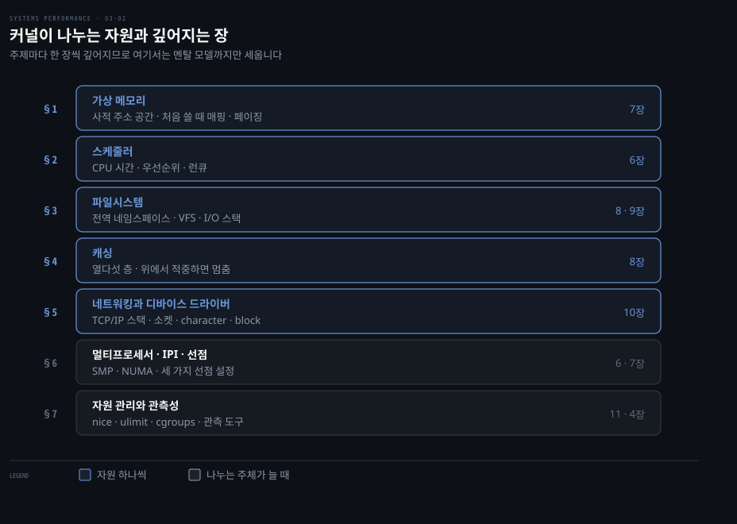
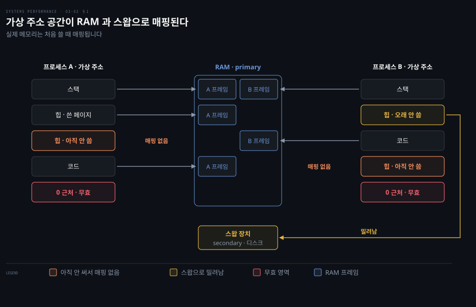
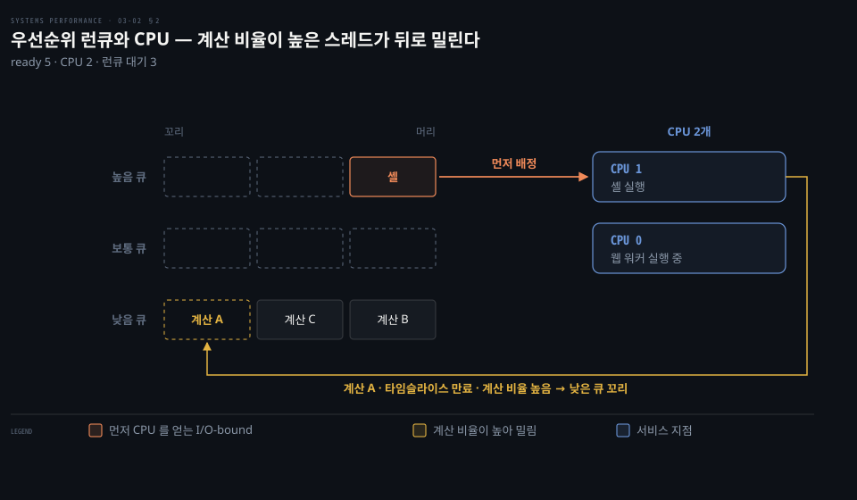
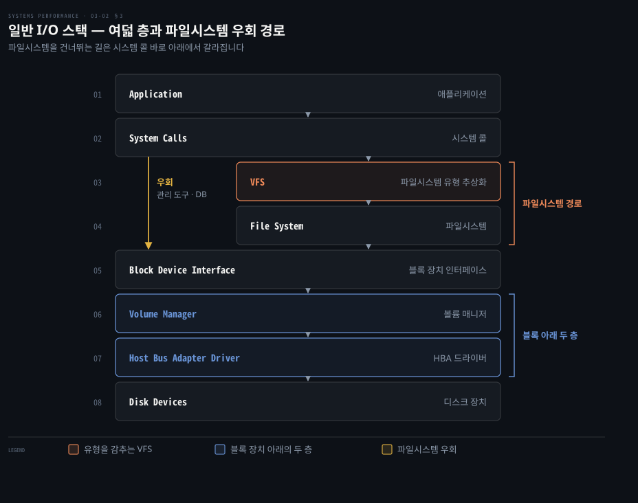
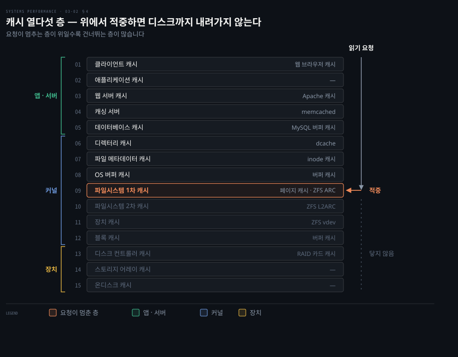
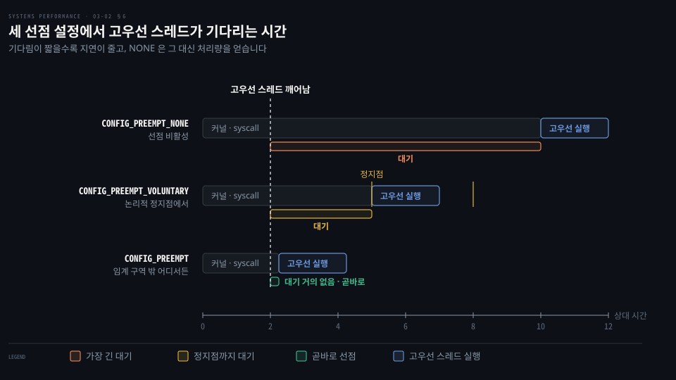

# 운영체제 — 가상메모리·스케줄러·파일시스템·I/O
---
> 이 노트는 3장 배경의 후반부로, 커널이 메모리·CPU 시간·저장장치·네트워크를 스레드들에 어떻게 나눠 주는지 잡습니다. 원서 3.2.8~3.2.17 을 따라가며, 주제마다 뒤 장(6~11장)으로 깊어지는 지도 역할을 합니다.

## 핵심 요약

> 커널은 한정된 자원을 여럿이 다투지 않게 나누는 중재자이고, 그 중재 방식(가상 메모리·스케줄러·VFS·캐시·선점·자원 제어)이 곧 성능 분석의 가설 목록입니다.

03-01 이 커널이 언제 깨어나는지를 봤다면, 이 편은 깨어난 커널이 자원을 어떻게 나누는지를 봅니다. "메모리가 모자라면 성능이 어떻게 되나", "파일시스템은 I/O 를 어떻게 처리하나" 같은 질문이 여기서 출발합니다.

메모리는 가상 메모리가 프로세스마다 사적인 주소 공간으로 나눕니다. CPU 시간은 스케줄러가 우선순위와 런큐로 분배합니다. 저장장치는 VFS 와 I/O 스택이 하나의 파일 네임스페이스로 묶고, 여러 층의 캐시가 느린 디스크 I/O 를 막아섭니다. 차례로 §1, §2, §3·§4 가 다룹니다.

여러 CPU 사이의 조율과 선점(§6), 테넌트별 자원 제어(§7)는 같은 자원을 더 많은 주체가 나눌 때 필요해집니다. 주제마다 한 장씩 깊어지므로, 여기서는 멘탈 모델까지만 세웁니다.

## 학습 목표

> 이 편을 덮은 뒤 스스로 할 수 있어야 하는 일입니다.

1. 가상 메모리가 멀티태스킹과 오버서브스크립션을 어떻게 지원하는지 설명합니다. Linux 에서 swapping 이 무엇을 뜻하는지도 알아봅니다.
2. CPU-bound 와 I/O-bound 워크로드를 구분합니다. 스케줄러가 둘의 우선순위를 다르게 다루는 이유를 설명합니다.
3. 원서의 일반 I/O 스택을 층 순서대로 그립니다. 파일시스템을 우회하는 경로가 어디서 갈라지는지 짚습니다.
4. 읽기 요청이 어느 캐시 층에서 멈추는지에 따라 디스크 I/O 가 생기는지 예측합니다.
5. 세 가지 커널 선점 설정에서 고우선 스레드가 언제 CPU 를 얻는지 판단합니다.

아래는 이 편의 절을 커널이 나누는 자원별로 쌓은 지도입니다. 행 오른쪽의 장 번호가 그 주제를 깊게 다루는 곳입니다.

위 다섯 행은 자원을 하나씩 가리킵니다. 아래 두 행은 자원을 나누는 주체가 늘어날 때 필요한 장치입니다.

§3 과 §4 는 같은 저장장치 자원을 경로와 캐시로 나누어 봅니다.

## 이 문서가 다루지 않는 것

> 다른 편과 뒤 장으로 넘긴 주제입니다.

- 커널·시스템 콜·인터럽트·프로세스·스택은 03-01 에서 다룹니다.
- 커널 구현의 역사와 Extended BPF 는 03-03 에서 다룹니다.
- 각 주제의 깊은 내용은 뒤 장이 맡습니다. 스케줄러는 6장, 가상 메모리는 7장, 파일시스템은 8장에 나옵니다. 디스크는 9장, 네트워킹은 10장, 자원 제어의 클라우드 사례는 11장에서 다룹니다. 관측 도구는 4장에서 살펴봅니다.

## 1. 가상 메모리 — 거의 무한한 사적 메모리

> 가상 메모리는 메인 메모리의 추상으로, 프로세스와 커널에 거의 무한한 사적 메모리 뷰를 줍니다. 멀티태스킹(서로 다툴 걱정 없는 주소 공간)과 오버서브스크립션(메인 메모리를 디스크로 투명하게 확장)을 지원합니다.

프로세스 수천 개가 RAM 하나를 직접 나눠 쓰면 서로의 주소를 침범합니다. 게다가 RAM 보다 큰 프로그램은 실행하지 못합니다. 가상 메모리는 이 두 가지 문제를 하나의 추상으로 해결합니다.

가상 메모리는 프로세스와 커널에 각자의 사적인 메인 메모리 뷰를 줍니다. 원서 각주 12 에 따르면 "거의 무한"은 64비트 프로세서에서의 이야기입니다. 32비트는 주소 한계로 4GB 까지 지원합니다. 커널이 그보다 더 작게 제한할 수도 있습니다.

멀티태스킹 덕분에 프로세스와 커널은 경합 걱정 없이 자기 주소 공간에서 동작합니다. 오버서브스크립션 덕에 OS 는 필요할 때 가상 메모리를 메인 메모리와 보조 저장장치(디스크) 사이로 투명하게 매핑합니다. 원서는 메인 메모리(RAM)를 primary memory 라 부릅니다. 저장장치는 secondary memory 라고 칭합니다.

가상 메모리는 프로세서와 OS 가 함께 지원해야 동작합니다. 실제 메모리가 아니므로 대부분의 OS 는 메모리를 처음 채울(쓸) 때에만 매핑합니다.

두 프로세스는 서로 같은 가상 주소를 쓰더라도 다른 RAM 프레임으로 매핑됩니다. 아직 쓰지 않은 페이지는 매핑이 없습니다. 반면 오래 쓰지 않은 페이지는 스왑으로 밀려납니다. 맨 아래 0 근처는 일부러 비워 둔 무효 영역입니다.

원서 각주 13 이 그 무효 영역의 이유를 적습니다. 단순화를 위해 프로세스 주소가 0 에서 시작하는 것처럼 그렸습니다. 하지만 지금의 커널은 보통 0x10000 같은 오프셋이나 무작위 주소에서 시작합니다.

그래서 NULL(0) 포인터를 역참조하는 실수가 SIGSEGV 로 바로 죽습니다. SIGSEGV 는 커널이 무효한 주소를 잡아 프로세스에 보내는 신호입니다. 이 신호를 받은 프로세스는 대개 종료됩니다. 잘못된 데이터로 계속 도는 것보다 낫다는 것이 원서의 판단입니다.

### 메모리 관리 — 스와핑과 페이징

가상 메모리가 보조 저장장치로 메인 메모리를 늘려 줍니다. 그럼에도 커널은 가장 활발한 데이터를 메인 메모리에 두려 합니다. 방법은 둘입니다. 왼쪽 칸이 방식, 가운데 칸이 옮기는 단위, 오른쪽 칸이 원서의 평가를 뜻합니다.

| 방식 | 단위 | 비고 |
|------|------|------|
| 프로세스 스와핑(swapping) | 프로세스 전체 | 원래 Unix 방식, 성능 손실이 큼 |
| 페이징(paging) | 작은 페이지(예: 4KB) | 더 효율적, BSD가 paged 가상 메모리로 도입 |

둘 다 least recently used(또는 not recently used) 메모리를 보조 저장장치로 옮깁니다. 다시 필요할 때만 메인 메모리로 되돌립니다. Linux 에서 "swapping" 은 페이징을 가리킵니다. Linux 커널은 옛 Unix 식으로 스레드·프로세스 전체를 내보내는 스와핑을 지원하지 않습니다(7장).

여기서 원서 연습 3.2 의 한 문항을 예측 질문으로 풀어 봅니다. 한 번도 쓰지 않는 페이지가 많은 프로그램이 있습니다. 메모리를 처음 쓸 때 매핑하는 방식이 없다면 무엇이 낭비될까요? 답은 이 편 끝 정답 절에 있습니다.

## 2. 스케줄러 — CPU 시간을 나눈다

> Unix 는 시분할 시스템이고, 스케줄러가 스레드(태스크)를 CPU 에 올려 실행 시간을 나눕니다. 우선순위로 중요한 일을 먼저 돌리되, 계산이 많은 워크로드의 우선순위를 낮춰 지연에 민감한 I/O 워크로드를 먼저 돌립니다.

실행하려는 스레드가 CPU 보다 많으면 누군가는 기다려야 합니다. 누구를 먼저 돌릴지 정하지 않으면 대화형 셸 같은 일이 계산 작업 뒤에서 오래 멈춥니다.

Unix 와 그 후손은 여러 프로세스가 실행 시간을 나눠 동시에 도는 시분할(time-sharing) 시스템입니다. 프로세서와 CPU 에 일을 배정하는 것은 커널의 핵심 구성요소인 *스케줄러*입니다. 스케줄러는 스레드(Linux 는 태스크)를 CPU 에 올립니다. 기본 의도는 CPU 시간을 활성 프로세스와 스레드에 나누는 것입니다. 그러고 나서 *우선순위*로 더 중요한 일을 먼저 돌립니다.

스케줄러는 ready-to-run 상태의 스레드를 추적합니다. 전통적으로 우선순위별 *런큐(run queue)* 에 넣습니다([Bach 86]). 현대 커널은 CPU 마다 큐를 두거나 큐 아닌 자료구조를 쓰기도 합니다. 실행하려는 스레드가 가용 CPU 보다 많으면 우선순위가 낮은 스레드가 차례를 기다립니다. 대부분의 커널 스레드는 유저 프로세스보다 높은 우선순위로 돕니다.

스케줄러는 특정 워크로드의 성능을 높이려 우선순위를 동적으로 바꿉니다. 원서는 워크로드를 둘로 나눕니다. 가운데 칸이 특성, 오른쪽 칸이 부하가 늘 때 먼저 부족해지는 자원입니다.

| 유형 | 특성 | 한계 자원 |
|------|------|----------|
| CPU-bound | 무거운 계산(과학·수학 분석), 초~일 단위의 긴 실행 시간 | CPU |
| I/O-bound | I/O 위주·적은 계산(웹·파일 서버·대화형 셸), 저지연 바람직 | 스토리지·네트워크 |

UNIX 시절부터 흔한 정책은 CPU-bound 워크로드를 찾아 우선순위를 낮추는 것입니다. 최근 계산 시간(on-CPU)과 실제 경과 시간의 비가 높은 프로세스의 우선순위를 낮춥니다([Thompson 78]). 그러면 짧게 도는 프로세스가 우대받습니다. 대개 I/O 를 하거나 사람과 대화하는 프로세스입니다.

CPU 둘에 ready 스레드가 다섯이면 셋은 런큐에서 기다립니다. 계산 비율이 높은 스레드는 우선순위가 내려가 낮은 큐로 갑니다. 셸처럼 잠깐 돌고 I/O 로 잠드는 스레드는 높은 큐에서 먼저 CPU 를 얻습니다.

현대 커널은 여러 *스케줄링 클래스*(Linux 는 스케줄링 정책)를 지원합니다. 우선순위와 실행 가능 스레드를 서로 다른 알고리즘으로 관리합니다. 실시간 스케줄링은 커널 스레드를 포함한 모든 비핵심 일보다 높은 우선순위를 씁니다. §6 의 선점 지원과 함께 쓰면 예측 가능한 저지연 스케줄링을 줍니다. 자세한 내용은 6장이 다룹니다.

## 3. 파일시스템 — 전역 네임스페이스와 VFS

> 파일시스템은 데이터를 파일·디렉터리로 조직하고 POSIX 기반 인터페이스로 접근하게 합니다. OS 는 루트("/")에서 시작하는 하나의 트리로 네임스페이스를 주고, VFS 가 그 아래의 서로 다른 파일시스템 유형을 감춥니다.

디스크·네트워크 저장소·커널이 만든 가상 파일이 제각각의 접근 방법을 가지면 어떻게 될까요? 프로그램은 대상마다 다른 코드를 써야 합니다. 원서는 그래서 파일시스템 제공을 OS 의 가장 중요한 역할 가운데 하나로 꼽습니다. Ritchie 가 한때 이것을 "가장 중요한 역할"이라 했다고 덧붙입니다([Ritchie 74]).

파일시스템은 데이터를 파일과 디렉터리로 조직합니다. 보통 POSIX 표준에 기반한 파일 인터페이스로 접근하게 합니다. 커널은 여러 파일시스템 유형과 인스턴스를 지원합니다.

OS 는 루트("/")에서 시작하는 위→아래 트리로 *전역 파일 네임스페이스*를 줍니다. 파일시스템은 자기 트리를 디렉터리(마운트 포인트)에 붙이는 *마운트*로 이 트리에 합류합니다. 그래서 사용자는 밑의 파일시스템 유형과 상관없이 네임스페이스를 투명하게 돌아다닙니다.

원서 그림 3.13 이 전형적인 계층을 보입니다. 최상위에 시스템 설정 `etc`, 시스템이 주는 유저 레벨 프로그램과 라이브러리 `usr`, 장치 노드 `dev` 가 있습니다. 로그 같은 가변 파일 `var`, 임시 파일 `tmp`, 사용자 홈 `home` 도 보입니다.

이 예에서 `var` 와 `home` 은 따로 파일시스템 인스턴스와 저장장치에 있을 수 있습니다. 하지만 트리의 다른 부분과 똑같이 접근합니다.

대부분의 파일시스템 유형은 저장장치(디스크)에 내용을 저장합니다. 반면 `/proc`·`/dev` 처럼 커널이 동적으로 만드는 유형도 있습니다.

커널은 프로세스를 네임스페이스 일부에 가두는 방법도 줍니다. `chroot(8)` 와 Linux 의 mount namespace 가 그것입니다. 이 중 후자는 컨테이너에 흔히 쓰입니다(11장).

### VFS 와 I/O 스택

**VFS(virtual file system)** 는 파일시스템 유형을 추상화하는 커널 인터페이스입니다.

Sun Microsystems 가 처음 만들었습니다. 당시 Unix 파일시스템(UFS)과 네트워크 파일시스템(NFS)이 쉽게 공존하도록 설계했습니다.

VFS 덕분에 새 파일시스템 유형을 커널에 더하기 쉬워집니다. 유저 프로그램은 앞의 전역 네임스페이스로 여러 유형에 투명하게 접근합니다.

저장장치 기반 파일시스템에서 유저 SW 부터 저장장치까지의 경로를 **I/O 스택**이라 부릅니다. 이는 전체 소프트웨어 스택의 부분집합입니다. 원서 그림 3.15 의 일반 I/O 스택은 위에서 아래로 여덟 층입니다.

애플리케이션의 요청은 시스템 콜을 지납니다. 이후 VFS 와 파일시스템을 거쳐 블록 장치 인터페이스에 닿습니다. 그 아래로 볼륨 매니저와 호스트 버스 어댑터(HBA) 드라이버를 지납니다. 마침내 디스크 장치에 도착합니다.

HBA 는 서버와 저장 장치를 잇는 컨트롤러 카드입니다. 그 드라이버는 소프트웨어가 요청을 하드웨어로 넘기는 마지막 층입니다. 이 아래 층들은 9장이 다룹니다.

왼쪽 화살표는 시스템 콜에서 블록 장치 인터페이스로 바로 내려가는 길입니다. 관리 도구와 데이터베이스가 가끔 씁니다.

파일시스템과 그 성능은 8장에서 알아봅니다. 그 밑의 저장장치는 9장이 자세히 다룹니다.

## 4. 캐싱 — 디스크 I/O 를 피한다

> 디스크 I/O 는 역사적으로 지연이 커서, 소프트웨어 스택의 여러 층이 읽기를 캐싱하고 쓰기를 버퍼링해 이를 피합니다. 캐시는 위에서부터 차례로 확인되고, 위에서 적중하면 아래로 내려가지 않습니다.

디스크 읽기 한 번은 메모리 읽기보다 몇 자릿수 느립니다. 같은 블록을 다시 읽을 때마다 디스크까지 내려가면 문제가 됩니다. 그 지연이 요청마다 그대로 쌓입니다.

그래서 소프트웨어 스택의 많은 층이 읽기를 캐싱합니다. 동시에 쓰기를 버퍼링합니다.

원서 표 3.2 는 디스크 I/O 를 피하는 캐시 층을 열다섯 개 듭니다. 이들은 확인되는 순서대로 나열했습니다. 가운데 칸이 캐시, 오른쪽 칸이 원서가 든 예입니다. 원서가 예를 들지 않은 층은 "—" 입니다.

| 순서 | 캐시 | 예 |
|------|------|-----|
| 1 | 클라이언트 캐시 | 웹 브라우저 캐시 |
| 2 | 애플리케이션 캐시 | — |
| 3 | 웹 서버 캐시 | Apache 캐시 |
| 4 | 캐싱 서버 | memcached |
| 5 | 데이터베이스 캐시 | MySQL 버퍼 캐시 |
| 6 | 디렉터리 캐시 | dcache |
| 7 | 파일 메타데이터 캐시 | inode 캐시 |
| 8 | OS 버퍼 캐시 | 버퍼 캐시 |
| 9 | 파일시스템 1차 캐시 | 페이지 캐시, ZFS ARC |
| 10 | 파일시스템 2차 캐시 | ZFS L2ARC |
| 11 | 장치 캐시 | ZFS vdev |
| 12 | 블록 캐시 | 버퍼 캐시 |
| 13 | 디스크 컨트롤러 캐시 | RAID 카드 캐시 |
| 14 | 스토리지 어레이 캐시 | — |
| 15 | 온디스크 캐시 | — |

표의 ZFS ARC·L2ARC·vdev 같은 이름은 원서가 든 예일 뿐입니다. 요점은 명확합니다. 위층에서 적중하면 아래층과 디스크까지 내려가지 않는다는 것입니다.

그림은 열다섯 층을 읽기 쉽게 세 구역으로 묶었습니다. 앱·서버 쪽, 커널, 장치 쪽이 그 구역입니다. 이 구분은 원서 표에 있는 내용이 아닙니다.

그림의 읽기 요청은 9번 페이지 캐시에서 적중합니다. 그러면 그 아래 여섯 층과 디스크에는 닿지 않습니다.

예를 들어 버퍼 캐시는 최근에 쓴 디스크 블록을 담는 메인 메모리 영역입니다. 캐시 안에 요청한 블록이 있으면 바로 내줍니다. 이렇게 디스크 I/O 의 높은 지연을 피합니다.

참고로 어떤 캐시가 있는지는 시스템과 환경마다 다릅니다.

캐시를 어디에 둘지는 원서 2장의 캐시 튜닝 원칙과 이어집니다. 가능하면 스택 위쪽, 일이 일어나는 곳 가까이에 캐시하라는 것입니다([02-02 §8](./02-02.%EB%B0%A9%EB%B2%95%EB%A1%A0%20%E2%80%94%20%EB%B6%84%EC%84%9D%20%EB%B0%A9%EB%B2%95%EB%A1%A0%2020%EC%A2%85.md)).

위쪽 캐시일수록 적중했을 때 건너뛰는 층이 많기 때문입니다.

## 5. 네트워킹과 디바이스 드라이버

> 커널은 내장 네트워크 프로토콜 스택(TCP/IP 스택)으로 시스템을 분산 환경에 참여시키고, 유저 앱은 소켓으로 접근합니다. 디바이스 드라이버는 커널이 물리 장치와 통신하는 소프트웨어로, character(raw)·block 인터페이스를 줍니다.

커널이 지원하지 않는 프로토콜이나 장치는 성능을 따지기 전에 쓸 수조차 없습니다. 그래서 새 프로토콜 기능이나 새 NIC 를 쓰려면 커널 지원이 먼저 필요합니다.

### 네트워킹

현대 커널은 내장 네트워크 프로토콜 스택을 제공합니다. 이는 흔히 쓰는 TCP 와 IP 를 따서 *TCP/IP 스택*이라고도 부릅니다.

유저 레벨 앱은 프로그래밍 가능한 엔드포인트인 *소켓*으로 네트워크에 접근합니다.

네트워크에 연결되는 물리 장치가 *네트워크 인터페이스*입니다. 이 인터페이스는 보통 NIC 위에 있습니다.

원서는 인터페이스에 IP 주소를 붙이는 일이 예전에는 시스템 관리자의 몫이었다고 적습니다. 지금은 보통 DHCP 가 자동으로 한다고 덧붙입니다.

프로토콜 자체는 자주 바뀌지 않습니다. 채택이 늘고 있는 QUIC 이 예외입니다(10장).

반면 TCP 옵션·혼잡 제어 알고리즘 같은 개선은 더 자주 바뀝니다. 여기에는 보통 커널 지원이 필요합니다. 유저 공간에서 구현한 프로토콜은 예외입니다.

참고로 새 NIC 를 지원하려면 새 디바이스 드라이버가 필요합니다.

### 디바이스 드라이버

커널은 다양한 물리 장치와 *디바이스 드라이버*로 통신합니다. 이 드라이버는 장치 관리와 I/O 를 맡는 커널 소프트웨어입니다. 보통 하드웨어 벤더가 제공합니다.

일부 커널은 재시작 없이 적재·해제할 수 있는 pluggable 드라이버를 지원합니다. 드라이버는 장치에 character 와 block 인터페이스 중 하나 또는 둘 다를 줍니다.

| 인터페이스 | 특성 |
|-----------|------|
| character(raw) 장치 | 버퍼 없는 순차 접근, 단일 문자까지 임의 I/O 크기(키보드·시리얼 포트) |
| block 장치 | 블록 단위 I/O(역사적으로 512바이트), 블록 오프셋 기반 랜덤 접근 |

원래 Unix 의 character 장치에는 종이 테이프와 라인 프린터도 있었습니다. block 장치의 오프셋은 장치 시작점에서 0 으로 시작합니다.

원래 Unix 에서 block 장치 인터페이스는 메인 메모리의 버퍼 캐시로 블록 버퍼를 캐싱했습니다. 이런 구조로 성능을 높였습니다.

Linux 에서는 이 버퍼 캐시가 이제 페이지 캐시의 일부입니다.

## 6. 멀티프로세서·IPI·선점

> 멀티프로세서 지원은 여러 CPU 로 일을 병렬 실행하며, 보통 모든 CPU 를 동등하게 보는 SMP 로 구현됩니다. CPU 사이의 조율은 IPI 로 빠르게 하고, 선점은 고우선 스레드가 커널을 끊고 들어오게 해 실시간 시스템을 가능하게 합니다.

CPU 가 여럿이면 한 CPU 가 바꾼 상태를 다른 CPU 가 모르는 순간이 생깁니다. 또 커널이 긴 일을 하는 동안 급한 스레드가 기다려야 하는 문제도 남습니다. 이 절은 그 두 가지를 다룹니다.

### 멀티프로세서와 IPI

멀티프로세서 지원은 OS 가 여러 CPU 로 일을 병렬 실행하도록 만듭니다. 보통 모든 CPU 를 동등하게 다루는 **SMP(symmetric multiprocessing)** 로 구현합니다.

병렬로 도는 스레드들은 메모리와 CPU 를 나누어 씁니다. 이런 문제 때문에 애초에 구현이 기술적으로 어려웠습니다.

멀티프로세서 시스템에는 소켓(물리 프로세서)마다 다른 메인 메모리 뱅크가 붙는 구조도 있습니다. 바로 **NUMA(non-uniform memory access)** 입니다. 이 구조는 또 다른 성능 과제를 안깁니다.

다른 소켓에 붙은 메모리를 읽으면 자기 소켓의 메모리보다 느립니다. 그래서 스레드가 다른 소켓의 CPU 로 옮겨지면 메모리 접근이 느려질 수 있습니다.

참고로 스케줄링과 스레드 동기화는 6장에서 다룹니다. 메모리 접근과 구조는 7장에 나옵니다.

CPU 들이 서로 조율해야 할 때가 있습니다. 메모리 변환 항목의 캐시 일관성이 좋은 예입니다. 캐시된 항목이 이제 낡았다고 다른 CPU 에 알려야 합니다.

이때 한 CPU 가 **IPI(inter-processor interrupt)** 로 요청을 보냅니다. 다른 CPU 하나 또는 전부에 그 일을 즉시 요청합니다. 이 과정은 SMP call 이나 CPU cross call 이라고도 부릅니다.

IPI 는 다른 스레드를 덜 방해하도록 빨리 실행되게 설계된 인터럽트입니다. 선점에도 쓰입니다.

### 선점(preemption)

커널 선점 지원은 우선순위가 높은 유저 레벨 스레드가 커널을 끊고 실행하게 합니다. 그래서 정해진 시간 안에 일을 끝내야 하는 실시간 시스템이 가능해집니다. 항공기·의료 장치가 여기에 해당합니다.

선점을 지원하는 커널을 *fully preemptible* 이라 부릅니다. 하지만 실제로는 끊을 수 없는 작은 임계 경로가 남습니다.

Linux 는 *voluntary kernel preemption* 도 지원합니다. 커널 코드의 논리적 정지점에서 선점이 필요한지 확인하고 수행하는 방식입니다.

이로써 완전 선점의 복잡성을 일부 피합니다. 동시에 흔한 워크로드에 저지연 선점을 제공합니다.

아래 표의 왼쪽 칸이 Kconfig 옵션입니다. 오른쪽 칸은 실제 동작입니다.

| Kconfig 옵션 | 동작 |
|--------------|------|
| `CONFIG_PREEMPT_VOLUNTARY` | 논리적 정지점에서 선점(흔히 활성) |
| `CONFIG_PREEMPT` | 임계 구역 외 모든 커널 코드 선점 가능 |
| `CONFIG_PREEMPT_NONE` | 선점 비활성 — 지연을 키우는 대신 처리량 향상 |

세 줄 모두 커널이 시스템 콜을 처리하는 도중입니다. 이때 고우선 스레드가 깨어난 상황을 보여 줍니다. 막대 길이는 상대값입니다.

NONE 은 커널이 유저 모드로 돌아갈 때까지 기다립니다. 반면 VOLUNTARY 는 다음 정지점까지 기다립니다.

PREEMPT 는 임계 구역 밖이면 바로 CPU 를 얻습니다. 원서는 NONE 이 지연을 키우는 대신 처리량을 높인다고 적습니다.

## 7. 자원 관리와 관측성

> OS 는 CPU·메모리·디스크·네트워크 접근을 미세 조정하는 자원 제어를 주어, 여러 앱이나 여러 테넌트(클라우드)가 한 시스템을 나눌 때의 성능을 관리하게 합니다. Linux 에서는 cgroups 로 발전했고, OS 에는 그 활동을 관측하는 도구도 들어 있습니다.

한 테넌트가 CPU 나 디스크를 독차지하면 같은 호스트의 다른 테넌트가 느려집니다. 우선순위만으로는 이 독점을 막기 어렵습니다.

### 자원 관리(resource controls)

OS 는 시스템 자원 접근을 미세 조정하는 설정 가능한 제어를 줄 수 있습니다. 이것이 *자원 제어*입니다. 서로 다른 앱을 돌리거나 여러 테넌트를 호스팅하는 시스템의 성능 관리에 씁니다.

프로세스(또는 프로세스 그룹)마다 고정 한도를 둡니다. 혹은 남는 사용량을 함께 나누는 유연한 방식을 씁니다.

초기 Unix 와 BSD 에는 기본적인 프로세스별 제어가 있었습니다. `nice(1)` 로 정하는 CPU 우선순위와 `ulimit(1)` 의 자원 한도가 그것입니다.

Linux 에서는 **cgroups(control groups)** 가 개발돼 2008년 Linux 2.6.24 에 통합됐습니다. 그 뒤로 여러 제어가 더해졌습니다. 문서는 커널 소스의 `Documentation/cgroups` 에 있습니다.

우선순위는 누가 먼저 도느냐의 상대 순서만 정합니다. 반면 cgroups 는 그룹마다 쓸 수 있는 양에 한도를 겁니다.

개선된 단일 계층 방식 **cgroup v2** 는 2016년 Linux 4.5 에 나왔습니다. 이는 `Documentation/admin-guide/cgroup-v2.rst` 에 문서화돼 있습니다.

OS 가상화 테넌트의 성능 관리가 한 사용 예입니다. 관련 내용은 11장이 다룹니다.

### 관측성(observability)

OS 는 커널·라이브러리·프로그램으로 이뤄집니다. 그 프로그램 가운데 시스템 활동을 관측하고 성능을 분석하는 도구가 있습니다. 이들은 보통 `/usr/bin`·`/usr/sbin` 에 설치됩니다.

서드파티 도구를 설치해 관측성을 더할 수도 있습니다. 관측 도구와 그 토대가 되는 OS 구성요소는 4장이 소개합니다.

## 학습 점검

> 이 노트의 핵심을 스스로 떠올려 봅니다. 답이 막히면 해당 섹션으로 돌아가 확인합니다.

- 가상 메모리가 멀티태스킹과 오버서브스크립션을 어떻게 지원하는지, "Linux의 swapping=페이징"이 무슨 뜻인지 설명해 봅니다. (→ §1)
- 스케줄러가 CPU-bound 워크로드의 우선순위를 낮추는 이유와, I/O-bound가 왜 저지연이 더 바람직한지 말해 봅니다. (→ §2)
- VFS가 왜 필요했고(NFS·UFS 공존), I/O 스택의 위에서 아래 순서(앱→syscall→VFS→파일시스템→블록→스토리지)를 떠올려 봅니다. (→ §3)
- 캐시 층이 "점검되는 순서"로 나열된 이유와, buffer cache가 디스크 I/O를 어떻게 피하는지 설명해 봅니다. (→ §4)
- character(raw)와 block 장치 인터페이스의 차이를 말해 봅니다. (→ §5)
- IPI가 무엇이고 왜 빠르게 실행되도록 설계됐는지, voluntary vs full preemption의 차이를 설명해 봅니다. (→ §6)
- cgroups가 무엇을 하고, 클라우드 테넌트 성능 관리에 어떻게 쓰이는지 떠올려 봅니다. (→ §7)

## 정답 (자답 후 펼치기)

> 먼저 답한 뒤 읽습니다. 학습 점검의 순서대로 답하고, 흔한 오해를 함께 적습니다.

### 정답 1 — 가상 메모리와 Linux 의 swapping

가상 메모리는 프로세스마다 사적인 주소 공간을 줘 서로 경합하지 않게 하고(멀티태스킹), 메인 메모리보다 큰 가상 메모리를 디스크로 투명하게 받칩니다(오버서브스크립션). Linux 에서 "swapping" 은 페이지 단위로 내보내는 페이징을 가리킵니다. 대표 오해는 Linux 가 프로세스 전체를 디스크로 내보낸다고 보는 것입니다. Linux 는 그런 스와핑을 지원하지 않습니다.

### 정답 2 — CPU-bound 의 우선순위를 낮추는 이유

CPU-bound 는 오래 계산해 CPU 를 오래 붙잡고, I/O-bound 는 잠깐 돌고 I/O 로 잠드는 일이 많습니다. I/O-bound 는 웹 요청이나 셸 입력처럼 응답을 기다리는 사람이나 시스템이 있어 저지연이 중요합니다. 계산 비율이 높은 프로세스의 우선순위를 낮추면 짧게 도는 I/O-bound 가 먼저 CPU 를 얻습니다. CPU-bound 는 어차피 오래 돌므로 잠깐 밀려도 총 시간이 거의 변하지 않습니다.

### 정답 3 — VFS 와 I/O 스택

VFS 는 Sun 이 UFS 와 NFS 를 한 커널에 쉽게 공존시키려 만든 추상 인터페이스입니다. 새 파일시스템 유형을 더하기 쉽고, 유저 프로그램은 유형을 몰라도 같은 네임스페이스로 접근합니다. 원서 그림 3.15 의 순서는 애플리케이션, 시스템 콜, VFS, 파일시스템, 블록 장치 인터페이스, 볼륨 매니저, HBA 드라이버, 디스크 장치입니다. 학습 점검의 순서는 이 가운데 블록 아래 두 층을 줄여 적은 것입니다.

### 정답 4 — 캐시 층의 순서와 버퍼 캐시

캐시 층은 요청이 위에서 아래로 내려가며 확인되는 순서로 나열돼 있습니다. 위에서 적중하면 그 아래 층과 디스크는 일을 하지 않으므로, 순서가 곧 "어디서 멈추는가"를 뜻합니다. 버퍼 캐시는 최근에 쓴 디스크 블록을 메인 메모리에 담아 두었다가, 같은 블록 요청이 오면 디스크에 가지 않고 바로 내줍니다.

### 정답 5 — character 와 block

character(raw) 장치는 버퍼 없이 순차로, 단일 문자까지 장치가 허용하는 임의 크기로 I/O 합니다(키보드·시리얼 포트). block 장치는 역사적으로 512바이트인 블록 단위로 I/O 하며, 0 에서 시작하는 블록 오프셋으로 아무 위치나 읽습니다. 원래 Unix 에서는 block 인터페이스가 버퍼 캐시로 성능을 높였습니다.

### 정답 6 — IPI 와 두 선점

IPI 는 한 CPU 가 다른 CPU 들에 캐시 일관성 같은 일을 즉시 시키는 프로세서 인터럽트입니다. 받는 CPU 는 하던 스레드를 끊고 처리하므로, 방해를 줄이려 빨리 끝나게 설계됐습니다. voluntary 선점은 커널 코드의 정해진 정지점에서만 선점을 확인하고, full 선점은 작은 임계 구역을 빼면 커널 코드 어디서든 끊습니다. 대표 오해는 fully preemptible 이면 끊을 수 없는 구간이 전혀 없다고 보는 것입니다.

### 정답 7 — cgroups

cgroups 는 프로세스 그룹 단위로 CPU·메모리·디스크·네트워크 사용을 재고 제한하는 Linux 의 자원 제어입니다. 고정 한도를 걸거나 남는 사용량을 나누게 할 수 있습니다. 클라우드에서는 한 호스트의 OS 가상화 테넌트(컨테이너)마다 그룹을 두어, 한 테넌트가 자원을 독차지해 다른 테넌트를 느리게 만드는 일을 막습니다(11장).

### 본문 예측 질문 — 처음 쓸 때 매핑하지 않으면

모든 가상 페이지에 미리 실제 메모리를 매핑하면, 한 번도 쓰지 않을 페이지까지 물리 메모리를 차지하고 매핑하는 데 시간이 듭니다. 처음 쓸 때 매핑하는 방식(demand paging, 03-03 §2)은 이 비용을 쓰이는 페이지에만 치르게 합니다. 쓰지 않는 페이지가 많을수록 아끼는 메모리와 시작 시간이 큽니다.

### 본문 판단 질문 — 깨어난 고우선 스레드

§6 도식의 세 줄이 답입니다. `CONFIG_PREEMPT_NONE` 이면 커널이 시스템 콜을 마치고 유저 모드로 돌아갈 때까지, `CONFIG_PREEMPT_VOLUNTARY` 면 다음 논리적 정지점까지 기다립니다. `CONFIG_PREEMPT` 면 커널이 임계 구역에 있지 않은 한 바로 CPU 를 얻습니다.

## 관련 문서

- 커널이 깨어나는 길과 프로세스 수명주기: [03-01](./03-01.%EC%9A%B4%EC%98%81%EC%B2%B4%EC%A0%9C%20%E2%80%94%20%EC%BB%A4%EB%84%90%C2%B7%EC%8B%9C%EC%8A%A4%ED%85%9C%20%EC%BD%9C%C2%B7%EC%9D%B8%ED%84%B0%EB%9F%BD%ED%8A%B8%C2%B7%ED%94%84%EB%A1%9C%EC%84%B8%EC%8A%A4.md)
- paged 가상 메모리·demand paging·VFS 가 어느 커널에서 왔는지: [03-03 §2](./03-03.%EC%9A%B4%EC%98%81%EC%B2%B4%EC%A0%9C%20%E2%80%94%20%EC%BB%A4%EB%84%90%20%EA%B5%AC%ED%98%84%C2%B7Linux%20%EB%B0%9C%EC%A0%84%EC%82%AC%C2%B7BPF.md)
- 캐시를 스택 위쪽에 두라는 캐시 튜닝 원칙: [02-02 §8](./02-02.%EB%B0%A9%EB%B2%95%EB%A1%A0%20%E2%80%94%20%EB%B6%84%EC%84%9D%20%EB%B0%A9%EB%B2%95%EB%A1%A0%2020%EC%A2%85.md)
