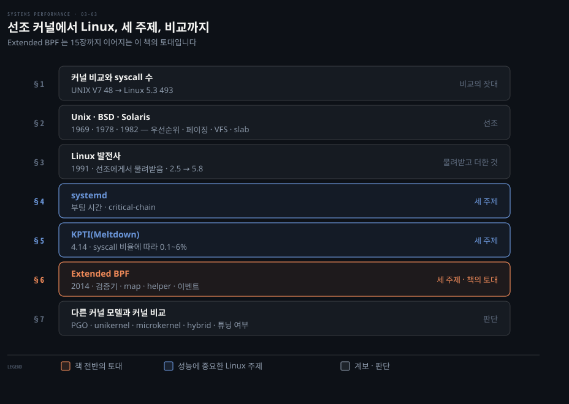
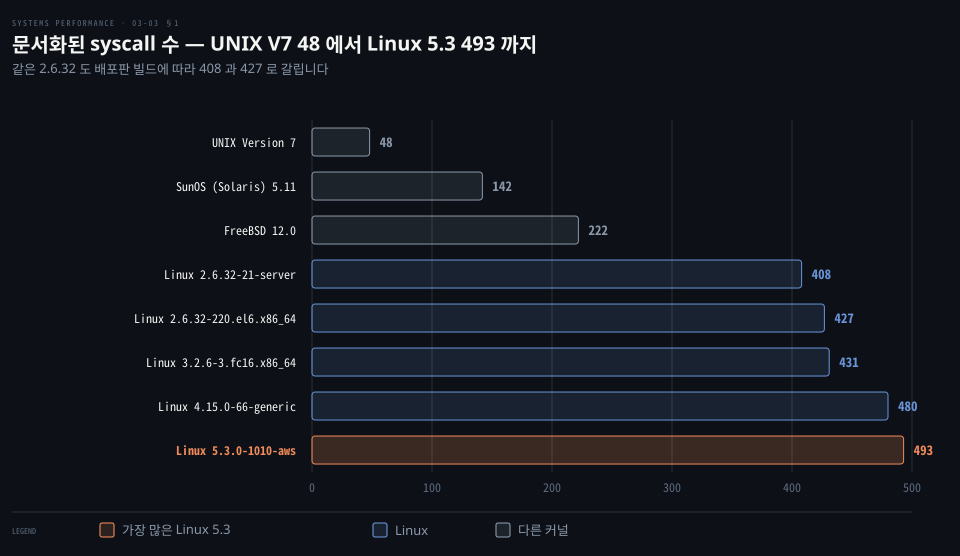
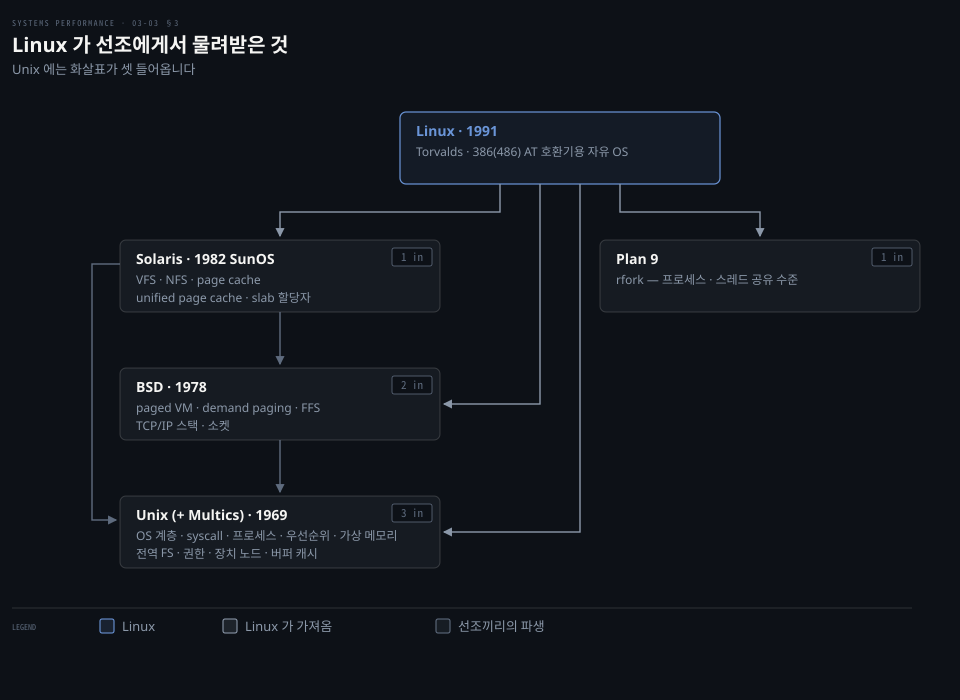
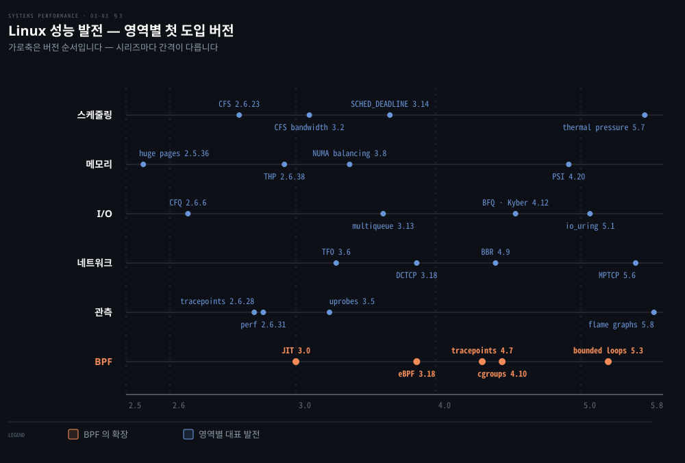
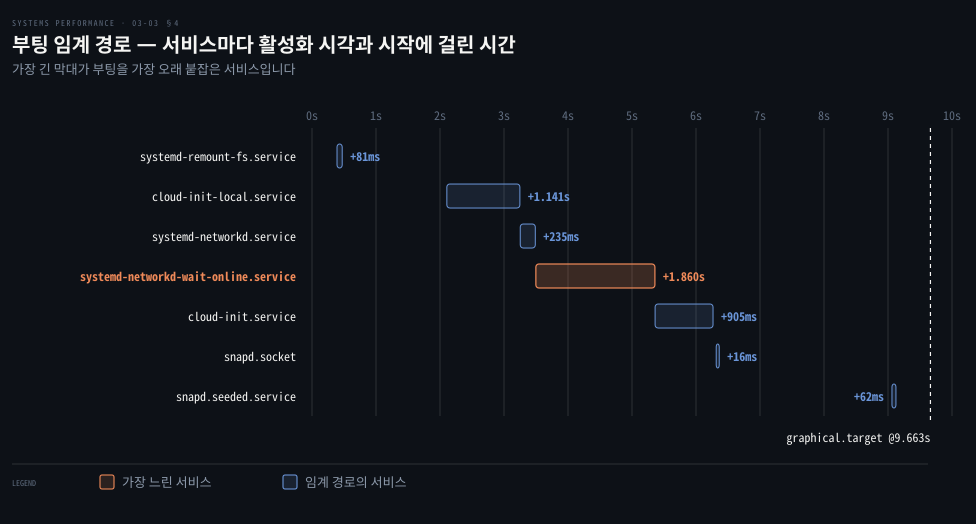
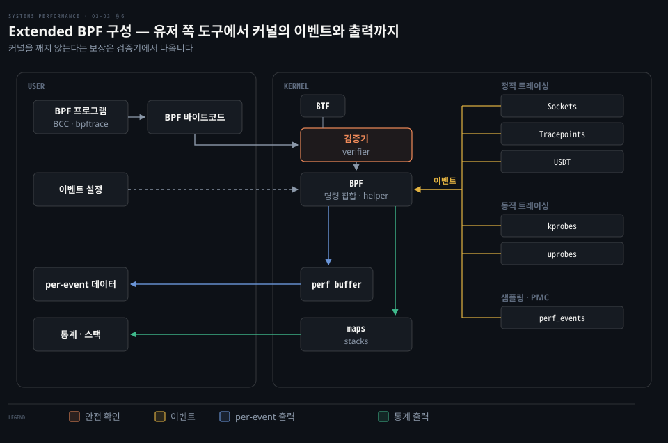
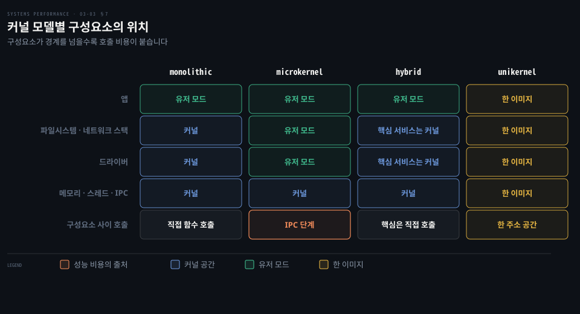

# 운영체제 — 커널 구현·Linux 발전사·BPF
---
> 이 노트는 3장의 마지막 부분으로, 성능 기능이 Unix 에서 Linux 로 어떻게 더해져 왔는지를 봅니다. 원서 3.3~3.6 을 따라 선조 커널, Linux 발전사, 성능에 중요한 세 주제(systemd·KPTI·Extended BPF), 다른 커널 모델과 커널 비교를 다룹니다.

## 핵심 요약

> Linux 의 성능 기능은 선조 커널의 아이디어를 물려받아 쌓인 것이고, 그만큼 늘어난 기능과 튜너블이 곧 성능의 무기이자 복잡성의 비용입니다.

03-01·03-02 가 어느 커널에나 통하는 일반 개념이었다면 이 편은 특정 커널, 특히 Linux 의 구현입니다. Unix 는 작은 커널에도 우선순위와 버퍼 캐시 같은 성능 기능을 갖췄습니다. BSD 와 Solaris 는 페이징·TCP/IP·VFS·slab 같은 기능을 더했습니다. Linux 는 이것들을 모아 1991년에 시작했습니다. 그 후 2.5 에서 5.8 까지 성능 기능을 계속 더했습니다.

그 가운데 원서가 따로 짚는 세 주제가 있습니다. 부팅 시간을 재는 systemd, 보안 완화가 성능을 깎는 KPTI, 그리고 이 책 전반의 트레이싱 도구를 떠받치는 Extended BPF 입니다.

끝에서 원서는 어느 커널이 빠른지 묻습니다. 저자는 보통 Linux 가 앞선다고 봅니다. 하지만 비교하기 전에 각 커널이 튜닝됐는지부터 따져야 한다고 경고합니다. 기능이 많아질수록 튜닝하지 않은 채 도는 배포가 늘기 때문입니다.


## 학습 목표

> 이 편을 덮은 뒤 스스로 할 수 있어야 하는 일입니다.

1. BSD·Solaris 가 Unix 에 더한 성능 기능과, 그것이 Linux 의 어디에 남았는지 설명합니다.
2. Linux 의 성능 발전을 스케줄링·I/O·네트워크·관측 영역별로 예를 들어 설명합니다.
3. systemd 의 critical-chain 출력에서 부팅을 늦추는 서비스를 골라냅니다.
4. KPTI 의 비용이 syscall 비율에 따라 어떻게 달라지는지와 그 비용을 줄이는 방법을 설명합니다.
5. 커널 모델을 구성요소의 위치로 비교하고, 마이크로벤치마크 하나로 커널을 비교하는 일의 위험을 판단합니다.

아래는 이 편의 절을 시대와 역할로 쌓은 지도입니다. 행 오른쪽이 그 절이 이 편에서 맡는 몫입니다.



위 세 행은 커널의 계보입니다. 가운데 세 행은 원서가 성능에 중요하다고 꼽은 Linux 주제를 다룹니다. 그 가운데 Extended BPF 는 15장까지 이어지는 이 책의 토대라 따로 강조했습니다.


## 이 문서가 다루지 않는 것

> 다른 편과 다른 장으로 넘긴 주제입니다.

- 어느 커널에나 통하는 일반 개념은 03-01(커널·시스템 콜·인터럽트·프로세스)과 03-02(가상 메모리·스케줄러·파일시스템·I/O)가 다룹니다.
- BPF 도구 BCC·bpftrace 의 사용법은 15장에서 설명합니다.
- Solaris 의 자세한 내용은 원서 1판으로 넘깁니다. FreeBSD 내부는 원서가 『The Design and Implementation of the FreeBSD Operating System』 2판을 권합니다.
- 같은 메커니즘을 K8s 운영 관점에서 보려면 [kernel/01-01](../../kernel/01-01.%EC%BB%A4%EB%84%90%EA%B3%BC%20%EC%BB%A8%ED%85%8C%EC%9D%B4%EB%84%88.md)을 읽습니다. 커널 개발자 관점에서 보려면 [linux-kernel-programming](../linux-kernel-programming/00-00.%EC%B1%85%20%EA%B0%9C%EC%9A%94%EC%99%80%20%ED%95%99%EC%8A%B5%20%EB%A1%9C%EB%93%9C%EB%A7%B5.md)을 참고합니다.


## 1. 커널 비교와 syscall 수

> 커널은 지원 파일시스템·syscall 인터페이스·네트워크 스택 구조·실시간 지원·스케줄링 알고리즘에서 갈립니다. man page 섹션 2 의 항목 수로 센 syscall 수는 거친 비교지만, UNIX V7 의 48 개에서 Linux 5.3 의 493 개로 차이를 보여 줍니다.

커널마다 성능 기능이 다르다는 것을 한 숫자로 가늠할 방법이 있을까요? 원서는 문서화된 syscall 수를 거친 잣대로 씁니다.

커널 차이는 지원하는 파일시스템(8장), 시스템 콜 인터페이스, 네트워크 스택 구조, 실시간 지원, CPU·디스크 I/O·네트워크 스케줄링 알고리즘에 있습니다. 원서 표 3.3 은 OS man page 섹션 2(syscalls)의 항목 수를 셉니다. 원서는 스스로 거친 비교라고 밝힙니다. 하지만 차이를 보기에는 충분합니다.

| 커널 버전 | syscall 수 |
|------|-----------|
| UNIX Version 7 | 48 |
| SunOS (Solaris) 5.11 | 142 |
| FreeBSD 12.0 | 222 |
| Linux 2.6.32-21-server | 408 |
| Linux 2.6.32-220.el6.x86_64 | 427 |
| Linux 3.2.6-3.fc16.x86_64 | 431 |
| Linux 4.15.0-66-generic | 480 |
| Linux 5.3.0-1010-aws | 493 |



같은 2.6.32 라도 배포판 빌드에 따라 408 과 427 로 갈립니다. 이 수는 문서화된 syscall 만 센 것입니다. 원서는 커널이 OS 소프트웨어가 사적으로 쓰는 syscall 을 더 제공한다고 덧붙입니다.

> 켄 톰슨(ACM Turing Centenary, 2012): "UNIX는 처음에 시스템 콜이 스무 개였는데, 직계 후손인 Linux는 오늘날 천 개가 넘는다. 나는 커지는 것들의 복잡성과 크기가 걱정된다." Linux는 새 syscall·커널 인터페이스로 복잡성을 유저랜드에 노출하며, 그 복잡성이 학습·프로그래밍·디버깅을 더 오래 걸리게 합니다.

톰슨이 말한 "천 개가 넘는다"와 표의 493 은 세는 범위가 다릅니다. 표는 man page 로 문서화된 것만 셌습니다.


## 2. Unix·BSD·Solaris의 성능 발전

> Unix 는 작은 커널에도 스케줄러 우선순위·512바이트 블록과 버퍼 캐시·스와핑·멀티태스킹 같은 성능 기능을 가졌습니다. BSD 는 paged 가상 메모리·demand paging·FFS·TCP/IP 스택·소켓을, Solaris 는 VFS·slab 할당자·DTrace·Zones·ZFS 를 더했습니다.

지금 Linux 의 성능 기능 상당수는 Linux 가 처음 만든 것이 아닙니다. 어디서 왔는지 알면 각 기능이 어떤 문제를 풀려고 생겼는지가 보입니다.

### Unix

Unix 는 1969년부터 AT&T 벨 연구소에서 켄 톰슨, 데니스 리치 등이 개발했습니다. 원서는 『The UNIX Time-Sharing System』([Ritchie 74])을 인용해 그 시작을 전합니다. 기존 컴퓨터 환경에 불만이던 톰슨이 잘 쓰이지 않던 PDP-7 을 찾았습니다. 그는 더 쓰기 좋은 환경을 만들기 시작했습니다.

개발자들은 그 전에 Multics(Multiplexed Information and Computer Services)를 만들었습니다. Unix 는 가벼운 멀티태스킹 OS·커널로 개발됐습니다. 처음 이름 UNICS(UNiplexed Information and Computing Service)는 Multics 에 빗댄 말장난이었습니다. 원서는 Thompson 의 『UNIX Implementation』에서 다음 구절도 옮깁니다.

> "커널은 유저가 자기 취향대로 바꿀 수 없는 유일한 코드라, 가능한 한 적은 결정을 해야 한다 — 한 가지 일에 한 가지 방법만, 단 그것이 제공될 수 있던 모든 옵션의 최소공약수이게."

커널은 작았지만 성능 기능이 있었습니다. 아래 표의 가운데 칸이 기능, 오른쪽 칸이 원서가 적은 효과입니다.

| 기능 | 내용 | 효과 |
|---|---|---|
| 스케줄러 우선순위 | 프로세스마다 우선순위 | 고우선 일의 런큐 지연 감소 |
| 512바이트 블록과 버퍼 캐시 | 큰 블록 단위 디스크 I/O, 장치별 메모리 캐시 | 디스크 I/O 효율 |
| 스와핑 | idle 프로세스를 저장장치로 내보냄 | 바쁜 프로세스가 메인 메모리에서 돎 |
| 멀티태스킹 | 여러 프로세스를 동시에 실행 | 작업 처리량 향상 |

네트워킹, 여러 파일시스템, 페이징처럼 지금은 표준이 된 기능을 지원하려면 커널이 커져야 했습니다. BSD·SunOS(Solaris)·Linux 같은 파생 커널이 여럿 생기면서 커널 성능이 경쟁의 대상이 됐습니다. 이 경쟁이 기능과 코드를 더 늘렸습니다.

### BSD

BSD(Berkeley Software Distribution)는 UC 버클리에서 Unix 6판을 개선하며 시작했습니다. 1978년에 처음 나왔습니다. 원래 Unix 코드는 AT&T 라이선스가 필요했습니다. 그래서 1990년대 초까지 BSD 안의 Unix 코드를 새 BSD 라이선스로 다시 썼습니다. 덕분에 FreeBSD 같은 자유 배포판이 등장했습니다. 성능과 관련된 주요 발전은 다음과 같습니다. 오른쪽 칸이 원서가 적은 이점입니다.

| 기능 | 내용 | 이점 |
|---|---|---|
| paged 가상 메모리 | 프로세스 전체 대신 LRU 청크를 페이지 단위로 내보냄 | 메모리를 더 잘게 확보(7장) |
| demand paging | 물리 메모리 매핑을 처음 쓸 때로 미룸 | 안 쓰일 페이지의 초기 비용 회피(7장) |
| FFS | 디스크 할당을 실린더 그룹으로 묶음 | 단편화 감소, 회전 디스크 성능 향상, UFS 의 기반(8장) |
| TCP/IP 스택 | Unix 최초의 고성능 스택(4.2BSD, 1983) | BSD 는 지금도 네트워크 성능으로 알려짐 |
| 소켓 | 연결 엔드포인트 API(4.2BSD) | 네트워킹의 표준(10장) |
| Jails | 한 커널을 여러 게스트가 나누는 경량 OS 가상화(FreeBSD 4.0) | 경량 격리 |
| Kernel TLS | TLS 처리의 상당 부분을 커널로 옮김 | 성능 향상 |

원서 각주 14 에 따르면 Kernel TLS 는 Netflix CDN 을 이루는 FreeBSD OCA(Open Connect Appliance)의 성능을 높이려 개발됐습니다. BSD 는 Linux 만큼 널리 쓰이지는 않습니다. 하지만 Netflix CDN, NetApp·Isilon 의 파일 서버 같은 성능이 중요한 환경에 쓰입니다. Netflix 는 2019년 CDN 의 FreeBSD 성능을 이렇게 요약했습니다.

> "FreeBSD 와 범용 부품으로, 16코어 2.6GHz CPU 하나에서 CPU 약 55% 로 TLS 암호화 연결 90Gb/s 를 제공한다." [Looney 19]

### Solaris

Solaris 는 Sun Microsystems 가 1982년에 만든 Unix·BSD 파생 커널과 OS 입니다. 처음 이름은 SunOS 였습니다. Sun 워크스테이션에 맞춰져 있었습니다. 1980년대 말 AT&T 가 SVR3·SunOS·BSD·Xenix 의 기술을 바탕으로 새 Unix 표준 SVR4(Unix System V Release 4)를 만들었습니다. 그러자 Sun 은 SVR4 기반의 새 커널을 개발했습니다. 그리고 OS 이름을 Solaris 로 바꿨습니다. 성능과 관련된 주요 발전은 다음과 같습니다.

| 기능 | 내용 | 이점 |
|---|---|---|
| VFS | 여러 파일시스템이 쉽게 공존하는 추상 인터페이스, 처음엔 NFS·UFS 용 | 파일시스템 유형 추가가 쉬움(8장) |
| fully preemptible 커널 | 실시간 일을 포함한 고우선 일에 저지연 | 실시간 지원 |
| 멀티프로세서 지원 | 1990년대 초 ASMP·SMP 커널 지원에 크게 투자 | 여러 CPU 활용 |
| slab 할당자 | SVR4 buddy 할당자를 대체, CPU 별로 미리 할당한 버퍼 캐시를 빠르게 재사용 | Linux 를 포함한 커널의 표준이 됨 |
| DTrace | 전체 소프트웨어 스택의 정적·동적 트레이싱, 프로덕션에서 실시간으로 | Linux 의 BPF·bpftrace 가 같은 종류 |
| Zones | 한 커널을 나누는 OS 인스턴스를 만드는 OS 기반 가상화 | 앞선 FreeBSD jails 와 비슷(11장) |
| ZFS | 엔터프라이즈급 기능과 성능의 파일시스템 | 지금은 Linux 등 다른 OS 에서도 쓰임(8장) |

원서는 Zones 를 FreeBSD jails 와 비슷한 기술로 소개합니다. OS 가상화가 지금은 Linux 컨테이너로 널리 쓰인다고 덧붙입니다. Oracle 이 2010년 Sun 을 인수했습니다. 그래서 지금은 Oracle Solaris 입니다.


## 3. Linux 발전사 — 2.5에서 5.8까지

> Linux(1991~, 리누스 토르발스)는 Unix·BSD·Solaris·Plan 9 의 아이디어를 모아 만들어졌습니다. 성능 관련 발전은 2.5 시리즈부터 5.8 까지 이어지며, 스케줄러·메모리·동기화·I/O·네트워크·관측 전 영역에 걸칩니다.

Linux 의 성능 기능은 수십 개 버전에 흩어져 들어왔습니다. 어느 기능이 언제 생겼는지 알아야 합니다. 그래야 운영 중인 커널에 그 기능이 있는지 판단할 수 있습니다.

Linux 는 1991년 리누스 토르발스가 인텔 PC 용 자유 OS 로 만들었습니다. 그는 Usenet 에 "취미일 뿐, gnu 처럼 크고 전문적이진 않을 386(486) AT 호환기용 (자유) 운영체제"를 개발 중이라고 알렸습니다. 이 글은 작은 컴퓨터용 자유 Unix 인 MINIX 를 언급합니다. 당시 BSD 도 자유 Unix 를 목표로 했습니다. 하지만 법적 분쟁을 겪고 있었습니다.

### 선조에게서 물려받은 것

Linux 커널은 여러 선조의 일반적인 아이디어를 가져왔습니다. 원서의 목록을 그대로 옮기면 다음과 같습니다.

- Unix(와 Multics): OS 계층, 시스템 콜, 멀티태스킹, 프로세스, 프로세스 우선순위, 가상 메모리, 전역 파일시스템, 파일시스템 권한, 장치 노드, 버퍼 캐시
- BSD: paged 가상 메모리, demand paging, FFS, TCP/IP 네트워크 스택, 소켓
- Solaris: VFS, NFS, page cache, unified page cache, slab 할당자
- Plan 9: 프로세스와 스레드(태스크) 사이의 공유 수준을 고르는 resource fork(rfork)



화살표는 아이디어를 가져온 쪽에서 준 쪽으로 향합니다. Linux 는 네 선조에게서 아이디어를 가져왔습니다. BSD 는 Unix 6판을 개선하며 시작했습니다. Solaris 는 Unix 와 BSD 에서 파생됐습니다. 그래서 Unix 로 들어오는 화살표가 셋으로 가장 많습니다. Linux 는 지금 서버, 클라우드 인스턴스, 휴대폰을 포함한 임베디드 장치에 널리 쓰입니다.

### 성능 관련 발전 — 영역별 첫 도입 버전

원서 3.4.1 은 성능과 관련된 Linux 발전을 첫 도입 버전과 함께 60개 남짓 나열합니다. 2.5.7 의 futex 부터 5.8 의 perf flame graphs 까지 다룹니다. 아래 표는 이 목록을 영역별로 다시 묶어 보여줍니다. 오른쪽 칸의 괄호 안이 첫 도입 버전입니다.

| 영역 | 발전 |
|------|------|
| 스케줄링 | scheduling domains(2.6.7, NUMA), Cpusets(2.6.12), voluntary kernel preemption(2.6.13), CFS(2.6.23), CFS bandwidth control(3.2), SCHED_DEADLINE(3.14), thermal pressure(5.7) |
| 메모리 | huge pages(2.5.36), overcommit·OOM killer, transparent huge pages(2.6.38), NUMA balancing(3.8+), MADV_COLD·MADV_PAGEOUT(5.4) |
| 동기화 | futex(2.5.7), RCU(2.5.43), No BKL(2.6.37), MCS locks·qspinlocks(3.15), queued spinlocks(4.2) |
| 메모리 할당자 | SLUB(2.6.22) |
| I/O | deadline(2.5.39)·anticipatory(2.5.75)·CFQ(2.6.6), modular I/O scheduling(2.6.10), multiqueue block I/O(3.13), DAX(4.0), BFQ·Kyber(4.12), multi-queue 기본·고전 스케줄러 제거(5.0), io_uring(5.1) |
| 저장 캐시 | SSD cache devices(3.9), bcache(3.10) |
| 네트워크 | TCP LRO(2.6.24), TCP anti-bufferbloat(3.3+), TCP early retransmit(3.5), TFO(3.6·3.7·3.13), SO_REUSEPORT(3.9), TCP TLP(3.10), TCP autocorking(3.14), DCTCP(3.18), TCP lockless listener(4.4), KCM(4.6), TCP NV(4.8), XDP(4.8·4.18), TCP BBR(4.9), Kernel TLS(4.13·4.17), MSG_ZEROCOPY(4.14), TCP EDT(4.20), UDP GRO(5.0), MultiPath TCP(5.6) |
| 시간·tick | DynTicks(2.6.21), NO_HZ_FULL(3.10·3.12) |
| 관측·트레이싱 | OProfile(2.5.43), DebugFS(2.6.11), blktrace(2.6.17), delay accounting(2.6.18), IO accounting(2.6.20), latencytop(2.6.25), tracepoints(2.6.28), perf(2.6.31), uprobes(3.5), hardware latency tracer(4.9), perf c2c(4.10), PSI(4.20·5.2), boot-time tracing(5.6), perf flame graphs(5.8) |
| BPF | BPF JIT(3.0), Extended BPF(3.18+) |
| 자원·가상화 | cgroups(2.6.24), KVM, Overlayfs(3.18), cgroup v2(4.5, CPU 컨트롤러는 4.15), Intel CAT(4.10) |
| syscall 효율 | epoll(2.5.46)·epoll 확장성(4.5), inotify(2.6.13), splice(2.6.17) |
| 보안 완화 | PCID(4.14, KPTI 비용 감소) |

몇 항목은 앞 두 편과 바로 이어집니다. DynTicks 와 NO_HZ_FULL 은 03-01 §6 의 tickless 커널을 뜻합니다. NO_HZ_FULL 은 idle 이 아닌 스레드도 클럭 tick 없이 돌게 합니다. 이를 통해 워크로드의 흔들림을 줄입니다. voluntary kernel preemption 은 03-02 §6 의 선점 설정입니다.

splice 는 파일 디스크립터와 파이프 사이로 유저 공간을 거치지 않고 데이터를 옮깁니다. 원서는 `sendfile(2)` 이 이제 splice 를 감싼다고 적습니다.

Extended BPF 는 한 번에 들어오지 않았습니다. 원서에 따르면 대부분이 4.x 시리즈에 더해졌습니다. 그리고 붙을 수 있는 곳이 차례로 넓어졌습니다. 3.19 에 kprobes, 4.7 에 tracepoints 가 붙었습니다. 4.9 에 소프트웨어·하드웨어 이벤트, 4.10 에 cgroups 도 추가됐습니다. 5.3 에서는 bounded loop 와 더 큰 명령 수 한도를 더했습니다. 그래서 복잡한 앱을 쓸 수 있게 됐습니다.



가로축은 시간이 아니라 버전 순서입니다. 시리즈마다 간격이 다릅니다. 영역마다 대표 항목만 골랐습니다. 맨 아래 BPF 줄이 3.0 의 JIT 에서 5.3 까지 이어지는 흐름을 보입니다.

원서는 목록에 넣지 않은 작은 개선도 많다고 밝힙니다. 락·드라이버·VFS·파일시스템·비동기 I/O 개선이 있습니다. 메모리 할당자·NUMA·새 프로세서 명령·GPU 지원, 그리고 perf 와 Ftrace 도 나아졌습니다. 부팅 시간도 systemd 를 채택하면서 줄었습니다. 원서는 이어서 성능에 중요한 세 주제(systemd·KPTI·Extended BPF)를 자세히 다룹니다.


## 4. systemd — 서비스 매니저와 부팅 시간

> systemd 는 원래 UNIX init 시스템을 대체한 Linux 서비스 매니저로, 의존성을 아는 서비스 시작과 서비스 시간 통계를 줍니다. 부팅 시간을 튜닝할 때 이 통계가 어디를 손볼지 보여 줍니다.

부팅이 느릴 때 모든 서비스의 시작 시간을 더해 보면 실제 부팅 시간과 맞지 않습니다. 서비스가 병렬로 뜨기 때문입니다. 어느 서비스가 실제로 부팅을 늦췄는지는 따로 알아내야 합니다.

systemd 는 흔히 쓰는 Linux 서비스 매니저입니다. 원래 UNIX init 시스템을 대체하려고 개발됐습니다. 의존성을 아는 서비스 시작과 서비스 시간 통계 같은 기능이 있습니다. 시스템 성능 작업에서 가끔 부팅 시간을 튜닝합니다. 이때 systemd 의 시간 통계가 손볼 곳을 알려 줍니다. 전체 부팅 시간은 `systemd-analyze(1)` 가 출력합니다.

```bash
# systemd-analyze
Startup finished in 1.657s (kernel) + 10.272s (userspace) = 11.930s
graphical.target reached after 9.663s in userspace
```

이 출력에서 시스템은 9.663초 만에 부팅을 마쳤습니다. 여기서 부팅을 마쳤다는 것은 graphical.target 에 닿았음을 뜻합니다. `critical-chain` 서브커맨드가 더 자세히 보여 줍니다. `@` 뒤는 유닛이 활성화된 시각을 나타냅니다. `+` 뒤는 그 유닛이 시작하는 데 걸린 시간입니다.

```bash
# systemd-analyze critical-chain
graphical.target @9.663s
└─multi-user.target @9.661s
  └─snapd.seeded.service @9.062s +62ms
    └─basic.target @6.336s
      └─sockets.target @6.334s
        └─snapd.socket @6.316s +16ms
          └─sysinit.target @6.281s
            └─cloud-init.service @5.361s +905ms
              └─systemd-networkd-wait-online.service @3.498s +1.860s
                └─systemd-networkd.service @3.254s +235ms
                  └─network-pre.target @3.251s
                    └─cloud-init-local.service @2.107s +1.141s
                      └─systemd-remount-fs.service @391ms +81ms
                        └─systemd-journald.socket @387ms
                          └─system.slice @366ms
                            └─-.slice @366ms
```

이 출력이 *임계 경로*(critical path)를 나타냅니다. 지연을 만든 단계, 곧 서비스의 연쇄를 뜻합니다. 아래 도식은 `+` 값이 있는 서비스를 활성화 시각 위에 막대로 그렸습니다.



가장 긴 막대는 1.86초의 `systemd-networkd-wait-online.service` 를 뜻합니다. 원서도 이것을 가장 느린 서비스로 꼽습니다. 그다음이 1.141초의 `cloud-init-local.service`, 0.905초의 `cloud-init.service` 입니다.

다른 서브커맨드도 쓸모가 있습니다. `blame` 은 초기화가 가장 느린 서비스를 보여줍니다. `plot` 은 SVG 도식을 냅니다. 자세한 내용은 `systemd-analyze(1)` man page 에 나옵니다. 원서는 3.4.1 의 boot-time tracing(5.6)이 Ftrace 로 부팅 초반을 추적한다고 설명합니다. 그리고 systemd 가 부팅 후반의 시간 정보를 준다고 짝지어 적습니다.

여기서 판단 질문 하나를 풀어 봅니다. 위 사슬에서 부팅 시간을 줄이려면 어느 서비스부터 볼지 고릅니다. 그리고 그 이유를 대 봅니다. 답은 이 편 끝 정답 절에 나옵니다.


## 5. KPTI(Meltdown) — 보안 완화의 성능 비용

> KPTI 패치(2018년 Linux 4.14)는 인텔 프로세서 취약점 Meltdown 의 완화입니다. 보안 문제는 피하지만 컨텍스트 전환과 syscall 마다 추가 CPU 사이클과 TLB flush 를 더해 성능을 깎고, 같은 릴리스의 PCID 지원이 일부 flush 를 피하게 해 줍니다.

보안 패치는 기능을 바꾸지 않는 듯합니다. 하지만 성능을 바꿀 수 있습니다. KPTI 가 그런 예입니다. 그 비용은 워크로드마다 크게 다릅니다.

2018년 Linux 4.14 에 더해진 **KPTI(kernel page table isolation)** 패치는 인텔 프로세서 취약점 "meltdown" 의 완화책입니다. 옛 Linux 커널에는 같은 목적의 KAISER 패치가 있었습니다. 다른 커널도 각자 완화책을 적용했습니다. 이 완화책들은 보안 문제를 비켜 갑니다. 하지만 컨텍스트 전환과 syscall 마다 추가 CPU 사이클과 TLB flush 를 더합니다. 그래서 프로세서 성능을 깎습니다.

원리는 이렇습니다. KPTI 는 유저 모드에서 커널 페이지 테이블을 떼어 둡니다. 따라서 모드가 바뀔 때마다 페이지 테이블을 바꿉니다. 그리고 주소 변환 캐시인 TLB 를 비워야 합니다.

같은 릴리스에서 Linux 는 **PCID(process-context ID)** 지원도 추가했습니다. 프로세서가 pcid 를 지원하면 일부 TLB flush 를 피할 수 있습니다. 3.4.1 목록은 PCID 를 컨텍스트 전환 때 TLB flush 를 피하게 돕는 프로세서 MMU 기능으로 설명합니다. PCID 는 TLB 항목마다 어느 주소 공간의 것인지 표지를 붙입니다. 그래서 페이지 테이블을 바꿔도 TLB 를 모두 비우지 않습니다. 일부를 그대로 쓸 수 있습니다.

> 저자는 Netflix 클라우드 프로덕션 워크로드에서 KPTI 영향을 *syscall 비율에 따라 0.1~6%*(비율 높을수록 비쌈)로 평가했습니다. huge pages(flush된 TLB가 더 빨리 데워짐)와 트레이싱 도구로 syscall을 줄이면 비용이 더 낮아집니다 — 이런 트레이싱 도구 다수가 Extended BPF로 구현됩니다.

비용이 0.1% 에서 6% 까지 벌어지는 이유는 비용이 syscall 마다 붙기 때문입니다. syscall 을 적게 하는 계산 위주 워크로드는 거의 느려지지 않습니다. 반면 syscall 이 잦은 워크로드일수록 많이 느려집니다. 그래서 줄이는 방법도 syscall 수를 줄이거나 flush 뒤의 회복을 빠르게 하는 쪽입니다.


## 6. Extended BPF — 차세대 커널 실행 환경

> BPF 는 1992년 패킷 캡처 성능을 높이려 나왔지만, 2013년의 재작성으로 범용 커널 안 실행 엔진이 됐습니다. 검증기가 안전을 보장하고, 효율적이고 안전한 고급 트레이싱 도구의 새 세대를 떠받쳐 성능 분석에 중요합니다.

커널 안에서 사용자가 만든 코드를 돌리면 강력합니다. 하지만 잘못된 코드 하나가 커널 전체를 멈출 수 있습니다. Extended BPF 는 검증기로 이 위험을 막습니다. 동시에 커널에 프로그래머빌리티를 줍니다.

**BPF** 는 Berkeley Packet Filter 의 약자입니다. 원서는 1992년 패킷 캡처 도구의 성능을 높이려고 처음 개발된 잘 알려지지 않은 기술이었다고 소개합니다. 2013년 Alexei Starovoitov 가 대규모 재작성을 제안했습니다. 그와 Daniel Borkmann 이 발전시켜 2014년 Linux 커널에 들어갔습니다. 이 재작성으로 BPF 는 네트워킹·관측성·보안 등에 두루 쓰는 범용 실행 엔진이 됐습니다. 원서 각주 1 은 지금의 BPF 가 버클리·패킷·필터 어느 것과도 거의 상관없다고 적습니다. 그래서 약어가 아니라 이름이 됐다고 덧붙입니다.

BPF 는 명령 집합, 저장 객체(map), helper 함수로 이뤄진 유연하고 효율적인 기술입니다. 가상 명령 집합 명세가 있어 가상 머신으로 볼 수도 있습니다. BPF 프로그램은 커널 모드에서 돌며(03-01 §2) 이벤트에 붙도록 설정됩니다. 원서 그림 3.16 은 이벤트를 세 묶음으로 나눕니다. 정적 트레이싱은 소켓 이벤트·tracepoint·USDT probe 를 뜻합니다. 동적 트레이싱은 kprobe·uprobe 로 이뤄집니다. 샘플링과 PMC 는 perf_event 가 맡습니다.

tracepoint 와 USDT 는 커널과 유저 코드에 미리 심어 둔 정적 지점입니다. kprobe 와 uprobe 는 커널과 유저 함수에 실행 중에 붙이는 동적 지점을 뜻합니다. 이벤트 소스는 4장과 15장이 자세히 다룹니다.

BPF 바이트코드는 먼저 *검증기*(verifier)를 통과해야 합니다. 검증기는 BPF 프로그램이 커널을 깨거나 오염시키지 않는지 살핍니다. 데이터 타입과 구조를 알기 위해 *BTF(BPF Type Format)* 를 쓰기도 합니다. BTF 는 커널 자료 구조의 형태를 담은 정보입니다. 출력은 이벤트마다 데이터를 효율적으로 내보내는 perf ring buffer 로 냅니다. 아니면 통계에 맞는 map 으로 보냅니다.



왼쪽 유저 영역의 BPF 도구가 프로그램을 바이트코드로 만듭니다. 이를 커널에 넘깁니다. 바이트코드는 검증기를 거쳐 BPF 로 적재됩니다. 그리고 이벤트 설정에 따라 오른쪽 세 묶음의 이벤트에 붙습니다. 결과는 두 길로 유저에게 돌아갑니다. 이벤트마다의 데이터는 perf buffer 로 향합니다. 통계와 스택은 map 으로 갑니다.

> BPF가 성능 분석에 중요한 까닭은 *효율적·안전·고급* 트레이싱 도구의 새 세대를 떠받치기 때문입니다 — 기존 커널 이벤트 소스(tracepoint·kprobe·uprobe·perf_event)에 프로그래머빌리티를 줍니다. 예로 BPF 프로그램이 I/O 시작·끝에 타임스탬프를 기록해 지속 시간을 재고 커스텀 히스토그램에 담을 수 있습니다. 이 책의 많은 BPF 프로그램은 BCC·bpftrace 프런트엔드를 쓰며, 15장에서 다룹니다.


## 7. 다른 커널 모델과 커널 비교

> PGO 커널은 CPU 프로파일로 컴파일을 개선하고, unikernel 은 커널과 앱을 한 이미지로 합치며, microkernel 은 커널을 최소화하고 기능을 유저 모드로 옮깁니다. 어느 커널이 빠른지는 설정과 워크로드에 달렸지만, 저자는 보통 Linux 가 앞선다고 봅니다.

커널이 꼭 monolithic 이어야 하는 것은 아닙니다. 구성요소를 어디에 두느냐에 따라 성능·안정성·관측성의 맞교환이 달라집니다. 그 맞교환이 커널 비교를 어렵게 만듭니다.

### 다른 커널 모델

**PGO(profile-guided optimization)** 는 FDO(feedback-directed optimization)라고도 부릅니다. CPU 프로파일 정보로 컴파일러의 결정을 개선합니다. 실제 실행에서 모은 프로파일로 자주 도는 경로를 고릅니다. 그리고 그쪽을 다시 최적화합니다. 커널 빌드에 적용하는 절차는 세 단계입니다.

1. 프로덕션에서 CPU 프로파일을 뜹니다.
2. 그 프로파일로 커널을 다시 컴파일합니다.
3. 새 커널을 프로덕션에 배포합니다.

그러면 특정 워크로드에 맞춰 성능이 오른 커널이 나옵니다. JVM 같은 런타임은 JIT 컴파일과 함께 Java 메서드를 실행 성능에 따라 자동으로 다시 컴파일합니다. 하지만 PGO 커널은 이 단계를 사람이 밟아야 합니다.

관련된 컴파일 최적화가 LTO(link-time optimization)입니다. 링크할 때 바이너리 전체를 한 번에 컴파일합니다. 그래서 여러 파일에 걸친 프로그램 전체 최적화를 이룹니다. Microsoft Windows 커널은 LTO 와 PGO 를 많이 씁니다. 원서는 PGO 로 5~20% 개선을 봤다고 적습니다. Google 도 성능을 위해 LTO·PGO 커널을 쓴다고 밝힙니다.

gcc·clang 컴파일러와 Linux 커널 모두 PGO 를 지원합니다. 커널 PGO 는 프로파일을 모으려고 특수하게 계측한 커널을 돌려야 합니다. Google 의 AutoFDO 는 그 특수 커널이 필요 없습니다. 일반 커널에서 `perf(1)` 로 프로파일을 모읍니다. 그 뒤 컴파일러가 쓸 형식으로 바꿉니다.

원서는 PGO·AutoFDO 로 Linux 커널을 빌드하는 최근 문서가 Linux Plumber's Conference 2020 의 Microsoft·Google 발표 둘뿐이라고 적습니다. 각주 15 에 따르면 한동안 가장 최근 문서가 2014년 Linux 3.13 용이었습니다. 이것이 새 커널에서의 채택을 막았습니다.

**unikernel** 은 커널·라이브러리·앱을 하나로 합친 단일 앱 머신 이미지입니다. 보통 하드웨어 VM 이나 베어메탈에서 단일 주소 공간으로 돕니다. 명령 텍스트가 적어 CPU 캐시 적중률이 높습니다. 그리고 보안 취약점이 줄 수 있다는 성능·보안 이점이 있습니다. 반면 로그인해 디버깅할 SSH·셸·성능 도구가 없습니다. 더할 방법도 없을 수 있습니다.

unikernel 을 프로덕션에서 튜닝하려면 이를 지원하는 새 성능 도구와 지표를 만들어야 합니다. 저자는 개념 증명으로 Xen dom0 에서 domU unikernel 게스트를 프로파일하는 초보적인 CPU 프로파일러를 만들었습니다. CPU 플레임 그래프까지 그려서 가능하다는 점만 보였습니다([Gregg 16a]). 예로 MirageOS 가 있습니다.

이 장 대부분이 다룬 Unix 계열 커널은 monolithic 커널입니다. 장치를 관리하는 모든 코드가 한 큰 커널 프로그램으로 함께 돕니다. **microkernel** 은 커널 소프트웨어를 최소로 둡니다. 메모리 관리·스레드 관리·프로세스 간 통신(IPC) 같은 필수 기능만 지원합니다. 파일시스템·네트워크 스택·드라이버는 유저 모드 소프트웨어로 구현합니다.

그래서 유저 모드 구성요소를 쉽게 고치고 바꿀 수 있습니다. 원서는 데이터베이스나 웹 서버를 고르듯 네트워크 스택도 골라 설치하는 장면을 상상해 보라고 권합니다. 드라이버가 죽어도 커널 전체가 죽지 않습니다. 그래서 장애에도 더 강합니다. 예로 QNX 와 Minix 3 가 있습니다.

microkernel 의 단점은 I/O 같은 기능을 수행할 때 IPC 단계가 늘어 성능이 떨어지는 것입니다. 한 해법이 **hybrid 커널** 입니다. monolithic 커널처럼 성능이 중요한 서비스를 커널 공간으로 되돌립니다. 그래서 IPC 대신 직접 함수 호출로 부릅니다. 동시에 microkernel 의 모듈식 설계와 장애 내성은 유지합니다. 예로 Windows NT 커널과 Plan 9 커널이 있습니다.



열마다 같은 구성요소가 어디에서 도는지를 보면 맞교환이 보입니다. microkernel 은 구성요소가 유저 모드로 나가 서로 IPC 로 부릅니다. hybrid 는 성능이 중요한 서비스를 커널로 되돌립니다. unikernel 은 경계 자체가 없습니다. 모두 한 이미지에 있습니다.

**분산 운영체제** 는 네트워크로 이은 여러 컴퓨터 노드에 운영체제 인스턴스 하나를 돌립니다. 각 노드에는 보통 microkernel 을 씁니다. 예로 벨 연구소의 Plan 9 과 Inferno 가 있습니다. 새로운 시도였지만 널리 쓰이지는 않았습니다. Plan 9·Inferno 를 함께 만든 Rob Pike 는 그 이유 가운데 하나로 이렇게 적었습니다([Pike 00]).

> "1970년대 말과 1980년대 초, Unix 가 아무도 다른 것을 시도하지 않게 만들어 운영체제 연구를 죽였다는 주장이 있었다. 당시 나는 믿지 않았다. 지금은 그 주장이 맞을지도 모른다고 마지못해 받아들인다(Microsoft 는 예외로 하고)."

지금 클라우드에서 계산 노드를 늘리는 흔한 방식은, 같은 OS 인스턴스 여럿에 부하를 나누는 방법입니다. 부하에 따라 그 수를 늘립니다(11장).

### 커널 비교

어느 커널이 가장 빠를까요? 원서는 이것이 OS 설정과 워크로드, 그리고 커널이 얼마나 관여하는지에 일부 달렸다고 답합니다. 저자는 보통 Linux 가 다른 커널을 앞설 것으로 봅니다. 성능 개선 작업이 방대하고 앱·드라이버 지원이 넓습니다. 또한 널리 쓰이므로 성능 문제를 찾아 보고하는 커뮤니티가 크기 때문입니다.

1993년부터 집계한 TOP500 슈퍼컴퓨터 목록은 2017년에 100% Linux 가 됐습니다.

예외도 있습니다. Netflix 는 클라우드에 Linux 를, CDN 에 FreeBSD 를 씁니다. 원서 각주 16 에 따르면 Netflix CDN 워크로드에서는 FreeBSD 가 더 높은 성능을 냅니다. 이는 특히 Netflix OCA 팀의 커널 개선 덕분입니다. 이 비교는 정기적으로 다시 합니다. 가장 최근은 2019년 Linux 5.0 과 FreeBSD 의 프로덕션 비교였습니다. 저자도 분석을 도왔습니다.

커널 성능은 흔히 마이크로벤치마크로 비교합니다. 하지만 이 방법은 틀리기 쉽습니다. 한 커널이 특정 syscall 에서 훨씬 빠르다고 나올 수 있습니다. 그래도 그 syscall 을 프로덕션 워크로드가 쓰지 않을 수 있습니다. 쓰더라도 마이크로벤치마크가 시험하지 않은 플래그로 쓰면 성능이 크게 달라질 수 있습니다. 커널 성능을 정확히 비교하는 일은 선임 성능 엔지니어가 몇 주를 들일 수 있는 일입니다. 원서는 12장의 active benchmarking 을 따를 방법론으로 권합니다.

원서 1판은 이 절을 Linux 에 성숙한 동적 트레이서가 없어 큰 성능 개선을 놓칠 수 있다는 말로 맺었습니다. 그 뒤 저자는 Linux 성능 업무로 옮겼습니다. Linux 에 없던 동적 트레이서인 BCC 와 bpftrace 를 Extended BPF 위에 만드는 일을 도왔습니다(15장).

1판과 2판 사이, 커널 버전으로 3.1 부터 5.8 까지의 기간에 §3 의 많은 발전이 들어왔습니다. 원서는 목록에 없던 큰 변화로 OpenZFS 가 Linux 를 주 커널로 지원하게 된 것을 덧붙입니다. Linux 에 성숙한 고성능 파일시스템 선택지가 생긴 셈입니다.

> 그리고 풍부한 Linux 발전은 *복잡성* 도 가져와, 비교 시 *각 커널이 튜닝됐는가* 를 따져야 합니다 — 튜닝 안 된 배포가 많습니다.

원서는 Linux 의 성능 기능과 튜너블이 너무 많아졌다고 적습니다. 워크로드마다 설정하고 튜닝하는 일이 고되어졌습니다. 저자는 튜닝하지 않은 채 도는 배포를 많이 봤다고 말합니다. 뒤 장들의 튜닝 절이 이것을 바로잡는 데 쓰입니다.

여기서 판단 질문 하나를 더 풀어 봅니다. 한 커널이 특정 syscall 마이크로벤치마크에서 다른 커널보다 두 배 빠르다는 보고를 받았다면, 결론을 내리기 전에 무엇부터 물어야 할까요? 답은 이 편 끝 정답 절에 나옵니다.


## 학습 점검

> 이 노트의 핵심을 스스로 떠올려 봅니다. 답이 막히면 해당 섹션으로 돌아가 확인합니다.

- syscall 수가 UNIX v7(48)에서 Linux 5.3(493)으로 늘어난 것이 켄 톰슨의 "복잡성 걱정"과 어떻게 연결되는지 설명해 봅니다. (→ §1)
- BSD가 Unix에 더한 성능 기능 셋(paged 가상메모리·demand paging·FFS·TCP/IP·소켓 중)과, Solaris의 slab 할당자가 왜 커널 표준이 됐는지 말해 봅니다. (→ §2)
- Linux 성능 발전 중 스케줄링(CFS)·트레이싱(BPF)·I/O(io_uring) 각 영역에서 하나씩 떠올려 봅니다. (→ §3)
- KPTI가 왜 성능을 깎고(컨텍스트 전환·syscall TLB flush), PCID·huge pages가 비용을 어떻게 줄이는지 설명해 봅니다. (→ §5)
- Extended BPF의 검증기(verifier)가 왜 필요하고, BPF가 어떤 이벤트 소스에 붙어 어떻게 성능 분석을 돕는지 말해 봅니다. (→ §6)
- monolithic·microkernel·hybrid·unikernel의 차이와, 저자가 보통 Linux가 빠르다고 보는 이유를 떠올려 봅니다. (→ §7)


## 정답 (자답 후 펼치기)

> 먼저 답한 뒤 읽습니다. 학습 점검의 순서대로 답하고, 흔한 오해를 함께 적습니다.

### 정답 1 — syscall 수와 복잡성

UNIX V7 의 문서화된 syscall 은 48 개였습니다. Linux 5.3 은 493 개입니다. 톰슨은 처음 스무 개이던 것이 천 개를 넘었다고 말했습니다. 커지는 것의 복잡성과 크기를 걱정했습니다. 원서는 Linux 가 새 syscall 과 커널 인터페이스로 그 복잡성을 유저랜드에 드러낸다고 설명합니다. 그로 인해 배우고 프로그래밍하고 디버깅하는 시간이 늘어난다고 적습니다. 대표 오해는 표의 수가 모든 syscall 을 센 것이라고 보는 시각입니다. 표는 문서화된 것만 셌습니다.

### 정답 2 — BSD 의 세 기능과 slab

BSD 가 더한 성능 기능에는 paged 가상 메모리, demand paging, FFS, TCP/IP 스택, 소켓이 있습니다. paged 가상 메모리는 프로세스 전체 대신 페이지 단위로 내보냅니다. demand paging 은 처음 쓸 때 물리 메모리를 매핑합니다. FFS 는 실린더 그룹으로 단편화를 줄입니다. Solaris 의 slab 할당자는 CPU 별로 미리 할당해 둔 버퍼 캐시를 빠르게 재사용했습니다. 그래서 SVR4 buddy 할당자보다 빨랐습니다. 결국 그 계열이 Linux 를 포함한 커널의 표준이 됐습니다.

### 정답 3 — 영역별 Linux 발전

대표 예는 스케줄링의 CFS 2.6.23, 트레이싱의 Extended BPF 3.18+ 입니다. 그 대부분은 4.x 에 들어왔습니다. I/O 의 대표 예는 io_uring 5.1 을 꼽습니다. 다른 예로 SCHED_DEADLINE 3.14, perf 2.6.31, uprobes 3.5, multiqueue block I/O 3.13 을 들 수 있습니다. 대표 오해는 Extended BPF 가 3.18 에서 한 번에 완성됐다고 믿는 것입니다.

### 정답 4 — KPTI 의 비용과 줄이는 방법

KPTI 는 컨텍스트 전환과 syscall 마다 추가 CPU 사이클과 TLB flush 를 더합니다. 그래서 성능을 깎습니다. syscall 비율이 높을수록 비쌉니다. 저자의 평가는 0.1~6% 였습니다. PCID 는 프로세서가 지원하면 일부 TLB flush 를 피하게 해 줍니다. huge pages 는 flush 된 TLB 가 더 빨리 데워지게 돕습니다. 트레이싱 도구로 syscall 을 찾아 줄이면 비용 자체가 줄어듭니다.

### 정답 5 — 검증기와 BPF 의 이벤트

검증기는 커널 모드에서 돌 BPF 프로그램이 커널을 깨거나 오염시키지 않는지 미리 확인합니다. 그래서 사용자가 쓴 코드를 커널 안에서 안전하게 돌릴 수 있습니다. BPF 는 소켓 이벤트·tracepoint·USDT·kprobe·uprobe·perf_event 에 붙습니다. 예를 들어 I/O 시작과 끝에 타임스탬프를 남깁니다. 이를 통해 지속 시간을 잽니다. 그 분포를 커널 안의 map 에 히스토그램으로 모읍니다.

### 정답 6 — 커널 모델과 Linux

monolithic 은 장치 관리 코드 전체가 한 커널 프로그램에서 돕니다. microkernel 은 메모리·스레드·IPC 만 커널에 둡니다. 파일시스템·네트워크 스택·드라이버를 유저 모드로 냅니다. hybrid 는 성능이 중요한 서비스만 커널로 되돌립니다. unikernel 은 커널과 앱을 한 이미지로 합칩니다. 저자가 보통 Linux 가 빠르다고 보는 이유는 방대한 성능 개선 작업, 넓은 앱·드라이버 지원입니다. 성능 문제를 찾아 보고하는 큰 커뮤니티도 한몫합니다.

### 본문 판단 질문 — 부팅 사슬에서 먼저 볼 서비스

`systemd-networkd-wait-online.service` 부터 봅니다. 임계 경로 위에서 시작에 걸린 시간이 1.86초로 가장 길기 때문입니다. 임계 경로 밖의 서비스는 다른 일과 병렬로 뜹니다. 그래서 줄여도 부팅 시간이 그만큼 줄지 않을 수 있습니다. 다음 후보는 `cloud-init-local.service`(1.141초)와 `cloud-init.service`(0.905초)입니다.

### 본문 판단 질문 — 두 배 빠른 마이크로벤치마크

먼저 그 syscall 을 프로덕션 워크로드가 실제로 쓰는지 살핍니다. 쓴다면 벤치마크가 시험한 것과 같은 플래그로 쓰는지 묻습니다. 그다음 두 커널이 모두 그 워크로드에 맞게 튜닝돼 있었는지 따집니다. 원서는 정확한 커널 비교를 선임 엔지니어가 몇 주를 들일 일로 봅니다. active benchmarking(12장)을 따르라고 권합니다.


## 관련 문서

- 커널 모드·시스템 콜·tick 의 일반 개념: [03-01](./03-01.%EC%9A%B4%EC%98%81%EC%B2%B4%EC%A0%9C%20%E2%80%94%20%EC%BB%A4%EB%84%90%C2%B7%EC%8B%9C%EC%8A%A4%ED%85%9C%20%EC%BD%9C%C2%B7%EC%9D%B8%ED%84%B0%EB%9F%BD%ED%8A%B8%C2%B7%ED%94%84%EB%A1%9C%EC%84%B8%EC%8A%A4.md)
- paged 가상 메모리·VFS·선점이 커널에서 어떻게 동작하는지: [03-02](./03-02.%EC%9A%B4%EC%98%81%EC%B2%B4%EC%A0%9C%20%E2%80%94%20%EA%B0%80%EC%83%81%EB%A9%94%EB%AA%A8%EB%A6%AC%C2%B7%EC%8A%A4%EC%BC%80%EC%A4%84%EB%9F%AC%C2%B7%ED%8C%8C%EC%9D%BC%EC%8B%9C%EC%8A%A4%ED%85%9C%C2%B7IO.md)
- BCC·bpftrace 로 BPF 를 쓰는 방법: [15-01](./15-01.BPF%20%E2%80%94%20%EA%B0%9C%EC%9A%94%C2%B7BCC%20vs%20bpftrace%C2%B7BCC.md)
