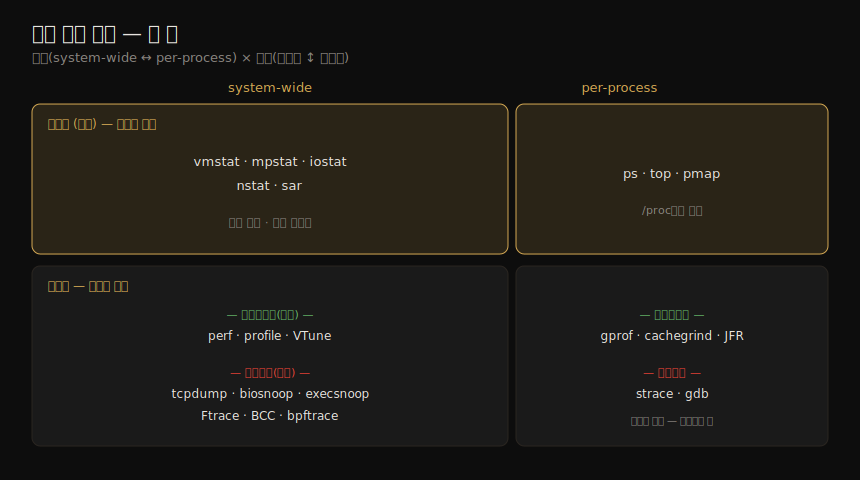

# 관측 도구 (1) — 도구 커버리지·유형
---
> 이 노트는 4장의 첫 부분으로, 관측 도구를 *어떻게 분류하고 무엇을 미리 갖춰야 하는가* 를 잡습니다. 운영체제는 시스템 SW·HW를 관측하는 많은 도구를 제공해 왔지만, 실제로는 빈 곳이 많아 전문가는 간접 도구·통계에서 활동을 추론하는 기술을 익혔습니다. BPF 기반 동적 트레이싱이 그 어두운 구석을 밝혔습니다. 여기서는 정적 도구·위기 도구(crisis tools)와, 도구 유형(고정 카운터·프로파일링·트레이싱·모니터링)을 그 오버헤드와 함께 봅니다.

운영체제는 많은 관측 도구를 제공하지만, 초심자에겐 "모든 것을 — 적어도 중요한 건 다 — 관측할 수 있다"는 인상을 줍니다. 현실엔 빈 곳이 많았고, 성능 전문가는 *추론과 해석* 의 기술 — 간접 도구·통계로 활동을 알아내는 — 을 익혔습니다. 예로 네트워크 패킷은 개별 검사(sniffing)가 됐지만 디스크 I/O는 (적어도 쉽게는) 안 됐습니다. BPF 기반 BCC·bpftrace 같은 동적 트레이싱이 그 어두운 구석을 밝혀, 이제 `biosnoop(8)` 으로 개별 디스크 I/O까지 봅니다.

> 이 노트는 도구의 *지형도* 입니다. 어떤 도구가 어디를 보는지, 어떤 유형이 얼마의 오버헤드를 갖는지를 잡아 둬야, 04-02(관측 소스)·04-03(sar·트레이싱 도구)과 뒤 장(6~11장)의 구체적 사용을 읽을 수 있습니다.

## 1. 도구 커버리지 — 워크로드·정적·위기 도구

> 도구는 보통 한 자원(CPU·메모리·디스크)에 집중하며, 여러 영역을 보는 multi-tool(perf·Ftrace·BCC·bpftrace)도 있습니다. 부하 중 활동을 보는 워크로드 도구와, 쉬는 상태의 속성을 보는 정적 도구로 갈립니다.

대부분의 관측 도구는 한 자원(CPU·메모리·디스크 등)에 집중하며, 해당 자원 장에서 다뤄집니다. 여러 영역을 분석하는 **multi-tool** 도 있습니다 — perf·Ftrace·BCC·bpftrace로, 04-03 에서 소개합니다. 저자는 커널 다이어그램에 도구를 표시한 *멘탈 맵* 을 만들어, 어떤 도구가 무엇을 관측하는지를 한눈에 보여 줍니다(웹사이트에서 내려받을 수 있음).

#### 정적 성능 도구(static performance tools)

부하가 *걸린* 상태가 아니라 *쉬는* 상태의 시스템 속성을 살피는 관측이 따로 있습니다 — 2장의 정적 성능 튜닝 방법론(02-02 §8)에 대응합니다. 설정·구성 요소의 문제를 점검하는 데 쓰며, *성능 문제가 단순히 오설정 때문* 일 때가 있습니다.

#### 위기 도구(crisis tools)

프로덕션 성능 위기에 여러 도구가 필요한데 *하나도 안 깔려 있을* 수 있습니다. 더 나쁜 건, 시스템이 이미 성능 문제를 겪는 중이라 도구 설치가 평소보다 오래 걸려 위기를 *연장* 한다는 점입니다. 그래서 저자는 위기 도구를 *미리* 갖추라고 권합니다.

| 패키지 | 제공 도구 |
|--------|----------|
| procps | ps·vmstat·uptime·top |
| util-linux | dmesg·lsblk·lscpu |
| sysstat | iostat·mpstat·pidstat·sar |
| iproute2 | ip·ss·nstat·tc |
| linux-tools-common | perf·turbostat |
| bcc-tools | opensnoop·execsnoop·runqlat·biosnoop·biolatency·tcplife·profile 등 100+ |
| bpftrace | bpftrace + 기본 도구들 |

> 기본 Linux 배포는 procps·util-linux만 깔려 있을 수 있어 나머지는 추가해야 합니다. 컨테이너 환경에선 전 도구를 갖춘 *특권 디버깅 컨테이너* 를 만들어 두는 게 좋습니다. 또 패키지 추가만으론 부족할 때가 많습니다 — 트레이싱 도구는 커널 CONFIG(`CONFIG_FTRACE`·`CONFIG_BPF`)가 필요하고, 프로파일링 도구는 stack walking 지원(frame-pointer 컴파일 또는 debuginfo)이 필요합니다. 위기가 닥치기 *전에* 각 도구가 동작하는지 확인해 둬야 합니다.

## 2. 도구 유형 — 카운터·프로파일링·트레이싱·모니터링

> 도구는 두 축으로 분류됩니다 — 시스템 전체(system-wide)냐 프로세스별(per-process)이냐, 그리고 카운터 기반이냐 이벤트 기반(프로파일러·트레이서)이냐. 카운터는 사실상 무료지만, 프로파일링·트레이싱은 필요할 때만 켭니다.

관측 도구는 두 축으로 나뉩니다 — *시스템 전체* vs *프로세스별*, 그리고 *카운터 기반* vs *이벤트 기반* 입니다. 이벤트 기반엔 프로파일러(이벤트 표본으로 거친 그림)와 트레이서(관심 이벤트 전부 계측·처리)가 들어갑니다. 이 두 축과 네 사분면을 한 장으로 정리하면 다음과 같습니다.

| 유형 | system-wide | per-process |
|------|-------------|-------------|
| 카운터(고정) | vmstat·mpstat·iostat·nstat·sar | ps·top·pmap |
| 이벤트(프로파일링) | perf·profile·VTune | gprof·cachegrind·JFR |
| 이벤트(트레이싱) | tcpdump·biosnoop·execsnoop·perf·Ftrace·BCC·bpftrace | strace·gdb |

> 일부 도구는 한 사분면 이상에 걸칩니다 — `top` 은 system-wide 요약도 갖고, system-wide 이벤트 도구는 특정 프로세스 필터(`-p PID`)를 가질 때가 많습니다.

## 3. 고정 카운터 — 사실상 무료

> 커널은 이벤트 발생 시 증가하는 부호 없는 정수 카운터를 유지합니다(받은 패킷·발행한 디스크 I/O·인터럽트). 기본 활성이라 "무료"로 여겨지며, 읽는 비용만 듭니다. 흔히 누적 카운터 쌍(횟수·총시간)으로 평균 지연을 계산합니다.

커널은 시스템 통계용 카운터를 유지합니다 — 이벤트 발생 시 증가하는 부호 없는 정수로 구현됩니다(받은 네트워크 패킷·발행한 디스크 I/O·발생한 인터럽트 수). 모니터링 SW가 이를 메트릭으로 노출합니다. 흔한 커널 방식은 *누적 카운터 쌍* — 하나는 이벤트 수, 하나는 총 시간 — 을 둬, 총 시간을 횟수로 나눠 평균 시간(지연)을 냅니다. 누적이라 간격(예: 1초)마다 읽어 델타를 구하면 초당 횟수와 평균 지연이 나옵니다 — 많은 시스템 통계가 이렇게 계산됩니다.

카운터는 기본 활성이라 *사실상 무료* 로 여겨지며, 추가 비용은 유저 공간에서 값을 읽는 것(미미)뿐입니다.

| 범위 | 도구 | 보는 것 |
|------|------|--------|
| system-wide | vmstat | 가상·물리 메모리 통계 |
| system-wide | mpstat | CPU별 사용 |
| system-wide | iostat | 디스크별 I/O(블록 장치 인터페이스) |
| system-wide | nstat | TCP/IP 스택 통계 |
| system-wide | sar | 각종 통계 + 이력 보관 |
| per-process | ps | 프로세스 상태·메모리·CPU |
| per-process | top | CPU 등으로 정렬한 상위 프로세스 |
| per-process | pmap | 프로세스 메모리 세그먼트별 사용 |

> 많은 도구가 *interval·count* 관례를 따릅니다(예: `vmstat 1 3`). 첫 줄은 *summary-since-boot*(부팅 이래 평균), 이후 줄은 간격별 현재 활동입니다(단 Linux vmstat의 첫 줄 메모리 열은 현재값이 섞임). per-process 도구는 보통 `/proc` 에서 통계를 읽습니다.

## 4. 프로파일링 — 표본으로 거친 그림

> 프로파일링은 일정 비율(예: 99Hz)로 instruction pointer·스택을 표집해 CPU 소비 코드 경로를 특성 파악합니다. 99Hz를 쓰는 까닭은 대상 활동과 lockstep으로 표집해 과대·과소 계수되는 걸 피하기 위해서입니다. 카운터와 달리 필요할 때만 켭니다.

프로파일링은 대상 동작의 표본(스냅샷) 집합을 모아 특성을 파악합니다. CPU 사용이 흔한 대상으로, 모든 CPU에 걸쳐 고정 비율(예: 100Hz)로 짧은 시간(예: 1분) instruction pointer·스택을 표집해 CPU 소비 코드 경로를 파악합니다. 프로파일러는 보통 **100Hz 대신 99Hz** 를 씁니다 — 대상 활동과 *lockstep* 으로 표집해 과대·과소 계수되는 걸 피하기 위해서입니다. 시간 기반이 아닌 HW 이벤트(CPU 캐시 미스·버스 활동)로도 프로파일링할 수 있습니다.

카운터와 달리 프로파일링(과 트레이싱)은 수집에 CPU·저장 오버헤드가 들어 *필요할 때만* 켭니다. 단 시간 기반 프로파일러는 더 안전합니다 — 이벤트 비율을 알아 오버헤드를 예측·선택할 수 있기 때문입니다.

| 범위 | 도구 | 비고 |
|------|------|------|
| system-wide | perf | 표준 Linux 프로파일러 |
| system-wide | profile | BCC 기반 CPU 프로파일러(커널 컨텍스트 스택 빈도 계수) |
| per-process | gprof | 컴파일러가 더한 프로파일 정보 분석(gcc -pg) |
| per-process | cachegrind | valgrind 툴킷 — HW 캐시 사용 프로파일 |
| per-process | JFR | Java 등 언어별 전용 프로파일러 |

## 5. 트레이싱 — 모든 이벤트를 계측

> 트레이싱은 관심 이벤트 *전부* 를 계측해 세부를 저장하거나 요약합니다. 프로파일링보다 CPU·저장 오버헤드가 커 대상을 느리게 할 수 있고 타임스탬프를 왜곡할 수 있어, 필요할 때만 씁니다. 로깅은 기본 활성된 저빈도 트레이싱으로 볼 수 있습니다.

트레이싱은 이벤트 발생을 *모두* 계측해, 이벤트 기반 세부를 나중 분석용으로 저장하거나 요약을 냅니다. 프로파일링과 비슷하지만 *표본이 아니라 전부* 를 잡으려 합니다. 그만큼 CPU·저장 오버헤드가 커 대상을 느리게 할 수 있고(프로덕션 워크로드에 악영향·측정 타임스탬프 왜곡 가능), 프로파일링처럼 필요할 때만 씁니다. *로깅*(에러·경고 같은 드문 이벤트를 로그 파일에 기록)은 기본 활성된 *저빈도 트레이싱* 으로 볼 수 있습니다.

| 범위 | 도구 | 보는 것 |
|------|------|--------|
| system-wide | tcpdump | 네트워크 패킷(libpcap) |
| system-wide | biosnoop | 블록 I/O(BCC·bpftrace) |
| system-wide | execsnoop | 새 프로세스(BCC·bpftrace) |
| system-wide | perf / perf trace | 표준 프로파일러 — 이벤트·syscall 추적 |
| system-wide | Ftrace·BCC·bpftrace | Linux 내장·BPF 기반 트레이서 |
| per-process | strace | 시스템 콜 추적 |
| per-process | gdb | 소스 레벨 디버거 |

> 디버거(strace·gdb)는 per-event 데이터를 보지만 *대상을 멈췄다 시작* 해야 해 오버헤드가 막대합니다 — 프로덕션엔 부적합합니다. perf·bpftrace 같은 system-wide 트레이서는 단일 프로세스 필터를 지원하면서 오버헤드가 훨씬 낮아, 가능하면 이쪽을 씁니다.

## 6. 모니터링 — 통계를 계속 기록

> 모니터링은 나중에 필요할 경우에 대비해 통계를 *계속* 기록합니다. sar는 cron으로 카운터 상태를 정해진 시각에 기록하는 전통 도구입니다. 현대 모니터링은 각 시스템에 에이전트(exporter)를 돌려 커널·앱 메트릭을 모읍니다.

모니터링은 앞 유형과 달리 통계를 *계속* 기록해, 나중에 필요할 때 씁니다(2장에서 소개).

#### sar

전통적 단일 호스트 모니터링 도구는 **sar(System Activity Reporter)** 로, AT&T Unix에서 비롯됐습니다. 카운터 기반이며 cron으로 정해진 시각에 system-wide 카운터 상태를 기록하고, 커맨드라인에서 볼 수 있습니다. CPU·메모리·디스크·네트워킹·인터럽트·전력 등 수십 가지 통계를 기록합니다(04-03 에서 상세).

#### 에이전트와 SNMP

전통적 네트워크 모니터링 기술은 **SNMP** 로, 장치·OS가 지원하면 서드파티 에이전트 없이 기본 OS 메트릭을 줍니다(단 현대 앱은 미포함). 대부분은 *에이전트 기반* 모니터링으로 옮겼습니다. 현대 모니터링 SW는 각 시스템에 *에이전트(exporter·plugin)* 를 돌려 커널·앱 메트릭을 기록합니다 — MySQL·Apache·Memcached 등 특정 앱 에이전트는 시스템 카운터만으론 못 얻는 상세 요청 메트릭을 줍니다.

| SW | 특징 |
|----|------|
| Performance Co-Pilot(PCP) | 수십 개 에이전트(PMDA), BPF 기반 메트릭 포함 |
| Prometheus | 수십 개 exporter(DB·HW·메시징·HTTP·로깅) |
| collectd | 수십 개 plugin |

> 전형적 구조는 메트릭 저장용 *모니터링 DB 서버*(예: Graphite Carbon)와 클라이언트 UI용 *웹 서버*(예: Grafana)로, 에이전트가 메트릭을 보내 라인 그래프·대시보드로 표시합니다. 일부 모니터링 제품은 시스템 도구를 돌려 *텍스트 출력을 파싱* 하는데 비효율적입니다 — 더 나은 제품은 커맨드라인 도구와 같은 라이브러리·커널 인터페이스로 메트릭을 직접 읽습니다(04-02 의 관측 소스).

## 학습 점검

> 이 노트의 핵심을 스스로 떠올려 봅니다. 답이 막히면 해당 섹션으로 돌아가 확인합니다.

- 위기 도구를 *미리* 갖춰야 하는 이유와, 패키지 추가만으론 부족한 경우(트레이싱 CONFIG·stack walking)를 설명해 봅니다. (→ §1)
- 관측 도구의 두 분류 축(system-wide vs per-process, 카운터 vs 이벤트)과 각 사분면 도구 예를 떠올려 봅니다. (→ §2)
- 고정 카운터가 왜 "사실상 무료"인지, 누적 카운터 쌍으로 평균 지연을 어떻게 계산하는지 말해 봅니다. (→ §3)
- 프로파일러가 100Hz 대신 99Hz를 쓰는 이유(lockstep 회피)를 설명해 봅니다. (→ §4)
- 트레이싱이 프로파일링보다 오버헤드가 큰 이유와, 디버거(strace·gdb)가 프로덕션에 부적합한 까닭을 말해 봅니다. (→ §5)
- 모니터링이 다른 도구 유형과 무엇이 다른지, 텍스트 파싱 모니터링이 왜 비효율적인지 떠올려 봅니다. (→ §6)
